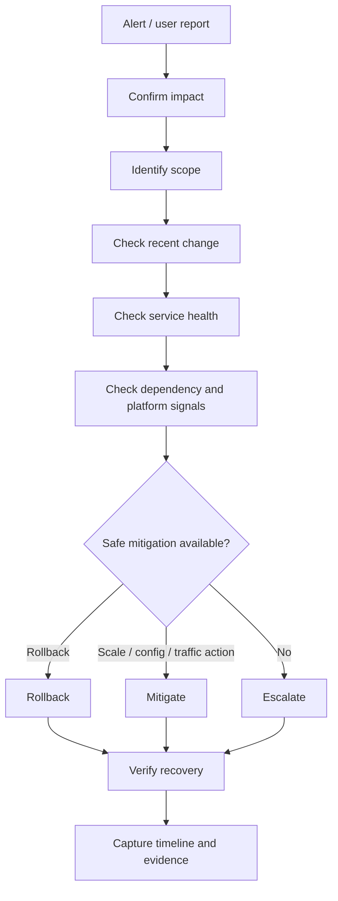
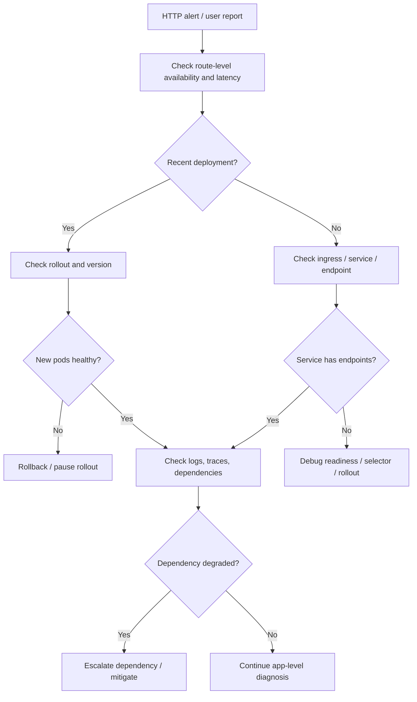
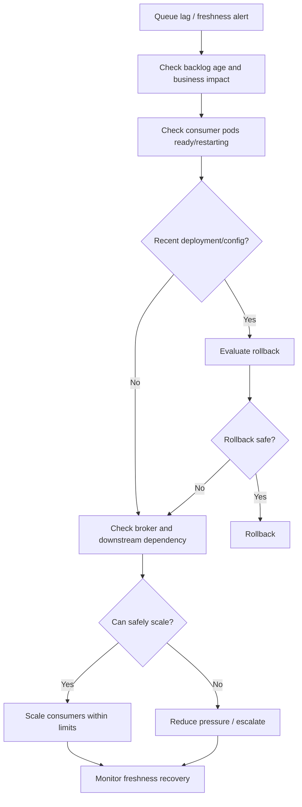
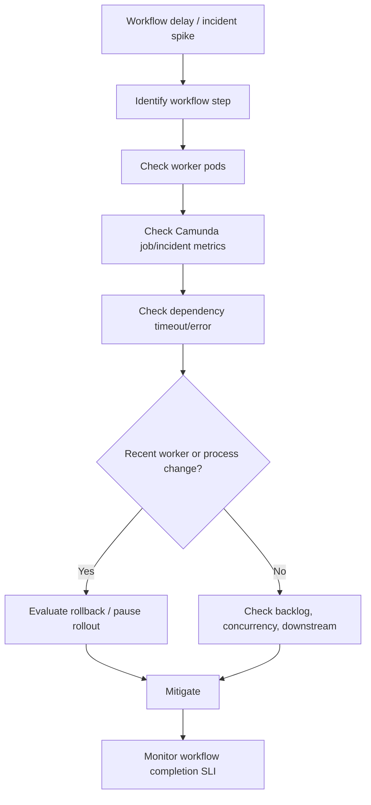

# Part 066 — Incident Triage Workflow

## Tujuan

Incident triage adalah proses cepat untuk menjawab:

- apa yang rusak?
- siapa yang terdampak?
- seberapa luas dampaknya?
- apakah ada recent change?
- apakah masalah ada di aplikasi, Kubernetes runtime, dependency, network, identity, atau platform?
- mitigasi aman apa yang bisa dilakukan sekarang?
- apakah harus rollback?
- kapan harus eskalasi?
- evidence apa yang harus disimpan?

Part ini membahas workflow triage untuk Kubernetes backend services, terutama Java/JAX-RS API, Kafka/RabbitMQ consumer, Camunda worker, batch job, dan service yang bergantung pada PostgreSQL, Redis, NGINX/Ingress, AWS/Azure services, GitOps, dan observability stack.

---

## 1. Incident Triage Mental Model

Triage bukan root cause analysis lengkap.

Triage adalah menemukan tindakan paling aman untuk mengurangi dampak.



Operational rule:

> During incident, optimize for impact reduction first, root cause certainty second.

Do not spend 45 minutes proving root cause while customers are blocked and rollback is safe.

---

## 2. Backend Engineer Role During Incident

Backend engineer is usually responsible for:

- understanding service behavior
- interpreting application logs
- identifying recent application changes
- validating route-level impact
- checking dependency calls from application perspective
- checking DB pool/thread pool/JVM health
- assessing rollback safety
- applying or requesting application rollback
- explaining business workflow impact
- updating service runbook

Backend engineer should avoid unsafe platform-level actions unless explicitly authorized.

Examples of actions that may require platform/SRE approval:

- deleting nodes
- changing CNI/network policy globally
- modifying ingress controller config globally
- changing cluster autoscaler behavior
- editing shared namespace policy
- changing shared secret operator config
- touching managed database/broker infrastructure

---

## 3. First Five Minutes

In the first five minutes, answer only the most important questions.

| Question | Why it matters |
|---|---|
| Is this production? | Avoid unnecessary panic or wrong environment action |
| What service/workflow is affected? | Establish owner and scope |
| Is user/business impact confirmed? | Decide severity |
| Is there a recent deployment/config change? | Fast rollback candidate |
| Is the service currently getting worse? | Escalate urgency |
| Is there an obvious safe mitigation? | Reduce impact quickly |

Do not start by reading every log line.
Start with scope and impact.

---

## 4. Confirm the Alert

An alert may be true, stale, duplicate, or misleading.

Confirm:

- alert name
- service
- namespace
- cluster
- environment
- severity
- start time
- current state
- affected route/topic/queue/workflow
- linked dashboard
- linked runbook
- related alerts

If alert lacks these fields, improve it after the incident.

Bad first move:

```text
kubectl logs random-pod | grep Exception
```

Better first move:

```text
Open service dashboard, confirm SLO/error/latency impact, check deployment marker, then inspect targeted pods.
```

---

## 5. Impact Assessment

Impact assessment decides severity.

Check:

- customer-facing or internal-only?
- one route or many routes?
- one tenant/customer or global?
- one region/cluster/namespace or all?
- synchronous API failure or async delay?
- quote/order/billing workflow affected?
- read-only degraded or write path blocked?
- data correctness risk or only availability?
- security/privacy exposure?

Example severity reasoning:

| Symptom | Likely severity |
|---|---|
| All quote submissions fail | High/Critical |
| One non-critical admin endpoint slow | Medium/Low |
| Kafka lag growing for billing handoff | High if freshness SLO threatened |
| One replica crash-looping but service healthy | Medium/Low unless capacity risk |
| Secret leakage suspected | Security incident, escalate immediately |

Severity should be based on impact, not technical aesthetics.

---

## 6. Scope Assessment

Scope narrows the search space.

Dimensions:

- service
- namespace
- cluster
- region
- tenant/customer segment
- endpoint/route
- workflow step
- dependency
- version
- node pool
- availability zone
- ingress host/path
- consumer group
- queue

Useful question:

> What is common among all failing requests or workloads?

Commonality drives hypothesis.

---

## 7. Recent Change Check

Most production incidents correlate with change.

Check recent changes in:

- application deployment
- image tag/digest
- ConfigMap
- Secret
- Helm values
- Kustomize overlay
- GitOps sync
- database migration
- feature flag
- ingress rule
- NetworkPolicy
- RBAC/ServiceAccount
- cloud IAM/workload identity
- dependency configuration
- node/cluster upgrade
- certificate rotation

Recent change does not prove root cause, but it is usually the fastest mitigation path.

---

## 8. Deployment Marker Check

Every serious service dashboard should show deployment markers.

Look for correlation:

```text
error spike starts at 10:04
quote-api v2026.07.12-abc123 deployed at 10:02
```

This strongly suggests rollback evaluation.

Also check:

- canary promotion time
- GitOps sync time
- Helm release time
- migration job start/end time
- config/secret rotation time
- HPA scale event
- node drain/upgrade event

---

## 9. Kubernetes Workload Health Check

Targeted workload check:

```bash
kubectl -n <namespace> get deploy <deployment>
kubectl -n <namespace> rollout status deploy/<deployment>
kubectl -n <namespace> get rs -l app.kubernetes.io/name=<service>
kubectl -n <namespace> get pods -l app.kubernetes.io/name=<service> -o wide
kubectl -n <namespace> describe pod <pod>
kubectl -n <namespace> get events --sort-by=.lastTimestamp
```

Look for:

- unavailable replicas
- new ReplicaSet not ready
- old ReplicaSet scaled down too early
- CrashLoopBackOff
- ImagePullBackOff
- OOMKilled
- readiness failure
- liveness restart
- Pending pods
- FailedScheduling
- FailedMount
- node pressure

Do not delete pods as first response unless runbook explicitly says it is safe.

---

## 10. Traffic Path Check

For HTTP/API incidents, follow the path:

```text
client -> DNS -> load balancer -> ingress/controller/API gateway -> Service -> EndpointSlice -> Pod -> JAX-RS endpoint -> dependency
```

Check:

- DNS resolves expected host
- load balancer target health
- ingress rule matches host/path
- TLS certificate valid
- ingress controller returns 502/503/504?
- service has endpoints?
- pods are ready?
- app receives requests?
- trace reaches dependency?

A 503 from ingress often means no healthy backend.
A 504 often means upstream timeout.
A 502 often means protocol/backend connection issue.

But verify with local platform behavior.

---

## 11. Service and Endpoint Check

Safe commands:

```bash
kubectl -n <namespace> get svc <service> -o wide
kubectl -n <namespace> describe svc <service>
kubectl -n <namespace> get endpointslice -l kubernetes.io/service-name=<service>
kubectl -n <namespace> get pods --show-labels
```

Look for:

- wrong selector
- label mismatch
- no ready endpoints
- wrong targetPort
- named port mismatch
- pods not ready
- namespace mismatch
- rollout changed labels

If Service has no endpoint, debugging ingress alone wastes time.

---

## 12. Logs Check

Use logs after scope is clear.

```bash
kubectl -n <namespace> logs deploy/<deployment> --since=15m
kubectl -n <namespace> logs <pod> --previous
kubectl -n <namespace> logs <pod> -c <container> --since=15m
```

Look for:

- startup failure
- missing config
- missing secret
- DB connection failure
- broker connection failure
- timeout spike
- rejected requests
- unhandled exception
- JVM crash
- OOM evidence
- permission denied
- TLS handshake failure

Use correlation ID or trace ID when available.

Avoid dumping sensitive logs into chat channels.

---

## 13. Metrics Check

Check symptom metrics first:

- availability
- error rate
- latency p95/p99
- request rate
- workflow completion
- queue freshness
- consumer lag
- DLQ growth

Then check supporting metrics:

- pod readiness
- restart count
- CPU usage
- CPU throttling
- memory usage
- JVM heap
- GC pause
- DB pool saturation
- HTTP client pool
- HPA status
- node pressure

Do not conclude root cause from CPU/memory alone.
High CPU can be cause, symptom, or normal during traffic spike.

---

## 14. Trace Check

For distributed service failures, traces can answer:

- where latency is spent
- which dependency fails
- whether request reaches service
- whether ingress/gateway is included
- whether Kafka/RabbitMQ propagation is intact
- whether database span dominates latency
- whether retry multiplies calls

Look for:

- missing spans
- high dependency latency
- timeout span
- repeated retries
- changed route behavior after deployment
- error tag on specific service

If traces disappear during incident, instrumentation may be broken or sampling may be too low.

---

## 15. Dependency Check

Check dependencies from application point of view.

PostgreSQL:

- connection pool saturation
- connection timeout
- query latency
- lock wait
- transaction failure
- migration running

Kafka:

- broker connectivity
- produce failure
- consumer lag
- rebalance
- offset commit failure
- DLQ growth

RabbitMQ:

- queue depth
- unacked messages
- redelivery
- connection/channel failure
- DLQ growth

Redis:

- timeout
- memory pressure
- eviction
- connection pool saturation
- cluster failover

Camunda:

- job activation
- incidents
- worker backlog
- workflow timeout
- process correlation failure

Cloud services:

- IAM denied
- SDK timeout
- quota/rate limit
- private endpoint/DNS failure

---

## 16. Config and Secret Check

Many incidents are caused by config or secret drift.

Check:

- ConfigMap version
- Secret version
- rendered manifest
- pod environment
- mounted file path
- restart time after config change
- external secret sync status
- secret rotation time
- GitOps drift
- Helm/Kustomize overlay

Safe principle:

> Verify existence and metadata first. Do not expose secret values.

Do not paste secret values into tickets or incident channels.

---

## 17. Identity and Permission Check

Access denied can happen at multiple layers.

Kubernetes RBAC:

```bash
kubectl auth can-i get secrets -n <namespace> --as=system:serviceaccount:<namespace>:<serviceaccount>
```

Cloud IAM:

- IRSA role trust policy
- Azure Workload Identity federated credential
- projected token
- SDK credential chain
- KMS/Key Vault permissions
- cloud audit logs

Application-level auth:

- token audience
- issuer
- cert/truststore
- client credentials
- service-to-service auth

Do not treat all `403` or `AccessDenied` as the same class of failure.

---

## 18. Network Check

Network-related incidents often appear as timeout.

Check:

- NetworkPolicy
- DNS egress
- database egress
- broker egress
- cloud service egress
- NAT/proxy path
- NO_PROXY
- firewall allowlist
- private endpoint
- service mesh policy if used
- TLS/SNI mismatch

Symptoms:

| Symptom | Possible layer |
|---|---|
| DNS lookup timeout | CoreDNS, NetworkPolicy, resolver, private DNS |
| Connection timeout | NetworkPolicy, firewall, route, endpoint down |
| Connection refused | Service listening issue, wrong port, backend unavailable |
| TLS handshake failure | cert, truststore, SNI, protocol mismatch |
| 403 from cloud API | IAM/workload identity, not network |

---

## 19. Mitigation Options

Mitigation should reduce impact without creating larger risk.

Common options:

- rollback application version
- pause rollout
- scale replicas if dependency capacity allows
- disable feature flag
- route traffic away from bad version
- increase timeout only if safe and justified
- reduce consumer concurrency if dependency overloaded
- temporarily suspend a bad CronJob
- restore previous config
- rotate/fix secret through approved path
- fail open/fail closed according to security/business rule
- escalate to platform/SRE/security/dependency owner

Mitigation is not always fixing root cause.

It is stabilizing production.

---

## 20. Rollback Decision

Rollback is appropriate when:

- recent deployment strongly correlates with symptoms
- error/latency/SLO burn is significant
- previous version is known good
- database migration is backward-compatible
- config/secret is rollback-safe
- no fast safe forward fix exists
- blast radius is growing

Rollback may be unsafe when:

- schema migration is not backward-compatible
- external side effects changed format
- event schema changed incompatibly
- cache format changed incompatibly
- data migration already mutated state irreversibly
- rollback procedure is untested

When rollback is unsafe, escalate quickly and choose controlled mitigation.

---

## 21. Scale-Out Decision

Scaling is useful only if the bottleneck is workload capacity.

Scale out may help when:

- pods are CPU saturated without dependency saturation
- request concurrency exceeds pod capacity
- queue backlog grows and dependency can absorb more workers
- enough node capacity exists
- HPA is too conservative

Scale out may hurt when:

- DB connection pool is already saturated
- Kafka partition count limits parallelism
- RabbitMQ prefetch/unacked behavior worsens
- downstream API rate limit is hit
- Redis is overloaded
- cluster lacks node capacity
- startup storm increases load

Before manual scaling, check dependency capacity.

---

## 22. Communication Workflow

Incident communication should be short, factual, and updated.

Initial update:

```text
We are investigating elevated 5xx on quote-api POST /quotes/{id}/submit in production starting 10:04. Current suspected scope: submit path only. Recent deployment at 10:02 is being checked. Next update in incident channel.
```

Mitigation update:

```text
Rollback to previous quote-api version started at 10:18 after confirming error spike correlates with deployment v2026.07.12-abc123. Monitoring error rate and latency recovery.
```

Recovery update:

```text
5xx rate has returned to baseline after rollback. Workflow completion lag is still being monitored for delayed requests. RCA follow-up will capture root cause and corrective actions.
```

Avoid speculation disguised as certainty.

---

## 23. Evidence Capture

Capture evidence before it disappears.

Evidence:

- alert start/end time
- dashboard screenshots or links
- deployment marker
- image tag/digest
- Git commit
- GitOps sync event
- Kubernetes events
- relevant logs with timestamps
- trace examples
- HPA events
- rollout history
- config/secret change metadata
- dependency dashboard snapshot
- mitigation command/change
- recovery time
- customer/business impact

Avoid capturing sensitive payloads or secret values.

---

## 24. Timeline Template

Use precise timestamps.

```text
10:02 deployment v2026.07.12-abc123 synced by GitOps
10:04 alert: quote-api high 5xx ratio fired
10:06 on-call acknowledged
10:08 impact confirmed: POST /quotes/{id}/submit failing globally
10:10 recent deployment identified as suspected trigger
10:15 rollback approved
10:18 rollback initiated
10:23 ready replicas restored to previous version
10:27 5xx returned to baseline
10:35 workflow lag recovered
10:45 incident mitigated
```

Timeline should separate fact from hypothesis.

---

## 25. Escalation Boundaries

Escalate to platform/SRE when:

- node pressure or node not ready
- cluster autoscaler failure
- ingress controller/global gateway issue
- CNI/networking issue
- DNS platform issue
- storage CSI issue
- GitOps controller issue
- control plane/API server issue
- cluster upgrade side effect

Escalate to security when:

- secret leakage suspected
- unauthorized access suspected
- RBAC/IAM policy change needed urgently
- certificate/private key compromise
- audit/compliance evidence required
- suspicious traffic or abuse

Escalate to dependency owner when:

- PostgreSQL degraded
- Kafka/RabbitMQ degraded
- Redis degraded
- Camunda engine degraded
- external/cloud service degraded
- downstream API rate limit or outage

---

## 26. Production-Safe Command Discipline

Prefer read-only commands first:

```bash
kubectl get
kubectl describe
kubectl logs
kubectl top
kubectl rollout status
kubectl auth can-i
kubectl diff
```

Be careful with:

```bash
kubectl exec
kubectl port-forward
kubectl debug
kubectl scale
kubectl rollout undo
kubectl delete pod
kubectl apply
kubectl patch
```

Danger depends on environment and policy.

In production, any state-changing action should be approved or covered by runbook.

---

## 27. Incident Triage Flow for HTTP API



---

## 28. Incident Triage Flow for Consumer Backlog



---

## 29. Incident Triage Flow for Workflow Delay



---

## 30. Common Triage Mistakes

| Mistake | Consequence | Better approach |
|---|---|---|
| Start with random logs | Slow and noisy | Start with impact/scope/recent change |
| Delete pods immediately | Can hide evidence or worsen load | Inspect events/logs first |
| Scale blindly | Can overload dependencies | Check bottleneck and capacity |
| Ignore deployment marker | Miss fast rollback | Check recent changes early |
| Debug ingress only | Miss no endpoint/readiness issue | Follow traffic path |
| Treat all 5xx same | Wrong owner/mitigation | Separate 500/502/503/504 patterns |
| Paste secrets/log payloads | Security risk | Redact and follow evidence policy |
| Wait for perfect RCA | Longer customer impact | Mitigate first when safe |
| No timeline | Poor RCA | Record timestamped facts |
| No runbook update | Repeat incident | Capture corrective action |

---

## 31. Internal Verification Checklist

Verify internally before incident:

- incident severity model
- on-call ownership
- incident commander role if used
- backend/platform/SRE/security escalation path
- incident communication channel
- alert routing
- service dashboard
- dependency dashboard
- Kubernetes dashboard
- deployment marker
- GitOps sync visibility
- rollback authority
- rollback procedure
- production access policy
- break-glass process
- safe command policy
- evidence retention policy
- sensitive data handling rule
- RCA template
- corrective action tracking
- post-incident review cadence
- customer communication ownership
- security incident handoff

---

## 32. Production Incident Checklist

During incident:

- [ ] Confirm environment is production or critical environment.
- [ ] Confirm alert is current.
- [ ] Identify affected service/workflow.
- [ ] Assess user/business impact.
- [ ] Determine severity.
- [ ] Check recent deployment/config/secret/migration.
- [ ] Open service dashboard.
- [ ] Check Kubernetes workload health.
- [ ] Check ingress/service/EndpointSlice if HTTP path is affected.
- [ ] Check logs with targeted scope.
- [ ] Check metrics and traces.
- [ ] Check dependencies.
- [ ] Decide mitigation.
- [ ] Rollback if safe and justified.
- [ ] Escalate if outside backend ownership.
- [ ] Communicate factual updates.
- [ ] Capture timeline and evidence.
- [ ] Verify recovery against SLO/SLI.
- [ ] Create follow-up actions.

---

## 33. Mitigation Safety Checklist

Before applying mitigation:

- [ ] What exact impact will this reduce?
- [ ] What is the blast radius?
- [ ] Is this action reversible?
- [ ] Is approval required?
- [ ] Is this covered by runbook?
- [ ] Could it overload a dependency?
- [ ] Could it corrupt data?
- [ ] Could it hide evidence?
- [ ] Could it violate security policy?
- [ ] How will recovery be verified?
- [ ] Who needs to be informed?

Operational maturity is not acting slowly.
It is acting safely and decisively.

---

## 34. Key Takeaways

- Triage exists to reduce impact quickly, not to produce perfect RCA immediately.
- Start with impact, scope, and recent change.
- Use SLO and business workflow health to determine severity.
- Deployment markers are one of the fastest clues during incidents.
- Follow traffic path for HTTP failures and processing path for consumer/workflow failures.
- Check Kubernetes health, but do not stop there.
- Rollback is often the safest mitigation when recent change clearly correlates and rollback is compatible.
- Scaling is safe only when workload capacity is the bottleneck and dependencies can absorb it.
- Capture evidence before it disappears.
- Escalate early when the suspected layer is platform, security, cloud, or shared dependency.
