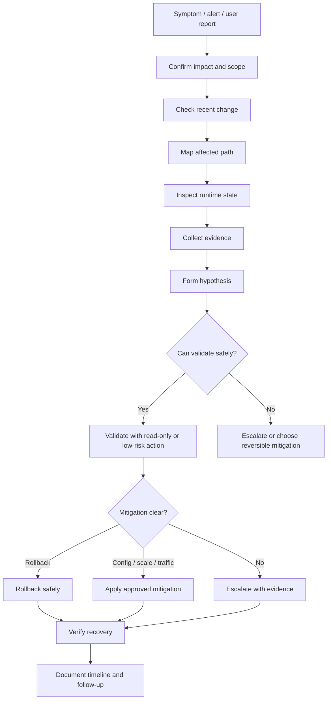
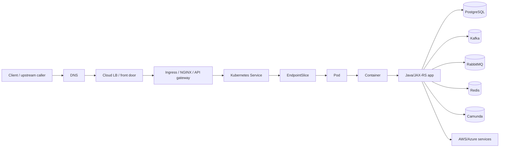
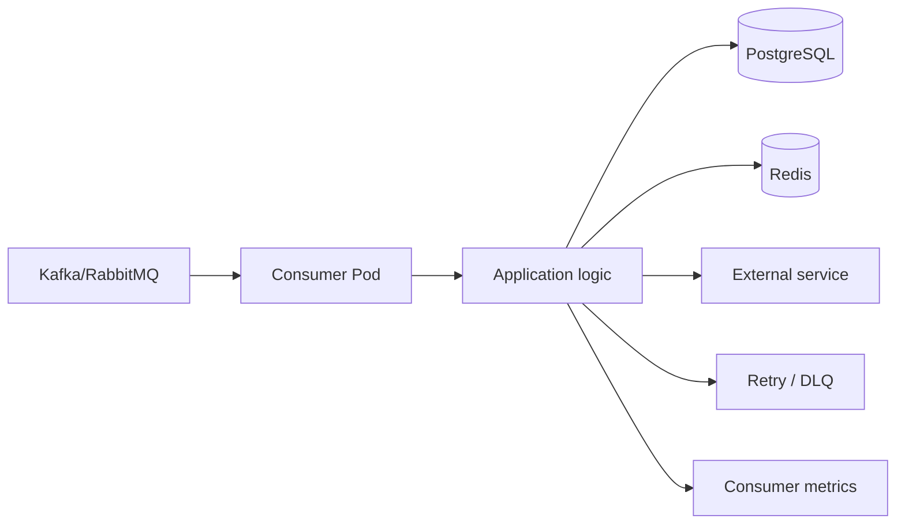
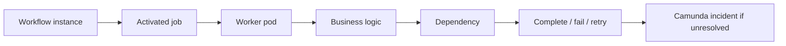

# Part 067 — Production Debugging Methodology

## Tujuan

Production debugging di Kubernetes bukan aktivitas mencari error log paling menarik.

Production debugging adalah proses mengubah **symptom yang ambigu** menjadi **hipotesis yang bisa divalidasi secara aman**, lalu memilih mitigasi yang mengurangi dampak tanpa memperbesar blast radius.

Part ini membahas metodologi debugging untuk backend engineer yang mengoperasikan Java/JAX-RS service, Kafka/RabbitMQ consumer, Camunda worker, batch job, dan workload enterprise yang bergantung pada PostgreSQL, Redis, NGINX/Ingress, AWS/Azure services, GitOps, dan observability stack.

Fokusnya:

- mulai dari symptom, bukan asumsi
- menentukan affected service dan blast radius
- mengecek recent change
- membaca Kubernetes state secara sistematis
- menggabungkan logs, metrics, traces, events
- menguji hipotesis secara production-safe
- memilih mitigation atau rollback
- tahu kapan eskalasi ke platform/SRE/security

---

## 1. Production Debugging Mental Model

Debugging production berbeda dari debugging lokal.

Di lokal, tujuan utama biasanya menemukan root cause.

Di production, urutannya adalah:

1. konfirmasi dampak
2. kurangi dampak jika memungkinkan
3. kumpulkan evidence
4. validasi hipotesis
5. lakukan mitigasi aman
6. verifikasi recovery
7. baru lakukan RCA mendalam



Core rule:

> Jangan mulai dari command. Mulai dari pertanyaan operasional.

---

## 2. Debugging Starts with Symptom Classification

Symptom harus diklasifikasikan sebelum masuk ke pod.

| Symptom | Kemungkinan layer awal |
|---|---|
| Semua request 503 | Ingress, Service, EndpointSlice, readiness, rollout |
| Hanya satu endpoint lambat | Application code, DB query, dependency, thread pool |
| Consumer lag naik | Kafka/RabbitMQ, consumer capacity, dependency downstream, rebalance |
| Pod restart terus | CrashLoopBackOff, OOM, bad config, probe, startup failure |
| Pod Pending | Scheduling, resource request, quota, node pool, PVC |
| Access denied ke cloud service | ServiceAccount, RBAC, IRSA, Azure Workload Identity, IAM |
| DNS timeout | CoreDNS, network policy, private DNS, resolver config |
| Error naik setelah deployment | Bad release, config drift, schema mismatch, dependency compatibility |

Symptom yang sama bisa punya root cause berbeda.

Contoh:

- 504 bisa karena backend lambat, NGINX timeout terlalu pendek, DB lock, thread pool saturated, DNS delay, atau dependency retry storm.
- 503 bisa karena pod tidak ready, Service no endpoint, rollout bad, NetworkPolicy, atau ingress backend mismatch.

---

## 3. Do Not Start with Random Logs

Log penting, tetapi log bukan titik awal terbaik untuk semua incident.

Bad flow:

```text
kubectl logs deploy/order-service | grep Exception
```

Problem:

- tidak jelas impact-nya
- tidak jelas pod mana yang relevan
- tidak jelas time window
- tidak jelas apakah error lama atau baru
- tidak jelas apakah exception adalah symptom atau noise

Better flow:

```text
1. Confirm alert and affected service.
2. Check dashboard for error/latency/restart/deployment marker.
3. Check rollout and pod state.
4. Check ingress/service/EndpointSlice if HTTP path affected.
5. Query logs by service, version, route, correlation ID, and time window.
```

Operational debugging harus evidence-driven.

---

## 4. First Debugging Questions

Sebelum command apa pun, jawab:

- environment mana?
- cluster mana?
- namespace mana?
- service mana?
- workflow bisnis mana?
- kapan mulai terjadi?
- apakah ada recent deployment?
- apakah ada config/secret change?
- apakah hanya versi baru yang bermasalah?
- apakah semua replica terdampak?
- apakah dependency juga bermasalah?
- apakah ada alert terkait dari ingress, node, HPA, database, broker, Redis, atau Camunda?

Jika jawaban ini tidak jelas, debugging akan melebar tanpa arah.

---

## 5. Debugging Layer Map

Gunakan layer map agar tidak lompat-lompat.



Untuk HTTP incident, ikuti path dari kiri ke kanan.

Untuk consumer incident, ikuti processing path:



Untuk workflow incident, ikuti process execution path:



---

## 6. Safe Investigation Principle

Production-safe debugging berarti:

- read-only first
- narrow scope first
- observe before changing
- validate before mitigating
- prefer reversible action
- avoid direct mutation outside approved flow
- do not expose secrets
- do not overload dependencies during investigation
- preserve evidence

Safe commands usually include:

```bash
kubectl config current-context
kubectl get deploy,rs,pod,svc,endpointslice,ingress,hpa,pdb -n <namespace>
kubectl describe deploy/<deployment> -n <namespace>
kubectl describe pod/<pod> -n <namespace>
kubectl logs <pod> -n <namespace> --since=30m
kubectl logs <pod> -n <namespace> --previous
kubectl get events -n <namespace> --sort-by=.lastTimestamp
kubectl rollout status deploy/<deployment> -n <namespace>
kubectl rollout history deploy/<deployment> -n <namespace>
kubectl top pod -n <namespace>
kubectl auth can-i get pods -n <namespace>
```

Potentially risky commands:

```bash
kubectl exec -it <pod> -- sh
kubectl port-forward <pod> 8080:8080
kubectl delete pod <pod>
kubectl scale deploy/<deployment> --replicas=<n>
kubectl rollout restart deploy/<deployment>
kubectl edit deploy/<deployment>
kubectl patch ...
```

These may be allowed in some teams, but they require internal rules.

---

## 7. Confirm the Environment and Context

Before touching production:

```bash
kubectl config current-context
kubectl config get-contexts
kubectl get ns
```

Then confirm namespace:

```bash
kubectl get deploy -n <namespace>
```

Do not rely on default namespace.

Operational failure pattern:

```text
Engineer checks staging namespace, sees healthy pods, concludes production service is fine.
```

Guardrail:

```bash
kubectl config set-context --current --namespace=<namespace>
```

Use this only if your team permits context mutation. Otherwise pass `-n` explicitly.

---

## 8. Identify the Affected Workload

Start from service inventory or alert labels.

Look for:

- `app.kubernetes.io/name`
- `app.kubernetes.io/instance`
- `app.kubernetes.io/version`
- team label
- environment label
- deployment revision
- Git commit annotation
- release marker

Useful commands:

```bash
kubectl get deploy -n <namespace> --show-labels
kubectl get pod -n <namespace> -l app.kubernetes.io/name=<service> --show-labels
kubectl get svc -n <namespace> -l app.kubernetes.io/name=<service>
kubectl get ingress -n <namespace> -l app.kubernetes.io/name=<service>
```

If labels are inconsistent, debugging becomes slower.

That is not just metadata hygiene. It is operational capability.

---

## 9. Check Recent Changes First

Recent change is the fastest hypothesis generator.

Check:

- deployment marker
- GitOps sync time
- CI/CD deployment time
- image tag/digest
- ConfigMap revision
- Secret version
- Helm values change
- Kustomize overlay change
- migration job
- ingress annotation change
- NetworkPolicy change
- RBAC/ServiceAccount change
- HPA/PDB/resource change
- platform maintenance window

Commands:

```bash
kubectl rollout history deploy/<deployment> -n <namespace>
kubectl describe deploy/<deployment> -n <namespace>
kubectl get rs -n <namespace> -l app.kubernetes.io/name=<service>
kubectl get events -n <namespace> --sort-by=.lastTimestamp
```

GitOps check depends on internal tooling:

```text
Internal verification checklist:
- Argo CD or Flux application status
- last sync time
- synced commit SHA
- health status
- diff/out-of-sync state
- manual change detection
```

---

## 10. Check Deployment and Rollout State

For Deployment-backed services:

```bash
kubectl get deploy <deployment> -n <namespace>
kubectl rollout status deploy/<deployment> -n <namespace>
kubectl get rs -n <namespace> -l app.kubernetes.io/name=<service>
kubectl get pod -n <namespace> -l app.kubernetes.io/name=<service> -o wide
```

Interpretation:

| Signal | Meaning |
|---|---|
| updated replicas low | new ReplicaSet not progressing |
| ready replicas low | pods created but not ready |
| available replicas low | service capacity degraded |
| old ReplicaSet still active | rollout not complete or paused |
| ProgressDeadlineExceeded | rollout stuck long enough to fail progress condition |

Rollout issue is common after:

- image change
- config change
- secret rotation
- resource change
- probe change
- dependency timeout change
- migration change

---

## 11. Check Pod State

Useful command:

```bash
kubectl get pod -n <namespace> -l app.kubernetes.io/name=<service> -o wide
```

Look for:

- `Running` but not ready
- `CrashLoopBackOff`
- `ImagePullBackOff`
- `Pending`
- restart count increasing
- uneven pod distribution
- pods stuck on specific node
- pods using mixed versions
- age mismatch with incident start time

Then describe targeted pod:

```bash
kubectl describe pod/<pod> -n <namespace>
```

Important fields:

- node
- QoS class
- requests/limits
- environment references
- mounts
- conditions
- events
- last state
- restart reason
- exit code
- probe failure messages

---

## 12. Check Kubernetes Events

Events often give faster signal than logs.

```bash
kubectl get events -n <namespace> --sort-by=.lastTimestamp
```

Important event reasons:

| Event | Common meaning |
|---|---|
| FailedScheduling | resource/affinity/taint/quota/PVC issue |
| FailedMount | Secret/ConfigMap/PVC/CSI issue |
| BackOff | restart or image pull backoff |
| Unhealthy | readiness/liveness/startup probe failed |
| Killing | container killed due to probe, rollout, eviction, or termination |
| Pulled / Pulling | image pull progress |
| Created / Started | container lifecycle progress |

Events are time-sensitive. Capture them early.

---

## 13. Check Service and EndpointSlice

If HTTP path is broken:

```bash
kubectl get svc -n <namespace> <service>
kubectl describe svc/<service> -n <namespace>
kubectl get endpointslice -n <namespace> -l kubernetes.io/service-name=<service>
```

Common findings:

- Service selector does not match pod labels
- pods are not ready, so endpoints are absent
- targetPort is wrong
- named port mismatch
- wrong namespace
- service points to old label convention
- rollout introduced label drift

If Service has no endpoints, ingress will often return 503.

---

## 14. Check Ingress and Edge Routing

For ingress issue:

```bash
kubectl get ingress -n <namespace>
kubectl describe ingress/<ingress> -n <namespace>
```

Check:

- host
- path
- path type
- rewrite annotation
- backend service
- backend port
- TLS secret
- IngressClass
- controller events
- timeout annotations
- protocol annotations

Typical symptoms:

| Symptom | Possible cause |
|---|---|
| 404 | host/path mismatch or wrong ingress controller |
| 502 | backend protocol/TLS mismatch, upstream reset, backend unavailable |
| 503 | no endpoint, service unavailable, readiness failure |
| 504 | timeout chain, slow backend, dependency latency |

Backend engineer should inspect ingress config, but global controller changes are usually platform/SRE responsibility.

---

## 15. Check Logs with Scope

Logs should be queried by:

- service
- namespace
- pod/version
- time window
- route/topic/workflow
- correlation ID
- trace ID
- error class
- deployment marker

Commands:

```bash
kubectl logs deploy/<deployment> -n <namespace> --since=30m
kubectl logs <pod> -n <namespace> --previous
kubectl logs <pod> -n <namespace> -c <container> --since=30m
```

Avoid:

```bash
kubectl logs --tail=-1
```

on high-volume production pods unless approved. It can be noisy and expensive through centralized logging systems.

Look for:

- startup failure
- missing env/config
- authentication failure
- DB connection failure
- broker connection failure
- Redis timeout
- serialization error
- classpath error
- schema mismatch
- thread pool rejection
- connection pool exhaustion
- repeated retry loop

---

## 16. Check Metrics Before Deep Log Reading

Metrics answer whether the system is healthy or merely noisy.

Service metrics:

- request rate
- error rate
- latency p50/p95/p99
- saturation
- route-level errors
- dependency latency
- retry rate

Kubernetes metrics:

- ready replicas
- restart count
- CPU usage
- CPU throttling
- memory usage
- OOMKilled count
- network I/O
- pod readiness
- HPA current/desired replicas
- node pressure

Java metrics:

- heap usage
- non-heap usage
- GC pause
- thread count
- blocked threads
- DB pool active/idle/pending
- HTTP client pool
- request queue

Consumer metrics:

- Kafka consumer lag
- RabbitMQ queue depth
- unacked messages
- DLQ rate
- processing duration
- retry count
- rebalance count

---

## 17. Check Traces for End-to-End Failures

Traces help answer:

- which dependency is slow?
- where does the request spend time?
- which span returns error?
- is propagation broken?
- did ingress receive the request?
- did service call DB/broker/external API?

Trace-based debugging flow:

```text
Find affected route → sample failed trace → compare with healthy trace → identify longest/error span → correlate with logs and metrics.
```

For async flows, verify propagation through:

- HTTP headers
- Kafka headers
- RabbitMQ message headers
- workflow correlation IDs
- job/business IDs

If traces are missing, that itself is an observability gap.

---

## 18. Check Dependencies from the Application Perspective

Do not assume dependency is healthy because its dashboard is green.

From application perspective, check:

- DNS resolution
- network path
- TLS trust
- credential validity
- connection pool availability
- timeout/retry behavior
- dependency rate limit
- dependency saturation
- schema/API compatibility
- tenant-specific access

For PostgreSQL:

- connection pool active/idle/waiting
- query latency
- lock/wait events
- max connection pressure
- migration recently applied
- read/write path impact

For Kafka:

- broker connectivity
- topic existence
- partition count
- consumer lag
- rebalance
- commit failures
- serialization errors

For RabbitMQ:

- queue depth
- unacked messages
- consumer count
- prefetch
- redelivery
- channel errors

For Redis:

- latency
- connection pool
- eviction
- timeout
- keyspace pressure
- cluster/sentinel routing if used

For Camunda:

- worker activation
- incident count
- job timeout
- process correlation
- retry exhaustion

---

## 19. Hypothesis-Driven Debugging

A hypothesis must be specific and testable.

Weak hypothesis:

```text
Kubernetes is broken.
```

Better hypothesis:

```text
The new ReplicaSet is not receiving traffic because the readiness probe is failing, causing the Service EndpointSlice to remain empty and ingress to return 503.
```

Good hypothesis includes:

- affected layer
- specific mechanism
- observable signal
- validation method
- expected outcome

Template:

```text
I think <symptom> is caused by <mechanism> in <layer>, because <evidence>. I will validate by checking <safe signal>. If true, <expected observation>.
```

---

## 20. Validation Without Mutation

Prefer validation using:

- dashboards
- logs
- traces
- events
- object status
- read-only kubectl
- GitOps diff
- CI/CD history
- cloud audit logs

Avoid validation by mutation:

```text
Let me delete pods and see what happens.
```

Deleting pods may mask evidence, trigger more load, cause rebalances, break workflow locks, or hide a memory leak.

If restart is a known mitigation, use the approved runbook and capture evidence first.

---

## 21. When to Use kubectl exec

`kubectl exec` can be useful but is not always safe.

Use cases:

- inspect runtime file mount presence
- verify DNS resolution from pod
- test network connectivity from pod
- inspect process list in non-sensitive way
- check local container filesystem usage

Risks:

- audit/security concern
- accidental mutation
- exposing secrets
- running heavy commands
- changing process state
- relying on tools not present in image

Safer alternatives:

- ephemeral debug container if approved
- dedicated network diagnostic pod
- platform-provided diagnostic tooling
- observability data

Internal verification checklist:

- Is `exec` allowed in production?
- Is it audited?
- Are commands restricted?
- Are secrets visible in env or files?
- Is a debug image approved?

---

## 22. Debugging Java/JAX-RS Services

For Java/JAX-RS API symptoms, inspect:

- route-level error rate
- server thread pool saturation
- request queue
- DB pool exhaustion
- HTTP client pool exhaustion
- GC pause
- heap/non-heap usage
- CPU throttling
- readiness endpoint behavior
- graceful shutdown logs
- dependency timeout/retry
- exception type distribution

Common failure patterns:

| Pattern | Signal |
|---|---|
| DB pool exhausted | request latency rises, pending connection count high |
| CPU throttling | p99 latency spike, throttling metric high, CPU limit present |
| GC pressure | memory high, GC pause high, throughput drops |
| dependency timeout | trace shows long external span, retry rate high |
| wrong config | startup error, route disabled, wrong dependency endpoint |
| schema mismatch | SQL error after deployment/migration |
| bad readiness | pod running but not endpoint-ready |

---

## 23. Debugging Kafka Consumer Workloads

For Kafka consumer symptoms:

- check consumer lag by group/topic/partition
- check replica count vs partition count
- check rebalance frequency
- check pod restarts
- check processing duration
- check downstream dependency latency
- check commit errors
- check poison message behavior
- check retry/DLQ policy
- check HPA/KEDA metric

Important distinction:

```text
Lag rising does not always mean not enough pods.
```

It can mean:

- downstream DB is slow
- poison message causes retry loop
- partition skew
- rebalances from pod restarts
- max replicas exceed useful partition parallelism
- consumer is throttled by CPU or memory
- broker connectivity unstable

---

## 24. Debugging RabbitMQ Consumer Workloads

For RabbitMQ consumer symptoms:

- queue depth
- unacked count
- consumer count
- prefetch
- redelivery rate
- DLQ rate
- channel errors
- connection churn
- pod restart count
- processing duration
- downstream dependency saturation

High unacked may mean:

- processing stuck
- prefetch too high
- consumers overloaded
- downstream dependency slow
- ack not sent due to bug
- shutdown behavior unsafe

High ready queue depth with low unacked may mean:

- not enough consumers
- consumers disconnected
- HPA/KEDA not scaling
- routing/binding issue

---

## 25. Debugging Camunda Worker Workloads

For Camunda workers:

- active job count
- job activation rate
- worker concurrency
- job timeout
- retry count
- incident count
- worker pod restart
- dependency latency
- correlation ID
- process version
- business key or order/quote ID

Do not treat every incident as Kubernetes failure.

Camunda incident may be caused by:

- business validation failure
- dependency failure
- worker unavailable
- timeout too short
- retry exhausted
- process model mismatch
- version compatibility issue

---

## 26. Debugging Batch and Scheduler Workloads

For batch/CronJob symptoms:

- missed schedule
- overlapping runs
- active job stuck
- failed jobs
- backoffLimit exhausted
- activeDeadlineSeconds reached
- partial completion
- lock not released
- duplicate execution
- no failure notification
- old job retained too long

Commands:

```bash
kubectl get cronjob,job,pod -n <namespace>
kubectl describe cronjob/<cronjob> -n <namespace>
kubectl describe job/<job> -n <namespace>
kubectl logs job/<job> -n <namespace>
```

Production-safe question:

```text
If this job is retried, is it idempotent?
```

If not, do not manually rerun without business/data owner approval.

---

## 27. Debugging Config and Secret Issues

Symptoms:

- startup failure
- CrashLoopBackOff
- authentication error
- wrong dependency endpoint
- feature disabled unexpectedly
- pods with different behavior
- issue after secret rotation
- issue only in one environment

Check:

```bash
kubectl describe pod/<pod> -n <namespace>
kubectl get configmap -n <namespace>
kubectl get secret -n <namespace>
```

Do not print secret values.

Internal verification:

- source of config
- GitOps rendered value
- Helm/Kustomize overlay
- external secret sync status
- secret rotation timestamp
- pod restart requirement
- environment-specific override
- safe default behavior

---

## 28. Debugging Identity and Permission Issues

Kubernetes RBAC and cloud IAM are different layers.

Kubernetes authorization issue:

```text
pod/service account cannot access Kubernetes API resource
```

Cloud IAM issue:

```text
pod cannot access AWS/Azure service or secret store
```

Check Kubernetes RBAC:

```bash
kubectl auth can-i get secrets --as=system:serviceaccount:<namespace>:<serviceaccount> -n <namespace>
```

Check workload identity internally:

- EKS IRSA annotation
- IAM role trust policy
- OIDC provider
- STS AssumeRoleWithWebIdentity failure
- AWS SDK credential chain
- Azure Workload Identity annotation/label
- federated credential
- Azure SDK credential chain
- cloud audit logs

Do not fix access denied by granting broad permissions during incident unless explicitly approved.

---

## 29. Debugging Network Issues

Classify network failure:

| Symptom | Possible meaning |
|---|---|
| connection refused | target reachable but no listener or wrong port |
| timeout | route blocked, firewall, NetworkPolicy, dependency down, DNS delay |
| no route to host | network path issue |
| TLS handshake failure | truststore, cert, SNI, protocol mismatch |
| unknown host | DNS issue |
| 403 | auth/authorization or edge policy |
| 429 | rate limit |

Check:

- Service/EndpointSlice
- NetworkPolicy
- DNS
- egress NAT/proxy
- firewall allowlist
- private endpoint
- TLS trust
- cloud security groups/NSG

Backend engineer should gather evidence and escalate to platform/network team if the issue crosses ownership boundary.

---

## 30. Debugging Resource Saturation

Resource saturation can appear as application failure.

Signals:

- CPU throttling
- high CPU usage
- high memory usage
- OOMKilled
- GC pause
- thread pool saturation
- DB pool saturation
- HPA maxed out
- Pending pods
- node pressure
- eviction

Ask:

- is demand higher than usual?
- did resource limit change?
- did replica count change?
- did HPA fail to scale?
- did downstream dependency slow down?
- did rollout increase connection count?
- did a retry storm start?

Do not blindly scale if dependency is already saturated.

---

## 31. Debugging Recent Deployment Failure

If incident started after deployment, compare:

- old image vs new image
- old ConfigMap vs new ConfigMap
- old Secret version vs new Secret version
- old resource limits vs new limits
- old probe config vs new probe config
- old ingress route vs new route
- old NetworkPolicy/RBAC vs new rules
- schema migration time
- feature flags
- dependency version compatibility

Useful evidence:

```bash
kubectl rollout history deploy/<deployment> -n <namespace>
kubectl get rs -n <namespace> -l app.kubernetes.io/name=<service> --show-labels
kubectl describe rs/<replicaset> -n <namespace>
```

Decision rule:

> If a recent change clearly correlates with production degradation and rollback is safe, rollback is often better than continuing diagnosis during active impact.

---

## 32. Rollback Decision During Debugging

Rollback is favored when:

- recent deployment correlates strongly
- error rate/latency impact is significant
- rollback is known safe
- no irreversible migration blocks rollback
- old version was healthy
- config/secret compatibility remains valid
- rollback can be verified quickly

Rollback is risky when:

- schema migration is not backward-compatible
- event/message format changed incompatibly
- cache format changed
- workflow version changed
- external side effect already occurred
- old version cannot read new data

Internal verification checklist:

- rollback authority
- deployment tool path
- GitOps rollback procedure
- migration rollback limitation
- smoke test
- deployment marker
- post-rollback monitoring

---

## 33. Escalation Decision

Escalate early when:

- suspected cluster/network/CNI issue
- node pressure affects multiple services
- ingress controller shared issue
- DNS/CoreDNS issue affects multiple namespaces
- cloud IAM/secret operator issue
- security/privacy concern
- database/broker managed service issue
- cluster autoscaler/node pool failure
- production access insufficient
- mitigation requires high-risk change

Escalation should include evidence:

```text
Service:
Namespace:
Cluster/environment:
Start time:
Impact:
Recent change:
Observed Kubernetes state:
Observed app signals:
Dependency signals:
Hypothesis:
Actions taken:
Request from platform/SRE/security:
```

Do not escalate with only:

```text
Kubernetes seems broken.
```

---

## 34. Debugging Anti-Patterns

Avoid:

- starting with random logs
- deleting pods before evidence capture
- scaling without dependency capacity check
- widening permissions to fix access denied
- editing live manifest outside GitOps
- assuming readiness endpoint means business health
- assuming green pod means healthy service
- ignoring deployment marker
- ignoring queue lag because API is healthy
- ignoring node pressure because pod is Running
- using production `exec` without policy
- exposing secret values in screenshots/logs
- chasing root cause while rollback is safe and impact is active

---

## 35. Production Debugging Flow by Symptom

### HTTP 5xx Spike

```text
Confirm route impact
→ check deployment marker
→ check ingress status/logs
→ check service endpoints
→ check pod readiness/restarts
→ check app logs/traces
→ check dependency latency/errors
→ rollback or mitigate
```

### Latency Spike

```text
Confirm p95/p99 route impact
→ check traffic volume
→ check CPU throttling/GC/thread pool
→ check DB/HTTP dependency spans
→ check ingress timeout
→ check retry storm
→ mitigate or rollback
```

### Consumer Lag

```text
Confirm group/topic lag
→ check pod restarts/rebalances
→ check processing duration
→ check downstream DB/cache/API
→ check replica vs partition count
→ check KEDA/HPA
→ scale only if dependency capacity allows
```

### CrashLoopBackOff

```text
Check pod last state
→ previous logs
→ events
→ config/secret mounts
→ exit code
→ JVM startup/OOM/probe
→ recent deployment
→ rollback/config fix/escalate
```

### Pod Pending

```text
Check events
→ resource request/quota
→ node selector/affinity/taint
→ PVC
→ node pool capacity
→ cluster autoscaler
→ platform escalation if capacity/platform issue
```

---

## 36. Evidence Capture

Capture evidence before it disappears.

Useful evidence:

- alert firing time
- dashboard screenshot or link
- deployment marker
- Git commit SHA
- rollout history
- pod status
- pod events
- previous logs
- trace IDs
- correlation IDs
- HPA events
- ingress errors
- dependency dashboard
- mitigation actions
- recovery time

Do not capture:

- secret values
- customer PII beyond approved incident handling
- raw tokens
- private keys
- sensitive payloads unless approved and redacted

---

## 37. Internal Verification Checklist

Verify internally:

- production access policy
- safe kubectl command policy
- namespace and service ownership
- service catalog
- dashboard entry points
- alert runbooks
- logging platform and retention
- trace platform and sampling
- deployment marker convention
- GitOps/CI/CD rollback procedure
- incident severity model
- escalation matrix
- platform/SRE/security handoff process
- evidence retention policy
- sensitive data handling policy
- post-incident RCA template

---

## 38. Production Debugging Checklist

During debugging:

- [ ] Confirm environment/context/namespace.
- [ ] Confirm affected service/workflow.
- [ ] Confirm impact and severity.
- [ ] Identify start time.
- [ ] Check recent deployment/config/secret/migration.
- [ ] Open service dashboard.
- [ ] Check Kubernetes deployment/pod status.
- [ ] Check events.
- [ ] Check Service/EndpointSlice for HTTP failures.
- [ ] Check Ingress/gateway for edge failures.
- [ ] Query logs with scoped time window.
- [ ] Check metrics for saturation.
- [ ] Check traces for dependency latency/error.
- [ ] Check dependency health from application perspective.
- [ ] Form explicit hypothesis.
- [ ] Validate safely.
- [ ] Decide rollback/mitigation/escalation.
- [ ] Capture evidence.
- [ ] Verify recovery.
- [ ] Update runbook or checklist after incident.

---

## 39. Key Takeaways

- Production debugging starts from impact, not logs.
- Kubernetes state must be read through desired state vs actual state.
- Recent change is often the fastest path to mitigation.
- Logs, metrics, traces, and events answer different questions.
- Good debugging is hypothesis-driven and production-safe.
- Rollback is a mitigation decision, not an admission of failure.
- Scaling can make incidents worse if dependency capacity is the real bottleneck.
- Backend engineers need enough Kubernetes skill to gather evidence, validate application-layer hypotheses, and escalate precisely.
- The goal is not to prove root cause immediately; the goal is to reduce impact safely and preserve evidence for RCA.
