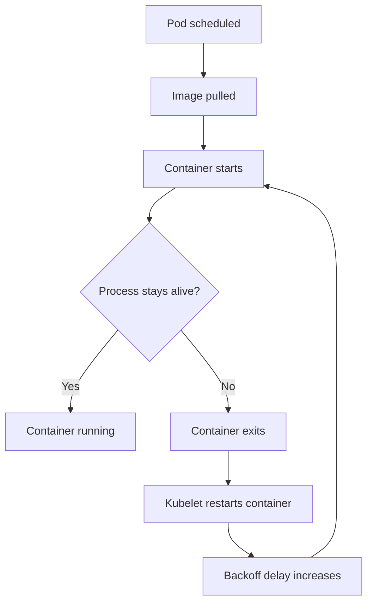
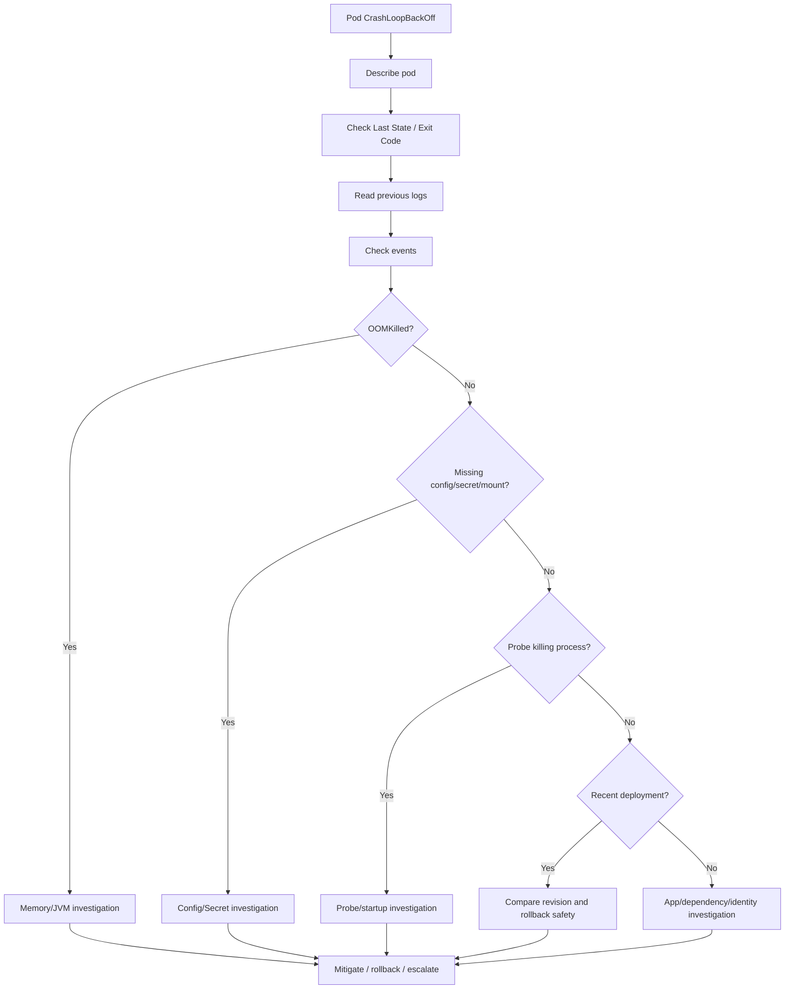
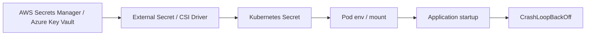

# Part 068 — Common Failure: CrashLoopBackOff

## Tujuan

`CrashLoopBackOff` adalah salah satu failure mode Kubernetes yang paling sering terlihat, tetapi sering disalahpahami.

`CrashLoopBackOff` bukan root cause.

`CrashLoopBackOff` berarti container berulang kali start, lalu exit/crash, dan kubelet menunggu dengan backoff sebelum mencoba restart lagi.

Part ini membahas cara men-debug `CrashLoopBackOff` secara production-safe untuk Java/JAX-RS service, Kafka/RabbitMQ consumer, Camunda worker, batch job, dan workload enterprise yang bergantung pada ConfigMap, Secret, PostgreSQL, Redis, broker, ingress, GitOps, cloud secret, dan workload identity.

---

## 1. Mental Model

CrashLoopBackOff adalah symptom dari container lifecycle failure.



Important:

- Kubernetes did not necessarily kill the container.
- The application process may have exited by itself.
- JVM may have crashed or exited due to startup exception.
- Liveness probe may have killed it.
- Container may have hit memory limit.
- Missing config/secret may prevent startup.

Debugging requires looking at **last state**, **exit code**, **previous logs**, and **events**.

---

## 2. What CrashLoopBackOff Means Operationally

Operational meaning:

- replica capacity is reduced
- rollout may be stuck
- Service may have no ready endpoint
- ingress may return 503
- HPA may not help if new pods also crash
- consumer group may rebalance repeatedly
- workflow worker capacity may drop
- batch job may retry and fail repeatedly
- alert noise may increase

For one replica out of many, impact may be low.

For all replicas, it can be full outage.

For a consumer, repeated restarts can cause:

- Kafka rebalance storm
- RabbitMQ redelivery loop
- duplicate processing risk
- delayed quote/order workflow
- DLQ growth

---

## 3. First Commands

Start with pod list:

```bash
kubectl get pod -n <namespace> -l app.kubernetes.io/name=<service> -o wide
```

Then inspect the failing pod:

```bash
kubectl describe pod/<pod> -n <namespace>
```

Then read current and previous logs:

```bash
kubectl logs <pod> -n <namespace> --tail=200
kubectl logs <pod> -n <namespace> --previous --tail=200
```

If multi-container pod:

```bash
kubectl logs <pod> -n <namespace> -c <container> --previous --tail=200
```

Check events:

```bash
kubectl get events -n <namespace> --sort-by=.lastTimestamp
```

Check rollout state:

```bash
kubectl rollout status deploy/<deployment> -n <namespace>
kubectl rollout history deploy/<deployment> -n <namespace>
```

---

## 4. Read Last State and Exit Code

In `kubectl describe pod`, inspect:

```text
State:
  Waiting:
    Reason: CrashLoopBackOff
Last State:
  Terminated:
    Reason: Error
    Exit Code: 1
    Started:
    Finished:
Restart Count:
```

Exit code hints:

| Exit code | Common meaning |
|---|---|
| 0 | process exited successfully but should not have exited for long-running service |
| 1 | generic application error/startup exception |
| 2 | shell/command usage error or app-specific error |
| 126 | command found but not executable |
| 127 | command not found or bad entrypoint |
| 137 | SIGKILL, commonly OOMKilled or forced kill |
| 139 | segmentation fault/native crash |
| 143 | SIGTERM, graceful termination signal |

Do not rely only on exit code.

Correlate with:

- previous logs
- events
- OOMKilled reason
- probe events
- rollout timing
- deployment change
- JVM logs

---

## 5. Common Root Cause Categories

CrashLoopBackOff usually comes from one of these categories:

1. bad application startup
2. bad command/entrypoint
3. missing or wrong ConfigMap
4. missing or wrong Secret
5. external secret sync failure
6. cloud identity failure during startup
7. database/broker/cache dependency required during startup
8. JVM memory failure
9. liveness probe killing startup
10. file permission or read-only filesystem issue
11. port binding failure
12. schema/migration compatibility failure
13. native library or image mismatch
14. sidecar/init container issue
15. application exits after completing one-shot work but deployed as Deployment

Each category requires different mitigation.

---

## 6. Debugging Flow



---

## 7. Check Whether It Is All Pods or One Pod

```bash
kubectl get pod -n <namespace> -l app.kubernetes.io/name=<service>
```

Interpretation:

| Pattern | Meaning |
|---|---|
| all new pods crash | bad image/config/secret/probe/dependency/migration likely |
| only one pod crashes | node-specific issue, corrupt local state, uneven dependency routing, transient failure |
| old pods healthy, new pods crash | rollout regression likely |
| pods crash after several minutes | runtime memory leak, dependency failure, liveness probe, background job issue |
| consumer pods crash during rebalance | shutdown/startup/rebalance handling issue |

If only new ReplicaSet crashes, rollback is often a strong candidate if compatible.

---

## 8. Check Whether Rollout Is Stuck

```bash
kubectl get deploy <deployment> -n <namespace>
kubectl rollout status deploy/<deployment> -n <namespace>
kubectl get rs -n <namespace> -l app.kubernetes.io/name=<service>
```

Signals:

- new ReplicaSet pods crash
- ready replicas lower than desired
- available replicas not increasing
- rollout exceeds progress deadline
- old ReplicaSet still serving

If rollout is stuck and user impact exists, evaluate rollback early.

Do not wait for Kubernetes to fix a bad application image.

---

## 9. Previous Logs Are Usually the Most Important Signal

Current logs may be empty because the container is not running long enough.

Use:

```bash
kubectl logs <pod> -n <namespace> --previous --tail=200
```

Look for:

- Java exception stack trace
- missing env var
- missing file
- permission denied
- DB authentication failure
- broker authentication failure
- Redis connection failure
- cloud SDK access denied
- TLS truststore error
- class not found
- port already in use
- migration failure
- out of memory

For Java services, previous logs are often enough to identify startup failure.

---

## 10. Bad ConfigMap Failure

Symptoms:

- missing environment variable
- wrong endpoint URL
- wrong feature flag
- invalid YAML/properties value
- invalid numeric value
- wrong profile/environment
- startup parser error
- dependency points to non-existent host

Evidence:

```bash
kubectl describe pod/<pod> -n <namespace>
kubectl get configmap -n <namespace>
```

Do not assume ConfigMap content is the same as Git.

Check:

- rendered Helm values
- rendered Kustomize overlay
- GitOps sync status
- config generator hash
- pod creation time vs config update time
- whether restart is required to pick up config

Operational issue:

```text
ConfigMap updated, but existing pods still run old env vars because env var injection is evaluated only at container start.
```

---

## 11. Missing Secret or Wrong Secret

Symptoms:

- pod fails mount
- app fails authentication at startup
- cloud SDK cannot obtain credentials
- DB password invalid
- TLS key/cert missing
- truststore password invalid
- external secret did not sync

Events may show:

```text
MountVolume.SetUp failed for volume ... secret not found
```

Commands:

```bash
kubectl describe pod/<pod> -n <namespace>
kubectl get secret -n <namespace>
```

Do not print secret values.

Check safely:

- secret object exists
- expected key names exist through metadata/process approved by team
- external secret sync status
- secret rotation timestamp
- pod restart after rotation
- RBAC access
- cloud secret access permission

---

## 12. External Secret Sync Failure

CrashLoopBackOff can be downstream of external secret failure.

Possible chain:



Check internally:

- ExternalSecret status
- SecretProviderClass if CSI is used
- provider error
- cloud IAM/workload identity
- secret version
- sync interval
- last refresh time
- KMS/Key Vault permission

Backend engineer usually gathers evidence and escalates to platform/security if operator/cloud identity is outside application ownership.

---

## 13. Dependency Required During Startup

Some services fail startup if dependency is unavailable.

Examples:

- DB migration validation
- schema check
- Kafka topic check
- RabbitMQ queue declaration
- Redis required for boot
- Camunda client connection
- external HTTP dependency validation
- license/config service required

This may be intentional or an anti-pattern depending on service design.

Operational risk:

```text
If readiness/startup depends hard on optional dependency, transient dependency outage can prevent all pods from starting and block rollback/recovery.
```

Check previous logs for dependency error.

Then check:

- dependency endpoint
- DNS
- network policy
- credentials
- TLS trust
- timeout
- retry behavior
- dependency dashboard

---

## 14. JVM Startup Failure

Java startup failures may include:

- `ClassNotFoundException`
- `NoClassDefFoundError`
- `ExceptionInInitializerError`
- invalid config binding
- failed dependency injection
- failed datasource initialization
- failed migration
- incompatible library version
- invalid JVM option
- truststore loading error
- native library error

Previous logs are critical.

Check JVM flags:

```bash
kubectl describe pod/<pod> -n <namespace>
```

Look for:

- `JAVA_TOOL_OPTIONS`
- `MaxRAMPercentage`
- heap settings
- active profile
- classpath/entrypoint
- environment variables
- mounted files

If JVM option is invalid, container may exit immediately.

---

## 15. OOMKilled During Startup

If `Last State` shows:

```text
Reason: OOMKilled
Exit Code: 137
```

then investigate memory.

Possible causes:

- heap too large relative to container limit
- native memory/direct buffer usage
- too many threads
- startup cache preload
- large config/model loaded at startup
- class metadata/metaspace pressure
- memory limit reduced in recent change
- traffic hits pod before warmup complete

Check:

```bash
kubectl describe pod/<pod> -n <namespace>
kubectl top pod -n <namespace>
```

Also inspect metrics:

- memory usage before kill
- container memory limit
- JVM heap max
- GC activity
- restart timestamps
- node memory pressure

Mitigation may be:

- rollback memory limit/JVM flag change
- increase memory request/limit through approved path
- reduce heap percentage
- disable startup preload
- fix memory leak

---

## 16. Liveness Probe Killing the Container

Sometimes application starts slowly, but liveness probe kills it before it becomes ready.

Events may show:

```text
Liveness probe failed
Killing container
Back-off restarting failed container
```

Check:

```bash
kubectl describe pod/<pod> -n <namespace>
```

Probe risk patterns:

- no startupProbe for slow Java startup
- liveness initialDelay too short
- liveness timeout too short
- liveness checks dependency
- readiness and liveness use same expensive endpoint
- probe path wrong
- probe port wrong
- management endpoint starts later than main container

Better pattern:

- startupProbe protects slow startup
- readiness controls traffic
- liveness detects unrecoverable deadlock
- liveness does not fail because DB is briefly slow

---

## 17. Startup Probe Missing or Misconfigured

Java services can need time for:

- class loading
- framework initialization
- dependency injection
- DB pool initialization
- cache warmup
- TLS material loading
- metrics/tracing setup

Without `startupProbe`, liveness may kill the pod too early.

Check:

```yaml
startupProbe:
  httpGet:
    path: /health/startup
    port: management
  failureThreshold: 30
  periodSeconds: 10
```

This example is conceptual. Verify internal endpoint conventions.

Internal verification checklist:

- actual management endpoint path
- startup duration p95/p99
- liveness threshold
- readiness threshold
- dependency checks inside probes
- Java warmup behavior

---

## 18. Entrypoint or Command Failure

Symptoms:

- exit code 126 or 127
- shell error
- `exec format error`
- permission denied
- command not found
- bad working directory
- missing script

Check:

```bash
kubectl describe pod/<pod> -n <namespace>
```

Review:

- image architecture
- Dockerfile entrypoint
- Kubernetes `command` and `args`
- file permissions
- shell availability
- base image change
- CI build artifact path

Common enterprise issue:

```text
A Helm value overrides args for one environment only, causing production command to differ from staging.
```

---

## 19. File Permission or Read-Only Filesystem Issue

If security hardening changed:

- `runAsNonRoot`
- `readOnlyRootFilesystem`
- dropped capabilities
- mounted volume path
- user/group ID
- fsGroup

application may fail writing to:

- `/tmp`
- log directory
- upload staging directory
- cache directory
- truststore generated file
- temporary report/export file

Symptoms:

```text
Permission denied
Read-only file system
Cannot create temp file
```

Mitigation should not simply disable security hardening.

Better:

- configure writable `emptyDir` for specific path
- use correct user/group ownership
- redirect temp directory
- reduce write need
- keep root filesystem read-only where possible

---

## 20. Port Binding Failure

Symptoms:

```text
Address already in use
Failed to bind to port
Invalid port
```

Possible causes:

- app configured for wrong port
- management and app port conflict
- sidecar conflict
- environment variable changed
- containerPort and application port mismatch
- service targetPort mismatch causes readiness failure, though not necessarily crash

Check:

- application startup logs
- env vars
- container ports
- probe ports
- service targetPort
- ingress backend service port

Port mismatch can produce either CrashLoopBackOff or service no endpoint depending on failure mode.

---

## 21. Database Migration or Schema Failure

CrashLoopBackOff after deployment may be caused by schema mismatch.

Examples:

- app expects column that does not exist
- migration failed halfway
- migration lock stuck
- startup validation fails
- app starts migration in every replica
- old app cannot run after new migration
- new app cannot run before migration

Operational rule:

> Migration failure is not just Kubernetes failure. It is release coordination failure.

Check:

- migration job status
- DB migration table
- deployment order
- app version compatibility
- expand-contract pattern
- rollback limitation
- logs around migration

Do not rerun migration manually without database/release owner approval.

---

## 22. Kafka/RabbitMQ Consumer Crash Loop

Consumer-specific causes:

- broker authentication failure
- topic/queue missing
- bad deserializer
- poison message crashes process
- schema registry failure
- offset commit error
- RabbitMQ queue declaration mismatch
- channel exception closes app
- dependency failure unhandled
- shutdown/restart causing rebalance storm

Crash loop impact:

- lag growth
- redelivery loop
- DLQ growth
- duplicate processing risk
- delayed order/quote workflow

Check:

- previous logs
- broker dashboard
- consumer group status
- queue depth/unacked
- DLQ
- restart timestamps
- deployment version

---

## 23. Camunda Worker Crash Loop

Worker-specific causes:

- Camunda endpoint auth failure
- job worker config invalid
- process variable deserialization failure at startup
- dependency required for worker boot unavailable
- concurrency config invalid
- TLS trust failure
- workflow client version mismatch

Impact:

- activated jobs timeout
- incidents increase
- workflow completion SLO degrades
- quote/order process stalls

Check:

- worker logs
- Camunda incidents
- job activation metrics
- worker availability
- dependency calls
- process version compatibility

---

## 24. Batch Job Crash Loop Equivalent

Jobs do not usually show as Deployment `CrashLoopBackOff` in the same operational shape, but job pods can restart/fail repeatedly depending on restart policy and backoff.

Check:

```bash
kubectl get job,pod -n <namespace>
kubectl describe job/<job> -n <namespace>
kubectl logs job/<job> -n <namespace>
```

Important fields:

- backoffLimit
- activeDeadlineSeconds
- completions
- failed count
- restartPolicy
- TTLSecondsAfterFinished

Before rerun:

- is job idempotent?
- can partial output be safely retried?
- is lock released?
- is data already mutated?
- does rerun duplicate external side effects?

---

## 25. Image or Native Runtime Mismatch

CrashLoopBackOff may come from image build issues even when image pulls successfully.

Examples:

- wrong base image
- wrong CPU architecture
- missing CA certificates
- missing shell/script
- missing native library
- wrong Java version
- wrong application artifact
- corrupted artifact
- image built from wrong commit
- environment-specific args missing

Check:

- image tag/digest
- CI build logs
- artifact version
- vulnerability/base image change
- rollout history
- previous working image

If image changed and old image was healthy, rollback may be safest.

---

## 26. Sidecar and Init Container Considerations

A pod may appear broken due to sidecar/init behavior.

Check:

```bash
kubectl get pod/<pod> -n <namespace> -o jsonpath='{.status.initContainerStatuses}'
kubectl get pod/<pod> -n <namespace> -o jsonpath='{.status.containerStatuses}'
```

Init container problems:

- waiting for dependency forever
- migration init container fails
- permission setup fails
- config rendering fails
- secret mount missing

Sidecar problems:

- proxy sidecar not ready
- log/agent sidecar crashes
- service mesh config issue
- TLS/mTLS sidecar failure

Backend engineer should identify which container is failing before reading the wrong logs.

---

## 27. Mitigation Options

Possible mitigations:

| Mitigation | When useful | Risk |
|---|---|---|
| rollback deployment | recent bad release, rollback compatible | schema/event/cache incompatibility |
| fix config and redeploy | clear config error | slow if pipeline required |
| restore secret/sync secret | missing/stale secret | security approval may be needed |
| increase memory | OOM due to under-sizing | cost/capacity, may hide leak |
| adjust startup/liveness probe | probe kills healthy startup | may hide real deadlock if too loose |
| scale old ReplicaSet / reduce new rollout | progressive mitigation | must follow deployment strategy |
| disable traffic to bad version | canary/blue-green | platform routing dependency |
| escalate to platform/security | identity/operator/node/network issue | requires good evidence |

Avoid:

- deleting pods repeatedly
- editing production manifest manually outside GitOps
- printing secrets
- widening IAM/RBAC broadly
- disabling probes without understanding traffic impact

---

## 28. Rollback Decision

Rollback is favored when:

- crash starts after deployment
- new ReplicaSet crashes, old ReplicaSet healthy
- no irreversible migration blocks rollback
- old config/secret still valid
- error impact is production significant
- rollback path is approved

Rollback is dangerous when:

- DB migration is not backward-compatible
- message/event format changed
- cache format changed
- workflow version changed
- external side effects already depend on new version

Rollback checklist:

- [ ] Confirm bad revision.
- [ ] Confirm previous healthy revision.
- [ ] Check migration compatibility.
- [ ] Check config/secret compatibility.
- [ ] Confirm rollback authority.
- [ ] Execute through GitOps/CI/CD or approved tool.
- [ ] Monitor ready replicas, error rate, latency, lag.
- [ ] Capture deployment marker and timeline.

---

## 29. When to Escalate

Escalate to platform/SRE when:

- node issue affects multiple pods/services
- image pull/runtime issue affects many workloads
- CNI/DNS issue suspected
- ingress controller shared issue
- storage/CSI mount issue
- cluster-wide secret operator issue
- HPA/cluster autoscaler capacity issue
- production access insufficient

Escalate to security when:

- secret leakage suspected
- access denied requires permission change
- workload identity/federated credential issue
- certificate/private key issue
- policy/admission rejection needs exception

Escalate to database/broker owner when:

- DB connection limit hit
- migration failure
- broker auth/availability issue
- queue/topic config mismatch
- Redis managed service issue

---

## 30. Internal Verification Checklist

Verify internally:

- allowed production commands
- `kubectl logs --previous` access
- policy for `exec` and debug containers
- rollback procedure
- GitOps rollback path
- CI/CD redeploy path
- Secret inspection policy
- external secret ownership
- ServiceAccount/RBAC ownership
- workload identity ownership
- JVM default flags
- probe endpoint standard
- memory sizing standard
- deployment marker convention
- dashboard and alert links
- incident escalation matrix
- evidence capture and retention rules

---

## 31. CrashLoopBackOff Runbook Checklist

When seeing CrashLoopBackOff:

- [ ] Confirm context and namespace.
- [ ] Identify affected service/workload.
- [ ] Check whether all pods or one pod are affected.
- [ ] Check rollout status.
- [ ] Describe failing pod.
- [ ] Read last state and exit code.
- [ ] Read previous logs.
- [ ] Check events.
- [ ] Check OOMKilled status.
- [ ] Check ConfigMap/Secret mount errors.
- [ ] Check external secret sync if used.
- [ ] Check startup/liveness probe events.
- [ ] Check recent image/config/secret/resource/probe change.
- [ ] Check dependency required during startup.
- [ ] Check JVM startup errors.
- [ ] Check resource limits and JVM flags.
- [ ] Decide mitigation: rollback, config fix, secret fix, resource fix, probe fix, or escalation.
- [ ] Verify ready replicas recover.
- [ ] Verify service error rate/latency/lag recovers.
- [ ] Capture evidence for RCA.

---

## 32. Example Diagnosis Patterns

### Pattern A — Missing Secret

Evidence:

```text
MountVolume.SetUp failed: secret "db-credentials" not found
```

Likely cause:

- secret not created
- external secret sync failed
- wrong namespace
- Helm/Kustomize name mismatch

Mitigation:

- restore/sync correct secret through approved path
- verify external secret status
- restart/redeploy if required

### Pattern B — JVM OOM During Startup

Evidence:

```text
Last State: Terminated
Reason: OOMKilled
Exit Code: 137
```

Likely cause:

- memory limit too low
- heap too large
- startup preload memory spike
- recent memory/resource change

Mitigation:

- rollback resource/JVM change
- adjust memory/JVM flags through approved path
- inspect memory metrics

### Pattern C — Liveness Kills Slow Startup

Evidence:

```text
Liveness probe failed
Killing container
```

Likely cause:

- missing startupProbe
- liveness threshold too aggressive
- Java startup slower than expected

Mitigation:

- add/tune startupProbe
- tune liveness only after validating startup profile

### Pattern D — Bad Config After Deployment

Evidence:

```text
IllegalArgumentException: invalid URL
UnknownHostException: postgres-prod-wrong
```

Likely cause:

- wrong environment overlay
- Helm values mistake
- ConfigMap drift

Mitigation:

- rollback or fix config through GitOps
- verify rendered manifest before redeploy

---

## 33. Key Takeaways

- `CrashLoopBackOff` is a symptom, not root cause.
- Previous logs and last state are usually the fastest evidence.
- Exit code is useful only when correlated with logs/events.
- All-pods crash after deployment strongly suggests bad release/config/secret/probe/resource change.
- OOMKilled during startup requires JVM/container memory reasoning.
- Liveness probe can create restart loops if startupProbe is missing or thresholds are too aggressive.
- Do not print secrets while debugging secret-related failures.
- Do not repeatedly delete pods as a debugging strategy.
- Rollback early when recent deployment correlates and rollback is compatible.
- Escalate with evidence when the suspected cause is platform, cloud identity, secret operator, node, storage, DNS, or network.
