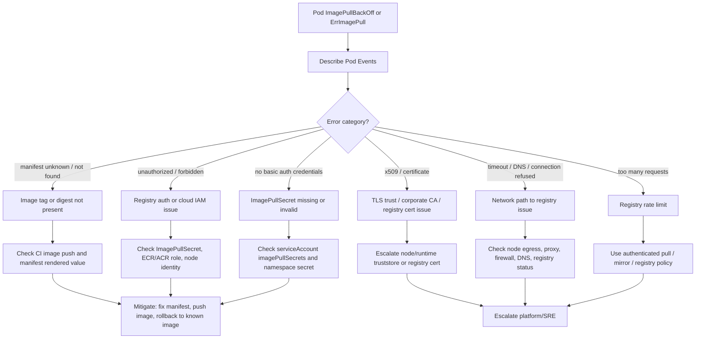

# Part 069 — Common Failure: ImagePullBackOff and ErrImagePull

## 1. Core Operational Idea

`ErrImagePull` dan `ImagePullBackOff` berarti container belum pernah berhasil start karena kubelet gagal menarik image dari registry.

Ini bukan failure aplikasi Java/JAX-RS. JVM belum berjalan. Endpoint belum hidup. Readiness belum relevan. Dependency seperti PostgreSQL, Kafka, RabbitMQ, Redis, atau Camunda juga belum disentuh oleh proses aplikasi.

Secara operational, failure ini berada di boundary antara:

- Kubernetes kubelet
- node runtime/container runtime
- registry
- image name/tag/digest
- registry authentication
- network path dari node ke registry
- cloud IAM seperti ECR/ACR access
- CI/CD image promotion
- GitOps/manifest rendering

Mental model yang tepat:

```text
Deployment desired image
        ↓
ReplicaSet creates Pod
        ↓
Scheduler places Pod on Node
        ↓
kubelet asks container runtime to pull image
        ↓
registry auth + network + image lookup
        ↓
image pull success → container start
image pull fail    → ErrImagePull → ImagePullBackOff
```

`ErrImagePull` biasanya muncul saat percobaan pull gagal pertama kali. `ImagePullBackOff` muncul setelah kubelet melakukan retry dengan backoff.

## 2. Why This Matters Operationally

Image pull failure sering terlihat sederhana, tetapi di production bisa menimbulkan dampak besar:

- rollout berhenti total
- pod baru tidak pernah ready
- deployment stuck
- old replica tetap melayani traffic, tetapi upgrade tidak terjadi
- jika old pod ikut terminate, service bisa kekurangan capacity
- autoscaling tidak membantu karena replica baru gagal start
- rollback juga bisa gagal jika image rollback tidak tersedia
- incident bisa salah arah jika tim langsung mencari error log aplikasi

Untuk backend engineer, masalah ini penting karena image adalah contract antara CI/CD, registry, GitOps, dan Kubernetes runtime.

Bila image tidak bisa dipull, production system gagal sebelum aplikasi sempat menjalankan business logic.

## 3. ErrImagePull vs ImagePullBackOff

| Signal | Meaning | Operational Interpretation |
|---|---|---|
| `ErrImagePull` | kubelet gagal menarik image | error awal; lihat event detail |
| `ImagePullBackOff` | kubelet retry dengan backoff | error masih terjadi setelah retry |
| `Back-off pulling image` | kubelet menunggu sebelum retry | bukan waiting normal; ada root cause sebelumnya |
| `manifest unknown` | tag/digest tidak ditemukan | image belum dipush atau tag salah |
| `unauthorized` | registry auth gagal | ImagePullSecret/IAM/ACR/ECR issue |
| `i/o timeout` | network path ke registry gagal | DNS, firewall, proxy, egress, registry outage |
| `too many requests` | rate limit registry | registry policy atau unauthenticated pull |

## 4. First 5-Minute Production Triage

Tujuan awal bukan langsung memperbaiki manifest. Tujuan awal adalah menjawab empat pertanyaan:

1. Image apa yang gagal dipull?
2. Pod berada di node mana?
3. Error registry-nya apa?
4. Apakah issue hanya service ini, namespace ini, node ini, atau seluruh cluster?

Safe command sequence:

```bash
kubectl get pods -n <namespace> \
  -l app.kubernetes.io/name=<service-name> \
  -o wide
```

```bash
kubectl describe pod <pod-name> -n <namespace>
```

Fokus pada bagian `Events`:

```text
Failed to pull image "registry.example.com/team/service:1.2.3"
Error response from daemon: manifest for ... not found
Back-off pulling image "..."
```

Cek image yang diinginkan oleh workload:

```bash
kubectl get deploy <deployment-name> -n <namespace> \
  -o jsonpath='{.spec.template.spec.containers[*].image}'
```

Cek semua container, termasuk init container:

```bash
kubectl get pod <pod-name> -n <namespace> \
  -o jsonpath='{range .spec.initContainers[*]}init:{.name}={.image}{"\n"}{end}{range .spec.containers[*]}main:{.name}={.image}{"\n"}{end}'
```

Image pull failure bisa terjadi pada init container, sidecar, atau main container. Jangan hanya melihat container utama.

## 5. Debugging Decision Tree



## 6. Failure Mode: Wrong Image Tag

Common causes:

- manifest references tag that CI never produced
- GitOps repo updated before image push completed
- environment overlay uses wrong tag
- app version and chart version confused
- release branch points to non-existent build
- typo in registry path
- mutable tag overwritten unexpectedly

Signals:

```text
manifest unknown
not found
repository does not exist
```

Investigasi aman:

```bash
kubectl describe pod <pod-name> -n <namespace>
```

```bash
kubectl get deploy <deployment-name> -n <namespace> \
  -o yaml | grep -A3 -B3 "image:"
```

Jika menggunakan Helm:

```bash
helm get values <release-name> -n <namespace>
helm get manifest <release-name> -n <namespace> | grep -n "image:"
```

Jika menggunakan GitOps, cek rendered manifest di repo atau UI GitOps:

- image repository
- image tag
- image digest
- target environment
- commit yang mengubah image
- sync timestamp
- pipeline yang menghasilkan image

Mitigasi:

- push image yang hilang bila build valid
- ubah manifest ke tag/digest valid
- rollback ke image terakhir yang terbukti jalan
- hentikan promotion bila issue berasal dari pipeline

Jangan melakukan hotfix manual di cluster bila GitOps akan mengembalikan state lama tanpa kontrol.

## 7. Failure Mode: Wrong Image Digest

Digest lebih aman daripada tag, tetapi lebih strict.

Contoh:

```yaml
image: registry.example.com/order-service@sha256:abc123...
```

Failure dapat terjadi bila:

- digest salah
- image garbage-collected dari registry
- image promoted ulang tetapi digest tidak ikut diperbarui
- registry mirror belum sinkron
- multi-arch manifest tidak sesuai node architecture

Signals:

```text
manifest unknown
no matching manifest for linux/amd64
no matching manifest for linux/arm64
```

Checklist:

- cek node architecture
- cek image manifest supports architecture tersebut
- cek digest di registry
- cek promotion pipeline
- cek mirror/replication delay

Untuk cluster campuran `amd64` dan `arm64`, image multi-arch harus diverifikasi.

## 8. Failure Mode: Registry Authentication Failure

Signals:

```text
unauthorized: authentication required
pull access denied
no basic auth credentials
403 Forbidden
```

Possible causes:

- `imagePullSecrets` tidak ada
- secret ada tetapi salah namespace
- secret expired
- service account tidak attach imagePullSecret
- registry credential rotated tetapi cluster belum update
- cloud IAM node role tidak punya permission
- ECR/ACR integration rusak

Investigasi aman:

```bash
kubectl get pod <pod-name> -n <namespace> \
  -o jsonpath='{.spec.imagePullSecrets}'
```

```bash
kubectl get sa <service-account> -n <namespace> \
  -o yaml
```

```bash
kubectl get secret -n <namespace> | grep -i pull
```

Jangan dump isi secret di terminal production kecuali ada prosedur eksplisit. Validasi keberadaan, tipe, dan linkage dulu.

Secret type yang umum:

```text
kubernetes.io/dockerconfigjson
```

Cek type tanpa membuka credential:

```bash
kubectl get secret <secret-name> -n <namespace> \
  -o jsonpath='{.type}'
```

## 9. Failure Mode: ImagePullSecret Missing or Wrong Namespace

ImagePullSecret bersifat namespace-scoped.

Secret yang ada di namespace `dev` tidak otomatis berlaku di namespace `prod`.

Common issue:

```yaml
imagePullSecrets:
  - name: regcred
```

Tetapi `regcred` tidak ada di namespace target.

Investigasi:

```bash
kubectl get secret regcred -n <namespace>
```

Jika tidak ada:

```text
Error from server (NotFound): secrets "regcred" not found
```

Mitigasi biasanya dimiliki oleh platform/DevOps:

- recreate registry secret di namespace target
- attach imagePullSecret ke ServiceAccount
- perbaiki Helm/Kustomize overlay
- perbaiki automation namespace bootstrap

Backend engineer harus menghindari membuat credential manual tanpa prosedur security.

## 10. Failure Mode: ECR Pull Failure on EKS

Pada EKS, image pull dari ECR biasanya melibatkan node IAM role, EKS Pod Identity/IRSA pattern tertentu, atau registry credential flow yang disediakan platform.

Common causes:

- node IAM role tidak punya permission ECR pull
- cross-account ECR policy tidak mengizinkan pull
- ECR repository policy salah
- private subnet tidak punya NAT/VPC endpoint ke ECR
- VPC endpoint untuk ECR API/DKR atau S3 layer path tidak lengkap
- image region salah
- image account ID salah
- registry URL salah

Signals:

```text
403 Forbidden
no basic auth credentials
i/o timeout
repository does not exist
```

EKS-specific internal verification:

- apakah image berasal dari ECR account yang sama atau cross-account?
- apakah cluster node dapat reach ECR endpoint?
- apakah private subnet memakai NAT atau VPC endpoint?
- apakah repository policy mengizinkan node role?
- apakah image region sesuai cluster/runtime policy?
- apakah image scan/promotion menahan image sebelum tersedia?

Backend engineer biasanya tidak memperbaiki IAM node role sendiri. Bawa evidence berikut ke platform/SRE:

- namespace
- pod name
- node name
- image URL
- exact event message
- deployment commit/release
- apakah issue terjadi di node lain
- apakah service lain juga gagal pull

## 11. Failure Mode: ACR Pull Failure on AKS

Pada AKS, image pull dari Azure Container Registry dapat bergantung pada:

- AKS managed identity
- kubelet identity
- ACR attachment
- Azure RBAC role `AcrPull`
- private endpoint/private DNS
- firewall/network rules ACR

Common causes:

- AKS identity tidak punya `AcrPull`
- ACR private endpoint DNS salah
- ACR firewall menolak subnet
- image repository/tag salah
- ACR region/network path bermasalah
- credential lama dipakai setelah rotation

Signals:

```text
unauthorized
403 Forbidden
dial tcp ... timeout
denied: requested access to the resource is denied
```

AKS-specific internal verification:

- apakah cluster attach ke ACR yang benar?
- apakah kubelet identity punya `AcrPull`?
- apakah ACR private endpoint dipakai?
- apakah private DNS zone resolve ke private IP?
- apakah NSG/UDR/proxy mengizinkan path ke ACR?
- apakah image ada di repository/tag yang dirender manifest?

## 12. Failure Mode: Network Path to Registry Fails

Signals:

```text
i/o timeout
connection refused
no route to host
TLS handshake timeout
lookup registry.example.com: no such host
```

Possible causes:

- DNS failure dari node
- node egress blocked
- proxy required tetapi tidak dikonfigurasi di container runtime/node
- firewall allowlist belum mencakup registry
- NAT gateway issue
- private endpoint DNS salah
- registry outage
- corporate TLS inspection/certificate issue

Perhatikan: image pull dilakukan oleh kubelet/container runtime di node, bukan oleh container aplikasi. Jadi `NO_PROXY` di aplikasi belum tentu relevan untuk image pull.

Investigasi yang biasanya perlu platform/SRE:

- node egress route
- node DNS resolution
- container runtime proxy config
- registry availability
- firewall logs
- NAT gateway status
- private endpoint route/DNS

Backend engineer dapat mengumpulkan evidence:

```bash
kubectl get pod <pod-name> -n <namespace> -o wide
kubectl describe pod <pod-name> -n <namespace>
```

Cek apakah semua pod gagal di node yang sama:

```bash
kubectl get pods -A -o wide | grep <node-name>
```

Jika hanya satu node yang gagal pull, kemungkinan node/network/runtime issue. Jika semua node gagal, kemungkinan registry, auth, DNS, atau policy global.

## 13. Failure Mode: Registry Rate Limit

Signals:

```text
too many requests
rate limit exceeded
pull rate limit
```

Common causes:

- pulling dari public registry tanpa auth
- banyak node melakukan scale-out bersamaan
- image tidak di-mirror ke private registry
- repeated failing rollout melakukan pull terus-menerus
- ephemeral nodes selalu cold pull image

Mitigasi:

- gunakan private registry/mirror
- gunakan authenticated pull
- pre-pull strategy untuk critical images bila platform mendukung
- hindari mutable public tags
- koordinasikan scale-out dan rollout besar

Backend service owner perlu memahami bahwa rate limit bisa muncul saat incident scale-out, bukan hanya saat deployment normal.

## 14. Failure Mode: TLS or Corporate CA Issue

Signals:

```text
x509: certificate signed by unknown authority
certificate has expired
certificate is valid for X, not Y
TLS handshake error
```

Possible causes:

- registry memakai internal CA
- node/container runtime belum trust CA
- TLS inspection corporate proxy
- certificate expired
- wrong registry hostname/SNI
- mirror registry cert mismatch

Karena image pull terjadi di node runtime, perbaikan biasanya di layer platform:

- install CA ke node/container runtime trust store
- fix registry certificate
- fix proxy TLS configuration
- fix registry hostname

Backend engineer sebaiknya tidak workaround dengan insecure registry kecuali ada approval platform/security yang eksplisit.

## 15. Failure Mode: Init Container Image Fails

Pod status bisa terlihat gagal pull image, tetapi yang gagal adalah init container.

Contoh use case:

- migration init container
- config downloader
- certificate bootstrapper
- sidecar initializer
- permission fixer

Investigasi:

```bash
kubectl describe pod <pod-name> -n <namespace>
```

Cari event image pull dan container name.

Cek init container images:

```bash
kubectl get pod <pod-name> -n <namespace> \
  -o jsonpath='{range .spec.initContainers[*]}{.name}{" => "}{.image}{"\n"}{end}'
```

Operational risk:

- aplikasi utama tidak pernah start
- rollout stuck
- issue tampak seperti service outage padahal bootstrap image hilang
- init container mungkin memakai registry berbeda dari main app

## 16. Failure Mode: Sidecar Image Fails

Sidecar yang gagal pull dapat mencegah pod start, tergantung bagaimana pod didefinisikan.

Common sidecars:

- service mesh proxy
- log agent
- security agent
- secret agent
- config reloader
- metrics exporter

Jika sidecar di-inject oleh admission controller, image failure mungkin tidak terlihat di repo aplikasi.

Checklist:

- cek rendered pod spec, bukan hanya Git manifest aplikasi
- cek mutating webhook injection
- cek sidecar image registry
- cek platform-managed image version
- cek apakah failure terjadi di semua service dengan sidecar yang sama

Ini biasanya platform/SRE boundary.

## 17. Rollout Impact Analysis

Saat image pull failure terjadi dalam deployment rolling update, pertanyaan penting:

- berapa old pod masih ready?
- berapa new pod stuck?
- apakah `maxUnavailable` menyebabkan capacity drop?
- apakah HPA mencoba menambah pod tetapi semuanya gagal pull?
- apakah rollout sudah melewati `progressDeadlineSeconds`?
- apakah rollback image masih tersedia?

Command:

```bash
kubectl rollout status deploy/<deployment-name> -n <namespace>
```

```bash
kubectl get rs -n <namespace> \
  -l app.kubernetes.io/name=<service-name>
```

```bash
kubectl get deploy <deployment-name> -n <namespace> \
  -o wide
```

```bash
kubectl describe deploy <deployment-name> -n <namespace>
```

If old pods are still serving traffic, incident may be lower severity but release is blocked. If old pods are gone or capacity is below safe threshold, treat as availability incident.

## 18. Safe Mitigation Options

Mitigation depends on root cause.

| Root Cause | Safe Mitigation |
|---|---|
| Wrong image tag | update manifest to valid tag/digest or rollback |
| Image not pushed | push/promote missing image if build is approved |
| Registry auth secret missing | restore expected ImagePullSecret through approved path |
| ECR/ACR permission issue | escalate platform/cloud IAM with evidence |
| Registry outage | rollback to cached image only if safe; coordinate platform |
| Network issue from node | cordon/drain may be platform action; escalate |
| Rate limit | use authenticated registry/mirror; pause rollout |
| TLS CA issue | platform fixes node/runtime trust |

Avoid these unsafe actions:

- manually editing production deployment outside GitOps without recording change
- creating ad-hoc registry credentials with personal account
- dumping dockerconfigjson secret into chat/ticket
- switching to `latest` tag to “try quickly”
- disabling TLS verification or using insecure registry
- deleting healthy old pods during stuck rollout

## 19. Rollback Decision

Rollback is appropriate when:

- current deployment references invalid image
- CI/CD promoted wrong artifact
- image cannot be fixed quickly
- production capacity is degraded
- old revision image is known-good and available
- database migration compatibility allows rollback

Rollback may not help when:

- registry auth is broken globally
- node egress cannot reach registry
- old image also unavailable
- image pull failure affects sidecar injected by platform
- issue is cluster-wide registry outage

GitOps-oriented rollback:

- revert image change in Git
- sync through GitOps controller
- verify rollout status
- verify service health and deployment markers

kubectl rollback can be useful during emergency only if internal process allows it. Otherwise GitOps may revert it back.

## 20. Production-Safe Evidence Package

When escalating to platform/SRE/DevOps/security, include:

```text
Incident / Ticket: <id>
Namespace: <namespace>
Workload: <deployment/statefulset/job>
Pod: <pod-name>
Node: <node-name>
Image: <registry/repository:tag or digest>
Container: <main/init/sidecar name>
First seen: <timestamp>
Recent change: <commit/release/build>
Event message: <exact kubelet event>
Scope: one pod / one node / one namespace / many services / cluster-wide
Current impact: rollout blocked / capacity reduced / outage
Attempted actions: read-only investigation only / rollback / paused rollout
Escalation needed: registry / IAM / network / node / GitOps / CI pipeline
```

Do not include decoded registry credentials or secret values.

## 21. Java/JAX-RS-Specific Impact

Because the Java process never starts:

- no app logs except perhaps previous old pods
- no JVM metrics from new pod
- no readiness endpoint
- no heap/GC evidence
- no JAX-RS endpoint traces
- no DB/Kafka/RabbitMQ/Redis/Camunda calls from new pod

Debugging should not start from application code.

However, impact can appear at application level:

- reduced replica capacity
- old version still serving traffic
- API version mismatch if partial rollout happened
- consumer group not scaling because new consumer pods fail pull
- batch job not running because job image cannot be pulled
- migration job blocked

## 22. PostgreSQL/Kafka/RabbitMQ/Redis/Camunda Impact

Image pull failure does not directly touch dependencies, but it can indirectly affect them:

- PostgreSQL migration job cannot run
- Kafka/RabbitMQ consumer capacity does not increase during backlog
- Redis-backed service cannot add replicas
- Camunda worker deployment stuck, causing job backlog
- old pods may continue using old schema/config while new version never starts
- rollout stuck may leave mixed application version if some pods already updated

Check dependency dashboards only after establishing whether enough old pods are still serving.

## 23. EKS/AKS/On-Prem/Hybrid Differences

| Environment | Common Image Pull Concerns |
|---|---|
| EKS | ECR auth, node IAM role, cross-account repository, VPC endpoint, NAT, security group, region mismatch |
| AKS | ACR `AcrPull`, kubelet identity, private endpoint, private DNS zone, NSG/UDR, ACR firewall |
| On-prem | internal registry, corporate CA, proxy, firewall, air-gapped mirror, manual credential rotation |
| Hybrid | private DNS, cross-network registry path, proxy exception, replicated registry lag, firewall allowlist |

Internal verification must confirm which registry and identity model is actually used.

## 24. Internal Verification Checklist

Verify in your internal CSG/team environment:

- Which registry is used for each environment?
- Are images referenced by tag, digest, or both?
- Are mutable tags allowed?
- Is there an immutable promotion policy?
- How does image promotion work from dev/test/stage/prod?
- Is the image pull identity node-based, ServiceAccount-based, or registry-secret-based?
- Are ECR/ACR permissions managed by platform, DevOps, or app team?
- Are cross-account/cross-subscription pulls used?
- Are private endpoints/VPC endpoints used for registry access?
- Are imagePullSecrets namespace-scoped and bootstrapped automatically?
- Are sidecar images injected by platform/security tooling?
- Is there a registry outage runbook?
- Is there a safe rollback process through GitOps?
- Are deployment markers connected to image tag/digest?
- Are image vulnerabilities blocking promotion?
- How are registry credentials rotated?
- Are registry credentials ever exposed in CI logs?
- Which team owns registry access incidents?

## 25. PR Review Checklist

When reviewing Kubernetes/Helm/Kustomize changes:

- Does the image repository point to the correct registry?
- Is the image tag/digest produced by CI?
- Is the image immutable?
- Does the target environment overlay use the correct repository?
- Are app version, chart version, and image tag clearly separated?
- Is ImagePullSecret required?
- Is ServiceAccount attached to the right pull secret?
- Does the namespace have the needed secret/bootstrap?
- Does EKS/AKS identity allow pulling from registry?
- Are init/sidecar images also valid?
- Is rollback image still available?
- Does GitOps render the expected final image?
- Is deployment promotion blocked until image scan passes?
- Is there a registry outage fallback?

## 26. Runbook Summary

```text
1. Confirm pod status: ErrImagePull or ImagePullBackOff.
2. Describe pod and copy exact event message.
3. Identify failing container: init, sidecar, or main.
4. Extract desired image from pod/deployment/rendered manifest.
5. Categorize error: not found, unauthorized, timeout, TLS, rate limit.
6. Check rollout impact: old replicas, new replicas, service capacity.
7. Check if issue scope is one pod, one node, one namespace, or cluster-wide.
8. Validate GitOps/CI image promotion path.
9. Choose mitigation: fix image, push/promote image, rollback, or escalate platform.
10. Verify rollout, service health, alerts, and deployment marker after mitigation.
```

## 27. Key Takeaways

- `ImagePullBackOff` means the app has not started; do not debug Java code first.
- The most useful evidence is in pod events.
- Wrong tag/digest is a release pipeline or manifest problem.
- Unauthorized is an auth/IAM/ImagePullSecret problem.
- Timeout is a node-to-registry network problem.
- Sidecar/init container image failure can be platform-owned.
- Rollback only helps if the old image is available and compatibility is safe.
- Never expose registry credentials while debugging.
- In GitOps environments, fix the source of truth, not just live cluster state.

