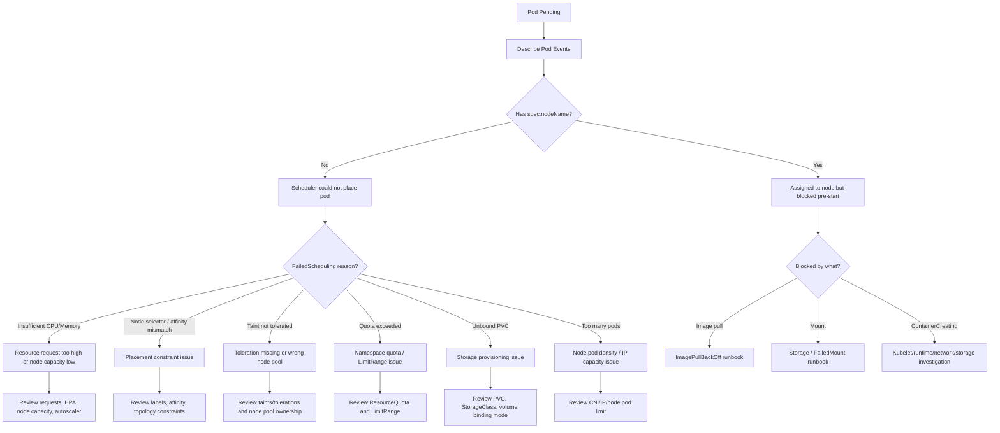

# Part 070 — Common Failure: Pod Pending

## 1. Core Operational Idea

`Pending` means the Pod object exists, but Kubernetes has not successfully moved it into running workload execution.

In many production cases, `Pending` specifically means the scheduler cannot place the pod onto a suitable node. In other cases, the pod is assigned but blocked by volume attach/mount or image pull transition. For this part, the main focus is scheduling-related Pending.

Important distinction:

```text
Deployment creates ReplicaSet
ReplicaSet creates Pod object
Pod is Pending
        ↓
Either scheduler cannot place it
or required pre-start dependency is not ready
        ↓
No container process yet
No Java runtime yet
No JAX-RS endpoint yet
No app-level readiness yet
```

If a pod is Pending, the Java/JAX-RS application usually has not started. Debugging should begin from scheduler events, resource requirements, constraints, quota, PVC, and node capacity.

## 2. Why Pod Pending Matters Operationally

Pod Pending can silently reduce reliability because desired replicas do not become actual capacity.

Examples:

- rollout stuck because new pods cannot schedule
- HPA scales up but extra replicas stay Pending
- consumer backlog grows because Kafka/RabbitMQ consumer pods cannot start
- batch job misses SLA because job pod cannot schedule
- migration job never runs
- cluster autoscaler is expected to help but does not
- node pool lacks matching labels, taints, architecture, or zone capacity

Backend engineer impact:

- service owner must understand whether the application requested impossible resources
- platform/SRE may own node capacity and autoscaler
- both sides need clear evidence, not guesswork

## 3. First 5-Minute Production Triage

Start with pod list:

```bash
kubectl get pods -n <namespace> \
  -l app.kubernetes.io/name=<service-name> \
  -o wide
```

Describe the Pending pod:

```bash
kubectl describe pod <pod-name> -n <namespace>
```

Focus on `Events`, especially:

```text
Warning  FailedScheduling  default-scheduler  0/12 nodes are available: ...
```

Common scheduler messages:

```text
Insufficient cpu
Insufficient memory
node(s) didn't match Pod's node affinity/selector
node(s) had taint that the pod didn't tolerate
persistentvolumeclaim is not bound
exceeded quota
Too many pods
pod has unbound immediate PersistentVolumeClaims
```

Check whether pod has been assigned a node:

```bash
kubectl get pod <pod-name> -n <namespace> \
  -o jsonpath='{.spec.nodeName}{"\n"}'
```

If empty, scheduler has not placed it. If populated, investigate kubelet/node/PVC/image phase next.

## 4. Pending Debugging Decision Tree



## 5. Failure Mode: Insufficient CPU

Scheduler event:

```text
0/10 nodes are available: 10 Insufficient cpu.
```

Meaning:

- pod CPU request cannot fit on available nodes
- not based on current CPU usage alone
- scheduler uses requested resources, not actual utilization

Example manifest:

```yaml
resources:
  requests:
    cpu: "4"
    memory: "2Gi"
```

If every node has only 2 allocatable CPU free, pod cannot schedule even if actual CPU usage is low.

Investigasi:

```bash
kubectl describe pod <pod-name> -n <namespace>
```

```bash
kubectl get pod <pod-name> -n <namespace> \
  -o jsonpath='{range .spec.containers[*]}{.name}{" cpu="}{.resources.requests.cpu}{" mem="}{.resources.requests.memory}{"\n"}{end}'
```

```bash
kubectl describe nodes | grep -A5 -B5 "Allocated resources"
```

Backend engineer questions:

- Did this PR increase CPU request?
- Is the request based on observed production usage?
- Does HPA require CPU request to compute utilization?
- Is request inflated to compensate for CPU limit/throttling?
- Is this service allowed to run on larger node pool?

Mitigation options:

- right-size CPU request based on evidence
- reduce max surge during rollout
- scale cluster/node pool via platform/SRE
- schedule to larger node pool if approved
- pause rollout if capacity is insufficient

Do not blindly lower CPU request below safe level just to schedule. That can create noisy-neighbor and throttling problems later.

## 6. Failure Mode: Insufficient Memory

Scheduler event:

```text
0/8 nodes are available: 8 Insufficient memory.
```

Meaning:

- pod memory request cannot fit on any eligible node
- scheduler evaluates requested memory, not current RSS only

For Java workload, memory request must consider:

- JVM heap
- metaspace
- direct buffers
- thread stacks
- native memory
- sidecars
- log agents
- memory overhead during startup

Investigasi:

```bash
kubectl get pod <pod-name> -n <namespace> \
  -o jsonpath='{range .spec.containers[*]}{.name}{" mem-request="}{.resources.requests.memory}{" mem-limit="}{.resources.limits.memory}{"\n"}{end}'
```

Check if sidecar requests contribute significantly.

Mitigation:

- right-size memory request
- reduce rollout surge
- use suitable node pool
- coordinate node scale-up
- review JVM memory flags

Backend-specific concern: if memory request is reduced without changing JVM limit/heap, the pod may schedule but become a bad neighbor or later OOM.

## 7. Failure Mode: Namespace ResourceQuota Exceeded

Scheduler/admission signals:

```text
exceeded quota
forbidden: exceeded quota
```

This can block pod creation or scheduling depending on policy.

Check quota:

```bash
kubectl get resourcequota -n <namespace>
```

```bash
kubectl describe resourcequota <quota-name> -n <namespace>
```

Common quota dimensions:

- requests.cpu
- requests.memory
- limits.cpu
- limits.memory
- pods
- services
- persistentvolumeclaims
- secrets/configmaps

Questions:

- Did deployment increase replicas?
- Did HPA scale above expected max?
- Did resource requests increase?
- Are old ReplicaSets still consuming quota during rollout?
- Are stuck jobs/cronjobs consuming pod quota?

Mitigation:

- clean up obsolete workloads/jobs if safe
- reduce rollout surge
- adjust HPA max if accidental
- request quota increase through platform process
- correct resource sizing if inflated

Do not delete pods randomly to free quota. Identify owner and purpose first.

## 8. Failure Mode: LimitRange Default or Constraint

A `LimitRange` may inject default requests/limits or enforce min/max.

Check:

```bash
kubectl get limitrange -n <namespace>
```

```bash
kubectl describe limitrange <limitrange-name> -n <namespace>
```

Possible outcomes:

- pod without request gets default request too high
- pod request below minimum rejected
- pod limit above maximum rejected
- ratio request/limit violates policy

Operational concern:

A backend engineer might not see these defaults in the source manifest. Always inspect the admitted pod or rendered final object.

## 9. Failure Mode: Node Selector Mismatch

Scheduler event:

```text
node(s) didn't match Pod's node affinity/selector
```

Example:

```yaml
nodeSelector:
  workload: backend
```

But no node has label `workload=backend`.

Investigasi:

```bash
kubectl get pod <pod-name> -n <namespace> \
  -o jsonpath='{.spec.nodeSelector}{"\n"}'
```

```bash
kubectl get nodes --show-labels | grep workload
```

Common causes:

- wrong node label key/value
- node pool renamed
- environment overlay copied from another cluster
- node labels changed during platform migration
- workload constrained to old node pool
- architecture label mismatch such as amd64 vs arm64

Mitigation:

- fix selector if manifest wrong
- update node labels only through platform process
- move workload to supported node pool
- remove unnecessary selector if safe

## 10. Failure Mode: Node Affinity Too Restrictive

Node affinity can be more expressive than nodeSelector, but also easier to over-constrain.

Check affinity:

```bash
kubectl get pod <pod-name> -n <namespace> -o yaml | grep -A40 "affinity:"
```

Common problems:

- required affinity uses label that no longer exists
- AND/OR logic misunderstood
- zone restriction conflicts with available capacity
- node pool restriction conflicts with taints
- environment overlay inherited wrong affinity

Remember:

- `requiredDuringSchedulingIgnoredDuringExecution` is hard constraint
- `preferredDuringSchedulingIgnoredDuringExecution` is soft preference

If Pending, focus on hard constraints.

## 11. Failure Mode: Pod Anti-Affinity Too Strict

Anti-affinity can prevent replicas from co-locating. Useful for HA, dangerous when cluster is small.

Common pattern:

```yaml
podAntiAffinity:
  requiredDuringSchedulingIgnoredDuringExecution:
    - labelSelector:
        matchLabels:
          app: order-service
      topologyKey: kubernetes.io/hostname
```

If replicas exceed eligible nodes, extra pods stay Pending.

Failure scenarios:

- service scales to 10 replicas but only 3 eligible nodes
- zone/node pool constraint reduces eligible nodes
- required anti-affinity prevents emergency scale-up
- topologyKey not present on nodes

Mitigation:

- use topology spread constraints where appropriate
- use preferred anti-affinity instead of required for non-critical separation
- increase eligible nodes
- review HA requirement vs capacity reality

## 12. Failure Mode: Topology Spread Constraints

Topology spread constraints distribute pods across zones/nodes.

Useful for availability, but can cause Pending when constraints cannot be satisfied.

Check:

```bash
kubectl get pod <pod-name> -n <namespace> -o yaml | grep -A40 "topologySpreadConstraints:"
```

Common issue:

```yaml
whenUnsatisfiable: DoNotSchedule
```

If topology domains lack capacity, pods remain Pending.

Questions:

- Are all zones available?
- Does node pool exist in all zones?
- Are labels consistent across nodes?
- Does PDB/rollout require more capacity than spread allows?
- Does autoscaler provision nodes in required topology?

## 13. Failure Mode: Taint/Toleration Mismatch

Scheduler event:

```text
node(s) had taint {dedicated: platform}, that the pod didn't tolerate
```

Nodes may be tainted to reserve them for specific workloads.

Check pod tolerations:

```bash
kubectl get pod <pod-name> -n <namespace> \
  -o jsonpath='{.spec.tolerations}{"\n"}'
```

Check node taints:

```bash
kubectl describe node <node-name> | grep -i taints -A3
```

Common causes:

- workload meant for dedicated node pool but missing toleration
- workload accidentally targeting tainted node pool
- cluster added new taint during maintenance
- platform node pool reserved for system workloads
- spot/preemptible nodes require toleration

Mitigation:

- add toleration only if workload is approved for that node pool
- remove wrong selector/affinity
- ask platform to confirm node pool policy
- do not tolerate system/security taints casually

## 14. Failure Mode: PVC Pending or Unbound

Scheduler event:

```text
pod has unbound immediate PersistentVolumeClaims
persistentvolumeclaim "..." not found
```

Check PVC:

```bash
kubectl get pvc -n <namespace>
```

```bash
kubectl describe pvc <pvc-name> -n <namespace>
```

Common causes:

- PVC missing
- StorageClass missing
- storage quota exceeded
- dynamic provisioning failed
- zone binding conflict
- access mode unsupported
- volume binding mode waits for first consumer
- CSI driver issue

Important: For many backend services, stateless API pods should not require PVC. If a JAX-RS API service unexpectedly has PVC dependency, review architecture.

Mitigation:

- fix PVC reference if wrong
- correct StorageClass
- escalate CSI/provisioning issue
- review whether persistent disk is actually needed
- avoid storing critical state in local pod filesystem

## 15. Failure Mode: Too Many Pods / IP Exhaustion

Scheduler/node signals can include:

```text
Too many pods
Insufficient pods
failed to assign an IP address
```

In managed Kubernetes, pod density can be limited by:

- kubelet max pods
- CNI IP capacity
- subnet IP exhaustion
- ENI/IP limits on EKS
- Azure CNI subnet capacity on AKS
- node size

Backend symptom:

- HPA scales up but pods remain Pending or ContainerCreating
- cluster has CPU/memory but cannot assign pod IP
- one node pool is saturated by pod count

Investigasi:

```bash
kubectl describe pod <pod-name> -n <namespace>
```

```bash
kubectl get nodes
```

```bash
kubectl describe node <node-name> | grep -A10 "Capacity"
```

Platform/SRE usually owns CNI/IP capacity. Backend engineer should provide evidence and avoid changing workload placement randomly.

## 16. Failure Mode: Priority and Preemption

If PriorityClass is used, lower-priority pods may be preempted, or high-priority pods may still remain Pending if no feasible node exists.

Check:

```bash
kubectl get pod <pod-name> -n <namespace> \
  -o jsonpath='{.spec.priorityClassName}{"\n"}'
```

Events may say:

```text
preemption: 0/10 nodes are available: No preemption victims found
```

Operational concerns:

- using high priority for normal backend service can harm other workloads
- missing priority for critical service may delay recovery
- preemption does not solve hard constraints like wrong node selector or unbound PVC

Internal verification should clarify which workloads are allowed to use elevated priority.

## 17. Failure Mode: Cluster Autoscaler Did Not Scale

A common misconception: if pods are Pending, cluster autoscaler will always add nodes.

It will not scale if:

- pod has unsatisfiable node selector
- required affinity cannot match any node group
- taint/toleration mismatch prevents placement
- quota/account capacity blocks new nodes
- cloud provider zone capacity unavailable
- max node group size reached
- resource request is larger than any available instance type
- PVC zone binding conflicts
- autoscaler is disabled for node pool
- scale-up delay is still in progress

Check pod events first. They often reveal whether autoscaler considered the pod.

Escalation evidence:

```text
Pending pod name
FailedScheduling event
Resource requests
Node selector/affinity/tolerations
Target node pool expectation
HPA/rollout context
Time pending
Business impact
```

## 18. Failure Mode: Resource Request Larger Than Any Node

Example:

```yaml
requests:
  cpu: "32"
  memory: "128Gi"
```

If no node type in cluster/node pool can fit this, autoscaler cannot help unless it is allowed to provision larger nodes.

Signals:

```text
Insufficient cpu
Insufficient memory
```

But the real root cause is impossible sizing.

Questions:

- Is this a batch job requiring a special node pool?
- Is memory request accidentally set equal to an oversized limit?
- Is JVM heap sizing unrealistic?
- Should this be decomposed or run in another compute environment?

This is an architecture/capacity discussion, not merely a Kubernetes tweak.

## 19. Failure Mode: Rollout Surge Exceeds Capacity

Rolling update can temporarily require more pods than steady state.

Example:

```yaml
strategy:
  rollingUpdate:
    maxSurge: 25%
    maxUnavailable: 25%
```

If resource requests are high, surge pods may remain Pending.

Operational questions:

- Are old replicas still consuming capacity?
- Is surge too aggressive for node pool?
- Would `maxSurge: 0` reduce capacity pressure but slow rollout?
- Would lowering `maxUnavailable` protect availability?
- Is cluster autoscaling expected to add capacity during rollout?

Mitigation must balance rollout speed, availability, and capacity cost.

## 20. Java/JAX-RS-Specific Pending Concerns

For Java/JAX-RS services, Pending usually means:

- no new JVM started
- no readiness endpoint
- no new app logs
- no new traces
- no new DB/Kafka/RabbitMQ/Redis/Camunda connections

But the cause may be the application manifest:

- CPU/memory request too high for JVM sizing
- sidecar resource request too high
- node affinity copied from another service
- PDB/rollout/HPA combination demands more capacity
- batch/migration job requests too much memory

Java-specific review:

```text
container memory limit
JVM MaxRAMPercentage
memory request
startup memory spike
sidecar overhead
replica count
maxSurge
HPA maxReplica
DB pool per pod
```

A pod that schedules after reducing requests may still be unsafe if JVM settings are not aligned.

## 21. Impact on PostgreSQL, Kafka, RabbitMQ, Redis, and Camunda

Pod Pending indirectly impacts dependencies:

- PostgreSQL connection count may not increase as expected during scale-out
- Kafka consumer lag may grow because new consumers are Pending
- RabbitMQ queue depth may grow because consumer pods do not start
- Redis load may remain on old replicas
- Camunda jobs may backlog because workers cannot scale
- migration/reconciliation jobs may miss execution window

When debugging backlog, check whether desired consumer/worker replicas are actually running or stuck Pending.

## 22. EKS-Specific Pending Causes

On EKS, additional causes include:

- VPC CNI IP exhaustion
- subnet too small for pod IP allocation
- node group max size reached
- Karpenter provisioner/nodepool constraints too strict
- instance type unavailable in AZ
- spot capacity unavailable
- security group for pods constraints
- EBS volume zone binding issue
- managed node group taints/labels mismatch

Internal verification:

- Are pod IPs allocated from subnet?
- Which node group should this workload use?
- Is Karpenter/Cluster Autoscaler enabled?
- Are provisioner constraints compatible with pod affinity?
- Is the PVC bound to a specific AZ?
- Are spot nodes allowed for this workload?

## 23. AKS-Specific Pending Causes

On AKS, additional causes include:

- Azure CNI subnet IP exhaustion
- node pool max count reached
- VMSS capacity issue
- zone capacity issue
- node pool taints/labels mismatch
- Azure Disk zone binding issue
- user node pool unavailable
- system node pool not intended for app workload
- autoscaler disabled or limited

Internal verification:

- Which node pool should run backend workloads?
- Is Azure CNI subnet capacity sufficient?
- Is cluster autoscaler enabled for that pool?
- Is max node count reached?
- Are NSG/UDR issues affecting node readiness?
- Is PVC tied to a zone with no available nodes?

## 24. On-Prem/Hybrid Pending Causes

On-prem/hybrid Kubernetes often has less elastic capacity.

Common causes:

- fixed node capacity
- manual node provisioning
- strict node pool boundaries
- storage provisioning delays
- corporate virtualization quota
- air-gapped image registry unrelated but may appear after scheduling
- taints reserved for platform workloads
- limited zone/rack topology

Operational implication:

Pending may require capacity planning, not just waiting for autoscaler.

## 25. Safe Mitigation Options

| Root Cause | Safe Mitigation |
|---|---|
| CPU/memory request too high | right-size request using evidence; coordinate capacity |
| Namespace quota exceeded | reduce unnecessary usage or request quota increase |
| LimitRange conflict | adjust manifest or namespace policy through owner |
| Node selector mismatch | fix selector or use approved node pool |
| Required affinity too strict | relax constraint or add matching capacity |
| Taint not tolerated | add toleration only with node pool approval |
| PVC unbound | fix StorageClass/PVC or escalate CSI/storage |
| Pod density/IP exhaustion | escalate platform; add nodes/subnet capacity |
| Autoscaler max reached | request node pool capacity increase |
| Rollout surge too high | tune rollout strategy or pause rollout |

Unsafe actions:

- deleting random pods to free space
- removing resource requests entirely
- adding broad tolerations to schedule anywhere
- removing anti-affinity without HA review
- forcing workload onto system node pool
- manually editing live manifests outside GitOps without change record
- reducing memory below JVM reality

## 26. Production Evidence Package

For escalation, provide:

```text
Namespace: <namespace>
Workload: <deployment/statefulset/job>
Pod: <pod-name>
Status: Pending
Node assigned: yes/no
FailedScheduling event: <exact text>
Resource requests: cpu/memory/ephemeral-storage
Replica context: desired/current/ready/pending
Recent change: <commit/release>
Placement constraints: nodeSelector/affinity/tolerations/topologySpread
PVC status: <if any>
Quota status: <if relevant>
Autoscaling context: HPA/Cluster Autoscaler/Karpenter/AKS node pool
Impact: rollout blocked / capacity degraded / consumer backlog / job missed
Requested help: capacity / node pool / storage / quota / policy review
```

## 27. Internal Verification Checklist

Verify internally:

- Which node pools are approved for backend services?
- Are node labels stable and documented?
- Are taints/tolerations standardized?
- Is topology spread required for critical services?
- Is pod anti-affinity required or preferred?
- What ResourceQuota applies to each namespace?
- What LimitRange defaults are injected?
- Who approves quota increase?
- Who approves node pool capacity increase?
- Is Cluster Autoscaler/Karpenter/AKS autoscaler enabled?
- What is max node count per pool?
- Are spot/preemptible nodes allowed?
- Are workloads allowed on system node pools?
- Is PVC usage allowed for backend services?
- Which StorageClass should be used?
- Are zone constraints documented?
- Does the rollout strategy account for temporary surge capacity?
- Do HPA max replicas fit dependency and node capacity?

## 28. PR Review Checklist

When reviewing manifest changes that may affect scheduling:

- Did CPU/memory requests increase?
- Are limits aligned with requests and JVM settings?
- Does the service need special nodeSelector?
- Are affinity rules required or merely preferred?
- Can topology spread be satisfied in all environments?
- Are taints/tolerations justified?
- Does HPA max replica fit namespace quota?
- Does rollout `maxSurge` fit cluster capacity?
- Are PVCs introduced to a previously stateless service?
- Does StorageClass exist in all target environments?
- Does the namespace quota allow desired replicas?
- Are sidecar resource requests included in sizing?
- Are environment overlays consistent?
- Will this schedule on EKS/AKS/on-prem variants?

## 29. Runbook Summary

```text
1. Confirm pod is Pending.
2. Describe pod and read FailedScheduling event.
3. Check whether spec.nodeName is empty.
4. If no node assigned, categorize scheduler reason.
5. Check resource requests, quota, LimitRange, placement constraints, PVC.
6. Check rollout/HPA context: why are new pods being created?
7. Determine scope: one workload, namespace quota, node pool, cluster capacity, storage, or CNI/IP.
8. Avoid unsafe fixes such as removing requests or broad tolerations.
9. Mitigate through right-sizing, rollout tuning, quota/capacity request, storage fix, or platform escalation.
10. Verify pods schedule, become ready, and restore service/consumer/job capacity.
```

## 30. Key Takeaways

- Pending is usually not an application-code failure.
- Scheduler events are the primary evidence.
- Scheduler uses resource requests, not actual usage.
- Node selector, affinity, taints, topology spread, quota, PVC, and autoscaler constraints can all block scheduling.
- HPA can create Pending pods if cluster capacity cannot follow.
- Rollout surge can require temporary capacity beyond steady state.
- For Java services, lowering memory request without JVM reasoning can create later OOM or noisy-neighbor risk.
- EKS/AKS Pending issues often involve CNI IP capacity, node pool limits, or cloud zone capacity.
- The best mitigation preserves reliability, scheduling correctness, and ownership boundaries.

