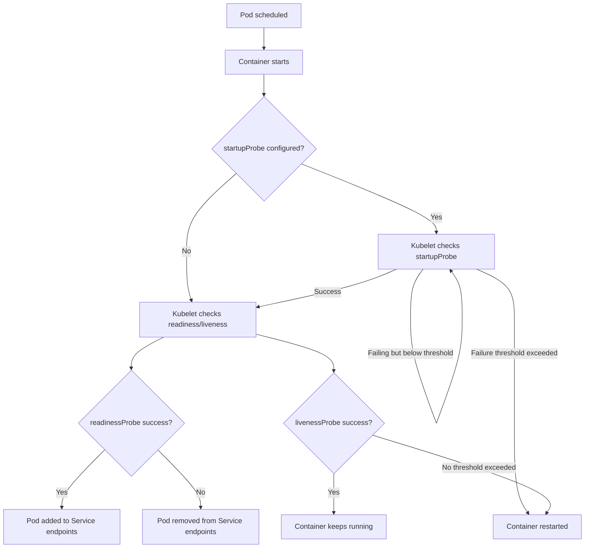
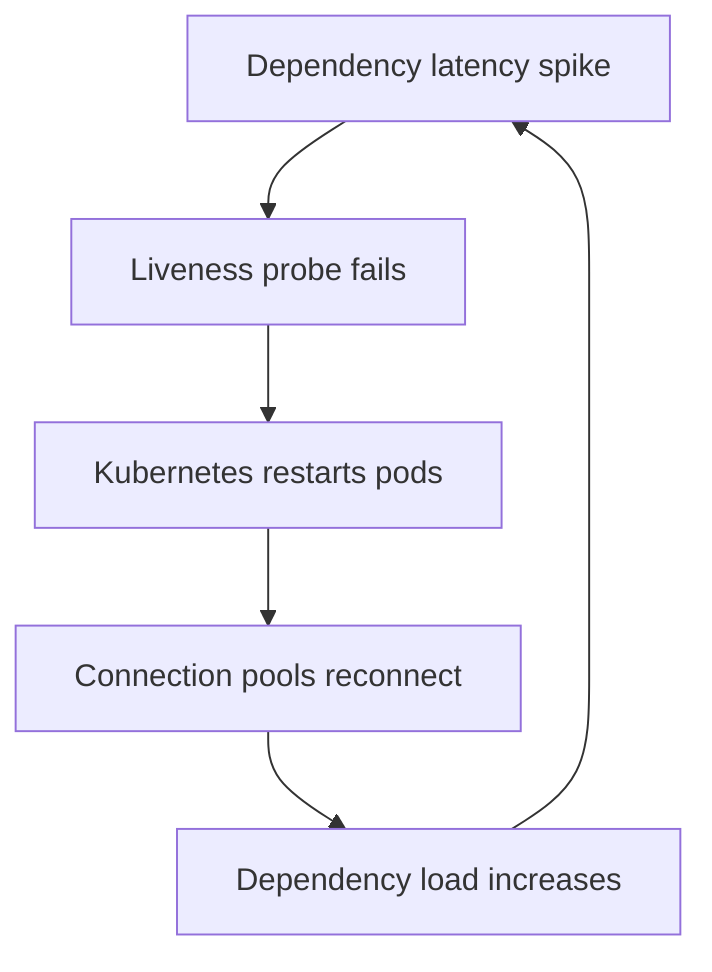
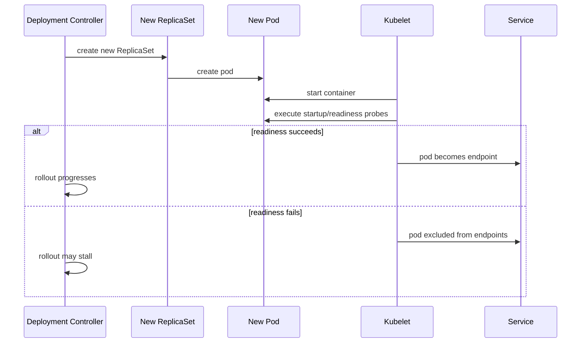

# Part 071 — Common Failure: Readiness and Liveness Probe Failure

## Tujuan

Probe failure adalah salah satu penyebab paling umum dari outage Kubernetes yang terlihat seperti masalah aplikasi, padahal sering berasal dari mismatch antara **Kubernetes lifecycle**, **startup behavior Java**, **health endpoint design**, **dependency policy**, dan **traffic routing**.

Part ini membahas cara men-debug failure pada:

- `startupProbe`
- `readinessProbe`
- `livenessProbe`

untuk workload backend enterprise seperti Java 17+ / JAX-RS / Jakarta RESTful Web Services, Kafka/RabbitMQ consumer, Camunda worker, batch-like service, dan service yang bergantung pada PostgreSQL, Redis, Kafka, RabbitMQ, external HTTP service, NGINX/Ingress, EKS, AKS, dan GitOps/IaC.

Fokus utama: **menghindari probe yang justru membuat production tidak stabil**.

---

## 1. Mental Model

Probe bukan sekadar health check.

Probe adalah kontrak antara Kubernetes dan aplikasi.



Operational meaning:

- `startupProbe` protects slow-starting applications from premature liveness kill.
- `readinessProbe` controls whether pod receives traffic.
- `livenessProbe` controls whether kubelet restarts the container.

The dangerous mistake: using liveness probe as a generic dependency health check.

---

## 2. Probe Types and Their Operational Meaning

| Probe | Kubernetes action when failing | Operational meaning |
|---|---|---|
| `startupProbe` | Restart container after threshold exceeded | Application cannot complete startup contract |
| `readinessProbe` | Remove pod from Service endpoints | Application should not receive traffic right now |
| `livenessProbe` | Restart container after threshold exceeded | Application process is considered unrecoverably unhealthy |

Readiness failure is traffic control.

Liveness failure is process replacement.

Startup failure is boot contract failure.

Never treat the three as interchangeable.

---

## 3. Why Probe Failure Matters in Production

A probe issue can cause:

- pods running but receiving no traffic
- Service with no endpoints
- ingress `503 Service Unavailable`
- rolling update stuck
- deployment `ProgressDeadlineExceeded`
- CrashLoopBackOff after repeated liveness/startup failures
- consumer capacity drop
- workflow worker undercapacity
- false outage during dependency degradation
- autoscaling without recovery
- cascading restart loops

For Java backend service, probe failure can be caused by:

- slow JVM startup
- classpath scanning
- framework initialization
- database pool initialization
- migration check
- external secret fetch
- cloud identity token delay
- JIT warmup and CPU throttling
- GC pause
- overloaded thread pool
- wrong management endpoint binding

---

## 4. First Commands

Start from pod status:

```bash
kubectl get pod -n <namespace> -l app.kubernetes.io/name=<service> -o wide
```

Inspect pod details and events:

```bash
kubectl describe pod/<pod> -n <namespace>
```

Look for events like:

```text
Readiness probe failed
Liveness probe failed
Startup probe failed
Back-off restarting failed container
```

Read logs:

```bash
kubectl logs <pod> -n <namespace> --tail=200
kubectl logs <pod> -n <namespace> --previous --tail=200
```

If multi-container:

```bash
kubectl logs <pod> -n <namespace> -c <container> --tail=200
kubectl logs <pod> -n <namespace> -c <container> --previous --tail=200
```

Check endpoint impact:

```bash
kubectl get endpointslice -n <namespace> -l kubernetes.io/service-name=<service>
kubectl get endpoints -n <namespace> <service>
```

Check rollout:

```bash
kubectl rollout status deploy/<deployment> -n <namespace>
kubectl describe deploy/<deployment> -n <namespace>
```

Check rendered probe spec:

```bash
kubectl get deploy/<deployment> -n <namespace> -o yaml | sed -n '/readinessProbe:/,/resources:/p'
```

Use GitOps/Helm/Kustomize source for the real review; live manifest may be overwritten by reconciliation.

---

## 5. Typical Failure Signals

| Signal | Likely area |
|---|---|
| Pod `Running` but `0/1 Ready` | readiness failure |
| Pod repeatedly restarting | liveness/startup failure |
| `Service` has no endpoints | readiness, selector, or port mismatch |
| Ingress returns 503 | no ready backend endpoint |
| Ingress returns 504 | backend reachable but too slow / timeout |
| Rollout stuck | new pods not becoming ready |
| `ProgressDeadlineExceeded` | deployment failed to make progress |
| HPA scales but traffic still fails | pods not ready or dependency bottleneck |
| Kafka lag grows after deploy | consumer readiness/shutdown/scaling problem |
| Camunda job backlog grows | workers not ready or restarting |

---

## 6. Debugging Flow

```mermaid
flowchart TD
  A[Probe failure observed] --> B[Identify probe type]
  B --> C{startupProbe failing?}
  C -->|Yes| D[Check startup time, logs, config, secret, CPU/memory]
  C -->|No| E{readinessProbe failing?}
  E -->|Yes| F[Check endpoint removal, app readiness logic, dependencies]
  E -->|No| G{livenessProbe failing?}
  G -->|Yes| H[Check deadlock, event loop, GC pause, probe timeout, dependency anti-pattern]
  G -->|No| I[Check rollout/service/ingress path]
  D --> J[Compare with recent deployment/config]
  F --> J
  H --> J
  I --> J
  J --> K{All new pods affected?}
  K -->|Yes| L[Consider rollback or config fix]
  K -->|No| M[Check node/resource/local dependency issue]
  L --> N[Mitigate, verify, document]
  M --> N
```



Rule: identify the probe type first. A readiness failure and liveness failure require different response.

---

## 7. Common Root Cause Categories

### 7.1 Wrong Path

Example:

```yaml
readinessProbe:
  httpGet:
    path: /health/ready
    port: 8080
```

But app exposes:

```text
/actuator/health/readiness
/health
/q/health/ready
/internal/health/ready
```

Operational symptom:

- HTTP 404 from probe
- pod remains not ready
- service endpoint empty
- ingress 503

Validate with safe internal request only if allowed:

```bash
kubectl exec -n <namespace> <pod> -- wget -S -O- http://127.0.0.1:8080/health/ready
```

If `exec` is restricted, rely on app logs, probe events, and local dev reproduction.

---

### 7.2 Wrong Port

Common mismatch:

- application listens on `8080`
- management endpoint listens on `8081`
- Service targetPort points to named port `http`
- probe uses numeric port that changed

Check container ports:

```bash
kubectl get deploy/<deployment> -n <namespace> -o jsonpath='{.spec.template.spec.containers[*].ports}'
```

Check service target port:

```bash
kubectl get svc/<service> -n <namespace> -o yaml
```

Wrong port can create confusing failures:

- app is healthy but probe fails
- service routes to wrong targetPort
- readiness passes on management port but traffic port is broken

---

### 7.3 Probe Timeout Too Aggressive

Example risk:

```yaml
readinessProbe:
  timeoutSeconds: 1
  periodSeconds: 5
  failureThreshold: 3
```

For Java services under CPU throttling or GC pause, one second may be too aggressive.

Symptoms:

- intermittent readiness flapping
- EndpointSlice churn
- ingress upstream instability
- rolling update slow or stuck
- false negative health during load spike

Check correlation:

- CPU throttling
- GC pause
- pod CPU usage
- request latency
- readiness failure timestamp
- node pressure

---

### 7.4 Slow Startup Without Startup Probe

Java apps can legitimately need longer startup time because of:

- classpath scanning
- dependency injection initialization
- TLS truststore loading
- database pool initialization
- external secret/identity initialization
- cache warmup
- migration validation
- large configuration graph

If `livenessProbe` starts too early, Kubernetes may kill the container before startup completes.

Better pattern:

```yaml
startupProbe:
  httpGet:
    path: /health/startup
    port: management
  failureThreshold: 30
  periodSeconds: 5

livenessProbe:
  httpGet:
    path: /health/live
    port: management
  periodSeconds: 10

readinessProbe:
  httpGet:
    path: /health/ready
    port: management
  periodSeconds: 5
```

The exact values must be validated with real startup distribution in the target environment.

---

### 7.5 Dependency Check Anti-Pattern

Dangerous readiness/liveness design:

```text
liveness = app + database + kafka + redis + external service
```

If PostgreSQL briefly slows down, Kubernetes restarts healthy app pods.

This can amplify outage:



Preferred model:

- liveness checks local process viability
- readiness checks whether service should receive traffic
- dependency health is exposed as diagnostic detail, not always hard gating
- critical dependency gating is explicit and intentional

For queue consumers and workers, readiness semantics may differ because they may not receive HTTP traffic but still need operational health.

---

## 8. Java/JAX-RS Probe Design

A production Java/JAX-RS service should normally separate:

| Endpoint | Purpose | Should include dependencies? |
|---|---|---|
| `/health/live` | Process is alive and not unrecoverably stuck | Usually no external dependency |
| `/health/ready` | Pod can safely serve traffic | Maybe critical dependencies, carefully |
| `/health/startup` | Startup completed | Startup prerequisites only |
| `/metrics` | Metrics scrape | No business dependency gating |

For JAX-RS apps, confirm:

- management endpoint is available before app endpoint or after
- health endpoint does not require auth unexpectedly
- health endpoint does not allocate expensive objects
- health endpoint does not call slow downstreams synchronously unless intentional
- health endpoint does not depend on worker thread pool that may be saturated by user requests

If health check shares the same server thread pool with business traffic, saturation may cause readiness failure even if the process is alive.

---

## 9. Probe Failure During Rollout

Probe failure often appears during rollout:



Symptoms:

```bash
kubectl rollout status deploy/<deployment> -n <namespace>
```

May show waiting for updated replicas to become available.

Check:

```bash
kubectl describe deploy/<deployment> -n <namespace>
kubectl get rs -n <namespace> -l app.kubernetes.io/name=<service>
kubectl describe pod/<new-pod> -n <namespace>
```

If old pods are still ready, impact may be partial.

If maxUnavailable allows too much unavailability or all new pods fail readiness, production can degrade.

---

## 10. Dependency-Specific Impact

### PostgreSQL

Bad readiness design may remove all pods during a DB latency spike.

Check:

- connection pool initialization
- DB timeout
- readiness dependency policy
- pool exhaustion
- migration lock

### Kafka

For consumer workload, liveness restart can cause:

- rebalance storm
- partition churn
- duplicate processing
- lag growth

Check:

- graceful shutdown
- poll loop health
- max poll interval
- consumer thread liveness
- readiness semantics for consumers

### RabbitMQ

Probe restart can cause:

- connection churn
- unacked messages redelivery
- queue depth growth
- duplicate processing

Check:

- ack/nack handling
- prefetch
- channel lifecycle
- shutdown hook

### Redis

If readiness hard-gates Redis availability, transient Redis latency may remove all API pods from endpoints.

Check:

- cache criticality
- fallback behavior
- timeout
- circuit breaker

### Camunda

Worker probe failure can reduce worker capacity and create job backlog.

Check:

- worker concurrency
- job activation
- worker thread health
- external task/job timeout
- incident spike

---

## 11. Production-Safe Investigation Commands

Read status:

```bash
kubectl get pod -n <namespace> -l app.kubernetes.io/name=<service> -o wide
kubectl get deploy -n <namespace> <deployment>
kubectl get rs -n <namespace> -l app.kubernetes.io/name=<service>
```

Read detailed pod condition:

```bash
kubectl describe pod/<pod> -n <namespace>
```

Read logs:

```bash
kubectl logs <pod> -n <namespace> --tail=200
kubectl logs <pod> -n <namespace> --previous --tail=200
```

Read Service endpoint impact:

```bash
kubectl get svc/<service> -n <namespace> -o yaml
kubectl get endpointslice -n <namespace> -l kubernetes.io/service-name=<service> -o wide
```

Read live deployment probe spec:

```bash
kubectl get deploy/<deployment> -n <namespace> -o yaml
```

Check rollout:

```bash
kubectl rollout status deploy/<deployment> -n <namespace>
kubectl rollout history deploy/<deployment> -n <namespace>
```

Avoid in production unless explicitly allowed:

```bash
kubectl delete pod
kubectl edit deploy
kubectl exec curl random dependencies
kubectl port-forward production services
kubectl patch probes directly in live cluster
```

In GitOps environments, direct edits may be reverted and may bypass audit.

---

## 12. Mitigation Options

Mitigation depends on root cause.

| Root cause | Safer mitigation |
|---|---|
| wrong probe path | fix manifest through GitOps/PR and redeploy |
| wrong port | fix port/targetPort/probe port alignment |
| startup too slow | add/tune startupProbe, review CPU/memory |
| timeout too aggressive | tune timeout/failure threshold after measuring latency |
| dependency check too strict | separate liveness/readiness/dependency diagnostics |
| bad release | rollback to previous known-good revision |
| all new pods unready | pause rollout or rollback |
| CPU throttling | tune CPU request/limit and JVM behavior |
| DB/broker outage | mitigate dependency, avoid restarting healthy pods |

Do not make the probe permanently weak just to hide failure.

The goal is correct signal, not green dashboards.

---

## 13. When to Rollback

Rollback is appropriate when:

- probe failure started immediately after deployment
- previous version was healthy
- all new pods fail readiness/startup
- failure is due to application behavior, config, or endpoint mismatch
- no safe forward fix is ready
- user impact is ongoing

Rollback may not help when:

- dependency is down
- node/network issue affects all versions
- Secret rotated incorrectly for all revisions
- DNS/private endpoint issue is external
- policy/RBAC changed outside app release

Before rollback, check:

```bash
kubectl rollout history deploy/<deployment> -n <namespace>
kubectl describe deploy/<deployment> -n <namespace>
```

In GitOps, rollback should usually be done by reverting Git or using the approved release process.

---

## 14. When to Escalate

Escalate to platform/SRE when:

- node pressure or node-level probe failures occur
- CoreDNS/networking causes probe/dependency failure
- ingress/controller configuration changed
- service mesh sidecar affects health path
- admission/policy rejects probe changes
- cluster-wide metrics show widespread probe failures

Escalate to security when:

- probe endpoint exposes sensitive data
- health endpoint requires auth and policy is unclear
- secret/certificate failure affects startup
- RBAC/workload identity blocks dependency access

Escalate to dependency owner when:

- PostgreSQL/Kafka/RabbitMQ/Redis/Camunda health is degraded
- backend pods are healthy but dependency SLO is breached
- connection pool saturation appears caused by dependency limits

---

## 15. PR Review Checklist

For every Kubernetes PR touching probes, review:

- Are startup, readiness, and liveness separated?
- Is liveness only checking local process health?
- Does readiness have clear traffic-serving semantics?
- Are probe paths correct for the framework and runtime profile?
- Are ports aligned with container ports and Service targetPort?
- Are timeout and failure thresholds realistic for Java startup and GC?
- Is there a startupProbe for slow Java services?
- Does readiness avoid unnecessary dependency cascade?
- Does the probe use management endpoint safely?
- Does the change affect rolling update safety?
- Is there a rollback path?
- Are dashboards/alerts aligned with readiness and restart metrics?

---

## 16. Internal Verification Checklist

Verify internally:

- standard health endpoint paths for Java/JAX-RS services
- whether management endpoints use separate port
- probe defaults in Helm chart or platform template
- startup time distribution per service
- readiness policy for DB/broker/cache dependencies
- liveness policy and anti-patterns
- ingress behavior when no endpoints exist
- service mesh or sidecar health behavior, if used
- GitOps process for probe changes
- alert rules for readiness failure, restart count, and rollout stuck
- runbook for readiness/liveness failure
- escalation path to platform/SRE/security/dependency owner

---

## 17. Key Takeaways

- Probe failure is a lifecycle contract failure, not automatically an application bug.
- `readinessProbe` controls traffic.
- `livenessProbe` controls restarts.
- `startupProbe` protects slow startup.
- Bad liveness design can turn dependency latency into pod restart storm.
- Bad readiness design can remove all pods from Service endpoints.
- For Java/JAX-RS, probe design must account for startup time, thread pools, GC, CPU throttling, dependency policy, and management endpoint behavior.
- Production-safe debugging starts with pod events, previous logs, rollout state, Service endpoints, and recent changes.
