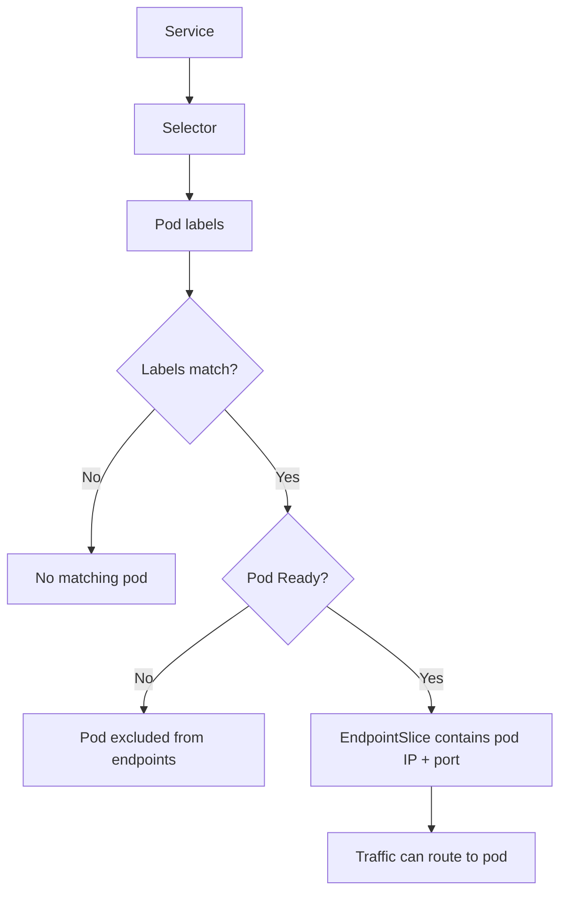
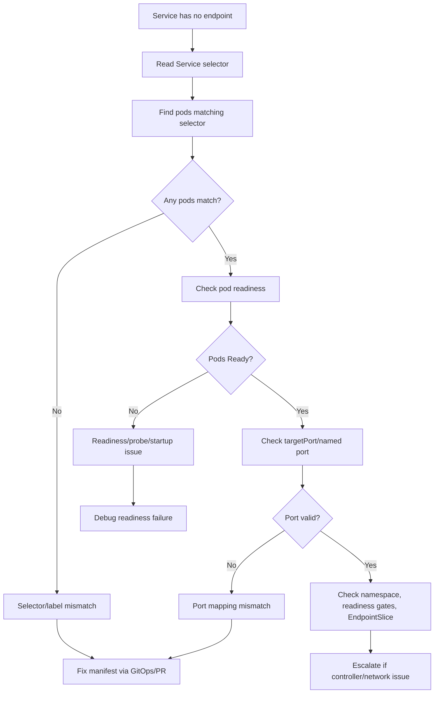
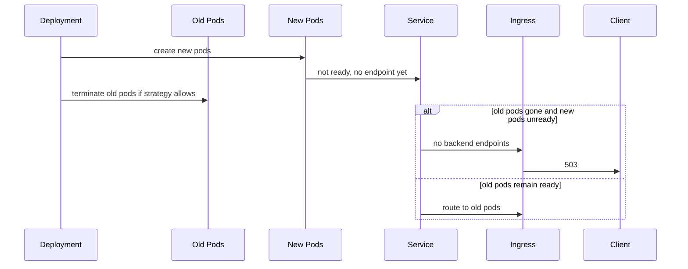
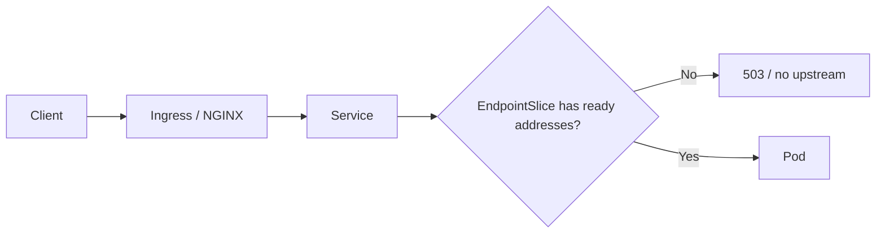

# Part 072 — Common Failure: Service Has No Endpoint

## Tujuan

`Service has no endpoint` adalah failure mode Kubernetes yang sangat penting karena langsung memutus traffic dari Service ke Pod.

Dalam production, gejalanya sering muncul sebagai:

- ingress `503 Service Unavailable`
- API gateway tidak menemukan backend
- traffic blackhole
- rollout stuck
- smoke test gagal
- service-to-service call timeout/failure
- consumer/worker tidak bisa diakses oleh internal dependency

Part ini membahas cara men-debug Service tanpa endpoint secara production-safe, khususnya untuk Java/JAX-RS backend service, NGINX/Ingress, service discovery, EndpointSlice, readiness, port mapping, rollout, Helm/Kustomize/GitOps drift, dan dependency impact.

---

## 1. Mental Model

Kubernetes Service tidak mengirim traffic ke Pod secara langsung berdasarkan nama Pod.

Service memilih Pod melalui selector.

Pod yang cocok selector dan siap menerima traffic akan muncul di EndpointSlice.



Therefore, empty endpoints usually means one of these:

1. no pod matches the Service selector
2. pods match but are not Ready
3. target port/named port is wrong
4. pods are in another namespace
5. rollout produced new labels not matched by Service
6. readiness gates prevent endpoint publication
7. EndpointSlice/controller issue, less common

---

## 2. Why This Matters Operationally

A Deployment can look healthy enough at first glance, while Service has no usable endpoint.

Example:

```text
Deployment: 3 replicas desired
Pods: Running
Service endpoints: empty
Ingress: 503
```

This means the application may be running but unreachable through Kubernetes service discovery.

Operational impact:

- external traffic through ingress fails
- internal service-to-service traffic fails
- canary receives no traffic or wrong traffic
- smoke test fails
- deployment appears stuck
- autoscaling does not fix the issue
- rollback may or may not help depending on selector/config drift

---

## 3. First Commands

Check Service:

```bash
kubectl get svc/<service> -n <namespace> -o wide
kubectl describe svc/<service> -n <namespace>
```

Check EndpointSlice:

```bash
kubectl get endpointslice -n <namespace> -l kubernetes.io/service-name=<service> -o wide
kubectl describe endpointslice -n <namespace> -l kubernetes.io/service-name=<service>
```

Legacy endpoint view can still be useful:

```bash
kubectl get endpoints <service> -n <namespace> -o yaml
```

Check pods and labels:

```bash
kubectl get pod -n <namespace> --show-labels
kubectl get pod -n <namespace> -l app.kubernetes.io/name=<service> -o wide
```

Check Deployment selector and pod template labels:

```bash
kubectl get deploy/<deployment> -n <namespace> -o yaml
```

Check readiness:

```bash
kubectl describe pod/<pod> -n <namespace>
```

---

## 4. Debugging Flow



Do not start by deleting pods.

Deleting pods does not fix selector mismatch, wrong port, wrong namespace, or bad readiness configuration.

---

## 5. Service Selector Mismatch

Service selector example:

```yaml
spec:
  selector:
    app.kubernetes.io/name: quote-service
    app.kubernetes.io/instance: quote-prod
```

Pod labels example:

```yaml
metadata:
  labels:
    app.kubernetes.io/name: quote-api
    app.kubernetes.io/instance: quote-prod
```

Result: no endpoint.

Check selector:

```bash
kubectl get svc/<service> -n <namespace> -o jsonpath='{.spec.selector}'
```

Use selector manually:

```bash
kubectl get pod -n <namespace> -l '<key>=<value>' --show-labels
```

Common causes:

- app label renamed
- Helm values changed
- Kustomize overlay patched labels inconsistently
- Deployment label changed but Service selector not updated
- Service selector uses `version` label accidentally
- canary/blue-green label model not aligned
- multiple apps share ambiguous labels

Operational rule: Service selector should be stable and intentionally narrow.

---

## 6. Pods Match but Are Not Ready

If pods match selector but are not Ready, they will usually not appear as ready endpoints.

Check:

```bash
kubectl get pod -n <namespace> -l <selector> -o wide
kubectl describe pod/<pod> -n <namespace>
```

Look for:

```text
Readiness probe failed
Startup probe failed
ContainersReady=False
Ready=False
```

Common causes:

- readiness path wrong
- readiness port wrong
- app startup slow
- dependency check too strict
- missing config/secret
- DB/broker/cache dependency unavailable
- CPU throttling delaying response
- memory pressure causing GC pause
- application thread pool saturated

If all pods are not ready after a deployment, suspect release/config/probe change.

If only pods on one node are not ready, suspect node/network/local pressure.

---

## 7. Wrong targetPort or Named Port Mismatch

Service can select the correct pods but still fail due to wrong port mapping.

Example Service:

```yaml
ports:
  - name: http
    port: 80
    targetPort: http
```

Container must define named port:

```yaml
ports:
  - name: http
    containerPort: 8080
```

If container port is named `web` instead of `http`, target resolution fails or traffic points incorrectly depending on config.

Check Service ports:

```bash
kubectl get svc/<service> -n <namespace> -o yaml
```

Check container ports:

```bash
kubectl get deploy/<deployment> -n <namespace> -o jsonpath='{.spec.template.spec.containers[*].ports}'
```

Common production mistakes:

- application changed from 8080 to 8081
- management and traffic port confused
- named port changed in Deployment but not Service
- Service port changed but Ingress still points to old port
- Helm values differ by environment

---

## 8. Namespace Mismatch

Services only select pods in the same namespace.

A Service in namespace `quote-prod` cannot select pods in namespace `quote-runtime`.

Check:

```bash
kubectl get svc -n <namespace>
kubectl get pod -n <namespace> --show-labels
kubectl get pod -A -l app.kubernetes.io/name=<name>
```

Namespace mismatch often happens when:

- environment namespace changed
- Helm release installed into different namespace
- ingress backend references Service in expected namespace but app deployed elsewhere
- GitOps application points to wrong destination namespace

Ingress backend usually references a Service in the same namespace as the Ingress for standard Ingress objects.

---

## 9. Rollout-Induced Empty Endpoints

During rollout, there can be a temporary or sustained empty endpoint state.



Risk increases with:

- low replica count
- `maxUnavailable` too high
- no PDB
- readiness slow/failing
- aggressive rollout strategy
- bad canary/blue-green selector
- deployment and service label drift

Check rollout:

```bash
kubectl rollout status deploy/<deployment> -n <namespace>
kubectl describe deploy/<deployment> -n <namespace>
kubectl get rs -n <namespace> --show-labels
```

---

## 10. Ingress Impact

Ingress routes to Service.

Service routes to EndpointSlice.

If EndpointSlice is empty, ingress often returns 503.



Check ingress backend:

```bash
kubectl describe ingress/<ingress> -n <namespace>
```

Check service backend name and port:

```bash
kubectl get ingress/<ingress> -n <namespace> -o yaml
kubectl get svc/<service> -n <namespace> -o yaml
```

If ingress backend references the wrong Service or port, the symptom may look like no endpoint even when the intended Service is healthy.

---

## 11. Java/JAX-RS Specific Causes

For Java/JAX-RS services, no endpoint is often caused by readiness never becoming true.

Common application-side causes:

- readiness endpoint returns 500 due to DB check
- app server listens on localhost instead of `0.0.0.0`
- management port differs from container port
- TLS enabled internally but Service expects HTTP
- app startup blocked on migration or dependency
- thread pool exhausted before readiness response
- CPU throttling causes probe timeout
- secret/config missing at startup
- application profile/environment mismatch

Check logs for startup completion marker:

```bash
kubectl logs <pod> -n <namespace> --tail=200
```

Correlate with:

- `Started application` log
- server port binding log
- health endpoint registration
- DB pool initialization
- secret/config load
- JVM memory and GC logs

---

## 12. Backend Dependency Impact

### PostgreSQL

Readiness can fail if app requires DB connectivity before serving traffic.

Questions:

- Is DB required for all endpoints?
- Is readiness hard-gating on DB?
- Is pool exhausted?
- Is migration lock blocking startup?

### Kafka/RabbitMQ

For APIs that publish events, readiness may depend on broker connectivity.

But if broker is degraded, removing all API pods from endpoints may cause full frontend outage.

Decide intentionally.

### Redis

If Redis is cache-only, readiness should usually not hard-fail solely because Redis is unavailable unless cache is required for correctness.

### Camunda

If service participates in workflow execution, readiness policy should distinguish:

- API serving readiness
- worker processing readiness
- Camunda engine/client connectivity

One pod may be ready for HTTP but not for worker processing, depending on architecture.

---

## 13. GitOps, Helm, and Kustomize Drift

Empty endpoints often come from rendered manifest drift.

Examples:

- base labels updated, overlay Service selector not updated
- Helm helper template changed label names
- chart version upgraded but values still old
- image/app version changed container port
- Kustomize commonLabels changed selectors unexpectedly
- canary overlay adds version label to pods but Service selector points to stable version

Check rendered output where possible:

```bash
helm template <release> <chart> -f values.yaml
kustomize build <overlay>
```

In GitOps, compare:

- desired manifest in Git
- rendered manifest
- live manifest
- sync status
- drift status

---

## 14. Production-Safe Mitigation

| Root cause | Safer mitigation |
|---|---|
| selector mismatch | fix Service selector or pod labels through GitOps/PR |
| pods not ready | debug readiness root cause; rollback if introduced by release |
| wrong targetPort | align Service targetPort and container port |
| wrong ingress backend | fix Ingress backend Service/port |
| namespace mismatch | fix deployment destination or routing reference |
| rollout removed old pods too early | rollback, pause rollout, adjust strategy later |
| dependency outage | mitigate dependency; avoid random pod deletion |
| GitOps drift | reconcile through Git, not manual live patch |

Avoid:

```bash
kubectl delete pod -l app=<app>
```

unless the root cause is proven to be transient pod-local failure and restart is approved.

---

## 15. When to Rollback

Rollback is likely appropriate when:

- Service endpoints became empty after a deployment
- selector/label changed in the new release
- readiness endpoint changed and all new pods fail
- port changed unintentionally
- ingress backend changed incorrectly
- old ReplicaSet was healthy and compatible

Rollback may not help when:

- platform NetworkPolicy changed
- DNS/CoreDNS failed
- node pressure affects readiness
- dependency outage affects all versions
- external secret/cloud identity changed outside app release

In GitOps-managed environments, rollback should generally be done by reverting the Git change or using the approved release rollback flow.

---

## 16. When to Escalate

Escalate to platform/SRE when:

- EndpointSlice controller appears unhealthy
- kube-proxy/CNI/service routing issue is suspected
- ingress controller sees no upstream despite valid endpoints
- node/network issue affects multiple services
- service mesh or sidecar modifies endpoint readiness

Escalate to security when:

- NetworkPolicy blocks readiness/dependency path
- RBAC/admission policy prevents fix
- ServiceAccount/workload identity affects readiness dependency

Escalate to dependency owner when:

- readiness is failing due to DB/broker/cache/workflow dependency degradation
- dependency SLO is breached
- connection pool exhaustion is caused by dependency limit

---

## 17. PR Review Checklist

When reviewing Service/Deployment/Ingress changes, check:

- Does Service selector match pod template labels?
- Are labels stable across rollouts?
- Is Service selector too broad or too narrow?
- Does targetPort match container port or named port?
- Did named port change?
- Does Ingress backend reference correct Service and port?
- Are readiness probes valid?
- Could rollout create a window with zero ready endpoints?
- Are canary/blue-green selectors intentional?
- Does Helm/Kustomize render expected labels/selectors?
- Are namespace references correct?
- Is rollback path clear?
- Are dashboards/alerts available for endpoint count and readiness?

---

## 18. Internal Verification Checklist

Verify internally:

- standard label convention for Service selectors
- whether `app.kubernetes.io/name`, `instance`, `component`, and `version` labels are used consistently
- whether Service selectors are generated by Helm helper templates
- whether Kustomize overlays mutate selectors
- whether canary/blue-green uses version labels or separate Services
- readiness probe standard for Java/JAX-RS services
- EndpointSlice dashboard or alert availability
- ingress behavior when endpoints are empty
- approved production command policy
- GitOps source of truth
- owner for Service/Ingress/platform networking issues
- runbook for `Service has no endpoint`

---

## 19. Key Takeaways

- Service endpoints are created from matching pod labels plus readiness.
- A pod can be `Running` but excluded from Service endpoints.
- Empty EndpointSlice usually means selector mismatch, readiness failure, port mismatch, namespace mismatch, or rollout/config drift.
- Ingress 503 often means the backend Service has no ready endpoints.
- Do not fix endpoint problems by randomly deleting pods.
- Debug Service selector, pod labels, readiness, targetPort, Ingress backend, and GitOps-rendered manifest in that order.
- For Java/JAX-RS workloads, readiness endpoint design and management port alignment are critical.
- Production-safe mitigation usually means fixing manifest source or rolling back the release, not live patching without audit.
