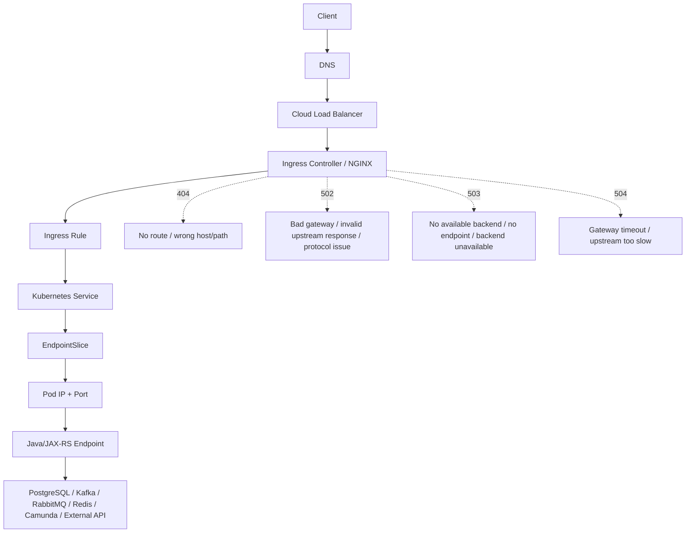
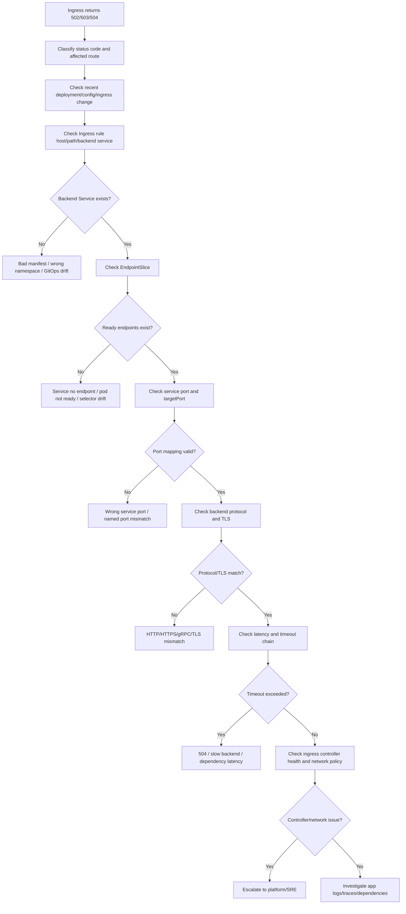
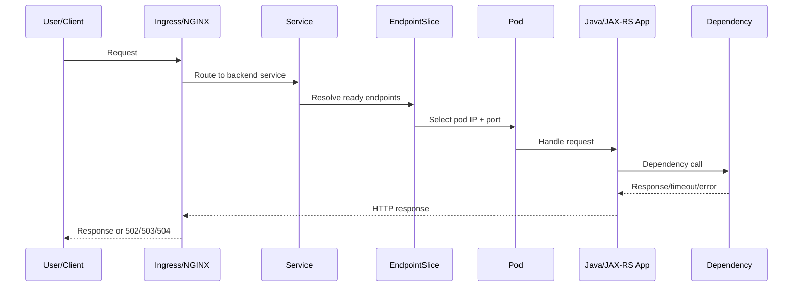

# Part 073 — Common Failure: Ingress 502/503/504

## Tujuan

Ingress `502`, `503`, dan `504` adalah failure mode yang sering terlihat paling depan oleh user/client, tetapi akar masalahnya bisa berada di banyak layer:

- DNS/front door/load balancer
- ingress controller
- NGINX/API gateway configuration
- Kubernetes Service
- EndpointSlice
- Pod readiness
- backend protocol mismatch
- TLS/SNI mismatch
- Java/JAX-RS runtime latency
- downstream dependency seperti PostgreSQL, Kafka, RabbitMQ, Redis, atau Camunda

Part ini membahas runbook production-safe untuk mengisolasi error `502`, `503`, dan `504` dari sudut pandang senior backend engineer.

Fokusnya bukan sekadar melihat log NGINX, tetapi membangun reasoning dari request path:

```text
client -> DNS -> cloud load balancer -> ingress controller -> Ingress rule -> Service -> EndpointSlice -> Pod -> Java/JAX-RS endpoint -> dependency
```

---

## 1. Mental Model

Ingress bukan backend application. Ingress adalah routing layer.

Jika user melihat `502`, `503`, atau `504`, artinya request sudah mencapai sebagian edge/routing layer, tetapi gagal mencapai atau mendapatkan respons valid dari backend.



Operationally:

- `502` usually means gateway reached an upstream but the response/connection was invalid.
- `503` usually means no usable backend was available.
- `504` usually means upstream did not respond before gateway timeout.

This mapping is useful, but not absolute. Exact meaning depends on ingress controller implementation, cloud load balancer, gateway, and NGINX configuration.

---

## 2. Why This Matters Operationally

Ingress failures have high blast radius because they often affect the entire API route.

Impact examples:

- CPQ quote creation API unavailable
- order submission blocked
- callback endpoint unavailable
- frontend/API gateway receives intermittent 5xx
- health checks fail during rollout
- canary promotion stops
- smoke test fails
- upstream timeout causes retry storm
- user sees generic error while backend logs look normal

The dangerous trap: assuming every ingress 5xx is an application bug.

In reality, ingress 5xx can be caused by:

- Service selector drift
- empty EndpointSlice
- pod not Ready
- wrong service `targetPort`
- protocol mismatch between NGINX and backend
- backend TLS expectation mismatch
- network policy blocking ingress controller to pod
- NGINX timeout lower than application timeout
- Java thread pool saturation
- DB pool exhaustion
- dependency latency
- ingress controller reload/config issue

---

## 3. First Triage Questions

Before running random commands, classify the symptom.

Ask:

1. Is it `502`, `503`, or `504`?
2. Is it all routes or one route?
3. Is it all users or only one client/front door path?
4. Did it start after a deployment, config change, secret rotation, ingress change, certificate change, or cluster maintenance?
5. Is the backend Deployment healthy?
6. Does the Service have ready endpoints?
7. Are ingress controller pods healthy?
8. Is latency increasing before the 5xx?
9. Are traces reaching the application?
10. Is there dependency degradation behind the application?

Do not start by restarting the ingress controller or deleting application pods. That can hide evidence and increase blast radius.

---

## 4. First Commands

Set context intentionally:

```bash
kubectl config current-context
kubectl config set-context --current --namespace=<namespace>
```

Inspect Ingress:

```bash
kubectl get ingress -n <namespace>
kubectl describe ingress/<ingress> -n <namespace>
kubectl get ingress/<ingress> -n <namespace> -o yaml
```

Inspect backend Service:

```bash
kubectl get svc/<service> -n <namespace> -o wide
kubectl describe svc/<service> -n <namespace>
```

Inspect EndpointSlice:

```bash
kubectl get endpointslice -n <namespace> -l kubernetes.io/service-name=<service> -o wide
kubectl describe endpointslice -n <namespace> -l kubernetes.io/service-name=<service>
```

Inspect Pods:

```bash
kubectl get pod -n <namespace> -l app.kubernetes.io/name=<app> -o wide
kubectl describe pod/<pod> -n <namespace>
kubectl logs pod/<pod> -n <namespace> --tail=200
```

Inspect rollout:

```bash
kubectl rollout status deployment/<deployment> -n <namespace>
kubectl rollout history deployment/<deployment> -n <namespace>
```

Check recent events:

```bash
kubectl get events -n <namespace> --sort-by=.lastTimestamp
```

Ingress controller logs depend on platform setup. If allowed:

```bash
kubectl get pod -A -l app.kubernetes.io/name=ingress-nginx
kubectl logs -n <ingress-namespace> deployment/<ingress-controller-deployment> --tail=200
```

If ingress controller namespace/name is internal-platform-owned, do not guess. Use the internal verification checklist.

---

## 5. Debugging Flow



The key invariant: never debug ingress alone. Debug the whole path.

---

## 6. Understanding 502

`502 Bad Gateway` usually means the gateway or ingress controller could not get a valid response from the upstream backend.

Common Kubernetes causes:

- backend port accepts TCP but speaks unexpected protocol
- ingress expects HTTP but backend expects HTTPS
- ingress expects HTTP/1.1 but backend expects gRPC/HTTP2
- TLS termination configured at wrong layer
- backend closes connection early
- pod crashes during request
- Java server returns malformed response due to abrupt connection close
- NGINX upstream connection reset
- service points to wrong port
- NetworkPolicy or firewall resets connection

Backend engineer investigation:

```bash
kubectl describe ingress/<ingress> -n <namespace>
kubectl describe svc/<service> -n <namespace>
kubectl get endpointslice -n <namespace> -l kubernetes.io/service-name=<service> -o yaml
kubectl logs pod/<pod> -n <namespace> --tail=200
```

Look for application-side evidence:

- request reached application or not
- trace exists or not
- access log exists or not
- exception during request handling
- connection reset logs
- SSL handshake logs
- servlet/container errors
- JVM crash/restart around the same timestamp

Interpretation:

- No application log/trace: request likely failed before app.
- Access log exists but response broken: app/server may be closing connection or timing out internally.
- TLS handshake errors: protocol/trust/certificate issue.
- Pod restart near request time: backend availability instability.

---

## 7. Understanding 503

`503 Service Unavailable` usually means no healthy backend is available or the gateway cannot route to it.

Common Kubernetes causes:

- Service has no EndpointSlice endpoints
- pods are not Ready
- readiness probe failing
- rollout produced zero ready replicas
- Service selector mismatch
- wrong namespace/backend service reference
- backend deployment scaled to zero
- PDB/rollout/autoscaling interaction causing temporary unavailability
- ingress controller cannot resolve upstream service

First checks:

```bash
kubectl get svc/<service> -n <namespace>
kubectl get endpointslice -n <namespace> -l kubernetes.io/service-name=<service> -o wide
kubectl get deploy/<deployment> -n <namespace>
kubectl get pod -n <namespace> -l app.kubernetes.io/name=<app> -o wide
```

If EndpointSlice is empty, jump to Part 072 style reasoning:

```text
Service selector -> Pod labels -> Pod readiness -> targetPort -> EndpointSlice
```

503 during rollout often means the rollout strategy allowed too many unavailable pods or readiness did not protect traffic correctly.

Check:

```bash
kubectl rollout status deployment/<deployment> -n <namespace>
kubectl describe deployment/<deployment> -n <namespace>
```

Look for:

- `Available=False`
- `Progressing=False`
- `ProgressDeadlineExceeded`
- `readyReplicas: 0`
- `unavailableReplicas` increasing
- readiness failures in pod events

---

## 8. Understanding 504

`504 Gateway Timeout` usually means the ingress/gateway waited for the backend and timed out.

Common causes:

- Java/JAX-RS endpoint too slow
- downstream PostgreSQL query slow
- DB connection pool exhausted
- Kafka/RabbitMQ/Redis dependency timeout
- synchronous workflow call waiting too long
- thread pool saturation
- CPU throttling
- GC pause
- external HTTP dependency slow
- timeout chain mismatch
- ingress timeout too low for endpoint behavior
- backend reads request body slowly

First checks:

```bash
kubectl logs pod/<pod> -n <namespace> --since=15m
kubectl top pod -n <namespace>
kubectl describe pod/<pod> -n <namespace>
```

Then use observability:

- request latency p95/p99
- endpoint-level latency
- ingress upstream latency
- application server thread pool saturation
- DB pool active/waiting count
- PostgreSQL query latency
- Kafka/RabbitMQ/Redis client latency
- CPU throttling
- GC pause
- trace span duration

A `504` is often not solved by simply increasing ingress timeout. Increasing timeout may hide overload and increase resource retention.

Operational rule:

```text
Increase timeout only when the endpoint is intentionally long-running and capacity is proven safe.
Otherwise treat 504 as a latency/capacity/dependency incident.
```

---

## 9. Ingress Rule Verification

Inspect host and path:

```bash
kubectl get ingress/<ingress> -n <namespace> -o yaml
```

Verify:

- `spec.ingressClassName`
- host name
- path
- path type
- backend service name
- backend service port
- TLS secret
- annotations

Common mistakes:

```yaml
backend:
  service:
    name: quote-service
    port:
      number: 8080
```

But Service exposes:

```yaml
ports:
  - name: http
    port: 80
    targetPort: 8080
```

In many ingress resources, backend service port should be the Service port, not necessarily the container port.

Wrong assumption:

```text
Ingress -> containerPort
```

Correct mental model:

```text
Ingress -> Service port -> targetPort -> Pod containerPort
```

---

## 10. Service and EndpointSlice Verification

Check Service port mapping:

```bash
kubectl get svc/<service> -n <namespace> -o yaml
```

Example:

```yaml
ports:
  - name: http
    port: 80
    targetPort: http
```

Then check pod container ports:

```bash
kubectl get pod/<pod> -n <namespace> -o yaml
```

Named ports must match exactly.

Bad pattern:

```yaml
# Service
 targetPort: http

# Pod
 containerPort: 8080
 name: web
```

This can break routing even when pods are Running.

EndpointSlice should contain pod IP and port:

```bash
kubectl get endpointslice -n <namespace> -l kubernetes.io/service-name=<service> -o yaml
```

Look for:

- endpoint addresses
- readiness condition
- port name
- port number
- protocol
- terminating endpoints

---

## 11. Backend Protocol Mismatch

Protocol mismatch is a common source of `502`.

Examples:

| Ingress expects | Backend speaks | Likely result |
|---|---|---|
| HTTP | HTTPS | 502 / connection reset / invalid response |
| HTTPS | HTTP | TLS handshake failure |
| HTTP/1.1 | gRPC HTTP/2 | 502 / protocol error |
| REST path | WebSocket/SSE | disconnect / timeout / buffering issue |
| Plain HTTP | mTLS backend | handshake failure |

Review annotations and service configuration.

For NGINX ingress, backend protocol may be annotation-driven, depending on internal platform standard.

Examples to verify, not blindly copy:

```yaml
nginx.ingress.kubernetes.io/backend-protocol: "HTTP"
```

or:

```yaml
nginx.ingress.kubernetes.io/backend-protocol: "HTTPS"
```

Internal verification is mandatory because annotation support and policy can differ across controllers.

---

## 12. TLS and Certificate Issues

TLS can fail at multiple points:

```text
client -> LB/Ingress TLS
Ingress -> backend TLS
backend -> dependency TLS
```

Ingress 5xx can happen when:

- TLS secret is missing or wrong
- certificate expired
- certificate CN/SAN does not match host
- backend expects TLS but ingress uses HTTP
- backend cert not trusted by ingress
- Java truststore does not trust dependency cert
- SNI mismatch
- mTLS policy changed

Backend engineer safe checks:

```bash
kubectl describe ingress/<ingress> -n <namespace>
kubectl get secret/<tls-secret> -n <namespace>
```

Avoid dumping private key material.

Do not run commands that print TLS private keys or secrets in shared channels.

For Java backend, inspect logs for:

```text
SSLHandshakeException
PKIX path building failed
certificate_unknown
handshake_failure
No subject alternative names matching
```

---

## 13. NetworkPolicy and Ingress-to-Pod Traffic

If NetworkPolicy is enabled, ingress controller traffic to backend pods may be blocked.

Common scenario:

```text
Default deny ingress policy exists.
Application allows traffic only from selected namespaces.
Ingress controller namespace label changed or is not allowed.
Result: ingress cannot connect to backend pod.
```

Check policies:

```bash
kubectl get networkpolicy -n <namespace>
kubectl describe networkpolicy -n <namespace>
```

Verify:

- ingress controller namespace labels
- pod labels
- allowed ports
- default deny policy
- service mesh sidecar port if used
- DNS egress if backend resolves dependencies

Escalate to platform/security if policy ownership is centralized.

---

## 14. Java/JAX-RS Backend Impact

Ingress 5xx may reflect Java runtime behavior.

Backend-specific causes:

- server accepts connection but request thread pool is exhausted
- JAX-RS endpoint blocks on DB call
- DB pool exhausted
- synchronous Kafka/RabbitMQ/Redis call times out
- GC pause delays response beyond ingress timeout
- CPU throttling causes request latency spike
- liveness probe restarts pods during load
- readiness endpoint marks pods Ready before app is fully usable
- graceful shutdown not configured, causing connection reset during rollout

Signals to check:

- request latency p95/p99 by route
- HTTP 5xx by route
- thread pool active/queued
- connection pool active/idle/waiting
- JVM heap and GC pause
- CPU throttling
- pod restarts
- readiness transitions
- deployment markers
- dependency span latency

A 504 on a quote/order endpoint may be caused by dependency pressure, not ingress.

---

## 15. PostgreSQL/Kafka/RabbitMQ/Redis/Camunda Dependency Impact

Ingress timeout can be the visible symptom of dependency degradation.

Examples:

| Dependency | Failure signal | Ingress symptom |
|---|---|---|
| PostgreSQL | slow query, lock, pool wait | 504 |
| Kafka | producer send timeout, metadata fetch delay | 504 / 502 depending on app behavior |
| RabbitMQ | publish timeout, blocked connection | 504 |
| Redis | timeout, connection pool exhaustion | 504 |
| Camunda | worker/API latency, incident spike | 504 / degraded workflow endpoint |
| External HTTP | slow dependency | 504 |

Operational check:

```text
Ingress latency spike -> application latency spike -> dependency span latency -> dependency dashboard
```

Do not tune ingress timeout before validating dependency health.

---

## 16. Observability Signals

Minimum signals for ingress 502/503/504 debugging:

### Ingress layer

- request count by host/path/status
- upstream latency
- upstream status
- ingress controller error logs
- reload/config events
- active connections
- 4xx/5xx rate

### Service discovery layer

- Service existence
- EndpointSlice endpoint count
- pod readiness count
- deployment available replicas

### Application layer

- request rate
- error rate
- latency p95/p99
- route-level metrics
- structured logs with correlation ID
- traces reaching backend
- JVM metrics
- dependency metrics

### Kubernetes layer

- pod restarts
- readiness/liveness events
- rollout events
- CPU throttling
- memory pressure
- node pressure

### Release layer

- deployment marker
- Git commit annotation
- config/secret version
- rollout history
- canary/blue-green status

---

## 17. Safe Mitigation Options

Safe mitigations depend on root cause.

| Root cause | Safer mitigation |
|---|---|
| Bad rollout | rollback through approved deployment/GitOps path |
| Service no endpoint | fix selector/readiness/port through manifest PR or rollback |
| Bad config/secret | rollback config/secret or restore known-good version |
| Backend overload | scale replicas if dependency capacity allows |
| DB pool exhausted | reduce traffic, scale carefully, tune pool only with dependency capacity check |
| Timeout mismatch | align timeout chain after latency diagnosis |
| TLS cert issue | rotate/restore correct cert via approved secret/cert pipeline |
| Ingress controller issue | escalate to platform/SRE |
| NetworkPolicy block | request minimal allow rule through security/platform process |

Unsafe mitigations:

- deleting random pods
- restarting ingress controller without platform coordination
- increasing timeout blindly
- scaling consumers/API pods without dependency capacity check
- editing production resources manually when GitOps owns them
- dumping secrets/cert private keys to debug

---

## 18. When to Rollback

Rollback is appropriate when:

- 5xx started immediately after deployment
- rollout introduced new image, config, secret, ingress, service, or probe change
- previous revision was healthy
- root cause is not yet fully understood but blast radius is high
- canary metrics failed
- smoke test failed after deployment
- error budget burn is unacceptable

Rollback may not help when:

- cloud load balancer has issue
- ingress controller is degraded
- DNS/private endpoint issue exists
- dependency is down
- NetworkPolicy/security rule changed outside app deployment
- certificate expired independent of app version

Rollback should be done through the approved path: GitOps, deployment pipeline, or platform-controlled release process.

---

## 19. When to Escalate

Escalate to platform/SRE when:

- ingress controller pod is unhealthy
- cloud load balancer target health is degraded
- controller logs show platform-level config error
- EndpointSlice/controller behavior seems inconsistent
- node/network/CNI issue suspected
- cluster-wide ingress 5xx spike occurs
- multiple namespaces/services affected
- Gateway/API gateway policy changed

Escalate to security when:

- NetworkPolicy blocks traffic unexpectedly
- mTLS/certificate policy changed
- TLS secret/cert access issue occurs
- RBAC prevents required investigation

Escalate to dependency owner when:

- DB/broker/cache/workflow dependency latency or availability is degraded
- connection pool exhaustion maps to dependency max connection pressure
- dependency dashboard confirms saturation

---

## 20. Internal Verification Checklist

Verify internally:

- ingress controller used: NGINX, cloud LB controller, Gateway API, API Gateway, service mesh, or custom platform
- ingress controller namespace and ownership
- IngressClass standard
- allowed annotations and forbidden annotations
- backend protocol convention
- TLS termination point
- mTLS policy
- default timeout values
- body size and buffering policy
- host/path naming convention
- route ownership
- Service naming convention
- Service port convention
- EndpointSlice visibility
- NetworkPolicy standard for ingress controller traffic
- observability dashboard for ingress
- access log location
- controller log access policy
- deployment marker standard
- rollback authority
- platform/SRE escalation channel
- incident communication process

---

## 21. PR Review Checklist

When reviewing ingress-related changes, check:

- Does host/path match expected route?
- Is `ingressClassName` correct?
- Is backend service name correct?
- Is backend service port correct?
- Does Service have stable selectors?
- Does Service targetPort match pod container port/named port?
- Does TLS secret exist in the same namespace?
- Are annotations allowed by platform policy?
- Are timeout changes justified?
- Are body size/buffering changes justified?
- Is backend protocol explicitly correct?
- Does NetworkPolicy allow ingress controller to backend pod?
- Is observability sufficient after route change?
- Is rollback path clear?
- Is smoke test updated?

---

## 22. Runbook Summary



Debug in this order:

1. classify status code
2. check recent change
3. verify Ingress rule
4. verify Service
5. verify EndpointSlice
6. verify pod readiness
7. verify service port and targetPort
8. verify protocol/TLS
9. verify timeout chain
10. verify app logs/metrics/traces
11. verify dependency health
12. mitigate safely
13. rollback if release-related
14. escalate if platform/security/dependency boundary is crossed

---

## Penutup

Ingress `502`, `503`, dan `504` adalah symptoms, not root causes.

Backend engineer yang efektif tidak berhenti di NGINX log. Ia menelusuri request path dari route sampai pod, dari pod sampai Java/JAX-RS runtime, dan dari runtime sampai dependency.

The operational skill is not memorizing which code means what. The operational skill is isolating which layer broke, proving it with evidence, mitigating safely, and escalating at the right boundary.
