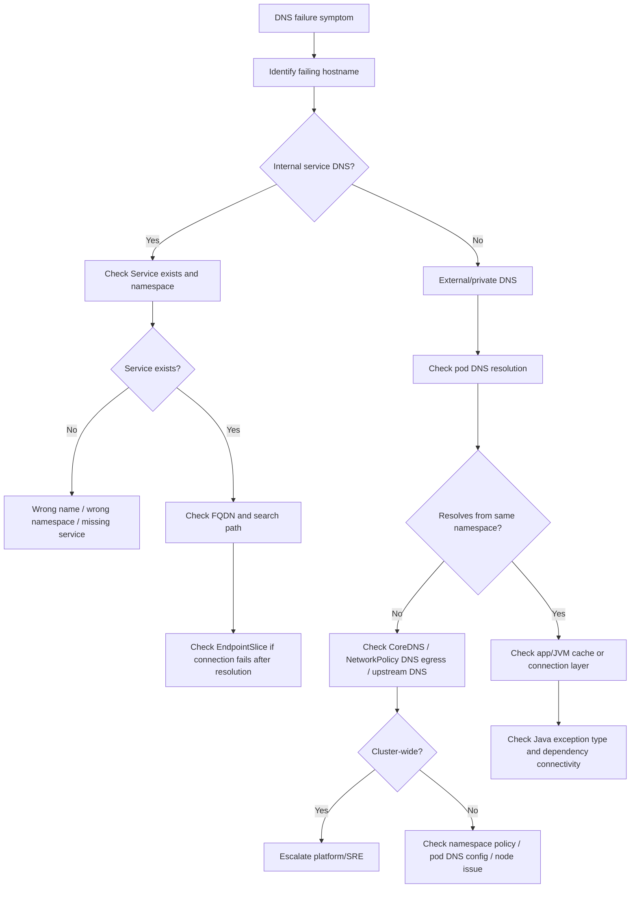
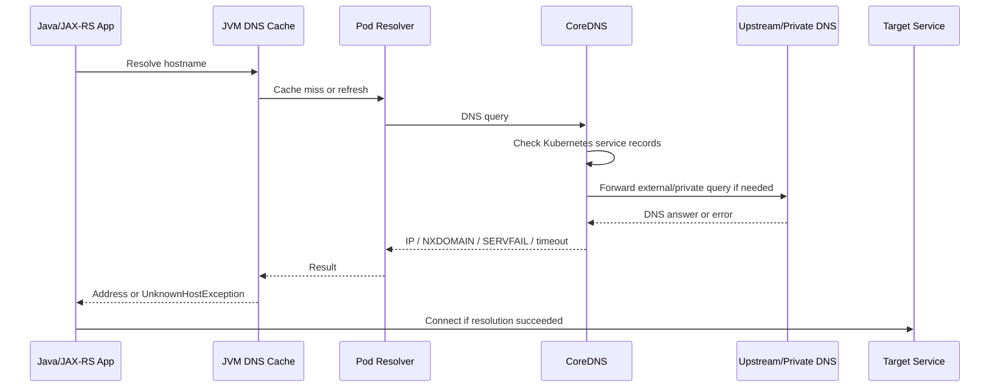

# Part 074 — Common Failure: DNS Failure

## Tujuan

DNS failure adalah salah satu failure mode paling menyesatkan di Kubernetes.

Gejalanya sering terlihat seperti:

- API call timeout
- database connection failure
- Kafka/RabbitMQ/Redis client cannot connect
- external HTTP dependency unavailable
- pod startup failure
- readiness failure
- ingress 502/503/504
- intermittent latency spike
- `UnknownHostException` di Java
- `Name or service not known`
- `Temporary failure in name resolution`

Part ini membahas cara men-debug DNS failure secara production-safe dari sudut pandang backend engineer.

Fokusnya adalah memahami chain resolusi nama:

```text
Java/JAX-RS app -> container resolver -> Pod DNS config -> CoreDNS -> Kubernetes Service DNS / upstream resolver / private DNS -> target IP
```

---

## 1. Mental Model

Di dalam pod, DNS resolution biasanya berjalan melalui `/etc/resolv.conf` yang mengarah ke cluster DNS service, seringnya CoreDNS.

```mermaid
flowchart TD
  A[Java/JAX-RS App] --> B[JVM DNS Cache]
  B --> C[glibc/musl resolver or JVM resolver behavior]
  C --> D[/etc/resolv.conf in Pod]
  D --> E[CoreDNS Service]
  E --> F{Query type}
  F -->|Kubernetes Service| G[Service DNS -> ClusterIP]
  F -->|External domain| H[Upstream DNS resolver]
  F -->|Private endpoint| I[Private DNS Zone / Corporate DNS]
  H --> J[Public or corporate DNS answer]
  I --> K[Private IP answer]
```

DNS failure can happen at any layer:

- wrong name
- wrong namespace
- wrong search domain
- CoreDNS unavailable
- CoreDNS overloaded
- NetworkPolicy blocks DNS egress
- upstream resolver unavailable
- private DNS zone not linked
- private endpoint DNS misconfigured
- JVM caches stale result
- corporate DNS/proxy path broken

---

## 2. Why This Matters Operationally

Most backend services depend on names, not raw IPs.

Examples:

- `quote-service.default.svc.cluster.local`
- `postgresql.internal.company`
- `kafka-bootstrap.kafka.svc.cluster.local`
- `rabbitmq.messaging.svc.cluster.local`
- `redis.cache.svc.cluster.local`
- `camunda-api.workflow.svc.cluster.local`
- AWS/Azure private endpoint hostnames
- third-party API hostnames

If DNS breaks, the app may not even reach the network connection phase.

Operational impact:

- pod startup fails because dependency hostname cannot resolve
- readiness fails due to dependency check
- application logs show `UnknownHostException`
- client receives 504 because backend waits/retries DNS lookup
- consumer cannot connect to broker
- retry storm increases CoreDNS pressure
- node-local or JVM DNS cache makes issue intermittent

---

## 3. First Triage Questions

Ask:

1. Which hostname fails?
2. Is it Kubernetes internal service DNS or external/private DNS?
3. Is failure inside one pod, one namespace, one node, or cluster-wide?
4. Did it start after deployment, NetworkPolicy change, DNS/private endpoint change, cluster upgrade, or CoreDNS change?
5. Does DNS resolution fail, or does connection fail after resolution?
6. Is the failure permanent or intermittent?
7. Does Java show `UnknownHostException`, `ConnectException`, or `SocketTimeoutException`?
8. Does the same hostname resolve from another pod in the same namespace?
9. Does it resolve from a debug pod on the same node?
10. Are CoreDNS pods healthy?

Do not immediately change application timeout or restart pods before proving the layer.

---

## 4. First Commands

Check service DNS if target is internal Kubernetes Service:

```bash
kubectl get svc -n <target-namespace>
kubectl get svc/<service> -n <target-namespace> -o wide
kubectl get endpointslice -n <target-namespace> -l kubernetes.io/service-name=<service> -o wide
```

Check pod DNS config:

```bash
kubectl exec -n <namespace> pod/<pod> -- cat /etc/resolv.conf
```

If exec into production pod is restricted, use an approved debug pod pattern:

```bash
kubectl run dns-debug -n <namespace> --rm -it --image=busybox:1.36 --restart=Never -- nslookup <hostname>
```

or:

```bash
kubectl run dns-debug -n <namespace> --rm -it --image=registry.k8s.io/e2e-test-images/jessie-dnsutils:1.3 --restart=Never -- nslookup <hostname>
```

Use only images approved by internal platform/security policy.

Check CoreDNS:

```bash
kubectl get pod -n kube-system -l k8s-app=kube-dns -o wide
kubectl get svc -n kube-system kube-dns
kubectl describe deployment -n kube-system coredns
```

If CoreDNS is platform-owned, do not modify it. Escalate with evidence.

---

## 5. Debugging Flow



Key distinction:

```text
DNS resolution failure != connection failure
```

A name can resolve correctly and still fail due to firewall, NetworkPolicy, TLS, port, credential, or dependency outage.

---

## 6. Internal Kubernetes Service DNS

Kubernetes Service DNS names usually follow this pattern:

```text
<service>.<namespace>.svc.cluster.local
```

From the same namespace, short name may work:

```text
<service>
```

From another namespace, use:

```text
<service>.<namespace>
```

or full FQDN:

```text
<service>.<namespace>.svc.cluster.local
```

Common mistakes:

- using service name without namespace from another namespace
- wrong namespace after environment split
- renamed service but stale config remains
- Helm release name changed service name
- Kustomize overlay changed namespace
- ExternalName service used incorrectly
- assuming pod name DNS instead of Service DNS

Safe checks:

```bash
kubectl get svc -A | grep <service>
kubectl get svc/<service> -n <namespace> -o yaml
```

If DNS resolves to ClusterIP but application still fails, move to connection debugging:

```text
DNS -> IP resolved
connection -> port/network/TLS/app/dependency issue
```

---

## 7. Wrong Namespace Failure

Very common in enterprise environments:

```text
quote-api tries to call catalog-service
```

It works in dev because both are in same namespace:

```text
catalog-service
```

It fails in staging/prod because catalog runs in another namespace:

```text
catalog-service.catalog-prod.svc.cluster.local
```

Symptoms:

- `UnknownHostException: catalog-service`
- intermittent success in one environment but failure in another
- config works locally but fails in cluster
- only one namespace affected

Operational rule:

Use explicit namespace for cross-namespace calls.

Better:

```text
catalog-service.catalog-prod.svc.cluster.local
```

Risk:

Hardcoding environment namespace can make promotion brittle. Prefer environment-specific config rendered through Helm/Kustomize/GitOps with clear ownership.

---

## 8. CoreDNS Health

CoreDNS is usually the cluster DNS component.

Check:

```bash
kubectl get pod -n kube-system -l k8s-app=kube-dns -o wide
kubectl describe pod -n kube-system -l k8s-app=kube-dns
kubectl logs -n kube-system -l k8s-app=kube-dns --tail=200
```

Only run logs if you have permission and it is acceptable internally.

Signals of CoreDNS problem:

- CoreDNS pods restarting
- high CPU/memory usage
- DNS latency spike
- `SERVFAIL`
- `i/o timeout`
- upstream resolver errors
- node-specific DNS failures
- cluster-wide dependency resolution failures

Backend engineer action:

- collect affected namespace/pods/hostnames
- prove whether failure is cluster-wide or namespace-specific
- check recent deployment/config changes
- escalate to platform/SRE with timestamps and evidence

Do not edit CoreDNS ConfigMap unless you own the platform DNS layer.

---

## 9. NetworkPolicy Blocking DNS

If namespace uses default deny egress, DNS may be blocked.

Symptoms:

- all external/internal names fail to resolve from pods
- app shows `UnknownHostException` or resolver timeout
- service DNS may fail even when Service exists
- issue appears after NetworkPolicy rollout

Check NetworkPolicies:

```bash
kubectl get networkpolicy -n <namespace>
kubectl describe networkpolicy -n <namespace>
```

DNS egress usually requires allowing UDP/TCP 53 to cluster DNS pods or kube-dns service, depending on CNI and policy model.

Do not blindly add broad egress.

Safe reasoning:

```text
Allow only required DNS egress to approved DNS destination.
Then separately allow required dependency egress.
```

Internal platform/security policy decides the exact rule shape.

---

## 10. ndots and Search Domain Effects

Pod `/etc/resolv.conf` may contain something like:

```text
search <namespace>.svc.cluster.local svc.cluster.local cluster.local
options ndots:5
```

With high `ndots`, a query like:

```text
api.company.com
```

may first be tried as:

```text
api.company.com.<namespace>.svc.cluster.local
api.company.com.svc.cluster.local
api.company.com.cluster.local
api.company.com
```

Operational effect:

- more DNS queries per request
- latency amplification
- CoreDNS load increase
- external dependency lookup delay
- intermittent timeout under load

Mitigation options require platform review:

- use fully qualified external names with trailing dot in some clients, where supported
- tune DNS caching behavior
- reduce repeated DNS lookup in application clients
- review CoreDNS capacity
- use connection pooling

Do not change pod DNS options casually in production.

---

## 11. DNS Cache and Java/JVM Behavior

Java can cache DNS results.

This matters when:

- Service IP changes
- ExternalName target changes
- private endpoint DNS changes
- failover changes IP
- stale negative DNS result is cached
- pod keeps old DNS result until restart

Symptoms:

- debug pod resolves correctly
- application pod still fails
- restart fixes the issue temporarily
- only long-running pods are affected
- new pods work, old pods fail

Investigate:

- Java version and DNS cache TTL settings
- security properties such as `networkaddress.cache.ttl`
- HTTP client connection pool behavior
- JVM/application DNS cache libraries
- service discovery library behavior

Operational caution:

Reducing DNS TTL too aggressively can overload DNS. Increasing TTL too much can cause stale routing.

---

## 12. Private DNS and Private Endpoint Failure

Enterprise Kubernetes often uses private endpoints for databases, cloud services, or internal APIs.

Examples:

- AWS VPC endpoint DNS
- Azure Private Endpoint DNS
- private PostgreSQL endpoint
- private Kafka bootstrap endpoint
- corporate internal domains
- hybrid DNS via on-prem resolver

Failure causes:

- private DNS zone not linked to VPC/VNet
- wrong DNS zone record
- conditional forwarder broken
- corporate DNS unavailable
- private endpoint deleted/recreated
- split-horizon DNS returns public IP inside private cluster
- firewall blocks upstream DNS
- node resolver path changed

Symptoms:

- hostname resolves to public IP when private IP expected
- hostname resolves from laptop but not pod
- hostname resolves in one cluster but not another
- only EKS or only AKS environment affected
- dependency connection times out after DNS resolution

Safe check from pod/debug pod:

```bash
nslookup <private-hostname>
```

Then compare expected answer:

```text
Expected: private RFC1918 IP or approved private endpoint IP
Actual: public IP / NXDOMAIN / SERVFAIL / timeout
```

Escalate to platform/cloud networking with exact hostname, namespace, pod/node, timestamp, and DNS answer.

---

## 13. ExternalName Service Issues

`ExternalName` maps a Kubernetes Service name to an external DNS name.

Example:

```yaml
kind: Service
spec:
  type: ExternalName
  externalName: api.internal.company.com
```

Failure modes:

- externalName target wrong
- target DNS broken
- TLS certificate expects original hostname, not service alias
- application sends wrong SNI/Host header
- NetworkPolicy allows service name assumption but actual egress goes external
- observability hides true target

Operational caution:

ExternalName is DNS aliasing, not proxying.

It does not create EndpointSlice with pod IPs and does not solve TLS/SNI mismatch automatically.

For Java clients, hostname used in URL matters for TLS verification.

---

## 14. DNS Failure vs Connection Failure

Always separate two questions:

```text
1. Can the name resolve?
2. Can the app connect to the resolved address and port?
```

Examples:

| Symptom | Likely layer |
|---|---|
| `UnknownHostException` | DNS resolution |
| `Name or service not known` | DNS resolution |
| `Temporary failure in name resolution` | DNS/CoreDNS/upstream timeout |
| `Connection refused` | target reached but port not open/listening |
| `Connection timed out` | network/firewall/NetworkPolicy/routing/target slow |
| `SSLHandshakeException` | TLS/trust/SNI/cert |
| `Read timed out` | app/dependency latency after connection |

This distinction prevents wrong mitigation.

Do not change DNS when the real issue is NetworkPolicy, TLS, or dependency availability.

---

## 15. Java/JAX-RS Backend Impact

Java services commonly expose DNS failure as:

```text
java.net.UnknownHostException
java.net.SocketTimeoutException
java.net.ConnectException
javax.net.ssl.SSLHandshakeException
```

For JAX-RS API service, DNS failure can affect:

- startup dependency check
- readiness endpoint
- outbound HTTP client
- database connection pool initialization
- Kafka/RabbitMQ/Redis clients
- Camunda client/worker connection
- external API calls

Operationally dangerous patterns:

- readiness checks hard-fail on non-critical dependency DNS
- startup blocks forever waiting for dependency DNS
- retry loops hammer DNS continuously
- low DNS timeout causes false negatives
- high DNS timeout causes request thread starvation
- application logs hostname but not dependency role

Good practice:

- log dependency name and hostname safely
- expose dependency health separately
- use bounded retries
- avoid infinite startup wait
- make readiness semantics intentional

---

## 16. PostgreSQL/Kafka/RabbitMQ/Redis/Camunda DNS Impact

### PostgreSQL

DNS failure may prevent pool startup or cause runtime reconnect failure.

Check:

- JDBC URL host
- connection pool initialization behavior
- failover hostname behavior
- private endpoint DNS
- read/write endpoint DNS if applicable

### Kafka

Kafka has two hostname layers:

- bootstrap server DNS
- advertised listener hostnames returned by broker metadata

A bootstrap hostname resolving is not enough. The advertised broker hostnames must also resolve from the pod.

### RabbitMQ

Check:

- broker hostname
- cluster/service DNS
- TLS/SNI if using secure AMQP
- connection recovery behavior

### Redis

Check:

- standalone/cluster/sentinel hostnames
- cluster node advertised addresses
- TLS trust
- private endpoint DNS

### Camunda

Check:

- Camunda API/Zeebe gateway hostname
- worker connection config
- retry/backoff behavior
- incident spike caused by worker disconnect

---

## 17. EKS-Specific DNS Concerns

In EKS, DNS issues can involve:

- CoreDNS add-on health/version
- VPC DNS settings
- Route 53 private hosted zones
- VPC endpoint private DNS
- subnet/security group/NACL path to DNS
- node-local DNS cache if used
- security groups for pods if enabled
- hybrid Route 53 resolver rules

Backend engineer should verify symptoms and escalate with evidence, not edit AWS networking resources directly unless explicitly owned.

Internal verification checklist:

- EKS cluster DNS add-on owner
- Route 53 private zone ownership
- VPC endpoint DNS ownership
- hybrid resolver ownership
- CoreDNS dashboard/log access

---

## 18. AKS-Specific DNS Concerns

In AKS, DNS issues can involve:

- CoreDNS health/version
- Azure Private DNS Zone linkage
- Azure Private Endpoint DNS records
- VNet DNS server configuration
- custom DNS servers
- UDR/NSG affecting DNS path
- private cluster DNS
- Azure Firewall/proxy

Backend engineer should identify whether hostname resolves to expected private IP and escalate to platform/cloud networking if private DNS linkage is broken.

Internal verification checklist:

- Private DNS Zone owner
- VNet DNS config owner
- Private Endpoint owner
- AKS CoreDNS owner
- custom DNS forwarding path

---

## 19. Observability Signals

Useful DNS signals:

### Application

- `UnknownHostException` count
- outbound dependency error count by dependency
- HTTP client DNS/connect/read timeout split
- DB pool connection creation failure
- Kafka/RabbitMQ/Redis reconnect metrics
- readiness failure reason

### Kubernetes

- CoreDNS pod restarts
- CoreDNS CPU/memory
- DNS request rate
- DNS latency
- DNS error rate
- NetworkPolicy changes
- pod restart/readiness transition

### Network/cloud

- private DNS query result
- Route 53/Azure Private DNS records
- VPC/VNet DNS config
- firewall/proxy logs
- private endpoint status

### Release

- config change for hostname
- secret/config drift
- deployment marker
- GitOps sync event
- namespace migration

---

## 20. Safe Mitigation Options

| Root cause | Safer mitigation |
|---|---|
| Wrong service name/namespace | fix config/manifest through PR/GitOps |
| Stale config | rollback config or redeploy with known-good config |
| CoreDNS unhealthy | escalate to platform/SRE |
| DNS egress blocked | request minimal DNS egress allow rule |
| Private DNS zone broken | escalate to cloud networking/platform |
| Java stale DNS cache | rolling restart may mitigate, but fix TTL/config/root cause |
| External dependency hostname changed | update config through release process |
| Kafka advertised listeners not resolvable | escalate to Kafka/platform owner |
| Private endpoint returns public IP | escalate cloud DNS/network owner |

Unsafe mitigations:

- hardcoding IPs in application config
- editing CoreDNS ConfigMap without ownership
- adding broad `0.0.0.0/0` egress to bypass policy
- disabling TLS verification to work around hostname mismatch
- restarting all pods without isolating affected scope
- dumping secrets while checking dependency config

---

## 21. When to Rollback

Rollback is useful when DNS failure follows:

- hostname config change
- namespace change
- Helm/Kustomize overlay change
- ExternalName change
- NetworkPolicy change bundled with app release
- dependency endpoint config change
- secret/config rotation that changed endpoint values

Rollback may not help when:

- CoreDNS is degraded
- private DNS zone linkage broke outside app release
- cloud endpoint changed externally
- platform DNS configuration changed
- corporate DNS resolver is down
- cluster upgrade changed DNS behavior

Rollback should use approved GitOps/pipeline path.

---

## 22. When to Escalate

Escalate to platform/SRE when:

- CoreDNS pods are unhealthy
- DNS failure is cluster-wide
- DNS latency/error rate spikes across namespaces
- kube-dns service is unreachable
- node-local DNS/cache issue suspected
- cluster upgrade/add-on change is involved

Escalate to network/cloud team when:

- private DNS zone is wrong
- VPC/VNet DNS config is wrong
- private endpoint DNS returns wrong IP
- conditional forwarder fails
- corporate DNS/proxy/firewall is involved

Escalate to security when:

- NetworkPolicy blocks DNS unexpectedly
- egress policy needs exception
- DNS query visibility/audit is required

Escalate to dependency owner when:

- dependency advertises unresolvable hostnames
- Kafka broker metadata returns unreachable names
- Redis cluster/sentinel addresses are wrong
- database failover endpoint behavior changed

---

## 23. Internal Verification Checklist

Verify internally:

- cluster DNS provider and owner
- CoreDNS namespace/deployment name
- CoreDNS dashboard and logs access
- DNS debug pod image approved by security/platform
- policy for `kubectl exec` in production
- DNS egress NetworkPolicy standard
- internal service naming convention
- cross-namespace service naming convention
- environment namespace mapping
- private DNS ownership
- AWS Route 53 private zone usage if EKS
- Azure Private DNS Zone usage if AKS
- corporate DNS forwarding path
- proxy/NO_PROXY standard
- Java DNS cache TTL standard
- dependency hostname configuration source
- GitOps repo/overlay for hostnames
- alert for CoreDNS health
- runbook for private endpoint DNS issue
- escalation channel for DNS/networking

---

## 24. PR Review Checklist

When reviewing DNS-affecting changes, check:

- Is hostname correct for target environment?
- Is namespace explicit for cross-namespace service calls?
- Is service name stable?
- Does Helm/Kustomize overlay render the expected hostname?
- Does config distinguish internal service DNS from external/private DNS?
- Does NetworkPolicy allow DNS egress?
- Does dependency egress allow the resolved target?
- Does Java client use appropriate timeout/retry?
- Is DNS failure observable separately from connection timeout?
- Is private endpoint DNS documented?
- Is rollback safe?
- Are secrets/configs updated through approved process?
- Are Kafka advertised listener hostnames resolvable from pods?
- Are TLS/SNI implications considered when using aliases or ExternalName?

---

## 25. Runbook Summary



Debug in this order:

1. identify exact hostname
2. classify internal service DNS vs external/private DNS
3. test from same namespace using approved method
4. inspect pod `/etc/resolv.conf`
5. verify Service/namespace if internal DNS
6. verify CoreDNS health if broad failure
7. verify NetworkPolicy DNS egress
8. verify private DNS records if private endpoint
9. distinguish DNS failure from connection/TLS failure
10. check Java DNS cache/client behavior
11. mitigate safely
12. rollback if release/config-related
13. escalate if platform/network/security boundary is crossed

---

## Penutup

DNS failure is rarely just DNS.

It is often where application config, Kubernetes service discovery, network policy, cloud private networking, Java runtime behavior, and dependency topology intersect.

A strong backend engineer does not stop at `UnknownHostException`. They prove whether the name is wrong, the namespace is wrong, CoreDNS is unhealthy, DNS egress is blocked, private DNS is broken, Java is caching stale data, or the connection fails after resolution.
