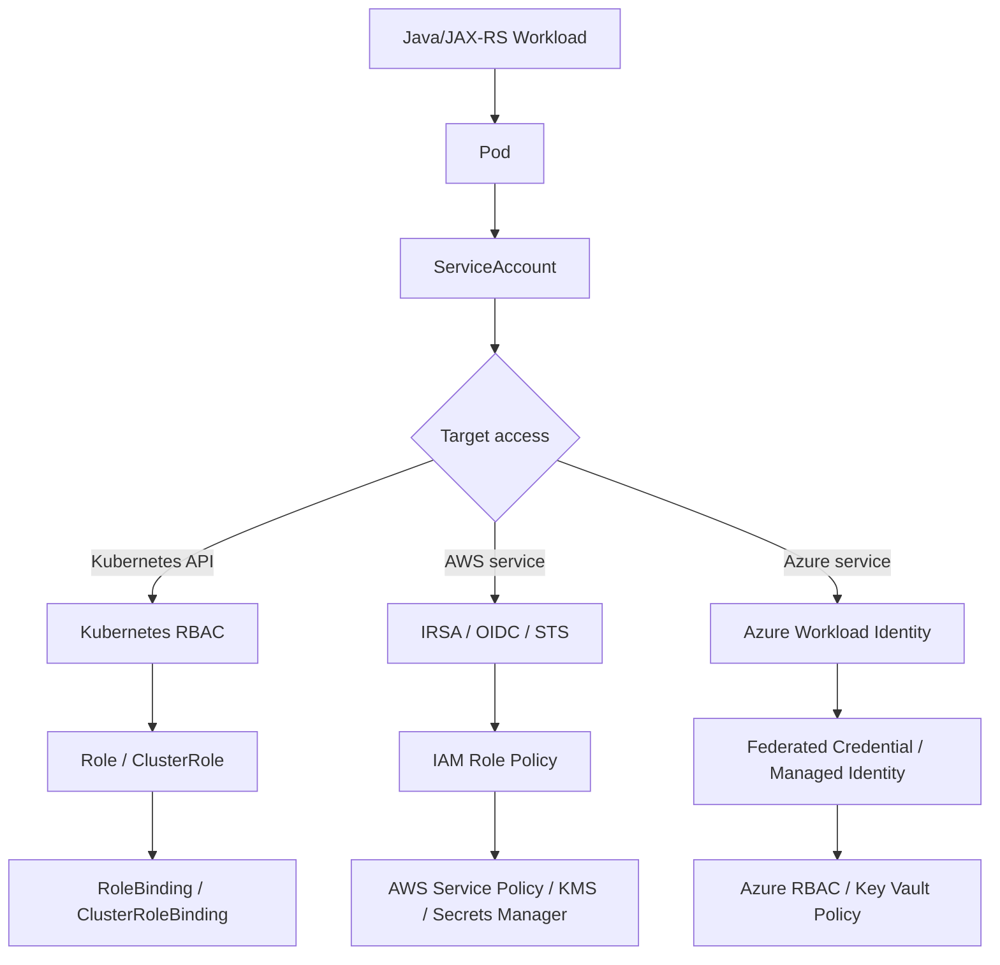
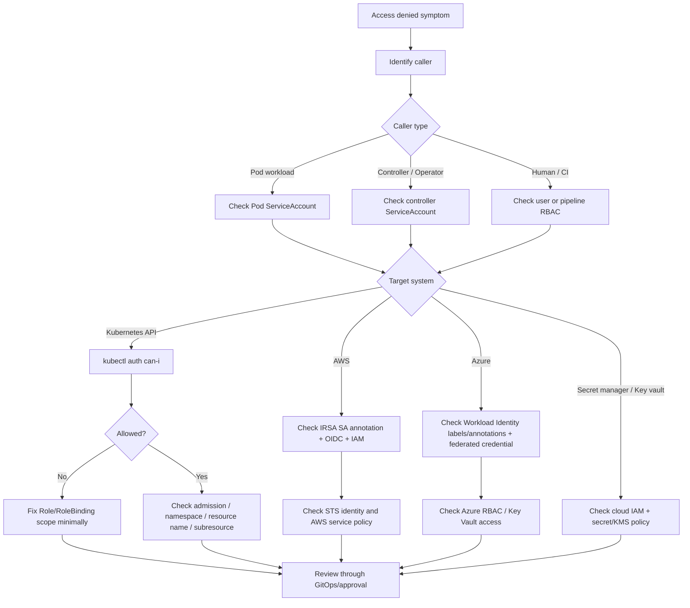
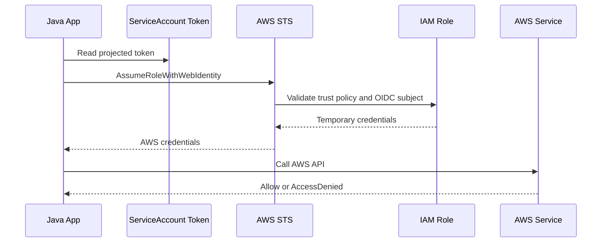

# Part 075 — Common Failure: RBAC and Access Denied

## Tujuan

`AccessDenied`, `Forbidden`, `Unauthorized`, dan `permission denied` adalah failure mode yang sering terlihat sederhana, tetapi layer penyebabnya bisa berbeda total.

Di Kubernetes production, access denied bisa berasal dari:

- Kubernetes API RBAC
- ServiceAccount yang salah
- Role/RoleBinding yang tidak lengkap
- ClusterRole/ClusterRoleBinding yang terlalu sempit atau terlalu luas
- token ServiceAccount tidak ter-mount
- token projection expired atau salah audience
- admission policy menolak request
- cloud IAM denied di AWS/Azure
- IRSA/OIDC trust policy salah di EKS
- Azure Workload Identity federated credential salah di AKS
- SDK credential chain mengambil identity yang salah
- secret manager/key vault/KMS policy menolak akses
- namespace/scope mismatch
- network/private endpoint issue yang disalahartikan sebagai authorization issue

Part ini membahas cara men-debug access denied secara production-safe dari sudut pandang senior backend engineer.

Fokus utamanya adalah memisahkan dua domain:

```text
Kubernetes authorization != cloud authorization
```

Backend engineer perlu tahu cukup dalam untuk membaca failure, mengumpulkan evidence, dan mengeskalasi ke owner yang tepat tanpa membuat permission lebih lebar dari yang dibutuhkan.

---

## 1. Mental Model

Access path workload biasanya melewati beberapa lapisan identity.



A single error message like `AccessDenied` is not enough.

You must identify:

1. who is calling
2. what resource is being accessed
3. which authorization system is denying
4. whether the denial is Kubernetes-side or cloud-side
5. whether the identity is the expected identity
6. whether scope is namespace-local, cluster-wide, account/subscription-wide, or resource-specific

---

## 2. Why This Matters Operationally

Permission problems can cause:

- pod startup failure
- readiness failure
- CrashLoopBackOff
- secret retrieval failure
- external secret sync failure
- config reload failure
- deployment controller failure
- operator failure
- backup/restore failure
- migration job failure
- Kafka/RabbitMQ/Redis credential retrieval failure
- PostgreSQL password retrieval failure
- cloud SDK call failure
- incident mitigation blocked because responder lacks read access

The risky response is to widen permissions quickly:

```text
"just give it admin"
```

That may restore service but creates a long-lived security defect.

The correct operational response is:

```text
identify exact identity + exact denied action + exact resource + exact layer + minimal correction
```

---

## 3. Symptoms

Common Kubernetes-side symptoms:

```text
Error from server (Forbidden): pods is forbidden
Error from server (Forbidden): users "..." cannot list resource "pods"
User "system:serviceaccount:ns:sa" cannot get resource "secrets"
serviceaccounts "x" is forbidden
forbidden: User cannot create resource deployments in namespace
```

Common pod/application symptoms:

```text
Forbidden
Unauthorized
401
403
AccessDenied
AccessDeniedException
PermissionDeniedException
The caller is not authorized
no identity-based policy allows the action
failed to assume role
invalid audience
invalid subject
AADSTS... error
ManagedIdentityCredential authentication unavailable
```

Common controller/operator symptoms:

```text
failed to list *v1.Secret: secrets is forbidden
cannot watch resource endpointslices
failed to update status subresource
failed to patch finalizers
```

Common secret integration symptoms:

```text
ExternalSecret sync failed
SecretProviderClass mount failed
failed to get secret value
KMS decrypt denied
Key Vault access forbidden
```

---

## 4. First Triage Questions

Ask:

1. Is the failing actor a human user, CI/CD pipeline, controller, operator, or application pod?
2. Is the target Kubernetes API, AWS service, Azure service, database, broker, or secret store?
3. What exact action is denied: `get`, `list`, `watch`, `create`, `update`, `patch`, `delete`, `assume role`, `get secret value`, `decrypt`, etc.?
4. Which resource is denied?
5. Which namespace is involved?
6. Which ServiceAccount does the pod use?
7. Did this start after a manifest change, RBAC change, ServiceAccount change, cloud IAM change, secret rotation, or platform upgrade?
8. Does the same workload work in another environment?
9. Is this failing for all pods or only newly rolled pods?
10. Is the error really authorization, or is it network/DNS/TLS being wrapped by the client library?

Do not assume the visible service name is the actual identity used by the runtime.

---

## 5. First Safe Commands

Identify pod and ServiceAccount:

```bash
kubectl get pod -n <namespace> <pod> -o jsonpath='{.spec.serviceAccountName}{"\n"}'
kubectl get pod -n <namespace> <pod> -o jsonpath='{.spec.automountServiceAccountToken}{"\n"}'
kubectl describe pod -n <namespace> <pod>
```

Inspect ServiceAccount:

```bash
kubectl get sa -n <namespace> <serviceaccount> -o yaml
```

Check role bindings in namespace:

```bash
kubectl get rolebinding -n <namespace>
kubectl get role -n <namespace>
```

Check cluster role bindings that mention the ServiceAccount:

```bash
kubectl get clusterrolebinding -o yaml | grep -n "system:serviceaccount:<namespace>:<serviceaccount>" -C 5
```

Use `auth can-i` for Kubernetes RBAC:

```bash
kubectl auth can-i get secrets \
  --as=system:serviceaccount:<namespace>:<serviceaccount> \
  -n <namespace>

kubectl auth can-i list pods \
  --as=system:serviceaccount:<namespace>:<serviceaccount> \
  -n <namespace>

kubectl auth can-i patch deployments/status \
  --as=system:serviceaccount:<namespace>:<serviceaccount> \
  -n <namespace>
```

Check whether the current human user can perform an action:

```bash
kubectl auth can-i get pods -n <namespace>
kubectl auth can-i create pods/exec -n <namespace>
kubectl auth can-i get secrets -n <namespace>
```

For production, avoid reading secret values. Checking metadata is usually enough:

```bash
kubectl get secret -n <namespace>
kubectl describe secret -n <namespace> <secret>
```

---

## 6. Debugging Flow



Core principle:

```text
Never widen permission before proving the denied verb/resource/scope.
```

---

## 7. Kubernetes RBAC: What to Inspect

Kubernetes RBAC authorizes requests against Kubernetes API resources.

RBAC answers questions like:

```text
Can this subject get/list/watch/create/update/patch/delete this Kubernetes resource in this namespace or cluster scope?
```

Important objects:

- `ServiceAccount`
- `Role`
- `ClusterRole`
- `RoleBinding`
- `ClusterRoleBinding`

Important dimensions:

- subject
- namespace
- apiGroup
- resource
- subresource
- verb
- resource name

Example Role:

```yaml
apiVersion: rbac.authorization.k8s.io/v1
kind: Role
metadata:
  name: quote-service-reader
  namespace: quote-prod
rules:
  - apiGroups: [""]
    resources: ["configmaps"]
    verbs: ["get", "list"]
```

Example RoleBinding:

```yaml
apiVersion: rbac.authorization.k8s.io/v1
kind: RoleBinding
metadata:
  name: quote-service-reader-binding
  namespace: quote-prod
subjects:
  - kind: ServiceAccount
    name: quote-service
    namespace: quote-prod
roleRef:
  kind: Role
  name: quote-service-reader
  apiGroup: rbac.authorization.k8s.io
```

Backend engineer should review:

- Is this workload really supposed to call Kubernetes API?
- Is namespace scope enough?
- Is `list/watch` required or only `get`?
- Is secret access actually needed?
- Is `patch status` required for an operator/controller only?
- Is a ClusterRole used unnecessarily?

---

## 8. Common Kubernetes RBAC Failure Modes

### 8.1 ServiceAccount mismatch

Manifest says one ServiceAccount, but pod runs with another.

Check:

```bash
kubectl get deploy -n <namespace> <deployment> -o jsonpath='{.spec.template.spec.serviceAccountName}{"\n"}'
kubectl get pod -n <namespace> <pod> -o jsonpath='{.spec.serviceAccountName}{"\n"}'
```

Possible causes:

- wrong Helm value
- wrong Kustomize overlay
- default ServiceAccount used accidentally
- deployment not rolled after ServiceAccount change
- GitOps drift

### 8.2 RoleBinding in wrong namespace

A `RoleBinding` grants permissions in the namespace where the RoleBinding exists.

If pod is in `quote-prod` but RoleBinding is in `quote-dev`, access fails.

Check:

```bash
kubectl get rolebinding -A | grep <serviceaccount>
```

### 8.3 Missing subresource permission

Some operations require subresources.

Examples:

- `pods/log`
- `pods/exec`
- `deployments/status`
- `pods/portforward`

Check:

```bash
kubectl auth can-i get pods/log -n <namespace>
kubectl auth can-i create pods/exec -n <namespace>
kubectl auth can-i patch deployments/status -n <namespace>
```

### 8.4 Need `watch`, not only `get`

Controllers often need `list` and `watch`, not only `get`.

Symptoms:

```text
failed to list *v1.Pod
failed to watch *v1.Secret
```

Do not grant `*` until the exact watch target is known.

### 8.5 Cluster-scoped resource accessed with namespace Role

Examples:

- `nodes`
- `persistentvolumes`
- `clusterroles`
- `storageclasses`
- `ingressclasses`

A namespace `Role` cannot grant access to cluster-scoped resources.

Backend workload should rarely need these.

### 8.6 Forbidden due to admission policy, not RBAC

RBAC may allow the action, but admission rejects the object.

Symptoms:

```text
admission webhook denied the request
violates PodSecurity
policy validation failure
```

This is not fixed by adding RBAC.

Escalate or update manifest to comply with policy.

---

## 9. Cloud IAM Failure Mode: EKS IRSA

For EKS, application pods often access AWS services through IRSA.

Typical chain:

```text
Pod ServiceAccount
-> projected OIDC token
-> STS AssumeRoleWithWebIdentity
-> IAM Role
-> AWS service policy
-> optional resource policy / KMS policy
```



Check ServiceAccount annotation:

```bash
kubectl get sa -n <namespace> <serviceaccount> -o yaml
```

Look for something like:

```yaml
metadata:
  annotations:
    eks.amazonaws.com/role-arn: arn:aws:iam::<account-id>:role/<role-name>
```

Common IRSA failure causes:

- missing ServiceAccount annotation
- wrong ServiceAccount used by pod
- IAM role trust policy subject does not match namespace/SA
- OIDC provider missing or changed
- projected token audience mismatch
- SDK too old or credential chain overridden
- AWS region misconfigured
- IAM role lacks action permission
- resource policy denies access
- KMS key policy denies decrypt
- SCP or permission boundary denies action

Backend engineer should not directly edit IAM in production unless explicitly authorized.

Evidence to collect:

- namespace
- pod name
- ServiceAccount name
- ServiceAccount annotation
- exact AWS API action denied
- target ARN if available
- error request ID
- recent deployment/config change
- CloudTrail event if accessible

---

## 10. Cloud IAM Failure Mode: AKS Azure Workload Identity

For AKS, application pods may use Azure Workload Identity.

Typical chain:

```text
Pod ServiceAccount
-> projected token
-> federated credential
-> managed identity / app registration
-> Azure RBAC or Key Vault policy
-> Azure service
```

Common Azure Workload Identity failure causes:

- missing workload identity label on pod template
- missing ServiceAccount annotation/client ID
- wrong ServiceAccount used
- federated credential subject mismatch
- wrong tenant
- wrong audience
- Azure SDK credential chain using another credential
- Key Vault policy/RBAC missing
- Azure RBAC not propagated yet
- private endpoint/DNS issue mistaken as identity issue

Check Kubernetes side:

```bash
kubectl get sa -n <namespace> <serviceaccount> -o yaml
kubectl get pod -n <namespace> <pod> -o yaml | grep -i azure -C 5
```

Look for workload identity labels/annotations based on internal AKS standard.

Evidence to collect:

- namespace
- pod/deployment
- ServiceAccount
- client ID annotation
- tenant/subscription/resource group if known
- Azure service target
- exact error code
- correlation/request ID
- recent identity/RBAC change

---

## 11. SDK Credential Chain Pitfall

Java apps may not use the identity you think they use.

Examples:

- AWS SDK uses environment variables before web identity provider
- Azure SDK DefaultAzureCredential tries several credential sources
- local/dev credential leaks into non-prod container image
- mounted credential file overrides workload identity
- missing region causes fallback behavior
- profile env var points to nonexistent credential source

Operational check:

- log resolved identity safely if internal standard allows it
- never log token or secret value
- log ARN/client ID/principal ID only if allowed
- verify credential provider chain used by runtime
- compare pod env vars with expected identity configuration

For AWS, suspicious env vars:

```text
AWS_ACCESS_KEY_ID
AWS_SECRET_ACCESS_KEY
AWS_PROFILE
AWS_ROLE_ARN
AWS_WEB_IDENTITY_TOKEN_FILE
AWS_REGION
AWS_DEFAULT_REGION
```

For Azure, suspicious env vars:

```text
AZURE_CLIENT_ID
AZURE_TENANT_ID
AZURE_FEDERATED_TOKEN_FILE
AZURE_AUTHORITY_HOST
```

Use safe inspection policy. Do not print secret values.

---

## 12. Java/JAX-RS Impact

Access denied can surface in Java/JAX-RS service as:

- startup exception
- dependency client initialization failure
- readiness endpoint returning unhealthy
- request-time 500
- retry loop
- thread pool saturation
- blocked request waiting for credential refresh
- consumer failure to fetch config/secret
- Camunda worker failing to claim job due to dependency access

Example anti-pattern:

```text
readiness endpoint calls cloud secret manager on every probe
```

If secret manager access is denied or slow, Kubernetes removes pod from service endpoints even if the app could serve cached config.

Better design:

- fetch required secret at startup
- fail fast if mandatory secret missing
- expose readiness based on serving readiness, not deep dependency liveness
- refresh secrets asynchronously if supported
- emit explicit metric for secret refresh failure
- avoid per-request secret manager calls

---

## 13. Dependency-Specific Access Denied

### PostgreSQL

Possible causes:

- wrong username/password secret
- cloud IAM DB auth denied
- TLS client certificate missing
- network private endpoint blocked

Access denied string may come from PostgreSQL, not Kubernetes.

### Kafka

Possible causes:

- SASL credentials wrong
- ACL denies topic/group operation
- mTLS certificate invalid
- secret rotation mismatch

Kafka ACL denied is not fixed by Kubernetes RBAC.

### RabbitMQ

Possible causes:

- username/password wrong
- vhost permission denied
- TLS certificate issue
- policy denies queue/exchange access

### Redis

Possible causes:

- AUTH failed
- ACL user lacks command permission
- TLS trust failure
- wrong secret version

### Camunda

Possible causes:

- API token denied
- client credential scope missing
- worker identity missing permission to activate jobs
- process engine authorization failure

Operational rule:

```text
Always identify the authority that denied the request.
```

---

## 14. Safe Mitigation Options

Safe mitigations depend on the layer.

### Kubernetes RBAC denied

Possible mitigation:

- add minimal Role rule
- bind correct ServiceAccount
- correct namespace of RoleBinding
- add missing subresource verb
- deploy through GitOps/approved pipeline

Avoid:

- `cluster-admin`
- wildcard verbs/resources
- broad ClusterRoleBinding for app workload

### Cloud IAM denied

Possible mitigation:

- fix ServiceAccount annotation
- fix trust policy/federated credential
- add exact cloud action on exact resource
- fix KMS/Key Vault resource policy
- roll pod if identity token/env changed

Avoid:

- account-wide admin policy
- long-lived static credentials in Kubernetes Secret
- bypassing workload identity with emergency access keys

### Secret access denied

Possible mitigation:

- restore previous secret version if rotation broke consumers
- correct external secret reference
- fix secret store permission
- roll pods after secret sync
- temporarily rollback deployment if new version requires unavailable permission

---

## 15. When to Rollback

Rollback is appropriate when:

- new deployment changed ServiceAccount
- new deployment changed cloud identity annotation
- new deployment changed secret reference
- new deployment changed SDK credential chain behavior
- new deployment introduced a new permission requirement not yet approved
- readiness/startup fails due to missing permission
- user-impacting errors started immediately after release

Rollback may not help when:

- platform RBAC policy changed
- cloud IAM role/policy changed externally
- secret store policy changed
- token issuer/OIDC changed
- admission policy changed
- cluster upgrade changed identity integration

In those cases, rollback may be a temporary mitigation only if old pods still hold valid token/config and can continue serving.

---

## 16. When to Escalate

Escalate to platform/SRE when:

- `kubectl auth can-i` results conflict with observed behavior
- admission webhooks deny valid workload changes
- controller/operator ServiceAccount lacks required permission
- projected token volume is missing or broken
- OIDC issuer/workload identity infrastructure appears broken
- cluster-wide RBAC behavior changed

Escalate to security/IAM when:

- IAM trust policy must be changed
- federated credential must be changed
- KMS/Key Vault policy must be changed
- new production permission is required
- permission boundary/SCP/Azure policy denies action
- broad privilege exception is requested

Escalate to dependency owner when:

- Kafka/RabbitMQ/Redis/PostgreSQL/Camunda ACL denies access
- broker/database credential rotation broke consumers
- managed service policy changed

---

## 17. Evidence Capture Template

Use this during incident or escalation.

```md
## Access Denied Evidence

- Time window:
- Environment:
- Namespace:
- Workload:
- Pod:
- Container:
- ServiceAccount:
- Target system:
- Target resource:
- Denied action:
- Error message:
- Request/correlation ID:
- Recent deployment/config/IAM change:
- Kubernetes RBAC result:
- Cloud IAM identity observed:
- Related dashboard/log links:
- Mitigation attempted:
- Rollback option:
- Escalation owner:
```

Never paste secret values, bearer tokens, private keys, or raw projected tokens into incident notes.

---

## 18. Internal Verification Checklist

Verify internally:

- Which workloads are allowed to call Kubernetes API?
- Which workloads use ServiceAccount beyond default?
- Which ServiceAccounts are mapped to AWS IRSA roles?
- Which ServiceAccounts are mapped to Azure Workload Identity?
- What is the standard naming convention for ServiceAccount/IAM role/managed identity?
- Where are Role/RoleBinding manifests stored?
- Are RBAC changes managed by app team, platform team, or security team?
- What is the approval path for production permission changes?
- Are wildcard permissions allowed?
- Are ClusterRoleBindings allowed for application workloads?
- How are secret manager/key vault permissions granted?
- Where can CloudTrail/Azure Activity Logs be checked?
- Are application logs allowed to emit resolved principal/ARN/client ID?
- What is the break-glass process?
- How are permission changes rolled back?

---

## 19. PR Review Checklist

When reviewing Kubernetes/IAM-related PRs, check:

- Does workload use intended ServiceAccount?
- Is default ServiceAccount avoided for production workloads?
- Are Role/RoleBinding scoped to namespace where possible?
- Are verbs minimal?
- Are resources minimal?
- Are subresources explicit?
- Is ClusterRole truly necessary?
- Is ClusterRoleBinding avoided for app workload unless justified?
- Is `automountServiceAccountToken` disabled when Kubernetes API access is not needed?
- Are IRSA/Azure Workload Identity annotations correct?
- Is cloud permission change linked to approval?
- Is KMS/Key Vault policy included if needed?
- Are secret values absent from manifests and CI logs?
- Does rollback path preserve identity compatibility?
- Are dashboard/alert/runbook updated for new external permission dependency?

---

## 20. Operational Invariants

Keep these invariants:

1. Application workload should not have Kubernetes API access unless there is a real runtime need.
2. Namespace-scoped permission is safer than cluster-scoped permission.
3. `get` is safer than `list/watch`; `list/watch` is safer than `create/update/patch/delete`.
4. Secret metadata inspection is safer than secret value inspection.
5. Cloud IAM denied is not fixed by Kubernetes RBAC.
6. Kubernetes RBAC denied is not fixed by cloud IAM.
7. Identity must be observable without exposing credentials.
8. Emergency permission widening must have expiry and cleanup.
9. Access denied debugging must identify caller, action, resource, scope, and authority.
10. Production permission changes should be GitOps-reviewed and auditable.

---

## 21. Common Anti-Patterns

Avoid:

- giving app workloads `cluster-admin`
- binding app ServiceAccount to broad platform ClusterRole
- using default ServiceAccount in production
- storing static cloud access keys in Kubernetes Secret as first option
- printing tokens/secrets in logs during debugging
- granting wildcard `*` verbs/resources to fix incident quickly without cleanup
- mixing human and workload identity
- assuming `403` always means IAM
- assuming `Forbidden` always means Kubernetes RBAC
- changing IAM and Kubernetes RBAC at the same time without isolating cause
- missing rollback plan for identity/config changes

---

## 22. Summary

RBAC and access denied failures require precise layer separation.

The operational question is not simply:

```text
Why is access denied?
```

The better question is:

```text
Which identity attempted which action on which resource, and which authorization layer denied it?
```

For backend engineers, mastery means:

- knowing the ServiceAccount actually used by the pod
- using `kubectl auth can-i` safely
- distinguishing Kubernetes RBAC from cloud IAM
- understanding IRSA and Azure Workload Identity failure modes
- collecting evidence without leaking credentials
- requesting minimal permission changes
- knowing when rollback is safer than permission expansion
- escalating to platform/security/dependency owners with actionable data

Access denied is not only a security problem. In production, it is also an availability, rollout safety, and incident response problem.
