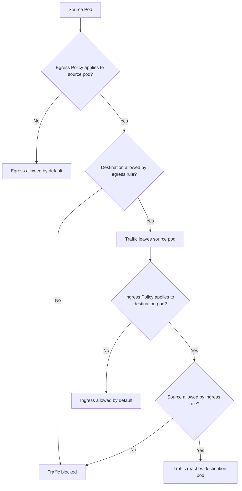
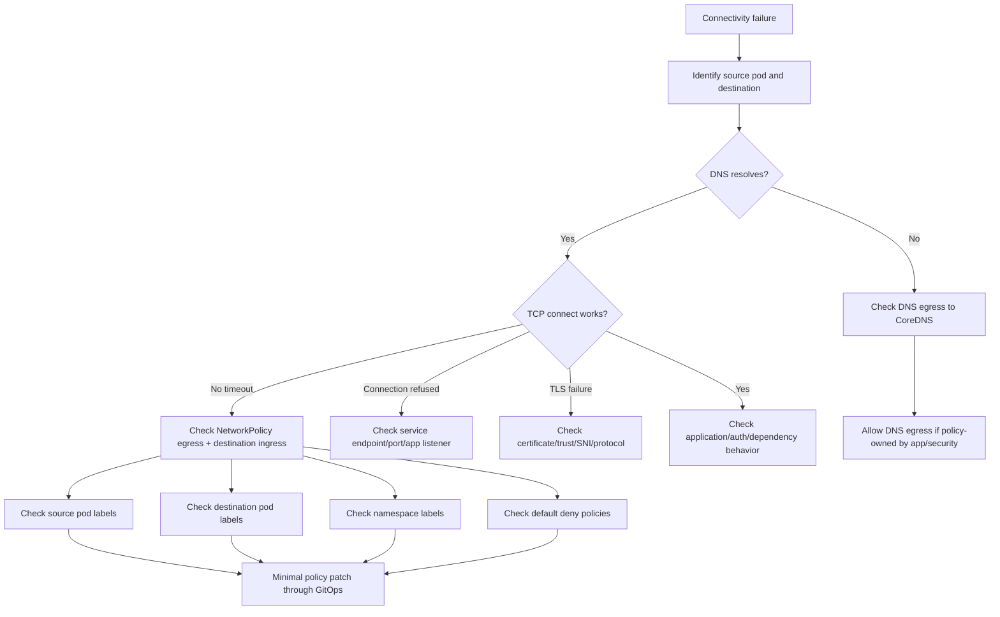

# Part 076 — Common Failure: NetworkPolicy Blocked Traffic

## Tujuan

NetworkPolicy blocked traffic adalah failure mode yang sering terlihat seperti dependency outage, DNS failure, timeout, TLS issue, atau aplikasi hang.

Gejala umumnya:

- request antar service timeout
- pod tidak bisa resolve DNS
- pod bisa resolve hostname tetapi tidak bisa connect
- PostgreSQL connection timeout
- Kafka/RabbitMQ/Redis client cannot connect
- Camunda worker tidak bisa reach engine/gateway
- external HTTP dependency timeout
- readiness failure
- ingress 502/503/504 akibat backend dependency call lambat
- consumer lag naik karena broker blocked

Part ini membahas cara men-debug traffic yang diblokir NetworkPolicy secara production-safe dari sudut pandang backend engineer.

Fokusnya adalah membedakan:

```text
application failure != network path failure != policy denial
```

---

## 1. Mental Model

NetworkPolicy mengontrol traffic di level pod berdasarkan selector.

NetworkPolicy bukan firewall umum yang otomatis berlaku di semua cluster. Efeknya bergantung pada CNI yang mendukung NetworkPolicy.



Important rule:

```text
For pod-to-pod traffic, both source egress and destination ingress may need to allow the connection.
```

If either side blocks, traffic fails.

---

## 2. NetworkPolicy Scope

NetworkPolicy is namespace-scoped.

A policy selects pods in its own namespace:

```yaml
spec:
  podSelector:
    matchLabels:
      app: quote-service
```

It can allow traffic from/to:

- pods selected by `podSelector`
- namespaces selected by `namespaceSelector`
- pods within selected namespaces using combined selectors
- IP ranges via `ipBlock`
- specific ports/protocols

NetworkPolicy does not usually select Services directly.

This creates a common debugging trap:

```text
The app calls a Service DNS name, but NetworkPolicy allows or blocks the underlying pod/IP path.
```

---

## 3. Why This Matters Operationally

Enterprise Kubernetes often moves toward default-deny networking.

That is good for security, but it increases operational precision requirements.

A backend service may need explicit egress to:

- CoreDNS
- PostgreSQL
- Kafka
- RabbitMQ
- Redis
- Camunda
- internal REST services
- cloud secret manager/key vault
- cloud metadata/identity endpoints if applicable
- external API gateway
- observability collector
- SMTP or notification service if used

If policy is incomplete, the application appears broken even though code and dependency are healthy.

---

## 4. Symptoms by Blocked Path

### DNS egress blocked

Symptoms:

```text
UnknownHostException
Temporary failure in name resolution
DNS lookup timeout
```

Impact:

- every dependency by hostname fails
- startup/readiness may fail
- retry storm can increase load

### Database egress blocked

Symptoms:

```text
Connection timed out
HikariPool initialization failure
could not connect to server
```

Impact:

- API 500s
- startup failure
- readiness failure
- transaction processing stops

### Kafka egress blocked

Symptoms:

```text
Bootstrap broker disconnected
TimeoutException: Timed out waiting for a node assignment
consumer lag increasing
```

Impact:

- consumer group unavailable
- lag grows
- downstream workflow delay

### RabbitMQ egress blocked

Symptoms:

```text
Connection refused or timed out
AMQP connection timeout
consumer count drops
queue depth increases
```

Impact:

- messages accumulate
- retry/DLQ pressure rises

### Redis egress blocked

Symptoms:

```text
RedisConnectionFailureException
command timeout
cache unavailable
lock acquisition timeout
```

Impact:

- latency spike
- cache miss storm
- distributed lock failure

### Observability egress blocked

Symptoms:

```text
missing traces
metrics not scraped or exported
log shipping failure
```

Impact:

- blind incident response
- false sense of health

---

## 5. First Triage Questions

Ask:

1. Which source pod cannot connect?
2. Which destination is failing?
3. Is the destination inside the same namespace, another namespace, or external to cluster?
4. Does DNS resolution succeed?
5. Does TCP connection succeed after DNS resolution?
6. Is the failure timeout, connection refused, TLS error, or application-level 403/401?
7. Did a NetworkPolicy, label, namespace label, service label, or deployment label change recently?
8. Did a new default-deny policy get introduced?
9. Does another pod in the same namespace with same labels succeed?
10. Does a debug pod with same labels/service account behave differently?

Do not assume NetworkPolicy until DNS and basic connectivity are separated.

---

## 6. First Safe Commands

List policies in namespace:

```bash
kubectl get networkpolicy -n <namespace>
kubectl describe networkpolicy -n <namespace> <policy>
```

Inspect source pod labels:

```bash
kubectl get pod -n <source-namespace> <source-pod> --show-labels
```

Inspect destination pod labels:

```bash
kubectl get pod -n <destination-namespace> -l <selector> --show-labels
```

Inspect namespace labels:

```bash
kubectl get namespace --show-labels
kubectl get namespace <namespace> -o yaml
```

Inspect service and endpoints:

```bash
kubectl get svc -n <destination-namespace> <service> -o yaml
kubectl get endpointslice -n <destination-namespace> -l kubernetes.io/service-name=<service> -o wide
```

Check whether DNS resolution works:

```bash
kubectl exec -n <namespace> pod/<pod> -- nslookup <hostname>
```

If production `exec` is restricted, use an approved debug pod process.

Check TCP connectivity with approved tooling:

```bash
kubectl run net-debug -n <namespace> --rm -it \
  --image=<approved-debug-image> \
  --restart=Never -- sh
```

Inside debug shell:

```bash
nc -vz <host> <port>
curl -v --connect-timeout 3 http://<host>:<port>/health
```

Use only approved debug images and approved namespaces.

---

## 7. Debugging Flow



Key distinction:

```text
timeout often suggests dropped traffic
connection refused often suggests listener/service/port problem
TLS error suggests traffic reached something but protocol/trust failed
```

NetworkPolicy denial often appears as timeout, not an explicit denied message.

---

## 8. Default Deny Pattern

Many clusters use default deny policies.

Example ingress default deny:

```yaml
apiVersion: networking.k8s.io/v1
kind: NetworkPolicy
metadata:
  name: default-deny-ingress
  namespace: quote-prod
spec:
  podSelector: {}
  policyTypes:
    - Ingress
```

Example egress default deny:

```yaml
apiVersion: networking.k8s.io/v1
kind: NetworkPolicy
metadata:
  name: default-deny-egress
  namespace: quote-prod
spec:
  podSelector: {}
  policyTypes:
    - Egress
```

Once a pod is selected by an egress policy, only explicitly allowed egress traffic is permitted.

Once a pod is selected by an ingress policy, only explicitly allowed ingress traffic is permitted.

Operational impact:

- adding a new dependency requires policy update
- changing labels can accidentally remove allow rules
- moving service to another namespace can break traffic
- private endpoint IP change may break IPBlock rules
- DNS egress must be explicitly allowed

---

## 9. DNS Egress Must Be Explicit

If egress is default-deny, allow DNS.

Typical CoreDNS runs in `kube-system` and listens on UDP/TCP 53.

Example pattern:

```yaml
apiVersion: networking.k8s.io/v1
kind: NetworkPolicy
metadata:
  name: allow-dns-egress
  namespace: quote-prod
spec:
  podSelector:
    matchLabels:
      app.kubernetes.io/name: quote-service
  policyTypes:
    - Egress
  egress:
    - to:
        - namespaceSelector:
            matchLabels:
              kubernetes.io/metadata.name: kube-system
      ports:
        - protocol: UDP
          port: 53
        - protocol: TCP
          port: 53
```

Verify internal standard before using this exact selector. Some clusters label namespaces differently.

DNS egress mistakes cause broad failures because every hostname lookup is affected.

---

## 10. Service-to-Service Allow Rules

For internal service calls, allow source egress and destination ingress as needed.

Example egress from quote-service to order-service:

```yaml
apiVersion: networking.k8s.io/v1
kind: NetworkPolicy
metadata:
  name: quote-service-egress
  namespace: quote-prod
spec:
  podSelector:
    matchLabels:
      app.kubernetes.io/name: quote-service
  policyTypes:
    - Egress
  egress:
    - to:
        - namespaceSelector:
            matchLabels:
              app.company.com/environment: prod
          podSelector:
            matchLabels:
              app.kubernetes.io/name: order-service
      ports:
        - protocol: TCP
          port: 8080
```

Example ingress into order-service:

```yaml
apiVersion: networking.k8s.io/v1
kind: NetworkPolicy
metadata:
  name: order-service-ingress
  namespace: order-prod
spec:
  podSelector:
    matchLabels:
      app.kubernetes.io/name: order-service
  policyTypes:
    - Ingress
  ingress:
    - from:
        - namespaceSelector:
            matchLabels:
              app.company.com/environment: prod
          podSelector:
            matchLabels:
              app.kubernetes.io/name: quote-service
      ports:
        - protocol: TCP
          port: 8080
```

Internal label keys must be verified.

---

## 11. Database Egress

PostgreSQL egress can be allowed by:

- pod selector if database is inside cluster
- namespace selector + pod selector
- IPBlock if external/private endpoint
- FQDN policy if CNI supports it

Vanilla Kubernetes NetworkPolicy does not support FQDN directly.

If PostgreSQL is accessed by hostname and resolves to private IP, a static `ipBlock` may be fragile when IP changes.

Operational checks:

- Does hostname resolve?
- Which IP does it resolve to from pod?
- Is destination inside cluster or outside cluster?
- Is port 5432 allowed?
- Is firewall/private endpoint also allowing traffic?
- Is TLS required?

Do not add broad egress like `0.0.0.0/0` unless explicitly approved as temporary emergency mitigation.

---

## 12. Kafka/RabbitMQ/Redis Egress

Message broker egress needs special attention because client libraries may connect to multiple endpoints.

### Kafka

Kafka clients connect to bootstrap broker first, then advertised broker addresses.

NetworkPolicy must allow:

- bootstrap endpoint
- all advertised brokers reachable by the client
- correct broker ports
- DNS for broker names

Failure pattern:

```text
bootstrap resolves and connects, but metadata points to broker hostnames that are blocked or unresolved
```

### RabbitMQ

RabbitMQ clients usually connect to AMQP port:

- 5672 for AMQP
- 5671 for AMQPS
- management UI/API port if used separately

Allow only needed ports.

### Redis

Redis may use:

- 6379 plaintext
- 6380 TLS depending on platform
- cluster mode endpoints across multiple nodes

Redis cluster can require access to multiple node IPs/ports.

---

## 13. Camunda Worker Connectivity

Camunda workers may need egress to:

- Camunda engine REST API
- Zeebe gateway depending on version/architecture
- identity/auth service
- related workflow dependency APIs
- observability collector

Failure mode:

- worker pod is healthy
- no jobs are activated
- workflow incidents increase
- job backlog grows
- no obvious exception except timeout or unavailable gateway

Check:

- worker target host/port
- namespace/service labels
- NetworkPolicy egress
- destination ingress
- TLS/mTLS if used
- identity/auth dependency path

---

## 14. Egress to Cloud Services

Cloud service access may involve multiple layers:

```text
Pod -> NetworkPolicy -> node/VPC/VNet route -> NAT/private endpoint -> firewall/NSG/security group -> cloud service
```

NetworkPolicy is only one layer.

For AWS:

- VPC endpoint
- NAT gateway
- security group
- NACL
- route table
- private hosted zone
- AWS service endpoint

For Azure:

- Private Endpoint
- Private DNS Zone
- NSG
- UDR
- Azure Firewall
- NAT Gateway
- service endpoint/private link

If NetworkPolicy allows traffic but route/firewall blocks it, symptoms are similar.

Collect evidence before escalating:

- source pod IP
- node IP
- destination hostname/IP
- destination port
- namespace
- active NetworkPolicies
- DNS resolution result
- connectivity test result
- timestamp

---

## 15. Label Drift Failure

NetworkPolicy depends heavily on labels.

Label drift can break connectivity without any explicit policy change.

Examples:

- app label changed from `quote-service` to `quote-api`
- Helm chart changed `app` label to `app.kubernetes.io/name`
- namespace label missing in new environment
- canary pods have different labels
- rollout changes pod template labels
- destination service moved namespace but namespace selector not updated

Check:

```bash
kubectl get pod -n <namespace> <pod> --show-labels
kubectl get ns <namespace> --show-labels
kubectl describe networkpolicy -n <namespace> <policy>
```

Operational invariant:

```text
Any label used by NetworkPolicy is part of the runtime contract.
```

Treat it like an API contract, not decoration.

---

## 16. Named Ports and Port Mismatch

NetworkPolicy can use numeric ports or named ports depending on implementation/support.

Port mistakes cause unexpected blocking.

Check:

- containerPort
- Service port
- targetPort
- NetworkPolicy port
- protocol TCP/UDP

Example confusion:

```text
Service port: 80
TargetPort: 8080
Container port: 8080
NetworkPolicy allows: 80
```

Depending on traffic path and policy interpretation, this may not allow what you expect.

Use explicit review with platform/SRE when policy behavior is uncertain.

---

## 17. Safe Mitigation Options

Safe mitigation should be minimal and reversible.

Possible mitigations:

- allow DNS egress for affected app
- add explicit egress to required dependency only
- add explicit ingress from required source only
- correct pod/namespace labels
- rollback label change that broke selectors
- rollback NetworkPolicy change
- temporarily pause rollout if new version introduced dependency not yet allowed
- route through approved internal gateway if required by platform pattern

Avoid:

- deleting default-deny policy in production
- allowing all egress permanently
- allowing all namespaces to access sensitive dependency
- using `ipBlock: 0.0.0.0/0` without approval and expiry
- changing labels globally without understanding selectors
- debugging with privileged pods outside approved process

---

## 18. When to Rollback

Rollback is appropriate when:

- deployment changed labels used by NetworkPolicy
- release introduced a new dependency not included in policy
- Helm/Kustomize overlay changed policy incorrectly
- canary pods are blocked because labels differ
- policy change caused immediate production impact
- new default-deny was applied without allow rules

Rollback may not help when:

- platform CNI behavior changed
- cloud firewall/NSG/security group changed
- private endpoint routing changed
- DNS/private endpoint changed
- dependency moved to new IP outside allowed range

In those cases, rollback may only reduce impact if old pods use old path.

---

## 19. When to Escalate

Escalate to platform/SRE when:

- CNI behavior is unclear
- NetworkPolicy appears ineffective or too effective
- cluster-wide default-deny was introduced
- CoreDNS access is blocked by platform policy
- pod-to-pod traffic behavior differs across nodes
- eBPF/CNI observability is needed
- debug pod process requires privileged tooling

Escalate to security/network team when:

- new egress to sensitive dependency is needed
- allowlist/firewall/NSG/security group must be changed
- broad egress is requested
- private endpoint routing is involved
- policy exception is needed

Escalate to dependency owner when:

- destination service endpoint changed
- broker advertised listeners changed
- database endpoint moved
- Redis cluster topology changed
- Camunda gateway/engine endpoint changed

---

## 20. Evidence Capture Template

Use this during incident or escalation.

```md
## NetworkPolicy / Connectivity Evidence

- Time window:
- Environment:
- Source namespace:
- Source workload:
- Source pod:
- Source pod labels:
- Destination hostname/service/IP:
- Destination namespace:
- Destination pod labels:
- Destination port/protocol:
- DNS result:
- TCP test result:
- Error observed:
- Active NetworkPolicies in source namespace:
- Active NetworkPolicies in destination namespace:
- Recent deployment/policy/label changes:
- Cloud route/firewall/private endpoint involved:
- Mitigation attempted:
- Rollback option:
- Escalation owner:
```

Do not include credentials, tokens, or secrets in evidence.

---

## 21. Internal Verification Checklist

Verify internally:

- Does the cluster CNI enforce NetworkPolicy?
- Which CNI is used in EKS/AKS/on-prem?
- Is default-deny applied per namespace?
- Who owns NetworkPolicy manifests?
- Are policies generated by Helm/Kustomize or platform templates?
- What label keys are official for app/team/environment?
- How is DNS egress allowed?
- Are FQDN policies supported by the CNI or not?
- How are external dependencies represented in policy?
- Are database/broker/cloud egress allowlists managed by app team or platform/security?
- What debug pod/image is approved?
- Are connectivity tests allowed in production?
- Where are CNI/network logs available?
- What is the emergency exception process?
- How are temporary broad egress exceptions expired and cleaned up?

---

## 22. PR Review Checklist

When reviewing NetworkPolicy-related PRs, check:

- Does policy select the intended pods?
- Are labels stable and standardized?
- Does the policy accidentally select all pods?
- Is DNS egress allowed if egress default-deny applies?
- Are required dependencies allowed explicitly?
- Are ports correct?
- Are namespace selectors based on stable labels?
- Is destination ingress also allowing the source?
- Are canary/blue-green labels covered?
- Are Kafka advertised broker endpoints covered?
- Are Redis cluster nodes covered if relevant?
- Are cloud private endpoint IPs stable or managed by platform pattern?
- Is broad egress avoided?
- Is there a rollback path?
- Are dashboards/alerts/runbooks updated for connectivity failure?

---

## 23. Operational Invariants

Keep these invariants:

1. NetworkPolicy is a selector-based runtime contract.
2. Labels used by policy are not cosmetic.
3. DNS egress must be considered first in default-deny namespaces.
4. For pod-to-pod traffic, source egress and destination ingress may both matter.
5. A Service name in app config does not mean policy targets the Service object.
6. Kafka and Redis cluster clients may need more than one endpoint allowed.
7. Timeout usually indicates blocked/dropped path, but not always NetworkPolicy.
8. Connection refused usually means destination reached but listener/port is wrong or unavailable.
9. TLS failure usually means traffic reached something but trust/protocol is wrong.
10. Broad egress exceptions must be temporary, approved, and auditable.

---

## 24. Common Anti-Patterns

Avoid:

- deleting NetworkPolicy to fix incident without approval
- adding `0.0.0.0/0` egress permanently
- forgetting DNS egress in default-deny namespace
- allowing database access from entire namespace when only one workload needs it
- relying on unstable app labels
- using namespace labels that are missing in some environments
- forgetting destination ingress policy
- assuming service selector and NetworkPolicy selector are equivalent
- ignoring Kafka advertised listeners
- ignoring Redis cluster topology
- mixing network policy changes with unrelated rollout changes
- failing to update policy when introducing new dependency

---

## 25. Summary

NetworkPolicy blocked traffic is usually observed indirectly through timeouts, dependency failures, and missing telemetry.

The key debugging discipline is to isolate layers:

```text
DNS resolution -> TCP connectivity -> TLS/protocol -> application/auth -> dependency behavior
```

For backend engineers, mastery means:

- identifying source and destination precisely
- reading pod and namespace labels as runtime contracts
- understanding default-deny behavior
- checking DNS egress first
- reviewing egress and ingress policy together
- knowing dependency-specific connectivity requirements
- collecting evidence for platform/security escalation
- requesting minimal policy changes
- avoiding broad exceptions that become permanent risk

NetworkPolicy is security control and production dependency at the same time. A small label or port mismatch can become a real outage.
