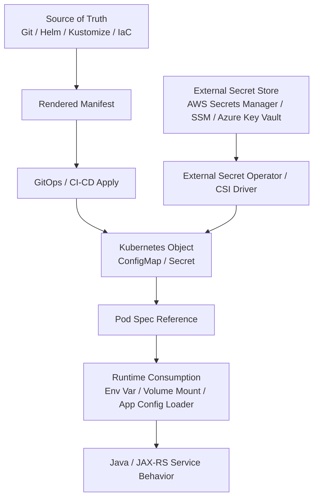
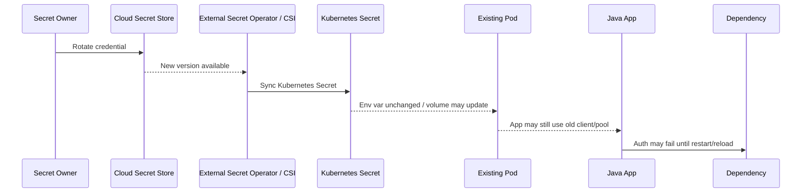

# Part 077 — Common Failure: Secret and Config Drift

## Tujuan

Secret/config drift adalah kondisi ketika konfigurasi yang **dianggap benar** oleh engineer, pipeline, atau GitOps repo tidak sama dengan konfigurasi yang benar-benar dikonsumsi oleh pod runtime.

Di production, failure ini sering terlihat seperti masalah aplikasi, dependency, TLS, authentication, database, Kafka, RabbitMQ, Redis, atau Camunda. Padahal akar masalahnya adalah konfigurasi yang salah, hilang, stale, belum tersinkron, atau belum membuat pod restart.

Gejala umum:

- pod `CrashLoopBackOff` setelah deployment
- pod gagal start karena missing environment variable
- JAX-RS service return 500 setelah config change
- readiness gagal karena dependency URL salah
- PostgreSQL authentication failed
- Kafka consumer gagal join consumer group karena bootstrap server salah
- RabbitMQ connection refused atau authentication failed
- Redis client mengarah ke endpoint lama
- Camunda worker tidak bisa connect ke gateway/engine
- TLS handshake failure karena truststore/CA bundle stale
- pod masih memakai secret lama setelah secret rotation
- GitOps menunjukkan `Synced`, tetapi runtime behavior tidak sesuai ekspektasi
- GitOps menunjukkan `OutOfSync` karena manual change di cluster

Part ini membahas cara men-debug Secret dan ConfigMap drift secara production-safe.

Prinsip utamanya:

```text
Do not debug secrets by exposing secret values.
Debug secret/config wiring, version, timestamp, reference, mount, hash, rollout, and ownership.
```

---

## 1. Mental Model

Ada beberapa state yang harus dibedakan.



Failure bisa terjadi di salah satu layer:

| Layer | Drift Example | Symptom |
|---|---|---|
| Source of truth | Wrong value committed to env overlay | Semua pod baru memakai config salah |
| Rendered manifest | Helm value tertimpa default | Manifest final tidak sesuai review |
| GitOps apply | App out-of-sync | Object cluster tidak sama dengan Git |
| Kubernetes object | Secret/ConfigMap missing | Pod tidak bisa start |
| Pod spec reference | Wrong key/name | Env var kosong atau volume mount gagal |
| Runtime consumption | App tidak reload config | Object sudah berubah tapi pod behavior tetap lama |
| External secret sync | Cloud secret updated, Kubernetes secret belum sync | Pod masih memakai credential lama |

Operational debugging harus menentukan drift terjadi di layer mana.

---

## 2. Secret vs ConfigMap Drift

ConfigMap biasanya berisi konfigurasi non-secret:

- feature toggle non-sensitive
- endpoint internal
- timeout
- pool size
- topic/queue name
- environment label
- application mode
- logging level

Secret berisi material sensitif:

- password database
- API token
- private key
- client secret
- trust material tertentu
- broker credential
- cloud credential legacy

Perbedaan penting:

```text
ConfigMap drift can usually be inspected directly.
Secret drift must be inspected through metadata, reference, version, checksum, rotation timestamp, and controlled verification.
```

Backend engineer harus sangat hati-hati. Jangan melakukan:

```bash
kubectl get secret my-secret -o yaml
kubectl get secret my-secret -o jsonpath='{.data.password}' | base64 -d
kubectl exec pod -- printenv | grep PASSWORD
```

Kecuali ada explicit internal procedure, approval, audit trail, dan redaction requirement.

---

## 3. Common Failure Patterns

### 3.1 Missing ConfigMap

Gejala:

- pod stuck `CreateContainerConfigError`
- event menyebut ConfigMap not found
- rollout stuck karena pod baru tidak bisa start

Contoh event:

```text
Error: configmap "quote-order-config" not found
```

Penyebab umum:

- ConfigMap belum dibuat di namespace target
- Helm/Kustomize overlay tidak menghasilkan ConfigMap
- nama ConfigMap berubah tetapi Deployment belum diperbarui
- GitOps sync order salah
- environment promotion tidak lengkap

---

### 3.2 Missing Secret

Gejala:

- pod stuck `CreateContainerConfigError`
- volume mount gagal
- app gagal start karena env var tidak tersedia

Contoh event:

```text
Error: secret "postgres-credentials" not found
```

Penyebab umum:

- External Secret belum sync
- Secret salah namespace
- Secret generator menghasilkan nama berbeda
- Secret dibuat manual di environment tertentu dan hilang saat rebuild
- cloud secret access denied

---

### 3.3 Wrong ConfigMap

Gejala:

- pod running tetapi behavior salah
- service mengarah ke dependency environment yang salah
- timeout terlalu pendek/panjang
- feature flag aktif di environment yang salah
- consumer membaca topic/queue yang salah

Penyebab umum:

- overlay environment salah
- value Helm tertimpa default
- config key typo
- duplicate config di beberapa source
- manual change di cluster tidak sesuai Git

---

### 3.4 Wrong Secret

Gejala:

- database authentication failed
- broker authentication failed
- TLS client auth failed
- cloud service access denied
- token invalid

Penyebab umum:

- secret name benar tetapi isi mengarah ke credential environment lain
- rotation belum lengkap
- External Secret mengambil key/path salah
- secret version salah
- application masih memakai pod lama

Debugging wrong Secret harus dilakukan tanpa membuka secret value secara sembarangan.

---

### 3.5 Stale Secret

Gejala:

- credential sudah dirotasi tetapi pod masih gagal auth
- sebagian pod berhasil, sebagian gagal
- pod lama sehat, pod baru gagal
- setelah restart manual, behavior berubah

Penyebab umum:

- secret object sudah berubah, tetapi env var di pod tidak berubah sampai restart
- secret volume updated, tetapi aplikasi tidak reload
- external secret sync interval belum berjalan
- pod menggunakan mounted file tetapi connection pool tidak recreate client
- rolling restart belum dilakukan setelah rotation

---

### 3.6 Pod Not Restarted After Config Change

Kubernetes tidak otomatis restart pod hanya karena ConfigMap/Secret berubah.

Jika config dikonsumsi lewat env var:

```text
ConfigMap/Secret update -> existing pod env var stays old -> restart required
```

Jika config dikonsumsi lewat volume mount:

```text
ConfigMap/Secret update -> mounted file may update -> application may still not reload it
```

Jika aplikasi membaca config hanya saat startup, restart tetap dibutuhkan.

---

## 4. First 10 Minutes Triage

Saat mencurigai secret/config drift, gunakan urutan berikut.

```text
1. Identify affected workload and namespace
2. Check recent deployment/config/secret change
3. Check pod status and events
4. Check Deployment pod template references
5. Check ConfigMap/Secret object existence and metadata
6. Check GitOps sync/drift state
7. Check whether pod was restarted after change
8. Check app logs for config binding/auth failure
9. Check dependency-specific failure signal
10. Decide: rollback, restart, sync, config fix, or escalate
```

Safe commands:

```bash
kubectl get deploy <deploy> -n <ns>
kubectl describe deploy <deploy> -n <ns>
kubectl get pods -n <ns> -l app=<app>
kubectl describe pod <pod> -n <ns>
kubectl logs <pod> -n <ns> --previous
kubectl logs <pod> -n <ns>
kubectl get configmap -n <ns>
kubectl get secret -n <ns>
kubectl get events -n <ns> --sort-by=.lastTimestamp
```

For Secret, prefer metadata inspection:

```bash
kubectl get secret <secret> -n <ns> -o jsonpath='{.metadata.name}{"\n"}{.metadata.creationTimestamp}{"\n"}{.metadata.resourceVersion}{"\n"}'
kubectl describe secret <secret> -n <ns>
```

Avoid printing secret values.

---

## 5. Object-Level Inspection

### 5.1 Check Deployment References

Look for references:

```bash
kubectl get deploy <deploy> -n <ns> -o yaml
```

Review only wiring-sensitive sections:

```yaml
envFrom:
  - configMapRef:
      name: quote-order-config
  - secretRef:
      name: quote-order-secret

env:
  - name: POSTGRES_URL
    valueFrom:
      configMapKeyRef:
        name: quote-order-config
        key: postgres.url
  - name: POSTGRES_PASSWORD
    valueFrom:
      secretKeyRef:
        name: quote-order-secret
        key: postgres.password

volumes:
  - name: truststore
    secret:
      secretName: quote-order-truststore
```

Questions:

- Does the referenced object exist?
- Is it in the same namespace?
- Is the key name correct?
- Was the object generated with a hash suffix?
- Did the Deployment reference old generated name?
- Is `optional: true` hiding a missing config?

---

### 5.2 Check Pod Events

```bash
kubectl describe pod <pod> -n <ns>
```

Look for:

```text
CreateContainerConfigError
FailedMount
secret not found
configmap not found
couldn't find key
MountVolume.SetUp failed
```

If pod is running but behavior wrong, events may be clean. Then inspect rollout time, pod template hash, and application logs.

---

### 5.3 Check Runtime Pod Generation

```bash
kubectl get pods -n <ns> -l app=<app> \
  -o custom-columns=NAME:.metadata.name,START:.status.startTime,HASH:.metadata.labels.pod-template-hash
```

Compare pod start time with config/secret update time.

If config changed after pod start, and app reads config at startup, pod is likely stale.

---

## 6. GitOps Drift Debugging

If cluster uses GitOps, there are three common realities:

```text
Git expected state != rendered manifest != live cluster state
```

Debugging checklist:

- Is GitOps app `Synced`?
- Is GitOps app `Healthy`?
- Is there an ignored diff rule?
- Was a manual cluster change made?
- Did GitOps revert manual mitigation?
- Did sync wave apply Secret/ConfigMap after Deployment?
- Are generated ConfigMap/Secret names stable?
- Are Helm values or Kustomize overlays environment-specific?

Safe evidence to collect:

```text
- Git commit SHA
- rendered manifest diff
- GitOps sync status
- GitOps health status
- last sync time
- live object resourceVersion
- pod template hash
- deployment revision
```

Important invariant:

```text
If GitOps owns the object, manual kubectl patch is usually temporary and may be reverted.
```

---

## 7. Helm and Kustomize Drift Patterns

### 7.1 Helm Values Drift

Common causes:

- wrong values file for environment
- chart default overrides missing value
- `--set` value not committed
- secret value injected by pipeline but not visible in Git
- chart template condition disables ConfigMap/Secret

Review:

```bash
helm get values <release> -n <ns>
helm get manifest <release> -n <ns>
```

If Helm is driven through GitOps, use the GitOps-rendered output rather than local assumptions.

---

### 7.2 Kustomize Overlay Drift

Common causes:

- wrong overlay path
- patch not matching resource name
- generator hash changed but Deployment not updated
- duplicated config across base and overlay
- environment-specific config missing

Review rendered output:

```bash
kustomize build overlays/<env>
```

Then compare with live object through GitOps or controlled diff.

---

## 8. Config Reload vs Restart

Backend services need a clear config lifecycle.

| Consumption Pattern | Runtime Update Behavior | Operational Concern |
|---|---|---|
| Env var | No update until pod restart | Rolling restart required |
| ConfigMap volume | File may update | App may not reload |
| Secret volume | File may update | App may not reload credential/client |
| External config service | App-dependent | Runtime consistency and fallback |
| JVM system property | Startup only | Restart required |
| Spring/MicroProfile config startup read | Usually startup-bound unless reload implemented | Restart likely required |

For Java/JAX-RS services, many critical configs are effectively startup-bound:

- database URL
- pool size
- broker bootstrap endpoint
- credentials
- truststore location/password
- thread pool size
- timeout values
- feature flags loaded at boot

If runtime reload is claimed, verify:

- reload trigger
- reload logs
- safe fallback
- validation behavior
- partial reload risk
- whether existing clients/pools are recreated

---

## 9. Java/JAX-RS Failure Modes

Secret/config drift can manifest inside Java services as:

- `NullPointerException` during app bootstrap due to missing config
- `IllegalArgumentException` from config binding
- `SQLException: password authentication failed`
- `PSQLException: The connection attempt failed`
- Kafka `SaslAuthenticationException`
- RabbitMQ `AuthenticationFailureException`
- Redis `NOAUTH Authentication required`
- TLS `PKIX path building failed`
- HTTP client calling wrong base URL
- thread pool or connection pool mis-sized after env change
- readiness endpoint fails because dependency client cannot initialize

Operational interpretation:

```text
A Java stack trace is not enough.
Map it back to config source, runtime pod generation, and dependency state.
```

---

## 10. Dependency-Specific Drift

### 10.1 PostgreSQL

Check config categories:

- host
- port
- database name
- username
- password
- SSL mode
- CA bundle/truststore
- pool size
- connection timeout

Failure modes:

- authentication failed
- connection timeout
- wrong database/environment
- max connections exceeded after pool config change
- TLS trust failure

---

### 10.2 Kafka

Check:

- bootstrap servers
- security protocol
- SASL mechanism
- credentials
- truststore
- consumer group ID
- topic name
- schema registry URL if used

Failure modes:

- cannot connect to brokers
- auth failed
- topic not found
- wrong consumer group creates duplicate processing
- lag on expected group remains while new wrong group consumes elsewhere

---

### 10.3 RabbitMQ

Check:

- host
- port
- vhost
- username/password
- TLS config
- queue/exchange/routing key
- prefetch
- retry/DLQ config

Failure modes:

- auth failed
- vhost not found
- queue not found
- messages routed to wrong exchange
- unacked messages grow after config change

---

### 10.4 Redis

Check:

- endpoint
- port
- password/token
- TLS
- database index
- cluster mode
- sentinel config
- key prefix

Failure modes:

- wrong cache namespace
- auth failure
- stale endpoint after failover
- cross-environment cache contamination

---

### 10.5 Camunda

Check:

- gateway/engine endpoint
- authentication
- tenant/process namespace
- worker type
- job timeout
- retry config
- max active jobs
- polling interval

Failure modes:

- worker not activating jobs
- wrong process environment
- incident spike
- duplicate workers after wrong worker name/group config

---

## 11. Secret Rotation Failure

Secret rotation is not complete when the cloud secret value changes.

A full rotation path may look like this:



Rotation checklist:

- Is the secret store version updated?
- Did External Secret sync?
- Did Kubernetes Secret `resourceVersion` change?
- Did pod restart or reload?
- Did connection pool recreate credentials?
- Is old credential still accepted during overlap window?
- Is rollback possible?
- Are alerts in place for auth failure?

---

## 12. Production-Safe Debugging Commands

Safe metadata commands:

```bash
kubectl get configmap <name> -n <ns>
kubectl describe configmap <name> -n <ns>

kubectl get secret <name> -n <ns>
kubectl describe secret <name> -n <ns>

kubectl get deploy <deploy> -n <ns> -o jsonpath='{.spec.template.metadata.annotations}'
kubectl rollout history deploy/<deploy> -n <ns>
kubectl get rs -n <ns> -l app=<app>
kubectl get pods -n <ns> -l app=<app> --show-labels
```

ConfigMap values may be inspectable, but still treat them carefully if they contain endpoint or operationally sensitive data:

```bash
kubectl get configmap <name> -n <ns> -o yaml
```

Secret value inspection should follow internal process only.

Prefer checks such as:

```bash
kubectl get secret <name> -n <ns> -o jsonpath='{.metadata.annotations}'
kubectl get secret <name> -n <ns> -o jsonpath='{.metadata.labels}'
kubectl get secret <name> -n <ns> -o jsonpath='{.metadata.creationTimestamp}'
```

---

## 13. Safe Mitigation Options

Mitigation depends on drift layer.

| Cause | Safer Mitigation |
|---|---|
| Missing ConfigMap | Apply/sync correct ConfigMap from source of truth |
| Missing Secret | Fix ExternalSecret/cloud permission/sync, then rollout |
| Wrong config committed | Revert Git change or commit fix |
| Stale pod env | Controlled rolling restart |
| Stale secret volume but app no reload | Controlled rolling restart |
| GitOps drift | Restore desired state in Git, sync through GitOps |
| Bad deployment with config change | Rollback deployment if previous revision known-good |
| Secret rotation broke auth | Coordinate credential overlap or restore previous version |

Rolling restart example:

```bash
kubectl rollout restart deploy/<deploy> -n <ns>
kubectl rollout status deploy/<deploy> -n <ns>
```

Only do this if internal policy allows backend engineers to restart workloads in that environment.

---

## 14. When to Rollback

Rollback is appropriate when:

- bad config was introduced by latest deployment
- new secret/config reference breaks pod startup
- readiness fails for all new pods
- dependency endpoint is wrong
- smoke test fails after deployment
- error rate increases immediately after config change
- rollback does not conflict with database migration or external state

Rollback is risky when:

- database migration is not backward compatible
- secret rotation invalidated old credential
- external dependency changed contract
- old image cannot run with new config object
- GitOps will re-apply broken state unless Git is reverted

Always check:

```text
Can previous app version run with current config/secret/dependency state?
```

---

## 15. When to Escalate

Escalate to platform/SRE when:

- External Secret operator is failing
- GitOps controller is unhealthy
- admission policy blocks required fix
- namespace quota prevents object creation
- cluster API/server-side apply issue occurs
- service account cannot read required secret due to platform policy

Escalate to security when:

- secret leakage is suspected
- credential rotation failed
- wrong secret may have exposed cross-environment access
- RBAC allows too broad secret access
- secret value was printed in logs or terminal history

Escalate to dependency owner when:

- credential is valid but dependency rejects auth
- endpoint changed without announcement
- database/broker/cache permission changed
- certificate/CA rotated externally

---

## 16. Observability Signals

Check these signals:

- deployment marker around config change
- pod restart count
- pod start time vs secret/config update time
- application startup logs
- config binding error logs
- dependency authentication failure logs
- database connection error rate
- Kafka/RabbitMQ/Redis connection metrics
- readiness failure count
- error rate and latency
- trace spans to dependency
- external secret sync errors
- GitOps sync/health state

Useful correlation:

```text
config/secret update time -> pod restart time -> first error time -> alert time
```

---

## 17. Internal Verification Checklist

Verify internally:

- Which tool owns manifests: Helm, Kustomize, raw YAML, GitOps app, pipeline?
- Which repo/path is source of truth for each environment?
- Are ConfigMaps/Secrets generated with hash suffixes?
- Is there automatic rollout on config/secret change?
- Are checksum annotations used on Deployment pod templates?
- Are secrets managed manually, by External Secrets Operator, CSI driver, or pipeline?
- Which cloud secret store is used: AWS Secrets Manager, SSM, Azure Key Vault, other?
- What is the secret rotation process?
- Who can inspect secret metadata?
- Who can inspect secret values under break-glass?
- Are config changes reviewed like code changes?
- Are environment overlays validated before deploy?
- Are deployment markers emitted for config-only change?
- Are dashboards able to show config/secret version or deployment revision?
- Is there a runbook for failed secret rotation?

---

## 18. PR Review Checklist

When reviewing Secret/ConfigMap-related PRs, check:

- Does the config belong in ConfigMap, Secret, or external config service?
- Is any sensitive value accidentally committed?
- Is the key name stable and correctly referenced?
- Is the namespace correct?
- Is the environment overlay correct?
- Does the application need restart after change?
- Is there a checksum annotation to trigger rollout?
- Does Helm/Kustomize render expected output?
- Are default values safe?
- Is `optional: true` used appropriately?
- Are secret references least-privilege?
- Is rotation behavior understood?
- Are timeout/pool/topic/queue changes reviewed for dependency impact?
- Are dashboards/alerts/runbooks updated if operational behavior changes?
- Is rollback possible?

---

## 19. Operational Invariants

Keep these invariants:

1. The running pod is the truth for runtime behavior.
2. Git is the intended truth only if GitOps successfully reconciled it.
3. Rendered manifest matters more than chart/template assumptions.
4. ConfigMap/Secret updates do not automatically restart pods.
5. Env vars are immutable for a running container.
6. Mounted files may update, but the application may not reload them.
7. Secret debugging must not expose secret values casually.
8. Secret rotation is a workflow, not a single write operation.
9. Config drift often looks like dependency failure.
10. Rollback must consider config, secret, database, and external dependency compatibility.

---

## 20. Common Anti-Patterns

Avoid:

- printing secret values in terminal, logs, screenshots, or incident notes
- assuming Git value equals runtime value
- assuming Secret update restarts pods
- changing ConfigMap manually in production while GitOps owns it
- using `optional: true` to hide missing required config
- mixing image rollout and large config change without marker
- rotating credentials without overlap window
- using same secret names for different environments without clear boundary
- embedding environment-specific endpoint in base manifest
- reviewing Helm chart template but not rendered output
- using pod restart as permanent fix without identifying drift source
- rolling back app version without checking secret/database compatibility

---

## 21. Summary

Secret and ConfigMap drift is a configuration-state failure, not merely a Kubernetes object issue.

A disciplined debugging flow is:

```text
Source of truth -> rendered manifest -> GitOps/apply -> live object -> pod spec reference -> runtime consumption -> application behavior
```

For backend engineers, mastery means:

- identifying whether failure is missing, wrong, stale, or not reloaded config
- debugging Secret safely without leaking values
- understanding env var vs volume mount behavior
- connecting Java/JAX-RS startup and dependency failures to config source
- verifying GitOps sync and rendered manifest
- knowing when restart, rollback, sync, config fix, secret rotation, or escalation is appropriate
- reviewing PRs for config lifecycle and runtime compatibility

In Kubernetes production operations, configuration is part of the runtime contract. A one-line config change can be as risky as a code deployment.
