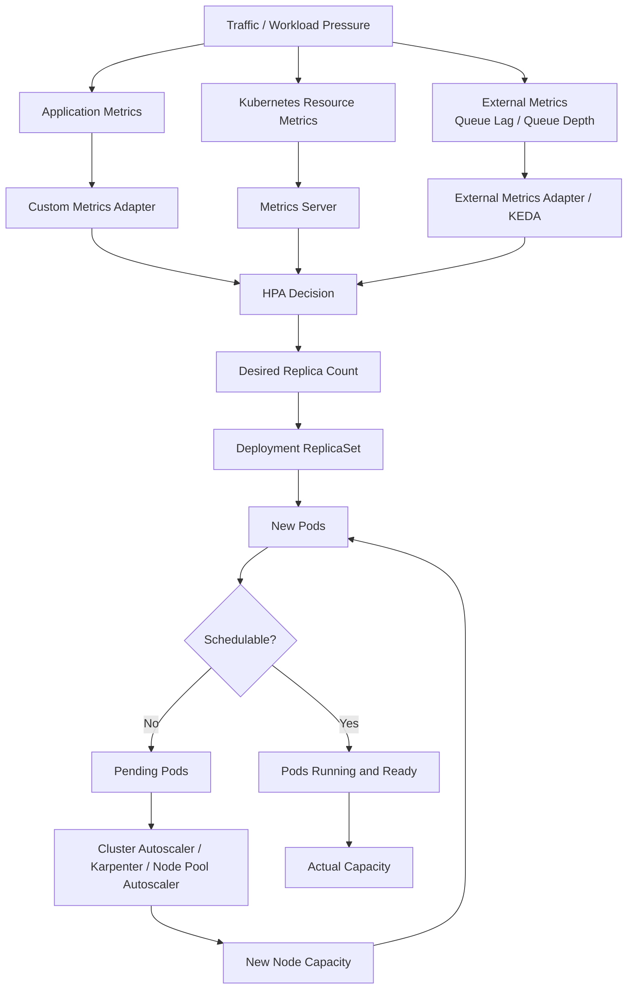

# Part 078 — Common Failure: Autoscaling Not Working

## Tujuan

Autoscaling not working adalah failure mode ketika workload tidak scale sesuai kebutuhan produksi.

Gejala umum:

- traffic naik tetapi replica count tetap rendah
- CPU tinggi tetapi HPA tidak menambah pod
- memory tinggi tetapi HPA tidak bereaksi
- Kafka lag naik tetapi consumer tidak scale
- RabbitMQ queue depth naik tetapi worker tidak bertambah
- HPA menunjukkan `<unknown>` metric
- HPA menunjukkan target metric benar tetapi tidak scale
- HPA scale up, tetapi pod baru `Pending`
- HPA scale up, tetapi latency tetap buruk
- HPA scale down terlalu cepat dan menyebabkan cold-start/latency spike
- replica count thrashing naik turun
- node autoscaling lambat sehingga pod Pending terlalu lama

Part ini membahas cara men-debug autoscaling secara production-safe dari sudut pandang backend engineer.

Prinsip utamanya:

```text
Autoscaling is a control loop, not a magic capacity guarantee.
```

HPA hanya bisa mengambil keputusan berdasarkan metric yang tersedia, policy yang dikonfigurasi, dan kapasitas cluster yang dapat menyediakan pod baru.

---

## 1. Autoscaling Mental Model

Autoscaling workload memiliki beberapa control loop.



Failure can happen at any layer:

| Layer | Failure Example | Symptom |
|---|---|---|
| Metric production | App does not expose metric | HPA metric missing |
| Metric collection | Metrics server unavailable | CPU/memory unknown |
| Metric adapter | Custom/external metric unavailable | HPA `<unknown>` |
| HPA policy | min/max/stabilization blocks scaling | HPA does not change replicas |
| Deployment | rollout stuck | desired replicas created but not ready |
| Scheduling | insufficient CPU/memory | pods Pending |
| Node autoscaling | node provision delayed | pods Pending too long |
| Application capacity | new pods slow to warm up | latency remains high |
| Dependency capacity | DB/broker/cache bottleneck | more pods do not help |

---

## 2. First 10 Minutes Triage

Use this sequence:

```text
1. Identify service symptom: latency, error rate, lag, queue depth, saturation
2. Check current replicas vs expected replicas
3. Check HPA status and events
4. Check metric availability
5. Check HPA min/max and scaling policy
6. Check pod readiness and rollout status
7. Check Pending pods and scheduling events
8. Check node capacity/autoscaler signals
9. Check dependency capacity bottleneck
10. Decide: temporary scale, rollback, config fix, capacity escalation, or dependency mitigation
```

Safe commands:

```bash
kubectl get hpa -n <ns>
kubectl describe hpa <hpa> -n <ns>
kubectl get deploy <deploy> -n <ns>
kubectl rollout status deploy/<deploy> -n <ns>
kubectl get pods -n <ns> -l app=<app>
kubectl describe pod <pending-pod> -n <ns>
kubectl top pods -n <ns>
kubectl top nodes
kubectl get events -n <ns> --sort-by=.lastTimestamp
```

If the cluster does not allow `kubectl top`, use the approved metrics dashboard.

---

## 3. HPA Status Reading

`kubectl describe hpa` is usually the fastest entrypoint.

Look for:

```text
Metrics:
  resource cpu on pods: 95% / 70%
Min replicas: 3
Max replicas: 20
Deployment pods: 3 current / 10 desired
Conditions:
  AbleToScale
  ScalingActive
  ScalingLimited
Events:
  SuccessfulRescale
  FailedGetResourceMetric
  FailedGetExternalMetric
```

Interpretation:

| Signal | Meaning |
|---|---|
| `AbleToScale=False` | HPA control loop cannot scale now |
| `ScalingActive=False` | Metric not available or target invalid |
| `ScalingLimited=True` | HPA wants to scale beyond min/max limit |
| Current metric `<unknown>` | Metric collection/query failure |
| Desired replicas higher than current | Deployment/scheduling may be blocking |
| SuccessfulRescale but no ready pods | Pod startup/readiness/scheduling issue |

---

## 4. HPA No Metric

Common HPA event:

```text
failed to get cpu utilization: missing request for cpu
```

or:

```text
unable to get metrics for resource cpu: no metrics returned from resource metrics API
```

Causes:

- container missing CPU request
- metrics server unavailable
- pod not ready long enough
- metrics delay after pod start
- HPA targets wrong deployment/scale target
- custom metrics adapter cannot find metric
- external metric query invalid
- RBAC issue for metrics API

Debugging:

```bash
kubectl describe hpa <hpa> -n <ns>
kubectl get deploy <deploy> -n <ns> -o yaml
kubectl top pods -n <ns>
kubectl get --raw /apis/metrics.k8s.io/v1beta1/namespaces/<ns>/pods
```

The raw metrics API command may be restricted in production. Use approved dashboards if needed.

---

## 5. CPU-Based HPA Failure

CPU utilization HPA depends on CPU request.

Formula intuition:

```text
CPU utilization = actual CPU usage / requested CPU
```

If CPU request is missing, CPU utilization cannot be calculated.

If CPU request is too low:

```text
small CPU usage -> high utilization percentage -> premature scale up
```

If CPU request is too high:

```text
high actual usage -> low utilization percentage -> delayed scale up
```

Backend implications:

- Java thread pools may saturate before CPU average looks high
- CPU throttling may increase latency even if HPA scales slowly
- GC can consume CPU and trigger scaling without solving root cause
- scaling out increases dependency connections

Review:

```yaml
resources:
  requests:
    cpu: "500m"
  limits:
    cpu: "1"
```

Questions:

- Is request based on real load test or guessed?
- Is HPA target based on request?
- Is CPU throttling present?
- Is latency CPU-bound or dependency-bound?

---

## 6. Memory-Based HPA Failure

Memory is often a poor scale signal for JVM services.

Why:

- JVM heap may not shrink after traffic drops
- memory usage may reflect cache, heap sizing, native memory, or leak
- scaling out does not fix memory leak
- high memory can be normal for Java due to heap reservation/usage pattern

Memory HPA can be useful only when memory correlates with work volume.

Failure modes:

- memory target always high, causing unnecessary scale-out
- memory target never drops, preventing scale-down
- memory leak causes scaling until max replicas and then OOM
- increased replicas multiply connection pool pressure

Use memory HPA carefully for Java/JAX-RS workloads.

---

## 7. Custom Metric Failure

Custom metrics may include:

- request rate
- in-flight requests
- p95 latency
- active worker count
- application queue depth
- JVM thread pool saturation
- DB pool utilization

Failure modes:

- metric name changed
- label selector mismatch
- metric missing for new pods
- adapter unavailable
- query returns multiple series unexpectedly
- metric has high cardinality
- metric lag too high
- HPA reads stale metric

Debugging checklist:

- Does dashboard show the metric?
- Does metric have namespace/workload labels expected by HPA?
- Does the adapter expose it to Kubernetes custom metrics API?
- Is metric fresh?
- Is query stable across rollout/canary labels?
- Does metric represent demand or symptom?

---

## 8. External Metric and Queue-Based Scaling Failure

External metrics often come from systems like Kafka, RabbitMQ, Redis Streams, or cloud queues.

Common scaling signals:

- Kafka consumer lag
- RabbitMQ queue depth
- Redis stream pending entries
- scheduled backlog
- external queue age

Failure modes:

- scaler cannot authenticate to broker
- metric query targets wrong topic/queue/consumer group
- lag exists but partition count limits useful replicas
- consumer concurrency limits throughput
- prefetch config prevents fair distribution
- scale up triggers Kafka rebalance storm
- RabbitMQ unacked count grows but queue depth metric looks normal
- backlog clears but scale-down happens too fast

Important invariant:

```text
More consumer pods do not always mean more throughput.
```

For Kafka:

```text
effective parallelism is bounded by partition count and processing model
```

For RabbitMQ:

```text
throughput depends on queue topology, prefetch, ack speed, consumer count, and broker capacity
```

---

## 9. KEDA Awareness

If KEDA is used, HPA may be generated by KEDA.

Objects to inspect:

```bash
kubectl get scaledobject -n <ns>
kubectl describe scaledobject <name> -n <ns>
kubectl get hpa -n <ns>
```

Common KEDA failure modes:

- trigger authentication missing
- scaler metadata wrong
- secret reference wrong
- fallback behavior misunderstood
- cooldown period too aggressive
- polling interval too slow
- generated HPA differs from expectation
- maxReplicaCount too low
- minReplicaCount creates unexpected idle cost

Backend engineer responsibility:

- know what business backlog metric should drive scaling
- validate topic/queue/consumer group naming
- understand processing concurrency and idempotency
- confirm dependency capacity can handle scale-out

Platform/SRE responsibility usually includes:

- KEDA installation
- scaler availability
- cluster-level metric adapters
- RBAC and operator health

---

## 10. HPA Min/Max Replica Issues

### 10.1 Max Replica Too Low

Symptom:

```text
ScalingLimited=True
```

HPA wants more replicas but is capped.

Causes:

- conservative default max
- outdated capacity assumption
- dependency capacity fear
- environment-specific value not updated

Mitigation:

- verify dependency capacity
- temporarily increase max if approved
- tune resource requests
- reduce load or enable backpressure

---

### 10.2 Min Replica Too Low

Symptoms:

- cold-start latency after idle period
- first traffic burst slow
- single replica handles initial traffic too long
- scale-up delayed by startup/readiness time

For enterprise backend services, min replica should consider:

- availability requirement
- startup time
- readiness warmup
- connection pool warmup
- zone spread
- PDB
- SLO

---

## 11. Scaling Delay

Autoscaling has unavoidable delay.

```text
traffic spike -> metric scrape -> HPA reconcile -> ReplicaSet update -> pod scheduling -> image pull -> app startup -> readiness -> traffic receives capacity
```

For Java services, startup/readiness can dominate delay.

Contributors:

- image pull latency
- JVM startup
- classpath scanning
- dependency initialization
- database pool warmup
- Kafka/RabbitMQ connection setup
- readiness initial delay
- node provisioning delay

Mitigation options:

- higher min replica
- faster startup
- image pre-pull strategy if platform supports it
- conservative readiness design
- queue buffering/backpressure
- predictive scaling if supported internally

---

## 12. Stabilization Window and Thrashing

HPA behavior may include stabilization windows.

Example idea:

```yaml
behavior:
  scaleDown:
    stabilizationWindowSeconds: 300
  scaleUp:
    policies:
      - type: Percent
        value: 100
        periodSeconds: 60
```

Failure modes:

- scale-down too fast causes repeated cold starts
- scale-up too slow for bursty traffic
- metric noise causes replica count oscillation
- queue lag scaler overreacts to temporary backlog
- rollout and HPA fight during deployment

Debugging:

- compare metric timeline with replica timeline
- check HPA events
- check scale behavior config
- correlate with latency/error rate
- check dependency saturation after scale-up

---

## 13. Pods Created but Not Ready

HPA may scale correctly, but capacity does not increase because new pods are not ready.

Check:

```bash
kubectl get pods -n <ns> -l app=<app>
kubectl describe pod <pod> -n <ns>
kubectl logs <pod> -n <ns>
kubectl rollout status deploy/<deploy> -n <ns>
```

Common causes:

- image pull slow/failing
- pod Pending due to insufficient resources
- readiness probe fails
- config/secret missing
- dependency cannot handle connection spike
- startup time longer than expected
- node autoscaling delay

Interpretation:

```text
HPA desired replicas are not the same as available ready capacity.
```

---

## 14. Pods Pending After Scale-Up

If HPA increases desired replicas but pods stay Pending, the issue is capacity/scheduling.

Common events:

```text
0/10 nodes are available: insufficient cpu
0/10 nodes are available: insufficient memory
node(s) didn't match node selector
node(s) had untolerated taint
pod has unbound immediate PersistentVolumeClaims
```

Check:

```bash
kubectl describe pod <pending-pod> -n <ns>
kubectl get nodes
kubectl top nodes
kubectl get events -n <ns> --sort-by=.lastTimestamp
```

Escalate to platform/SRE if:

- node pool capacity is exhausted
- cluster autoscaler is not provisioning
- Karpenter cannot find suitable instance type
- AKS node pool autoscaling is capped
- cloud zone capacity is unavailable
- quota blocks node provisioning

---

## 15. Cluster Autoscaler Interaction

HPA controls pod count. Cluster autoscaler controls node count.

```text
HPA says: I need more pods.
Scheduler says: I cannot place these pods.
Cluster autoscaler says: I may add nodes if pending pods are schedulable on a new node.
```

Cluster autoscaler may not help if Pending is caused by:

- impossible node selector
- impossible affinity
- missing toleration
- PVC binding issue
- namespace quota
- resource request larger than any node type
- max node pool size reached

Backend engineer should collect evidence, not directly modify node groups unless that is explicitly part of role.

---

## 16. Autoscaling Does Not Fix Dependency Bottlenecks

Scaling application pods can make dependency issues worse.

Examples:

- DB connection pool multiplied by replicas exceeds PostgreSQL max connections
- Kafka consumers trigger excessive rebalance
- RabbitMQ broker CPU saturates
- Redis connection count spikes
- Camunda worker concurrency overloads workflow engine
- downstream HTTP dependency rate-limits callers

Before increasing max replicas, check:

```text
per-pod dependency pressure * max replicas <= dependency capacity
```

This is a production invariant.

---

## 17. Java/JAX-RS Autoscaling Concerns

Java services have specific scaling characteristics:

- startup may be slower than lightweight services
- readiness may lag after JVM starts
- JIT warmup can affect early latency
- DB pool warmup can create connection spike
- thread pool saturation may happen before CPU target triggers
- GC pressure can distort CPU/memory signals
- large heap can slow scheduling and increase node fragmentation

Useful application metrics:

- HTTP request rate
- p95/p99 latency
- error rate
- active requests
- server thread pool utilization
- DB pool active/idle/wait time
- Kafka/RabbitMQ consumer lag/depth
- JVM GC pause
- CPU throttling

---

## 18. EKS, AKS, and On-Prem Differences

### EKS

Autoscaling-related checks may include:

- Managed Node Group max size
- Karpenter provisioner/node pool if used
- subnet IP exhaustion with VPC CNI
- pod security group constraints if used
- EC2 quota/capacity issue
- spot interruption impact

### AKS

Checks may include:

- node pool autoscaler min/max
- VMSS capacity
- subnet IP capacity with Azure CNI
- quota limits
- availability zone capacity
- priority/spot eviction

### On-Prem/Hybrid

Checks may include:

- fixed node capacity
- manual provisioning lead time
- quota/resource governance
- private registry pull latency
- proxy/network bottleneck
- storage capacity constraint

Internal verification is essential. Do not assume EKS/AKS/on-prem topology.

---

## 19. Safe Mitigation Options

Possible mitigations:

| Situation | Safer Mitigation |
|---|---|
| HPA metric missing | Fix metric source or temporarily scale manually if approved |
| Max replicas too low | Increase max after dependency capacity review |
| Min replicas too low | Raise min for critical service or burst window |
| Pod Pending | Escalate capacity/scheduling issue to platform/SRE |
| Readiness slow | Tune startup/readiness or increase min replicas |
| Queue backlog | Scale consumers carefully within partition/broker limits |
| Dependency bottleneck | Apply backpressure, reduce concurrency, or escalate dependency capacity |
| Thrashing | Tune stabilization window and metric target |
| Bad deployment causes high CPU/errors | Rollback application change, not blindly scale out |

Manual scale example:

```bash
kubectl scale deploy/<deploy> -n <ns> --replicas=<n>
```

Only do this if allowed. If GitOps owns replicas/HPA, manual scale may be reverted.

---

## 20. When to Rollback

Rollback may be more appropriate than scaling when:

- recent deployment increased CPU per request
- recent deployment introduced memory leak
- recent config changed pool/concurrency badly
- new version causes readiness failures
- new version causes error rate spike
- autoscaling reacts to a regression, not real demand

Rollback question:

```text
Is autoscaling failing, or is autoscaling correctly exposing a new application regression?
```

---

## 21. When to Escalate

Escalate to platform/SRE when:

- metrics server/custom metrics adapter/external metrics adapter is down
- HPA controller behavior is abnormal
- cluster autoscaler/Karpenter/node pool autoscaler is not provisioning nodes
- node pool max size or cloud quota is hit
- pod IP/subnet exhaustion is suspected
- scheduling constraints require platform-level change

Escalate to dependency owner when:

- scaling app will exceed database/broker/cache capacity
- broker lag/queue depth is caused by broker issue
- downstream service is rate-limiting
- workflow engine cannot handle worker concurrency

Escalate to security/platform when:

- scaler authentication secret is missing or denied
- external metric requires IAM/workload identity permission
- KEDA trigger auth fails

---

## 22. Observability Signals

Check:

- HPA current/desired replicas
- HPA conditions and events
- metric freshness
- CPU/memory usage vs request
- CPU throttling
- pod readiness count
- pending pod count
- node capacity and pressure
- cluster autoscaler events
- request rate
- latency p95/p99
- error rate
- queue lag/depth
- consumer processing rate
- DB pool wait time
- dependency saturation
- rollout/deployment markers

Dashboards should show:

```text
load signal -> scaling metric -> desired replicas -> ready replicas -> node capacity -> service SLO
```

---

## 23. Internal Verification Checklist

Verify internally:

- Which workloads use HPA?
- Which workloads use KEDA or event-based autoscaling?
- Which metrics source is authoritative?
- Is metrics server installed and monitored?
- Is custom/external metrics adapter used?
- What is HPA min/max per environment?
- Are resource requests required by policy?
- Are CPU/memory targets standardized?
- Are scale policies/stabilization windows customized?
- Does GitOps own HPA and replica count?
- Is manual scale allowed in production?
- What is the rollback path after manual scale?
- Who owns Cluster Autoscaler/Karpenter/AKS node pool autoscaling?
- What are node pool max sizes and cloud quota limits?
- Are dependency capacity limits documented?
- Are queue lag and consumer throughput dashboards available?
- Are autoscaling incidents reviewed in RCA?

---

## 24. PR Review Checklist

When reviewing autoscaling-related PRs, check:

- Is HPA target workload correct?
- Are CPU/memory requests present?
- Is scaling metric meaningful for the workload type?
- Are min replicas aligned with availability and cold-start risk?
- Are max replicas aligned with dependency capacity?
- Is stabilization behavior appropriate?
- Is scale-up fast enough for expected traffic burst?
- Is scale-down safe for workload state and latency?
- Are Kafka partition count and consumer replicas aligned?
- Are RabbitMQ prefetch and consumer count aligned?
- Are DB/Redis/broker connection pools multiplied by max replicas reviewed?
- Is node capacity available for max scale?
- Are dashboards and alerts updated?
- Is rollback/manual override documented?
- Is GitOps behavior understood?

---

## 25. Operational Invariants

Keep these invariants:

1. HPA needs valid metrics.
2. CPU utilization HPA requires CPU requests.
3. Desired replicas are not the same as ready capacity.
4. Scaling out does not fix every bottleneck.
5. More pods can overload dependencies.
6. Queue-based scaling is bounded by partition/concurrency/broker capacity.
7. Java startup and warmup affect scale-up time.
8. Cluster capacity is a separate control loop from workload autoscaling.
9. Stabilization windows prevent thrashing but add delay.
10. Autoscaling should protect SLO, not just chase resource graphs.

---

## 26. Common Anti-Patterns

Avoid:

- using CPU HPA without CPU requests
- scaling Java services on memory without understanding heap behavior
- setting max replicas without dependency capacity review
- using queue depth alone without processing rate
- ignoring Kafka partition limits
- ignoring RabbitMQ unacked messages
- increasing replicas while DB pool already saturated
- assuming HPA scale-up means traffic capacity is available
- setting min replicas too low for critical service
- letting HPA and rollout strategy interact without checking surge capacity
- manually scaling GitOps-managed workloads without recording/reconciling the change
- treating autoscaling as substitute for performance optimization

---

## 27. Summary

Autoscaling not working is rarely a single Kubernetes problem.

The correct debugging chain is:

```text
Demand signal -> metric availability -> HPA decision -> replica creation -> pod scheduling -> pod readiness -> dependency capacity -> SLO impact
```

For backend engineers, mastery means:

- reading HPA conditions and events
- understanding metric source and lag
- knowing why resource requests matter
- distinguishing HPA failure from scheduling/capacity failure
- recognizing when dependency bottlenecks make scale-out dangerous
- connecting Java/JAX-RS behavior to scale-up delay
- reviewing autoscaling PRs through reliability, cost, and dependency capacity
- escalating platform-level capacity issues with precise evidence

Autoscaling is useful only when the signal is correct, the policy is safe, the pods can become ready, and the rest of the system can absorb the extra load.
