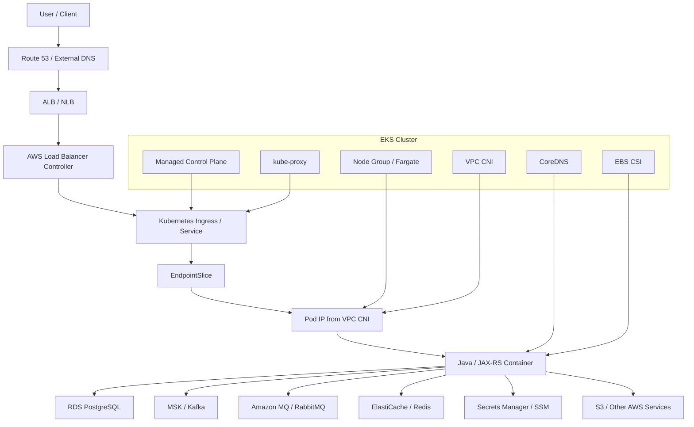
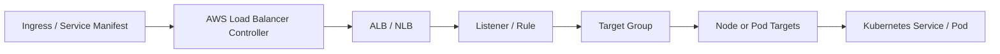
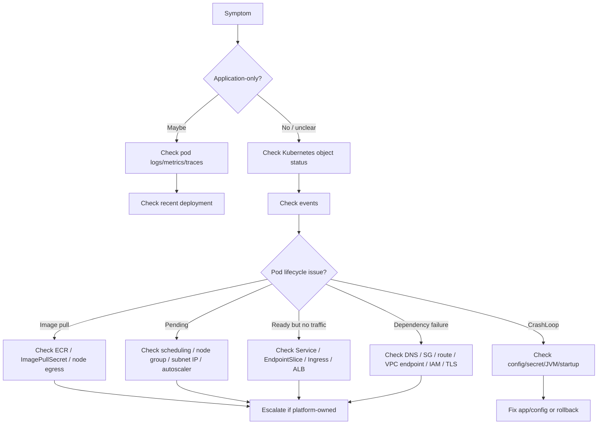

# Part 079 — EKS Operations Foundation

## Tujuan

Amazon EKS adalah managed Kubernetes dari AWS. Untuk backend engineer, EKS bukan sekadar “Kubernetes yang jalan di AWS”. EKS menambahkan beberapa operational layer yang sangat memengaruhi workload Java/JAX-RS production:

- managed control plane
- node group dan lifecycle node
- Fargate profile jika digunakan
- Amazon VPC CNI dan alokasi Pod IP dari subnet
- CoreDNS add-on
- kube-proxy add-on
- EBS CSI driver untuk volume
- AWS Load Balancer Controller untuk ALB/NLB integration
- IAM integration melalui IRSA atau EKS Pod Identity jika dipakai internal
- AWS observability, logging, audit, dan CloudTrail boundary
- dependency access ke RDS, MSK, ElastiCache, Amazon MQ, Secrets Manager, SSM, S3, SQS/SNS, dan service AWS lain

Part ini membangun mental model EKS yang diperlukan backend engineer untuk incident debugging, PR review, production readiness, dan diskusi dengan platform/SRE.

Prinsip utama:

```text
A backend engineer does not need to administer EKS,
but must understand which EKS layer can break the workload.
```

---

## 1. EKS dalam Operational Stack

EKS terdiri dari beberapa lapisan. Saat aplikasi error, jangan langsung menyimpulkan bug aplikasi. Bisa saja failure terjadi di salah satu lapisan runtime berikut.



Backend debugging harus bisa menjawab:

- Apakah workload sehat di Kubernetes layer?
- Apakah node atau subnet capacity bermasalah?
- Apakah Pod IP allocation bermasalah?
- Apakah AWS Load Balancer Controller memprovision ALB/NLB dengan benar?
- Apakah target group melihat pod/node sebagai healthy?
- Apakah DNS AWS dan CoreDNS bekerja?
- Apakah IAM identity pod valid?
- Apakah security group, route table, NAT, atau VPC endpoint memblokir dependency?
- Apakah observability cukup untuk membedakan EKS failure dari application failure?

---

## 2. Managed Control Plane

EKS mengelola Kubernetes control plane. Backend engineer biasanya tidak mengoperasikan API server, scheduler, controller manager, atau etcd secara langsung.

Namun control plane tetap relevan karena semua reconciliation bergantung padanya.

Operational symptoms yang bisa terlihat dari backend side:

| Symptom | Kemungkinan Layer | Catatan |
|---|---|---|
| `kubectl` lambat atau timeout | API server / network / auth | Eskalasi ke platform/SRE |
| object update tidak cepat terefleksi | controller lag / API pressure | Validasi dengan events dan GitOps |
| deployment stuck tanpa obvious pod issue | control plane / admission / webhook | Cek events dan policy |
| banyak object gagal created | admission webhook / quota / RBAC | Bisa terkait governance |
| GitOps sync gagal apply | API server / validation / policy | Cek GitOps health |

Safe investigation:

```bash
kubectl version --short
kubectl cluster-info
kubectl get --raw='/readyz?verbose'
kubectl get events -A --sort-by=.lastTimestamp | tail -50
kubectl get apiservices
```

Catatan safety:

- Jangan melakukan perubahan cluster-level tanpa mandat platform.
- Jangan menghapus webhook, APIService, CRD, atau add-on untuk “mencoba memperbaiki”.
- Untuk backend engineer, control plane issue biasanya escalation boundary.

---

## 3. Node Groups

EKS workload biasanya berjalan pada node EC2 melalui:

- managed node group
- self-managed node group
- Karpenter-provisioned node jika digunakan
- Fargate profile untuk pod tertentu

Node group menentukan:

- instance type
- CPU/memory capacity
- availability zone distribution
- AMI dan runtime version
- taint/toleration
- labels
- autoscaling behavior
- spot/on-demand strategy
- kernel/runtime behavior
- CNI capacity
- storage attachment behavior

Backend engineer perlu memahami node group karena banyak masalah workload muncul sebagai pod-level symptom.

| Pod Symptom | Node Group Cause |
|---|---|
| Pod `Pending` | insufficient CPU/memory, taint mismatch, AZ capacity issue |
| Pod evicted | node memory/disk pressure |
| latency spike | noisy neighbor, CPU contention, node pressure |
| connection failure | node security group / route table / subnet issue |
| image pull failure | node egress / registry permission / VPC endpoint issue |
| volume mount failure | node/AZ/storage CSI issue |

Safe commands:

```bash
kubectl get nodes -o wide
kubectl describe node <node-name>
kubectl top nodes
kubectl get pods -A -o wide --field-selector spec.nodeName=<node-name>
kubectl get events -A --sort-by=.lastTimestamp | grep -i '<node-name>'
```

Internal verification checklist:

- node group naming convention
- system vs workload node group
- on-demand vs spot usage
- Java backend workload placement rule
- taints/tolerations
- zone spreading policy
- instance family
- node autoscaling policy
- patch/upgrade process
- node drain communication process

---

## 4. Managed Node Group vs Self-Managed Node Group vs Karpenter

Backend engineer tidak harus mengelola node lifecycle, tetapi harus tahu implikasi operasionalnya.

| Model | Operational Meaning | Backend Concern |
|---|---|---|
| Managed node group | AWS/EKS manages part of lifecycle | predictable but still needs capacity planning |
| Self-managed node group | more custom control | higher platform operational burden |
| Karpenter | dynamic provisioning based on pending pods | faster scaling, more placement/cost complexity |
| Fargate profile | pod scheduled to serverless compute | fewer node concerns, different limits and debugging model |

Failure mode:

- managed node group upgrade drains pods unexpectedly if PDB weak
- self-managed node group AMI drift causes runtime inconsistency
- Karpenter chooses instance type with unexpected network/storage capacity
- spot interruption evicts critical pod
- Fargate profile mismatch leaves pod Pending

Backend readiness question:

```text
Can my workload survive node replacement, node drain, zone rebalance, and spot interruption?
```

---

## 5. Fargate Profile Awareness

EKS Fargate runs pods without user-managed EC2 nodes. It is not universally better. It changes operational trade-offs.

Potential benefits:

- no node management for selected workloads
- pod-level isolation
- useful for some stateless or operational workloads

Potential concerns:

- daemonsets may not apply the same way
- observability/logging integration may differ
- networking behavior still depends on VPC/subnet/security config
- startup latency and scaling characteristics differ
- some storage/network/security patterns may be constrained
- debugging node-level issues is less visible

Backend engineer checklist:

- Is workload running on EC2 node group or Fargate?
- Are observability agents available for Fargate pods?
- Are resource requests aligned with Fargate sizing?
- Are ingress/service endpoints healthy?
- Are secrets, IAM, DNS, and egress working the same as node-based pods?

Safe commands:

```bash
kubectl get pod <pod> -n <ns> -o wide
kubectl describe pod <pod> -n <ns>
kubectl get events -n <ns> --sort-by=.lastTimestamp
```

---

## 6. VPC CNI Foundation

Amazon VPC CNI is one of the most important EKS-specific components.

Core idea:

```text
In common EKS networking, pods receive IP addresses from VPC subnets.
```

This means pod networking is not just Kubernetes networking. It is tied to AWS VPC capacity and routing.

Operational consequences:

- subnet IP exhaustion can prevent new pods from starting
- instance type affects maximum pod density
- ENI/IP allocation behavior affects scheduling and scale-up
- pod IPs may be routable inside VPC depending on config
- security group and route table issues can affect pod egress
- private subnet design directly affects workloads

Common symptoms:

| Symptom | Possible VPC CNI Cause |
|---|---|
| pod stuck creating | cannot assign pod IP |
| pod Pending despite node capacity | ENI/IP capacity constraint |
| intermittent network failure after scale-up | subnet/IP pressure |
| new pods cannot reach dependency | route/security/subnet config |
| traffic works in one AZ but not another | subnet/AZ-specific issue |

Useful signals:

```bash
kubectl get daemonset aws-node -n kube-system
kubectl get pods -n kube-system -l k8s-app=aws-node -o wide
kubectl logs -n kube-system daemonset/aws-node --tail=100
kubectl describe node <node-name> | grep -i -E 'podcidr|capacity|allocatable|eni|address'
```

Escalate to platform/SRE when:

- AWS CNI logs show allocation failures
- subnet IP capacity is low
- ENI allocation fails
- pod networking fails across many workloads
- node networking differs by AZ

---

## 7. CoreDNS Add-on

CoreDNS resolves Kubernetes service names and often forwards external DNS queries.

Backend symptoms caused by DNS:

- Java service cannot resolve PostgreSQL hostname
- Kafka bootstrap hostname intermittently fails
- RabbitMQ host resolves from one pod but not another
- Redis private endpoint resolution fails
- external AWS service endpoint resolution fails
- latency spike due to DNS retry/timeout

Safe investigation:

```bash
kubectl get deployment coredns -n kube-system
kubectl get pods -n kube-system -l k8s-app=kube-dns -o wide
kubectl logs -n kube-system deployment/coredns --tail=100
kubectl get configmap coredns -n kube-system -o yaml
```

From a debug pod, if allowed:

```bash
kubectl run dns-debug -n <ns> --rm -it --image=busybox:1.36 --restart=Never -- nslookup kubernetes.default.svc.cluster.local
kubectl run dns-debug -n <ns> --rm -it --image=busybox:1.36 --restart=Never -- nslookup <service>.<namespace>.svc.cluster.local
kubectl run dns-debug -n <ns> --rm -it --image=busybox:1.36 --restart=Never -- nslookup <dependency-hostname>
```

Production caveat:

- Use approved internal debug image.
- Do not run arbitrary public image in production unless allowed.
- Prefer existing platform-approved toolbox pod.

---

## 8. kube-proxy Add-on

kube-proxy programs service routing rules for Kubernetes Service traffic, depending on mode and cluster setup.

Backend engineer usually does not operate kube-proxy, but should recognize symptoms:

- Service traffic intermittently fails
- ClusterIP not routing to endpoints
- only node-local service path fails
- EndpointSlice is correct but traffic still fails
- multiple services fail at once

Safe checks:

```bash
kubectl get daemonset kube-proxy -n kube-system
kubectl get pods -n kube-system -l k8s-app=kube-proxy -o wide
kubectl logs -n kube-system daemonset/kube-proxy --tail=100
kubectl get service -n <ns> <svc> -o yaml
kubectl get endpointslice -n <ns> -l kubernetes.io/service-name=<svc>
```

Escalate when:

- many services fail simultaneously
- EndpointSlice is correct but ClusterIP routing fails
- kube-proxy pods crash or show sync failures
- issue is node-specific and repeats across workloads

---

## 9. EBS CSI Driver

EBS CSI driver enables Kubernetes PVC backed by Amazon EBS.

Backend engineer encounters this mainly when workload uses persistent storage, file processing, local-ish durable data, stateful workload, or operator-managed dependency.

Common symptoms:

| Symptom | Possible Cause |
|---|---|
| PVC Pending | no matching StorageClass, AZ mismatch, quota/capacity issue |
| FailedMount | CSI issue, permission, node/AZ problem |
| pod stuck ContainerCreating | volume attach/mount delay |
| disk full | application writes too much, no cleanup, no expansion |
| attach failure after reschedule | volume AZ constraint |

Safe commands:

```bash
kubectl get storageclass
kubectl get pvc -n <ns>
kubectl describe pvc -n <ns> <pvc>
kubectl describe pod -n <ns> <pod>
kubectl get events -n <ns> --sort-by=.lastTimestamp | grep -i -E 'mount|volume|attach|pvc|csi'
kubectl get pods -n kube-system | grep -i ebs
```

Backend responsibility:

- know whether the app writes to mounted volume
- ensure file lifecycle/cleanup exists
- understand AZ-sensitive scheduling implications
- avoid treating PVC as magic infinite storage
- ensure backup/restore ownership is explicit for stateful data

Platform/SRE responsibility:

- CSI driver installation and health
- StorageClass definition
- EBS encryption/default policy
- volume expansion policy
- node/CSI compatibility
- storage quota and operational runbook

---

## 10. AWS Load Balancer Controller

AWS Load Balancer Controller commonly provisions and reconciles:

- ALB for Ingress
- NLB for Service type LoadBalancer
- TargetGroupBinding resources if used

This controller is a bridge between Kubernetes desired state and AWS load balancer resources.



Common backend-facing symptoms:

- Ingress exists but no ALB created
- ALB exists but rule missing
- target group has unhealthy targets
- 502/503 from ALB
- TLS cert not attached
- annotation rejected
- wrong scheme: internet-facing vs internal
- wrong target type: instance vs ip
- slow reconciliation after manifest change

Safe commands:

```bash
kubectl get ingress -n <ns>
kubectl describe ingress -n <ns> <ingress>
kubectl get service -n <ns> <svc> -o yaml
kubectl get pods -n kube-system | grep -i load-balancer
kubectl logs -n kube-system deployment/aws-load-balancer-controller --tail=200
kubectl get targetgroupbindings -A
```

Internal verification checklist:

- controller installed namespace
- allowed annotations
- ingress class
- ALB/NLB ownership
- TLS certificate source
- internal vs external scheme
- target type convention
- health check path/port
- WAF/security group policy
- platform escalation path

---

## 11. IAM Integration Boundary

EKS has multiple identity layers:

```text
Human access to Kubernetes API     -> AWS IAM / cluster access / RBAC
Pod access to Kubernetes API       -> Kubernetes ServiceAccount + RBAC
Pod access to AWS services         -> IRSA / EKS Pod Identity / node role fallback
AWS control plane reconciliation   -> controller IAM roles
```

Backend incident risk:

- pod cannot read Secrets Manager secret
- app cannot access S3 bucket
- app cannot call STS
- AWS SDK uses node role unexpectedly
- ServiceAccount annotation missing
- trust policy broken
- token expired or not projected
- controller lacks permission to create ALB/EBS resource

Safe checks:

```bash
kubectl get serviceaccount -n <ns> <sa> -o yaml
kubectl describe pod -n <ns> <pod> | grep -i serviceaccount
kubectl exec -n <ns> <pod> -- env | grep -E 'AWS_|JAVA_|SPRING_|QUARKUS_|MICRONAUT_' || true
```

Do not print credentials, tokens, or secret values.

Escalate to platform/security when:

- IAM trust policy is wrong
- role permission needs change
- CloudTrail shows denied API call
- service account annotation or pod identity association is managed centrally
- least-privilege exception is needed

---

## 12. EKS Add-on Version Awareness

EKS cluster behavior depends heavily on add-ons:

- VPC CNI
- CoreDNS
- kube-proxy
- EBS CSI
- AWS Load Balancer Controller
- metrics server if installed separately
- External Secrets / Secrets Store CSI if used
- observability agents
- policy controllers

Backend engineer does not usually upgrade them, but should know the risk:

| Add-on | Backend Impact |
|---|---|
| VPC CNI | pod IP allocation, pod networking, subnet pressure |
| CoreDNS | service discovery and external dependency resolution |
| kube-proxy | Service routing |
| EBS CSI | PVC mount/attach/resize |
| AWS Load Balancer Controller | Ingress/ALB/NLB provisioning |
| metrics server | HPA CPU/memory metrics |
| observability agents | logs/metrics/traces visibility |
| policy controllers | manifest admission and deployment rejection |

Internal verification checklist:

- add-on versions
- owner team
- upgrade cadence
- known compatibility issues
- incident history
- dashboards/alerts per add-on
- rollback plan
- maintenance windows

---

## 13. EKS Impact on Java/JAX-RS Services

EKS-specific layers affect Java/JAX-RS services in practical ways.

### Startup

Startup may depend on:

- image pull from ECR
- pod IP allocation through VPC CNI
- ConfigMap/Secret mount
- Secrets Manager/SSM access
- DNS resolution
- RDS/Kafka/RabbitMQ/Redis connectivity
- Java truststore/certificate config

Failure signal:

- `ImagePullBackOff`
- `ContainerCreating`
- `CrashLoopBackOff`
- readiness failure
- connection timeout on startup
- AWS SDK credential error

### Request serving

Runtime request path may depend on:

- ALB/NLB target health
- ingress rules
- target group health check
- Service/EndpointSlice
- pod readiness
- Java thread pool
- DB pool
- downstream AWS service egress

### Shutdown

Node drain, rollout, or spot interruption can trigger:

- SIGTERM
- readiness removal
- in-flight request drain
- consumer rebalance
- DB connection close
- message ack/offset commit behavior

EKS-specific concern:

```text
Node lifecycle is not abstract.
AWS node replacement, spot interruption, managed node group upgrade, and autoscaling can all terminate pods.
```

---

## 14. EKS Impact on Common Dependencies

| Dependency | EKS Operational Concerns |
|---|---|
| PostgreSQL / RDS | private endpoint DNS, security group, subnet route, connection pool explosion, IAM auth if used |
| Kafka / MSK | broker DNS, security group, TLS/SASL, partition/replica scaling, egress path |
| RabbitMQ / Amazon MQ | endpoint DNS, TLS, security group, connection/channel lifecycle, queue consumer scaling |
| Redis / ElastiCache | cluster endpoint DNS, TLS, security group, connection pool, subnet/AZ reachability |
| Camunda | engine endpoint, database dependency, worker scaling, job timeout, connectivity |
| S3 | IAM role, VPC endpoint, NAT route, bucket policy, KMS key policy |
| Secrets Manager / SSM | IRSA/Pod Identity, endpoint access, KMS, rotation, SDK credential chain |

Debugging dependency failures requires checking:

```text
DNS -> route -> security group -> NetworkPolicy -> IAM -> TLS -> timeout -> client pool -> dependency health
```

---

## 15. EKS Failure Mode Map

| Failure Mode | First Symptom | Backend-Safe Evidence | Likely Escalation |
|---|---|---|---|
| Subnet IP exhaustion | pods cannot start / CNI error | pod events, aws-node logs | platform/network |
| ALB target unhealthy | ingress 502/503 | ingress describe, target group health | platform/SRE |
| CoreDNS unhealthy | dependency DNS fail | CoreDNS pod/logs, nslookup | platform/SRE |
| IRSA broken | AWS access denied | ServiceAccount annotation, app logs | security/platform |
| EBS CSI issue | FailedMount | PVC events, pod events | platform/storage |
| node pressure | eviction/restarts | node conditions, events | platform/SRE |
| ECR auth issue | ImagePullBackOff | pod events, imagePullSecret | platform/CI/security |
| NLB/ALB annotation issue | LB not reconciled | controller logs, ingress events | platform/SRE |
| add-on upgrade regression | broad failure | add-on version/events | platform/SRE |

---

## 16. Production-Safe EKS Investigation Flow



First commands:

```bash
kubectl get deploy,rs,pod,svc,ingress,hpa,pdb -n <ns> -o wide
kubectl get events -n <ns> --sort-by=.lastTimestamp | tail -50
kubectl describe pod -n <ns> <pod>
kubectl logs -n <ns> <pod> --previous --tail=200
kubectl describe ingress -n <ns> <ingress>
kubectl get endpointslice -n <ns> -l kubernetes.io/service-name=<svc>
```

EKS layer commands:

```bash
kubectl get pods -n kube-system -o wide
kubectl get daemonset -n kube-system aws-node kube-proxy
kubectl get deployment -n kube-system coredns aws-load-balancer-controller
kubectl get storageclass
kubectl get nodes -o wide
kubectl describe node <node-name>
```

---

## 17. Backend Engineer Responsibility

Backend service owner should own:

- application readiness/liveness/startup behavior
- graceful shutdown
- resource requests/limits proposal
- JVM/container tuning
- connection pool sizing
- dependency timeout/retry behavior
- application metrics/logs/traces
- service dashboard and runbook
- deployment and rollback readiness
- manifest PR review for workload-owned fields
- evidence capture during incident

Backend engineer should understand but usually not own:

- EKS control plane
- node group lifecycle
- VPC CNI configuration
- ALB/NLB controller installation
- CSI driver installation
- cluster add-on upgrades
- subnet/security group/route table design
- IAM role provisioning
- cluster-level policy controllers

---

## 18. Platform/SRE Responsibility

Platform/SRE commonly owns:

- EKS cluster lifecycle
- Kubernetes version upgrade
- managed node groups / Karpenter / autoscaler
- VPC CNI configuration
- CoreDNS/kube-proxy/EBS CSI add-ons
- AWS Load Balancer Controller
- ingress class and ALB/NLB standards
- baseline observability agents
- policy/admission controllers
- cluster security baseline
- node patching and drain procedures
- disaster recovery and cluster rebuild procedures

During incident, backend engineer should provide:

- affected namespace/workload
- exact symptom and timeframe
- recent deployment/config change
- pod/events/logs evidence
- affected AZ/node if visible
- dependency impact
- business impact if known
- mitigation already attempted

---

## 19. EKS Operational Readiness Checklist

For each backend service deployed to EKS, verify:

### Workload

- Deployment strategy is defined.
- Readiness/liveness/startup probes are valid.
- Graceful shutdown is implemented.
- Resource requests/limits are justified.
- JVM flags match container limits.
- PDB exists for critical multi-replica service.
- HPA policy is sane if autoscaling is enabled.

### Networking

- Ingress/Service path is known.
- ALB/NLB target health check path is aligned.
- Service selector and EndpointSlice are correct.
- DNS names for dependencies are documented.
- Egress path to dependencies is known.
- NetworkPolicy and security group expectations are documented.

### AWS Integration

- AWS service access uses approved workload identity.
- IAM role and permission owner are known.
- Secrets Manager/SSM/Key Vault-like source is documented if used.
- ECR/registry access path is reliable.
- VPC endpoint/NAT dependency is known.

### Observability

- Application logs are structured.
- Correlation ID/trace ID exists.
- JVM metrics exist.
- Kubernetes workload metrics exist.
- Ingress/ALB metrics exist.
- Dependency metrics exist.
- Alerts link to runbooks.
- Deployment markers exist.

### Runbook

- CrashLoop runbook exists.
- ImagePull runbook exists.
- Pod Pending runbook exists.
- Ingress 5xx runbook exists.
- DNS/dependency runbook exists.
- Access denied runbook exists.
- Rollback path is explicit.

---

## 20. EKS PR Review Checklist for Backend Engineers

When reviewing Kubernetes manifests for EKS deployment, check:

### Deployment

- Are replicas appropriate for production?
- Does rollout strategy preserve availability?
- Is `maxUnavailable` safe?
- Is `maxSurge` safe for dependency connection capacity?
- Is `progressDeadlineSeconds` configured?

### Pods

- Are probes aligned with Java startup and readiness?
- Is termination grace long enough for request drain/consumer shutdown?
- Are resource requests/limits realistic?
- Are JVM memory flags aligned with memory limit?
- Is ephemeral storage bounded for file/log/temp workloads?

### AWS/EKS-specific

- Is the ServiceAccount correct?
- Are IRSA/Pod Identity annotations expected?
- Is ingress class correct?
- Are ALB annotations approved?
- Is target type convention followed?
- Is health check path correct?
- Is TLS certificate source correct?
- Are EBS/PVC assumptions valid?
- Does the change depend on subnet, security group, or IAM updates?

### Observability

- Are labels/annotations sufficient for dashboards?
- Are deployment markers available?
- Are alerts impacted?
- Is there a rollback signal?

### Failure impact

- Could this create too many DB connections?
- Could this create too many Kafka/RabbitMQ consumers?
- Could this break readiness and remove all endpoints?
- Could this cause ALB target group unhealthy?
- Could this break access to AWS secrets/services?

---

## 21. Internal Verification Checklist

Use this checklist in the actual CSG/team environment. Do not assume any answer without verification.

### Cluster and environment

- Which EKS clusters exist per environment?
- What are the namespace naming conventions?
- Which namespaces are owned by Quote & Order team?
- Which workloads are production-critical?
- Which cluster is cloud/on-prem/hybrid connected?

### Access and ownership

- What access does backend engineer have?
- What is read-only vs write access?
- What is break-glass procedure?
- Who owns EKS cluster operations?
- Who owns node group/capacity?
- Who owns IAM roles and trust policies?
- Who owns ALB/NLB and ingress standards?
- Who owns observability stack?

### EKS components

- EKS version
- node group type and labels
- spot/on-demand policy
- Karpenter/Cluster Autoscaler usage
- Fargate profile usage
- VPC CNI version and config
- CoreDNS version and config
- kube-proxy mode/version
- EBS CSI version
- AWS Load Balancer Controller version

### Networking

- private/public subnet layout
- subnet IP utilization monitoring
- security group model
- security group for pods usage if any
- NAT gateway/VPC endpoint usage
- Route 53/private hosted zone usage
- internal/external ALB convention
- ingress class convention

### Workload integration

- ECR/registry access
- Secrets Manager/SSM usage
- IRSA/EKS Pod Identity usage
- RDS/MSK/Amazon MQ/ElastiCache access model
- NetworkPolicy usage
- mTLS/TLS truststore strategy
- Java service startup/shutdown standard

### Operations

- deployment pipeline
- GitOps repo
- Helm/Kustomize standard
- incident process
- rollback process
- dashboard and alert standard
- SLO/error budget practice
- production readiness checklist
- post-incident RCA template

---

## 22. Common Anti-Patterns

Avoid these assumptions:

```text
If the pod is Running, the service is healthy.
```

Running does not mean ready, reachable, authorized, or useful.

```text
If Kubernetes object is correct, AWS resource must be correct.
```

AWS Load Balancer Controller, IAM, subnet, security group, and route tables are separate reconciliation and configuration layers.

```text
If HPA scales pods, capacity problem is solved.
```

New pods still need node capacity, Pod IPs, dependency capacity, warm-up time, and healthy target registration.

```text
If access denied happens inside app logs, it is an app bug.
```

It may be ServiceAccount, IRSA, trust policy, IAM permission, KMS policy, bucket policy, endpoint policy, or SDK credential chain.

```text
If DNS works locally, it works from pod.
```

Pod DNS path may involve CoreDNS, VPC resolver, private hosted zones, search domains, NetworkPolicy, or VPC endpoint DNS.

---

## 23. Summary

EKS operations foundation for backend engineers is about recognizing runtime layers that can affect backend services.

The important mental model:

```text
Backend symptom = application behavior + Kubernetes state + EKS add-ons + AWS network/IAM/load balancer/storage state.
```

A senior backend engineer should be able to:

- identify whether failure is application, Kubernetes, EKS add-on, AWS network, IAM, storage, or dependency layer
- collect production-safe evidence
- avoid unsafe cluster-level changes
- communicate precise escalation context to platform/SRE/security
- review workload manifests with EKS-specific operational risk in mind
- ensure Java/JAX-RS service readiness, shutdown, resources, observability, and dependency access are production-ready

In the next part, we go deeper into **EKS Networking Operations**: VPC CNI, pod IPs, subnet exhaustion, security groups, ALB/NLB, Route 53, target groups, VPC endpoints, and networking runbooks.
