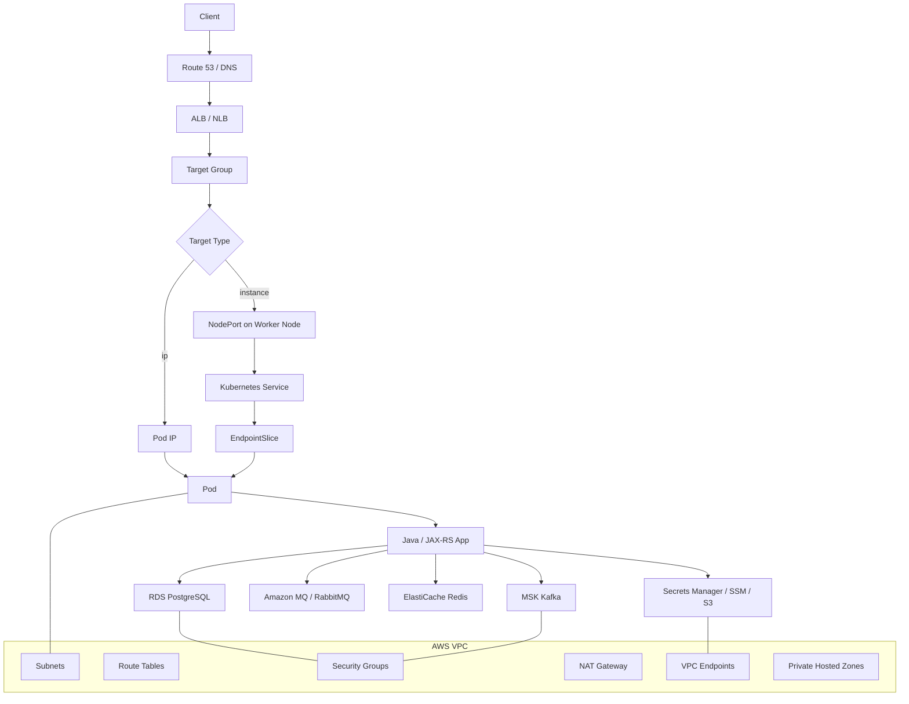
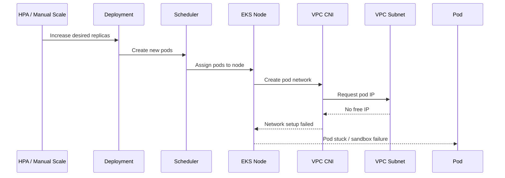
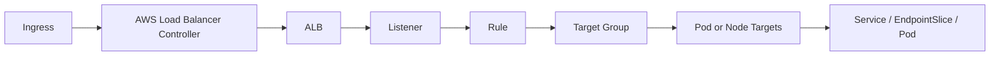
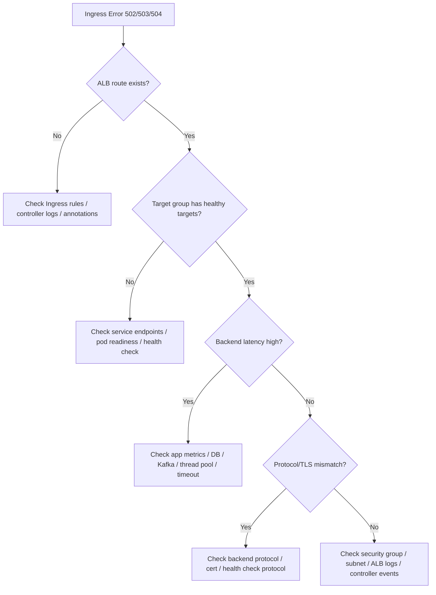

# Part 080 — EKS Networking Operations

## Tujuan

EKS networking adalah salah satu area paling penting untuk backend engineer yang mengoperasikan service production. Banyak incident terlihat seperti bug aplikasi, tetapi akar masalahnya ada di jaringan:

- pod tidak bisa dibuat karena subnet IP exhaustion
- pod Running tetapi tidak bisa reach PostgreSQL/RDS
- Kafka/MSK broker DNS resolve tetapi connection timeout
- Redis/ElastiCache hanya gagal dari satu AZ
- ALB return 502/503 karena target group unhealthy
- service sehat di Kubernetes tetapi tidak reachable dari client
- egress ke AWS service gagal karena NAT/VPC endpoint/security group
- TLS handshake gagal karena endpoint/protocol/certificate mismatch
- DNS private hosted zone salah atau belum terasosiasi

Part ini membahas EKS networking dari sudut pandang senior backend engineer: cukup dalam untuk debugging dan review, tetapi tetap menghormati boundary platform/network/SRE.

Prinsip utama:

```text
In EKS, Kubernetes networking and AWS VPC networking are one operational system.
```

---

## 1. EKS Network Mental Model

Dalam banyak EKS setup, pod mendapatkan IP dari VPC subnet melalui Amazon VPC CNI. Traffic path biasanya melibatkan Kubernetes object dan AWS resource sekaligus.



Every request has two dimensions:

1. Kubernetes routing: Ingress, Service, EndpointSlice, Pod readiness, targetPort.
2. AWS routing: DNS, ALB/NLB, target group, subnet, route table, security group, NAT, VPC endpoint.

Operational debugging must check both.

---

## 2. VPC CNI and Pod IPs

Amazon VPC CNI commonly assigns VPC IP addresses to pods. This matters because pod density and networking depend on AWS subnet/IP capacity.

Backend-relevant implications:

- pod IP is not an abstract overlay-only address
- subnet size matters for scaling
- node instance type can limit pod density
- ENI/IP allocation behavior affects pod creation speed
- AZ-specific subnet exhaustion can create uneven failures
- network policies may depend on the CNI/plugin configuration

Symptoms of VPC CNI problems:

| Symptom | Possible Cause |
|---|---|
| pod stuck in `ContainerCreating` | pod IP allocation delay/failure |
| pod `Pending` despite apparent CPU/memory | IP/ENI capacity constraint |
| scale-up creates nodes but pods still fail | subnet IP exhaustion or ENI limit |
| failure only in one AZ | subnet-specific IP/routing/security issue |
| pods cannot reach dependency after scaling | new subnet/AZ path not allowed |

Safe commands:

```bash
kubectl get pods -n kube-system -l k8s-app=aws-node -o wide
kubectl describe daemonset aws-node -n kube-system
kubectl logs -n kube-system daemonset/aws-node --tail=200
kubectl get nodes -o wide
kubectl describe node <node-name>
kubectl get events -A --sort-by=.lastTimestamp | grep -i -E 'cni|eni|ip|network|sandbox'
```

What to look for in pod events:

```text
FailedCreatePodSandBox
failed to assign an IP address
failed to setup network for sandbox
CNI plugin error
```

Escalation boundary:

- Backend engineer collects evidence.
- Platform/network team validates subnet IP utilization, ENI limits, CNI config, warm IP target, prefix delegation, and route/security configuration.

---

## 3. Subnet IP Exhaustion

Subnet IP exhaustion is a classic EKS production failure. It often appears during autoscaling, rollout surge, or incident mitigation when more pods are needed.

Failure scenario:



Operational signals:

- pods fail after scale-up
- affected pods concentrated in one AZ
- CNI logs mention IP allocation failure
- node has CPU/memory but cannot host more pods
- Cluster Autoscaler/Karpenter adds nodes but subnet still lacks IPs

Backend-safe evidence:

```bash
kubectl get pods -n <ns> -o wide
kubectl describe pod -n <ns> <pod>
kubectl get events -n <ns> --sort-by=.lastTimestamp
kubectl get pods -n kube-system -l k8s-app=aws-node -o wide
kubectl logs -n kube-system daemonset/aws-node --tail=200
```

Mitigation options, depending on internal authority:

| Mitigation | Owner | Risk |
|---|---|---|
| reduce rollout surge | backend/app owner | safer but slows rollout |
| reduce max replicas temporarily | backend/platform | may reduce capacity |
| scale down non-critical workloads | platform/SRE | cross-team impact |
| add/expand subnet | network/platform | infrastructure change |
| add node group in subnet with capacity | platform | placement complexity |
| enable prefix delegation if approved | platform | CNI behavior change |

Backend PR review question:

```text
Will this change increase pod count enough to exhaust subnet/IP capacity?
```

---

## 4. Security Groups

Security groups control AWS-level traffic. In EKS, security groups can apply to nodes, load balancers, dependencies, and sometimes pods if security groups for pods are used.

Backend symptoms:

- pod cannot connect to RDS
- pod can connect from one environment but not another
- ALB health check cannot reach target
- Kafka broker connection timeout
- Redis connection timeout
- dependency works from one node/AZ but not another
- TLS handshake never starts because TCP connection blocked

Important distinction:

| Layer | Tooling | Example |
|---|---|---|
| Kubernetes NetworkPolicy | Kubernetes object | pod egress to DB denied |
| AWS Security Group | AWS VPC object | node/pod SG cannot reach RDS SG |
| Route Table/NACL | AWS VPC object | subnet cannot route to dependency |
| App config | Application config | wrong host/port/TLS |

Safe Kubernetes-side checks:

```bash
kubectl get pod -n <ns> <pod> -o wide
kubectl describe pod -n <ns> <pod>
kubectl get networkpolicy -n <ns>
kubectl get svc,endpointslice -n <ns>
```

If allowed via approved debug pod:

```bash
nc -vz <dependency-host> <port>
nslookup <dependency-host>
curl -vk https://<dependency-host>:<port>/health
```

Do not assume:

```text
NetworkPolicy allowed => AWS security group allowed.
AWS security group allowed => Kubernetes NetworkPolicy allowed.
```

Both may need to allow the path.

---

## 5. Security Groups for Pods Awareness

Some EKS environments use security groups for pods. If used, pod-level AWS security groups may differ from node security groups.

Backend impact:

- two pods on same node may have different AWS-level access
- service account or pod label may influence security group assignment depending on implementation
- DB access may work for one workload but fail for another in same namespace
- migration job may lack access while app deployment has access

Internal verification checklist:

- Is security groups for pods enabled?
- Which workloads use pod security groups?
- How are security groups assigned?
- Is assignment based on namespace, service account, labels, or custom resources?
- Who approves changes?
- How is it visible from Kubernetes?
- Are batch/migration jobs covered too?

Debugging question:

```text
Am I debugging node-level access or pod-level access?
```

---

## 6. ALB Ingress Operations

In EKS, ALB is commonly created by AWS Load Balancer Controller from Kubernetes Ingress resources.

Typical ALB flow:



Common backend-facing failures:

| Symptom | Possible Cause |
|---|---|
| no ALB provisioned | controller/RBAC/IAM/annotation issue |
| route missing | host/path annotation/rule issue |
| 404 | ALB rule mismatch or ingress rule mismatch |
| 502 | target connection/protocol failure |
| 503 | no healthy targets |
| 504 | upstream timeout / app too slow |
| TLS error | certificate/SNI/listener issue |
| target unhealthy | health check path/port/protocol mismatch |

Safe commands:

```bash
kubectl get ingress -n <ns> -o wide
kubectl describe ingress -n <ns> <ingress>
kubectl get svc -n <ns> <svc> -o yaml
kubectl get endpointslice -n <ns> -l kubernetes.io/service-name=<svc>
kubectl logs -n kube-system deployment/aws-load-balancer-controller --tail=200
```

What backend engineer should verify:

- host/path rule matches expected client URL
- backend service name and port are correct
- service has ready endpoints
- pod readiness endpoint is correct
- ALB health check path is not too strict
- backend protocol annotation matches app protocol
- timeout annotation aligns with application timeout
- TLS certificate is expected
- internal vs internet-facing scheme is expected

---

## 7. ALB Target Type: instance vs ip

AWS Load Balancer Controller may use different target types.

| Target Type | Meaning | Operational Consequence |
|---|---|---|
| `instance` | target group points to nodes/NodePort | node security group and NodePort path matter |
| `ip` | target group points to pod IPs | pod IP, readiness, and pod networking matter directly |

Backend debugging implication:

```text
Target unhealthy means different things depending on target type.
```

For `instance` target:

- ALB reaches node
- node routes to service/pod
- NodePort/security group matters

For `ip` target:

- ALB reaches pod IP directly
- pod readiness and pod IP networking matter
- security group model may differ

Internal verification checklist:

- What target type is standard internally?
- Is target type explicit in annotation?
- Does security group policy match target type?
- Does health check path work from ALB to target?
- Are pods in private subnets reachable by ALB?

---

## 8. NLB Service Operations

NLB may be used for Service type `LoadBalancer`, TCP workloads, internal services, or non-HTTP routing.

Backend use cases:

- TCP service exposure
- internal service endpoint
- high-throughput low-latency path
- broker-like service exposure
- ingress controller fronting

Common failures:

- NLB created but no healthy target
- service annotation wrong
- wrong port mapping
- target health check mismatch
- TLS termination expected at wrong layer
- source IP preservation changes behavior
- security group or subnet issue

Safe commands:

```bash
kubectl get svc -n <ns> -o wide
kubectl describe svc -n <ns> <service>
kubectl get endpointslice -n <ns> -l kubernetes.io/service-name=<service>
kubectl get events -n <ns> --sort-by=.lastTimestamp
kubectl logs -n kube-system deployment/aws-load-balancer-controller --tail=200
```

Backend review questions:

- Is this HTTP traffic better handled by ALB/Ingress instead?
- Is this TCP traffic expected?
- Who owns TLS termination?
- Does health check actually validate service readiness?
- Is source IP needed by the application?
- Is timeout behavior documented?

---

## 9. Target Group Health Debugging

Target group health is a critical bridge between AWS and Kubernetes.

If ALB/NLB returns 503, the target group may have no healthy targets.

Kubernetes-side checks:

```bash
kubectl get ingress -n <ns> <ingress> -o yaml
kubectl describe ingress -n <ns> <ingress>
kubectl get svc -n <ns> <svc> -o yaml
kubectl get endpointslice -n <ns> -l kubernetes.io/service-name=<svc> -o yaml
kubectl get pod -n <ns> -l app=<app> -o wide
kubectl describe pod -n <ns> <pod>
```

Application-side checks:

```bash
kubectl logs -n <ns> deploy/<deploy> --tail=200
kubectl top pod -n <ns>
```

Potential causes:

| Cause | Evidence |
|---|---|
| pod not ready | no ready endpoints |
| wrong service port | service targetPort mismatch |
| wrong health check path | app logs show 404/401, ALB target unhealthy |
| health endpoint requires auth | health check fails |
| app binds localhost only | target connection refused |
| TLS/protocol mismatch | 502 or failed health check |
| security group blocks ALB | target timeout |
| slow startup | target unhealthy during rollout |

Safe mitigation:

- rollback bad ingress/service/probe change
- restore previous health check path
- pause rollout
- scale stable old ReplicaSet if available and approved
- escalate security group/target group issues to platform

---

## 10. Route 53 and DNS Operations

Route 53 may be involved in:

- public DNS
- private hosted zones
- internal service records
- ALB/NLB DNS alias
- failover/weighted routing
- private endpoint DNS

Backend symptom:

- URL resolves to wrong load balancer
- internal hostname fails from pod
- hostname works from laptop/VPN but not from pod
- dependency private hostname resolves to public IP
- old ALB still receives traffic after migration
- DNS TTL causes slow cutover

Safe checks:

```bash
nslookup <public-or-internal-hostname>
dig <hostname>
```

From approved debug pod:

```bash
nslookup <hostname>
dig <hostname>
curl -vk https://<hostname>/health
```

Kubernetes checks:

```bash
kubectl get ingress -A | grep <host-fragment>
kubectl get svc -A -o wide | grep -i loadbalancer
kubectl logs -n kube-system deployment/coredns --tail=100
```

Internal verification checklist:

- Who owns DNS records?
- Is ExternalDNS used?
- Are records GitOps/IaC managed?
- Public or private hosted zone?
- TTL value?
- Failover/weighted routing in use?
- Is private hosted zone associated with workload VPC?
- Is split-horizon DNS used?

---

## 11. VPC Endpoints

VPC endpoints allow private access to AWS services without public internet path.

Common services:

- S3 Gateway Endpoint
- Secrets Manager Interface Endpoint
- SSM Interface Endpoint
- STS Interface Endpoint
- ECR API and ECR DKR endpoints
- CloudWatch Logs endpoint
- KMS endpoint

Backend relevance:

- image pull from ECR may depend on ECR endpoints/NAT
- app access to Secrets Manager/SSM may depend on endpoints
- AWS SDK STS call may fail if STS endpoint unreachable
- S3 access may fail due to endpoint policy
- KMS decrypt may fail due to endpoint/IAM/key policy

Failure symptoms:

| Symptom | Possible Cause |
|---|---|
| AWS SDK timeout | no NAT or VPC endpoint path |
| AccessDenied | IAM/key/bucket/endpoint policy |
| ECR pull fails in private subnet | missing ECR/S3 endpoints or NAT issue |
| secret retrieval timeout | Secrets Manager endpoint unavailable/not routable |
| STS AssumeRole fails | STS endpoint/network/IAM issue |

Backend-safe evidence:

- application logs with AWS SDK error type
- pod namespace/workload/service account
- dependency endpoint hostname
- timeframe
- whether failure affects all pods or one AZ/node
- recent deployment or infrastructure change

Escalate to platform/network/security for:

- endpoint creation
- endpoint policy
- route table association
- private DNS setting
- security group on interface endpoint
- IAM/KMS policy change

---

## 12. NAT Gateway and Egress Cost

If workloads use NAT for outbound internet or AWS public service endpoints, production and cost implications are significant.

Operational concerns:

- NAT gateway outage or AZ-specific routing problem
- high egress cost from logs, downloads, external APIs, package calls
- dependency on public internet path from private workload
- asymmetric routing or firewall issue
- no route to external registry/service

Backend questions:

- Does app call internet endpoints?
- Does app download files at runtime?
- Does app use S3 through endpoint or NAT?
- Does image pull depend on NAT?
- Does dependency call cross AZ/region?
- Is `NO_PROXY` configured correctly for internal endpoints?

Safe evidence:

```bash
kubectl describe pod -n <ns> <pod>
kubectl logs -n <ns> <pod> --tail=200
kubectl get networkpolicy -n <ns>
```

Do not attempt to “fix” NAT by changing application proxy settings in production without approval.

---

## 13. Private Endpoint and Private DNS Failure

Private endpoints/private hosted zones often create subtle failures.

Example failure:

```text
app config uses dependency.internal.company
DNS resolves from developer laptop
but pod resolves different address or times out
```

Potential causes:

- private hosted zone not associated with VPC
- CoreDNS forwarder issue
- split-horizon DNS mismatch
- stale DNS cache
- wrong search domain behavior
- private endpoint security group blocks pod/node
- route table missing path
- NetworkPolicy blocks DNS or endpoint egress

Debug sequence:

```text
1. Resolve hostname from pod
2. Compare resolved IP with expected private endpoint IP
3. Test TCP connection to host:port
4. Check TLS certificate/SNI if HTTPS/TLS
5. Check app timeout and client config
6. Check NetworkPolicy
7. Escalate VPC/DNS/security group details
```

Safe commands from approved debug pod:

```bash
nslookup <dependency-host>
dig <dependency-host>
nc -vz <dependency-host> <port>
curl -vk https://<dependency-host>/health
```

---

## 14. EKS Networking and PostgreSQL/RDS

PostgreSQL/RDS failures from EKS frequently involve networking.

Possible failure chain:

```text
Pod -> DNS -> VPC route -> Security Group -> RDS endpoint -> TLS -> pg_hba/auth -> DB capacity
```

Common symptoms:

- connection timeout
- connection refused
- SSL handshake error
- authentication failure
- pool exhausted
- only new pods fail
- only one AZ fails
- migration job fails but app works

Debug evidence:

```bash
kubectl logs -n <ns> deploy/<app> --tail=200 | grep -i -E 'jdbc|postgres|timeout|connection|ssl'
kubectl get pod -n <ns> -o wide
kubectl get networkpolicy -n <ns>
```

Backend-owned checks:

- JDBC URL hostname/port
- SSL mode and truststore
- connection pool size
- timeout
- retry policy
- migration job ServiceAccount/network access

Platform/network/security-owned checks:

- RDS security group inbound rule
- subnet route table
- private hosted zone
- VPC peering/TGW if cross VPC
- Network Firewall or proxy
- IAM auth/KMS if used

---

## 15. EKS Networking and Kafka/MSK

Kafka adds extra complexity because bootstrap connection is not the whole story. Client connects to brokers returned in metadata.

Failure pattern:

```text
bootstrap server reachable
but broker advertised address not reachable from pod
```

Common symptoms:

- consumer cannot join group
- metadata fetch timeout
- connection to broker timeout
- TLS/SASL handshake failure
- works in one namespace but not another
- works before scaling but fails for new pods in another AZ

Backend checks:

- bootstrap server config
- security protocol
- SASL/TLS config
- truststore
- consumer group logs
- client DNS resolution
- timeout/retry config

Network/platform checks:

- broker security group
- advertised listener reachability
- subnet/AZ routing
- private DNS
- MSK connectivity path
- NetworkPolicy egress

Safe commands:

```bash
kubectl logs -n <ns> deploy/<consumer> --tail=300 | grep -i -E 'kafka|broker|metadata|timeout|sasl|ssl|rebalance'
kubectl get pod -n <ns> -o wide
kubectl get networkpolicy -n <ns>
```

---

## 16. EKS Networking and RabbitMQ/Amazon MQ

RabbitMQ/Amazon MQ access is sensitive to:

- hostname/DNS
- TLS
- broker port
- security group
- connection/channel lifecycle
- heartbeat timeout
- consumer reconnect behavior
- network blips during pod/node replacement

Failure symptoms:

- connection timeout
- handshake timeout
- channel closed
- consumer count drops
- unacked messages grow
- redelivery spike
- queue depth grows while pods are Running

Backend checks:

- broker endpoint
- port/TLS setting
- heartbeat setting
- prefetch
- reconnect policy
- pod restart events
- consumer graceful shutdown

Network/platform checks:

- broker security group
- private endpoint/DNS
- cross-AZ reachability
- firewall/proxy path
- NetworkPolicy egress

---

## 17. EKS Networking and Redis/ElastiCache

Redis/ElastiCache failures can be confusing because clients may use cluster endpoints, reader endpoints, node endpoints, TLS, and connection pools.

Common symptoms:

- `Connection timed out`
- `MOVED`/cluster redirect issues
- TLS handshake failure
- intermittent errors after failover
- only some pods fail
- high reconnect rate
- latency spike

Backend checks:

- endpoint type
- TLS enabled/disabled
- client mode: cluster vs standalone
- connection pool size
- timeout
- DNS caching behavior
- retry behavior

Network/platform checks:

- ElastiCache security group
- subnet group/AZ
- DNS/private hosted zone
- route table
- NetworkPolicy egress

---

## 18. Ingress 502/503/504 Decision Tree on EKS



Safe Kubernetes evidence:

```bash
kubectl describe ingress -n <ns> <ingress>
kubectl get endpointslice -n <ns> -l kubernetes.io/service-name=<svc>
kubectl describe pod -n <ns> <pod>
kubectl logs -n <ns> deploy/<app> --tail=200
kubectl logs -n kube-system deployment/aws-load-balancer-controller --tail=200
```

Observability evidence:

- ALB 5xx count
- target response time
- target connection error count
- target group healthy host count
- pod readiness count
- application latency/error rate
- ingress route log
- trace entry span

---

## 19. EKS Networking Observability Signals

Minimum useful signals:

### Kubernetes

- pod phase and condition
- pod IP and node
- readiness count
- EndpointSlice addresses
- service targetPort
- ingress events
- NetworkPolicy existence
- CoreDNS health
- aws-node health

### AWS

- ALB/NLB request count
- ALB/NLB 4xx/5xx
- target group healthy/unhealthy count
- target response time
- target connection errors
- VPC Flow Logs if enabled
- NAT gateway bytes/error metrics
- VPC endpoint metrics if available
- subnet IP utilization
- security group change audit
- Route 53 health if used

### Application

- HTTP server latency/error rate
- dependency latency/error rate
- connection pool active/idle/pending
- Kafka/RabbitMQ/Redis client reconnects
- DNS resolution failures
- TLS handshake errors
- timeout counts

---

## 20. Production-Safe Networking Debugging Workflow

```text
1. Define symptom precisely
   - user-facing 5xx?
   - dependency timeout?
   - pod cannot start?
   - only one AZ/node/pod?

2. Identify direction
   - ingress into service?
   - service-to-service?
   - egress to dependency?
   - egress to AWS service?

3. Check Kubernetes state
   - pods ready?
   - service endpoint exists?
   - ingress route exists?
   - NetworkPolicy present?

4. Check AWS bridge
   - ALB/NLB exists?
   - target group healthy?
   - security group expected?
   - subnet/AZ affected?

5. Check DNS
   - pod resolution?
   - expected private IP?
   - CoreDNS healthy?

6. Check app-level client behavior
   - timeout?
   - TLS?
   - retry storm?
   - pool exhaustion?

7. Decide mitigation
   - rollback route/app/config?
   - pause rollout?
   - reduce surge?
   - scale stable pods?
   - escalate network/security/platform?
```

Safe commands summary:

```bash
kubectl get pod -n <ns> -o wide
kubectl get svc -n <ns> -o wide
kubectl get ingress -n <ns> -o wide
kubectl get endpointslice -n <ns>
kubectl describe ingress -n <ns> <ingress>
kubectl describe svc -n <ns> <service>
kubectl describe pod -n <ns> <pod>
kubectl get events -n <ns> --sort-by=.lastTimestamp
kubectl get networkpolicy -n <ns>
kubectl logs -n <ns> deploy/<app> --tail=200
kubectl logs -n kube-system deployment/aws-load-balancer-controller --tail=200
kubectl logs -n kube-system daemonset/aws-node --tail=200
kubectl logs -n kube-system deployment/coredns --tail=100
```

---

## 21. Safe Mitigation Patterns

Backend-safe or app-owner mitigation, depending on permission:

- rollback bad deployment
- rollback bad ingress/service manifest if app-owned
- restore previous timeout config
- restore previous DNS/dependency endpoint config
- pause rollout
- reduce rollout surge
- temporarily scale stable replica count if dependency can handle it
- disable new feature flag causing external dependency traffic
- fail closed or degrade non-critical dependency path if designed

Platform/network/security mitigation:

- fix security group
- fix route table
- fix VPC endpoint
- fix private DNS association
- fix subnet capacity
- fix ALB/NLB target group/listener/rule
- fix AWS Load Balancer Controller IAM
- fix CNI config
- fix CoreDNS forwarding

Dangerous actions to avoid without explicit approval:

- deleting ALB/NLB resources manually
- editing AWS security group ad hoc
- disabling NetworkPolicy globally
- restarting CoreDNS/aws-node across cluster without coordination
- changing VPC CNI config during incident without platform owner
- bypassing proxy/security controls
- hardcoding IP addresses in application config
- widening security groups to `0.0.0.0/0` as a quick fix

---

## 22. EKS Networking Cost Concerns

Networking cost can be significant.

Cost drivers:

- NAT gateway data processing
- cross-AZ traffic
- load balancer hourly and LCU/NLCU cost
- VPC endpoint hourly and data cost
- data transfer to internet
- excessive logs/metrics from network debugging
- over-scaling consumers causing dependency traffic explosion

Backend engineer should care because application behavior drives traffic.

Questions:

- Does service call dependency cross-AZ frequently?
- Are batch jobs moving large files through NAT?
- Are calls to S3 using endpoint or NAT?
- Does retry storm multiply egress traffic?
- Does over-scaling consumers multiply broker traffic?
- Are logs emitting payloads or huge errors during network failure?

PR review should flag:

- new external dependency
- new file download/upload path
- increased polling frequency
- aggressive retry settings
- high-volume cross-service calls
- new ALB/NLB requirement
- new VPC endpoint requirement

---

## 23. Security and Privacy Concerns

Networking changes often have security impact.

Backend engineer should check:

- Is the ingress public or internal?
- Does route expose admin/management endpoint?
- Is TLS terminated at correct layer?
- Is mTLS required for backend?
- Is source IP trusted incorrectly?
- Does egress allowlist include only required destinations?
- Are secrets sent to external endpoint accidentally?
- Are debug commands exposing tokens or PII?
- Are logs recording full URLs with sensitive query parameters?

Networking PR review must include:

- least-privilege egress
- no accidental public exposure
- no management endpoint exposure
- no wildcard host/path unless justified
- approved TLS certificate source
- approved security group/NetworkPolicy change
- observability without sensitive payload leakage

---

## 24. Backend Service PR Review Checklist for EKS Networking

### Ingress / ALB

- Correct ingress class?
- Correct host/path?
- Correct internal vs external scheme?
- Correct TLS cert?
- Correct backend service and port?
- Correct health check path?
- Correct backend protocol?
- Timeout aligns with app?
- Body size/buffering behavior understood?
- Route ownership clear?

### Service / Endpoint

- Selector matches pod labels?
- targetPort correct?
- named port correct?
- EndpointSlice expected?
- readiness prevents bad pods from receiving traffic?

### Dependency egress

- Hostname documented?
- Port documented?
- TLS/mTLS requirement documented?
- NetworkPolicy allows it?
- AWS security group expected?
- VPC endpoint/NAT path known?
- Timeout/retry safe?

### AWS identity/network

- ServiceAccount correct?
- IAM role required?
- VPC endpoint required?
- Security group change required?
- Private DNS change required?
- Route 53 change required?

### Observability

- ALB/NLB metrics visible?
- target group health visible?
- app latency/error visible?
- dependency timeout metrics visible?
- DNS/TLS errors logged safely?
- runbook linked?

---

## 25. Internal Verification Checklist

Use this checklist in the real internal environment.

### VPC CNI

- Is Amazon VPC CNI used?
- Is prefix delegation enabled?
- What are warm IP/ENI settings?
- How is pod density calculated?
- Are subnet IP utilization alerts configured?
- Are CNI logs collected?
- Who owns CNI configuration?

### Subnets and AZs

- Which subnets are used by worker nodes?
- Which subnets are used by ALB/NLB?
- Are workloads spread across AZs?
- What is current subnet IP utilization?
- Are there separate subnets per environment/team?
- Are private/public subnet boundaries documented?

### Security

- What security group model is used?
- Are security groups for pods used?
- Who approves SG changes?
- Are NetworkPolicies enforced?
- Are egress allowlists required?
- Is internet egress restricted?

### Load balancers

- Is AWS Load Balancer Controller used?
- Which ingress class is standard?
- ALB or NLB for which use case?
- Is target type `instance` or `ip`?
- Are target group health checks standardized?
- Are ALB access logs enabled?
- Are WAF rules applied?

### DNS

- Is ExternalDNS used?
- Who owns Route 53 records?
- Are private hosted zones used?
- Are split-horizon DNS patterns used?
- Are private endpoint DNS zones associated with the VPC?
- What is DNS TTL policy?

### VPC endpoints and NAT

- Which AWS services use VPC endpoints?
- Which traffic still goes through NAT?
- Are endpoint policies used?
- Are VPC endpoint SGs documented?
- Are NAT costs monitored?
- Are ECR/S3/STS/Secrets Manager/SSM/KMS endpoints configured for private clusters?

### Observability

- Are VPC Flow Logs available?
- Are ALB/NLB metrics dashboards available?
- Are target group health dashboards available?
- Are CoreDNS/aws-node dashboards available?
- Are networking alerts linked to runbooks?
- Are AWS CloudTrail/security group changes auditable?

---

## 26. Summary

EKS networking operations require thinking across Kubernetes and AWS boundaries.

The most useful mental model:

```text
Request success = DNS + load balancer + target group + security group + subnet route + Kubernetes Service + EndpointSlice + pod readiness + application protocol.
```

For dependency calls:

```text
Dependency success = DNS + route + security group + NetworkPolicy + VPC endpoint/NAT + IAM if needed + TLS + app timeout/pool behavior.
```

A senior backend engineer should be able to:

- identify whether a failure is ingress, service discovery, pod readiness, AWS load balancer, security group, DNS, VPC endpoint, NAT, or dependency-level
- gather safe evidence without exposing secrets or making risky infrastructure changes
- reason about subnet IP capacity and pod scaling
- understand target group health and ALB/NLB behavior
- review PRs that change ingress, service, dependency endpoints, timeout, or egress behavior
- escalate precisely to platform/network/security with useful evidence

Next part continues into **EKS Identity and Secret Operations**, covering IRSA, OIDC provider, IAM role/trust policy, AWS SDK credential chain, Secrets Manager, SSM Parameter Store, KMS, and access denied debugging.
