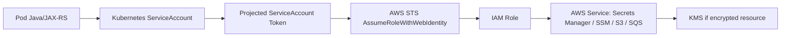
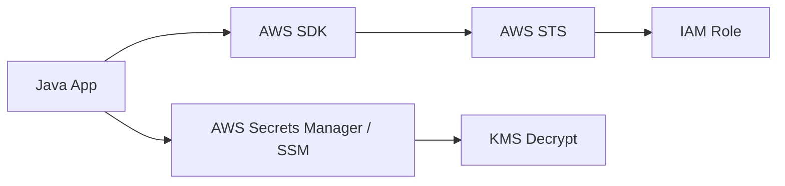
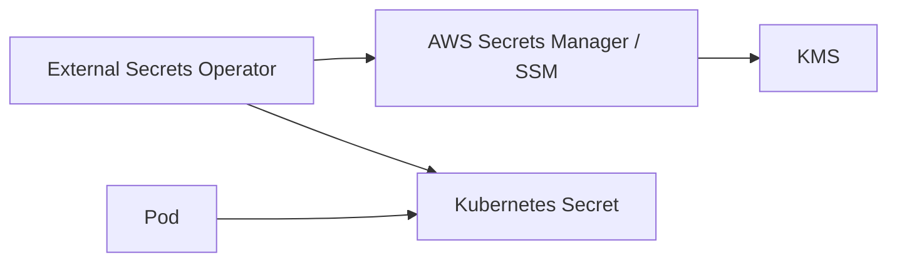
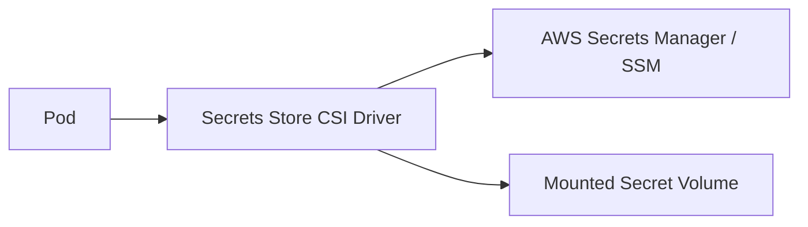
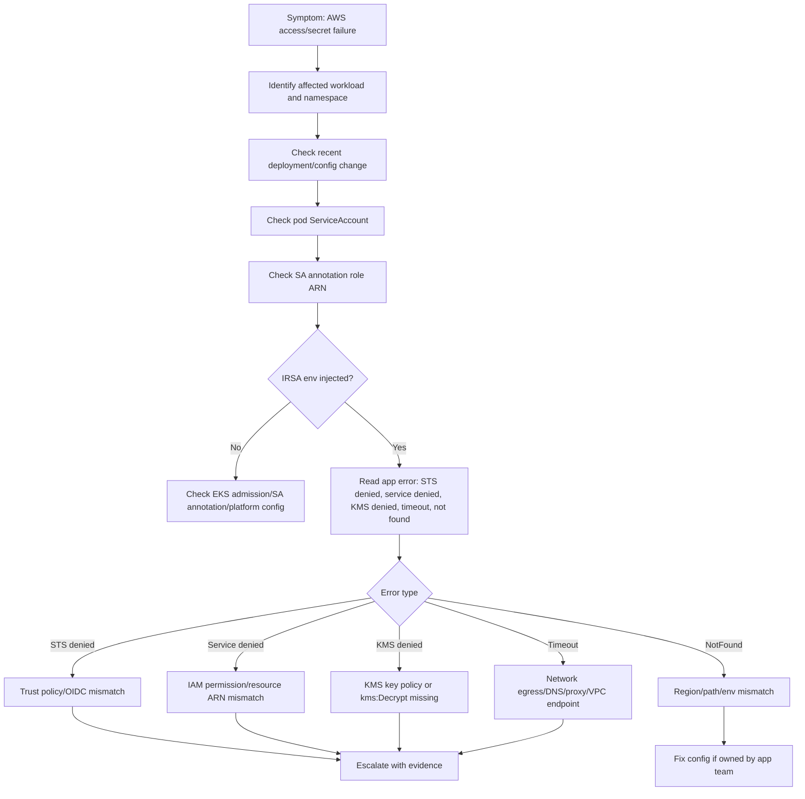

# Part 081 — EKS Identity and Secret Operations

## 1. Tujuan Part Ini

Part ini membahas operasi identitas dan secret pada workload backend yang berjalan di **Amazon EKS**.

Fokusnya bukan membuat IAM role dari nol, tetapi memahami bagaimana sebuah pod Java/JAX-RS di Kubernetes dapat memperoleh identitas AWS secara aman, mengakses AWS Secrets Manager, AWS Systems Manager Parameter Store, KMS, S3, SNS/SQS, atau service AWS lain, dan bagaimana men-debug error seperti:

- `AccessDeniedException`
- `UnrecognizedClientException`
- `ExpiredTokenException`
- `NoCredentialProviders`
- `Unable to load credentials`
- secret tidak tersinkron ke Kubernetes
- secret bisa dibaca aplikasi di local/dev tetapi gagal di EKS
- permission terlihat benar di IAM, tetapi pod tetap denied

Dalam konteks enterprise backend, identity failure sering terlihat seperti bug aplikasi, padahal akar masalahnya bisa berada di salah satu layer berikut:

1. Kubernetes `ServiceAccount`
2. annotation IRSA pada `ServiceAccount`
3. EKS OIDC provider
4. IAM role trust policy
5. IAM permission policy
6. projected service account token
7. AWS SDK credential chain
8. KMS key policy
9. secret resource policy
10. network egress ke AWS endpoint
11. External Secrets / Secrets Store CSI / operator integration

Backend engineer tidak selalu menjadi owner IAM atau EKS platform. Namun backend engineer harus bisa membaca failure chain, mengumpulkan bukti, dan mengeskalasi ke platform/security dengan diagnosis yang jelas.

---

## 2. Mental Model: Pod Tidak Otomatis Punya Akses AWS

Di EKS, pod adalah workload Kubernetes. Pod tidak otomatis memiliki permission AWS hanya karena berjalan di cluster AWS.

Akses AWS harus diberikan melalui mekanisme identity yang eksplisit. Dalam banyak setup modern, mekanisme yang umum dipakai adalah **IAM Roles for Service Accounts**, atau IRSA.

Alur sederhananya:



Runtime pod biasanya tidak menyimpan AWS access key statis. Sebaliknya, AWS SDK membaca token web identity dari filesystem pod, lalu memanggil AWS STS untuk mendapatkan temporary credentials.

Jika salah satu link di chain tersebut rusak, aplikasi akan mengalami access denied atau credential resolution failure.

---

## 3. Core Components yang Harus Dipahami Backend Engineer

### 3.1 Kubernetes ServiceAccount

`ServiceAccount` adalah identity Kubernetes untuk pod. Pada EKS dengan IRSA, `ServiceAccount` juga menjadi anchor untuk menghubungkan pod ke IAM role.

Contoh bentuk umum:

```yaml
apiVersion: v1
kind: ServiceAccount
metadata:
  name: quote-order-api
  namespace: quote-prod
  annotations:
    eks.amazonaws.com/role-arn: arn:aws:iam::123456789012:role/quote-order-api-prod-role
```

Hal yang harus dicek:

- apakah Deployment menggunakan `serviceAccountName` yang benar
- apakah ServiceAccount ada di namespace yang sama
- apakah annotation role ARN benar
- apakah role ARN mengarah ke account/environment yang benar
- apakah pod benar-benar memakai ServiceAccount tersebut

Kesalahan umum:

```yaml
spec:
  template:
    spec:
      serviceAccountName: default
```

Jika workload memakai `default` ServiceAccount, annotation IRSA pada ServiceAccount lain tidak akan berpengaruh.

---

### 3.2 IRSA Annotation

Annotation penting:

```yaml
eks.amazonaws.com/role-arn: arn:aws:iam::<account-id>:role/<role-name>
```

Annotation ini memberi tahu EKS admission webhook untuk menginjeksi environment dan volume token web identity ke pod.

Biasanya pod akan memiliki environment seperti:

```text
AWS_ROLE_ARN=arn:aws:iam::123456789012:role/quote-order-api-prod-role
AWS_WEB_IDENTITY_TOKEN_FILE=/var/run/secrets/eks.amazonaws.com/serviceaccount/token
```

Jika environment ini tidak ada, IRSA kemungkinan tidak aktif untuk pod tersebut.

---

### 3.3 EKS OIDC Provider

IRSA bergantung pada OIDC provider yang diasosiasikan dengan EKS cluster.

Trust policy IAM role biasanya merujuk ke OIDC issuer cluster:

```json
{
  "Effect": "Allow",
  "Principal": {
    "Federated": "arn:aws:iam::123456789012:oidc-provider/oidc.eks.<region>.amazonaws.com/id/<oidc-id>"
  },
  "Action": "sts:AssumeRoleWithWebIdentity",
  "Condition": {
    "StringEquals": {
      "oidc.eks.<region>.amazonaws.com/id/<oidc-id>:sub": "system:serviceaccount:quote-prod:quote-order-api",
      "oidc.eks.<region>.amazonaws.com/id/<oidc-id>:aud": "sts.amazonaws.com"
    }
  }
}
```

Backend engineer biasanya tidak mengelola OIDC provider, tetapi harus tahu bahwa error access denied bisa terjadi karena:

- OIDC provider belum dibuat
- OIDC issuer salah
- trust policy mengacu ke cluster lain
- namespace/service account pada `sub` tidak cocok
- `aud` tidak cocok

---

### 3.4 IAM Role Trust Policy

Trust policy menentukan siapa yang boleh assume role. Untuk IRSA, yang diperbolehkan adalah ServiceAccount tertentu dari namespace tertentu.

Failure yang sering terjadi:

| Symptom | Kemungkinan akar masalah |
|---|---|
| `AccessDenied` saat STS assume role | trust policy tidak match |
| pod memakai ServiceAccount benar tapi tetap denied | namespace/serviceAccount pada `sub` salah |
| role sama dipakai dev/stage/prod | trust policy terlalu lebar atau environment salah |
| app berjalan di namespace baru | trust policy belum di-update |

Prinsip production:

- role harus scoped per workload atau per bounded context yang jelas
- jangan pakai wildcard namespace tanpa alasan governance
- jangan share role antar environment tanpa review security
- trust policy harus bisa diaudit dari workload owner sampai IAM role

---

### 3.5 IAM Permission Policy

Setelah role berhasil diasumsikan, permission policy menentukan action dan resource yang boleh diakses.

Contoh scoped policy untuk secret tertentu:

```json
{
  "Effect": "Allow",
  "Action": [
    "secretsmanager:GetSecretValue",
    "secretsmanager:DescribeSecret"
  ],
  "Resource": "arn:aws:secretsmanager:ap-southeast-1:123456789012:secret:prod/quote-order/db-*"
}
```

Jika secret dienkripsi dengan customer-managed KMS key, role juga membutuhkan permission KMS:

```json
{
  "Effect": "Allow",
  "Action": [
    "kms:Decrypt"
  ],
  "Resource": "arn:aws:kms:ap-southeast-1:123456789012:key/<key-id>"
}
```

Tanpa KMS permission, aplikasi bisa punya permission `GetSecretValue` tetapi tetap gagal membuka secret.

---

## 4. AWS SDK Credential Chain di Java Service

Java backend biasanya memakai AWS SDK, baik langsung maupun melalui library lain.

Dalam EKS IRSA, credential chain idealnya menemukan:

1. `AWS_WEB_IDENTITY_TOKEN_FILE`
2. `AWS_ROLE_ARN`
3. memanggil STS `AssumeRoleWithWebIdentity`
4. menggunakan temporary credentials

Masalah umum:

- aplikasi override credential provider ke static credentials
- environment variable lama masih ada
- library memakai AWS SDK versi lama
- region tidak diset
- pod tidak punya egress ke STS endpoint
- proxy/NO_PROXY salah
- token file tidak terbaca karena security context/file permission issue

Checklist aplikasi Java:

- gunakan default credential provider chain jika memungkinkan
- jangan hardcode access key/secret key
- pastikan region dikonfigurasi secara eksplisit atau tersedia via environment
- pastikan AWS SDK version mendukung web identity provider
- log identity secara aman hanya untuk metadata non-secret, bukan credential

Contoh safe diagnostic di aplikasi:

```text
AWS region configured: ap-southeast-1
Credential provider type: WebIdentityTokenCredentialsProvider
Resolved role ARN: arn:aws:iam::<account-id>:role/<role-name>
```

Jangan pernah log:

- access key
- secret key
- session token
- raw web identity token
- secret value

---

## 5. Secret Access Pattern di EKS

Ada beberapa pola umum untuk secret consumption.

### 5.1 Aplikasi Membaca Langsung dari AWS Secrets Manager / SSM



Kelebihan:

- tidak perlu menyimpan secret sebagai Kubernetes Secret
- secret rotation bisa lebih langsung
- akses diaudit di AWS

Risiko:

- aplikasi bergantung pada AWS API saat startup/runtime
- perlu retry/backoff yang benar
- perlu network egress ke AWS endpoint
- failure AWS endpoint dapat memengaruhi readiness/startup

Cocok untuk:

- service yang sudah cloud-native
- secret yang perlu rotation ketat
- workload dengan AWS SDK yang matang

---

### 5.2 External Secrets Operator Mensinkronkan ke Kubernetes Secret



Kelebihan:

- aplikasi cukup membaca env var atau mounted file
- pattern aplikasi lebih sederhana
- integrasi Kubernetes-native

Risiko:

- sinkronisasi bisa stale
- failure operator bisa tidak terlihat langsung oleh aplikasi
- secret value berada sebagai Kubernetes Secret
- perlu RBAC dan encryption-at-rest governance

Cocok untuk:

- aplikasi legacy
- framework yang membaca config dari env/file
- organisasi yang menstandarkan secret injection via operator

---

### 5.3 Secrets Store CSI Driver



Kelebihan:

- secret bisa dimount sebagai file
- dapat mengurangi kebutuhan Kubernetes Secret jika tidak disync
- cocok untuk certificate, key, dan config file sensitif

Risiko:

- aplikasi harus membaca file
- reload behavior perlu jelas
- mount failure menyebabkan pod startup failure
- rotation behavior harus dipahami

---

## 6. Failure Mode Utama

### 6.1 Pod Menggunakan ServiceAccount yang Salah

Symptom:

- environment IRSA tidak muncul
- AWS SDK memakai fallback credential
- access denied atau no credential provider

Investigasi aman:

```bash
kubectl -n <namespace> get deploy <deploy> -o jsonpath='{.spec.template.spec.serviceAccountName}'
kubectl -n <namespace> get sa <service-account> -o yaml
kubectl -n <namespace> describe pod <pod>
```

Yang dicari:

- `serviceAccountName`
- annotation `eks.amazonaws.com/role-arn`
- env `AWS_ROLE_ARN`
- env `AWS_WEB_IDENTITY_TOKEN_FILE`
- volume projected token

Mitigasi:

- perbaiki `serviceAccountName`
- redeploy pod
- validasi pod baru mendapat env IRSA

Eskalasi:

- jika ServiceAccount benar tapi env IRSA tidak diinject, eskalasi ke platform/EKS owner.

---

### 6.2 Trust Policy Tidak Cocok

Symptom:

- pod punya `AWS_ROLE_ARN`
- STS call gagal
- error `AccessDenied` pada `AssumeRoleWithWebIdentity`

Kemungkinan:

- namespace pada trust policy salah
- ServiceAccount name salah
- OIDC provider salah
- role dari account/cluster berbeda

Evidence yang perlu dikumpulkan:

```bash
kubectl -n <namespace> get sa <service-account> -o yaml
kubectl -n <namespace> get pod <pod> -o jsonpath='{.spec.serviceAccountName}'
kubectl -n <namespace> logs <pod> --since=30m
```

Jangan expose token file atau credential.

Mitigasi:

- platform/security memperbaiki trust policy
- rollout ulang pod jika diperlukan

---

### 6.3 IAM Permission Kurang

Symptom:

- role berhasil diasumsikan
- secret/service call gagal `AccessDeniedException`

Contoh:

```text
User: arn:aws:sts::<account-id>:assumed-role/quote-order-api-prod-role/... is not authorized to perform: secretsmanager:GetSecretValue on resource: ...
```

Yang perlu dibaca dari error:

- assumed role ARN
- action yang ditolak
- resource ARN
- region
- account ID

Mitigasi:

- minta penambahan permission minimal
- pastikan resource ARN sesuai environment
- pastikan KMS permission jika secret encrypted

---

### 6.4 KMS Decrypt Denied

Symptom:

- `GetSecretValue` diizinkan
- error menyebut `kms:Decrypt`
- secret/parameter encrypted dengan customer-managed key

Root cause:

- role tidak punya `kms:Decrypt`
- KMS key policy tidak mengizinkan role
- encryption context restriction tidak match

Mitigasi:

- security/platform update key policy atau IAM policy
- jangan bypass dengan memindahkan secret ke plaintext location

---

### 6.5 Region Salah

Symptom:

- secret tidak ditemukan
- parameter tidak ditemukan
- role benar, permission benar, tetapi AWS SDK mencari di region lain

Checklist:

```bash
kubectl -n <namespace> get deploy <deploy> -o yaml | grep -i AWS_REGION -n
kubectl -n <namespace> get configmap <configmap> -o yaml
```

Yang dicek:

- `AWS_REGION`
- `AWS_DEFAULT_REGION`
- application config region
- environment overlay Helm/Kustomize

Mitigasi:

- koreksi config region
- rollout ulang pod
- validasi secret ARN/parameter path region

---

### 6.6 Network Egress ke AWS Endpoint Gagal

Symptom:

- credential provider timeout
- Secrets Manager/SSM call timeout
- STS endpoint timeout
- error berbeda antar namespace/node

Kemungkinan:

- no NAT gateway
- VPC endpoint belum ada
- NetworkPolicy blok egress
- proxy/NO_PROXY salah
- security group/NACL/firewall
- DNS private endpoint salah

Investigasi aman:

```bash
kubectl -n <namespace> describe pod <pod>
kubectl -n <namespace> logs <pod> --since=30m
kubectl -n <namespace> get netpol
```

Jika policy mengizinkan `kubectl exec` dan sesuai aturan internal:

```bash
kubectl -n <namespace> exec -it <pod> -- sh
# lalu cek DNS/connectivity dengan tool yang tersedia, tanpa mencetak secret
```

Eskalasi:

- platform/network team untuk VPC endpoint, NAT, security group, DNS, atau proxy.

---

## 7. Production-Safe Investigation Flow



---

## 8. Safe Commands untuk Backend Engineer

Read-only investigation:

```bash
kubectl config current-context
kubectl config view --minify
kubectl get ns
kubectl -n <namespace> get deploy <deploy> -o yaml
kubectl -n <namespace> get sa <service-account> -o yaml
kubectl -n <namespace> get pod <pod> -o yaml
kubectl -n <namespace> describe pod <pod>
kubectl -n <namespace> logs <pod> --since=30m
kubectl -n <namespace> get events --sort-by=.lastTimestamp
kubectl -n <namespace> get externalsecret
kubectl -n <namespace> describe externalsecret <name>
```

Hati-hati:

```bash
kubectl -n <namespace> exec -it <pod> -- env
```

Command ini bisa mengekspos environment variable sensitif. Gunakan hanya jika policy internal mengizinkan dan jangan copy credential/secret value ke chat, tiket, atau dokumen incident.

Lebih aman mencari nama env tertentu tanpa menampilkan value:

```bash
kubectl -n <namespace> exec <pod> -- sh -c 'env | cut -d= -f1 | sort | grep AWS'
```

---

## 9. Observability Signal yang Harus Dicek

### 9.1 Application Logs

Cari:

- AWS SDK credential provider error
- action yang denied
- resource ARN yang denied
- region
- timeout
- retry exhaustion
- startup failure karena secret missing

Jangan log secret value.

---

### 9.2 Kubernetes Events

Cari:

- failed mount secret
- ExternalSecret sync failure
- CSI mount failure
- pod restart karena startup secret failure
- readiness failure akibat dependency AWS call

---

### 9.3 AWS Audit / CloudTrail

Biasanya dicek oleh platform/security, tetapi backend engineer perlu tahu evidence yang diminta:

- assumed role ARN
- action
- resource
- timestamp UTC
- region
- request ID jika tersedia

---

### 9.4 External Secrets / CSI Metrics

Jika menggunakan operator:

- sync status
- last sync time
- provider error
- permission denied
- secret version mismatch
- reconciliation lag

---

## 10. Backend-Specific Implications

### 10.1 Java/JAX-RS API Service

Risiko:

- startup gagal jika secret dibaca saat boot
- readiness gagal jika health endpoint mengecek Secrets Manager secara sinkron
- latency spike jika secret dibaca pada request path
- retry storm ke AWS API saat secret provider bermasalah

Rekomendasi:

- baca secret saat startup jika memang immutable selama lifecycle pod
- cache secret dengan strategy yang jelas
- jangan panggil Secrets Manager per request
- health check jangan bergantung pada AWS secret store kecuali benar-benar diperlukan
- expose readiness berdasarkan kemampuan melayani traffic, bukan semua dependency non-critical

---

### 10.2 Kafka/RabbitMQ Consumer

Risiko:

- credential broker berasal dari secret yang stale
- secret rotation memutus koneksi consumer
- pod restart massal menyebabkan rebalance storm atau queue backlog

Checklist:

- secret reload behavior
- graceful shutdown
- connection retry/backoff
- consumer lag/queue depth alert
- rollout surge control

---

### 10.3 PostgreSQL/Redis Dependency

Risiko:

- password rotated tapi pool tidak reconnect
- secret updated tapi pod belum restart
- connection pool terus memakai credential lama
- ExternalSecret sync sukses tetapi aplikasi tidak reload

Checklist:

- rotation runbook
- restart requirement
- pool reconnect behavior
- migration job credential source
- rollback limitation setelah password rotation

---

## 11. Mitigation Pattern

| Problem | Safe initial mitigation | Escalation |
|---|---|---|
| Wrong ServiceAccount | patch manifest via GitOps, rollout pod | backend/platform |
| Missing SA annotation | fix ServiceAccount manifest | platform/backend depending ownership |
| Trust policy mismatch | collect evidence, request IAM trust fix | platform/security |
| Permission denied specific action | request least-privilege policy update | security/platform |
| KMS denied | request KMS key policy/IAM fix | security/platform |
| Region/path mismatch | fix app config/overlay | backend |
| ExternalSecret stale | check operator status, force sync only if allowed | platform |
| Network timeout to AWS | validate DNS/egress evidence | platform/network |
| Secret rotation broke app | follow rotation rollback/restart runbook | backend/platform/security |

---

## 12. PR Review Checklist

Saat mereview PR yang menyentuh EKS identity atau secret:

- Apakah `serviceAccountName` eksplisit?
- Apakah ServiceAccount berbeda dari `default`?
- Apakah annotation IRSA mengarah ke role environment yang benar?
- Apakah namespace dan ServiceAccount cocok dengan trust policy?
- Apakah permission terlalu luas?
- Apakah secret ARN/path environment-specific?
- Apakah ada secret value masuk ke repo?
- Apakah KMS permission diperhitungkan?
- Apakah region dikonfigurasi jelas?
- Apakah secret rotation behavior jelas?
- Apakah aplikasi perlu restart saat secret berubah?
- Apakah readiness/liveness tidak bergantung pada secret provider secara berlebihan?
- Apakah ada dashboard/alert untuk secret sync/access failure?
- Apakah rollback path aman jika secret/config berubah?

---

## 13. Internal Verification Checklist

Verifikasi di internal CSG/team, jangan diasumsikan:

- Apakah EKS workload memakai IRSA?
- Apakah ada workload yang masih memakai node IAM role atau static AWS credentials?
- Bagaimana standard ServiceAccount per service?
- Siapa owner IAM role: backend, platform, security, atau DevOps?
- Apakah IAM role dibuat via Terraform, CloudFormation, CDK, atau manual?
- Di mana mapping ServiceAccount ke IAM role didefinisikan?
- Apakah role dipisah per namespace/environment?
- Apakah Secrets Manager, SSM, atau Kubernetes Secret menjadi standard utama?
- Apakah External Secrets Operator digunakan?
- Apakah Secrets Store CSI Driver digunakan?
- Bagaimana secret rotation dilakukan?
- Apakah rotation butuh pod restart?
- Apakah secret sync failure punya alert?
- Apakah KMS key policy dikelola security/platform?
- Apakah ada VPC endpoint untuk STS, Secrets Manager, SSM, KMS?
- Apakah private cluster membutuhkan proxy/NO_PROXY?
- Apakah `kubectl exec` ke production pod diperbolehkan?
- Bagaimana cara aman memverifikasi env tanpa membocorkan secret?
- Apakah CloudTrail bisa diakses saat incident?
- Apa template escalation untuk access denied?

---

## 14. Runbook Singkat: AWS Secret Access Denied dari Pod

1. Identifikasi service, namespace, pod, environment.
2. Cek apakah error terjadi setelah deployment/config/secret rotation.
3. Cek pod memakai ServiceAccount yang benar.
4. Cek annotation IRSA pada ServiceAccount.
5. Cek apakah pod mendapat env IRSA.
6. Baca error aplikasi: STS denied, service denied, KMS denied, timeout, atau not found.
7. Jika STS denied, curigai trust policy/OIDC mismatch.
8. Jika service denied, curigai IAM permission/resource ARN.
9. Jika KMS denied, curigai KMS key policy/`kms:Decrypt`.
10. Jika timeout, curigai network egress/DNS/proxy/VPC endpoint.
11. Jika not found, cek region/path/environment overlay.
12. Kumpulkan evidence tanpa secret value.
13. Mitigasi config yang dimiliki backend.
14. Eskalasi IAM/KMS/network/operator issue ke owner yang tepat.
15. Setelah fix, validasi pod baru, logs, readiness, dan dependency call.

---

## 15. Key Takeaways

- Di EKS, pod tidak otomatis punya AWS permission.
- IRSA menghubungkan Kubernetes ServiceAccount ke IAM role melalui OIDC dan STS.
- Access denied harus dibaca sebagai chain failure, bukan langsung bug aplikasi.
- Secret access bisa gagal karena IAM permission, trust policy, KMS key policy, region, network, DNS, atau operator sync.
- Backend engineer harus bisa mengumpulkan bukti production-safe tanpa membocorkan secret.
- Untuk Java/JAX-RS service, credential chain, startup behavior, readiness, caching, dan retry policy sangat menentukan stabilitas.
- Semua detail role, policy, secret source, rotation, dan escalation harus diverifikasi di internal team.
