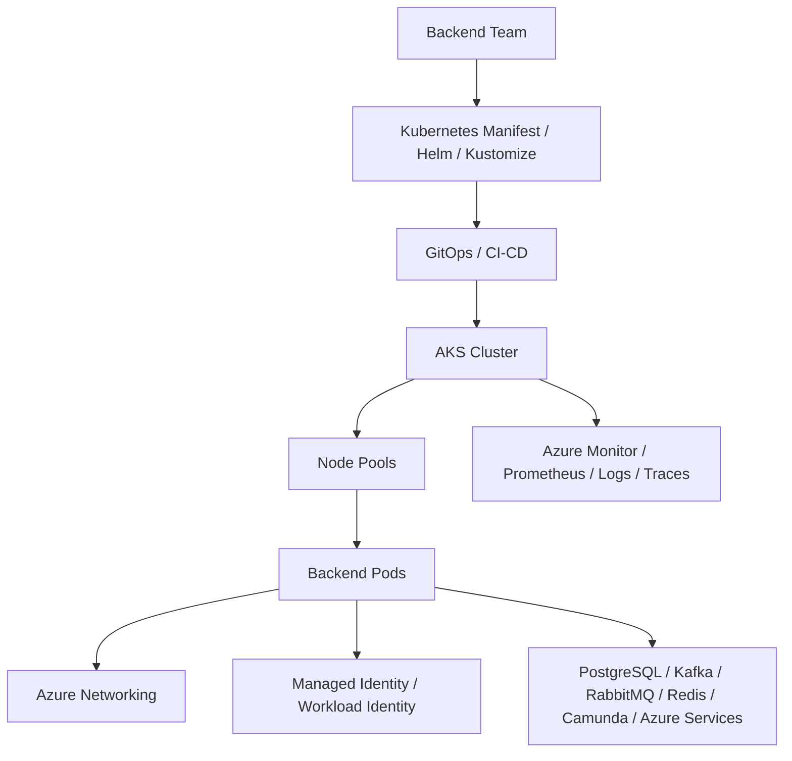
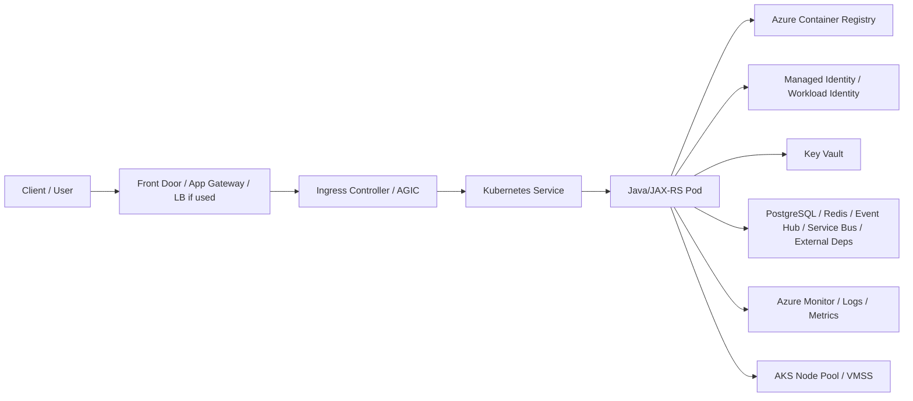
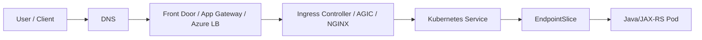
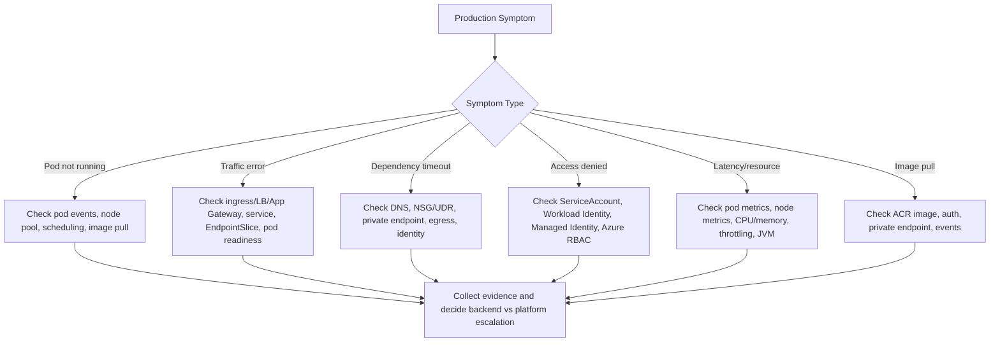

# Part 082 — AKS Operations Foundation

## 1. Tujuan Part Ini

Part ini membangun fondasi operasi **Azure Kubernetes Service** atau **AKS** dari sudut pandang senior backend engineer.

Fokusnya bukan menjadi Azure platform engineer, melainkan memahami komponen AKS yang sering muncul ketika backend service mengalami masalah production:

- pod Pending karena node pool capacity
- image pull gagal dari Azure Container Registry
- ingress tidak menerima traffic karena load balancer/Application Gateway issue
- workload gagal mengakses Azure service karena identity problem
- DNS/private endpoint bermasalah
- node pool upgrade menyebabkan pod disruption
- Azure Monitor tidak menampilkan sinyal yang cukup
- service Java/JAX-RS terlihat error padahal akar masalah ada di Azure networking atau node pool

Backend engineer harus mampu membaca AKS sebagai runtime produksi, menghubungkan symptom aplikasi dengan layer Kubernetes/Azure, dan mengeskalasi dengan evidence yang tepat.

---

## 2. AKS sebagai Managed Kubernetes Runtime

AKS adalah managed Kubernetes dari Azure. Control plane dikelola oleh Azure, tetapi workload, manifest, namespace, resource sizing, probes, rollout, observability, dan readiness aplikasi tetap menjadi tanggung jawab shared antara application team dan platform/SRE.

Mental model:



Yang dikelola Azure:

- managed control plane
- API server availability sesuai service model Azure
- managed integration tertentu
- cloud primitives untuk load balancer, VMSS, disk, identity, monitoring

Yang biasanya dikelola platform/SRE:

- cluster configuration
- node pool design
- CNI/networking
- ingress controller/Application Gateway integration
- Azure Monitor/observability stack
- cluster upgrade
- RBAC/governance/policy
- workload identity baseline
- private cluster/private endpoint pattern

Yang tetap harus dipahami backend engineer:

- workload behavior di pod
- resources/probes/shutdown/rollout
- service dependency path
- identity requirement aplikasi
- image registry dependency
- log/metric/trace signal
- failure evidence collection

---

## 3. AKS Component Map



Komponen yang sering relevan saat debugging:

- AKS cluster
- system node pool
- user node pool
- VM Scale Set
- Azure CNI
- Azure Load Balancer
- Application Gateway / AGIC
- Azure Container Registry
- Azure Monitor / Container Insights
- Managed Identity
- Azure Workload Identity
- Key Vault / Key Vault CSI Driver
- Azure Disk CSI / Azure Files CSI
- NSG / UDR / Private DNS Zone / Private Endpoint

---

## 4. Cluster dan Control Plane

AKS menyediakan managed Kubernetes control plane. Backend engineer jarang mengoperasikan API server secara langsung, tetapi harus mengenali dampaknya.

Symptom terkait control plane/API:

- `kubectl` lambat atau timeout
- GitOps sync gagal karena API unavailable/throttled
- deployment stuck karena admission webhook/policy issue
- event tidak cepat muncul
- autoscaler/controller delay

Hal yang perlu diketahui:

- AKS version
- maintenance window
- upgrade cadence
- deprecated API policy
- private/public API server access
- authorized IP ranges jika API public
- cluster RBAC integration dengan Azure AD/Microsoft Entra ID

Backend responsibility:

- pastikan manifest workload kompatibel dengan Kubernetes version
- hindari deprecated APIs
- cek apakah failure hanya workload atau cluster-wide
- eskalasi API/control-plane symptom ke platform/SRE

---

## 5. Node Pool: System vs User Node Pool

AKS memakai node pool untuk menjalankan workload. Node pool biasanya berbasis **Virtual Machine Scale Sets** atau VMSS.

### 5.1 System Node Pool

System node pool biasanya menjalankan critical system pods seperti:

- CoreDNS
- metrics server
- kube-proxy or networking components
- ingress/controller tertentu jika dipasang di system pool
- cluster add-ons

Backend workload production sebaiknya tidak sembarang berjalan di system node pool kecuali policy internal mengizinkan.

### 5.2 User Node Pool

User node pool menjalankan aplikasi bisnis:

- JAX-RS API service
- Kafka/RabbitMQ consumer
- Camunda worker
- scheduler
- batch job
- integration service

Node pool bisa dipisahkan berdasarkan:

- environment
- workload type
- criticality
- VM size
- CPU/memory profile
- zone
- spot vs regular
- compliance boundary

---

## 6. Node Pool Failure Modes

| Symptom | Kemungkinan akar masalah |
|---|---|
| Pod Pending | insufficient CPU/memory, node pool max size, taint mismatch |
| Pod sering evicted | memory/disk pressure pada node |
| Latency spike setelah reschedule | workload pindah ke node/zone berbeda |
| Deployment stuck saat upgrade | PDB terlalu ketat atau capacity kurang |
| HPA scale out tapi pod Pending | cluster autoscaler/node pool tidak menambah node |
| Semua pod di node tertentu error | node runtime/kernel/network issue |

Investigasi aman:

```bash
kubectl get nodes -o wide
kubectl describe node <node>
kubectl get pods -A -o wide | grep <node>
kubectl -n <namespace> describe pod <pod>
kubectl -n <namespace> get events --sort-by=.lastTimestamp
```

Yang dicari:

- node readiness
- memory pressure
- disk pressure
- taints
- allocatable CPU/memory
- pod requests
- zone
- node pool label

---

## 7. VM Scale Set Awareness

AKS node pool umumnya dipetakan ke Azure VM Scale Set. Backend engineer tidak perlu mengelola VMSS secara langsung, tetapi perlu tahu bahwa node capacity berasal dari VMSS.

Konsekuensi operasional:

- autoscaling node butuh waktu
- Azure quota bisa membatasi scale-out
- VM SKU availability bisa berbeda per region/zone
- upgrade node pool menyebabkan drain/reschedule
- spot node bisa preempted
- disk/network performance mengikuti VM SKU

Pertanyaan internal yang perlu diverifikasi:

- node pool apa yang menjalankan workload saya?
- apakah node pool autoscaling aktif?
- berapa min/max node?
- apakah workload boleh berjalan di spot node?
- apakah workload disebar multi-zone?
- apa VM SKU dan batas CPU/memory/network-nya?

---

## 8. Azure CNI Awareness

AKS dapat memakai beberapa model networking, tetapi dalam enterprise environment sering ada Azure CNI atau variasinya. Detail internal harus diverifikasi.

Dengan Azure CNI, pod sering terintegrasi lebih langsung dengan VNet/subnet Azure. Ini berdampak pada:

- IP address allocation
- subnet capacity
- Network Security Group
- User Defined Route
- private endpoint access
- firewall path
- DNS/private DNS behavior

Failure mode yang sering muncul:

- subnet IP exhaustion sehingga pod tidak bisa dijadwalkan atau network tidak siap
- pod tidak bisa reach database/private endpoint
- NSG/UDR/firewall memblokir traffic
- private DNS zone tidak resolve dari pod
- egress keluar lewat route/proxy yang salah

Backend engineer harus bisa membuktikan symptom dari aplikasi, tetapi perbaikan biasanya milik platform/network team.

---

## 9. Azure Load Balancer dan Application Gateway

AKS service exposure bisa melibatkan:

- Azure Load Balancer
- Application Gateway
- Application Gateway Ingress Controller atau AGIC
- NGINX ingress controller di belakang Azure Load Balancer
- Azure Front Door di depan gateway
- API Management dalam beberapa enterprise setup

Alur traffic umum:



Failure mode:

| Symptom | Kemungkinan akar masalah |
|---|---|
| 404 | route/path/host mismatch |
| 502 | backend unavailable, protocol mismatch, pod reset |
| 503 | service no endpoint, unhealthy backend pool |
| 504 | upstream timeout, app latency, dependency latency |
| TLS error | cert/SNI/trust mismatch |
| Client IP hilang | proxy header/source IP policy |

Checklist backend:

- pahami ingress mechanism yang dipakai
- cek apakah error terjadi sebelum atau sesudah ingress
- cek endpoint service dan pod readiness
- cek access log ingress/gateway
- cek trace jika request sudah masuk aplikasi

---

## 10. Azure Container Registry Operations Awareness

AKS workload biasanya menarik image dari **Azure Container Registry** atau registry lain.

Failure mode:

- `ImagePullBackOff`
- `ErrImagePull`
- image tag tidak ada
- ACR permission denied
- private endpoint/DNS ke ACR gagal
- image digest tidak sesuai
- registry outage
- image scan gate gagal di pipeline

Investigasi aman:

```bash
kubectl -n <namespace> describe pod <pod>
kubectl -n <namespace> get pod <pod> -o jsonpath='{.spec.containers[*].image}'
kubectl -n <namespace> get events --sort-by=.lastTimestamp
```

Yang dicari:

- image name/tag/digest
- pull error message
- `imagePullSecrets`
- node pool identity/ACR attachment pattern
- private endpoint or firewall issue

Backend responsibility:

- memastikan image tag/digest yang dideploy benar
- memastikan pipeline sudah push image
- memastikan manifest/GitOps sudah menunjuk artifact yang benar

Platform responsibility:

- ACR integration
- registry auth
- private endpoint/firewall/DNS
- node identity/pull permission

---

## 11. Azure Monitor and Observability Foundation

AKS sering diintegrasikan dengan:

- Azure Monitor
- Container Insights
- Log Analytics Workspace
- Managed Prometheus
- Managed Grafana
- Application Insights
- OpenTelemetry Collector
- custom observability stack

Backend engineer harus tahu entrypoint observability internal:

- pod restart dashboard
- deployment availability dashboard
- CPU/memory/throttling dashboard
- ingress/request dashboard
- application latency/error rate dashboard
- JVM dashboard
- dependency dashboard
- trace explorer
- log query workspace

Failure saat observability tidak matang:

- incident hanya bergantung pada log manual
- tidak ada deployment marker
- tidak ada correlation ID
- pod restart tidak ter-alert
- queue lag tidak terlihat
- Azure resource issue tidak terkorelasi dengan application symptom

---

## 12. AKS Identity Awareness

Detail identity dibahas lebih dalam di part berikutnya, tetapi AKS foundation perlu mengenali komponen utama:

- Managed Identity
- Azure Workload Identity
- federated credential
- Microsoft Entra ID integration
- Azure RBAC
- Kubernetes RBAC
- Key Vault access
- ACR pull identity

Pemisahan penting:

| Layer | Digunakan untuk |
|---|---|
| Kubernetes ServiceAccount | identity workload di Kubernetes |
| Kubernetes RBAC | izin ke Kubernetes API |
| Azure Workload Identity | mapping pod ke Azure identity |
| Managed Identity | akses ke Azure resource |
| Azure RBAC | permission pada Azure resource |
| Key Vault access policy/RBAC | akses secret/key/certificate |

Access denied harus dibaca berdasarkan layer yang benar.

---

## 13. Storage and CSI Awareness

AKS bisa memakai:

- Azure Disk CSI
- Azure Files CSI
- ephemeral OS disk
- managed disk
- storage class berbeda per performance/redundancy

Untuk backend engineer, storage paling sering relevan pada:

- batch/file processing
- stateful dependency awareness
- mounted config/cert/secret
- PVC pending
- mount failure
- disk full
- node drain dengan attached disk

Safe investigation:

```bash
kubectl -n <namespace> get pvc
kubectl -n <namespace> describe pvc <pvc>
kubectl -n <namespace> describe pod <pod>
kubectl get storageclass
```

Perbaikan storage biasanya perlu platform/storage owner.

---

## 14. AKS Upgrade Awareness

AKS cluster dan node pool upgrade dapat memengaruhi workload.

Dampak yang perlu dipahami backend engineer:

- node drain menyebabkan pod termination
- PDB bisa memblokir upgrade
- single replica service bisa downtime
- pod dengan shutdown buruk bisa kehilangan in-flight request/message
- deprecated API bisa gagal apply
- ingress/CNI/CSI/add-on upgrade bisa memengaruhi networking/storage

Checklist workload sebelum upgrade:

- replica count cukup
- PDB masuk akal
- readiness/liveness benar
- graceful shutdown valid
- HPA tidak terlalu sempit
- dependency retry/backoff aman
- no deprecated API
- dashboard dan alert aktif

---

## 15. AKS Failure Investigation Flow



---

## 16. Safe Commands untuk AKS Workload Investigation

```bash
kubectl config current-context
kubectl get ns
kubectl -n <namespace> get deploy,rs,pod,svc,ingress,hpa,pdb
kubectl -n <namespace> describe pod <pod>
kubectl -n <namespace> logs <pod> --since=30m
kubectl -n <namespace> get events --sort-by=.lastTimestamp
kubectl get nodes -o wide
kubectl describe node <node>
kubectl -n <namespace> get endpointslice
kubectl -n <namespace> get sa
kubectl -n <namespace> get configmap,secret
```

Untuk command yang dapat mengekspos secret atau mengubah state, ikuti policy internal:

- `kubectl exec`
- `kubectl debug`
- `kubectl port-forward`
- `kubectl rollout restart`
- patch manual pada production object
- delete pod untuk forced reschedule

Dalam GitOps environment, perubahan manual bisa direvert oleh reconciler dan dapat membuat audit trail membingungkan.

---

## 17. Backend-Specific AKS Implications

### 17.1 Java/JAX-RS API Service

Yang harus diperhatikan:

- startup time vs startup probe
- readiness endpoint tidak boleh terlalu rapuh
- graceful shutdown saat node drain/upgrade
- JVM memory sesuai container limit
- Application Insights/OpenTelemetry propagation
- ingress timeout vs application timeout
- Azure private endpoint DNS untuk dependency

---

### 17.2 Kafka/RabbitMQ Consumer

Jika broker berada di Azure/private network/hybrid:

- cek DNS/private endpoint
- cek NSG/UDR/firewall path
- cek pod reschedule saat node pool upgrade
- cek graceful shutdown agar offset/ack aman
- cek queue/lag metric saat autoscaling atau node drain

---

### 17.3 Redis/PostgreSQL/Camunda Dependency

Jika dependency berupa Azure managed service atau self-managed di network private:

- private endpoint DNS harus benar
- connection timeout perlu disejajarkan dengan network path
- secret/identity untuk credential harus jelas
- connection pool per pod harus memperhitungkan HPA
- failover dependency harus terlihat di dashboard

---

## 18. AKS Production Readiness Checklist untuk Backend Service

Sebelum workload dianggap siap di AKS production:

- Deployment memakai namespace dan ServiceAccount yang benar
- image berasal dari registry yang benar dan immutable tag/digest jelas
- pod dapat pull image dari ACR/private registry
- resource requests/limits diset berdasarkan baseline
- JVM sizing sesuai memory limit
- startup/readiness/liveness probe valid
- graceful shutdown teruji saat node drain
- PDB masuk akal
- HPA policy jelas
- ingress route, host, TLS, timeout, dan backend protocol benar
- DNS/private endpoint dependency tervalidasi
- identity/secret strategy jelas
- logs/metrics/traces tersedia
- dashboard dan alert terhubung ke runbook
- rollback path jelas
- owner dan escalation path jelas

---

## 19. Internal Verification Checklist

Verifikasi di internal CSG/team, jangan diasumsikan:

- AKS dipakai untuk environment mana saja?
- Cluster AKS public atau private?
- Kubernetes version dan upgrade cadence?
- Node pool apa saja yang tersedia?
- Workload backend berjalan di node pool mana?
- Apakah node pool autoscaling aktif?
- Apakah workload bisa berjalan di spot node?
- Apakah cluster multi-zone?
- Networking mode apa yang dipakai?
- Apakah Azure CNI digunakan?
- Bagaimana subnet/IP capacity dikelola?
- Apakah ada NSG/UDR/firewall/proxy khusus?
- Apa ingress mechanism: NGINX, AGIC, Application Gateway, Azure Load Balancer, Front Door, APIM?
- Bagaimana TLS certificate dikelola?
- Apakah image ditarik dari ACR?
- Bagaimana AKS diberi permission pull dari ACR?
- Apakah ACR private endpoint digunakan?
- Observability stack apa yang dipakai?
- Apakah Azure Monitor/Container Insights aktif?
- Apakah Application Insights/OpenTelemetry digunakan?
- Apakah Workload Identity atau Managed Identity digunakan?
- Bagaimana Key Vault secret dikonsumsi?
- Apakah Key Vault CSI Driver digunakan?
- Bagaimana runbook node drain/cluster upgrade?
- Siapa owner AKS cluster, node pool, ingress, identity, registry, DNS, dan monitoring?

---

## 20. Escalation Boundary

Backend engineer sebaiknya mengeskalasi ke platform/SRE/network/security ketika evidence menunjukkan:

- node pool capacity habis
- cluster autoscaler tidak menambah node
- subnet IP exhaustion
- node NotReady atau node pressure meluas
- Azure Load Balancer/Application Gateway backend unhealthy tanpa perubahan aplikasi
- ACR pull permission/private endpoint issue
- NSG/UDR/firewall memblokir traffic
- Workload Identity/Managed Identity misconfiguration
- Azure RBAC/Key Vault permission denied
- CNI/CoreDNS/add-on issue
- cluster upgrade/add-on upgrade impact

Backend engineer tetap owner untuk:

- application config
- manifest workload
- resource sizing request awal
- probes
- graceful shutdown
- dependency timeout/retry
- application logs/metrics/traces
- rollout/rollback decision bersama release owner
- production readiness evidence

---

## 21. Key Takeaways

- AKS adalah managed Kubernetes, tetapi workload reliability tetap shared responsibility.
- Backend engineer perlu memahami node pool, VMSS, Azure CNI, ingress/load balancer, ACR, identity, storage, dan Azure Monitor sebagai operational context.
- Banyak incident aplikasi di AKS berasal dari networking, identity, registry, node capacity, atau upgrade behavior.
- Jangan langsung menyimpulkan bug aplikasi sebelum membaca pod events, node state, service endpoint, ingress/gateway signal, registry pull event, dan dependency path.
- Internal topology AKS harus selalu diverifikasi: networking mode, ingress mechanism, identity pattern, registry setup, observability stack, dan escalation owner.
