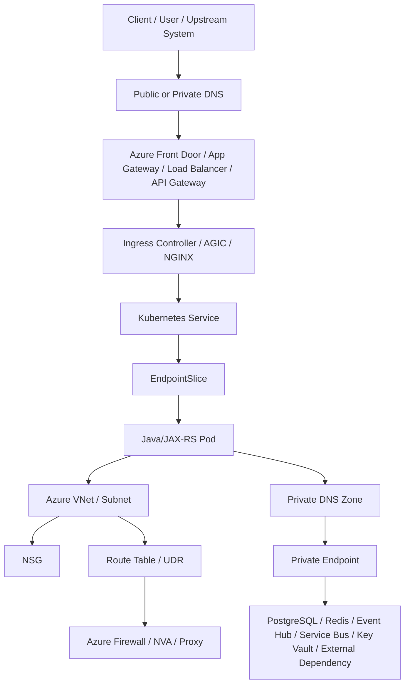
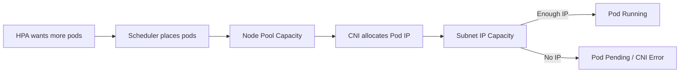
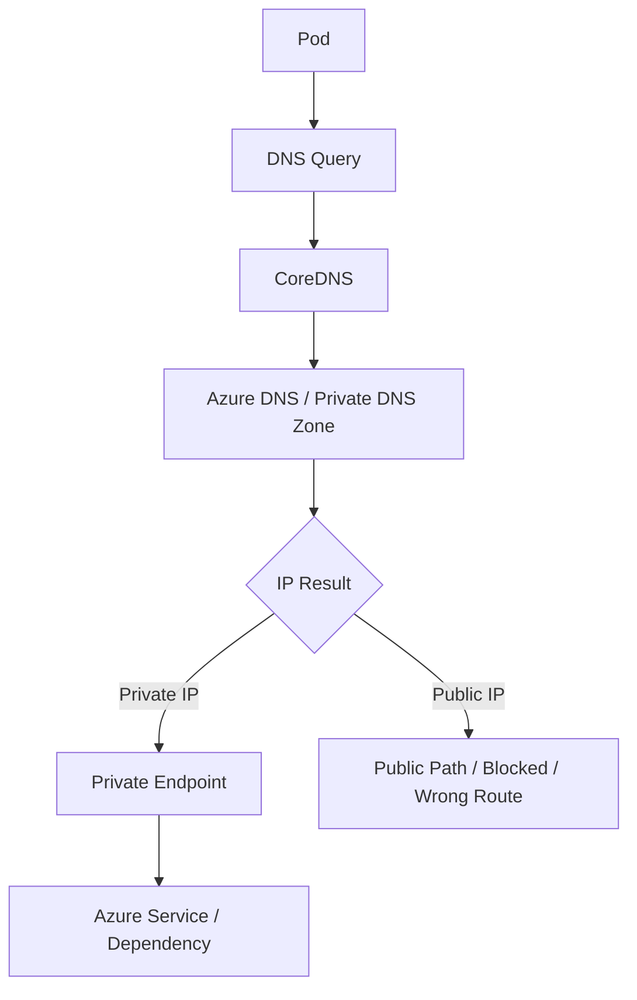
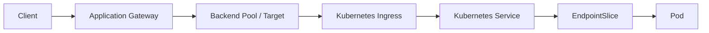
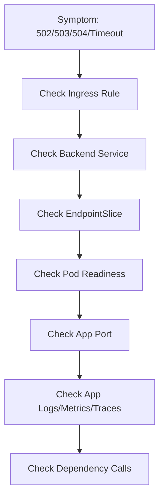
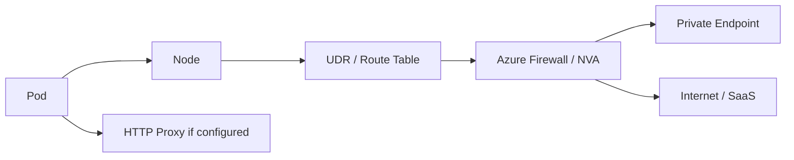

# Part 083 — AKS Networking Operations

## 1. Tujuan Part Ini

Part ini membahas **AKS networking operations** dari sudut pandang senior backend engineer.

Fokusnya bukan menjadi Azure network engineer, tetapi mampu membaca jalur traffic workload backend ketika terjadi masalah seperti:

- pod tidak bisa resolve DNS dependency
- pod tidak bisa connect ke PostgreSQL, Redis, Kafka, RabbitMQ, Camunda, atau service Azure
- ingress mengembalikan 502/503/504
- service reachable dari satu namespace tetapi timeout dari namespace lain
- private endpoint tidak bisa diakses karena DNS salah
- pod Pending atau service gagal karena subnet/IP exhaustion
- traffic keluar cluster gagal karena UDR/firewall/proxy
- Application Gateway/Load Balancer backend terlihat unhealthy
- NetworkPolicy atau NSG/UDR terlihat seperti bug aplikasi

Prinsip utama: **networking incident di AKS harus di-debug sebagai path, bukan sebagai komponen tunggal**.

---

## 2. AKS Network Mental Model

Jalur traffic AKS biasanya melibatkan beberapa boundary sekaligus:



Di AKS, error aplikasi sering hanya gejala terakhir. Akar masalah bisa berada di:

- Kubernetes Service selector
- EndpointSlice kosong
- pod readiness false
- ingress rule salah
- AGIC/Application Gateway backend pool tidak sehat
- Azure Load Balancer health probe gagal
- CoreDNS bermasalah
- Private DNS Zone tidak ter-link ke VNet
- NSG menolak traffic
- UDR mengarahkan traffic ke firewall yang belum allowlist
- private endpoint salah DNS
- subnet kehabisan IP
- proxy/NO_PROXY salah
- Azure CNI atau CNI policy behavior

---

## 3. Backend Engineer Responsibility vs Platform Responsibility

### Backend engineer responsibility

Backend engineer harus mampu:

- membaca request path dari ingress/service sampai pod
- memastikan app listen pada port yang benar
- memastikan Service `targetPort` cocok dengan container port
- memastikan readiness tidak menutup endpoint secara tidak sengaja
- memastikan timeout/retry/pool tidak memperburuk network issue
- membaca logs, metrics, traces, events, dan EndpointSlice
- membuktikan apakah failure terjadi sebelum atau sesudah request masuk ke aplikasi
- memberi evidence jelas saat eskalasi ke platform/network/security

### Platform/SRE/network responsibility

Biasanya platform/SRE/network team owns:

- AKS networking mode
- VNet/subnet design
- NSG, route table, UDR, firewall, proxy
- private cluster setup
- private endpoint pattern
- Private DNS Zone link
- ingress controller / AGIC / Application Gateway
- Azure Load Balancer configuration
- CNI add-on
- cluster DNS baseline
- network observability tooling

### Security responsibility

Security team biasanya owns:

- egress allowlist
- firewall policy
- NSG standard
- private endpoint security pattern
- NetworkPolicy baseline
- TLS/mTLS policy
- restricted outbound internet
- exception process

---

## 4. Azure CNI Awareness

AKS bisa memakai beberapa networking mode. Detail aktual harus diverifikasi di internal team.

Yang penting bagi backend engineer: **bagaimana pod mendapatkan IP dan bagaimana pod keluar/masuk VNet**.

Dengan Azure CNI style networking, pod sering terhubung lebih langsung ke VNet/subnet Azure. Dampaknya:

- pod IP consumption menjadi bagian dari subnet capacity
- subnet IP exhaustion bisa membuat pod gagal dibuat atau scheduling terganggu
- NSG/UDR/firewall bisa berdampak langsung ke pod egress
- private endpoint access bergantung pada VNet/subnet/DNS linkage
- traffic policy bisa muncul di Azure layer, bukan hanya Kubernetes layer

Hal yang perlu dibaca dari pod/node:

```bash
kubectl get nodes -o wide
kubectl -n <namespace> get pods -o wide
kubectl -n <namespace> describe pod <pod>
kubectl -n <namespace> get events --sort-by=.lastTimestamp
```

Yang dicari:

- pod IP
- node IP
- node zone
- node pool label
- FailedScheduling event
- CNI allocation error
- node condition
- pod Pending reason

---

## 5. VNet, Subnet, dan IP Exhaustion

Subnet capacity adalah failure mode penting di AKS.

Symptom umum:

- pod Pending tanpa alasan aplikasi
- node scale-out berhasil tetapi pod tetap tidak dapat IP
- deployment baru hanya sebagian pod running
- HPA scale out menghasilkan pending pods
- error CNI/IP allocation muncul di events atau platform logs

Operational reasoning:



Backend engineer tidak perlu mengubah subnet, tetapi harus bisa menunjukkan evidence:

- berapa pod yang Pending
- apakah pending hanya workload tertentu atau cluster-wide
- apakah node pool tertentu saja terdampak
- apakah event menunjukkan CNI/IP allocation
- apakah autoscaling menambah node tetapi pod tetap tidak siap

Safe investigation:

```bash
kubectl -n <namespace> get pods -o wide
kubectl -n <namespace> describe pod <pending-pod>
kubectl get nodes -o wide
kubectl get events -A --sort-by=.lastTimestamp | tail -100
```

Escalate ke platform/network jika terlihat indikasi subnet/IP exhaustion.

---

## 6. NSG, UDR, Firewall, dan Proxy

AKS workload sering berada di jaringan enterprise yang tidak full-open.

Komponen yang sering memengaruhi egress:

- Network Security Group atau NSG
- route table / UDR
- Azure Firewall
- network virtual appliance
- outbound proxy
- corporate firewall
- private endpoint
- egress allowlist

Failure mode:

| Symptom | Kemungkinan akar masalah |
|---|---|
| Connection timeout ke dependency | UDR/firewall/proxy drop |
| Connection refused | target service menolak atau port salah |
| DNS resolve berhasil tapi connect timeout | routing/firewall/NSG issue |
| TLS handshake gagal | truststore/SNI/cert/private endpoint mismatch |
| Hanya environment tertentu gagal | VNet/subnet/route/private DNS berbeda |
| Hanya pod tertentu gagal | node pool, namespace policy, env config, atau proxy berbeda |

Backend engineer harus membedakan:

- DNS failure
- TCP connect failure
- TLS handshake failure
- HTTP 4xx/5xx
- application-level error

---

## 7. Private Cluster Awareness

AKS private cluster berarti API server dan/atau cluster access berada di private network. Backend engineer perlu tahu dampaknya terhadap operations:

- `kubectl` mungkin hanya bisa dari VPN, bastion, jumpbox, devbox, atau approved network
- CI/CD atau GitOps runner harus punya network path ke cluster API
- incident debugging bisa terganggu jika akses network/operator terbatas
- DNS private API server harus benar

Yang harus diverifikasi internal:

- apakah AKS cluster private atau public
- dari mana backend engineer boleh akses cluster
- apakah ada bastion/jumpbox
- apakah GitOps controller berada di dalam cluster atau luar cluster
- apakah break-glass access tersedia
- apakah audit log aktif

Jangan mengasumsikan cluster public hanya karena `kubectl` bisa dipakai dari laptop pada environment tertentu.

---

## 8. Private Endpoint dan Private DNS Zone

Banyak dependency enterprise memakai private endpoint:

- Azure Database for PostgreSQL
- Azure Cache for Redis
- Azure Key Vault
- Azure Storage
- Azure Service Bus
- Azure Event Hubs
- internal API
- third-party private connectivity

Private endpoint biasanya bergantung pada DNS yang benar. Failure paling umum: **DNS mengarah ke public endpoint padahal workload harus memakai private endpoint**, atau sebaliknya.

Debugging path:



Safe checks dari sisi Kubernetes:

```bash
kubectl -n <namespace> run dns-check --rm -it --image=busybox:1.36 --restart=Never -- nslookup <dependency-host>
kubectl -n <namespace> run net-check --rm -it --image=busybox:1.36 --restart=Never -- wget -S --spider https://<dependency-host>
```

Catatan production-safe:

- gunakan debug pod hanya jika policy internal mengizinkan
- jangan menaruh credential di command
- jangan dump secret
- jangan melakukan load test dari debug pod
- hapus debug pod setelah selesai

---

## 9. Application Gateway Ingress Controller Awareness

Beberapa AKS setup menggunakan **Application Gateway Ingress Controller** atau AGIC. Dalam pola ini, Kubernetes Ingress dapat dikonversi menjadi konfigurasi Application Gateway.

Backend engineer perlu memahami chain berikut:



Failure mode AGIC/App Gateway:

- Ingress dibuat tetapi route belum terkonfigurasi di Application Gateway
- backend pool unhealthy
- probe path tidak cocok dengan aplikasi
- TLS listener/certificate salah
- host/path rule salah
- rewrite/redirect salah
- WAF memblokir request
- service endpoint kosong

Safe investigation dari Kubernetes:

```bash
kubectl -n <namespace> get ingress
kubectl -n <namespace> describe ingress <ingress>
kubectl -n <namespace> get svc <service>
kubectl -n <namespace> get endpointslice -l kubernetes.io/service-name=<service>
kubectl -n <namespace> get pods -l <selector> -o wide
```

Escalate ke platform jika evidence menunjukkan Application Gateway/backend pool/probe/WAF issue.

---

## 10. Azure Load Balancer Awareness

AKS bisa membuat Azure Load Balancer untuk Service type `LoadBalancer` atau cluster egress, tergantung desain.

Backend engineer perlu tahu:

- apakah service backend diekspos via Ingress atau Service LoadBalancer
- apakah load balancer internal atau public
- health probe path/port
- service annotation yang mengubah behavior Azure LB
- source IP preservation requirement
- firewall/NSG implication

Failure mode:

- external IP tidak muncul
- health probe gagal
- backend node/pod tidak sehat
- wrong port mapping
- internal LB tidak reachable dari network tertentu
- NSG menolak traffic

Safe investigation:

```bash
kubectl -n <namespace> get svc <service> -o wide
kubectl -n <namespace> describe svc <service>
kubectl -n <namespace> get endpointslice -l kubernetes.io/service-name=<service>
```

---

## 11. Ingress, Service, EndpointSlice, Pod: Layer-by-Layer Debugging

Saat ada 502/503/504 atau timeout, gunakan urutan ini:



Command aman:

```bash
kubectl -n <namespace> get ingress
kubectl -n <namespace> describe ingress <ingress>
kubectl -n <namespace> get svc <service> -o yaml
kubectl -n <namespace> get endpointslice -l kubernetes.io/service-name=<service>
kubectl -n <namespace> get pods -l app.kubernetes.io/name=<app> -o wide
kubectl -n <namespace> describe pod <pod>
kubectl -n <namespace> logs <pod> --since=30m
```

Interpretasi cepat:

| Layer | Sinyal failure |
|---|---|
| Ingress | host/path salah, TLS salah, backend service salah |
| Service | selector salah, port/targetPort salah |
| EndpointSlice | kosong atau endpoint not ready |
| Pod | readiness false, restart, wrong port, app not listening |
| App | 5xx, timeout, thread pool/pool saturation |
| Dependency | DNS, network, identity, timeout, retry storm |

---

## 12. DNS Debugging in AKS

DNS issue sering tampak seperti timeout aplikasi.

Pattern yang perlu dicek:

- service DNS internal Kubernetes
- private DNS dependency Azure
- corporate/internal DNS
- ExternalName service
- CoreDNS forwarding
- DNS cache
- search domain / ndots

Safe command:

```bash
kubectl -n <namespace> run dns-check --rm -it --image=busybox:1.36 --restart=Never -- nslookup <host>
```

Yang dicari:

- apakah host resolve?
- apakah IP private/public sesuai ekspektasi?
- apakah resolve lambat?
- apakah hanya gagal dari namespace/node pool tertentu?
- apakah dependency menggunakan private endpoint?

Untuk Java/JAX-RS service, DNS issue bisa muncul sebagai:

- `UnknownHostException`
- connect timeout
- intermittent latency
- HTTP client pool exhaustion karena connect stuck
- retry storm
- consumer lag meningkat karena dependency tidak reachable

---

## 13. Egress Debugging

Outbound dependency path di AKS bisa kompleks:



Checklist egress:

- apakah DNS resolve ke IP yang benar?
- apakah TCP connect berhasil?
- apakah TLS handshake berhasil?
- apakah HTTP response valid?
- apakah proxy diperlukan?
- apakah `NO_PROXY` mencakup cluster/internal/private endpoint domain?
- apakah firewall allowlist sudah mencakup target?
- apakah NetworkPolicy mengizinkan egress?
- apakah NSG/UDR memblokir path?

Jangan langsung menaikkan timeout aplikasi tanpa memastikan network path sehat.

---

## 14. NetworkPolicy vs Azure Network Controls

NetworkPolicy dan Azure network controls berada di layer berbeda.

| Control | Scope umum | Owner umum |
|---|---|---|
| Kubernetes NetworkPolicy | pod-to-pod/pod egress dalam cluster | platform/security/app team tergantung governance |
| NSG | subnet/NIC level traffic control | network/platform |
| UDR | routing ke firewall/NVA | network/platform |
| Azure Firewall/NVA | central egress/ingress filtering | network/security |
| Private Endpoint | private access ke Azure service | platform/network/security |
| Private DNS Zone | name resolution untuk private endpoint | platform/network |

Debugging harus membuktikan layer mana yang memblokir traffic.

Evidence yang baik:

- source pod namespace/name/IP
- node/node pool
- target host/IP/port
- DNS result
- exact error: DNS failure, timeout, refused, TLS error, HTTP error
- timestamp
- whether failure is cluster-wide or workload-specific

---

## 15. Backend-Specific Impact

### Java/JAX-RS API Service

AKS networking issue bisa terlihat sebagai:

- ingress 502/503/504
- high p95/p99 latency
- `SocketTimeoutException`
- `ConnectTimeoutException`
- `UnknownHostException`
- thread pool saturation
- HTTP client pool exhaustion
- retry storm

### PostgreSQL

Failure mode:

- private endpoint DNS salah
- NSG/firewall deny
- connection pool exhausted karena slow connect
- TLS truststore issue
- failover endpoint berubah tetapi DNS/cache belum stabil

### Kafka/RabbitMQ

Failure mode:

- broker endpoint resolve salah
- long-lived TCP connection putus saat node/network disruption
- consumer lag naik karena broker unreachable
- rebalance storm akibat pod restart/network flap

### Redis

Failure mode:

- DNS/private endpoint mismatch
- TLS requirement mismatch
- connection pool exhaustion
- latency spike karena route/firewall

### Camunda

Failure mode:

- worker tidak bisa poll job
- timeout saat complete/fail job
- incident meningkat karena dependency network issue
- process stuck karena worker connectivity degraded

---

## 16. Production-Safe Network Investigation Commands

Gunakan command yang membaca state terlebih dahulu:

```bash
kubectl -n <namespace> get ingress,svc,endpointslice,pod -o wide
kubectl -n <namespace> describe ingress <ingress>
kubectl -n <namespace> describe svc <service>
kubectl -n <namespace> describe pod <pod>
kubectl -n <namespace> get events --sort-by=.lastTimestamp
kubectl -n <namespace> logs <pod> --since=30m
```

Gunakan debug pod hanya jika allowed:

```bash
kubectl -n <namespace> run net-debug --rm -it --image=busybox:1.36 --restart=Never -- sh
```

Di dalam debug pod:

```bash
nslookup <host>
wget -S --spider http://<service>.<namespace>.svc.cluster.local:<port>/health
wget -S --spider https://<dependency-host>
```

Hindari:

- menjalankan traffic generator dari production namespace
- memasukkan secret ke shell history
- curl dependency dengan token production tanpa approval
- membuka port-forward ke production database tanpa izin
- mengubah NetworkPolicy/Ingress/Service langsung di cluster jika GitOps aktif

---

## 17. Failure Mode Table

| Symptom | Layer yang mungkin bermasalah | Evidence awal |
|---|---|---|
| 502 dari ingress | ingress/controller/backend protocol/pod crash | ingress logs, EndpointSlice, pod logs |
| 503 dari ingress | service no endpoint/readiness false | EndpointSlice kosong, pod readiness |
| 504 dari ingress | upstream timeout/app/dependency latency | ingress timeout, trace, app metrics |
| `UnknownHostException` | DNS/CoreDNS/private DNS | nslookup result, CoreDNS metrics |
| Connect timeout | NSG/UDR/firewall/proxy/private endpoint | DNS OK, TCP timeout |
| TLS handshake error | cert/truststore/SNI/mTLS | app logs, cert chain, target host |
| Pod Pending | node/subnet/IP/capacity/scheduling | pod events, node pool capacity |
| Intermittent latency | DNS cache, firewall, node, dependency | p95/p99, trace, node correlation |
| Works in dev but not prod | private network/policy/config difference | env overlay diff, DNS/network path |

---

## 18. AKS Networking Runbook

### Step 1 — Define symptom precisely

Record:

- service name
- namespace
- environment
- time window
- caller/client
- affected endpoint/topic/queue/process
- error type
- error rate and latency

### Step 2 — Check recent change

```bash
kubectl -n <namespace> rollout history deploy/<deployment>
kubectl -n <namespace> get events --sort-by=.lastTimestamp
```

Also check:

- GitOps sync
- ingress change
- NetworkPolicy change
- secret/config change
- node/cluster maintenance
- firewall/private endpoint change

### Step 3 — Check Kubernetes routing objects

```bash
kubectl -n <namespace> get ingress,svc,endpointslice,pod -o wide
```

Look for:

- wrong ingress backend
- service selector mismatch
- EndpointSlice empty
- pod not ready
- wrong targetPort

### Step 4 — Check pod health

```bash
kubectl -n <namespace> describe pod <pod>
kubectl -n <namespace> logs <pod> --since=30m
```

Look for:

- readiness/liveness failures
- restart loops
- app not listening
- dependency timeout
- DNS/TLS errors

### Step 5 — Check DNS and dependency path

Use approved debug method:

```bash
nslookup <dependency-host>
wget -S --spider https://<dependency-host>
```

Record DNS result and exact failure.

### Step 6 — Decide mitigation

Possible mitigations:

- rollback bad deployment/config
- reduce traffic via routing/feature flag if available
- scale out only if capacity/dependency can handle it
- disable broken dependency path if feature-flagged
- escalate to platform/network/security with evidence

Do not randomly increase timeout or replicas if network path is blocked.

---

## 19. PR Review Checklist for AKS Networking Changes

Review any PR that changes:

- Ingress host/path/TLS/backend service
- Service selector/port/targetPort
- NetworkPolicy ingress/egress
- DNS host/config
- private endpoint hostname
- proxy/NO_PROXY config
- timeout/retry config
- dependency endpoint
- Helm/Kustomize overlay for environment-specific networking
- Service type `LoadBalancer`
- Application Gateway/AGIC annotations
- NGINX ingress annotations

Questions:

- Does this change affect only one environment or all environments?
- Is the backend port still correct?
- Will EndpointSlice still select ready pods?
- Does DNS resolve to expected private/public IP?
- Does NetworkPolicy still allow DNS and dependency egress?
- Are timeout and retry aligned with ingress/gateway?
- Is rollback safe?
- Is there a dashboard/alert to detect failure quickly?

---

## 20. Internal Verification Checklist

Verifikasi di internal CSG/team, jangan diasumsikan:

- AKS networking mode apa yang dipakai?
- Azure CNI mode apa yang digunakan?
- Bagaimana pod IP dialokasikan?
- Subnet mana yang dipakai node/pod?
- Bagaimana subnet IP capacity dimonitor?
- Apakah cluster private?
- Dari mana cluster API bisa diakses?
- Apakah ada NSG khusus untuk node subnet?
- Apakah ada UDR ke Azure Firewall/NVA?
- Apakah outbound internet dibatasi?
- Apakah workload menggunakan proxy?
- Bagaimana `NO_PROXY` distandardisasi?
- Apakah Private Endpoint digunakan untuk PostgreSQL/Redis/Key Vault/Storage/Event Hub/Service Bus?
- Private DNS Zone apa saja yang linked ke VNet AKS?
- Bagaimana DNS forwarding corporate/private dilakukan?
- Ingress mechanism apa yang dipakai: NGINX, AGIC, Application Gateway, Azure Load Balancer, Front Door, APIM?
- Apakah WAF aktif?
- Siapa owner Application Gateway/Load Balancer?
- Siapa owner firewall/NSG/UDR/private endpoint/private DNS?
- Apakah NetworkPolicy aktif?
- CNI apa yang mendukung enforcement NetworkPolicy?
- Apakah ada dashboard untuk DNS, ingress, load balancer, node network, dan egress failure?
- Bagaimana runbook eskalasi network incident?

---

## 21. Key Takeaways

- AKS networking harus dibaca sebagai path: DNS → gateway/load balancer → ingress → service → EndpointSlice → pod → dependency.
- Banyak masalah aplikasi sebenarnya berasal dari NSG, UDR, firewall, private endpoint, Private DNS Zone, proxy, atau subnet capacity.
- Backend engineer tidak harus mengubah Azure network, tetapi harus bisa mengumpulkan evidence yang tajam.
- Private endpoint tanpa DNS yang benar akan menghasilkan failure yang terlihat seperti timeout aplikasi.
- Jangan mengubah timeout, retry, atau replica count sebagai reaksi pertama sebelum membuktikan network path sehat.
- Internal topology AKS wajib diverifikasi karena setiap enterprise environment bisa berbeda.
