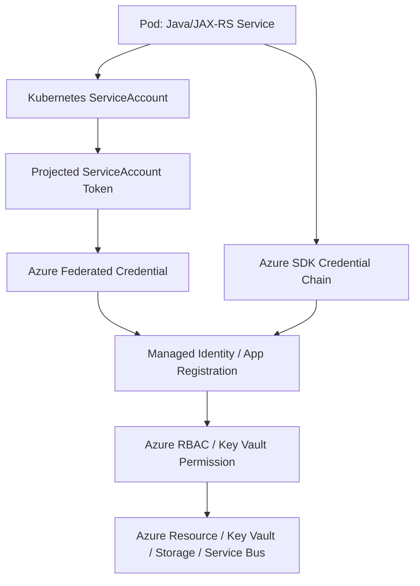
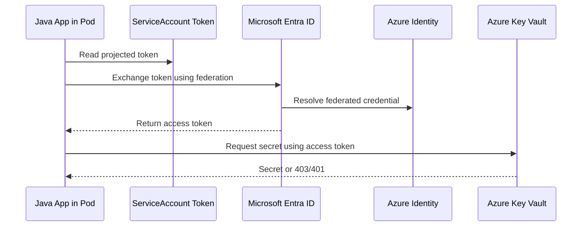
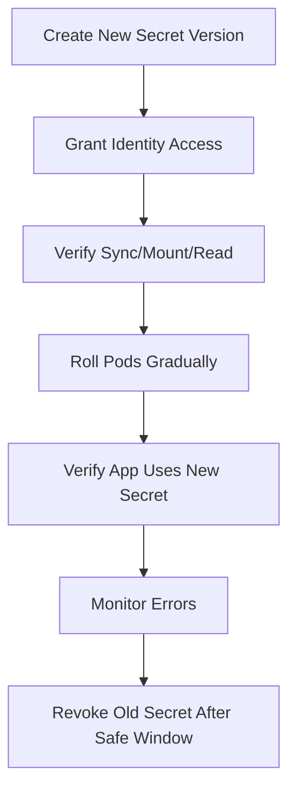
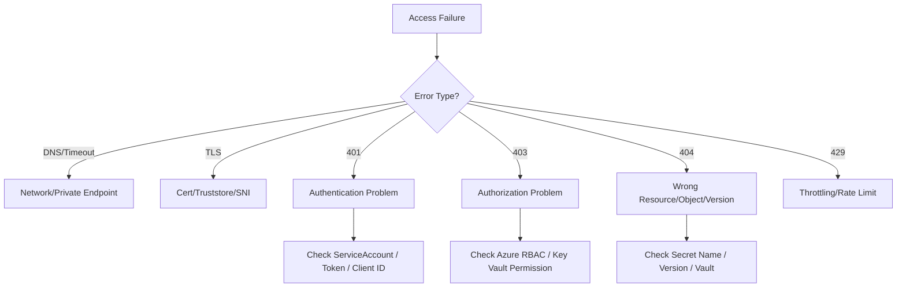

# Part 084 — AKS Identity and Secret Operations

## 1. Tujuan Part Ini

Part ini membahas **AKS identity dan secret operations** dari sudut pandang senior backend engineer.

Fokusnya adalah memahami bagaimana workload Java/JAX-RS di pod memperoleh akses ke Azure services dan secret, serta bagaimana men-debug failure seperti:

- pod gagal membaca Azure Key Vault
- aplikasi mendapat `401`, `403`, atau `AccessDenied`
- credential chain Azure SDK memilih identity yang salah
- federated credential tidak cocok dengan ServiceAccount
- token expiry atau token audience salah
- secret mount gagal
- secret stale setelah rotation
- Key Vault permission berubah tetapi pod masih gagal
- environment variable secret tidak update sampai pod restart
- Kubernetes RBAC dianggap masalah, padahal root cause adalah Azure RBAC

Prinsip utama: **identity failure harus dipisahkan antara Kubernetes identity, Azure identity, secret provider, dan application credential chain**.

---

## 2. Identity Mental Model di AKS

Di Kubernetes, workload berjalan sebagai pod dengan ServiceAccount. Di Azure, workload perlu identitas untuk mengakses resource seperti Key Vault, Storage, Event Hubs, Service Bus, PostgreSQL, Redis, atau API internal.

Mental model:



Debugging identity harus menjawab:

1. Pod memakai ServiceAccount apa?
2. ServiceAccount itu terhubung ke Azure identity yang mana?
3. Federated credential cocok dengan namespace, ServiceAccount, issuer, dan subject?
4. Azure identity punya permission ke resource?
5. Aplikasi menggunakan credential chain yang benar?
6. Token tersedia, valid, dan belum expired?
7. Secret provider/operator berhasil sync atau mount?

---

## 3. Kubernetes RBAC vs Azure RBAC

Ini perbedaan yang sangat penting.

| Area | Mengatur akses ke | Contoh failure |
|---|---|---|
| Kubernetes RBAC | Kubernetes API objects | pod tidak bisa list secret/configmap, controller tidak bisa update resource |
| Azure RBAC | Azure resources | pod tidak bisa read Key Vault, Storage, Service Bus, Event Hub |
| Key Vault access model | secret/key/certificate dalam Key Vault | secret get/list denied |
| Network controls | path ke Azure resource | DNS resolve OK tapi TCP timeout |
| Application credential chain | identity yang dipakai SDK | SDK memakai env credential salah atau tidak menemukan token |

Kesalahan umum: melihat `403` dari Key Vault lalu mengubah Kubernetes RoleBinding. Itu tidak menyelesaikan masalah jika root cause adalah Azure RBAC atau Key Vault permission.

---

## 4. Managed Identity Awareness

Managed Identity adalah identitas yang dikelola Azure. Dalam AKS, workload dapat memakai pola identity yang dihubungkan ke pod melalui mekanisme platform tertentu.

Backend engineer perlu tahu:

- identity apa yang seharusnya dipakai service
- resource apa yang boleh diakses identity tersebut
- apakah permission berbasis Azure RBAC atau access policy/permission model lain
- apakah identity per service, per namespace, per environment, atau shared
- apakah identity berbeda antara dev/test/prod

Anti-pattern yang harus diwaspadai:

- satu identity shared untuk terlalu banyak service
- identity production dipakai di non-production
- permission terlalu luas seperti owner/contributor tanpa kebutuhan
- secret credential statis dipakai padahal Workload Identity tersedia
- identity tidak terdokumentasi di service catalog/runbook

---

## 5. Azure Workload Identity Awareness

Azure Workload Identity memungkinkan pod menggunakan federated identity berbasis Kubernetes ServiceAccount.

Conceptual flow:



Fields yang biasanya penting untuk dicocokkan:

- cluster issuer/OIDC issuer
- namespace
- ServiceAccount name
- subject
- audience
- client ID
- tenant ID
- federated credential configuration

Backend engineer tidak harus mengonfigurasi semuanya sendiri, tetapi harus bisa membaca mismatch symptom.

---

## 6. ServiceAccount as Identity Boundary

ServiceAccount adalah boundary penting antara Kubernetes workload dan cloud identity.

Safe checks:

```bash
kubectl -n <namespace> get pod <pod> -o jsonpath='{.spec.serviceAccountName}'
kubectl -n <namespace> get serviceaccount <serviceaccount> -o yaml
kubectl -n <namespace> describe pod <pod>
```

Yang dicari:

- apakah pod memakai ServiceAccount expected?
- apakah ServiceAccount default tidak sengaja dipakai?
- apakah annotation/label identity ada sesuai standard internal?
- apakah token automount/projection sesuai kebutuhan?
- apakah Helm/Kustomize overlay environment mengubah ServiceAccount?

Failure mode:

| Symptom | Kemungkinan akar masalah |
|---|---|
| SDK tidak menemukan credential | ServiceAccount/token projection/SDK env salah |
| Key Vault 403 | Azure identity tidak punya permission |
| Token exchange gagal | federated credential mismatch |
| Works in dev, fails in prod | ServiceAccount/identity/env overlay berbeda |
| Pod lama masih bisa, pod baru gagal | identity/permission berubah atau rollout partial |

---

## 7. Azure SDK Credential Chain

Aplikasi Java sering memakai Azure SDK credential chain. Dalam container, credential chain dapat mencoba beberapa sumber credential.

Operational concern:

- environment variable credential bisa override workload identity
- credential chain bisa memilih identity berbeda dari ekspektasi
- tenant/client ID salah bisa menghasilkan auth failure
- local developer credential tidak sama dengan runtime pod credential
- fallback credential bisa menyembunyikan konfigurasi buruk

Untuk backend engineer, hal penting bukan menghafal semua detail SDK, tetapi memastikan aplikasi memiliki logging/diagnostic yang cukup untuk menjawab:

- credential type apa yang dipakai?
- tenant/client ID mana yang digunakan?
- target resource/scope apa yang diminta?
- error terjadi saat token acquisition atau saat resource access?
- apakah error 401, 403, timeout, DNS, atau TLS?

Jangan log access token, refresh token, client secret, atau full secret value.

---

## 8. Key Vault Access Patterns

Ada beberapa pola konsumsi secret dari Key Vault ke AKS workload.

### 8.1 Application reads Key Vault directly

Aplikasi memakai Azure SDK untuk mengambil secret saat startup atau runtime.

Kelebihan:

- secret tidak perlu disalin ke Kubernetes Secret
- rotation bisa lebih langsung jika aplikasi mendukung reload
- access dapat diaudit di Azure layer

Risiko:

- startup bergantung pada Key Vault availability/network/identity
- rate limit/throttling bisa memengaruhi banyak pod saat rollout
- aplikasi perlu retry/backoff yang benar
- credential chain harus benar

### 8.2 Secret mounted via CSI driver

Secrets Store CSI Driver dapat mount secret dari Key Vault ke pod sebagai file.

Kelebihan:

- aplikasi membaca file, tidak harus memanggil SDK langsung
- integrasi cloud secret terpusat
- bisa mendukung certificate/key material pattern

Risiko:

- mount failure membuat pod gagal start
- rotation behavior harus dipahami
- file reload belum tentu otomatis dibaca aplikasi
- permission issue muncul sebagai FailedMount atau CSI error

### 8.3 Secret synced into Kubernetes Secret

Beberapa setup melakukan sync dari Key Vault/external secret ke Kubernetes Secret.

Kelebihan:

- aplikasi memakai env var atau secret volume standar Kubernetes
- integrasi dengan manifest lebih familiar

Risiko:

- secret tersalin ke Kubernetes API/etcd
- stale secret jika sync/rotation gagal
- env var tidak berubah sampai pod restart
- RBAC Kubernetes harus dijaga ketat

---

## 9. Key Vault CSI Driver Awareness

Jika Key Vault CSI Driver digunakan, failure bisa muncul sebagai pod startup/mount issue.

Safe investigation:

```bash
kubectl -n <namespace> describe pod <pod>
kubectl -n <namespace> get events --sort-by=.lastTimestamp
kubectl -n <namespace> get secretproviderclass
kubectl -n <namespace> describe secretproviderclass <name>
```

Yang dicari:

- FailedMount
- provider error
- Key Vault permission denied
- object name/version mismatch
- identity/client ID mismatch
- tenant mismatch
- private endpoint/DNS/network timeout
- secret rotation/sync status

Jangan menampilkan isi secret di terminal/chat/ticket.

---

## 10. Secret Rotation Operations

Secret rotation bukan hanya mengganti nilai secret.

Pertanyaan operasional:

- siapa owner secret?
- bagaimana aplikasi menerima secret baru?
- apakah secret dipakai sebagai env var?
- apakah secret dipakai sebagai mounted file?
- apakah aplikasi bisa reload tanpa restart?
- apakah connection pool perlu reconnect?
- apakah old and new credential overlap selama rollout?
- apakah rollback masih bisa memakai credential lama?
- apakah rotation terjadwal atau emergency?

Rotation flow yang aman:



Untuk Java/JAX-RS service, perhatikan:

- DB pool reconnect
- HTTP client credential cache
- Kafka/RabbitMQ connection recreation
- Redis client reconnect
- TLS truststore/keystore reload
- Camunda worker client token/cache

---

## 11. Secret Staleness Failure Modes

Secret stale bisa terjadi ketika:

- Key Vault version berubah tetapi mount/sync belum update
- Kubernetes Secret update tetapi pod memakai env var lama
- application caches secret at startup
- connection pool mempertahankan connection lama
- old credential dicabut sebelum pod rollout selesai
- GitOps/ExternalSecret drift
- namespace memakai secret name yang sama tetapi isi berbeda

Symptoms:

- sebagian pod berhasil, sebagian gagal
- error hanya muncul setelah pod restart
- rollout baru gagal connect ke DB/broker
- credential valid di Key Vault tetapi app masih memakai yang lama
- rollback tidak menyelesaikan karena secret sudah berubah

Safe investigation:

```bash
kubectl -n <namespace> get pod <pod> -o jsonpath='{.metadata.creationTimestamp}'
kubectl -n <namespace> describe pod <pod>
kubectl -n <namespace> get events --sort-by=.lastTimestamp
```

Jika policy mengizinkan, cek metadata secret tanpa menampilkan value:

```bash
kubectl -n <namespace> get secret <secret> -o jsonpath='{.metadata.resourceVersion}'
kubectl -n <namespace> get secret <secret> -o jsonpath='{.metadata.creationTimestamp}'
```

---

## 12. Access Denied Debugging Methodology

Saat aplikasi gagal mengakses Azure resource, jangan langsung mengubah permission. Klasifikasikan dulu.



Evidence to collect:

- pod name/namespace
- ServiceAccount name
- intended Azure identity/client ID
- target resource name
- operation attempted: get/list/read/write
- exact error code
- timestamp
- whether all pods fail or only new pods
- whether all environments fail or only one
- recent identity/permission/secret/network changes

---

## 13. Common Error Patterns

| Symptom | Likely layer | What to check |
|---|---|---|
| `401 Unauthorized` | authentication | token acquisition, tenant, client ID, federated credential |
| `403 Forbidden` | authorization | Azure RBAC, Key Vault permission, scope |
| `404 Secret not found` | object/version | vault name, secret name, version, environment config |
| `UnknownHostException` | DNS | private DNS zone, CoreDNS, dependency hostname |
| connect timeout | network | private endpoint, NSG, UDR, firewall, proxy |
| FailedMount | CSI/provider | SecretProviderClass, identity, Key Vault permission, network |
| works after pod restart | stale env/cache | env var, mounted file reload, application cache |
| works in dev not prod | environment drift | ServiceAccount, identity, vault, DNS, RBAC differences |

---

## 14. Production-Safe Commands

Read-only Kubernetes state:

```bash
kubectl -n <namespace> get deploy <deployment> -o yaml
kubectl -n <namespace> get pod <pod> -o yaml
kubectl -n <namespace> get serviceaccount <serviceaccount> -o yaml
kubectl -n <namespace> describe pod <pod>
kubectl -n <namespace> get events --sort-by=.lastTimestamp
kubectl -n <namespace> logs <pod> --since=30m
```

For CSI-based secrets:

```bash
kubectl -n <namespace> get secretproviderclass
kubectl -n <namespace> describe secretproviderclass <name>
```

For Kubernetes RBAC checks:

```bash
kubectl auth can-i get secrets --as=system:serviceaccount:<namespace>:<serviceaccount> -n <namespace>
kubectl auth can-i list configmaps --as=system:serviceaccount:<namespace>:<serviceaccount> -n <namespace>
```

Avoid:

- `kubectl get secret -o yaml` in shared terminal/chat
- printing secret values
- pasting tokens into tickets
- creating emergency broad permissions without expiry/review
- changing identity binding manually if GitOps owns it
- restarting all pods before understanding stale-secret behavior

---

## 15. Java/JAX-RS Operational Concerns

For Java services, identity/secret failure often appears during startup:

- app fails before readiness
- CrashLoopBackOff due to missing secret
- readiness false because dependency auth fails
- thread pool blocked waiting for secret/dependency
- DB pool cannot initialize
- Kafka/RabbitMQ client cannot authenticate
- TLS truststore cannot load

Design recommendations:

- fail fast only for truly mandatory config
- avoid readiness check that requires every optional downstream dependency
- distinguish config load failure from dependency auth failure
- log credential source metadata without exposing secret
- expose health detail internally but sanitize external health endpoint
- use bounded retry with backoff
- add deployment marker to correlate with secret/identity changes

---

## 16. Dependency-Specific Impacts

### PostgreSQL

Identity/secret issues can affect:

- username/password auth
- TLS certificate/truststore
- managed identity auth if used
- connection pool initialization
- migration job credentials

### Kafka / RabbitMQ

Issues can affect:

- SASL/TLS credentials
- certificate rotation
- consumer startup
- producer authentication
- DLQ/retry publishing

### Redis

Issues can affect:

- password/key rotation
- TLS connection
- connection pool recreation
- cache warmup failure

### Camunda

Issues can affect:

- worker client auth
- API token retrieval
- job completion/failure calls
- incident spike due to auth failure

### Azure Services

Issues can affect:

- Key Vault
- Storage
- Service Bus
- Event Hubs
- App Configuration
- internal API protected by Entra ID

---

## 17. Rollout and Rotation Safety

Identity/secret changes should be treated like production changes.

Before rollout:

- confirm target identity
- confirm permission scope
- confirm network path to resource
- confirm secret version/object name
- confirm application reload/restart behavior
- confirm rollback compatibility
- confirm dashboards and alerts

During rollout:

- watch pod startup/readiness
- watch app auth errors
- watch dependency connection errors
- compare old vs new pod behavior
- avoid scaling too aggressively if Key Vault/secret provider is rate-limited

After rollout:

- verify all replicas use expected config/identity
- verify no stale credential errors
- verify dependency metrics stable
- document evidence

---

## 18. Incident Runbook: Pod Cannot Read Key Vault Secret

### Step 1 — Identify failure type

From logs/events, classify:

- DNS failure
- connect timeout
- TLS failure
- 401 authentication failure
- 403 authorization failure
- 404 secret/object not found
- FailedMount/CSI failure

### Step 2 — Check pod and ServiceAccount

```bash
kubectl -n <namespace> get pod <pod> -o jsonpath='{.spec.serviceAccountName}'
kubectl -n <namespace> get serviceaccount <serviceaccount> -o yaml
kubectl -n <namespace> describe pod <pod>
```

### Step 3 — Check recent changes

- deployment change
- Helm/Kustomize overlay change
- ServiceAccount change
- identity/federated credential change
- Key Vault permission change
- secret version rotation
- private endpoint/DNS/network change

### Step 4 — Check CSI or external secret if used

```bash
kubectl -n <namespace> get secretproviderclass
kubectl -n <namespace> describe secretproviderclass <name>
kubectl -n <namespace> get events --sort-by=.lastTimestamp
```

### Step 5 — Decide mitigation

Possible mitigations:

- rollback application/config if bad release changed identity/secret reference
- restore previous secret version if rotation broke compatibility
- rollout restart if pods use stale env var and restart is approved
- pause rollout if only new pods fail
- escalate to platform/security for Azure RBAC/federated credential issue
- escalate to network/platform for private endpoint/DNS timeout

Do not paste secret values into incident channels.

---

## 19. PR Review Checklist

Review any PR that changes:

- ServiceAccount name
- ServiceAccount annotations/labels
- SecretProviderClass
- ExternalSecret or secret sync config
- Key Vault name
- secret object name/version
- Azure client ID/tenant ID config
- mounted secret path
- env var secret reference
- DB/broker/Redis credential reference
- TLS truststore/keystore mount
- Helm values for identity/secret
- Kustomize overlays for environment-specific secret names

Questions:

- Is the identity least privilege?
- Is permission scoped to exact resource needed?
- Does dev/test/prod use correct identity and vault?
- Will old pods and new pods both work during rollout?
- Does rotation require pod restart?
- Does rollback remain possible after secret rotation?
- Are secret values hidden from logs and manifests?
- Is there an alert for auth failure spike?
- Is there a runbook for secret/identity failure?

---

## 20. Internal Verification Checklist

Verifikasi di internal CSG/team, jangan diasumsikan:

- Apakah AKS workload menggunakan Managed Identity, Azure Workload Identity, secret sync, CSI Driver, atau static Kubernetes Secret?
- Apakah Azure Workload Identity sudah menjadi standard?
- Bagaimana mapping ServiceAccount ke Azure identity?
- Apakah identity per service, namespace, environment, atau shared?
- Siapa owner managed identity/federated credential?
- Bagaimana federated credential dibuat dan direview?
- Apakah ServiceAccount annotation/label punya standard internal?
- Apakah Key Vault memakai Azure RBAC atau access policy model?
- Siapa owner Key Vault permission?
- Apakah Key Vault memakai private endpoint?
- Private DNS Zone apa yang dibutuhkan untuk Key Vault?
- Apakah Key Vault CSI Driver digunakan?
- Apakah External Secrets Operator digunakan?
- Apakah secret disinkronkan ke Kubernetes Secret?
- Bagaimana secret rotation dilakukan?
- Apakah aplikasi reload secret otomatis atau perlu restart?
- Bagaimana rollback jika secret lama sudah dicabut?
- Apakah audit log Key Vault/Entra ID tersedia untuk incident?
- Apakah log aplikasi menunjukkan credential source secara aman?
- Apakah ada dashboard/alert untuk auth failure, secret sync failure, dan mount failure?
- Bagaimana escalation path ke platform/security/network?

---

## 21. Escalation Boundary

Escalate ke platform/security jika:

- federated credential mismatch
- managed identity/client ID salah
- Azure RBAC/Key Vault permission denied
- tenant/subscription/resource scope tidak jelas
- Key Vault CSI Driver/provider error
- ExternalSecret sync failure
- private endpoint/DNS/network path ke Key Vault gagal
- audit log dibutuhkan

Backend engineer tetap owns:

- app config reference
- correct secret name expected by app
- safe logging
- retry/backoff behavior
- readiness behavior
- rollout/rollback coordination
- verifying app uses credential correctly
- documenting dependency credential requirement

---

## 22. Key Takeaways

- AKS identity failure harus dipisahkan antara Kubernetes ServiceAccount, Azure Workload Identity/Managed Identity, Azure RBAC, Key Vault permission, network path, dan application credential chain.
- `403` dari Azure resource biasanya bukan Kubernetes RBAC issue.
- Secret rotation adalah deployment-risk event, bukan sekadar admin task.
- Env var secret tidak berubah sampai pod restart; mounted file secret pun belum tentu otomatis dibaca aplikasi.
- Jangan pernah men-debug dengan menampilkan secret value.
- Backend engineer harus mengumpulkan evidence tajam: ServiceAccount, intended identity, target resource, exact error code, timestamp, affected pods, dan recent changes.
- Internal identity/secret topology wajib diverifikasi karena AKS enterprise setup bisa sangat berbeda antar environment.
