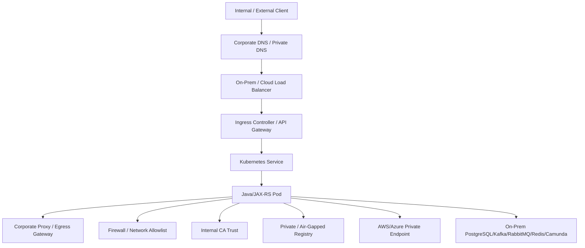
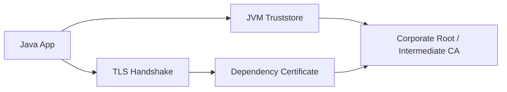
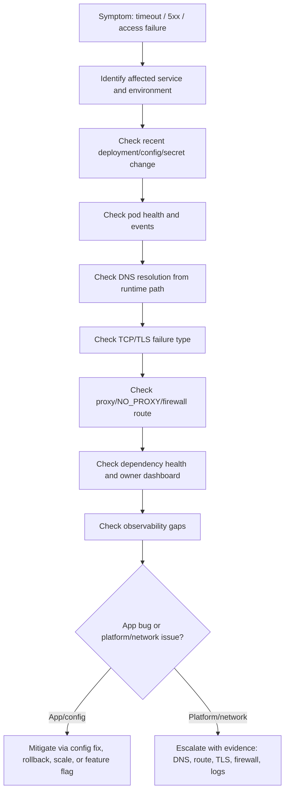

# Part 085 — On-Prem and Hybrid Kubernetes Operations

## 1. Tujuan Part Ini

Part ini membahas **operasi Kubernetes on-prem dan hybrid** dari sudut pandang senior backend engineer.

Fokusnya bukan membangun cluster on-prem dari nol, tetapi memahami bagaimana workload Java/JAX-RS di Kubernetes beroperasi saat runtime berada di lingkungan enterprise yang memiliki:

- private network
- corporate DNS
- internal certificate authority
- outbound proxy
- firewall allowlist
- air-gapped atau semi-air-gapped registry
- on-prem load balancer
- hybrid connectivity ke cloud
- private endpoint ke AWS/Azure services
- routing antar data center, VPC, VNet, dan corporate network
- security boundary yang lebih ketat dibanding managed cloud default

Prinsip utama: **di environment on-prem/hybrid, banyak incident aplikasi terlihat seperti bug backend, padahal root cause-nya ada di DNS, certificate trust, firewall, proxy, registry, routing, atau private connectivity**.

---

## 2. Mental Model On-Prem/Hybrid Kubernetes

Dalam managed cloud Kubernetes, banyak komponen platform sudah terintegrasi dengan cloud provider. Dalam on-prem/hybrid, banyak hal perlu dipahami sebagai explicit enterprise integration point.



Debugging hybrid environment harus menjawab:

1. Request masuk dari mana?
2. DNS mana yang menjawab?
3. Load balancer mana yang menerima traffic?
4. Ingress/controller mana yang melakukan routing?
5. Pod keluar melalui route, firewall, NAT, proxy, atau egress gateway apa?
6. Certificate chain mana yang dipercaya aplikasi?
7. Registry mana yang dipakai node untuk pull image?
8. Dependency berada di cluster, on-prem network, cloud private endpoint, atau public endpoint?
9. Siapa owner setiap boundary: backend, platform, network, security, cloud, atau infrastructure team?

---

## 3. Apa yang Berbeda dari Managed Cloud Kubernetes

Perbedaan utama bukan pada object Kubernetes. `Deployment`, `Service`, `ConfigMap`, `Secret`, `Ingress`, dan `NetworkPolicy` tetap sama. Yang berbeda adalah **environmental assumptions**.

| Area | Managed cloud default | On-prem/hybrid concern |
|---|---|---|
| Load balancer | Cloud LB otomatis | Integrasi dengan F5/HAProxy/MetalLB/Appliance internal |
| DNS | Cloud DNS/private zone | Corporate DNS, split-horizon DNS, internal search domain |
| Certificate | Public/private CA cloud-friendly | Internal CA, Java truststore, corporate root CA |
| Registry | ECR/ACR/GCR reachable | Private registry, mirror, proxy, air-gap |
| Egress | NAT gateway/cloud egress | Proxy, firewall, egress gateway, allowlist |
| Identity | Cloud IAM native | Hybrid identity, service account mapping, external secret integration |
| Observability | Cloud metrics/logs integrated | Self-managed/log-forwarded stack, retention constraints |
| Storage | Managed CSI integration | SAN/NAS/CSI plugin, reclaim policy, mount issue |
| Upgrade | Managed control plane option | Platform-owned lifecycle and compatibility window |

Operationally, backend engineer harus lebih skeptis terhadap asumsi seperti:

- semua DNS name bisa di-resolve dari pod
- semua outbound HTTP client boleh langsung keluar
- semua CA trusted oleh JVM
- image registry selalu reachable dari node
- private endpoint cloud bisa dicapai tanpa custom DNS/routing
- dependency timeout berarti dependency lambat, bukan firewall drop

---

## 4. Backend Engineer Responsibility

Backend engineer biasanya tidak memiliki network appliance, corporate DNS, cluster CNI, atau firewall. Namun backend engineer tetap bertanggung jawab untuk membuat aplikasi mudah dioperasikan di environment tersebut.

Tanggung jawab backend service owner:

- mengetahui dependency endpoint yang dipakai aplikasi
- mendokumentasikan inbound dan outbound traffic requirement
- menyediakan health endpoint yang tidak bergantung pada dependency eksternal berat
- memastikan timeout/retry tidak memperparah firewall/proxy/DNS issue
- memastikan JVM truststore dapat memercayai internal CA jika diperlukan
- memastikan aplikasi mendukung proxy/NO_PROXY jika environment memerlukannya
- memastikan error log membedakan DNS, TCP timeout, TLS, 401/403, dan HTTP 5xx
- tidak menyimpan credential statis secara sembarangan
- tidak melakukan bypass security control melalui hardcoded endpoint atau certificate trust-all
- menyediakan runbook yang mencakup environment-specific checks

Tanggung jawab platform/SRE/network/security:

- cluster networking
- ingress/load balancer integration
- corporate DNS/private DNS integration
- firewall/NAT/proxy path
- internal CA distribution
- registry mirror/air-gap flow
- node image pull access
- observability forwarding
- storage/CSI integration
- network policy baseline
- security exception process

---

## 5. Private Network Operations

On-prem/hybrid Kubernetes sering berjalan di private network. Artinya tidak semua endpoint bisa diakses langsung, dan routing sering melewati firewall, proxy, NAT, VPN, Direct Connect, ExpressRoute, atau private peering.

Yang perlu dipahami:

- pod CIDR
- service CIDR
- node subnet
- ingress/load balancer subnet
- route ke dependency on-prem
- route ke cloud private endpoint
- route ke registry
- route ke observability backend
- route ke identity provider
- route ke external SaaS jika ada

Failure mode umum:

| Symptom | Kemungkinan akar masalah |
|---|---|
| Connection timeout | firewall drop, missing route, proxy required, private endpoint unreachable |
| Connection refused | endpoint reachable tapi service tidak listen atau wrong port |
| DNS resolve private IP tapi timeout | route/firewall/private endpoint issue |
| Works from laptop, fails from pod | network path pod berbeda dari user network |
| Works from one namespace, fails from another | NetworkPolicy, egress gateway, namespace routing, security group mapping |
| Works in cloud, fails on-prem | corporate DNS/proxy/internal CA/routing difference |

Safe investigation commands:

```bash
kubectl -n <namespace> get pod -l app=<app>
kubectl -n <namespace> describe pod <pod>
kubectl -n <namespace> logs <pod> --since=30m
kubectl -n <namespace> exec <pod> -- printenv | grep -E 'HTTP_PROXY|HTTPS_PROXY|NO_PROXY|JAVA|TRUST|SSL' || true
```

Gunakan `exec` hanya jika policy internal mengizinkan. Jangan menjalankan command yang mengubah state produksi tanpa approval.

---

## 6. Corporate DNS Operations

DNS di on-prem/hybrid sering menggunakan split-horizon DNS: nama domain yang sama bisa menghasilkan jawaban berbeda tergantung lokasi query.

Contoh concern:

- service internal hanya resolve di corporate DNS
- cloud private endpoint memerlukan private DNS zone
- pod memakai CoreDNS yang forward ke corporate DNS
- corporate DNS punya conditional forwarder ke cloud DNS
- search domain membuat resolusi nama menjadi lambat
- `ndots` menyebabkan query internal berulang sebelum external lookup
- DNS cache membuat perubahan endpoint tidak langsung terlihat

Debugging questions:

1. Nama yang dicari aplikasi apa?
2. Dari dalam pod, nama itu resolve ke IP apa?
3. IP tersebut private/public?
4. Apakah IP berubah antar environment?
5. Apakah CoreDNS forward ke resolver yang benar?
6. Apakah private DNS zone sudah linked ke VNet/VPC/network yang benar?
7. Apakah ada DNS cache di JVM, library, sidecar, node, atau CoreDNS?

Safe investigation:

```bash
kubectl -n kube-system get pods -l k8s-app=kube-dns
kubectl -n <namespace> exec <pod> -- nslookup <dependency-host>
kubectl -n <namespace> exec <pod> -- cat /etc/resolv.conf
```

Jika `nslookup` tidak tersedia dalam image production, gunakan debug pod sesuai policy internal, bukan memasang tool ke image aplikasi secara sembarangan.

---

## 7. Internal CA and Java Truststore Operations

Enterprise environment sering memakai internal CA untuk TLS internal. Java application perlu trust chain yang benar.

Common failure:

- `PKIX path building failed`
- `unable to find valid certification path`
- `certificate_unknown`
- `handshake_failure`
- certificate expired
- SNI mismatch
- hostname verification failure
- internal CA belum masuk JVM truststore
- container base image tidak punya corporate root CA

Mental model:



Operational rule:

- jangan men-disable certificate verification
- jangan memakai trust-all SSL context di production
- jangan hardcode certificate bypass untuk mengejar quick fix
- gunakan truststore/base image/secret mount yang disetujui platform/security
- pastikan rotation CA/certificate punya runbook

Internal verification:

- CA source
- truststore injection method
- truststore password handling
- certificate expiry alert
- mTLS requirement
- service mesh certificate behavior jika ada
- owner certificate rotation

---

## 8. Proxy and NO_PROXY Operations

Banyak on-prem/hybrid cluster mewajibkan outbound HTTP/HTTPS melalui proxy.

Important variables:

```text
HTTP_PROXY
HTTPS_PROXY
NO_PROXY
http_proxy
https_proxy
no_proxy
```

Operational concern untuk Java/JAX-RS service:

- Java HTTP client belum tentu otomatis memakai env proxy
- library berbeda bisa punya konfigurasi proxy berbeda
- internal service call seharusnya bypass proxy
- cloud metadata endpoint harus masuk `NO_PROXY` jika dipakai
- Kubernetes service domain harus masuk `NO_PROXY`
- private endpoint bisa salah lewat proxy dan gagal
- proxy bisa melakukan TLS inspection sehingga butuh internal CA

NO_PROXY harus direview serius. Contoh kategori yang sering perlu masuk:

- `.svc`
- `.svc.cluster.local`
- cluster service CIDR
- pod CIDR jika relevan
- metadata endpoint jika digunakan
- private endpoint domain
- internal corporate domain
- database/broker internal host

Failure mode:

| Symptom | Kemungkinan akar masalah |
|---|---|
| External API timeout | proxy wajib tapi tidak dikonfigurasi |
| Internal service call lambat/gagal | internal traffic salah lewat proxy |
| TLS error ke external API | proxy TLS inspection + CA belum trusted |
| Cloud SDK gagal | metadata/private endpoint salah lewat proxy |
| Works in dev, fails in prod | proxy policy berbeda antar environment |

---

## 9. Firewall and Allowlist Operations

Firewall di enterprise environment sering menjadi root cause tersembunyi.

Yang harus didokumentasikan per service:

- source namespace/workload
- source node subnet/pod CIDR
- destination hostname/IP/CIDR
- destination port
- protocol
- direction
- environment
- business justification
- owner
- expiry/review date jika ada

Masalah umum:

- firewall allowlist berbasis node IP, tetapi pod source IP berbeda
- NAT mengubah source IP
- destination IP berubah karena DNS/private endpoint update
- firewall mengizinkan TCP connect tapi memutus idle connection
- stateful firewall drop long-lived connection Kafka/RabbitMQ
- egress rule ada untuk dev, tidak ada untuk prod
- port database/broker berbeda antar environment

Backend engineer perlu menyediakan requirement jelas, bukan hanya berkata “service butuh akses internet”.

Contoh requirement yang baik:

```text
Service quote-pricing-api in namespace qno-prod needs outbound TCP 5432 to PostgreSQL endpoint <host> for request-time pricing lookup.
Expected connection pool: 20 per pod, max replicas: 8, rollout max surge: 2.
Traffic must not go through generic internet proxy.
```

---

## 10. Air-Gapped and Private Registry Operations

Dalam on-prem/hybrid, image pull bisa bergantung pada private registry, registry mirror, artifact promotion, atau air-gap import process.

Failure mode:

- `ImagePullBackOff`
- `ErrImagePull`
- registry DNS not resolvable
- registry TLS cert not trusted by node runtime
- missing image tag in air-gap registry
- image promoted to cloud registry but not mirrored on-prem
- ImagePullSecret invalid
- node cannot reach registry because firewall/proxy
- vulnerability scan gate prevents promotion

Operational distinction:

| Layer | Yang gagal |
|---|---|
| CI/CD | image belum dibangun/push |
| Promotion | image belum dipromosikan ke registry target |
| Registry | image/tag/digest tidak ada atau registry down |
| Node runtime | node tidak bisa pull image |
| Kubernetes auth | ImagePullSecret/service account salah |
| Network/TLS | DNS/firewall/proxy/internal CA registry bermasalah |

Safe checks:

```bash
kubectl -n <namespace> describe pod <pod>
kubectl -n <namespace> get serviceaccount <sa> -o yaml
kubectl -n <namespace> get secret | grep -i pull
```

Jangan mencetak isi secret registry credential ke terminal.

---

## 11. On-Prem Load Balancer Operations

On-prem load balancer bisa berupa appliance seperti F5, HAProxy, NGINX, MetalLB, atau platform internal lain.

Yang perlu dicek saat inbound traffic failure:

- VIP/hostname
- DNS record
- TLS termination point
- listener port
- backend pool
- health check path
- ingress controller target
- source IP preservation
- header forwarding
- timeout
- body size
- connection idle timeout
- failover behavior

Failure mode:

| Symptom | Kemungkinan akar masalah |
|---|---|
| DNS OK, connection timeout | LB/firewall/listener issue |
| LB 503 | backend pool unhealthy |
| Ingress tidak menerima traffic | LB target salah atau health check gagal |
| Client IP hilang | source IP/header forwarding config |
| Large request gagal | LB body size/buffer limit |
| Long request putus | idle timeout mismatch |

Backend engineer perlu tahu **dimana TLS terminate** dan **header apa yang dipercaya aplikasi** seperti `X-Forwarded-For`, `X-Forwarded-Proto`, `X-Request-ID`, dan correlation ID.

---

## 12. Hybrid Connectivity to Cloud Services

Hybrid workload bisa berjalan on-prem tetapi mengakses AWS/Azure services melalui private connectivity.

Contoh:

- pod on-prem mengakses Azure Key Vault via Private Endpoint
- pod on-prem mengakses AWS Secrets Manager via VPC endpoint path
- pod on-prem mengakses managed PostgreSQL/Kafka/Redis di cloud
- cloud-hosted API memanggil service on-prem
- event flow melewati VPN/Direct Connect/ExpressRoute

Risk area:

- DNS private endpoint tidak resolve ke private IP
- routing ke private endpoint tidak ada
- firewall tidak mengizinkan source/destination
- TLS certificate chain berbeda
- identity federation bekerja, tetapi network path gagal
- cloud service policy hanya mengizinkan VNet/VPC tertentu
- latency lebih tinggi dari asumsi aplikasi
- retry storm saat link hybrid unstable

Debugging harus memisahkan:

1. DNS resolution
2. TCP connectivity
3. TLS handshake
4. identity/authentication
5. authorization
6. application-level response
7. latency/retry behavior

---

## 13. PostgreSQL/Kafka/RabbitMQ/Redis/Camunda in Hybrid Environments

Dependency backend punya karakter network berbeda.

### PostgreSQL

Concern:

- connection pool per pod
- firewall idle timeout
- DNS failover behavior
- TLS truststore
- max connection exhaustion
- latency impact terhadap transaction time

### Kafka

Concern:

- advertised listeners harus reachable dari pod
- broker DNS berbeda internal/external
- long-lived TCP connection
- rebalance saat network flap
- firewall idle timeout
- cross-region latency

### RabbitMQ

Concern:

- connection/channel stability
- heartbeat interval vs firewall idle timeout
- queue backlog saat link hybrid down
- redelivery storm setelah reconnect

### Redis

Concern:

- low-latency assumption bisa rusak di hybrid path
- TLS/auth/ACL
- connection pool spike
- sentinel/cluster endpoint resolution

### Camunda

Concern:

- worker activation latency
- job timeout mismatch
- incident spike saat dependency unreachable
- process correlation dan retry semantics

---

## 14. Observability in On-Prem/Hybrid Operations

Observability sering lebih sulit di hybrid environment karena logs/metrics/traces harus dikirim melalui network boundary.

Yang perlu dicek:

- log forwarder path
- metrics scraper access
- trace collector endpoint
- proxy requirement untuk telemetry exporter
- certificate trust ke observability backend
- retention difference antar environment
- deployment marker availability
- clock sync/NTP
- source labels/environment labels
- dashboard memisahkan cloud vs on-prem cluster

Failure mode:

- aplikasi sehat tetapi telemetry hilang
- alert tidak firing karena metric ingestion gagal
- trace putus di boundary proxy/gateway
- log delay membuat incident timeline salah
- environment label salah sehingga query dashboard menyesatkan

Operational rule: **observability pipeline juga dependency produksi**.

---

## 15. Production-Safe Debugging Flow



Evidence yang baik untuk eskalasi:

- affected namespace/workload/pod
- timestamp and timezone
- exact dependency hostname/port
- DNS result from pod if allowed
- error class: DNS/TCP/TLS/HTTP/auth
- recent deployment/config change
- logs with correlation ID
- metrics showing scope/blast radius
- whether another namespace/environment works
- whether rollback was attempted or not applicable

---

## 16. Safe Mitigation Options

Mitigasi yang relatif aman jika berada dalam authority backend team:

- rollback deployment jika failure dimulai setelah release
- revert config through GitOps jika config jelas salah
- reduce traffic through feature flag jika tersedia
- scale down non-critical noisy worker jika memperparah dependency pressure
- pause rollout
- disable scheduled job jika menyebabkan repeated failure dan disetujui
- adjust timeout/retry only melalui reviewed config path

Mitigasi yang harus eskalasi/approval:

- firewall rule change
- DNS record change
- CA/truststore global change
- proxy bypass
- registry mirror change
- load balancer target change
- CNI/network plugin change
- node-level debug
- broad NetworkPolicy exception
- production secret rotation tanpa runbook

---

## 17. Internal Verification Checklist

Gunakan checklist ini sebagai bahan diskusi dengan backend/platform/SRE/network/security team.

### Cluster and environment

- [ ] Cluster ini on-prem, cloud, atau hybrid?
- [ ] Namespace production mana yang dimiliki service team?
- [ ] Apakah pod CIDR/service CIDR terdokumentasi?
- [ ] Apakah ada egress gateway/proxy wajib?
- [ ] Apakah ada default deny NetworkPolicy?
- [ ] Apakah ada service mesh?

### DNS

- [ ] Resolver apa yang dipakai CoreDNS?
- [ ] Apakah ada conditional forwarding ke corporate/cloud DNS?
- [ ] Apakah private endpoint DNS terdokumentasi?
- [ ] Apakah split-horizon DNS berlaku?
- [ ] Apakah DNS issue punya dashboard/runbook?

### Proxy and firewall

- [ ] Apakah `HTTP_PROXY`, `HTTPS_PROXY`, dan `NO_PROXY` required?
- [ ] Apakah NO_PROXY standard tersedia untuk Kubernetes internal domain?
- [ ] Apakah outbound allowlist per service terdokumentasi?
- [ ] Siapa approver firewall change?
- [ ] Apakah idle timeout firewall diketahui untuk DB/broker connection?

### Certificate and trust

- [ ] Apakah internal CA harus masuk image atau truststore?
- [ ] Bagaimana CA rotation dilakukan?
- [ ] Apakah certificate expiry dimonitor?
- [ ] Apakah Java truststore standard tersedia?
- [ ] Apakah mTLS/service mesh certificate dipakai?

### Registry

- [ ] Registry apa yang dipakai on-prem/hybrid?
- [ ] Apakah image promotion/mirroring terdokumentasi?
- [ ] Apakah node bisa reach registry tanpa proxy issue?
- [ ] Apakah registry certificate trusted oleh node runtime?
- [ ] Apakah ImagePullSecret dikelola per namespace atau global?

### Load balancer and ingress

- [ ] Apa load balancer di depan ingress?
- [ ] Di mana TLS termination terjadi?
- [ ] Health check path apa yang digunakan?
- [ ] Timeout/body size/header forwarding bagaimana?
- [ ] Siapa owner LB config?

### Hybrid connectivity

- [ ] Dependency mana yang berada di cloud private endpoint?
- [ ] Dependency mana yang on-prem?
- [ ] Path VPN/Direct Connect/ExpressRoute mana yang dipakai?
- [ ] Apakah latency/packet loss dimonitor?
- [ ] Siapa owner saat hybrid link bermasalah?

### Observability

- [ ] Logs dikirim ke mana?
- [ ] Metrics dikirim ke mana?
- [ ] Traces dikirim ke mana?
- [ ] Apakah telemetry exporter butuh proxy/truststore?
- [ ] Apakah dashboard memisahkan cluster/environment dengan benar?

---

## 18. PR Review Checklist

Saat mereview PR Kubernetes manifest untuk on-prem/hybrid environment, cek:

- [ ] Apakah dependency endpoint berubah?
- [ ] Apakah config proxy/NO_PROXY berubah?
- [ ] Apakah truststore/CA mount berubah?
- [ ] Apakah image registry/tag/digest tersedia di target environment?
- [ ] Apakah ingress host/path/TLS berubah?
- [ ] Apakah outbound dependency baru memerlukan firewall allowlist?
- [ ] Apakah NetworkPolicy perlu di-update?
- [ ] Apakah timeout/retry berubah untuk hybrid dependency?
- [ ] Apakah observability endpoint/exporter berubah?
- [ ] Apakah rollback tetap valid jika perubahan melibatkan DNS/firewall/secret/certificate?

---

## 19. Anti-Patterns

Hindari:

- menganggap on-prem dan cloud punya network behavior sama
- hardcode IP karena DNS bermasalah
- mematikan TLS verification untuk melewati internal CA issue
- menambahkan broad proxy bypass tanpa security review
- membuka firewall terlalu luas karena dependency tidak jelas
- memakai default ServiceAccount/identity untuk semua workload
- tidak mendokumentasikan outbound dependency
- mengabaikan registry mirror/promotion di release plan
- tidak memasukkan hybrid latency ke timeout/retry design
- men-debug hanya dari laptop, bukan dari runtime pod path

---

## 20. Ringkasan

On-prem/hybrid Kubernetes operations membutuhkan mental model yang lebih luas dari object Kubernetes.

Backend engineer harus mampu membaca:

- private network path
- corporate DNS behavior
- internal CA trust
- proxy and NO_PROXY
- firewall allowlist
- registry and image promotion
- on-prem load balancer
- hybrid cloud private endpoint
- dependency-specific network behavior
- observability pipeline across boundaries

Targetnya bukan mengambil alih tugas platform/network/security, tetapi menjadi service owner yang bisa memberi evidence akurat, mereview perubahan berisiko, dan mencegah failure environment-specific menjadi incident produksi besar.
