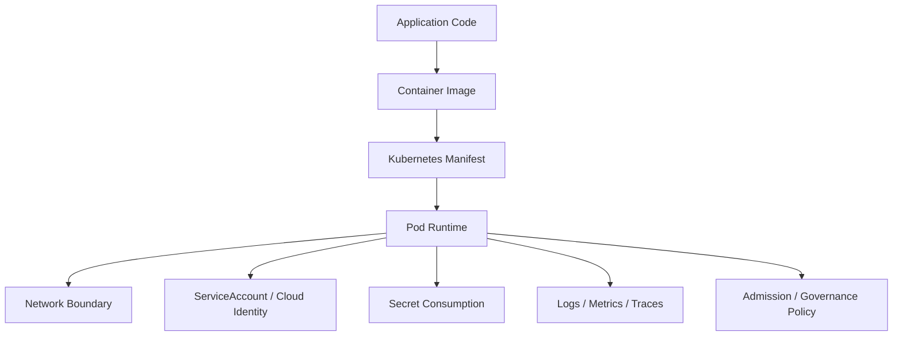
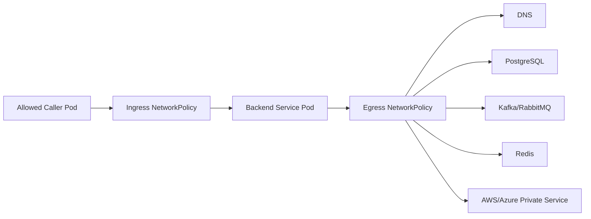
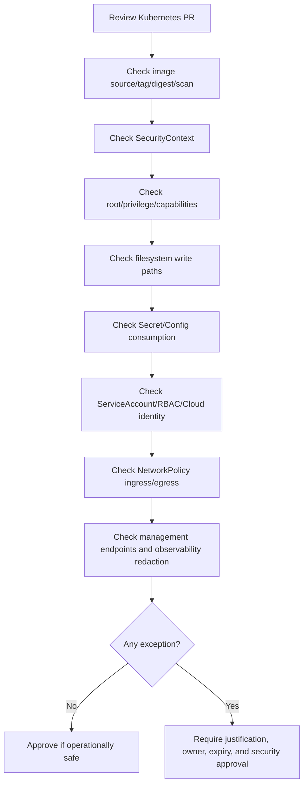

# Part 086 — Security Operations for Kubernetes Workloads

## 1. Tujuan Part Ini

Part ini membahas **security operations untuk Kubernetes workloads** dari sudut pandang senior backend engineer.

Fokusnya bukan menjadi cluster security administrator, tetapi memastikan workload Java/JAX-RS, Kafka consumer, RabbitMQ consumer, Redis-backed service, Camunda worker, batch job, scheduler, dan migration job berjalan dengan security posture yang layak untuk production enterprise.

Topik utama:

- Pod Security
- `SecurityContext`
- non-root user
- read-only root filesystem
- Linux capabilities
- privileged pod risk
- HostPath risk
- image scanning
- network isolation
- secret security
- runtime debugging yang aman
- PR review security untuk manifest Kubernetes

Prinsip utama: **security configuration adalah bagian dari operational reliability**. Workload yang terlalu permissive bukan hanya risiko security, tetapi juga memperbesar blast radius saat bug, compromise, misconfiguration, atau supply chain issue terjadi.

---

## 2. Backend Security Responsibility in Kubernetes

Security workload Kubernetes berada di beberapa layer.



Backend engineer biasanya bertanggung jawab pada:

- aplikasi tidak membutuhkan root jika tidak perlu
- image tidak membawa tool/credential berbahaya secara tidak sengaja
- manifest tidak meminta privilege yang tidak diperlukan
- secret tidak bocor ke log/env/debug output
- endpoint internal tidak terbuka tanpa kontrol
- NetworkPolicy dependency jelas
- ServiceAccount tidak memakai permission berlebihan
- readiness/liveness tidak mengekspos data sensitif
- error handling tidak membocorkan token, password, connection string, atau PII

Platform/security team biasanya bertanggung jawab pada:

- admission policy
- Pod Security Standards baseline/restricted policy
- cluster-level RBAC governance
- image scanning policy
- secret management platform
- network policy standard
- audit logging
- runtime security tooling
- exception approval

---

## 3. SecurityContext Mental Model

`SecurityContext` mengatur bagaimana container/pod berjalan di Linux runtime.

Contoh hardening baseline:

```yaml
apiVersion: apps/v1
kind: Deployment
metadata:
  name: quote-api
spec:
  template:
    spec:
      securityContext:
        runAsNonRoot: true
        seccompProfile:
          type: RuntimeDefault
      containers:
        - name: app
          image: registry.example.com/quote-api:1.2.3
          securityContext:
            allowPrivilegeEscalation: false
            readOnlyRootFilesystem: true
            capabilities:
              drop:
                - ALL
          volumeMounts:
            - name: tmp
              mountPath: /tmp
      volumes:
        - name: tmp
          emptyDir: {}
```

Tidak semua aplikasi langsung compatible dengan baseline ini. Untuk Java service, perhatian khusus biasanya ada pada:

- `/tmp` untuk temporary file
- log path jika aplikasi menulis file log
- heap dump path
- truststore/keystore mount
- generated files
- native libraries
- timezone/cert files
- file upload staging
- batch processing scratch directory

Operational target: harden workload tanpa mematahkan runtime behavior yang valid.

---

## 4. Non-Root User Operations

Running container sebagai root memperbesar blast radius jika aplikasi dieksploitasi.

Yang perlu dicek:

```bash
kubectl -n <namespace> get deploy <deploy> -o yaml | grep -A20 -i securityContext
kubectl -n <namespace> describe pod <pod>
```

Manifest fields yang relevan:

```yaml
securityContext:
  runAsNonRoot: true
  runAsUser: 10001
  runAsGroup: 10001
  fsGroup: 10001
```

Failure mode saat mengaktifkan non-root:

| Symptom | Kemungkinan akar masalah |
|---|---|
| Pod CrashLoopBackOff | aplikasi gagal menulis file karena permission |
| Permission denied ke `/tmp` | temporary directory tidak writable |
| Cannot bind port | aplikasi bind privileged port <1024 |
| Cannot read mounted file | file permission secret/config/cert tidak cocok |
| Batch job gagal | output directory owned by root |

Backend engineer harus memastikan aplikasi tidak bergantung pada root untuk operasi normal.

---

## 5. Read-Only Root Filesystem

`readOnlyRootFilesystem: true` mencegah aplikasi menulis ke filesystem root container.

Keuntungan:

- mengurangi risiko tampering runtime
- membuat write path eksplisit
- memudahkan review temporary storage
- mengurangi persistence attacker dalam container

Risiko compatibility:

- Java menulis temporary file ke `/tmp`
- framework menulis cache lokal
- app server menulis working directory
- heap dump mencoba menulis ke path read-only
- file upload staging gagal
- library native butuh extract file temporary

Pattern yang lebih aman:

```yaml
securityContext:
  readOnlyRootFilesystem: true
volumeMounts:
  - name: tmp
    mountPath: /tmp
  - name: app-cache
    mountPath: /app/cache
volumes:
  - name: tmp
    emptyDir: {}
  - name: app-cache
    emptyDir:
      sizeLimit: 256Mi
```

Operational checklist:

- path writable eksplisit
- `emptyDir.sizeLimit` jika memungkinkan
- no secret written to temp directory
- cleanup behavior jelas
- ephemeral storage request/limit tersedia
- heap dump policy aman

---

## 6. Linux Capabilities

Linux capabilities memecah privilege root menjadi unit lebih kecil. Banyak backend service tidak membutuhkan capability tambahan.

Baseline umum:

```yaml
securityContext:
  capabilities:
    drop:
      - ALL
```

Capability yang sering berisiko:

- `NET_ADMIN`
- `SYS_ADMIN`
- `SYS_PTRACE`
- `DAC_OVERRIDE`
- `CHOWN`
- `SETUID`
- `SETGID`

Backend API biasa hampir tidak pernah butuh `NET_ADMIN` atau `SYS_ADMIN`.

Jika capability diminta dalam PR, reviewer harus bertanya:

1. Operasi apa yang membutuhkan capability itu?
2. Apakah ada alternatif tanpa capability?
3. Apakah hanya init container tertentu yang butuh?
4. Apakah permission bisa dibatasi per container?
5. Apakah security team sudah approve exception?
6. Apakah runtime monitoring menangkap penyalahgunaan?

---

## 7. Privileged Pod Risk

`privileged: true` hampir selalu red flag untuk workload aplikasi.

Dampaknya:

- container mendapat akses luas ke host
- isolation melemah drastis
- exploit aplikasi bisa berdampak ke node
- policy restricted biasanya menolak
- audit/compliance risk tinggi

Backend service seperti JAX-RS API, consumer, worker, batch, dan scheduler normalnya tidak membutuhkan privileged mode.

Jika ada manifest seperti ini:

```yaml
securityContext:
  privileged: true
```

Reviewer harus memperlakukan ini sebagai production blocker kecuali ada justifikasi platform-level yang jelas.

Valid use case biasanya milik platform/system component, bukan application workload:

- CNI plugin
- CSI driver
- node agent
- security/runtime daemon
- observability daemon tertentu

---

## 8. HostPath Risk

`hostPath` memberi pod akses ke filesystem node. Ini sangat berisiko.

Contoh risk:

- membaca file host sensitif
- menulis ke host filesystem
- escape path jika permission buruk
- dependency terhadap struktur node
- workload sulit dipindahkan antar node
- audit/compliance concern

Application workload sebaiknya memakai:

- `emptyDir` untuk temporary file
- PVC untuk persistent storage yang valid
- projected volume untuk config/secret
- object storage untuk file durability
- managed dependency untuk stateful storage

Jika PR menambahkan `hostPath`, tanyakan:

1. Mengapa PVC/emptyDir tidak cukup?
2. Path host apa yang diakses?
3. Read-only atau writable?
4. Node pool mana yang terpengaruh?
5. Apa blast radius jika aplikasi compromised?
6. Apakah security/platform approve?

---

## 9. Image Security Operations

Image adalah supply chain artifact. Security workload tidak cukup hanya dari manifest.

Yang perlu direview:

- base image
- image tag vs digest
- vulnerability scan result
- package manager cache
- unnecessary tools
- shell availability
- embedded secret
- root user default
- SBOM/provenance jika tersedia
- image promotion path
- signed image policy jika ada

Anti-pattern:

- `latest` tag di production
- image dev/debug dipakai production
- credential tersimpan di layer image
- image berisi cloud CLI yang tidak perlu
- image berisi package manager aktif tanpa kebutuhan
- scan critical vulnerability diabaikan tanpa exception
- base image tidak dipatch lama

Safe production expectation:

```yaml
image: registry.example.com/quote-api@sha256:<digest>
imagePullPolicy: IfNotPresent
```

Digest pinning tidak selalu dipakai di semua organisasi, tetapi backend engineer harus memahami trade-off tag mutability vs reproducibility.

---

## 10. Secret Security Operations

Secret security di workload mencakup cara secret dikonsumsi, dibatasi, dirotasi, dan tidak bocor.

Risk area:

- secret sebagai env var mudah muncul di dump/debug output
- secret mounted file bisa terbaca oleh process lain dalam pod multi-container
- app log mencetak connection string
- exception message mencetak credential
- actuator/management endpoint mengekspos env/config
- secret rotation tidak reload
- secret shared antar banyak service
- RBAC terlalu luas untuk membaca secrets

Operational guidance:

- jangan log secret value
- redact credential di logs
- batasi access secret per namespace/workload
- gunakan external secret integration jika standard internal
- pahami rotation behavior
- jangan decode secret di terminal production kecuali approved dan perlu
- management endpoint harus disecure
- secret tidak boleh masuk Git plain text

Safe checks:

```bash
kubectl -n <namespace> get deploy <deploy> -o yaml | grep -A30 -i secret
kubectl -n <namespace> describe pod <pod> | grep -A20 -i Mounts
```

Jangan menjalankan:

```bash
kubectl get secret <secret> -o yaml
```

untuk membaca value production tanpa kebutuhan dan approval. Metadata cukup untuk banyak investigasi.

---

## 11. Network Isolation Operations

Security tidak hanya identitas dan secret. Traffic antar workload juga harus dibatasi.

Yang perlu dipahami backend engineer:

- inbound path apa yang valid?
- namespace mana yang boleh memanggil service?
- service mana yang boleh diakses outbound?
- DNS egress apakah diizinkan?
- database/broker/cache egress apakah minimal?
- cloud service egress apakah lewat private endpoint?
- default deny policy ada atau tidak?

NetworkPolicy mental model:



Security trade-off:

- terlalu longgar: blast radius besar
- terlalu ketat: deployment mudah gagal karena dependency tidak terdokumentasi
- terbaik: dependency map jelas, rule minimal, observability untuk denied traffic jika tersedia

---

## 12. ServiceAccount and Least Privilege

Setiap workload sebaiknya memakai ServiceAccount eksplisit, bukan default.

Bad pattern:

```yaml
spec:
  template:
    spec:
      serviceAccountName: default
```

Better pattern:

```yaml
spec:
  template:
    spec:
      serviceAccountName: quote-api
      automountServiceAccountToken: false
```

Jika aplikasi tidak perlu memanggil Kubernetes API, pertimbangkan `automountServiceAccountToken: false`.

Namun hati-hati: beberapa workload identity integration, secret provider, atau sidecar mungkin membutuhkan projected token. Jangan mematikan token tanpa memahami runtime dependency.

Review questions:

1. Apakah workload perlu Kubernetes API access?
2. Apakah ServiceAccount dipakai untuk cloud identity?
3. Apakah RoleBinding namespace-scoped?
4. Apakah ClusterRole benar-benar diperlukan?
5. Apakah token automount diperlukan?
6. Apakah permission sesuai least privilege?

---

## 13. Pod Security Standards Awareness

Kubernetes mengenal Pod Security Standards seperti privileged, baseline, dan restricted. Implementasinya bisa melalui admission policy, namespace label, OPA Gatekeeper, Kyverno, atau policy engine internal.

Backend engineer perlu memahami efek operasionalnya:

- manifest bisa ditolak saat apply/sync
- deployment bisa gagal karena policy violation
- exception mungkin diperlukan tetapi harus justified
- environment dev dan prod bisa memiliki policy berbeda
- upgrade policy bisa membuat workload lama tidak compliant

Common policy rejection:

- running as root
- allow privilege escalation
- privileged container
- added capabilities
- hostPath volume
- hostNetwork/hostPID/hostIPC
- missing seccomp profile
- writable root filesystem

Policy failure bukan “platform menghambat”. Itu guardrail untuk mencegah unsafe runtime.

---

## 14. Java/JAX-RS Specific Security Concerns

Untuk Java/JAX-RS workload, area yang sering terlupakan:

### Management endpoint

Pastikan endpoint seperti health, metrics, thread dump, heap dump, config, env, dan actuator-equivalent tidak terbuka publik.

Risk:

- secret exposure
- internal topology leak
- thread dump berisi data sensitif
- heap dump berisi PII/credential
- admin endpoint bisa dipanggil tanpa auth

### Error response

Jangan expose:

- stack trace lengkap ke client
- SQL query sensitif
- connection string
- token
- internal hostnames jika tidak perlu
- implementation detail dependency

### Deserialization and upload path

Untuk file processing/batch:

- batasi upload size
- validasi content type
- scan jika policy mewajibkan
- jangan menulis ke arbitrary path
- jangan menggunakan temp directory tanpa limit

### Truststore/keystore

- mount secret dengan permission minimal
- jangan log password keystore
- rotasi cert harus punya restart/reload plan

---

## 15. Observability Without Leaking Secrets

Security operations membutuhkan observability, tetapi observability juga bisa menjadi sumber kebocoran.

Cek:

- structured logging melakukan redaction
- correlation ID tidak mengandung PII
- trace attributes tidak berisi token/password
- metric labels tidak berisi user ID/order ID sensitif jika cardinality/privacy risk
- exception sanitization aktif
- request/response body logging disabled atau strictly controlled
- debug logging tidak aktif di production
- log retention sesuai policy

Dangerous log examples:

```text
Authorization: Bearer <token>
password=...
jdbc:postgresql://host/db?user=...&password=...
Set-Cookie: ...
```

Backend engineer harus memperlakukan log sebagai production data store yang juga perlu security review.

---

## 16. Runtime Debugging and Security Boundary

Saat incident, pressure tinggi bisa membuat orang melakukan debugging tidak aman.

Hindari:

- `kubectl exec` untuk membaca secret value tanpa approval
- copy heap dump production tanpa data handling process
- enable debug log yang mencetak payload/credential
- port-forward admin endpoint production ke laptop tanpa kontrol
- install tool ke running container
- menggunakan privileged debug pod di namespace aplikasi tanpa platform approval
- mengambil full database dump untuk debugging aplikasi

Production-safe alternatives:

- gunakan logs ter-redact
- gunakan metrics/traces
- gunakan metadata secret, bukan value
- gunakan synthetic check yang approved
- gunakan dashboard dependency
- gunakan temporary debug pod hanya sesuai policy internal
- capture evidence minimal dan relevan

---

## 17. Security Failure Modes

| Symptom | Kemungkinan akar masalah | Investigasi awal |
|---|---|---|
| Deployment ditolak policy | SecurityContext/PodSecurity violation | cek GitOps/admission error |
| CrashLoop setelah non-root | permission file/path | cek logs, events, mounted volumes |
| TLS error | internal CA/truststore | cek cert chain, truststore config |
| 403 ke cloud secret | workload identity/RBAC cloud | cek ServiceAccount, cloud audit |
| Secret leaked in logs | bad logging/redaction | cek log sample, app config |
| Cannot write file | read-only root filesystem | cek volumeMount writable path |
| Network timeout | NetworkPolicy/firewall/egress | cek policy and dependency path |
| Image rejected | scan/signature/policy | cek pipeline/security gate |
| Port-forward blocked | access policy | gunakan approved debug path |

---

## 18. Production-Safe Security Review Flow



Security review yang baik tidak hanya mencari “boleh atau tidak”, tetapi menilai:

- blast radius
- runtime necessity
- alternative design
- observability
- rollback path
- exception lifecycle
- compliance evidence

---

## 19. Internal Verification Checklist

### Security baseline

- [ ] SecurityContext baseline internal apa yang diwajibkan?
- [ ] Pod Security Standards level apa yang diterapkan?
- [ ] Apakah enforcement via namespace label, admission controller, OPA, Kyverno, atau tool lain?
- [ ] Bagaimana exception process?
- [ ] Apakah exception punya expiry/review date?

### Runtime user and filesystem

- [ ] Apakah workload berjalan sebagai non-root?
- [ ] Apakah `allowPrivilegeEscalation: false`?
- [ ] Apakah root filesystem read-only?
- [ ] Apakah writable paths eksplisit?
- [ ] Apakah ephemeral storage request/limit tersedia?
- [ ] Apakah heap dump/temp/upload path aman?

### Capabilities and privileged access

- [ ] Apakah semua Linux capabilities yang tidak perlu di-drop?
- [ ] Apakah ada added capability?
- [ ] Apakah ada privileged container?
- [ ] Apakah ada hostNetwork/hostPID/hostIPC?
- [ ] Apakah ada HostPath?
- [ ] Apakah semua exception disetujui security/platform?

### Image security

- [ ] Apakah image berasal dari approved registry?
- [ ] Apakah tag immutable atau digest digunakan?
- [ ] Apakah vulnerability scan passed?
- [ ] Apakah base image masih supported?
- [ ] Apakah image tidak membawa secret/tool yang tidak perlu?
- [ ] Apakah SBOM/provenance/signature diperlukan?

### Secret and config security

- [ ] Apakah secret tidak berada di Git plain text?
- [ ] Apakah secret source sesuai standard internal?
- [ ] Apakah secret access dibatasi per workload?
- [ ] Apakah rotation behavior jelas?
- [ ] Apakah app log melakukan redaction?
- [ ] Apakah management endpoint tidak mengekspos env/config sensitif?

### Identity and RBAC

- [ ] Apakah ServiceAccount eksplisit per workload?
- [ ] Apakah default ServiceAccount dihindari?
- [ ] Apakah automount token dimatikan jika tidak perlu?
- [ ] Apakah Kubernetes RBAC least privilege?
- [ ] Apakah cloud IAM/workload identity least privilege?
- [ ] Apakah audit log dapat membuktikan akses?

### Network security

- [ ] Apakah ada NetworkPolicy default deny?
- [ ] Apakah ingress source valid terdokumentasi?
- [ ] Apakah egress dependency minimal?
- [ ] Apakah DNS egress diizinkan secara eksplisit jika perlu?
- [ ] Apakah database/broker/cache/cloud egress terdokumentasi?
- [ ] Apakah private endpoint/proxy/firewall path disetujui?

### Observability and data leakage

- [ ] Apakah log redaction aktif?
- [ ] Apakah trace attributes aman?
- [ ] Apakah metric labels tidak mengandung PII/high-cardinality sensitive IDs?
- [ ] Apakah debug logging disabled di production?
- [ ] Apakah heap dump/thread dump punya data handling process?
- [ ] Apakah incident evidence disimpan sesuai policy?

---

## 20. PR Review Checklist

Saat mereview manifest Kubernetes backend workload:

- [ ] Tidak memakai `privileged: true`
- [ ] Tidak memakai `hostPath` tanpa approval kuat
- [ ] Tidak memakai root user tanpa justifikasi
- [ ] `allowPrivilegeEscalation: false`
- [ ] capabilities di-drop semaksimal mungkin
- [ ] root filesystem read-only atau ada justifikasi
- [ ] writable volume eksplisit dan terbatas
- [ ] ServiceAccount eksplisit
- [ ] RBAC least privilege
- [ ] NetworkPolicy sesuai dependency map
- [ ] Secret tidak bocor ke env/log/management endpoint
- [ ] image dari registry approved
- [ ] image scan policy passed
- [ ] management endpoint tidak public
- [ ] observability redaction tersedia
- [ ] exception memiliki owner, reason, expiry, dan approval

---

## 21. Anti-Patterns

Hindari:

- menjalankan backend service sebagai root tanpa alasan
- memakai privileged pod untuk memperbaiki permission issue
- menggunakan HostPath untuk shortcut file access
- men-disable TLS verification
- mencetak secret/config sensitif ke log
- membuka management endpoint ke internet/internal broad network
- memberi ServiceAccount permission cluster-wide tanpa kebutuhan
- membuka egress `0.0.0.0/0` tanpa review
- memasukkan cloud credential statis ke image
- memakai image `latest` di production
- mengabaikan admission policy sebagai “hanya urusan platform”
- mengambil heap dump/thread dump production tanpa data handling process

---

## 22. Ringkasan

Security operations untuk Kubernetes workload adalah bagian dari production engineering.

Senior backend engineer harus mampu mereview:

- SecurityContext
- non-root execution
- read-only filesystem
- Linux capabilities
- privileged/HostPath risk
- image security
- secret consumption
- ServiceAccount/RBAC/cloud identity
- NetworkPolicy isolation
- observability redaction
- policy compliance
- exception process

Tujuannya bukan membuat workload mustahil dioperasikan, tetapi memastikan aplikasi production reliable, defensible, dan tidak memperbesar blast radius saat terjadi bug, compromise, misconfiguration, atau incident.
