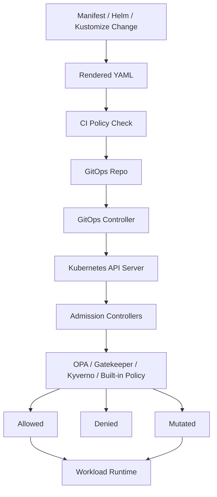
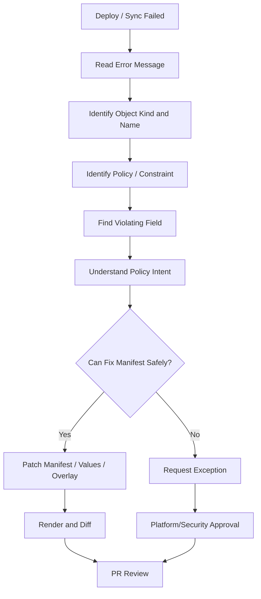

# Part 087 — Policy and Governance Operations

## 1. Tujuan Part Ini

Part ini membahas **policy and governance operations** untuk Kubernetes workload dari sudut pandang senior backend engineer.

Fokusnya bukan menjadikan backend engineer sebagai pemilik admission controller atau policy engine, tetapi membuat backend engineer mampu:

- memahami kenapa manifest Kubernetes ditolak saat deploy
- membaca policy violation secara operasional
- membedakan hard guardrail, warning, dan exception
- menulis manifest yang sesuai standard platform
- melakukan PR review terhadap perubahan workload yang berisiko melanggar governance
- berdiskusi efektif dengan platform, SRE, DevOps, dan security team

Dalam enterprise environment, Kubernetes policy bukan dekorasi. Policy adalah **production safety boundary**. Tanpa policy, cluster mudah menjadi tempat akumulasi manifest berbahaya: workload tanpa resource request, image tidak tervalidasi, privileged pod, label hilang, secret bocor, NetworkPolicy tidak konsisten, dan RBAC terlalu luas.

---

## 2. Governance Mental Model

Kubernetes governance mengubah cluster dari sekadar runtime fleksibel menjadi runtime yang punya guardrail.



Policy dapat bekerja di beberapa lokasi:

| Layer | Contoh policy | Tujuan operasional |
|---|---|---|
| CI | lint, schema validation, helm template validation | catch issue sebelum merge |
| GitOps | diff, sync validation, health check | mencegah drift dan bad sync |
| API server admission | deny/mutate/warn | enforce guardrail saat apply |
| Runtime scanner | runtime drift/security detection | detect issue setelah workload jalan |
| Audit/compliance | evidence collection | membuktikan control berjalan |

Backend engineer biasanya paling sering bertemu policy saat PR, pipeline, atau GitOps sync gagal.

---

## 3. Admission Controller Awareness

Admission controller adalah mekanisme Kubernetes untuk memproses request ke API server sebelum object disimpan.

Secara sederhana:

```text
kubectl apply / GitOps sync
        |
        v
Kubernetes API Server
        |
        v
Authentication -> Authorization -> Admission -> Persist to etcd
```

Admission dapat:

- **validate**: menerima atau menolak object
- **mutate**: mengubah object sebelum disimpan
- **warn**: memberikan peringatan tanpa menolak

Contoh efek admission:

- pod tanpa `resources.requests` ditolak
- image dengan tag `latest` ditolak
- container privileged ditolak
- label mandatory otomatis ditambahkan
- default `seccompProfile` disisipkan
- `runAsNonRoot` diwajibkan
- namespace tertentu hanya boleh memakai registry tertentu

Operational implication: manifest yang valid secara YAML belum tentu valid secara policy.

---

## 4. OPA Gatekeeper Awareness

OPA Gatekeeper adalah policy engine berbasis Open Policy Agent yang umum dipakai untuk admission control.

Konsep penting:

- `ConstraintTemplate`: template policy
- `Constraint`: instance policy yang diterapkan ke resource tertentu
- `Rego`: bahasa policy OPA
- audit result: hasil evaluasi object existing terhadap policy

Contoh policy intent:

```text
Semua Deployment di namespace production harus memiliki:
- app.kubernetes.io/name
- app.kubernetes.io/part-of
- owner/team label
- resources.requests.cpu
- resources.requests.memory
- securityContext.runAsNonRoot=true
```

Backend engineer tidak perlu menjadi expert Rego untuk efektif. Yang perlu dikuasai:

- membaca pesan violation
- memahami object mana yang melanggar
- menemukan field manifest yang harus diperbaiki
- tahu kapan policy memang benar dan kapan perlu exception
- tidak mengakali policy dengan workaround berbahaya

---

## 5. Kyverno Awareness

Kyverno adalah policy engine Kubernetes-native yang sering dipakai untuk validate, mutate, generate, dan verify image.

Kyverno biasanya lebih dekat dengan YAML Kubernetes dibanding Rego.

Contoh use case:

- validate resource requests
- mutate default labels
- require image digest
- block privileged containers
- require `readOnlyRootFilesystem`
- generate default NetworkPolicy
- verify image signature

Operationally, Kyverno dapat menyebabkan:

- deployment ditolak
- manifest dimutasi sehingga runtime berbeda dari source YAML
- policy report menampilkan workload non-compliant
- image verification failure saat deploy

Backend engineer harus tahu apakah organisasi memakai Kyverno, Gatekeeper, keduanya, atau tool lain.

---

## 6. Pod Security Standards

Pod Security Standards menyediakan tiga level umum:

| Level | Intent | Risiko jika dipakai sembarangan |
|---|---|---|
| Privileged | unrestricted workload | blast radius sangat besar |
| Baseline | mencegah privilege escalation umum | masih butuh review workload |
| Restricted | hardening kuat | bisa mematahkan aplikasi yang belum siap |

Untuk backend Java/JAX-RS service, target jangka panjang biasanya mendekati restricted baseline, tetapi harus tetap realistis terhadap kebutuhan runtime:

- `/tmp` writable
- heap dump path eksplisit
- truststore/keystore mount
- non-root compatible image
- no privileged port binding
- no HostPath kecuali benar-benar disetujui
- no unnecessary Linux capabilities

Contoh review:

```yaml
securityContext:
  runAsNonRoot: true
  seccompProfile:
    type: RuntimeDefault
containers:
  - name: app
    securityContext:
      allowPrivilegeEscalation: false
      readOnlyRootFilesystem: true
      capabilities:
        drop:
          - ALL
```

Policy harus dilihat sebagai forcing function untuk memperbaiki workload hygiene, bukan sebagai hambatan deploy.

---

## 7. Resource Policy

Resource policy biasanya mewajibkan:

- `requests.cpu`
- `requests.memory`
- `limits.memory`
- kadang `limits.cpu`
- ephemeral storage request/limit
- ratio request/limit tertentu
- batas maksimal resource per container
- batas minimal resource untuk production

Failure mode yang dicegah:

- pod BestEffort dievict saat node pressure
- HPA CPU tidak bekerja karena request missing
- workload mengambil resource berlebihan
- noisy neighbor
- scheduling tidak predictable
- cost allocation kacau

Contoh manifest yang biasanya diterima policy:

```yaml
resources:
  requests:
    cpu: "500m"
    memory: "768Mi"
  limits:
    memory: "1Gi"
```

Untuk Java workload, policy resource harus dibaca bersama JVM tuning:

- heap tidak boleh mendekati memory limit penuh
- native memory perlu ruang
- thread stack butuh ruang
- direct buffer perlu ruang
- GC behavior dipengaruhi CPU

Operational concern: memenuhi policy secara asal dengan angka besar dapat membuat deploy berhasil tetapi cost dan capacity memburuk.

---

## 8. Label Policy

Label policy penting untuk:

- selector correctness
- ownership
- incident routing
- cost allocation
- compliance mapping
- dashboard filtering
- alert ownership
- service catalog
- deployment traceability

Contoh label wajib:

```yaml
metadata:
  labels:
    app.kubernetes.io/name: quote-api
    app.kubernetes.io/part-of: quote-order
    app.kubernetes.io/component: backend-api
    app.kubernetes.io/managed-by: argocd
    environment: production
    team: quote-order
    owner: backend-platform
    cost-center: internal-verification-required
```

Operational failure jika label buruk:

- Service selector salah
- NetworkPolicy tidak match
- dashboard tidak menampilkan workload
- alert tidak punya owner
- cost tidak teralokasi
- incident sulit mencari service owner
- GitOps/pruning salah target

Label bukan hanya metadata. Label adalah dependency operasional.

---

## 9. Image Policy

Image policy dapat mencakup:

- registry allowlist
- no public registry untuk production
- no `latest` tag
- require immutable tag atau digest
- require vulnerability scan passed
- require signed image
- require SBOM
- block critical CVE
- block unapproved base image

Contoh safer image reference:

```yaml
image: registry.example.com/quote-api@sha256:...
```

Atau minimal:

```yaml
image: registry.example.com/quote-api:1.18.4-build.8273
imagePullPolicy: IfNotPresent
```

Operationally, image policy mencegah:

- deploy artifact yang tidak diketahui
- rollback ke image yang berubah isinya
- pulling dari registry tidak dipercaya
- supply chain compromise
- production drift antara tag dan digest

Backend engineer harus bisa menjawab: image ini dibangun dari commit apa, discan di mana, dipromosikan oleh pipeline apa, dan sedang berjalan di pod mana.

---

## 10. Network Policy Standard

Governance sering menetapkan baseline NetworkPolicy seperti:

- default deny ingress
- default deny egress
- allow ingress hanya dari ingress/controller/gateway namespace
- allow egress ke DNS
- allow egress ke approved dependencies
- separate rule untuk PostgreSQL, Kafka, RabbitMQ, Redis, Camunda, cloud service
- namespace label wajib untuk selector

Contoh minimal shape:

```yaml
apiVersion: networking.k8s.io/v1
kind: NetworkPolicy
metadata:
  name: quote-api-egress
spec:
  podSelector:
    matchLabels:
      app.kubernetes.io/name: quote-api
  policyTypes:
    - Egress
  egress:
    - to:
        - namespaceSelector:
            matchLabels:
              kubernetes.io/metadata.name: kube-system
      ports:
        - protocol: UDP
          port: 53
    - to:
        - ipBlock:
            cidr: 10.20.0.0/16
      ports:
        - protocol: TCP
          port: 5432
```

Policy governance harus menyeimbangkan security dan operability. Default deny tanpa dependency map akan memperbanyak incident timeout yang sulit dibaca.

---

## 11. RBAC Standard

RBAC governance biasanya mengatur:

- backend team read-only ke production namespace
- write access hanya melalui GitOps/pipeline
- no direct mutation di production kecuali break-glass
- service account per workload
- no broad ClusterRoleBinding untuk app workload
- no default ServiceAccount untuk production workload
- restricted `exec` / `port-forward` / `debug`

Backend engineer perlu memahami dua RBAC context:

| Context | Identity | Contoh failure |
|---|---|---|
| Human access | user/group via kubeconfig | tidak bisa `get secret`, tidak bisa `exec` |
| Workload access | ServiceAccount token | app gagal call Kubernetes API |

Untuk kebanyakan backend services, workload tidak perlu akses Kubernetes API sama sekali. Jika butuh, permission harus eksplisit dan sempit.

---

## 12. Secret Governance

Secret governance biasanya meliputi:

- tidak menyimpan secret plaintext di Git
- memakai external secret manager
- secret access least privilege
- secret rotation policy
- secret tidak boleh muncul di log
- secret tidak boleh dibaca via broad RBAC
- secret tidak boleh disimpan di ConfigMap
- secret tidak boleh masuk annotation yang mudah terbaca

Anti-pattern:

```yaml
env:
  - name: DATABASE_PASSWORD
    value: "plain-text-password"
```

Lebih baik:

```yaml
envFrom:
  - secretRef:
      name: quote-api-db-secret
```

Tetap perlu hati-hati: env var secret dapat muncul di dump tertentu, crash diagnostic, atau debug output. Untuk beberapa kasus, mounted file lebih mudah dikontrol.

---

## 13. Exception Process

Policy yang baik harus punya exception process. Tanpa exception process, tim cenderung mencari workaround yang lebih buruk.

Exception yang defensible harus menjawab:

- policy apa yang dilanggar?
- kenapa workload membutuhkan exception?
- alternatif apa yang sudah dievaluasi?
- berapa lama exception berlaku?
- siapa owner exception?
- apa mitigasi sementara?
- kapan exception akan dihapus?
- bagaimana evidence disimpan?

Contoh exception yang bisa diterima sementara:

```text
Workload file-processor masih membutuhkan writable filesystem selain /tmp karena legacy library.
Mitigasi: mount emptyDir hanya pada /app/work, sizeLimit 512Mi, no secret written, cleanup enabled.
Target remediation: refactor library usage before Q4 release.
Owner: backend service team.
Approval: platform + security.
```

Exception tanpa expiry adalah policy bypass permanen.

---

## 14. Policy Failure Debugging Flow



Safe investigation commands:

```bash
kubectl -n <namespace> get events --sort-by=.lastTimestamp
kubectl -n <namespace> describe deploy <deployment>
kubectl -n <namespace> get deploy <deployment> -o yaml
kubectl auth can-i create deployment -n <namespace>
```

Jika memakai Gatekeeper atau Kyverno, command tergantung instalasi internal. Verifikasi tool yang dipakai sebelum membuat asumsi.

```bash
kubectl get validatingwebhookconfigurations
kubectl get mutatingwebhookconfigurations
kubectl get constrainttemplates 2>/dev/null
kubectl get constraints 2>/dev/null
kubectl get clusterpolicies 2>/dev/null
kubectl get policies -A 2>/dev/null
```

Catatan: beberapa command di atas mungkin tidak diizinkan untuk backend engineer di production. Gunakan sesuai RBAC dan policy internal.

---

## 15. PR Review Checklist for Policy Compliance

Saat review PR manifest/Helm/Kustomize, cek:

### Metadata

- label wajib lengkap
- owner/team/environment jelas
- app name konsisten
- selector tidak berubah tanpa alasan
- cost/compliance label sesuai standard

### Resource

- CPU/memory request tersedia
- memory limit tersedia
- ephemeral storage dipertimbangkan
- JVM heap tidak melebihi container budget
- HPA metric tidak rusak karena request missing

### Security

- non-root
- no privileged container
- no HostPath kecuali approved
- capabilities drop ALL jika memungkinkan
- read-only root filesystem jika compatible
- secret tidak plaintext

### Network

- ingress/egress NetworkPolicy sesuai dependency
- DNS egress tersedia jika default deny
- DB/broker/cache/cloud service access eksplisit
- no broad `0.0.0.0/0` tanpa alasan

### Image

- registry approved
- no `latest`
- image scan/signed policy terpenuhi
- tag/digest traceable ke commit/pipeline

### RBAC

- ServiceAccount spesifik
- no broad ClusterRoleBinding
- no default service account jika tidak disetujui
- workload identity annotation benar jika cloud access diperlukan

---

## 16. Failure Modes

| Failure mode | Gejala | Kemungkinan akar masalah | Aksi awal aman |
|---|---|---|---|
| GitOps sync denied | app OutOfSync/Degraded | admission policy reject | baca sync error, render manifest |
| CI policy failed | PR tidak bisa merge | schema/policy violation | lihat rendered diff dan policy report |
| Pod rejected | tidak ada pod baru | Pod Security / webhook deny | baca events dan admission message |
| Image rejected | deployment gagal | image policy / scan / signature | cek image tag, digest, scan result |
| Secret policy violation | manifest ditolak | secret plaintext / source tidak approved | pindah ke external secret pattern |
| Resource policy violation | deploy ditolak | missing request/limit | sizing berdasarkan metric, bukan angka asal |
| Label policy violation | deploy ditolak | mandatory label missing | tambah label standard tanpa merusak selector |
| Network policy violation | security review blocked | dependency map tidak jelas | dokumentasikan egress/ingress dependency |

---

## 17. Backend-Specific Governance Concerns

Untuk Java/JAX-RS backend, governance paling sering menyentuh:

- memory sizing dan JVM flags
- readiness/liveness endpoint
- TLS truststore/keystore secret
- HTTP client timeout/retry config
- DB/Kafka/RabbitMQ/Redis credential source
- workload identity untuk cloud SDK
- writable path untuk `/tmp`, cache, upload, heap dump
- NetworkPolicy egress ke dependency
- correlation ID dan log redaction
- image base dan vulnerability scan

Untuk CPQ/quote/order lifecycle, governance juga harus menjaga:

- auditability perubahan deployment
- traceability release yang memengaruhi order lifecycle
- compatibility saat schema/event change
- rollback readiness saat quote/order processing terdampak
- secret handling untuk billing/payment/customer integration
- evidence retention untuk incident dan compliance

---

## 18. Platform/SRE/Security Escalation Boundary

Backend engineer harus eskalasi jika:

- policy error tidak jelas atau tampak salah
- webhook admission down dan semua deploy blocked
- policy mutation membuat manifest runtime berbeda dari source
- required exception menyentuh privileged pod, HostPath, broad RBAC, atau external egress luas
- image verification gagal padahal pipeline valid
- Gatekeeper/Kyverno/controller policy report bermasalah
- production deploy terblokir dan ada incident aktif

Jangan melakukan:

- disable policy
- patch webhook config
- bypass GitOps dengan apply manual
- memakai namespace lain untuk menghindari policy
- mengganti label selector hanya agar policy lewat
- menyimpan secret plaintext untuk menghindari external secret issue

---

## 19. Internal Verification Checklist

Verifikasi di internal CSG/team:

- policy engine yang dipakai: OPA Gatekeeper, Kyverno, built-in admission, custom webhook, atau kombinasi
- policy list untuk namespace production
- apakah policy berjalan di CI, GitOps, admission, atau runtime scanner
- mandatory label standard
- resource request/limit standard
- Pod Security Standards level per namespace
- image registry allowlist
- image scanning/signing/SBOM requirement
- secret management standard
- NetworkPolicy baseline
- RBAC standard untuk human dan workload access
- exception process dan approval owner
- policy violation dashboard/report
- siapa owner policy saat deploy production blocked
- bagaimana menyimpan evidence exception
- apakah ada dry-run/policy test command di pipeline
- bagaimana policy berubah dikomunikasikan ke app teams

---

## 20. Operational Heuristics

Gunakan prinsip berikut:

1. **Policy violation is a signal, not just a blocker.** Cari intent di balik policy.
2. **Fix manifest first, request exception second.** Exception adalah jalur terakhir.
3. **Do not satisfy policy with meaningless values.** Resource request besar tanpa basis metric hanya memindahkan risiko ke capacity/cost.
4. **Selectors are dangerous.** Jangan ubah label/selector tanpa memahami Service, NetworkPolicy, HPA, PDB, dan dashboard dependency.
5. **Admission mutation must be visible.** Runtime object bisa berbeda dari source manifest.
6. **Security exception needs expiry.** Tanpa expiry, exception menjadi standard baru yang tidak pernah disetujui secara eksplisit.
7. **Governance should improve operability.** Policy yang membuat incident lebih sulit harus direview bersama platform/security.

---

## 21. Summary

Policy and governance operations memastikan workload Kubernetes tetap aman, terstandarisasi, observable, dan defensible.

Sebagai backend engineer, targetnya bukan menguasai seluruh internal policy engine, tetapi mampu:

- membaca policy failure
- memperbaiki manifest secara benar
- memahami admission/mutation effect
- menjaga workload tetap compliant
- meminta exception secara bertanggung jawab
- mereview PR Kubernetes dengan operational safety mindset

Dalam production enterprise, governance yang baik tidak memperlambat delivery. Governance yang baik mencegah perubahan kecil berubah menjadi incident besar.
