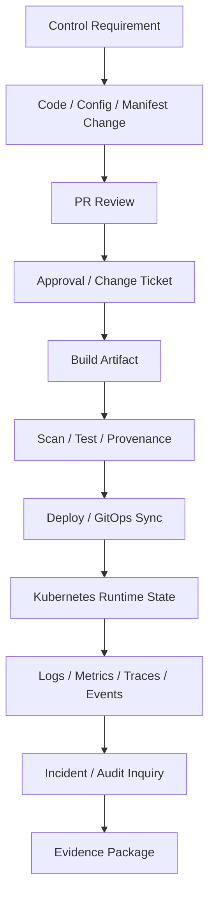
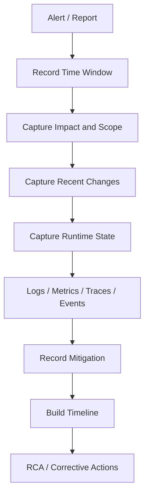

# Part 088 — Compliance and Audit Operations

## 1. Tujuan Part Ini

Part ini membahas **compliance and audit operations** untuk Kubernetes backend workload dari sudut pandang senior backend engineer.

Fokusnya bukan menjadi auditor, GRC specialist, atau cluster security administrator. Fokusnya adalah memastikan operasi service Java/JAX-RS, Kafka consumer, RabbitMQ consumer, Redis-backed service, Camunda worker, batch job, scheduler, dan migration job memiliki evidence yang cukup untuk menjawab pertanyaan penting:

- siapa mengubah apa?
- kapan perubahan terjadi?
- artifact apa yang dideploy?
- approval apa yang ada sebelum production change?
- workload mana yang terdampak?
- credential/config apa yang berubah?
- apakah rollback dilakukan?
- evidence apa yang tersedia saat incident?
- apakah deployment dan runtime state dapat dipertanggungjawabkan?

Dalam enterprise system, terutama sistem CPQ, quote/order lifecycle, order management, billing integration, dan mission-critical production systems, auditability bukan fitur tambahan. Auditability adalah bagian dari operational correctness.

---

## 2. Compliance Mental Model

Compliance operations menghubungkan source change, deployment process, runtime state, dan incident evidence.



Audit evidence harus bisa menyambungkan:

```text
business impact -> service -> deployment -> image -> commit -> PR -> approval -> runtime evidence -> mitigation/RCA
```

Tanpa chain ini, investigasi production akan bergantung pada ingatan manusia.

---

## 3. What Backend Engineers Own

Backend engineer biasanya bertanggung jawab memastikan:

- perubahan aplikasi punya PR/review trace
- image bisa ditelusuri ke commit dan pipeline
- manifest/config change bisa ditelusuri ke GitOps repo
- deployment marker tersedia di observability
- log cukup untuk audit operasional tanpa membocorkan data sensitif
- correlation ID/trace ID tersedia untuk request investigation
- migration job punya record eksekusi
- runbook menjelaskan evidence yang harus dikumpulkan saat incident
- rollback dan mitigation terdokumentasi
- secret/config handling tidak melanggar policy

Yang biasanya dimiliki platform/SRE/security/compliance:

- cluster audit log
- centralized log retention
- access audit
- admission policy evidence
- SIEM integration
- vulnerability management platform
- secret management platform
- change management system
- incident management system
- compliance reporting dashboard

Backend engineer tetap harus tahu di mana evidence berada dan bagaimana memintanya.

---

## 4. Audit Log Awareness

Kubernetes audit log mencatat request ke Kubernetes API server.

Audit log dapat menjawab:

- siapa membuat/mengubah/menghapus object?
- object apa yang berubah?
- namespace mana?
- user/service account mana?
- request diterima atau ditolak?
- dari sumber mana request datang?

Contoh event yang penting:

- `create deployment`
- `patch deployment`
- `delete pod`
- `create secret`
- `get secret`
- `create rolebinding`
- `update configmap`
- `exec into pod`
- `port-forward`
- `delete namespace`

Backend engineer mungkin tidak punya akses langsung ke audit log production. Tetapi saat incident, tahu bahwa audit log ada dan tahu evidence apa yang diminta adalah skill penting.

---

## 5. Deployment Audit

Deployment audit menjawab: **apa yang berubah di production dan kapan?**

Evidence yang ideal:

| Evidence | Menjawab pertanyaan |
|---|---|
| Git commit | source code berubah apa? |
| PR review | siapa review dan approve? |
| build ID | artifact dibuat oleh pipeline mana? |
| image tag/digest | container apa yang dideploy? |
| deployment timestamp | kapan runtime berubah? |
| GitOps sync record | siapa/apa yang apply manifest? |
| rollout history | revision mana yang aktif? |
| deployment marker | apakah metric/log/trace bisa dikorelasikan? |
| smoke test result | validasi pasca deploy apa? |
| rollback event | apakah mitigasi dilakukan? |

Minimal manifest annotation yang berguna:

```yaml
metadata:
  annotations:
    deployment.kubernetes.io/revision: "managed-by-kubernetes"
    app.example.com/git-commit: "abc1234"
    app.example.com/build-id: "build-8273"
    app.example.com/release-id: "release-2026-07-12-01"
```

Gunakan nama annotation sesuai standard internal, jangan mengarang standard sendiri jika sudah ada.

---

## 6. Image Provenance

Image provenance menjawab:

- image dibangun dari commit apa?
- pipeline mana yang membangun?
- dependency apa yang masuk image?
- base image apa yang digunakan?
- vulnerability scan apa hasilnya?
- apakah image ditandatangani?
- apakah image dipromosikan dari environment sebelumnya?

Operationally, image provenance penting saat:

- incident setelah deployment
- CVE response
- rollback
- supply chain investigation
- audit release
- membuktikan artifact production sama dengan artifact yang diuji

Anti-pattern:

```yaml
image: quote-api:latest
```

Lebih defensible:

```yaml
image: registry.example.com/quote-api@sha256:<digest>
```

Atau minimal image tag immutable yang mengandung build identity.

---

## 7. Access Audit

Access audit menjawab: **siapa mengakses apa di production?**

Akses yang perlu diaudit:

- kubeconfig/context production
- `kubectl get secret`
- `kubectl exec`
- `kubectl port-forward`
- `kubectl debug`
- direct patch/apply/delete
- break-glass access
- GitOps manual sync
- cloud console access
- secret manager access
- database/broker admin access

Backend engineer harus menganggap beberapa tindakan sebagai high-risk:

```bash
kubectl -n prod exec -it <pod> -- sh
kubectl -n prod port-forward svc/<service> 8080:80
kubectl -n prod get secret <secret> -o yaml
kubectl -n prod patch deploy <deploy> ...
```

Bukan berarti semua tindakan ini dilarang. Tetapi di enterprise production, tindakan ini harus punya alasan, otorisasi, dan jejak audit yang jelas.

---

## 8. Secret Access Audit

Secret access adalah area compliance yang sensitif.

Pertanyaan audit:

- siapa bisa membaca Kubernetes Secret?
- apakah secret berasal dari external secret manager?
- siapa bisa membaca secret di AWS Secrets Manager, SSM, atau Azure Key Vault?
- apakah secret pernah muncul di logs?
- apakah secret pernah disimpan di Git?
- apakah rotation punya evidence?
- apakah pod restart/reload setelah rotation?

Backend engineer perlu memastikan:

- tidak mencetak env var ke log
- tidak menampilkan credential di health endpoint
- tidak menaruh secret dalam exception stacktrace
- tidak memasukkan secret ke annotation/label
- tidak mengambil screenshot/log yang berisi secret saat incident
- tidak menyalin secret ke ticket/chat tanpa approved secure channel

Saat debugging, gunakan bukti tidak langsung jika memungkinkan:

- secret exists atau tidak
- mount exists atau tidak
- application reports auth failed atau not
- cloud audit says access denied atau allowed
- version timestamp cocok atau tidak

Hindari membaca value secret kecuali benar-benar authorized dan perlu.

---

## 9. Config Change Audit

Config change sering menjadi akar incident.

Yang perlu diaudit:

- ConfigMap change
- Helm values change
- Kustomize overlay change
- environment variable change
- feature flag change
- timeout/retry config change
- pool size change
- endpoint URL change
- TLS truststore/CA change
- NetworkPolicy change
- HPA/PDB/resource change

Config audit harus bisa menjawab:

```text
Apa nilai lama?
Apa nilai baru?
Siapa approve?
Kapan masuk production?
Service mana terdampak?
Apakah ada rollback path?
Apakah dashboard menunjukkan perubahan perilaku setelah config change?
```

Untuk Java/JAX-RS service, perubahan kecil seperti timeout, pool size, thread count, atau feature flag dapat mengubah failure mode secara besar.

---

## 10. Change Approval

Change approval bukan sekadar birokrasi. Dalam production operations, change approval adalah mekanisme untuk mengontrol blast radius.

Approval yang baik menjawab:

- apa yang berubah?
- kenapa berubah?
- risiko apa yang diketahui?
- bagaimana validasi dilakukan?
- bagaimana rollback dilakukan?
- kapan window deployment?
- siapa owner?
- siapa approver?
- apakah dependency team perlu tahu?
- apakah customer/business impact mungkin terjadi?

Untuk Kubernetes changes, approval harus memperhatikan:

- manifest changes
- resource sizing changes
- routing/ingress changes
- secret/config changes
- identity/RBAC changes
- NetworkPolicy changes
- database migration coordination
- autoscaling changes
- deployment strategy changes

Perubahan Kubernetes bukan hanya infra change. Banyak perubahan Kubernetes langsung memengaruhi behavior aplikasi.

---

## 11. Incident Evidence Capture

Saat incident, evidence harus dikumpulkan sebelum hilang.

Evidence yang sering ephemeral:

- pod previous logs
- Kubernetes events
- terminated pod status
- rollout state saat incident
- HPA events
- node pressure events
- ingress controller logs
- DNS failure sample
- trace samples
- queue lag snapshot
- dashboard screenshots
- GitOps sync error

Evidence capture flow:



Safe evidence commands:

```bash
kubectl -n <namespace> get deploy,rs,pod,svc,endpointslice,ingress
kubectl -n <namespace> describe pod <pod>
kubectl -n <namespace> logs <pod> --previous
kubectl -n <namespace> get events --sort-by=.lastTimestamp
kubectl -n <namespace> rollout history deploy/<deployment>
kubectl -n <namespace> rollout status deploy/<deployment>
```

Jangan menjalankan command destruktif hanya untuk mendapatkan evidence.

---

## 12. Compliance Dashboard

Compliance dashboard membantu melihat posture tanpa menunggu audit manual.

Panel yang berguna:

- workload without owner label
- workload without resource requests
- workload without memory limits
- workload running privileged
- workload using default ServiceAccount
- workload without NetworkPolicy
- workload using disallowed image registry
- workload using mutable image tag
- policy violations by namespace/team
- exceptions nearing expiry
- secrets not rotated
- deployments without recent approval metadata
- workloads without runbook/dashboard/alert link

Backend service owner harus bisa melihat posture service-nya sendiri.

Dashboard compliance yang hanya bisa dibaca platform team akan memperlambat remediation.

---

## 13. Evidence Retention

Evidence retention harus disesuaikan dengan kebutuhan audit, incident investigation, dan privacy.

Jenis evidence dan perhatian retensi:

| Evidence | Retention concern |
|---|---|
| logs | volume, PII, sensitive data |
| metrics | resolution, cost, long-term trend |
| traces | sampling, PII in attributes |
| audit logs | access control, integrity |
| deployment records | release traceability |
| incident notes | timeline and RCA |
| screenshots | may contain sensitive data |
| heap dump/thread dump | can contain secret/PII |
| database query evidence | customer/order data risk |

Untuk Java production debugging, heap dump dan thread dump sangat sensitif. Heap dump bisa berisi token, customer data, credential, payload quote/order, dan PII. Jangan menyimpan dump sembarangan di ticket atau local machine.

---

## 14. Auditability for Java/JAX-RS Backend

Untuk service Java/JAX-RS, auditability perlu diperhatikan di runtime aplikasi:

- request ID / correlation ID
- trace ID propagation
- authenticated principal atau service identity jika relevan
- endpoint path dan status code
- latency
- error classification
- dependency call outcome
- business operation ID jika aman
- quote/order/process correlation ID jika sesuai policy
- no secret/PII leakage

Logging buruk:

```text
Login failed with password=...
DB connection string=jdbc:postgresql://... user=... password=...
```

Logging lebih aman:

```text
dependency_auth_failed dependency=postgresql credential_source=db-secret reason=access_denied correlation_id=...
```

Auditability bukan berarti log semua data. Auditability berarti mencatat event yang tepat dengan redaction yang benar.

---

## 15. CPQ / Quote / Order Lifecycle Audit Concerns

Untuk domain CPQ dan quote/order, audit concern lebih ketat karena perubahan runtime dapat memengaruhi business lifecycle.

Pertanyaan yang harus bisa dijawab:

- release apa yang aktif saat quote dibuat?
- release apa yang aktif saat order submitted?
- apakah ada deployment saat error rate naik?
- apakah consumer lag memengaruhi order progression?
- apakah retry/DLQ mengubah urutan processing?
- apakah migration mengubah schema yang dipakai workflow?
- apakah incident menyebabkan duplicate processing?
- apakah rollback membuat event/schema compatibility issue?

Operational evidence yang berguna:

- deployment marker
- trace/correlation ID
- process instance ID jika relevan
- event ID/message ID jika aman
- consumer group lag snapshot
- DLQ count
- database migration version
- feature flag state
- config version

Jangan mengarang field internal. Verifikasi nama correlation ID, process ID, quote/order ID handling, dan redaction policy di internal team.

---

## 16. Compliance Failure Modes

| Failure mode | Dampak | Contoh |
|---|---|---|
| Tidak ada deployment trace | sulit RCA | tidak tahu image mana yang aktif saat incident |
| Mutable image tag | rollback tidak deterministik | `latest` berubah isi |
| Missing approval | audit finding | production change tanpa review |
| Secret leaked in logs | security incident | credential muncul di centralized logging |
| Direct kubectl patch | GitOps drift | runtime tidak sesuai repo |
| Missing owner label | incident routing lambat | alert tidak tahu owner |
| Missing audit log | investigasi buntu | tidak tahu siapa delete object |
| No retention | evidence hilang | events/logs expired sebelum RCA |
| Over-retention | privacy/cost risk | PII disimpan terlalu lama |
| Heap dump mishandled | data exposure | dump dibagikan via ticket/chat |

---

## 17. Production-Safe Audit Investigation

Saat perlu audit investigation:

1. Mulai dari time window.
2. Identifikasi service dan namespace.
3. Cari deployment marker atau recent change.
4. Hubungkan image digest ke build/commit.
5. Cek GitOps sync history.
6. Cek runtime object state.
7. Cek logs/metrics/traces/events.
8. Cek access audit jika ada tindakan manual.
9. Catat gap evidence.
10. Buat corrective action untuk gap tersebut.

Jangan mulai dari membaca secret, exec ke pod, atau patch object.

---

## 18. Internal Verification Checklist

Verifikasi di internal CSG/team:

- sumber audit log Kubernetes
- siapa yang bisa mengakses audit log
- retention audit log
- deployment approval process
- GitOps sync history location
- image provenance standard
- image digest/signature/SBOM requirement
- vulnerability scan evidence
- release marker standard di observability
- change ticket requirement untuk production
- access audit untuk kubeconfig, exec, port-forward, debug, break-glass
- secret access audit di Kubernetes dan cloud secret manager
- secret rotation evidence
- config change history
- feature flag audit trail
- incident evidence template
- RCA template
- evidence retention policy
- PII/sensitive data redaction policy
- heap dump/thread dump handling procedure
- compliance dashboard location
- exception evidence storage
- owner untuk audit/compliance questions

---

## 19. PR Review Checklist for Auditability

Saat review PR backend/Kubernetes, cek:

### Source Traceability

- commit jelas
- PR linked ke ticket/story
- reviewer sesuai ownership
- change description menjelaskan operational impact

### Artifact Traceability

- image tag/digest immutable
- build ID tersedia
- vulnerability scan passed
- provenance/SBOM sesuai standard internal

### Runtime Traceability

- deployment annotation/label cukup
- dashboard dapat filter version/release
- deployment marker tersedia
- rollback path jelas

### Config/Secret Auditability

- ConfigMap/values change terlihat di diff
- secret tidak plaintext
- external secret reference benar
- rotation/reload behavior jelas

### Incident Evidence

- logs punya correlation ID
- traces propagate
- metrics cukup untuk SLO/debugging
- runbook link tersedia
- alert link tersedia jika workload critical

---

## 20. Operational Heuristics

Gunakan prinsip berikut:

1. **No evidence, no confidence.** Jika perubahan tidak bisa dilacak, sulit dipercaya di production.
2. **Auditability must be designed before incident.** Evidence tidak bisa dibuat ulang setelah hilang.
3. **Do not log secrets to improve debugging.** Debuggability tanpa redaction adalah liability.
4. **Runtime state must reconcile back to Git.** Manual patch tanpa record adalah compliance risk.
5. **Image identity matters.** Tag mutable membuat rollback dan investigation tidak deterministik.
6. **Retention is a trade-off.** Terlalu pendek menghilangkan evidence; terlalu panjang meningkatkan privacy dan cost risk.
7. **Compliance should support operations.** Control yang baik membantu incident response, bukan hanya audit checklist.

---

## 21. Summary

Compliance and audit operations memastikan Kubernetes production environment dapat dipertanggungjawabkan.

Sebagai senior backend engineer, kemampuan utama bukan menghafal regulasi, tetapi memastikan service yang Anda miliki memiliki:

- deployment traceability
- image provenance
- approval evidence
- runtime observability
- access audit awareness
- secret/config change audit
- incident evidence capture
- retention dan redaction discipline

Untuk enterprise CPQ, quote/order, billing, dan mission-critical systems, auditability adalah bagian dari reliability. Sistem yang tidak bisa dijelaskan setelah incident belum benar-benar production-ready.
