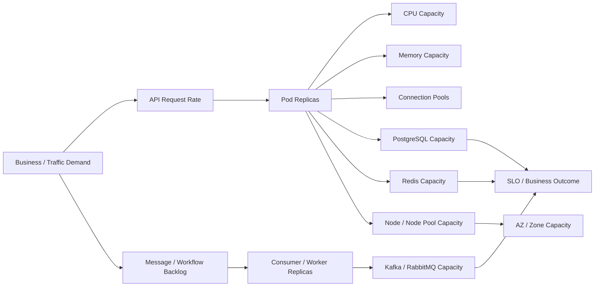
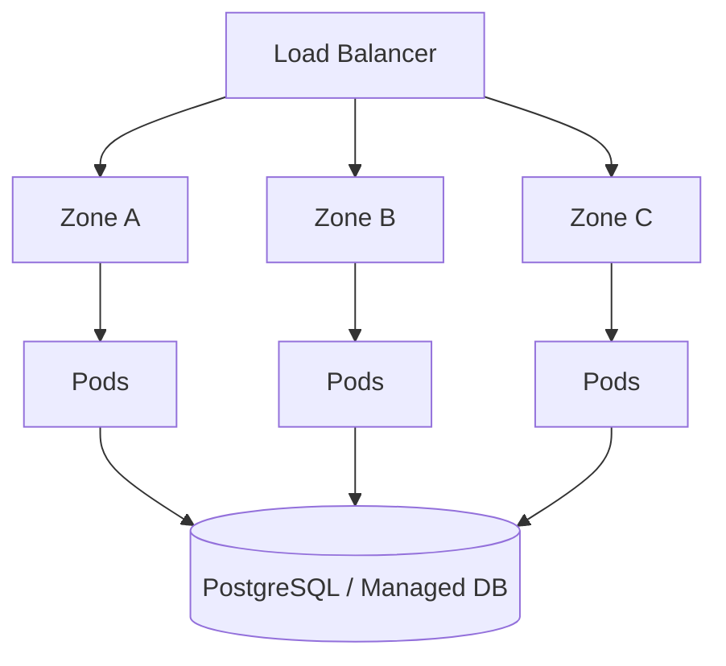

# Part 089 — Capacity Planning for Backend Services

## 1. Tujuan Part Ini

Part ini membahas **capacity planning untuk backend services yang berjalan di Kubernetes** dari sudut pandang senior backend engineer.

Fokusnya bukan menjadi tim platform yang menentukan semua node pool atau cloud quota, tetapi membangun kemampuan untuk:

- memperkirakan kapasitas workload berdasarkan traffic, throughput, latency, dan dependency pressure
- menghubungkan replica count dengan CPU, memory, connection pool, queue consumer, dan database/broker limit
- memahami dampak HPA, rollout, canary, dan blue-green terhadap kapasitas sementara
- membaca apakah kapasitas bottleneck berada di pod, node, cluster, zone, network, atau dependency
- melakukan PR/architecture review terhadap perubahan workload yang bisa menaikkan kapasitas runtime
- berdiskusi secara tajam dengan platform/SRE, database team, security, dan application owner

Dalam sistem CPQ, quote management, order management, billing integration, dan telco BSS/OSS, kapasitas bukan sekadar angka CPU. Kapasitas adalah kemampuan sistem menyelesaikan business workload dalam waktu yang dapat diterima, tanpa merusak dependency, tanpa memperbesar cost secara liar, dan tanpa kehilangan reliability saat spike, deployment, atau incident.

---

## 2. Capacity Planning Mental Model

Capacity planning Kubernetes harus dilihat sebagai rantai, bukan satu metrik.



Prinsip penting:

1. **Kapasitas workload tidak boleh dihitung hanya dari CPU usage.**
2. **Replica count menaikkan kapasitas aplikasi sekaligus menaikkan pressure ke dependency.**
3. **HPA max replica adalah janji konsumsi kapasitas, bukan sekadar angka aman.**
4. **Rolling update dan canary dapat membuat kapasitas sementara melebihi steady state.**
5. **Queue-based autoscaling dapat menambah consumer lebih cepat daripada kemampuan dependency menerima beban.**
6. **Capacity planning harus berbasis evidence: metrics, load test, production baseline, dan incident history.**

---

## 3. Jenis Kapasitas yang Harus Dipisahkan

| Jenis kapasitas | Pertanyaan utama | Contoh sinyal |
|---|---|---|
| Traffic capacity | Berapa request/sec yang bisa dilayani? | RPS, latency p95/p99, error rate |
| Compute capacity | Apakah CPU cukup? | CPU usage, throttling, queue time, GC |
| Memory capacity | Apakah memory cukup? | heap usage, RSS, OOMKilled, GC pressure |
| Thread capacity | Apakah worker/request thread cukup? | active threads, queue depth, rejection |
| Connection capacity | Apakah pool dan dependency cukup? | DB pool wait, max connection, broker connection |
| Queue capacity | Apakah backlog bisa dikuras tepat waktu? | Kafka lag, RabbitMQ ready/unacked, Camunda job backlog |
| Node capacity | Apakah cluster bisa menjalankan pod? | Pending pod, allocatable, utilization, bin packing |
| Zone capacity | Apakah kapasitas tersebar aman antar zone? | pod distribution, node per zone, AZ outage risk |
| Dependency capacity | Apakah PostgreSQL/Kafka/RabbitMQ/Redis/Camunda cukup? | dependency latency, saturation, limit, error |
| Operational capacity | Apakah sistem tetap aman saat deploy/rollback? | maxSurge, canary, blue-green, PDB, HPA |

Kesalahan umum: melihat pod CPU masih rendah lalu menyimpulkan kapasitas aman, padahal bottleneck berada pada database connection, Kafka partition count, RabbitMQ prefetch/unacked, Redis latency, atau Camunda job activation.

---

## 4. Backend Engineer Responsibility

Backend engineer bertanggung jawab terhadap kapasitas workload aplikasi, terutama:

- memahami baseline traffic service
- memahami peak load dan business event yang memicu spike
- menentukan resource request/limit yang defensible
- menentukan replica minimum dan maksimum yang aman
- menghitung connection pool per pod dan total pool across replicas
- memahami queue consumer concurrency dan throughput per replica
- memastikan readiness/liveness tidak memalsukan kapasitas
- memastikan graceful shutdown tidak menciptakan capacity drop saat rollout
- memastikan dependency timeout/retry tidak menciptakan retry storm
- menyediakan dashboard dan alert untuk capacity signals
- melakukan load test atau evidence-based sizing sebelum perubahan besar

Backend engineer tidak harus memiliki penuh:

- node pool instance selection
- cluster autoscaler/Karpenter configuration
- cloud quota
- CNI capacity
- storage class capacity
- managed database cluster sizing
- enterprise cost allocation policy

Tetapi backend engineer harus cukup memahami area tersebut untuk melakukan eskalasi yang tepat dan tidak membuat workload design yang tidak realistis.

---

## 5. Platform/SRE Responsibility

Platform/SRE biasanya bertanggung jawab terhadap:

- node pool/node group sizing
- cluster autoscaling configuration
- Karpenter/Cluster Autoscaler/AKS node pool autoscaling
- quota cluster dan cloud account/subscription
- baseline observability infrastructure
- scheduling policy, taint/toleration, topology spread standard
- resource quota dan LimitRange
- cluster upgrade capacity buffer
- capacity incident coordination
- shared ingress/controller capacity
- load balancer/NAT/network capacity boundary

Backend engineer perlu membawa data yang jelas saat eskalasi:

```text
Service: quote-api
Namespace: <verify>
Symptom: p95 latency naik saat RPS > X
Current replicas: N
CPU request/limit: X/Y
Memory request/limit: X/Y
HPA min/max: X/Y
DB pool per pod: X
Total DB pool at max replica: X * maxReplica
Kafka/RabbitMQ/Camunda backlog: <metric>
Node pending events: <yes/no>
Dependency saturation: <metric>
Recent deployment: <commit/release>
```

---

## 6. Capacity Baseline yang Harus Dimiliki Service Owner

Setiap backend service production sebaiknya punya baseline berikut:

| Baseline | Kenapa penting |
|---|---|
| Normal RPS | mengetahui steady-state demand |
| Peak RPS | sizing untuk load tertinggi |
| p50/p95/p99 latency | memahami tail latency |
| Error rate | mendeteksi capacity-induced failure |
| CPU usage per replica | sizing request dan HPA |
| Memory usage per replica | sizing memory limit dan heap |
| JVM heap/non-heap | membedakan app memory dan container RSS |
| Thread pool utilization | mendeteksi queueing dalam JVM |
| DB pool active/wait | mendeteksi DB bottleneck |
| Kafka lag / RabbitMQ queue depth | sizing consumer throughput |
| Redis latency/hit ratio | mendeteksi cache pressure |
| Camunda job backlog/incidents | workflow capacity |
| Restart count/OOMKilled | kapasitas memory buruk |
| HPA scaling events | scaling behavior |
| Pod pending events | cluster capacity issue |

Tanpa baseline, capacity planning berubah menjadi opini.

---

## 7. Traffic Forecast untuk Backend Service

Traffic forecast harus dimulai dari business driver, bukan dari Kubernetes object.

Contoh driver dalam CPQ/order domain:

- quote creation spike saat campaign/promosi
- bulk quote import
- order submission cut-off time
- billing cycle integration
- catalog publish event
- partner API traffic
- retry storm dari upstream system
- reprocessing backlog setelah outage
- batch reconciliation window

Pertanyaan forecast:

1. Berapa request/sec normal?
2. Berapa request/sec peak historis?
3. Berapa growth 3/6/12 bulan?
4. Apakah traffic bursty atau smooth?
5. Apakah traffic user-facing atau batch/internal?
6. Apakah traffic sinkron HTTP atau async queue?
7. Apakah workload CPU-bound, IO-bound, memory-bound, atau dependency-bound?
8. Apakah ada seasonal load?
9. Apakah ada business event yang perlu capacity pre-warm?

---

## 8. Replica Sizing

Replica sizing harus mempertimbangkan availability dan throughput.

Formula sederhana:

```text
requiredReplicas = ceil(peakThroughput / safeThroughputPerReplica)
```

Tetapi production sizing harus menambahkan buffer:

```text
safeReplicas = requiredReplicas + failureBuffer + rolloutBuffer
```

Contoh reasoning:

```text
Peak traffic: 300 RPS
Safe throughput per replica: 60 RPS at p95 < target
Required replicas: 5
Failure buffer: +1 replica
Rollout/canary buffer: +1 replica
Recommended min for event window: 7 replicas
```

Yang harus dihindari:

- replica = 1 untuk service critical
- HPA min replica terlalu rendah sehingga cold scale-up lama
- max replica tinggi tanpa dependency capacity
- replica count naik tetapi DB pool tidak dikontrol
- replica count consumer melebihi partition atau queue capacity

---

## 9. CPU Sizing

CPU request memengaruhi scheduling, HPA, dan capacity guarantee.

CPU limit memengaruhi throttling.

Untuk Java backend service, CPU sizing harus melihat:

- request processing cost
- serialization/deserialization cost
- JSON/XML processing
- validation/business rule evaluation
- persistence mapping cost, misalnya MyBatis/JPA/JDBC
- TLS/crypto cost
- GC cost
- thread scheduling overhead
- retry storm impact
- synchronous dependency wait

Safe investigation commands:

```bash
kubectl top pod -n <namespace> -l app.kubernetes.io/name=<service>
kubectl describe hpa -n <namespace> <hpa-name>
kubectl describe pod -n <namespace> <pod-name>
```

Metrics yang harus dicek:

- CPU usage per pod
- CPU request utilization
- CPU throttling seconds/rate
- p95/p99 latency correlation
- GC pause correlation
- request queue time
- HPA scale event

---

## 10. Memory Sizing

Memory sizing untuk Java tidak cukup hanya melihat heap.

Komponen memory:

```text
Container memory usage
  = JVM heap
  + metaspace
  + direct buffer
  + thread stack
  + JIT/code cache
  + native libraries
  + HTTP client buffers
  + database driver buffers
  + compression/serialization buffers
  + file/temp buffers
```

Checklist sizing:

- heap max tidak mendekati container limit secara agresif
- ada headroom untuk native memory
- thread count tidak membuat stack memory membesar
- direct memory dipahami untuk Netty/HTTP client tertentu
- heap dump tidak memenuhi ephemeral storage
- memory p95/p99 stabil saat load test
- tidak ada memory leak setelah long soak test

Failure mode:

- OOMKilled dengan exit code 137
- GC overhead tinggi
- memory terus naik setelah traffic turun
- pod dievict karena node memory pressure
- liveness failure karena stop-the-world pause

---

## 11. Connection Pool Sizing

Connection pool adalah area capacity planning yang sering menyebabkan incident.

Total connection bukan hanya per pod.

```text
totalConnections = poolSizePerPod * replicaCount
worstCaseConnections = poolSizePerPod * (replicaCount + maxSurge + canaryReplicas)
```

Contoh:

```text
DB pool per pod: 20
Steady replicas: 10
maxSurge: 2
Canary replicas: 2
Worst-case DB connections: 20 * 14 = 280
```

Jika PostgreSQL hanya aman menerima 200 connection untuk service tersebut, rollout bisa menyebabkan saturation walaupun steady-state terlihat aman.

Dependency yang perlu dihitung:

- PostgreSQL max connections
- PgBouncer/proxy pool
- Redis connection pool
- Kafka producer/consumer connections
- RabbitMQ connections/channels
- HTTP client pool ke downstream service
- Camunda engine/client connections

---

## 12. Queue Consumer Sizing

Untuk Kafka/RabbitMQ consumer, capacity planning harus berbasis backlog drain time.

Formula sederhana:

```text
drainTime = backlogMessages / totalProcessingRate

totalProcessingRate = replicas * concurrencyPerReplica * messagesPerSecondPerWorker
```

Untuk Kafka, batas penting:

- consumer group tidak efektif punya active consumer lebih banyak dari partition count
- rebalance meningkat saat replica sering berubah
- processing order bisa menjadi constraint
- offset commit strategy memengaruhi duplicate/loss risk
- downstream database/API bisa menjadi bottleneck

Untuk RabbitMQ, batas penting:

- prefetch menentukan in-flight messages
- unacked messages bisa menumpuk
- redelivery storm bisa terjadi saat pod restart
- connection/channel limit broker harus dipahami
- DLQ dan retry policy menentukan recovery capacity

Untuk Camunda worker:

- worker concurrency
- max jobs active
- job timeout
- retry policy
- incident rate
- process correlation backlog

---

## 13. Node Capacity and Bin Packing

Pod yang capacity-nya benar di level aplikasi bisa tetap gagal jika tidak muat di node.

Yang harus dipahami backend engineer:

- scheduler memakai request, bukan current usage
- request terlalu besar membuat pod sulit dijadwalkan
- request terlalu kecil membuat node overcommitted secara berisiko
- topology spread bisa membuat pod pending jika zone terbatas
- taint/toleration bisa membatasi pilihan node
- quota namespace bisa menolak scaling
- PDB bisa menghambat drain atau upgrade

Safe commands:

```bash
kubectl get nodes
kubectl describe pod -n <namespace> <pending-pod>
kubectl get events -n <namespace> --sort-by=.lastTimestamp
kubectl top nodes
```

Escalate ke platform/SRE jika ditemukan:

- node pool penuh
- cloud quota habis
- subnet IP exhaustion
- autoscaler tidak menambah node
- instance type tidak tersedia
- zone capacity issue
- node pressure luas

---

## 14. Zone Capacity and Availability

Capacity planning tidak boleh hanya menghitung total cluster capacity. Untuk service critical, perlu mempertimbangkan zone.

Contoh pertanyaan:

- Apakah replicas tersebar antar AZ/zone?
- Jika satu zone hilang, apakah remaining replicas cukup?
- Apakah dependency juga multi-zone?
- Apakah PDB mengizinkan drain tanpa outage?
- Apakah topology spread constraint terlalu ketat?
- Apakah node pool tiap zone cukup?
- Apakah ingress/load balancer target sehat lintas zone?

Mermaid view:



Risiko umum:

- semua pod terjadwal di satu zone
- HPA scale-up hanya terjadi di zone tertentu
- node pool zone tertentu kehabisan kapasitas
- dependency endpoint private hanya sehat dari sebagian zone
- PDB terlalu ketat saat zone/node maintenance

---

## 15. Dependency Capacity

Backend service sering gagal bukan karena pod kurang, tetapi karena dependency jenuh.

### PostgreSQL

Cek:

- active connection
- max connection
- pool wait time
- slow queries
- lock wait
- transaction duration
- CPU/IO database
- replication lag jika ada

Risk:

- scaling replicas menaikkan DB connection
- retry storm memperparah DB load
- migration job mengunci tabel
- batch job mengganggu API traffic

### Kafka

Cek:

- consumer lag
- partition count
- rebalance rate
- broker CPU/network/disk
- produce/consume latency
- under-replicated partitions

Risk:

- replica consumer > partition count tidak menambah throughput
- scale thrash menyebabkan rebalance storm
- slow downstream memperlambat commit

### RabbitMQ

Cek:

- ready messages
- unacked messages
- consumer count
- prefetch
- redelivery rate
- connection/channel count

Risk:

- pod restart mengembalikan unacked messages
- prefetch terlalu tinggi menyebabkan unfair distribution
- DLQ/retry storm memakan kapasitas

### Redis

Cek:

- latency
- memory usage
- eviction
- connection count
- hit ratio
- command hot spots

Risk:

- cache miss storm menekan DB
- key explosion menaikkan memory
- connection pool per pod terlalu besar

### Camunda

Cek:

- job backlog
- incidents
- job lock timeout
- worker throughput
- process completion time

Risk:

- terlalu banyak worker membuat downstream jenuh
- timeout terlalu pendek menyebabkan retry/incident storm

---

## 16. Load Testing Strategy

Load testing harus menjawab pertanyaan kapasitas, bukan sekadar menghasilkan angka RPS.

Minimal test:

1. **Baseline test**: normal production-like load.
2. **Peak test**: expected peak.
3. **Stress test**: sampai failure mode terlihat.
4. **Soak test**: load sedang dalam durasi panjang untuk memory leak/pool leak.
5. **Spike test**: burst mendadak.
6. **Dependency degradation test**: downstream lambat/error.
7. **Rollout under load test**: deployment saat traffic berjalan.
8. **Backlog drain test**: consumer menguras queue/lag.

Output load test harus mencakup:

- RPS/throughput
- latency p50/p95/p99
- error rate
- CPU/memory per replica
- GC metrics
- pool metrics
- dependency latency
- queue lag drain rate
- HPA behavior
- pod restart/OOM/throttling
- node pressure
- cost estimate jika relevan

---

## 17. Capacity Planning for Rollout

Rollout dapat menciptakan kapasitas sementara.

Faktor:

- `maxSurge`
- `maxUnavailable`
- canary replicas
- blue-green parallel environment
- migration job
- warm-up period
- readiness delay
- connection pool warm-up
- cache warm-up

Example risk:

```yaml
strategy:
  rollingUpdate:
    maxSurge: 25%
    maxUnavailable: 0
```

Jika replicas = 40, surge 25% berarti bisa ada 10 pod tambahan sementara.

Jika pool DB per pod = 15:

```text
additional DB connections = 10 * 15 = 150
```

Rollout yang terlihat aman di Kubernetes bisa menghantam PostgreSQL.

---

## 18. HPA Capacity Planning

HPA `maxReplicas` harus dihitung sebagai kapasitas maksimum yang benar-benar aman.

Checklist:

- Apakah dependency sanggup menerima max replicas?
- Apakah node pool sanggup schedule max replicas?
- Apakah quota namespace cukup?
- Apakah PDB dan rollout strategy kompatibel?
- Apakah min replica cukup untuk cold start?
- Apakah metric delay membuat scale-up terlambat?
- Apakah scale-down terlalu cepat menurunkan capacity saat backlog masih ada?

HPA anti-pattern:

```text
maxReplicas tinggi untuk merasa aman,
tetapi DB max connection, partition count, dan node capacity tidak pernah dihitung.
```

---

## 19. Capacity Planning untuk Java/JAX-RS API Service

Untuk service HTTP/JAX-RS, kapasitas dipengaruhi oleh:

- request rate
- endpoint mix
- payload size
- validation/business rule complexity
- blocking vs non-blocking IO
- DB query profile
- downstream API call
- thread pool
- HTTP client pool
- timeout/retry policy
- JSON serialization
- JVM heap/GC

Checklist service owner:

- endpoint mana paling mahal?
- endpoint mana critical untuk quote/order lifecycle?
- endpoint mana memanggil PostgreSQL?
- endpoint mana publish Kafka/RabbitMQ event?
- endpoint mana memanggil Redis?
- endpoint mana memicu Camunda workflow?
- apakah ada endpoint batch-like yang berjalan via HTTP?
- apakah p99 latency dikendalikan?

---

## 20. Capacity Planning untuk CPQ/Quote/Order Domain

Dalam CPQ/order system, workload sering campuran:

- quote calculation
- product eligibility
- catalog lookup
- pricing rule evaluation
- order validation
- order submission
- workflow orchestration
- billing integration
- asynchronous event publication
- reconciliation

Capacity concern:

| Domain operation | Typical bottleneck |
|---|---|
| Quote calculation | CPU, rule engine, cache, DB |
| Catalog lookup | Redis/cache, DB, network latency |
| Order submission | DB transaction, downstream API, workflow |
| Billing integration | external API, retry, queue backlog |
| Reconciliation | batch window, DB IO, lock contention |
| Workflow worker | Camunda backlog, downstream dependency |
| Event processing | Kafka/RabbitMQ lag, consumer throughput |

Operational implication: satu angka RPS service sering tidak cukup. Perlu capacity per endpoint/job/message type.

---

## 21. Observability for Capacity

Dashboard capacity minimal:

- request rate
- error rate
- latency p95/p99
- replicas current/desired
- HPA target/current metric
- CPU usage/request/throttling
- memory usage/limit
- JVM heap/non-heap/GC
- thread pool active/queued/rejected
- DB pool active/idle/wait
- dependency latency
- Kafka lag/RabbitMQ queue depth/Camunda backlog
- pod restarts
- OOMKilled
- pending pods
- node utilization
- deployment markers

Alert yang relevan:

- sustained high latency with high utilization
- CPU throttling impacting latency
- memory approaching limit
- DB pool wait high
- consumer lag growing faster than drain rate
- HPA maxed out
- pod pending due capacity
- node pressure
- dependency saturation

---

## 22. Safe Investigation Commands

```bash
# Workload overview
kubectl get deploy,rs,pod,hpa,pdb -n <namespace> -l app.kubernetes.io/name=<service>

# Resource usage
kubectl top pod -n <namespace> -l app.kubernetes.io/name=<service>
kubectl top nodes

# Scheduling/capacity events
kubectl get events -n <namespace> --sort-by=.lastTimestamp
kubectl describe pod -n <namespace> <pod-name>

# HPA state
kubectl describe hpa -n <namespace> <hpa-name>

# Rollout capacity impact
kubectl rollout status deploy/<deployment> -n <namespace>
kubectl describe deploy -n <namespace> <deployment>

# Current replica state
kubectl get deploy -n <namespace> <deployment> -o wide
```

Production-safe rule: gunakan command read-only terlebih dahulu. Jangan scale manual di production tanpa memahami GitOps, HPA, PDB, dependency capacity, dan approval process.

---

## 23. Mitigation Patterns Saat Capacity Incident

Mitigation tergantung bottleneck.

| Bottleneck | Mitigasi awal yang relatif aman | Risiko |
|---|---|---|
| Pod CPU saturated | scale replicas jika dependency aman | DB/broker pressure naik |
| CPU throttling | adjust CPU limit/request via controlled rollout | node capacity/cost naik |
| Memory near OOM | rollback, reduce traffic, increase memory via rollout | cost/node scheduling |
| DB pool exhausted | reduce pool contention, scale carefully, shed load | latency/error tetap tinggi |
| Kafka lag | add consumers sampai partition/dependency limit | rebalance/downstream pressure |
| RabbitMQ queue depth | tune consumers/prefetch carefully | unacked/redelivery risk |
| HPA maxed | increase max only setelah dependency check | runaway cost/load |
| Pod pending | platform escalation for node capacity | provisioning delay |
| Dependency saturated | throttle, reduce concurrency, disable non-critical load | business impact |

Mitigasi bukan selalu scale up. Kadang mitigasi terbaik adalah mengurangi concurrency, menonaktifkan non-critical job, rollback bad release, atau menahan batch workload.

---

## 24. Kapan Rollback?

Rollback dipertimbangkan jika capacity regression jelas terkait recent deployment.

Indikator rollback:

- latency/error naik tepat setelah deployment
- CPU per request naik signifikan
- memory leak muncul di versi baru
- DB query baru menyebabkan saturation
- connection leak muncul
- consumer processing time memburuk
- queue lag naik walaupun traffic sama
- pod restart/OOM hanya terjadi pada revision baru

Jangan rollback jika:

- dependency outage eksternal adalah akar masalah
- cluster/node capacity issue tidak terkait release
- traffic spike legitimate dan versi lama juga tidak cukup
- rollback akan mematahkan schema migration yang sudah irreversible

---

## 25. Kapan Eskalasi?

Eskalasi ke platform/SRE jika:

- pod pending karena node capacity
- autoscaler tidak provision node
- node pressure luas
- subnet IP exhaustion
- CNI/network capacity issue
- zone capacity issue
- cluster quota/cloud quota habis
- ingress controller shared capacity jenuh

Eskalasi ke database/dependency owner jika:

- PostgreSQL saturated
- Kafka/RabbitMQ broker bottleneck
- Redis memory/latency/eviction issue
- Camunda engine/job executor bottleneck
- downstream service capacity limit tercapai

Eskalasi ke security/network jika:

- firewall/NetworkPolicy/private endpoint membatasi capacity
- egress/NAT/proxy bottleneck
- identity throttling/access-denied memicu retry storm

---

## 26. PR Review Checklist

Saat mereview PR yang menyentuh kapasitas:

- Apakah `resources.requests` berubah?
- Apakah memory limit berubah?
- Apakah CPU limit ditambah/dikurangi?
- Apakah HPA min/max berubah?
- Apakah concurrency/thread pool berubah?
- Apakah DB pool berubah?
- Apakah Kafka/RabbitMQ consumer concurrency berubah?
- Apakah retry policy berubah?
- Apakah timeout berubah?
- Apakah rollout `maxSurge` berubah?
- Apakah replica count berubah?
- Apakah new endpoint/job/message type menambah beban?
- Apakah migration job menambah DB load?
- Apakah dashboard/alert diperbarui?
- Apakah load test/evidence disertakan?

---

## 27. Internal Verification Checklist

Gunakan checklist ini untuk konteks internal CSG/team. Jangan mengasumsikan jawabannya tanpa verifikasi.

### Workload and traffic

- Namespace service production/staging/dev
- Service owner dan on-call owner
- Criticality tier
- Normal RPS dan peak RPS
- Endpoint critical quote/order/billing
- Message/backlog baseline
- Batch/reconciliation window

### Kubernetes config

- Deployment replicas
- HPA min/max dan target metric
- Resource request/limit
- PDB
- rollout strategy dan maxSurge
- topology spread/affinity
- quota dan LimitRange
- node pool mapping

### Java/JAX-RS runtime

- JVM heap flags
- GC metrics
- thread pool config
- HTTP server worker config
- HTTP client pool
- DB pool
- Redis pool
- timeout/retry config

### Dependencies

- PostgreSQL max connection dan pool budget
- Kafka partition count dan consumer group
- RabbitMQ queue/prefetch/unacked
- Redis latency/memory/eviction
- Camunda job backlog/incident
- downstream HTTP dependency capacity

### Platform and cloud

- EKS/AKS/on-prem/hybrid runtime
- node group/node pool capacity
- cluster autoscaler/Karpenter/AKS autoscaler
- zone capacity
- cloud quota
- subnet/IP capacity
- ingress/LB capacity
- NAT/proxy capacity

### Observability

- Service dashboard
- JVM dashboard
- Kubernetes workload dashboard
- dependency dashboard
- HPA dashboard
- cost/capacity dashboard
- alert thresholds
- SLO and burn-rate alert
- incident history

---

## 28. Anti-Patterns

- Menentukan CPU/memory request dari tebakan.
- Menaikkan replica tanpa menghitung DB/broker/pool impact.
- HPA max tinggi tanpa node/dependency capacity.
- Queue consumer autoscaling tanpa partition/prefetch/backpressure reasoning.
- Load test hanya mengukur happy path.
- Tidak menguji rollout under load.
- Tidak memiliki p95/p99 latency baseline.
- Mengabaikan memory native Java.
- Menganggap managed dependency berarti kapasitas tidak terbatas.
- Menggunakan production sebagai load test pertama.
- Menganggap cost optimization sama dengan menurunkan resource request.

---

## 29. Practical Capacity Review Template

```text
Service:
Namespace:
Owner:
Criticality:

Traffic:
- Normal RPS:
- Peak RPS:
- Growth expectation:
- Critical endpoint/message/job:

Current Kubernetes sizing:
- Replicas:
- HPA min/max:
- CPU request/limit:
- Memory request/limit:
- PDB:
- Rollout maxSurge/maxUnavailable:

Runtime sizing:
- JVM heap:
- Thread pool:
- DB pool per pod:
- HTTP client pool:
- Consumer concurrency:

Dependency budget:
- PostgreSQL connection budget:
- Kafka partition/lag budget:
- RabbitMQ queue/prefetch budget:
- Redis connection/memory budget:
- Camunda worker/job budget:

Evidence:
- Load test result:
- Production baseline:
- Incident history:
- Dashboard links:
- Alert links:

Decision:
- Safe capacity:
- Known bottleneck:
- Required platform/dependency approval:
- Rollout risk:
- Rollback condition:
```

---

## 30. Ringkasan

Capacity planning untuk Kubernetes backend service adalah proses menghubungkan demand bisnis, behavior aplikasi, resource container, node capacity, autoscaling, dan dependency limits.

Backend engineer yang kuat secara operasional tidak hanya bertanya:

```text
Berapa CPU pod ini?
```

Tetapi bertanya:

```text
Pada traffic peak, dengan replica maksimum, saat rollout, apakah service ini tetap memenuhi SLO tanpa membuat PostgreSQL/Kafka/RabbitMQ/Redis/Camunda/NGINX/ingress/node pool menjadi bottleneck?
```

Itulah perbedaan antara deployment yang "jalan" dan workload yang benar-benar siap production.
