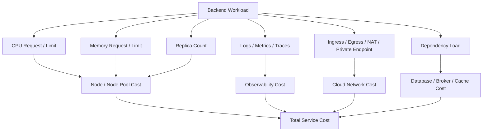
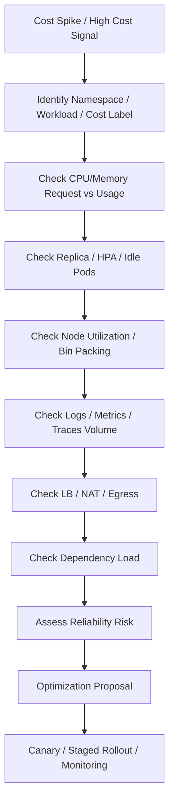

# Part 090 — Cost Operations

## 1. Tujuan Part Ini

Part ini membahas **cost operations Kubernetes** dari sudut pandang senior backend engineer.

Fokusnya bukan menjadikan backend engineer sebagai FinOps owner, tetapi membuat backend engineer mampu:

- membaca sumber biaya yang dipengaruhi workload backend
- membedakan cost waste vs reliability buffer
- memahami dampak CPU/memory request terhadap node utilization dan scheduling
- menghindari overprovisioning yang tidak punya justification
- menghindari underprovisioning yang menyebabkan incident
- memahami biaya observability: logs, metrics, traces, retention, cardinality
- memahami biaya cloud networking: load balancer, NAT, egress, private endpoint
- mereview PR Kubernetes dari sisi reliability-cost trade-off
- berdiskusi dengan platform/SRE/FinOps/security menggunakan data, bukan opini

Cost operations bukan aktivitas memangkas resource secara buta. Dalam production enterprise, cost harus dioptimalkan dalam batas **SLO, security, compliance, recoverability, dan operability**.

---

## 2. Cost Mental Model

Biaya Kubernetes workload tidak hanya berasal dari pod.



Backend engineer memengaruhi cost lewat:

- resource request/limit
- replica count
- HPA min/max
- connection pool and concurrency
- log volume
- metric label cardinality
- trace sampling
- retry behavior
- timeout configuration
- cache usage
- batch schedule
- deployment strategy
- dependency usage pattern

---

## 3. Reliability-Cost Principle

Cost optimization yang buruk akan menciptakan incident.

Prinsip:

```text
Optimize waste, not safety margin.
```

Yang boleh dipertanyakan:

- request jauh di atas usage historis tanpa alasan
- idle replica terlalu banyak untuk service non-critical
- log volume besar tanpa nilai debugging
- high-cardinality metrics tidak terkendali
- trace sampling terlalu tinggi untuk endpoint high-volume
- HPA max terlalu tinggi tanpa dependency budget
- load balancer dibuat per service tanpa kebutuhan
- NAT egress mahal karena routing salah

Yang tidak boleh dipangkas sembarangan:

- min replica untuk service critical
- memory headroom JVM
- PDB/availability buffer
- multi-zone redundancy
- observability minimum untuk incident response
- security controls
- compliance audit retention
- DR/backup requirement

---

## 4. Backend Engineer Responsibility

Backend engineer bertanggung jawab untuk:

- membuat resource request yang berbasis evidence
- memastikan limit tidak menyebabkan throttling/OOM incident
- menghapus resource waste yang jelas
- memastikan replica min/max punya justifikasi
- memahami cost impact dari connection pool/concurrency
- mengontrol log volume dan sensitive logging
- mengontrol metric cardinality dari aplikasi
- memilih trace sampling yang realistis
- menghindari retry storm yang memperbesar cost dependency
- menyusun PR review dengan trade-off reliability vs cost

Backend engineer tidak biasanya bertanggung jawab penuh untuk:

- cloud contract/pricing
- cluster-wide node pool strategy
- reserved instance/savings plan
- enterprise FinOps policy
- shared observability platform pricing
- network billing architecture

Namun backend engineer harus tahu perilaku aplikasinya yang mendorong biaya.

---

## 5. Platform/SRE/FinOps Responsibility

Platform/SRE/FinOps biasanya memiliki tanggung jawab untuk:

- node pool right-sizing
- bin packing strategy
- cluster autoscaler/Karpenter policy
- namespace quota/LimitRange
- cost allocation labels
- shared load balancer strategy
- observability retention policy
- log/metric/tracing ingestion control
- cloud NAT/egress architecture
- chargeback/showback dashboard
- reserved capacity planning

Backend engineer harus menyediakan data:

```text
Service:
Namespace:
Owner:
Criticality:
Current resource request/limit:
Actual usage p50/p95/p99:
Replica min/max:
SLO target:
Incident history:
Load test evidence:
Known safety margin:
Optimization proposal:
Risk:
Rollback plan:
```

---

## 6. Major Kubernetes Cost Drivers

| Cost driver | Dipengaruhi backend engineer? | Catatan |
|---|---:|---|
| CPU request | Ya | memengaruhi scheduling dan node allocation |
| Memory request | Ya | sering menjadi driver utama node cost |
| Replica count | Ya | steady-state cost dan dependency pressure |
| HPA min/max | Ya | min = baseline cost, max = possible burst cost |
| CPU limit | Ya | memengaruhi throttling; tidak langsung menurunkan cost jika request tetap |
| Memory limit | Ya | safety boundary; terlalu rendah menyebabkan OOM |
| Ephemeral storage | Ya | log/temp/file workload cost dan eviction risk |
| Load balancer | Kadang | sering platform-owned tapi dipicu ingress/service design |
| NAT/egress | Kadang | dipicu call pattern dan routing dependency |
| Logs | Ya | app logging volume bisa sangat mahal |
| Metrics | Ya | cardinality bisa meledak |
| Traces | Ya | sampling dan span cardinality |
| Database/broker/cache load | Ya | query, retry, concurrency, pool, cache behavior |

---

## 7. CPU Request Waste

CPU request menentukan CPU yang dipesan untuk scheduling.

Jika CPU request terlalu tinggi:

- pod sulit di-binpack
- node utilization rendah
- cluster butuh node lebih banyak
- cost naik walaupun CPU usage rendah

Jika CPU request terlalu rendah:

- HPA CPU calculation bisa misleading
- workload bisa mengalami contention
- latency spike lebih mudah terjadi
- capacity planning tidak predictable

Review pattern:

```text
CPU request = 2 cores
CPU usage p95 = 300m
CPU usage p99 = 500m
CPU throttling = none
Latency = stable
```

Ini kandidat right-sizing, tetapi harus tetap cek:

- peak season
- deployment warm-up
- GC spike
- batch window
- traffic growth
- incident history
- SLO sensitivity

Safe command:

```bash
kubectl top pod -n <namespace> -l app.kubernetes.io/name=<service>
kubectl describe pod -n <namespace> <pod-name>
kubectl describe hpa -n <namespace> <hpa-name>
```

---

## 8. Memory Request Waste

Memory request sering lebih mahal daripada CPU karena memory lebih sulit di-overcommit secara aman.

Jika memory request terlalu tinggi:

- node bin packing buruk
- banyak memory idle
- cost naik stabil

Jika memory limit terlalu rendah:

- OOMKilled
- JVM crash
- request failure
- rollout instability

Untuk Java service, jangan menyimpulkan waste hanya dari heap usage. Lihat container RSS dan native memory.

Checklist:

- memory usage p95/p99
- heap used after GC
- non-heap/metaspace
- direct memory
- thread count
- GC behavior
- RSS vs heap gap
- OOM history
- traffic peak
- soak test result

Cost optimization yang aman biasanya dilakukan bertahap:

```text
current memory request: 2Gi
observed p99 usage: 900Mi
proposed request: 1.25Gi
memory limit: tetap dengan headroom yang cukup
validation: canary + dashboard + rollback plan
```

---

## 9. Overprovisioning vs Safety Buffer

Tidak semua idle capacity adalah waste.

| Idle capacity type | Waste? | Reasoning |
|---|---:|---|
| Critical API min replicas untuk HA | Tidak selalu | menjaga availability |
| Memory headroom JVM | Tidak selalu | mencegah OOM/GC pressure |
| CPU headroom untuk burst | Tidak selalu | menjaga latency |
| Replica idle untuk non-critical service | Mungkin | cek traffic dan SLO |
| Huge request tanpa evidence | Ya | mengurangi bin packing |
| Debug log volume tinggi permanen | Ya | observability cost waste |
| HPA max tidak realistis | Ya | risiko runaway capacity/dependency cost |

Pertanyaan yang benar:

```text
Apakah buffer ini punya fungsi reliability yang jelas dan evidence historis?
```

Bukan:

```text
Kenapa usage tidak selalu mendekati 100%?
```

Production workload yang sehat tidak seharusnya selalu berjalan di 100%.

---

## 10. Underprovisioning Cost

Underprovisioning terlihat murah sampai menjadi incident.

Biaya tersembunyi:

- latency tinggi
- request timeout
- retry storm
- dependency overload
- lost productivity saat incident
- rollback/recovery cost
- customer impact
- SLA/SLO violation
- operational fatigue

Contoh underprovisioning:

- CPU request terlalu rendah sehingga HPA scale calculation buruk
- memory limit terlalu dekat dengan JVM heap
- min replica terlalu rendah untuk service cold-start Java
- DB pool terlalu kecil sehingga request queueing
- consumer concurrency terlalu rendah sehingga backlog tumbuh
- log sampling terlalu rendah sehingga incident tidak bisa dianalisis

Cost optimization harus menghindari "cheapest unstable system".

---

## 11. Idle Replica Cost

Replica idle bisa justified atau waste.

Justified jika:

- service critical user-facing
- cold start Java lambat
- traffic spike cepat
- HPA metric lag tinggi
- pod warm-up mahal
- availability requires multi-zone replicas
- PDB/upgrade needs buffer

Potential waste jika:

- service non-critical
- traffic sangat rendah dan predictable
- batch-only workload berjalan sebagai Deployment idle
- consumer idle tanpa backlog dan tidak butuh hot standby
- min replica tinggi karena historical default, bukan evidence

Review:

```bash
kubectl get deploy,hpa,pdb -n <namespace> -l app.kubernetes.io/name=<service>
kubectl top pod -n <namespace> -l app.kubernetes.io/name=<service>
```

Pertanyaan:

- Berapa traffic normal malam/weekend?
- Apakah scale-to-zero diperbolehkan untuk workload ini?
- Apakah cold start acceptable?
- Apakah ada operational requirement minimum replica?
- Apakah PDB butuh replica minimum tertentu?

---

## 12. Node Utilization and Bin Packing

Backend engineer tidak mengatur bin packing secara langsung, tetapi resource request workload memengaruhi bin packing.

Jika banyak workload punya request terlalu besar:

```text
Node allocatable: 8 CPU, 32Gi memory
Pod A request: 3 CPU, 12Gi
Pod B request: 3 CPU, 12Gi
Sisa: 2 CPU, 8Gi
Banyak pod kecil tidak muat karena fragmentasi resource
```

Cost impact:

- node utilization rendah
- autoscaler menambah node lebih sering
- pending pod muncul walau usage aktual rendah
- cluster tampak mahal tapi tidak efisien

Yang perlu dicek:

- request vs usage
- namespace quota
- node allocatable
- pod placement
- topology spread
- affinity/anti-affinity
- taints/tolerations
- large pod footprint

---

## 13. HPA Cost Operations

HPA memengaruhi biaya lewat minReplicas dan maxReplicas.

### Min replicas

Min replicas adalah biaya baseline.

```text
baselineCost ≈ minReplicas * resourceRequest * runtimeHours
```

### Max replicas

Max replicas adalah potensi biaya saat spike.

Tetapi juga potensi dependency load.

Checklist HPA cost:

- Apakah min replica sesuai criticality?
- Apakah max replica sesuai dependency budget?
- Apakah scaling policy terlalu agresif?
- Apakah stabilization window mencegah flapping?
- Apakah scale-down terlalu lambat sehingga cost tinggi?
- Apakah scale-up terlalu lambat sehingga incident risk tinggi?
- Apakah custom metric punya biaya ingestion tinggi?

Anti-pattern:

```text
minReplicas tinggi karena takut scale-up lambat,
tetapi startup time service sebenarnya bisa diperbaiki.
```

---

## 14. Load Balancer Cost

Di cloud Kubernetes, Service type LoadBalancer atau Ingress design dapat memicu cloud load balancer cost.

Cost drivers:

- jumlah load balancer
- data processed
- listener/rule count
- cross-zone traffic
- idle LB untuk environment rendah
- public vs internal LB
- per-service LB anti-pattern

Backend engineer perlu cek:

- Apakah service butuh external exposure?
- Apakah cukup lewat shared ingress/API gateway?
- Apakah internal service tidak sengaja memakai LoadBalancer?
- Apakah dev/test environment membuat LB mahal?
- Apakah route/path bisa digabung dengan ingress standard?

Internal verification:

- ingress architecture
- ALB/NLB/App Gateway usage
- owner label/cost label
- environment-specific exposure
- platform standard

---

## 15. NAT and Egress Cost

NAT dan egress bisa menjadi biaya besar untuk workload yang banyak memanggil dependency eksternal.

Cost drivers:

- outbound traffic ke internet
- NAT Gateway data processing
- cross-AZ egress
- cross-region calls
- public endpoint untuk cloud services yang seharusnya private endpoint
- high-volume logs/telemetry keluar VPC/VNet
- retry storm ke external dependency

Backend engineer perlu memahami:

- dependency endpoint public atau private?
- apakah traffic melewati NAT?
- apakah private endpoint/VPC endpoint/Azure Private Link tersedia?
- apakah NO_PROXY salah sehingga internal traffic lewat proxy?
- apakah retry policy memperbesar egress?
- apakah payload terlalu besar?

Safe investigation:

```text
Cek dependency endpoint config.
Cek DNS resolution target.
Cek egress path dengan platform/network team.
Cek retry volume dan error rate.
Cek dashboard NAT/egress jika tersedia.
```

---

## 16. Log Cost Operations

Log cost sering naik karena aplikasi terlalu verbose.

Drivers:

- DEBUG log aktif di production
- logging payload besar
- stack trace berulang
- retry loop menghasilkan log storm
- health check terlalu banyak dilog
- consumer log per message
- correlation context terlalu besar
- PII/sensitive data membutuhkan handling mahal
- long retention tanpa tiering

Guideline:

| Log type | Production rule |
|---|---|
| Error | harus actionable |
| Warn | harus berarti degradation/risk |
| Info | high-signal lifecycle/business event |
| Debug | off by default atau sampled |
| Payload | jangan log penuh kecuali aman dan terbatas |
| Health check | jangan noisy |

Observability trade-off:

```text
Terlalu sedikit log: incident sulit dianalisis.
Terlalu banyak log: cost tinggi dan signal tenggelam.
```

---

## 17. Metrics Cost Operations

Metrics cost dipengaruhi oleh jumlah time series, scrape interval, retention, dan label cardinality.

High-cardinality labels yang berbahaya:

- userId
- sessionId
- requestId
- traceId
- orderId
- quoteId
- customerId
- raw URL path dengan ID
- exception message unik
- dynamic SQL label

Contoh buruk:

```text
http_requests_total{path="/quotes/123456/items/987"}
```

Lebih aman:

```text
http_requests_total{route="/quotes/{quoteId}/items/{itemId}"}
```

Backend engineer harus mereview:

- metric naming
- label cardinality
- histogram buckets
- scrape interval
- custom metric necessity
- HPA metric stability
- dashboard query cost

---

## 18. Trace Cost Operations

Tracing sangat berguna, tetapi span volume bisa mahal.

Cost drivers:

- sampling terlalu tinggi untuk high-volume endpoints
- span terlalu banyak per request
- attribute cardinality tinggi
- messaging trace fan-out
- database span dengan raw query bernilai tinggi kardinalitas
- error storm membuat trace volume naik

Praktik aman:

- gunakan sampling policy per endpoint/traffic class
- retain error traces lebih tinggi daripada success traces
- hindari PII dalam span attributes
- gunakan route template, bukan raw path
- batasi attribute high-cardinality
- pastikan trace ID tetap masuk log untuk korelasi

Trace cost tidak boleh dipangkas sampai menghilangkan kemampuan RCA.

---

## 19. Dependency Cost

Aplikasi backend dapat menaikkan biaya dependency.

### PostgreSQL

Cost naik karena:

- query tidak efisien
- connection pool terlalu besar
- retry storm
- long transaction
- lock contention
- read query tidak memakai cache
- batch job berjalan di jam peak

### Kafka/RabbitMQ

Cost naik karena:

- message terlalu besar
- retry/DLQ storm
- consumer lambat
- partition/queue design buruk
- over-scaling consumer
- duplicate events

### Redis

Cost naik karena:

- key cardinality tinggi
- TTL tidak benar
- cache value besar
- cache miss storm
- eviction akibat memory pressure

### Camunda

Cost naik karena:

- process/job retry storm
- worker timeout terlalu pendek
- incident volume tinggi
- polling terlalu agresif
- process design terlalu chatty

---

## 20. Cost of Rollout Strategies

Deployment strategy juga punya cost.

| Strategy | Cost impact | Operational trade-off |
|---|---|---|
| Rolling update | surge sementara | umum dan relatif murah |
| Canary | parallel small capacity | mengurangi blast radius |
| Blue-green | double environment | rollback cepat tapi mahal |
| Shadow traffic | duplicate processing | observability tinggi tapi mahal |
| Feature flag | minimal infra extra | butuh app governance |

Blue-green bisa menggandakan cost sementara:

```text
blue replicas: 20
 green replicas: 20
 DB connections per pod: 10
 total possible DB connections: 400
```

Cost bukan alasan menolak blue-green, tetapi harus ada justifikasi reliability dan rollback speed.

---

## 21. Environment Cost: Dev, Test, Staging, Production

Non-production sering menjadi sumber waste.

Common issues:

- dev namespace replica sama seperti production
- staging selalu full-size walau jarang dipakai
- preview environment tidak dihapus
- ephemeral environment membuat LB/PVC/secret/log cost
- test job meninggalkan PVC atau object mahal
- debug logging aktif permanen
- HPA min replica terlalu tinggi di non-prod

Optimization ideas:

- schedule down non-prod di luar jam kerja jika acceptable
- lower min replica untuk non-critical env
- TTL untuk preview environment
- cleanup CronJob untuk resource sementara
- shared ingress untuk non-prod
- retention log lebih pendek
- explicit cost label

Tetap cek: test/performance environment mungkin memang harus production-like saat validasi release.

---

## 22. Cost-Aware Observability Minimum

Jangan menghapus observability agar murah. Tentukan minimum.

Minimum untuk service production:

- error rate
- request rate
- latency p95/p99
- CPU/memory/restart
- JVM heap/GC
- dependency latency/error
- DB pool metrics
- queue lag/queue depth jika consumer
- deployment marker
- trace sampling untuk critical path
- logs dengan correlation ID
- alerts linked to runbook

Yang bisa dioptimasi:

- debug log volume
- duplicate metrics
- high-cardinality label
- overly granular histogram
- excessive trace attributes
- long retention untuk low-value data

---

## 23. Cost Investigation Workflow



Data yang harus dikumpulkan:

- cost attribution by namespace/service/team
- request vs usage p50/p95/p99
- replica history
- HPA scale events
- node utilization
- log ingestion volume
- metric cardinality
- trace volume
- egress/NAT traffic
- load balancer inventory
- dependency usage
- incident/SLO history

---

## 24. Safe Optimization Patterns

### Pattern 1: Right-size request gradually

```text
Current request: 2 CPU / 4Gi
Observed p99: 600m / 1.4Gi
Proposal: 1 CPU / 2.5Gi
Rollout: canary or one service first
Validation: latency, throttling, memory, OOM, HPA
```

### Pattern 2: Reduce idle non-critical replicas

```text
Current minReplicas: 4
Traffic: near zero outside business hours
Proposal: minReplicas 2 or scheduled scale down
Validation: cold start, SLA, on-call expectation
```

### Pattern 3: Reduce log noise

```text
Current: per-message info log for high-volume consumer
Proposal: aggregate periodic log + error detail + metrics
Validation: incident debugging still possible
```

### Pattern 4: Fix cardinality

```text
Current: metric label includes quoteId/orderId
Proposal: route/template/status/category labels only
Validation: dashboards still answer operational questions
```

### Pattern 5: Reduce egress through private endpoints

```text
Current: cloud service access via public endpoint/NAT
Proposal: private endpoint/VPC endpoint if platform-approved
Validation: DNS, security, latency, cost
```

---

## 25. Dangerous Optimization Patterns

- Menurunkan memory limit Java tanpa memahami heap/native memory.
- Menurunkan min replica service critical menjadi 1.
- Menghapus PDB untuk memudahkan bin packing.
- Menghapus logs/traces yang dibutuhkan untuk incident RCA.
- Menurunkan HPA max tanpa memahami traffic peak.
- Mengurangi DB pool terlalu jauh sehingga latency naik.
- Memindahkan semua traffic ke satu zone agar murah.
- Menghapus NetworkPolicy/security control atas nama cost.
- Menonaktifkan alerts karena noisy tanpa memperbaiki noise source.
- Mengubah production sizing tanpa canary/monitoring/rollback plan.

Cost optimization harus memiliki rollback condition.

---

## 26. Java/JAX-RS Cost Considerations

Java service punya cost profile khas:

- startup lebih lambat dibanding lightweight runtime
- memory baseline JVM lebih tinggi
- heap headroom diperlukan
- GC behavior memengaruhi CPU dan latency
- thread-per-request model bisa mahal jika blocking IO tinggi
- JSON serialization/deserialization bisa CPU-heavy
- connection pool per replica memperbesar dependency cost

Optimization options:

- tune JVM heap ratio
- reduce unnecessary thread pools
- optimize expensive endpoints
- reduce payload size
- cache carefully
- avoid chatty downstream calls
- tune DB queries
- reduce reflection-heavy hot path jika terbukti mahal
- improve startup time agar min replica bisa lebih realistis

Jangan langsung menyalahkan Kubernetes jika cost Java tinggi. Kadang sumber cost adalah application behavior.

---

## 27. Cost and Retry Storm

Retry storm adalah cost amplifier.

Saat dependency lambat/error:

```text
request fails -> retry -> more load -> dependency slower -> more retry -> cost and incident grow
```

Cost impact:

- CPU naik
- outbound traffic naik
- log volume naik
- trace volume naik
- DB/broker/API usage naik
- queue backlog naik
- HPA scale-up bisa menambah pressure

Review retry policy:

- max retry
- backoff
- jitter
- timeout
- circuit breaker
- idempotency
- DLQ behavior
- alert on retry rate

Cost-aware reliability sering berarti membatasi retry, bukan menambah replica.

---

## 28. Cost and Security/Compliance

Security dan compliance controls punya cost, tetapi tidak bisa dipangkas sembarangan.

Contoh:

- audit logs
- image scanning
- admission policy
- secret rotation
- network isolation
- private endpoints
- encryption/KMS
- compliance retention
- vulnerability scanning

Backend engineer harus membedakan:

```text
Security cost with compliance value
vs
Operational waste caused by poor configuration
```

Misalnya:

- audit retention mandatory bukan waste
- debug logs berisi payload besar bukan compliance requirement
- private endpoint mungkin menaikkan fixed cost tetapi menurunkan egress/security risk
- image scanning delay bukan alasan bypass pipeline

---

## 29. PR Review Checklist

Saat mereview PR dari sisi cost:

- Apakah resource request/limit berubah?
- Apakah perubahan punya evidence usage/load test?
- Apakah HPA min/max berubah?
- Apakah replica count naik?
- Apakah rollout strategy menambah surge besar?
- Apakah blue-green/canary menambah parallel capacity?
- Apakah DB/HTTP/Redis/Kafka/RabbitMQ pool berubah?
- Apakah logging level berubah?
- Apakah metric label baru high-cardinality?
- Apakah trace span/attribute baru high-cardinality?
- Apakah endpoint baru memanggil dependency mahal?
- Apakah retry policy berubah?
- Apakah batch schedule berubah ke jam peak?
- Apakah Service/Ingress menciptakan load balancer baru?
- Apakah ada PVC/storage baru?
- Apakah cost label/owner label tetap lengkap?
- Apakah rollback plan jelas?

---

## 30. Internal Verification Checklist

Gunakan checklist ini untuk konteks internal CSG/team. Jangan mengasumsikan jawabannya tanpa verifikasi.

### Cost ownership

- Apakah ada cost allocation label standard?
- Apakah namespace punya owner/team label?
- Apakah service punya owner/cost center?
- Apakah ada chargeback/showback dashboard?
- Apakah cost dibahas di review rutin?

### Resource and replica

- CPU request vs usage p50/p95/p99
- Memory request vs usage p50/p95/p99
- CPU throttling
- OOMKilled history
- HPA min/max
- replica history
- idle replicas
- PDB/min availability requirement
- non-prod sizing policy

### Node and platform

- node utilization
- bin packing issue
- node pool mapping
- cluster autoscaler behavior
- Karpenter/AKS autoscaler if used
- quota/LimitRange
- zone spread
- cloud quota

### Observability

- log ingestion volume per service
- log retention
- DEBUG logs in production
- metric cardinality
- custom metric cost
- trace sampling
- trace retention
- dashboard query cost
- alert noise

### Network and cloud services

- load balancer inventory
- NAT gateway usage
- egress traffic
- private endpoint/VPC endpoint usage
- cross-zone/cross-region traffic
- proxy path
- external dependency calls

### Dependency cost

- PostgreSQL CPU/IO/connections driven by service
- Kafka topic/message volume
- RabbitMQ queue/retry/DLQ volume
- Redis memory/key count/eviction
- Camunda job/retry/incident volume
- downstream HTTP API volume

---

## 31. Operational Metrics for Cost Review

Minimum metrics:

```text
kube_pod_container_resource_requests
kube_pod_container_resource_limits
container_cpu_usage_seconds_total
container_memory_working_set_bytes
container_cpu_cfs_throttled_seconds_total
kube_deployment_status_replicas
kube_hpa_status_current_replicas
kube_hpa_status_desired_replicas
kube_pod_container_status_restarts_total
```

Application metrics:

```text
http_server_requests_seconds
jvm_memory_used_bytes
jvm_gc_pause_seconds
hikaricp_connections_active
hikaricp_connections_pending
kafka_consumer_lag
rabbitmq_queue_messages_ready
redis_command_latency
camunda_job_backlog
```

Cost-specific platform metrics depend on internal stack. Verify with platform/FinOps team.

---

## 32. Decision Framework

Gunakan decision table berikut saat mengusulkan cost optimization.

| Question | Yes | No |
|---|---|---|
| Ada evidence waste? | lanjut analisis | jangan ubah hanya karena feeling |
| Ada SLO/criticality impact? | butuh review lebih ketat | bisa eksperimen bertahap |
| Ada incident history terkait resource? | hati-hati | lebih aman right-size |
| Ada load test/production baseline? | gunakan sebagai dasar | kumpulkan evidence dulu |
| Bisa canary/staged rollout? | lakukan bertahap | risiko tinggi |
| Ada rollback path? | lanjut | jangan deploy perubahan |
| Perlu platform/security approval? | eskalasi | lanjut sesuai ownership |

---

## 33. Cost Optimization Proposal Template

```text
Service:
Namespace:
Owner:
Criticality:

Current cost driver:
- CPU request:
- Memory request:
- Replicas/HPA:
- Logs/metrics/traces:
- Network/LB/NAT:
- Dependency load:

Evidence:
- Usage p50/p95/p99:
- Traffic baseline:
- SLO status:
- Incident history:
- Load test:

Proposed change:
- Kubernetes manifest change:
- Runtime config change:
- Observability change:
- Dependency/config change:

Expected benefit:
- Cost reduction:
- Node utilization improvement:
- Log/metric/trace reduction:

Risk:
- Latency:
- OOM/throttling:
- Availability:
- Debuggability:
- Security/compliance:

Validation:
- Canary/staged rollout:
- Dashboard:
- Alert:
- Rollback condition:
- Owner approval:
```

---

## 34. Anti-Patterns

- Menganggap cost rendah berarti sistem efisien.
- Menjalankan semua service dengan template resource yang sama.
- Menurunkan resource tanpa membaca p95/p99 dan peak.
- Menilai Java memory hanya dari heap.
- Menurunkan replica tanpa mempertimbangkan cold start.
- Mengaktifkan debug log permanen di production.
- Membuat metric label dari business ID.
- Menyimpan trace attribute berisi high-cardinality data.
- Membuat LoadBalancer per service internal.
- Mengabaikan NAT/egress cost dari retry storm.
- Menghapus observability sampai RCA tidak mungkin.
- Mengoptimasi biaya non-prod tetapi mematahkan release validation.

---

## 35. Ringkasan

Cost operations untuk Kubernetes backend service adalah disiplin menjaga biaya tetap rasional tanpa merusak reliability, observability, security, dan operability.

Backend engineer yang matang tidak hanya bertanya:

```text
Bagaimana menurunkan CPU request?
```

Tetapi bertanya:

```text
Resource, replica, observability, network, dan dependency cost mana yang benar-benar waste, mana yang merupakan safety buffer, dan bagaimana mengubahnya secara bertahap dengan evidence, canary, monitoring, dan rollback plan?
```

Cost optimization terbaik bukan yang paling agresif, tetapi yang paling defensible secara production.
