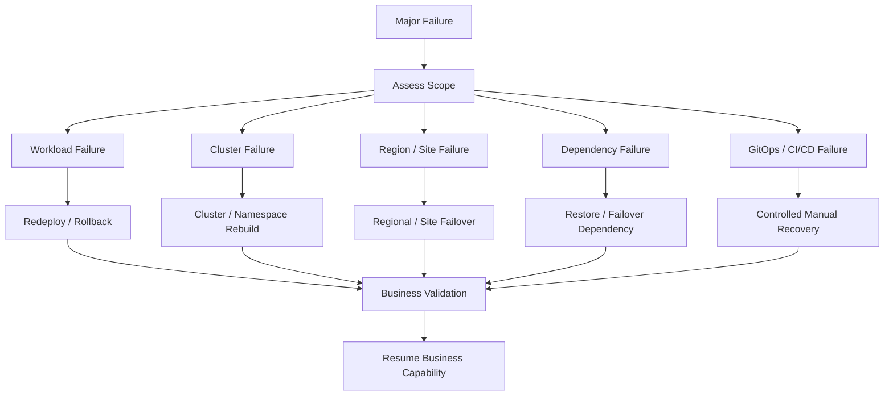
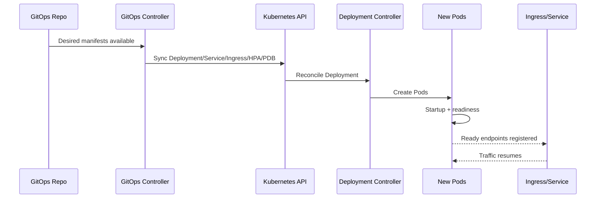

# Part 091 — Disaster Recovery and Business Continuity

## 1. Tujuan Part Ini

Part ini membahas **Disaster Recovery (DR)** dan **Business Continuity (BCP)** untuk backend services yang berjalan di Kubernetes.

Fokusnya bukan menjadikan backend engineer sebagai owner seluruh strategi DR enterprise. Fokusnya adalah membuat backend engineer mampu:

- memahami apa yang harus dipulihkan ketika workload, namespace, cluster, region, dependency, atau pipeline gagal
- membedakan recovery aplikasi, recovery Kubernetes object, recovery data, recovery secret, dan recovery dependency
- membaca RPO/RTO sebagai constraint engineering, bukan dokumen compliance semata
- memastikan service Java/JAX-RS, consumer, worker, batch, dan scheduler punya recovery path yang jelas
- memahami peran GitOps sebagai source of truth untuk rebuild cluster/workload
- mengetahui kapan rollback cukup, kapan restore diperlukan, dan kapan harus failover
- menyiapkan evidence dan checklist yang bisa dipakai saat incident besar

Dalam sistem CPQ, quote management, order management, billing integration, dan telco BSS/OSS, DR bukan hanya soal "cluster hidup kembali". DR berarti business capability kritikal seperti quote creation, order submission, order orchestration, billing handoff, workflow completion, dan message processing bisa dipulihkan dalam batas waktu dan data loss yang disepakati.

---

## 2. DR vs BCP Mental Model

**Disaster Recovery** berfokus pada pemulihan sistem setelah failure besar.

**Business Continuity** berfokus pada bagaimana business process tetap berjalan atau punya jalur alternatif saat sistem terganggu.



Kubernetes DR harus dilihat sebagai beberapa lapisan:

| Layer | Contoh aset | Recovery concern |
|---|---|---|
| Workload state | Deployment, Service, Ingress, HPA, PDB | Bisa di-recreate dari GitOps? |
| Runtime state | Pod, ReplicaSet, EndpointSlice, Events | Tidak perlu dibackup; hasil reconciliation |
| Configuration state | ConfigMap, values, overlays | Source of truth jelas? |
| Secret state | Kubernetes Secret, external secret reference | Bisa dipulihkan tanpa leakage? |
| Data state | PostgreSQL, Kafka, RabbitMQ, Redis persistence | Backup, restore, replication, consistency |
| Identity state | ServiceAccount, IAM role, federated credential | Bisa di-recreate dan tetap least privilege? |
| Network state | Ingress, LB, DNS, private endpoint | DNS/failover propagation dan validation |
| Observability state | dashboards, alerts, runbooks | Bisa melihat recovery progress? |
| Pipeline state | CI/CD, GitOps controller, registry | Bisa deploy saat pipeline degraded? |

Prinsip utama: **jangan menganggap backup cluster sama dengan backup business capability**.

---

## 3. RPO dan RTO sebagai Constraint Engineering

Dua istilah utama:

- **RPO (Recovery Point Objective)**: toleransi kehilangan data maksimum.
- **RTO (Recovery Time Objective)**: toleransi waktu maksimum sampai layanan pulih.

Contoh interpretasi operasional:

| Capability | RPO implication | RTO implication |
|---|---|---|
| Quote creation | Berapa quote draft boleh hilang? | Berapa lama sales/order flow boleh berhenti? |
| Order submission | Kehilangan order biasanya sangat kritikal | Recovery harus cepat dan tervalidasi |
| Billing handoff | Data mismatch dapat berdampak revenue | Recovery perlu reconciliation |
| Kafka/RabbitMQ processing | Offset/message loss harus dipahami | Consumer recovery harus aman terhadap duplicate |
| Camunda workflow | Incident/workflow state harus recoverable | Worker dapat restart tanpa corrupt process |
| Batch reconciliation | Bisa re-run jika idempotent | RTO bisa lebih panjang, tergantung business SLA |

RPO/RTO bukan hanya angka dari dokumen. Angka itu harus diterjemahkan ke:

- backup frequency
- replication mode
- transaction durability
- message retention
- idempotency design
- replay capability
- reconciliation job
- restore drill
- runbook step
- validation query
- user/business communication

---

## 4. Backend Engineer Responsibility

Backend engineer bertanggung jawab memastikan service yang dimiliki punya recovery behavior yang benar.

Tanggung jawab utama:

- memahami business capability yang dilayani service
- memahami state yang dimiliki atau disentuh service
- memastikan service stateless bisa direcreate dari manifest/GitOps
- memastikan stateful interaction aman terhadap retry, duplicate, dan partial failure
- memastikan idempotency untuk command, consumer, worker, dan batch recovery
- memastikan connection retry tidak menciptakan storm setelah dependency kembali pulih
- memastikan readiness tidak hijau sebelum service benar-benar siap melayani traffic
- memastikan graceful shutdown menghindari kehilangan in-flight request/message/job
- memastikan observability cukup untuk melihat recovery progress
- memastikan runbook service menjelaskan rollback, redeploy, replay, reconciliation, dan escalation

Backend engineer biasanya bukan owner utama:

- cluster backup platform
- cloud region failover
- database physical backup
- Kafka/RabbitMQ cluster replication
- enterprise DNS failover
- IAM/federated identity platform
- corporate BCP policy

Namun backend engineer tetap harus memahami dependency recovery enough to avoid unsafe assumptions.

---

## 5. Platform/SRE Responsibility

Platform/SRE biasanya bertanggung jawab terhadap:

- cluster rebuild procedure
- GitOps bootstrap
- namespace baseline
- ingress/controller recovery
- storage class and CSI recovery
- node pool/node group recovery
- control plane and add-on recovery
- observability platform recovery
- cluster access during disaster
- DR drill coordination
- cloud quota and regional capacity
- backup tooling integration

Backend engineer harus tahu cara berkolaborasi:

- dependency apa yang harus pulih sebelum service bisa sehat
- manifest apa yang menjadi source of truth
- validation apa yang membuktikan service sudah usable
- rollback atau failover apa yang aman dari sisi application state
- data reconciliation apa yang harus dijalankan setelah recovery

---

## 6. Recovery Scope Classification

Saat incident besar, jangan langsung menyebut "DR". Klasifikasikan scope lebih dulu.

| Scope | Gejala | Recovery path umum |
|---|---|---|
| Single pod failure | CrashLoopBackOff, OOMKilled | Fix config/resource/rollback |
| Single workload failure | Deployment unavailable | Rollback/redeploy/fix manifest |
| Namespace failure | Banyak workload dalam namespace gagal | Namespace config/RBAC/quota/NetworkPolicy review |
| Node pool failure | Banyak pod Pending/evicted | Platform recovery, reschedule, scale node pool |
| Cluster add-on failure | DNS/Ingress/CSI/CNI issue | Platform/SRE restore add-on |
| Dependency failure | DB/broker/cache unavailable | Dependency owner failover/restore |
| Region/site failure | External access/data plane down | Regional failover / BCP |
| GitOps/pipeline failure | Cannot deploy/rollback normally | Controlled manual recovery or GitOps restore |
| Registry failure | ImagePullBackOff widespread | Registry recovery/mirror/fallback |

DR runbook harus berbeda per scope. Menggunakan regional failover untuk single bad deployment adalah overreaction. Melakukan pod restart untuk regional dependency outage adalah noise.

---

## 7. Stateless Workload Recovery

Untuk Java/JAX-RS API service yang benar-benar stateless, recovery idealnya sederhana:



Syarat recovery stateless yang sehat:

- image tersedia di registry
- manifest tersedia dari GitOps
- ConfigMap/Secret bisa dipulihkan
- ServiceAccount/RBAC valid
- dependency reachable
- readiness endpoint benar
- HPA/PDB tidak menghalangi recovery
- ingress/service mapping benar
- dashboard dan alert tersedia

Anti-pattern:

- config penting hanya ada di live cluster, tidak di Git/source of truth
- secret manual tanpa recovery process
- image tag mutable tanpa digest/promotion trace
- readiness hijau walau dependency kritikal belum bisa dipakai
- service butuh local file state di container writable layer
- manual kubectl patch yang tidak pernah masuk Git

---

## 8. Stateful and Dependency Recovery Awareness

Backend engineer harus berhati-hati saat dependency stateful terlibat.

Dependency yang sering relevan:

- PostgreSQL
- Kafka
- RabbitMQ
- Redis
- Camunda engine/database
- object storage
- external billing/order system
- cloud secret/config service

Pertanyaan utama:

1. Apakah dependency managed service atau self-managed di Kubernetes?
2. Siapa owner backup/restore?
3. Apakah ada replication atau standby?
4. Apakah restore bersifat point-in-time?
5. Apakah aplikasi aman terhadap duplicate/replay?
6. Apakah ada reconciliation setelah recovery?
7. Apakah ada data ordering requirement?
8. Apakah ada message retention yang cukup untuk replay?
9. Apakah workflow state recoverable?
10. Apakah credential dan identity tetap valid setelah failover?

Backend engineer tidak boleh mengasumsikan "pod restart = data pulih".

---

## 9. GitOps Recovery

GitOps adalah fondasi recovery untuk Kubernetes object.

Yang harus bisa dipulihkan dari Git:

- Namespace baseline jika dikelola GitOps
- Deployment
- Service
- Ingress/Gateway route
- ConfigMap references
- Secret references, bukan secret value mentah
- ServiceAccount
- RBAC
- HPA
- PDB
- NetworkPolicy
- Helm values / Kustomize overlays
- observability config jika dikelola sebagai code

GitOps recovery failure mode:

| Failure mode | Dampak | Mitigasi |
|---|---|---|
| GitOps repo unavailable | Tidak bisa sync/rollback | repo availability, mirror, emergency process |
| GitOps controller down | desired state tidak diterapkan | platform restore controller |
| Drift manual di cluster | recovery menimpa perubahan manual | enforce change through Git |
| Secret not recoverable | pod gagal start | external secret and vault recovery |
| Wrong overlay | deploy ke config environment salah | rendered manifest validation |
| Sync wave salah | dependency object belum siap | sync ordering review |

Dalam DR, GitOps harus menjawab: **kalau cluster kosong, apa yang bisa dibangun ulang secara deterministik?**

---

## 10. Secret Recovery

Secret recovery adalah area sensitif karena menyangkut security dan operability.

Sumber secret dapat berupa:

- Kubernetes Secret manual
- External Secrets Operator
- Secrets Store CSI Driver
- AWS Secrets Manager
- AWS SSM Parameter Store
- Azure Key Vault
- enterprise vault internal
- CI/CD injected secret

Recovery concern:

- secret value tidak boleh disimpan sembarang di Git
- secret reference harus bisa direcreate
- identity yang mengakses secret store harus pulih
- KMS/key permission harus valid
- secret version harus benar
- rotation selama DR harus dikontrol
- pod mungkin perlu restart untuk membaca secret baru
- log/debug tidak boleh membocorkan secret

Secret recovery checklist:

- apakah secret source tersedia?
- apakah ServiceAccount/workload identity bisa mengaksesnya?
- apakah secret version sesuai environment?
- apakah sync controller sehat?
- apakah mounted secret sudah berubah?
- apakah aplikasi perlu restart/reload?
- apakah audit log mencatat akses?

---

## 11. Dependency Recovery Pattern

### PostgreSQL

Hal yang harus dipahami:

- backup frequency
- point-in-time recovery
- primary/replica failover
- connection endpoint berubah atau tetap
- DNS/private endpoint behavior
- connection pool reconnect behavior
- transaction partial failure
- migration compatibility
- reconciliation query

Backend concern:

- idempotency command
- duplicate submit protection
- transaction boundary
- retry safety
- connection pool backoff
- read-after-write expectation

### Kafka

Hal yang harus dipahami:

- topic replication
- retention
- offset storage
- consumer group recovery
- duplicate processing risk
- lag after recovery
- replay plan
- DLQ handling

Backend concern:

- idempotent consumer
- safe offset commit
- graceful shutdown
- poison message handling
- replay and backfill procedure

### RabbitMQ

Hal yang harus dipahami:

- durable queue
- persistent message
- quorum/classic queue behavior
- unacked message behavior after consumer failure
- DLQ/retry exchange
- broker cluster recovery

Backend concern:

- ack/nack correctness
- duplicate redelivery
- prefetch and backpressure
- consumer reconnect

### Redis

Hal yang harus dipahami:

- cache vs source of truth
- persistence mode if any
- failover endpoint
- TTL behavior
- cache warmup
- session/state risk

Backend concern:

- tolerate cache loss
- avoid thundering herd
- fallback behavior
- key namespace compatibility

### Camunda

Hal yang harus dipahami:

- process engine/database recovery
- job timeout/retry
- incidents
- worker restart behavior
- correlation id consistency
- process state reconciliation

Backend concern:

- worker idempotency
- job lock timeout
- retry safety
- incident triage

---

## 12. Multi-AZ and Multi-Region Awareness

Backend engineer perlu memahami perbedaan:

| Pattern | Tujuan | Backend implication |
|---|---|---|
| Multi-AZ | Survive zone failure | pod spread, PDB, dependency zonal resilience |
| Active-passive region | DR failover | DNS switch, data replication lag, warm standby |
| Active-active region | high availability/global scale | conflict resolution, idempotency, routing, consistency |
| Cold standby | cost rendah | RTO lebih panjang, manual restore |
| Warm standby | recovery lebih cepat | perlu periodic validation |

Untuk backend service, pertanyaan penting:

- Apakah service punya zone spreading?
- Apakah dependency juga multi-AZ?
- Apakah PDB mengizinkan maintenance tetapi tetap menjaga availability?
- Apakah message processing aman jika consumer pindah zone/region?
- Apakah DNS failover memengaruhi client timeout/cache?
- Apakah ada data consistency issue saat regional failover?

---

## 13. DR Runbook Skeleton

Template runbook DR minimal:

```mdx
# DR Runbook — <service-name>

## Scope
- Service:
- Namespace:
- Business capability:
- Criticality:
- RPO:
- RTO:

## Owners
- Backend owner:
- Platform/SRE owner:
- Database/dependency owner:
- Security owner:
- Incident commander:

## Preconditions
- Required cluster:
- Required namespace:
- Required secrets:
- Required dependencies:
- Required GitOps apps:

## Detection
- Alerts:
- Dashboards:
- User/business symptom:

## Recovery Decision Tree
1. Is this workload-only failure?
2. Is dependency healthy?
3. Is cluster/network healthy?
4. Is GitOps healthy?
5. Is secret/identity healthy?
6. Is failover required?

## Recovery Steps
- Rollback/redeploy:
- Recreate workload:
- Restore config/secret reference:
- Validate dependency connectivity:
- Resume traffic:

## Validation
- API health:
- business transaction:
- consumer lag:
- workflow completion:
- dependency metrics:
- SLO panels:

## Reconciliation
- replay/backfill:
- duplicate check:
- stuck workflow check:
- data consistency query:

## Communication
- status update:
- customer/internal impact:
- recovery ETA source:

## Evidence
- timeline:
- deployment markers:
- logs:
- metrics:
- traces:
- screenshots/links:

## Post-Recovery
- RCA:
- corrective actions:
- runbook update:
```

---

## 14. Production-Safe Recovery Commands

Safe investigation commands:

```bash
kubectl config current-context
kubectl get ns
kubectl -n <namespace> get deploy,sts,job,cronjob,svc,ing,hpa,pdb
kubectl -n <namespace> get pods -o wide
kubectl -n <namespace> describe deploy <deployment>
kubectl -n <namespace> describe pod <pod>
kubectl -n <namespace> get events --sort-by=.lastTimestamp
kubectl -n <namespace> rollout status deploy/<deployment>
kubectl -n <namespace> get endpointslice
kubectl -n <namespace> get secret,configmap
kubectl -n <namespace> auth can-i get pods --as=system:serviceaccount:<namespace>:<serviceaccount>
```

Potentially dangerous commands requiring explicit approval:

```bash
kubectl delete pod <pod>
kubectl rollout restart deploy/<deployment>
kubectl rollout undo deploy/<deployment>
kubectl apply -f <manifest>
kubectl patch ...
kubectl edit ...
kubectl delete pvc ...
kubectl delete namespace ...
```

During DR, command safety matters more than speed. Wrong-context command can turn degraded system into total outage.

---

## 15. Validation After Recovery

Recovery is not complete when pods are Running.

Validate layers:

| Layer | Validation |
|---|---|
| Kubernetes | deployment available, pods ready, endpoints present |
| Ingress | route resolves, TLS valid, 2xx/expected response |
| Java runtime | JVM stable, no restart loop, heap/GC normal |
| API | health endpoint, representative business endpoint |
| PostgreSQL | pool connected, query latency normal, no connection storm |
| Kafka | consumer group stable, lag decreasing, no rebalance storm |
| RabbitMQ | queue depth decreasing, unacked stable, no redelivery spike |
| Redis | latency normal, cache miss spike understood |
| Camunda | worker active, incidents not increasing, jobs completing |
| Observability | logs/metrics/traces flowing |
| Business | quote/order/billing workflow validated |

A common mistake: declaring recovery after `/health` returns 200 while workflow backlog, consumer lag, or billing handoff is still broken.

---

## 16. Recovery Failure Modes

| Failure mode | Root risk | Detection |
|---|---|---|
| GitOps restored wrong version | wrong commit/overlay | deployment marker, Git SHA mismatch |
| Secret restored wrong version | stale credential | access denied, auth failure |
| Dependency endpoint changed | DNS/private endpoint mismatch | connection timeout/name resolution failure |
| Connection storm after recovery | all pods reconnect simultaneously | DB/broker connection spike |
| Retry storm | dependency returns slowly | high error + high outbound call rate |
| Duplicate message processing | consumer replay without idempotency | duplicate business records/events |
| Cache cold start | Redis cleared/failover | DB spike, latency spike |
| Workflow stuck | Camunda jobs/incidents not recovered | incident count/job backlog |
| Observability missing | cannot validate recovery | no metrics/logs/traces |
| PDB/HPA blocks recovery | insufficient replicas/capacity | pods pending/unavailable |

---

## 17. Internal Verification Checklist

Verify with internal CSG/team context instead of assuming:

### DR and BCP

- What are RPO/RTO targets per product capability?
- Which services are tier-0/tier-1/tier-2?
- Which user journeys must be restored first?
- Is there a formal DR drill schedule?
- Where are DR runbooks stored?

### Kubernetes and GitOps

- Can namespace/workload state be rebuilt from GitOps?
- Which GitOps tool is used: Argo CD, Flux, or other?
- What is the bootstrap process for a new/recovered cluster?
- Are manual cluster changes allowed during DR?
- How are rollback and emergency changes approved?

### Secrets and Identity

- What is the source of truth for secrets?
- Are secrets stored in AWS Secrets Manager, SSM, Azure Key Vault, or internal vault?
- How are IRSA/Azure Workload Identity/federated credentials recovered?
- Is secret rotation paused, accelerated, or controlled during DR?

### Dependencies

- Who owns PostgreSQL backup/restore?
- Who owns Kafka/RabbitMQ/Redis/Camunda recovery?
- What is the restore validation procedure?
- What replay/reconciliation process exists?
- What data consistency checks are required after recovery?

### Network and Access

- How does DNS failover work?
- Are private endpoints used?
- Are firewall/proxy rules environment-specific?
- Are DR clusters allowed to access the same dependencies?
- How is production access handled during disaster?

### Observability and Evidence

- Are DR dashboards available if primary observability stack fails?
- Are logs/metrics/traces retained across incident windows?
- Where is incident evidence stored?
- What timeline format is expected for RCA?

---

## 18. PR Review Checklist

Saat review perubahan Kubernetes yang berdampak DR/BCP, cek:

- Apakah workload tetap recoverable dari GitOps?
- Apakah secret/config source jelas?
- Apakah resource/HPA/PDB tidak menghambat recovery?
- Apakah readiness benar-benar mewakili ability to serve?
- Apakah shutdown aman untuk in-flight request/message/job?
- Apakah dependency timeout/retry aman saat recovery storm?
- Apakah migration kompatibel dengan rollback?
- Apakah consumer/worker idempotent?
- Apakah dashboard dan alert mendukung recovery validation?
- Apakah runbook diperbarui?
- Apakah ada owner dan escalation path?

---

## 19. Operational Readiness Questions

Sebelum service dianggap DR-ready, jawab:

1. Kalau namespace kosong, apakah service bisa dibangun ulang dari GitOps?
2. Kalau pod restart massal, apakah in-flight work aman?
3. Kalau secret rotate, apakah service pulih tanpa manual hack?
4. Kalau dependency failover, apakah service reconnect dengan aman?
5. Kalau Kafka/RabbitMQ replay terjadi, apakah duplicate aman?
6. Kalau Redis kosong, apakah service degrade dengan terkontrol?
7. Kalau database restore point digunakan, apakah ada reconciliation?
8. Kalau GitOps down, apa emergency path yang disetujui?
9. Kalau observability degraded, bagaimana recovery divalidasi?
10. Kalau rollback tidak mungkin karena migration, apa fallback plan?

---

## 20. Ringkasan

Disaster recovery di Kubernetes bukan sekadar backup manifest atau restart pod.

Untuk backend engineer, DR berarti memahami:

- business capability yang harus dipulihkan
- RPO/RTO yang menjadi constraint desain
- workload state vs data state vs secret state
- GitOps sebagai recovery source of truth
- dependency restore dan failover behavior
- idempotency, replay, reconciliation, dan duplicate safety
- recovery validation dari Kubernetes sampai business workflow
- evidence, audit, dan runbook yang siap dipakai saat incident besar

Prinsip akhirnya: **production recovery harus dilatih, diverifikasi, dan didokumentasikan sebelum disaster terjadi**.
