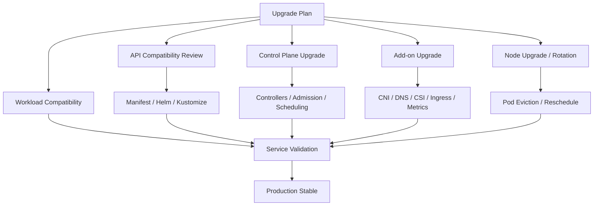
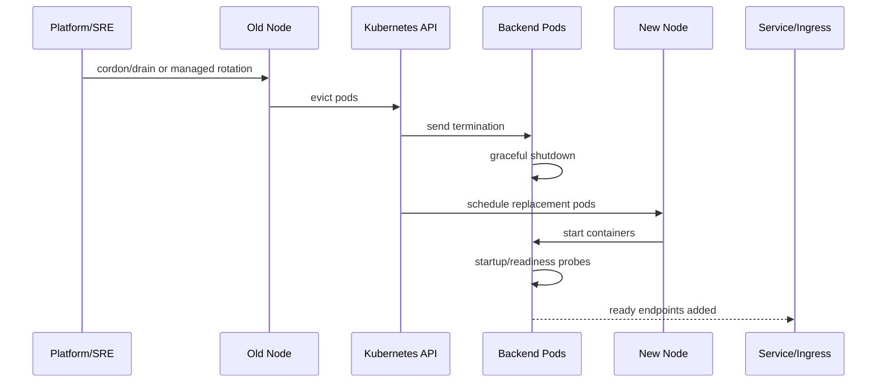
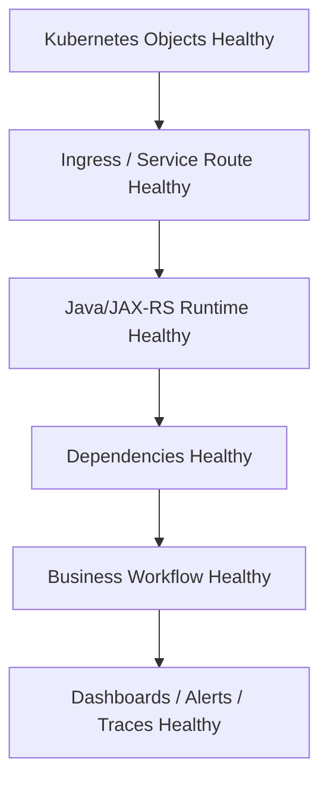
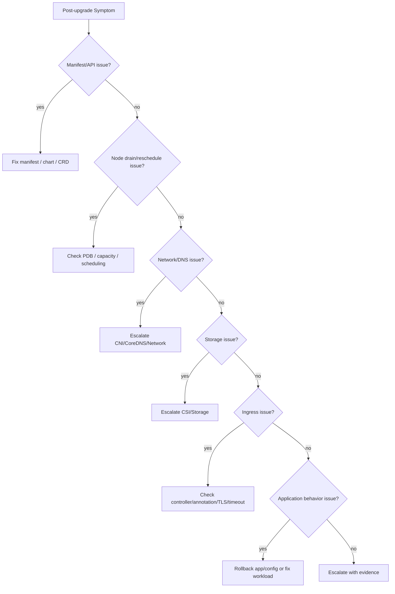

# Part 092 — Kubernetes Upgrade Operations

## 1. Tujuan Part Ini

Part ini membahas **Kubernetes upgrade operations** dari sudut pandang senior backend engineer.

Fokusnya bukan menjadikan backend engineer sebagai cluster administrator. Fokusnya adalah membuat backend engineer mampu:

- memahami dampak upgrade cluster terhadap workload Java/JAX-RS dan dependency integration
- membaca risiko API deprecation pada manifest Deployment, Ingress, HPA, PDB, RBAC, NetworkPolicy, dan custom resources
- memahami perbedaan control plane upgrade, node upgrade, add-on upgrade, dan workload compatibility
- menyiapkan service agar aman saat node drain, pod reschedule, rolling disruption, dan ingress/controller change
- melakukan pre-upgrade review terhadap manifest, Helm chart, Kustomize overlay, probes, PDB, HPA, resources, dan observability
- melakukan post-upgrade validation berbasis evidence, bukan hanya "pods running"
- tahu kapan harus eskalasi ke platform/SRE/security/vendor

Dalam enterprise Kubernetes, upgrade bukan aktivitas kosmetik. Upgrade dapat mengubah API behavior, scheduling behavior, CNI networking, CSI storage, ingress behavior, metrics pipeline, security admission, dan node runtime behavior. Untuk backend engineer, akibatnya terlihat sebagai pod restart, traffic error, DNS failure, mount failure, latency spike, consumer rebalance, atau service unavailable.

---

## 2. Upgrade Mental Model

Kubernetes upgrade adalah perubahan pada beberapa layer runtime.



Upgrade dapat memengaruhi:

- Kubernetes API versions
- admission controller behavior
- scheduler behavior
- kubelet behavior
- container runtime behavior
- CNI networking
- CoreDNS
- kube-proxy/IPVS/eBPF behavior
- CSI storage
- ingress controller
- metrics server/custom metrics
- cloud controller integration
- autoscaler behavior
- node image/kernel/runtime

Prinsip utama: **backend engineer tidak perlu mengoperasikan semua layer, tetapi harus tahu layer mana yang dapat menjelaskan symptom aplikasi.**

---

## 3. Jenis Upgrade yang Harus Dibedakan

| Upgrade type | Owner umum | Dampak ke backend workload |
|---|---|---|
| Control plane upgrade | Platform/cloud provider | API behavior, admission, controller compatibility |
| Node upgrade | Platform/SRE | pod eviction, restart, rescheduling, node image/runtime change |
| CNI upgrade | Platform/network | pod connectivity, IP allocation, NetworkPolicy behavior |
| CoreDNS upgrade | Platform | DNS resolution, latency, service discovery |
| kube-proxy/eBPF upgrade | Platform | Service routing, EndpointSlice handling |
| CSI upgrade | Platform/storage | PVC mount, volume attach, storage behavior |
| Ingress controller upgrade | Platform/SRE | routing, annotation behavior, timeout, TLS, 5xx |
| Metrics server/custom metrics | Platform/SRE | HPA behavior, autoscaling visibility |
| GitOps/controller upgrade | Platform/DevOps | sync behavior, health assessment, drift handling |
| Workload chart/app upgrade | Application team | deployment, config, probes, resources, compatibility |

Kesalahan umum adalah menganggap upgrade cluster hanya menyebabkan restart pod. Pada praktiknya, upgrade bisa mengubah data plane path dan control plane validation sekaligus.

---

## 4. Backend Engineer Responsibility

Backend engineer bertanggung jawab terhadap kesiapan workload yang dimiliki.

Tanggung jawab utama:

- memastikan manifest tidak memakai API version deprecated/removed
- memastikan Helm chart/Kustomize overlay render valid untuk target Kubernetes version
- memastikan readiness/liveness/startup probes benar
- memastikan graceful shutdown aman saat node drain
- memastikan PDB sesuai replica count dan availability target
- memastikan HPA tidak bergantung pada metric yang hilang setelah upgrade
- memastikan resource request cukup agar pod bisa reschedule
- memastikan topology spread/affinity tidak membuat pod Pending saat node rotation
- memastikan service tetap compatible dengan ingress/controller annotation behavior
- memastikan dashboard, alert, dan runbook siap untuk upgrade window
- melakukan post-upgrade smoke test dan business validation

Backend engineer biasanya tidak bertanggung jawab penuh terhadap:

- upgrade control plane
- node pool rotation
- CNI/CSI/CoreDNS upgrade
- cloud add-on compatibility
- cluster autoscaler/Karpenter upgrade
- enterprise policy/admission upgrade

Namun backend engineer harus menyediakan workload evidence dan validasi yang membantu platform/SRE menilai risiko.

---

## 5. Platform/SRE Responsibility

Platform/SRE biasanya bertanggung jawab terhadap:

- target Kubernetes version plan
- version skew policy
- upgrade sequence
- maintenance window
- node drain strategy
- add-on compatibility
- CNI/CSI/CoreDNS/ingress upgrade
- autoscaler compatibility
- rollback/fallback at platform level
- cluster health validation
- communication and change approval

Backend engineer perlu meminta kejelasan:

- cluster mana yang di-upgrade?
- namespace/service mana yang terdampak?
- kapan node drain terjadi?
- apakah ada known breaking change?
- add-on apa yang ikut berubah?
- apa expected disruption?
- dashboard apa yang dipakai selama upgrade?
- siapa escalation owner?

---

## 6. API Deprecation Review

API deprecation adalah salah satu risiko upgrade paling penting.

Manifest yang perlu dicek:

- Deployment
- StatefulSet
- Job/CronJob
- Service
- Ingress
- HPA
- PDB
- RBAC
- NetworkPolicy
- PodSecurityPolicy legacy jika masih ada
- custom resources: Argo Rollouts, ExternalSecret, Certificate, ServiceMonitor, PrometheusRule, Gateway API, etc.

Safe investigation commands:

```bash
kubectl api-resources
kubectl explain deployment
kubectl explain ingress
kubectl -n <namespace> get deploy,sts,job,cronjob,ing,hpa,pdb -o yaml
```

Untuk repository:

```bash
helm template <release> <chart> -f values.yaml > rendered.yaml
kubectl apply --dry-run=server -f rendered.yaml
kubectl diff -f rendered.yaml
kubectl kustomize overlays/<env> > rendered.yaml
kubectl apply --dry-run=server -f rendered.yaml
```

Review harus dilakukan terhadap **rendered manifest**, bukan hanya template mentah.

---

## 7. Node Upgrade and Drain Impact

Node upgrade biasanya berarti node lama dikosongkan dan pod dipindahkan.



Backend workload harus siap terhadap:

- SIGTERM
- terminationGracePeriodSeconds
- preStop hook jika dipakai
- request draining
- Kafka/RabbitMQ consumer shutdown
- Camunda worker job completion/lock timeout
- database connection close
- HPA and PDB interaction
- temporary capacity reduction

Failure mode saat node upgrade:

| Failure mode | Penyebab umum |
|---|---|
| traffic 5xx | readiness/shutdown tidak benar |
| consumer duplicate | offset/ack tidak aman saat SIGTERM |
| rollout stuck | PDB terlalu ketat |
| pod Pending | node capacity atau scheduling constraint |
| connection spike | semua pod reconnect setelah reschedule |
| latency spike | cold JVM/cache/pool warmup |
| DNS/network issue | CNI/CoreDNS change |

---

## 8. PDB Readiness for Upgrade

PDB menentukan seberapa banyak voluntary disruption yang boleh terjadi.

Review PDB:

```bash
kubectl -n <namespace> get pdb
kubectl -n <namespace> describe pdb <pdb>
```

Yang perlu dicek:

- apakah workload punya PDB?
- apakah replica count cukup untuk PDB?
- apakah `minAvailable` terlalu ketat?
- apakah `maxUnavailable` lebih sesuai?
- apakah HPA min replica selaras dengan PDB?
- apakah single-replica workload punya mitigation lain?
- apakah PDB memblokir node drain?

Contoh risiko:

| Pattern | Risiko |
|---|---|
| replicas=1 + minAvailable=1 | node drain bisa blocked |
| replicas=2 + minAvailable=2 | tidak ada voluntary disruption allowed |
| HPA min=1 + PDB minAvailable=1 | upgrade bisa mengurangi availability |
| no PDB for critical API | drain bisa menghilangkan semua replica sementara |

PDB bukan jaminan zero downtime. PDB hanya mengatur voluntary disruption, bukan crash, OOM, node failure, atau bad deployment.

---

## 9. Add-on Upgrade Impact

### CNI

Dampak potensial:

- pod IP allocation berubah
- NetworkPolicy behavior berubah
- egress path terganggu
- security group/pod identity integration berubah
- node subnet capacity issue muncul

Validation:

- pod-to-service connectivity
- pod-to-dependency connectivity
- DNS egress
- NetworkPolicy allow/deny
- private endpoint access

### CoreDNS

Dampak potensial:

- DNS latency spike
- service discovery failure
- private DNS resolution issue
- external dependency resolution issue

Validation:

- resolve service name
- resolve external/private dependency name
- check DNS latency/error metrics

### CSI

Dampak potensial:

- PVC mount failure
- volume attach delay
- StatefulSet stuck
- batch file processing failure

Validation:

- PVC bound
- pod mount events
- application read/write path

### Ingress Controller

Dampak potensial:

- annotation behavior changes
- timeout/default config changes
- TLS behavior changes
- reload behavior changes
- 502/503/504 spike

Validation:

- representative API route
- TLS cert chain
- large body/upload route if relevant
- streaming/SSE/WebSocket if relevant
- access/error logs

### Metrics Server / Custom Metrics

Dampak potensial:

- HPA cannot fetch metrics
- scaling frozen or unstable
- custom metric disappears

Validation:

- `kubectl top pods`
- HPA status
- custom metric adapter health
- scaling events

---

## 10. Java/JAX-RS Workload Compatibility

Upgrade dapat mengekspos masalah Java service yang sebelumnya tersembunyi:

- startup terlalu lambat untuk probe config
- readiness endpoint terlalu dangkal
- shutdown tidak graceful
- thread pool tidak drain
- HTTP client retry terlalu agresif setelah reconnect
- DB pool reconnect storm
- Kafka consumer rebalance storm
- RabbitMQ unacked redelivery spike
- Redis cold cache spike
- Camunda job lock timeout
- JVM memory terlalu ketat di node baru
- CPU throttling lebih terlihat akibat bin packing baru

Checklist Java/JAX-RS:

- startupProbe cukup untuk cold start?
- readiness hanya hijau saat app siap serve?
- liveness tidak membunuh app saat dependency lambat?
- graceful shutdown menangkap SIGTERM?
- request timeout lebih pendek dari ingress timeout?
- dependency clients punya bounded retry/backoff?
- pool size aman saat pod count berubah?
- GC/memory metrics tersedia?
- deployment marker tersedia?

---

## 11. Pre-Upgrade Checklist for Backend Service Owner

Sebelum upgrade window:

### Manifest and API

- Render Helm/Kustomize manifest.
- Jalankan server-side dry-run jika tersedia.
- Cek deprecated/removed APIs.
- Cek CRD compatibility jika memakai ExternalSecret, Certificate, ServiceMonitor, Argo Rollouts, Gateway API, etc.

### Availability

- Cek replica count.
- Cek PDB.
- Cek HPA min/max.
- Cek readiness/liveness/startup probes.
- Cek graceful shutdown.
- Cek rollout strategy.

### Scheduling and Capacity

- Cek resource request/limit.
- Cek nodeSelector/affinity/toleration.
- Cek topology spread.
- Cek quota/LimitRange.
- Cek pending pod risk.

### Dependencies

- Cek DB/broker/cache endpoint.
- Cek connection pool and reconnect behavior.
- Cek Kafka/RabbitMQ consumer shutdown.
- Cek Camunda worker behavior.
- Cek Redis cold cache risk.

### Observability

- Cek dashboard.
- Cek alerts.
- Cek deployment marker.
- Cek runbook.
- Cek log/trace availability.

### Release Safety

- Freeze risky deployments if required.
- Know rollback path.
- Identify service owner on call.
- Prepare smoke test.
- Prepare business validation.

---

## 12. Upgrade Window Monitoring

Selama upgrade, monitor:

| Signal | Why it matters |
|---|---|
| pod restarts | node drain or crash after reschedule |
| deployment availability | service-level capacity |
| EndpointSlice changes | whether ready pods serve traffic |
| ingress 5xx | routing/backend disruption |
| latency p95/p99 | cold start, throttling, dependency issue |
| error rate | user-visible impact |
| HPA status | autoscaling still works |
| pending pods | scheduling/capacity issue |
| node pressure | capacity or bin packing issue |
| DNS errors | CoreDNS/CNI issue |
| PVC mount errors | CSI issue |
| Kafka lag | consumer disruption |
| RabbitMQ depth/unacked | consumer disruption |
| DB pool wait | reconnect/capacity pressure |
| Camunda incidents | worker/process disruption |

Useful commands:

```bash
kubectl -n <namespace> get pods -o wide --watch
kubectl -n <namespace> get deploy,hpa,pdb
kubectl -n <namespace> get events --sort-by=.lastTimestamp
kubectl -n <namespace> rollout status deploy/<deployment>
kubectl -n <namespace> get endpointslice
kubectl top pods -n <namespace>
```

---

## 13. Post-Upgrade Validation

After upgrade, validate in layers.



Validation checklist:

- Deployment available.
- Pods ready and stable.
- No unexpected restarts.
- EndpointSlice populated.
- Ingress route returns expected response.
- TLS chain valid.
- JVM memory/GC normal.
- CPU throttling not spiking.
- DB pool stable.
- Kafka/RabbitMQ lag stable or recovering.
- Redis latency normal.
- Camunda incidents not increasing.
- HPA status healthy.
- Logs, metrics, traces flowing.
- Business smoke test passed.
- No new alert storm.

Do not declare success from `kubectl get pods` alone.

---

## 14. Upgrade Failure Decision Tree



Mitigation options:

- rollback application release
- revert risky manifest change
- scale replicas temporarily
- relax overly strict PDB after approval
- pause deployment
- disable traffic to bad canary
- ask platform to pause node rotation
- escalate CNI/CoreDNS/CSI/Ingress issue
- restore previous add-on version if platform supports it

Dangerous actions:

- deleting many pods during upgrade without coordination
- patching live manifest outside GitOps without tracking
- removing PDB blindly
- disabling NetworkPolicy/security controls without approval
- changing resource limits while root cause unknown
- restarting dependency clusters without owner approval

---

## 15. EKS-Specific Upgrade Awareness

On EKS, verify internally:

- EKS Kubernetes version target
- managed node group upgrade strategy
- self-managed node group if any
- Fargate profile impact if used
- VPC CNI add-on compatibility
- CoreDNS add-on compatibility
- kube-proxy add-on compatibility
- EBS CSI driver compatibility
- AWS Load Balancer Controller compatibility
- Cluster Autoscaler/Karpenter compatibility
- IRSA/OIDC behavior
- subnet IP capacity during pod churn
- ALB/NLB target health during node rotation

Backend symptoms that may map to EKS layer:

| Symptom | Possible EKS layer |
|---|---|
| pod Pending | node group capacity, subnet IP exhaustion, scheduling |
| cannot reach AWS service | IRSA, VPC endpoint, security group, DNS |
| ingress 5xx | AWS Load Balancer Controller, target group health |
| PVC mount failure | EBS CSI |
| DNS issue | CoreDNS/VPC DNS |
| scaling failure | Cluster Autoscaler/Karpenter/HPA metrics |

---

## 16. AKS-Specific Upgrade Awareness

On AKS, verify internally:

- AKS Kubernetes version target
- system/user node pool upgrade strategy
- VMSS upgrade behavior
- Azure CNI compatibility
- Azure Load Balancer behavior
- Application Gateway Ingress Controller if used
- ACR pull behavior
- Azure Monitor/container insights
- Key Vault CSI driver compatibility
- Azure Workload Identity/federated credential behavior
- private cluster/private DNS behavior
- subnet/IP capacity
- NSG/UDR impact

Backend symptoms that may map to AKS layer:

| Symptom | Possible AKS layer |
|---|---|
| pod Pending | node pool capacity, subnet/IP exhaustion, scheduling |
| image pull failure | ACR integration/identity/network |
| Key Vault access denied | workload identity/federated credential/RBAC |
| ingress failure | Application Gateway/AGIC or Azure LB |
| DNS/private endpoint failure | Private DNS Zone/VNet integration |
| metrics gap | Azure Monitor/metrics pipeline |

---

## 17. On-Prem/Hybrid Upgrade Awareness

On-prem/hybrid Kubernetes upgrades can expose additional constraints:

- corporate DNS behavior
- internal CA trust
- proxy/NO_PROXY config
- firewall rules
- air-gapped registry
- private registry certificate
- on-prem load balancer
- storage appliance/CSI
- hybrid connectivity to cloud private endpoints
- maintenance coordination with infrastructure team

Backend validation must include:

- outbound dependency connectivity
- Java truststore compatibility
- registry pull
- DNS resolution
- ingress/LB route
- storage mount if used
- proxy bypass rules
- cloud private endpoint access

---

## 18. Internal Verification Checklist

Verify with internal CSG/team context:

### Upgrade Planning

- Who owns cluster upgrade planning?
- What Kubernetes version is current and target?
- What is the maintenance window?
- What environments are upgraded first?
- What is the rollback/fallback plan?
- What change approval is required?

### API and Manifest

- Are any APIs deprecated/removed for target version?
- Are Helm charts/Kustomize overlays rendered and validated?
- Are CRDs compatible?
- Are admission policies changing?
- Are Pod Security Standards enforced differently after upgrade?

### Workload Availability

- Are PDBs valid?
- Are HPA min/max and resource requests valid?
- Are probes and graceful shutdown tested?
- Are topology spread/affinity rules safe during node rotation?
- Are single-replica workloads accepted risk?

### Add-ons

- Are CNI/CoreDNS/kube-proxy/eBPF components changing?
- Is CSI driver changing?
- Is ingress controller changing?
- Is metrics server/custom metrics changing?
- Is GitOps controller changing?

### Cloud-Specific

- For EKS: VPC CNI, EBS CSI, AWS LB Controller, IRSA, Karpenter/Cluster Autoscaler.
- For AKS: Azure CNI, node pool/VMSS, AGIC/Azure LB, ACR, Azure Monitor, Key Vault CSI, Workload Identity.

### Observability

- Which dashboards are watched during upgrade?
- Which alerts are expected/noisy during upgrade?
- Are deployment/upgrade markers visible?
- Are logs/traces available during maintenance?

### Incident and Communication

- Who is incident commander if upgrade fails?
- Who can pause node rotation?
- Who can rollback application changes?
- Who can escalate cloud provider issue?
- Where is evidence captured?

---

## 19. PR Review Checklist

Saat review PR yang menyentuh workload menjelang upgrade:

- Apakah manifest memakai API version yang supported?
- Apakah rendered manifest valid untuk cluster target?
- Apakah probe config tidak rapuh terhadap cold start?
- Apakah graceful shutdown cukup untuk request/message/job drain?
- Apakah PDB tidak terlalu ketat?
- Apakah resource requests cukup untuk scheduling?
- Apakah affinity/topology spread tidak membuat pod sulit dijadwalkan?
- Apakah HPA metric tersedia setelah upgrade?
- Apakah ingress annotations masih didukung?
- Apakah secret/identity integration tetap valid?
- Apakah observability cukup untuk post-upgrade validation?
- Apakah rollback path jelas?

---

## 20. Ringkasan

Kubernetes upgrade operations bukan hanya urusan platform team. Backend engineer harus memahami dampaknya terhadap workload yang dimiliki.

Hal yang harus dikuasai:

- membedakan control plane, node, add-on, dan workload upgrade
- membaca API deprecation dan manifest compatibility
- menyiapkan workload untuk node drain dan rescheduling
- mereview PDB, HPA, probes, resource, affinity, dan shutdown
- memahami dampak CNI, CoreDNS, CSI, ingress, dan metrics pipeline
- melakukan validation dari Kubernetes object sampai business workflow
- menyediakan evidence saat upgrade menyebabkan incident

Prinsip akhirnya: **upgrade yang aman bukan upgrade yang tidak merestart pod, tetapi upgrade yang disruption-nya dipahami, dibatasi, dimonitor, dan divalidasi secara sistematis**.
