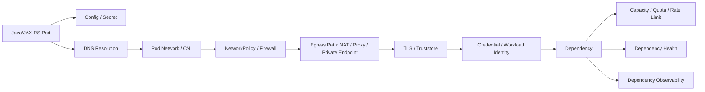
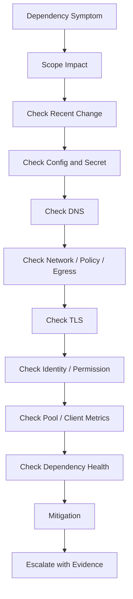
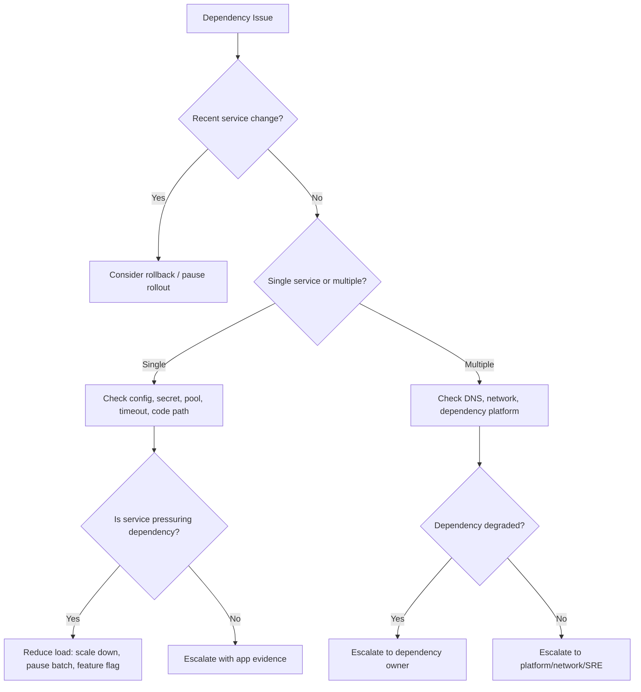

# Part 093 — Dependency Operations from Kubernetes

## 1. Tujuan Part Ini

Part ini membahas **dependency operations from Kubernetes** dari sudut pandang senior backend engineer.

Fokusnya bukan mengoperasikan PostgreSQL, Kafka, RabbitMQ, Redis, Camunda, AWS, atau Azure secara penuh. Fokusnya adalah memahami bagaimana workload backend yang berjalan di Kubernetes **mengakses, gagal mengakses, menekan, dan dipengaruhi oleh dependency**.

Untuk Java/JAX-RS service di Kubernetes, banyak incident tidak berasal dari pod itu sendiri. Gejalanya muncul di pod, tetapi akar masalahnya bisa berada di:

- DNS resolution
- NetworkPolicy
- firewall / NSG / security group
- NAT / proxy / private endpoint
- TLS truststore / certificate
- cloud workload identity
- credential/secret rotation
- connection pool exhaustion
- dependency capacity limit
- broker lag / queue backlog
- database lock / slow query
- timeout mismatch
- retry storm
- deployment yang menaikkan jumlah pod dan connection secara tiba-tiba

Tujuan part ini adalah membuat Anda mampu menjawab pertanyaan:

> Ketika service di Kubernetes gagal berinteraksi dengan dependency, bagaimana cara membedakan apakah masalahnya ada di aplikasi, Kubernetes runtime, network, identity, secret, DNS, TLS, dependency capacity, atau external platform?

---

## 2. Mental Model Dependency dari Pod

Dependency access dari pod bukan hanya `application -> dependency`.

Ada banyak layer di antara keduanya.



Saat terjadi failure, jangan langsung menyimpulkan dependency down. Cek layer secara berurutan:

1. Apakah application config benar?
2. Apakah secret/credential benar dan belum stale?
3. Apakah DNS resolve ke target yang benar?
4. Apakah network path terbuka?
5. Apakah TLS handshake valid?
6. Apakah identity/permission valid?
7. Apakah dependency menerima connection?
8. Apakah dependency cukup kapasitas?
9. Apakah timeout/retry policy memperburuk masalah?
10. Apakah ada recent deployment/config change?

---

## 3. Dependency Classes yang Umum

| Dependency | Failure yang sering terlihat di pod | Sinyal utama |
|---|---|---|
| PostgreSQL | timeout, connection refused, too many connections, slow query | DB pool metrics, DB dashboard, SQL latency |
| Kafka | lag naik, rebalance, auth failure, broker unavailable | consumer lag, rebalance count, broker metrics |
| RabbitMQ | queue depth naik, unacked tinggi, channel closed | queue depth, consumer count, unacked |
| Redis | timeout, connection reset, high latency, stale cache | Redis latency, pool usage, hit rate |
| Camunda | worker backlog, incident spike, job activation failure | job metrics, incident count, worker logs |
| External HTTP API | 4xx/5xx, timeout, TLS failure, rate limit | HTTP client metrics, traces, status code |
| AWS service | AccessDenied, throttling, endpoint timeout | CloudTrail, SDK metrics, IAM/IRSA evidence |
| Azure service | Forbidden, token failure, private endpoint DNS issue | Azure Monitor, SDK identity, RBAC logs |

Backend engineer harus mengerti pola interaksi dan failure mode tiap dependency, walaupun owner dependency bisa berbeda.

---

## 4. Backend Engineer Responsibility

Backend service owner bertanggung jawab terhadap:

- dependency endpoint configuration
- timeout and retry policy
- connection pool sizing
- circuit breaker/backpressure behavior jika ada
- credential/secret consumption
- workload identity binding yang dipakai service
- readiness behavior terhadap dependency
- graceful shutdown connection close
- application-level metrics untuk dependency call
- logs/traces yang cukup untuk dependency debugging
- safe fallback jika dependency optional
- runbook dependency failure
- escalation dengan evidence yang jelas

Backend engineer tidak boleh hanya berkata "database down" atau "Kafka bermasalah" tanpa evidence. Minimal harus bisa menjawab:

- dependency mana yang gagal?
- dari pod mana?
- di namespace/environment mana?
- sejak kapan?
- error signature apa?
- apakah semua pod terdampak atau sebagian?
- apakah hanya service ini atau banyak service?
- apakah ada recent deployment?
- apakah DNS/network/secret/identity sudah dicek?
- apakah dependency dashboard menunjukkan issue?

---

## 5. Platform/SRE Responsibility

Platform/SRE biasanya bertanggung jawab terhadap:

- cluster networking
- CNI behavior
- DNS infrastructure
- NetworkPolicy baseline
- ingress/egress path
- NAT/proxy/private endpoint integration
- cloud identity integration
- node/network health
- shared observability pipeline
- cluster-level incident coordination

Backend engineer perlu eskalasi ke platform/SRE jika evidence menunjukkan:

- banyak service lintas namespace gagal resolve DNS
- CoreDNS degraded
- CNI/network path broken
- NetworkPolicy baseline salah
- NAT/proxy path gagal
- private endpoint tidak reachable
- cloud identity projection gagal
- node/pod network anomaly
- cluster-wide dependency connectivity issue

---

## 6. Dependency Owner Responsibility

Dependency owner bisa berupa DBA, data platform, messaging platform, workflow platform, cloud platform, atau vendor team.

Mereka biasanya bertanggung jawab terhadap:

- service availability
- capacity limit
- backup/restore
- replication/quorum
- broker/database cluster health
- certificate/endpoint lifecycle
- user/role/permission lifecycle
- quota/rate limit
- upgrade/maintenance
- dependency-specific dashboard and runbook

Backend engineer perlu membawa evidence, bukan hanya symptom.

Contoh evidence yang baik:

```text
Service quote-api di namespace prod-qo mengalami PostgreSQL connection timeout sejak 10:12 UTC.
Semua 6 pod terdampak.
DNS resolve berhasil ke private endpoint yang sama.
NetworkPolicy tidak berubah.
Secret credential terakhir rotate 2 hari lalu.
DB pool active=max 50/pod, pending threads naik.
DB dashboard menunjukkan active connections mendekati limit dan p95 query latency naik.
Recent deployment service terjadi 10:05 UTC dengan replica naik dari 3 ke 6.
Kemungkinan: pool pressure + DB capacity / query slowdown.
```

---

## 7. Safe Investigation Command Pattern

Command aman untuk investigasi awal:

```bash
kubectl config current-context
kubectl get ns
kubectl -n <namespace> get deploy,sts,job,cronjob,svc,ing,hpa,pdb
kubectl -n <namespace> get pods -o wide
kubectl -n <namespace> describe pod <pod>
kubectl -n <namespace> logs <pod> --since=30m
kubectl -n <namespace> logs <pod> --previous
kubectl -n <namespace> get events --sort-by=.lastTimestamp
kubectl -n <namespace> get configmap,secret
kubectl -n <namespace> get networkpolicy
kubectl -n <namespace> get serviceaccount
```

Command yang perlu kehati-hatian:

```bash
kubectl -n <namespace> exec -it <pod> -- sh
kubectl -n <namespace> port-forward <pod-or-service> <local>:<remote>
kubectl -n <namespace> debug pod/<pod> -it --image=<debug-image>
```

Gunakan sesuai policy internal. Di banyak environment production, `exec`, `debug`, dan `port-forward` dibatasi atau diaudit ketat.

---

## 8. Dependency Debugging Flow



Urutan ini mencegah debugging lompat-lompat.

---

## 9. PostgreSQL Connectivity Operations

PostgreSQL failure dari Kubernetes sering terlihat sebagai:

- `connection timeout`
- `connection refused`
- `too many connections`
- `password authentication failed`
- `SSL handshake failed`
- query latency tinggi
- transaction timeout
- pool exhausted
- deadlock/lock wait
- migration lock

Layer yang harus dicek:

| Layer | Yang dicek |
|---|---|
| Config | host, port, database name, schema, SSL mode |
| Secret | username/password, rotated credential, mounted/env secret |
| DNS | private endpoint / service name resolve |
| Network | NetworkPolicy, firewall, private endpoint, proxy |
| TLS | CA bundle, truststore, server cert |
| Pool | max pool, active, idle, pending, leak |
| DB | max connection, slow query, lock, CPU, storage |

PostgreSQL-specific operational concern:

- pool size dihitung per pod, bukan per service
- rolling deployment bisa menggandakan connection sementara
- HPA max replicas bisa melebihi DB capacity
- readiness check yang membuka DB connection terlalu agresif bisa memperburuk incident
- migration job bisa menahan lock dan membuat API timeout
- retry query tanpa backoff dapat memperparah load

---

## 10. PostgreSQL Safe Checklist

Safe investigation:

```bash
kubectl -n <namespace> get deploy <service> -o yaml | grep -i -E "DB|DATABASE|POSTGRES|JDBC"
kubectl -n <namespace> logs deploy/<service> --since=30m | grep -i -E "sql|jdbc|connection|timeout|pool|postgres"
kubectl -n <namespace> describe pod <pod>
```

Cek dashboard:

- DB connection count
- active vs idle connection
- pool active/idle/pending
- query latency p95/p99
- slow query count
- lock wait
- transaction age
- DB CPU/memory/storage
- error rate by SQL operation jika tersedia

Mitigasi awal yang aman:

- rollback deployment yang menaikkan connection pressure
- turunkan HPA max/replica jika disetujui dan aman
- disable traffic ke fitur berat via feature flag jika tersedia
- pause batch/migration job yang membebani DB
- eskalasi ke DBA/data platform dengan evidence

Jangan langsung restart semua pod tanpa memahami apakah masalahnya pool exhaustion atau DB overload. Restart massal bisa menimbulkan connection storm.

---

## 11. Kafka Connectivity Operations

Kafka failure dari Kubernetes sering terlihat sebagai:

- consumer lag naik
- consumer rebalance berulang
- broker connection timeout
- authentication/authorization failure
- topic not found
- partition assignment tidak optimal
- offset commit failure
- duplicate processing setelah restart
- retry/DLQ spike

Layer yang harus dicek:

| Layer | Yang dicek |
|---|---|
| Config | bootstrap servers, topic, group ID, client ID |
| Secret | SASL credential, certificate, truststore |
| DNS | broker DNS / private endpoint |
| Network | broker port, egress allowlist, NetworkPolicy |
| TLS/Auth | SASL_SSL, truststore, keystore, ACL |
| Consumer | lag, rebalance, poll interval, commit behavior |
| Kubernetes | replica count, restart, shutdown, HPA/KEDA |

Kafka-specific operational concern:

- replica count tidak boleh dianggap selalu meningkatkan throughput
- jumlah effective consumer dibatasi jumlah partition
- pod restart memicu rebalance
- rolling deployment dapat menciptakan rebalance storm
- graceful shutdown penting untuk offset commit
- over-scaling dapat menambah churn tanpa mengurangi lag
- retry tanpa DLQ bisa memblokir partition

---

## 12. Kafka Debugging Checklist

Cek dari Kubernetes:

```bash
kubectl -n <namespace> get pods -l app=<consumer-app>
kubectl -n <namespace> logs deploy/<consumer-app> --since=30m | grep -i -E "kafka|rebalance|lag|offset|commit|sasl|ssl|authorization|timeout"
kubectl -n <namespace> describe deploy <consumer-app>
kubectl -n <namespace> get hpa
```

Cek observability:

- consumer lag by topic/partition/group
- rebalance count
- consumer instance count
- processing rate
- error rate
- retry/DLQ rate
- offset commit latency/error
- broker availability
- broker request latency

Pertanyaan triage:

- apakah lag naik setelah deployment?
- apakah semua partition terdampak?
- apakah ada poison message?
- apakah consumer lebih banyak dari partition?
- apakah pod restart berulang?
- apakah KEDA/HPA scale terlalu agresif?
- apakah broker mengalami maintenance?

Mitigasi awal:

- rollback consumer jika lag/error muncul setelah release
- pause rollout jika rebalance storm
- scale secara hati-hati sesuai partition count
- aktifkan/cek DLQ untuk poison message
- eskalasi ke Kafka platform jika broker/ACL/topic issue

---

## 13. RabbitMQ Connectivity Operations

RabbitMQ failure dari Kubernetes sering terlihat sebagai:

- queue depth naik
- unacked messages tinggi
- consumer count turun
- redelivery spike
- channel closed
- connection refused
- prefetch terlalu tinggi/rendah
- DLQ spike
- message processing latency naik

Layer yang harus dicek:

| Layer | Yang dicek |
|---|---|
| Config | broker host, vhost, exchange, queue, routing key |
| Secret | username/password/cert |
| DNS/Network | broker reachability, port, NetworkPolicy |
| TLS | truststore/cert if TLS enabled |
| Consumer | prefetch, ack/nack, concurrency, redelivery |
| Kubernetes | replica count, shutdown, restart, HPA/KEDA |

RabbitMQ-specific concern:

- prefetch terlalu besar dapat menumpuk unacked di pod yang lambat
- pod termination tanpa graceful ack handling bisa menyebabkan redelivery spike
- scaling consumer dapat meningkatkan pressure ke downstream DB/API
- redelivery loop dapat memperparah queue backlog
- DLQ harus dimonitor sebagai failure signal, bukan tempat membuang masalah

---

## 14. Redis Connectivity Operations

Redis failure dari Kubernetes sering terlihat sebagai:

- connection timeout
- command timeout
- connection reset
- high latency
- pool exhausted
- stale cache
- cache stampede
- rate limiter failure
- session/token lookup failure

Layer yang harus dicek:

| Layer | Yang dicek |
|---|---|
| Config | host, port, DB index, TLS, timeout |
| Secret | password/token |
| Network | private endpoint, NetworkPolicy, firewall |
| Pool | max connections, pending, wait time |
| Redis | CPU, memory, evictions, latency, connection count |
| App | cache TTL, fallback behavior, stampede protection |

Redis-specific concern:

- Redis sering dianggap cepat, sehingga timeout terlalu pendek atau retry terlalu agresif
- cache miss storm dapat membebani database
- Redis memory eviction bisa terlihat sebagai data correctness issue
- terlalu banyak pod dapat meningkatkan connection count dan command pressure
- Redis dependency optional harus punya fallback yang eksplisit

---

## 15. Camunda Connectivity and Worker Dependency

Camunda-related failure dari Kubernetes dapat muncul sebagai:

- worker tidak mengambil job
- job activation timeout
- incident spike
- process instance stuck
- correlation failure
- worker restart menyebabkan job timeout/redelivery
- external task backlog
- workflow completion SLO gagal

Layer yang harus dicek:

| Layer | Yang dicek |
|---|---|
| Config | Camunda endpoint, tenant/process config, topic/job type |
| Secret | auth credential/token |
| Network | service reachability, ingress/internal route |
| Worker | concurrency, lock duration, timeout, retry |
| Kubernetes | pod restart, graceful shutdown, replica count |
| Camunda | incident, job backlog, engine health |

Operational concern:

- worker scaling harus mempertimbangkan downstream dependency
- retry policy harus selaras dengan business failure semantics
- incident spike perlu korelasi dengan deployment/config change
- graceful shutdown harus mencegah job ditinggalkan dalam state ambigu

---

## 16. External HTTP Dependency Operations

External HTTP dependency failure sering muncul sebagai:

- HTTP 4xx
- HTTP 5xx
- connect timeout
- read timeout
- TLS handshake failure
- DNS failure
- rate limit / 429
- auth failure / 401 / 403
- malformed response
- slow downstream causing thread pool saturation

Cek layer berikut:

| Layer | Yang dicek |
|---|---|
| Config | base URL, path, timeout, proxy, NO_PROXY |
| DNS | public/private DNS resolution |
| Network | NAT/proxy/firewall/private endpoint |
| TLS | truststore, SNI, cert chain |
| Auth | token, client credential, API key |
| Client | pool, retry, circuit breaker, timeout |
| Dependency | status page, vendor incident, quota |

External HTTP dependency harus punya:

- explicit timeout
- bounded retry dengan backoff
- circuit breaker jika sesuai
- idempotency key untuk write operation jika didukung
- trace propagation
- status code metrics
- dependency-specific dashboard

---

## 17. AWS Service Dependency Operations

Untuk AWS dependency dari EKS atau hybrid Kubernetes, failure umum:

- `AccessDeniedException`
- `ExpiredToken`
- `Unable to locate credentials`
- `ThrottlingException`
- endpoint timeout
- KMS decrypt denied
- Secrets Manager/SSM access denied
- S3/DynamoDB/SQS/SNS permission issue

Layer yang harus dicek:

- ServiceAccount annotation untuk IRSA
- projected token
- IAM role trust policy
- IAM permission policy
- KMS key policy
- AWS SDK credential chain
- region config
- VPC endpoint/private endpoint
- security group/network route
- CloudTrail evidence

Safe evidence:

```bash
kubectl -n <namespace> get sa <serviceaccount> -o yaml
kubectl -n <namespace> describe pod <pod> | grep -i serviceaccount
kubectl -n <namespace> logs <pod> --since=30m | grep -i -E "accessdenied|expiredtoken|credentials|kms|secretsmanager|ssm|throttl"
```

Jangan menaruh AWS keys statis di Kubernetes Secret kecuali memang pola internal mengizinkan dan sudah disetujui security.

---

## 18. Azure Service Dependency Operations

Untuk Azure dependency dari AKS atau hybrid Kubernetes, failure umum:

- `Forbidden`
- `ManagedIdentityCredential authentication unavailable`
- token acquisition failed
- Key Vault access denied
- private endpoint DNS failure
- Azure RBAC scope mismatch
- ACR pull issue
- storage account firewall issue

Layer yang harus dicek:

- Azure Workload Identity binding
- federated credential
- managed identity assignment
- ServiceAccount annotation/label
- Azure SDK credential chain
- Key Vault access model
- private endpoint DNS zone
- NSG/UDR/firewall
- Azure activity/audit logs

Safe evidence:

```bash
kubectl -n <namespace> get sa <serviceaccount> -o yaml
kubectl -n <namespace> describe pod <pod> | grep -i serviceaccount
kubectl -n <namespace> logs <pod> --since=30m | grep -i -E "forbidden|credential|managedidentity|keyvault|token|unauthorized"
```

---

## 19. Private Endpoint and Private DNS Failure

Private endpoint failure sering disalahartikan sebagai application timeout.

Gejala:

- DNS resolve ke public IP padahal harus private IP
- DNS tidak resolve sama sekali
- connection timeout ke private endpoint
- TLS cert mismatch karena host salah
- service reachable dari node tertentu tapi tidak dari pod tertentu
- egress route lewat NAT/proxy padahal harus private path

Cek:

- DNS record target
- private DNS zone association
- VPC/VNet peering
- route table / UDR
- security group / NSG
- NetworkPolicy egress
- proxy/NO_PROXY
- TLS SNI hostname

Internal verification sangat penting karena topologi private endpoint biasanya spesifik organisasi.

---

## 20. Timeout and Retry as Dependency Amplifier

Timeout dan retry bisa menjadi mitigasi atau amplifier incident.

Anti-pattern umum:

- no timeout
- timeout aplikasi lebih panjang dari ingress timeout
- retry tanpa backoff
- retry write operation non-idempotent
- retry storm saat dependency degraded
- semua pod retry bersamaan
- circuit breaker tidak ada atau terlalu sensitif
- Kafka/RabbitMQ retry blocking main processing lane

Prinsip production:

- setiap dependency call harus punya timeout eksplisit
- retry harus bounded
- retry harus mempertimbangkan idempotency
- backoff + jitter lebih aman daripada retry cepat
- failure harus menghasilkan metric, bukan hanya log
- timeout chain harus selaras dari client sampai dependency

---

## 21. Connection Pool and Replica Count Impact

Dalam Kubernetes, connection pool dikalikan jumlah pod.

```text
Total potential DB connections = maxPoolSizePerPod * replicaCount
During rolling surge = maxPoolSizePerPod * (replicaCount + maxSurge)
During HPA max = maxPoolSizePerPod * maxReplicas
```

Contoh:

```text
maxPoolSizePerPod = 40
replicaCount = 6
maxSurge = 2
HPA maxReplicas = 12

Normal upper bound = 40 * 6 = 240
Rolling upper bound = 40 * 8 = 320
HPA upper bound = 40 * 12 = 480
```

Jika PostgreSQL `max_connections` hanya 300 dan ada service lain, konfigurasi ini berbahaya.

Hal serupa berlaku untuk:

- Redis connection pool
- RabbitMQ channels/connections
- Kafka client connection
- HTTP client pool
- Camunda worker connection

---

## 22. Dependency Observability Signals

Minimal service backend harus punya signal berikut:

| Signal | Contoh |
|---|---|
| Dependency latency | DB query p95, HTTP client p95, Redis command latency |
| Dependency error rate | SQL errors, HTTP 5xx, broker errors |
| Pool health | active, idle, pending, max, timeout |
| Timeout count | connect/read/request timeout |
| Retry count | retry attempts, exhausted retry |
| Circuit state | open/half-open/closed jika ada |
| Queue/lag | Kafka lag, RabbitMQ depth, DLQ count |
| Identity/auth failure | 401/403, AccessDenied, token failure |
| DNS/TLS failure | name resolution error, handshake failure |

Tanpa signal ini, dependency debugging akan bergantung pada log manual dan dugaan.

---

## 23. Dependency Failure Mode Matrix

| Symptom | Kemungkinan layer | Evidence awal |
|---|---|---|
| `UnknownHostException` | DNS/config | DNS target, service name, private DNS |
| `Connection refused` | dependency port/listener | endpoint, service health, port config |
| `Connection timeout` | network/firewall/policy/route | NetworkPolicy, firewall, private endpoint |
| TLS handshake failed | truststore/cert/SNI | cert chain, Java truststore, hostname |
| 401/403 | auth/permission | token, role, IAM/RBAC, audit logs |
| Pool exhausted | app/pool/dependency saturation | pool metrics, thread dump, dependency latency |
| Lag/queue depth naik | consumer throughput/downstream | consumer metrics, processing rate, DLQ |
| Slow response | dependency latency/retry/thread pool | traces, client metrics, downstream dashboard |
| Errors only after deployment | config/release/regression | deployment marker, diff, new image/config |

---

## 24. Mitigation Decision Tree



Mitigation harus mengurangi blast radius, bukan hanya menghilangkan symptom sementara.

---

## 25. Rollback Criteria for Dependency Failures

Rollback layak dipertimbangkan jika:

- dependency error muncul tepat setelah deployment
- config/secret endpoint berubah
- pool size berubah
- timeout/retry berubah
- query pattern berubah
- consumer concurrency berubah
- replica count/HPA policy berubah
- new version menghasilkan load lebih tinggi
- trace menunjukkan latency/error berasal dari code path baru

Rollback tidak selalu menyelesaikan jika:

- dependency benar-benar down
- DNS/platform issue global
- credential sudah rotated dan versi lama juga gagal
- migration sudah irreversible
- schema/data compatibility sudah berubah

Untuk migration-related failure, rollback aplikasi bisa berbahaya jika schema tidak backward-compatible.

---

## 26. Escalation Evidence Template

Gunakan format evidence berikut saat eskalasi:

```text
Service:
Namespace/environment:
Time started:
Impact:
Affected pods/replicas:
Dependency target:
Error signature:
Recent deployment/config change:
DNS result:
NetworkPolicy/egress status:
Secret/identity status:
TLS status:
Pool/client metrics:
Dependency dashboard evidence:
Mitigation attempted:
Requested help:
```

Template ini membuat diskusi dengan platform/SRE/DBA/security lebih cepat dan defensible.

---

## 27. Internal Verification Checklist

Verifikasi internal berikut sebelum menganggap dependency operation sudah mature:

- dependency map per service tersedia
- owner dependency jelas
- endpoint dan private endpoint terdokumentasi
- DNS/private DNS path jelas
- NetworkPolicy egress terdokumentasi
- firewall/security group/NSG owner jelas
- secret source dan rotation behavior jelas
- workload identity binding jelas
- timeout/retry policy terdokumentasi
- connection pool sizing dihitung terhadap replica/HPA max
- dependency dashboard tersedia
- alert dependency error/latency tersedia
- trace propagation tersedia
- runbook dependency failure tersedia
- rollback/mitigation path jelas
- batch/consumer pressure control jelas
- escalation path ke DBA/messaging/workflow/platform/security jelas

---

## 28. PR Review Checklist

Saat mereview PR yang menyentuh dependency operations, cek:

- apakah endpoint dependency berubah?
- apakah secret/config key berubah?
- apakah timeout/retry berubah?
- apakah pool size berubah?
- apakah replica/HPA berubah?
- apakah consumer concurrency/prefetch berubah?
- apakah topic/queue/group ID berubah?
- apakah TLS/truststore config berubah?
- apakah identity/ServiceAccount berubah?
- apakah NetworkPolicy egress berubah?
- apakah migration job ditambahkan?
- apakah observability untuk dependency call cukup?
- apakah rollback aman?
- apakah dependency owner sudah diberi tahu jika capacity impact besar?

---

## 29. Common Anti-Patterns

Anti-pattern yang harus dihindari:

- readiness check tergantung penuh pada semua dependency eksternal
- semua dependency timeout default
- retry tanpa bound/backoff
- pool size besar tanpa menghitung replica count
- menggunakan credential statis tanpa rotation plan
- secret rotation tidak memicu restart/reload
- tidak punya metric dependency latency/error
- tidak membedakan 4xx, 5xx, timeout, TLS, DNS, auth failure
- menambah replica consumer tanpa melihat downstream capacity
- men-debug dependency hanya dengan restart pod
- menyalahkan dependency owner tanpa evidence

---

## 30. Ringkasan

Dependency operations dari Kubernetes adalah kemampuan membaca hubungan antara pod, runtime, network, identity, config, secret, client behavior, dan dependency health.

Sebagai senior backend engineer, targetnya bukan menjadi owner semua dependency. Targetnya adalah mampu:

- mengisolasi layer failure secara sistematis
- membawa evidence yang cukup saat eskalasi
- menghindari retry/pool/scale behavior yang memperparah dependency
- mereview PR yang mengubah dependency pressure
- membuat runbook dependency failure yang realistis
- menjaga service tetap reliable saat dependency degraded

Production reliability sering gagal bukan karena service tidak bisa start, tetapi karena service tidak bisa berinteraksi dengan dependency secara aman, terbatas, dan observable.
