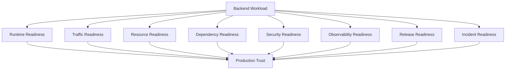
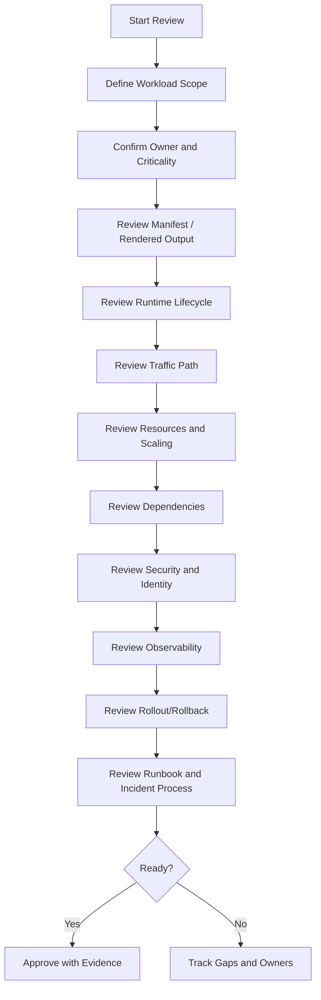
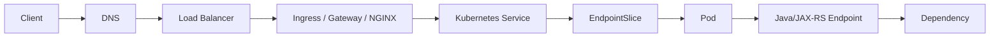

# Part 094 — Production Readiness Review for Kubernetes Workloads

## 1. Tujuan Part Ini

Part ini membahas **Production Readiness Review** untuk workload Kubernetes dari sudut pandang senior backend engineer.

Production readiness bukan checklist kosmetik sebelum deploy. Ini adalah proses memastikan bahwa workload backend:

- punya owner yang jelas
- bisa menerima traffic dengan aman
- bisa berhenti dengan aman
- bisa di-scale dengan aman
- punya resource sizing yang masuk akal
- punya dependency contract yang jelas
- punya observability yang cukup untuk incident
- punya rollback/mitigation path
- tidak membuka risiko security/compliance yang tidak perlu
- tidak menciptakan cost waste yang tidak terlihat
- bisa dipahami oleh engineer lain saat on-call

Target part ini adalah membuat Anda mampu melakukan review workload Kubernetes sebelum workload dipercaya di production, terutama untuk Java 17+ / JAX-RS / Jakarta RESTful service, Kafka/RabbitMQ consumer, Redis-backed service, Camunda worker, batch job, scheduler, dan migration job.

---

## 2. Production Readiness Mental Model

Workload production-ready bukan workload yang "pod-nya running".

Workload production-ready adalah workload yang siap menghadapi:

- deployment baru
- config salah
- dependency lambat
- dependency down
- traffic spike
- node drain
- pod restart
- autoscaling
- secret rotation
- certificate expiry
- network restriction
- partial outage
- rollback
- incident investigation
- audit/compliance question



Jika salah satu dimensi kosong, workload mungkin tetap berjalan, tetapi sulit dipercaya saat produksi bergerak.

---

## 3. Backend Engineer Responsibility

Backend engineer/service owner bertanggung jawab memastikan workload miliknya:

- manifest deployment sesuai behavior aplikasi
- probes sesuai lifecycle aplikasi
- graceful shutdown benar
- resources sesuai JVM dan traffic profile
- dependency timeout/retry/pool jelas
- secrets/config digunakan secara aman
- logs/metrics/traces cukup untuk debugging
- alerts actionable
- SLO/SLI didefinisikan jika service critical
- rollback path jelas
- runbook tersedia
- PR change punya production impact review

Backend engineer tidak harus mengoperasikan cluster, tetapi harus bisa membuktikan bahwa workload miliknya tidak menjadi sumber risiko operasional yang tidak terlihat.

---

## 4. Platform/SRE Responsibility

Platform/SRE biasanya bertanggung jawab terhadap:

- cluster baseline
- node pool capacity
- ingress/controller platform
- CNI/CSI/CoreDNS
- policy/admission guardrails
- GitOps/controller baseline
- observability platform
- autoscaler infrastructure
- security integration
- incident platform process

Production readiness review harus membedakan:

- apa yang wajib dibuktikan service owner
- apa yang wajib disediakan platform
- apa yang butuh joint review
- apa yang harus diverifikasi secara internal

---

## 5. Readiness Review Flow



Review harus menghasilkan keputusan, bukan sekadar diskusi.

---

## 6. Workload Identity and Ownership Checklist

Cek:

- nama service jelas
- namespace/environment jelas
- owner team jelas
- escalation channel jelas
- on-call owner jelas jika production-critical
- business capability jelas
- criticality tier jelas
- dependency owner jelas
- Git repository jelas
- GitOps/manifest repository jelas
- dashboard link jelas
- runbook link jelas
- incident history diketahui

Pertanyaan utama:

- siapa yang bangun saat alert berbunyi?
- siapa yang boleh rollback?
- siapa yang boleh mengubah config production?
- siapa yang tahu business impact service ini?
- siapa dependency owner jika downstream/upstream gagal?

Tanpa ownership, production readiness hanya ilusi.

---

## 7. Manifest and Rendered Output Review

Review harus dilakukan pada **rendered manifest**, bukan hanya Helm template atau Kustomize base.

Cek object berikut:

- Deployment / StatefulSet / Job / CronJob
- Service
- Ingress / Gateway / HTTPRoute
- ConfigMap
- Secret / ExternalSecret / SecretProviderClass
- ServiceAccount
- Role / RoleBinding
- HPA / KEDA ScaledObject
- PDB
- NetworkPolicy
- ServiceMonitor / PodMonitor / PrometheusRule jika ada

Command review contoh:

```bash
helm template <release> <chart> -f values.yaml > rendered.yaml
kubectl apply --dry-run=server -f rendered.yaml
kubectl diff -f rendered.yaml

kubectl kustomize overlays/<env> > rendered.yaml
kubectl apply --dry-run=server -f rendered.yaml
```

Yang dicari:

- field salah
- API version deprecated
- selector mismatch
- label tidak konsisten
- resource kosong
- probe tidak masuk akal
- secret/config missing
- RBAC terlalu luas
- NetworkPolicy terlalu longgar atau terlalu sempit
- annotation ingress berisiko
- HPA tanpa resource request
- PDB tidak sesuai replica count

---

## 8. Runtime Lifecycle Readiness

Cek apakah workload bisa start, ready, serve traffic, dan terminate dengan benar.

Checklist:

- startup probe tersedia jika startup lambat
- readiness probe mencerminkan kesiapan menerima traffic
- liveness probe tidak terlalu agresif
- probe path/port benar
- readiness tidak bergantung secara berlebihan pada dependency eksternal
- terminationGracePeriodSeconds cukup
- graceful shutdown menangani SIGTERM
- HTTP server berhenti menerima request baru saat shutdown
- in-flight request diberi waktu selesai
- Kafka/RabbitMQ consumer berhenti polling/consume dengan aman
- Camunda worker menyelesaikan atau melepas job dengan aman
- DB/Redis/HTTP pool ditutup dengan benar

Java/JAX-RS specific:

- startup time diketahui
- management endpoint stabil
- thread pool shutdown graceful
- connection pool shutdown graceful
- JVM tidak OOM saat warm-up
- readiness tidak true sebelum route/app siap

---

## 9. Probe Readiness Checklist

Probe harus diuji terhadap failure mode nyata.

| Probe | Harus menjawab | Risiko jika salah |
|---|---|---|
| Startup probe | Apakah aplikasi sudah selesai bootstrap? | pod dibunuh sebelum sempat start |
| Readiness probe | Apakah pod boleh menerima traffic? | traffic masuk ke pod belum siap |
| Liveness probe | Apakah proses perlu direstart? | restart loop saat dependency lambat |

Cek config:

- `initialDelaySeconds`
- `periodSeconds`
- `timeoutSeconds`
- `failureThreshold`
- path
- port
- scheme
- dependency behavior

Anti-pattern:

- liveness check memanggil database
- readiness terlalu mahal
- readiness selalu true
- startup probe tidak ada untuk aplikasi lambat
- timeout probe lebih pendek dari normal p99 startup/GC pause

---

## 10. Traffic Readiness

Cek jalur traffic end-to-end:



Checklist:

- DNS record benar
- Ingress/Gateway host/path benar
- TLS secret/certificate benar
- backend protocol benar
- service selector cocok dengan pod labels
- targetPort benar
- EndpointSlice populated
- pod readiness benar
- timeout chain selaras
- source IP/header behavior diketahui
- access log tersedia
- trace masuk dari ingress ke app

Production readiness harus bisa membuktikan request bisa masuk dan diproses, bukan hanya service object dibuat.

---

## 11. Resource Readiness

Cek resource contract:

- CPU request
- CPU limit
- memory request
- memory limit
- ephemeral storage request/limit
- QoS class
- historical usage
- peak usage
- startup usage
- GC behavior
- CPU throttling
- OOMKilled history
- node capacity fit

Java/JVM checklist:

- heap sizing sesuai memory limit
- MaxRAMPercentage/InitialRAMPercentage jelas
- direct memory dipertimbangkan
- metaspace dipertimbangkan
- thread stack dipertimbangkan
- native memory dipertimbangkan
- GC metric tersedia
- heap dump policy aman

Pertanyaan readiness:

- apakah resource request cukup untuk scheduling?
- apakah memory limit cukup untuk heap + native memory?
- apakah CPU limit menyebabkan throttling latency?
- apakah ephemeral storage cukup untuk logs/temp/upload/batch?
- apakah resource sizing sudah dibandingkan dengan production metrics?

---

## 12. Scaling Readiness

Cek scaling behavior:

- replica count default
- min replicas
- max replicas
- HPA metric
- custom/external metric jika ada
- stabilization window
- scale-up/down policy
- queue-based scaler jika consumer
- KEDA config jika digunakan
- cluster capacity
- dependency capacity
- cost impact

Untuk API service:

- apakah HPA berdasarkan CPU cukup?
- apakah latency/error SLO tetap aman saat scale?
- apakah cold start mengganggu traffic?

Untuk Kafka/RabbitMQ consumer:

- apakah scale sesuai partition/queue model?
- apakah downstream DB/API mampu menerima tambahan load?
- apakah scaling memicu rebalance/redelivery storm?

Scaling readiness bukan hanya bisa scale up. Scaling readiness berarti scale tidak merusak dependency.

---

## 13. Availability Readiness

Cek:

- replica count minimal
- multi-zone placement jika critical
- pod anti-affinity/topology spread
- PDB
- readiness gate
- rolling update strategy
- maxUnavailable
- maxSurge
- node drain behavior
- cluster upgrade behavior
- single replica risk

PDB checklist:

- PDB ada untuk service critical
- PDB tidak konflik dengan replica count
- PDB tidak menghambat cluster maintenance secara tidak perlu
- minAvailable/maxUnavailable sesuai availability target
- HPA interaction dipahami

Anti-pattern:

- production API critical hanya 1 replica
- PDB `minAvailable: 1` untuk 1 replica lalu node drain blocked
- maxUnavailable terlalu agresif
- topology spread tidak ada untuk service critical

---

## 14. Dependency Readiness

Cek semua dependency:

- PostgreSQL
- Kafka
- RabbitMQ
- Redis
- Camunda
- external HTTP services
- AWS/Azure services
- internal APIs
- file/object storage
- identity provider

Untuk tiap dependency, pastikan:

- endpoint jelas
- owner jelas
- credential source jelas
- timeout jelas
- retry jelas
- pool size jelas
- TLS/truststore jelas jika dipakai
- NetworkPolicy egress jelas
- private endpoint/DNS jelas
- dashboard tersedia
- alert tersedia
- fallback/mitigation jelas
- dependency capacity cukup untuk replica/HPA max

Dependency readiness harus menghitung total pressure dari semua pod.

---

## 15. Config and Secret Readiness

Config checklist:

- ConfigMap source jelas
- environment overlay benar
- config key required terdokumentasi
- safe default ada jika layak
- config reload behavior jelas
- restart requirement jelas
- drift detection ada
- config change audited

Secret checklist:

- secret source jelas
- external secret integration jelas jika ada
- rotation process jelas
- stale secret behavior dipahami
- mount/env usage aman
- RBAC access terbatas
- secret tidak muncul di logs
- secret tidak masuk Git/plaintext
- secret tidak diekspos lewat debug endpoint

Pertanyaan penting:

- apa yang terjadi saat secret rotate?
- apakah pod perlu restart?
- apakah aplikasi bisa reload?
- apakah ada alert jika external secret sync gagal?

---

## 16. Identity and RBAC Readiness

Cek:

- ServiceAccount per workload
- automountServiceAccountToken apakah diperlukan
- Role/RoleBinding minimal
- tidak memakai ClusterRole jika tidak perlu
- token projection jika relevan
- cloud workload identity binding
- IRSA annotation jika EKS
- Azure Workload Identity config jika AKS
- cloud IAM/RBAC scope minimal
- audit log tersedia

Pertanyaan readiness:

- apakah workload benar-benar perlu akses Kubernetes API?
- apakah cloud permission terlalu luas?
- apakah secret access dibatasi?
- apakah access denied punya runbook?

Least privilege adalah readiness requirement, bukan nice-to-have.

---

## 17. NetworkPolicy and Egress Readiness

Cek:

- default deny baseline
- ingress rule minimal
- egress rule minimal
- DNS egress allowed
- DB egress allowed
- Kafka/RabbitMQ/Redis/Camunda egress allowed
- cloud service egress allowed
- private endpoint route jelas
- proxy/NO_PROXY config jelas
- firewall/security group/NSG alignment

Anti-pattern:

- no NetworkPolicy untuk workload sensitive
- allow-all egress tanpa alasan
- DNS egress lupa dibuka
- network rule berdasarkan IP yang berubah-ubah tanpa owner
- dependency baru ditambahkan tanpa policy review

Network readiness harus divalidasi sebelum production, bukan saat incident.

---

## 18. Ingress, Gateway, and TLS Readiness

Cek:

- host/path routing benar
- IngressClass/GatewayClass benar
- backend service/port benar
- TLS secret benar
- certificate expiry alert
- protocol HTTP/HTTPS/gRPC benar jika relevan
- timeout annotation benar
- body size/buffering policy sesuai workload
- WebSocket/SSE support jika diperlukan
- rate limiting/auth location jelas
- access logs tersedia

Java trust readiness:

- outbound TLS dependency truststore tersedia
- internal CA dipasang jika diperlukan
- certificate rotation behavior jelas
- SNI hostname sesuai

---

## 19. Observability Readiness

Minimal service production harus punya:

- logs terstruktur
- correlation ID
- trace ID
- request metrics
- error metrics
- latency metrics
- dependency metrics
- JVM metrics
- pod/deployment metrics
- restart count
- CPU/memory/throttling metrics
- dashboard
- alert
- deployment marker
- runbook link

Dashboard minimal:

- traffic rate
- error rate
- latency p50/p95/p99
- saturation: CPU, memory, thread pool, pool usage
- dependency latency/error
- pod health
- rollout marker
- Kafka/RabbitMQ lag/depth jika consumer
- JVM heap/GC/thread metrics

Observability readiness berarti engineer bisa menjawab "apa yang rusak?" dalam menit, bukan jam.

---

## 20. Alert Readiness

Cek alert:

- service unavailable
- elevated 5xx/error rate
- latency SLO burn
- pod restart loop
- deployment unavailable
- HPA maxed out
- CPU throttling severe
- memory near limit/OOMKilled
- queue lag/depth high
- dependency error high
- DLQ spike
- certificate expiry
- secret sync failure
- no endpoint

Setiap alert harus punya:

- owner
- severity
- runbook link
- dashboard link
- expected action
- threshold rationale
- suppression/noise strategy

Alert tanpa action adalah noise.

---

## 21. SLO Readiness

Untuk service critical, cek:

- availability SLI
- latency SLI
- error rate SLI
- queue lag/freshness SLI untuk async workload
- workflow completion SLI untuk Camunda/process workload
- dependency SLI jika service sangat bergantung pada downstream
- burn-rate alert
- error budget policy

Pertanyaan readiness:

- apa definisi "service sehat"?
- apakah readiness sama dengan user-visible availability?
- apakah alert berbasis symptom atau internal noise?
- apakah release boleh lanjut saat error budget terbakar?

---

## 22. Rollout and Rollback Readiness

Cek:

- rolling update strategy
- maxSurge/maxUnavailable
- progressDeadlineSeconds
- rollback command/process
- rollback via GitOps jika berlaku
- smoke test
- post-deployment validation
- deployment marker
- feature flag jika ada
- canary/blue-green jika critical
- migration compatibility
- rollback limitation terdokumentasi

Pertanyaan utama:

- bagaimana tahu deployment sukses?
- bagaimana tahu deployment harus dihentikan?
- siapa boleh rollback?
- rollback dilakukan via kubectl, Helm, Argo CD, Flux, atau pipeline?
- apakah schema migration membuat rollback tidak aman?

---

## 23. Database Migration Readiness

Jika workload membawa migration:

- migration job terpisah dari app startup
- migration idempotent
- migration punya lock
- migration punya timeout
- migration punya observability
- expand-contract digunakan untuk breaking change
- app version backward/forward compatible
- rollback limitation jelas
- long-running migration punya plan
- migration failure punya runbook

Anti-pattern:

- migration berat di init container
- migration destructive bersamaan dengan rolling update
- app baru tidak compatible dengan schema lama
- app lama tidak compatible dengan schema baru saat rollback
- migration tanpa lock

---

## 24. Security Readiness

Cek:

- runAsNonRoot
- readOnlyRootFilesystem jika memungkinkan
- capabilities minimal
- privileged=false
- HostPath tidak dipakai kecuali approved
- image scan passed
- base image approved
- image digest/promotion jelas
- secret tidak bocor
- RBAC least privilege
- NetworkPolicy minimal
- admission policy compliant
- vulnerability exception terdokumentasi

Security readiness juga harus mencakup debug behavior:

- apakah `/debug`, `/actuator`, atau management endpoint terlindungi?
- apakah logs mengandung PII/secret?
- apakah heap dump dapat mengandung sensitive data?
- apakah exec/debug production diaudit?

---

## 25. Compliance and Audit Readiness

Cek:

- deployment change traceable ke commit/PR
- image provenance jelas
- approval gate jelas
- config/secret change audited
- production access audited
- incident evidence retention jelas
- compliance labels jika diperlukan
- data classification dipahami
- log retention sesuai policy
- PII/regulated data handling jelas

Untuk enterprise production, readiness bukan hanya uptime. Readiness juga berarti perubahan dan incident dapat dipertanggungjawabkan.

---

## 26. Cost Readiness

Cek:

- CPU request tidak terlalu besar
- memory request tidak terlalu besar
- idle replicas tidak berlebihan
- HPA max tidak menciptakan cost spike tanpa batas
- log volume terkendali
- metrics cardinality terkendali
- trace sampling masuk akal
- load balancer/NAT cost dipahami
- ephemeral storage usage dipahami
- environment non-prod punya sizing sesuai kebutuhan

Cost readiness bukan berarti murah. Artinya resource digunakan secara sadar sesuai reliability target.

---

## 27. Incident Readiness

Cek runbook untuk:

- CrashLoopBackOff
- ImagePullBackOff
- Pod Pending
- Readiness/liveness failure
- Service no endpoint
- Ingress 502/503/504
- DNS failure
- RBAC/access denied
- NetworkPolicy blocked traffic
- Secret/config drift
- Autoscaling not working
- DB connectivity issue
- Kafka lag
- RabbitMQ backlog
- Redis timeout
- Camunda incident spike

Runbook minimal harus punya:

- symptom
- impact assessment
- safe commands
- dashboard links
- logs/metrics/traces to check
- mitigation options
- rollback criteria
- escalation owner
- evidence template

---

## 28. Production Readiness Scorecard

Gunakan scorecard sederhana:

| Area | Status | Owner | Evidence | Gap |
|---|---|---|---|---|
| Ownership | Ready/Gap | Team | service catalog | missing on-call |
| Runtime lifecycle | Ready/Gap | Backend | probes/shutdown test | startup probe missing |
| Traffic | Ready/Gap | Backend/Platform | ingress/service validation | TLS expiry alert missing |
| Resource | Ready/Gap | Backend/SRE | usage dashboard | CPU limit throttling |
| Scaling | Ready/Gap | Backend/SRE | HPA/KEDA config | max replica not capacity-tested |
| Dependency | Ready/Gap | Backend/Dep owner | dependency map | DB pool too high |
| Security | Ready/Gap | Backend/Security | scan/policy report | broad RBAC |
| Observability | Ready/Gap | Backend/SRE | dashboard/alert | no dependency panel |
| Rollback | Ready/Gap | Backend/DevOps | pipeline/runbook | migration rollback unclear |
| Incident | Ready/Gap | Backend/SRE | runbook | no evidence template |

A workload tidak harus sempurna untuk production, tetapi gap harus diketahui, dimiliki, dan diterima secara sadar.

---

## 29. Go / No-Go Criteria

Contoh **No-Go** untuk production-critical workload:

- tidak ada owner jelas
- tidak ada readiness probe valid
- tidak ada resource request/limit policy
- memory sizing JVM tidak jelas
- no rollback path
- migration breaking tanpa compatibility plan
- secret/config source tidak jelas
- dependency utama tidak punya timeout
- dependency pool sizing melebihi capacity
- tidak ada dashboard dasar
- tidak ada alert untuk availability/error/latency
- no runbook untuk failure utama
- RBAC/cloud permission terlalu luas tanpa approval
- NetworkPolicy/egress tidak diverifikasi
- ingress/TLS tidak tervalidasi

Contoh **Go with Risk Accepted**:

- dashboard dependency belum lengkap, tetapi service non-critical dan ada manual query
- HPA belum aktif, tetapi traffic rendah dan capacity manual cukup
- PDB belum ideal, tetapi replica count sedang ditingkatkan dalam follow-up PR
- canary belum tersedia, tetapi rollback cepat dan smoke test kuat

Risk accepted harus eksplisit, bukan diam-diam.

---

## 30. Internal Verification Checklist

Verifikasi internal sebelum menandai workload production-ready:

- workload owner
- namespace/environment
- Git repo dan manifest repo
- Helm chart/Kustomize overlay
- deployment pipeline
- GitOps app/sync status
- ingress/gateway config
- service and EndpointSlice behavior
- resource request/limit
- JVM sizing
- probes
- graceful shutdown
- HPA/KEDA
- PDB
- topology spread/affinity
- NetworkPolicy
- ServiceAccount/RBAC
- workload identity
- ConfigMap/Secret/external secret
- dependency map
- timeout/retry/pool config
- observability dashboard
- alerts
- SLO if applicable
- runbook
- incident escalation
- rollback path
- security scan/policy compliance
- cost labels/resource efficiency
- architecture diagram
- recent incident notes

---

## 31. PR Review Checklist

Saat PR menyentuh Kubernetes workload, tanyakan:

- apakah rendered manifest berubah sesuai intensi?
- apakah label/selector tetap konsisten?
- apakah service masih punya endpoint?
- apakah probe berubah?
- apakah resource berubah?
- apakah JVM config berubah?
- apakah replica/HPA/PDB berubah?
- apakah ingress/route/TLS berubah?
- apakah secret/config key berubah?
- apakah ServiceAccount/RBAC berubah?
- apakah NetworkPolicy berubah?
- apakah dependency endpoint/pool/timeout/retry berubah?
- apakah observability ikut diperbarui?
- apakah rollback masih aman?
- apakah migration compatible?
- apakah security/cost impact sudah dipahami?

PR review adalah production readiness review versi kecil.

---

## 32. Common Anti-Patterns

Anti-pattern production readiness:

- menganggap `kubectl get pods` hijau berarti ready
- probes copy-paste dari service lain
- memory limit tidak disesuaikan dengan JVM
- CPU limit menyebabkan throttling tetapi tidak dimonitor
- HPA aktif tanpa resource request
- PDB dibuat tanpa memahami replica count
- dependency timeout default
- connection pool tidak dihitung terhadap HPA max
- secret rotation tidak diuji
- no NetworkPolicy karena "nanti saja"
- dashboard hanya CPU/memory tanpa dependency/error/latency
- alert tidak punya runbook
- rollback tidak diuji
- migration irreversible tanpa komunikasi
- ownership tidak jelas

---

## 33. Final Production Readiness Questions

Sebelum workload dipercaya di production, service owner harus bisa menjawab:

1. Apa yang dilakukan service ini?
2. Siapa owner-nya?
3. Apa business impact jika service down?
4. Bagaimana traffic masuk ke service?
5. Dependency apa yang dipakai?
6. Bagaimana service start dan become ready?
7. Bagaimana service shutdown?
8. Apa resource baseline dan peak?
9. Bagaimana service scale?
10. Apa failure mode paling umum?
11. Dashboard apa yang dipakai saat incident?
12. Alert apa yang akan berbunyi?
13. Bagaimana rollback dilakukan?
14. Secret/config berasal dari mana?
15. Permission apa yang dimiliki workload?
16. Network path apa yang dibutuhkan?
17. Apa risiko security/compliance?
18. Apa risiko cost?
19. Kapan harus eskalasi?
20. Apa evidence yang dikumpulkan saat incident?

Jika jawaban-jawaban ini tidak tersedia, workload belum siap secara operasional.

---

## 34. Ringkasan

Production readiness review adalah cara mengubah Kubernetes workload dari "bisa deploy" menjadi "layak dipercaya di production".

Untuk senior backend engineer, readiness bukan hanya manifest benar. Readiness berarti memahami:

- lifecycle aplikasi
- request path
- dependency behavior
- resource and scaling limit
- security boundary
- observability signal
- release and rollback safety
- incident response
- internal ownership

Workload yang production-ready bukan workload tanpa risiko. Workload yang production-ready adalah workload yang risikonya terlihat, dimiliki, dimitigasi, dan dapat dioperasikan saat sistem berada dalam tekanan.
