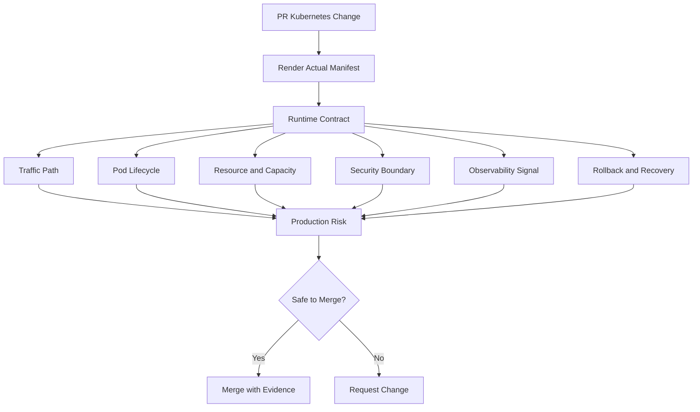
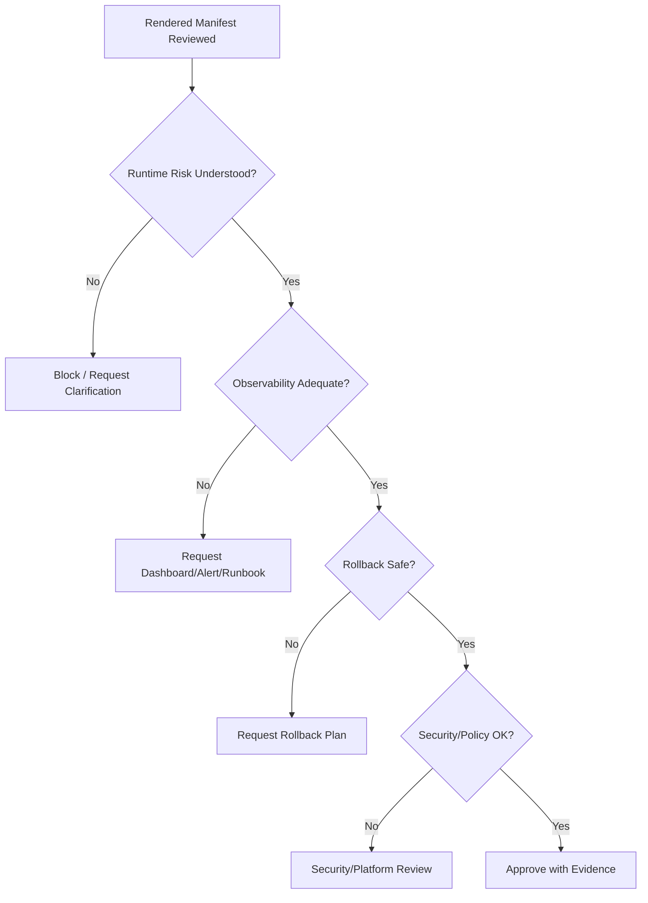

# Part 095 — Kubernetes PR Review Checklist for Backend Engineers

## 1. Tujuan Part Ini

Part ini adalah checklist operasional untuk mereview PR yang mengubah Kubernetes manifest, Helm values, Kustomize overlay, GitOps application, atau deployment pipeline untuk backend services.

Fokusnya bukan sekadar mencari typo YAML. Fokusnya adalah mencegah perubahan kecil di manifest berubah menjadi incident production.

Backend engineer perlu bisa membaca PR Kubernetes sebagai perubahan terhadap runtime contract:

- bagaimana pod dibuat
- bagaimana traffic diarahkan
- bagaimana service dinyatakan ready
- bagaimana resource dijamin
- bagaimana workload scale
- bagaimana secret/config dikonsumsi
- bagaimana dependency diakses
- bagaimana observability menangkap failure
- bagaimana rollback dilakukan
- bagaimana blast radius dikendalikan

Dalam sistem enterprise seperti CPQ, quote/order lifecycle, billing integration, workflow orchestration, Kafka/RabbitMQ consumer, PostgreSQL-backed API, Redis-backed cache, dan Camunda worker, PR Kubernetes bukan pekerjaan infra murni. PR tersebut dapat mengubah reliability, latency, ordering, idempotency, data consistency, security posture, dan recovery behavior aplikasi.

---

## 2. Mental Model Review PR Kubernetes

Setiap PR Kubernetes harus dibaca sebagai perubahan terhadap **production runtime behavior**, bukan sebagai perubahan file konfigurasi saja.



Review yang baik menjawab tiga pertanyaan besar:

1. **Apa behavior production yang berubah?**
2. **Apa failure mode baru yang mungkin muncul?**
3. **Jika gagal, apakah kita bisa mendeteksi, memitigasi, dan rollback dengan aman?**

Kalau reviewer hanya membaca YAML secara sintaksis, banyak risiko operasional akan lolos.

---

## 3. Scope Perubahan yang Harus Diwaspadai

Perubahan Kubernetes bisa terlihat kecil tetapi berdampak besar.

| Perubahan | Risiko utama |
|---|---|
| Image tag/digest | Deploy artifact salah, rollback sulit, supply-chain risk |
| Replica count | Capacity berubah, connection storm, cost naik |
| Resource request/limit | Pod Pending, OOMKilled, CPU throttling, waste |
| Probe | Traffic blackhole, restart loop, rollout stuck |
| ConfigMap | Runtime config berubah, stale config, wrong environment |
| Secret | Credential mismatch, rotation failure, leakage risk |
| Service selector/port | No endpoint, wrong backend, 503 |
| Ingress rule | Broken routing, TLS mismatch, wrong host/path |
| HPA | Scale tidak jalan, thrashing, dependency overload |
| PDB | Maintenance blocked atau availability tidak terlindungi |
| NetworkPolicy | Dependency blocked atau traffic terlalu terbuka |
| RBAC/ServiceAccount | Access denied atau privilege excessive |
| SecurityContext | Workload gagal start atau security hardening melemah |
| Helm values | Rendered manifest berubah tidak eksplisit |
| Kustomize overlay | Drift antar environment |
| GitOps app config | Sync wave, pruning, namespace target, rollback behavior berubah |
| Observability config | Failure tidak terdeteksi |

Review PR harus melihat **rendered output**, bukan hanya template atau patch.

---

## 4. Pre-Review: Pastikan yang Direview adalah Manifest Aktual

Sebelum membaca detail, pastikan reviewer melihat output yang benar.

### 4.1 Untuk Helm

Yang perlu dilihat:

- chart version
- app version
- values file yang dipakai
- environment-specific override
- rendered manifest
- helm diff
- perubahan hook
- perubahan Secret/ConfigMap template
- perubahan default value yang tersembunyi

Safe investigation commands:

```bash
helm template release-name ./chart -f values.yaml -f values-prod.yaml
helm diff upgrade release-name ./chart -f values.yaml -f values-prod.yaml
helm lint ./chart
```

### 4.2 Untuk Kustomize

Yang perlu dilihat:

- base
- overlay target
- patches
- image override
- namePrefix/nameSuffix
- ConfigMap generator
- Secret generator
- namespace injection
- rendered output

Safe investigation commands:

```bash
kubectl kustomize overlays/prod
kubectl diff -k overlays/prod
```

### 4.3 Untuk GitOps

Yang perlu dilihat:

- target namespace
- sync policy
- prune behavior
- self-heal behavior
- sync wave
- dependency ordering
- rollback melalui Git
- drift dari live cluster

Checklist:

- [ ] Apakah PR menunjukkan rendered manifest?
- [ ] Apakah environment target jelas?
- [ ] Apakah diff live-vs-desired tersedia?
- [ ] Apakah reviewer tahu field mana yang berubah secara efektif?
- [ ] Apakah perubahan template menghasilkan perubahan object yang tidak disengaja?

---

## 5. Deployment Review Checklist

Deployment adalah pusat runtime contract untuk service backend.

### 5.1 Metadata dan Ownership

Cek:

- `app.kubernetes.io/name`
- `app.kubernetes.io/instance`
- `app.kubernetes.io/version`
- `app.kubernetes.io/component`
- owner/team label
- environment label
- cost/compliance label jika diwajibkan
- Git commit/deployment annotation

Risiko:

- selector tidak match karena label berubah
- dashboard/alert kehilangan workload
- cost allocation hilang
- incident owner tidak jelas
- GitOps traceability buruk

Checklist:

- [ ] Label selector stabil dan tidak berubah sembarangan.
- [ ] Metadata ownership lengkap.
- [ ] Version/build/git commit bisa dilacak.
- [ ] Label tidak memutus Service selector.
- [ ] Label tidak memutus NetworkPolicy selector.

### 5.2 Replica Count

Cek:

- replica count sebelum/sesudah
- HPA min/max jika ada
- single replica risk
- maxSurge impact
- connection pool impact
- dependency capacity impact

Risiko:

- kapasitas turun tanpa sadar
- deployment spike menggandakan koneksi dependency
- single replica outage saat node drain
- cost naik karena overprovisioning

Checklist:

- [ ] Replica count sesuai criticality service.
- [ ] Jika single replica, risikonya diterima secara eksplisit.
- [ ] Replica count tidak melebihi kapasitas DB/broker/cache.
- [ ] HPA dan replica field tidak konflik secara mental model.

### 5.3 Strategy

Cek:

- `type: RollingUpdate`
- `maxSurge`
- `maxUnavailable`
- `progressDeadlineSeconds`
- `minReadySeconds`
- interaction dengan readiness probe
- interaction dengan PDB

Risiko:

- rollout terlalu agresif
- zero-capacity moment
- rollout stuck terlalu lama
- rollback lambat
- connection storm saat surge

Checklist:

- [ ] `maxUnavailable` tidak membuat service kehilangan kapasitas minimum.
- [ ] `maxSurge` tidak membuat dependency overload.
- [ ] `progressDeadlineSeconds` realistis untuk startup Java.
- [ ] `minReadySeconds` dipakai jika service perlu stabil sebelum dianggap available.

---

## 6. Image and Registry Review Checklist

Image adalah artifact runtime. Review image harus melihat immutability dan traceability.

Cek:

- image repository
- tag
- digest
- registry source
- promotion path
- vulnerability scan
- ImagePullSecret
- ECR/ACR permission
- imagePullPolicy

Risiko:

- mutable tag menyebabkan artifact berubah diam-diam
- wrong image deployed
- ImagePullBackOff saat production rollout
- rollback tidak deterministik
- image belum lolos scan

Checklist:

- [ ] Image tag/digest jelas.
- [ ] Production memakai artifact yang sudah dipromosikan, bukan build ad-hoc.
- [ ] Image scan policy terpenuhi.
- [ ] Registry credential tersedia di namespace target.
- [ ] Rollback image diketahui.
- [ ] `latest` tidak dipakai untuk production workload.

Untuk Java/JAX-RS service, cek juga:

- JDK/JRE base image
- non-root compatibility
- timezone/locale jika berpengaruh
- CA certificate bundle
- truststore injection
- JVM flags
- container entrypoint

---

## 7. Probe Review Checklist

Probe menentukan apakah pod menerima traffic, di-restart, atau dianggap gagal rollout.

Cek:

- startup probe
- readiness probe
- liveness probe
- path
- port
- timeoutSeconds
- periodSeconds
- failureThreshold
- initialDelaySeconds
- dependency behavior

Risiko:

- readiness terlalu cepat → traffic masuk sebelum service siap
- liveness terlalu agresif → restart loop
- startup probe tidak ada untuk Java app lambat
- readiness bergantung dependency eksternal dan menyebabkan cascading unready
- wrong port/path menyebabkan no endpoint

Checklist:

- [ ] Startup probe ada jika startup Java lama atau warm-up berat.
- [ ] Readiness menunjukkan kemampuan menerima traffic, bukan sekadar process hidup.
- [ ] Liveness hanya mendeteksi deadlock/fatal stuck, bukan dependency transient.
- [ ] Probe timeout realistis terhadap GC pause dan cold start.
- [ ] Probe path tidak memerlukan auth eksternal.
- [ ] Probe tidak membuat load besar ke DB/broker/cache.

Contoh red flag:

```yaml
livenessProbe:
  httpGet:
    path: /health/full-dependency-check
    port: 8080
  timeoutSeconds: 1
  failureThreshold: 1
```

Masalahnya: transient DB latency bisa membunuh pod sehat dan memperparah incident.

---

## 8. Resource Review Checklist

Resource request/limit adalah kontrak kapasitas antara workload dan scheduler.

Cek:

- CPU request
- CPU limit
- memory request
- memory limit
- ephemeral storage request/limit
- QoS class
- historical usage
- peak usage
- JVM flags
- HPA target metric
- namespace quota

Risiko:

- Pod Pending karena request terlalu besar
- OOMKilled karena memory limit terlalu kecil
- latency spike karena CPU throttling
- HPA tidak bekerja karena request tidak ada
- node waste karena request terlalu tinggi
- eviction karena ephemeral storage tidak dibatasi

Checklist:

- [ ] CPU/memory request didasarkan pada data historis atau load test.
- [ ] Memory limit selaras dengan JVM heap + native memory + thread stack + metaspace.
- [ ] CPU limit tidak menyebabkan throttling pada latency-sensitive API tanpa alasan jelas.
- [ ] Ephemeral storage diperhitungkan untuk upload/temp/log/batch workload.
- [ ] Resource change tidak melanggar quota namespace.
- [ ] HPA metric valid setelah perubahan request.

Untuk Java service, review JVM flags:

```bash
-XX:MaxRAMPercentage=...
-XX:InitialRAMPercentage=...
-XX:MaxDirectMemorySize=...
-Xss...
```

Jika memory limit berubah tetapi JVM flags tidak berubah, review belum selesai.

---

## 9. Service Review Checklist

Service menghubungkan traffic ke pod melalui selector dan port mapping.

Cek:

- Service type
- selector
- port
- targetPort
- named port
- protocol
- session affinity
- headless service jika ada
- EndpointSlice impact

Risiko:

- no endpoint karena selector mismatch
- wrong targetPort
- named port tidak ada di container
- traffic masuk ke workload lama/salah
- service discovery rusak antar namespace

Checklist:

- [ ] Selector match dengan pod labels.
- [ ] Target port sesuai container port.
- [ ] Named port konsisten.
- [ ] Service type sesuai platform pattern.
- [ ] Tidak ada perubahan selector yang memutus traffic.
- [ ] Jika service dipakai dependency internal, DNS name stabil.

Safe check:

```bash
kubectl get svc -n <namespace> <service> -o yaml
kubectl get endpointslice -n <namespace> -l kubernetes.io/service-name=<service>
```

---

## 10. Ingress / Gateway Review Checklist

Ingress/Gateway menentukan traffic edge ke service.

Cek:

- host
- path
- pathType
- rewrite rule
- TLS secret
- IngressClass/GatewayClass
- backend service name
- backend service port
- timeout annotation
- body size
- buffering
- protocol annotation
- route ownership

Risiko:

- 404 karena host/path salah
- 502 karena protocol mismatch
- 503 karena no endpoint
- 504 karena timeout mismatch
- TLS error karena secret/cert salah
- route conflict dengan service lain

Checklist:

- [ ] Host/path sesuai contract API.
- [ ] Backend service dan port valid.
- [ ] TLS secret ada di namespace yang benar.
- [ ] Timeout sesuai request behavior.
- [ ] Body size cukup untuk upload jika dibutuhkan.
- [ ] Rewrite tidak merusak JAX-RS resource path.
- [ ] Route tidak mengambil traffic service lain.
- [ ] Observability ingress/access logs tersedia.

Untuk JAX-RS service, path rewrite harus dicek terhadap base path aplikasi:

```text
Ingress path: /quote-api(/|$)(.*)
Rewrite: /$2
JAX-RS ApplicationPath: /api
Resource path: /quotes
Effective path expected: /api/quotes
```

Path mismatch adalah sumber 404/502 yang sering terlihat seperti bug aplikasi.

---

## 11. ConfigMap Review Checklist

ConfigMap change sering tampak aman, tetapi dapat mengubah runtime behavior kritikal.

Cek:

- environment-specific values
- feature flags
- endpoint URLs
- timeout/retry config
- pool size
- topic/queue names
- Redis key prefix
- Camunda worker config
- log level
- config reload behavior
- restart requirement

Risiko:

- wrong environment endpoint
- timeout/retry storm
- consumer membaca topic/queue salah
- log level debug di production
- config berubah tetapi pod tidak restart
- GitOps drift antar environment

Checklist:

- [ ] Config environment target benar.
- [ ] Timeout/retry/pool values direview sebagai production behavior.
- [ ] Topic/queue/table/key prefix tidak salah environment.
- [ ] Perubahan config punya rollout/restart mechanism.
- [ ] Safe defaults jelas.
- [ ] Sensitive data tidak masuk ConfigMap.

---

## 12. Secret Review Checklist

Secret review harus berhati-hati: jangan meminta nilai secret ditampilkan di PR.

Cek:

- secret name reference
- key name reference
- external secret reference
- secret provider
- rotation behavior
- reload behavior
- RBAC access
- mount path/env var
- secret leakage risk

Risiko:

- pod gagal start karena secret/key missing
- wrong credential untuk environment
- stale secret setelah rotation
- credential bocor di manifest/log
- external secret sync gagal

Checklist:

- [ ] PR tidak mengekspos secret value.
- [ ] Secret name/key benar.
- [ ] Secret tersedia di namespace target.
- [ ] External secret sync behavior dipahami.
- [ ] Rotation membutuhkan restart atau reload sudah jelas.
- [ ] ServiceAccount hanya punya akses yang diperlukan.
- [ ] Secret tidak masuk log, annotation, atau ConfigMap.

Safe review approach:

```bash
kubectl get secret -n <namespace> <name>
kubectl describe externalsecret -n <namespace> <name>
```

Jangan decode secret value kecuali prosedur internal mengizinkan dan benar-benar diperlukan.

---

## 13. HPA Review Checklist

HPA mengubah runtime capacity secara dinamis. Review harus melihat metric, policy, dan dependency impact.

Cek:

- min replicas
- max replicas
- target CPU/memory/custom/external metric
- scaling behavior
- stabilization window
- resource request dependency
- queue-based scaling
- KEDA ScaledObject jika ada
- dependency capacity

Risiko:

- scale tidak bekerja karena missing request
- max replica terlalu rendah untuk peak
- max replica terlalu tinggi dan overload DB/broker
- scaling thrash
- Kafka rebalance storm
- RabbitMQ prefetch/consumer overload
- cost spike

Checklist:

- [ ] Metric source valid.
- [ ] Resource request mendukung HPA CPU/memory.
- [ ] Min replicas cukup untuk baseline availability.
- [ ] Max replicas sesuai dependency capacity.
- [ ] Stabilization window mencegah thrash.
- [ ] Queue/event scaling mempertimbangkan partition/prefetch/concurrency.
- [ ] Alert autoscaling tersedia.

---

## 14. PDB Review Checklist

PDB melindungi availability saat voluntary disruption, tetapi bisa juga menghambat maintenance.

Cek:

- minAvailable atau maxUnavailable
- replica count
- HPA min replicas
- rolling update behavior
- node drain
- cluster upgrade
- single replica risk

Risiko:

- PDB tidak efektif karena replica hanya satu
- node drain blocked
- cluster upgrade blocked
- rolling update stuck
- quorum workload terganggu

Checklist:

- [ ] PDB sesuai replica count.
- [ ] Single replica service tidak diberi ilusi HA.
- [ ] PDB tidak memblokir rollout normal.
- [ ] PDB mendukung node drain/upgrade.
- [ ] HPA min replicas selaras dengan PDB.

---

## 15. RBAC and ServiceAccount Review Checklist

Cek:

- ServiceAccount name
- automountServiceAccountToken
- Role/ClusterRole
- RoleBinding/ClusterRoleBinding
- least privilege
- cloud identity mapping
- IRSA annotation
- Azure Workload Identity label/annotation

Risiko:

- workload gagal karena permission kurang
- workload terlalu privileged
- token ter-mount tanpa kebutuhan
- cloud access denied
- secret access terlalu luas

Checklist:

- [ ] ServiceAccount dedicated per workload.
- [ ] Permission namespace-scoped jika cukup.
- [ ] ClusterRole hanya jika benar-benar perlu.
- [ ] `automountServiceAccountToken` dimatikan jika tidak perlu.
- [ ] Cloud identity mapping benar.
- [ ] Tidak ada privilege escalation tanpa approval security.

---

## 16. NetworkPolicy Review Checklist

Cek:

- podSelector
- namespaceSelector
- ingress rules
- egress rules
- DNS egress
- DB egress
- Kafka/RabbitMQ/Redis egress
- cloud service egress
- default deny behavior

Risiko:

- traffic dependency diblokir
- DNS resolution gagal
- ingress terlalu terbuka
- egress terlalu longgar
- namespace label mismatch

Checklist:

- [ ] Policy selector memilih pod yang benar.
- [ ] DNS egress diizinkan jika default deny.
- [ ] DB/broker/cache/cloud endpoints diizinkan secara minimal.
- [ ] Ingress hanya dari source yang diperlukan.
- [ ] Namespace labels stabil.
- [ ] Security team approval tersedia untuk exception.

---

## 17. SecurityContext Review Checklist

Cek:

- runAsNonRoot
- runAsUser/runAsGroup
- readOnlyRootFilesystem
- allowPrivilegeEscalation
- capabilities drop/add
- privileged
- hostNetwork/hostPID/hostPath
- seccompProfile

Risiko:

- workload gagal karena filesystem read-only tanpa temp dir
- non-root tidak kompatibel dengan image
- privileged/hostPath membuka risiko besar
- capability terlalu luas

Checklist:

- [ ] Workload berjalan non-root jika memungkinkan.
- [ ] Writable path eksplisit menggunakan EmptyDir jika root filesystem read-only.
- [ ] Privileged/hostPath tidak dipakai tanpa approval.
- [ ] Capabilities di-drop by default.
- [ ] SecurityContext diuji di environment non-prod.

Untuk Java:

- pastikan temp dir writable jika aplikasi memakai `/tmp`
- pastikan truststore/keystore mount readable
- pastikan log directory tidak mengandalkan writable image layer jika root filesystem read-only

---

## 18. Observability Review Checklist

Cek:

- structured logs
- correlation ID
- trace propagation
- metrics endpoint
- JVM metrics
- Kubernetes workload dashboard
- dependency dashboard
- deployment marker
- alert rules
- runbook link
- SLO panel

Risiko:

- deployment gagal tetapi tidak terdeteksi
- alert tidak actionable
- trace putus
- logs tidak bisa dikorelasikan
- runbook tidak ada saat incident

Checklist:

- [ ] Service punya dashboard runtime.
- [ ] Logs punya correlation ID/trace ID.
- [ ] Metrics mencakup API, JVM, dependency, pod health.
- [ ] Deployment marker tersedia.
- [ ] Alert symptom-based tersedia untuk failure penting.
- [ ] Runbook link ada di alert/dashboard.
- [ ] SLO/SLI tidak rusak oleh perubahan route/metric name.

---

## 19. Rollback Review Checklist

Setiap PR production harus menjawab: **kalau ini gagal, bagaimana rollback?**

Cek:

- rollback image
- rollback manifest
- Helm rollback path
- Git revert path
- database migration compatibility
- config backward compatibility
- secret rotation reversibility
- canary/blue-green fallback
- smoke test after rollback

Risiko:

- rollback aplikasi gagal karena schema sudah berubah
- config lama tidak kompatibel dengan secret baru
- consumer duplicate processing
- event format tidak backward compatible
- Helm rollback tidak sinkron dengan GitOps

Checklist:

- [ ] Rollback path eksplisit.
- [ ] Database migration aman dengan expand-contract.
- [ ] Event/message compatibility direview.
- [ ] Config/secret rollback dipahami.
- [ ] Smoke test tersedia untuk validasi rollback.
- [ ] Authority rollback jelas saat incident.

---

## 20. Backend-Specific PR Review

### 20.1 JAX-RS API Service

Cek:

- ingress path vs application path
- readiness endpoint
- request timeout
- thread pool
- DB connection pool
- HTTP client timeout
- graceful shutdown
- SLO latency/error rate

Red flags:

- timeout ingress lebih pendek dari request normal
- readiness hanya process alive
- pool size naik tanpa DB capacity review
- liveness memanggil DB

### 20.2 Kafka Consumer

Cek:

- replica count vs partition count
- consumer group
- graceful shutdown
- offset commit
- retry/DLQ
- lag metric
- KEDA/HPA max replicas

Red flags:

- replicas > partitions tanpa alasan
- max replicas tinggi memicu rebalance storm
- shutdown grace terlalu pendek
- no DLQ for poison messages

### 20.3 RabbitMQ Consumer

Cek:

- prefetch
- consumer count
- ack/nack behavior
- DLQ
- redelivery
- graceful shutdown
- queue depth alert

Red flags:

- prefetch tinggi dengan processing lambat
- no DLQ
- shutdown memutus unacked processing

### 20.4 Camunda Worker

Cek:

- worker concurrency
- job timeout
- retry policy
- incident visibility
- graceful shutdown
- process correlation

Red flags:

- timeout lebih pendek dari processing normal
- concurrency naik tanpa DB/API dependency review
- worker restart tidak aman terhadap activated jobs

### 20.5 Batch / Scheduler / Migration Job

Cek:

- idempotency
- concurrencyPolicy
- lock mechanism
- retry/backoff
- timeout
- failure notification
- partial completion handling

Red flags:

- overlapping run mungkin terjadi
- migration sebagai init container untuk setiap pod
- no checkpoint for long-running job

---

## 21. Production-Safe Review Commands

Gunakan command read-only dan diff terlebih dahulu.

```bash
# Render / diff
kubectl diff -f manifest.yaml
kubectl diff -k overlays/prod
helm diff upgrade release ./chart -f values-prod.yaml

# Inspect target state
kubectl get deploy,rs,pod,svc,ing,hpa,pdb -n <namespace>
kubectl describe deploy -n <namespace> <deployment>
kubectl get events -n <namespace> --sort-by=.lastTimestamp

# Check service endpoint
kubectl get svc -n <namespace> <service> -o yaml
kubectl get endpointslice -n <namespace> -l kubernetes.io/service-name=<service>

# Check authorization
kubectl auth can-i get pods -n <namespace>
kubectl auth can-i create pods/exec -n <namespace>

# Check rollout after merge/deploy
kubectl rollout status deployment/<deployment> -n <namespace>
kubectl rollout history deployment/<deployment> -n <namespace>
```

Avoid during review unless explicitly allowed:

```bash
kubectl apply -f ...
kubectl delete ...
kubectl rollout restart ...
kubectl edit ...
kubectl exec ...
kubectl port-forward ...
```

`exec` and `port-forward` can be useful during incident investigation, but they are not normal PR review actions.

---

## 22. PR Comment Patterns

Good review comment:

> This increases `maxReplicas` from 6 to 30. Please include dependency capacity evidence for PostgreSQL connection pool and Kafka partition count. With current pool size of 20 per pod, worst-case DB connections increase from 120 to 600 before rollout surge.

Weak review comment:

> Is this okay?

Good review comment:

> The readiness probe now calls a full dependency health endpoint. If PostgreSQL has transient latency, all pods may become unready and remove service endpoints. Please separate local readiness from deep dependency diagnostics or explain the intended failure behavior.

Weak review comment:

> Probe changed. Please check.

Good review comment:

> This NetworkPolicy introduces egress default deny but I do not see DNS egress or Kafka broker egress. Please add the minimal egress rules or link the existing shared policy that permits them.

Weak review comment:

> NetworkPolicy looks risky.

---

## 23. Merge Decision Framework

A Kubernetes PR is ready to merge when:

- rendered manifest is reviewed
- changed runtime behavior is understood
- critical failure modes are identified
- observability can detect failure
- rollback path exists
- security/cost/reliability trade-offs are accepted
- ownership and escalation are clear
- internal policy gates are satisfied



---

## 24. Internal Verification Checklist

Gunakan checklist ini untuk CSG/team internal tanpa mengasumsikan detail environment.

### Repository and Delivery

- [ ] Di mana GitOps repo untuk workload ini?
- [ ] Apakah Helm, Kustomize, atau raw manifest yang digunakan?
- [ ] Bagaimana rendered manifest diperiksa sebelum merge?
- [ ] Apakah ada preview diff terhadap live cluster?
- [ ] Siapa owner approval untuk production deployment?

### Workload Runtime

- [ ] Namespace target benar?
- [ ] Deployment/Job/CronJob type benar?
- [ ] Replica/HPA/PDB sesuai criticality?
- [ ] Resource request/limit sesuai data usage?
- [ ] Probe sesuai startup/readiness/liveness behavior aplikasi?

### Traffic and Dependency

- [ ] Service selector/port benar?
- [ ] Ingress/Gateway route benar?
- [ ] DNS/service discovery tidak berubah tanpa validasi?
- [ ] NetworkPolicy mengizinkan dependency wajib?
- [ ] Timeout/retry/pool config aman?

### Security and Identity

- [ ] ServiceAccount dedicated?
- [ ] RBAC least privilege?
- [ ] IRSA/Azure Workload Identity benar jika dipakai?
- [ ] Secret tidak bocor di PR?
- [ ] SecurityContext memenuhi policy?

### Observability and Incident Readiness

- [ ] Dashboard mencakup workload, API, JVM, dependency, ingress, queue, dan release?
- [ ] Alert actionable dan punya runbook?
- [ ] Deployment marker tersedia?
- [ ] Rollback path jelas?
- [ ] Smoke test/post-deployment verification tersedia?

---

## 25. Kesimpulan

Review PR Kubernetes yang baik tidak berhenti pada YAML valid. Reviewer harus membaca perubahan sebagai modifikasi terhadap runtime production.

Untuk backend engineer, skill ini penting karena banyak incident aplikasi sebenarnya dimulai dari perubahan kecil pada:

- probe
- resource limit
- Service selector
- ingress annotation
- ConfigMap
- Secret reference
- HPA max replica
- NetworkPolicy
- ServiceAccount
- Helm values
- Kustomize overlay

Prinsip akhirnya sederhana:

> Jangan approve perubahan Kubernetes sampai Anda tahu apa yang berubah di runtime, bagaimana failure akan terlihat, dan bagaimana perubahan itu bisa di-rollback dengan aman.
