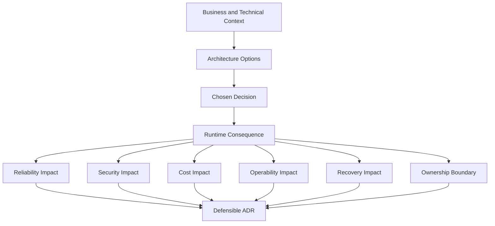

# Part 096 — Kubernetes Architecture Decision Checklist

## 1. Tujuan Part Ini

Part ini membahas cara membuat dan mereview keputusan arsitektur Kubernetes secara defensible untuk backend services.

Keputusan Kubernetes yang buruk jarang terlihat langsung sebagai bug. Biasanya efeknya muncul nanti sebagai:

- rollout yang tidak bisa rollback
- autoscaling yang memperburuk incident
- dependency overload
- secret rotation failure
- ingress timeout mismatch
- pod pending karena placement constraint
- network policy yang terlalu longgar atau terlalu ketat
- observability gap saat outage
- biaya cluster yang naik tanpa reliability benefit
- ownership boundary yang kabur antara backend, platform, SRE, security, dan DevOps

Architecture Decision Record atau ADR untuk Kubernetes harus menjawab bukan hanya **apa yang dipilih**, tetapi juga **kenapa pilihan itu aman secara production operations**.

---

## 2. Mental Model ADR Kubernetes

ADR Kubernetes harus menghubungkan design choice dengan runtime consequence.



A good ADR explains:

- decision context
- options considered
- selected option
- rejected options and reasons
- operational consequences
- failure modes
- observability plan
- rollback/migration path
- security and compliance impact
- cost impact
- owner and escalation boundary

---

## 3. When a Kubernetes ADR Is Required

Tidak semua YAML change butuh ADR. Namun ADR atau lightweight decision note diperlukan jika perubahan menyentuh runtime architecture atau blast radius.

ADR direkomendasikan untuk:

- workload type baru
- service exposure baru
- ingress/gateway strategy
- autoscaling strategy
- stateful workload di Kubernetes
- storage/PVC strategy
- secret management strategy
- cloud identity strategy
- cross-namespace communication
- network policy model
- deployment strategy baru
- migration strategy
- observability standard
- major resource/capacity change
- multi-region/DR decision
- EKS/AKS/on-prem specific integration
- security exception
- production readiness exception

Rule praktis:

> Jika keputusan sulit di-rollback, memengaruhi banyak service, mengubah security boundary, atau mengubah incident response path, buat ADR.

---

## 4. ADR Template for Kubernetes Decisions

Gunakan struktur minimum berikut.

```mdx
# ADR: <Decision Title>

## Status
Proposed | Accepted | Superseded | Deprecated

## Context
Apa masalahnya? Service apa yang terdampak? Environment apa? Apa constraint production?

## Decision
Apa pilihan yang diambil?

## Options Considered
1. Option A
2. Option B
3. Option C

## Decision Drivers
- Reliability
- Security
- Operability
- Cost
- Compliance
- Delivery speed
- Platform alignment

## Consequences
### Positive
### Negative
### Risks

## Failure Modes
Apa yang bisa gagal dan bagaimana mendeteksinya?

## Observability
Dashboard, metrics, logs, traces, events, alerts, SLO.

## Rollback / Migration Plan
Bagaimana kembali atau berpindah jika keputusan gagal?

## Ownership
Backend owner, platform/SRE owner, security owner, escalation path.

## Internal Verification Checklist
Apa yang harus dicek di cluster, GitOps repo, pipeline, runbook, dan team internal?
```

---

## 5. Workload Type Decision Checklist

Pertanyaan utama:

> Apakah workload ini seharusnya Deployment, StatefulSet, Job, CronJob, atau external managed service integration?

### 5.1 Deployment

Cocok untuk:

- stateless API service
- JAX-RS backend
- Kafka/RabbitMQ consumer yang berjalan terus
- Camunda worker
- Redis-backed API service

Cek:

- readiness/liveness/startup probe
- graceful shutdown
- HPA/PDB
- rolling update
- dependency pool sizing
- observability

Risiko:

- state tersimpan di local filesystem
- replica scaling merusak ordering
- shutdown tidak aman untuk consumer/worker

### 5.2 StatefulSet

Cocok untuk:

- workload yang butuh identity stabil
- storage stabil
- ordered rollout
- headless service

Red flag:

- memakai StatefulSet hanya karena aplikasi butuh local file sementara
- menjalankan dependency kritikal tanpa operator/runbook/backup
- backend team menjadi owner stateful infra tanpa capability operasional

### 5.3 Job/CronJob

Cocok untuk:

- migration job
- batch processing
- reconciliation
- scheduled cleanup
- one-time administrative workload

Cek:

- idempotency
- retry/backoff
- timeout
- concurrency control
- failure notification
- audit trail

### 5.4 Decision Checklist

- [ ] Apakah workload stateless atau stateful?
- [ ] Apakah workload harus always-on atau finite execution?
- [ ] Apakah duplicate execution aman?
- [ ] Apakah workload butuh stable identity?
- [ ] Apakah local disk bersifat temporary atau durable?
- [ ] Apakah scaling horizontal aman?
- [ ] Apakah shutdown behavior jelas?
- [ ] Apakah observability sesuai workload type?

---

## 6. Stateful vs Managed Service Decision Checklist

Pertanyaan utama:

> Apakah PostgreSQL/Kafka/RabbitMQ/Redis/Camunda dependency sebaiknya self-managed di Kubernetes atau memakai managed/platform-provided service?

### 6.1 Self-Managed in Kubernetes

Keuntungan:

- kontrol konfigurasi tinggi
- dekat dengan workload
- konsisten dengan GitOps
- bisa cocok untuk dev/test atau edge/on-prem requirement tertentu

Biaya operasional:

- backup/restore
- upgrade
- storage failure
- quorum management
- performance tuning
- security patching
- operator lifecycle
- DR testing
- on-call expertise

### 6.2 Managed Service

Keuntungan:

- operational burden lebih rendah
- backup/restore biasanya lebih matang
- patch/upgrade lebih terkelola
- observability dan SLA platform/cloud lebih jelas

Trade-off:

- network/private endpoint complexity
- cost
- version/feature constraints
- cross-region behavior
- identity/secret integration
- vendor-specific operational model

### 6.3 Decision Checklist

- [ ] Siapa owner operational dependency?
- [ ] Apakah team punya expertise stateful operations?
- [ ] Apa RPO/RTO dependency?
- [ ] Bagaimana backup/restore diuji?
- [ ] Bagaimana upgrade dilakukan?
- [ ] Bagaimana security patching?
- [ ] Bagaimana capacity planning?
- [ ] Bagaimana DR/failover?
- [ ] Bagaimana aplikasi men-debug dependency failure?
- [ ] Apa cost managed vs self-managed?

Untuk backend engineer, default yang lebih aman untuk critical production dependency biasanya adalah managed/platform-owned service, kecuali ada alasan kuat dan capability operasional yang jelas untuk self-managed.

---

## 7. Ingress vs Gateway vs API Gateway Decision Checklist

Pertanyaan utama:

> Traffic masuk ke service lewat Ingress, Gateway API, API Gateway enterprise, service mesh, atau kombinasi?

### 7.1 Ingress

Cocok untuk:

- HTTP routing standar
- host/path routing sederhana
- TLS termination dasar
- NGINX ingress pattern existing

Risiko:

- annotation sprawl
- ownership campur antara app/platform
- sulit express policy kompleks
- timeout/rewrite berbeda antar controller

### 7.2 Gateway API

Cocok untuk:

- route ownership lebih eksplisit
- separation of concerns GatewayClass/Gateway/HTTPRoute
- progressive modernization dari Ingress
- policy attachment yang lebih terstruktur

Risiko:

- maturity berbeda tergantung implementation
- migration complexity
- team perlu model baru

### 7.3 Enterprise API Gateway

Cocok untuk:

- edge auth
- rate limiting
- API product/governance
- external consumer management
- centralized security policy

Risiko:

- timeout chain lebih panjang
- debugging layer bertambah
- ownership boundary lebih kompleks
- route propagation delay

### 7.4 Decision Checklist

- [ ] Siapa consumer API: internal, external, partner, system-to-system?
- [ ] Apakah perlu edge auth/rate limiting/API product governance?
- [ ] Di mana TLS termination?
- [ ] Di mana request timeout dikontrol?
- [ ] Bagaimana trace/correlation ID dipropagasikan?
- [ ] Siapa owner route?
- [ ] Bagaimana rollback route?
- [ ] Bagaimana 502/503/504 ditriage?
- [ ] Apakah path rewrite kompatibel dengan JAX-RS base path?

---

## 8. Autoscaling Decision Checklist

Pertanyaan utama:

> Service ini harus scale berdasarkan CPU, memory, request rate, latency, queue depth, Kafka lag, atau tidak autoscale sama sekali?

### 8.1 CPU/Memory HPA

Cocok untuk:

- stateless API dengan CPU-bound load
- predictable relation antara CPU dan throughput

Kurang cocok untuk:

- I/O-bound service
- queue consumer dengan backlog metric lebih tepat
- service dengan bottleneck dependency

### 8.2 Custom/External Metrics

Cocok untuk:

- request rate
- p95 latency
- active request
- queue depth
- Kafka lag
- RabbitMQ ready messages

Risiko:

- metric lag
- missing metric
- scaling thrash
- over-scaling dependency

### 8.3 No Autoscaling / Fixed Replica

Cocok untuk:

- deterministic capacity
- strict ordering
- sensitive dependency capacity
- service critical yang scale manual melalui controlled process

### 8.4 Decision Checklist

- [ ] Apa signal terbaik untuk load?
- [ ] Apakah scale-out benar-benar meningkatkan throughput?
- [ ] Apa bottleneck dependency?
- [ ] Apa min replica untuk availability?
- [ ] Apa max replica berdasarkan DB/broker/cache capacity?
- [ ] Bagaimana stabilization window?
- [ ] Bagaimana cold start Java memengaruhi scale-up?
- [ ] Bagaimana scaling memengaruhi Kafka rebalance atau RabbitMQ prefetch?
- [ ] Apa alert untuk autoscaling failure?

---

## 9. Storage Decision Checklist

Pertanyaan utama:

> Apakah workload butuh durable storage, temporary storage, object storage, database storage, atau tidak boleh menyimpan state lokal?

### 9.1 Temporary Storage

Gunakan untuk:

- temp file
- upload staging
- batch intermediate file
- cache sementara

Cek:

- EmptyDir size limit
- ephemeral storage request/limit
- cleanup
- eviction behavior

### 9.2 Persistent Volume

Gunakan jika:

- workload benar-benar butuh durable disk
- lifecycle disk harus mengikuti workload tertentu
- backup/restore jelas

Risiko:

- PVC pending
- mount failure
- zone binding issue
- disk full
- backup gap

### 9.3 Object Storage / External Storage

Sering lebih cocok untuk:

- file upload durable
- document artifacts
- large generated outputs
- integration payload archive

### 9.4 Decision Checklist

- [ ] Apakah data boleh hilang saat pod restart?
- [ ] Apakah data harus shared antar replica?
- [ ] Apakah object storage lebih tepat?
- [ ] Apa backup/restore plan?
- [ ] Apa encryption requirement?
- [ ] Apa size growth pattern?
- [ ] Bagaimana disk full dideteksi?
- [ ] Bagaimana zone/node failure memengaruhi volume?

---

## 10. Secret Strategy Decision Checklist

Pertanyaan utama:

> Secret dikelola sebagai Kubernetes Secret, External Secrets, Secrets Store CSI, cloud secret manager, atau pipeline-injected value?

### 10.1 Kubernetes Secret Only

Cocok untuk:

- dev/test sederhana
- secret yang disinkronkan oleh platform
- low rotation complexity

Risiko:

- lifecycle tidak jelas
- rotation manual
- leakage via manifest/tooling

### 10.2 External Secrets Operator

Cocok untuk:

- sync cloud secret ke Kubernetes Secret
- GitOps-friendly reference
- centralized secret source

Risiko:

- sync delay
- operator failure
- cloud IAM failure
- stale synced secret

### 10.3 Secrets Store CSI Driver

Cocok untuk:

- mount secret dari external provider
- mengurangi persistensi secret sebagai Kubernetes Secret jika dikonfigurasi demikian

Risiko:

- mount failure
- rotation semantics berbeda
- app reload behavior perlu jelas

### 10.4 Decision Checklist

- [ ] Apa source of truth secret?
- [ ] Apakah secret value pernah masuk Git?
- [ ] Bagaimana rotation dilakukan?
- [ ] Apakah app bisa reload atau butuh restart?
- [ ] Siapa owner secret?
- [ ] Bagaimana access audited?
- [ ] Apa failure mode jika secret provider down?
- [ ] Bagaimana rollback secret?

---

## 11. Identity Strategy Decision Checklist

Pertanyaan utama:

> Bagaimana workload mendapat permission ke Kubernetes API dan cloud services?

### 11.1 Kubernetes RBAC

Decision points:

- dedicated ServiceAccount
- namespace Role vs ClusterRole
- token automount
- least privilege

### 11.2 EKS IRSA

Decision points:

- OIDC provider
- ServiceAccount annotation
- IAM role trust policy
- AWS SDK credential chain
- KMS/Secrets Manager/SSM permission

### 11.3 AKS Workload Identity

Decision points:

- managed identity
- federated credential
- ServiceAccount labels/annotations
- Azure SDK credential chain
- Key Vault/Azure RBAC permission

### 11.4 Decision Checklist

- [ ] Apa permission minimum workload?
- [ ] Apakah workload perlu Kubernetes API access?
- [ ] Apakah workload perlu cloud API access?
- [ ] Apakah identity per service atau shared?
- [ ] Bagaimana credential rotation/token expiry?
- [ ] Bagaimana access denied ditriage?
- [ ] Apakah audit log tersedia?
- [ ] Siapa approver security?

---

## 12. NetworkPolicy Decision Checklist

Pertanyaan utama:

> Apakah namespace/workload memakai default deny? Traffic mana yang boleh masuk dan keluar?

Decision dimensions:

- ingress allowlist
- egress allowlist
- DNS egress
- database egress
- Kafka/RabbitMQ/Redis egress
- Camunda egress
- cloud service egress
- namespace selector
- pod selector
- IPBlock usage

Checklist:

- [ ] Apakah default deny berlaku?
- [ ] Apa source traffic yang valid?
- [ ] Apa dependency egress yang dibutuhkan?
- [ ] Apakah DNS egress diizinkan?
- [ ] Bagaimana private endpoint di-handle?
- [ ] Bagaimana policy dites sebelum production?
- [ ] Bagaimana blocked traffic dideteksi?
- [ ] Siapa owner exception?

Trade-off:

| Policy posture | Benefit | Risk |
|---|---|---|
| Permissive | Mudah deploy | Lateral movement risk |
| Default deny | Security kuat | Breakage jika dependency map tidak lengkap |
| Centralized shared policy | Konsisten | Bisa kurang spesifik |
| Per-service policy | Least privilege | Maintenance overhead |

---

## 13. Deployment Strategy Decision Checklist

Pertanyaan utama:

> Apakah release cukup rolling update, atau butuh canary, blue-green, feature flag, atau migration choreography?

### 13.1 Rolling Update

Cocok untuk:

- backward compatible change
- stateless API
- low-risk config change

Risiko:

- mixed version period
- database compatibility issue
- event schema mismatch

### 13.2 Canary

Cocok untuk:

- high-risk API behavior
- performance-sensitive change
- route/traffic splitting available
- metric-based promotion possible

Risiko:

- canary metric tidak representatif
- traffic split layer kompleks
- stateful side effect tetap global

### 13.3 Blue-Green

Cocok untuk:

- fast switch/rollback
- environment validation sebelum traffic switch
- major runtime change

Risiko:

- cost double
- database/cache/event compatibility
- duplicate consumer risk

### 13.4 Feature Flag

Cocok untuk:

- behavior toggle
- gradual enablement
- per-tenant/per-user rollout

Risiko:

- flag debt
- inconsistent behavior
- hidden production complexity

### 13.5 Decision Checklist

- [ ] Apakah perubahan backward compatible?
- [ ] Apakah database migration expand-contract?
- [ ] Apakah event schema compatible?
- [ ] Apakah old/new version bisa berjalan bersamaan?
- [ ] Apakah rollback aman setelah data berubah?
- [ ] Apakah canary metrics tersedia?
- [ ] Apakah blast radius bisa dikontrol?
- [ ] Apakah feature flag punya cleanup plan?

---

## 14. Observability Decision Checklist

Pertanyaan utama:

> Sinyal apa yang wajib ada agar keputusan ini bisa dioperasikan saat production failure?

Cek:

- logs
- metrics
- traces
- Kubernetes events
- deployment markers
- dashboard
- alert
- SLO
- runbook
- evidence capture

Checklist:

- [ ] Apa symptom utama jika keputusan ini gagal?
- [ ] Metric apa yang mendeteksi symptom tersebut?
- [ ] Log apa yang memberi evidence?
- [ ] Trace/span apa yang menunjukkan dependency path?
- [ ] Event Kubernetes apa yang relevan?
- [ ] Alert mana yang paging?
- [ ] Dashboard mana yang dibuka saat incident?
- [ ] Runbook mana yang menjelaskan mitigation?

ADR tanpa observability plan adalah design yang tidak siap dioperasikan.

---

## 15. Resource and Capacity Decision Checklist

Pertanyaan utama:

> Apakah resource, replica, pool, dependency, dan node capacity selaras?

Cek:

- CPU/memory request
- CPU/memory limit
- JVM heap/native memory
- connection pool per pod
- HPA max replica
- DB max connection
- Kafka partitions
- RabbitMQ queue/consumer capacity
- Redis connection limit
- node pool capacity
- quota
- cost

Checklist:

- [ ] Request/limit berdasarkan usage/load test.
- [ ] JVM sizing sesuai memory limit.
- [ ] HPA max tidak overload dependency.
- [ ] Rollout surge diperhitungkan.
- [ ] Quota cukup.
- [ ] Node capacity cukup.
- [ ] Cost increase disadari.
- [ ] Alert capacity tersedia.

---

## 16. EKS/AKS/On-Prem Decision Checklist

Pertanyaan utama:

> Apakah keputusan ini bergantung pada cloud/provider/platform tertentu?

### EKS

Cek:

- VPC CNI behavior
- subnet IP capacity
- security group
- ALB/NLB controller
- IRSA
- EBS CSI
- Secrets Manager/SSM/KMS
- Route 53/VPC endpoint

### AKS

Cek:

- Azure CNI
- VNet/subnet/NSG/UDR
- Application Gateway/AGIC
- Azure Load Balancer
- ACR
- Managed Identity / Workload Identity
- Key Vault CSI
- Azure Monitor

### On-Prem/Hybrid

Cek:

- corporate DNS
- internal CA
- proxy/NO_PROXY
- firewall allowlist
- air-gapped registry
- on-prem LB
- hybrid private connectivity

Decision checklist:

- [ ] Apa provider-specific dependency?
- [ ] Apa failure mode provider layer?
- [ ] Siapa platform owner?
- [ ] Bagaimana environment parity?
- [ ] Bagaimana local/dev/test berbeda dari prod?
- [ ] Apa runbook provider-specific?

---

## 17. Security and Compliance Decision Checklist

Pertanyaan utama:

> Apakah keputusan ini mengubah security boundary, data exposure, privilege, atau auditability?

Cek:

- pod security
- RBAC
- cloud IAM
- network isolation
- secret handling
- TLS/mTLS
- audit log
- image provenance
- admission policy
- compliance evidence

Checklist:

- [ ] Least privilege diterapkan.
- [ ] Secret tidak terekspos.
- [ ] Network path minimal.
- [ ] TLS/truststore jelas.
- [ ] Image source/provenance jelas.
- [ ] Policy exception terdokumentasi.
- [ ] Audit evidence tersedia.
- [ ] Security owner menyetujui perubahan high-risk.

---

## 18. Cost Decision Checklist

Pertanyaan utama:

> Apa biaya tambahan dan apakah biaya tersebut membeli reliability, security, atau operability yang jelas?

Cek:

- extra replicas
- higher requests
- dedicated node pool
- blue-green environment
- extra load balancer
- NAT traffic
- cross-zone/cross-region traffic
- log/metric/tracing volume
- storage class
- managed service tier

Checklist:

- [ ] Cost driver utama diketahui.
- [ ] Overprovisioning disengaja atau accidental?
- [ ] Request vs usage dipantau.
- [ ] Log/metric cardinality terkendali.
- [ ] NAT/egress cost dipahami.
- [ ] Blue-green/canary cost diterima.
- [ ] Cost label/owner ada.

Cost bukan alasan untuk mengorbankan reliability critical path, tetapi cost harus terlihat dalam keputusan.

---

## 19. Rollback and Migration Decision Checklist

Pertanyaan utama:

> Jika keputusan ini salah, bagaimana keluar dari keputusan ini?

Cek:

- rollback path
- migration path
- data compatibility
- config compatibility
- secret rollback
- route rollback
- autoscaling rollback
- network policy rollback
- GitOps rollback
- database rollback limitation

Checklist:

- [ ] Rollback tidak hanya `kubectl rollout undo`.
- [ ] Data/schema compatibility dijelaskan.
- [ ] Old/new version compatibility jelas.
- [ ] Config/secret rollback jelas.
- [ ] Network/routing rollback jelas.
- [ ] Observability untuk rollback validation tersedia.
- [ ] Authority rollback jelas.

---

## 20. Ownership Decision Checklist

Pertanyaan utama:

> Siapa yang memiliki keputusan ini saat berjalan baik, saat rusak, dan saat perlu diubah?

Cek:

- backend owner
- platform owner
- SRE owner
- security owner
- DevOps/pipeline owner
- database/dependency owner
- incident commander/on-call
- approval path

Checklist:

- [ ] Backend responsibility jelas.
- [ ] Platform/SRE responsibility jelas.
- [ ] Security responsibility jelas.
- [ ] Escalation path jelas.
- [ ] Runbook owner jelas.
- [ ] Dashboard/alert owner jelas.
- [ ] Review cadence jelas.

ADR tanpa ownership akan menjadi orphan decision.

---

## 21. Example Decision: Kafka Consumer Autoscaling

### Context

Kafka consumer untuk order event processing mengalami lag saat peak traffic.

### Options

1. Increase fixed replicas from 4 to 8.
2. Use HPA CPU-based scaling.
3. Use KEDA Kafka lag-based scaling.
4. Optimize processing latency before scaling.

### Decision Drivers

- reduce lag
- avoid rebalance storm
- preserve ordering constraints
- avoid DB overload
- maintain cost awareness

### Review Questions

- Berapa partition count?
- Apakah replicas > partitions bermanfaat?
- Apakah processing bottleneck CPU, DB, external API, atau lock contention?
- Apakah offset commit aman saat pod termination?
- Apakah graceful shutdown cukup panjang?
- Apa max replica berdasarkan DB pool capacity?
- Apakah lag metric reliable?
- Bagaimana scaling stabilization?

### Possible Decision

Adopt KEDA lag-based scaling with conservative max replica equal to partition count, stabilization window, graceful shutdown validation, DB pool cap review, and lag/error dashboard.

### Failure Modes

- rebalance storm
- duplicate processing
- DB connection exhaustion
- lag metric missing
- delayed scale-up
- over-scaling during broker incident

### Required Observability

- consumer lag
- rebalance count
- processing latency
- error/DLQ rate
- DB pool usage
- pod restarts
- KEDA/HPA events

---

## 22. Example Decision: External Secrets Strategy

### Context

Backend service needs credentials for PostgreSQL, Redis, and cloud API.

### Options

1. Store Kubernetes Secret directly.
2. Sync from cloud secret manager through External Secrets Operator.
3. Mount via Secrets Store CSI Driver.
4. Inject through CI/CD pipeline.

### Decision Drivers

- rotation
- auditability
- GitOps compatibility
- leakage prevention
- operational simplicity
- cloud identity maturity

### Review Questions

- Apa source of truth?
- Siapa owner rotation?
- Apakah application reload secret?
- Jika tidak reload, bagaimana restart dipicu?
- Bagaimana sync failure dideteksi?
- Bagaimana access denied ditriage?
- Apakah secret value pernah masuk Git/log?

### Possible Decision

Use cloud secret manager as source of truth, External Secrets Operator for Kubernetes sync, dedicated ServiceAccount/workload identity, rotation alert, and controlled restart procedure for non-hot-reload secrets.

---

## 23. Internal Verification Checklist

Gunakan checklist ini untuk memvalidasi keputusan dengan CSG/team internal tanpa mengarang detail environment.

### Architecture and Ownership

- [ ] Apakah ada ADR template internal?
- [ ] Siapa approver backend/platform/SRE/security?
- [ ] Apakah keputusan ini memengaruhi lebih dari satu service?
- [ ] Apakah service criticality sudah diketahui?
- [ ] Apakah escalation path tersedia?

### Cluster and Workload

- [ ] Namespace target apa?
- [ ] Workload type apa?
- [ ] Deployment/StatefulSet/Job/CronJob sudah tepat?
- [ ] Resource request/limit sesuai policy?
- [ ] HPA/PDB/NetworkPolicy/RBAC sesuai standard?

### Traffic and Dependency

- [ ] Ingress/Gateway/API Gateway pattern internal apa?
- [ ] Service discovery pattern apa?
- [ ] Dependency PostgreSQL/Kafka/RabbitMQ/Redis/Camunda dikelola siapa?
- [ ] Private endpoint/DNS/proxy/firewall perlu dicek?
- [ ] Timeout/retry standard internal apa?

### Security and Secret

- [ ] Secret strategy internal apa?
- [ ] Workload identity pattern untuk EKS/AKS apa?
- [ ] NetworkPolicy default deny berlaku?
- [ ] Admission policy apa yang aktif?
- [ ] Security exception process apa?

### Observability and Operations

- [ ] Dashboard mana yang wajib?
- [ ] Alert mana yang paging?
- [ ] SLO/SLI service ada?
- [ ] Runbook ada?
- [ ] Incident notes terdahulu relevan?
- [ ] Deployment marker tersedia?

### Delivery and Rollback

- [ ] GitOps tool apa yang digunakan?
- [ ] Helm/Kustomize/raw manifest?
- [ ] Sync wave/order diperlukan?
- [ ] Rollback melalui Git atau tool release?
- [ ] Migration backward compatible?
- [ ] Smoke test/post-deployment verification ada?

---

## 24. ADR Review Rubric

Gunakan rubric berikut saat mereview keputusan.

| Area | Pertanyaan | Blocker jika tidak jelas? |
|---|---|---|
| Context | Masalah dan constraint jelas? | Ya |
| Options | Alternatif realistis dibahas? | Ya untuk keputusan besar |
| Reliability | Failure mode dan mitigation jelas? | Ya |
| Security | Boundary dan privilege jelas? | Ya |
| Cost | Cost driver diketahui? | Tergantung criticality |
| Operability | Dashboard/alert/runbook ada? | Ya untuk production |
| Rollback | Exit path jelas? | Ya |
| Ownership | Owner dan escalation jelas? | Ya |
| Internal Fit | Sesuai platform standard? | Ya |

Jika ADR tidak bisa menjelaskan failure mode, observability, dan rollback, keputusan belum cukup matang untuk production.

---

## 25. Kesimpulan

Kubernetes architecture decision yang baik bukan sekadar memilih object atau tool. Keputusan yang baik menjelaskan konsekuensi runtime dan dapat dipertanggungjawabkan saat terjadi incident.

Untuk senior backend engineer, kemampuan pentingnya adalah menghubungkan pilihan Kubernetes dengan:

- lifecycle aplikasi Java/JAX-RS
- traffic flow
- dependency behavior
- resource/capacity model
- rollout/rollback safety
- observability
- security posture
- cost
- ownership
- incident response

Prinsip akhirnya:

> Jangan membuat keputusan Kubernetes hanya karena manifest bisa dibuat. Buat keputusan karena runtime behavior, failure mode, ownership, observability, dan rollback path-nya dapat dijelaskan dengan jelas.
