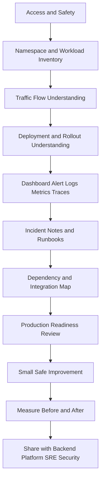
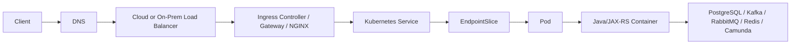
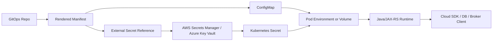

# Part 097 — 30/60/90-Day Kubernetes Operations Onboarding Plan

## 1. Tujuan Part Ini

Part ini adalah rencana onboarding praktis untuk menjadi efektif di environment Kubernetes production sebagai senior backend engineer.

Targetnya bukan menjadi cluster admin, melainkan menjadi service owner yang bisa:

- membaca runtime state service sendiri
- memahami traffic flow dari edge sampai pod
- men-debug failure secara production-safe
- mereview Kubernetes manifest dan deployment change
- memahami boundary dengan platform, SRE, security, DevOps, dan database team
- menghubungkan gejala aplikasi Java/JAX-RS dengan Kubernetes runtime
- memperbaiki readiness service tanpa mengganggu ownership internal
- masuk ke incident dengan mental model yang jelas

Di konteks enterprise seperti CPQ, quote management, order management, quote-to-cash, billing integration, Kafka/RabbitMQ, PostgreSQL, Redis, Camunda, NGINX/Ingress, cloud/on-prem/hybrid, dan GitOps/IaC, onboarding Kubernetes tidak cukup dengan belajar command.

Yang harus dibangun adalah operational familiarity terhadap sistem nyata.

---

## 2. Prinsip Onboarding Kubernetes Production

Onboarding production Kubernetes harus dimulai dari observasi, bukan perubahan.

Urutan yang aman:

1. pahami akses dan boundary
2. pahami namespace dan ownership
3. pahami workload inventory
4. pahami traffic flow
5. pahami deployment flow
6. pahami observability
7. pahami runbook dan incident history
8. pahami dependency map
9. pahami security and identity model
10. baru usulkan improvement kecil yang terukur

Jangan mulai dari:

- mengubah resource limit tanpa data
- menambah replica tanpa memahami dependency capacity
- mengganti probe tanpa memahami startup/shutdown behavior
- menambah NetworkPolicy tanpa observability traffic
- melakukan manual hotfix di cluster yang dikelola GitOps
- menjalankan command mutating di production tanpa approval

Mental modelnya:



---

## 3. Target 30/60/90 Hari

Rencana ini dibagi menjadi tiga fase.

| Fase | Fokus | Output utama |
|---|---|---|
| 0-30 hari | orientasi runtime dan observability | service map, namespace map, dashboard map, runbook map |
| 31-60 hari | operational reasoning dan incident familiarity | traffic flow, rollout flow, dependency flow, autoscaling/config/secret/identity understanding |
| 61-90 hari | contribution dan hardening | satu runbook diperbaiki, satu observability gap ditutup, satu workload readiness review selesai |

Ukuran keberhasilan bukan jumlah dokumen yang dibaca.

Ukuran keberhasilan adalah:

- bisa menjelaskan bagaimana service menerima request
- bisa menjelaskan bagaimana service dideploy
- bisa menjelaskan failure mode utama service
- bisa tahu dashboard dan alert mana yang relevan
- bisa tahu kapan rollback dan kapan eskalasi
- bisa mereview PR Kubernetes dengan confidence
- bisa menghindari perubahan yang memperbesar incident

---

## 4. Hari 0-3 — Access, Safety, and Context Setup

Fase pertama adalah memastikan akses dan batas kewenangan jelas.

### 4.1 Yang harus dipahami

- cluster apa saja yang relevan
- environment apa saja yang tersedia
- namespace apa saja yang dimiliki tim
- kubeconfig dan context naming
- akses read-only vs write
- production access process
- break-glass procedure
- audit log expectation
- GitOps repository source of truth
- deployment pipeline
- incident communication channel
- escalation path

### 4.2 Pertanyaan penting

Tanyakan ke team lead, backend owner, platform/SRE, dan security:

- Namespace mana yang dimiliki tim Quote & Order?
- Service mana yang menjadi tanggung jawab langsung backend team?
- Apakah production changes dilakukan via GitOps, Helm, Kustomize, atau pipeline khusus?
- Apakah manual `kubectl apply` dilarang?
- Siapa yang boleh melakukan rollback production?
- Siapa owner ingress, load balancer, DNS, NetworkPolicy, dan cloud IAM?
- Apakah `kubectl exec`, `port-forward`, dan `debug` diperbolehkan di production?
- Di mana runbook incident disimpan?
- Di mana dashboard service dan dependency berada?
- Bagaimana cara melihat deployment history?

### 4.3 Safe commands

Gunakan command read-only terlebih dahulu.

```bash
kubectl config get-contexts
kubectl config current-context
kubectl get ns
kubectl auth can-i get pods -n <namespace>
kubectl auth can-i list deployments -n <namespace>
kubectl get deploy,rs,pod,svc,ingress,hpa,pdb -n <namespace>
```

Hindari command mutating:

```bash
kubectl delete ...
kubectl scale ...
kubectl rollout restart ...
kubectl apply ...
kubectl patch ...
kubectl edit ...
```

Kecuali ada approval dan proses internal yang jelas.

---

## 5. Hari 1-30 — Learn the Runtime Shape

Fase 30 hari pertama bertujuan membuat peta runtime.

Anda belum perlu menjadi orang yang menyelesaikan semua incident. Targetnya adalah bisa menjawab:

- workload apa saja yang berjalan?
- service mana yang critical?
- request masuk dari mana?
- dependency apa saja yang dipakai?
- dashboard mana yang dipakai saat incident?
- runbook mana yang tersedia?
- perubahan production melewati pipeline apa?

---

## 6. Minggu 1 — Namespace, Workload, and Ownership Map

### 6.1 Fokus

Bangun inventory dasar:

- namespace
- application name
- workload type
- owner
- environment
- criticality
- deployment source
- runtime dependencies
- dashboard links
- runbook links

### 6.2 Yang harus dikumpulkan

Untuk setiap namespace relevan:

```bash
kubectl get deploy,statefulset,job,cronjob,svc,ingress,hpa,pdb,cm,secret,sa -n <namespace>
kubectl get pods -n <namespace> --show-labels
kubectl get events -n <namespace> --sort-by=.lastTimestamp
```

Jangan buka isi Secret di production kecuali memang diizinkan dan ada alasan operasional yang sah.

### 6.3 Inventory table

Gunakan format seperti ini.

| Service | Namespace | Workload | Owner | Criticality | Ingress | Dependencies | Dashboard | Runbook |
|---|---|---|---|---|---|---|---|---|
| quote-api | TBD | Deployment | Backend | High | yes/no | PostgreSQL, Kafka, Redis | TBD | TBD |
| order-worker | TBD | Deployment | Backend | High | no | Kafka, Camunda | TBD | TBD |
| reconciliation-job | TBD | CronJob | Backend | Medium | no | PostgreSQL | TBD | TBD |

### 6.4 Red flags

- service tidak punya owner jelas
- label tidak konsisten
- service critical tidak punya dashboard
- workload tidak punya runbook
- deployment source tidak jelas
- banyak manual resource tanpa GitOps source
- namespace mencampur terlalu banyak ownership

---

## 7. Minggu 2 — Traffic Flow and Service Discovery

### 7.1 Fokus

Pahami path request dari client ke pod.



### 7.2 Yang harus dipahami

- DNS record untuk service external
- ingress host/path
- IngressClass atau GatewayClass
- TLS termination point
- Service selector
- EndpointSlice population
- container port dan targetPort
- readiness probe impact ke endpoint
- NGINX/API gateway timeout
- header propagation
- correlation ID propagation

### 7.3 Safe investigation commands

```bash
kubectl get ingress -n <namespace>
kubectl describe ingress <name> -n <namespace>
kubectl get svc -n <namespace>
kubectl describe svc <name> -n <namespace>
kubectl get endpointslice -n <namespace>
kubectl get pods -n <namespace> -l app=<app>
```

### 7.4 Output minggu 2

Buat satu traffic flow diagram untuk service paling critical.

Minimal mencakup:

- public/internal endpoint
- ingress/gateway
- service
- pod selector
- JAX-RS endpoint
- downstream dependency
- timeout boundary
- observability signal

---

## 8. Minggu 3 — Observability, Alerts, and Runbooks

### 8.1 Fokus

Cari tahu bagaimana service terlihat saat sehat dan saat rusak.

Yang harus dipelajari:

- dashboard service health
- dashboard Kubernetes workload
- dashboard JVM
- dashboard ingress
- dashboard dependency
- alert rules
- alert severity
- SLO/SLI
- runbook link
- incident history
- deployment markers

### 8.2 Dashboard minimum yang harus dicari

Untuk Java/JAX-RS API:

- request rate
- error rate
- latency p50/p95/p99
- saturation/thread pool
- DB pool usage
- JVM heap/non-heap
- GC pause
- pod restart count
- CPU throttling
- memory usage
- readiness state
- ingress 4xx/5xx/latency

Untuk Kafka/RabbitMQ consumer:

- lag atau queue depth
- processing rate
- error/retry/DLQ rate
- consumer replicas
- rebalance/redelivery signal
- pod restart impact
- dependency latency

### 8.3 Runbook review

Untuk setiap runbook, cek:

- symptom jelas atau tidak
- dashboard link tersedia atau tidak
- command investigasi aman atau tidak
- mitigation aman atau tidak
- rollback rule jelas atau tidak
- escalation path jelas atau tidak
- evidence capture disebut atau tidak
- post-incident action disebut atau tidak

### 8.4 Output minggu 3

Buat observability map:

| Signal | Tool/Dashboard | Owner | Used for | Gap |
|---|---|---|---|---|
| API latency | TBD | Backend/SRE | detect degradation | TBD |
| Pod restarts | TBD | Platform/Backend | detect crash loop | TBD |
| Kafka lag | TBD | Backend | detect backlog | TBD |
| DB pool usage | TBD | Backend/DB | detect saturation | TBD |

---

## 9. Minggu 4 — Deployment, Rollout, and Change History

### 9.1 Fokus

Pahami bagaimana code menjadi pod production.

Flow yang perlu dipetakan:

```mermaid
flowchart LR
    Commit[Commit] --> CI[Build and Test]
    CI --> Scan[Image and Security Scan]
    Scan --> Registry[Image Registry]
    Registry --> Manifest[Manifest or Values Update]
    Manifest --> GitOps[GitOps Sync or Deploy Pipeline]
    GitOps --> Cluster[Kubernetes Runtime]
    Cluster --> Verify[Smoke Test and Observability]
    Verify --> Rollback[Rollback Path if Needed]
```



### 9.2 Yang harus dicari

- pipeline build
- image tag/digest policy
- registry location
- Helm chart atau Kustomize overlay
- GitOps repo
- deployment approval
- environment promotion
- smoke test
- deployment marker
- rollback mechanism
- DB migration sequencing

### 9.3 Safe investigation commands

```bash
kubectl rollout history deploy/<deployment> -n <namespace>
kubectl rollout status deploy/<deployment> -n <namespace>
kubectl describe deploy/<deployment> -n <namespace>
kubectl get rs -n <namespace> -l app=<app>
```

### 9.4 Output hari ke-30

Di akhir 30 hari, Anda seharusnya punya:

- namespace map
- workload inventory
- service/dependency map
- traffic flow diagram minimal satu service critical
- dashboard map
- alert/runbook map
- deployment flow diagram
- list internal verification gaps

---

## 10. Hari 31-60 — Build Operational Reasoning

Fase kedua bertujuan membangun kemampuan debugging dan decision-making.

Targetnya:

- bisa menjelaskan failure mode utama service
- bisa mengikuti incident tanpa pasif
- bisa membedakan app issue vs platform issue
- bisa memahami rollout safety
- bisa membaca resource/autoscaling behavior
- bisa memahami secrets, identity, and config failure

---

## 11. Minggu 5 — Workload Failure Mode Study

Pilih 2-3 service critical dan buat failure mode map.

### 11.1 Untuk JAX-RS API service

Failure mode:

- pod not ready
- CrashLoopBackOff
- OOMKilled
- CPU throttling
- DB pool exhausted
- ingress 502/503/504
- timeout mismatch
- stale config
- missing secret
- DNS failure
- NetworkPolicy blocked

### 11.2 Untuk Kafka/RabbitMQ consumer

Failure mode:

- lag/queue depth naik
- consumer restart storm
- rebalance/redelivery spike
- DLQ spike
- poison message
- broker connection failure
- scaling tidak efektif
- shutdown tidak graceful

### 11.3 Untuk Camunda worker

Failure mode:

- job activation failure
- worker timeout
- incident spike
- process correlation failure
- retry storm
- dependency timeout
- worker concurrency terlalu tinggi

### 11.4 Output minggu 5

Buat failure mode table.

| Failure | Symptom | Kubernetes signal | App signal | Dependency signal | Safe mitigation | Escalate to |
|---|---|---|---|---|---|---|
| OOMKilled | pod restart | exit code 137 | heap/native pressure | none | rollback/reduce load/check memory | backend/platform |
| Ingress 504 | timeout | ingress event/log | slow request | DB latency | rollback/tune timeout/mitigate dependency | backend/SRE |

---

## 12. Minggu 6 — Resource, JVM, and Autoscaling Review

### 12.1 Fokus

Pahami apakah workload punya resource contract yang masuk akal.

Cek:

- CPU request
- CPU limit
- memory request
- memory limit
- JVM MaxRAMPercentage
- heap vs native memory
- thread count
- connection pool
- HPA target
- min/max replicas
- scaling metric
- cluster autoscaler behavior

### 12.2 Risk reasoning

Resource terlalu kecil:

- CPU throttling
- latency naik
- GC terganggu
- OOMKilled
- pod restart
- readiness flapping

Resource terlalu besar:

- scheduling sulit
- pod Pending
- node underutilized
- cost waste
- autoscaling tidak efektif

Replica terlalu banyak:

- DB connection spike
- Kafka rebalance cost
- RabbitMQ connection/channel pressure
- Redis connection pressure
- dependency overload

### 12.3 Output minggu 6

Pilih satu service dan buat resource review:

- current request/limit
- observed p50/p95/p99 usage
- restart/throttling history
- HPA behavior
- dependency pool capacity
- recommendation
- risk if changed
- validation plan

---

## 13. Minggu 7 — Config, Secret, Identity, and Access Debugging

### 13.1 Fokus

Pahami jalur runtime configuration dan permission.

Yang harus dipetakan:

- ConfigMap source
- Secret source
- External Secrets / CSI Driver jika ada
- cloud secret store
- ServiceAccount
- RBAC
- IRSA / Azure Workload Identity
- cloud IAM role
- secret rotation process
- config reload process
- pod restart requirement

### 13.2 Common failure

- app start gagal karena env missing
- pod jalan dengan stale secret
- secret rotated tapi app belum reload
- cloud SDK access denied
- ServiceAccount salah
- IAM trust policy/federated credential salah
- NetworkPolicy menghalangi secret provider
- GitOps drift membuat config kembali ke versi lama

### 13.3 Output minggu 7

Buat runtime configuration map.



---

## 14. Minggu 8 — Incident Shadowing and Runbook Validation

### 14.1 Fokus

Ikuti satu incident, alert review, atau postmortem.

Jangan hanya melihat penyebab akhir. Perhatikan proses:

- kapan alert muncul
- siapa yang menerima alert
- bagaimana impact diukur
- dashboard apa yang dibuka
- command apa yang dijalankan
- kapan rollback dipertimbangkan
- bagaimana komunikasi dilakukan
- evidence apa yang disimpan
- corrective action apa yang dibuat

### 14.2 Pertanyaan saat incident review

- Apakah alert berbasis symptom atau cause?
- Apakah severity tepat?
- Apakah dashboard cukup untuk triage cepat?
- Apakah runbook membantu atau membingungkan?
- Apakah rollback path jelas?
- Apakah ada missing deployment marker?
- Apakah ownership boundary jelas?
- Apakah customer/business impact bisa diukur?

### 14.3 Output hari ke-60

Di akhir 60 hari, Anda seharusnya punya:

- failure mode map service critical
- resource/autoscaling review satu service
- config/secret/identity runtime map
- incident review notes
- daftar gap runbook/dashboard/alert
- daftar PR review risk yang sering muncul

---

## 15. Hari 61-90 — Improve One Production Surface

Fase ketiga bertujuan menghasilkan kontribusi nyata tetapi tetap aman.

Pilih satu area kecil dengan impact tinggi:

- memperbaiki runbook
- menutup observability gap
- menambah deployment marker
- memperjelas readiness checklist
- memperbaiki PR review checklist
- menyesuaikan resource berdasarkan data
- memperbaiki probe yang salah
- memperbaiki dashboard dependency
- memperjelas rollback procedure
- membuat traffic flow diagram service critical

Jangan memilih improvement yang terlalu besar untuk 90 hari pertama seperti:

- mengganti ingress architecture
- redesign cluster autoscaling
- migration secret platform
- menerapkan NetworkPolicy global
- memindahkan dependency stateful
- mengubah deployment strategy semua service

---

## 16. Minggu 9-10 — Production Readiness Review One Workload

Pilih satu workload yang cukup penting tetapi manageable.

Review checklist:

- owner jelas
- deployment source jelas
- resource request/limit masuk akal
- JVM sizing konsisten dengan memory limit
- readiness/liveness/startup probe benar
- graceful shutdown tersedia
- PDB sesuai replica count
- HPA sesuai workload type
- connection pool sesuai replica max
- ingress/service/EndpointSlice valid
- NetworkPolicy tidak terlalu longgar atau terlalu ketat
- secrets/config reload behavior jelas
- ServiceAccount/RBAC least privilege
- cloud identity jelas
- dashboard tersedia
- alert actionable
- runbook tersedia
- rollback path jelas
- migration dependency jelas

Outputnya adalah satu review document atau PR kecil.

---

## 17. Minggu 11 — Runbook or Dashboard Improvement

### 17.1 Runbook improvement

Perbaiki runbook agar memiliki struktur:

1. symptom
2. impact check
3. likely causes
4. safe investigation commands
5. dashboard links
6. log/trace queries
7. mitigation options
8. rollback rule
9. escalation owner
10. evidence capture
11. post-incident follow-up

### 17.2 Dashboard improvement

Pastikan dashboard menjawab:

- apakah service menerima traffic?
- apakah service error?
- apakah latency naik?
- apakah pod restart?
- apakah pod ready?
- apakah CPU throttling?
- apakah memory pressure?
- apakah dependency lambat?
- apakah deployment baru terjadi?
- apakah queue/lag meningkat?

---

## 18. Minggu 12 — Share, Review, and Institutionalize

Jangan berhenti di personal note.

Bagikan hasil ke tim:

- service runtime map
- failure mode map
- runbook improvement
- dashboard gap
- PR checklist improvement
- production readiness checklist
- proposed next actions

Tujuannya membuat pengetahuan menjadi reusable.

Senior engineer yang efektif bukan hanya bisa men-debug sendiri, tetapi membuat tim lebih mudah men-debug incident berikutnya.

---

## 19. Pertanyaan untuk Backend Team

Tanyakan:

- Service mana yang paling critical untuk quote/order lifecycle?
- Service mana yang paling sering incident?
- Dependency mana yang paling rapuh?
- Apakah service punya SLO?
- Bagaimana retry, timeout, dan DLQ standard?
- Bagaimana graceful shutdown consumer/worker dilakukan?
- Bagaimana schema migration dijalankan?
- Bagaimana rollback dilakukan jika migration sudah jalan?
- Apakah ada known issue di resource sizing?
- Apakah ada dashboard yang dipercaya saat incident?

---

## 20. Pertanyaan untuk Platform/SRE Team

Tanyakan:

- Siapa owner cluster, node pool, CNI, ingress controller, DNS, and autoscaler?
- Apa production access model?
- Apakah GitOps source of truth wajib?
- Apa policy manual change?
- Bagaimana node drain/upgrade dilakukan?
- Bagaimana PDB dievaluasi?
- Bagaimana incident escalation dilakukan?
- Apa observability stack yang canonical?
- Apakah ada standard labels/annotations?
- Apakah ada standard manifest template?
- Apa expectation untuk runbook service owner?

---

## 21. Pertanyaan untuk Security Team

Tanyakan:

- Apa standard SecurityContext?
- Apakah runAsNonRoot wajib?
- Apakah readOnlyRootFilesystem wajib?
- Bagaimana secret inspection policy?
- Bagaimana secret rotation dilakukan?
- Apa standard NetworkPolicy?
- Apa policy egress ke internet/cloud services?
- Apa policy RBAC/ServiceAccount?
- Apa standard workload identity?
- Apa policy image scanning dan vulnerability exception?
- Apa audit evidence yang dibutuhkan saat incident?

---

## 22. Pertanyaan untuk DevOps/CI/CD Team

Tanyakan:

- Bagaimana pipeline build dan deploy bekerja?
- Bagaimana image tag/digest dipromosikan?
- Di mana Helm chart/Kustomize overlay berada?
- Bagaimana environment promotion dilakukan?
- Apakah ada approval gate?
- Bagaimana smoke test dijalankan?
- Bagaimana deployment marker dikirim?
- Bagaimana rollback dilakukan?
- Bagaimana failed deployment ditangani?
- Bagaimana secret/config dipromosikan antar environment?

---

## 23. Dokumen yang Harus Dicari

Cari dokumen internal berikut:

- architecture diagram
- service catalog
- namespace ownership map
- deployment pipeline guide
- GitOps repo guide
- Helm/Kustomize convention
- production access policy
- incident response guide
- on-call guide
- runbook index
- dashboard index
- alert severity guide
- SLO document
- security baseline
- secret management guide
- workload identity guide
- network policy standard
- DB migration guide
- DR/BCP document
- cluster upgrade guide
- compliance/audit evidence guide

Jika dokumen tidak ada, itu bukan kegagalan onboarding. Itu adalah gap yang bisa diperbaiki.

---

## 24. Dashboard yang Harus Dipelajari

Minimal pelajari dashboard untuk:

- Kubernetes namespace health
- Deployment availability
- pod restart/crash loop
- CPU/memory/throttling
- HPA behavior
- ingress traffic/errors/latency
- service API latency/error rate
- JVM heap/GC/thread
- DB connection pool
- PostgreSQL latency/error
- Kafka lag/consumer health
- RabbitMQ queue depth/unacked
- Redis latency/error
- Camunda incident/job metrics
- deployment/release history
- alert overview
- SLO/burn rate

---

## 25. Incident Notes yang Harus Dipelajari

Pilih minimal 3 incident lama.

Untuk setiap incident, catat:

- date/time
- affected service
- affected customer/business flow
- symptom
- detection method
- root cause
- contributing factors
- Kubernetes signal
- application signal
- dependency signal
- mitigation
- rollback or not
- evidence captured
- corrective action
- recurrence risk

Pertanyaan paling penting:

> Apakah incident ini bisa dicegah lewat PR review, readiness review, observability improvement, atau runbook improvement?

---

## 26. Production-Safe Practice Exercises

Latihan ini bersifat read-only dan aman.

### 26.1 Workload state exercise

Pilih satu Deployment.

Jawab:

- desired replicas berapa?
- ready replicas berapa?
- updated replicas berapa?
- unavailable replicas berapa?
- ReplicaSet mana yang aktif?
- revision terakhir apa?
- pod template berubah kapan?

### 26.2 Traffic path exercise

Pilih satu endpoint.

Jawab:

- DNS record apa?
- ingress rule mana?
- service mana?
- EndpointSlice mana?
- pod label apa?
- container port apa?
- JAX-RS resource mana?

### 26.3 Failure hypothesis exercise

Ambil satu alert historis.

Buat 3 hipotesis:

- app regression
- platform/runtime issue
- dependency issue

Untuk masing-masing, tulis sinyal yang membuktikan atau membantah.

---

## 27. Anti-Pattern Onboarding

Hindari pola berikut:

### 27.1 Menghafal command tanpa mental model

Command membantu, tetapi incident diselesaikan dengan hypothesis dan evidence.

### 27.2 Langsung mengubah production manifest

Perubahan tanpa peta ownership dan rollback path adalah risiko.

### 27.3 Menganggap semua 5xx adalah bug aplikasi

Ingress, endpoint, readiness, timeout, DNS, NetworkPolicy, dan dependency bisa menghasilkan gejala yang sama.

### 27.4 Mengabaikan dependency capacity

Menambah replica bisa memperburuk DB/broker/Redis pressure.

### 27.5 Menganggap staging sama dengan production

Perbedaan quota, traffic, data volume, identity, DNS, egress, dan node pool bisa signifikan.

### 27.6 Tidak membaca incident lama

Incident lama adalah dokumentasi paling jujur tentang weakness sistem.

---

## 28. Internal Verification Checklist

Gunakan checklist ini sepanjang 90 hari.

### Access and Safety

- [ ] Cluster/context yang relevan diketahui
- [ ] Namespace yang relevan diketahui
- [ ] Akses read-only/write jelas
- [ ] Production access process jelas
- [ ] Break-glass process jelas
- [ ] Audit expectation jelas
- [ ] Command yang dilarang/dibatasi diketahui

### Ownership

- [ ] Service owner diketahui
- [ ] Platform owner diketahui
- [ ] SRE owner diketahui
- [ ] Security owner diketahui
- [ ] DB/dependency owner diketahui
- [ ] Escalation path diketahui

### Workload Runtime

- [ ] Deployment/StatefulSet/Job/CronJob inventory ada
- [ ] Service/Ingress inventory ada
- [ ] HPA/PDB inventory ada
- [ ] ConfigMap/Secret source diketahui
- [ ] ServiceAccount/RBAC diketahui
- [ ] NetworkPolicy diketahui

### Traffic and Dependencies

- [ ] Traffic flow service critical dipetakan
- [ ] DNS/Ingress/Service/EndpointSlice dipahami
- [ ] PostgreSQL dependency dipetakan
- [ ] Kafka/RabbitMQ dependency dipetakan
- [ ] Redis dependency dipetakan
- [ ] Camunda dependency dipetakan
- [ ] Cloud service/private endpoint dipetakan

### Deployment and GitOps

- [ ] CI/CD flow diketahui
- [ ] Image registry diketahui
- [ ] Helm/Kustomize/GitOps source diketahui
- [ ] Promotion flow diketahui
- [ ] Smoke test diketahui
- [ ] Rollback path diketahui
- [ ] Migration sequencing diketahui

### Observability and Incident

- [ ] Dashboard service ditemukan
- [ ] Dashboard Kubernetes ditemukan
- [ ] Dashboard dependency ditemukan
- [ ] Alert rules ditemukan
- [ ] Runbook ditemukan
- [ ] Incident notes dipelajari
- [ ] SLO/SLI diketahui

### Improvement

- [ ] Satu runbook gap ditemukan
- [ ] Satu dashboard gap ditemukan
- [ ] Satu PR review risk ditemukan
- [ ] Satu production readiness review dilakukan
- [ ] Satu improvement kecil diusulkan atau dibuat

---

## 29. Expected Outcome Setelah 90 Hari

Setelah 90 hari, Anda seharusnya bisa:

- menjelaskan runtime topology service critical
- menelusuri request dari ingress sampai pod
- membaca rollout state
- membaca pod lifecycle failure
- membedakan app/platform/dependency issue
- memahami resource dan autoscaling risk
- men-debug config/secret/identity failure secara aman
- membaca dashboard dan alert dengan benar
- ikut incident dengan kontribusi evidence-based
- mereview PR Kubernetes dari sisi production risk
- memperbaiki runbook atau observability gap
- berdiskusi dengan platform/SRE/security tanpa asumsi liar

---

## 30. Ringkasan

30/60/90-day onboarding untuk Kubernetes operations bukan checklist administratif.

Ini adalah proses membangun operational memory.

Urutan efektifnya:

1. pahami akses dan safety
2. buat inventory namespace/workload
3. petakan traffic flow
4. pelajari observability dan runbook
5. pahami deployment/rollback flow
6. pelajari failure mode service critical
7. review resource/autoscaling/config/secret/identity
8. pelajari incident lama
9. lakukan satu production readiness review
10. kontribusikan satu improvement kecil yang terukur

Backend engineer yang kuat di Kubernetes bukan orang yang paling banyak mengetik command.

Backend engineer yang kuat adalah orang yang tahu **command mana yang aman**, **sinyal mana yang relevan**, **perubahan mana yang berisiko**, **kapan rollback**, dan **kapan harus eskalasi**.
