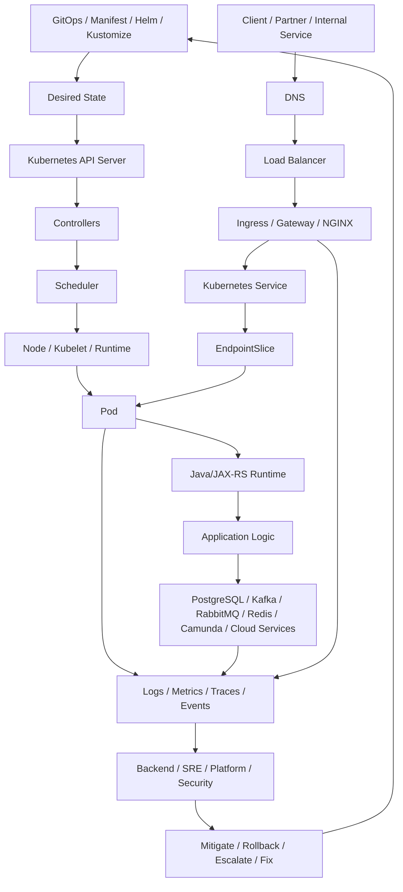
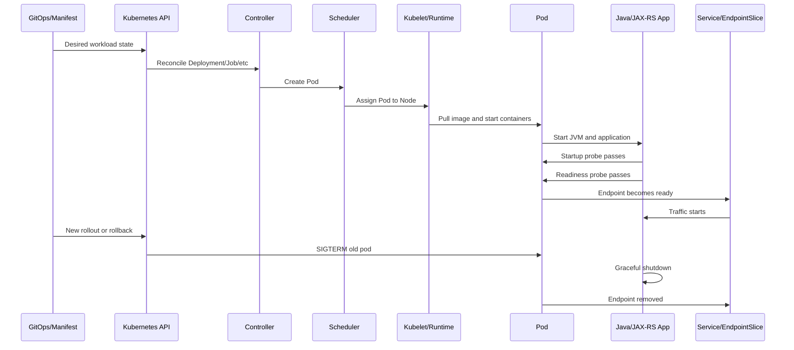
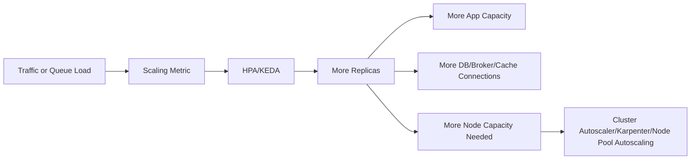
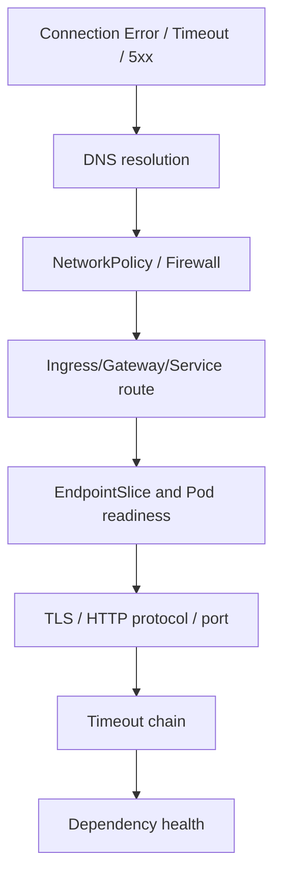
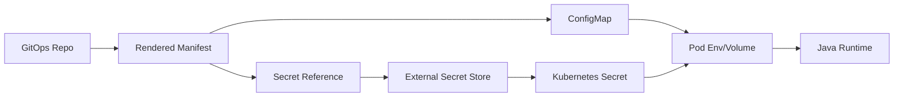
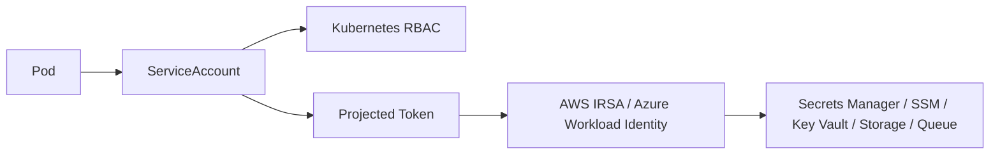
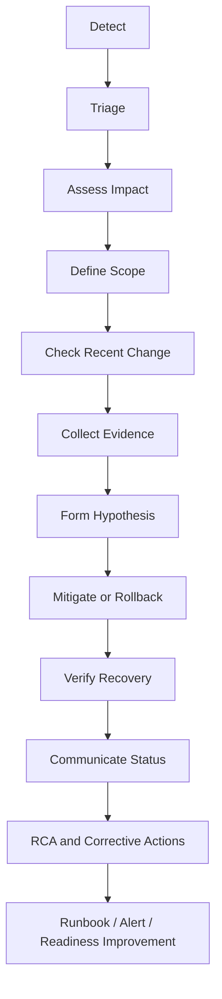

# Part 098 — Enterprise Kubernetes Operations Mastery Map for Backend Engineers

## 1. Tujuan Final Part

Part ini adalah penutup seri **Cheatsheet Enterprise Kubernetes Operations for Backend Engineers**.

Tujuannya adalah menggabungkan seluruh materi menjadi mastery map yang bisa dipakai sebagai:

- peta belajar lanjutan
- operational checklist
- incident response guide
- PR review guide
- production readiness review guide
- diskusi dengan platform/SRE/security/DevOps
- referensi saat debugging outage
- referensi saat menilai risiko deployment

Seri ini tidak mengubah backend engineer menjadi cluster admin.

Seri ini membentuk backend engineer yang mampu mengoperasikan service miliknya di Kubernetes secara production-aware.

---

## 2. Complete Kubernetes Operations Mental Model

Kubernetes production operations selalu bergerak di antara beberapa state:

- desired state di Git/manifest
- actual state di cluster
- runtime state di pod/container/JVM
- traffic state di ingress/service/endpoint
- dependency state di database/broker/cache/workflow engine
- observability state di logs/metrics/traces/events
- business state di quote/order/billing workflow

Mental model utamanya:



Prinsip utama:

> Jangan pernah men-debug Kubernetes hanya dari satu layer. Selalu hubungkan desired state, actual state, runtime state, traffic state, dependency state, dan observability state.

---

## 3. Responsibility Mastery Map

### 3.1 Backend service owner responsibility

Backend engineer biasanya bertanggung jawab atas:

- application behavior
- Java/JAX-RS runtime behavior
- readiness/liveness/startup endpoint behavior
- graceful shutdown
- timeout/retry/backpressure
- DB/broker/cache/client configuration
- resource request/limit proposal
- HPA signal relevance
- service dashboard and runbook
- application logs/metrics/traces
- PR review untuk manifest service sendiri
- production readiness service sendiri
- incident investigation untuk service sendiri

### 3.2 Platform/SRE responsibility

Platform/SRE biasanya bertanggung jawab atas:

- cluster lifecycle
- node pool/node group
- ingress controller platform
- CNI/network plugin
- cluster autoscaler/Karpenter/node pool autoscaling
- GitOps platform
- observability platform
- policy/admission control
- cluster upgrade
- platform incident response

### 3.3 Security responsibility

Security biasanya bertanggung jawab atas:

- RBAC governance
- secret handling policy
- workload identity policy
- image scanning policy
- NetworkPolicy standard
- audit/compliance requirement
- pod security baseline
- exception approval

### 3.4 Backend engineer must verify

Backend engineer tidak perlu menguasai semua detail internal cluster, tetapi wajib tahu:

- siapa owner tiap layer
- bagaimana mengeskalasi
- apa yang boleh dilakukan sendiri
- apa yang harus melalui approval
- apa yang hanya boleh dilakukan platform/SRE/security

---

## 4. Workload Lifecycle Mastery Map

Setiap workload harus bisa dibaca dari lifecycle berikut:



Checklist lifecycle:

- [ ] Pod bisa dijadwalkan
- [ ] Image bisa ditarik
- [ ] Config/Secret tersedia
- [ ] JVM bisa start dalam startup probe budget
- [ ] Readiness tidak bergantung pada dependency secara berlebihan
- [ ] Liveness tidak terlalu agresif
- [ ] EndpointSlice hanya berisi pod ready
- [ ] SIGTERM ditangani
- [ ] Consumer/worker stop consuming sebelum shutdown
- [ ] DB/broker/client connection ditutup dengan aman

---

## 5. Traffic Flow Mastery Map

Untuk setiap API service, backend engineer harus bisa menjawab:

- DNS record apa yang dipakai?
- Load balancer apa yang menerima traffic?
- Ingress/Gateway/NGINX rule mana yang match?
- TLS terminate di mana?
- Service Kubernetes mana yang dituju?
- Selector service cocok dengan pod mana?
- EndpointSlice berisi pod mana?
- targetPort/containerPort benar atau tidak?
- JAX-RS resource mana yang melayani request?
- timeout chain bagaimana?
- trace/correlation ID dipropagasikan atau tidak?

Traffic debugging map:

```mermaid
flowchart LR
    Error[User sees error or timeout] --> Edge[Check DNS / LB / Ingress]
    Edge --> Route[Check host/path/routing/TLS]
    Route --> Service[Check Service selector and port]
    Service --> Endpoint[Check EndpointSlice]
    Endpoint --> Pod[Check Pod readiness and logs]
    Pod --> App[Check JAX-RS endpoint and thread pool]
    App --> Dep[Check DB/Broker/Redis/Camunda/External dependency]
    Dep --> Decision[Mitigate / Rollback / Escalate]
```



Do not jump directly to application code.

Ingress 503 can mean no endpoint. 504 can mean backend timeout. 502 can mean protocol/TLS/backend connection issue. Similar symptom, different layer.

---

## 6. Debugging Mastery Map

Production debugging harus hypothesis-driven.

### 6.1 Default debugging order

1. Identify symptom
2. Measure impact
3. Check recent changes
4. Check workload health
5. Check traffic path
6. Check logs/metrics/traces/events
7. Check dependencies
8. Form hypothesis
9. Validate safely
10. Mitigate or rollback
11. Escalate if boundary crossed
12. Capture evidence

### 6.2 Symptom to first checks

| Symptom | First checks |
|---|---|
| API 503 | Ingress, Service, EndpointSlice, pod readiness |
| API 504 | timeout chain, ingress logs, app latency, dependency latency |
| CrashLoopBackOff | previous logs, exit code, config/secret, JVM startup, OOM |
| Pod Pending | events, resource requests, quota, taints, affinity, PVC, node capacity |
| OOMKilled | exit code 137, memory metrics, JVM heap/native, node pressure |
| CPU latency spike | throttling metrics, CPU limit, GC, thread pool, HPA |
| Consumer lag | replicas, partition count, processing rate, broker health, dependency latency |
| Access denied | ServiceAccount/RBAC first, then cloud IAM/workload identity |
| DNS failure | service name, namespace, CoreDNS, private DNS, NetworkPolicy DNS egress |
| Secret issue | source secret, mounted/env value, rotation, pod restart, GitOps drift |

### 6.3 Safe investigation commands

```bash
kubectl get deploy,rs,pod,svc,ingress,hpa,pdb -n <namespace>
kubectl describe pod <pod> -n <namespace>
kubectl logs <pod> -n <namespace> --previous
kubectl get events -n <namespace> --sort-by=.lastTimestamp
kubectl get endpointslice -n <namespace>
kubectl rollout status deploy/<deployment> -n <namespace>
kubectl rollout history deploy/<deployment> -n <namespace>
kubectl auth can-i <verb> <resource> -n <namespace>
```

Mutating commands require internal approval:

```bash
kubectl apply
kubectl patch
kubectl edit
kubectl delete
kubectl scale
kubectl rollout restart
kubectl rollout undo
```

---

## 7. Rollout and Rollback Mastery Map

Rollout safety is about reducing unknowns.

### 7.1 Before deployment

- manifest rendered and diff reviewed
- resource/probe/secret/config changes understood
- migration compatibility verified
- dependency capacity checked
- smoke test defined
- rollback path known
- dashboard ready
- deployment marker enabled

### 7.2 During deployment

- rollout status monitored
- new ReplicaSet checked
- pod readiness checked
- ingress/service endpoint checked
- errors/latency watched
- dependency pressure watched

### 7.3 After deployment

- smoke test result checked
- SLO/error rate checked
- logs/traces checked
- queue lag checked
- DB/broker/cache metrics checked
- incident channel watched

### 7.4 Rollback triggers

Rollback should be considered when:

- error rate increases after deployment
- latency increases significantly after deployment
- readiness fails for new pods
- CrashLoopBackOff starts after deployment
- dependency errors spike after deployment
- queue lag grows due to new version
- customer-critical flow breaks
- mitigation is riskier than reverting

Rollback may not be enough when:

- database migration is not backward compatible
- external side effects already happened
- message schema changed incompatibly
- cache format changed incompatibly
- secret/config platform failure is external to app version

---

## 8. Resource and JVM Mastery Map

For Java services, resource sizing must align Kubernetes and JVM.

### 8.1 Must understand

- CPU request affects scheduling and HPA utilization base
- CPU limit can cause CFS throttling
- memory limit is hard boundary
- JVM heap is only part of container memory
- native memory includes metaspace, direct buffer, thread stacks, JNI, allocator overhead
- connection pool size multiplies by replica count
- rolling update can temporarily increase total connections

### 8.2 Review checklist

- [ ] CPU request based on observed usage
- [ ] CPU limit policy justified
- [ ] memory request and limit based on observed usage
- [ ] JVM MaxRAMPercentage aligned with memory limit
- [ ] native memory budget exists
- [ ] GC metrics visible
- [ ] thread count visible
- [ ] CPU throttling visible
- [ ] OOMKilled alert exists
- [ ] connection pool capacity checked against max replicas and maxSurge

### 8.3 Failure interpretation

| Signal | Likely concern |
|---|---|
| CPU throttling high | CPU limit too tight or CPU burst workload |
| OOMKilled exit 137 | memory limit exceeded or node eviction |
| heap stable but RSS growing | native/direct/thread/metaspace leak |
| pod Pending insufficient CPU | request too high or node capacity insufficient |
| HPA not scaling on CPU | missing request, metric issue, wrong target |
| DB pool exhausted after scale-out | pool per pod multiplied beyond dependency capacity |

---

## 9. Autoscaling Mastery Map

Autoscaling is not magic capacity.

It shifts pressure.



Checklist:

- [ ] scaling metric matches workload bottleneck
- [ ] min replica covers baseline availability
- [ ] max replica does not exceed dependency capacity
- [ ] stabilization window avoids thrash
- [ ] queue metric lag understood
- [ ] partition/prefetch/concurrency limits understood
- [ ] node provisioning delay understood
- [ ] scale-out smoke signal exists
- [ ] cost impact understood

For Kafka:

- replicas beyond partition count may not help
- scale-out can trigger rebalance
- consumer shutdown must commit/stop safely

For RabbitMQ:

- prefetch controls per-consumer in-flight messages
- over-scaling can increase unacked pressure
- ack/nack and DLQ behavior must be observable

---

## 10. Networking Mastery Map

Networking failures often look like application failures.

Backend engineer must understand:

- Service selector
- EndpointSlice
- CoreDNS
- Ingress/Gateway
- TLS termination
- NetworkPolicy
- egress path
- NAT/proxy/firewall
- private endpoint
- cloud load balancer
- source IP/header behavior

Network debugging should isolate layer:



Checklist:

- [ ] service DNS name correct
- [ ] namespace correct
- [ ] CoreDNS healthy
- [ ] EndpointSlice populated
- [ ] NetworkPolicy allows DNS egress
- [ ] NetworkPolicy allows dependency egress
- [ ] proxy/NO_PROXY correct
- [ ] TLS truststore correct
- [ ] ingress timeout aligned
- [ ] private endpoint DNS correct

---

## 11. Secret, Config, Identity, and RBAC Mastery Map

Many production failures are configuration and identity failures.

### 11.1 Config/Secret chain



### 11.2 Identity chain



Checklist:

- [ ] ServiceAccount per workload exists
- [ ] RBAC least privilege
- [ ] automount token setting intentional
- [ ] cloud identity annotation/federation correct
- [ ] cloud IAM permission correct
- [ ] secret rotation behavior understood
- [ ] pod restart/reload behavior understood
- [ ] sensitive data not logged
- [ ] secret access audited

---

## 12. Observability Mastery Map

A service is not production-ready if it cannot be observed during failure.

### 12.1 Minimum signals

For every backend service:

- request rate
- error rate
- latency p50/p95/p99
- pod readiness
- restart count
- CPU usage and throttling
- memory usage and OOMKilled
- JVM heap/non-heap/GC/thread metrics
- DB pool metrics
- dependency latency/error
- ingress error/latency
- deployment marker
- trace propagation
- logs with correlation ID

For consumers/workers:

- lag/queue depth
- processing rate
- retry rate
- DLQ rate
- worker concurrency
- processing latency
- dependency latency
- restart impact

### 12.2 Alert philosophy

Good alerts are:

- symptom-based
- actionable
- owned
- linked to runbook
- linked to dashboard
- severity-mapped
- low-noise
- tied to customer/business impact when possible

Bad alerts are:

- too many cause-level alerts
- no owner
- no runbook
- no threshold rationale
- no suppression strategy
- no impact context

---

## 13. Incident Response Mastery Map

Incident response is a control loop.



Backend engineer role during incident:

- provide service-specific evidence
- validate recent app/deployment changes
- inspect logs/metrics/traces safely
- explain expected service behavior
- evaluate rollback risk
- coordinate with platform/SRE/security/dependency owners
- avoid speculative fixes
- preserve evidence

Never do these casually during incident:

- delete pods repeatedly without understanding cause
- restart everything as first action
- change resource limits blindly
- bypass GitOps manually
- inspect or print secrets
- disable NetworkPolicy/security control without approval
- scale consumers beyond dependency capacity

---

## 14. EKS, AKS, and Hybrid Mastery Map

### 14.1 EKS awareness

Backend engineer should recognize:

- managed node group vs self-managed node group
- Fargate profile if used
- VPC CNI and pod IP from subnet
- subnet IP exhaustion risk
- AWS Load Balancer Controller
- ALB/NLB target health
- EBS CSI
- IRSA/OIDC provider
- Secrets Manager/SSM/KMS integration
- Route 53/private hosted zone
- VPC endpoint/private connectivity

### 14.2 AKS awareness

Backend engineer should recognize:

- system/user node pools
- VMSS
- Azure CNI
- Azure Load Balancer
- Application Gateway/AGIC if used
- ACR integration
- Azure Monitor
- Managed Identity / Azure Workload Identity
- Key Vault / Key Vault CSI
- private cluster/private endpoint/private DNS zone
- NSG/UDR behavior

### 14.3 On-prem/hybrid awareness

Backend engineer should recognize:

- corporate DNS
- internal CA
- proxy/NO_PROXY
- firewall allowlist
- air-gapped registry
- on-prem load balancer
- hybrid link to cloud
- cloud private endpoint DNS
- audit and change control constraints

---

## 15. Security Mastery Map

Security for Kubernetes workload is not only RBAC.

Checklist:

- [ ] non-root container where possible
- [ ] read-only root filesystem where possible
- [ ] minimal Linux capabilities
- [ ] no privileged container unless approved
- [ ] no unsafe HostPath unless approved
- [ ] image scanning enforced
- [ ] image tag/digest policy understood
- [ ] NetworkPolicy reviewed
- [ ] ServiceAccount least privilege
- [ ] secret access minimized
- [ ] secret not exposed in logs/env dumps
- [ ] workload identity least privilege
- [ ] audit evidence available
- [ ] policy exception documented

Security trade-off:

- too weak creates exposure
- too strict without observability creates hidden outages
- exception without expiry becomes permanent risk

---

## 16. Cost Mastery Map

Cost-aware Kubernetes operations does not mean underprovisioning.

It means spending resource where it improves reliability.

Main cost drivers:

- CPU request waste
- memory request waste
- idle replicas
- oversized node pools
- low bin packing efficiency
- load balancers
- NAT gateway egress
- cross-zone/cross-region traffic
- log volume
- metric cardinality
- trace sampling
- over-scaled consumers

Checklist:

- [ ] request vs usage reviewed
- [ ] HPA min/max justified
- [ ] idle replica justified by availability/SLO
- [ ] dependency capacity considered
- [ ] log volume controlled
- [ ] high-cardinality labels avoided
- [ ] NAT/private endpoint cost understood
- [ ] cost labels applied
- [ ] reliability impact assessed before reducing cost

---

## 17. Production Readiness Master Checklist

A Kubernetes backend workload is production-ready when it satisfies the following.

### Ownership

- [ ] service owner known
- [ ] platform owner known
- [ ] dependency owner known
- [ ] security owner known
- [ ] escalation path known

### Workload

- [ ] correct workload type
- [ ] labels/annotations standard
- [ ] resources sized with data
- [ ] probes correct
- [ ] graceful shutdown tested
- [ ] PDB appropriate
- [ ] HPA/KEDA appropriate
- [ ] rollout strategy safe

### Traffic

- [ ] ingress/gateway route verified
- [ ] service selector correct
- [ ] EndpointSlice healthy
- [ ] TLS/cert/truststore verified
- [ ] timeout chain aligned
- [ ] correlation ID propagated

### Dependencies

- [ ] PostgreSQL connectivity/pool sizing verified
- [ ] Kafka/RabbitMQ consumer behavior verified
- [ ] Redis behavior verified
- [ ] Camunda worker behavior verified
- [ ] external HTTP/cloud dependency verified
- [ ] retry/backoff/DLQ behavior verified

### Config, Secret, Identity

- [ ] ConfigMap source clear
- [ ] Secret source clear
- [ ] rotation behavior clear
- [ ] reload/restart behavior clear
- [ ] ServiceAccount correct
- [ ] RBAC least privilege
- [ ] cloud identity correct

### Observability

- [ ] service dashboard exists
- [ ] Kubernetes workload dashboard exists
- [ ] JVM dashboard exists
- [ ] dependency dashboard exists
- [ ] logs structured
- [ ] traces propagated
- [ ] alerts actionable
- [ ] SLO defined if service critical
- [ ] runbook exists

### Recovery

- [ ] rollback path known
- [ ] migration compatibility understood
- [ ] backup/restore dependency known
- [ ] incident evidence process known
- [ ] DR/RPO/RTO known for critical service

---

## 18. Kubernetes PR Review Master Checklist

When reviewing Kubernetes-related PR, ask:

### Manifest and runtime

- Does this change alter desired state safely?
- Is rendered manifest reviewed?
- Does this affect deployment, service, ingress, HPA, PDB, RBAC, NetworkPolicy, Secret, or ConfigMap?
- Is the change environment-specific?
- Is there drift between environments?

### Reliability

- Could this make pods not ready?
- Could this cause rollout stuck?
- Could this break endpoint selection?
- Could this increase dependency pressure?
- Could this make rollback unsafe?

### Security

- Does this expand RBAC?
- Does this expose Secret?
- Does this weaken NetworkPolicy?
- Does this add privileged/HostPath/capabilities?
- Does this change workload identity?

### Observability

- Are dashboard/alert/runbook updated?
- Is deployment marker available?
- Are logs/metrics/traces still correlated?

### Cost and capacity

- Does this increase request/limit?
- Does this increase min replicas?
- Does this add LB/NAT/egress/log/metric cost?
- Is dependency capacity still enough?

---

## 19. Architecture Decision Master Checklist

Use ADR for decisions that change:

- workload type
- stateful vs managed service
- ingress vs gateway
- autoscaling strategy
- queue scaling strategy
- storage strategy
- secret strategy
- identity strategy
- NetworkPolicy model
- deployment strategy
- migration strategy
- observability standard
- DR approach
- security exception

ADR must include:

- context
- options
- decision
- trade-offs
- failure modes
- observability
- rollback/migration path
- ownership
- security impact
- cost impact
- operational readiness

---

## 20. Internal Verification Final Checklist

Because internal CSG/team topology is not assumed in this series, verify these directly.

### Cluster and namespace

- [ ] Which clusters host Quote & Order workloads?
- [ ] Which namespaces belong to the team?
- [ ] Which environments map to which namespaces/clusters?
- [ ] What are the naming and label standards?

### Deployment and GitOps

- [ ] Which GitOps tool is used, if any?
- [ ] Where are Helm charts/Kustomize overlays?
- [ ] What is the deployment promotion process?
- [ ] What is the rollback process?
- [ ] Are manual cluster changes allowed?

### Traffic and networking

- [ ] Which ingress controller/gateway is used?
- [ ] Where does TLS terminate?
- [ ] How is DNS managed?
- [ ] Is there NetworkPolicy default deny?
- [ ] How is egress controlled?
- [ ] Are private endpoints used?

### Runtime and resources

- [ ] What are standard request/limit policies?
- [ ] Are CPU limits allowed/recommended?
- [ ] What JVM sizing convention is used?
- [ ] What HPA/KEDA standards exist?
- [ ] What PDB standards exist?

### Identity and secrets

- [ ] Is IRSA used on EKS?
- [ ] Is Azure Workload Identity used on AKS?
- [ ] What external secret system is used?
- [ ] What is the secret rotation process?
- [ ] Who owns cloud IAM and RBAC?

### Observability and incident

- [ ] What is the canonical log platform?
- [ ] What is the canonical metrics platform?
- [ ] What is the canonical tracing platform?
- [ ] Where are dashboards?
- [ ] Where are alerts?
- [ ] Where are runbooks?
- [ ] What is the incident process?
- [ ] What are severity definitions?
- [ ] What evidence is required for RCA/compliance?

### Security, compliance, and cost

- [ ] What admission policies exist?
- [ ] What pod security baseline exists?
- [ ] What image scanning policy exists?
- [ ] What audit logs are retained?
- [ ] What cost allocation labels are required?
- [ ] What FinOps reports are used?

---

## 21. How to Keep Learning Kubernetes Operations in Real Production

After this series, the best learning path is not more abstract Kubernetes theory.

The best learning path is systematic exposure to real production surfaces.

Do this repeatedly:

1. pick one service
2. map its runtime
3. map its traffic
4. map its dependencies
5. map its rollout flow
6. read its incidents
7. review its dashboards
8. review its alerts
9. review its runbook
10. review one PR that changed it
11. identify one operational gap
12. fix or document that gap

The deeper skill is not command recall.

The deeper skill is understanding **why a system fails the way it fails**.

---

## 22. How to Become Effective in Platform Discussions

When discussing with platform/SRE/security, come with evidence.

Weak discussion:

> Kubernetes is slow. Please increase resources.

Strong discussion:

> The service has p95 latency regression after rollout. CPU throttling increased from 2% to 38% during peak. JVM GC pause also increased. HPA did not scale because CPU request is too high relative to actual usage. DB pool is not saturated. I propose reviewing CPU limit and HPA target with a controlled load test.

Weak discussion:

> NetworkPolicy is blocking us. Please open everything.

Strong discussion:

> Pod can resolve DNS but cannot connect to PostgreSQL private endpoint on port 5432. The namespace has default deny egress. Existing policy allows DNS only. We need a minimal egress rule to the DB endpoint/CIDR approved by security.

Effective backend engineers reduce ambiguity for platform teams.

---

## 23. How to Prevent Kubernetes Changes from Becoming Production Incidents

Most Kubernetes incidents are not random.

They often come from preventable gaps:

- wrong selector
- bad readiness probe
- incompatible config
- missing secret
- resource under-sizing
- CPU throttling
- unsafe migration
- broken timeout chain
- HPA metric mismatch
- NetworkPolicy too strict
- RBAC/cloud IAM mismatch
- missing dashboard/alert/runbook
- no rollback path

Prevention happens at review time.

Every Kubernetes change should answer:

- What state changes?
- What traffic changes?
- What dependency behavior changes?
- What security boundary changes?
- What resource/cost changes?
- What observability changes?
- What rollback path exists?
- What failure mode is introduced?
- How will we detect it?
- Who owns mitigation?

---

## 24. Final Operating Principles

### 24.1 Desired state is not actual state

Always compare manifest with runtime state.

### 24.2 A ready pod is not always a healthy business service

Readiness means eligible for traffic. It does not guarantee downstream workflow health.

### 24.3 More replicas are not always more capacity

Dependency bottlenecks, partition limits, and connection pools can make scale-out harmful.

### 24.4 Rollback is not always recovery

Database migration, message schema change, external side effects, and cache incompatibility can limit rollback.

### 24.5 Observability is part of the feature

If a service cannot be debugged, it is not production-ready.

### 24.6 Security controls need operational visibility

NetworkPolicy, RBAC, and secret controls must be debuggable without weakening security.

### 24.7 Production safety beats cleverness

During incident, prefer evidence, mitigation, and rollback over speculative changes.

### 24.8 Internal verification beats assumption

Never assume internal cluster topology, namespace ownership, ingress model, secret platform, autoscaling policy, or incident process. Verify.

---

## 25. Final Summary

Enterprise Kubernetes Operations for backend engineers means being able to reason across:

- Kubernetes desired vs actual state
- pod lifecycle
- Java/JAX-RS runtime
- traffic routing
- service discovery
- ingress/gateway/NGINX
- DNS/TLS/network policy/egress
- ConfigMap/Secret/workload identity/RBAC
- resources/JVM/autoscaling
- rollout/rollback/progressive delivery
- PostgreSQL/Kafka/RabbitMQ/Redis/Camunda dependencies
- EKS/AKS/on-prem/hybrid differences
- observability and SLO
- incident response and runbooks
- security/compliance/cost
- production readiness and PR review

The final skill is not knowing every Kubernetes object.

The final skill is knowing how a backend service behaves inside Kubernetes under real production pressure, how it fails, how to observe it, how to mitigate safely, and how to prevent the same class of failure from recurring.

This is the final part of the series.
