# Part 001 — NGINX Foundation: Role, Variants, and When to Use It

> **Depth level:** Foundation  
> **Primary audience:** Senior Java/JAX-RS backend engineer yang perlu memahami traffic infrastructure tanpa berubah menjadi operator NGINX penuh.  
> **Prerequisite:** Dasar HTTP, TCP, DNS, container, dan aplikasi Java/JAX-RS.

## Learning outcomes

Setelah menyelesaikan part ini, Anda seharusnya mampu:

1. menempatkan NGINX secara tepat pada arsitektur north-south dan, bila relevan, east-west traffic;
2. membedakan NGINX Open Source, NGINX Plus, F5 NGINX Ingress Controller, dan community `ingress-nginx` tanpa mencampur dokumentasi, annotation, fitur, atau support model;
3. menjelaskan perbedaan antara **Ingress resource**, **Ingress Controller**, dan **NGINX data plane**;
4. menentukan kapan NGINX memberi nilai nyata dan kapan hanya menambah hop, ownership, latency, serta failure mode;
5. mengidentifikasi kontrak antara NGINX dan Java/JAX-RS backend;
6. melakukan review awal terhadap desain yang melibatkan reverse proxy, cloud load balancer, Kubernetes ingress, API gateway, atau service mesh;
7. menyusun internal verification checklist tanpa mengarang arsitektur CSG yang belum diketahui.

---

## Daftar isi

1. [Ringkasan eksekutif](#ringkasan-eksekutif)
2. [Mental model utama](#mental-model-utama)
3. [Apa sebenarnya NGINX?](#apa-sebenarnya-nginx)
4. [Mengapa NGINX dibuat](#mengapa-nginx-dibuat)
5. [Arsitektur proses dan event-driven model](#arsitektur-proses-dan-event-driven-model)
6. [Connection bukan request](#connection-bukan-request)
7. [Empat plane yang perlu dibedakan](#empat-plane-yang-perlu-dibedakan)
8. [Peran-peran utama NGINX](#peran-peran-utama-nginx)
9. [Batas ekosistem dan terminologi produk](#batas-ekosistem-dan-terminologi-produk)
10. [Status community ingress-nginx pada 2026](#status-community-ingress-nginx-pada-2026)
11. [Deployment roles dan topology patterns](#deployment-roles-dan-topology-patterns)
12. [Perbandingan dengan komponen adjacent](#perbandingan-dengan-komponen-adjacent)
13. [NGINX dan Java/JAX-RS: kontrak antarlayer](#nginx-dan-javajax-rs-kontrak-antarlayer)
14. [Kapan menggunakan NGINX](#kapan-menggunakan-nginx)
15. [Kapan tidak menggunakan NGINX](#kapan-tidak-menggunakan-nginx)
16. [Decision framework](#decision-framework)
17. [Failure model dasar](#failure-model-dasar)
18. [Security, performance, dan observability implications](#security-performance-dan-observability-implications)
19. [PR review checklist](#pr-review-checklist)
20. [Internal verification checklist](#internal-verification-checklist)
21. [Latihan dan review questions](#latihan-dan-review-questions)
22. [Ringkasan](#ringkasan)
23. [Referensi resmi](#referensi-resmi)

---

## Ringkasan eksekutif

NGINX sebaiknya tidak dipahami sebagai “file konfigurasi yang meneruskan URL”. Mental model yang lebih berguna adalah:

> **NGINX adalah programmable traffic execution layer yang menerima connection dan request, menerapkan policy serta routing, lalu menghasilkan response sendiri atau meneruskan traffic ke upstream.**

Kata **programmable** di sini tidak berarti general-purpose application platform. NGINX memiliki model konfigurasi deklaratif, phase processing, module, variable, map, dan extension mechanism. Ia dapat membuat keputusan berdasarkan connection metadata, SNI, host, URI, method, header, cookie, source address, status upstream, dan atribut lain. Namun ia tidak cocok menjadi tempat seluruh business logic.

NGINX dapat berperan sebagai:

- web server untuk static content;
- reverse proxy di depan Java/JAX-RS service;
- HTTP/TCP/UDP load balancer;
- TLS termination atau TLS re-encryption layer;
- caching dan compression layer;
- API edge dengan kemampuan policy tertentu;
- data plane yang dikendalikan Kubernetes ingress controller;
- internal proxy di antara network zones;
- sidecar atau local proxy, walaupun pola ini harus dibenarkan secara eksplisit.

Yang paling penting bagi senior backend engineer bukan menghafal directive, melainkan memahami tiga pertanyaan:

1. **Apa yang NGINX ubah terhadap request atau response?**
2. **Siapa yang memiliki policy dan failure di layer ini?**
3. **Apakah keberadaan NGINX menyederhanakan sistem atau justru menciptakan proxy chain yang sulit dibuktikan?**

---

## Mental model utama

Gunakan model berikut setiap kali melihat NGINX di arsitektur:

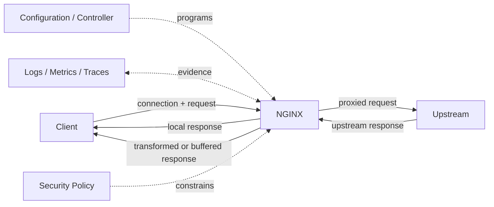

Ada dua hasil utama saat sebuah request masuk:

- **NGINX menyelesaikan request sendiri**, misalnya static file, redirect, rejection, cached response, health endpoint, atau error page;
- **NGINX memanggil upstream**, misalnya Java service, Kubernetes Service, pod endpoint, auth service, object storage, atau proxy berikutnya.

Konsekuensinya:

- response yang diterima client tidak selalu dibuat application;
- status `404`, `403`, `429`, `502`, atau `504` dapat berasal dari NGINX, load balancer lain, atau backend;
- absence of application log tidak otomatis berarti request tidak pernah mencapai infrastructure;
- keberadaan access log NGINX tidak otomatis berarti request mencapai Java endpoint;
- satu logical request dapat melewati beberapa TCP connection dan beberapa TLS session.

### Invariant yang harus dipegang

1. **Setiap proxy adalah semantic boundary.** Header, URI, protocol, timeout, identity, source IP, dan buffering dapat berubah.
2. **Setiap hop menambah failure domain.** Bahkan proxy yang “transparan” tidak benar-benar transparan.
3. **Configuration is executable behavior.** Perubahan annotation, ConfigMap, certificate, DNS, atau Helm values dapat mengubah runtime behavior tanpa perubahan Java code.
4. **Observed status is not necessarily origin status.** Proxy dapat mengganti, menghasilkan, atau menyamarkan error.
5. **Product names matter.** “NGINX ingress” bukan istilah yang cukup presisi untuk review produksi.

---

## Apa sebenarnya NGINX?

Secara resmi, NGINX Open Source mencakup peran HTTP web server, reverse proxy, content cache, load balancer, TCP/UDP proxy, dan mail proxy. Dalam praktik enterprise, NGINX lebih tepat dilihat sebagai **application delivery component** yang bekerja dekat dengan network dan protocol layer.

### NGINX bukan satu hal tunggal

Ketika seseorang berkata “request lewat NGINX”, setidaknya masih ada pertanyaan berikut:

- NGINX Open Source atau NGINX Plus?
- standalone di VM, container biasa, atau Kubernetes controller pod?
- dikonfigurasi manual, template, Helm, operator, atau controller?
- menerima traffic langsung dari internet atau dari cloud load balancer?
- termination TLS di NGINX atau di hop sebelumnya?
- backend berupa VM, Kubernetes Service, EndpointSlice, pod IP, atau proxy lain?
- configuration source of truth berada di repository mana?
- siapa yang on-call ketika NGINX mengembalikan `502`?

Tanpa jawaban itu, istilah “NGINX” terlalu abstrak untuk debugging atau design review.

### NGINX bukan application server Java

NGINX tidak menggantikan:

- JAX-RS runtime seperti Jersey, RESTEasy, atau RESTEasy Reactive;
- servlet container atau application runtime;
- transaction management;
- domain authorization;
- persistence dan business workflow;
- durable messaging;
- idempotency store;
- tenant-aware business policy yang kompleks.

NGINX dapat menolak request, memvalidasi aspek tertentu, atau memanggil external auth service. Namun domain decision seharusnya tetap berada pada layer yang mempunyai data, semantics, auditability, dan testability yang sesuai.

---

## Mengapa NGINX dibuat

Web server tradisional sering menggunakan thread atau process per connection/request. Pola tersebut mudah dipahami, tetapi dapat mahal ketika jumlah concurrent connection tinggi, khususnya jika banyak connection idle, lambat, atau menunggu I/O.

NGINX dirancang dengan event-driven, non-blocking architecture. Worker memproses banyak connection melalui event loop dan mekanisme I/O OS seperti `epoll` pada Linux atau `kqueue` pada BSD-family systems.

Tujuan praktis model ini:

- menangani banyak concurrent connection dengan jumlah worker terbatas;
- menghindari satu thread per connection;
- memisahkan master process yang mengelola config dan worker lifecycle dari worker yang memproses traffic;
- memungkinkan graceful reload dengan worker generation baru;
- efisien untuk proxying, static file serving, buffering, TLS, dan connection multiplexing.

### Jangan menyederhanakan menjadi “NGINX selalu lebih cepat”

Event-driven architecture tidak menghapus bottleneck. NGINX tetap dapat dibatasi oleh:

- CPU, terutama TLS, compression, regex, scripting, atau WAF;
- file descriptor dan worker connection limit;
- kernel backlog;
- memory buffer;
- temporary-file disk I/O;
- network bandwidth;
- upstream latency;
- DNS resolution;
- lock/contention pada module tertentu;
- excessive logging;
- connection churn;
- configuration yang memicu retry atau buffering berlebihan.

Keunggulan arsitektur hanya bermanfaat bila lifecycle connection, resource limit, dan upstream behavior dipahami.

---

## Arsitektur proses dan event-driven model

Model proses umum NGINX:

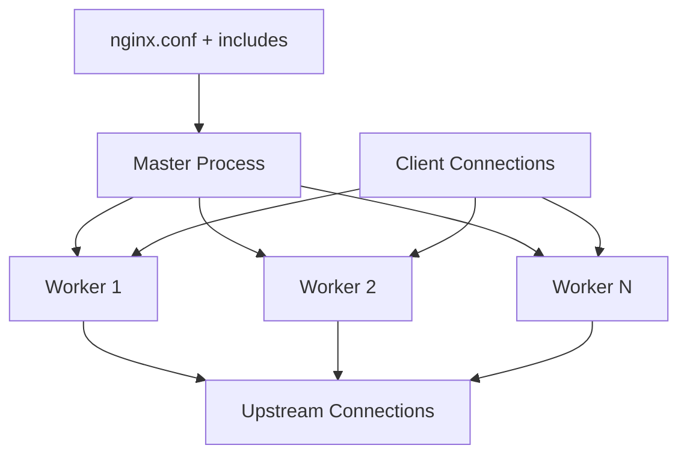

### Master process

Tanggung jawab utamanya:

- membaca dan mengevaluasi configuration;
- membuka listening socket atau mengelola inherited sockets;
- membuat dan memelihara worker process;
- menerima signal untuk reload, reopen log, shutdown, atau stop;
- menjalankan worker generation baru pada reload;
- membiarkan worker lama menyelesaikan connection sesuai graceful lifecycle.

Master process bukan tempat normal request processing.

### Worker process

Worker:

- menerima connection;
- membaca dan parsing protocol;
- menjalankan request-processing phases;
- memilih server/location/upstream;
- membuka atau memakai ulang upstream connection;
- membaca dan menulis data secara non-blocking;
- menerapkan buffering, filtering, logging, dan error handling.

### Event loop consequence

Kode atau module yang blocking dapat merusak concurrency worker. Karena itu, konfigurasi atau extension yang melakukan operasi lambat harus dievaluasi secara hati-hati. “Hanya satu external call kecil” pada phase yang salah dapat menahan banyak request yang berbagi worker.

### Master/worker dan reload

Graceful reload secara konseptual:

1. master menerima reload signal;
2. configuration baru divalidasi;
3. worker generation baru dibuat;
4. worker baru menerima traffic baru;
5. worker lama berhenti menerima connection baru;
6. worker lama menyelesaikan active work, lalu keluar.

Namun “zero downtime” bukan jaminan absolut untuk seluruh system. Risiko tetap ada jika:

- config baru valid secara sintaks tetapi salah secara semantic;
- certificate/key tidak dapat dibaca;
- upstream name gagal resolve;
- readiness controller berubah terlalu cepat;
- long-lived connection menahan old worker;
- resource sementara berlipat karena dua generation hidup bersamaan;
- container orchestrator membunuh pod sebelum drain selesai.

Detail reload akan dibahas pada Part 003 dan Part 030.

---

## Connection bukan request

Ini adalah salah satu mental model terpenting.

### Connection layer

Connection mempunyai atribut seperti:

- source dan destination IP/port;
- TCP state;
- TLS session;
- SNI;
- negotiated ALPN;
- keepalive lifetime;
- connection-level timeout;
- client certificate, bila mTLS;
- PROXY protocol metadata, bila digunakan.

### Request layer

Request mempunyai atribut seperti:

- method;
- scheme;
- authority/Host;
- URI dan query;
- headers;
- body;
- per-request timeout behavior;
- selected virtual host/location;
- upstream target;
- response status dan body.

Satu client TCP connection dapat membawa beberapa HTTP/1.1 request secara berurutan. Satu HTTP/2 connection dapat membawa beberapa concurrent stream. NGINX juga dapat menggunakan upstream connection pool yang berbeda dari client connection.

Karena itu:

```text
client connection count != request rate
client connection lifetime != upstream connection lifetime
client HTTP version != upstream HTTP version
client TLS session != upstream TLS session
```

Contoh:

- client menggunakan HTTP/2 ke NGINX;
- NGINX meneruskan setiap request melalui pooled HTTP/1.1 connection ke Java service;
- application melihat request sebagai HTTP/1.1;
- client melihat satu HTTP/2 connection dengan banyak stream;
- idle timeout di cloud LB dapat memutus connection walaupun NGINX dan application masih sehat.

---

## Empat plane yang perlu dibedakan

Senior engineer perlu membedakan empat plane berikut.

### 1. Data plane

Tempat packet, connection, request, dan response benar-benar diproses.

Contoh:

- NGINX worker process;
- Envoy proxy;
- cloud load balancer forwarding engine;
- service mesh sidecar.

### 2. Control plane

Komponen yang membaca desired state dan menghasilkan configuration untuk data plane.

Contoh:

- Kubernetes ingress controller;
- Gateway API controller;
- service mesh control plane;
- operator internal;
- configuration management service.

### 3. Configuration plane

Representasi desired behavior:

- `nginx.conf` dan include files;
- Kubernetes `Ingress`;
- `VirtualServer` CRD;
- ConfigMap;
- Helm values;
- Gateway API `HTTPRoute`;
- GitOps repository.

### 4. Management/observability plane

Komponen untuk:

- API management;
- dashboard;
- metrics collection;
- log aggregation;
- certificate inventory;
- fleet management;
- configuration audit;
- alerting dan support operations.

### Mengapa pemisahan ini penting?

Karena failure dapat terjadi pada plane berbeda:

| Symptom | Kemungkinan plane |
|---|---|
| Request `502` | Data plane atau upstream |
| Ingress object tidak berpengaruh | Control plane, class selection, RBAC, validation, atau rejected config |
| Config di Git sudah benar, runtime salah | Reconciliation, rendering, deployment, atau stale data plane |
| Metrics hilang tetapi traffic normal | Management/observability plane |
| Rollback Git selesai tetapi route belum kembali | Control plane convergence atau data-plane reload |

---

## Peran-peran utama NGINX

## 1. Web server

NGINX dapat menghasilkan response langsung dari filesystem atau generated response sederhana.

Cocok untuk:

- static assets;
- SPA bundle;
- health/static status endpoint;
- well-known files;
- maintenance page;
- redirect sederhana.

Bukan pengganti object storage/CDN untuk semua skenario. Serving file dari pod juga dapat menciptakan state, image bloat, dan cache invalidation problem.

## 2. Reverse proxy

Reverse proxy menerima request atas nama backend dan menyembunyikan topology upstream dari client.

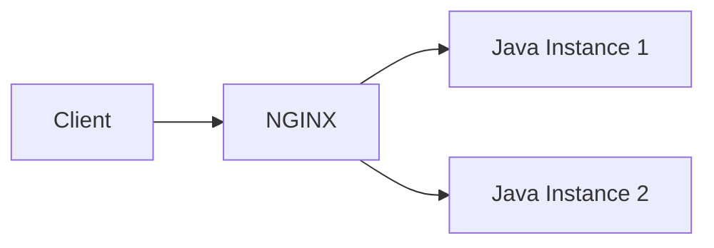

Nilai yang diberikan:

- stable public endpoint;
- centralized TLS;
- routing;
- header policy;
- timeout boundary;
- load balancing;
- connection reuse;
- body/response buffering;
- observability;
- rejection sebelum application.

Risiko:

- path rewrite mismatch;
- forwarded-header spoofing;
- wrong timeout;
- retries pada non-idempotent request;
- client-IP loss;
- hidden buffering;
- duplicate or conflicting policies dengan API gateway/application.

## 3. Load balancer

NGINX dapat memilih satu dari beberapa upstream. Load balancing bukan sekadar round-robin; sistem harus mempertimbangkan:

- health detection;
- connection reuse;
- server weight;
- session affinity;
- retry safety;
- slow instance;
- draining;
- topology locality;
- discovery update.

NGINX Open Source dan NGINX Plus mempunyai capability berbeda, khususnya active health check, runtime API, richer telemetry, dan dynamic management. Jangan membaca dokumentasi Plus lalu mengasumsikan feature tersedia di Open Source.

## 4. TLS termination layer

NGINX dapat:

- terminate client TLS dan meneruskan HTTP plaintext;
- terminate lalu membuat TLS connection baru ke upstream;
- melakukan TLS passthrough pada L4/stream pattern tertentu;
- memvalidasi client certificate;
- memilih certificate berdasarkan SNI;
- mengatur protocol/cipher policy;
- menambahkan HSTS dan security headers.

TLS termination adalah **trust boundary**. Setelah termination, komponen berikut perlu mengetahui bagaimana original scheme dan client identity dipertahankan dengan aman.

## 5. API edge

NGINX dapat melakukan sebagian edge concerns:

- request size limit;
- connection/rate limiting;
- method rejection;
- basic routing;
- cache;
- auth subrequest;
- header normalization;
- CORS tertentu;
- WAF integration, tergantung distribution/module;
- request mirroring;
- canary routing, tergantung controller/product/configuration.

Namun API management biasanya juga mencakup:

- API product lifecycle;
- developer portal;
- consumer onboarding;
- key issuance;
- usage plans;
- analytics per consumer;
- monetization;
- schema/contract governance;
- policy orchestration;
- transformation yang lebih kaya.

Bila kebutuhan tersebut dominan, API gateway/API management product mungkin lebih tepat.

## 6. Kubernetes ingress data plane

Pada Kubernetes, NGINX dapat menjadi data plane yang dikonfigurasi controller berdasarkan resource Kubernetes.

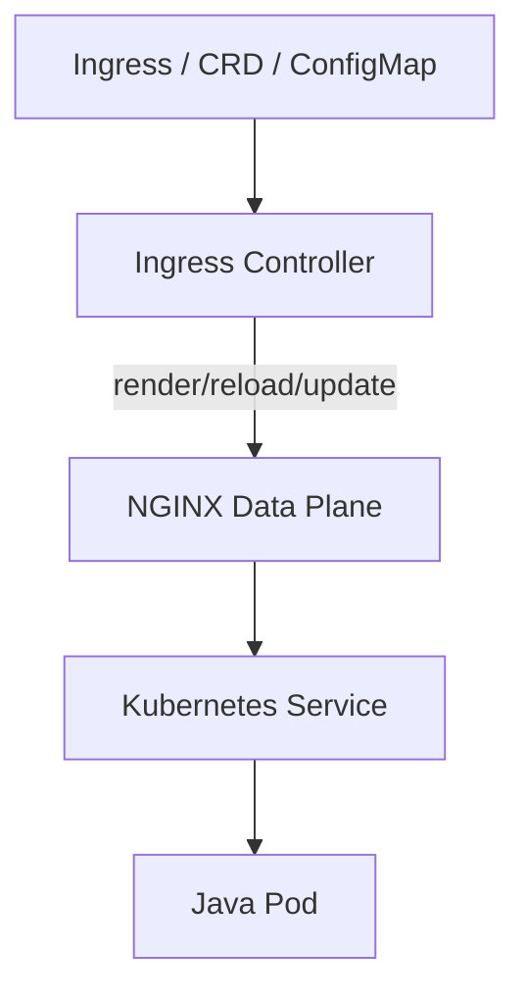

Hal penting:

- `Ingress` hanyalah API object/desired routing;
- tanpa controller, Ingress tidak menjalankan traffic;
- controller implementation berbeda memiliki behavior berbeda;
- NGINX data plane dapat Open Source atau Plus tergantung product;
- beberapa controller route melalui Service virtual IP, sementara yang lain dapat membangun upstream dari endpoint/pod address;
- annotation satu controller tidak portable ke controller lain.

## 7. L4 TCP/UDP proxy

Melalui `stream` context, NGINX dapat meneruskan TCP/UDP. Ini relevan untuk:

- TLS passthrough;
- database atau custom TCP protocol;
- non-HTTP service;
- layer-4 load balancing.

Pada L4, NGINX tidak memiliki HTTP semantics seperti method, URI, status code, atau headers. Jangan menerapkan reasoning L7 terhadap stream proxy.

---

## Batas ekosistem dan terminologi produk

## NGINX Open Source

Karakteristik:

- open source dengan lisensi BSD-like dua klausul;
- source tersedia;
- web server, proxy, cache, HTTP/TCP/UDP load balancing;
- module ecosystem;
- tersedia dalam jalur mainline dan stable;
- tidak identik dengan feature set NGINX Plus.

Kekuatan:

- mature dan widely deployed;
- small, composable, predictable bila config dikelola baik;
- cocok untuk reverse proxy, static content, TLS, basic load balancing, caching, dan traffic policy.

Operational caveat:

- advanced active health checks, runtime management, richer dashboard/API, dan fitur enterprise tertentu dapat membutuhkan Plus atau komponen tambahan;
- telemetry sering memerlukan exporter/log pipeline;
- dynamic service discovery dan runtime updates perlu dipahami sesuai version/module.

## NGINX Plus

NGINX Plus adalah commercial distribution/product yang memperluas NGINX Open Source dengan capability enterprise dan commercial support.

Contoh area pembeda—harus diverifikasi terhadap versi/lisensi aktual:

- active health checks;
- richer status metrics dan API;
- runtime upstream management;
- advanced session persistence;
- additional load-balancing behavior;
- support dan certified packages;
- enterprise integrations.

Aturan review:

> Jangan menulis “NGINX mendukung X” tanpa menyebut **edition**, **version**, **module**, dan bila relevan **controller**.

## F5 NGINX Ingress Controller

Ini adalah ingress controller dari F5 untuk NGINX Open Source atau NGINX Plus.

Karakteristik:

- controller membaca Kubernetes resources;
- memprogram NGINX data plane;
- mendukung standard Ingress dan extension melalui annotation, ConfigMap, dan CRD/product-specific resources;
- feature set berbeda tergantung NGINX Open Source versus Plus edition;
- dokumentasi, Helm chart, image, CRD, dan lifecycle berasal dari F5 NGINX project/product.

## Community `ingress-nginx`

`kubernetes/ingress-nginx` adalah project yang berbeda dari F5 NGINX Ingress Controller. Keduanya menggunakan NGINX sebagai proxy/data plane, tetapi:

- codebase berbeda;
- template dan annotations berbeda;
- defaults berbeda;
- security model berbeda;
- release process berbeda;
- support/governance berbeda;
- configuration snippets dan risk profile berbeda.

### Terminologi yang benar

| Istilah ambigu | Istilah yang sebaiknya digunakan |
|---|---|
| “NGINX ingress” | “F5 NGINX Ingress Controller” atau “community ingress-nginx” |
| “NGINX config” | Rendered standalone config, controller template, ConfigMap, annotation, CRD, atau Helm values |
| “Load balancer” | Cloud L4/L7 LB, NGINX upstream LB, Kubernetes Service, atau mesh load balancing |
| “TLS di ingress” | Client→LB, LB→NGINX, atau NGINX→upstream TLS |

## NGINX Gateway Fabric

NGINX Gateway Fabric adalah implementation yang berorientasi Kubernetes Gateway API dan dapat menggunakan NGINX Open Source atau NGINX Plus sebagai data plane. Ia bukan sinonim dengan F5 NGINX Ingress Controller. Pembahasan detail Gateway API berada pada Part 021.

---

## Status community ingress-nginx pada 2026

> **Current-state note — July 2026:** Kubernetes community telah meretire `ingress-nginx` pada **24 March 2026**. Existing deployment tidak otomatis berhenti, dan artifacts tetap tersedia, tetapi tidak ada lagi release, bug fix, atau security update setelah retirement. Project sendiri menyarankan agar deployment baru tidak menggunakan `ingress-nginx` dan agar organisasi mengevaluasi implementation Gateway API atau alternatif lain.

Konsekuensi arsitektural:

1. Existing cluster yang masih memakai community `ingress-nginx` memiliki **technology-lifecycle risk**, bukan sekadar upgrade backlog.
2. “Masih berjalan” tidak sama dengan “masih aman atau supportable”.
3. Migration bukan search-and-replace karena controller lain tidak memiliki annotation, default, regex, rewrite, snippet, auth, canary, dan source-IP behavior yang identik.
4. Inventory harus mencakup rendered behavior, bukan hanya YAML Ingress.
5. Migrasi perlu test matrix terhadap path matching, normalization, headers, TLS, timeout, retries, client IP, body size, WebSocket/SSE, gRPC, observability, dan error pages.

### Internal verification checklist khusus retirement

- [ ] Apakah cluster internal menggunakan community `ingress-nginx` atau F5 NGINX Ingress Controller?
- [ ] Bila community `ingress-nginx`, versi controller dan Helm chart berapa?
- [ ] Apakah repository/image sudah read-only dan bagaimana policy security exception-nya?
- [ ] Annotation apa yang digunakan dan mana yang controller-specific?
- [ ] Apakah `configuration-snippet`, `server-snippet`, atau custom template digunakan?
- [ ] Apakah migration program menuju Gateway API/controller lain sudah ada?
- [ ] Siapa accountable owner dan target date migrasi?
- [ ] Bagaimana compensating controls selama transition?

---

## Deployment roles dan topology patterns

Produk yang sama dapat memiliki behavior operasional berbeda berdasarkan deployment role.

## Pattern A — Standalone reverse proxy pada VM

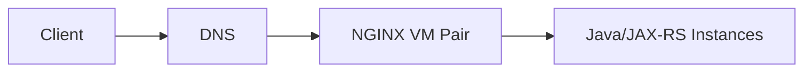

Kelebihan:

- topology relatif eksplisit;
- config mudah diinspeksi;
- process lifecycle jelas;
- cocok on-prem/legacy.

Risiko:

- manual drift;
- HA dan failover harus dirancang;
- certificate distribution;
- service discovery statis;
- patching host/image;
- ownership sering terpisah dari application team.

## Pattern B — NGINX container di depan application

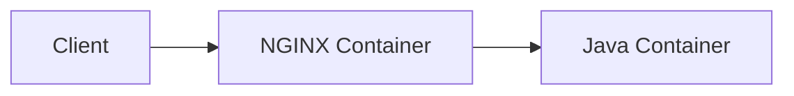

Dapat berupa:

- dua container terpisah;
- satu deployment dengan sidecar;
- NGINX sebagai public-facing container dan Java internal.

Pertanyaan penting:

- apakah scaling keduanya harus 1:1?
- apakah health status NGINX mencerminkan health Java?
- siapa melakukan graceful drain?
- apakah config dipasang read-only?
- apakah NGINX membutuhkan disk temp?
- apakah source IP tetap tersedia?

## Pattern C — Shared Kubernetes ingress controller

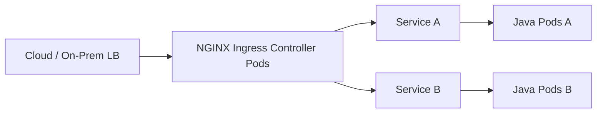

Kelebihan:

- shared routing layer;
- Kubernetes-native desired state;
- centralized certificates/policy;
- elastic replica management.

Risiko:

- large blast radius;
- noisy neighbor;
- controller-specific annotations;
- config reload across many routes;
- cross-team policy conflicts;
- multi-tenant security risk;
- one bad Ingress can affect unrelated services, tergantung implementation/governance.

## Pattern D — Cloud LB di depan NGINX ingress

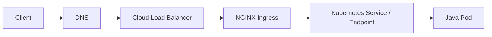

Di sini ada dua load-balancing layers atau lebih. Harus jelas:

- termination TLS di mana;
- health check cloud LB menuju apa;
- source IP preservation;
- idle timeout;
- L4 versus L7 behavior;
- node target versus IP target;
- proxy protocol;
- connection reuse;
- ownership incident.

## Pattern E — API gateway di depan NGINX

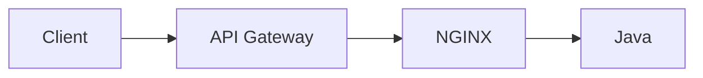

Harus ada rationale mengapa dua L7 layers diperlukan. Common reasons:

- external API management di gateway;
- internal cluster routing di NGINX;
- different ownership zones;
- WAF/DDoS at edge, route aggregation inside;
- migration transition.

Tanpa rationale, policy dapat terduplikasi: CORS, auth, rate limit, body limit, rewrite, retry, logging, dan timeout.

## Pattern F — Service mesh + ingress

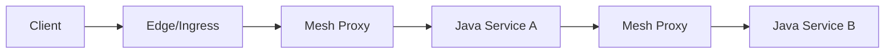

NGINX biasanya menangani north-south entry, sedangkan mesh menangani east-west traffic, identity, telemetry, traffic policy, dan mTLS antarservice. Batas ini tidak absolut, tetapi harus eksplisit.

---

## Perbandingan dengan komponen adjacent

Tujuan perbandingan bukan mencari “produk terbaik”, tetapi memahami **problem class**.

## NGINX vs Apache HTTPD

| Dimension | NGINX | Apache HTTPD |
|---|---|---|
| Core mental model | Event-driven proxy/web server | Modular web server dengan beberapa MPM |
| Typical strength | Reverse proxy, high concurrency, static serving, edge delivery | Rich module ecosystem, legacy compatibility, per-directory configuration use cases |
| Config style | Context/directive tree | Directive/module dengan virtual host/directory semantics |
| Enterprise choice | Sering dipilih sebagai proxy/ingress | Sering ada pada legacy/on-prem web tier |

Jangan memilih berdasarkan slogan performance. Perhatikan module compatibility, operational skill, ecosystem, support, config governance, dan migration cost.

## NGINX vs HAProxy

| Dimension | NGINX | HAProxy |
|---|---|---|
| Origin/identity | Web server + reverse proxy + cache | Load balancer/proxy oriented |
| Static content | Native strength | Bukan use case utama |
| HTTP/TCP LB | Ya | Ya, sangat kuat |
| Caching | Native HTTP cache | Bukan core equivalent yang sama |
| Configuration/runtime ecosystem | NGINX modules/products/controllers | HAProxy ecosystem dan Data Plane API/product variants |
| Selection basis | Web delivery + proxy/caching | Dedicated high-performance load balancing/proxy needs |

## NGINX vs Envoy

| Dimension | NGINX | Envoy |
|---|---|---|
| Configuration tradition | File/directive based, controller-generated config | API-driven dynamic configuration, xDS ecosystem |
| Typical role | Edge proxy, ingress, web server, LB | Service mesh data plane, gateway, dynamic cloud-native proxy |
| Static file serving | Strong | Bukan primary purpose |
| Dynamic control plane | Product/controller dependent | Core architectural strength |
| L7 protocol extensibility | NGINX modules/njs/products | Rich filters, xDS, mesh integrations |

Envoy sering lebih natural untuk highly dynamic service mesh/control-plane scenarios. NGINX sering lebih sederhana untuk explicit reverse-proxy/web-delivery use cases. Kompleksitas control plane tetap harus dihitung.

## NGINX vs cloud load balancer

Cloud LB biasanya menawarkan:

- managed availability;
- integration dengan VPC/VNet, security groups/NSG, certificates, target groups;
- native cloud health checks;
- autoscaling dan managed control plane;
- public/private endpoints.

NGINX menawarkan:

- portable config;
- richer request-level behavior dalam banyak skenario;
- deployment di cloud/on-prem/hybrid;
- app-aware routing/filtering;
- fine-grained control;
- extensibility.

Bukan selalu either/or. Cloud LB sering berada di depan NGINX untuk exposure dan HA. Namun chain tersebut harus memiliki clear purpose.

## NGINX vs API Gateway

| Concern | NGINX | API Gateway/API Management |
|---|---|---|
| Basic routing/TLS/LB | Strong | Strong |
| Developer portal | Umumnya bukan core | Umumnya tersedia |
| Consumer lifecycle/API keys | Terbatas atau custom | Core capability |
| Usage plans/monetization | Bukan core | Sering tersedia |
| Complex policy | Module/product-dependent | Policy engine oriented |
| Internal cluster ingress | Sangat umum | Bergantung product/topology |
| Static content/cache | Strong | Varies |

## NGINX vs service mesh

NGINX tidak otomatis memberi:

- workload identity untuk seluruh east-west traffic;
- transparent sidecar interception;
- uniform service-to-service mTLS;
- distributed traffic telemetry antarservice;
- service-level retry/circuit policy across all calls.

Service mesh juga bukan pengganti sederhana untuk external edge, static content, public certificate lifecycle, DDoS edge integration, atau internet-facing load balancer.

## NGINX vs Kubernetes Ingress dan Gateway API

- **Ingress** adalah Kubernetes API object untuk external HTTP(S) routing.
- **Ingress Controller** merekonsiliasi object menjadi runtime behavior.
- **NGINX** dapat menjadi proxy/data plane dari controller tertentu.
- **Gateway API** adalah API family yang lebih expressive, role-oriented, dan extensible daripada Ingress.

Ingress API telah frozen; Kubernetes documentation merekomendasikan Gateway untuk pengembangan baru, tetapi Ingress tetap GA dan tidak dijadwalkan dihapus. Pemilihan implementation tetap harus memperhatikan support lifecycle dan feature mapping.

---

## NGINX dan Java/JAX-RS: kontrak antarlayer

NGINX dan Java service membentuk distributed HTTP contract. Kontrak ini mencakup lebih dari OpenAPI.

## 1. URI contract

Harus jelas:

- external base path;
- internal application path;
- apakah path direwrite;
- trailing slash policy;
- encoded path behavior;
- query preservation;
- absolute redirect construction.

Contoh mismatch:

```text
External: /quote-order/api/orders/123
NGINX forwards: /api/orders/123
JAX-RS application path: /api
Resource path: /orders/{id}
```

Satu slash atau rewrite yang salah dapat menghasilkan duplicate path atau `404` dari layer berbeda.

## 2. Scheme dan authority contract

Java application perlu mengetahui original:

- scheme (`https`);
- host;
- port;
- client IP;
- prefix/base path.

Ini sering diteruskan melalui `Forwarded` atau `X-Forwarded-*`. Application tidak boleh mempercayai header tersebut dari arbitrary client. NGINX harus overwrite/sanitize pada trust boundary, dan Java runtime harus dikonfigurasi hanya mempercayai known proxy chain.

## 3. Authentication identity contract

Bila edge melakukan authentication:

- header identity harus dihapus dari inbound client request;
- hanya trusted proxy boleh menambahkan identity header;
- backend harus tahu apakah header cryptographically bound atau hanya assertion jaringan;
- authorization domain-level tetap harus dilakukan di tempat yang memiliki policy/context;
- trace/audit harus merekam actor dan source of assertion.

## 4. Timeout contract

Timeout harus membentuk hierarchy yang disengaja. Contoh principle:

```text
client deadline >= edge timeout >= ingress timeout >= app server timeout >= downstream timeout budget
```

Ini bukan formula universal. Tujuannya adalah memastikan caller yang paling luar tidak timeout lebih dulu tanpa memberi kesempatan layer dalam berhenti, dan retry tidak memperbesar kerja tersembunyi.

## 5. Body and streaming contract

NGINX dapat:

- menolak body terlalu besar sebelum Java;
- buffer upload sebelum membuka/menyelesaikan upstream transfer;
- buffer response Java sebelum client menerimanya;
- menggunakan temporary file;
- mengubah perceived backpressure;
- mengganggu SSE bila buffering tetap aktif;
- mempertahankan atau mengubah transfer semantics.

## 6. Error contract

Application perlu membedakan:

- business error yang berasal dari JAX-RS;
- proxy-generated error;
- upstream-connect failure;
- timeout;
- client abort;
- health/readiness failure;
- load-shedding/rate-limit response.

Gunakan response headers, structured error schema, logs, dan trace context secara konsisten tanpa membocorkan internal topology.

## 7. Observability contract

Minimum shared fields:

- request/correlation ID;
- trace ID/span context;
- original host/path/method;
- final upstream address atau service identity;
- status;
- total request time;
- upstream connect/header/response time;
- bytes in/out;
- client IP after trusted reconstruction;
- route/virtual host identifier;
- deployment version bila tersedia.

---

## Kapan menggunakan NGINX

NGINX cocok ketika terdapat kebutuhan yang jelas terhadap satu atau lebih capability berikut.

### 1. Stable reverse-proxy boundary

Client memerlukan stable endpoint, sementara backend dapat berubah instance, pod, atau address.

### 2. TLS termination dan certificate policy

Centralized protocol/cipher/certificate handling lebih efisien dan konsisten daripada setiap service mengelola public TLS sendiri.

### 3. Host/path routing

Beberapa service perlu diekspos melalui shared domain atau endpoint.

### 4. Connection management

Upstream mendapat manfaat dari pooled connection, keepalive, buffering, atau protection dari slow client.

### 5. Static content dan caching

NGINX dapat menyajikan static asset dan cache response tertentu dengan policy yang eksplisit.

### 6. Edge protection

Request size, rate, connection, method, path, header, atau WAF policy perlu diterapkan sebelum Java service.

### 7. Kubernetes north-south traffic

Cluster memerlukan controller/data plane untuk menerjemahkan route definitions menjadi working proxy behavior.

### 8. Hybrid portability

Organisasi ingin behavior reverse proxy yang relatif konsisten di cloud, on-prem, atau hybrid, sambil tetap mengintegrasikan cloud LB.

### 9. Operational observability boundary

Tim membutuhkan access log dan latency breakdown di depan application untuk membedakan client, network, proxy, dan upstream failures.

---

## Kapan tidak menggunakan NGINX

## 1. Tidak ada problem yang diselesaikan

Menambahkan NGINX hanya karena “production biasanya pakai proxy” adalah weak rationale. Setiap hop membutuhkan:

- patching;
- ownership;
- metrics;
- certificate/config lifecycle;
- capacity;
- incident response;
- security review.

## 2. Cloud LB sudah memenuhi kebutuhan

Jika hanya diperlukan managed TLS, simple host routing, health checks, dan target forwarding, cloud L7 LB mungkin cukup. Menambah NGINX perlu justified benefit.

## 3. API management adalah kebutuhan utama

Bila kebutuhan utama adalah consumer onboarding, developer portal, subscription, analytics, quota product, atau policy lifecycle, gunakan API management/gateway yang tepat.

## 4. Dynamic service mesh behavior adalah kebutuhan utama

Untuk transparent east-west mTLS, workload identity, dynamic xDS, dan uniform service-to-service telemetry, service mesh mungkin lebih tepat.

## 5. NGINX akan memuat business logic kompleks

Jangan memindahkan domain authorization, pricing, order transition, entitlement, atau tenant policy kompleks ke rewrite/script layer hanya untuk “menghindari perubahan Java”.

## 6. Team tidak mempunyai ownership model

Proxy tanpa clear owner akan menjadi orphan critical infrastructure. Bila tidak jelas siapa yang:

- approves config;
- patches CVE;
- rotates certificates;
- handles 24/7 incident;
- owns capacity;
- validates rollback;

maka desain belum siap.

## 7. Proxy chain sudah terlalu dalam

Contoh problematic chain:

```text
CDN → WAF → cloud LB → API gateway → NGINX edge → NGINX ingress → mesh gateway → sidecar → Java
```

Chain seperti ini mungkin sah pada regulated enterprise, tetapi setiap layer harus memiliki unique responsibility dan measurable evidence. Bila dua layer melakukan rewrite, retry, auth, rate limit, atau timeout tanpa contract, debugging menjadi probabilistic.

---

## Decision framework

Gunakan decision record berikut.

### Step 1 — Definisikan problem

Jangan mulai dari “kami butuh NGINX”. Mulai dari:

- public/private exposure;
- host/path routing;
- TLS boundary;
- source-IP preservation;
- authentication boundary;
- rate-limit scope;
- streaming requirement;
- protocol requirement;
- availability/SLO;
- compliance evidence;
- portability;
- operating model.

### Step 2 — Identifikasi existing layers

Buat inventory:

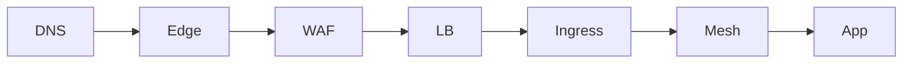

Untuk setiap hop, catat:

- L4 atau L7;
- TLS behavior;
- routing key;
- timeout;
- retry;
- logging;
- owner;
- deployment/version;
- failure response.

### Step 3 — Tetapkan unique responsibility NGINX

Contoh valid:

- cloud NLB memberi stable L4 endpoint dan source-IP preservation;
- NGINX ingress memberi host/path routing dan TLS re-encryption;
- Java memberi domain authorization dan business response.

### Step 4 — Evaluasi alternatives

Bandingkan:

- direct cloud LB → Service;
- cloud application LB tanpa NGINX;
- NGINX standalone;
- F5 NGINX Ingress Controller;
- Gateway API implementation;
- API gateway;
- service mesh gateway;
- managed NGINX offering;
- HAProxy/Envoy/Traefik/Kong/other approved platform.

### Step 5 — Hitung operational cost

Minimal:

- upgrade frequency;
- end-of-life risk;
- CVE patching;
- test environment;
- configuration validation;
- certificate rotation;
- 24/7 alerting;
- capacity planning;
- log cost;
- migration cost;
- vendor support.

### Step 6 — Define exit strategy

- Apakah route definition portable?
- Berapa banyak proprietary annotation/CRD?
- Apakah behavior dapat diuji black-box?
- Apakah source config dan rendered config disimpan?
- Bagaimana migrasi jika controller retired?

---

## Failure model dasar

NGINX dapat menyebabkan, meneruskan, memperbesar, atau menyembunyikan failure.

## 1. Configuration failure

Contoh:

- syntax invalid;
- directive di context salah;
- include missing;
- duplicate listener;
- unresolved variable;
- invalid certificate/key;
- conflicting routes;
- annotation rejected.

Detection:

- config test;
- controller event/status;
- admission validation;
- startup/reload log;
- rendered-config diff.

## 2. Routing failure

Contoh:

- wrong host;
- default server menangkap traffic;
- path precedence salah;
- regex shadowing;
- trailing slash mismatch;
- duplicate prefix;
- wrong upstream service/port.

Symptom:

- `404`, `301/302` loop, wrong service response, auth bypass/over-blocking.

## 3. Connection failure

Contoh:

- refused;
- reset;
- no route;
- security group/firewall block;
- SYN timeout;
- ephemeral port exhaustion;
- file descriptor exhaustion.

Likely output:

- `502`, `503`, `504`, connection timeout, or platform-specific error.

## 4. TLS failure

Contoh:

- expired certificate;
- hostname mismatch;
- missing intermediate;
- unsupported protocol/cipher;
- SNI mismatch;
- upstream CA trust failure;
- mTLS client rejection.

Failure dapat terjadi sebelum HTTP request ada, sehingga tidak selalu ada access log normal.

## 5. Timeout failure

Contoh:

- client header/body timeout;
- upstream connect timeout;
- upstream read timeout;
- cloud LB idle timeout;
- application deadline;
- downstream timeout.

Satu timeout yang terlalu besar dapat menahan resource. Satu timeout terlalu kecil dapat membuat false failure dan retry storm.

## 6. Capacity failure

Contoh:

- worker connections exhausted;
- CPU saturation;
- memory pressure;
- temp disk full;
- log volume blocking;
- bandwidth saturation;
- conntrack exhaustion;
- pod/node saturation.

## 7. Policy failure

Contoh:

- legitimate request terkena rate limit;
- body size terlalu kecil;
- security header salah;
- CORS policy conflict;
- method restriction memblokir valid operation;
- identity header tidak diteruskan;
- source IP dianggap proxy IP.

## 8. Observability failure

Contoh:

- request ID tidak konsisten;
- client IP salah;
- logs tidak menyertakan upstream timing;
- clock skew;
- sampling membuang error;
- multiple proxies overwrite trace context;
- `502` tidak dapat diatribusikan ke hop.

---

## Security, performance, dan observability implications

## Security

NGINX adalah security boundary bila ia:

- terminate TLS;
- menerima internet traffic;
- menetapkan trusted forwarded headers;
- melakukan auth request;
- menerapkan allowlist/rate limit;
- memegang private key;
- memiliki RBAC yang dapat memodifikasi route seluruh cluster.

Security review harus mencakup configuration supply chain, image provenance, module, snippets, secret access, namespace isolation, default host, log redaction, admin/status endpoint, dan support lifecycle.

## Performance

NGINX menambah processing dan hop, tetapi juga dapat meningkatkan end-to-end performance melalui:

- connection reuse;
- TLS offload/session reuse;
- buffering;
- compression;
- caching;
- efficient static serving;
- protection terhadap slow client;
- load distribution.

Net effect harus diukur, bukan diasumsikan. Metrics perlu memisahkan:

- connection establishment;
- TLS;
- NGINX processing;
- upstream connect;
- upstream first byte;
- response transfer;
- queueing/retry.

## Observability

NGINX adalah vantage point yang sangat berguna karena melihat client-facing dan upstream-facing sides. Namun log default sering tidak cukup. Untuk production, butuh structured fields seperti:

- request ID dan trace context;
- selected host/route;
- status;
- request time;
- upstream address/status;
- upstream connect/header/response time;
- bytes;
- TLS protocol/cipher;
- client IP setelah trusted reconstruction;
- controller/pod/instance identity.

---

## PR review checklist

Gunakan checklist ini untuk PR atau architecture proposal yang memperkenalkan/mengubah NGINX.

### Product and lifecycle

- [ ] Produk/controller disebut secara presisi.
- [ ] Version dan support lifecycle diketahui.
- [ ] Tidak ada asumsi feature Plus pada Open Source.
- [ ] Community `ingress-nginx` tidak dipakai sebagai deployment baru tanpa explicit exception dan migration plan.

### Responsibility boundary

- [ ] Unique responsibility NGINX dijelaskan.
- [ ] Tidak ada duplicate auth/rate-limit/rewrite/retry tanpa precedence contract.
- [ ] Ownership dan on-call jelas.
- [ ] Source of truth config jelas.

### Traffic contract

- [ ] Host, path, method, scheme, source IP, dan headers didefinisikan.
- [ ] TLS termination/re-encryption point eksplisit.
- [ ] Timeout dan retry ownership eksplisit.
- [ ] Streaming/body behavior diuji.

### Security

- [ ] Default server aman.
- [ ] Forwarded headers disanitasi.
- [ ] Private key/secret access minimal.
- [ ] Admin/status endpoint tidak exposed.
- [ ] Arbitrary snippets/modules dievaluasi.

### Operations

- [ ] Config validation dan smoke test tersedia.
- [ ] Rollback teruji.
- [ ] Metrics/logs cukup untuk attribution.
- [ ] Capacity dan failure thresholds diketahui.
- [ ] Change blast radius dipahami.

### Java/JAX-RS impact

- [ ] Base URI dan redirect benar di belakang proxy.
- [ ] Application mempercayai proxy secara terbatas.
- [ ] Error schema dan status propagation jelas.
- [ ] Application logs memakai correlation/trace ID yang sama.
- [ ] Readiness tidak hanya memeriksa process hidup.

---

## Internal verification checklist

Bagian ini sengaja tidak mengasumsikan detail internal CSG.

### Product inventory

- [ ] Identifikasi semua NGINX deployment dan controller.
- [ ] Catat edition: Open Source atau Plus.
- [ ] Catat version, image digest, package source, dan upgrade policy.
- [ ] Pastikan apakah ada community `ingress-nginx` yang sudah retired.
- [ ] Temukan license/support owner bila Plus digunakan.

### Topology

- [ ] Petakan DNS → CDN/WAF → cloud/on-prem LB → NGINX → Service/pod/VM → Java.
- [ ] Bedakan public, private, intranet, partner, dan management paths.
- [ ] Tandai L4 versus L7 pada setiap hop.
- [ ] Tandai TLS termination dan re-encryption.
- [ ] Tandai proxy protocol dan source-IP reconstruction.

### Repositories and configuration

- [ ] Temukan `nginx.conf`, include, template, Helm chart, Kustomize, ConfigMap, Ingress, Gateway, CRD, dan GitOps repository.
- [ ] Temukan rendered runtime config, bukan hanya desired YAML.
- [ ] Cari controller-specific annotations dan snippets.
- [ ] Identifikasi environment overlays dan secret references.
- [ ] Periksa config validation di CI/CD.

### Ownership

- [ ] Siapa pemilik platform NGINX/controller?
- [ ] Siapa pemilik DNS, certificate, cloud LB, WAF, Kubernetes networking, dan application route?
- [ ] Siapa on-call untuk `502/503/504`?
- [ ] Apa escalation path antarteam?
- [ ] Apa approval requirement untuk production traffic change?

### Operations and evidence

- [ ] Temukan access/error logs dan retention.
- [ ] Temukan dashboards untuk status, latency, connections, CPU, memory, reload, dan upstream errors.
- [ ] Temukan runbook serta incident notes terkait routing/TLS/timeout.
- [ ] Verifikasi correlation ID across layers.
- [ ] Verifikasi rollback dan config history.

### Java integration

- [ ] Bagaimana JAX-RS runtime memproses forwarded headers?
- [ ] Bagaimana application membangun absolute URL/redirect?
- [ ] Apakah context path direwrite?
- [ ] Bagaimana client abort, timeout, upload, SSE, WebSocket, atau gRPC ditangani?
- [ ] Apakah health/readiness endpoint melewati dependency yang tepat?

---

## Latihan dan review questions

### Exercise 1 — Classify the component

Untuk setiap komponen di architecture diagram internal, klasifikasikan sebagai:

- configuration plane;
- control plane;
- data plane;
- management/observability plane.

Bila satu komponen menjalankan beberapa peran, tuliskan secara eksplisit.

### Exercise 2 — Explain “NGINX ingress” precisely

Ubah kalimat ambigu berikut menjadi pernyataan yang dapat diverifikasi:

> “Traffic masuk melalui NGINX ingress lalu ke service.”

Contoh hasil yang lebih baik:

> “Public HTTPS traffic diterima AWS NLB pada port 443, diteruskan sebagai TCP ke Service `LoadBalancer` milik F5 NGINX Ingress Controller berbasis NGINX Open Source. Controller memilih route dari `IngressClass nginx-public`, terminate TLS menggunakan Kubernetes Secret, lalu meneruskan HTTP/1.1 ke endpoint pod service `quote-api` pada port 8080.”

Gunakan contoh hanya sebagai bentuk; jangan mengasumsikan ini adalah topology internal.

### Exercise 3 — Remove a layer

Ambil satu topology dengan NGINX. Tanyakan:

- Apa yang rusak bila NGINX dihapus?
- Capability mana yang hilang?
- Apakah capability itu sudah ada di cloud LB/API gateway/mesh?
- Apakah NGINX masih justified?

### Exercise 4 — Failure attribution

Untuk status berikut, tuliskan minimal tiga possible origin:

- `404`
- `403`
- `429`
- `502`
- `503`
- `504`

Jangan menyimpulkan origin hanya dari status code.

### Review questions

1. Mengapa Ingress resource tidak dapat memproses traffic sendiri?
2. Apa perbedaan controller dan data plane?
3. Mengapa NGINX Open Source dan Plus harus dibedakan dalam ADR?
4. Mengapa community `ingress-nginx` dan F5 NGINX Ingress Controller tidak interchangeable?
5. Kapan cloud load balancer cukup tanpa NGINX?
6. Apa risiko memasukkan business authorization ke NGINX config?
7. Mengapa client connection dan upstream connection harus dimodelkan terpisah?
8. Apa bukti minimum bahwa sebuah `502` berasal dari NGINX tertentu?

---

## Ringkasan

Mental model inti Part 001:

```text
NGINX = configurable traffic execution layer
      ≠ Java application server
      ≠ Kubernetes Ingress resource
      ≠ always API gateway
      ≠ always service mesh
      ≠ one single product/controller
```

Sebelum menyentuh directive, pastikan Anda dapat menjawab:

- produk dan version apa yang digunakan;
- role-nya apa;
- plane mana yang mengontrolnya;
- traffic masuk dari mana dan keluar ke mana;
- TLS berhenti di mana;
- policy apa yang dimiliki NGINX;
- siapa pemilik failure;
- bagaimana behavior dibuktikan;
- bagaimana rollback dan migration dilakukan.

Part berikutnya membangun request lifecycle end-to-end dan memecah perjalanan request menjadi connection, protocol, routing, upstream, application, response, logging, serta latency boundaries.

---

## Referensi resmi

1. [NGINX official site — product roles and source](https://nginx.org/)
2. [NGINX documentation](https://nginx.org/en/docs/)
3. [NGINX Beginner’s Guide — master/worker and event model](https://nginx.org/en/docs/beginners_guide.html)
4. [NGINX development guide — events, processes, HTTP phases](https://nginx.org/en/docs/dev/development_guide.html)
5. [NGINX HTTP load balancing](https://nginx.org/en/docs/http/load_balancing.html)
6. [F5 NGINX Plus documentation](https://docs.nginx.com/nginx/)
7. [F5 NGINX Ingress Controller documentation](https://docs.nginx.com/nginx-ingress-controller/)
8. [F5 NGINX Ingress Controller design](https://docs.nginx.com/nginx-ingress-controller/overview/design/)
9. [Kubernetes Ingress](https://kubernetes.io/docs/concepts/services-networking/ingress/)
10. [Kubernetes Ingress Controllers](https://kubernetes.io/docs/concepts/services-networking/ingress-controllers/)
11. [Ingress NGINX Retirement: What You Need to Know](https://kubernetes.io/blog/2025/11/11/ingress-nginx-retirement/)
12. [Ingress-NGINX project README and retirement notice](https://github.com/kubernetes/ingress-nginx/blob/main/README.md)
13. [Before You Migrate: Ingress-NGINX behavior and product distinction](https://kubernetes.io/blog/2026/02/27/ingress-nginx-before-you-migrate/)
14. [Kubernetes Gateway API](https://gateway-api.sigs.k8s.io/)

