# Part 002 — Request Lifecycle: Client → DNS → Load Balancer → NGINX → Service → Pod → JAX-RS

> **Depth level:** Foundation  
> **Primary audience:** Senior Java/JAX-RS backend engineer yang perlu menelusuri request lintas DNS, network, proxy, Kubernetes, dan application runtime.  
> **Prerequisite:** Part 001; dasar DNS, TCP, TLS, HTTP, dan Kubernetes Service.

## Learning outcomes

Setelah menyelesaikan part ini, Anda seharusnya mampu:

1. menggambar request lifecycle end-to-end untuk standalone, Kubernetes, cloud, on-prem, dan hybrid topology;
2. memisahkan **logical request**, **client connection**, **proxy connection**, dan **upstream connection**;
3. menjelaskan kapan DNS, TCP, TLS, HTTP parsing, virtual-host selection, location matching, upstream selection, buffering, dan application execution terjadi;
4. mengalokasikan latency ke segment yang dapat dibuktikan;
5. membedakan error yang dibuat client, DNS, load balancer, NGINX, Kubernetes network, Java runtime, atau downstream dependency;
6. memilih bukti observability dan tool yang tepat untuk setiap failure hypothesis;
7. mereview traffic-flow design tanpa mengasumsikan bahwa semua deployment NGINX/Kubernetes mempunyai datapath yang identik.

---

## Daftar isi

1. [Ringkasan eksekutif](#ringkasan-eksekutif)
2. [Core mental model](#core-mental-model)
3. [Request journey bukan satu connection](#request-journey-bukan-satu-connection)
4. [Canonical topologies](#canonical-topologies)
5. [Phase 0 — Client intent dan URL construction](#phase-0--client-intent-dan-url-construction)
6. [Phase 1 — DNS resolution](#phase-1--dns-resolution)
7. [Phase 2 — Network route dan L4 reachability](#phase-2--network-route-dan-l4-reachability)
8. [Phase 3 — TCP connection establishment](#phase-3--tcp-connection-establishment)
9. [Phase 4 — TLS handshake, SNI, dan ALPN](#phase-4--tls-handshake-sni-dan-alpn)
10. [Phase 5 — HTTP framing dan request parsing](#phase-5--http-framing-dan-request-parsing)
11. [Phase 6 — Virtual server selection](#phase-6--virtual-server-selection)
12. [Phase 7 — URI normalization dan location selection](#phase-7--uri-normalization-dan-location-selection)
13. [Phase 8 — Request policy dan body intake](#phase-8--request-policy-dan-body-intake)
14. [Phase 9 — Upstream selection](#phase-9--upstream-selection)
15. [Phase 10 — Upstream DNS dan connection](#phase-10--upstream-dns-dan-connection)
16. [Phase 11 — Request transformation dan forwarding](#phase-11--request-transformation-dan-forwarding)
17. [Phase 12 — Kubernetes Service-to-Pod datapath](#phase-12--kubernetes-service-to-pod-datapath)
18. [Phase 13 — Java runtime dan JAX-RS dispatch](#phase-13--java-runtime-dan-jax-rs-dispatch)
19. [Phase 14 — Downstream dependency calls](#phase-14--downstream-dependency-calls)
20. [Phase 15 — Upstream response processing](#phase-15--upstream-response-processing)
21. [Phase 16 — Response buffering, filtering, dan streaming](#phase-16--response-buffering-filtering-dan-streaming)
22. [Phase 17 — Client response delivery](#phase-17--client-response-delivery)
23. [Phase 18 — Connection reuse, drain, dan close](#phase-18--connection-reuse-drain-dan-close)
24. [Phase 19 — Logging, metrics, dan traces](#phase-19--logging-metrics-dan-traces)
25. [Latency decomposition](#latency-decomposition)
26. [Status-code and failure attribution](#status-code-and-failure-attribution)
27. [Forwarded headers dan trust chain](#forwarded-headers-dan-trust-chain)
28. [Kubernetes traffic-flow variants](#kubernetes-traffic-flow-variants)
29. [AWS, Azure, dan on-prem variations](#aws-azure-dan-on-prem-variations)
30. [Systematic debugging playbook](#systematic-debugging-playbook)
31. [Observability contract](#observability-contract)
32. [Java/JAX-RS implications](#javajax-rs-implications)
33. [PR review checklist](#pr-review-checklist)
34. [Internal verification checklist](#internal-verification-checklist)
35. [Exercises](#exercises)
36. [Ringkasan](#ringkasan)
37. [Referensi resmi](#referensi-resmi)

---

## Ringkasan eksekutif

Kesalahan paling umum dalam memahami traffic flow adalah menggambar satu panah:

```text
Client → Java Service
```

Diagram itu terlalu miskin untuk production reasoning. Pada system nyata, satu request dapat melibatkan:

- recursive DNS resolver;
- public/private DNS zone;
- CDN atau WAF;
- L4 atau L7 cloud load balancer;
- one or more TLS handshakes;
- NGINX listener dan virtual server;
- location/routing rules;
- request buffering;
- upstream DNS/service discovery;
- Kubernetes Service atau direct pod endpoint;
- CNI, kube-proxy, eBPF, routing tables, conntrack;
- Java HTTP server/runtime;
- JAX-RS filters/interceptors/resource dispatch;
- database, Kafka, cache, auth, atau remote API;
- response buffering dan transfer ke client;
- multiple log and trace records.

Mental model yang benar:

> **Satu logical request adalah rangkaian state transition dan resource acquisition pada beberapa connection serta beberapa trust/failure boundary.**

Untuk setiap phase, tanyakan:

1. input apa yang diterima;
2. decision apa yang dibuat;
3. state/resource apa yang dialokasikan;
4. timeout mana yang aktif;
5. output apa yang dihasilkan;
6. failure apa yang mungkin terjadi;
7. bukti apa yang tersedia.

---

## Core mental model

Gunakan model berlapis berikut:

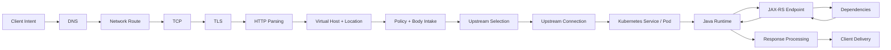

### Five boundaries

Modelkan minimal lima boundary:

1. **Name boundary** — hostname diterjemahkan menjadi address.
2. **Connection boundary** — TCP/TLS session dibuat atau dipakai ulang.
3. **Protocol boundary** — HTTP message diparse, divalidasi, dan dapat diubah.
4. **Routing boundary** — destination logical dipilih.
5. **Execution boundary** — application dan dependency menjalankan kerja.

### Four identities

Satu request dapat memiliki empat identity yang berbeda:

- **network client identity**: source IP/port yang terlihat hop saat ini;
- **TLS identity**: server name dan, bila mTLS, client certificate subject/SAN;
- **HTTP identity**: Host/authority, auth token, cookie, user header;
- **application identity**: authenticated principal, tenant, role, account, quote/order actor.

Jangan menyamakan source IP dengan authenticated user. Jangan pula menganggap `X-Forwarded-For` valid tanpa trusted proxy model.

---

## Request journey bukan satu connection

Pertimbangkan topology:

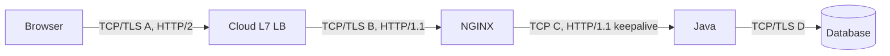

Satu request browser menghasilkan beberapa connection berbeda:

| Connection | Endpoints | Protocol | Lifetime |
|---|---|---|---|
| A | Browser ↔ cloud LB | TCP + TLS + HTTP/2 | Dapat membawa banyak request/stream |
| B | cloud LB ↔ NGINX | TCP/TLS or plaintext | Dapat pooled atau per policy |
| C | NGINX ↔ Java | HTTP/1.1 keepalive umum | Dikelola upstream pool |
| D | Java ↔ DB | DB protocol/TLS | Dikelola DB pool |

### Consequences

- Client membatalkan request tidak selalu langsung membatalkan kerja Java atau DB.
- HTTP/2 client tidak berarti Java menerima HTTP/2.
- TLS session reuse di edge tidak berarti upstream TLS session reuse.
- Cloud LB idle timeout dapat memutus connection sebelum NGINX timeout.
- NGINX dapat selesai membaca seluruh upload sebelum Java memprosesnya bila request buffering aktif.
- Java response dapat selesai dihasilkan tetapi NGINX masih mengirimnya ke slow client.

### State machine sederhana

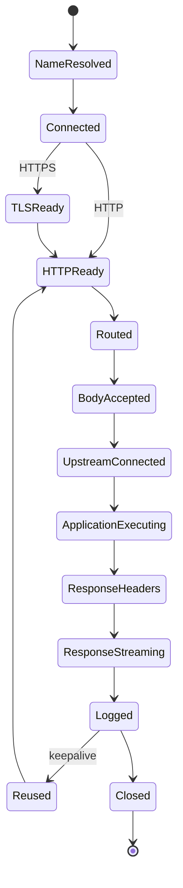

Failure dapat terjadi dari setiap state. Debugging harus menemukan **state terakhir yang berhasil**, bukan hanya status terakhir yang terlihat.

---

## Canonical topologies

## Topology A — Standalone NGINX

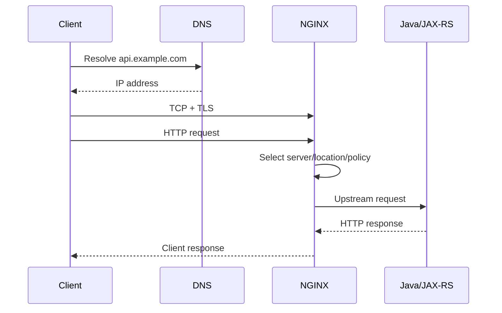

## Topology B — Cloud load balancer + Kubernetes NGINX ingress

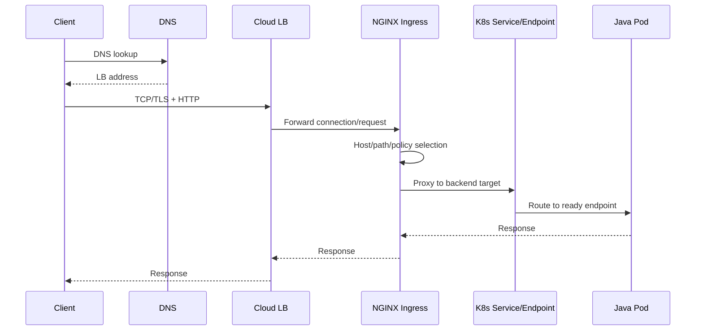

`Service/Endpoint` pada diagram adalah logical placeholder. Actual datapath bergantung controller, Service type, kube-proxy/eBPF implementation, target mode, dan whether controller configures pod endpoints directly.

## Topology C — API gateway + NGINX + mesh

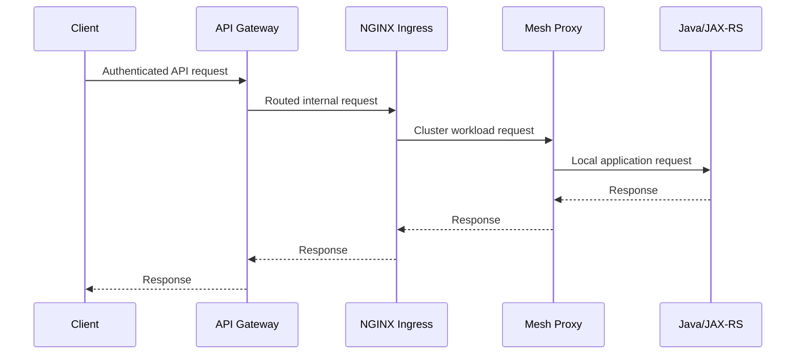

Di topology ini, setiap layer dapat mempunyai timeout/retry/header policy. Tanpa contract, satu request dapat diretry beberapa kali pada layer berbeda.

---

## Phase 0 — Client intent dan URL construction

Lifecycle dimulai sebelum DNS.

Client menentukan:

- scheme: `http` atau `https`;
- authority: hostname dan optional port;
- path;
- query;
- method;
- headers;
- body;
- local deadline;
- proxy settings;
- DNS behavior;
- connection pool behavior.

Contoh URL:

```text
https://api.example.com/quote-order/v1/orders/123?expand=items
```

Dari URL tersebut, client memperoleh:

- scheme: `https`;
- hostname: `api.example.com`;
- default port: `443`;
- request target: `/quote-order/v1/orders/123?expand=items`;
- SNI candidate: `api.example.com`;
- HTTP Host/authority: `api.example.com`.

### Failure modes

- malformed URL;
- wrong environment hostname;
- stale application config;
- corporate proxy misconfiguration;
- `NO_PROXY` mismatch;
- client deadline terlalu pendek;
- accidental `http` instead of `https`;
- wrong base path;
- double encoding;
- invalid Host override.

### Evidence

- client configuration;
- actual emitted request via debug log or packet capture;
- `curl -v` output;
- Java HTTP client logs;
- browser network panel;
- environment variables/proxy settings.

### Java/JAX-RS relevance

Producer code sering membangun URL dari config. Consumer complaint “NGINX 404” dapat sebenarnya berasal dari client base URL yang salah sebelum route benar pernah dicoba.

---

## Phase 1 — DNS resolution

Client harus menerjemahkan hostname menjadi address, kecuali address sudah cached atau dipaksa secara manual.

Simplified flow:

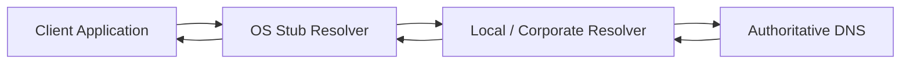

### DNS dapat melibatkan

- browser/application cache;
- JVM DNS cache;
- OS cache;
- local stub resolver;
- corporate DNS;
- split-horizon DNS;
- Route 53 private/public hosted zones;
- Azure Private DNS;
- on-prem authoritative DNS;
- CNAME chain;
- dual-stack A/AAAA records;
- negative caching;
- weighted/failover/geolocation records.

### Output phase

Satu atau lebih IPv4/IPv6 addresses, atau failure seperti `NXDOMAIN`, timeout, `SERVFAIL`, validation failure, atau no usable address.

### Failure modes

- record missing;
- wrong public/private zone selected;
- stale cache after cutover;
- TTL misunderstood;
- CNAME target broken;
- corporate DNS cannot resolve cloud-private zone;
- Kubernetes CoreDNS failure for internal name;
- JVM DNS cache outlives expected TTL;
- IPv6 address returned but path not working;
- DNS points to old load balancer;
- negative cache persists after record creation.

### Detection

```bash
# Basic resolution
getent hosts api.example.com

# Query record and TTL
dig api.example.com A
dig api.example.com AAAA
dig api.example.com CNAME

# Query a specific resolver
dig @10.0.0.2 api.example.com

# Show resolution path where permitted
dig +trace api.example.com
```

### Important distinction

DNS success proves only that a name maps to an address. It does **not** prove:

- the address is reachable;
- the listener exists;
- certificate is valid;
- Host routing is correct;
- backend is healthy.

### Internal question

Which component owns DNS cutover, TTL, private/public zones, and rollback? A DNS incident can look like NGINX downtime even when NGINX receives no traffic.

---

## Phase 2 — Network route dan L4 reachability

Setelah address tersedia, packet harus menemukan route ke destination.

Possible elements:

- client route table;
- VPN;
- corporate proxy;
- firewall;
- NAT;
- internet gateway;
- transit gateway;
- VPC/VNet peering;
- security group/NSG;
- NACL;
- cloud load balancer frontend;
- Kubernetes node/network policy;
- on-prem DMZ;
- private endpoint/PrivateLink;
- hybrid tunnel.

### Failure modes

- no route to host;
- firewall drop;
- security rule reject;
- asymmetric routing;
- NAT exhaustion;
- subnet route missing;
- wrong private endpoint DNS;
- load balancer not reachable from source network;
- MTU/fragmentation issue;
- network policy denies path;
- source address not allowed.

### Evidence

- connect timeout versus immediate refusal;
- cloud flow logs;
- firewall logs;
- route tables;
- security group/NSG configuration;
- packet capture;
- `traceroute`/`tracepath`, where useful and permitted;
- `nc -vz host port`;
- synthetic probe from same network zone.

### Caution

ICMP reachability is not equivalent to TCP port reachability. Many production networks intentionally block ICMP.

---

## Phase 3 — TCP connection establishment

Untuk HTTP/1.1, HTTP/2 over TLS, dan HTTP/3 fallback scenarios, TCP masih sangat umum. HTTP/3 uses QUIC/UDP, dibahas nanti pada protocol part.

Simplified TCP handshake:

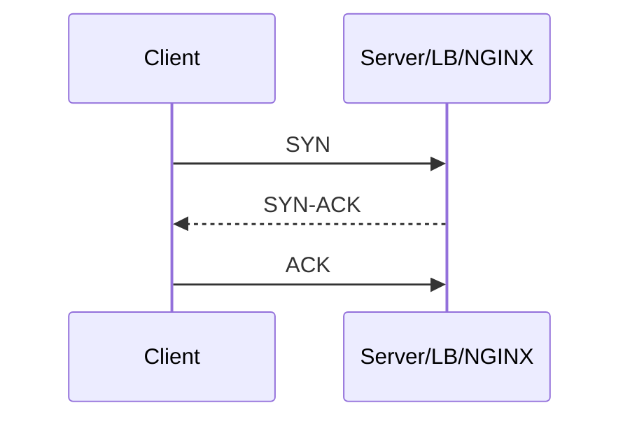

### What is allocated

- client ephemeral port;
- server listen socket state;
- connection tracking state;
- kernel buffers;
- NGINX accepted connection state, bila NGINX adalah destination;
- load balancer connection state, bila LB menjadi endpoint.

### Failure modes

- listener tidak bind;
- wrong port;
- connection refused;
- SYN dropped;
- backlog full;
- file descriptor exhaustion;
- worker connection exhaustion;
- conntrack exhaustion;
- ephemeral port exhaustion;
- reset by peer;
- load balancer has no healthy target;
- proxy-protocol mismatch causing immediate close after connect.

### Detection

```bash
nc -vz api.example.com 443

# Show connect timing; HTTPS detail follows
curl -sS -o /dev/null \
  -w 'connect=%{time_connect}\n' \
  https://api.example.com/health

# Linux socket summary, when authorized
ss -s
ss -lntp
```

### Connect timeout vs read timeout

- **connect timeout**: connection to next hop tidak berhasil established within budget;
- **read timeout**: connection established, tetapi expected data tidak tiba within budget.

Mencampur keduanya membuat diagnosis salah. `504` dapat disebabkan upstream read timeout, sedangkan `502` sering terkait connect/reset/protocol failure, tetapi origin harus dibuktikan dari logs.

---

## Phase 4 — TLS handshake, SNI, dan ALPN

Untuk HTTPS, TLS terjadi setelah TCP connection dan sebelum HTTP request normal dapat diproses.

Simplified flow:

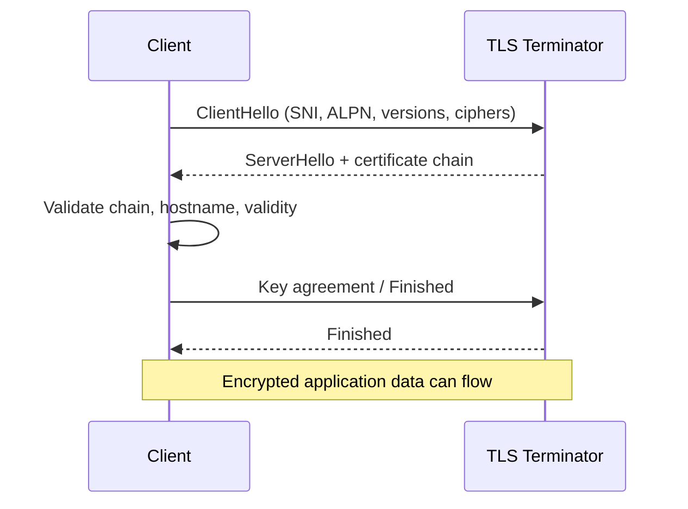

### SNI

SNI membawa intended server name pada TLS handshake. Terminator dapat memilih certificate berdasarkan SNI sebelum HTTP Host header dibaca.

### ALPN

ALPN menegosiasikan application protocol seperti HTTP/2 (`h2`) atau HTTP/1.1.

### TLS termination possibilities

1. client → cloud LB TLS; LB → NGINX plaintext;
2. client → cloud LB TLS; LB → NGINX TLS re-encrypted;
3. client → NGINX TLS; NGINX → Java plaintext;
4. client → NGINX TLS; NGINX → Java TLS;
5. L4 passthrough ke NGINX atau application;
6. mTLS pada satu atau lebih hop.

### Failure modes

- certificate expired/not yet valid;
- hostname/SAN mismatch;
- missing intermediate certificate;
- unknown CA;
- unsupported TLS version/cipher;
- SNI route mismatch;
- ALPN mismatch;
- private key mismatch/unreadable;
- client certificate missing/rejected;
- upstream certificate validation failure;
- clock skew;
- TLS inspection proxy interference.

### Detection

```bash
openssl s_client \
  -connect api.example.com:443 \
  -servername api.example.com \
  -showcerts

curl -v https://api.example.com/health

# Force a resolved address while preserving SNI/Host
curl --resolve api.example.com:443:203.0.113.10 \
  -v https://api.example.com/health
```

### Critical diagnostic fact

Jika TLS handshake gagal sebelum HTTP request dikirim, application access log tidak akan ada. NGINX access log normal juga mungkin tidak ada, tergantung phase dan configuration. Cari TLS/error log pada terminator yang sebenarnya.

---

## Phase 5 — HTTP framing dan request parsing

Setelah secure/plain connection siap, NGINX atau L7 proxy membaca request.

HTTP/1.1 conceptual request:

```http
POST /quote-order/v1/orders HTTP/1.1
Host: api.example.com
Content-Type: application/json
Content-Length: 1234
Authorization: Bearer <token>
Traceparent: 00-...

{...}
```

Proxy harus menentukan message boundaries dan memvalidasi syntax.

### Parsing concerns

- request line length;
- header count dan size;
- invalid characters;
- duplicate headers;
- `Content-Length` consistency;
- transfer encoding;
- Host presence/validity;
- HTTP version;
- request target form;
- malformed percent encoding;
- header normalization.

### Failure modes

- malformed request → commonly `400`;
- headers too large → implementation-specific `400`/`431`-like behavior;
- URI too long → `414`;
- unsupported method/behavior;
- ambiguous framing/request smuggling risk;
- invalid Host;
- protocol mismatch, e.g. plaintext HTTP sent to TLS port;
- HTTP/2 protocol error.

### Evidence

- edge/NGINX error log;
- packet capture where permitted;
- reproducible `curl --trace-ascii`;
- raw request test in isolated environment;
- exact status body and `Server`/diagnostic headers, while treating them as hints only.

### Security note

Proxy and backend must agree on request framing. Ambiguity between front-end and back-end parser can enable request smuggling. Do not weaken parser validation casually for “client compatibility”.

---

## Phase 6 — Virtual server selection

NGINX memilih listener/server configuration berdasarkan address/port, TLS SNI where relevant, dan HTTP Host/authority.

Conceptual order:

1. destination address dan port memilih listener set;
2. TLS handshake dapat memakai SNI untuk certificate/server context;
3. HTTP Host/authority memilih virtual server untuk request processing;
4. bila tidak match, default server untuk listener digunakan.

Detail exact selection dibahas Part 004.

### Failure modes

- DNS points to listener yang benar, tetapi Host tidak match;
- wrong default server catches traffic;
- SNI certificate correct tetapi Host routes elsewhere;
- direct-IP request masuk default host;
- wildcard host terlalu luas;
- duplicate server names;
- cloud LB overwrites Host unexpectedly;
- health checker uses different Host from real traffic.

### Detection

```bash
# Test specific Host over HTTP
curl -v -H 'Host: api.example.com' http://203.0.113.10/health

# Test IP mapping while preserving TLS SNI and Host
curl --resolve api.example.com:443:203.0.113.10 \
  -v https://api.example.com/health
```

### Evidence requirement

Untuk membuktikan virtual server selection, log field harus mencakup at least:

- listener/server address;
- `$host` atau equivalent normalized host;
- incoming Host;
- server name selected;
- SNI, bila tersedia.

---

## Phase 7 — URI normalization dan location selection

Sebelum routing final, URI dapat dinormalisasi dan dibandingkan dengan location rules.

Relevant concepts:

- path versus query string;
- percent encoding;
- duplicate slash handling;
- dot segments;
- exact/prefix/regex location;
- case sensitivity;
- internal redirect;
- rewrite;
- trailing slash;
- `proxy_pass` URI replacement semantics.

### Example

External request:

```text
GET /quote-order/api/orders/123?expand=items
```

Possible transformations:

```text
location match: /quote-order/
rewrite: /quote-order/api/orders/123 → /api/orders/123
upstream request: /api/orders/123?expand=items
```

### Failure modes

- wrong location chosen;
- security location bypassed through normalization mismatch;
- query dropped during rewrite;
- path doubled;
- prefix stripped incorrectly;
- encoded slash interpretation differs;
- regex route shadows prefix;
- redirect loop;
- application sees wrong base URI.

### Detection

- route test matrix;
- temporary safe debug log in non-production;
- access log with original URI and final/upstream URI where possible;
- rendered configuration;
- compare NGINX behavior against JAX-RS application/resource paths.

---

## Phase 8 — Request policy dan body intake

Setelah route context diketahui, NGINX dapat menerapkan policy sebelum atau sambil membaca body.

Possible policy:

- method restriction;
- IP allow/deny;
- authentication subrequest;
- rate/connection limit;
- request size limit;
- header policy;
- CORS preflight handling;
- WAF inspection;
- cache lookup;
- redirect/return;
- request buffering.

### Request body paths

#### Buffered request

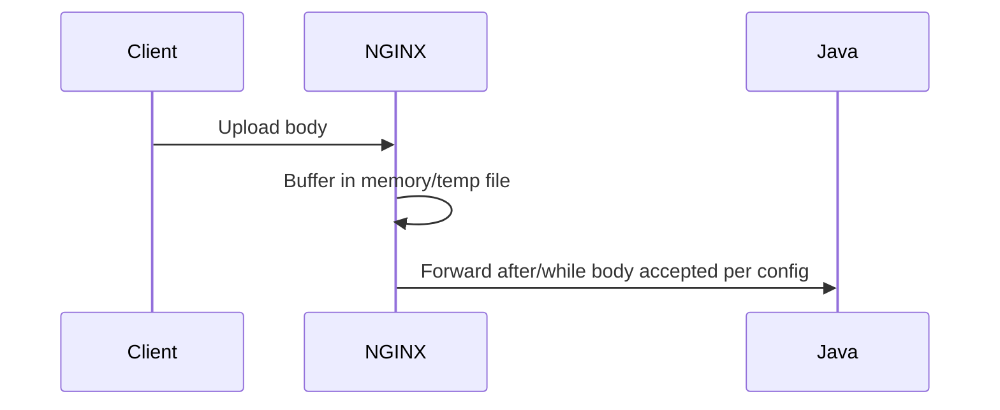

#### Unbuffered/streamed request

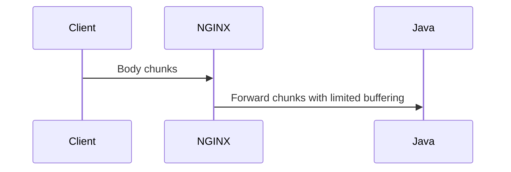

### Why buffering exists

- protect upstream from slow client;
- enable retry under constrained conditions;
- decouple client speed from upstream read speed;
- perform policy/body handling;
- absorb network jitter.

### Costs

- memory/disk use;
- added latency before application sees body;
- hidden temp file I/O;
- large upload pressure;
- client may finish upload while backend has not started meaningful processing;
- cancellation semantics become less direct.

### Failure modes

- `413` body too large;
- body read timeout;
- temp disk full;
- permission/read-only filesystem issue;
- WAF rejection;
- rate limit `429`;
- auth `401/403`;
- client disconnect during upload;
- malformed multipart;
- upstream receives partial/aborted stream.

---

## Phase 9 — Upstream selection

NGINX decides where to send request.

Possible upstream forms:

- literal IP:port;
- named `upstream` group;
- DNS hostname;
- Unix socket;
- Kubernetes Service DNS;
- direct pod/endpoint addresses rendered by controller;
- another proxy/API gateway;
- HTTPS upstream;
- gRPC upstream.

Selection may consider:

- round robin;
- least connections;
- hash/IP hash;
- weights;
- passive health/failure state;
- active health checks, depending edition/product;
- backup server;
- route variables;
- canary/traffic-split logic;
- session affinity.

### Failure modes

- no upstream configured;
- all peers unavailable;
- stale endpoint list;
- wrong port/protocol;
- readiness not reflected;
- hash hot spot;
- sticky session points to removed instance;
- controller has not converged;
- service selector has zero endpoints.

### Evidence

- rendered upstream configuration;
- NGINX upstream address/status log;
- Kubernetes EndpointSlice;
- controller reconciliation events;
- health status API/metrics;
- service selector and pod readiness.

---

## Phase 10 — Upstream DNS dan connection

If upstream is a hostname, resolution behavior matters. NGINX may resolve at configuration load time or dynamically when `resolver`/specific dynamic features are used, depending configuration and version.

Then NGINX obtains or creates an upstream connection.

### Upstream connection lifecycle

1. choose peer;
2. look for reusable keepalive connection;
3. otherwise create TCP connection;
4. optionally perform TLS handshake;
5. send request;
6. read response;
7. reuse, close, or mark failed.

### Failure modes

- stale DNS;
- DNS timeout/NXDOMAIN;
- connection refused;
- connect timeout;
- no route;
- security policy deny;
- pod terminated between selection and connect;
- TLS hostname/CA mismatch;
- upstream speaks HTTP on expected HTTPS or vice versa;
- pooled connection was closed by upstream;
- source ephemeral port pressure;
- upstream connection pool mis-sized.

### Diagnostic distinction

A pod may be `Ready` when endpoint selected, then terminate before connection. Distributed systems cannot eliminate this race; retry/drain/idempotency design must account for it.

---

## Phase 11 — Request transformation dan forwarding

Before sending upstream, NGINX constructs a new upstream request. It is not simply forwarding raw bytes in many HTTP proxy scenarios.

Potential changes:

- request URI;
- Host header;
- `Forwarded`/`X-Forwarded-*`;
- `Connection` and hop-by-hop headers;
- body framing;
- HTTP version;
- Authorization/identity headers;
- request ID;
- trace context;
- compression headers;
- proxy-specific headers;
- client certificate information;
- prefix/base-path header.

### Hop-by-hop vs end-to-end

Hop-by-hop headers apply only to one transport connection and should not be blindly forwarded. Each proxy connection is a new hop.

### Failure modes

- Host overwritten incorrectly;
- source IP lost;
- user-controlled `X-Forwarded-For` trusted;
- original scheme lost, causing HTTP redirect from an HTTPS endpoint;
- duplicate prefix;
- auth header removed;
- hop-by-hop `Connection` behavior breaks WebSocket;
- content length mismatch;
- trace context overwritten;
- identity spoofing.

### Required design artifact

Create a header contract table:

| Header/field | Inbound source | Proxy action | Backend trust | Log/redaction |
|---|---|---|---|---|
| `Host` | Client/LB | Preserve or replace intentionally | Route/base URL | Log normalized value |
| `Forwarded` | Untrusted client possible | Remove and rebuild at trusted edge | Trust only known proxies | Avoid leaking sensitive topology |
| `X-Request-ID` | Client or edge | Validate/generate/propagate | Correlation only | Log all hops |
| `Authorization` | Client/gateway | Preserve, terminate, or replace by contract | Sensitive | Never log token |
| `traceparent` | Client/edge | Validate/propagate | Observability | Log trace ID only as policy allows |

---

## Phase 12 — Kubernetes Service-to-Pod datapath

Kubernetes introduces an important distinction between desired service identity and actual endpoint.

### Objects

- `Service`: stable logical frontend and port mapping;
- `EndpointSlice`: current backend endpoints;
- Pod readiness: controls eligibility for normal service traffic;
- CNI: pod networking;
- kube-proxy or eBPF dataplane: implements Service routing in many clusters;
- ingress controller: may consume Service/EndpointSlice information and route differently depending implementation.

### Variant 1 — NGINX proxies to Service ClusterIP

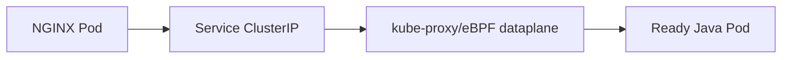

### Variant 2 — Controller configures pod endpoints directly

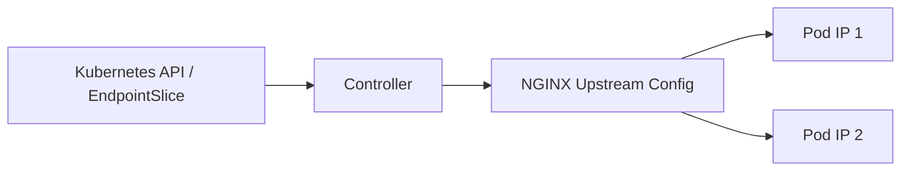

### Variant 3 — External LB targets nodes, then Service routes to controller pod

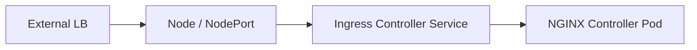

### Variant 4 — External LB uses pod/IP targets

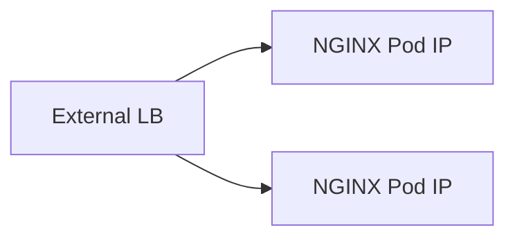

Actual implementation must be verified. Do not assume:

- every Service hop traverses kube-proxy;
- every ingress routes through ClusterIP;
- source IP is preserved;
- node-local routing is used;
- readiness updates are instantaneous;
- all controller replicas have identical config at every instant.

### Failure modes

- Service selector mismatch;
- zero EndpointSlices/ready endpoints;
- targetPort mismatch;
- pod listens only on localhost;
- NetworkPolicy deny;
- CNI route failure;
- stale controller endpoint cache;
- readiness flapping;
- node drain race;
- kube-proxy/eBPF issue;
- topology policy excludes available endpoint;
- externalTrafficPolicy produces no local endpoint on targeted node;
- conntrack issue.

### Detection

```bash
kubectl get ingress,svc,endpointslice,pod -A
kubectl describe ingress <name> -n <namespace>
kubectl describe svc <name> -n <namespace>
kubectl get endpointslice -n <namespace> \
  -l kubernetes.io/service-name=<service>
kubectl get pod -n <namespace> -o wide

# Test from inside the cluster using an approved diagnostic pod
kubectl run net-debug --rm -it --restart=Never \
  --image=curlimages/curl -- sh
```

Use debug pods only under approved security policy. Production clusters may prohibit arbitrary images or shell access.

---

## Phase 13 — Java runtime dan JAX-RS dispatch

Setelah bytes mencapai Java listener, request masih melewati several layers.

Possible lifecycle:

```mermaid
flowchart LR
    Socket[Server Socket / Event Loop] --> HTTP[HTTP Parser]
    HTTP --> Container[Servlet/Reactive Runtime]
    Container --> Security[Security Filters]
    Security --> JAXRS[JAX-RS Filters/Interceptors]
    JAXRS --> Match[Resource Matching]
    Match --> Method[Resource Method]
    Method --> Serializer[Entity Serialization]
```

Depending runtime:

- servlet thread pool;
- Netty/Vert.x event loop;
- virtual threads;
- reactive pipeline;
- worker executor;
- async response handling.

### JAX-RS dispatch concerns

- `@ApplicationPath`;
- resource `@Path` matching;
- method matching;
- content negotiation;
- authentication filter;
- authorization;
- request/response filters;
- exception mappers;
- entity provider/JSON serialization;
- bean validation;
- async lifecycle;
- MDC/trace context propagation.

### Failure modes

- listener not bound/wrong port;
- thread/event-loop saturation;
- connection accepted but request queueing;
- wrong base path;
- JAX-RS `404` no resource match;
- `405` method mismatch;
- `415` unsupported media type;
- `406` unacceptable response type;
- auth `401/403`;
- deserialization `400`;
- validation `400/422` by contract;
- uncaught exception `500`;
- OOM/GC pause;
- downstream timeout;
- response committed then connection reset.

### Important distinction

NGINX `request_time` may include client upload and response transfer, while application duration may cover only server-side handling. They are not expected to match exactly.

---

## Phase 14 — Downstream dependency calls

Many “NGINX timeout” incidents originate downstream of Java:

- database lock/query;
- connection pool wait;
- Kafka request/metadata;
- Redis latency;
- remote REST/gRPC API;
- identity provider;
- object storage;
- DNS for downstream;
- internal proxy;
- thread pool saturation.

### Nested deadline model

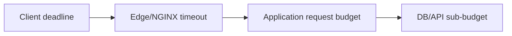

The sequence means outer layers must allow enough time for intended inner work and cleanup, not that every timeout must literally be greater in every architecture.

### Retry amplification

Suppose:

- client retries 2 times;
- API gateway retries 2 times;
- NGINX retries 2 upstreams;
- Java client retries downstream 3 times.

Worst-case attempt multiplication can become substantial. Even when exact multiplication is constrained by phase/status, layered retries can generate a storm.

### Evidence

- distributed trace;
- application timing breakdown;
- connection-pool metrics;
- DB wait events;
- downstream client metrics;
- request cancellation logs;
- deadline propagation.

---

## Phase 15 — Upstream response processing

Java sends:

- status line/pseudo-headers;
- response headers;
- response body;
- trailers, where applicable;
- connection close/reuse semantics.

NGINX parses upstream response and may:

- accept and forward;
- treat invalid headers as upstream failure;
- hide/add/rewrite headers;
- intercept errors;
- retry another upstream under configured conditions;
- buffer response;
- cache response;
- compress/filter body;
- log upstream status and timing.

### Time-to-first-byte dimensions

- upstream connect time;
- time to send request;
- Java queue time;
- application/dependency execution;
- time until response headers/first byte;
- later body generation.

### Failure modes

- upstream closes before headers;
- invalid response header;
- header too large for configured buffer;
- reset mid-response;
- read timeout;
- application returns `500`;
- partial response;
- retry creates duplicate side effect;
- error interception hides application error schema.

### Partial-response hazard

Once NGINX has sent response headers/body to client, it may be impossible to replace the response cleanly if upstream fails mid-stream. Client may see truncated body or connection reset rather than a neat `502` JSON response.

---

## Phase 16 — Response buffering, filtering, dan streaming

By default in common HTTP proxy configurations, NGINX response buffering may be enabled. NGINX reads upstream response into memory buffers and, if necessary and allowed, temporary files while sending to client.

### Buffered response advantages

- Java upstream can release its connection earlier than a slow client;
- proxy can absorb differences in producer/consumer speed;
- supports caching/filtering patterns;
- protects upstream from long client transfer.

### Costs

- memory and temp disk;
- extra copying;
- delayed chunk visibility;
- hidden disk I/O;
- unsuitable defaults for SSE/streaming;
- confusing application timing versus client timing.

### Streaming use cases

- Server-Sent Events;
- large generated download;
- incremental JSON/text stream;
- long polling;
- WebSocket after upgrade;
- gRPC streaming.

Each requires specific protocol and buffering/timeout treatment. Turning buffering off globally is not a safe shortcut.

### Response filters

Possible changes:

- compression;
- header addition/removal;
- cookie rewriting;
- redirect location rewriting;
- cache headers;
- security headers;
- body filters/modules;
- error-page substitution.

### Failure modes

- SSE messages delayed in buffer;
- temp disk full;
- client too slow;
- response header too large;
- double compression;
- incorrect `Content-Length` after transformation;
- cache serves wrong tenant/user content;
- application status/body replaced by proxy error page.

---

## Phase 17 — Client response delivery

NGINX/cloud LB sends response to client. Total completion depends on:

- client receive speed;
- network bandwidth/loss;
- HTTP version;
- flow control;
- response size;
- compression;
- intermediary buffering;
- connection stability.

### Failure modes

- client closes early;
- mobile/network interruption;
- proxy idle timeout;
- response write timeout;
- TCP reset;
- HTTP/2 stream reset;
- browser cancels due navigation;
- client deadline expires after server completed work.

### NGINX 499 concept

NGINX commonly logs non-standard `499` when the client closes connection before NGINX can complete response. `499` is not an HTTP status normally sent to the client; it is an NGINX logging convention.

Possible root causes:

- user cancelled;
- client timeout shorter than NGINX/application;
- upstream too slow;
- intermediary closed connection;
- health probe aborted;
- network loss;
- client retry policy.

Do not blame client automatically. A spike in `499` may indicate server latency regression causing clients to give up.

---

## Phase 18 — Connection reuse, drain, dan close

After request completion, each hop independently decides whether to reuse or close its connection.

### Client-side keepalive

- HTTP/1.1 can reuse sequentially;
- HTTP/2 multiplexes streams;
- client pool has idle/max lifetime policies;
- LB/proxy has idle timeout.

### Upstream keepalive

NGINX may keep idle upstream connections per worker/upstream configuration. Reuse reduces connect/TLS cost but introduces stale-connection and pool-sizing concerns.

### Graceful drain

During rollout or shutdown:

1. target should stop receiving new work;
2. readiness/registration updates propagate;
3. existing connections/requests drain;
4. long-lived streams require special budget;
5. process exits after grace period or forced termination.

### Failure modes

- pod killed before endpoint removal converges;
- LB continues sending to draining node;
- keepalive sends request to a closing upstream;
- long-lived WebSocket prevents drain;
- termination grace period too short;
- old NGINX worker persists too long;
- forced close generates `499/502` or client resets.

---

## Phase 19 — Logging, metrics, dan traces

Logging often occurs at request completion, but exact timing and availability depend implementation/configuration.

### Access log

Should answer:

- request apa;
- route/server mana;
- result apa;
- upstream mana;
- berapa lama;
- berapa bytes;
- client identity yang dipercaya;
- correlation/trace ID apa.

### Error log

Should provide operational detail:

- connect refused;
- timeout;
- invalid header;
- certificate issue;
- config/reload issue;
- upstream prematurely closed;
- resource exhaustion.

### Metrics

Need both traffic and saturation dimensions:

- requests/status;
- active/accepted/handled connections;
- upstream errors;
- request latency histogram;
- config reload success/failure;
- CPU/memory;
- worker/file descriptor use;
- temp disk;
- pod restarts;
- endpoint availability.

### Traces

Distributed tracing can connect NGINX/edge, Java, and downstream spans if trace context is propagated correctly. Not all NGINX distributions/controllers provide identical tracing integration.

### Missing-log reasoning

| Observation | Possible interpretation |
|---|---|
| No Java log, NGINX access log exists | Rejected/routed elsewhere/upstream connect failed before Java handler |
| No NGINX access log, LB log exists | TLS/protocol failure before NGINX, wrong target, or NGINX logging gap |
| No LB log | DNS/wrong endpoint/network before LB, or logging gap |
| Java log exists, client timeout | Response path/client deadline/proxy buffering or timeout |
| NGINX says `200`, client reports failure | Downstream intermediary/client parse/partial transfer/caching issue |

Absence of evidence is not proof unless logging coverage and sampling behavior are known.

---

## Latency decomposition

A useful model:

```text
T_total = T_client_queue
        + T_dns
        + T_network_to_edge
        + T_tcp_edge
        + T_tls_edge
        + T_edge_processing
        + T_connect_upstream
        + T_tls_upstream
        + T_send_request
        + T_app_queue
        + T_app_execution
        + T_downstream
        + T_first_byte_back
        + T_response_transfer
        + T_client_processing
```

Not every term is observable independently. The model forces clarity about what a metric includes.

### Typical timing fields

NGINX logging can expose concepts such as:

- total request time;
- upstream connect time;
- upstream header time;
- upstream response time;
- bytes sent/received;
- upstream address/status.

Exact variable availability and multi-upstream formatting must be verified against NGINX/product/controller version.

### Example interpretation

Assume:

```text
NGINX request time:          8.200 s
Upstream connect time:       0.003 s
Upstream header time:        1.100 s
Upstream response time:      1.300 s
Application duration:        1.050 s
```

Possible explanation:

- upstream/application completed around 1.3 s;
- remaining ~6.9 s likely spent receiving request body, sending response to slow client, buffering, retrying, or waiting in another unmeasured phase;
- it is incorrect to call this “Java took 8.2 seconds”.

### Another example

```text
request time:                5.001 s
upstream connect time:       -
upstream response time:      -
status:                      504
```

Possible explanation:

- upstream was never selected/connected;
- connect attempt not represented as expected;
- another proxy generated status;
- log format/variable semantics differ;
- request failed before upstream metrics were populated.

Always consult exact logs and documentation.

### Percentile reasoning

Average latency hides tail behavior. Review:

- p50: typical path;
- p90/p95: common contention;
- p99/p99.9: tail and SLO risk;
- max: incident/debug clue, not stable capacity metric.

Break percentiles by:

- route;
- status;
- upstream;
- method;
- response size;
- zone/region;
- client type;
- deployment version.

Avoid unbounded high-cardinality labels such as raw user ID, full URI with IDs, or request ID in metrics.

---

## Status-code and failure attribution

Status code alone does not identify origin.

| Status | Possible origin | Typical hypotheses |
|---|---|---|
| `400` | NGINX/LB/WAF/Java | malformed request, invalid header, JSON parse, validation |
| `401` | edge auth/API gateway/Java | missing/invalid credential |
| `403` | WAF/allowlist/authz/Java | denied source, policy, role |
| `404` | default server/location/Ingress/JAX-RS | host/path mismatch, wrong rewrite, missing resource |
| `408` | proxy/application | client request timeout |
| `413` | proxy/WAF/Java | request body limit |
| `414` | proxy/application | URI too long |
| `429` | NGINX/API gateway/Java/downstream | rate/quota/load shedding |
| `499` | NGINX log convention | client/intermediary closed before completion |
| `500` | Java/proxy script/filter | application exception or internal proxy error |
| `502` | NGINX/LB/gateway | connect refused/reset, invalid upstream response, protocol/TLS mismatch |
| `503` | NGINX/LB/Java | no healthy backend, overload, maintenance, readiness failure |
| `504` | NGINX/LB/gateway | upstream connect/read deadline exceeded |

### Attribution method

For an error, establish:

1. **Who emitted the response bytes?**
2. **Which hop logged the status as final status?**
3. **Was an upstream selected?**
4. **Was connection established?**
5. **Were response headers received?**
6. **Did Java log request entry/completion?**
7. **Did client close first?**
8. **Was retry attempted?**

### Header/body fingerprint warning

Error-page text and `Server` header can offer clues, but can be changed, hidden, or spoofed. Treat them as supporting evidence, not proof.

---

## Forwarded headers dan trust chain

A proxy terminates one hop and creates another. Backend needs selected original context, but forwarded metadata is user-controllable unless sanitized.

## Standard `Forwarded`

Conceptual example:

```http
Forwarded: for=203.0.113.10;proto=https;host=api.example.com
```

## De facto `X-Forwarded-*`

```http
X-Forwarded-For: 203.0.113.10, 10.0.1.20
X-Forwarded-Proto: https
X-Forwarded-Host: api.example.com
X-Forwarded-Port: 443
```

### Trust-chain pattern

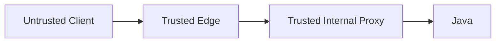

At first trusted edge:

- remove/ignore client-supplied forwarding headers;
- derive identity from actual connection or verified PROXY protocol;
- create canonical forwarded values.

At next trusted proxy:

- accept only from known upstream ranges/identity;
- append or reconstruct according to policy;
- prevent arbitrary internal clients from spoofing edge headers.

At Java:

- trust forwarded headers only when immediate peer is trusted;
- configure runtime/framework semantics deliberately;
- never use raw forwarded client IP as sole authorization factor without network guarantees;
- log both immediate peer and reconstructed client where appropriate.

### Failure modes

- open redirect due spoofed Host/Proto;
- audit logs record attacker-chosen IP;
- allowlist bypass;
- HTTPS endpoint generates HTTP callback;
- duplicate forwarded chains;
- private IP leakage;
- lost tenant/identity header;
- multiple proxies disagree on append order.

---

## Kubernetes traffic-flow variants

Do not memorize one universal Kubernetes path.

## External traffic to controller

Possible paths:

```text
Cloud LB → NodePort → node dataplane → ingress-controller pod
Cloud LB → ingress-controller pod IP
On-prem LB → hostNetwork controller pod
Private LB → LoadBalancer Service → controller pod
```

## Controller to backend

Possible paths:

```text
NGINX → Service ClusterIP → dataplane → pod
NGINX → pod IP endpoint directly
NGINX → service mesh gateway/sidecar → Java
NGINX → external service/VM
```

## Variables that change behavior

- Service `type`;
- `externalTrafficPolicy`;
- `internalTrafficPolicy`;
- cloud LB target type;
- proxy protocol;
- `hostNetwork`;
- DaemonSet vs Deployment;
- CNI;
- kube-proxy mode or eBPF replacement;
- EndpointSlice consumption;
- topology-aware routing;
- mesh injection;
- NetworkPolicy;
- ingress controller implementation;
- cross-zone load balancing;
- source NAT.

## Readiness lifecycle race

Conceptual rollout:

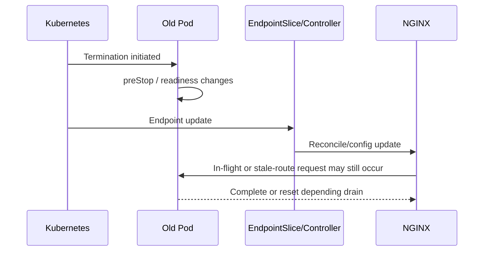

Endpoint propagation is not instantaneous. Safe rollout requires application drain, controller convergence, LB deregistration, keepalive behavior, and termination grace period to align.

---

## AWS, Azure, dan on-prem variations

This part provides conceptual shapes only. Detailed cloud-specific flow appears in Parts 022–024.

## AWS/EKS shape

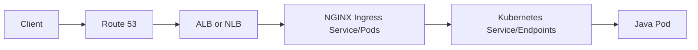

Questions:

- ALB L7 or NLB L4?
- TLS at ACM/LB, NGINX, or both?
- instance or IP targets?
- source IP preserved or forwarded header?
- security group ownership?
- cross-zone behavior?
- LB health path/Host?
- idle timeout?
- AWS Load Balancer Controller or Service integration?

## Azure/AKS shape

```mermaid
flowchart LR
    Client --> DNS[Azure DNS / Private DNS]
    DNS --> Edge[Front Door / App Gateway / Azure LB]
    Edge --> NIC[NGINX Ingress]
    NIC --> SVC[Service/Endpoints]
    SVC --> J[Java Pod]
```

Questions:

- Front Door/App Gateway/LB role?
- TLS and certificate source?
- private/public frontend?
- AGIC versus NGINX coexistence?
- VNet/NSG/private endpoint path?
- source IP/header contract?
- health probes and Host?

## On-prem shape

```mermaid
flowchart LR
    Client --> DNS[Enterprise DNS]
    DNS --> FW[Firewall / DMZ]
    FW --> L4[L4 Load Balancer]
    L4 --> N[NGINX Reverse Proxy / Ingress]
    N --> J[Java VM or Kubernetes Pod]
```

Questions:

- firewall state/NAT?
- hardware ADC versus NGINX responsibilities?
- internal CA?
- proxy chain?
- asymmetric return route?
- air-gapped certificate/image update?
- corporate TLS inspection?
- DNS split horizon?

---

## Systematic debugging playbook

Use hypothesis-driven debugging. Jangan langsung restart pod atau menaikkan timeout.

## Step 1 — Capture exact request identity

Record:

- timestamp with timezone;
- hostname;
- resolved IP;
- method/path/query;
- request/correlation/trace ID;
- client network/environment;
- expected route/service;
- observed status/body;
- reproducibility;
- whether all users/regions affected.

## Step 2 — Reproduce from controlled points

Possible vantage points:

1. original client network;
2. outside public internet;
3. same corporate/VPN zone;
4. inside cloud VPC/VNet;
5. inside Kubernetes cluster;
6. inside ingress-controller pod/namespace, if allowed;
7. directly to Service;
8. directly to pod;
9. localhost inside Java container.

Difference between adjacent vantage points narrows failure boundary.

## Step 3 — Prove DNS

```bash
dig api.example.com A +noall +answer
dig api.example.com AAAA +noall +answer
```

Compare expected address, TTL, resolver, public/private view.

## Step 4 — Prove TCP/TLS

```bash
nc -vz api.example.com 443
openssl s_client -connect api.example.com:443 \
  -servername api.example.com </dev/null
```

Check certificate, issuer, SAN, dates, ALPN, and handshake errors.

## Step 5 — Prove HTTP routing

```bash
curl -sv \
  -H 'X-Request-ID: debug-20260711-001' \
  https://api.example.com/health

curl --resolve api.example.com:443:203.0.113.10 \
  -sv https://api.example.com/health
```

Use synthetic IDs that comply with logging policy and do not contain sensitive data.

## Step 6 — Inspect load balancer evidence

- target health;
- listener/rule;
- TLS policy;
- access logs;
- backend status;
- health-check path/Host;
- connection/reset metrics;
- source network rules.

## Step 7 — Inspect NGINX/controller evidence

- access log for request ID;
- error log near timestamp;
- selected host/route;
- upstream address/status/timings;
- controller events;
- last successful reload;
- rendered config;
- pod health/resource saturation;
- certificate secret/version.

## Step 8 — Inspect Kubernetes objects

```bash
kubectl get ingress -n <ns> <name> -o yaml
kubectl describe ingress -n <ns> <name>
kubectl get svc -n <ns> <service> -o yaml
kubectl get endpointslice -n <ns> \
  -l kubernetes.io/service-name=<service> -o yaml
kubectl get pods -n <ns> -l app=<label> -o wide
kubectl describe pod -n <ns> <pod>
```

Look for:

- class mismatch;
- rejected annotation;
- absent endpoint;
- port mismatch;
- readiness failure;
- restarts;
- terminating pods;
- network policy.

## Step 9 — Inspect Java evidence

- request entry/completion logs;
- trace span;
- thread/event-loop saturation;
- HTTP server metrics;
- GC pause/CPU/memory;
- connection pool waits;
- dependency latency;
- exception mapper result;
- cancellation/interruption behavior.

## Step 10 — Build a timeline

Example:

```text
00:00.000 client starts
00:00.012 DNS complete
00:00.025 TCP connected
00:00.060 TLS complete
00:00.065 LB received request
00:00.070 NGINX accepted request
00:00.073 upstream connection established
00:00.080 Java request started
00:04.900 client deadline expired
00:05.075 Java response ready
00:05.076 NGINX logs client closed / 499
```

Conclusion: root cause likely application/dependency latency relative to client deadline, not “random NGINX 499”.

## Step 11 — Change one variable at a time

Examples:

- force IP while preserving Host/SNI;
- bypass one proxy in test environment;
- hit Service instead of Ingress;
- hit pod instead of Service;
- compare with/without body;
- compare one route;
- compare one zone/controller replica.

Avoid simultaneous restarts/config changes that destroy evidence.

---

## Observability contract

A useful structured NGINX access-log schema might conceptually contain:

```json
{
  "timestamp": "2026-07-11T00:00:00.123+07:00",
  "request_id": "...",
  "trace_id": "...",
  "client_ip": "...",
  "immediate_peer_ip": "...",
  "host": "api.example.com",
  "method": "POST",
  "route": "quote-order-api",
  "uri_template_or_normalized_path": "/quote-order/v1/orders/:id",
  "status": 200,
  "request_time_seconds": 0.245,
  "upstream_address": "10.2.3.4:8080",
  "upstream_status": 200,
  "upstream_connect_time_seconds": 0.002,
  "upstream_header_time_seconds": 0.180,
  "upstream_response_time_seconds": 0.190,
  "bytes_received": 1234,
  "bytes_sent": 4567,
  "tls_protocol": "TLSv1.3",
  "http_version": "HTTP/2.0",
  "controller_instance": "..."
}
```

This is a conceptual schema, not a drop-in config.

### Requirements

- sensitive headers/tokens/body not logged;
- raw path IDs normalized before metrics labels;
- timestamps synchronized;
- IDs propagated, not regenerated at every hop without linkage;
- multiple upstream attempts represented correctly;
- logs include controller/instance identity;
- sampling does not hide all errors;
- retention supports incident/RCA needs;
- access is controlled and auditable.

### Metrics correlation

For one route, correlate:

- request rate;
- status rate;
- p50/p95/p99 request time;
- upstream connect/header/response time;
- active connections;
- CPU/memory;
- Java request duration;
- thread/connection pool saturation;
- pod readiness/endpoints;
- dependency metrics;
- LB target health.

### Trace propagation

Define behavior for:

- valid incoming `traceparent`;
- invalid trace header;
- no trace header;
- trusted versus untrusted sampling hint;
- baggage restrictions;
- request ID relationship to trace ID;
- async JAX-RS context propagation.

---

## Java/JAX-RS implications

## 1. Correct base URI

JAX-RS features may build URI from request context. Behind proxy, ensure correct external scheme, host, port, and base path.

Failure:

```text
Client calls https://api.example.com/quote-order/...
Application redirects to http://java-service:8080/...
```

Root cause is usually forwarded-header/base-path trust/config mismatch.

## 2. Resource matching and rewrite

Map explicitly:

```text
External host/path
→ NGINX selected route
→ rewritten upstream path
→ JAX-RS @ApplicationPath
→ resource @Path
→ method
```

A `404` may occur at any of those steps.

## 3. Client cancellation

When client disconnects:

- NGINX may detect close;
- upstream request may be cancelled or may continue depending phase/protocol/config;
- Java may receive broken pipe/reset only when writing;
- DB operation may continue;
- transaction may commit even though client saw timeout.

Therefore, non-idempotent operation must not rely on client connection survival as transaction semantics.

## 4. Async/reactive endpoints

Long-lived request requires:

- proxy read timeout alignment;
- application async timeout;
- downstream deadlines;
- cancellation propagation;
- memory/context cleanup;
- worker/event-loop safety;
- trace context preservation.

## 5. Streaming

For SSE/download:

- response must flush as intended;
- NGINX buffering policy must match;
- cloud LB idle timeout must allow heartbeat/traffic;
- compression can affect flush behavior;
- client disconnect cleanup required.

## 6. Readiness

Readiness should reflect ability to accept relevant traffic, but not become so dependency-heavy that transient downstream issues remove all pods simultaneously.

Review:

- server port accepting;
- critical initialization done;
- connection pools ready;
- config loaded;
- application not draining;
- dependencies classified critical versus degradable.

## 7. Error mapping

Define which layer owns:

- malformed JSON;
- validation;
- authentication;
- domain authorization;
- rate limit;
- payload too large;
- upstream unavailable;
- timeout;
- maintenance.

Avoid multiple layers returning incompatible JSON schemas for the same public API without a normalization contract.

---

## PR review checklist

### End-to-end path

- [ ] Diagram includes DNS, all L4/L7 hops, NGINX, Kubernetes Service/endpoints, Java runtime, and critical dependencies.
- [ ] Each hop marks protocol and encryption.
- [ ] Each hop has owner.
- [ ] Service/pod datapath is verified, not assumed.

### Connection model

- [ ] Client and upstream connections modeled separately.
- [ ] HTTP versions per hop known.
- [ ] Keepalive/idle timeout per hop reviewed.
- [ ] Source-IP and PROXY protocol behavior known.
- [ ] Connection drain during rollout defined.

### Routing

- [ ] DNS result and rollback documented.
- [ ] Host/SNI relationship explicit.
- [ ] External and internal paths mapped.
- [ ] Default route behavior safe.
- [ ] Health-check Host/path matches intended listener.

### Headers and identity

- [ ] Forwarded headers sanitized at trust boundary.
- [ ] Immediate peer and original client distinguishable.
- [ ] Identity headers cannot be spoofed.
- [ ] Request/trace ID generation and propagation defined.
- [ ] Sensitive data redacted.

### Timeout and retries

- [ ] Timeout chain documented.
- [ ] Client deadline considered.
- [ ] Retry ownership and idempotency reviewed.
- [ ] Long-running/streaming route has dedicated policy.
- [ ] Cancellation behavior understood.

### Body/response

- [ ] Body size and buffering behavior known.
- [ ] Temp disk/memory impact considered.
- [ ] SSE/WebSocket/gRPC/download behavior tested if relevant.
- [ ] Response buffering and error interception reviewed.

### Observability

- [ ] Logs allow hop and upstream attribution.
- [ ] Latency fields separate total and upstream time.
- [ ] Metrics avoid high cardinality.
- [ ] Trace context reaches JAX-RS and downstream.
- [ ] Synthetic test and dashboard exist.

### Failure and rollback

- [ ] Failure modes per phase listed.
- [ ] Vantage-point test plan exists.
- [ ] Rollback covers DNS/config/certificate/controller changes.
- [ ] Evidence is preserved before restart/redeploy.
- [ ] Blast radius is explicit.

---

## Internal verification checklist

Bagian ini tidak mengasumsikan topology internal CSG.

### DNS

- [ ] Public/private zones dan resolver path terdokumentasi.
- [ ] A/AAAA/CNAME records dan TTL diketahui.
- [ ] DNS ownership, change process, dan rollback diketahui.
- [ ] JVM/OS/application DNS caching behavior diverifikasi.
- [ ] Split-horizon behavior diuji dari client zones yang relevan.

### Edge/load balancer

- [ ] Jenis LB: L4 atau L7.
- [ ] Listener, rule, target type, health check, dan idle timeout diketahui.
- [ ] TLS termination/re-encryption diketahui.
- [ ] Source IP/forwarded header/proxy protocol diketahui.
- [ ] Logs dan metrics tersedia.

### NGINX/controller

- [ ] Product/controller dan version tepat.
- [ ] Listener, server, route, upstream, timeout, retry, buffering, dan body limit dapat ditelusuri ke source config.
- [ ] Rendered config dapat diinspeksi.
- [ ] Last reload success/failure terlihat.
- [ ] Access/error logs mengandung request ID dan upstream timings.
- [ ] Replica convergence dan rollout behavior dipahami.

### Kubernetes

- [ ] IngressClass/controller ownership benar.
- [ ] Service type, ports, selectors, dan EndpointSlices benar.
- [ ] Controller routes via ClusterIP atau direct endpoints diketahui.
- [ ] CNI/kube-proxy/eBPF implementation diketahui.
- [ ] NetworkPolicy dan namespace boundaries diperiksa.
- [ ] Readiness, preStop, termination grace, PDB, dan drain behavior diuji.

### Java/JAX-RS

- [ ] Listener protocol/port dan bind address benar.
- [ ] Forwarded-header processing dikonfigurasi dengan trust boundary.
- [ ] External base path dipetakan ke `@ApplicationPath`/resource paths.
- [ ] HTTP server/thread/event-loop metrics tersedia.
- [ ] Request duration, queue time, dependency time, dan status tercatat.
- [ ] Cancellation, timeout, retry, idempotency, dan transaction outcome dipahami.
- [ ] Streaming/large upload behavior diuji bila ada.

### Observability/runbook

- [ ] Satu request dapat dicari across LB, NGINX, Java, dan dependency.
- [ ] Timezone/clock sync konsisten.
- [ ] Dashboards memisahkan total dan upstream latency.
- [ ] `499/502/503/504` mempunyai runbook.
- [ ] Incident notes sebelumnya direview untuk recurring pattern.
- [ ] Log retention/redaction/access control sesuai policy.

---

## Exercises

## Exercise 1 — Draw the actual path

Gambar satu endpoint internal dengan format:

```text
Client type/network
→ resolver
→ DNS record chain
→ frontend address
→ LB listener
→ TLS terminator
→ NGINX listener/server/location
→ upstream target
→ Kubernetes Service/EndpointSlice
→ pod/container port
→ Java runtime
→ JAX-RS application/resource method
→ critical dependencies
```

Tandai owner, protocol, timeout, dan log source pada setiap hop.

## Exercise 2 — Latency accounting

Diberikan:

```text
Client total:                  3.8 s
LB target time:                3.5 s
NGINX request time:            3.4 s
NGINX upstream connect:        0.002 s
NGINX upstream header:         3.2 s
Java endpoint timer:           3.1 s
Database query:                2.8 s
```

Jawab:

- bottleneck utama di mana?
- berapa network/proxy overhead yang terlihat?
- metric tambahan apa yang dibutuhkan?
- timeout layer mana yang paling berisiko?

## Exercise 3 — Missing-log matrix

Untuk setiap kondisi, tulis next evidence:

1. client TLS error, tidak ada NGINX access log;
2. NGINX `502`, tidak ada Java request log;
3. Java returns `200`, client sees timeout;
4. NGINX `499` spike setelah deployment;
5. one zone fails, other zones healthy;
6. Service exists but EndpointSlice empty.

## Exercise 4 — Header trust review

Buat header contract untuk:

- `Host`;
- `Forwarded`;
- `X-Forwarded-For`;
- `X-Forwarded-Proto`;
- request ID;
- traceparent;
- Authorization;
- user/tenant identity headers.

Untuk setiap header, tentukan who may set, who overwrites, who trusts, dan what is logged.

## Exercise 5 — Error-origin challenge

Sebuah client menerima:

```http
HTTP/1.1 504 Gateway Timeout
```

Jangan menyimpulkan root cause. Susun ordered hypotheses dan evidence untuk membedakan:

- cloud LB timeout;
- NGINX connect timeout;
- NGINX read timeout;
- API gateway timeout;
- Java-generated `504`;
- service mesh timeout;
- downstream dependency timeout mapped by Java.

---

## Ringkasan

Request lifecycle yang harus Anda internalisasi:

```text
client intent
→ DNS
→ route/firewall
→ TCP
→ TLS/SNI/ALPN
→ HTTP parsing
→ virtual server
→ URI/location
→ policy/body intake
→ upstream selection
→ upstream connect/TLS
→ header/path transformation
→ Kubernetes service/endpoint datapath
→ Java runtime
→ JAX-RS dispatch
→ dependencies
→ upstream response
→ buffering/filtering
→ client transfer
→ connection reuse/close
→ logs/metrics/traces
```

Tiga aturan utama:

1. **Cari state terakhir yang berhasil.**
2. **Pisahkan client-facing dan upstream-facing connection.**
3. **Gunakan evidence per hop; jangan menentukan origin hanya dari status code.**

Part 003 akan memindahkan mental model ini ke struktur konfigurasi NGINX: context, directive scope, inheritance, includes, variables, phase behavior, config validation, master/worker lifecycle, serta safe reload.

---

## Referensi resmi

1. [NGINX documentation](https://nginx.org/en/docs/)
2. [NGINX Beginner’s Guide](https://nginx.org/en/docs/beginners_guide.html)
3. [How nginx processes a request](https://nginx.org/en/docs/http/request_processing.html)
4. [NGINX proxy module](https://nginx.org/en/docs/http/ngx_http_proxy_module.html)
5. [NGINX HTTP load balancing](https://nginx.org/en/docs/http/load_balancing.html)
6. [NGINX development guide — HTTP request processing phases](https://nginx.org/en/docs/dev/development_guide.html)
7. [Kubernetes Ingress](https://kubernetes.io/docs/concepts/services-networking/ingress/)
8. [Kubernetes Ingress Controllers](https://kubernetes.io/docs/concepts/services-networking/ingress-controllers/)
9. [Kubernetes Service](https://kubernetes.io/docs/concepts/services-networking/service/)
10. [Kubernetes EndpointSlices](https://kubernetes.io/docs/concepts/services-networking/endpoint-slices/)
11. [Kubernetes Service internal traffic policy](https://kubernetes.io/docs/concepts/services-networking/service-traffic-policy/)
12. [F5 NGINX Ingress Controller design](https://docs.nginx.com/nginx-ingress-controller/overview/design/)
13. [F5 NGINX Ingress Controller documentation](https://docs.nginx.com/nginx-ingress-controller/)
14. [RFC 9110 — HTTP Semantics](https://www.rfc-editor.org/rfc/rfc9110)
15. [RFC 9112 — HTTP/1.1](https://www.rfc-editor.org/rfc/rfc9112)
16. [RFC 9113 — HTTP/2](https://www.rfc-editor.org/rfc/rfc9113)
17. [RFC 8446 — TLS 1.3](https://www.rfc-editor.org/rfc/rfc8446)
18. [RFC 7239 — Forwarded HTTP Extension](https://www.rfc-editor.org/rfc/rfc7239)

