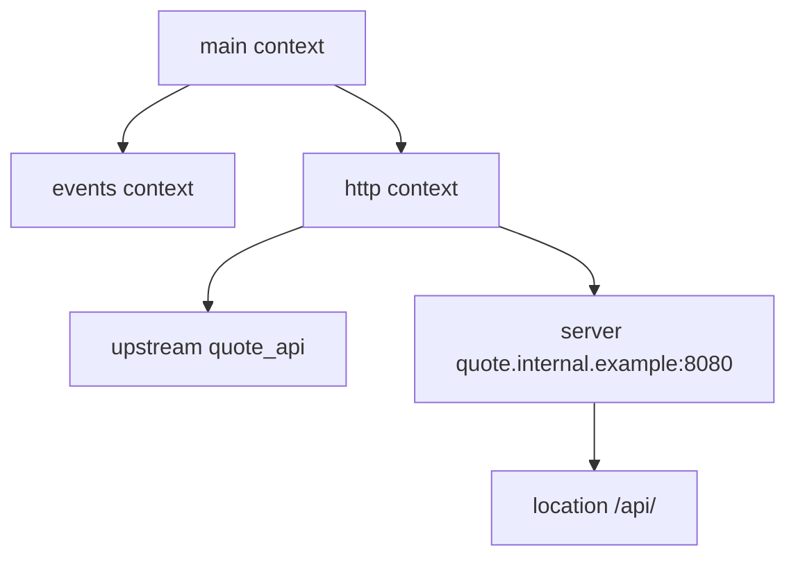
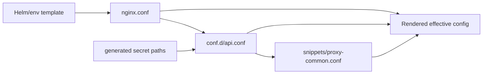
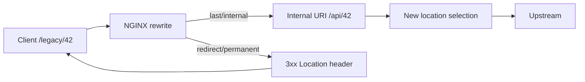
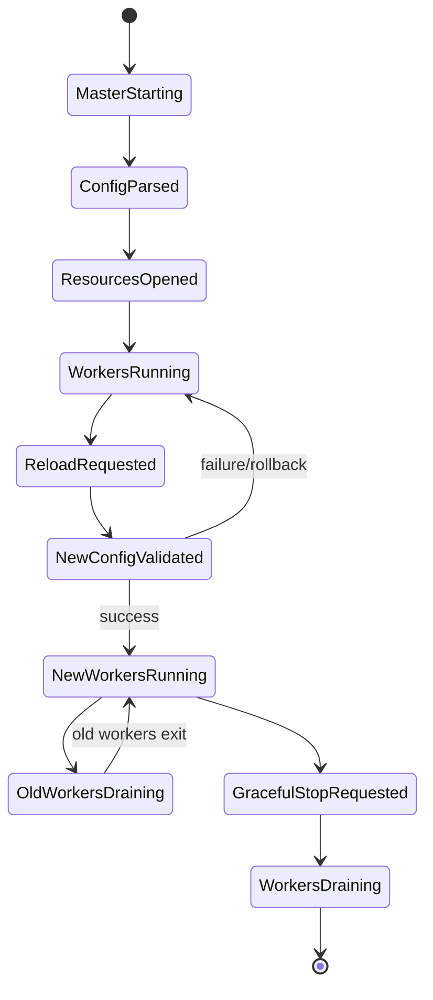
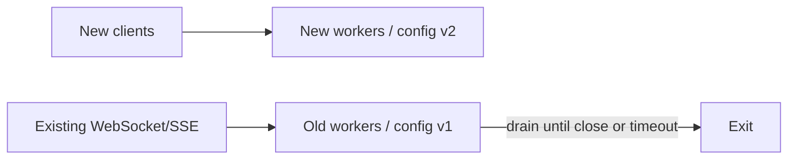
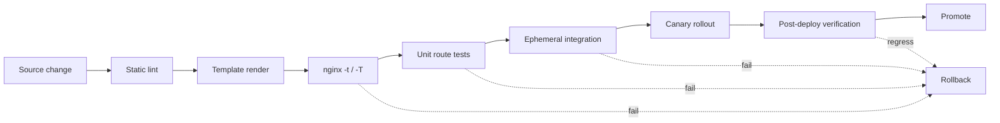

# Part 003 — Configuration Mental Model: Context, Inheritance, Includes, and Reload

> **Depth level:** Intermediate  
> **Primary audience:** Senior Java/JAX-RS backend engineer yang perlu membaca, mereview, mengubah, dan mengoperasikan konfigurasi NGINX secara aman.  
> **Prerequisite:** Part 001–002; familiar dengan Linux process, filesystem, environment variable, container, dan dasar HTTP routing.

## Learning outcomes

Setelah menyelesaikan part ini, Anda seharusnya mampu:

1. membaca konfigurasi NGINX sebagai **configuration tree**, bukan sebagai daftar baris yang dieksekusi dari atas ke bawah;
2. membedakan parse-time, configuration-merge time, request-processing time, dan reload time;
3. menentukan context tempat sebuah directive valid serta konfigurasi efektif yang diterima request;
4. mengenali inheritance yang module-specific, replacement semantics, dan konfigurasi child yang tanpa sengaja menghapus parent behavior;
5. menggunakan `include`, variable, `map`, `return`, `rewrite`, `try_files`, `root`, `alias`, dan `proxy_pass` dengan mental model yang benar;
6. menjelaskan mengapa `if` bukan general-purpose control flow dan kapan penggunaannya masih dapat dipertanggungjawabkan;
7. menjalankan validation, rendered-config inspection, reload, smoke test, rollback, dan post-reload verification;
8. membedakan reload standalone NGINX, reload di container, dan reconciliation pada NGINX-based Kubernetes ingress controller.

---

## Daftar isi

1. [Ringkasan eksekutif](#ringkasan-eksekutif)
2. [Configuration is a compiled declarative tree](#configuration-is-a-compiled-declarative-tree)
3. [Empat waktu yang harus dibedakan](#empat-waktu-yang-harus-dibedakan)
4. [Anatomi file konfigurasi](#anatomi-file-konfigurasi)
5. [Context hierarchy](#context-hierarchy)
6. [Directive types dan scope](#directive-types-dan-scope)
7. [Inheritance dan merge semantics](#inheritance-dan-merge-semantics)
8. [Include graph dan rendered configuration](#include-graph-dan-rendered-configuration)
9. [Variables dan lazy evaluation](#variables-dan-lazy-evaluation)
10. [`map` sebagai declarative decision table](#map-sebagai-declarative-decision-table)
11. [`if` dan rewrite-module pitfalls](#if-dan-rewrite-module-pitfalls)
12. [`return`, `rewrite`, dan internal redirect](#return-rewrite-dan-internal-redirect)
13. [`try_files` mental model](#try_files-mental-model)
14. [`root` versus `alias`](#root-versus-alias)
15. [`proxy_pass` pada level konfigurasi](#proxy_pass-pada-level-konfigurasi)
16. [HTTP, stream, dan mail boundaries](#http-stream-dan-mail-boundaries)
17. [Master/worker lifecycle](#masterworker-lifecycle)
18. [Reload versus restart](#reload-versus-restart)
19. [Apa yang sebenarnya terjadi saat reload](#apa-yang-sebenarnya-terjadi-saat-reload)
20. [Reload failure modes](#reload-failure-modes)
21. [Long-lived connection dan old worker generation](#long-lived-connection-dan-old-worker-generation)
22. [Safe configuration change pipeline](#safe-configuration-change-pipeline)
23. [Validation toolkit](#validation-toolkit)
24. [Container dan Kubernetes controller considerations](#container-dan-kubernetes-controller-considerations)
25. [Java/JAX-RS implications](#javajax-rs-implications)
26. [Failure model dan debugging](#failure-model-dan-debugging)
27. [Security concerns](#security-concerns)
28. [Performance concerns](#performance-concerns)
29. [Observability concerns](#observability-concerns)
30. [PR review checklist](#pr-review-checklist)
31. [Internal verification checklist](#internal-verification-checklist)
32. [Exercises](#exercises)
33. [Ringkasan](#ringkasan)
34. [Referensi resmi](#referensi-resmi)

---

## Ringkasan eksekutif

Kesalahan paling berbahaya saat membaca `nginx.conf` adalah menganggapnya seperti script shell:

```text
baris 1 dijalankan
→ baris 2 dijalankan
→ baris 3 dijalankan
```

Mental model yang lebih tepat:

```text
files + templates + includes
→ parser membaca configuration graph
→ module membuat object konfigurasi per context
→ parent/child configuration di-merge
→ listener, log, certificate, upstream, dan resource lain disiapkan
→ worker menjalankan request memakai snapshot konfigurasi tersebut
```

NGINX configuration adalah declarative DSL yang dikompilasi menjadi runtime configuration. Beberapa directive tampak seperti imperative control flow—terutama directive dari rewrite module—namun tetap berjalan di dalam phase model NGINX, bukan sebagai general-purpose programming language.

Tiga aturan utama:

1. **Context menentukan validitas dan scope.**
2. **Inheritance ditentukan masing-masing module, bukan satu aturan universal.**
3. **File yang Anda edit belum tentu configuration yang benar-benar dirender dan dipakai process.**

---

## Configuration is a compiled declarative tree

Contoh konfigurasi minimal:

```nginx
worker_processes auto;

 events {
    worker_connections 4096;
}

http {
    include       mime.types;
    default_type  application/octet-stream;

    upstream quote_api {
        server quote-api:8080;
    }

    server {
        listen 8080;
        server_name quote.internal.example;

        location /api/ {
            proxy_pass http://quote_api;
        }
    }
}
```

Representasi mentalnya:



Request tidak “menjalankan” `worker_processes`, lalu `events`, lalu `http`. Directive tersebut membentuk runtime state yang berbeda:

- main context membentuk process-level state;
- events context mengatur event-processing behavior;
- http context membuat HTTP subsystem configuration;
- server context membuat virtual server configuration;
- location context membuat route-specific configuration;
- upstream context membuat named backend group.

### Configuration snapshot

Setiap worker generation memproses request menggunakan snapshot konfigurasi yang dimuat saat worker dibuat. Setelah reload:

- worker baru menggunakan configuration baru;
- worker lama menyelesaikan connection/request yang sudah dimilikinya dengan configuration lama;
- kedua generation dapat hidup bersamaan sementara waktu.

Konsekuensinya, perubahan tidak selalu tampak sebagai cutover atomik untuk seluruh connection di satu nanosecond.

---

## Empat waktu yang harus dibedakan

### 1. Template/render time

Terjadi sebelum NGINX membaca konfigurasi.

Contoh sumber:

- Helm template;
- Kustomize patch;
- Jinja/Go template;
- `envsubst` entrypoint;
- configuration generator milik ingress controller;
- secret/config injection dari CI/CD.

Failure umum:

- value kosong menghasilkan directive invalid;
- quoting salah;
- YAML menghasilkan annotation berbeda dari ekspektasi;
- environment variable tidak tersedia;
- duplicate fragments dari beberapa source.

### 2. Parse and configuration-build time

Terjadi saat startup atau reload.

NGINX:

- membaca main file;
- memperluas `include`;
- memvalidasi syntax dan context;
- memanggil module configuration hooks;
- membuat dan menggabungkan configuration object;
- mencoba membuka resource yang diperlukan.

### 3. Request-processing time

Terjadi untuk setiap request/connection.

Contoh:

- virtual server selection;
- location matching;
- variable evaluation;
- rewrite phase;
- access/auth phase;
- content handler atau proxy;
- log phase.

### 4. Lifecycle/reload time

Terjadi ketika master process menerima signal atau controller merekonsiliasi state.

Contoh:

- syntax validation;
- open listener/log/certificate;
- start worker generation baru;
- graceful shutdown worker lama;
- readiness/config-version verification.

### Why this matters

Pertanyaan berikut memiliki jawaban yang berbeda:

- “Apakah config valid secara syntax?”
- “Apakah template merender nilai yang benar?”
- “Apakah reload berhasil diterapkan?”
- “Apakah request tertentu memilih route yang benar?”
- “Apakah semua old worker sudah berhenti?”

Jangan menggunakan satu bukti untuk menjawab semua pertanyaan tersebut.

---

## Anatomi file konfigurasi

Path default bergantung pada installation package, image, prefix, dan build. Jangan mengasumsikan selalu `/etc/nginx/nginx.conf` tanpa verifikasi.

Pola umum Linux package:

```text
/etc/nginx/nginx.conf
/etc/nginx/conf.d/*.conf
/etc/nginx/mime.types
/etc/nginx/modules-enabled/*
/etc/nginx/sites-enabled/*      # distribution-specific, bukan universal
```

Pola container/controller dapat berbeda:

```text
/etc/nginx/nginx.conf
/etc/nginx/conf.d/*.conf
/etc/nginx/templates/*.template
/etc/nginx/secrets/*
/tmp/nginx/*
```

### Main file bukan seluruh configuration

Main file sering hanya menjadi root include graph:

```nginx
user nginx;
worker_processes auto;
pid /var/run/nginx.pid;

include /etc/nginx/modules-enabled/*.conf;

events {
    worker_connections 8192;
}

http {
    include /etc/nginx/mime.types;
    include /etc/nginx/conf.d/*.conf;
}
```

Yang perlu direview adalah **rendered effective configuration**, bukan hanya root file.

---

## Context hierarchy

### Main context

Tidak ditulis dengan block keyword. Berada di top-level.

Contoh directive:

```nginx
user nginx;
worker_processes auto;
worker_rlimit_nofile 200000;
pid /run/nginx.pid;
error_log /var/log/nginx/error.log warn;
```

Concern utamanya:

- process identity;
- worker count;
- file descriptor ceiling;
- PID dan signal control;
- module loading;
- top-level logging.

### `events` context

```nginx
events {
    worker_connections 16384;
    multi_accept off;
}
```

Concern utamanya connection event handling, bukan HTTP routing.

### `http` context

```nginx
http {
    include mime.types;
    log_format main '$request_id $status $request_time';
    map $http_upgrade $connection_upgrade {
        default upgrade;
        ''      close;
    }

    upstream quote_api {
        server quote-api:8080;
    }

    server {
        # ...
    }
}
```

Concern utamanya shared HTTP policy:

- logging;
- MIME;
- compression;
- maps;
- upstream groups;
- common proxy defaults;
- virtual servers.

### `server` context

```nginx
server {
    listen 443 ssl;
    server_name quote.example.com;

    location /api/ {
        proxy_pass http://quote_api;
    }
}
```

Satu `server` adalah virtual server, bukan Java server instance.

### `location` context

```nginx
location /api/quotes/ {
    proxy_read_timeout 30s;
    proxy_pass http://quote_api;
}
```

Mendefinisikan route-specific behavior setelah server dipilih.

`location` dapat nested dalam beberapa bentuk, tetapi nesting menambah kompleksitas selection dan inheritance. Jangan menggunakannya hanya untuk “rapi secara visual”.

### `upstream` context

```nginx
upstream quote_api {
    least_conn;
    server quote-api-a:8080;
    server quote-api-b:8080;
    keepalive 64;
}
```

Mendefinisikan logical backend group. Detailed load balancing dibahas pada Part 008.

### Additional module contexts

Beberapa module mempunyai block sendiri:

```nginx
map $http_x_tenant $tenant_bucket {
    default default_tenant;
    ~^enterprise- enterprise;
}

geo $remote_addr $trusted_network {
    default 0;
    10.0.0.0/8 1;
}
```

Selalu cek documentation context matrix untuk directive.

---

## Directive types dan scope

### Simple directive

Berakhir dengan semicolon:

```nginx
proxy_read_timeout 30s;
```

### Block directive

Memiliki child configuration:

```nginx
server {
    # child directives
}
```

### Directive name tidak cukup untuk memahami behavior

Untuk setiap directive, baca minimal:

| Property | Pertanyaan |
|---|---|
| Syntax | Parameter apa yang valid? |
| Default | Apa behavior bila tidak didefinisikan? |
| Context | Di level mana directive valid? |
| Version | Apakah tersedia pada version/build ini? |
| Module | Module mana yang memilikinya? |
| Inheritance | Bagaimana parent dan child di-merge? |
| Evaluation | Parse time atau request time? |
| Side effect | Listener, file, memory zone, internal redirect, network call? |

### Invalid context

Contoh yang salah:

```nginx
http {
    worker_connections 4096;
}
```

`worker_connections` valid di `events`, bukan `http`.

`nginx -t` biasanya menangkap invalid context, tetapi tidak menangkap seluruh semantic risk.

---

## Inheritance dan merge semantics

### Tidak ada satu aturan inheritance universal

NGINX module biasanya membuat konfigurasi untuk main/server/location lalu menjalankan merge function. Akibatnya, semantics dapat berbeda per directive.

Gunakan kategori mental berikut.

### Category A — Inherit if child is unset

Contoh konseptual:

```nginx
http {
    proxy_read_timeout 30s;

    server {
        location /normal/ {
            # efektif 30s
        }

        location /reports/ {
            proxy_read_timeout 120s;
        }
    }
}
```

Child memakai parent value bila tidak mendefinisikan override.

### Category B — Child declaration replaces inherited collection

Contoh penting dengan `proxy_set_header`:

```nginx
http {
    proxy_set_header Host              $host;
    proxy_set_header X-Request-ID      $request_id;
    proxy_set_header X-Forwarded-Proto $scheme;

    server {
        location /api/ {
            proxy_set_header X-Tenant-ID $http_x_tenant_id;
            proxy_pass http://quote_api;
        }
    }
}
```

Jangan berasumsi empat header akan dikirim. Untuk directive collection tertentu, mendefinisikan satu entry pada child level dapat membuat inherited collection tidak lagi dipakai. Result harus diverifikasi dari module documentation dan rendered config.

Pola aman:

```nginx
# proxy-common-headers.conf
proxy_set_header Host              $host;
proxy_set_header X-Request-ID      $request_id;
proxy_set_header X-Forwarded-Proto $scheme;

location /api/ {
    include /etc/nginx/snippets/proxy-common-headers.conf;
    proxy_set_header X-Tenant-ID $http_x_tenant_id;
    proxy_pass http://quote_api;
}
```

Tetap verifikasi duplicate/ordering semantics directive terkait.

### Category C — Additive behavior dengan aturan khusus

Directive seperti `add_header`, access control, logging, atau module-specific policies dapat memiliki inheritance caveat. Jangan menyimpulkan hanya dari namanya.

### Category D — Context-local object

`upstream`, shared memory zone, log format, map, dan named object tertentu dibuat pada context tertentu dan direferensikan, bukan diwarisi seperti scalar.

### Configuration merge checklist

Untuk setiap override child:

1. Apakah parent value masih berlaku?
2. Apakah child mengganti seluruh list atau hanya satu item?
3. Apakah `off` diperlukan untuk membatalkan parent?
4. Apakah default berbeda dari asumsi?
5. Apakah internal redirect memilih configuration location baru?
6. Apakah generated controller config menyisipkan directive lain?

### Debugging effective configuration

```bash
nginx -T 2>&1 | less
```

`-T` menguji konfigurasi sekaligus menampilkan configuration yang dibaca. Namun ini masih belum membuktikan request-time route selection. Gunakan test request dan log untuk itu.

---

## Include graph dan rendered configuration

### `include` adalah textual configuration composition

```nginx
http {
    include /etc/nginx/conf.d/*.conf;
}
```

Mental model:



### Include risks

- recursive include atau unexpected graph;
- duplicate `server`/`location` fragments;
- glob menangkap backup file;
- environment-specific file tertinggal;
- order-dependent directive;
- secret path salah;
- file permission tidak dapat dibaca master process;
- local file berbeda dari mounted ConfigMap;
- controller overwrite manual edit.

### Jangan edit generated config secara langsung

Pada ingress controller, file NGINX sering merupakan output controller. Manual edit di pod:

- hilang pada reconciliation/restart;
- tidak tercatat di Git;
- menciptakan config drift;
- dapat membingungkan incident response.

Edit source of truth—Ingress, VirtualServer, ConfigMap, Helm values, template, atau policy resource—sesuai controller yang dipakai.

### Include hygiene

- gunakan extension yang jelas, misalnya `.conf`;
- jangan simpan `.bak` dalam glob aktif;
- beri ownership per directory;
- batasi arbitrary snippet;
- dokumentasikan context yang diharapkan oleh snippet;
- buat rendered-config artifact di CI bila memungkinkan;
- lint duplicate listener/server name/path.

---

## Variables dan lazy evaluation

NGINX memiliki built-in dan module-defined variables:

```nginx
$host
$request_uri
$uri
$scheme
$remote_addr
$request_id
$upstream_addr
$upstream_status
```

### Variable bukan mutable field biasa

Beberapa variable:

- dihitung dari request;
- berubah setelah rewrite/internal redirect;
- berasal dari regex capture;
- tersedia hanya setelah upstream phase;
- dapat berupa sequence bila beberapa upstream dicoba;
- dievaluasi hanya ketika digunakan.

### `$request_uri` versus `$uri`

Mental distinction:

- `$request_uri`: original request target termasuk query string, umumnya tidak berubah;
- `$uri`: current normalized URI yang dapat berubah setelah rewrite/internal redirect.

Contoh logging berguna:

```nginx
log_format route_debug
    '$request_id host=$host request_uri="$request_uri" '
    'uri="$uri" args="$args" status=$status';
```

### Variable evaluation concerns

- regex mahal pada hot path;
- variable di `proxy_pass` dapat mengubah DNS-resolution behavior;
- missing variable menghasilkan empty string dan dapat mengubah directive semantics;
- untrusted header variable tidak boleh dipakai sebagai trusted identity tanpa validation;
- value dalam log perlu escaping/redaction.

### Use variables for data, not hidden business logic

Buruk:

```nginx
# Puluhan set/if untuk meniru entitlement engine
```

Lebih baik:

- routing sederhana dengan `map`;
- authentication di edge bila architecture mendukung;
- authorization domain tetap di service/policy engine;
- complex decision dibuat testable dan observable.

---

## `map` sebagai declarative decision table

`map` didefinisikan di `http` context dan menghasilkan variable berdasarkan source variable.

```nginx
map $http_upgrade $connection_upgrade {
    default upgrade;
    ''      close;
}
```

Contoh environment-aware routing signal:

```nginx
map $http_x_channel $channel_bucket {
    default      standard;
    web          standard;
    mobile       mobile;
    partner      partner;
}
```

### Mengapa `map` lebih baik daripada chain `if`

- declaration terpusat;
- mudah dibuat truth table;
- regex dan precedence terlihat;
- output variable dapat dipakai lintas server/location;
- tidak membuat nested imperative flow;
- lazily evaluated ketika result digunakan.

### Precedence mental model

`map` dapat memuat:

- exact string;
- masked hostname-style string bila `hostnames` dipakai;
- regular expression;
- `default`.

Jangan bergantung pada intuisi. Buat explicit test table.

```text
input header | expected bucket | expected route/policy
-------------|-----------------|----------------------
web          | standard        | quote-api
mobile       | mobile          | quote-mobile-api
unknown      | standard        | quote-api
empty        | standard        | quote-api
```

### Security rule

Output `map` yang berasal dari client header tetap untrusted. Mapping membatasi value, tetapi tidak otomatis membuktikan identity atau authorization.

---

## `if` dan rewrite-module pitfalls

### `if` bukan general-purpose conditional block

`if` berasal dari `ngx_http_rewrite_module`. Ia dievaluasi dalam rewrite processing dan dapat membuat request memakai configuration yang terkait dengan block `if`.

Masalah bukan sekadar syntax. Risiko utamanya:

- developer mengira seluruh directive aman secara imperative;
- behavior bergantung pada phase;
- inheritance/configuration inside `if` tidak intuitif;
- location/rewrite interactions sulit diprediksi;
- duplicated policy dan route bypass;
- configuration menjadi sulit diuji sebagai state machine.

### Penggunaan yang biasanya dapat dipertanggungjawabkan

Simple terminal decision:

```nginx
if ($request_method = TRACE) {
    return 405;
}
```

Simple redirect dengan invariant jelas:

```nginx
if ($host = legacy.example.com) {
    return 308 https://quote.example.com$request_uri;
}
```

Tetap pertimbangkan apakah server block terpisah lebih eksplisit.

### Penggunaan berisiko

```nginx
location /api/ {
    if ($http_x_tenant = enterprise) {
        proxy_pass http://enterprise_api;
    }

    if ($request_method = POST) {
        proxy_set_header X-Special true;
    }
}
```

Masalah:

- routing dan proxy behavior tersebar;
- non-rewrite directives di conditional context dapat mempunyai semantics mengejutkan;
- default path tidak jelas;
- sulit direview untuk security bypass.

Lebih baik gunakan `map` + variable upstream hanya setelah memahami DNS/connection implications, atau explicit locations/upstreams/controller feature.

### Review rule

Setiap `if` harus memiliki jawaban:

1. phase apa yang mengeksekusi condition ini?
2. apakah hanya `return`, `rewrite`, atau `set` yang dilakukan?
3. dapatkah diganti `map`, server selection, location selection, atau policy layer?
4. apa behavior untuk empty, malformed, encoded, dan attacker-controlled input?
5. adakah route yang melewati auth/rate-limit/logging?

---

## `return`, `rewrite`, dan internal redirect

### `return`

Menghentikan processing dengan status atau redirect response.

```nginx
location = /healthz {
    return 204;
}
```

```nginx
server {
    listen 80;
    server_name quote.example.com;
    return 308 https://quote.example.com$request_uri;
}
```

Gunakan `return` bila outcome terminal dan tidak memerlukan regex URI transformation kompleks.

### `rewrite`

```nginx
rewrite ^/legacy/(.*)$ /api/$1 last;
```

Flag penting:

| Flag | Mental model |
|---|---|
| `last` | ubah URI lalu ulangi location selection |
| `break` | hentikan rewrite set saat ini; lanjut dalam current processing context |
| `redirect` | kirim temporary redirect |
| `permanent` | kirim permanent redirect |

### External versus internal transition



External redirect membutuhkan round trip client. Internal redirect tidak terlihat langsung oleh client, tetapi dapat mengubah location, inherited config, auth, logging fields, dan upstream path.

### Rewrite loop

Multiple rewrite/internal redirects dapat membentuk loop. Symptoms:

- `rewrite or internal redirection cycle` pada error log;
- 500 response;
- CPU/log spike;
- repeated route debug entries.

Pencegahan:

- definisikan canonical URI;
- setiap rewrite harus bergerak menuju terminal state;
- hindari bidirectional rewrite;
- test encoded/trailing slash variants;
- log original dan current URI.

---

## `try_files` mental model

`try_files` menguji candidate file berdasarkan active `root`/`alias`, lalu menggunakan candidate terakhir sebagai fallback/internal redirect atau status.

```nginx
location / {
    root /usr/share/nginx/html;
    try_files $uri $uri/ /index.html;
}
```

Cocok untuk SPA static frontend, tetapi berbahaya bila diterapkan terlalu luas pada API.

### API shadowing example

```nginx
location / {
    root /usr/share/nginx/html;
    try_files $uri $uri/ /index.html;
}

# Bila route API tidak mempunyai location yang lebih spesifik,
# typo /api/quotess dapat menghasilkan index.html 200.
```

Symptoms:

- API client menerima HTML dengan status 200;
- JSON parser gagal;
- monitoring status code terlihat sehat;
- wrong content-type.

Pola lebih eksplisit:

```nginx
location /api/ {
    proxy_pass http://quote_api;
}

location / {
    root /usr/share/nginx/html;
    try_files $uri $uri/ /index.html;
}
```

### Review questions

- Candidate path dibangun dari `root` atau `alias` mana?
- Fallback menghasilkan file, named location, URI baru, atau status?
- Apakah fallback dapat melewati auth location?
- Apakah API typo berubah menjadi SPA success?
- Apakah filesystem tersedia pada read-only container?

---

## `root` versus `alias`

### `root`

NGINX menambahkan URI ke root path.

```nginx
location /assets/ {
    root /srv/www;
}
```

Request:

```text
/assets/app.js
```

Candidate filesystem path:

```text
/srv/www/assets/app.js
```

### `alias`

`alias` mengganti location prefix dengan filesystem path.

```nginx
location /assets/ {
    alias /srv/static/;
}
```

Request:

```text
/assets/app.js
```

Candidate path:

```text
/srv/static/app.js
```

### Common failure modes

- missing/mismatched trailing slash;
- alias pada regex location tanpa capture yang benar;
- file permission;
- symlink behavior;
- path exposure;
- `try_files` interaction;
- directory traversal assumptions;
- SPA fallback mengaburkan 404.

### Security invariant

Filesystem mapping harus menghasilkan path di dalam intended document root untuk seluruh normalized URI, termasuk encoded path dan unusual separators yang relevan dengan platform.

---

## `proxy_pass` pada level konfigurasi

Detailed proxy contract dibahas pada Part 005. Di Part 003, fokusnya adalah scope dan configuration impact.

```nginx
location /api/ {
    proxy_pass http://quote_api;
}
```

`proxy_pass` memilih content handler yang meneruskan request ke upstream.

Hal yang perlu dicatat:

- valid context perlu dicek pada module documentation;
- URI parameter pada `proxy_pass` memengaruhi path transformation;
- variable dalam target dapat mengubah runtime DNS behavior;
- inherited proxy directives dapat hilang ketika child mendefinisikan collection sendiri;
- named location, regex location, rewrite, dan internal redirect memiliki caveat;
- request mungkin memilih location berbeda dari yang Anda baca pertama kali.

Minimal review bundle:

```nginx
location /api/ {
    include /etc/nginx/snippets/proxy-common.conf;
    proxy_pass http://quote_api;
}
```

Jangan mereview `proxy_pass` secara terisolasi. Baca:

- selected server/location;
- includes;
- header policy;
- timeout;
- buffering;
- retry;
- resolver;
- upstream group;
- error interception;
- logging.

---

## HTTP, stream, dan mail boundaries

### `http`

Memproses HTTP semantics:

- Host/server name;
- URI/location;
- headers;
- methods/status;
- reverse proxy/cache/compression.

### `stream`

Memproses TCP/UDP layer tanpa HTTP route semantics.

```nginx
stream {
    upstream postgres_backend {
        server postgres.internal:5432;
    }

    server {
        listen 15432;
        proxy_pass postgres_backend;
    }
}
```

Tidak ada HTTP `location`, HTTP header, atau JAX-RS path awareness.

### `mail`

Digunakan untuk mail proxy use cases; biasanya bukan fokus enterprise JAX-RS edge.

### Architectural rule

Jangan menyalin directive antar subsystem hanya karena namanya mirip. `proxy_pass` pada HTTP dan stream berasal dari module berbeda dengan semantics berbeda.

---

## Master/worker lifecycle



### Master process responsibilities

- membaca dan memvalidasi configuration;
- bind/open listener;
- membuka log/certificate/resource tertentu;
- membuat worker;
- menerima lifecycle signals;
- mengelola graceful worker replacement.

### Worker responsibilities

- menerima dan memproses connection;
- menjalankan HTTP phases;
- berkomunikasi dengan upstream;
- menulis log;
- drain connection saat diminta berhenti gracefully.

---

## Reload versus restart

### Reload

```bash
nginx -s reload
```

Atau mengirim `HUP` ke master process.

Tujuan:

- membaca config baru;
- start worker baru;
- drain worker lama;
- mempertahankan service bila config/resource baru dapat diterapkan.

### Graceful shutdown

```bash
nginx -s quit
```

Worker menyelesaikan connection aktif sebelum keluar, sejauh lifecycle dan timeout mengizinkan.

### Fast stop

```bash
nginx -s stop
```

Menghentikan lebih cepat dan bukan pilihan normal untuk production change.

### Restart

Dikelola systemd, container runtime, Kubernetes, atau supervisor:

```bash
systemctl restart nginx
```

Restart menghentikan process lalu memulai process baru. Risiko interruption lebih besar daripada reload.

### Decision table

| Change | Reload biasanya cukup? | Catatan |
|---|---:|---|
| server/location/header/timeout | Ya | validate + smoke test |
| certificate file content/path | Umumnya ya | pastikan master dapat membaca file |
| log path | Ya | open permission harus valid |
| listener port/address | Ya bila bind berhasil | conflict/permission dapat menggagalkan reload |
| environment variable yang hanya dibaca entrypoint | Tidak selalu | mungkin butuh re-render/restart |
| binary/module/library upgrade | Tidak cukup sebagai config reload biasa | image/package rollout atau binary upgrade flow |
| container image change | Tidak | rolling replacement |
| controller template/code change | Tidak hanya edit config | controller rollout |

---

## Apa yang sebenarnya terjadi saat reload

Canonical sequence:

```mermaid
sequenceDiagram
    participant O as Operator/Controller
    participant M as NGINX Master
    participant N as New Workers
    participant W as Old Workers

    O->>M: HUP / nginx -s reload
    M->>M: Parse and validate new config
    M->>M: Open logs, certs, listeners, resources
    alt apply fails
        M-->>O: Error in stderr/error log
        M->>W: Continue with old config
    else apply succeeds
        M->>N: Start with new config snapshot
        M->>W: Graceful shutdown request
        W->>W: Close listeners; finish existing clients
        W-->>M: Exit after drain
    end
```

### Critical implication

Command exit success tidak selalu cukup sebagai production proof. Anda perlu memastikan:

- new worker exists;
- config version/route behavior benar;
- readiness tetap healthy;
- error rate tidak naik;
- old worker generation tidak stuck terlalu lama;
- listener dan certificate yang intended benar-benar aktif.

---

## Reload failure modes

### 1. Syntax or invalid context

Evidence:

```text
unknown directive
"..." directive is not allowed here
unexpected "}"
```

Mitigation:

```bash
nginx -t
```

### 2. Missing include/file

```text
open() "/etc/nginx/snippets/foo.conf" failed
```

Check:

- mounted volume;
- path/prefix;
- file ownership;
- config render stage.

### 3. Certificate/key failure

- file missing;
- permission denied;
- malformed PEM;
- key does not match certificate;
- secret not mounted yet.

### 4. Listener bind failure

- port already used;
- address unavailable;
- insufficient privilege;
- duplicate/incompatible listen options.

### 5. Shared memory zone conflict

Zone name/size/definition changed incompatibly or duplicate definition exists.

### 6. Runtime semantic failure after successful reload

Syntax valid, tetapi:

- wrong upstream name/path;
- route shadowing;
- missing headers;
- too-small timeout/body limit;
- redirect loop;
- all requests hit default server;
- application absolute URL rusak.

### 7. Old workers never drain

Penyebab:

- WebSocket/SSE/long polling;
- slow download/upload;
- upstream stuck;
- shutdown timeout tidak sesuai;
- connection leak/module issue.

### 8. Controller reconciliation overwrites change

Manual change tampak berhasil beberapa detik lalu hilang karena desired state berbeda.

---

## Long-lived connection dan old worker generation

Reload bersifat graceful, tetapi graceful tidak berarti tanpa cost.



Risiko:

- memory sementara meningkat karena dua worker generation;
- old config tetap melayani long-lived connection;
- old certificate/config exposure lebih lama;
- deployment menunggu drain;
- repeated reload menumpuk worker generation;
- connection termination saat pod dikill sebelum drain selesai.

Operational questions:

- berapa maksimum connection lifetime?
- adakah `worker_shutdown_timeout` atau platform termination grace period?
- apakah load balancer berhenti mengirim new traffic sebelum shutdown?
- apakah preStop/readiness/drain sequence konsisten?
- berapa repeated reload rate controller?

---

## Safe configuration change pipeline

Gunakan pipeline berlapis:



### Stage 1 — Source review

Review:

- source of truth;
- affected host/path/listener;
- inheritance impact;
- security/performance/observability change;
- rollback commit.

### Stage 2 — Render exact environment

Render dengan values yang mewakili environment target. Jangan hanya lint template source.

### Stage 3 — Syntax and resource validation

```bash
nginx -t -c /path/to/nginx.conf -p /expected/prefix
nginx -T -c /path/to/nginx.conf -p /expected/prefix
```

Validation image/build harus sama atau compatible dengan production module set.

### Stage 4 — Route contract tests

Test matrix:

```text
host | method | path | query | headers | expected status | expected upstream
```

### Stage 5 — Ephemeral runtime test

Start NGINX dengan rendered config dan mock upstream.

Verify:

- startup;
- listener;
- route;
- headers/path;
- static files;
- error route;
- logs.

### Stage 6 — Canary

Batasi blast radius berdasarkan:

- one instance/pod;
- one host;
- one route;
- small traffic percentage;
- internal test client.

### Stage 7 — Post-deploy

Check:

- config version;
- process generation;
- error log;
- 4xx/5xx;
- upstream distribution;
- latency;
- connection count;
- route-specific synthetic test.

### Stage 8 — Rollback

Rollback harus mengembalikan bundle terkait:

- config;
- certificate/secret reference;
- ConfigMap;
- controller annotation;
- Service port/name;
- DNS/LB rule bila coupled.

Config rollback yang tidak mengembalikan dependency terkait bukan rollback atomik.

---

## Validation toolkit

### Show build and modules

```bash
nginx -V
```

Periksa:

- version;
- configure arguments;
- dynamic modules;
- prefix/conf path;
- TLS/library build.

### Test configuration

```bash
nginx -t
```

### Test and print full configuration

```bash
nginx -T
```

Perhatian: output dapat memuat sensitive path atau data dari included files. Jangan upload sembarangan ke ticket/chat.

### Select config and prefix

```bash
nginx -t -c /tmp/rendered/nginx.conf -p /tmp/rendered/
```

### Inspect process generations

```bash
ps -eo pid,ppid,etime,cmd | grep '[n]ginx'
```

### Inspect listeners

```bash
ss -lntp
```

### Verify route

```bash
curl -sv \
  --resolve quote.example.com:443:127.0.0.1 \
  https://quote.example.com/api/health
```

### Verify certificate/SNI

```bash
openssl s_client \
  -connect 127.0.0.1:443 \
  -servername quote.example.com \
  -showcerts
```

### Container inspection

```bash
docker exec nginx nginx -T
```

atau:

```bash
kubectl exec -n <namespace> <pod> -- nginx -T
```

Pastikan binary yang Anda panggil adalah process/config instance yang benar.

---

## Container dan Kubernetes controller considerations

### Standalone NGINX container

Common pattern:

```text
ConfigMap/volume/template
→ container entrypoint renders config
→ nginx master runs as PID 1 or child
→ signal must reach master
```

Verify:

- PID 1/signal forwarding;
- entrypoint behavior;
- read-only filesystem;
- writable temp/PID paths;
- mounted config update semantics;
- whether process watches files automatically—NGINX sendiri tidak otomatis reload hanya karena file berubah.

### ConfigMap update is not the same as config activation

Mounted ConfigMap dapat berubah, tetapi NGINX masih memakai snapshot lama sampai reload/restart. Controller/sidecar/operator harus memicu lifecycle action.

### NGINX-based ingress controller

Controller umumnya:

1. watch Kubernetes resources;
2. membangun internal model;
3. merender NGINX configuration atau dynamic state;
4. memvalidasi/apply;
5. memverifikasi readiness/config version.

Tetapi behavior berbeda antara:

- F5 NGINX Ingress Controller;
- community ingress-nginx;
- NGINX Open Source versus Plus mode;
- release/version tertentu.

Jangan menggeneralisasi mechanism endpoint update atau reload avoidance dari satu controller ke controller lain.

### Generated config debugging

Bukti yang perlu dikumpulkan:

- source Ingress/VirtualServer/ConfigMap/annotation;
- controller events/status;
- controller logs;
- rendered NGINX config;
- NGINX error log;
- active pod version/image;
- config generation/version metric bila tersedia.

---

## Java/JAX-RS implications

### 1. Configuration changes alter application-visible contract

Perubahan NGINX dapat mengubah:

- external base path;
- Host/proto/client IP headers;
- maximum body size;
- timeout;
- buffering/streaming;
- request method handling;
- cache/compression;
- retry behavior;
- status/body generated before Java sees request.

### 2. “No Java code change” does not mean no API behavior change

Contoh:

```nginx
location /quote-api/ {
    proxy_pass http://quote_api/api/;
}
```

Perubahan slash atau rewrite dapat mengubah URI yang diterima JAX-RS resource.

### 3. Health endpoint must represent intended dependency boundary

NGINX local `return 200` hanya membuktikan proxy process merespons. Ia tidak membuktikan Java service atau dependency siap.

Pisahkan:

- proxy liveness;
- proxy readiness;
- upstream reachability;
- application liveness;
- application readiness.

### 4. Reload and in-flight request

Java request yang sudah diteruskan oleh old worker dapat selesai lewat config lama. Pastikan deployment/test tidak berasumsi semua in-flight request memakai policy baru.

---

## Failure model dan debugging

### Symptom: change tidak berlaku

Ordered hypotheses:

1. wrong source file/repository/branch;
2. template tidak dirender;
3. include tidak membaca file;
4. config tidak mounted ke instance target;
5. reload tidak dipicu;
6. reload gagal dan old config tetap aktif;
7. request masuk ke instance/controller lain;
8. worker lama masih melayani long-lived connection;
9. CDN/LB/cache menampilkan behavior lama;
10. test Host/SNI/path tidak memilih route yang diubah.

### Symptom: reload command success tetapi route salah

Check:

```text
nginx -T
→ listener/server/location
→ request Host/SNI
→ normalized URI
→ rewrite/internal redirect
→ upstream/path
→ logs with route fields
```

### Symptom: pod restart loop setelah config change

Check:

- container logs/stderr;
- `nginx -t` output;
- ConfigMap/Secret mount;
- permission;
- writable PID/temp path;
- readiness/liveness probe;
- resource limit/OOM;
- controller rejection event.

### Symptom: memory naik setelah frequent reload

Check:

- multiple old worker generations;
- long-lived connections;
- repeated configuration changes;
- controller reconcile loop;
- worker shutdown timeout;
- config size/module memory.

### Evidence ladder

| Question | Evidence |
|---|---|
| Source berubah? | Git diff/commit |
| Template benar? | rendered artifact |
| Parser menerima? | `nginx -t` |
| Effective config? | `nginx -T` |
| Reload applied? | process/error log/config version |
| Route selected? | access/debug log + controlled curl |
| Backend behavior? | upstream/application logs/traces |

---

## Security concerns

- arbitrary `include` atau snippet dapat menjadi code execution/configuration injection surface;
- config dapat membaca private key, password file, JWT/JWK, atau trusted CA;
- `nginx -T` output dapat membocorkan sensitive configuration;
- untrusted variables tidak boleh membentuk filesystem path/upstream tanpa strict mapping;
- default server harus fail closed;
- rewrite/internal redirect tidak boleh bypass auth/IP restriction;
- file permission harus memberi master/worker akses minimum yang diperlukan;
- container tidak perlu write access ke seluruh config tree;
- config PR harus diperlakukan sebagai production code change;
- ingress annotations/snippets membutuhkan governance dan admission policy.

---

## Performance concerns

- regex dan variable evaluation pada hot path;
- include/render size yang menghasilkan config sangat besar;
- frequent reload dan overlapping worker generations;
- duplicate log/access policy;
- map/regex order yang tidak efisien;
- per-request dynamic DNS karena variable target;
- excessive internal redirects;
- filesystem checks dari `try_files`;
- large config parse/start time;
- too many listeners/server names/locations;
- controller reconciliation churn.

Jangan melakukan micro-optimization sebelum mengukur:

- reload duration;
- config size;
- worker memory;
- request CPU;
- regex route hit rate;
- old-worker drain time.

---

## Observability concerns

Minimal observability untuk config lifecycle:

- deployed Git revision/config hash;
- NGINX/controller image and version;
- last successful reload timestamp;
- reload failure count;
- active configuration version;
- worker generation/process age;
- old worker count;
- controller reconciliation errors;
- route-specific synthetic probes;
- error-rate/latency comparison before-after change.

### Log fields untuk routing debug

Contoh sementara/non-PII:

```nginx
log_format routing
    '$time_iso8601 request_id=$request_id '
    'server=$server_name host=$host '
    'request_uri="$request_uri" uri="$uri" '
    'status=$status upstream=$upstream_addr '
    'upstream_status=$upstream_status';
```

Jangan log token, cookie penuh, authorization header, query PII, atau secret.

---

## PR review checklist

### Scope and ownership

- [ ] Source of truth jelas.
- [ ] Produk/controller/version teridentifikasi.
- [ ] Affected environment, host, listener, path, dan upstream disebutkan.
- [ ] Owner dan rollback authority jelas.

### Configuration semantics

- [ ] Directive berada di context yang valid.
- [ ] Default dan inheritance diverifikasi dari dokumentasi version yang digunakan.
- [ ] Child override tidak menghapus parent collection tanpa sengaja.
- [ ] Include graph dan rendered output direview.
- [ ] Variable input/trust boundary jelas.
- [ ] `if` dapat dijelaskan phase dan invariant-nya.
- [ ] Rewrite/internal redirect terminal dan bebas cycle.
- [ ] `root`/`alias` mapping benar.

### Safety

- [ ] `nginx -t` dijalankan terhadap rendered configuration.
- [ ] `nginx -T`/equivalent artifact tersedia untuk review.
- [ ] Route contract tests tersedia.
- [ ] Smoke test dan post-deploy checks jelas.
- [ ] Rollback mencakup coupled resources.
- [ ] Long-lived connection impact dinilai.

### Cross-cutting

- [ ] Security boundary tidak melemah.
- [ ] Performance/reload churn dinilai.
- [ ] Logs/metrics cukup untuk membuktikan behavior.
- [ ] Java/JAX-RS base path/header/timeout contract tidak rusak.

---

## Internal verification checklist

> **Internal verification checklist — jangan mengasumsikan architecture CSG.**

### Runtime and version

- [ ] Temukan exact NGINX binary version dan `nginx -V` output per environment.
- [ ] Identifikasi NGINX Open Source, Plus, F5 NGINX Ingress Controller, community ingress-nginx, atau produk lain.
- [ ] Catat image digest/package version dan module set.

### Configuration source

- [ ] Temukan root `nginx.conf` yang benar-benar dipakai.
- [ ] Temukan seluruh include hierarchy/glob.
- [ ] Temukan Helm chart, Kustomize overlay, template, ConfigMap, Secret, dan entrypoint renderer.
- [ ] Bandingkan source config dengan rendered config di pod/VM.
- [ ] Identifikasi manual/out-of-band config paths.

### Lifecycle

- [ ] Periksa command untuk syntax test dan rendered-config validation di CI.
- [ ] Periksa siapa/apa yang memicu reload.
- [ ] Periksa signal forwarding/PID 1 behavior.
- [ ] Periksa graceful shutdown timeout, preStop, dan termination grace period.
- [ ] Periksa controller reload/dynamic update behavior.
- [ ] Periksa alert untuk reload failure dan stuck old worker.

### Security

- [ ] Verifikasi config/private-key ownership dan permission.
- [ ] Verifikasi snippet/annotation governance.
- [ ] Verifikasi secret tidak muncul pada build artifact atau log.
- [ ] Verifikasi rendered config access dibatasi.

### Rollout

- [ ] Temukan staging/canary path.
- [ ] Temukan route smoke tests.
- [ ] Temukan rollback procedure dan last known-good config.
- [ ] Periksa apakah config + Service + Secret + DNS/LB promotion dilakukan atomik atau berurutan.
- [ ] Baca incident notes terkait failed reload/config drift/wrong include.

---

## Exercises

### Exercise 1 — Draw the configuration tree

Diberikan:

```nginx
http {
    proxy_read_timeout 30s;
    include /etc/nginx/conf.d/*.conf;
}
```

Dan `api.conf`:

```nginx
server {
    listen 443 ssl;

    location /api/ {
        proxy_read_timeout 90s;
        include /etc/nginx/snippets/proxy.conf;
    }
}
```

Gambar tree dan tulis effective value untuk `/api/orders` serta location lain.

### Exercise 2 — Inheritance trap

Review:

```nginx
http {
    proxy_set_header Host $host;
    proxy_set_header X-Request-ID $request_id;

    server {
        location /api/ {
            proxy_set_header X-Tenant $http_x_tenant;
            proxy_pass http://api;
        }
    }
}
```

Tentukan apakah intended headers benar-benar diwariskan. Buktikan dari module documentation/rendered behavior, bukan intuisi.

### Exercise 3 — Safe `if` replacement

Ubah chain berikut menjadi `map` atau server/location design:

```nginx
if ($http_x_channel = mobile) { set $backend mobile_api; }
if ($http_x_channel = web)    { set $backend web_api; }
if ($backend = "")            { set $backend default_api; }
```

Tulis truth table dan failure behavior.

### Exercise 4 — Reload incident

Setelah deployment:

- `nginx -t` success;
- route baru tidak bekerja;
- old route masih bekerja;
- tidak ada error besar.

Susun hypotheses dan commands untuk membedakan wrong instance, reload not applied, wrong Host/SNI, old worker, controller overwrite, dan cache.

### Exercise 5 — Config pipeline

Rancang CI pipeline untuk Helm-generated NGINX config dengan steps:

```text
render → validate → inspect → route-test → package → canary → verify → promote/rollback
```

Definisikan artifact dan pass/fail invariant pada setiap step.

---

## Ringkasan

Mental model Part 003:

```text
source files/templates
→ rendered include graph
→ parse + module configuration build
→ parent/child merge
→ resource activation
→ immutable worker configuration snapshot
→ request-time phases
→ reload creates new worker generation
→ old generation drains
```

Aturan kerja:

1. **Baca config sebagai tree, bukan script.**
2. **Selalu cek context, default, version, dan module-specific inheritance.**
3. **Review rendered configuration, bukan template saja.**
4. **Pisahkan syntax validity, reload success, dan request behavior.**
5. **Reload aman tetap membutuhkan verification dan rollback.**
6. **Generated ingress config harus diubah melalui source of truth, bukan diedit di pod.**

Part 004 akan menggunakan model konfigurasi ini untuk mensimulasikan pemilihan listener, default server, `server_name`, Host/SNI, exact/prefix/regex location, internal redirect, trailing slash, normalization, dan final routing outcome.

---

## Referensi resmi

1. [NGINX Beginner’s Guide — configuration structure and reload](https://nginx.org/en/docs/beginners_guide.html)
2. [NGINX documentation index](https://nginx.org/en/docs/)
3. [Controlling NGINX — signals and graceful reload](https://nginx.org/en/docs/control.html)
4. [NGINX command-line parameters](https://nginx.org/en/docs/switches.html)
5. [NGINX core HTTP module](https://nginx.org/en/docs/http/ngx_http_core_module.html)
6. [NGINX rewrite module](https://nginx.org/en/docs/http/ngx_http_rewrite_module.html)
7. [NGINX map module](https://nginx.org/en/docs/http/ngx_http_map_module.html)
8. [NGINX proxy module](https://nginx.org/en/docs/http/ngx_http_proxy_module.html)
9. [NGINX stream core module](https://nginx.org/en/docs/stream/ngx_stream_core_module.html)
10. [F5 NGINX Ingress Controller design](https://docs.nginx.com/nginx-ingress-controller/overview/design/)
11. [F5 NGINX Ingress Controller troubleshooting — generated configuration](https://docs.nginx.com/nginx-ingress-controller/troubleshooting/troubleshoot-common/)
12. [Ingress-NGINX controller — how it works](https://kubernetes.github.io/ingress-nginx/how-it-works/)

