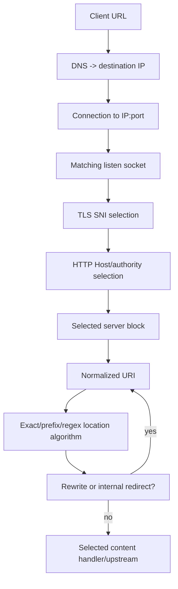
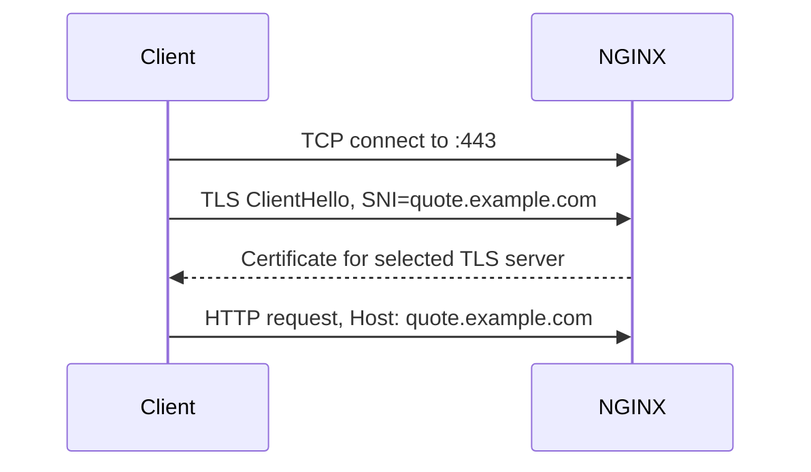
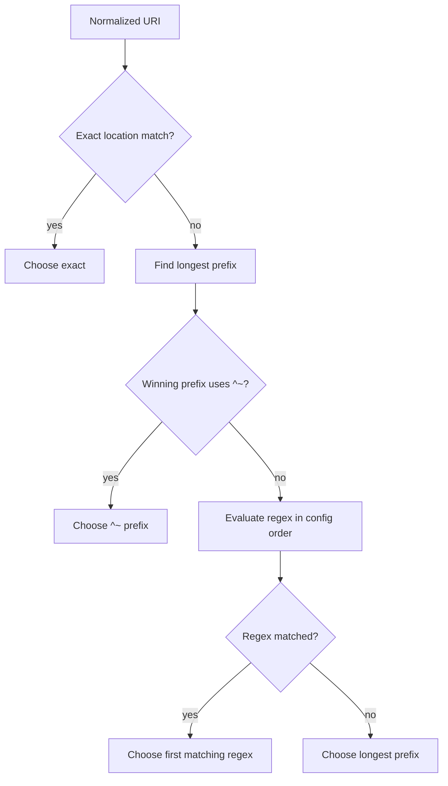
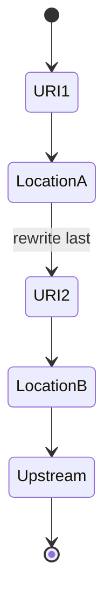

# Part 004 — Server Blocks, Virtual Hosts, and Location Matching

> **Depth level:** Advanced  
> **Primary audience:** Senior Java/JAX-RS backend engineer yang perlu memprediksi route secara deterministik, menemukan wrong-backend routing, dan mereview path/host changes.  
> **Prerequisite:** Part 002–003; dasar URL/URI, Host header, TLS SNI, regex, dan NGINX configuration contexts.

## Learning outcomes

Setelah menyelesaikan part ini, Anda seharusnya mampu:

1. mensimulasikan listener dan virtual server yang dipilih berdasarkan destination IP/port, `listen`, TLS SNI, dan HTTP Host/authority;
2. menjelaskan default-server behavior dan membangun fail-closed catch-all server;
3. menjalankan location selection untuk exact, prefix, `^~`, regex, nested, dan named location;
4. membedakan original request target, normalized URI, rewrite result, dan upstream URI;
5. memprediksi efek trailing slash, duplicate slash, percent encoding, case sensitivity, dan internal redirect;
6. menghitung final path yang diterima Java/JAX-RS backend untuk `proxy_pass` dengan atau tanpa URI;
7. mendeteksi route shadowing, regex precedence issue, security-location bypass, redirect loop, dan SPA/API collision;
8. membuat routing test matrix dengan `curl`, access log, dan generated-config inspection.

---

## Daftar isi

1. [Ringkasan eksekutif](#ringkasan-eksekutif)
2. [Routing adalah multi-stage selection](#routing-adalah-multi-stage-selection)
3. [URL, request target, authority, dan URI variables](#url-request-target-authority-dan-uri-variables)
4. [Stage 1 — destination address dan listener](#stage-1--destination-address-dan-listener)
5. [Stage 2 — TLS SNI](#stage-2--tls-sni)
6. [Stage 3 — HTTP Host dan server name](#stage-3--http-host-dan-server-name)
7. [Default server](#default-server)
8. [`server_name` patterns dan precedence](#server_name-patterns-dan-precedence)
9. [Host validation dan default-host exposure](#host-validation-dan-default-host-exposure)
10. [Stage 4 — URI normalization](#stage-4--uri-normalization)
11. [Stage 5 — location selection algorithm](#stage-5--location-selection-algorithm)
12. [Exact locations](#exact-locations)
13. [Prefix locations](#prefix-locations)
14. [`^~` locations](#-locations)
15. [Regular-expression locations](#regular-expression-locations)
16. [Named locations](#named-locations)
17. [Nested locations](#nested-locations)
18. [Location decision examples](#location-decision-examples)
19. [Internal redirects dan repeated selection](#internal-redirects-dan-repeated-selection)
20. [Trailing slash behavior](#trailing-slash-behavior)
21. [`proxy_pass` URI transformation](#proxy_pass-uri-transformation)
22. [Rewrite target dan upstream path](#rewrite-target-dan-upstream-path)
23. [JAX-RS base path dan context path](#jax-rs-base-path-dan-context-path)
24. [Case sensitivity dan regex hazards](#case-sensitivity-dan-regex-hazards)
25. [Encoded path dan normalization hazards](#encoded-path-dan-normalization-hazards)
26. [Route shadowing dan policy bypass](#route-shadowing-dan-policy-bypass)
27. [Kubernetes Ingress translation](#kubernetes-ingress-translation)
28. [AWS, Azure, dan on-prem implications](#aws-azure-dan-on-prem-implications)
29. [Systematic routing debugging](#systematic-routing-debugging)
30. [Routing test matrix](#routing-test-matrix)
31. [Security concerns](#security-concerns)
32. [Performance concerns](#performance-concerns)
33. [Observability concerns](#observability-concerns)
34. [PR review checklist](#pr-review-checklist)
35. [Internal verification checklist](#internal-verification-checklist)
36. [Exercises](#exercises)
37. [Ringkasan](#ringkasan)
38. [Referensi resmi](#referensi-resmi)

---

## Ringkasan eksekutif

Sebuah request tidak langsung “match location”. NGINX membuat beberapa keputusan berurutan:

```text
network destination
→ listen socket
→ TLS SNI/certificate context
→ HTTP Host/authority
→ virtual server
→ normalized URI
→ location selection
→ rewrite/internal redirect
→ location selection lagi bila diperlukan
→ content handler/upstream
```

Mental model ini mencegah empat kelas incident:

1. request masuk ke **default server** yang tidak diharapkan;
2. request memilih **regex location** yang menimpa prefix route;
3. rewrite atau slash menghasilkan **upstream path salah**;
4. security policy diterapkan pada location yang ternyata **tidak pernah dipilih**.

Jangan bertanya hanya “location mana yang terlihat paling spesifik?”. Simulasikan algoritmenya.

---

## Routing adalah multi-stage selection



### Routing state tuple

Gunakan tuple berikut saat debugging:

```text
(destination IP, destination port, transport, SNI, Host, method,
 original request target, normalized URI, selected server, selected location)
```

Dua request dengan path sama dapat memilih backend berbeda bila Host, SNI, port, atau normalization berbeda.

---

## URL, request target, authority, dan URI variables

Contoh client URL:

```text
https://quote.example.com:443/platform/api/quotes/42?expand=items
```

Komponen penting:

| Component | Value |
|---|---|
| scheme | `https` |
| authority/host | `quote.example.com` |
| port | `443` |
| path | `/platform/api/quotes/42` |
| query | `expand=items` |
| request target | `/platform/api/quotes/42?expand=items` |

### Useful NGINX variables

| Variable | Mental model |
|---|---|
| `$request_uri` | original request target, termasuk arguments |
| `$uri` | current normalized URI; dapat berubah setelah rewrite |
| `$args` | current query string |
| `$host` | normalized host selection value/fallback according to NGINX rules |
| `$http_host` | raw Host header value bila tersedia |
| `$server_name` | name dari selected server configuration |
| `$server_port` | local server port yang menerima request |
| `$scheme` | current request scheme yang dilihat NGINX |

### Debug rule

Log `$request_uri`, `$uri`, `$host`, dan `$server_name` secara terpisah. Mereka menjawab pertanyaan berbeda.

---

## Stage 1 — destination address dan listener

Virtual server candidates pertama-tama dibatasi oleh address/port pada `listen`.

```nginx
server {
    listen 80;
    server_name quote.example.com;
}

server {
    listen 8080;
    server_name quote.example.com;
}
```

Request ke port `80` tidak mempertimbangkan server pada `8080`.

### Address-specific listeners

```nginx
server {
    listen 10.0.1.10:443 ssl;
    server_name quote.example.com;
}

server {
    listen 10.0.2.10:443 ssl;
    server_name quote.example.com;
}
```

Destination IP dapat memengaruhi candidate set bahkan ketika host sama.

### IPv4/IPv6

```nginx
listen 443 ssl;
listen [::]:443 ssl;
```

Pastikan dual-stack behavior diverifikasi; package/platform defaults dan `ipv6only` behavior dapat memengaruhi bind.

### Listener mismatch symptoms

- connection refused;
- timeout sebelum access log;
- request masuk ke process lain;
- certificate dari service lain;
- route berbeda antara IPv4 dan IPv6;
- default server tidak seperti yang diperkirakan.

### Evidence

```bash
ss -lntp
nginx -T
curl -sv --connect-to quote.example.com:443:10.0.1.10:443 https://quote.example.com/
```

---

## Stage 2 — TLS SNI

SNI dikirim dalam TLS ClientHello sebelum HTTP request tersedia. Ia membantu memilih TLS configuration/certificate pada shared IP:port.



### SNI dan Host adalah dua input berbeda

Normal case:

```text
SNI  = quote.example.com
Host = quote.example.com
```

Tetapi client dapat mengirim mismatch:

```text
SNI  = quote.example.com
Host = admin.example.com
```

Consequences bergantung pada TLS/server configuration dan request selection. Jangan menganggap certificate selection otomatis mengunci Host application route.

### Test mismatch explicitly

```bash
curl -vk \
  --resolve quote.example.com:443:203.0.113.10 \
  https://quote.example.com/ \
  -H 'Host: admin.example.com'
```

Atau uji TLS saja:

```bash
openssl s_client \
  -connect 203.0.113.10:443 \
  -servername quote.example.com
```

### Security requirement

Sensitive virtual hosts harus memiliki explicit Host/SNI strategy. Mismatch dan unknown host tidak boleh jatuh ke application server yang permisif.

TLS architecture lebih lengkap dibahas pada Part 007.

---

## Stage 3 — HTTP Host dan server name

Setelah listener/candidate address dipilih, NGINX menggunakan request host/authority untuk memilih `server` block.

```nginx
server {
    listen 443 ssl;
    server_name quote.example.com;
}

server {
    listen 443 ssl;
    server_name order.example.com;
}
```

### HTTP/1.1

Umumnya menggunakan `Host` header.

```http
GET /api/quotes HTTP/1.1
Host: quote.example.com
```

### HTTP/2

Menggunakan `:authority`, yang dipetakan ke host semantics pada HTTP layer.

### Request tanpa matching host

Request diarahkan ke default server untuk address:port tersebut.

Itulah sebabnya default server adalah security/operational decision, bukan detail kosmetik.

---

## Default server

Default server adalah property `listen` address/port, bukan property `server_name`.

```nginx
server {
    listen 443 ssl default_server;
    server_name _;

    ssl_certificate     /etc/nginx/tls/default.crt;
    ssl_certificate_key /etc/nginx/tls/default.key;

    return 421;
}
```

Untuk plaintext:

```nginx
server {
    listen 80 default_server;
    server_name _;
    return 444;
}
```

`444` adalah NGINX-specific connection close behavior, bukan standard HTTP status. Pilihan status harus sesuai observability/client/security requirements.

### Why explicit default matters

Tanpa explicit default, server pertama untuk listener dapat menjadi default secara implicit. Reordering include/file dapat mengubah exposure.

### Fail-closed properties

Default server sebaiknya:

- tidak proxy ke business application;
- tidak menampilkan default welcome page;
- tidak membocorkan internal hostname;
- mempunyai minimal controlled log;
- memakai certificate strategy yang diketahui untuk TLS listener;
- tidak mempunyai permissive wildcard route.

### Test cases

- valid Host;
- unknown Host;
- empty/invalid Host sesuai protocol;
- direct IP access;
- SNI valid + Host invalid;
- SNI invalid + Host valid;
- case/trailing dot variants bila relevan.

---

## `server_name` patterns dan precedence

NGINX mendukung:

1. exact names;
2. wildcard names;
3. regular expressions.

```nginx
server_name quote.example.com;
server_name *.example.com;
server_name ~^quote-(?<tenant>[a-z0-9-]+)\.example\.com$;
```

### Preference model

Secara umum, exact name lebih kuat daripada wildcard; wildcard categories dan regex mempunyai rules tersendiri. Regex dievaluasi berdasarkan order kemunculan ketika mencapai regex category.

Jangan menghafal sebagian rule lalu menebak. Untuk overlapping names, buat explicit matrix dan verifikasi terhadap official version documentation.

### Wildcard caveats

```nginx
server_name *.example.com;
```

Dapat menangkap host lebih luas daripada intended. Jangan gunakan sebagai pengganti tenant authorization.

### Regex server name caveats

- syntax/capture complexity;
- ordering;
- performance;
- certificate SAN/wildcard tidak otomatis mengikuti regex;
- tenant identifier berasal dari untrusted hostname;
- IDN/punycode handling;
- logging/cardinality.

### Trailing dot

DNS fully qualified domain dapat ditulis dengan trailing dot:

```text
quote.example.com.
```

Uji behavior client/proxy chain internal. Jangan mengandalkan upstream layer selalu menormalkannya seperti ekspektasi.

---

## Host validation dan default-host exposure

### Host header injection risk

Application dapat menggunakan Host untuk:

- absolute redirect;
- reset-password URL;
- callback URL;
- canonical link;
- tenant selection;
- audit metadata.

Jika NGINX menerima arbitrary host dan meneruskannya, application dapat membangun URL attacker-controlled.

### Safer patterns

- explicit `server_name`;
- fail-closed default server;
- overwrite upstream Host sesuai contract;
- allowlist canonical external hosts;
- application-side trusted proxy/host configuration;
- avoid tenant authorization solely from host pattern.

### Never use `server_name _;` as magical wildcard explanation

`_` hanya nama yang secara convention tidak diharapkan match; default behavior berasal dari `listen ... default_server`, bukan underscore.

---

## Stage 4 — URI normalization

Location matching menggunakan normalized URI, bukan raw request target secara sederhana.

Normalization dapat melibatkan:

- decoding percent-encoded sequences yang diproses NGINX;
- resolving relative path components;
- optional merging of adjacent slashes;
- separating query arguments;
- URI change akibat rewrite/internal redirect.

### `$request_uri` versus `$uri`

Request:

```text
/api//quotes/%34%32?expand=items
```

Bergantung pada exact encoding/configuration, `$request_uri` mempertahankan original representation, sedangkan `$uri` merepresentasikan current normalized URI untuk processing.

### `merge_slashes`

Default behavior biasanya menggabungkan adjacent slashes untuk location matching. Menonaktifkannya dapat mengubah route semantics dan perlu alasan kuat.

### Security principle

Semua layer harus memiliki compatible path-normalization model:

```text
cloud/WAF → NGINX → ingress/controller → Java server → JAX-RS router
```

Bila dua layer melihat path berbeda, attacker dapat mencari policy bypass.

---

## Stage 5 — location selection algorithm

Gunakan algoritme mental berikut untuk ordinary locations:

```text
1. Periksa exact location (=). Bila match, selesai.
2. Cari prefix locations dan ingat prefix terpanjang.
3. Bila winning prefix memakai ^~, pilih prefix itu tanpa regex scan pada level tersebut.
4. Jika tidak, evaluasi regex locations dalam order konfigurasi.
5. Regex pertama yang match menang.
6. Bila tidak ada regex match, gunakan prefix terpanjang yang diingat.
```

Representasi:



### Important correction

“Longest path always wins” adalah salah. Longest prefix hanya candidate; regex dapat menang kecuali `^~` atau exact match mengakhiri pencarian sesuai rule.

---

## Exact locations

Syntax:

```nginx
location = /healthz {
    return 204;
}
```

Hanya match URI exact `/healthz`.

Match juga:

```text
/healthz?x=1   # query string bukan bagian dari location path
```

Tidak match:

```text
/healthz/
/Healthz
```

Untuk high-frequency fixed endpoint, exact location memberi behavior sangat jelas.

Use cases:

- liveness endpoint;
- exact legacy redirect;
- block exact sensitive path;
- root optimization:

```nginx
location = / {
    return 302 /app/;
}
```

### Failure mode

Policy hanya diterapkan pada exact path tetapi slash variant lolos:

```nginx
location = /admin {
    deny all;
}
```

Request `/admin/` memilih location lain.

---

## Prefix locations

Syntax:

```nginx
location /api/ {
    proxy_pass http://quote_api;
}
```

Match URI yang dimulai `/api/`.

Potential matches:

```text
/api/
/api/quotes
/api/orders/42
```

Tidak match:

```text
/api
/apis/
```

### Prefix boundary mistake

```nginx
location /api {
    proxy_pass http://api;
}
```

Ini juga dapat match `/api-v2`, `/apix`, dan path lain dengan prefix karakter yang sama. Gunakan slash/boundary strategy yang disengaja.

### Longest prefix

```nginx
location /api/ { ... }
location /api/admin/ { ... }
```

`/api/admin/users` menyimpan `/api/admin/` sebagai longest prefix candidate, tetapi regex scan masih dapat mengambil alih jika tidak dilindungi `^~`.

---

## `^~` locations

```nginx
location ^~ /assets/ {
    root /srv/www;
}
```

Setelah menjadi longest matching prefix, `^~` mencegah regex locations pada level tersebut mengambil alih.

Use case:

- static subtree yang harus deterministik;
- sensitive prefix yang tidak boleh ditimpa generic regex;
- route performance/clarity.

### Do not overuse

`^~` bukan “prefix yang lebih kuat secara universal”. Ia memengaruhi regex scan dalam location selection. Nested configurations tetap perlu dianalisis.

---

## Regular-expression locations

Case-sensitive:

```nginx
location ~ ^/api/v[0-9]+/reports/ {
    proxy_pass http://report_api;
}
```

Case-insensitive:

```nginx
location ~* \.(png|jpg|css|js)$ {
    expires 1h;
}
```

### First matching regex wins

Bukan regex paling spesifik.

```nginx
location ~ ^/api/.* {
    proxy_pass http://generic_api;
}

location ~ ^/api/admin/.* {
    proxy_pass http://admin_api;
}
```

`/api/admin/users` dapat ditangkap regex pertama. Reordering mengubah behavior.

### Regex risks

- broad pattern shadows later routes;
- catastrophic/expensive regex behavior;
- unescaped dots;
- case-insensitivity membuka route tak diinginkan;
- captures dipakai untuk filesystem/upstream path tanpa validation;
- policy tersebar;
- debugging sulit karena order.

Prefer prefix/exact locations saat route dapat diekspresikan tanpa regex.

---

## Named locations

Named location diawali `@` dan tidak dipilih langsung dari client URI.

```nginx
location / {
    try_files $uri @java_backend;
}

location @java_backend {
    proxy_pass http://quote_api;
}
```

Ia menjadi target internal processing, misalnya:

- `try_files` fallback;
- `error_page` internal redirect;
- module-specific internal transfer.

### Debug caveat

Client tidak dapat meminta `/@java_backend` untuk memilih named location. Namun internal redirects dapat membuat policy path berbeda dari ordinary location.

### Review requirement

Named location harus memiliki lengkap:

- auth/access assumptions;
- header policy;
- timeout;
- logging;
- upstream behavior.

Jangan menganggap semua policy dari original location otomatis berlaku.

---

## Nested locations

Nested location dapat dipakai, tetapi sering menambah reasoning cost.

```nginx
location /api/ {
    location /api/admin/ {
        # ...
    }
}
```

Atau regex nested di bawah prefix. Selection behavior harus dianalisis berdasarkan official algorithm, bukan visual indentation saja.

### Why nested locations are risky

- parent/child inheritance assumptions;
- regex selection details;
- route sulit ditemukan via grep;
- snippets/controller generation dapat menghasilkan nesting tidak terlihat;
- policy parent tidak selalu seperti yang diperkirakan;
- internal redirect dapat keluar dari subtree.

Use explicit flat locations bila memberikan model lebih sederhana.

---

## Location decision examples

### Example A — exact wins

```nginx
location = /api/health { return 204; }
location /api/        { proxy_pass http://api; }
location ~ ^/api/     { proxy_pass http://regex_api; }
```

Request:

```text
/api/health
```

Result: exact location.

### Example B — regex beats longest prefix

```nginx
location /api/admin/        { proxy_pass http://admin; }
location ~ ^/api/.*\.json$  { proxy_pass http://json; }
```

Request:

```text
/api/admin/users.json
```

Result: regex can win after longest prefix is remembered.

### Example C — `^~` preserves prefix

```nginx
location ^~ /api/admin/     { proxy_pass http://admin; }
location ~ ^/api/.*\.json$  { proxy_pass http://json; }
```

Request:

```text
/api/admin/users.json
```

Result: `^~ /api/admin/`.

### Example D — first regex wins

```nginx
location ~ ^/api/        { proxy_pass http://generic; }
location ~ ^/api/admin/  { proxy_pass http://admin; }
```

Request:

```text
/api/admin/users
```

Result: first regex, `generic`.

### Example E — exact slash distinction

```nginx
location = /api { return 308 /api/; }
location /api/  { proxy_pass http://api; }
```

This produces explicit canonical path behavior.

---

## Internal redirects dan repeated selection

Location selection dapat diulang ketika URI berubah secara internal.

Sources:

- `rewrite ... last`;
- `try_files` fallback URI;
- `error_page` internal redirect;
- index processing;
- module-generated redirect.



### Security implication

Policy pada Location A belum tentu ada pada Location B.

Example:

```nginx
location /secure/ {
    auth_request /_auth;
    rewrite ^/secure/(.*)$ /internal/$1 last;
}

location /internal/ {
    proxy_pass http://backend;
}
```

Review whether authentication result/policy is preserved and whether `/internal/` is directly reachable. Safer design often blocks direct access with `internal` where appropriate or avoids policy-changing redirect.

### Loop detection

Symptoms:

- 500;
- `rewrite or internal redirection cycle`;
- repeated URI changes;
- CPU/log noise.

---

## Trailing slash behavior

Slash adalah bagian route contract.

```text
/api
/api/
```

Tidak identik untuk exact/prefix match dan backend routers.

### Canonical redirect pattern

```nginx
location = /api {
    return 308 /api/;
}

location /api/ {
    proxy_pass http://api;
}
```

### Automatic redirect awareness

Prefix locations ending with slash and using proxy-related handlers may cause redirect behavior for no-slash request in certain configurations. Jangan mengandalkan implicit behavior tanpa test.

### Redirect method semantics

Pilih status dengan sadar:

- `301`/`302` historically may alter method in clients;
- `307`/`308` preserve method semantics.

Untuk API POST, canonical redirect yang salah dapat mengubah behavior client.

### Slash duplication

External path `/platform/api/` + upstream base `/api/` dapat menghasilkan:

```text
/api/api/quotes
```

atau menghapus path terlalu banyak. Selalu hitung transformation secara eksplisit.

---

## `proxy_pass` URI transformation

Ini salah satu sumber bug NGINX paling umum.

### Case 1 — `proxy_pass` tanpa URI

```nginx
location /platform/ {
    proxy_pass http://backend;
}
```

Request:

```text
/platform/api/quotes?x=1
```

Secara umum current request URI diteruskan, sehingga backend melihat path yang mempertahankan `/platform/...`, subject to rewrite/internal processing rules.

### Case 2 — `proxy_pass` dengan URI

```nginx
location /platform/ {
    proxy_pass http://backend/;
}
```

Matched location prefix `/platform/` diganti dengan `/` sehingga backend umumnya menerima:

```text
/api/quotes?x=1
```

### Case 3 — explicit upstream base

```nginx
location /platform/ {
    proxy_pass http://backend/internal-api/;
}
```

Backend umumnya menerima:

```text
/internal-api/api/quotes?x=1
```

### Slash matrix

| Location | proxy_pass | Request | Intended backend path must be verified |
|---|---|---|---|
| `/platform/` | `http://b` | `/platform/a` | `/platform/a` |
| `/platform/` | `http://b/` | `/platform/a` | `/a` |
| `/platform/` | `http://b/api/` | `/platform/a` | `/api/a` |
| `/platform` | `http://b/` | `/platform/a` | boundary behavior; design is ambiguous |

### Caveats requiring official documentation review

- regex location;
- named location;
- `rewrite ... break`;
- variable in `proxy_pass`;
- URI that cannot be mechanically determined;
- encoded URI normalization.

### Golden rule

Write down this equation in PR:

```text
external path
- matched prefix (when replacement applies)
+ proxy_pass URI prefix
= backend path
```

Then prove with integration test and backend request log.

---

## Rewrite target dan upstream path

Example:

```nginx
location /legacy/ {
    rewrite ^/legacy/(.*)$ /api/$1 break;
    proxy_pass http://backend;
}
```

Question:

- Apa current `$uri` setelah rewrite?
- Apakah location selection diulang?
- Apa path diteruskan oleh `proxy_pass`?
- Apakah query string dipertahankan?

`break` dan `last` mempunyai different control flow.

### Prefer one transformation owner

Avoid layering:

```text
cloud LB rewrite
→ Ingress rewrite annotation
→ NGINX rewrite
→ proxy_pass URI replacement
→ Java context-path redirect
```

Setiap layer menambah possibility path duplication, loss, loop, dan observability ambiguity.

### Route contract table

| External route | NGINX selected location | Rewritten URI | Backend base | JAX-RS endpoint |
|---|---|---|---|---|
| `/platform/quotes/42` | `/platform/` | `/api/quotes/42` | `/api` | `/quotes/{id}` |

Gunakan table nyata per service.

---

## JAX-RS base path dan context path

Java-side effective route dapat terdiri dari:

```text
servlet/context path
+ @ApplicationPath
+ @Path(resource)
+ @Path(method)
```

Contoh:

```java
@ApplicationPath("/api")
public class QuoteApplication extends Application {}

@Path("/quotes")
public class QuoteResource {
    @GET
    @Path("/{id}")
    public Response get(@PathParam("id") String id) { ... }
}
```

Application route:

```text
/api/quotes/{id}
```

Jika external route adalah:

```text
/platform/quotes/{id}
```

NGINX perlu memiliki explicit contract:

```text
/platform/quotes/42 → /api/quotes/42
```

### Failure modes

- `404` dari NGINX karena no matching location;
- `404` dari Java karena wrong backend path;
- redirect loop karena Java canonical/context redirect;
- generated `Location` header kehilangan external prefix;
- OpenAPI server URL salah;
- links/HATEOAS salah;
- auth callback path mismatch.

### Distinguish NGINX 404 and Java 404

Use:

- response header/body fingerprint carefully;
- NGINX access log upstream fields;
- `$upstream_status` empty versus populated;
- Java access log/trace;
- correlation ID.

---

## Case sensitivity dan regex hazards

URI path case sensitivity bergantung pada routing/filesystem/module behavior, tetapi ordinary NGINX prefix matching harus diperlakukan case-sensitive. `~*` regex explicitly case-insensitive.

```nginx
location /api/ { ... }
```

Tidak boleh diasumsikan match `/API/`.

### Java router mismatch

Jika NGINX regex case-insensitive tetapi JAX-RS case-sensitive:

```nginx
location ~* ^/api/ {
    proxy_pass http://java;
}
```

`/API/quotes` dapat mencapai Java lalu 404. Ini memperluas exposed surface tanpa memberi functional value.

### Regex review checklist

- anchor `^`/`$` benar;
- dot escaped;
- broad `.*` justified;
- first-match order benar;
- case mode intentional;
- capture cannot traverse/escape;
- test malformed/long input;
- location tidak menimpa security prefix.

---

## Encoded path dan normalization hazards

Contoh input berbahaya/ambiguous:

```text
/api/%2e%2e/admin
/api/%2Fadmin
/api//admin
/api/./admin
/api/a/../admin
/api/%252e%252e/admin
```

Different layers may:

- decode once;
- decode twice;
- reject encoded slash;
- merge slash;
- resolve dot segments;
- preserve raw path for application.

### Threat model

Security policy checks one representation, backend routes another.

```text
NGINX sees /api/public/...
Java sees /api/admin/...
```

### Required test approach

- test at external edge;
- capture NGINX `$request_uri` and `$uri` safely;
- capture backend request target;
- compare WAF/LB behavior;
- verify container/server decoding settings;
- avoid normalizing attacker input with ad-hoc regex.

Do not log sensitive full query/path in production without privacy review.

---

## Route shadowing dan policy bypass

### Broad regex shadows protected prefix

```nginx
location /api/admin/ {
    auth_request /_auth;
    proxy_pass http://admin;
}

location ~ ^/api/.* {
    proxy_pass http://generic;
}
```

The regex may win unless protected prefix uses appropriate design such as exact/`^~` or regex policy ordering.

### Static regex captures API extension

```nginx
location ~* \.(json|xml)$ {
    root /srv/static;
}
```

Request `/api/report.json` may be treated as static instead of proxied.

### SPA fallback shadows API typo

```nginx
location / {
    try_files $uri /index.html;
}
```

Without explicit `/api/`, invalid API returns HTML 200.

### Default server exposes internal app

```nginx
server {
    listen 443 ssl;
    server_name internal-admin.example;
    location / { proxy_pass http://admin; }
}
```

If this server becomes implicit default, direct-IP/unknown-host traffic may reach admin app.

### Internal route directly accessible

```nginx
location /internal/ {
    proxy_pass http://backend;
}
```

If intended only as rewrite target, mark/design accordingly and test external reachability.

---

## Kubernetes Ingress translation

Kubernetes Ingress rules are not themselves NGINX locations. Controller translates resources into controller-specific NGINX configuration/model.

```yaml
apiVersion: networking.k8s.io/v1
kind: Ingress
metadata:
  name: quote-api
spec:
  ingressClassName: nginx
  rules:
    - host: quote.example.com
      http:
        paths:
          - path: /api
            pathType: Prefix
            backend:
              service:
                name: quote-api
                port:
                  number: 8080
```

### Do not assume direct equivalence

Kubernetes `pathType`:

- `Exact`;
- `Prefix` with element-wise path semantics;
- `ImplementationSpecific`.

Controller may generate NGINX exact/prefix/regex locations, sorting rules, snippets, rewrites, or additional internal locations.

### Controller differences

Behavior can differ between:

- F5 NGINX Ingress Controller;
- community ingress-nginx;
- specific versions;
- Ingress versus VirtualServer CRDs;
- annotation combinations.

### Required evidence

1. Ingress manifest;
2. IngressClass/controller flags;
3. ConfigMap/annotations;
4. controller events/status;
5. rendered NGINX config;
6. live request tests.

### Conflict cases

- same host/path across multiple Ingress resources;
- different namespaces;
- wildcard and exact host overlap;
- regex annotation affects all paths in host/server;
- rewrite target changes backend path;
- TLS secret/certificate mismatch;
- path sorting changes effective priority.

Detailed Kubernetes routing is covered in Parts 018–020.

---

## AWS, Azure, dan on-prem implications

### Cloud L7 load balancer before NGINX

Potential transformations before NGINX:

- Host rewrite/preservation;
- path rule selection;
- HTTP-to-HTTPS redirect;
- TLS termination/re-encryption;
- source IP headers;
- health-check Host/path;
- listener-specific routing.

Routing outcome is therefore composition:

```text
Cloud LB rule result × NGINX server/location result × Java route result
```

### L4 load balancer before NGINX

Usually preserves more HTTP semantics because it does not parse/route at L7, but source IP/proxy protocol/TLS pass-through still matter.

### On-prem proxy chaining

```text
corporate ADC → DMZ reverse proxy → NGINX ingress → Java
```

Each L7 hop may have its own virtual-host and path rules. Duplicate canonical redirects and rewrites are common.

### Debugging rule

Test each hop with controlled Host/SNI/path where access permits. Do not infer NGINX behavior from external response alone when an earlier proxy may have generated it.

---

## Systematic routing debugging

### Step 1 — Freeze the exact request tuple

Record:

```text
client location/network
resolved IP
port/protocol
SNI
Host
method
raw path/query
headers relevant to routing
response status/body/headers
timestamp/request ID
```

### Step 2 — Determine last successful hop

- DNS?
- TCP?
- TLS?
- cloud LB access log?
- NGINX access log?
- upstream status?
- Java access log?

### Step 3 — Confirm listener and server

```bash
nginx -T
ss -lntp
```

Use `curl --resolve` or `--connect-to` to pin destination while preserving SNI/Host.

### Step 4 — Observe routing variables

Temporary controlled log:

```nginx
log_format route_debug
    '$request_id addr=$server_addr:$server_port '
    'sni=$ssl_server_name host=$host http_host="$http_host" '
    'server_name=$server_name request_uri="$request_uri" '
    'uri="$uri" status=$status upstream=$upstream_addr '
    'upstream_status=$upstream_status';
```

Be aware variable availability and PII/security policy.

### Step 5 — Calculate location manually

List:

1. exact candidates;
2. matching prefixes and longest prefix;
3. whether `^~` applies;
4. regex locations in config order;
5. internal redirects;
6. final content handler.

### Step 6 — Calculate upstream URI

Write:

```text
original request URI
→ normalized/current URI
→ rewrite result
→ proxy_pass replacement
→ backend request target
```

### Step 7 — Compare backend observation

Check Java access log/trace:

- method;
- path;
- context path;
- Host/forwarded headers;
- selected resource or 404.

### Step 8 — Check generated-controller config

Do not stop at Ingress YAML. Inspect generated config and controller logs/events.

---

## Routing test matrix

Create executable matrix.

| ID | SNI | Host | Method | External path | Expected server | Expected location | Expected backend/path | Expected status |
|---|---|---|---|---|---|---|---|---:|
| R1 | quote.example.com | quote.example.com | GET | `/api/quotes/42` | quote | `/api/` | quote-api `/api/quotes/42` | 200 |
| R2 | quote.example.com | unknown.example.com | GET | `/` | default | catch-all | none | 421/other policy |
| R3 | quote.example.com | quote.example.com | GET | `/api` | quote | exact redirect | none | 308 |
| R4 | quote.example.com | quote.example.com | POST | `/api/quotes` | quote | `/api/` | quote-api | expected app code |
| R5 | quote.example.com | quote.example.com | GET | `/API/quotes` | quote | fallback/default | none | 404 |
| R6 | quote.example.com | quote.example.com | GET | `/api//quotes` | quote | verify normalization | verify | explicit |
| R7 | quote.example.com | quote.example.com | GET | `/api/%2e%2e/admin` | quote | reject/controlled | none | 4xx |

### Curl harness examples

```bash
curl -skv \
  --resolve quote.example.com:443:127.0.0.1 \
  https://quote.example.com/api/quotes/42
```

Unknown Host against same SNI/IP:

```bash
curl -skv \
  --resolve quote.example.com:443:127.0.0.1 \
  https://quote.example.com/ \
  -H 'Host: unknown.example.com'
```

Raw path testing may require client options that prevent path normalization. Verify what the client itself sends before interpreting server behavior.

### Assertions

Test should assert more than status:

- response marker/body schema;
- upstream identity header only in test environment;
- request ID;
- backend observed path;
- redirect `Location`;
- no unexpected upstream call.

---

## Security concerns

- implicit default server exposes application;
- Host header injection;
- SNI/Host mismatch;
- wildcard/regex host captures unintended tenant;
- exact-path rule bypass via slash/case/encoding;
- regex location shadows auth-protected prefix;
- internal route directly accessible;
- rewrite moves request outside protected location;
- path normalization disagreement across layers;
- static/file alias traversal or disclosure;
- open redirect from untrusted host/path;
- attacker-controlled upstream selection;
- route response fingerprint leaks internal topology.

Security invariant:

> Every externally reachable normalized path must map to exactly one intended policy and one intended destination, or fail closed.

---

## Performance concerns

- large number of regex server names/locations;
- expensive/broad regex on every request;
- repeated internal redirects;
- duplicated path normalization/rewrite across proxies;
- route-specific logging cardinality;
- giant generated server blocks from many Ingress resources;
- reload frequency due route churn;
- filesystem `try_files` on API traffic;
- regex captures/variables in hot path.

Prefer exact/prefix routing for common paths. Use regex only where necessary and measurable.

---

## Observability concerns

Minimum route evidence:

- selected listener/address/port;
- TLS SNI where available;
- Host and selected `server_name`;
- original and current URI;
- status;
- upstream address/status;
- request ID/trace ID;
- route/config version;
- controller resource identity if possible.

### Avoid uncontrolled cardinality

Do not make raw path, arbitrary Host, tenant, or user ID a Prometheus label. Logs/traces are usually better for high-cardinality routing details.

### Synthetic probes

Maintain probes for:

- each critical host;
- default/unknown host rejection;
- canonical slash redirect;
- admin/internal route denial;
- encoded path rejection;
- external-to-backend base path mapping;
- certificate/SNI mapping.

---

## PR review checklist

### Listener/server selection

- [ ] Destination address/port and protocol clear.
- [ ] Explicit `default_server` exists per exposed listener.
- [ ] Default server fails closed.
- [ ] Exact/wildcard/regex server-name overlap analyzed.
- [ ] SNI and Host mismatch behavior tested.
- [ ] Direct IP/unknown Host behavior tested.

### Location algorithm

- [ ] Exact, prefix, `^~`, dan regex candidates listed.
- [ ] Regex order intentional.
- [ ] Broad regex does not shadow protected/static/API route.
- [ ] Nested/named locations justified.
- [ ] Internal redirects and final location documented.

### Path contract

- [ ] External path, normalized URI, rewrite result, and backend path tabulated.
- [ ] Trailing slash behavior explicit.
- [ ] `proxy_pass` URI/slash semantics tested.
- [ ] JAX-RS context/`@ApplicationPath`/`@Path` aligned.
- [ ] Redirect preserves method where required.
- [ ] Query string behavior tested.

### Security and operations

- [ ] Case/encoding/double-slash/dot-segment tests included.
- [ ] Unknown/internal/admin paths fail closed.
- [ ] Route logs and request correlation sufficient.
- [ ] Generated ingress config inspected.
- [ ] Rollback and route synthetic tests available.

---

## Internal verification checklist

> **Internal verification checklist — detail berikut harus dicek di CSG/team dan tidak diasumsikan.**

### Host/listener inventory

- [ ] Inventarisasi public/private/internal hostnames.
- [ ] Inventarisasi listeners, addresses, ports, IPv4/IPv6, TLS/plaintext.
- [ ] Identifikasi explicit dan implicit default servers.
- [ ] Petakan SNI ke certificate/virtual host.
- [ ] Temukan wildcard/regex `server_name`.

### Routing inventory

- [ ] Ekstrak seluruh `location` dari rendered config.
- [ ] Temukan exact/prefix/`^~`/regex/named/nested locations.
- [ ] Temukan rewrite, `try_files`, `error_page`, dan internal redirects.
- [ ] Temukan `proxy_pass` dengan URI atau variable.
- [ ] Bandingkan external path dengan Java context path dan JAX-RS paths.

### Kubernetes

- [ ] Identifikasi IngressClass/controller/version.
- [ ] Inventarisasi host/path conflicts lintas namespace.
- [ ] Periksa pathType, regex/rewrite annotations, snippets, dan ConfigMap.
- [ ] Inspect generated NGINX config, bukan manifest saja.
- [ ] Periksa controller event/status untuk rejected/conflicting resources.

### Cloud/on-prem chain

- [ ] Petakan rewrite/host preservation pada AWS ALB/API Gateway/CloudFront bila ada.
- [ ] Petakan Azure Application Gateway/Front Door/APIM rules bila ada.
- [ ] Petakan on-prem ADC/WAF/DMZ proxy route.
- [ ] Verifikasi health-check Host/path berbeda dari customer traffic atau tidak.

### Evidence and incidents

- [ ] Temukan access-log fields untuk server/location/upstream attribution.
- [ ] Temukan synthetic route tests.
- [ ] Cari incident notes terkait wrong backend, redirect loop, default-host exposure, 404, dan path rewrite.
- [ ] Verifikasi ownership ketika route tersebar di network, platform, dan app repositories.

---

## Exercises

### Exercise 1 — Select the location

Given:

```nginx
location = /api/health { return 204; }
location /api/         { proxy_pass http://api; }
location ^~ /api/admin/ { proxy_pass http://admin; }
location ~ ^/api/.*\.json$ { proxy_pass http://json; }
location ~ ^/api/      { proxy_pass http://generic; }
```

Determine result for:

```text
/api/health
/api/health?full=true
/api/admin/users
/api/admin/users.json
/api/orders
/api/orders.json
/API/orders.json
/api
```

Explain each step.

### Exercise 2 — Calculate upstream path

Given:

```nginx
location /platform/ {
    proxy_pass http://backend/api/;
}
```

Calculate backend path for:

```text
/platform/quotes/42
/platform/orders?state=open
/platform/
```

Then compare with version without trailing slash on `proxy_pass`.

### Exercise 3 — Find the bypass

Review:

```nginx
location /admin/ {
    auth_request /_auth;
    proxy_pass http://admin;
}

location ~* \.(json|xml)$ {
    proxy_pass http://reporting;
}
```

What happens to `/admin/users.json`? Propose safer design and tests.

### Exercise 4 — SNI/Host matrix

For one IP:443 with hosts `quote.example.com` and `order.example.com`, design tests for:

- matching SNI/Host;
- mismatched SNI/Host;
- unknown SNI;
- unknown Host;
- direct IP URL;
- missing Host where protocol permits.

Record certificate, server, status, and upstream.

### Exercise 5 — End-to-end route contract

Choose one real JAX-RS endpoint and fill:

```text
External URL:
Cloud/LB rule:
NGINX listener:
server_name:
location:
normalized URI:
rewrite:
proxy_pass:
backend request target:
Java context path:
@ApplicationPath:
resource @Path:
method @Path:
expected status:
```

Then turn it into an automated integration test.

---

## Ringkasan

Deterministic routing model:

```text
IP:port/listener
→ TLS SNI
→ HTTP Host/authority
→ selected virtual server/default server
→ normalized current URI
→ exact location
→ longest prefix
→ ^~ decision
→ first matching regex
→ internal redirect/reselection if any
→ proxy/static/return content handler
→ final backend request path
```

Rules to internalize:

1. **Default server belongs to listener, not `server_name`.**
2. **SNI dan Host adalah separate routing/trust inputs.**
3. **Exact match ends location search.**
4. **Longest prefix does not always win; regex may override it.**
5. **First matching regex wins, not most specific regex.**
6. **`^~` prevents regex takeover for the winning prefix.**
7. **Internal redirect can run location selection again.**
8. **Trailing slash dan `proxy_pass` URI adalah API contract.**
9. **Inspect generated ingress config and prove route with tests.**
10. **Unknown hosts and ambiguous paths must fail closed.**

Part 005 akan memperluas selected route menjadi reverse-proxy contract lengkap: upstream definition, Host/forwarded headers, client IP, proxy protocol, base-path correctness, request/response transformation, error propagation, dan trust boundaries dengan Java/JAX-RS service.

---

## Referensi resmi

1. [How NGINX processes a request](https://nginx.org/en/docs/http/request_processing.html)
2. [NGINX server names](https://nginx.org/en/docs/http/server_names.html)
3. [NGINX core HTTP module — `listen`, `location`, `root`, `alias`, `try_files`](https://nginx.org/en/docs/http/ngx_http_core_module.html)
4. [NGINX proxy module — `proxy_pass`](https://nginx.org/en/docs/http/ngx_http_proxy_module.html)
5. [NGINX rewrite module](https://nginx.org/en/docs/http/ngx_http_rewrite_module.html)
6. [NGINX Beginner’s Guide — location selection overview](https://nginx.org/en/docs/beginners_guide.html)
7. [F5 NGINX Ingress Controller — advanced configuration with annotations](https://docs.nginx.com/nginx-ingress-controller/configuration/ingress-resources/advanced-configuration-with-annotations/)
8. [F5 NGINX Ingress Controller — VirtualServer and VirtualServerRoute](https://docs.nginx.com/nginx-ingress-controller/configuration/virtualserver-and-virtualserverroute-resources/)
9. [Kubernetes Ingress](https://kubernetes.io/docs/concepts/services-networking/ingress/)
10. [Kubernetes Ingress API reference](https://kubernetes.io/docs/reference/kubernetes-api/service-resources/ingress-v1/)
11. [RFC 9110 — HTTP Semantics](https://www.rfc-editor.org/rfc/rfc9110)
12. [RFC 3986 — URI Generic Syntax](https://www.rfc-editor.org/rfc/rfc3986)

