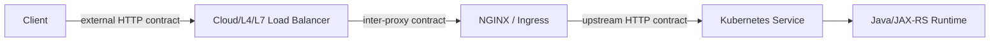
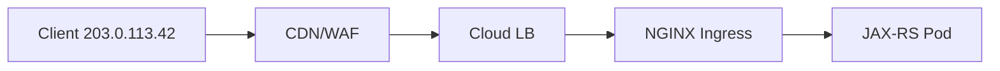
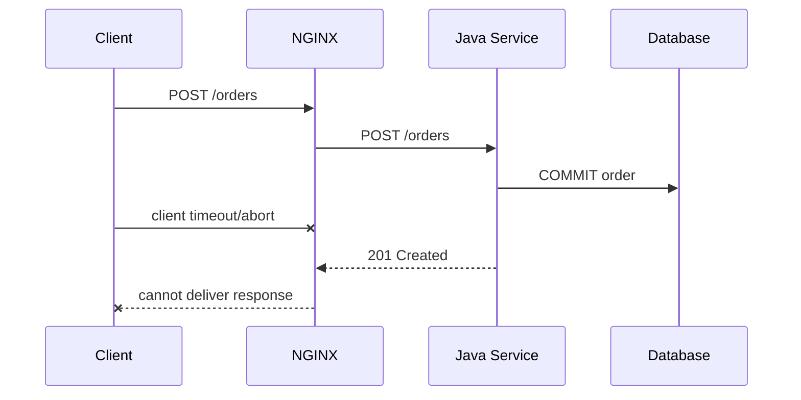
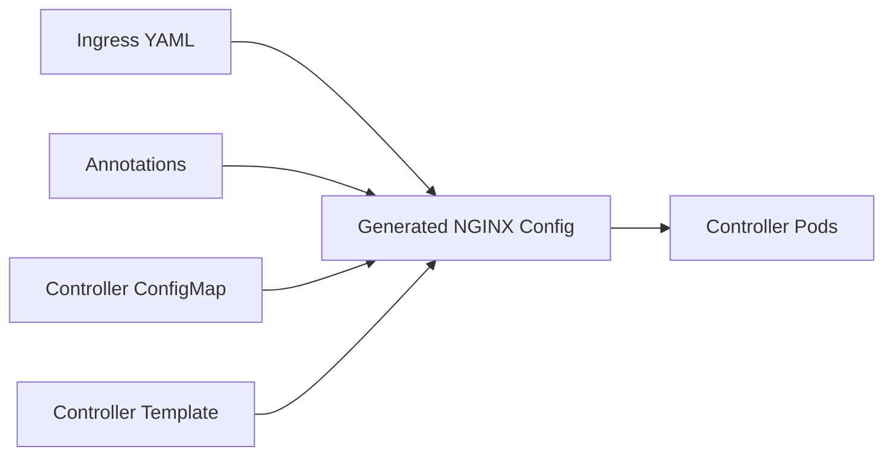
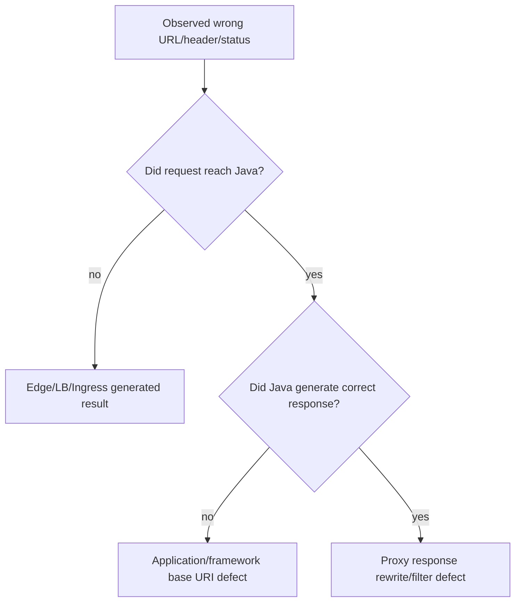

# Part 005 — Reverse Proxy Contract with Java/JAX-RS Backends

> **Depth level:** Advanced  
> **Primary audience:** Senior Java/JAX-RS backend engineer yang perlu mendesain dan mereview kontrak antara edge proxy, Kubernetes ingress, dan aplikasi backend.  
> **Prerequisite:** Part 002–004; pemahaman JAX-RS URI routing, HTTP headers, TLS termination, dan reverse proxy dasar.

## Learning outcomes

Setelah menyelesaikan part ini, Anda seharusnya mampu:

1. mendefinisikan **canonical external request contract** dan memetakannya secara deterministik ke internal JAX-RS route;
2. menjelaskan perbedaan antara transport peer, effective client IP, external authority, upstream authority, dan application base URI;
3. mengonfigurasi `proxy_pass`, `proxy_set_header`, `proxy_redirect`, real-IP processing, dan PROXY protocol tanpa menciptakan trust ambiguity;
4. memastikan `UriInfo`, redirect, generated link, cookie, OpenAPI server URL, dan callback URL tetap benar di belakang satu atau beberapa proxy;
5. membedakan header yang harus dihapus, dipertahankan, ditambahkan, atau disintesis ulang pada setiap trust boundary;
6. menemukan context-path mismatch, duplicate prefix, scheme downgrade, wrong host, redirect loop, dan spoofed forwarded header;
7. memisahkan tanggung jawab reverse proxy, API gateway, ingress controller, dan application authorization;
8. menyusun test matrix dan observability contract untuk memverifikasi behavior end-to-end.

---

## Daftar isi

1. [Ringkasan eksekutif](#ringkasan-eksekutif)
2. [Reverse proxy adalah protocol contract](#reverse-proxy-adalah-protocol-contract)
3. [External URL versus internal route](#external-url-versus-internal-route)
4. [Request-state model](#request-state-model)
5. [Minimal reverse-proxy configuration](#minimal-reverse-proxy-configuration)
6. [`proxy_pass` sebagai mapping function](#proxy_pass-sebagai-mapping-function)
7. [Upstream authority dan Host header](#upstream-authority-dan-host-header)
8. [`proxy_set_header` inheritance trap](#proxy_set_header-inheritance-trap)
9. [Forwarded metadata taxonomy](#forwarded-metadata-taxonomy)
10. [Standardized `Forwarded` header](#standardized-forwarded-header)
11. [`X-Forwarded-*` de-facto headers](#x-forwarded--de-facto-headers)
12. [Trust boundary dan header sanitization](#trust-boundary-dan-header-sanitization)
13. [Real client IP mental model](#real-client-ip-mental-model)
14. [Real-IP module](#real-ip-module)
15. [PROXY protocol](#proxy-protocol)
16. [Multi-proxy chain](#multi-proxy-chain)
17. [Base path dan JAX-RS application path](#base-path-dan-jax-rs-application-path)
18. [JAX-RS `UriInfo` di belakang proxy](#jax-rs-uriinfo-di-belakang-proxy)
19. [Absolute versus relative links](#absolute-versus-relative-links)
20. [Redirect correctness](#redirect-correctness)
21. [`proxy_redirect` dan `Location` rewriting](#proxy_redirect-dan-location-rewriting)
22. [Cookies, path, domain, dan secure semantics](#cookies-path-domain-dan-secure-semantics)
23. [Request headers dan body forwarding](#request-headers-dan-body-forwarding)
24. [Response headers dan proxy-controlled behavior](#response-headers-dan-proxy-controlled-behavior)
25. [Status and error propagation](#status-and-error-propagation)
26. [`proxy_intercept_errors`](#proxy_intercept_errors)
27. [Client abort dan duplicate side effect](#client-abort-dan-duplicate-side-effect)
28. [API gateway versus reverse proxy boundary](#api-gateway-versus-reverse-proxy-boundary)
29. [Kubernetes ingress implications](#kubernetes-ingress-implications)
30. [AWS, Azure, dan on-prem implications](#aws-azure-dan-on-prem-implications)
31. [Reference configuration pattern](#reference-configuration-pattern)
32. [Failure model](#failure-model)
33. [Systematic debugging playbook](#systematic-debugging-playbook)
34. [Observability contract](#observability-contract)
35. [Security concerns](#security-concerns)
36. [Performance concerns](#performance-concerns)
37. [PR review checklist](#pr-review-checklist)
38. [Internal verification checklist](#internal-verification-checklist)
39. [Exercises](#exercises)
40. [Ringkasan](#ringkasan)
41. [Referensi resmi](#referensi-resmi)

---

## Ringkasan eksekutif

Reverse proxy bukan sekadar komponen yang “meneruskan request”. Ia membentuk ulang request pada hop berikutnya:

```text
client request
→ proxy parses and validates
→ proxy selects upstream
→ proxy creates a new upstream request
→ proxy chooses protocol/version/connection
→ proxy synthesizes or rewrites headers
→ proxy may buffer body
→ backend produces response
→ proxy filters/rewrites response
→ client receives final response
```

Konsekuensi paling penting:

> Java/JAX-RS tidak melihat request persis seperti yang dikirim client. Ia melihat request baru yang dibangun oleh proxy.

Karena itu, integrasi yang benar membutuhkan kontrak eksplisit untuk:

- external scheme, host, port, dan base path;
- upstream scheme, host, port, dan path;
- client IP dan proxy chain;
- header ownership;
- request ID dan trace context;
- redirect dan absolute URI generation;
- cookie scope;
- error ownership;
- timeout dan retry boundary.

Tanpa kontrak ini, sistem dapat “berfungsi” pada happy path tetapi gagal pada redirect, OAuth callback, OpenAPI URL, large upload, multi-proxy topology, atau incident debugging.

---

## Reverse proxy adalah protocol contract

Model yang lemah:

```text
NGINX = network pipe
```

Model yang lebih tepat:

```text
NGINX = HTTP intermediary + policy enforcement point + request constructor
```

Setiap hop memiliki dua interface:

1. **downstream interface** — kontrak NGINX terhadap client atau proxy sebelumnya;
2. **upstream interface** — kontrak NGINX terhadap Java/JAX-RS service.



### Contract dimensions

| Dimension | External side | Internal side |
|---|---|---|
| scheme | `https` | `http` atau `https` |
| authority | `quote.example.com` | `quote-api:8080` |
| path | `/platform/api/quotes/42` | `/api/quotes/42` |
| client address | end-user IP | proxy or pod peer IP |
| HTTP version | H1/H2/H3 | H1/H2, tergantung support |
| TLS | public certificate | plaintext atau internal TLS |
| identity | token/cookie/mTLS | forwarded token or derived identity |
| timeout | client-facing budget | upstream budget |
| error format | public contract | application/internal contract |

Perubahan pada satu kolom harus direview terhadap kolom lain. Contoh: mengubah external prefix tanpa mengubah base URI awareness dapat menghasilkan redirect ke path internal.

---

## External URL versus internal route

Definisikan external endpoint sebagai tuple:

```text
E = (scheme, host, port, externalPrefix, path, query)
```

Contoh:

```text
E = (https, quote.example.com, 443, /platform, /api/quotes/42, expand=items)
```

Definisikan upstream endpoint sebagai:

```text
U = (scheme, host, port, internalPrefix, path, query)
```

Contoh:

```text
U = (http, quote-api.default.svc.cluster.local, 8080, /, /api/quotes/42, expand=items)
```

Mapping yang diinginkan:

```text
https://quote.example.com/platform/api/quotes/42?expand=items
→ http://quote-api:8080/api/quotes/42?expand=items
```

### Invariant

Untuk setiap public route, harus ada fungsi mapping yang dapat dijelaskan:

```text
M(E.requestTarget) = U.requestTarget
```

Dan untuk generated URL:

```text
G(U.applicationState, forwardedMetadata) = canonical external URL
```

Masalah terjadi bila mapping request benar tetapi inverse mapping untuk redirect/link salah.

---

## Request-state model

Gunakan state berikut saat mereview atau debugging:

```text
transportPeerIp
effectiveClientIp
originalHost
selectedServerName
externalScheme
externalHost
externalPort
externalPrefix
currentNginxUri
upstreamScheme
upstreamHost
upstreamPort
upstreamUri
applicationBaseUri
```

### Contoh state

```text
transportPeerIp  = 10.20.1.15       # ALB/NLB/proxy peer
clientIp         = 203.0.113.42     # trusted derived value
originalHost     = quote.example.com
externalScheme   = https
externalPort     = 443
externalPrefix   = /platform
nginxUri         = /platform/api/quotes/42
upstreamHost     = quote-api:8080
upstreamUri      = /api/quotes/42
applicationBase  = https://quote.example.com/platform/
```

Jangan menggunakan istilah “request URL” tanpa menyebut layer. Pada topology berlapis, ada beberapa URL yang semuanya valid pada konteks berbeda.

---

## Minimal reverse-proxy configuration

```nginx
upstream quote_api {
    server quote-api:8080;
    keepalive 64;
}

server {
    listen 8080;
    server_name quote.example.com;

    location /platform/ {
        proxy_pass http://quote_api/;

        proxy_set_header Host              $host;
        proxy_set_header X-Forwarded-Host  $host;
        proxy_set_header X-Forwarded-Proto $scheme;
        proxy_set_header X-Forwarded-Port  $server_port;
        proxy_set_header X-Forwarded-For   $proxy_add_x_forwarded_for;

        proxy_set_header X-Request-ID      $request_id;
    }
}
```

Ini hanya starting point. Ia belum otomatis benar bila:

- NGINX berada di belakang TLS-terminating load balancer;
- `$scheme` di NGINX adalah `http`, sedangkan external scheme `https`;
- `$remote_addr` adalah load balancer dan real-IP module belum benar;
- client dapat menyuplai `X-Forwarded-*` langsung;
- application tidak dikonfigurasi mempercayai proxy;
- external prefix perlu diteruskan melalui `X-Forwarded-Prefix`;
- upstream membutuhkan original Host atau internal Host berbeda;
- terdapat beberapa proxy yang semuanya menambahkan header.

---

## `proxy_pass` sebagai mapping function

`proxy_pass` menentukan protocol, upstream authority, dan opsional URI replacement.

### Tanpa URI pada `proxy_pass`

```nginx
location /platform/ {
    proxy_pass http://quote_api;
}
```

Request:

```text
/platform/api/quotes/42
```

Upstream umumnya menerima current request URI:

```text
/platform/api/quotes/42
```

### Dengan URI pada `proxy_pass`

```nginx
location /platform/ {
    proxy_pass http://quote_api/;
}
```

Prefix location yang cocok diganti oleh URI `/`:

```text
/platform/api/quotes/42
→ /api/quotes/42
```

### Mapping eksplisit

```nginx
location /public-quote/ {
    proxy_pass http://quote_api/internal-quote/;
}
```

```text
/public-quote/123
→ /internal-quote/123
```

### Review questions

- Apakah external prefix dipertahankan atau di-strip?
- Apakah backend resource path memang memiliki prefix tersebut?
- Apa hasil untuk path tanpa trailing slash?
- Apa hasil setelah rewrite?
- Apakah regex/named location menggunakan bentuk `proxy_pass` yang aman?
- Apakah query string tetap dipertahankan?

Detail algoritme URI sudah dibahas pada Part 004. Pada part ini, fokusnya adalah kontrak dengan aplikasi.

---

## Upstream authority dan Host header

Tiga nilai yang sering tertukar:

| Value | Contoh | Makna |
|---|---|---|
| external host | `quote.example.com` | authority yang digunakan client |
| selected NGINX server | `quote.example.com` | virtual server yang dipilih |
| upstream host | `quote-api:8080` | tujuan koneksi NGINX |

Secara default, NGINX dapat membangun upstream `Host` berdasarkan `$proxy_host`, bukan selalu Host asli client. Karena itu, pilih behavior secara eksplisit.

### Preserve external authority

```nginx
proxy_set_header Host $host;
```

Cocok bila backend:

- menghasilkan absolute URL dari Host;
- memiliki virtual-host routing;
- memvalidasi allowed host;
- perlu mengetahui public authority.

### Use upstream authority

```nginx
proxy_set_header Host $proxy_host;
```

Cocok bila upstream:

- membutuhkan internal virtual host;
- melakukan TLS/SNI atau routing berdasarkan internal name;
- tidak boleh melihat public host.

### Preserve raw Host cautiously

```nginx
proxy_set_header Host $http_host;
```

`$http_host` merepresentasikan raw Host header bila ada dan dapat memuat port. Nilai ini tidak seaman `$host` untuk semua use case karena merupakan input client dan dapat kosong. Jangan menggunakannya sebagai trusted value tanpa host validation.

### Host allowlist

```nginx
map $host $valid_host {
    default              0;
    quote.example.com    1;
    quote.internal.example 1;
}

server {
    if ($valid_host = 0) { return 421; }
    # Gunakan pola yang disetujui platform; hindari general-purpose logic kompleks di if.
}
```

Alternatif yang lebih bersih adalah server block eksplisit plus default server fail-closed.

---

## `proxy_set_header` inheritance trap

Directive `proxy_set_header` diwariskan dari parent hanya bila **tidak ada** `proxy_set_header` pada child level.

Contoh:

```nginx
http {
    proxy_set_header Host              $host;
    proxy_set_header X-Forwarded-Proto $scheme;
    proxy_set_header X-Forwarded-For   $proxy_add_x_forwarded_for;

    server {
        location /api/ {
            proxy_set_header X-Request-ID $request_id;
            proxy_pass http://quote_api;
        }
    }
}
```

Kesalahan mental model:

```text
location menambah X-Request-ID ke inherited set
```

Behavior yang harus diwaspadai:

```text
location memiliki proxy_set_header sendiri
→ inherited proxy_set_header set dapat tidak berlaku
→ Host/X-Forwarded-* yang diasumsikan ada mungkin hilang
```

### Safer inheritance pattern

Gunakan include canonical:

```nginx
# /etc/nginx/snippets/proxy-common-headers.conf
proxy_set_header Host              $host;
proxy_set_header X-Forwarded-Host  $host;
proxy_set_header X-Forwarded-Proto $external_scheme;
proxy_set_header X-Forwarded-Port  $external_port;
proxy_set_header X-Forwarded-For   $proxy_add_x_forwarded_for;
proxy_set_header X-Request-ID      $request_id;
```

```nginx
location /api/ {
    include /etc/nginx/snippets/proxy-common-headers.conf;
    proxy_pass http://quote_api;
}
```

CI harus memeriksa rendered configuration, bukan hanya source fragment.

---

## Forwarded metadata taxonomy

Header proxy dapat dikelompokkan berdasarkan ownership.

### 1. Transport-derived metadata

Contoh:

- client address;
- scheme yang diterima hop;
- destination port;
- TLS state;
- protocol version.

Nilai ini seharusnya berasal dari transport atau trusted previous hop.

### 2. Routing-derived metadata

Contoh:

- original host;
- external prefix;
- selected route;
- upstream name.

### 3. Identity-derived metadata

Contoh:

- authenticated subject;
- tenant;
- mTLS principal;
- groups/roles.

Header ini memiliki risk tertinggi. Jangan menyamakan routing header dengan authenticated identity.

### 4. Observability metadata

Contoh:

- request ID;
- traceparent;
- tracestate;
- baggage;
- proxy hop marker.

### Ownership table

| Header | Client may send? | Edge action | Backend trust |
|---|---:|---|---|
| `Host` | yes | validate/select server | constrained |
| `Forwarded` | possibly | strip/rebuild or append under policy | only trusted chain |
| `X-Forwarded-For` | possibly | sanitize/append | only trusted chain |
| `X-Forwarded-Proto` | possibly | overwrite from trusted state | trusted edge only |
| `X-Forwarded-Prefix` | possibly | overwrite from route config | trusted edge only |
| `X-User-Id` | maliciously possible | remove, then set after auth | trusted auth proxy only |
| `traceparent` | yes | validate/propagate/new trace policy | observability semantics only |
| `X-Request-ID` | yes | validate or replace | correlation only |

---

## Standardized `Forwarded` header

RFC 7239 mendefinisikan `Forwarded` sebagai representasi metadata proxy:

```http
Forwarded: for=203.0.113.42;proto=https;host="quote.example.com"
```

Multi-hop:

```http
Forwarded: for=203.0.113.42;proto=https;host="quote.example.com", for=10.20.1.15;proto=http
```

### Advantages

- format standar;
- dapat menggabungkan `for`, `by`, `host`, dan `proto`;
- mendukung chain.

### Operational challenges

- tidak semua framework/runtime menanganinya dengan cara yang sama;
- quoting IPv6 dan port perlu benar;
- chain tetap tidak trustworthy tanpa trusted-hop model;
- beberapa platform lebih konsisten menggunakan `X-Forwarded-*`.

### Policy choice

Pilih satu strategi:

1. standardized `Forwarded` sebagai canonical;
2. `X-Forwarded-*` sebagai canonical;
3. keduanya, dengan explicit precedence.

Jangan membiarkan framework memilih secara implisit antara header yang dapat saling bertentangan.

---

## `X-Forwarded-*` de-facto headers

### `X-Forwarded-For`

```http
X-Forwarded-For: client, proxy1, proxy2
```

Umumnya chain bertambah dari kiri ke kanan. Namun parsing dan trust harus mengikuti aturan platform, bukan asumsi umum saja.

### `X-Forwarded-Proto`

```http
X-Forwarded-Proto: https
```

Digunakan untuk mengetahui external scheme. Kritis untuk:

- secure redirects;
- cookie `Secure` decisions;
- OAuth/OIDC callback;
- absolute URI generation.

### `X-Forwarded-Host`

```http
X-Forwarded-Host: quote.example.com
```

Mewakili authority eksternal sebelum proxy mengubah Host.

### `X-Forwarded-Port`

```http
X-Forwarded-Port: 443
```

Berguna pada non-default port atau framework yang tidak dapat merekonstruksi port dari scheme/host.

### `X-Forwarded-Prefix`

```http
X-Forwarded-Prefix: /platform
```

Tidak distandardisasi seperti `Forwarded`; support framework bervariasi. Gunakan hanya bila external base path berbeda dari path yang diterima aplikasi.

### Common failure

```text
external request: https://quote.example.com/platform/api
NGINX strips /platform
application sees: http://quote-api:8080/api
application generates redirect: http://quote-api:8080/login
```

Diperlukan forwarded metadata yang konsisten atau application base URL yang dikonfigurasi eksplisit.

---

## Trust boundary dan header sanitization

Aturan inti:

> Jangan meneruskan security-sensitive forwarding header dari untrusted client apa adanya.

### Unsafe pattern

```nginx
proxy_set_header X-Forwarded-Proto $http_x_forwarded_proto;
proxy_set_header X-User-Id         $http_x_user_id;
```

Client dapat mengirim:

```http
X-Forwarded-Proto: https
X-User-Id: administrator
```

### Safer sanitization pattern

```nginx
proxy_set_header X-Forwarded-Proto $external_scheme;
proxy_set_header X-User-Id         "";
```

Jika identity header dibutuhkan:

```nginx
# Hanya setelah trusted auth_request/external auth berhasil.
proxy_set_header X-User-Id $authenticated_subject;
```

### Boundary pattern

```text
Internet client
→ public edge strips spoofable internal headers
→ edge synthesizes canonical forwarding headers
→ internal proxy trusts only public edge CIDR/identity
→ application trusts only direct internal proxy
```

### Fail-closed questions

- Siapa yang boleh menulis header?
- Siapa yang menghapus client-supplied value?
- Siapa yang menambahkan hop?
- Siapa yang menjadi final authority?
- Bagaimana application mengetahui direct peer adalah trusted proxy?
- Apa behavior bila header malformed atau memiliki multiple values?

---

## Real client IP mental model

Ada minimal tiga address:

```text
clientAddress        = alamat end user yang diturunkan dari trusted chain
transportPeerAddress = alamat socket peer yang terhubung langsung ke NGINX
originalRemoteAddr   = nilai sebelum real-IP replacement
```

Tanpa real-IP processing:

```text
$remote_addr = cloud load balancer / previous proxy IP
```

Dengan real-IP processing yang benar:

```text
$remote_addr = effective client IP
$realip_remote_addr = original direct peer IP
```

Keduanya berguna:

- effective client IP untuk rate limit, audit, dan geo policy;
- original peer IP untuk membuktikan request datang dari trusted proxy.

### Dangerous assumption

```text
X-Forwarded-For first element = client IP
```

Ini hanya benar bila seluruh insertion/sanitization chain terkontrol.

---

## Real-IP module

Contoh:

```nginx
set_real_ip_from 10.20.0.0/16;
set_real_ip_from 10.30.0.0/16;
real_ip_header X-Forwarded-For;
real_ip_recursive on;
```

Interpretasi:

1. hanya peer dari trusted ranges yang boleh menyebabkan address replacement;
2. header yang dipilih dibaca sebagai source metadata;
3. dengan recursive mode, NGINX mencari last non-trusted address dalam chain sesuai semantics module.

### Never do this casually

```nginx
set_real_ip_from 0.0.0.0/0;
set_real_ip_from ::/0;
```

Itu pada dasarnya mempercayai semua sumber untuk mengklaim client address.

### Validate build/runtime

Module real-IP tidak selalu built-in pada semua packaging/build. Periksa:

```bash
nginx -V 2>&1 | tr ' ' '\n' | grep realip
```

Pada ingress controller, lihat chart/controller configuration karena mechanism dapat berbeda dan mungkin melibatkan `use-forwarded-headers`, proxy-real-ip CIDR, atau provider-specific behavior.

---

## PROXY protocol

PROXY protocol membawa original connection metadata pada layer sebelum HTTP parsing.

```text
TCP connection
→ PROXY protocol preamble
→ TLS or HTTP bytes
```

Contoh listener:

```nginx
server {
    listen 8443 proxy_protocol;

    set_real_ip_from 10.20.0.0/16;
    real_ip_header proxy_protocol;
}
```

### Important invariant

Kedua sisi harus sepakat:

```text
load balancer sends PROXY protocol
AND
NGINX listener expects PROXY protocol
```

Mismatch menghasilkan failure keras:

| Sender | Listener | Result |
|---|---|---|
| sends PROXY | does not expect | HTTP/TLS parse failure |
| does not send | expects PROXY | connection rejected / invalid header |
| version mismatch | wrong support | connection failure |

PROXY protocol tidak sama dengan `X-Forwarded-For`:

- PROXY protocol adalah connection metadata;
- `X-Forwarded-For` adalah HTTP message metadata;
- TLS passthrough/L4 topology sering memerlukan PROXY protocol bila source IP tidak preserved;
- direct pod traffic dan cloud target mode memengaruhi kebutuhan ini.

---

## Multi-proxy chain

Contoh topology:



Setiap hop harus memiliki policy:

| Hop | Direct peer trusted? | Header action |
|---|---|---|
| CDN | client no | create canonical client metadata |
| cloud LB | CDN yes | preserve/append according to provider contract |
| NGINX | LB yes | derive effective client and rebuild backend headers |
| JAX-RS | only NGINX yes | consume trusted canonical values |

### Avoid double append

Bad chain:

```text
client sends XFF=A
CDN appends real client → A, real
LB appends CDN → A, real, CDN
NGINX appends LB → A, real, CDN, LB
application chooses first → spoofed A
```

Safer design:

```text
public edge discards untrusted initial chain
→ starts canonical chain
→ subsequent trusted hops append predictably
```

### Document topology as ordered trust graph

```text
trustedProxy[0] = public-edge CIDRs
trustedProxy[1] = cloud-LB CIDRs/subnets
trustedProxy[2] = ingress pod/node CIDRs
applicationDirectPeers = ingress service/pod network
```

CIDR is not always sufficient. In cloud or dynamic environments, provider integration, security groups, private networks, and mTLS may be required as complementary controls.

---

## Base path dan JAX-RS application path

JAX-RS route biasanya terdiri dari beberapa layer:

```text
container context path
+ JAX-RS application path
+ resource @Path
+ method @Path
```

Contoh konseptual:

```java
@ApplicationPath("/api")
public class QuoteApplication extends Application {}

@Path("/quotes")
public class QuoteResource {
    @GET
    @Path("/{id}")
    public Response get(@PathParam("id") String id) { ... }
}
```

Internal endpoint:

```text
/api/quotes/{id}
```

External endpoint:

```text
/platform/api/quotes/{id}
```

### Pattern A — preserve prefix

```nginx
location /platform/ {
    proxy_pass http://quote_api;
}
```

Backend harus memahami `/platform/api/...`.

### Pattern B — strip prefix

```nginx
location /platform/ {
    proxy_pass http://quote_api/;
    proxy_set_header X-Forwarded-Prefix /platform;
}
```

Backend menerima `/api/...`, tetapi harus mengetahui external prefix untuk generated URL bila absolute URI diperlukan.

### Pattern C — application configured with external base URL

Backend route tetap internal, tetapi canonical public base URL diberikan sebagai configuration:

```text
PUBLIC_BASE_URL=https://quote.example.com/platform
```

Ini sering lebih deterministik dibanding menebak dari arbitrary forwarding headers, tetapi perlu environment-specific configuration governance.

---

## JAX-RS `UriInfo` di belakang proxy

`UriInfo` dapat menyediakan:

- base URI;
- request URI;
- absolute path;
- path segments;
- query parameters.

Contoh:

```java
@Path("/quotes")
public class QuoteResource {
    @Context
    UriInfo uriInfo;

    @POST
    public Response create(CreateQuoteRequest request) {
        URI location = uriInfo.getAbsolutePathBuilder()
            .path("Q-123")
            .build();

        return Response.created(location).build();
    }
}
```

Expected external response:

```http
HTTP/1.1 201 Created
Location: https://quote.example.com/platform/api/quotes/Q-123
```

Possible broken response:

```http
Location: http://quote-api:8080/api/quotes/Q-123
```

### Why this happens

Runtime may reconstruct URI from:

```text
socket scheme + local host/port + received Host + current path
```

Bila runtime tidak proxy-aware, ia tidak mengetahui public URL.

### Framework/container verification

JAX-RS specification tidak mengharuskan satu universal switch untuk trusted forwarded headers. Behavior bergantung pada runtime/container, misalnya:

- Servlet container connector/valve/filter;
- Jersey deployment environment;
- RESTEasy/Quarkus settings;
- Helidon/Payara/Open Liberty/WildFly settings;
- custom filter atau base-URI override.

Karena itu, tandai sebagai **Internal verification checklist**, bukan asumsi generic JAX-RS.

---

## Absolute versus relative links

### Relative links

```http
Location: /platform/api/quotes/Q-123
```

Keunggulan:

- tidak bergantung pada host/scheme reconstruction;
- lebih aman terhadap host injection;
- portability lebih tinggi.

Keterbatasan:

- consumer atau standard tertentu mungkin membutuhkan absolute URI;
- external prefix tetap harus benar;
- multi-domain behavior perlu jelas.

### Absolute links

```http
Location: https://quote.example.com/platform/api/quotes/Q-123
```

Keunggulan:

- eksplisit dan self-contained;
- berguna untuk callbacks, hypermedia, OpenAPI, dan redirects.

Risiko:

- salah scheme/host/port;
- host header injection;
- environment leakage;
- internal hostname exposure;
- prefix mismatch.

### Decision rule

- gunakan relative URI bila protocol/consumer memungkinkan;
- gunakan canonical configured external base URL untuk security-sensitive callbacks;
- gunakan forwarded metadata hanya dari trusted boundary;
- test direct-to-pod dan through-edge secara terpisah.

---

## Redirect correctness

Redirect dapat dihasilkan oleh:

- Java/JAX-RS application;
- Servlet/JAX-RS runtime;
- authentication middleware;
- NGINX rewrite/return;
- ingress controller;
- cloud load balancer;
- API gateway.

### Common failures

#### HTTPS downgrade

```text
client requests https
TLS terminates at LB
LB → NGINX uses http
NGINX forwards X-Forwarded-Proto=http
application redirects to http
```

#### Internal hostname leakage

```http
Location: http://quote-api.default.svc.cluster.local:8080/login
```

#### Lost prefix

```text
expected: /platform/login
actual:   /login
```

#### Double prefix

```text
/platform/platform/login
```

#### Redirect loop

```text
external HTTPS
→ app thinks HTTP
→ redirects to HTTPS
→ proxy still tells app HTTP
→ repeats
```

### Redirect test matrix

| Input | Expected status | Expected Location |
|---|---:|---|
| HTTP public URL | 301/308 | canonical HTTPS URL |
| HTTPS unauthenticated | 302/303 | external login URL |
| create resource | 201 | external resource URI |
| missing slash | chosen policy | no internal host |
| wrong Host | 400/421 | no redirect to attacker host |

---

## `proxy_redirect` dan `Location` rewriting

`proxy_redirect` dapat mengganti `Location` dan `Refresh` dari upstream.

```nginx
location /platform/ {
    proxy_pass http://quote_api/;
    proxy_redirect http://quote_api:8080/ /platform/;
}
```

Upstream:

```http
Location: http://quote-api:8080/login
```

Client:

```http
Location: /platform/login
```

### Useful, but not a substitute for correct application awareness

`proxy_redirect` cocok ketika:

- legacy backend tidak proxy-aware;
- migration membutuhkan compatibility shim;
- upstream hard-codes internal base URL.

Risiko:

- regex terlalu luas mengubah third-party callback;
- hanya beberapa redirect patterns ter-cover;
- generated links di response body tetap salah;
- variable-based `proxy_pass` membatasi default rewriting behavior;
- hidden coupling antara proxy dan application route.

### Preferred order

1. application menghasilkan canonical URL dengan benar;
2. gunakan relative redirects bila cukup;
3. gunakan `proxy_redirect` sebagai explicit compatibility adapter;
4. test semua redirect-producing flows.

---

## Cookies, path, domain, dan secure semantics

Reverse proxy dapat memengaruhi cookie walaupun body API tidak berubah.

### Path mismatch

Backend:

```http
Set-Cookie: SESSION=abc; Path=/api
```

External route:

```text
/platform/api
```

Browser mungkin tidak mengirim cookie pada path yang diharapkan.

NGINX dapat melakukan rewrite:

```nginx
proxy_cookie_path /api /platform/api;
```

### Domain mismatch

```nginx
proxy_cookie_domain quote-api.internal quote.example.com;
```

Gunakan hanya jika upstream benar-benar mengeluarkan internal domain dan migration membutuhkan rewrite.

### Secure and SameSite

TLS termination upstream dapat membuat backend menganggap request non-secure dan mengeluarkan cookie tanpa `Secure`. Solusi harus berada pada application/framework proxy-awareness atau policy edge yang teruji.

### Security warning

Cookie rewrite dapat memperluas scope secara tidak sengaja:

```text
Path=/service-a
→ Path=/
```

Ini meningkatkan exposure ke route lain pada host yang sama.

Review:

- Domain;
- Path;
- Secure;
- HttpOnly;
- SameSite;
- Max-Age/Expires;
- prefix `__Host-` dan `__Secure-` bila digunakan;
- session affinity cookie versus application auth cookie.

---

## Request headers dan body forwarding

Secara umum NGINX meneruskan request headers dan body, dengan behavior yang dapat diubah oleh proxy directives.

### Request body

```nginx
proxy_pass_request_body on;
```

Default umum adalah body diteruskan. Namun buffering, size limit, timeout, dan retry safety dibahas lebih dalam pada Part 009–010.

### Request headers

```nginx
proxy_pass_request_headers on;
```

Jangan mengartikan ini sebagai “bit-for-bit preservation”. NGINX masih bertindak sebagai HTTP intermediary:

- hop-by-hop fields tidak boleh diperlakukan sebagai end-to-end;
- Host dan Connection memiliki proxy-specific behavior;
- request framing dapat berubah;
- header normalization/parsing terjadi;
- explicit `proxy_set_header` dapat replace atau remove field.

### Remove a header

```nginx
proxy_set_header X-Internal-Admin "";
```

### Content-Length caution

Jangan set `Content-Length` secara manual kecuali Anda juga mengontrol body transformation dengan benar. Framing inconsistency dapat menghasilkan 400/502 atau security issue.

### Authorization

Default expectation untuk API biasanya `Authorization` diteruskan end-to-end. Tetapi auth-at-edge pattern dapat:

- consume token di edge;
- pass original token;
- exchange token;
- send identity assertion;
- remove external credentials.

Pilih satu contract; jangan membuat backend menerima campuran authority model.

---

## Response headers dan proxy-controlled behavior

NGINX tidak selalu meneruskan seluruh upstream response header apa adanya.

### Filtering

Directive terkait:

```nginx
proxy_hide_header Server;
proxy_pass_header X-Specific-Header;
```

NGINX juga memiliki default treatment untuk beberapa fields seperti `Date`, `Server`, `X-Pad`, dan `X-Accel-*` pada proxied response; periksa version/module behavior yang digunakan.

### `X-Accel-*` control surface

Upstream dapat memengaruhi NGINX melalui response headers tertentu, misalnya:

- `X-Accel-Redirect`;
- `X-Accel-Buffering`;
- `X-Accel-Limit-Rate`;
- `X-Accel-Expires`.

Ini adalah control channel, bukan sekadar metadata.

### Trust implication

Bila application atau compromised upstream dapat mengeluarkan `X-Accel-Redirect`, ia mungkin memicu internal redirect ke protected location. Pastikan:

- hanya trusted upstream yang dapat menggunakannya;
- internal locations benar-benar `internal`;
- path mapping tidak membuka arbitrary file exposure;
- control headers di-ignore atau disaring bila tidak dibutuhkan.

### Header ownership table

| Response header | Owner | Proxy action |
|---|---|---|
| `Content-Type` | application | preserve unless intentional transform |
| `Location` | app/proxy contract | validate/rewrite only by policy |
| `Set-Cookie` | application/auth | preserve or narrow rewrite |
| `Cache-Control` | application/edge policy | avoid contradictory additions |
| `ETag` | representation producer | preserve semantics |
| `X-Accel-*` | trusted app-to-NGINX control | block unless needed |
| `Server` | infrastructure policy | minimize exposure |
| security headers | defined owner | avoid duplicate/conflict |

---

## Status and error propagation

Default desirable behavior untuk API:

```text
application status + body + content type
→ proxy preserves contract
→ client receives same semantic result
```

Contoh:

```http
HTTP/1.1 422 Unprocessable Content
Content-Type: application/problem+json

{
  "type": "https://errors.example/invalid-quote",
  "title": "Quote is invalid",
  "status": 422
}
```

Potential mutation:

- NGINX intercepts and replaces body with HTML;
- cloud LB times out and returns provider-specific 504;
- ingress default backend returns different 404;
- WAF returns 403 before application;
- auth proxy returns 401 with different challenge;
- upstream connection failure becomes 502.

### Error provenance

Untuk setiap status, tanyakan:

```text
Who generated it?
Who transformed it?
Which hop logged it?
Did request reach Java?
Did Java commit a response?
```

Status code saja tidak mengidentifikasi source.

---

## `proxy_intercept_errors`

```nginx
proxy_intercept_errors off;
```

Dengan `off`, proxied response umumnya diteruskan ke client.

```nginx
proxy_intercept_errors on;
error_page 500 502 503 504 = /gateway-error.json;
```

Dengan `on`, response tertentu dapat diproses oleh `error_page` NGINX.

### Use cases

- consistent public error page;
- hide internal error bodies;
- route auth errors;
- static maintenance response.

### Risks for APIs

- application `404` berubah menjadi generic NGINX 404;
- RFC 7807/problem details hilang;
- `WWW-Authenticate`, `Retry-After`, `Allow`, atau custom error headers hilang;
- monitoring tidak dapat membedakan app failure dan edge failure;
- consumer contract rusak.

### Recommended split

- preserve application-generated 4xx/5xx by default;
- generate edge-owned body hanya untuk edge-generated failures;
- bila intercept diperlukan, preserve relevant headers and content type;
- tag response provenance, misalnya internal log field, bukan necessarily public header.

---

## Client abort dan duplicate side effect

Client dapat menutup connection sebelum response selesai. NGINX sering mencatat status non-standard `499` untuk kondisi ini.

### Critical distinction

```text
client did not receive response
≠
application did not execute operation
```

Sequence:



Client may retry and create a duplicate unless operation has idempotency control.

### Proxy implications

- `proxy_ignore_client_abort` affects whether upstream connection is closed when client disconnects;
- request buffering can determine whether full body reached upstream;
- retries to another upstream are unsafe after non-idempotent processing may have started;
- application needs idempotency keys or domain-level duplicate prevention where required.

Timeout/retry details are covered in Part 009.

---

## API gateway versus reverse proxy boundary

Reverse proxy capabilities can overlap with API gateway features, tetapi tanggung jawab harus eksplisit.

| Concern | Reverse proxy | API gateway | Application |
|---|---|---|---|
| host/path routing | strong fit | strong fit | usually no |
| TLS termination | strong fit | strong fit | optional |
| header normalization | strong fit | strong fit | validate |
| coarse rate limit | possible | strong fit | domain-specific |
| OAuth token validation | possible/integration | common | often still required |
| tenant authorization | weak fit | limited | primary owner |
| schema validation | limited/modules | common | authoritative |
| business idempotency | no | limited | authoritative |
| orchestration/transformation | avoid excessive | possible | service/domain layer |
| API lifecycle/product plans | no | strong fit | no |

### Warning sign

NGINX config mulai berisi:

- complex tenant rules;
- business entitlement matrices;
- payload transformation logic;
- domain-specific state transitions;
- authorization based on mutable business data.

Itu menunjukkan policy telah melampaui reverse-proxy boundary.

---

## Kubernetes ingress implications

Kubernetes Ingress resource tidak langsung mengeksekusi `proxy_set_header`; controller menerjemahkan desired state menjadi generated proxy config.



### Verify, do not assume

- controller distribution: F5 NGINX Ingress Controller, community/fork, cloud integration, atau lainnya;
- exact version;
- annotation semantics;
- forwarded-header defaults;
- source-IP behavior;
- generated config;
- controller ConfigMap;
- provider load balancer settings;
- snippet policies;
- path rewrite behavior.

### Typical mismatch

```text
Ingress rewrites /platform/(.*) → /$1
but application does not receive external prefix
→ generated links lose /platform
```

### Direct service access

Bila internal callers dapat bypass ingress dan memanggil Service langsung, tentukan:

- apakah backend menerima dua base URI models;
- apakah forwarded headers optional;
- apakah direct access hanya untuk health/internal API;
- apakah host validation membolehkan service DNS;
- apakah security controls hanya ada di ingress.

---

## AWS, Azure, dan on-prem implications

### AWS patterns

Potential chain:

```text
Route 53 → CloudFront/WAF → ALB/NLB → NGINX ingress → Service → Pod
```

Verify:

- ALB versus NLB;
- TLS termination hop;
- target type instance versus IP;
- source IP preservation;
- `X-Forwarded-*` provider behavior;
- PROXY protocol for NLB where configured;
- health-check Host/path;
- security group path.

### Azure patterns

Potential chain:

```text
Azure DNS → Front Door/App Gateway → Load Balancer → NGINX ingress → Service → Pod
```

Verify:

- Front Door/App Gateway header behavior;
- TLS re-encryption;
- original host preservation;
- private-link/private-endpoint topology;
- source address observed by NGINX;
- Application Gateway versus NGINX route ownership.

### On-prem patterns

```text
Enterprise DNS → firewall/VIP → F5/HAProxy/L4 LB → NGINX → Kubernetes/VM service
```

Verify:

- SNAT behavior;
- PROXY protocol support;
- inserted proprietary headers;
- split-horizon DNS;
- TLS offload/re-encryption;
- internal CA;
- DMZ-to-app trust boundary.

Do not copy cloud examples directly into internal CSG architecture. Tandai semua provider/topology detail sebagai **Internal verification checklist** sampai terbukti dari repository dan runtime.

---

## Reference configuration pattern

Berikut reference pattern, bukan universal production config:

```nginx
# External scheme is derived from a trusted previous hop.
map $http_x_forwarded_proto $external_scheme_from_lb {
    default "";
    http    http;
    https   https;
}

map $external_scheme_from_lb $external_scheme {
    default $scheme;
    http    http;
    https   https;
}

map $external_scheme $external_port {
    default $server_port;
    http    80;
    https   443;
}

upstream quote_api {
    zone quote_api 64k;
    server quote-api:8080;
    keepalive 64;
}

server {
    listen 8080;
    server_name quote.example.com;

    # Trust only actual load-balancer/proxy ranges.
    set_real_ip_from 10.20.0.0/16;
    real_ip_header X-Forwarded-For;
    real_ip_recursive on;

    location /platform/ {
        proxy_pass http://quote_api/;

        # Explicit upstream protocol behavior.
        proxy_http_version 1.1;
        proxy_set_header Connection "";

        # Canonical request metadata.
        proxy_set_header Host               $host;
        proxy_set_header X-Forwarded-Host   $host;
        proxy_set_header X-Forwarded-Proto  $external_scheme;
        proxy_set_header X-Forwarded-Port   $external_port;
        proxy_set_header X-Forwarded-Prefix /platform;
        proxy_set_header X-Forwarded-For    $proxy_add_x_forwarded_for;

        # Strip client-controlled internal identity headers.
        proxy_set_header X-Authenticated-User "";
        proxy_set_header X-Internal-Role      "";

        # Correlation.
        proxy_set_header X-Request-ID $request_id;

        # Preserve application API errors unless an explicit policy says otherwise.
        proxy_intercept_errors off;
    }
}
```

### Caveats

- never trust incoming `X-Forwarded-Proto` from arbitrary clients;
- the `map` above is safe only when NGINX is reachable exclusively through a trusted LB or when untrusted values are sanitized;
- current NGINX versions may have different defaults from older versions; keep directives explicit for portability;
- ingress controllers generate configuration differently;
- external prefix support in Java runtime must be verified;
- `Connection ""` and upstream keepalive behavior must match protocol and upgrade requirements;
- WebSocket/gRPC/streaming require route-specific adjustments.

---

## Failure model

| Symptom | Likely contract defect | Evidence |
|---|---|---|
| redirect to `http://` | external scheme lost | Location, forwarded proto, TLS hop |
| redirect to service DNS | Host/base URI wrong | upstream Host, app base URI |
| duplicated `/platform` | both proxy and app add prefix | URI logs, Location |
| missing `/platform` | proxy strips prefix without metadata | `$uri`, app path |
| audit shows LB IP | real-IP not configured/trusted | `$remote_addr`, `$realip_remote_addr` |
| attacker controls client IP | overly broad trusted CIDR | crafted XFF test |
| auth header spoofing | edge does not strip identity header | direct request comparison |
| 404 only through ingress | path mapping mismatch | direct pod vs ingress curl |
| 401 challenge missing | intercepted error/header filtering | response diff |
| 201 Location wrong | `UriInfo` not proxy-aware | app response direct/proxied |
| cookie not sent | Path/Domain/Secure mismatch | browser devtools, Set-Cookie |
| 502 after header change | invalid upstream framing/header | error log, upstream bytes |
| app error becomes HTML | `proxy_intercept_errors` or LB error | body/server fingerprint |
| duplicate order after timeout | client abort + unsafe retry | app commit log, 499, idempotency key |

### Fault attribution tree



---

## Systematic debugging playbook

### Step 1 — capture canonical expected contract

```text
external URL:
expected upstream URL:
expected Host at backend:
expected client IP:
expected forwarded scheme/host/port/prefix:
expected response Location/cookie:
```

### Step 2 — compare three paths

1. direct to application/pod;
2. through NGINX/ingress internally;
3. through full public edge.

Example:

```bash
curl -sv http://127.0.0.1:8080/api/diagnostics/request
curl -sv -H 'Host: quote.example.com' http://ingress-internal/platform/api/diagnostics/request
curl -sv https://quote.example.com/platform/api/diagnostics/request
```

Diagnostic endpoint must be protected and must not expose secrets in production.

### Step 3 — log both original and derived values

NGINX example:

```nginx
log_format proxy_contract escape=json
  '{'
    '"request_id":"$request_id",'
    '"remote_addr":"$remote_addr",'
    '"realip_remote_addr":"$realip_remote_addr",'
    '"host":"$host",'
    '"http_host":"$http_host",'
    '"scheme":"$scheme",'
    '"request_uri":"$request_uri",'
    '"uri":"$uri",'
    '"upstream_addr":"$upstream_addr",'
    '"upstream_status":"$upstream_status",'
    '"upstream_location":"$upstream_http_location"'
  '}';
```

### Step 4 — inspect generated configuration

Standalone:

```bash
nginx -T
```

Kubernetes:

```bash
kubectl -n ingress-system get ingress,svc,endpoints,endpointslices
kubectl -n ingress-system exec deploy/nginx-controller -- nginx -T
```

Exact command/path depends on controller image and permissions.

### Step 5 — malicious-header tests

```bash
curl -skv https://quote.example.com/platform/api/whoami \
  -H 'X-Forwarded-For: 1.2.3.4' \
  -H 'X-Forwarded-Proto: http' \
  -H 'X-Authenticated-User: administrator'
```

Expected:

- untrusted values do not override canonical state;
- internal identity header is ignored/removed;
- audit does not claim spoofed identity/address.

### Step 6 — redirect and cookie tests

```bash
curl -skI https://quote.example.com/platform/login
curl -skD - -o /dev/null https://quote.example.com/platform/api/quotes
```

Check:

- `Location`;
- `Set-Cookie` Domain/Path/Secure/SameSite;
- no internal hostname;
- no scheme downgrade.

---

## Observability contract

Minimum useful fields:

| Layer | Fields |
|---|---|
| cloud LB | request ID, target, target status, client IP, TLS/protocol |
| NGINX | request ID, peer IP, effective IP, Host, URI, upstream addr/status/timing |
| Java | trace/request ID, trusted client IP, effective base URI, resource/method |
| application audit | authenticated subject, operation, domain entity, outcome |

### Correlation invariant

```text
one incoming logical request
→ one stable correlation/trace identity across hops
```

Request ID may be generated at first trusted edge or validated from client. Avoid blindly accepting unbounded/arbitrary request IDs because they can create log injection or high-cardinality problems.

### Useful comparison metrics

- external status versus upstream status;
- requests with missing forwarding metadata;
- internal-host leakage in Location;
- redirect-loop count;
- percentage of requests with effective IP equal to LB IP;
- 499 paired with successful application commits;
- Host validation failures;
- unexpected direct-to-service traffic.

---

## Security concerns

### 1. Host header injection

Generated links, password-reset URLs, callbacks, cache keys, dan redirects tidak boleh dibangun dari unvalidated Host.

### 2. Forwarded-header spoofing

Trust only known direct peers and sanitize at first trusted edge.

### 3. Identity-header spoofing

Remove all client-supplied internal identity headers before trusted auth component writes them.

### 4. Client-IP policy bypass

Rate limit, allowlist, fraud detection, dan audit dapat gagal bila real-IP chain salah.

### 5. Internal topology leakage

Prevent service DNS, pod IP, internal port, internal CA name, dan private path muncul pada `Location`, body, atau error.

### 6. Open redirect

Do not construct redirects from arbitrary host/scheme/prefix values.

### 7. Response-control headers

Treat `X-Accel-*` as privileged controls.

### 8. Direct-backend bypass

If authorization, header cleaning, or mTLS exists only at NGINX, backend must not be reachable through an uncontrolled route.

### 9. Ambiguous parser chain

Duplicate Host, malformed forwarding fields, conflicting `Forwarded` and `X-Forwarded-*`, serta unusual whitespace must have defined rejection/precedence behavior.

---

## Performance concerns

Part ini bukan tuning guide, tetapi reverse-proxy contract memengaruhi performance:

- Host-based upstream routing dapat reduce connection reuse bila fragmented;
- upstream keepalive membutuhkan protocol/Connection configuration yang konsisten;
- excessive header chains meningkatkan bytes dan parsing cost;
- large JWT/cookie/forwarding headers dapat melebihi header limits;
- absolute-link rewriting via application/proxy can add processing;
- request buffering mengubah latency dan retry ability;
- unnecessary TLS re-encryption adds handshake/CPU cost but may be required by security;
- high-cardinality per-tenant upstream selection can exhaust pools;
- logging every header can leak data and increase I/O.

Performance tidak boleh “diperbaiki” dengan menghilangkan security-critical trust checks.

---

## PR review checklist

### Routing contract

- [ ] Canonical external scheme/host/port/prefix didokumentasikan.
- [ ] Final upstream URI dihitung untuk representative paths.
- [ ] Trailing-slash dan query behavior diuji.
- [ ] Direct and proxied routes tidak menghasilkan ambiguous base URI.

### Header contract

- [ ] `Host` choice eksplisit: `$host`, `$proxy_host`, atau lainnya.
- [ ] `proxy_set_header` inheritance tidak menghapus common headers.
- [ ] Forwarded-header precedence didokumentasikan.
- [ ] Untrusted client headers dibersihkan.
- [ ] Identity-related headers hanya ditulis oleh trusted component.

### Client identity

- [ ] Trusted proxy CIDRs/peers specific, bukan global wildcard.
- [ ] Real-IP recursive behavior sesuai topology.
- [ ] PROXY protocol sender/listener settings cocok.
- [ ] Effective dan original peer IP keduanya tersedia di logs.

### Java/JAX-RS

- [ ] Runtime/container proxy-awareness diverifikasi.
- [ ] `UriInfo`/redirect/generated URL test tersedia.
- [ ] OpenAPI server URL dan callback URL benar.
- [ ] Relative versus absolute URL policy eksplisit.

### Response behavior

- [ ] `Location` dan cookie rewrite ditinjau.
- [ ] Application error contract tidak tertimpa tanpa alasan.
- [ ] `X-Accel-*` usage disetujui.
- [ ] Internal hostname tidak bocor.

### Operations

- [ ] Logs dapat menghubungkan external request dan upstream result.
- [ ] Rollback tersedia.
- [ ] Full-path smoke test mencakup malicious-header tests.
- [ ] Config yang direview sama dengan rendered config yang dideploy.

---

## Internal verification checklist

> Bagian ini tidak mengasumsikan arsitektur internal CSG. Semua item perlu dibuktikan dari repository, cluster, dashboard, runbook, atau diskusi dengan platform/SRE/DevOps/team.

### Codebase Java/JAX-RS

- [ ] Identifikasi implementation/runtime JAX-RS dan web container yang digunakan.
- [ ] Temukan konfigurasi trusted proxy/forwarded-header handling.
- [ ] Cari penggunaan `UriInfo`, `getBaseUri`, `getRequestUri`, `Response.created`, `Response.seeOther`, dan manual URL builder.
- [ ] Cari hard-coded public/internal hostname, scheme, port, atau context path.
- [ ] Periksa OpenAPI `servers`, OAuth/OIDC redirect URI, webhook callback, email links, dan download links.
- [ ] Verifikasi cookie Path/Domain/Secure/SameSite logic.
- [ ] Temukan filters yang membaca `X-Forwarded-*`, `Forwarded`, client IP, atau identity headers.
- [ ] Periksa application-level host allowlist dan proxy trust configuration.
- [ ] Periksa idempotency handling untuk mutating endpoints.

### NGINX/config repository

- [ ] Temukan seluruh `proxy_pass`, `proxy_set_header`, `proxy_redirect`, `proxy_cookie_*`, dan `proxy_intercept_errors`.
- [ ] Periksa parent/child inheritance untuk `proxy_set_header`.
- [ ] Inventarisasi header yang dihapus, ditambah, atau diteruskan.
- [ ] Verifikasi real-IP module/build dan `set_real_ip_from` ranges.
- [ ] Periksa `real_ip_header`, `real_ip_recursive`, dan PROXY protocol listener.
- [ ] Temukan use of `X-Accel-*` dan internal locations.
- [ ] Render `nginx -T` untuk setiap environment representative.

### Kubernetes/Helm/GitOps

- [ ] Identifikasi ingress-controller distribution dan exact version.
- [ ] Periksa global ConfigMap/controller args terkait forwarded headers dan real IP.
- [ ] Periksa Ingress annotations untuk rewrite, upstream Host, proxy redirect, body, timeout, auth, dan snippets.
- [ ] Bandingkan Ingress path dengan Service port/targetPort dan JAX-RS application path.
- [ ] Periksa generated NGINX config, bukan hanya YAML source.
- [ ] Periksa NetworkPolicy dan kemungkinan direct-backend bypass.
- [ ] Periksa GitOps overlays yang mengubah host/prefix per environment.

### Cloud/on-prem edge

- [ ] Gambar exact hop order dari DNS sampai pod.
- [ ] Tandai TLS termination/re-encryption pada setiap hop.
- [ ] Dokumentasikan header yang ditambahkan setiap LB/WAF/proxy.
- [ ] Verifikasi source-IP preservation/SNAT behavior.
- [ ] Verifikasi PROXY protocol version dan enablement bila digunakan.
- [ ] Verifikasi health-check Host/path/protocol.
- [ ] Periksa allowed source network/security group/firewall antara hops.

### Observability and operations

- [ ] Pastikan logs memiliki original peer dan effective client IP.
- [ ] Pastikan logs memiliki Host, original URI, current URI, upstream, upstream status, dan Location bila diperlukan.
- [ ] Korelasikan LB request ID, NGINX request ID, dan application trace ID.
- [ ] Cari incident sebelumnya: wrong redirect, 404 ingress-only, client-IP mismatch, duplicate transaction, cookie issue.
- [ ] Temukan runbook untuk forwarded-header spoofing atau wrong-base-URL incidents.
- [ ] Tambahkan automated smoke tests untuk redirect, Location, cookie, and malicious headers.

---

## Exercises

### Exercise 1 — compute upstream URI

Diberikan:

```nginx
location /platform/ {
    proxy_pass http://quote_api/;
}
```

Hitung upstream request target untuk:

```text
/platform/api/quotes/42?expand=items
```

Expected reasoning:

```text
matched prefix /platform/
replaced by /
query retained
→ /api/quotes/42?expand=items
```

### Exercise 2 — find the trust bug

```nginx
proxy_set_header X-Forwarded-For $http_x_forwarded_for;
proxy_set_header X-Forwarded-Proto $http_x_forwarded_proto;
```

Jelaskan:

- bagaimana client dapat spoof metadata;
- kapan preserving previous value mungkin valid;
- sanitization dan trusted-hop model yang dibutuhkan.

### Exercise 3 — diagnose redirect loop

Topology:

```text
Client HTTPS → ALB TLS termination → NGINX HTTP → Java HTTP
```

Java selalu menganggap scheme `http` dan redirect ke HTTPS. Tuliskan evidence yang perlu diperiksa pada setiap hop.

### Exercise 4 — build a contract table

Untuk satu endpoint CSG Quote & Order yang nyata, dokumentasikan:

| Field | Value |
|---|---|
| public URL | |
| LB target | |
| ingress host/path | |
| service/port | |
| container port | |
| JAX-RS application path | |
| resource path | |
| upstream Host | |
| forwarded scheme | |
| client-IP source | |
| redirect expectation | |

### Exercise 5 — adversarial test

Rancang test untuk membuktikan client tidak dapat mengontrol:

- effective client IP;
- external scheme;
- authenticated subject;
- generated password-reset host.

---

## Ringkasan

Mental model final part ini:

```text
reverse proxy does not preserve a request;
it constructs the next-hop request under a trust policy
```

Kontrak yang harus eksplisit:

1. external URL tuple;
2. upstream URL tuple;
3. Host/authority choice;
4. forwarding-header ownership dan precedence;
5. trusted proxy chain;
6. effective client IP derivation;
7. JAX-RS base URI awareness;
8. redirect/link/cookie behavior;
9. error and response-header ownership;
10. observability and security validation.

Bila salah satu hanya “mengikuti default”, default tersebut harus tetap ditemukan, didokumentasikan, dan diuji. Pada sistem enterprise, proxy behavior adalah bagian dari API contract dan security boundary, bukan detail deployment yang dapat diabaikan.

---

## Referensi resmi

- [NGINX — ngx_http_proxy_module](https://nginx.org/en/docs/http/ngx_http_proxy_module.html)
- [NGINX — ngx_http_realip_module](https://nginx.org/en/docs/http/ngx_http_realip_module.html)
- [NGINX — PROXY Protocol](https://docs.nginx.com/nginx/admin-guide/load-balancer/using-proxy-protocol/)
- [RFC 7239 — Forwarded HTTP Extension](https://www.rfc-editor.org/rfc/rfc7239.html)
- [RFC 9110 — HTTP Semantics](https://www.rfc-editor.org/rfc/rfc9110.html)
- [Jakarta RESTful Web Services Specification](https://jakarta.ee/specifications/restful-ws/)

