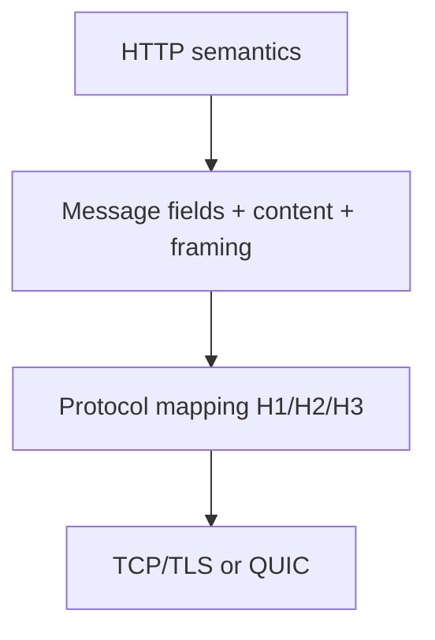

# Part 006 — HTTP Semantics at the Proxy Layer

> **Depth level:** Advanced  
> **Primary audience:** Senior Java/JAX-RS backend engineer yang perlu memastikan API contract tetap semantically correct ketika melewati NGINX, ingress controller, load balancer, dan protocol conversion.  
> **Prerequisite:** Part 002 dan 005; pemahaman HTTP request/response, media type, caching dasar, serta Java/JAX-RS endpoint behavior.

## Learning outcomes

Setelah menyelesaikan part ini, Anda seharusnya mampu:

1. mereview konfigurasi NGINX terhadap semantics method, status, header, representation, dan message framing;
2. membedakan **HTTP semantics**, **HTTP message syntax/framing**, dan **transport protocol version**;
3. mengidentifikasi hop-by-hop fields yang tidak boleh diteruskan secara buta;
4. mempertahankan conditional requests, validators, content negotiation, CORS, Range, HEAD, dan error contracts;
5. menjelaskan bahwa HTTP/2 atau HTTP/3 pada client-facing hop tidak berarti upstream Java menggunakan protocol yang sama;
6. mendiagnosis compatibility failure akibat method filtering, header rewriting, compression, protocol downgrade, buffering, atau malformed framing;
7. menemukan request-smuggling risk yang muncul karena parser disagreement pada proxy chain;
8. membangun compatibility matrix dan end-to-end protocol test untuk Java/JAX-RS APIs.

---

## Daftar isi

1. [Ringkasan eksekutif](#ringkasan-eksekutif)
2. [Tiga layer yang tidak boleh dicampur](#tiga-layer-yang-tidak-boleh-dicampur)
3. [NGINX sebagai HTTP intermediary](#nginx-sebagai-http-intermediary)
4. [Semantic invariants](#semantic-invariants)
5. [Method semantics overview](#method-semantics-overview)
6. [Safe versus idempotent](#safe-versus-idempotent)
7. [Method filtering dan 405 versus 501](#method-filtering-dan-405-versus-501)
8. [HEAD semantics](#head-semantics)
9. [OPTIONS dan CORS preflight](#options-dan-cors-preflight)
10. [TRACE dan CONNECT](#trace-dan-connect)
11. [Status-code provenance dan preservation](#status-code-provenance-dan-preservation)
12. [Status/body invariants](#statusbody-invariants)
13. [Header field model](#header-field-model)
14. [Hop-by-hop versus end-to-end](#hop-by-hop-versus-end-to-end)
15. [`Connection` header stripping](#connection-header-stripping)
16. [Header normalization dan duplicate fields](#header-normalization-dan-duplicate-fields)
17. [Request and response framing](#request-and-response-framing)
18. [`Content-Length` versus `Transfer-Encoding`](#content-length-versus-transfer-encoding)
19. [Chunked transfer coding](#chunked-transfer-coding)
20. [Trailers](#trailers)
21. [`Expect: 100-continue` dan informational responses](#expect-100-continue-dan-informational-responses)
22. [Representation metadata](#representation-metadata)
23. [Content negotiation](#content-negotiation)
24. [Compression negotiation](#compression-negotiation)
25. [`Vary` dan cache correctness](#vary-dan-cache-correctness)
26. [Validators: ETag dan Last-Modified](#validators-etag-dan-last-modified)
27. [Conditional requests](#conditional-requests)
28. [Optimistic concurrency untuk mutating methods](#optimistic-concurrency-untuk-mutating-methods)
29. [Range requests dan 206](#range-requests-dan-206)
30. [CORS semantics di edge](#cors-semantics-di-edge)
31. [HTTP/1.0 dan HTTP/1.1 upstream behavior](#http10-dan-http11-upstream-behavior)
32. [HTTP/2 client-facing behavior](#http2-client-facing-behavior)
33. [HTTP/3 and QUIC considerations](#http3-and-quic-considerations)
34. [Protocol conversion matrix](#protocol-conversion-matrix)
35. [Java/JAX-RS implications](#javajax-rs-implications)
36. [Kubernetes ingress implications](#kubernetes-ingress-implications)
37. [AWS, Azure, dan on-prem implications](#aws-azure-dan-on-prem-implications)
38. [Compatibility-risk patterns](#compatibility-risk-patterns)
39. [Failure model](#failure-model)
40. [Systematic debugging playbook](#systematic-debugging-playbook)
41. [Protocol and contract test matrix](#protocol-and-contract-test-matrix)
42. [Security concerns](#security-concerns)
43. [Performance concerns](#performance-concerns)
44. [Observability concerns](#observability-concerns)
45. [PR review checklist](#pr-review-checklist)
46. [Internal verification checklist](#internal-verification-checklist)
47. [Exercises](#exercises)
48. [Ringkasan](#ringkasan)
49. [Referensi resmi](#referensi-resmi)

---

## Ringkasan eksekutif

NGINX dapat mempertahankan HTTP semantics, tetapi tidak menjamin bahwa setiap request dan response diteruskan byte-for-byte. Sebagai intermediary, NGINX:

- mem-parse message;
- memilih virtual server/location;
- menghapus atau menyintesis connection-specific fields;
- dapat mengganti method, URI, Host, dan headers;
- dapat mengubah message framing;
- dapat melakukan compression/decompression-related handling;
- dapat cache, buffer, intercept, redirect, atau retry;
- dapat menerima satu protocol version dan berbicara version lain ke upstream.

Mental model yang benar:

```text
semantic intent
≠ wire representation
≠ transport connection
```

Contoh:

```text
Client sends HTTP/2 GET
→ NGINX receives pseudo-headers and DATA frames
→ NGINX constructs HTTP/1.1 request to Java
→ Java returns HTTP/1.1 response
→ NGINX emits HTTP/2 response frames
```

Semantics GET dapat tetap sama walaupun framing dan protocol version berubah. Sebaliknya, satu directive kecil dapat merusak semantics walaupun semua hop tetap “HTTP”.

---

## Tiga layer yang tidak boleh dicampur

### 1. Semantics

Menjawab:

- apa arti method?
- apa arti status?
- representation mana yang dipilih?
- apakah operation safe/idempotent?
- apakah precondition terpenuhi?

### 2. Message representation and framing

Menjawab:

- headers apa yang dikirim?
- bagaimana body length ditentukan?
- apakah chunked?
- apakah ada trailers?
- bagaimana content dikodekan?

### 3. Transport/protocol mapping

Menjawab:

- TCP atau QUIC?
- HTTP/1.1, HTTP/2, atau HTTP/3?
- satu request per connection atau multiplexed streams?
- TLS/ALPN bagaimana?



Bug sering muncul saat konfigurasi memperlakukan layer berbeda sebagai setara. Contoh: mengaktifkan HTTP/2 di listener tidak otomatis membuat Java backend menerima HTTP/2.

---

## NGINX sebagai HTTP intermediary

Sebagai proxy/gateway, NGINX memiliki kewajiban protocol-level:

- memahami connection-specific fields;
- tidak meneruskan hop-by-hop controls secara buta;
- menghasilkan message yang valid untuk next hop;
- menjaga target URI dan method semantics kecuali transformasi memang disengaja;
- menangani protocol conversion;
- mengatribusikan failures yang tidak dapat diteruskan sebagai upstream response.

### Transparent versus transforming behavior

Proxy dapat dianggap lebih transparent bila:

```text
method preserved
+ target resource mapping preserved
+ relevant headers preserved
+ representation preserved
+ status preserved
```

Ia menjadi transforming intermediary bila:

- body/compression diubah;
- method diubah;
- URI ditulis ulang;
- response di-cache atau dihasilkan ulang;
- CORS/auth/error response dibuat di edge;
- content dipotong atau diganti.

Transformasi bukan selalu buruk, tetapi harus dinyatakan sebagai bagian API contract.

---

## Semantic invariants

Gunakan invariants berikut untuk review.

### Request invariant

```text
The upstream must receive an operation semantically equivalent
unless an intentional adapter contract says otherwise.
```

### Response invariant

```text
The client must receive a response whose status, fields, and content
retain the meaning promised by the public API contract.
```

### Representation invariant

```text
Content-Type, Content-Encoding, validators, Vary, and length/framing
must describe the actual transferred representation.
```

### Retry invariant

```text
Automatic replay must not create a semantic effect that the client did not request.
```

### Cache invariant

```text
A cached representation may only be reused for requests for which it is valid.
```

---

## Method semantics overview

| Method | Defined intent | Safe | Idempotent | Typical JAX-RS annotation |
|---|---|---:|---:|---|
| GET | retrieve representation | yes | yes | `@GET` |
| HEAD | GET metadata without content | yes | yes | often auto/`@HEAD` support varies |
| POST | resource-specific processing | no | no by default | `@POST` |
| PUT | replace target state | no | yes by semantics | `@PUT` |
| DELETE | remove target state | no | yes by semantics | `@DELETE` |
| PATCH | partial modification | no | not guaranteed | custom/`@PATCH` depending API/runtime |
| OPTIONS | communication options | yes | yes | `@OPTIONS` or framework handling |
| TRACE | loop-back diagnostic | yes conceptually | yes | normally disabled at public edge |
| CONNECT | create tunnel | no | no | normally not proxied to REST app |

### Important nuance

Idempotent does not mean:

- response is identical;
- no logs are created;
- no metrics change;
- no side effects whatsoever.

It means intended effect of repeated identical requests is equivalent to one request.

---

## Safe versus idempotent

### Safe

Safe methods are intended as read-only from the client's perspective. GET and HEAD should not trigger business mutations merely because a crawler, prefetcher, health checker, or cache invokes them.

Bad API:

```http
GET /orders/123/cancel
```

A browser prefetch, scanner, or monitoring system could cancel an order.

Better:

```http
POST /orders/123/cancellation
```

### Idempotent

PUT and DELETE are defined as idempotent in their intended effect. But implementation must enforce this property.

Example:

```http
PUT /quotes/Q-123
```

Repeated identical body should converge to equivalent state, not append duplicate items each time.

### Proxy retry implications

NGINX upstream retry logic treats non-idempotent requests more conservatively after a request has been sent. Enabling retry of non-idempotent methods without application idempotency can duplicate business operations.

Detailed timeout/retry policy is covered in Part 009, tetapi method semantics harus menjadi input desainnya.

---

## Method filtering dan 405 versus 501

### 405 Method Not Allowed

Method dikenal dan didukung server, tetapi tidak diizinkan untuk target resource.

Expected response:

```http
HTTP/1.1 405 Method Not Allowed
Allow: GET, HEAD, PUT
```

### 501 Not Implemented

Method tidak dikenali atau tidak diimplementasikan oleh server.

### Edge filtering

```nginx
limit_except GET HEAD POST {
    deny all;
}
```

Potential issue: `deny all` biasanya menghasilkan 403, bukan 405 dengan correct `Allow`. Ini mungkin acceptable sebagai security policy, tetapi bukan semantic equivalent dari application method dispatch.

### Better decision

- block universally dangerous methods at edge bila policy jelas;
- biarkan application menghasilkan resource-specific 405/Allow bila diperlukan;
- jangan mengklaim method tidak tersedia secara global jika beberapa route membutuhkannya;
- test custom methods seperti PATCH, WebDAV, atau domain-specific extensions bila ada.

### Route mismatch example

```text
NGINX allows POST only
application supports PUT
OpenAPI advertises PUT
client receives 403 at edge
```

Ini adalah public API contract contradiction.

---

## HEAD semantics

HEAD meminta response headers yang setara dengan GET, tanpa response content.

Potential layers:

- NGINX may convert/handle HEAD relative to GET behavior;
- Java runtime may provide automatic HEAD based on GET;
- custom JAX-RS `@HEAD` may override;
- cache may use HEAD for metadata validation.

### Invariants

- no response body is transferred for HEAD;
- representation metadata should correspond to GET where applicable;
- `Content-Length` may describe size a GET representation would have;
- edge must not generate body accidentally through custom error handling;
- auth and conditional logic should remain consistent with GET.

### Test

```bash
curl -svI https://quote.example.com/platform/api/quotes/Q-123
curl -sv  https://quote.example.com/platform/api/quotes/Q-123 -o /dev/null
```

Compare:

- status;
- Content-Type;
- ETag;
- Last-Modified;
- Cache-Control;
- Content-Length semantics.

---

## OPTIONS dan CORS preflight

OPTIONS describes communication options. Browser CORS preflight is a specialized OPTIONS request.

Example:

```http
OPTIONS /platform/api/quotes HTTP/1.1
Origin: https://portal.example.com
Access-Control-Request-Method: POST
Access-Control-Request-Headers: authorization, content-type
```

Possible owners:

1. NGINX generates preflight response;
2. API gateway handles it;
3. Java/JAX-RS CORS filter handles it;
4. multiple layers all add headers.

### Single-owner principle

Choose one primary owner for CORS policy. Duplicate ownership causes:

- duplicate `Access-Control-Allow-Origin`;
- wildcard plus credentials conflict;
- preflight says method allowed but app rejects it;
- app response lacks headers that preflight had;
- inconsistent allowed headers across routes.

### `Max-Forwards`

OPTIONS and TRACE can include `Max-Forwards` for proxy-chain diagnostics. Most APIs do not depend on this, tetapi edge-generated OPTIONS should not silently masquerade as application capability if the route has different behavior.

---

## TRACE dan CONNECT

### TRACE

TRACE echoes request information and can expose credentials or internal headers. Public enterprise endpoints commonly disable it.

```nginx
if ($request_method = TRACE) {
    return 405;
}
```

Use a server/location policy appropriate to the configuration style; avoid complex `if` logic.

### CONNECT

CONNECT establishes a tunnel, usually for forward proxies. Standard reverse-proxy deployment in front of JAX-RS services generally should not expose arbitrary CONNECT.

### Security invariant

```text
Reverse proxy must not accidentally become an open forward proxy or tunnel endpoint.
```

Verify unusual modules, stream configuration, and generic proxy locations.

---

## Status-code provenance dan preservation

Status may originate from:

- client-facing load balancer;
- WAF/auth layer;
- NGINX parser/routing;
- ingress default backend;
- Kubernetes service/upstream connection;
- Java container;
- JAX-RS resource/filter/exception mapper;
- downstream dependency surfaced by Java.

### Preserve application semantics

If Java returns:

```http
409 Conflict
Content-Type: application/problem+json
```

NGINX should not replace it with a generic HTML 500 unless policy explicitly requires transformation.

### Separate external and upstream status in logs

```text
$status              = status sent to downstream
$upstream_status     = status received from upstream attempt(s)
```

Examples:

| `$status` | `$upstream_status` | Interpretation |
|---:|---|---|
| 200 | 200 | normal pass-through |
| 504 | `-` | edge timeout before valid upstream response or no upstream |
| 502 | `502` | upstream itself returned 502 or chain behavior; inspect logs |
| 200 | `404` | error interception/internal redirect transformed result |
| 499 | `-` or partial | client aborted; application may still have processed |

---

## Status/body invariants

Certain statuses have special body semantics.

### No response content

Common cases:

- HEAD response;
- 1xx informational responses;
- 204 No Content;
- 304 Not Modified.

Proxy/application must not attach an ordinary response body to these.

### 304 Not Modified

304 is not an empty 200. It tells a client/cache to reuse stored representation under validator semantics. Relevant metadata must remain coherent.

### 206 Partial Content

206 body represents only requested range(s), and `Content-Range` must match.

### 401 versus 403

- 401 relates to authentication challenge and generally needs `WWW-Authenticate`;
- 403 indicates request understood but refused.

Edge auth interception must preserve challenge semantics where clients rely on them.

### 429 and 503

`Retry-After` can communicate retry timing. Do not drop it when replacing error bodies.

---

## Header field model

Header field names are case-insensitive, but HTTP/2 and HTTP/3 use lowercase field-name encoding on wire. Applications must not depend on original casing.

A field can be:

- single-valued by semantics;
- list-valued and combinable;
- repeatable but not safely comma-combinable, notably `Set-Cookie`;
- connection-specific;
- representation metadata;
- routing/control metadata.

### Anti-pattern

```text
Map<String, String> headers
```

This model may lose repeated fields or combine values incorrectly. Java/JAX-RS APIs usually expose multi-valued headers; filters and custom adapters should preserve multiplicity.

### Header ordering

Most semantics should not depend on ordering, except protocol-specific requirements and list order where defined. Do not build authorization logic around arbitrary received header order.

---

## Hop-by-hop versus end-to-end

### End-to-end fields

Intended to describe request/response semantics across intermediaries, subject to their definitions:

- `Authorization`;
- `Content-Type`;
- `Content-Encoding`;
- `Accept`;
- `ETag`;
- `Cache-Control`;
- `If-None-Match`;
- `Range`.

### Hop-by-hop / connection-specific fields

Examples commonly requiring per-hop handling:

- `Connection`;
- field names listed by `Connection`;
- `Keep-Alive`;
- `Proxy-Authenticate`;
- `Proxy-Authorization`;
- `TE` except carefully negotiated `trailers` semantics;
- `Trailer`;
- `Transfer-Encoding`;
- `Upgrade`.

### Core rule

A proxy must parse `Connection`, remove fields named by its connection options, and then remove or replace `Connection` for the next hop.

This is why “forward all headers exactly” is neither correct nor secure.

---

## `Connection` header stripping

Malicious request:

```http
Connection: X-Internal-Auth
X-Internal-Auth: trusted
```

If an intermediary fails to process `Connection`, downstream may see a field that should have been consumed at one hop.

Another example:

```http
Connection: close, X-Remove-Me
X-Remove-Me: value
```

The intermediary must treat `X-Remove-Me` as connection-specific for that hop.

### WebSocket exception pattern

Upgrade requires explicit reconstruction:

```nginx
map $http_upgrade $connection_upgrade {
    default upgrade;
    ''      close;
}

proxy_set_header Upgrade    $http_upgrade;
proxy_set_header Connection $connection_upgrade;
```

This is intentional hop-by-hop synthesis, not blind forwarding. Real-time traffic is covered in Part 026.

---

## Header normalization dan duplicate fields

Potential parser differences:

- duplicate `Content-Length`;
- comma-combined values;
- whitespace around colon/value;
- underscores in names;
- invalid characters;
- obs-fold/legacy line folding;
- duplicate Host/authority;
- conflicting `Host` and `:authority`;
- oversized fields.

### Parser-agreement security principle

Every hop must agree on request boundaries and routing-critical fields. Reject ambiguous requests rather than allowing different parsers to interpret them differently.

### NGINX configuration concerns

- `underscores_in_headers` changes acceptance behavior;
- `ignore_invalid_headers` affects invalid field handling;
- large header buffers affect rejection thresholds;
- WAF, cloud LB, NGINX, and Java container may have different limits;
- custom Lua/njs modules may parse values differently.

### Compatibility test

Use valid and intentionally invalid requests in a controlled non-production environment. Do not rely only on `curl`, because it normalizes many inputs; lower-level tools may be needed for parser testing.

---

## Request and response framing

Framing answers: where does message content end?

### HTTP/1.1

Common mechanisms:

- no body by method/status semantics;
- `Content-Length`;
- `Transfer-Encoding: chunked`;
- connection close in limited cases.

### HTTP/2 and HTTP/3

Messages use frames/streams; `Transfer-Encoding: chunked` is not used as HTTP/1.1 wire framing. The intermediary reconstructs semantics when converting to/from HTTP/1.1.

### Key invariant

```text
metadata describing content length and encoding
must match the actual content transmitted on that hop
```

Do not copy HTTP/1.1 framing fields blindly into HTTP/2/3 concepts.

---

## `Content-Length` versus `Transfer-Encoding`

A message containing both can be ambiguous and is a classic request-smuggling signal.

### Safe handling

- sender must not send `Content-Length` together with `Transfer-Encoding`;
- recipient/intermediary must follow protocol rules and reject or normalize safely;
- if forwarding after receiving both, intermediary must not preserve contradictory framing;
- Java container and NGINX must agree on message boundary.

### Failure modes

| Input | Front parser | Back parser | Risk |
|---|---|---|---|
| CL + TE | uses TE | uses CL | request desync/smuggling |
| duplicate CL differing | rejects | chooses first | ambiguity |
| malformed chunk | tolerates | rejects | connection desync |
| H2 fields converted to H1 | normalized | custom parser differs | boundary mismatch |

### Operational expectation

Ambiguous request should fail at the earliest trusted edge. A 400 at NGINX is safer than letting Java parse a different request stream.

---

## Chunked transfer coding

Chunked transfer coding is HTTP/1.1 message framing, not content compression.

```http
Transfer-Encoding: chunked

4
Wiki
5
pedia
0


```

### Do not confuse

| Field | Purpose |
|---|---|
| `Transfer-Encoding: chunked` | framing for one hop |
| `Content-Encoding: gzip` | encoding of representation |

A response can conceptually be gzip-compressed and chunked on HTTP/1.1:

```text
representation → gzip content coding → chunks for transfer
```

### Proxy conversion

Client H2 request may arrive as DATA frames. NGINX can forward it to H1 upstream using `Content-Length` or chunked behavior depending on buffering/protocol configuration. Backend should not assume client used the same framing.

### Request buffering interaction

With buffering on, NGINX may read entire body before upstream transmission and know its size. With buffering off, streaming/framing behavior changes. Part 010 covers this in depth.

---

## Trailers

Trailer fields are metadata sent after content.

Possible use cases:

- integrity digest;
- final streaming status;
- late-generated metadata.

### Compatibility reality

Trailer support varies across clients, proxies, frameworks, and protocol versions. Current NGINX proxying requires explicit trailer enablement; do not assume trailers pass automatically.

Conceptual configuration:

```nginx
proxy_set_header Connection "te";
proxy_set_header TE "trailers";
proxy_pass_trailers on;
```

Exact support is version-dependent.

### Review questions

- Is trailer a contractual API feature or optional metadata?
- Does Java runtime expose request/response trailers?
- Are cloud LB and ingress controller transparent to them?
- Does fallback exist for clients that drop trailers?
- Are trailer fields safe to forward?

Avoid making critical business success dependent only on trailers unless every hop is tested.

---

## `Expect: 100-continue` dan informational responses

A client can send:

```http
Expect: 100-continue
Content-Length: 500000000
```

Purpose: allow server/proxy to reject based on headers before client uploads a large body.

Possible responses:

```http
HTTP/1.1 100 Continue
```

followed by a final response, or an immediate final status such as 401/405/413.

### Proxy concerns for informational responses

- intermediary may generate or relay 100 behavior;
- HTTP/1.0 hop cannot represent it the same way;
- clients must not wait indefinitely;
- buffering can make observed behavior different from direct application access;
- auth/body-size policy should be evaluated as early as practical.

### Other 1xx

Protocol support for 103 Early Hints or other informational responses must be verified end-to-end. Do not advertise optimization based on direct backend test only.

---

## Representation metadata

Representation-related fields include:

- `Content-Type`;
- `Content-Encoding`;
- `Content-Language`;
- `Content-Location`;
- `Content-Length`;
- `ETag`;
- `Last-Modified`.

### Invariant

If proxy transforms content, metadata may also need transformation.

Example:

```text
Java emits uncompressed JSON + strong ETag of uncompressed bytes
NGINX compresses response
client receives gzip bytes
```

Whether validator remains valid depends on representation model and implementation. Weak/strong validator semantics and cache key/Vary behavior must be tested.

### `Content-Type`

Do not let generic NGINX error pages claim the API's `application/problem+json` contract. Conversely, do not force `application/json` onto HTML or binary content.

### Charset

Avoid arbitrary charset injection into JSON or binary responses unless required and correct for the media type.

---

## Content negotiation

Client preferences can include:

```http
Accept: application/json
Accept-Language: en-SG, en;q=0.8
Accept-Encoding: gzip, br
```

JAX-RS may select resource methods/providers based on:

- `@Produces`;
- `@Consumes`;
- `Content-Type`;
- `Accept` quality values.

### Failure statuses

- 406 when no acceptable response representation is selected under policy;
- 415 when request representation/content coding is unsupported;
- 400 when syntax is invalid;
- 422 when syntax is valid but semantic validation fails, according to API design.

### Proxy risks

- dropping `Accept` causes default representation selection;
- forcing `Accept: application/json` hides client intent;
- replacing `Content-Type` bypasses JAX-RS provider selection;
- caching without `Vary` serves wrong language/encoding;
- edge-generated errors use different media type from API contract.

### Rule

NGINX should not perform domain-level content negotiation unless explicitly designed as an API transformation layer.

---

## Compression negotiation

Compression involves:

```text
client sends Accept-Encoding
→ server/proxy selects coding
→ response includes Content-Encoding
→ cache varies appropriately
```

### Semantics checklist

- `Content-Encoding` describes actual representation coding;
- `Vary: Accept-Encoding` protects cache variants where needed;
- compressed body length differs from source body length;
- ETag behavior must remain coherent;
- already-compressed media types may gain little;
- clients that do not accept coding must receive usable response.

### Double compression

Bad chain:

```text
Java gzips
→ NGINX treats body as unencoded/misconfigured
→ compresses again
```

Possible result:

```http
Content-Encoding: gzip
```

but body requires two decompressions or is otherwise inconsistent.

### Boundary with Part 011

Part ini focuses on semantics and compatibility. Compression levels, CPU trade-offs, Brotli deployment, and cache tuning are covered later.

---

## `Vary` dan cache correctness

`Vary` tells caches which request fields influenced representation selection.

Example:

```http
Vary: Accept-Encoding, Accept-Language
```

Without correct `Vary`:

```text
request A asks English + gzip
cache stores response
request B asks Indonesian + identity
cache reuses A incorrectly
```

### CORS and `Vary: Origin`

When `Access-Control-Allow-Origin` echoes an allowed request Origin, response often needs:

```http
Vary: Origin
```

Otherwise a shared cache can serve one origin's CORS response to another.

### Proxy mutation risk

Multiple layers using `add_header Vary ...` may overwrite or duplicate values incorrectly. Treat `Vary` as a set-like semantic field but verify actual NGINX directive behavior and resulting wire value.

---

## Validators: ETag dan Last-Modified

### ETag

Entity tag identifies a selected representation version.

```http
ETag: "quote-Q-123-v17"
```

Strong validator:

```http
ETag: "abc"
```

Weak validator:

```http
ETag: W/"abc"
```

Strong and weak validators have different applicability, especially for Range and concurrency.

### Last-Modified

```http
Last-Modified: Sat, 11 Jul 2026 10:00:00 GMT
```

Time precision and clock behavior can make it less precise than ETag.

### Ownership

Validator should be generated by the component that understands representation version. NGINX static-file handling can generate validators for static resources; JAX-RS/domain API should usually define validators based on resource state.

### Proxy transformation

If NGINX changes representation bytes through compression or transformation, test whether validator remains valid for the selected representation variants.

---

## Conditional requests

### Conditional GET

```http
If-None-Match: "v17"
```

If unchanged:

```http
304 Not Modified
ETag: "v17"
```

### Date-based conditional GET

```http
If-Modified-Since: Sat, 11 Jul 2026 10:00:00 GMT
```

### Preconditions for update

```http
If-Match: "v17"
PUT /quotes/Q-123
```

If current version differs:

```http
412 Precondition Failed
```

### NGINX cache interaction

When proxy caching is enabled, NGINX may treat conditional headers specially and can revalidate cached responses. Current proxy module behavior also changes which conditional/range headers are forwarded in some cache configurations. Therefore:

- test cache-enabled and cache-disabled routes separately;
- do not assume application sees all validators when NGINX cache is active;
- inspect generated config and cache directives;
- preserve public semantics even when edge answers 304 itself.

---

## Optimistic concurrency untuk mutating methods

Conditional requests are not only performance optimization. They can protect state transitions.

### Lost update scenario

```text
Client A reads version 17
Client B reads version 17
Client A updates → version 18
Client B updates based on old version 17
```

With `If-Match`:

```http
If-Match: "v17"
```

Client B receives 412 instead of overwriting version 18.

### Proxy requirements

- preserve `If-Match` and ETag;
- do not retry mutation blindly;
- do not rewrite 412 into generic 409/500 without API contract;
- do not cache mutation responses incorrectly;
- ensure WAF/header allowlist permits precondition fields.

### JAX-RS note

Application remains authoritative for domain version and atomic check/update. NGINX cannot enforce business-level optimistic locking merely by forwarding headers.

---

## Range requests dan 206

Client:

```http
Range: bytes=0-999
```

Successful partial response:

```http
HTTP/1.1 206 Partial Content
Content-Range: bytes 0-999/5000
Content-Length: 1000
```

Unsatisfiable:

```http
HTTP/1.1 416 Range Not Satisfiable
Content-Range: bytes */5000
```

### Use cases

- large document download;
- resume interrupted transfer;
- media/random access;
- partial artifact retrieval.

### Proxy concerns for range handling

- cached versus uncached Range behavior;
- compression changes byte offsets because ranges apply to selected encoded representation;
- upstream `Accept-Ranges` handling;
- `If-Range` validator;
- multi-range response media type;
- Java streaming endpoint support;
- object storage redirect/proxy behavior.

### Test invariant

Recombining received ranges must reproduce the same selected representation bytes as a full 200 response for that variant.

---

## CORS semantics di edge

CORS is browser-enforced access policy, not server-side authorization.

### Simple request response

```http
Access-Control-Allow-Origin: https://portal.example.com
Access-Control-Allow-Credentials: true
Vary: Origin
```

### Preflight response

```http
Access-Control-Allow-Origin: https://portal.example.com
Access-Control-Allow-Methods: GET, POST, OPTIONS
Access-Control-Allow-Headers: Authorization, Content-Type
Access-Control-Max-Age: 600
```

### Invalid combination

```http
Access-Control-Allow-Origin: *
Access-Control-Allow-Credentials: true
```

This is not a valid credentialed cross-origin policy for browsers.

### Edge risks

- reflecting arbitrary Origin;
- regex allowlist too broad;
- adding CORS headers to error responses inconsistently;
- preflight bypassing auth but revealing unsupported capability;
- duplicate values from NGINX and Java;
- missing `always` behavior on non-2xx where client needs readable errors;
- cache missing `Vary: Origin`.

### CORS security principle

CORS does not protect API from non-browser clients. Authentication and authorization remain required.

---

## HTTP/1.0 dan HTTP/1.1 upstream behavior

`proxy_http_version` controls protocol used from NGINX to proxied server.

Current NGINX documentation indicates:

- recent versions use HTTP/1.1 as default since 1.29.7;
- older versions used HTTP/1.0 by default;
- newer versions also introduce upstream HTTP/2 support under specific version/module conditions.

### Production rule

Set protocol version explicitly when behavior matters:

```nginx
proxy_http_version 1.1;
```

Reasons:

- stable behavior across upgrades/distributions;
- upstream keepalive;
- streaming/chunking expectations;
- upgrade protocols;
- trailers;
- compatibility with Java runtime.

### `Connection` default

NGINX proxy module has its own default Host/Connection behavior. For persistent upstream connections, configuration commonly clears connection-close semantics:

```nginx
proxy_set_header Connection "";
```

But route-specific protocols such as WebSocket require explicit Upgrade handling instead.

### HTTP/1.0 risks

- no chunked request transfer semantics;
- different connection persistence behavior;
- 100-continue limitations;
- protocol downgrade may trigger buffering;
- some modern backend features expect HTTP/1.1.

---

## HTTP/2 client-facing behavior

HTTP/2 provides:

- multiplexed streams over a connection;
- binary framing;
- header compression;
- stream-level flow control;
- pseudo-headers such as `:method`, `:scheme`, `:authority`, `:path`.

### Semantic mapping

```text
:method     → HTTP method
:scheme     → target scheme context
:authority  → authority/Host semantics
:path       → request target path/query
```

### Important differences

- no HTTP/1.1 chunked transfer coding on wire;
- connection-specific headers such as `Connection` are prohibited in H2 messages;
- field names are lowercase on wire;
- one slow stream should not be equated with one connection, though transport-level loss can still affect connection;
- upstream may still be HTTP/1.1.

### Java/JAX-RS implication

Application often sees a container abstraction, not raw H2 frames. A request may be H2 externally and H1 internally. Log both client protocol and upstream protocol if protocol behavior matters.

---

## HTTP/3 and QUIC considerations

HTTP/3 maps HTTP semantics over QUIC instead of TCP. It changes transport behavior, not REST resource semantics.

### Characteristics

- QUIC over UDP;
- TLS integrated with QUIC;
- stream multiplexing without TCP-level head-of-line blocking across independent streams;
- connection migration capability;
- QPACK header compression;
- different observability/network-tooling requirements.

### NGINX implementation caution

The NGINX HTTP/3 module remains explicitly documented as experimental in current official module documentation and is not built by default. Treat enablement as a platform decision with version/build verification, not as a generic directive addition.

### Edge-only H3

Common topology:

```text
Client H3/QUIC
→ cloud edge or NGINX
→ HTTP/1.1 or HTTP/2 upstream
→ Java service
```

Application behavior should not depend on H3 unless the API explicitly exposes transport-sensitive features.

### Operational concerns

- UDP firewall/NAT paths;
- Alt-Svc advertisement;
- fallback to H2/H1;
- load balancer support;
- source address and connection migration logging;
- 0-RTT replay considerations for unsafe methods;
- tooling (`curl --http3`, packet capture, QUIC-aware metrics).

### 0-RTT warning

Early data may be replayable at transport/security level. Do not enable or accept unsafe mutation flows without explicit replay analysis.

---

## Protocol conversion matrix

| Downstream/client hop | NGINX → upstream | Semantics possible | Key risk |
|---|---|---|---|
| H1.1 | H1.1 | normal | framing/header ambiguity |
| H2 | H1.1 | normal | pseudo-header conversion, chunking differences |
| H3 | H1.1 | normal | QUIC observability, fallback, replay considerations |
| H2 | H2 | possible on supported current builds/config | runtime compatibility, pool/multiplex behavior |
| H1.1 | H2 | possible only under supported proxy feature/config | translation assumptions |
| H1.0 | H1.1 | limited legacy client | keepalive/framing differences |

### Review rule

Document protocol independently for every hop:

```text
client→edge
edge→cloud LB
LB→NGINX
NGINX→Java
Java→downstream dependency
```

“HTTP/2 enabled” without hop qualification is incomplete.

---

## Java/JAX-RS implications

### Method dispatch

Edge method restrictions must align with JAX-RS annotations and OpenAPI contract.

### Providers and negotiation

JAX-RS message body readers/writers depend on `Content-Type`, `Accept`, `@Consumes`, and `@Produces`. Proxy mutation can change provider selection.

### Exception mapping

Custom `ExceptionMapper` output can be replaced by NGINX error interception. Preserve `Content-Type`, status, and problem details.

### Entity tags and preconditions

JAX-RS APIs provide types/builders for entity tags and precondition evaluation. Domain version check must still be atomic with update.

### HEAD/OPTIONS

Runtime-specific automatic behavior should be verified. Do not assume every implementation generates identical Allow/OPTIONS/HEAD response.

### Streaming

A JAX-RS `StreamingOutput`, SSE, or reactive publisher can be semantically altered by proxy buffering/timeouts. Covered in Part 010 and 026.

### Header multiplicity

Use multi-valued APIs correctly, especially `Set-Cookie`, `Warning`, `Link`, `WWW-Authenticate`, and custom repeated fields.

---

## Kubernetes ingress implications

Ingress abstraction does not standardize every HTTP mutation. Controller-specific annotations and ConfigMap settings can affect:

- CORS;
- method restrictions;
- upstream protocol;
- request/response headers;
- compression;
- buffering;
- cache;
- regex rewrites;
- error interception;
- gRPC/backend protocol;
- HTTP/2 listener behavior.

### Generated-config principle

```text
Ingress YAML is intent
generated NGINX config is implementation
wire behavior is truth
```

### Multi-ingress conflict

Two Ingress resources for same host/path may contribute conflicting annotations depending on controller behavior. Test effective route rather than assuming namespace isolation resolves semantic conflict.

### Admission/governance

Policy should restrict annotations/snippets capable of:

- overriding CORS globally;
- enabling arbitrary header injection;
- changing upstream protocol;
- intercepting errors;
- bypassing security headers;
- creating unsafe regex routes.

---

## AWS, Azure, dan on-prem implications

### Cloud L7 load balancer

May:

- terminate H2/H3 externally;
- use H1/H2 to targets;
- normalize headers;
- impose method/header/body limits;
- generate redirects/errors;
- handle compression or WAF policies;
- enforce idle timeout.

### AWS examples to verify

- ALB client-side and target-side protocol versions;
- CloudFront/WAF cache and header policies;
- API Gateway content transformation;
- NLB as L4 path without HTTP semantics;
- header limits and invalid-header handling.

### Azure examples to verify

- Front Door protocol and caching behavior;
- Application Gateway header rewriting;
- API Management policies;
- Azure Load Balancer L4 behavior;
- private routing and TLS re-encryption.

### On-prem examples to verify

- F5/HAProxy/proprietary ADC HTTP profiles;
- legacy HTTP/1.0 or connection normalization;
- WAF parser behavior;
- corporate TLS inspection;
- duplicate compression/caching;
- header insertion/removal.

Do not infer internal CSG topology from provider examples. Capture actual behavior via configuration and wire tests.

---

## Compatibility-risk patterns

### 1. Edge changes POST to GET

```nginx
proxy_method GET;
```

Request body and application semantics can become meaningless.

### 2. Global JSON forcing

```nginx
proxy_set_header Accept application/json;
```

Breaks clients requesting other representations and hides contract defects.

### 3. CORS generated at two layers

```text
NGINX: ACAO=*
Java:  ACAO=https://portal.example.com
```

Browser rejects duplicate/conflicting policy.

### 4. Cache ignores Authorization/tenant variance

Potential cross-user data exposure.

### 5. Compression without Vary

Wrong encoded representation served from shared cache.

### 6. Intercepted 401

`WWW-Authenticate` lost, OAuth client behavior breaks.

### 7. Method allowlist excludes PATCH

OpenAPI says supported, edge returns 403.

### 8. H2 listener assumed to fix upstream keepalive

Upstream still uses separate H1 behavior and may close every connection.

### 9. Range through compression

Byte offsets do not match expected uncompressed artifact.

### 10. Conditional headers removed by cache path

Application optimistic concurrency or validation flow changes.

---

## Failure model

| Symptom | Possible semantic/protocol cause | First evidence |
|---|---|---|
| 403 instead of 405 | edge method block | NGINX config, Allow header |
| 415 only through proxy | Content-Type/Encoding changed | request diff |
| wrong language/format | Accept dropped or cache missing Vary | headers/cache status |
| browser CORS error | duplicate/missing ACAO or preflight mismatch | browser network log |
| 304 but stale/wrong data | validator/cache variant defect | ETag, Age, Vary |
| 206 corrupted download | range/compression mismatch | Content-Range, hashes |
| Java sees empty body | method/body forwarding/framing issue | content length, logs |
| intermittent 400 | malformed/duplicate header handling | NGINX error log |
| 502 invalid header | malformed upstream response/framing | upstream raw response |
| H2 works direct, fails via LB | protocol conversion/limits | per-hop protocol |
| trailers missing | unsupported/not enabled | TE/Trailer and config |
| large upload stalls before Java | Expect/buffering/body timeout | access/error timing |
| 401 body readable in curl but not browser | CORS headers absent on errors | response headers |
| duplicate mutation | unsafe retry/replay | upstream attempts, idempotency |

---

## Systematic debugging playbook

### Step 1 — state the contract

```text
method:
request Content-Type:
Accept:
expected status:
expected response Content-Type:
body allowed/required:
cacheability:
validator behavior:
range behavior:
CORS origin/method/header policy:
client protocol:
upstream protocol:
```

### Step 2 — compare direct and proxied wire output

```bash
curl -sv --http1.1 http://quote-api:8080/api/quotes/Q-123
curl -sv --http1.1 https://quote.example.com/platform/api/quotes/Q-123
curl -sv --http2   https://quote.example.com/platform/api/quotes/Q-123
```

Where supported and approved:

```bash
curl -sv --http3 https://quote.example.com/platform/api/quotes/Q-123
```

### Step 3 — dump headers without body noise

```bash
curl -skD - -o /dev/null \
  -H 'Accept: application/json' \
  https://quote.example.com/platform/api/quotes/Q-123
```

### Step 4 — method matrix

```bash
for method in GET HEAD POST PUT PATCH DELETE OPTIONS TRACE; do
  printf '\n=== %s ===\n' "$method"
  curl -sk -X "$method" -D - -o /dev/null \
    https://quote.example.com/platform/api/quotes/Q-123
 done
```

Do not run mutating methods against production resources without safe test data and explicit approval.

### Step 5 — conditional request

```bash
etag=$(curl -skD - -o /dev/null \
  https://quote.example.com/platform/api/quotes/Q-123 \
  | awk 'BEGIN{IGNORECASE=1} /^ETag:/{sub("\r$",""); print substr($0,7)}')

curl -skD - -o /dev/null \
  -H "If-None-Match: $etag" \
  https://quote.example.com/platform/api/quotes/Q-123
```

### Step 6 — range test

```bash
curl -skD - -o part.bin \
  -H 'Range: bytes=0-999' \
  https://quote.example.com/platform/api/documents/D-123/content
```

Verify status, `Content-Range`, size, and hash.

### Step 7 — CORS test

```bash
curl -skD - -o /dev/null -X OPTIONS \
  -H 'Origin: https://portal.example.com' \
  -H 'Access-Control-Request-Method: POST' \
  -H 'Access-Control-Request-Headers: authorization,content-type' \
  https://quote.example.com/platform/api/quotes
```

### Step 8 — inspect per-hop protocols

Use:

- load balancer access logs;
- NGINX `$server_protocol`;
- upstream connection/config;
- Java container access logs;
- TLS ALPN output;
- `curl -v` negotiation;
- packet capture only under approved operational procedures.

---

## Protocol and contract test matrix

### Core API matrix

| Case | Request | Expected |
|---|---|---|
| GET | valid Accept | 200 + correct representation |
| HEAD | same target | same metadata, no content |
| unsupported method | known method | 405 + Allow or explicit edge policy |
| unknown method | custom unknown token | defined 501/edge rejection |
| unsupported request media | wrong Content-Type | 415 |
| unacceptable response media | incompatible Accept | defined 406 behavior |
| conditional unchanged | If-None-Match current | 304 |
| stale update | If-Match old | 412 |
| range satisfiable | valid bytes range | 206 + Content-Range |
| range invalid | beyond end | 416 + Content-Range |
| CORS allowed | approved Origin | correct ACAO/Vary |
| CORS denied | unapproved Origin | no permissive ACAO |

### Protocol matrix

| Test | Direct app | NGINX H1 | NGINX H2 | Full cloud path |
|---|---:|---:|---:|---:|
| GET/HEAD parity | | | | |
| POST body integrity | | | | |
| 100-continue | | | | |
| large headers | | | | |
| compression | | | | |
| conditional GET | | | | |
| Range | | | | |
| repeated headers | | | | |
| error content type | | | | |
| trailers if required | | | | |

Automate this in integration/environment smoke tests where feasible.

---

## Security concerns

### Request smuggling/desynchronization

Parser disagreement around `Content-Length`, `Transfer-Encoding`, duplicate fields, malformed chunks, or H2-to-H1 conversion can let one request be interpreted as multiple requests downstream.

Controls:

- current patched components;
- strict invalid-message rejection;
- minimize heterogeneous parser chains;
- align LB/WAF/NGINX/backend policies;
- test known ambiguity classes in controlled security testing;
- close connections after framing errors.

### Host/authority ambiguity

Conflicting Host/`:authority` can affect routing and cache keys. Reject ambiguity.

### CORS misconception

CORS is not authorization and does not stop server-to-server attackers.

### Cache data leakage

Wrong cache key/Vary/Authorization handling can expose tenant or user data.

### Compression side channels

Compressing secrets alongside attacker-controlled content can create side-channel risk in some contexts. Evaluate sensitive dynamic responses.

### TRACE/internal headers

Disable TRACE when not required and prevent reflection of credentials.

### 0-RTT replay

HTTP/3/TLS early data may be replayed. Unsafe methods require explicit policy.

### Error mutation

Replacing errors must not remove auth challenges, retry guidance, or security-relevant headers.

---

## Performance concerns

Semantics correctness precedes optimization, tetapi protocol choices affect capacity:

- H2/H3 multiplexing changes connection count and concurrency shape;
- upstream H1 keepalive affects socket churn;
- header compression reduces wire bytes but requires CPU/state;
- giant cookies/JWTs increase every request cost;
- compression consumes CPU and affects latency;
- conditional requests and Range reduce bytes when correct;
- CORS preflight cache can reduce requests but must not overstate policy duration;
- buffering can smooth slow clients but increase disk/memory usage;
- cache improves latency but expands correctness/security burden;
- protocol conversion can shift head-of-line and flow-control behavior.

Do not measure only requests per second. Track latency, bytes, connection reuse, CPU, memory, and error semantics.

---

## Observability concerns

### Recommended fields

```text
request_method
server_protocol
status
upstream_status
request_length
bytes_sent
body_bytes_sent
content_type
content_encoding
http_accept
http_accept_encoding
http_origin
http_range
upstream_cache_status
request_time
upstream_response_time
```

Avoid logging full Authorization, cookies, sensitive query/body, or unbounded arbitrary headers.

### Useful metrics

- status by method and route;
- 405/415/406/412/416 rate;
- CORS preflight success/failure;
- cache hit by representation variant;
- H1/H2/H3 client distribution;
- upstream protocol/connection reuse;
- response compression ratio;
- 304 ratio;
- range traffic and bytes saved;
- invalid-header/framing rejection;
- external status versus upstream status.

### Provenance

For edge-generated response, log a structured `response_origin` field internally:

```text
nginx_parser
nginx_policy
nginx_cache
upstream_application
cloud_lb
```

Not every platform exposes this directly; derive it from upstream status/route logs where necessary.

---

## PR review checklist

### Methods and status

- [ ] Allowed methods match OpenAPI/JAX-RS routes.
- [ ] Edge block returns intentional status semantics.
- [ ] HEAD and OPTIONS behavior tested.
- [ ] Application status/body/header contract preserved.
- [ ] 401 challenge, 405 Allow, 429/503 Retry-After remain correct.

### Headers and framing

- [ ] Hop-by-hop fields are not blindly forwarded.
- [ ] No contradictory `Content-Length`/Transfer-Encoding manipulation.
- [ ] Duplicate/repeated headers handled correctly.
- [ ] Header limits align across LB, NGINX, and Java.
- [ ] Trailer/100-continue behavior is explicit if used.

### Negotiation and representation

- [ ] `Accept`, Content-Type, and Content-Encoding are preserved.
- [ ] Compression has correct `Vary` and metadata.
- [ ] Error responses use expected media types.
- [ ] No double compression.

### Cache and validators

- [ ] Cache policy is explicit for authenticated/tenant data.
- [ ] `Vary` fields cover representation selection.
- [ ] ETag/Last-Modified behavior tested through proxy.
- [ ] Conditional update headers reach application.
- [ ] Range and compression interaction tested.

### Protocol

- [ ] Client-facing and upstream protocol versions documented separately.
- [ ] `proxy_http_version` explicit where behavior matters.
- [ ] H2/H3 enablement includes fallback and compatibility tests.
- [ ] Cloud LB protocol conversion is verified.

### Security

- [ ] Request-smuggling hardening considered.
- [ ] TRACE/CONNECT policy explicit.
- [ ] CORS does not substitute auth.
- [ ] HTTP/3 0-RTT replay risk considered if enabled.

---

## Internal verification checklist

> Tidak ada detail arsitektur internal CSG yang diasumsikan. Verifikasi item berikut terhadap codebase, infrastructure repository, controller configuration, dan runtime evidence.

### Java/JAX-RS codebase

- [ ] Inventarisasi methods dan `@Consumes`/`@Produces` setiap API kritis.
- [ ] Verifikasi HEAD/OPTIONS automatic behavior pada runtime yang digunakan.
- [ ] Temukan custom filters/interceptors yang mengubah method atau headers.
- [ ] Periksa `ExceptionMapper` dan error media type/status contracts.
- [ ] Periksa ETag, Last-Modified, precondition, dan optimistic-lock handling.
- [ ] Periksa Range/download implementation dan object-storage integration.
- [ ] Periksa repeated header handling dan `Set-Cookie` generation.
- [ ] Periksa CORS filter dan allowed origins per environment.
- [ ] Periksa streaming/trailer/100-continue dependency bila ada.

### NGINX and ingress

- [ ] Catat exact NGINX/controller version dan build modules.
- [ ] Temukan `proxy_http_version`, method restrictions, `proxy_method`, header rewrites, CORS annotations, cache, gzip/Brotli, dan error interception.
- [ ] Periksa `underscores_in_headers`, `ignore_invalid_headers`, dan header-buffer settings.
- [ ] Periksa all `add_header` inheritance/`always` behavior.
- [ ] Periksa conditional/range header behavior pada cached routes.
- [ ] Periksa `proxy_pass_trailers` atau special protocol features.
- [ ] Inspect generated config with `nginx -T` or controller equivalent.

### Cloud/on-prem network

- [ ] Dokumentasikan protocol version pada setiap hop.
- [ ] Verifikasi ALPN and TLS termination points.
- [ ] Periksa WAF/LB invalid-header and method policies.
- [ ] Periksa CDN/cache key and forwarded-header policies.
- [ ] Periksa compression ownership pada CDN, LB, NGINX, dan Java.
- [ ] Verifikasi UDP/QUIC path dan fallback bila HTTP/3 digunakan.
- [ ] Verifikasi header/body limits across all hops.

### Tests and observability

- [ ] Bandingkan direct-app versus full-edge request/response headers.
- [ ] Jalankan method/status/negotiation/conditional/range/CORS matrix.
- [ ] Pastikan NGINX log memuat client protocol dan upstream status.
- [ ] Temukan dashboard untuk 4xx semantic statuses, cache, compression, dan protocol distribution.
- [ ] Cari incident notes terkait CORS, corrupted download, stale cache, 415, 502 invalid header, atau request smuggling.
- [ ] Tambahkan regression tests sebelum mengubah protocol or header policies.

---

## Exercises

### Exercise 1 — classify methods

Untuk endpoint berikut, tentukan apakah design-nya sesuai:

```text
GET  /quotes/Q-1/submit
POST /quotes/Q-1/search
PUT  /quotes/Q-1
DELETE /quotes/Q-1
```

Bahas safe/idempotent semantics dan retry implications.

### Exercise 2 — find the hop-by-hop bug

```nginx
proxy_set_header Connection $http_connection;
```

Jelaskan mengapa blind forwarding salah dan kapan NGINX harus menyintesis `Connection` sendiri.

### Exercise 3 — conditional update

Design flow:

```text
GET quote → ETag v17
PUT quote with If-Match v17
concurrent update changes version to v18
```

Tentukan expected status dan atomic application behavior.

### Exercise 4 — protocol map

Gambar exact protocol chain untuk satu environment:

```text
browser → CDN/LB → ingress → Java
```

Isi:

- transport;
- TLS termination;
- ALPN;
- HTTP version;
- connection reuse;
- source of errors.

### Exercise 5 — CORS ownership

Cari CORS config di Java, NGINX, ingress annotations, API gateway, dan cloud edge. Tentukan satu owner dan rencana menghapus duplication.

### Exercise 6 — range integrity

Download full file and two ranges, recombine them, then compare hashes. Repeat with and without `Accept-Encoding: identity` to reason about representation bytes.

---

## Ringkasan

Mental model final:

```text
HTTP semantics must survive intermediary translation,
not necessarily preserve the original wire bytes.
```

Senior engineer harus mampu memisahkan:

1. operation semantics;
2. representation metadata;
3. message framing;
4. connection-specific controls;
5. protocol version per hop;
6. cache/negotiation state;
7. edge-generated versus application-generated responses.

Checklist inti:

- methods tetap berarti sama;
- status dan required headers tetap coherent;
- hop-by-hop fields diproses per hop;
- framing tidak ambiguous;
- Content-Type/Encoding/Vary menggambarkan body yang nyata;
- validators dan Range tetap correct;
- CORS memiliki satu owner;
- H2/H3 tidak diasumsikan end-to-end;
- invalid messages fail early;
- wire tests membuktikan behavior, bukan hanya konfigurasi.

NGINX yang “berhasil meneruskan traffic” belum tentu mempertahankan API contract. Correctness baru terbukti ketika semantics, security, compatibility, dan observability konsisten pada seluruh hop.

---

## Referensi resmi

- [RFC 9110 — HTTP Semantics](https://www.rfc-editor.org/rfc/rfc9110.html)
- [RFC 9111 — HTTP Caching](https://www.rfc-editor.org/rfc/rfc9111.html)
- [RFC 9112 — HTTP/1.1](https://www.rfc-editor.org/rfc/rfc9112.html)
- [RFC 9113 — HTTP/2](https://www.rfc-editor.org/rfc/rfc9113.html)
- [RFC 9114 — HTTP/3](https://www.rfc-editor.org/rfc/rfc9114.html)
- [NGINX — ngx_http_proxy_module](https://nginx.org/en/docs/http/ngx_http_proxy_module.html)
- [NGINX — ngx_http_v2_module](https://nginx.org/en/docs/http/ngx_http_v2_module.html)
- [NGINX — ngx_http_v3_module](https://nginx.org/en/docs/http/ngx_http_v3_module.html)
- [Jakarta RESTful Web Services Specification](https://jakarta.ee/specifications/restful-ws/)

