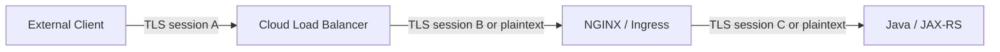
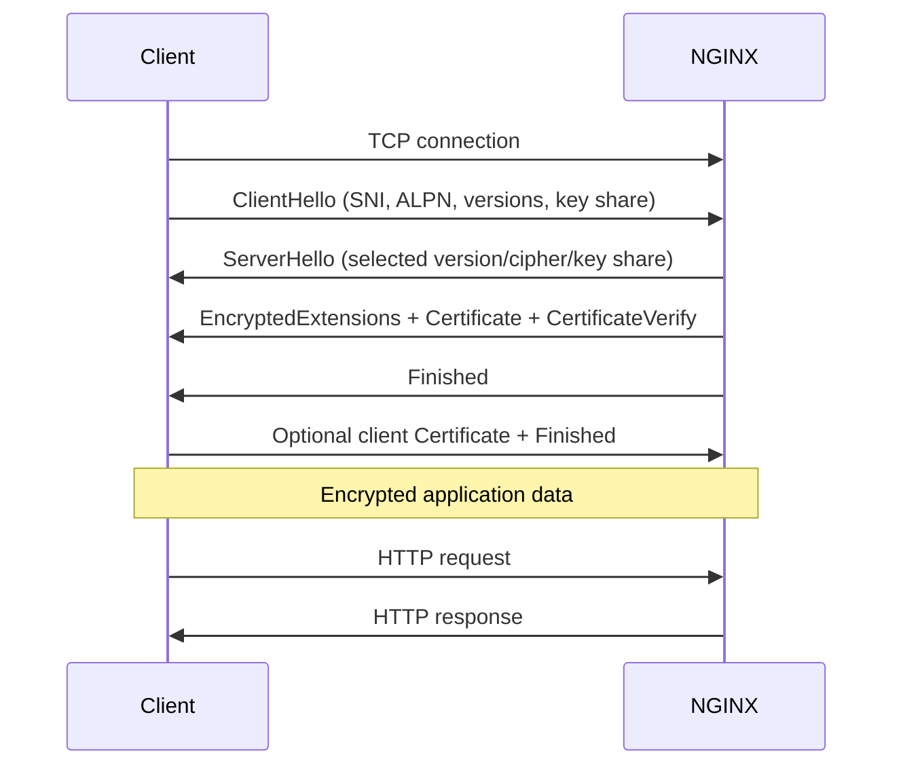
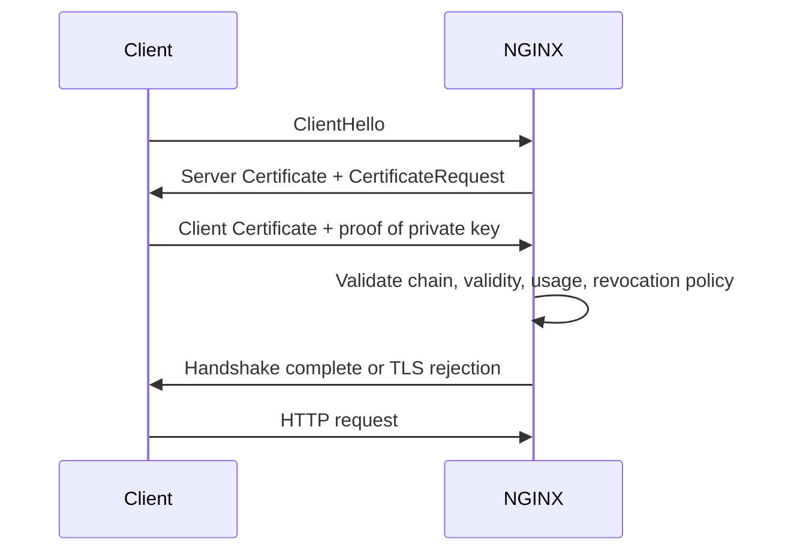
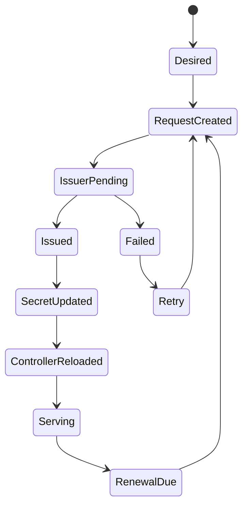
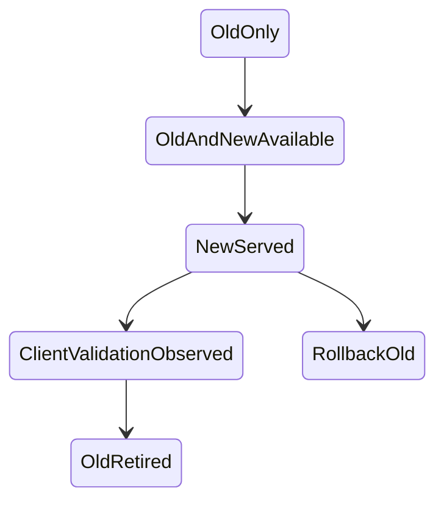

# Part 007 — TLS Architecture: Termination, Re-encryption, mTLS, and Certificates

> **Depth level:** Advanced  
> **Primary audience:** Senior Java/JAX-RS backend engineer yang harus memahami trust boundary, certificate ownership, dan TLS failure pada NGINX, Kubernetes, cloud, on-prem, atau hybrid topology.  
> **Prerequisite:** Part 002 dan Part 004–006; dasar public-key cryptography, X.509, DNS, TCP, dan HTTP.

## Learning outcomes

Setelah menyelesaikan part ini, Anda seharusnya mampu:

1. menggambar setiap TLS hop secara terpisah dan menjelaskan titik plaintext, termination, passthrough, serta re-encryption;
2. membedakan server authentication, client authentication, encryption, integrity, dan application authorization;
3. memvalidasi certificate chain, SAN, SNI, ALPN, protocol version, key pairing, trust store, dan hostname verification;
4. mengonfigurasi downstream TLS dan upstream TLS NGINX tanpa menganggap verification atau SNI aktif secara otomatis;
5. mendesain downstream mTLS dan identity propagation tanpa membuka header-spoofing boundary;
6. menjelaskan Kubernetes TLS Secret, cert-manager issuance/renewal, cloud-managed certificate, dan private PKI ownership;
7. merancang certificate rotation, CA rollover, reload, rollback, serta expiry monitoring tanpa downtime;
8. mendiagnosis handshake failure, unknown CA, hostname mismatch, incomplete chain, expired certificate, bad client certificate, dan upstream TLS error;
9. menghubungkan TLS topology dengan Java/JAX-RS scheme awareness, redirects, cookies, security filters, observability, dan performance;
10. mereview perubahan TLS sebagai perubahan trust architecture, bukan hanya perubahan file certificate.

---

## Daftar isi

1. [Ringkasan eksekutif](#ringkasan-eksekutif)
2. [TLS adalah properti per hop](#tls-adalah-properti-per-hop)
3. [Security properties dan non-properties](#security-properties-dan-non-properties)
4. [Empat topology TLS utama](#empat-topology-tls-utama)
5. [Handshake lifecycle](#handshake-lifecycle)
6. [SNI, certificate selection, dan virtual host](#sni-certificate-selection-dan-virtual-host)
7. [ALPN dan protocol negotiation](#alpn-dan-protocol-negotiation)
8. [Certificate chain dan trust path](#certificate-chain-dan-trust-path)
9. [SAN, wildcard, dan hostname verification](#san-wildcard-dan-hostname-verification)
10. [Certificate dan private-key pairing](#certificate-dan-private-key-pairing)
11. [Baseline downstream TLS configuration](#baseline-downstream-tls-configuration)
12. [TLS protocol dan cipher policy](#tls-protocol-dan-cipher-policy)
13. [TLS session reuse dan tickets](#tls-session-reuse-dan-tickets)
14. [OCSP stapling dan revocation reality](#ocsp-stapling-dan-revocation-reality)
15. [HSTS dan HTTPS canonicalization](#hsts-dan-https-canonicalization)
16. [Downstream mTLS](#downstream-mtls)
17. [mTLS identity propagation](#mtls-identity-propagation)
18. [Upstream TLS dan re-encryption](#upstream-tls-dan-re-encryption)
19. [Upstream mTLS](#upstream-mtls)
20. [Internal CA dan private PKI](#internal-ca-dan-private-pki)
21. [TLS passthrough](#tls-passthrough)
22. [Kubernetes TLS Secret](#kubernetes-tls-secret)
23. [cert-manager lifecycle](#cert-manager-lifecycle)
24. [Cloud certificate managers](#cloud-certificate-managers)
25. [Certificate rotation state machine](#certificate-rotation-state-machine)
26. [CA rollover](#ca-rollover)
27. [Zero-downtime reload dan rollback](#zero-downtime-reload-dan-rollback)
28. [Java/JAX-RS implications](#javajax-rs-implications)
29. [AWS, Azure, on-prem, dan hybrid implications](#aws-azure-on-prem-dan-hybrid-implications)
30. [TLS observability](#tls-observability)
31. [Failure model](#failure-model)
32. [Systematic debugging playbook](#systematic-debugging-playbook)
33. [Security concerns](#security-concerns)
34. [Performance concerns](#performance-concerns)
35. [Production reference patterns](#production-reference-patterns)
36. [PR review checklist](#pr-review-checklist)
37. [Internal verification checklist](#internal-verification-checklist)
38. [Exercises](#exercises)
39. [Ringkasan](#ringkasan)
40. [Referensi resmi](#referensi-resmi)

---

## Ringkasan eksekutif

TLS sering dibicarakan seolah-olah satu request memiliki satu status global:

```text
"request ini HTTPS"
```

Dalam sistem enterprise, kalimat tersebut terlalu lemah. Satu logical request dapat melewati beberapa transport connection dan beberapa TLS session:

```text
client
  -- TLS A --> cloud load balancer
  -- TLS B --> NGINX ingress
  -- TLS C --> Java service
```

Setiap hop memiliki:

- peer identity berbeda;
- certificate berbeda;
- trust store berbeda;
- SNI berbeda;
- protocol/cipher berbeda;
- termination owner berbeda;
- observability berbeda;
- failure mode berbeda.

Mental model utama:

> TLS bukan properti end-to-end dari logical request. TLS adalah security contract untuk setiap transport hop.

Re-encryption tidak “melanjutkan” TLS client. NGINX mengakhiri satu TLS session lalu membuat TLS session baru sebagai client terhadap upstream.



Karena itu, review TLS harus menjawab pertanyaan berikut pada **setiap edge**:

```text
Who authenticates whom?
Which name is verified?
Which CA is trusted?
Where does plaintext exist?
Who owns the private key?
How is rotation performed?
What happens when renewal fails?
```

---

## TLS adalah properti per hop

Representasikan traffic path sebagai graph:

```text
G = (V, E)
```

- `V` adalah components: client, CDN, load balancer, NGINX, service mesh proxy, Java process.
- `E` adalah network connections.

Setiap edge `e` memiliki tuple TLS:

```text
T(e) = (
  transport,
  tlsEnabled,
  serverName,
  serverCertificate,
  clientCertificate,
  trustAnchors,
  protocol,
  cipher,
  verificationPolicy
)
```

Contoh:

| Hop | Client role | Server role | SNI | Server cert | Client cert | Verification |
|---|---|---|---|---|---|---|
| Browser → ALB | browser | ALB | `quote.example.com` | public CA cert | none | browser trust store |
| ALB → NGINX | ALB | NGINX | platform-dependent | private/public cert | optional | LB policy |
| NGINX → Java | NGINX | Java | `quote-api.internal` | internal CA cert | optional | NGINX CA bundle |

### Invariant

Tidak boleh ada label ambigu seperti:

```text
"TLS enabled between edge and backend"
```

Dokumentasi harus menyebut exact connection:

```text
ALB listener 443 terminates public TLS.
ALB target protocol is HTTPS to NGINX port 8443.
NGINX verifies certificate name ingress.internal.example.
NGINX proxies HTTPS to quote-api:8443 and verifies quote-api.internal.
```

### Plaintext inventory

Untuk setiap termination point, plaintext tersedia di memory/process boundary komponen tersebut.

```text
TLS termination implies decryption access.
```

Jika threat model melarang intermediary melihat payload, termination di intermediary tidak memenuhi requirement. Gunakan passthrough atau application-level encryption bila benar-benar dibutuhkan, dengan konsekuensi kehilangan L7 controls.

---

## Security properties dan non-properties

TLS dapat menyediakan:

- confidentiality in transit;
- integrity in transit;
- server authentication;
- optional client authentication;
- replay resistance dalam batas protocol/mode tertentu.

TLS **tidak otomatis** menyediakan:

- authorization terhadap business resource;
- tenant isolation;
- input validation;
- secure session management;
- protection setelah data didekripsi;
- proof bahwa forwarded identity header benar;
- end-to-end encryption ketika ada termination intermediary;
- log privacy;
- protection dari compromised endpoint.

### Authentication dimensions

| Mechanism | Proves | Does not prove |
|---|---|---|
| Server TLS certificate | server controls key corresponding to trusted certificate/name | user is authorized |
| Client TLS certificate | client possesses private key for accepted cert | request may access quote/order |
| OAuth access token | token claims/authorization context | network peer identity unless bound |
| API key | possession of shared credential | human identity or device integrity |

mTLS identity dapat menjadi input authorization, tetapi application policy tetap harus memetakan certificate identity ke principal, tenant, permissions, dan lifecycle.

---

## Empat topology TLS utama

### 1. TLS termination at NGINX

```text
client --HTTPS--> NGINX --HTTP--> Java
```

Karakteristik:

- NGINX membaca HTTP method, path, headers, dan body;
- NGINX dapat route, rewrite, authenticate, rate-limit, log, dan buffer;
- hop NGINX → Java tidak encrypted;
- backend harus mempercayai forwarded scheme hanya dari trusted NGINX;
- plaintext dapat terlihat pada node/pod network sesuai topology.

Cocok ketika internal network trust dan compliance mengizinkan plaintext serta operational simplicity lebih penting daripada hop encryption.

### 2. TLS termination at cloud load balancer

```text
client --HTTPS--> cloud LB --HTTP--> NGINX --HTTP--> Java
```

Karakteristik:

- public key berada di cloud certificate service/LB;
- NGINX menerima plaintext dan harus mendapatkan external scheme melalui trusted metadata;
- LB menjadi trust boundary utama;
- security group/network policy harus mencegah bypass langsung ke NGINX.

### 3. TLS termination + re-encryption

```text
client --HTTPS--> NGINX --HTTPS--> Java
```

Karakteristik:

- dua independent TLS sessions;
- NGINX berperan sebagai TLS server downstream dan TLS client upstream;
- upstream certificate verification harus dikonfigurasi;
- application dapat menggunakan private PKI;
- L7 functionality tetap tersedia di NGINX.

### 4. TLS passthrough

```text
client --TLS opaque--> L4 proxy --TLS--> Java/Ingress endpoint
```

Karakteristik:

- intermediary tidak mendekripsi payload;
- HTTP headers/path tidak tersedia untuk routing/policy/logging;
- routing biasanya berdasarkan destination port atau ClientHello SNI;
- certificate/private key berada di final TLS endpoint;
- client TLS session dapat berakhir di application/proxy terakhir.

### Decision matrix

| Requirement | Termination | Re-encryption | Passthrough |
|---|---:|---:|---:|
| Path-based routing | yes | yes | no |
| Header manipulation | yes | yes | no |
| End-hop encryption to backend | no | yes | yes |
| Edge WAF/auth_request | yes | yes | no |
| Backend owns public cert | no | no | yes |
| Centralized cert management | strong | strong | weaker/distributed |
| Application sees client certificate directly | usually no | only propagated/second mTLS | possible |

---

## Handshake lifecycle

Simplified TLS 1.3 handshake:



### Handshake state boundaries

1. **TCP establishment** — connection routing/security group/firewall must succeed.
2. **ClientHello parsing** — contains supported versions, SNI, ALPN, key shares.
3. **virtual server/certificate selection** — based on listener and SNI-capable configuration.
4. **certificate path validation by client** — chain, validity, name, trust anchor, key usage.
5. **optional client certificate request** — server asks client to authenticate.
6. **key agreement and Finished verification** — both sides prove transcript integrity.
7. **application protocol** — HTTP/1.1 or HTTP/2 after ALPN.

### Debugging implication

HTTP access log may not contain failed handshakes because no HTTP request existed. TLS handshake failures appear in:

- NGINX error log;
- cloud load balancer TLS metrics/logs;
- client error;
- packet capture;
- certificate management events.

Never search only application logs for handshake failures.

---

## SNI, certificate selection, dan virtual host

### SNI purpose

Before HTTP is available, TLS server needs to select certificate. Client sends desired DNS name through Server Name Indication:

```text
ClientHello.server_name = quote.example.com
```

NGINX can then select the corresponding TLS virtual server and certificate.

### SNI is not Host

```text
SNI     = TLS-layer intended server name
Host    = HTTP-layer authority after handshake
```

They may differ:

```text
SNI: quote.example.com
Host: admin.internal.example
```

A secure architecture should define whether mismatch is accepted, rejected, or normalized. Otherwise an attacker can use one SNI to obtain a valid TLS connection and a different Host to influence routing.

### Default certificate behavior

If SNI is missing/unknown, the default listener certificate/server may be selected unless handshake rejection is configured. A secure default server can reject unknown handshakes:

```nginx
server {
    listen 443 ssl default_server;
    ssl_reject_handshake on;
}
```

Verify support in the deployed version/controller and generated configuration.

### Multi-certificate support

NGINX can be configured with certificate/key pairs per `server` block. It may also be configured with multiple certificate types such as RSA and ECDSA depending on build/library and operational policy.

Do not assume browser compatibility solely from certificate issuance; test negotiated chain, key algorithm, protocol, and client fleet.

---

## ALPN dan protocol negotiation

ALPN is negotiated during TLS handshake:

```text
client offers: h2, http/1.1
server selects: h2
```

ALPN answers:

```text
Which application protocol will run over this TLS connection?
```

### Important separation

Client-facing protocol and upstream protocol are independent:

```text
client -- HTTP/2 over TLS --> NGINX -- HTTP/1.1 over TLS --> Java
```

Enabling HTTP/2 downstream does not mean NGINX uses HTTP/2 upstream.

### Failure modes

- client offers only protocol not supported by listener;
- ALPN configuration/library mismatch;
- cloud LB negotiates H2 but target connection is H1;
- gRPC requires H2, but a hop downgrades or uses wrong backend protocol;
- certificate selected for wrong SNI;
- TLS passthrough route sends SNI to wrong endpoint.

### Test

```bash
openssl s_client \
  -connect quote.example.com:443 \
  -servername quote.example.com \
  -alpn 'h2,http/1.1'
```

Inspect:

```text
ALPN protocol
Certificate chain
Verify return code
TLS version
Cipher
```

---

## Certificate chain dan trust path

A leaf certificate is usually not trusted directly. Client constructs a path:

```text
leaf certificate
  signed by intermediate CA
    signed by root CA
```

### Server presentation

A typical server should present:

```text
leaf + required intermediate certificate(s)
```

Usually the root is already in the client trust store and need not be sent.

### Incomplete chain failure

A server may work on one machine but fail on another because:

- one client cached/fetched intermediate;
- another client does not perform AIA fetching;
- corporate trust store contains additional intermediate;
- container image has a different CA bundle;
- Java truststore differs from OS trust store.

### Chain file ordering

For NGINX, certificate file commonly contains:

```text
leaf first
intermediate next
additional intermediate(s)
```

Validate actual chain rather than trusting filename such as `fullchain.pem`.

### Trust store versus presented chain

| Artifact | Purpose |
|---|---|
| `ssl_certificate` | certificate chain presented to downstream client |
| `ssl_certificate_key` | private key for leaf cert |
| `ssl_client_certificate` | CA certificates used/advertised for downstream client cert validation |
| `ssl_trusted_certificate` | trusted CA material used for verification/OCSP without sending list to clients |
| `proxy_ssl_trusted_certificate` | CA bundle used to verify upstream server certificate |

Do not reuse files blindly. The trust direction differs.

---

## SAN, wildcard, dan hostname verification

Modern hostname verification uses Subject Alternative Name.

```text
DNS:quote.example.com
DNS:api.example.com
```

### SAN invariant

The name used for verification must be covered by the certificate SAN.

```text
SNI/verification name: quote-api.internal
Certificate SAN: DNS:quote-api.internal
```

### Wildcard scope

A wildcard such as:

```text
*.example.com
```

normally covers:

```text
api.example.com
```

but not:

```text
v1.api.example.com
```

Do not treat wildcard as arbitrary subtree authorization.

### IP addresses

If connecting and verifying by IP, certificate must normally contain matching IP SAN. A DNS SAN is not an IP SAN.

### Common upstream mismatch

```nginx
upstream quote_backend {
    server 10.20.30.40:8443;
}

location / {
    proxy_pass https://quote_backend;
    proxy_ssl_verify on;
}
```

The default verification/SNI name may not match the certificate’s internal DNS name. Configure explicit upstream server name:

```nginx
proxy_ssl_server_name on;
proxy_ssl_name quote-api.internal.example;
```

Then ensure network destination and verified identity are intentionally related.

---

## Certificate dan private-key pairing

A certificate and key must represent the same public/private key pair.

### Symptoms of mismatch

- NGINX config validation fails;
- reload fails and old workers continue serving old config;
- container/controller rejects Secret;
- ingress falls back to default certificate;
- handshake fails after rollout.

### Validation examples

RSA-style comparison:

```bash
openssl x509 -noout -modulus -in tls.crt | openssl sha256
openssl rsa  -noout -modulus -in tls.key | openssl sha256
```

Generic public-key comparison:

```bash
openssl x509 -in tls.crt -pubkey -noout \
  | openssl pkey -pubin -outform pem \
  | sha256sum

openssl pkey -in tls.key -pubout -outform pem \
  | sha256sum
```

The resulting public-key hashes should match.

### Private-key controls

- least-privilege filesystem/RBAC access;
- encryption at rest and KMS where applicable;
- no private keys in source control or CI logs;
- restricted Secret read permissions;
- audit access to key material;
- documented key generation and rotation owner;
- avoid copying key across environments unless explicitly designed.

---

## Baseline downstream TLS configuration

Illustrative standalone configuration:

```nginx
http {
    ssl_protocols TLSv1.2 TLSv1.3;
    ssl_session_cache shared:TLS:20m;
    ssl_session_timeout 10m;

    server {
        listen 443 ssl;
        server_name quote.example.com;

        ssl_certificate     /etc/nginx/tls/quote-fullchain.pem;
        ssl_certificate_key /etc/nginx/tls/quote.key;

        location / {
            proxy_pass http://quote_backend;
        }
    }
}
```

This is a structural example, not a universal security baseline. Cipher policy, ticket policy, OCSP, HSTS, client compatibility, and certificate storage must follow organizational standards.

### Explicitness principle

Defaults vary by NGINX version, linked TLS library, distribution, controller templates, and cloud edge. For controls that affect compatibility/security, prefer intentional configuration and evidence:

```text
exact NGINX version
exact OpenSSL/BoringSSL build
rendered nginx -T
wire handshake result
client compatibility test
```

### Validation

```bash
nginx -t
nginx -T
nginx -V
```

`nginx -V` helps identify compiled modules and linked TLS capabilities. In controller-managed environments, inspect controller image/version and generated config rather than assuming standalone paths.

---

## TLS protocol dan cipher policy

### Protocol policy

Current NGINX documentation lists TLS 1.2 and TLS 1.3 as default protocols in recent versions, but production policy should not rely on implicit defaults, especially when deployed versions may be older.

Example:

```nginx
ssl_protocols TLSv1.2 TLSv1.3;
```

### Cipher policy

TLS 1.2 and TLS 1.3 cipher configuration differ at the underlying TLS-library level. Avoid copying old internet snippets containing deprecated cipher suites.

Use:

- security/platform-approved policy;
- current client compatibility inventory;
- automated TLS scanning;
- explicit test against Java/client versions;
- managed policy on cloud load balancers where termination occurs there.

### Security versus compatibility

Tightening TLS may break:

- old JVMs;
- old appliances;
- partner integrations;
- corporate TLS interception proxies;
- legacy mobile clients;
- monitoring probes.

That does not mean weak protocols should remain forever. It means migration requires client inventory, telemetry, communication, dan cutover plan.

### 0-RTT / early data

TLS 1.3 early data can be replayed. If enabled at any layer, do not assume requests are unique. Treat replay-sensitive methods/operations carefully and verify platform behavior.

Default-safe position for enterprise transactional APIs:

```text
Do not enable early data unless replay semantics are explicitly designed and tested.
```

---

## TLS session reuse dan tickets

Full handshakes consume CPU and latency. Session resumption reduces repeated handshake cost.

NGINX mechanisms include:

- shared session cache;
- session timeout;
- session tickets;
- upstream TLS session reuse.

### Shared cache

```nginx
ssl_session_cache shared:TLS:20m;
ssl_session_timeout 10m;
```

Shared cache is visible to workers using the same named zone.

### Session tickets

Tickets shift state to encrypted client-held tokens. Operational concerns:

- ticket-key lifecycle;
- sharing keys across replicas if cross-replica resumption is required;
- rotation and compromise blast radius;
- whether security policy requires disabling tickets;
- compatibility with managed load balancers.

Do not manually share static ticket keys indefinitely.

### Upstream session reuse

```nginx
proxy_ssl_session_reuse on;
```

This can reduce re-encryption handshake cost, but connection keepalive usually has greater impact because a reused HTTP connection avoids new TCP and TLS handshakes entirely.

### Metrics to inspect

- handshakes per second;
- resumed-session ratio if available;
- CPU utilization;
- connection creation rate;
- TLS negotiation latency;
- upstream connect time;
- certificate-signature algorithm cost.

---

## OCSP stapling dan revocation reality

OCSP stapling allows server to provide a signed certificate-status response during handshake.

Illustrative configuration:

```nginx
ssl_stapling on;
ssl_stapling_verify on;
ssl_trusted_certificate /etc/nginx/tls/issuer-chain.pem;
resolver 10.0.0.2 valid=300s;
resolver_timeout 5s;
```

### Dependencies

- certificate contains usable OCSP responder information;
- issuer/intermediate certificates are available;
- DNS resolver can resolve responder;
- egress network permits OCSP access;
- system time is correct;
- stapled response can be verified.

### Failure reasoning

OCSP behavior is not uniform across clients and certificate ecosystems. Do not claim complete revocation protection solely because `ssl_stapling on` exists.

For private PKI, revocation may use:

- CRLs;
- short-lived certificates;
- centralized identity revocation;
- service-mesh workload identity rotation;
- dedicated validation services.

### Operational question

```text
What happens if OCSP responder is unavailable?
```

The answer depends on client behavior, configuration, and certificate policy. Test rather than assume.

---

## HSTS dan HTTPS canonicalization

HSTS instructs browsers to use HTTPS for future requests.

```nginx
add_header Strict-Transport-Security \
  "max-age=31536000; includeSubDomains" always;
```

### HSTS is high impact

Before enabling `includeSubDomains` or preload-like behavior, verify:

- every affected subdomain supports HTTPS;
- certificate issuance/renewal is reliable;
- emergency rollback implications are understood;
- local/development domains are not accidentally covered;
- multiple edge layers do not emit contradictory values.

### Redirect versus HSTS

- redirect converts an HTTP request to HTTPS;
- HSTS lets compatible clients avoid future HTTP requests;
- neither replaces secure upstream communication;
- both affect external canonical URL behavior.

### Java/JAX-RS impact

If NGINX terminates TLS and Java sees HTTP, application-generated redirects/cookies must still understand the external scheme through a trusted forwarded-header contract. Otherwise:

- redirect loop;
- insecure callback URL;
- missing `Secure` cookie;
- OpenAPI server URL uses `http`;
- OAuth redirect mismatch.

---

## Downstream mTLS

mTLS adds client-certificate authentication to server-authenticated TLS.



### Basic configuration

```nginx
server {
    listen 443 ssl;
    server_name partner-api.example.com;

    ssl_certificate     /etc/nginx/server/fullchain.pem;
    ssl_certificate_key /etc/nginx/server/tls.key;

    ssl_client_certificate /etc/nginx/client-ca/partner-ca.pem;
    ssl_verify_client on;
    ssl_verify_depth 3;

    location / {
        proxy_pass http://partner_backend;
    }
}
```

### Verification modes

- `on`: require and verify client certificate;
- `off`: do not request/verify;
- `optional`: request and verify when provided;
- `optional_no_ca`: request but external logic performs validation; high-risk unless architecture is explicit.

### mTLS identity fields

Potential NGINX variables include:

```text
$ssl_client_verify
$ssl_client_s_dn
$ssl_client_i_dn
$ssl_client_serial
$ssl_client_fingerprint
$ssl_client_cert
$ssl_client_escaped_cert
```

Availability/format must be verified against deployed version and use case.

### Do not authorize by free-form DN substring

Weak pattern:

```text
allow if subject DN contains "PartnerA"
```

Risks:

- ambiguous parsing;
- duplicate attributes;
- issuer changes;
- escaping differences;
- naming collisions.

Prefer stable identity mapping using controlled SAN URI/DNS, serial+issuer, fingerprint with rotation strategy, or certificate-bound workload identity according to internal PKI policy.

---

## mTLS identity propagation

When NGINX terminates mTLS, Java no longer receives the original TLS client connection. Identity must be propagated intentionally.

### Trust-boundary pattern

```nginx
location / {
    # Remove any client-supplied values by overwriting them.
    proxy_set_header X-Client-Cert-Verify      $ssl_client_verify;
    proxy_set_header X-Client-Cert-Subject     $ssl_client_s_dn;
    proxy_set_header X-Client-Cert-Issuer      $ssl_client_i_dn;
    proxy_set_header X-Client-Cert-Serial      $ssl_client_serial;
    proxy_set_header X-Client-Cert-Fingerprint $ssl_client_fingerprint;

    proxy_pass http://partner_backend;
}
```

### Required controls

1. backend is reachable only through trusted proxy path;
2. incoming identity headers are overwritten, not appended;
3. NGINX verifies certificate before emitting trusted identity;
4. application checks verification status and maps identity deterministically;
5. header size/encoding is controlled;
6. sensitive certificate material is not logged unnecessarily;
7. proxy-to-backend hop is protected against impersonation, commonly through network controls or upstream mTLS.

### Better invariant

```text
Identity header is trustworthy only when:
  source connection is trusted
  AND proxy verified the certificate
  AND proxy overwrote untrusted input
  AND backend cannot be bypassed
```

### Full certificate forwarding

Forwarding full PEM certificates can create:

- very large headers;
- escaping/normalization problems;
- PII exposure;
- log leakage;
- parsing inconsistencies.

Forward only the minimum attributes required by the application, unless full-chain validation is intentionally delegated.

---

## Upstream TLS dan re-encryption

NGINX becomes a TLS client to the Java service.

### Critical defaults

In current official documentation:

- `proxy_ssl_verify` defaults to `off`;
- `proxy_ssl_server_name` defaults to `off`.

Therefore this is insufficient for authenticated upstream TLS:

```nginx
proxy_pass https://quote_backend;
```

It may encrypt traffic without verifying the upstream identity.

### Secure reference pattern

```nginx
upstream quote_backend {
    server quote-api.default.svc.cluster.local:8443;
    keepalive 32;
}

server {
    listen 443 ssl;
    server_name quote.example.com;

    location /api/ {
        proxy_pass https://quote_backend;

        proxy_ssl_server_name on;
        proxy_ssl_name quote-api.internal.example;
        proxy_ssl_verify on;
        proxy_ssl_verify_depth 3;
        proxy_ssl_trusted_certificate /etc/nginx/upstream-ca/ca-chain.pem;
        proxy_ssl_session_reuse on;
    }
}
```

### Three names to distinguish

```text
upstream address       = where TCP connects
SNI name               = name sent in TLS ClientHello
verification name      = name checked against certificate
```

NGINX commonly uses `proxy_ssl_name` to control the upstream name used by verification and SNI when SNI is enabled.

Example:

```text
TCP destination: 10.42.3.17:8443
SNI: quote-api.internal.example
Certificate SAN: quote-api.internal.example
```

### Common failure

```nginx
proxy_ssl_verify on;
proxy_ssl_trusted_certificate /etc/ssl/certs/internal-ca.pem;
# proxy_ssl_server_name remains off
```

If upstream virtual hosting requires SNI, server may return default certificate. Verification then fails or, worse, succeeds against an unintended certificate if names/policy are too broad.

### Upstream HTTP Host is separate

```nginx
proxy_ssl_name quote-api.internal.example;
proxy_set_header Host quote-api.internal.example;
```

TLS SNI/verification name and HTTP Host often align but are distinct protocol fields. Configure each according to backend contract.

---

## Upstream mTLS

For NGINX to authenticate itself to Java/upstream:

```nginx
location / {
    proxy_pass https://quote_backend;

    proxy_ssl_server_name on;
    proxy_ssl_name quote-api.internal.example;
    proxy_ssl_verify on;
    proxy_ssl_trusted_certificate /etc/nginx/upstream-ca/ca-chain.pem;

    proxy_ssl_certificate     /etc/nginx/client-identity/nginx.crt;
    proxy_ssl_certificate_key /etc/nginx/client-identity/nginx.key;
}
```

### Identity scope

Decide whether the certificate identifies:

- one NGINX instance;
- one ingress deployment;
- one namespace;
- one environment;
- one application route;
- the entire platform edge.

A single shared certificate for every ingress replica dan setiap backend may create excessive blast radius.

### Java server implications

Java trust configuration may reside in:

- JVM default truststore;
- custom PKCS12/JKS truststore;
- application-server TLS configuration;
- framework-specific PEM configuration;
- service mesh sidecar rather than Java process.

Java must validate client cert chain and map the NGINX identity. If NGINX is the only accepted client, network policy should reinforce this assumption.

### Rotation coordination

Upstream mTLS has two independent rotation streams:

1. Java server certificate/CA trust at NGINX;
2. NGINX client certificate/CA trust at Java.

Rotate with overlap. Do not replace trust anchor and leaf certificates in one non-overlapping step.

---

## Internal CA dan private PKI

A private PKI can secure internal services, but it creates lifecycle obligations:

- CA key protection;
- issuer hierarchy;
- certificate profiles and EKU;
- SAN naming convention;
- short-lived leaf policy;
- revocation or rapid rotation;
- CA expiry monitoring;
- trust bundle distribution;
- rollover and rollback;
- audit evidence.

### Self-signed leaf versus private CA

A self-signed leaf pinned directly can work technically but scales poorly:

- every rotation changes trust material;
- no hierarchy;
- difficult fleet distribution;
- weak operational separation.

Prefer an internal CA/issuer with controlled trust distribution unless explicit pinning is the intended model.

### Trust bundle drift

A frequent hybrid failure:

```text
certificate is valid
but one container/node/JVM has stale CA bundle
```

Track trust bundle version as configuration, not ambient machine state.

### Name design

Internal certificates should use names actually verified by clients:

- stable internal DNS names;
- service identities;
- SPIFFE URI if adopted;
- avoid ephemeral pod IP as long-term identity;
- avoid environment-ambiguous names.

---

## TLS passthrough

TLS passthrough generally operates in NGINX `stream` context, not HTTP context.

Illustrative SNI preread routing:

```nginx
stream {
    map $ssl_preread_server_name $backend {
        quote.example.com quote_tls;
        order.example.com order_tls;
        default           reject_tls;
    }

    upstream quote_tls {
        server quote-service:8443;
    }

    upstream order_tls {
        server order-service:8443;
    }

    upstream reject_tls {
        server 127.0.0.1:9;
    }

    server {
        listen 443;
        proxy_pass $backend;
        ssl_preread on;
    }
}
```

### What is lost

NGINX cannot inspect encrypted HTTP payload, so it cannot reliably perform:

- path routing;
- HTTP header policy;
- HTTP authentication subrequest;
- response caching/compression;
- request body limits by HTTP semantics;
- HTTP status observability;
- L7 retries;
- WAF inspection.

### SNI visibility

Traditional ClientHello SNI is visible to the intermediary. Emerging encrypted ClientHello behavior can affect SNI-based passthrough designs depending on client/server/library support. Treat this as a capability to verify, not a timeless assumption.

### mTLS passthrough

When TLS terminates at Java or downstream proxy, that endpoint receives the real client certificate directly. Operationally, certificate policy becomes distributed to backend endpoints.

---

## Kubernetes TLS Secret

Kubernetes defines the `kubernetes.io/tls` Secret type with conventional keys:

```yaml
apiVersion: v1
kind: Secret
metadata:
  name: quote-public-tls
  namespace: quote
type: kubernetes.io/tls
data:
  tls.crt: <base64-full-chain>
  tls.key: <base64-private-key>
```

### Important security fact

Base64 encoding is not encryption. Secret confidentiality depends on:

- Kubernetes RBAC;
- etcd encryption at rest;
- API-server access controls;
- backup security;
- node/pod access;
- GitOps secret-management mechanism;
- audit logging;
- namespace boundaries.

### Ingress reference

```yaml
apiVersion: networking.k8s.io/v1
kind: Ingress
metadata:
  name: quote-api
  namespace: quote
spec:
  tls:
    - hosts:
        - quote.example.com
      secretName: quote-public-tls
  rules:
    - host: quote.example.com
      http:
        paths:
          - path: /
            pathType: Prefix
            backend:
              service:
                name: quote-api
                port:
                  number: 8080
```

Controller behavior differs. Verify:

- certificate chain expectation;
- Secret namespace restrictions;
- reload timing;
- invalid Secret behavior;
- fallback/default certificate;
- wildcard/default TLS behavior;
- event/log messages;
- cross-namespace capability or prohibition.

### Secret update is not the final proof

Success criteria:

```text
Secret updated
AND controller observed change
AND config/reload succeeded
AND new workers/listeners serve new certificate
AND all replicas are consistent
AND clients validate new chain
```

---

## cert-manager lifecycle

cert-manager commonly models desired certificate state using a `Certificate` resource and stores issued material in a Secret.

```yaml
apiVersion: cert-manager.io/v1
kind: Certificate
metadata:
  name: quote-public-cert
  namespace: quote
spec:
  secretName: quote-public-tls
  dnsNames:
    - quote.example.com
  issuerRef:
    name: public-issuer
    kind: ClusterIssuer
  privateKey:
    rotationPolicy: Always
```

Treat field defaults as version-sensitive. Set important lifecycle policy explicitly according to installed cert-manager version and platform standards.

### Lifecycle



### Renewal success criteria

Do not stop at `Certificate Ready=True`. Verify:

- Secret revision changed;
- certificate `NotAfter` is correct;
- DNS SANs are correct;
- chain is correct;
- ingress/controller loaded it;
- endpoint serves new serial/fingerprint;
- all replicas agree;
- external monitor sees expected expiry.

### Renewal timing

cert-manager calculates renewal timing from certificate duration and configured renewal window. Avoid a renewal window that causes rapid loops or leaves too little incident-response time.

### Issuer failure modes

- ACME DNS challenge cannot update/resolve;
- HTTP challenge route intercepted incorrectly;
- issuer credentials expired;
- rate limits;
- private CA unavailable;
- approval policy blocks request;
- webhook/controller unavailable;
- DNS SAN does not match route;
- Secret write forbidden;
- clock skew.

### CA issuer warning

A private CA Secret usually needs its own monitored rotation plan. Updating CA material does not automatically guarantee every previously issued leaf is reissued or every consumer trust bundle is updated.

---

## Cloud certificate managers

### Termination ownership

If TLS terminates at cloud LB/front door, certificate may never exist inside the Kubernetes cluster.

```text
DNS → cloud edge/LB certificate → target protocol → NGINX
```

Examples of ownership patterns:

| Pattern | Public certificate owner | Internal certificate owner |
|---|---|---|
| AWS ALB termination | ACM/LB | optional NGINX/internal PKI |
| Azure Application Gateway termination | gateway/key vault integration | optional NGINX/internal PKI |
| NGINX termination in cluster | Kubernetes Secret/cert-manager/external secret | optional upstream PKI |
| On-prem F5/LB termination | network/platform PKI | optional NGINX/internal PKI |

### Do not duplicate without reason

The same hostname can accidentally have certificates in:

- CDN;
- WAF;
- cloud LB;
- NGINX ingress;
- application server.

Some are active, some stale. Build an authoritative inventory:

```text
hostname
listener
termination point
certificate identifier
issuer
expiry
rotation owner
fallback behavior
```

### Managed certificate does not solve target TLS

A cloud-managed public certificate secures client → cloud edge. It does not automatically secure or verify:

```text
cloud edge → NGINX
NGINX → Java
```

Each target protocol/trust setting must be reviewed separately.

---

## Certificate rotation state machine

Rotation is a distributed state transition, not “replace two files”.

### Leaf rotation with unchanged CA



### Required invariants

- new cert valid before activation;
- new key matches cert;
- SAN covers canonical names;
- complete chain available;
- private key permission valid;
- config validation passes;
- previous cert/key retained securely for rollback window;
- endpoint monitoring confirms serial/fingerprint;
- expiry alerts cover both desired resource and actual served endpoint.

### Rotation race

Potential sequence:

```text
Secret updates tls.crt first
controller reads mixed state
private key updates later
reload fails
old workers remain
operator sees Secret new but endpoint old
```

Use atomic Secret update mechanisms/controller-supported flows. Do not mutate mounted files manually without understanding volume update and reload semantics.

### Multi-replica consistency

During rollout:

```text
replica A serves old cert
replica B serves new cert
```

This can be acceptable temporarily if both are valid and trusted. It is dangerous when:

- old certificate expired/revoked;
- new chain not trusted by all clients;
- certificate pinning exists;
- mTLS peer allowlist expects one fingerprint;
- monitoring samples only one replica.

---

## CA rollover

CA rollover is harder than leaf rotation because trust must overlap.

### Safe overlap pattern

```text
Phase 1: consumers trust OldCA + NewCA
Phase 2: issue leaf certs from NewCA
Phase 3: verify all peers use NewCA leaves
Phase 4: remove OldCA trust
```

Do not reverse phases.

### Failure pattern

```text
issuer switches to NewCA
but NGINX proxy_ssl_trusted_certificate still contains only OldCA
→ every upstream TLS connection fails
→ 502 spike
```

### Cross-system inventory

Trust bundle may exist in:

- NGINX filesystem/Secret;
- Java truststore;
- cloud LB target trust setting;
- API gateway;
- service mesh;
- partner appliance;
- CI smoke test container;
- synthetic monitoring agent.

### Root versus intermediate rollover

Intermediate rotation can still break clients with pinned/intermediate assumptions. Validate actual chain building across all supported clients.

---

## Zero-downtime reload dan rollback

Standalone NGINX graceful reload:

```bash
nginx -t && nginx -s reload
```

Conceptually:

1. master validates/loads new config and key material;
2. new workers start with new listeners/config;
3. old workers stop accepting new connections;
4. old workers drain existing connections;
5. old workers exit.

### Consequence

Existing TLS connections can continue using the old session/certificate context until closed. New connections should use the new certificate after successful reload.

### Failure safety

If reload fails, old workers may continue serving old configuration. This preserves availability but creates a dangerous illusion:

```text
configuration repository says new cert
runtime endpoint still serves old cert
```

Always test the endpoint after reload.

### Ingress controller

Controller behavior may involve:

- dynamic certificate reload;
- generated config reload;
- pod rollout;
- secret informer events;
- temporary fallback cert;
- per-controller differences.

Inspect controller events/logs and endpoint evidence.

### Rollback

Rollback artifact should include:

- previous certificate and chain identifier;
- previous Secret/config revision;
- exact deployment/Git commit;
- restore command/process;
- validation commands;
- decision point before old cert expiry/revocation.

---

## Java/JAX-RS implications

### External scheme awareness

When TLS terminates before Java:

```text
Java transport scheme = http
External client scheme = https
```

Application must use only trusted forwarded metadata to derive external base URI.

Potential failures:

- `Location: http://...` redirects;
- OAuth/OIDC callback mismatch;
- OpenAPI server URL wrong;
- cookie lacks `Secure`;
- generated links use internal host/port;
- HSTS/redirect loop.

### Application TLS termination

If Java terminates TLS directly, decide:

- certificate format and loading;
- hot reload versus process restart;
- JVM/provider support;
- truststore ownership;
- mTLS principal mapping;
- protocol/cipher policy parity with NGINX;
- readiness behavior during key/cert update.

### Upstream TLS error presentation

If NGINX cannot establish verified TLS to Java, the client generally sees gateway-level failure, commonly 502. Java may have no request log because handshake failed before HTTP.

### Client certificate at JAX-RS

- direct/passthrough termination: Java container may expose peer certificate through servlet/security APIs;
- NGINX termination: Java receives derived headers or a new proxy client certificate, not the original TLS connection;
- do not mix the two identity models silently.

### Trace and request ID

TLS failures before HTTP have no application request ID unless generated at an earlier component. Correlate with:

- source/destination;
- timestamp;
- SNI;
- listener;
- TLS alert;
- certificate serial/fingerprint;
- upstream address.

---

## AWS, Azure, on-prem, dan hybrid implications

### AWS/EKS questions

- Route 53 points to which edge/LB?
- ACM certificate attached to which listener?
- ALB/NLB target protocol is HTTP, HTTPS, or TCP?
- Is NLB doing TLS termination or passthrough?
- Does target health check use same TLS/SNI behavior as production requests?
- Is source IP preserved and relevant to mTLS policy?
- If re-encrypting, how does LB validate target certificate?
- Is private CA/ACM PCA involved?
- Can traffic bypass the intended listener/security group?

### Azure/AKS questions

- Azure Front Door/Application Gateway/Load Balancer termination point?
- Certificate stored/linked through which service?
- Backend HTTP settings and hostname/SNI selection?
- End-to-end TLS validation behavior?
- AGIC versus NGINX ingress ownership?
- Private Link/endpoint DNS name versus certificate SAN?
- Key Vault rotation integration and propagation latency?

### On-prem questions

- Hardware/software LB terminates or passes through?
- Corporate PKI chain and CRL/OCSP reachability?
- TLS inspection proxy present?
- DMZ-to-internal re-encryption?
- FIPS/security policy constraints?
- firewall allows OCSP/CRL and issuer access?
- split-horizon DNS produces a name covered by SAN?

### Hybrid issue pattern

```text
cloud component connects to private IP
certificate identifies internal DNS name
SNI is public hostname
private CA not installed in cloud component
```

All four values—destination, SNI, verification name, and trust bundle—must align intentionally.

---

## TLS observability

### Useful access-log fields

After handshake succeeds:

```nginx
log_format tls_json escape=json '{'
  '"time":"$time_iso8601",'
  '"request_id":"$request_id",'
  '"host":"$host",'
  '"server_name":"$server_name",'
  '"protocol":"$server_protocol",'
  '"ssl_protocol":"$ssl_protocol",'
  '"ssl_cipher":"$ssl_cipher",'
  '"ssl_session_reused":"$ssl_session_reused",'
  '"client_verify":"$ssl_client_verify",'
  '"status":$status,'
  '"request_time":$request_time'
'}';
```

Do not log full client certificate or sensitive subject details without privacy review.

### Error-log signals

Look for classes such as:

```text
SSL_do_handshake() failed
certificate verify failed
no suitable key share
no shared cipher
peer closed connection in SSL handshake
upstream SSL certificate verify error
upstream SSL certificate does not match
```

Exact text depends on version/library.

### Certificate inventory metrics

Monitor:

- actual served certificate expiry per hostname;
- Secret/Certificate desired expiry;
- renewal failures;
- issuer errors;
- reload failures;
- default/fallback certificate use;
- handshake error rate;
- TLS protocol/cipher distribution;
- client cert verification failures;
- upstream TLS connect failures;
- certificate serial/fingerprint change.

### Two-source expiry monitoring

Use both:

1. control-plane state, e.g. Kubernetes `Certificate`/Secret;
2. data-plane synthetic handshake against real DNS/listener.

Only data-plane check proves what clients receive.

---

## Failure model

| Symptom | Likely layer | Common causes | Evidence |
|---|---|---|---|
| TCP timeout/refused | network/listener | SG, NSG, firewall, port, pod/LB unavailable | `nc`, packet capture, LB health |
| handshake alert | TLS server/client | protocol/cipher mismatch, mTLS reject | `openssl`, error log |
| wrong certificate | SNI/default route | missing SNI, wrong listener, stale replica | cert subject/SAN/serial |
| unknown CA | client trust | incomplete/stale trust bundle | verify code, chain output |
| hostname mismatch | name contract | wrong SNI/verification name/SAN | `openssl -verify_hostname` |
| expired/not-yet-valid | certificate/time | failed renewal, clock skew | `notBefore`, `notAfter`, NTP |
| 400 on HTTPS port | protocol mismatch | plaintext HTTP sent to TLS listener | curl verbose/error log |
| 502 from NGINX | upstream TLS | verify failure, SNI, target cert, handshake timeout | NGINX error log, direct upstream test |
| intermittent TLS errors | replica inconsistency | mixed certs/config/trust | repeated handshakes by IP |
| mTLS works for one client only | client identity/trust | chain, EKU, issuer, cert selection | client cert trace, `$ssl_client_verify` |
| renewed Secret but old cert served | propagation/reload | wrong controller, failed reload, stale LB | Secret serial vs endpoint serial |

### Failure attribution rule

```text
If no HTTP request existed, do not attribute failure to JAX-RS.
```

### 502 nuance

A 502 can represent:

- TCP connect failure;
- TLS handshake failure;
- certificate verification failure;
- invalid upstream HTTP response.

Status alone is not root cause. Error log and upstream timing are required.

---

## Systematic debugging playbook

### Step 1 — draw exact hop

```text
client:443 → LB listener → target:port → NGINX listener → Java:port
```

For each hop record:

```text
HTTP/TCP
TLS yes/no
SNI
verification name
certificate owner
trust bundle
```

### Step 2 — resolve and connect deliberately

```bash
dig +short quote.example.com
curl -vk --resolve quote.example.com:443:203.0.113.10 \
  https://quote.example.com/health
```

`--resolve` preserves hostname/SNI while forcing destination IP.

### Step 3 — inspect certificate/ALPN

```bash
openssl s_client \
  -connect quote.example.com:443 \
  -servername quote.example.com \
  -showcerts \
  -alpn 'h2,http/1.1' \
  -verify_return_error </dev/null
```

Check:

- selected cert;
- full chain;
- verify return code;
- validity;
- ALPN;
- protocol/cipher;
- issuer.

### Step 4 — verify name explicitly

```bash
openssl s_client \
  -connect quote.example.com:443 \
  -servername quote.example.com \
  -verify_hostname quote.example.com \
  -CAfile trusted-ca.pem </dev/null
```

### Step 5 — test each internal hop from the correct network

From NGINX pod/node/network namespace:

```bash
openssl s_client \
  -connect quote-api.default.svc.cluster.local:8443 \
  -servername quote-api.internal.example \
  -CAfile /etc/nginx/upstream-ca/ca-chain.pem \
  -verify_return_error </dev/null
```

This distinguishes NGINX configuration from network/certificate problems.

### Step 6 — test mTLS

```bash
curl -v \
  --cert client.crt \
  --key client.key \
  --cacert server-ca.pem \
  https://partner-api.example.com/orders
```

Test negative cases:

- no client cert;
- expired client cert;
- untrusted issuer;
- wrong EKU;
- revoked/blocked identity;
- valid cert but unauthorized subject.

### Step 7 — compare runtime and desired state

```bash
kubectl -n quote get secret quote-public-tls -o yaml
kubectl -n quote get certificate quote-public-cert -o yaml
kubectl -n ingress-system logs deploy/<controller>
```

Extract local Secret cert:

```bash
kubectl -n quote get secret quote-public-tls \
  -o jsonpath='{.data.tls\.crt}' \
  | base64 -d \
  | openssl x509 -noout -subject -issuer -serial -dates -fingerprint -sha256
```

Compare with live endpoint.

### Step 8 — inspect NGINX runtime

```bash
nginx -t
nginx -T
nginx -V
```

For ingress, inspect generated configuration through supported controller diagnostics, not by assuming config path.

### Step 9 — isolate replica inconsistency

Resolve/target individual LB backends or pod IPs where safe and permitted. Repeat handshake many times and record certificate serial.

### Step 10 — restore before optimize

For expiry/rotation incident:

1. restore a valid trusted certificate;
2. confirm all replicas/listeners;
3. restore renewal automation;
4. investigate why monitoring/renewal/reload failed;
5. prevent recurrence.

---

## Security concerns

### 1. Encryption without authentication

```nginx
proxy_pass https://backend;
proxy_ssl_verify off;
```

Traffic is encrypted but upstream identity is not authenticated. An attacker able to redirect traffic/DNS/routing may impersonate the backend.

### 2. Over-broad trust

Trusting a huge corporate root set means any certificate from any accepted CA/name combination may become a valid peer if name policy is weak.

Use constrained names and scoped trust bundles where possible.

### 3. Backend bypass

If Java trusts `X-Client-Cert-Subject`, but clients can reach Java directly, mTLS edge identity can be forged.

### 4. Private-key exposure

Potential leak paths:

- Git repository;
- CI artifact/log;
- Kubernetes Secret read permissions;
- debug bundle;
- container image layer;
- world-readable volume;
- support ticket;
- backup.

### 5. Default certificate exposure

Unknown SNI/Host may reveal internal/default certificate metadata. Use secure default behavior where appropriate.

### 6. Weak certificate identity mapping

DN text matching, shared certificates, or fingerprints without rotation overlap can create brittle or unsafe authorization.

### 7. Certificate data in logs

Subjects/SANs can contain identifiers. Full certificates and headers can expose PII and increase log volume.

### 8. TLS inspection

Corporate interception proxies terminate and reissue TLS. This changes peer identity and can break pinning/mTLS. Document whether such inspection is permitted on each path.

### 9. Secrets are not automatically secret

Kubernetes Secret type and base64 are data conventions, not sufficient confidentiality controls.

### 10. Early data replay

Do not enable TLS 1.3 early data for mutation APIs without replay-safe design.

---

## Performance concerns

### Handshake cost

A new connection may require:

```text
TCP handshake + TLS handshake + HTTP request
```

Mitigations:

- client keepalive;
- HTTP/2 multiplexing downstream;
- upstream HTTP keepalive;
- TLS session resumption;
- right-sized certificate/key algorithms;
- adequate CPU;
- avoiding unnecessary proxy layers.

### Re-encryption cost

Re-encryption adds cryptographic work, but often the largest avoidable cost is excessive connection churn. Measure:

```text
new upstream connections/sec
upstream TLS handshakes/sec
$upstream_connect_time
CPU per worker
```

### Large chains

Certificate chains increase handshake bytes. This matters under high connection churn, mobile latency, and packet loss.

### mTLS cost

Client certificate exchange/verification adds handshake work and operational complexity. It is still appropriate when identity/threat model requires it.

### TLS buffer and latency

Buffer size can affect time-to-first-byte and throughput. Do not tune `ssl_buffer_size` from folklore; benchmark representative payloads.

### Session cache sizing

Too small: low reuse.  
Too large: unnecessary memory.  
Static ticket keys: security risk.  
Uncoordinated ticket keys across replicas: lower resumption, not necessarily correctness failure.

---

## Production reference patterns

### Pattern A — public TLS at NGINX, plaintext internal

```nginx
upstream quote_backend {
    server quote-api:8080;
    keepalive 32;
}

server {
    listen 443 ssl;
    server_name quote.example.com;

    ssl_certificate     /etc/nginx/tls/tls.crt;
    ssl_certificate_key /etc/nginx/tls/tls.key;
    ssl_protocols TLSv1.2 TLSv1.3;
    ssl_session_cache shared:TLS:20m;

    location / {
        proxy_set_header X-Forwarded-Proto https;
        proxy_set_header Host $host;
        proxy_pass http://quote_backend;
    }
}
```

Use only when internal plaintext is acceptable and direct backend access is controlled.

### Pattern B — public termination + verified upstream TLS

```nginx
upstream quote_backend_tls {
    server quote-api.default.svc.cluster.local:8443;
    keepalive 32;
}

server {
    listen 443 ssl;
    server_name quote.example.com;

    ssl_certificate     /etc/nginx/public/tls.crt;
    ssl_certificate_key /etc/nginx/public/tls.key;

    location / {
        proxy_pass https://quote_backend_tls;

        proxy_ssl_server_name on;
        proxy_ssl_name quote-api.internal.example;
        proxy_ssl_verify on;
        proxy_ssl_trusted_certificate /etc/nginx/internal-ca/ca.pem;
    }
}
```

### Pattern C — partner mTLS at edge + upstream mTLS

```nginx
server {
    listen 443 ssl;
    server_name partner.example.com;

    ssl_certificate     /etc/nginx/server/tls.crt;
    ssl_certificate_key /etc/nginx/server/tls.key;
    ssl_client_certificate /etc/nginx/partner-ca/ca.pem;
    ssl_verify_client on;

    location / {
        proxy_set_header X-Verified-Client $ssl_client_fingerprint;
        proxy_set_header X-Client-Verify   $ssl_client_verify;

        proxy_pass https://partner_backend;
        proxy_ssl_server_name on;
        proxy_ssl_name partner-api.internal.example;
        proxy_ssl_verify on;
        proxy_ssl_trusted_certificate /etc/nginx/backend-ca/ca.pem;
        proxy_ssl_certificate     /etc/nginx/proxy-id/tls.crt;
        proxy_ssl_certificate_key /etc/nginx/proxy-id/tls.key;
    }
}
```

This requires strict backend reachability controls and explicit identity mapping.

---

## PR review checklist

### Topology and ownership

- [ ] Every TLS hop is drawn separately.
- [ ] Plaintext locations are explicitly documented.
- [ ] Termination owner and certificate owner are named.
- [ ] Passthrough versus termination behavior is not conflated.
- [ ] Cloud LB target protocol and NGINX upstream protocol are explicit.

### Certificate correctness

- [ ] SAN covers exact SNI/verification names.
- [ ] Full chain is correct and ordered.
- [ ] Private key matches certificate.
- [ ] Validity window and clock assumptions are checked.
- [ ] Key algorithm/client compatibility is tested.
- [ ] Wildcard scope is understood.

### Downstream TLS

- [ ] Protocol/cipher policy follows platform standard.
- [ ] Unknown SNI/default listener behavior is secure.
- [ ] ALPN/H2 requirement is tested.
- [ ] Session cache/ticket policy is intentional.
- [ ] HSTS scope and rollback implications are reviewed.
- [ ] OCSP/revocation behavior is evidence-based.

### Upstream TLS

- [ ] `proxy_ssl_verify on` is present where authenticated TLS is required.
- [ ] `proxy_ssl_trusted_certificate` is scoped and current.
- [ ] `proxy_ssl_server_name on` is configured when SNI is required.
- [ ] `proxy_ssl_name` matches certificate SAN.
- [ ] HTTP Host and TLS SNI are reviewed separately.
- [ ] Upstream mTLS certificate identity and rotation are documented.

### mTLS and identity

- [ ] Client certificate verification is mandatory or intentionally optional.
- [ ] Identity mapping uses stable fields.
- [ ] Client-supplied identity headers are overwritten.
- [ ] Backend cannot be bypassed.
- [ ] Authorization remains explicit in application/policy layer.
- [ ] Certificate data logging/privacy is reviewed.

### Lifecycle

- [ ] Renewal automation and owner are defined.
- [ ] Expiry alert checks live endpoint, not only Secret.
- [ ] CA rollover uses trust overlap.
- [ ] Multi-replica propagation is tested.
- [ ] Reload failure leaves observable signal.
- [ ] Rollback artifact and procedure exist.

### Testing

- [ ] Positive handshake tested with SNI and hostname verification.
- [ ] Missing/unknown SNI tested.
- [ ] Expired/untrusted/wrong-name cert tested.
- [ ] mTLS negative cases tested.
- [ ] Each internal hop tested from correct network namespace.
- [ ] External and internal protocol/cipher/ALPN evidence captured.

---

## Internal verification checklist

> Jangan mengasumsikan arsitektur internal CSG. Verifikasi item berikut pada codebase, platform repository, cloud configuration, cluster, dashboards, runbooks, dan diskusi dengan SRE/DevOps/security.

### Architecture inventory

- [ ] Gambar complete client → DNS → edge → LB → ingress → Service → pod → Java flow.
- [ ] Tandai setiap TCP/TLS termination, passthrough, and re-encryption point.
- [ ] Identifikasi direct/bypass paths ke ingress dan backend.
- [ ] Catat public/private hostname, SNI, HTTP Host, destination, dan verification name setiap hop.
- [ ] Identifikasi service mesh sidecar/sidecar proxy yang menambah TLS hop.

### NGINX/controller

- [ ] Catat exact product: NGINX OSS, NGINX Plus, F5 NGINX Ingress Controller, community ingress-nginx, atau lainnya.
- [ ] Catat image/version, build flags, linked TLS library, dan rendered configuration.
- [ ] Temukan `ssl_*`, `proxy_ssl_*`, stream passthrough, snippets, ConfigMap, annotations, and templates.
- [ ] Periksa default server/unknown SNI behavior.
- [ ] Periksa certificate reload mechanics and logs.
- [ ] Verifikasi TLS protocol/cipher/session/ticket/HSTS/OCSP policy.
- [ ] Verifikasi upstream SNI, hostname verification, trust bundle, and client cert.

### Kubernetes/GitOps

- [ ] Inventarisasi `kubernetes.io/tls` Secrets and namespace ownership.
- [ ] Periksa RBAC siapa yang dapat `get/list/watch` Secrets.
- [ ] Verifikasi etcd encryption and backup controls with platform team.
- [ ] Temukan cert-manager version, Issuer/ClusterIssuer, Certificate, renewal settings, approval policy, and private-key policy.
- [ ] Periksa whether Secret is committed, encrypted with SOPS/Sealed Secrets, synced from vault, or generated.
- [ ] Periksa Argo CD/Flux drift/reconciliation behavior for Secrets and Certificates.
- [ ] Temukan controller events during renewal and invalid Secret scenarios.

### Cloud/on-prem certificate management

- [ ] Inventarisasi ACM/Azure Key Vault/Application Gateway/F5/hardware LB certificates.
- [ ] Catat listener, hostname, certificate ID, issuer, expiry, and rotation owner.
- [ ] Verify backend/target TLS validation and SNI behavior.
- [ ] Periksa private CA/trust distribution.
- [ ] Periksa OCSP/CRL egress and DNS requirements.
- [ ] Periksa TLS inspection proxy on corporate/internal paths.

### Java/JAX-RS

- [ ] Apakah Java menerima HTTP atau HTTPS dari NGINX?
- [ ] Bagaimana external scheme/host/base URI ditentukan?
- [ ] Bagaimana secure cookies, redirects, OpenAPI URLs, and callbacks generated?
- [ ] Apakah Java terminates TLS or validates NGINX client cert?
- [ ] Temukan truststore/keystore source, passwords, reload behavior, and rotation process.
- [ ] Periksa mTLS principal mapping and domain authorization.
- [ ] Periksa whether identity headers are trusted only from known proxy.

### Observability and operations

- [ ] Ada synthetic expiry monitor untuk live endpoint setiap hostname.
- [ ] Ada alerts sebelum expiry dengan cukup remediation window.
- [ ] Dashboard handshake failures and upstream TLS errors tersedia.
- [ ] Access log includes TLS protocol/cipher where justified.
- [ ] Certificate serial/fingerprint can be correlated during rollout.
- [ ] Runbook covers expired cert, failed renewal, wrong chain, upstream CA rollover, and rollback.
- [ ] Incident notes previous TLS/certificate failures reviewed.
- [ ] Ownership/escalation path security, platform, network, and application jelas.

### Test matrix

- [ ] Valid SNI + valid public cert.
- [ ] Unknown/missing SNI.
- [ ] Wrong Host after valid SNI.
- [ ] Expired/not-yet-valid cert in test environment.
- [ ] Incomplete chain.
- [ ] Wrong SAN.
- [ ] Untrusted internal CA.
- [ ] Upstream SNI disabled/enabled.
- [ ] mTLS no cert/wrong issuer/valid unauthorized identity.
- [ ] Secret rotation and all-replica consistency.
- [ ] CA overlap and trust removal.
- [ ] Direct-backend bypass attempt.

---

## Exercises

### Exercise 1 — draw the trust graph

For one environment, produce a table:

```text
hop | destination | TLS | SNI | verified name | cert owner | trust owner | plaintext location
```

Do not use a single “HTTPS=yes” column for the whole request.

### Exercise 2 — find the false security

Review:

```nginx
location / {
    proxy_pass https://quote_backend;
}
```

Explain why encryption may exist without upstream authentication and write the missing directives.

### Exercise 3 — SNI/Host mismatch

Test:

```bash
curl -vk --resolve quote.example.com:443:<IP> \
  -H 'Host: admin.example.com' \
  https://quote.example.com/
```

Determine which server block/certificate/route processes the request and whether mismatch should be rejected.

### Exercise 4 — rotation proof

After rotating a Kubernetes TLS Secret, capture:

- Secret certificate serial;
- `Certificate` status;
- controller reload event;
- live endpoint serial ten times;
- expiry monitor result.

Explain why one successful handshake is insufficient in a multi-replica topology.

### Exercise 5 — CA rollover plan

Write four phases for OldCA → NewCA and identify every consumer trust bundle, including Java and NGINX upstream verification.

### Exercise 6 — mTLS threat model

For a partner API, decide:

- certificate issuer;
- identity field;
- revocation/rotation model;
- header propagation;
- backend bypass prevention;
- authorization mapping;
- audit evidence.

### Exercise 7 — direct versus proxied Java behavior

Compare application output for:

```text
direct HTTP to Java
HTTPS through NGINX termination
HTTPS through NGINX re-encryption
```

Inspect redirect scheme, generated links, cookie flags, and client identity.

---

## Ringkasan

Mental model final:

```text
One logical request may cross many independent TLS sessions.
```

Untuk setiap hop, senior engineer harus mampu menjawab:

```text
Who is client?
Who is server?
What name is sent as SNI?
What name is verified?
Which CA is trusted?
Is client authentication required?
Where is plaintext visible?
Who rotates the certificate and trust bundle?
How is runtime behavior proven?
```

Invariants utama:

1. encryption tanpa peer verification bukan authenticated upstream TLS;
2. SNI, HTTP Host, TCP destination, dan verification name adalah field berbeda;
3. termination dan re-encryption menghasilkan independent security sessions;
4. mTLS authentication bukan domain authorization;
5. propagated certificate identity hanya aman jika headers disanitasi dan backend tidak dapat dibypass;
6. Secret/Certificate state bukan bukti certificate yang sedang disajikan data plane;
7. CA rollover memerlukan overlap trust sebelum leaf migration;
8. reload sukses harus dibuktikan melalui live handshake;
9. TLS failures sebelum HTTP tidak akan muncul di JAX-RS logs;
10. exact version, build, controller, and cloud policy matter.

TLS production readiness bukan “certificate installed”. Ia adalah lifecycle yang mencakup identity, trust, storage, routing, renewal, rollout, verification, observability, rollback, dan incident response.

---

## Referensi resmi

- [NGINX — Configuring HTTPS Servers](https://nginx.org/en/docs/http/configuring_https_servers.html)
- [NGINX — ngx_http_ssl_module](https://nginx.org/en/docs/http/ngx_http_ssl_module.html)
- [NGINX — ngx_http_proxy_module (`proxy_ssl_*`)](https://nginx.org/en/docs/http/ngx_http_proxy_module.html)
- [NGINX — ngx_stream_ssl_preread_module](https://nginx.org/en/docs/stream/ngx_stream_ssl_preread_module.html)
- [Kubernetes — Secrets and TLS Secrets](https://kubernetes.io/docs/concepts/configuration/secret/)
- [cert-manager — Certificate Resource](https://cert-manager.io/docs/usage/certificate/)
- [cert-manager — Ingress Certificates](https://cert-manager.io/docs/usage/ingress/)
- [RFC 8446 — TLS 1.3](https://www.rfc-editor.org/rfc/rfc8446.html)
- [RFC 6066 — TLS Extensions including SNI](https://www.rfc-editor.org/rfc/rfc6066.html)
- [RFC 7301 — ALPN](https://www.rfc-editor.org/rfc/rfc7301.html)
