# Part 008 — Upstreams, Load Balancing, Health, and Connection Pools

> **Depth level:** Advanced  
> **Prerequisite:** Part 002–003 dan Part 005; dasar TCP, HTTP, load balancing, serta Kubernetes Service.  
> **Scope:** NGINX HTTP upstream untuk Java/JAX-RS service, VM/container/Kubernetes, cloud, on-prem, dan hybrid.  
> **Bukan scope utama:** desain timeout/retry lengkap—dibahas pada Part 009; DNS internals mendalam—dibahas pada Part 025.

---

## Daftar isi

1. [Tujuan pembelajaran](#tujuan-pembelajaran)
2. [Executive mental model](#executive-mental-model)
3. [Upstream bukan sekadar daftar server](#upstream-bukan-sekadar-daftar-server)
4. [Request balancing versus connection balancing](#request-balancing-versus-connection-balancing)
5. [Anatomi konfigurasi upstream](#anatomi-konfigurasi-upstream)
6. [Lifecycle pemilihan peer](#lifecycle-pemilihan-peer)
7. [Weighted round robin](#weighted-round-robin)
8. [Least connections](#least-connections)
9. [IP hash](#ip-hash)
10. [Generic hash dan consistent hashing](#generic-hash-dan-consistent-hashing)
11. [Random dan power of two choices](#random-dan-power-of-two-choices)
12. [Decision matrix algoritme](#decision-matrix-algoritme)
13. [Weight sebagai model kapasitas](#weight-sebagai-model-kapasitas)
14. [`max_conns` dan admission control lokal](#max_conns-dan-admission-control-lokal)
15. [Passive failure detection](#passive-failure-detection)
16. [`max_fails` dan `fail_timeout`](#max_fails-dan-fail_timeout)
17. [Single-server upstream trap](#single-server-upstream-trap)
18. [`backup`, `down`, drain, dan slow start](#backup-down-drain-dan-slow-start)
19. [Active health check dan batas produk](#active-health-check-dan-batas-produk)
20. [Readiness bukan health check NGINX](#readiness-bukan-health-check-nginx)
21. [Shared upstream state dengan `zone`](#shared-upstream-state-dengan-zone)
22. [Upstream keepalive mental model](#upstream-keepalive-mental-model)
23. [Pool sizing dan connection budget](#pool-sizing-dan-connection-budget)
24. [`keepalive_requests`, `keepalive_time`, dan `keepalive_timeout`](#keepalive_requests-keepalive_time-dan-keepalive_timeout)
25. [Java/JAX-RS connection pressure](#javajax-rs-connection-pressure)
26. [Backend concurrency dan database pool coupling](#backend-concurrency-dan-database-pool-coupling)
27. [Static upstream versus DNS-discovered upstream](#static-upstream-versus-dns-discovered-upstream)
28. [Dynamic DNS re-resolution](#dynamic-dns-re-resolution)
29. [Kubernetes Service sebagai stable abstraction](#kubernetes-service-sebagai-stable-abstraction)
30. [Direct pod endpoint routing](#direct-pod-endpoint-routing)
31. [Double load balancing di Kubernetes](#double-load-balancing-di-kubernetes)
32. [Endpoint churn dan graceful termination](#endpoint-churn-dan-graceful-termination)
33. [Session affinity dan stateful backend](#session-affinity-dan-stateful-backend)
34. [Upstream TLS interaction](#upstream-tls-interaction)
35. [Observability contract](#observability-contract)
36. [Capacity model dan ejection cascade](#capacity-model-dan-ejection-cascade)
37. [Failure mode catalogue](#failure-mode-catalogue)
38. [Debugging playbook](#debugging-playbook)
39. [Security considerations](#security-considerations)
40. [Performance considerations](#performance-considerations)
41. [Reference architectures](#reference-architectures)
42. [PR review checklist](#pr-review-checklist)
43. [Internal verification checklist](#internal-verification-checklist)
44. [Hands-on exercises](#hands-on-exercises)
45. [Ringkasan invariants](#ringkasan-invariants)
46. [Referensi resmi](#referensi-resmi)

---

## Tujuan pembelajaran

Setelah menyelesaikan part ini, Anda harus mampu:

1. menjelaskan upstream sebagai **runtime state machine**, bukan sekadar kumpulan alamat;
2. memisahkan keputusan **membership**, **selection**, **health**, **connection reuse**, dan **discovery**;
3. memilih algoritme balancing berdasarkan workload, session model, kapasitas, dan failure characteristics;
4. menjelaskan perbedaan passive failure detection, active health checking, Kubernetes readiness, dan cloud load-balancer health check;
5. menghitung connection budget dari NGINX replicas/workers menuju Java service;
6. mengenali risiko keepalive pool yang terlalu kecil maupun terlalu besar;
7. menilai apakah NGINX sebaiknya menarget Kubernetes Service VIP atau pod endpoints secara langsung;
8. memahami endpoint churn, stale DNS, drain, dan rollout behavior;
9. menghubungkan upstream pressure ke thread pool, event loop, database pool, dan dependency downstream aplikasi Java;
10. mendesain log/metric yang cukup untuk mengetahui peer mana yang dipilih, berapa kali percobaan terjadi, dan di mana latency terbentuk;
11. men-debug 502/503/504 yang berkaitan dengan upstream membership, connection, health, dan capacity;
12. mereview PR upstream configuration dengan mempertimbangkan correctness, availability, security, performance, dan rollback.

---

## Executive mental model

Sebuah upstream pool memiliki lima pertanyaan independen:

| Dimensi | Pertanyaan |
|---|---|
| Membership | Backend mana yang saat ini dianggap anggota pool? |
| Selection | Backend mana yang dipilih untuk request ini? |
| Eligibility | Apakah backend sedang eligible atau sementara dianggap unavailable? |
| Connection | Apakah NGINX membuat koneksi baru atau memakai koneksi idle yang ada? |
| Discovery | Bagaimana perubahan alamat/backend masuk ke runtime NGINX? |

Jangan menyatukan kelimanya menjadi satu istilah “load balancing”.

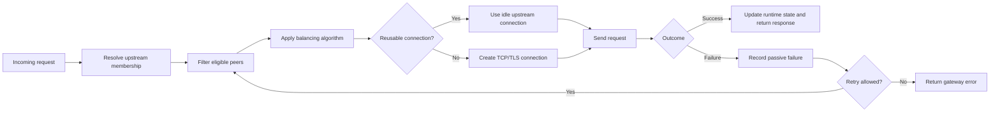

### Core invariant

> **Load balancing tidak menciptakan kapasitas. Ia hanya mendistribusikan demand ke kapasitas yang tersedia.**

Jika semua backend saturated, mengganti round robin menjadi least connections tidak menyelesaikan akar masalah. Algoritme hanya mengubah bentuk distribusi dan failure.

### Architecture equation

```text
Effective capacity
≈ sum(eligible backend capacity)
  - protocol overhead
  - connection establishment overhead
  - imbalance loss
  - retry amplification
  - dependency bottlenecks
```

---

## Upstream bukan sekadar daftar server

Konfigurasi sederhana:

```nginx
upstream quote_api {
    server quote-api-1.internal:8080;
    server quote-api-2.internal:8080;
}

server {
    listen 443 ssl;

    location /api/quotes/ {
        proxy_pass http://quote_api;
    }
}
```

Terlihat seperti daftar dua server, tetapi runtime NGINX harus mempertahankan atau memperoleh informasi berikut:

- alamat peer;
- weight;
- jumlah active connections;
- passive failure counters;
- waktu peer dianggap unavailable;
- idle keepalive connections;
- hasil DNS dan expiry-nya;
- optional shared state antarworker;
- optional active-health state;
- optional runtime changes pada produk/controller tertentu.

### Empat layer yang sering tertukar

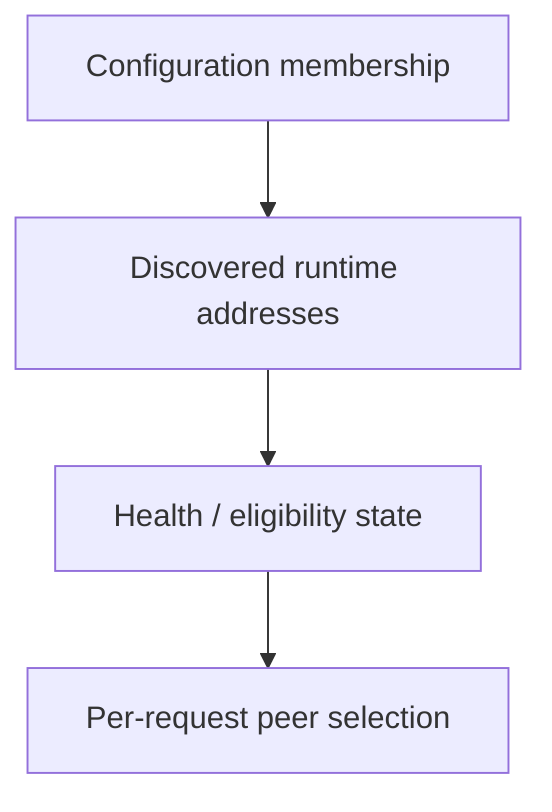

1. **Configuration membership**: nama/endpoint yang tertulis di config.
2. **Discovered addresses**: IP yang diperoleh dari DNS atau controller.
3. **Eligibility**: alamat yang dianggap dapat dipilih saat ini.
4. **Selection**: peer eligible yang dipilih untuk request tertentu.

Contoh: satu `server quote-api.default.svc.cluster.local:8080` dapat resolve menjadi ClusterIP tunggal, beberapa pod IP, atau alamat berbeda tergantung service type dan discovery pattern. “Satu baris server” tidak selalu berarti “satu backend process”.

---

## Request balancing versus connection balancing

NGINX HTTP upstream secara umum memilih peer untuk **request attempt**. Namun transport connection dapat dipakai ulang.

```text
Request A ─┐
Request B ─┼─> same upstream TCP connection, sequentially
Request C ─┘
```

Dengan HTTP/1.1 upstream biasa:

- satu koneksi hanya memproses satu request aktif pada satu waktu;
- setelah response selesai, koneksi dapat masuk idle keepalive pool;
- request berikutnya dapat memakai koneksi tersebut;
- selection statistics dan connection reuse saling memengaruhi, tetapi bukan hal yang sama.

### Konsekuensi

- round robin tidak menjamin jumlah TCP connection persis seimbang;
- idle pool per worker dapat membuat sebagian peer memiliki lebih banyak reusable connection;
- long-running request membuat active-connection count bertahan lama;
- retries menghasilkan selection attempt tambahan untuk satu client request;
- HTTP/2 downstream tidak otomatis berarti HTTP/2 upstream;
- satu client connection dapat menghasilkan banyak concurrent upstream requests.

### Invariant review

Saat membaca metric, tanyakan:

```text
Apakah angka ini menghitung:
- client connections,
- requests,
- upstream attempts,
- active upstream connections,
- idle upstream connections,
- atau application operations?
```

Mencampur unit tersebut menghasilkan capacity model yang salah.

---

## Anatomi konfigurasi upstream

```nginx
upstream order_api {
    zone order_api 256k;

    least_conn;

    server order-api-a.internal:8443 weight=3 max_conns=200
           max_fails=3 fail_timeout=10s;

    server order-api-b.internal:8443 weight=2 max_conns=150
           max_fails=3 fail_timeout=10s;

    server order-api-dr.internal:8443 backup;

    keepalive 64;
    keepalive_requests 1000;
    keepalive_timeout 30s;
}
```

### Peran directive

| Directive/parameter | Fungsi utama | Bukan jaminan |
|---|---|---|
| `zone` | Shared runtime state antarworker dalam satu NGINX instance | Shared state antarreplica/pod |
| `least_conn` | Pilih peer dengan active connections relatif paling sedikit | Pilih backend dengan CPU terendah |
| `weight` | Proporsi relatif kapasitas/traffic | Hard request quota |
| `max_conns` | Batasi active connections ke peer dalam scope state tertentu | Global distributed concurrency limit |
| `max_fails` | Threshold passive failures | Active health check |
| `fail_timeout` | Failure observation window dan unavailable interval | End-to-end request timeout |
| `backup` | Dipakai ketika primary peers unavailable | Disaster recovery orchestration lengkap |
| `keepalive` | Batas idle upstream connection cache per worker | Total connection cap |

### Configuration questions

Sebelum menambah directive, jawab:

1. State-nya per request, per worker, per NGINX instance, atau global?
2. Apakah parameter membatasi active, idle, atau total connections?
3. Apakah behavior berbeda antarversi Open Source, NGINX Plus, atau ingress controller?
4. Apakah backend identity berupa DNS name, stable VIP, atau ephemeral pod IP?
5. Siapa yang mengelola health dan endpoint lifecycle?

---

## Lifecycle pemilihan peer

Model konseptual:

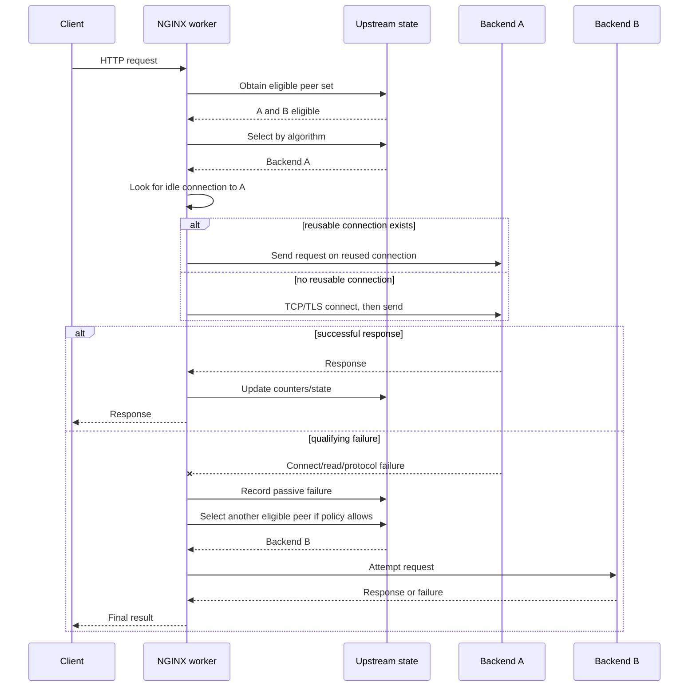

### Critical distinction

- **Peer selection** terjadi sebelum connection reuse lookup yang sesuai peer.
- **Failure classification** menentukan apakah failure dihitung dan apakah retry mungkin dilakukan.
- **Retry policy** bukan semata-mata upstream membership; detailnya dibahas Part 009.
- **Application response** seperti `500` tidak selalu berarti NGINX harus mengeluarkan peer.

---

## Weighted round robin

Round robin adalah default conceptual model untuk mendistribusikan request secara bergiliran. Weight mengubah proporsi relatif.

```nginx
upstream catalog_api {
    server catalog-a:8080 weight=3;
    server catalog-b:8080 weight=1;
}
```

Target jangka panjang kira-kira:

```text
catalog-a: 75%
catalog-b: 25%
```

Bukan berarti urutan selalu `A, A, A, B` secara kaku atau setiap window kecil tepat 75/25.

### Cocok ketika

- request cost relatif homogen;
- backend capacity relatif serupa atau bisa direpresentasikan dengan weight;
- tidak memerlukan affinity;
- latency distribution cukup stabil;
- kesederhanaan dan predictability lebih penting.

### Failure mode

- request berat dapat kebetulan terkumpul pada satu peer;
- static weight tertinggal setelah capacity backend berubah;
- backend yang “alive tetapi lambat” tetap mendapat traffic;
- connection reuse dan long requests membuat instantaneous load tidak merata;
- retry dapat menggeser traffic dari distribusi awal.

### Java/JAX-RS implication

Jika endpoint memiliki cost sangat berbeda—misalnya `GET /catalog/items/{id}` versus `POST /orders/reprice`—round robin memperlakukan keduanya sama sebagai satu request. Pisahkan upstream/routing atau gunakan capacity isolation jika cost profile berbeda ekstrem.

---

## Least connections

```nginx
upstream pricing_api {
    least_conn;

    server pricing-a:8080;
    server pricing-b:8080;
}
```

Least connections memilih peer dengan jumlah active connections relatif paling kecil, mempertimbangkan weight.

### Mental model

```text
Active connections bukan CPU usage.
Active connections bukan queue length.
Active connections bukan available Java threads.
Active connections bukan database pressure.
```

Ia hanya proxy signal.

### Cocok ketika

- request duration bervariasi;
- long-running requests signifikan;
- satu connection biasanya mewakili satu in-flight HTTP/1.x request;
- backend capacity dapat diperkirakan lewat weight;
- active connection count cukup berkorelasi dengan load.

### Risiko

1. Backend yang baru restart memiliki active count rendah dan dapat menerima burst.
2. Request ringan dan berat sama-sama dihitung satu connection.
3. Backend dapat memiliki sedikit connection tetapi semua request menunggu database lock.
4. Jika upstream protocol multiplexed, satu connection tidak lagi identik dengan satu in-flight request.
5. Per-worker state tanpa shared zone dapat mengurangi akurasi global dalam satu NGINX instance.

### Review question

> Apakah “active connection count” benar-benar merupakan load signal yang cukup baik untuk workload ini?

Jika tidak, solusi mungkin membutuhkan queue, workload partitioning, autoscaling, richer telemetry, atau service mesh/load balancer dengan signal berbeda—bukan sekadar mengganti algoritme.

---

## IP hash

```nginx
upstream legacy_session_api {
    ip_hash;

    server session-a:8080;
    server session-b:8080;
}
```

IP hash mencoba menjaga request dari client IP yang sama ke backend yang sama selama membership stabil.

### Kelebihan

- affinity sederhana;
- dapat membantu aplikasi legacy dengan in-memory session;
- tidak memerlukan cookie affinity tambahan.

### Keterbatasan besar

- banyak user di belakang NAT/proxy dapat terlihat sebagai satu IP;
- IPv6/privacy addressing mengubah karakteristik identity;
- source IP bisa salah jika real-IP trust chain salah;
- membership changes mengubah mapping;
- tidak menjamin failover mempertahankan session;
- distribusi dapat sangat skewed;
- tenant besar dapat membebani satu peer;
- IP bukan user identity yang reliable.

### Security concern

Jangan memakai `X-Forwarded-For` sebagai affinity identity tanpa trust-boundary yang benar. Header spoofing dapat memengaruhi routing jika NGINX menerima client-supplied identity tanpa sanitization.

### Architectural recommendation

Untuk enterprise Java service modern:

- prefer stateless service;
- simpan session/state di external store bila benar-benar diperlukan;
- gunakan explicit session-affinity mechanism hanya bila requirement terbukti;
- jangan jadikan IP hash default karena “lebih sticky”.

---

## Generic hash dan consistent hashing

```nginx
upstream tenant_partitioned_api {
    hash $http_x_tenant_id consistent;

    server tenant-a:8080;
    server tenant-b:8080;
    server tenant-c:8080;
}
```

Generic hash memetakan key ke peer. `consistent` mengurangi remapping ketika membership berubah dibanding modulo hash sederhana.

### Candidate keys

- tenant ID;
- shard ID;
- cache key;
- stable resource partition;
- explicit routing key yang sudah divalidasi.

### Jangan langsung hash header mentah

```nginx
# Dangerous when the header is client-controlled and untrusted.
hash $http_x_tenant_id consistent;
```

Lebih aman:

1. identity diverifikasi oleh trusted authentication layer;
2. client-supplied header dihapus;
3. trusted layer menetapkan canonical tenant header;
4. NGINX hanya mempercayai header dari upstream proxy tertentu;
5. missing/invalid key memiliki deterministic fallback.

### Consistent hashing bukan replication

Jika tenant dipetakan ke satu backend yang menyimpan state lokal:

- backend failure tetap kehilangan state lokal;
- rolling restart tetap memindahkan sebagian key;
- scaling event tetap meremap subset traffic;
- hotspot tenant tetap hotspot;
- data consistency harus diselesaikan di application/storage layer.

### Cocok ketika

- locality/caching memiliki value tinggi;
- backend bersifat stateless atau state direplikasi;
- routing key terpercaya dan stabil;
- skew dapat dimonitor;
- membership churn tidak terlalu tinggi.

---

## Random dan power of two choices

Random selection menghindari kebutuhan scanning seluruh peer set pada skala besar. Variasi “random two” memilih dua kandidat lalu membandingkan berdasarkan least-connections atau metric yang didukung.

Mental model **power of two choices**:

```text
1. pilih dua peer secara acak;
2. bandingkan load signal keduanya;
3. pilih yang lebih ringan.
```

Ia sering memberikan balance yang baik dengan overhead pemilihan lebih rendah daripada global least-connections pada pool sangat besar.

### Trade-off

| Aspek | Random | Random two + least_conn |
|---|---|---|
| Selection overhead | Rendah | Rendah–sedang |
| Load awareness | Tidak | Ya, hanya antar dua kandidat |
| Determinism | Rendah | Rendah |
| Cocok untuk pool besar | Ya | Ya |
| Session affinity | Tidak | Tidak |

### Product/version check

Directive dan opsi tertentu berbeda antara NGINX Open Source dan NGINX Plus. Misalnya metric `least_time` berada pada capability komersial. Selalu validasi exact binary/controller dan dokumentasinya.

---

## Decision matrix algoritme

| Workload characteristic | Baseline candidate | Alasan | Red flags |
|---|---|---|---|
| Request cost homogen | Weighted round robin | Simple, predictable | Slow peer tetap menerima share |
| Request duration bervariasi | Least connections | Active connections menjadi rough load signal | DB/thread saturation tidak terlihat |
| Legacy in-memory session | IP hash sementara | Affinity sederhana | NAT skew, failover/session loss |
| Cache/shard locality | Consistent hash | Mengurangi remapping | Hot key, untrusted key |
| Pool sangat besar | Random two | Good balance dengan selection cost rendah | Observability lebih sulit dijelaskan |
| Unequal backend capacity | Any weighted method | Weight mewakili kapasitas relatif | Weight drift dari real capacity |
| Stateful operation dengan strict owner | Jangan hanya mengandalkan LB | Butuh ownership/routing architecture | Peer failure dan resharding |

### Better decision process

1. Identifikasi unit cost request.
2. Identifikasi state/affinity requirement.
3. Ukur distribution dan tail latency.
4. Validasi signal yang digunakan algoritme.
5. Simulasikan peer failure dan scale-out.
6. Pastikan observability dapat menjelaskan selected peer.
7. Tetapkan rollback ke algoritme sederhana.

---

## Weight sebagai model kapasitas

Weight adalah **ratio**, bukan capacity unit absolut.

```nginx
upstream quote_api {
    server quote-large:8080 weight=4;
    server quote-small:8080 weight=2;
}
```

Ini menyatakan `quote-large` diperkirakan memiliki sekitar dua kali relative serving capacity.

### Jangan menentukan weight hanya dari vCPU

Effective application capacity dapat dibatasi oleh:

- Java heap dan GC;
- servlet/JAX-RS executor size;
- event-loop count;
- database connection pool;
- downstream API quota;
- lock/contention;
- storage latency;
- tenant mix;
- cache warmth;
- pod CPU throttling;
- network bandwidth.

### Calibration method

```text
1. ukur sustainable throughput per backend class;
2. pastikan latency/error SLO masih terpenuhi;
3. normalisasi terhadap backend terkecil;
4. tetapkan weight ratio konservatif;
5. observasi actual traffic dan saturation;
6. revisi saat resource/runtime berubah.
```

### Failure mode: stale weights

Backend di-upgrade dari 2 vCPU menjadi 4 vCPU tetapi weight tidak berubah. Atau sebaliknya, Java heap/resource limit dikurangi tetapi weight masih tinggi. Configuration berhasil reload namun load distribution menjadi salah secara operasional.

---

## `max_conns` dan admission control lokal

```nginx
upstream inventory_api {
    zone inventory_api 128k;

    server inventory-a:8080 max_conns=100;
    server inventory-b:8080 max_conns=100;
}
```

`max_conns` membatasi jumlah active connections ke peer dalam scope state yang berlaku.

### Yang sering salah diasumsikan

`max_conns=100` bukan otomatis berarti:

- maksimal 100 request per second;
- maksimal 100 total TCP connections termasuk semua idle pool;
- maksimal 100 connections dari seluruh NGINX replicas;
- maksimal 100 application threads;
- distributed concurrency limit global.

### Scope reasoning

Jika ada:

```text
R NGINX replicas
W workers per replica
P peers
K idle keepalive slots per worker
```

Maka total possible transport connections ke backend dapat jauh lebih besar daripada satu angka yang terlihat di satu upstream block, tergantung shared zone, keepalive behavior, worker distribution, dan versi.

### Use case

- melindungi backend dengan concurrency ceiling;
- membatasi connection fan-out;
- mencegah satu peer menerima semua load setelah peer lain down;
- mengalign ingress pressure dengan Java executor/database pool.

### Failure mode

Jika semua peer mencapai active connection limit, request dapat queue di NGINX atau gagal tergantung keseluruhan policy/timeouts. Queue yang tersembunyi hanya memindahkan latency; ia tidak menghilangkan overload.

---

## Passive failure detection

Passive failure detection belajar dari traffic nyata.

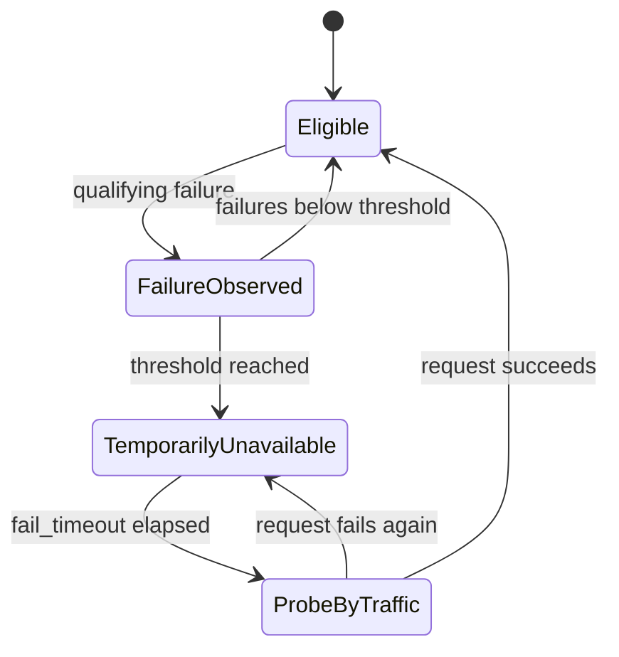

### Sumber signal

Dapat mencakup, bergantung policy:

- connection refused;
- connect timeout;
- connection reset;
- invalid upstream response;
- response timeout;
- selected HTTP status jika dikonfigurasi sebagai retry/failure condition.

### Passive detection properties

- tidak ada traffic → tidak ada observation;
- first real request dapat menjadi probe;
- failure classification sangat penting;
- setiap worker dapat memiliki view berbeda tanpa shared state;
- intermittent failures dapat menghasilkan oscillation;
- application-level “unhealthy” tidak selalu terlihat sebagai transport failure.

### False positive examples

- client membatalkan request;
- endpoint tertentu memang slow tetapi peer secara umum sehat;
- one large request melewati timeout;
- upstream returns business `503` intentionally;
- network blip singkat;
- retry-safe policy tidak sama dengan health classification.

### False negative examples

- health endpoint masih 200 tetapi database pool exhausted;
- backend menerima connection tetapi queue sangat panjang;
- satu tenant/shard rusak sementara request lain sehat;
- backend mengembalikan 500 cepat tanpa dihitung sebagai peer failure;
- dependency downstream gagal tetapi process tetap alive.

---

## `max_fails` dan `fail_timeout`

```nginx
upstream order_api {
    server order-a:8080 max_fails=3 fail_timeout=10s;
    server order-b:8080 max_fails=3 fail_timeout=10s;
}
```

Secara mental:

- `max_fails`: berapa qualifying unsuccessful attempts yang diperlukan;
- `fail_timeout`: window untuk menghitung failures **dan** periode peer dianggap unavailable setelah threshold tercapai.

### Jangan baca sebagai circuit breaker penuh

NGINX passive failure handling bukan equivalent penuh dari application circuit breaker karena:

- granularity umumnya per peer, bukan per operation/dependency;
- tidak memahami business semantics;
- tidak memiliki distributed state antarreplica secara default;
- retry dan ejection dapat berbeda scope;
- recovery test berbasis traffic/configured behavior.

### Tuning dimensions

| Setting | Terlalu agresif | Terlalu longgar |
|---|---|---|
| `max_fails` rendah | Healthy peer mudah ter-eject oleh transient error | — |
| `max_fails` tinggi | — | Broken peer terus menerima traffic |
| `fail_timeout` pendek | Flapping, repeated probe failures | — |
| `fail_timeout` panjang | — | Capacity lama tidak dipakai setelah pulih |

### Review with traffic rate

Tiga failures pada 10 requests per minute berbeda makna dari tiga failures pada 100,000 requests per second. Absolute threshold tanpa volume context dapat misleading.

---

## Single-server upstream trap

Dokumentasi NGINX menyatakan parameter passive failure tertentu pada dasarnya diabaikan ketika group hanya memiliki satu server. Alasannya: jika satu-satunya server dikeluarkan, tidak ada peer untuk melayani request.

```nginx
upstream singleton_api {
    server singleton.internal:8080 max_fails=1 fail_timeout=30s;
}
```

Jangan menganggap konfigurasi di atas memberi circuit breaker 30 detik yang robust.

### Hidden singleton patterns

- satu DNS name yang sebenarnya hanya menghasilkan satu IP;
- satu Kubernetes ClusterIP;
- satu external load balancer VIP;
- satu Service yang di belakangnya punya banyak pods;
- dua hostname yang akhirnya resolve ke VIP sama.

Dari perspektif NGINX, pool dapat terlihat singleton walaupun ada balancing di layer lain.

### Consequence

Health/ejection mungkin terjadi di layer berikutnya:

```text
NGINX -> Kubernetes Service / cloud LB -> actual backend set
```

Karena itu selalu bedakan:

- peer yang terlihat oleh NGINX;
- real serving instances di belakang peer tersebut.

---

## `backup`, `down`, drain, dan slow start

### Backup server

```nginx
upstream reporting_api {
    server report-primary-a:8080;
    server report-primary-b:8080;
    server report-dr:8080 backup;
}
```

Backup dipilih saat primary peers tidak tersedia menurut NGINX.

#### Risks

- backup mungkin cold;
- schema/config/version mungkin berbeda;
- capacity backup mungkin tidak cukup untuk full traffic;
- traffic shift dapat membanjiri dependency DR;
- state/data locality mungkin tidak cocok;
- beberapa balancing methods memiliki compatibility restrictions dengan `backup`.

### `down`

```nginx
server report-b:8080 down;
```

Menandai peer tidak eligible secara konfigurasi. Cocok untuk controlled removal, tetapi pada static config memerlukan rollout/reload.

### Drain

Drain berarti:

```text
stop receiving new work
while allowing in-flight work/connections to finish
```

Mekanisme drain berbeda menurut produk/controller. Jangan menyamakan:

- mark peer down;
- remove endpoint;
- terminate pod;
- close idle keepalive;
- wait for active request completion;
- cloud target deregistration delay.

### Slow start

Slow start secara bertahap menaikkan effective weight peer yang baru pulih/bergabung. Capability ini terkait NGINX Plus, bukan sesuatu yang boleh diasumsikan tersedia di semua binary/controller.

Tanpa slow start, peer yang baru pulih dapat menerima share penuh sekaligus saat:

- JVM masih warming up;
- JIT belum mature;
- caches masih cold;
- database pools baru dibangun;
- lazy initialization masih berlangsung.

---

## Active health check dan batas produk

Active health check mengirim probe terpisah dari client traffic.

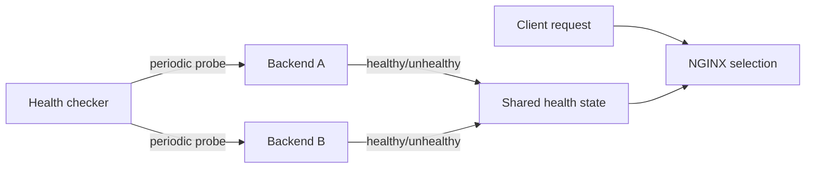

### Capability boundary

- NGINX Open Source menyediakan passive failure detection.
- NGINX Plus menyediakan active health checks dan runtime features tambahan.
- Ingress controller dapat memiliki behavior/capability berbeda berdasarkan implementasi dan edition.
- Cloud load balancer dapat menjalankan health check sendiri, independent dari NGINX.

Jangan menulis “NGINX health check” tanpa menyebut:

```text
which NGINX product/controller,
which layer,
which endpoint,
which success criteria,
and who owns the state.
```

### Health endpoint design

Health endpoint idealnya memiliki purpose jelas:

| Endpoint type | Menjawab |
|---|---|
| Liveness | Apakah process perlu direstart? |
| Readiness | Apakah instance boleh menerima traffic baru? |
| Startup | Apakah initialization belum selesai? |
| Deep dependency health | Apakah dependency tertentu tersedia? |
| Synthetic business check | Apakah critical flow benar-benar bekerja? |

Jangan menjadikan satu endpoint memikul semua semantics. Deep health yang terlalu sensitif dapat mengeluarkan seluruh fleet karena satu shared dependency down, memperparah outage.

---

## Readiness bukan health check NGINX

Kubernetes readiness mengendalikan apakah pod masuk ke endpoint set Service. Passive state NGINX mengendalikan eligibility peer yang **terlihat NGINX**.

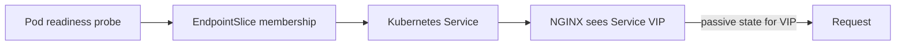

Jika NGINX menarget ClusterIP:

- NGINX biasanya tidak melihat individual pod readiness state;
- Kubernetes dataplane memilih ready endpoint;
- NGINX passive failure state melekat pada Service VIP, bukan tiap pod.

Jika NGINX/controller menarget pod endpoints langsung:

- endpoint membership mengikuti controller/API watch;
- readiness changes dapat langsung mengubah generated upstream;
- per-pod observability dan ejection lebih granular;
- endpoint churn dan configuration update rate meningkat.

### Four independent health planes

1. cloud load balancer health terhadap NGINX/controller pods/nodes;
2. NGINX/controller health terhadap backend target;
3. Kubernetes readiness terhadap application pods;
4. application dependency health terhadap DB/Kafka/external systems.

A healthy status pada satu plane tidak membuktikan plane lain sehat.

---

## Shared upstream state dengan `zone`

```nginx
upstream quote_api {
    zone quote_api 256k;

    least_conn;
    server quote-a:8080;
    server quote-b:8080;
}
```

`zone` menyimpan configuration/runtime state upstream dalam shared memory yang dapat diakses worker processes pada **satu NGINX instance**.

### Tanpa shared zone

Setiap worker dapat memiliki counters/state sendiri:

```text
Worker 1 thinks A has fewer connections.
Worker 2 independently thinks B has fewer connections.
Worker 3 has different passive-failure history.
```

### Dengan shared zone

- peer state lebih konsisten antarworker;
- active connection information dapat dibagi;
- passive failure state dapat lebih coherent;
- dynamic resolution features tertentu memerlukan shared zone.

### Batas penting

`zone` tidak otomatis berbagi state antara:

- NGINX pod A dan pod B;
- VM A dan VM B;
- region A dan region B;
- ingress-controller replica A dan B.

Setiap replica masih dapat mengambil keputusan berbeda.

### Sizing

Shared zone harus cukup untuk metadata peer dan runtime state. Jangan copy angka tanpa mempertimbangkan:

- jumlah peers;
- resolved addresses per hostname;
- feature set;
- certificate/runtime metadata pada capability tertentu;
- version/product documentation.

---

## Upstream keepalive mental model

Tanpa reuse:

```text
request -> TCP connect -> optional TLS handshake -> HTTP exchange -> close
```

Dengan keepalive:

```text
request 1 -> connect/handshake -> exchange -> idle cache
request 2 -> reuse -> exchange -> idle cache
request 3 -> reuse -> exchange -> idle cache
```

### Basic configuration

```nginx
upstream quote_api {
    server quote-a:8080;
    server quote-b:8080;

    keepalive 64;
}

location /api/quotes/ {
    proxy_pass http://quote_api;
    proxy_http_version 1.1;
    proxy_set_header Connection "";
}
```

Untuk versi lama, explicit HTTP/1.1 dan clearing `Connection` sangat penting. Dokumentasi NGINX modern mencatat default upstream keepalive behavior berubah pada versi baru; jangan mengandalkan current default jika estate Anda memiliki versi lama atau controller-generated config.

### `keepalive N` berarti apa?

Secara konseptual, `N` adalah maximum **idle** keepalive connections yang disimpan dalam cache **per worker process** untuk upstream group.

Ia bukan:

- maximum active connections;
- total connection cap;
- pool size per backend secara fixed;
- distributed pool across replicas;
- guarantee bahwa N connections selalu tersedia.

### Why it matters

Benefits:

- mengurangi TCP handshake;
- mengurangi TLS handshake upstream;
- menurunkan latency dan CPU;
- mengurangi ephemeral port churn;
- mengurangi SYN pressure;
- meningkatkan throughput pada short requests.

Costs:

- idle file descriptors;
- idle connections di backend;
- uneven pool distribution;
- stale/broken idle sockets;
- connection budget membesar dengan workers × replicas;
- backend dapat melihat banyak idle connections walau traffic rendah.

---

## Pool sizing dan connection budget

Definisikan:

```text
R = jumlah NGINX replicas
W = worker processes per replica
K = keepalive idle slots per worker per upstream
A = peak active upstream connections per replica
```

Upper-bound kasar idle cache:

```text
Idle connections across fleet <= R × W × K
```

Total transport footprint kasar:

```text
Total upstream connections ≈ fleet active + fleet idle
                           ≈ (R × A) + (R × W × K)
```

Ini bukan formula exact karena:

- cache dibagi di antara peers;
- tidak semua slot selalu terisi;
- active connections dapat melebihi idle limit;
- connection closes/races terjadi;
- each upstream group memiliki cache sendiri;
- controller implementation/version dapat berbeda.

### Example

```text
6 ingress pods
4 workers per pod
keepalive 64
```

Potential idle slots:

```text
6 × 4 × 64 = 1,536 idle upstream connections
```

Jika ada 20 application upstream groups dengan traffic cukup untuk mengisi pool, footprint dapat jauh lebih besar. Backend Java dan node/network limits harus sanggup menampungnya.

### Capacity checklist

Periksa:

- NGINX worker count;
- number of replicas;
- number of upstream groups;
- backend max connections;
- Java connector/accept backlog;
- OS file-descriptor limits;
- conntrack/NAT capacity;
- cloud LB idle behavior;
- TLS memory per connection;
- database pool—jangan disamakan dengan HTTP connection limit.

---

## `keepalive_requests`, `keepalive_time`, dan `keepalive_timeout`

Tiga control berbeda:

| Directive | Mental model |
|---|---|
| `keepalive_requests` | Maksimum request yang boleh melewati satu upstream connection sebelum ditutup |
| `keepalive_time` | Maksimum total lifetime connection sejak dibuat |
| `keepalive_timeout` | Berapa lama idle connection disimpan sebelum ditutup |

### Why rotate connections

Connection yang hidup selamanya dapat:

- mempertahankan memory allocations;
- menyembunyikan endpoint changes;
- mempertahankan old TLS session/certificate path;
- mengurangi fairness;
- memperpanjang exposure ke broken middlebox state;
- menghambat drain bila lifecycle tidak dikelola.

### Terlalu pendek

- frequent TCP/TLS handshakes;
- CPU dan latency meningkat;
- ephemeral port churn;
- connection storm saat load tinggi.

### Terlalu panjang

- idle connection accumulation;
- backend FD pressure;
- stale connection reuse;
- rollout/drain lebih lambat;
- uneven peer reuse.

### Validation

Ukur:

```text
new upstream connections / request
TLS handshakes / second
upstream connect time
connection resets on reuse
backend established/idle sockets
```

Jangan tuning hanya berdasarkan satu benchmark latency.

---

## Java/JAX-RS connection pressure

NGINX connection model harus dipetakan ke runtime Java.

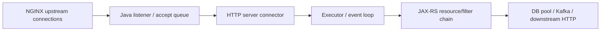

### Servlet/blocking stack

Satu in-flight request sering memegang worker thread selama business processing. Banyak upstream connections dapat menghabiskan:

- request threads;
- queue capacity;
- memory per request;
- database connections;
- downstream HTTP connections.

### Reactive/non-blocking stack

Banyak connections dapat ditangani event loop lebih efisien, tetapi blocking call tersembunyi dapat mengunci event loop dan menyebabkan latency collapse.

### Important inequality

```text
Accepted HTTP concurrency
must not greatly exceed
sustainable application concurrency
```

Kalau NGINX mengizinkan 5,000 concurrent upstream requests tetapi application hanya sustain 200 active DB-backed operations, sisanya menjadi queue/timeout/retry amplification.

### JAX-RS filter cost

Sebelum resource method, request dapat melewati:

- authentication;
- authorization;
- body deserialization;
- validation;
- tracing;
- logging;
- tenant context;
- rate-limit checks.

Backend dapat saturated sebelum business method dipanggil.

---

## Backend concurrency dan database pool coupling

Misalkan:

```text
Java request threads = 200
DB pool = 40
Typical DB hold time = 150 ms
Incoming concurrency = 300
```

Walau HTTP layer menerima 200 request aktif, hanya sekitar 40 dapat memakai DB secara bersamaan. Sisanya menunggu pool atau melakukan non-DB work.

### Queue layering anti-pattern

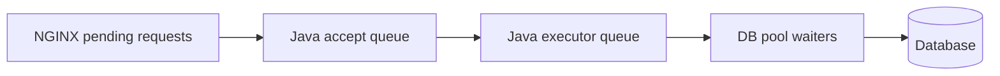

Setiap queue:

- menambah latency;
- menyembunyikan overload;
- memiliki timeout sendiri;
- dapat membentuk retry storm;
- membuat 504 muncul jauh dari bottleneck asli.

### Little’s Law approximation

```text
Concurrency ≈ Throughput × Average response time
```

Jika target 1,000 requests/s dan average upstream response 100 ms:

```text
Expected average in-flight ≈ 1,000 × 0.1 = 100
```

Gunakan tail latency juga. P99 2 detik saat spike dapat membuat instantaneous concurrency jauh lebih tinggi.

### Architecture principle

Connection limit NGINX, Java executor, DB pool, downstream pool, dan autoscaling target harus dirancang sebagai satu **capacity chain**, bukan tuning terpisah.

---

## Static upstream versus DNS-discovered upstream

### Static addresses

```nginx
upstream static_pool {
    server 10.10.10.11:8080;
    server 10.10.10.12:8080;
}
```

Pros:

- explicit;
- deterministic;
- no runtime DNS dependency.

Cons:

- configuration drift;
- reload diperlukan ketika membership berubah;
- tidak cocok untuk ephemeral pod IP;
- operational ownership tinggi.

### Hostname resolved at configuration lifecycle

```nginx
upstream named_pool {
    server quote-api.internal:8080;
}
```

Behavior harus diverifikasi terhadap exact NGINX version dan directive. Historical NGINX configurations sering resolve hostname pada startup/reload, lalu mempertahankan alamat sampai reload. Dynamic re-resolution memerlukan configuration pattern/capability yang tepat.

### Stable VIP

```nginx
upstream service_vip_pool {
    server quote-api.default.svc.cluster.local:8080;
}
```

Jika DNS resolve ke stable ClusterIP:

- NGINX melihat satu peer/VIP;
- Kubernetes melakukan backend selection;
- pod membership berubah tanpa NGINX re-resolution selama ClusterIP tetap;
- NGINX kehilangan per-pod visibility.

### Direct DNS endpoints

Headless Service atau service-discovery DNS dapat menghasilkan banyak A/AAAA records. Ini memberi direct endpoint visibility tetapi membawa endpoint churn, TTL, negative caching, dan graceful-removal concerns.

---

## Dynamic DNS re-resolution

Contoh modern:

```nginx
resolver 10.96.0.10 valid=10s ipv6=off;

upstream quote_api {
    zone quote_api 256k;

    server quote-api.default.svc.cluster.local:8080 resolve;
}
```

### Requirements mental model

- runtime resolver harus dikonfigurasi;
- upstream state umumnya memerlukan shared memory `zone` untuk dynamic membership;
- DNS TTL atau `valid` memengaruhi refresh interval;
- NXDOMAIN/timeouts harus dimodelkan;
- old addresses perlu dikeluarkan safely;
- new addresses perlu masuk tanpa traffic avalanche.

### Version boundary

Dynamic DNS `resolve` pada upstream server sebelumnya merupakan capability komersial, lalu tersedia di NGINX Open Source modern. Estate lama tidak boleh diasumsikan memiliki behavior yang sama. Catat exact version dan build flags.

### Resolver security

Runtime DNS adalah control-plane input ke data plane. Risiko:

- DNS poisoning;
- compromised resolver;
- split-horizon mismatch;
- stale record;
- short TTL causing query storm;
- negative response causing outage;
- untrusted search domain expansion.

Gunakan trusted local resolver dan observability DNS yang memadai.

### Failure matrix

| DNS event | Possible effect |
|---|---|
| Record berubah | Traffic pindah setelah refresh |
| TTL terlalu panjang | Stale endpoint tetap dipakai |
| TTL terlalu pendek | Resolver/query load meningkat |
| NXDOMAIN sementara | Membership bisa kosong/old state behavior bergantung config |
| Resolver unreachable | Refresh gagal; old state atau failure bergantung runtime |
| Partial record set | Traffic skew/capacity loss |

Detail lebih dalam dibahas pada Part 025.

---

## Kubernetes Service sebagai stable abstraction

Topology:

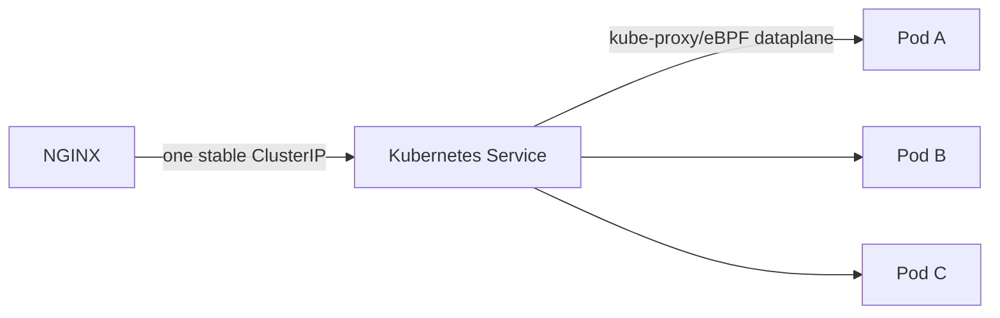

### Advantages

- stable name dan virtual IP;
- Kubernetes readiness mengontrol endpoint membership;
- pod churn disembunyikan dari NGINX;
- config sederhana;
- controller tidak perlu meregenerate upstream per pod change;
- native service abstraction.

### Disadvantages

- double load balancing;
- NGINX melihat satu upstream peer;
- passive failure state tidak granular per pod;
- per-pod upstream metrics hilang/sulit;
- connection reuse dapat interact dengan dataplane selection;
- source IP dan topology behavior bergantung implementation;
- session affinity dapat terjadi pada layer berbeda.

### When reasonable

- backend stateless;
- Kubernetes Service dataplane reliable;
- tidak membutuhkan per-pod NGINX policy;
- readiness memadai;
- simplicity lebih bernilai daripada granular control.

---

## Direct pod endpoint routing

Topology:

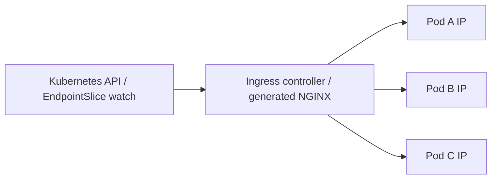

### Advantages

- NGINX memilih pod secara langsung;
- per-pod balancing/metrics;
- passive state lebih granular;
- menghindari second balancing hop;
- richer canary/affinity controls pada controller tertentu.

### Costs

- controller harus watch Kubernetes API;
- endpoint changes memicu config/runtime updates;
- rollout churn tinggi;
- terminating pod coordination kritis;
- larger upstream sets;
- more direct connections and health state;
- controller-specific semantics.

### Ingress-controller note

Community `ingress-nginx`, F5 NGINX Ingress Controller, dan controller lain tidak identik. Mereka dapat menghasilkan konfigurasi berbeda, memakai template berbeda, dan menawarkan annotations/CRDs/capabilities berbeda.

Selalu inspeksi **rendered NGINX configuration**, bukan hanya Ingress YAML.

---

## Double load balancing di Kubernetes

Ketika NGINX menarget Service VIP:

```text
Selection 1: NGINX chooses Service VIP peer
Selection 2: Kubernetes dataplane chooses pod endpoint
```

Jika upstream group memiliki beberapa Service VIP/regions, dapat ada lebih banyak layer.

### Why this matters

- least_conn di NGINX tidak melihat active connections per pod;
- NGINX may reuse a connection whose dataplane path remains pinned to one pod;
- passive failure can mark VIP, not failing pod;
- log `$upstream_addr` may show ClusterIP, not pod IP;
- load distribution differs by kube-proxy/IPVS/eBPF/connection tracking;
- session affinity can stack unexpectedly.

### Example hidden imbalance

```text
NGINX opens 20 long-lived keepalive connections to Service VIP.
Dataplane maps 8 of them to Pod A, 6 to Pod B, 6 to Pod C.
Future requests reuse those mappings.
Pod-level request distribution may remain skewed.
```

The exact behavior depends on dataplane and connection tuple handling.

### Review decision

Document explicitly:

```text
Does NGINX balance to:
- individual pods,
- ClusterIP,
- NodePort,
- external LB VIP,
- VM instances,
- or another proxy?
```

Without this, algorithm discussions are incomplete.

---

## Endpoint churn dan graceful termination

Pod rollout lifecycle ideal:

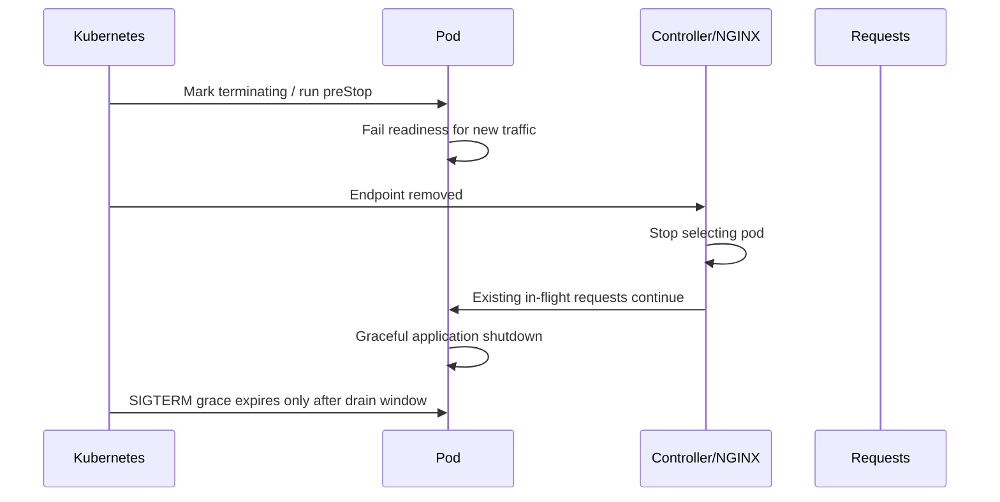

### Race conditions

1. Pod receives SIGTERM before endpoint removal propagates.
2. NGINX still has idle keepalive connection to terminating pod.
3. Controller update/reload lags endpoint change.
4. Cloud load balancer still routes to terminating ingress pod.
5. Java stops accepting new connections too early.
6. Long-running request exceeds termination grace period.
7. DNS TTL preserves removed IP.

### Java shutdown contract

Java service should:

- mark readiness false before full shutdown;
- stop admitting new work;
- drain in-flight requests;
- close listener after drain policy;
- coordinate database/Kafka consumers separately;
- expose shutdown metrics/logs;
- fit within `terminationGracePeriodSeconds`.

### Keepalive drain

Removing a peer from new selection does not necessarily explain what happens to existing idle/active connections. Test actual controller/version behavior during rolling deployment.

---

## Session affinity dan stateful backend

Affinity mechanisms may live at multiple layers:

```text
Cloud LB cookie/source IP
-> NGINX hash/cookie
-> Kubernetes Service sessionAffinity
-> application session routing
```

Stacked affinity can produce severe skew.

### Questions before enabling affinity

1. Apa state yang harus tetap pada backend yang sama?
2. Berapa lama affinity harus bertahan?
3. Apa behavior saat backend down?
4. Apakah session store external tersedia?
5. Apakah affinity key client-controlled?
6. Bagaimana multi-region failover bekerja?
7. Apakah traffic tenant besar akan hotspot?
8. Bagaimana rollout/version compatibility dijaga?

### JAX-RS recommendation

Untuk RESTful backend enterprise:

- keep resource processing stateless jika memungkinkan;
- gunakan database/distributed cache untuk durable shared state;
- gunakan explicit idempotency key untuk retried writes;
- jangan memakai load-balancer stickiness untuk menyelesaikan transaction ownership;
- workflow/order state harus memiliki authoritative store.

### Sticky session is not correctness

Affinity adalah routing preference, bukan guarantee. Correctness tidak boleh bergantung pada peer yang selalu sama kecuali architecture memiliki failover/ownership protocol yang eksplisit.

---

## Upstream TLS interaction

HTTPS upstream:

```nginx
upstream secure_quote_api {
    server quote-api.internal:8443;
    keepalive 64;
}

location /api/quotes/ {
    proxy_pass https://secure_quote_api;

    proxy_ssl_server_name on;
    proxy_ssl_name quote-api.internal;
    proxy_ssl_verify on;
    proxy_ssl_trusted_certificate /etc/nginx/ca/internal-ca.pem;
    proxy_ssl_verify_depth 2;
}
```

### Load-balancing implications

- certificate SAN harus cocok dengan `proxy_ssl_name`, bukan necessarily peer IP;
- all peers harus memiliki compatible identity/certificate;
- TLS handshake cost memperbesar value keepalive;
- certificate rotation dapat memengaruhi only new connections sementara old connections tetap hidup;
- SNI dapat menentukan virtual backend pada shared endpoint;
- one misconfigured certificate can make only subset of peers fail;
- passive failure counters dapat eject peer karena TLS handshake failure.

### mTLS upstream

Jika NGINX menyajikan client certificate ke backend:

```nginx
proxy_ssl_certificate     /etc/nginx/client/tls.crt;
proxy_ssl_certificate_key /etc/nginx/client/tls.key;
```

Semua NGINX replicas memegang private key identity. Scope, rotation, filesystem permissions, secret distribution, dan auditability menjadi architecture concerns.

Detail lengkap ada di Part 007.

---

## Observability contract

Minimum access log fields untuk upstream analysis:

```nginx
log_format upstream_json escape=json
  '{'
    '"ts":"$time_iso8601",'
    '"request_id":"$request_id",'
    '"method":"$request_method",'
    '"uri":"$uri",'
    '"status":$status,'
    '"request_time":$request_time,'
    '"upstream_addr":"$upstream_addr",'
    '"upstream_status":"$upstream_status",'
    '"upstream_connect_time":"$upstream_connect_time",'
    '"upstream_header_time":"$upstream_header_time",'
    '"upstream_response_time":"$upstream_response_time",'
    '"upstream_bytes_received":"$upstream_bytes_received"'
  '}';
```

### Multi-attempt values

Variables seperti `$upstream_addr`, `$upstream_status`, dan timing dapat berisi beberapa values ketika request mencoba lebih dari satu upstream.

Contoh konseptual:

```text
upstream_addr:          10.0.1.10:8080, 10.0.1.11:8080
upstream_status:        502, 200
upstream_connect_time:  0.002, 0.001
upstream_response_time: 0.010, 0.087
```

Jangan parse sebagai scalar tunggal.

### Required dashboards

1. request rate per upstream group;
2. status distribution per upstream;
3. connect/header/response latency percentiles;
4. upstream attempts per client request;
5. selected peer distribution;
6. active and idle connections where exposed;
7. peer unavailable/ejection events;
8. DNS resolution errors;
9. connection resets/refused/timeouts;
10. backend Java saturation metrics;
11. readiness endpoint changes;
12. controller reload/update failures.

### Correlation

A useful trace chain:

```text
edge request ID
-> NGINX access log
-> chosen upstream address
-> Java access/application log
-> trace ID/span
-> DB/Kafka/downstream telemetry
```

### Cardinality warning

Pod IP, request path, tenant ID, and exception message can create high-cardinality metrics. Keep detail in logs/traces; aggregate metrics on bounded labels.

---

## Capacity model dan ejection cascade

Misalkan tiga peers masing-masing sustain 1,000 rps:

```text
Normal total capacity = 3,000 rps
Incoming demand       = 2,700 rps
Utilization           = 90%
```

Satu peer ter-eject:

```text
Remaining capacity = 2,000 rps
Demand             = 2,700 rps
Overload           = 700 rps
```

Remaining peers overload, latency naik, timeouts bertambah, lalu passive failures dapat eject peer berikutnya. Ini adalah **ejection cascade**.

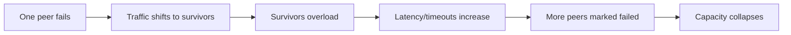

### Availability headroom invariant

Fleet harus punya kapasitas untuk failure domain yang diharapkan:

```text
N+1, zone loss, node loss, pod disruption, or regional failover
```

Load balancing policy tidak dapat mengganti headroom.

### Retry amplification

Jika average attempts per request menjadi 1.4:

```text
2,700 client rps × 1.4 = 3,780 upstream attempts/s
```

Retry dapat membuat demand internal melebihi original external demand. Detail guardrail dibahas Part 009.

---

## Failure mode catalogue

| Symptom | Likely upstream mechanism | What to verify |
|---|---|---|
| Uneven request count | Weight/hash/affinity/connection reuse | Algorithm, key distribution, peer metrics |
| One peer never used | `down`, `backup`, failed state, weight/config issue | Rendered config and runtime state |
| 502 connection refused | Process not listening, stale endpoint, wrong port | Pod/process/listener/service targetPort |
| Intermittent 502 during rollout | Endpoint termination race, stale keepalive | Readiness, preStop, drain, endpoint propagation |
| 503 from NGINX | No eligible/live upstream, limits, generated config issue | Error log and upstream membership |
| 504 | Backend slow or timeout chain | Connect/header/response timings and Java saturation |
| New backend overloaded | Low active count, cold start, no slow start | Warm-up, JIT, caches, weight ramp |
| Traffic skew behind Service VIP | Double LB and connection reuse | Pod-level request metrics and dataplane |
| Peer remains stale | DNS not dynamically resolved, TTL/reload issue | Resolver config, version, DNS answers |
| Massive backend sockets | Fleet × workers × keepalive | Connection budget and FD metrics |
| TLS fails only on one peer | SAN/chain/key/config mismatch | Per-peer `openssl s_client`, SNI, certificate |
| Session loss after failover | State local to peer | Session store and affinity semantics |
| All peers eject after shared DB outage | Deep health/passive cascade | Dependency health semantics and headroom |
| NGINX sees healthy but app unusable | Transport alive, application saturated | Thread/DB pool/queue metrics |

---

## Debugging playbook

### Step 1 — Draw the actual topology

Do not start from the desired architecture. Record observed path:

```text
Client
-> DNS
-> cloud/on-prem LB
-> NGINX replica
-> upstream address logged by NGINX
-> Service/VIP or direct pod
-> Java listener
-> JAX-RS endpoint
```

### Step 2 — Inspect effective configuration

Standalone NGINX:

```bash
nginx -T
```

Container/Kubernetes:

```bash
kubectl exec -n <namespace> <nginx-pod> -- nginx -T
```

Look for:

```text
upstream block
balancing directive
server parameters
zone
keepalive
proxy_pass
proxy_http_version
proxy_next_upstream
resolver
TLS settings
```

Do not trust only source templates/Helm values.

### Step 3 — Identify what `$upstream_addr` represents

```bash
kubectl logs -n <namespace> <nginx-pod> | grep '<request-id>'
```

Determine whether address is:

- pod IP;
- ClusterIP;
- NodePort node IP;
- VM;
- external LB;
- another proxy.

### Step 4 — Test each peer directly

HTTP:

```bash
curl -sv --connect-timeout 2 http://10.0.1.10:8080/health/ready
```

HTTPS with SNI:

```bash
curl -sv \
  --resolve quote-api.internal:8443:10.0.1.10 \
  https://quote-api.internal:8443/health/ready
```

From inside the NGINX network namespace where possible.

### Step 5 — Inspect DNS

```bash
dig +short quote-api.default.svc.cluster.local
getent ahosts quote-api.default.svc.cluster.local
```

Inside Kubernetes:

```bash
kubectl exec -n <namespace> <nginx-pod> -- \
  getent ahosts quote-api.default.svc.cluster.local
```

Compare:

- answer set;
- TTL;
- resolver IP;
- NGINX runtime behavior;
- current EndpointSlices.

### Step 6 — Inspect Service and endpoints

```bash
kubectl get svc -n <namespace> quote-api -o yaml
kubectl get endpointslice -n <namespace> \
  -l kubernetes.io/service-name=quote-api -o yaml
kubectl get pods -n <namespace> -l app=quote-api -o wide
```

Verify:

- ready endpoints;
- target port;
- address family;
- terminating endpoints;
- topology hints/policies;
- selector accuracy.

### Step 7 — Compare NGINX and Java metrics

Correlate a time window:

```text
NGINX upstream connect errors
NGINX per-peer request distribution
Java accepted connections
Java active threads/event-loop lag
Java queue length
DB pool active/waiting
GC pause and CPU throttling
application error rate
```

### Step 8 — Inspect sockets

Inside NGINX pod/host:

```bash
ss -tanp
ss -s
```

Useful views:

```bash
ss -tan state established '( dport = :8080 or dport = :8443 )'
ss -tan state time-wait
```

Check:

- established count;
- SYN-SENT;
- TIME-WAIT;
- retransmission indicators;
- source port exhaustion;
- connection concentration per peer.

### Step 9 — Reproduce selection behavior

Run controlled requests with request IDs:

```bash
for i in $(seq 1 20); do
  curl -sS -H "X-Request-ID: lb-test-$i" \
    https://api.example.com/debug/backend
  echo
 done
```

A temporary non-production debug endpoint can return instance ID, but protect it and remove sensitive data.

### Step 10 — Test failure intentionally in non-production

Scenarios:

1. stop one backend listener;
2. make readiness fail;
3. inject latency;
4. rotate pod;
5. change DNS record;
6. exhaust Java thread pool;
7. exhaust DB pool;
8. break one peer certificate;
9. reduce termination grace period;
10. scale NGINX replicas.

Observe selection, logs, retries, failover, recovery, and client-visible status.

---

## Security considerations

### 1. DNS is routing authority

Compromised resolver or record can redirect service traffic. Use trusted resolver, network policy, private zones, and certificate verification.

### 2. Hash keys are trust-boundary inputs

Tenant/user headers used for routing must be canonical and protected against spoofing.

### 3. Direct pod routing changes segmentation

NGINX must be allowed to reach pod CIDRs. NetworkPolicy/security groups/firewalls should permit only required ports and namespaces.

### 4. Health endpoints expose internals

Do not expose deep diagnostics publicly. Health response should reveal minimal information and be access-controlled where appropriate.

### 5. Upstream TLS verification

Encrypting without certificate verification allows interception by an untrusted endpoint. Enable verification and SNI intentionally.

### 6. Backup endpoint trust

DR/backup peers require the same authentication, authorization, certificate, data-protection, and audit controls as primary peers.

### 7. Runtime APIs and dynamic config

If using NGINX Plus API/controller CRDs/annotations, protect who can mutate upstream membership and weights. Routing changes are production code changes.

### 8. Log privacy

Do not log credentials, tokens, tenant identifiers, or sensitive query/body data merely to debug balancing.

---

## Performance considerations

### 1. Algorithm overhead

Usually smaller than network/application cost, but very large pools and high request rates can make selection/state-sharing overhead relevant.

### 2. Shared-memory contention

Shared `zone` improves state coherence but introduces shared-memory synchronization cost. Benchmark real topology.

### 3. Keepalive balance

Too small wastes handshakes; too large consumes sockets and can preserve skew.

### 4. Upstream TLS

Handshake cost is significant. Reuse connections, use session reuse where appropriate, and measure CPU.

### 5. DNS frequency

Very short refresh intervals increase DNS query load and runtime churn.

### 6. Direct endpoints

Large pod fleets produce large upstream sets and frequent updates. Controller CPU/reload behavior matters.

### 7. Connection fan-out

More NGINX replicas and workers can multiply backend connections even when request rate unchanged.

### 8. Slow peer

A slow-but-not-failed peer increases tail latency. Algorithm, timeout, health, and capacity controls must work together.

### 9. Cold backend

JVM/JIT/cache warm-up can cause newly started pods to look healthy before sustainable performance is reached.

### 10. Benchmark correctly

Test:

- steady state;
- connection reuse on/off;
- one peer failure;
- scale-up/down;
- long requests;
- mixed endpoint costs;
- DNS/member churn;
- TLS rotation;
- NGINX replica restart.

---

## Reference architectures

### Pattern A — Standalone NGINX to fixed Java VMs

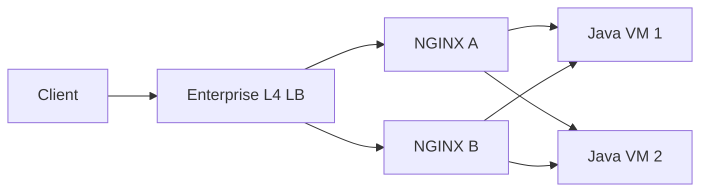

Recommended focus:

- static membership ownership;
- shared state only within each NGINX instance;
- independent health views;
- connection budget from both proxies;
- safe config reload and drain;
- external automation for server changes.

### Pattern B — NGINX to Kubernetes Service VIP

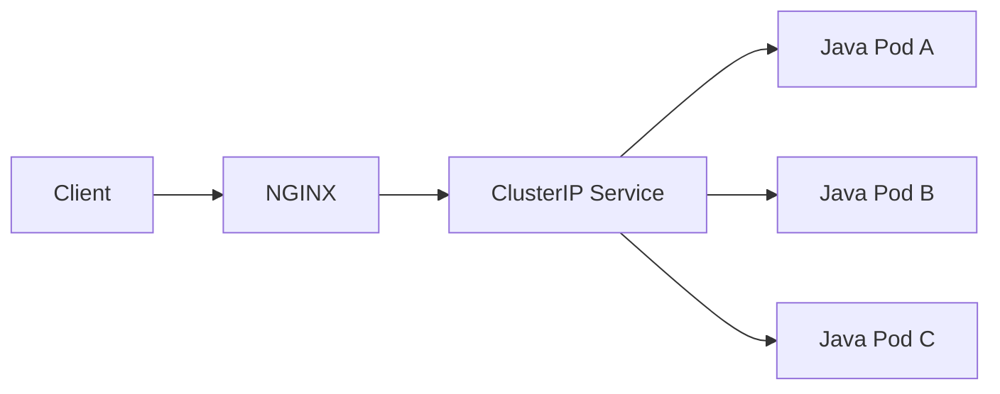

Recommended focus:

- readiness quality;
- understand double balancing;
- Service-level upstream logs;
- kube dataplane health;
- simple stable configuration.

### Pattern C — Kubernetes-aware NGINX controller to pod endpoints

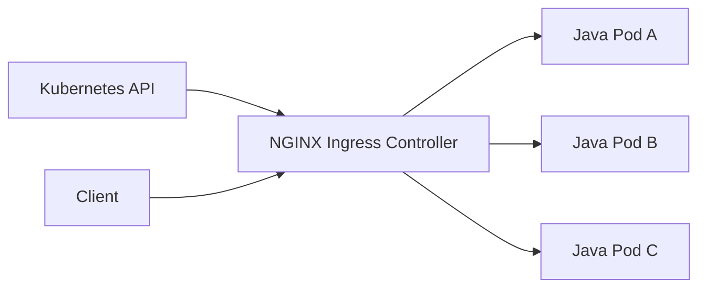

Recommended focus:

- EndpointSlice watch/update;
- rendered config/runtime state;
- rollout race testing;
- per-pod observability;
- controller-specific health and reload semantics.

### Pattern D — NGINX to internal cloud load balancer

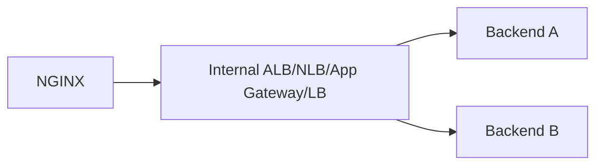

Recommended focus:

- hidden balancing layer;
- source IP and TLS identity;
- health-check ownership;
- idle timeout alignment;
- extra latency/cost;
- `$upstream_addr` only reveals ILB address.

### Pattern E — Multi-region weighted upstream

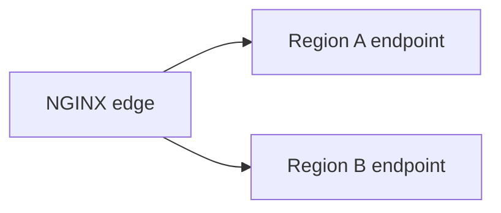

Do not implement only with weights. Also model:

- data consistency;
- latency;
- health/ejection;
- capacity after region loss;
- certificate/DNS;
- state ownership;
- regulatory/data residency constraints;
- controlled failback.

---

## PR review checklist

### Topology

- [ ] Diagram menunjukkan peer yang benar-benar dilihat NGINX.
- [ ] Jelas apakah target adalah VM, pod IP, ClusterIP, NodePort, atau another LB.
- [ ] Semua balancing layers didokumentasikan.
- [ ] Failure domain per layer teridentifikasi.

### Membership and discovery

- [ ] Source of truth membership jelas.
- [ ] Static config versus DNS/controller discovery dinyatakan.
- [ ] DNS TTL/re-resolution behavior diverifikasi terhadap exact version.
- [ ] Empty/partial membership behavior diuji.
- [ ] Endpoint removal dan rollout race diuji.

### Algorithm

- [ ] Algorithm dipilih berdasarkan workload, bukan preference.
- [ ] Weight memiliki evidence capacity.
- [ ] Hash/affinity key terpercaya dan distribusinya diukur.
- [ ] Compatibility `backup`/algorithm diverifikasi.
- [ ] Scale-out/failure remapping behavior diterima.

### Health and failover

- [ ] Passive versus active health semantics jelas.
- [ ] `max_fails`/`fail_timeout` tidak dianggap circuit breaker penuh.
- [ ] Singleton behavior dipahami.
- [ ] Readiness/liveness/startup probe semantics benar.
- [ ] Backup capacity dan warm-up diuji.
- [ ] Recovery/failback tidak menciptakan traffic avalanche.

### Connection management

- [ ] Keepalive scope per worker dipahami.
- [ ] Fleet-wide connection budget dihitung.
- [ ] Backend FD/listener/thread capacity cukup.
- [ ] `max_conns` scope dan limitation dipahami.
- [ ] TLS handshake/reuse behavior diperiksa.
- [ ] Drain behavior untuk idle/active connections diuji.

### Java/JAX-RS

- [ ] HTTP connector/executor capacity diketahui.
- [ ] DB/downstream pool bottleneck dimodelkan.
- [ ] Stateful session tidak diam-diam bergantung affinity.
- [ ] Instance readiness mewakili admission readiness.
- [ ] Graceful shutdown selesai dalam grace period.
- [ ] Instance identity dapat dikorelasikan secara aman saat debugging.

### Observability

- [ ] Log berisi upstream address, status, dan timing.
- [ ] Multi-attempt values diparse benar.
- [ ] Per-peer distribution dapat dilihat.
- [ ] DNS/controller update failures terpantau.
- [ ] NGINX metric dapat dikorelasikan ke Java/backend metrics.
- [ ] Alerts menghindari high-cardinality labels.

### Rollout and rollback

- [ ] `nginx -t`/equivalent validation ada.
- [ ] Config/rendered output direview.
- [ ] Canary/smoke test mencakup semua peers.
- [ ] Rollback membership/algorithm terdokumentasi.
- [ ] Blast radius perubahan weight/health setting dibatasi.
- [ ] Failure injection dilakukan di non-production.

---

## Internal verification checklist

Gunakan checklist ini terhadap codebase, infra repository, Helm values, manifests, cloud resources, observability, dan diskusi team. Jangan mengasumsikan item-item berikut berlaku di internal CSG.

### Product and runtime identity

- [ ] Exact NGINX binary/version diketahui.
- [ ] NGINX Open Source versus NGINX Plus dikonfirmasi.
- [ ] Ingress/controller product dan version dikonfirmasi.
- [ ] Build modules dan image provenance diketahui.
- [ ] Worker count/configuration per environment diketahui.

### Upstream definitions

- [ ] Cari semua `upstream {}` dan `proxy_pass` pada repository.
- [ ] Identifikasi generated config versus hand-written config.
- [ ] Catat upstream target: VM, hostname, ClusterIP, NodePort, pod IP, cloud LB.
- [ ] Catat algorithm, weight, `backup`, `down`, `max_conns`.
- [ ] Catat `max_fails`, `fail_timeout`, dan retry-related directives.
- [ ] Catat `zone` dan size-nya.
- [ ] Catat keepalive directives dan effective defaults.

### Kubernetes

- [ ] Periksa Service type, selector, ports, dan `targetPort`.
- [ ] Periksa EndpointSlices saat normal dan rollout.
- [ ] Periksa readiness/liveness/startup probes.
- [ ] Periksa `terminationGracePeriodSeconds` dan `preStop`.
- [ ] Periksa PDB, rolling-update strategy, dan max unavailable.
- [ ] Tentukan apakah controller routes ke Service atau endpoints.
- [ ] Inspeksi rendered NGINX config di controller pod.
- [ ] Periksa controller reload/config-update metrics.

### DNS and service discovery

- [ ] Resolver IP/source of truth diketahui.
- [ ] Split-horizon/private DNS behavior dikonfirmasi.
- [ ] TTL dan negative-cache behavior diperiksa.
- [ ] Dynamic `resolve` support diverifikasi terhadap version.
- [ ] Stale-IP incident/runbook dicari.
- [ ] DNS failure alerts/dashboard tersedia.

### Cloud/load balancer

- [ ] AWS ALB/NLB, Azure LB/Application Gateway, atau on-prem LB layer dipetakan.
- [ ] Health check target/path/success code setiap layer dicatat.
- [ ] Deregistration/drain delay diketahui.
- [ ] Idle timeout dan source-IP behavior diketahui.
- [ ] Cross-zone/topology routing behavior diketahui.
- [ ] Target type instance/IP/pod dikonfirmasi.

### Java/JAX-RS backend

- [ ] HTTP server implementation dan listener port diketahui.
- [ ] Maximum connections, accept queue, executor/thread settings diketahui.
- [ ] DB pool dan downstream HTTP pool sizes dicatat.
- [ ] Readiness endpoint semantics dibaca dari code, bukan hanya path.
- [ ] Graceful-shutdown implementation diuji.
- [ ] Warm-up/JIT/cache behavior saat pod start diukur.
- [ ] Stateful session/local cache assumptions diidentifikasi.

### Observability and incidents

- [ ] Access log memiliki upstream address/status/timing.
- [ ] Error log level dan retention cukup untuk incident.
- [ ] Dashboard menunjukkan per-peer/pod distribution.
- [ ] Metrics NGINX dan Java dapat dikorelasikan.
- [ ] Incident 502/503/504 sebelumnya direview.
- [ ] Runbook backend drain/failover tersedia.
- [ ] Capacity headroom saat one-pod/node/zone loss diketahui.

### Governance

- [ ] Owner upstream membership jelas.
- [ ] Owner DNS, certificates, Service, controller, dan application readiness jelas.
- [ ] Config changes melalui CI validation dan review.
- [ ] Dangerous runtime APIs/annotations dibatasi RBAC.
- [ ] Rollback path dan change window terdokumentasi.

---

## Hands-on exercises

### Exercise 1 — Observe weighted round robin

Buat tiga dummy backends yang mengembalikan instance ID:

```text
A weight 3
B weight 2
C weight 1
```

Kirim minimal 600 requests dan ukur distribusi. Ulangi dengan:

- keepalive on/off;
- one long-running endpoint;
- one backend slower 5×;
- one backend intermittent failure.

### Exercise 2 — Compare round robin and least_conn

Gunakan mix:

```text
80% request 50 ms
15% request 500 ms
5% request 5 s
```

Bandingkan:

- per-peer request count;
- active connections;
- p50/p95/p99;
- CPU;
- error rate;
- retry attempts.

### Exercise 3 — Model keepalive budget

Untuk actual environment, catat:

```text
NGINX replicas
workers per replica
upstream groups
keepalive per group
backend replicas
backend FD limit
```

Hitung potential idle slots dan validasi dengan `ss`/metrics.

### Exercise 4 — Kubernetes Service versus direct endpoint

Bandingkan dua topology di non-production:

1. NGINX → ClusterIP;
2. controller-generated NGINX → pod endpoints.

Ukur:

- distribution per pod;
- endpoint update latency;
- 502 during rollout;
- log visibility;
- connection count;
- config update rate.

### Exercise 5 — Failure and recovery

Matikan satu backend, kemudian pulihkan. Rekam timeline:

```text
T0 first failure
T1 passive threshold reached
T2 peer excluded
T3 peer restarted
T4 peer selected again
T5 latency/caches/JIT stabilized
```

### Exercise 6 — DNS churn

Gunakan hostname dengan dua addresses, lalu ubah record set. Verifikasi:

- query interval;
- when new IP receives traffic;
- when old IP stops receiving traffic;
- behavior during NXDOMAIN;
- logs/metrics available.

### Exercise 7 — Cold-start overload

Restart satu Java pod ketika fleet load tinggi. Observe:

- readiness transition;
- JIT/cache warm-up;
- least_conn behavior;
- latency/error spike;
- whether weight ramp is needed.

### Exercise 8 — PR review simulation

Review config berikut:

```nginx
upstream order_api {
    least_conn;
    server order-api.default.svc.cluster.local:8080 max_fails=1 fail_timeout=60s;
    keepalive 512;
}
```

Temukan minimal sepuluh pertanyaan, termasuk:

- apakah Service resolves ke one ClusterIP;
- apakah `max_fails` meaningful pada singleton peer;
- fleet-wide idle connection budget;
- algorithm visibility terhadap pods;
- readiness quality;
- worker/replica multiplier;
- backend connection capacity;
- version defaults;
- rollout/drain behavior;
- observability per pod.

---

## Ringkasan invariants

1. Upstream memiliki membership, eligibility, selection, connection, dan discovery state yang berbeda.
2. Request balancing tidak sama dengan connection balancing.
3. Algorithm hanya sebaik signal yang digunakannya.
4. Weight adalah ratio kapasitas, bukan hard quota.
5. Active connections bukan CPU, thread availability, atau DB capacity.
6. Passive health belajar dari client traffic; active health adalah capability/layer berbeda.
7. Kubernetes readiness tidak sama dengan NGINX health state.
8. NGINX yang menarget Service VIP tidak melihat individual pods sebagai peers.
9. Direct pod routing memberi visibility lebih tinggi tetapi meningkatkan churn dan lifecycle complexity.
10. `zone` berbagi state antarworker dalam satu instance, bukan antarreplica.
11. `keepalive` biasanya membatasi idle cache per worker, bukan total connections.
12. Connection budget dikalikan workers, replicas, dan upstream groups.
13. Java connector, executor, DB pool, dan downstream pools membentuk satu capacity chain.
14. Singleton upstream dapat membuat passive failure parameters tidak bekerja seperti circuit breaker yang dibayangkan.
15. DNS runtime behavior bergantung exact version dan configuration pattern.
16. Affinity adalah routing preference, bukan correctness guarantee.
17. One-peer failure membutuhkan headroom; load balancing tidak menciptakan spare capacity.
18. Retry dapat mengamplifikasi demand dan memicu ejection cascade.
19. `$upstream_addr` harus dipahami sebagai actual next hop, bukan diasumsikan sebagai application pod.
20. Effective rendered configuration dan observed runtime behavior adalah source of truth produksi.

---

## Referensi resmi

- [NGINX — HTTP Load Balancing](https://nginx.org/en/docs/http/load_balancing.html)
- [NGINX — `ngx_http_upstream_module`](https://nginx.org/en/docs/http/ngx_http_upstream_module.html)
- [NGINX — `ngx_http_proxy_module`](https://nginx.org/en/docs/http/ngx_http_proxy_module.html)
- [NGINX Plus — HTTP Health Checks](https://docs.nginx.com/nginx/admin-guide/load-balancer/http-health-check/)
- [NGINX Plus — Dynamic Configuration](https://docs.nginx.com/nginx/admin-guide/load-balancer/dynamic-configuration-api/)
- [Kubernetes — Services, Load Balancing, and Networking](https://kubernetes.io/docs/concepts/services-networking/)
- [Kubernetes — EndpointSlices](https://kubernetes.io/docs/concepts/services-networking/endpoint-slices/)
- [Kubernetes — Pod Lifecycle](https://kubernetes.io/docs/concepts/workloads/pods/pod-lifecycle/)
- [Kubernetes — Configure Liveness, Readiness, and Startup Probes](https://kubernetes.io/docs/tasks/configure-pod-container/configure-liveness-readiness-startup-probes/)
- [RFC 9110 — HTTP Semantics](https://www.rfc-editor.org/rfc/rfc9110.html)

