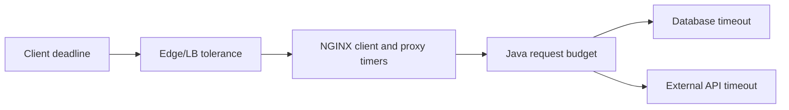
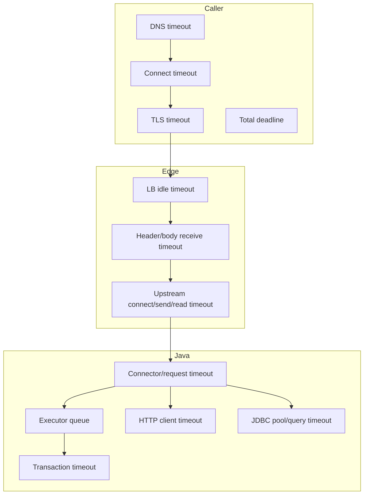
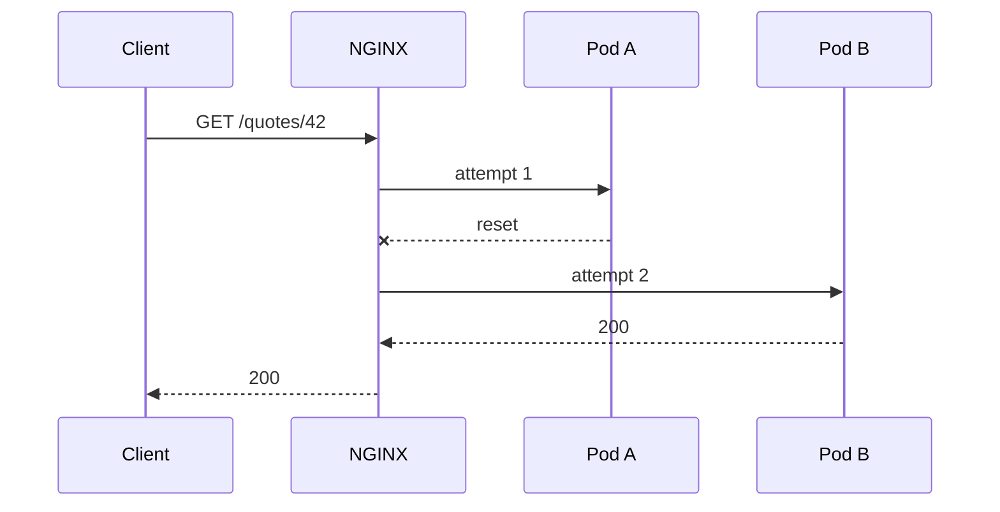
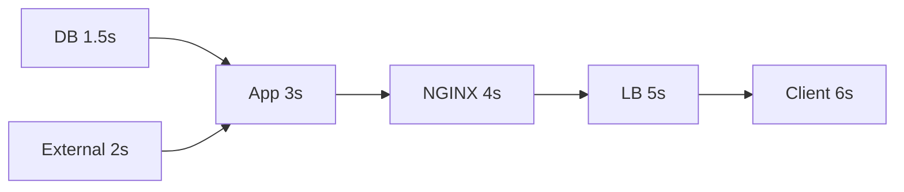
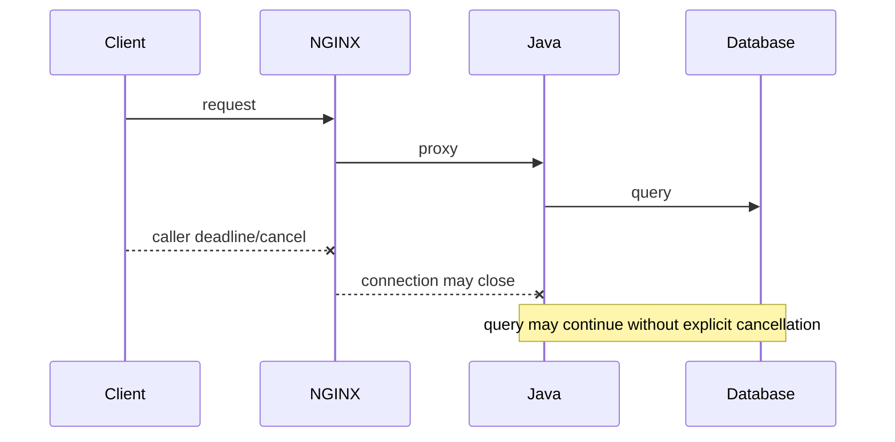
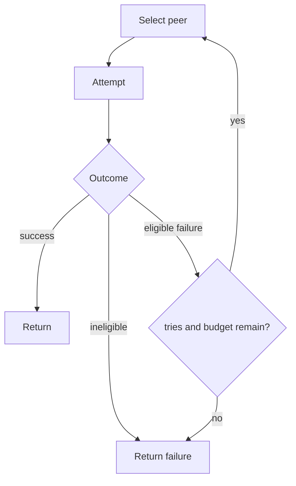
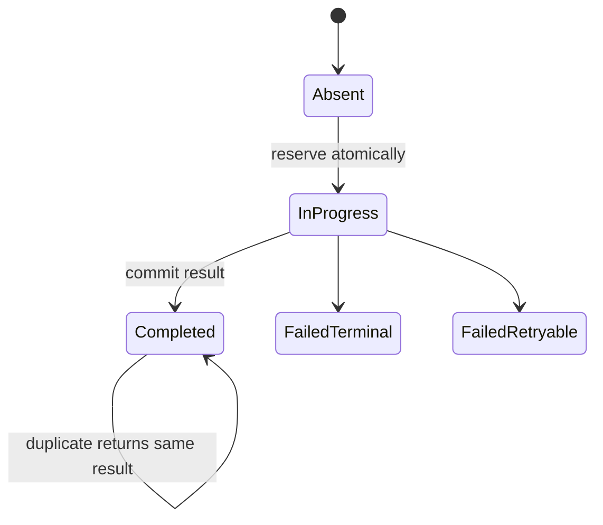
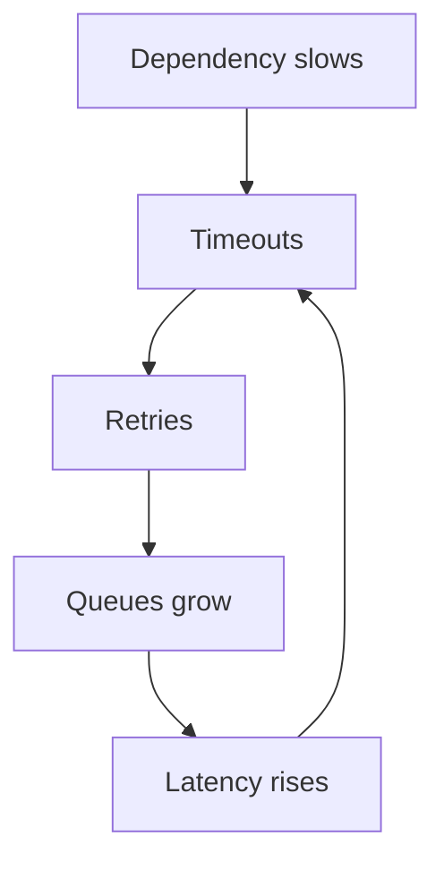
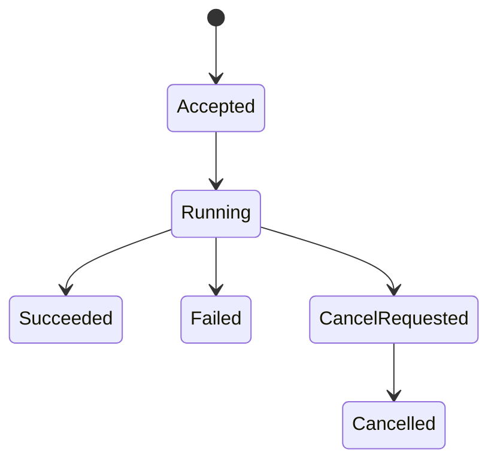

# Part 009 — Timeout Chains, Retry Semantics, and Gateway Failures

> **Depth level:** Production/Architecture-level  
> **Prerequisite:** Part 002, 005, dan 008; dasar HTTP, TCP, load balancing, idempotency, dan distributed tracing.  
> **Scope:** timeout, deadline, cancellation, retry, dan failure propagation dari client hingga Java/JAX-RS beserta dependency-nya.  
> **Bukan scope utama:** buffering dan body replay secara mendalam—Part 010; real-time timeout—Part 026; gRPC deadline—Part 027.

---

## Daftar isi

1. [Tujuan pembelajaran](#tujuan-pembelajaran)
2. [Executive mental model](#executive-mental-model)
3. [Timeout, deadline, cancellation, retry](#timeout-deadline-cancellation-retry)
4. [Timeout chain sebagai distributed contract](#timeout-chain-sebagai-distributed-contract)
5. [Gap timeout versus total deadline](#gap-timeout-versus-total-deadline)
6. [Logical request versus upstream attempts](#logical-request-versus-upstream-attempts)
7. [Timeout ownership](#timeout-ownership)
8. [Hierarchical timeout budget](#hierarchical-timeout-budget)
9. [Budget dan capacity equations](#budget-dan-capacity-equations)
10. [Client-side deadline](#client-side-deadline)
11. [Edge dan cloud load-balancer timeout](#edge-dan-cloud-load-balancer-timeout)
12. [Client-facing NGINX timeouts](#client-facing-nginx-timeouts)
13. [Upstream-facing NGINX timeouts](#upstream-facing-nginx-timeouts)
14. [Java/JAX-RS timeout layers](#javajax-rs-timeout-layers)
15. [Database dan downstream timeout](#database-dan-downstream-timeout)
16. [Cancellation propagation](#cancellation-propagation)
17. [Status-code provenance](#status-code-provenance)
18. [408, 499, 502, 503, 504](#408-499-502-503-504)
19. [`proxy_next_upstream`](#proxy_next_upstream)
20. [Retry eligibility dan response commitment](#retry-eligibility-dan-response-commitment)
21. [Non-idempotent request dan body replay](#non-idempotent-request-dan-body-replay)
22. [Idempotency key](#idempotency-key)
23. [Retry amplification dan cascading failure](#retry-amplification-dan-cascading-failure)
24. [Long-running request versus async job](#long-running-request-versus-async-job)
25. [Kubernetes dan rollout implications](#kubernetes-dan-rollout-implications)
26. [AWS, Azure, on-prem, hybrid](#aws-azure-on-prem-hybrid)
27. [Observability contract](#observability-contract)
28. [Latency decomposition](#latency-decomposition)
29. [Debugging playbooks](#debugging-playbooks)
30. [Reference configurations](#reference-configurations)
31. [Failure-mode catalogue](#failure-mode-catalogue)
32. [Anti-patterns](#anti-patterns)
33. [Security considerations](#security-considerations)
34. [Performance considerations](#performance-considerations)
35. [PR review checklist](#pr-review-checklist)
36. [Internal verification checklist](#internal-verification-checklist)
37. [Hands-on exercises](#hands-on-exercises)
38. [Ringkasan invariants](#ringkasan-invariants)
39. [Referensi resmi](#referensi-resmi)

---

## Tujuan pembelajaran

Setelah menyelesaikan part ini, Anda harus mampu:

1. memetakan seluruh timeout dari caller hingga database/external dependency;
2. membedakan timeout berbasis idle gap dari total deadline;
3. mendesain hierarchy agar dependency/application gagal sebelum gateway generik;
4. menilai retry berdasarkan remaining budget, method semantics, body replayability, dan side effect;
5. membedakan 408/499/502/503/504 berdasarkan producer dan evidence;
6. menjelaskan kapan NGINX dapat mencoba upstream berikutnya;
7. mengenali hidden retries walaupun client menerima 200;
8. memodelkan retry amplification lintas client, proxy, mesh, dan Java HTTP client;
9. mendesain cancellation propagation agar pekerjaan yang tidak lagi dibutuhkan berhenti;
10. memilih synchronous request atau asynchronous job berdasarkan hard platform limit;
11. menghubungkan timeout dengan queue, thread pool, database pool, connection pool, dan Kubernetes drain;
12. mereview perubahan timeout/retry sebagai perubahan distributed-system contract.

---

## Executive mental model

Timeout bukan sekadar angka lokal. Timeout adalah kontrak lintas layer mengenai:

- siapa menunggu siapa;
- progress apa yang mereset timer;
- kapan penantian dihentikan;
- apakah pekerjaan di bawah ikut dibatalkan;
- apakah attempt baru dibuat;
- error apa yang dilihat caller.



### Core invariant

> **Timeout menghentikan penantian, bukan otomatis menghentikan pekerjaan.**

NGINX dapat berhenti menunggu pada detik ke-30, tetapi Java thread, JDBC query, atau downstream call dapat tetap berjalan sampai detik ke-90 jika cancellation tidak dipropagasikan.

### Desired failure order

Layer terdalam yang memahami operation sebaiknya gagal lebih dahulu dan mengembalikan error yang lebih informatif.

```text
DB statement timeout       2.0 s
External call timeout      2.5 s
Application budget         4.0 s
NGINX read tolerance       5.0 s
Edge/LB tolerance          6.0 s
Client deadline            7.0 s
```

Angka tersebut hanya ilustrasi. Nilai produksi harus berasal dari SLO, latency distribution, endpoint semantics, failure tests, dan platform hard limits.

---

## Timeout, deadline, cancellation, retry

| Konsep | Makna | Contoh |
|---|---|---|
| Timeout | durasi maksimum menunggu kondisi/progress tertentu | maksimal 30 s tanpa byte upstream |
| Deadline | titik waktu absolut untuk menyelesaikan seluruh operasi | harus selesai sebelum 10:30:05.250 |
| Cancellation | sinyal bahwa pekerjaan tidak lagi diperlukan | caller disconnect; cancel query |
| Retry | attempt baru setelah attempt sebelumnya gagal | pilih pod lain setelah connect refused |

### Per-attempt timeout bukan total deadline

```text
Attempt 1 = 5 s
Attempt 2 = 5 s
Attempt 3 = 5 s
```

Dapat memakan hampir 15 detik, belum termasuk backoff dan network overhead.

Model deadline:

```text
remaining = deadline - now
attempt_timeout = min(per_attempt_cap, remaining - response_reserve)
```

Reserve memberi waktu untuk:

- membentuk error response;
- meneruskan response melalui proxy chain;
- cleanup;
- logging/tracing;
- caller processing.

---

## Timeout chain sebagai distributed contract

Satu request dapat melewati timer berikut:



### Mengubah satu angka mengubah failure shape

Menaikkan `proxy_read_timeout` 60 s menjadi 600 s:

- tidak membuat Java lebih cepat;
- menahan connection lebih lama;
- dapat membuat client/LB timeout lebih dahulu;
- meningkatkan 499;
- memungkinkan lebih banyak in-flight work;
- memperpanjang rollout drain;
- dapat menyembunyikan slow query;
- mengubah symptom tanpa menyelesaikan root cause.

Pertanyaan review yang tepat:

> Apakah perubahan ini memenuhi workload requirement, atau hanya memindahkan titik failure?

---

## Gap timeout versus total deadline

Banyak timer NGINX adalah **idle-gap timers**, bukan total duration.

Contoh:

```text
proxy_read_timeout = 60 s
upstream mengirim 1 byte setiap 50 s
```

Request dapat bertahan berjam-jam karena setiap byte mereset read timer.

```text
T+00  byte
T+50  byte -> reset
T+100 byte -> reset
T+150 byte -> reset
```

Begitu juga:

- `client_body_timeout`: gap antar-read request body;
- `proxy_send_timeout`: gap antar-write ke upstream;
- `proxy_read_timeout`: gap antar-read dari upstream;
- `send_timeout`: gap antar-write ke client.

Jika membutuhkan total deadline, gunakan layer yang memang memiliki konsep deadline:

- caller/client;
- application request context;
- API gateway/service mesh total route timeout;
- asynchronous workflow timeout.

---

## Logical request versus upstream attempts



Dari perspektif:

- client: satu request;
- NGINX: dua upstream attempts;
- fleet: dua backend interactions;
- logs: beberapa `$upstream_addr`, `$upstream_status`, timing;
- traces: satu logical trace dengan beberapa attempt/client spans.

### Ambiguous outcome

Attempt pertama dapat melakukan side effect sebelum connection reset.

```text
Client melihat failure ≠ operation pasti gagal.
```

Itulah alasan write operation membutuhkan:

- idempotency key;
- operation ID;
- status query;
- transactional deduplication;
- audit trail;
- outbox/workflow state.

---

## Timeout ownership

| Timer | Operational owner | Semantic owner |
|---|---|---|
| client deadline | consumer/client team | API consumer contract |
| cloud LB timeout | platform/network | edge behavior |
| NGINX timeout | platform/service owner | route contract |
| Java request budget | service team | business operation |
| DB query timeout | service/DB team | query/transaction |
| external call timeout | integration owner | dependency contract |

Setiap timer harus punya:

- source of truth;
- owner;
- reason;
- scope;
- default;
- override policy;
- metric;
- runbook;
- rollback path.

Tidak boleh ada timer “misterius” yang baru ditemukan saat incident.

---

## Hierarchical timeout budget



### Tujuan

1. dependency gagal dengan error spesifik;
2. application sempat memetakan error;
3. NGINX sempat menerima response;
4. edge sempat meneruskan response;
5. caller menerima error sebelum deadline lokal habis.

### Hard-cap constraint

Jika provider/API gateway mempunyai hard cap 30 detik:

```text
operation > 30 s
```

maka pilihan realistis:

- optimasi agar selesai < 30 s; atau
- ubah menjadi async job.

Memperpanjang timer di layer dalam tidak mengalahkan hard cap di layer luar.

---

## Budget dan capacity equations

### Total logical request

```text
T_client
>= network_out
 + edge
 + Σ(attempt_i)
 + network_return
 + safety_margin
```

### Satu attempt

```text
T_attempt
>= connect
 + request_send
 + queue
 + application
 + dependency
 + first_byte
 + response_stream
```

### Retry total

```text
T_retry_total
≈ Σ(attempt_duration) + Σ(backoff) + overhead
```

### Concurrency coupling

Little's Law:

```text
in_flight ≈ arrival_rate × average_time_in_system
```

Contoh:

```text
200 req/s × 0.2 s = 40 in-flight
200 req/s × 5.0 s = 1000 in-flight
```

Menaikkan timeout tanpa capacity control dapat memperbesar:

- socket usage;
- executor queue;
- memory;
- DB pool pressure;
- downstream connections;
- tail latency.

---

## Client-side deadline

Client dapat berupa browser, mobile, batch, microservice, API gateway, partner, atau health checker.

Periksa:

- connect timeout;
- response timeout;
- total deadline;
- automatic SDK retry;
- retry on connection reset;
- user cancellation;
- hidden intermediary.

### Dangerous mismatch

```text
Client deadline     10 s
NGINX read timeout  60 s
Java processing     45 s
```

Outcome:

1. client abort di 10 s;
2. NGINX mencatat 499;
3. Java terus bekerja;
4. response dibuang;
5. client mungkin retry;
6. operation dapat dieksekusi dua kali.

### Better pattern

- propagate remaining budget;
- set inner timeouts shorter;
- cancel downstream work;
- use idempotency for write;
- redesign long operation async.

---

## Edge dan cloud load-balancer timeout

Topology:

```text
Client → Cloud LB/API gateway → NGINX → Java
```

Jika outer idle timeout lebih pendek dari NGINX:

```text
LB idle timeout            60 s
NGINX proxy_read_timeout  120 s
```

LB dapat menutup connection pada 60 s. NGINX melihat immediate client disconnect dan mungkin mencatat 499, sementara Java tetap berjalan.

### Internal verification checklist

- exact product/tier;
- L4 atau L7;
- idle versus total timeout;
- per-listener/per-route override;
- WebSocket/SSE behavior;
- target deregistration delay;
- access-log reason;
- IaC source;
- differences DEV/UAT/PROD.

Jangan mengandalkan remembered defaults. Verifikasi deployed configuration.

---

## Client-facing NGINX timeouts

### `client_header_timeout`

```nginx
client_header_timeout 10s;
```

Waktu untuk menerima seluruh request header. Jika tidak selesai, NGINX dapat mengakhiri dengan 408.

Use cases:

- membatasi slowloris;
- broken client;
- lossy network;
- stalled intermediary.

Trade-off:

- terlalu pendek: false timeout;
- terlalu panjang: connection slot tertahan.

### `client_body_timeout`

```nginx
client_body_timeout 30s;
```

Gap maksimum antar-read request body, bukan total upload duration.

Implikasi:

- buffering on: Java mungkin belum menerima body;
- buffering off: Java mungkin sudah menerima partial body;
- partial cleanup dan retry berbeda.

### `keepalive_timeout`

```nginx
keepalive_timeout 30s;
```

Mengatur idle downstream HTTP connection, bukan total request timeout.

Jangan campur dengan:

- upstream keepalive;
- TCP keepalive;
- LB idle timeout;
- WebSocket idle timeout.

### `send_timeout`

```nginx
send_timeout 30s;
```

Gap maksimum antar-write saat NGINX mengirim response ke client. Slow client dapat menahan downstream connection dan, tergantung buffering, temp file.

---

## Upstream-facing NGINX timeouts

### `proxy_connect_timeout`

```nginx
proxy_connect_timeout 2s;
```

Mengukur waktu establish connection ke upstream.

Possible failures:

- refused;
- route unreachable;
- SYN drop;
- stale endpoint;
- firewall;
- terminating pod;
- upstream TLS handshake path.

Connect sukses hanya membuktikan socket diterima—bukan application healthy atau executor tersedia.

### `proxy_send_timeout`

```nginx
proxy_send_timeout 30s;
```

Gap maksimum saat NGINX menulis request ke upstream.

Possible causes:

- Java tidak membaca body;
- receive buffer penuh;
- connector stalled;
- huge upload;
- downstream sidecar blocked.

### `proxy_read_timeout`

```nginx
proxy_read_timeout 30s;
```

Gap maksimum antar-read response upstream.

Possible causes:

- thread starvation;
- queue;
- slow DB;
- lock;
- downstream hang;
- GC pause;
- stream stall;
- network issue.

504 adalah symptom bahwa gateway tidak memperoleh progress tepat waktu—bukan bukti NGINX adalah root cause.

---

## Java/JAX-RS timeout layers

Java service dapat memiliki:

- accept backlog;
- connector timeout;
- request parsing timeout;
- request/async timeout;
- executor queue wait;
- transaction timeout;
- HTTP client pool-acquisition timeout;
- HTTP connect/read/write/total timeout;
- JDBC pool acquisition timeout;
- statement timeout;
- lock timeout.

Nama property berbeda untuk Jersey + Servlet, Jetty, Tomcat, Undertow, Netty, application server, atau custom runtime.

### Queue budget trap

```text
total budget = 5 s
queue wait   = 4 s
business work= 2 s
```

Jika handler tidak mengetahui remaining budget, ia akan melakukan late work yang akhirnya dibuang.

### Conceptual Java pattern

```java
Duration remaining = requestDeadline.remaining();

if (remaining.isZero() || remaining.isNegative()) {
    throw new DeadlineExceededException();
}

Duration downstreamBudget =
        min(Duration.ofSeconds(2), remaining.minusMillis(200));

return dependency.call(downstreamBudget);
```

### JAX-RS async bukan otomatis resilient

Async dapat membebaskan request thread, tetapi:

- connection tetap hidup;
- executor lain tetap digunakan;
- outer LB dapat timeout;
- cancellation harus ditangani;
- response dapat dibuang setelah disconnect.

---

## Database dan downstream timeout

### JDBC/DB

Pisahkan:

```text
pool acquisition timeout
statement/query timeout
transaction timeout
lock wait timeout
socket timeout
```

Pool acquisition timeout bukan query timeout.

### HTTP dependency

Pisahkan:

```text
DNS
connection pool acquisition
connect
TLS
write
response header
idle read
total deadline
retry
```

### Desired ordering

```text
dependency timeout < application budget < proxy tolerance < caller deadline
```

Tidak harus sama untuk semua endpoint, tetapi relationship harus disengaja.

### Avoid nested fixed timeouts

Satu request dengan tiga sequential downstream calls masing-masing 5 s dapat memakan 15 s walaupun application budget hanya 8 s. Selalu gunakan remaining budget.

---

## Cancellation propagation



Ideal chain:

```text
caller cancel
→ NGINX detects close
→ Java request context cancelled
→ HTTP dependency cancelled
→ JDBC statement cancelled
→ transaction rolled back
→ resources released
```

### Limitations

- framework mungkin terlambat mendeteksi disconnect;
- blocking JDBC dapat mengabaikan interrupt;
- commit mungkin sudah terjadi;
- event/message mungkin sudah durable;
- `proxy_ignore_client_abort` mengubah behavior;
- non-cancellable business phase mungkin disengaja.

### Correctness question

> Setelah commit boundary, bagaimana caller menemukan operation outcome bila connection hilang?

Jawaban biasanya membutuhkan operation ID/status API, bukan sekadar retry.

---

## Status-code provenance

Status code harus selalu disertai producer.

| Status | Possible producer |
|---|---|
| 408 | NGINX, cloud proxy, application |
| 499 | NGINX-style log code ketika immediate client menutup connection |
| 500 | application atau transformed intermediary error |
| 502 | NGINX/cloud gateway/mesh |
| 503 | app, NGINX, controller, LB, maintenance/load shedding |
| 504 | NGINX/cloud gateway/mesh/API gateway |

Evidence minimal:

- `$status`;
- `$upstream_status`;
- `$upstream_addr`;
- `$upstream_connect_time`;
- `$upstream_header_time`;
- `$upstream_response_time`;
- error log;
- app access log;
- trace;
- cloud LB reason.

> “Ada 504” adalah symptom report, bukan diagnosis.

---

## 408, 499, 502, 503, 504

### 408 Request Timeout

Biasanya request header/body tidak selesai diterima.

Possible causes:

- slow upload;
- slowloris;
- client crash;
- mobile network loss;
- proxy before NGINX stalled;
- framing issue.

Debug:

- producer;
- header versus body;
- bytes received;
- exact duration;
- source distribution;
- attack pattern.

### 499 Client Closed Request

499 bukan standard response yang biasanya diterima client. Ini log code ketika immediate client NGINX menutup connection sebelum response selesai.

Immediate client dapat berupa:

- end user;
- ALB/Application Gateway;
- CDN;
- API gateway;
- service mesh;
- another reverse proxy.

Common causes:

- caller deadline shorter than service latency;
- LB idle timeout;
- user cancel;
- mobile disconnect;
- health check timeout;
- client retry abandoning previous attempt.

Important:

```text
499 naik + upstream latency naik
```

sering berarti service lambat, bukan “client salah”.

### 502 Bad Gateway

Common causes:

- connect refused;
- wrong port/protocol;
- HTTP/HTTPS mismatch;
- TLS handshake/verification failure;
- stale endpoint;
- reset;
- invalid response header;
- upstream closed prematurely;
- process crash.

### 503 Service Unavailable

Possible producers:

- application load shedding;
- no eligible upstream;
- no endpoints;
- all targets unhealthy;
- maintenance;
- rate/connection policy;
- controller default backend.

Retry terhadap 503 overload dapat memperburuk overload.

### 504 Gateway Timeout

Common causes:

- application/dependency slow;
- queue saturation;
- DB lock/query;
- GC pause;
- stream stall;
- timeout hierarchy mismatch;
- network blackhole after connect.

Wrong fix:

```nginx
proxy_read_timeout 600s;
```

tanpa membuktikan operation memang sah berlangsung 10 menit.

---

## `proxy_next_upstream`

Default HTTP proxy behavior:

```nginx
proxy_next_upstream error timeout;
```

Possible configured conditions meliputi:

- `error`;
- `timeout`;
- `invalid_header`;
- HTTP 500/502/503/504/429 dan lainnya;
- `non_idempotent`;
- `off`.



### Bound retries

```nginx
proxy_next_upstream_tries 2;
proxy_next_upstream_timeout 3s;
```

Gunakan cap jumlah attempt **dan** cap total retry duration.

### Retry is not free

Setiap attempt:

- mengonsumsi latency budget;
- menambah load;
- dapat membuat side effect;
- memengaruhi passive failure state;
- dapat menyembunyikan failing peer jika final response sukses.

---

## Retry eligibility dan response commitment

Transparent retry hanya mungkin sebelum response externally committed.

```text
Pod A sends 200 header
NGINX forwards header
Pod A dies mid-body
```

NGINX tidak dapat mengganti response parsial dengan full response dari Pod B secara transparan.

Buffering dapat menunda commitment, tetapi tidak menjadikan arbitrary response retry aman.

### Multi-attempt logs

```text
upstream_addr          10.0.1.4:8080, 10.0.2.8:8080
upstream_status        502, 200
upstream_connect_time  0.001, 0.002
upstream_response_time 0.010, 0.120
```

Client melihat 200, tetapi fleet memiliki partial failure. Monitor retry attempts, bukan hanya final 5xx.

---

## Non-idempotent request dan body replay

Method name saja tidak cukup.

Potentially non-idempotent:

```http
POST /orders
```

Idempotent by design:

```http
PUT /orders/{clientGeneratedId}
```

tetap bergantung implementation.

### `non_idempotent`

Mengizinkan wider retry untuk request non-idempotent dan harus diperlakukan high risk.

### Body replay

Request buffering on:

- body tersimpan memory/temp file;
- lebih mungkin dapat dikirim ulang.

Request buffering off:

- body streaming ke upstream;
- setelah mulai dikirim, NGINX tidak dapat berpindah ke next upstream dengan body yang sama.

Transport replayability tetap tidak membuktikan business operation aman diulang.

---

## Idempotency key

```http
POST /orders
Idempotency-Key: 6d7f...
```



Requirements:

- atomic reservation;
- request fingerprint;
- tenant/principal scope;
- retention;
- duplicate in-progress behavior;
- same-key/different-payload conflict;
- stored result/reference;
- audit and privacy.

NGINX hanya meneruskan key. Correctness harus dimiliki application/domain.

---

## Retry amplification dan cascading failure

Jika:

```text
client attempts = 2
NGINX attempts  = 2
Java client attempts = 3
```

Potential downstream attempts:

```text
original_requests × 2 × 2 × 3
```

1,000 original req/s dapat menghasilkan theoretical 12,000 dependency attempts/s.



Mitigation:

- one primary retry layer;
- bounded attempts;
- bounded retry duration;
- backoff + jitter at capable caller layer;
- retry budget;
- load shedding;
- idempotency;
- admission control;
- capacity headroom.

NGINX next-upstream cocok untuk limited transparent failover, bukan generalized workflow retry.

---

## Long-running request versus async job

Long-running endpoints:

- report generation;
- bulk import;
- quote recalculation;
- export;
- cross-system orchestration.

Costs:

- open sockets;
- retained request context;
- client disconnect risk;
- difficult retry outcome;
- rollout drain;
- cloud hard caps;
- transaction/resource retention.

### Async pattern

```http
POST /exports
→ 202 Accepted
Location: /exports/jobs/abc
```



Benefits:

- decoupled from connection lifetime;
- progress/status;
- bounded worker concurrency;
- recoverable outcome;
- easier retries and rollout.

Costs:

- job persistence;
- authorization;
- cleanup;
- polling/events;
- duplicate submission handling.

---

## Kubernetes dan rollout implications

Path:

```text
Cloud LB → controller → Service/EndpointSlice → Pod → Java
```

Each layer has timers and lifecycle state.

### Graceful termination

1. readiness false;
2. endpoint removal propagates;
3. new traffic stops;
4. existing work drains;
5. application stops accepting new work;
6. grace period remains sufficient;
7. process exits.

If max synchronous request is 120 s but `terminationGracePeriodSeconds` is 30 s, rollout can cut valid requests.

Solusi tidak selalu menaikkan grace period; long operation mungkin harus async.

### Controller semantics

Timeout annotations differ by controller/product/version. Verify:

- exact controller;
- rendered NGINX config;
- global ConfigMap;
- route override;
- admission policy;
- rollout/reload result.

---

## AWS, Azure, on-prem, hybrid

### AWS/EKS potential timers

- client/CloudFront/API layer;
- ALB/NLB;
- NGINX ingress;
- service mesh;
- Java;
- RDS/external APIs.

### Azure/AKS potential timers

- Front Door;
- Application Gateway;
- API Management;
- Azure Load Balancer;
- NGINX ingress;
- Java;
- databases/private services.

### On-prem

- corporate proxy;
- firewall session timer;
- hardware/software LB;
- DMZ proxy;
- NGINX;
- app server;
- database/mainframe.

### Required inventory

| Hop | Product | Value | Type | Owner | Source | Evidence |
|---|---|---:|---|---|---|---|
| Client → Edge | ... | ... | total/idle | ... | ... | ... |
| Edge → NGINX | ... | ... | idle | ... | ... | ... |
| NGINX → Java | ... | ... | connect/read | ... | ... | ... |
| Java → DB/API | ... | ... | total/query | ... | ... | ... |

---

## Observability contract

Log/metric minimal:

- request/correlation ID;
- trace ID;
- route;
- method;
- final status;
- request time;
- upstream addresses/statuses;
- connect/header/response times;
- request/response bytes;
- client class;
- controller pod;
- app outcome;
- cancellation reason;
- retry attempts.

Example:

```nginx
log_format gateway_json escape=json
  '{'
    '"time":"$time_iso8601",'
    '"request_id":"$request_id",'
    '"method":"$request_method",'
    '"uri":"$uri",'
    '"status":$status,'
    '"request_time":$request_time,'
    '"upstream_addr":"$upstream_addr",'
    '"upstream_status":"$upstream_status",'
    '"upstream_connect_time":"$upstream_connect_time",'
    '"upstream_header_time":"$upstream_header_time",'
    '"upstream_response_time":"$upstream_response_time"'
  '}';
```

Store multi-attempt fields as strings unless parser understands comma/colon-separated values.

### Alerting

- 408 rate;
- 499 rate by route/client;
- 502/503/504;
- retry ratio;
- p95/p99 connect/header/response time;
- app queue;
- DB pool wait;
- dependency timeout;
- successful requests with multiple upstream attempts.

---

## Latency decomposition

Approximation:

```text
request_time
≈ client upload
 + proxy/internal processing
 + upstream attempts
 + client download
```

Patterns:

### Slow connect

```text
connect_time high
```

Potential network, backlog, TLS, stale route.

### Fast connect, slow first byte

```text
connect low
header_time high
```

Potential queue, Java, DB, dependency.

### Fast header, slow full response

```text
header_time low
response_time high
```

Potential large/streaming response.

### High request time, low upstream time

Potential slow client upload/download or buffering effects.

---

## Debugging playbooks

### 408

1. identify producer;
2. header or body;
3. request bytes;
4. exact duration;
5. client/network distribution;
6. slowloris pattern;
7. adjust per route, not globally.

### 499

1. histogram duration;
2. identify immediate client;
3. compare caller/LB deadlines;
4. correlate upstream latency;
5. check whether Java completed later;
6. check duplicate retry/side effect;
7. fix latency/hierarchy/cancellation.

### 502

Classify phase:

1. DNS/selection;
2. connect;
3. TLS;
4. request send;
5. response header parse;
6. premature close.

Useful commands:

```bash
kubectl get pods -o wide
kubectl get svc
kubectl get endpointslices
kubectl logs <controller-pod>
kubectl exec <debug-pod> -- curl -v http://service:8080/health
kubectl exec <debug-pod> -- openssl s_client -connect service:8443 -servername service.internal
```

### 503

Check:

- `$upstream_status`;
- no endpoints;
- readiness;
- all targets unhealthy;
- app load shedding;
- rate/connection limits;
- autoscaler lag.

### 504

1. match exact duration to timer;
2. inspect connect/header/response timings;
3. inspect queue/thread/DB/dependency;
4. verify late application completion;
5. inspect retries;
6. choose optimization, capacity, load shedding, async redesign, or evidence-based timeout change.

---

## Reference configurations

### Fast read API

```nginx
location /api/catalog/ {
    proxy_connect_timeout 500ms;
    proxy_send_timeout 2s;
    proxy_read_timeout 3s;

    proxy_next_upstream error timeout http_502 http_503 http_504;
    proxy_next_upstream_tries 2;
    proxy_next_upstream_timeout 3s;

    proxy_pass http://catalog_api;
}
```

### Conservative write API

```nginx
location /api/orders/ {
    proxy_connect_timeout 1s;
    proxy_send_timeout 5s;
    proxy_read_timeout 10s;

    proxy_next_upstream error;
    proxy_next_upstream_tries 2;
    proxy_next_upstream_timeout 2s;

    proxy_pass http://order_api;
}
```

Retry tetap membutuhkan idempotency/outcome recovery.

### No transparent retry

```nginx
location /api/payments/commit {
    proxy_next_upstream off;
    proxy_connect_timeout 1s;
    proxy_read_timeout 5s;
    proxy_pass http://payment_api;
}
```

Client/SDK tetap dapat retry. Domain idempotency tetap wajib.

---

## Failure-mode catalogue

| Symptom | Likely class | Evidence | Wrong fix |
|---|---|---|---|
| 408 upload | slow client/body gap | bytes stop | raise all timers |
| 499 exactly 30 s | caller/LB timer | duration clustering | blame browser |
| 502 refused | process/port | error log | increase read timeout |
| 502 premature close | crash/reset | pod/app events | blind POST retry |
| 503 no endpoints | readiness/service | EndpointSlice | increase timeout |
| 503 app overload | application | upstream 503 | immediate retries |
| 504 threshold exact | read timeout | timing | set 10 minutes |
| final 200 after retry | partial fleet failure | multi-upstream fields | ignore |
| app success after 499 | cancellation gap | late app log | retry without idempotency |
| rollout errors | drain mismatch | pod timeline | random tuning |

---

## Anti-patterns

1. set every timeout to 600 s;
2. retry every 5xx;
3. retry at every layer;
4. treat 499 as client fault;
5. treat 504 as instruction to raise timeout;
6. assume timeout cancels DB/Java work;
7. ignore successful retries;
8. one global timeout for every route;
9. no body replay analysis;
10. infer idempotency from method only;
11. application budget longer than proxy;
12. modify annotation without inspecting rendered config.

---

## Security considerations

- header/body timeout mitigates slow connection attacks;
- bounded timers limit socket, memory, transaction, pool retention;
- attackers can trigger retry amplification;
- untrusted deadline header must not increase resource budget arbitrarily;
- timeout errors must not expose internal IP/host/dependency;
- idempotency keys need tenant scope, fingerprint, expiry, and safe logging;
- cancellation after authorization/commit must preserve auditability.

---

## Performance considerations

Timeout tuning is capacity tuning.

Longer waits increase:

- in-flight requests;
- downstream connections;
- memory;
- queue depth;
- DB pool pressure;
- drain time.

Retry improves availability only when:

- failure transient/isolated;
- spare capacity exists;
- operation replay-safe;
- attempt fits remaining budget.

Test:

- normal and p99 load;
- dead pod;
- slow pod;
- dependency latency;
- caller abort;
- retry on/off;
- rollout;
- CPU throttling and GC pause.

---

## PR review checklist

### Contract

- [ ] Endpoint expected duration and SLO known.
- [ ] Caller deadline known.
- [ ] Sync versus async justified.

### Timeout hierarchy

- [ ] Client, LB, NGINX, app, DB, dependencies mapped.
- [ ] Inner failure precedes outer deadline.
- [ ] Idle-gap and total deadline distinguished.
- [ ] Per-route override justified.

### Retry

- [ ] Conditions explicit.
- [ ] Attempts capped.
- [ ] Duration capped.
- [ ] Other retry layers known.
- [ ] 429/503 semantics understood.
- [ ] Response commitment limitation understood.

### Correctness

- [ ] Idempotency/outcome recovery defined.
- [ ] Body replayability assessed.
- [ ] Partial execution handled.
- [ ] Cancellation tested.

### Platform

- [ ] Controller/version verified.
- [ ] Rendered config inspected.
- [ ] Cloud timer verified.
- [ ] Pod drain compatible.

### Observability

- [ ] Upstream status/address/timing logged.
- [ ] Multi-attempt fields parsed.
- [ ] 499 segmented.
- [ ] Dependency timing traceable.
- [ ] Rollback and alert changes defined.

---

## Internal verification checklist

### Repository/config

- [ ] Find all client/proxy timeout directives.
- [ ] Find `proxy_next_upstream`, tries, timeout.
- [ ] Inspect Helm, ConfigMap, Ingress annotation, includes.
- [ ] Compare source and rendered runtime config.
- [ ] Compare DEV/UAT/PROD.

### Caller/edge

- [ ] Inventory client deadlines.
- [ ] Find SDK automatic retries.
- [ ] Verify CDN/API gateway/LB timeout.
- [ ] Verify firewall/corporate proxy session behavior.
- [ ] Identify immediate NGINX client.

### Java/JAX-RS

- [ ] Identify runtime/container.
- [ ] Check request/async timeout.
- [ ] Check executor bounds.
- [ ] Check HTTP client pool/connect/read/total timeout.
- [ ] Check JDBC pool/query/transaction timeout.
- [ ] Check disconnect/cancellation behavior.
- [ ] Inventory long-running endpoints.

### Correctness

- [ ] Classify idempotency by operation.
- [ ] Verify idempotency key implementation.
- [ ] Verify duplicate in-progress/completed behavior.
- [ ] Verify status lookup after unknown outcome.
- [ ] Assess body replay.

### Kubernetes

- [ ] Readiness/startup/liveness.
- [ ] termination grace/preStop.
- [ ] endpoint removal propagation.
- [ ] controller drain.
- [ ] mesh retries/timeouts if present.

### Observability/runbook

- [ ] Dashboard 408/499/502/503/504.
- [ ] Successful multi-attempt detection.
- [ ] Queue/pool/dependency traces.
- [ ] Runbook by status and phase.
- [ ] Historical incident review.
- [ ] Clear timeout policy owner.

---

## Hands-on exercises

1. Build complete timeout inventory for one API.
2. Reproduce 504 with endpoint slower than `proxy_read_timeout`.
3. Reproduce 499 with caller deadline shorter than app duration.
4. Fail first peer and inspect multi-attempt log fields.
5. Measure retry amplification across three retry layers.
6. Reset connection after commit and test duplicate write.
7. Saturate Java executor and measure queue budget.
8. Terminate pod during long request and reconstruct drain timeline.
9. Reconstruct one incident request across client, LB, NGINX, Java, DB.
10. Review this unsafe config:

```nginx
proxy_connect_timeout 60s;
proxy_send_timeout 600s;
proxy_read_timeout 600s;
proxy_next_upstream error timeout http_500 http_502 http_503 http_504 non_idempotent;
```

---

## Ringkasan invariants

1. Timeout stops waiting, not necessarily work.
2. Many NGINX timers measure idle gaps, not total duration.
3. Timeout chain must be modeled end-to-end.
4. Inner dependencies should fail before outer gateway deadlines.
5. Equal values everywhere are not a hierarchy.
6. One logical request may create multiple upstream attempts.
7. Retry requires spare capacity, transient failure, budget, and replay safety.
8. Retry layers multiply.
9. 499 refers to NGINX's immediate client, not necessarily end user.
10. 502/503/504 require producer and phase evidence.
11. Final 200 can hide retry and partial fleet failure.
12. Transparent retry ends once response is committed.
13. Streamed body reduces replayability.
14. Method alone does not prove idempotency.
15. Idempotency is domain correctness, not proxy configuration.
16. Long operations must be challenged against platform hard caps.
17. Cancellation must reach Java and dependencies where safe.
18. Higher timeouts increase retained resources and possible concurrency.
19. Retry against overload can accelerate collapse.
20. Rendered config and observed behavior are source of truth.

---

## Referensi resmi

- [NGINX — `ngx_http_proxy_module`](https://nginx.org/en/docs/http/ngx_http_proxy_module.html)
- [NGINX — `ngx_http_core_module`](https://nginx.org/en/docs/http/ngx_http_core_module.html)
- [NGINX — `ngx_http_upstream_module`](https://nginx.org/en/docs/http/ngx_http_upstream_module.html)
- [NGINX — `ngx_http_log_module`](https://nginx.org/en/docs/http/ngx_http_log_module.html)
- [Kubernetes — Pod Lifecycle](https://kubernetes.io/docs/concepts/workloads/pods/pod-lifecycle/)
- [Kubernetes — Services and Networking](https://kubernetes.io/docs/concepts/services-networking/)
- [RFC 9110 — HTTP Semantics](https://www.rfc-editor.org/rfc/rfc9110.html)
- [RFC 9112 — HTTP/1.1](https://www.rfc-editor.org/rfc/rfc9112.html)
