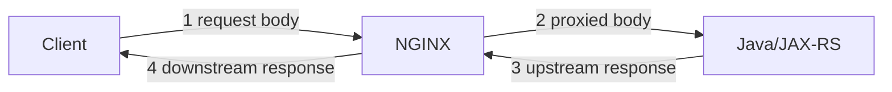
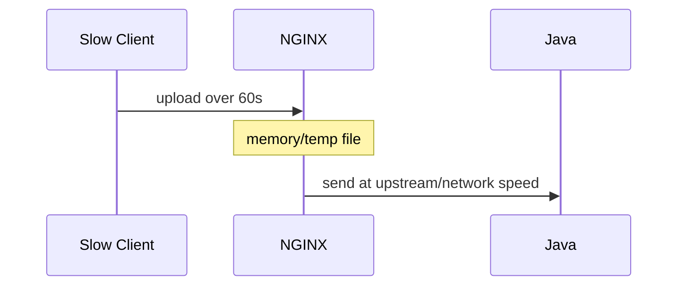
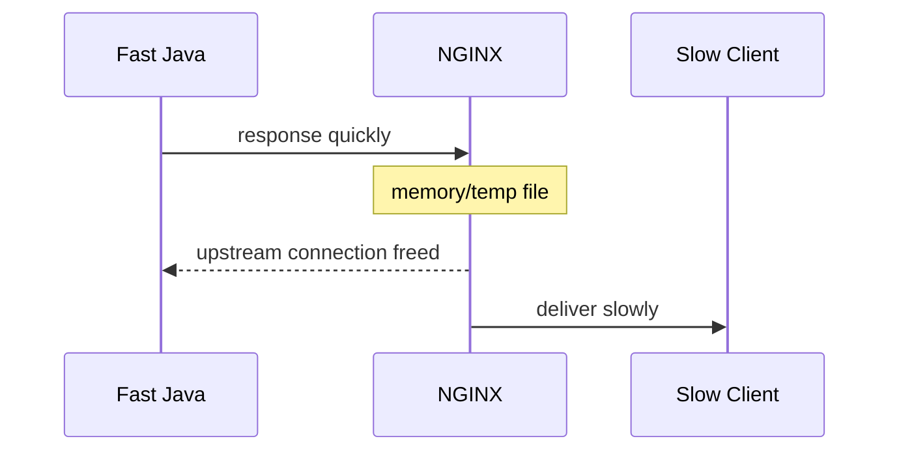
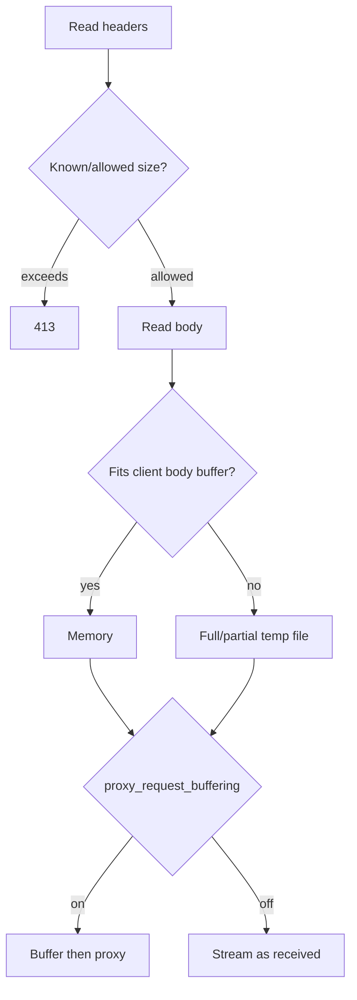
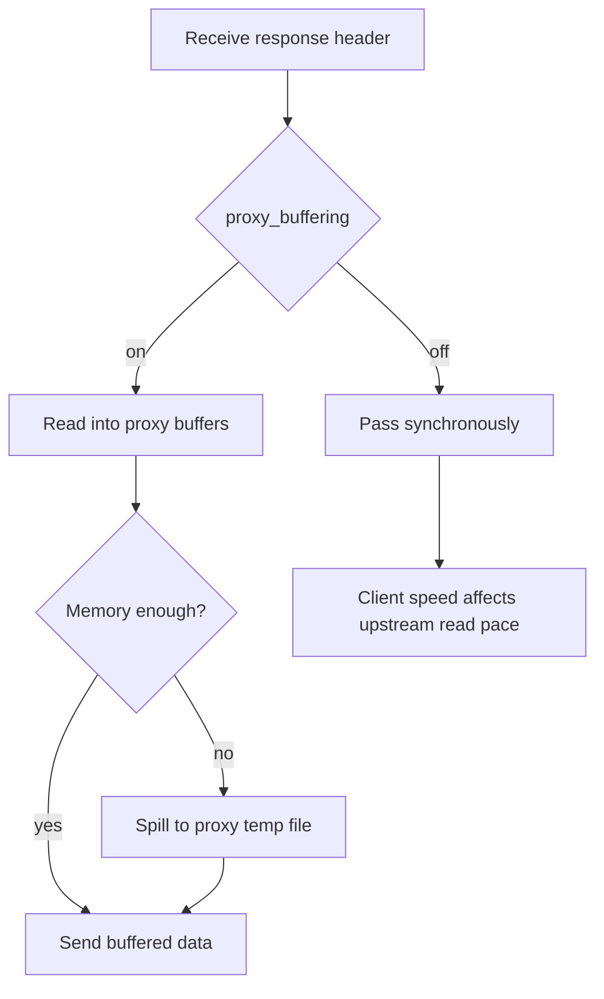
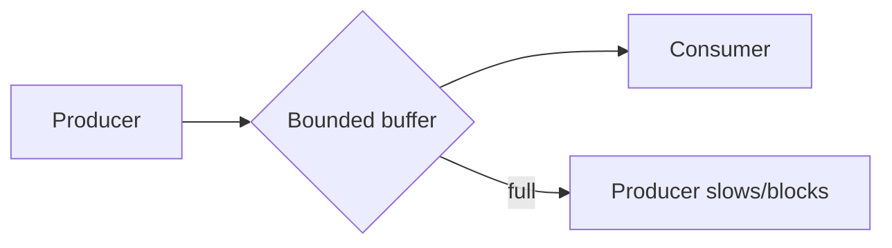
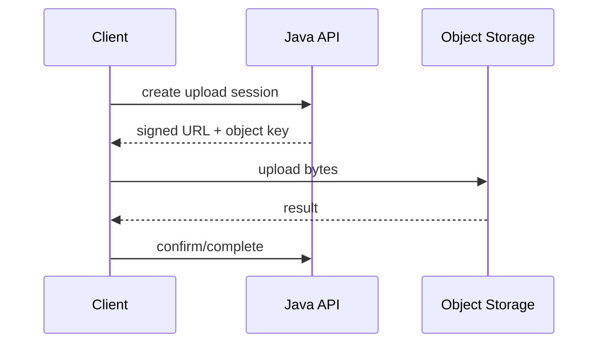
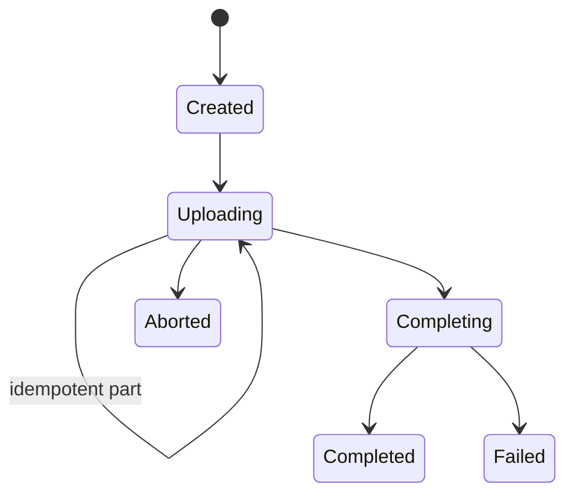

# Part 010 — Buffers, Streaming, Uploads, and Large Bodies

> **Depth level:** Advanced  
> **Prerequisite:** Part 005–006 dan 009; dasar HTTP framing, streaming I/O, backpressure, upload/download, dan Kubernetes resource limits.  
> **Scope:** request/response buffering, temporary files, large payloads, upload/download, SSE/long polling/WebSocket introduction, dan dampaknya ke Java/JAX-RS.  
> **Bukan scope utama:** caching—Part 011; WebSocket/SSE deep dive—Part 026; gRPC streaming—Part 027.

---

## Daftar isi

1. [Tujuan pembelajaran](#tujuan-pembelajaran)
2. [Executive mental model](#executive-mental-model)
3. [Empat data paths](#empat-data-paths)
4. [Buffering bukan caching](#buffering-bukan-caching)
5. [Buffering sebagai decoupling boundary](#buffering-sebagai-decoupling-boundary)
6. [Request body lifecycle](#request-body-lifecycle)
7. [Response body lifecycle](#response-body-lifecycle)
8. [`client_max_body_size`](#client_max_body_size)
9. [Body-size limit chain](#body-size-limit-chain)
10. [`client_body_buffer_size` dan temp path](#client_body_buffer_size-dan-temp-path)
11. [Request temporary files](#request-temporary-files)
12. [`proxy_request_buffering`](#proxy_request_buffering)
13. [Buffered versus streaming request](#buffered-versus-streaming-request)
14. [Request buffering dan retry](#request-buffering-dan-retry)
15. [`proxy_buffering`](#proxy_buffering)
16. [Response buffer directives](#response-buffer-directives)
17. [Response temporary files](#response-temporary-files)
18. [`X-Accel-Buffering`](#x-accel-buffering)
19. [Decision matrices](#decision-matrices)
20. [Memory model](#memory-model)
21. [Disk dan ephemeral-storage model](#disk-dan-ephemeral-storage-model)
22. [Connection dan file-descriptor model](#connection-dan-file-descriptor-model)
23. [Backpressure](#backpressure)
24. [Slow client versus slow upstream](#slow-client-versus-slow-upstream)
25. [TTFB, chunking, dan flushing](#ttfb-chunking-dan-flushing)
26. [Large multipart upload](#large-multipart-upload)
27. [Direct object-storage upload](#direct-object-storage-upload)
28. [Resumable upload](#resumable-upload)
29. [Validation dan malware scanning](#validation-dan-malware-scanning)
30. [Large binary download](#large-binary-download)
31. [Range requests](#range-requests)
32. [`X-Accel-Redirect`](#x-accel-redirect)
33. [SSE, long polling, dan WebSocket](#sse-long-polling-dan-websocket)
34. [Streaming JSON dan compression](#streaming-json-dan-compression)
35. [HTTP protocol considerations](#http-protocol-considerations)
36. [Java/JAX-RS request streaming](#javajax-rs-request-streaming)
37. [Java/JAX-RS response streaming](#javajax-rs-response-streaming)
38. [Async versus streaming](#async-versus-streaming)
39. [Application memory dan thread model](#application-memory-dan-thread-model)
40. [Kubernetes dan container implications](#kubernetes-dan-container-implications)
41. [AWS, Azure, on-prem, hybrid](#aws-azure-on-prem-hybrid)
42. [Observability contract](#observability-contract)
43. [Capacity equations](#capacity-equations)
44. [Failure-mode catalogue](#failure-mode-catalogue)
45. [Debugging playbooks](#debugging-playbooks)
46. [Reference configurations](#reference-configurations)
47. [Anti-patterns](#anti-patterns)
48. [Security considerations](#security-considerations)
49. [Performance considerations](#performance-considerations)
50. [PR review checklist](#pr-review-checklist)
51. [Internal verification checklist](#internal-verification-checklist)
52. [Hands-on exercises](#hands-on-exercises)
53. [Ringkasan invariants](#ringkasan-invariants)
54. [Referensi resmi](#referensi-resmi)

---

## Tujuan pembelajaran

Setelah menyelesaikan part ini, Anda harus mampu:

1. memisahkan request buffering, response buffering, application buffering, dan caching;
2. menjelaskan body lifecycle dari client ke Java dan kembali;
3. memilih kapan NGINX harus melindungi upstream dari slow client;
4. memilih kapan buffering harus dimatikan untuk true streaming;
5. menjelaskan dampak buffering terhadap TTFB, throughput, retry, cancellation, memory, disk, dan connection lifetime;
6. memetakan seluruh body-size limits;
7. mendiagnosis 413 dan mengidentifikasi producer;
8. menghitung approximate memory dan ephemeral-storage pressure;
9. merancang large upload, direct object storage, resumable upload, large download, dan range;
10. menyesuaikan JAX-RS `InputStream`, multipart, `StreamingOutput`, dan async behavior;
11. mendiagnosis delayed first byte, temp-disk saturation, truncated stream, dan SSE batching;
12. mereview body/buffering changes sebagai architecture decision.

---

## Executive mental model

Buffering menentukan **siapa harus bergerak dengan kecepatan siapa**.

Tanpa buffering:

```text
client speed ↔ NGINX speed ↔ upstream speed
```

Dengan buffering:

```text
client → NGINX storage boundary → upstream
upstream → NGINX storage boundary → client
```

### Request buffering

NGINX menerima request body dari client sebelum atau sambil meneruskan ke Java.

### Response buffering

NGINX menerima response dari Java dan menyimpannya sementara sebelum atau sambil meneruskan ke client.

### Core invariant

> **Buffering menukar coupling waktu dengan memory/disk usage dan perubahan failure semantics.**

| Goal | Typical direction |
|---|---|
| protect Java from slow upload | request buffering on |
| process stream immediately | request buffering off |
| free Java from slow downloader | response buffering on |
| deliver events/chunks immediately | response buffering off |
| make body transport-replayable | request body retained |
| avoid proxy bulk data path | direct object storage/CDN |

---

## Empat data paths



Setiap path memiliki:

- producer;
- consumer;
- buffer;
- timeout;
- flow control;
- size limit;
- cancellation;
- metrics.

“Upload lambat” dapat berarti:

- client lambat ke NGINX;
- temp disk lambat;
- NGINX lambat ke Java;
- Java lambat membaca;
- scanner lambat;
- Java lambat ke object storage.

Total request time tidak cukup untuk membedakannya.

---

## Buffering bukan caching

| Buffering | Caching |
|---|---|
| per in-flight transfer | lintas request |
| mengatur flow | reuse response |
| memory/temp file | cache store |
| short-lived | memiliki freshness lifecycle |
| future request tidak otomatis memakai data | future request dapat dilayani |

Response 100 MB yang spill ke proxy temp file bukan otomatis cached.

Caching dibahas pada Part 011.

---

## Buffering sebagai decoupling boundary

### Request side



Benefits:

- Java tidak terikat slow upload sepanjang waktu;
- request dapat ditolak sebelum expensive application work;
- body lebih mudah direplay untuk eligible retry.

Costs:

- temp disk;
- write/read amplification;
- application mulai lebih lambat;
- client dapat mengunggah full body sebelum Java menolak;
- storage pressure.

### Response side



Benefits:

- Java connection freed;
- NGINX absorbs slow downloader.

Costs:

- memory/disk;
- delayed event visibility;
- NGINX becomes storage pressure point;
- unsuitable for many live streams.

---

## Request body lifecycle



Lifecycle checkpoints:

- header parsing;
- body-size enforcement;
- body timeout;
- memory buffer;
- temp write;
- upstream connect;
- body send;
- cancellation;
- cleanup.

---

## Response body lifecycle



The first proxy buffer also holds upstream response headers. Oversized headers may become gateway/invalid-header failures.

`X-Accel-Buffering: no` can request disabling response buffering unless header processing is ignored.

---

## `client_max_body_size`

```nginx
client_max_body_size 10m;
```

Official NGINX default is 1 MB. Value `0` disables the size check.

Scopes:

- `http`;
- `server`;
- `location`.

Endpoint-specific example:

```nginx
server {
    client_max_body_size 1m;

    location /api/documents/upload {
        client_max_body_size 100m;
        proxy_pass http://document_api;
    }
}
```

### Security invariant

> Jangan menaikkan global body limit untuk satu endpoint khusus.

### 413 producer candidates

- CDN/API gateway;
- cloud proxy/LB;
- NGINX/Ingress;
- mesh;
- Java connector;
- multipart provider;
- application validation;
- downstream storage.

Always identify the producer.

---

## Body-size limit chain

```text
Client SDK
→ CDN/API gateway
→ cloud proxy/LB
→ NGINX client_max_body_size
→ controller annotation/ConfigMap
→ Java connector
→ multipart provider
→ application rule
→ downstream storage/API
```

Effective limit:

```text
effective_max = minimum(all active limits)
```

Example:

```text
NGINX        100 MB
Java          50 MB
Storage API   25 MB
```

Effective end-to-end maximum is 25 MB.

Document:

- total multipart size;
- per-file size;
- part count;
- filename/header size;
- compressed and decompressed size;
- MB versus MiB;
- environment differences.

---

## `client_body_buffer_size` dan temp path

```nginx
client_body_buffer_size 16k;
client_body_temp_path /var/cache/nginx/client_temp 1 2;
```

Distinction:

```text
client_max_body_size    = acceptance limit
client_body_buffer_size = request-body memory buffer
```

If body exceeds the buffer, full or partial body may be written to temp file.

### Memory trap

```text
100 MB/request × 500 concurrent requests = 50 GB potential pressure
```

Jangan menyetel buffer sama dengan maximum upload hanya untuk menghilangkan temp-file warnings.

### Temp path requirements

- exists;
- writable by NGINX user;
- capacity and inode monitored;
- compatible with non-root/read-only root;
- cleanup verified;
- sensitive-data policy;
- Kubernetes ephemeral-storage limits considered.

---

## Request temporary files

Lifecycle:

```text
create
→ write
→ possibly read back to proxy upstream
→ close/unlink/cleanup
```

Failure modes:

- disk full;
- inode exhaustion;
- permission denied;
- read-only filesystem;
- slow I/O;
- pod eviction;
- path not mounted;
- leftovers after crash;
- contention with logs/cache.

Monitor:

- bytes and inodes;
- write latency;
- concurrent uploads;
- p95/p99 body size;
- temp-file creation rate;
- pod/node eviction events;
- cleanup backlog.

Temporary files can contain PII or proprietary documents. “Temporary” does not mean non-sensitive.

---

## `proxy_request_buffering`

```nginx
proxy_request_buffering on;
```

Default is `on`.

### On

NGINX reads body before sending it upstream, subject to protocol/framing details.

### Off

```nginx
location /api/stream-upload {
    proxy_request_buffering off;
    proxy_pass http://upload_api;
}
```

Body is passed as received.

Official docs note protocol-specific behavior for chunked bodies and upstream HTTP version. Verify exact NGINX version and rendered config.

---

## Buffered versus streaming request

### Buffered request

Benefits:

- protects Java from slow client;
- shorter Java connection occupancy;
- body retained for eligible retry;
- centralized size/time enforcement;
- request body can spill to proxy disk.

Costs:

- delayed application start;
- disk I/O;
- additional latency;
- Java cannot reject early after seeing only headers unless edge auth/preflight exists;
- storage capacity required.

### Streaming request

Benefits:

- Java sees first bytes early;
- avoids full proxy temp storage;
- supports continuous ingest/incremental processing.

Costs:

- Java tied to client speed;
- partial stream semantics;
- reduced retry capability;
- application must implement backpressure;
- cancellation and cleanup become critical;
- slow-client resource exposure moves upstream.

### Correctness questions

- what happens to partial object?
- can upload resume?
- is checksum verified?
- is multipart session aborted?
- are side effects delayed until validation completes?

---

## Request buffering dan retry

Buffered body is transport-replayable because NGINX retains it.

Streamed body is not generally replayable after sending begins. Official behavior states NGINX cannot pass the request to next upstream once it has begun sending a non-buffered body.

But even a replayable body does not make business side effect safe:

```text
Pod A commits
response lost
NGINX retries Pod B
```

Possible duplicate operation.

Pair with:

- idempotency key;
- operation ID/status;
- conservative retry conditions;
- bounded attempts;
- transactional deduplication.

---

## `proxy_buffering`

```nginx
proxy_buffering on;
```

Default is `on`.

### On

NGINX reads upstream response as quickly as possible into buffers. Excess can spill to temp file.

### Off

```nginx
location /api/events {
    proxy_buffering off;
    proxy_pass http://event_api;
}
```

Response is passed to client synchronously as received.

Main effect:

- on: protects Java from slow clients;
- off: preserves low-latency streaming and keeps upstream coupled.

Use per-route policy, not global disable because one endpoint streams.

---

## Response buffer directives

### `proxy_buffer_size`

```nginx
proxy_buffer_size 8k;
```

Holds first response portion, typically headers. Large cookies/JWT/CSP/tracing baggage can overflow practical header capacity.

Fix header bloat before merely raising buffers.

### `proxy_buffers`

```nginx
proxy_buffers 8 16k;
```

Approximate per-request capacity:

```text
proxy_buffer_size + count × buffer_size
```

Do not size for entire maximum response body.

### `proxy_busy_buffers_size`

```nginx
proxy_busy_buffers_size 32k;
```

Bounds buffers busy sending to client while NGINX still reads upstream.

Tune together with the other proxy buffer settings and measured workload.

---

## Response temporary files

### `proxy_max_temp_file_size`

```nginx
proxy_max_temp_file_size 512m;
```

Official default is 1024 MB. `0` disables temp-file buffering for proxied responses, but does not disable all memory buffering.

### `proxy_temp_file_write_size`

```nginx
proxy_temp_file_write_size 64k;
```

Controls write chunk size to temp file.

### `proxy_temp_path`

```nginx
proxy_temp_path /var/cache/nginx/proxy_temp 1 2;
```

Separate from `client_body_temp_path`.

Risks:

- disk saturation;
- eviction;
- I/O contention;
- cleanup;
- sensitive data;
- noisy neighbor.

---

## `X-Accel-Buffering`

Upstream response:

```http
X-Accel-Buffering: no
```

can disable response buffering unless NGINX ignores that header.

Use cases:

- SSE;
- progress streams;
- selective application-controlled streams.

Governance questions:

- should application code control edge resource behavior?
- can one release create thousands of long-lived upstream connections?
- is the header stripped from public response?
- can the platform enforce route policy instead?
- do dashboards distinguish buffered versus unbuffered routes?

---

## Decision matrices

### Request side

| Endpoint | Typical choice | Why | Main risk |
|---|---|---|---|
| small JSON CRUD | buffering on | simple/protect upstream | small overhead |
| large multipart | on or direct storage | isolate slow client | temp disk |
| incremental parser | off | early processing | Java tied to client |
| continuous ingest | off | unbounded stream | FD/backpressure |
| payment/write | on + conservative retry | body retained | duplicate side effect |
| direct object upload | proxy not in byte path | scale | signed URL lifecycle |

### Response side

| Response | Typical choice | Why | Main risk |
|---|---|---|---|
| small JSON | on | efficient | minimal |
| large download | on/offload | free Java | temp disk |
| SSE | off | immediate events | long connections |
| long polling | carefully off | immediate result | connection pressure |
| WebSocket | tunnel | bidirectional | idle/drain |
| progress chunks | off | low latency | flush/compression |
| static file | NGINX/CDN | efficient | cache/security |

No universal setting. Include payload, concurrency, client speed, retry, storage, and failure behavior.

---

## Memory model

Request-side approximation:

```text
request headers
+ client body buffers
+ connection state
+ module contexts
```

Response-side approximation:

```text
proxy_buffer_size
+ proxy_buffers
+ connection/TLS/module state
```

Fleet pressure:

```text
per-request memory × active requests × safety factor
```

Example:

```text
136 KB × 5,000 active responses ≈ 680 MB
```

Add:

- TLS state;
- request buffers;
- allocator overhead;
- worker/process memory;
- OS cache;
- modules.

Equations are planning models. Validate with load test and RSS.

---

## Disk dan ephemeral-storage model

Request buffering can create:

```text
client → temp-file write
temp-file read → upstream
```

Response buffering:

```text
upstream → temp-file write
temp-file read → client
```

Capacity:

```text
temp_required
≈ concurrent_spilled_requests
 × p99_spilled_bytes
 × safety_factor
```

Example:

```text
100 concurrent uploads × 200 MB = 20 GB raw footprint
```

Kubernetes ephemeral pressure can cause:

- pod eviction;
- node pressure;
- controller churn;
- broad 502/503;
- retry amplification.

`emptyDir.medium: Memory` uses memory-backed storage and competes with memory/node capacity. It is not free disk.

---

## Connection dan file-descriptor model

A slow/streaming transfer may hold:

- downstream socket;
- upstream socket;
- temp file descriptor;
- TLS state;
- request context;
- Java thread/async state.

With response buffering on, Java may finish and release upstream connection while NGINX continues delivering to a slow client.

With buffering off, upstream and downstream remain coupled.

Planning:

```text
worker_connections
> downstream connections
 + upstream connections
 + internal/subrequest connections
 + margin
```

One proxied request commonly consumes at least two network connections.

---

## Backpressure



Without bounded backpressure:

- memory grows;
- disk grows;
- queue grows;
- latency becomes unbounded;
- OOM/disk full.

NGINX uses:

- TCP flow control;
- buffers;
- temp files;
- timeouts;
- optional rate controls.

### Core invariant

> Streaming does not remove buffering; it moves and bounds it.

Buffers still exist in:

- client;
- kernel;
- TLS;
- NGINX;
- Java connector;
- application parser;
- SDK;
- intermediary.

---

## Slow client versus slow upstream

### Slow client downloading

Buffering on:

- Java can finish quickly;
- NGINX disk/memory grows.

Buffering off:

- Java write slows;
- upstream connection remains open;
- thread may block;
- less temp storage.

### Slow client uploading

Buffering on:

- NGINX absorbs slow client;
- Java starts later.

Buffering off:

- Java consumes slow stream;
- retry decreases;
- partial semantics move into application.

### Slow upstream

Buffering cannot make upstream faster. It only stores already-produced bytes.

---

## TTFB, chunking, dan flushing

TTFB can be delayed by:

- request buffering;
- authentication subrequest;
- Java queue/work;
- framework response buffer;
- NGINX buffer;
- compression;
- cloud intermediary;
- client parser.

### Flush path

```text
application write
→ framework buffer
→ container buffer
→ NGINX
→ proxy buffer
→ TLS/kernel
→ network
→ client
```

Any layer may delay visibility.

### Chunk boundaries

HTTP chunk boundaries and TCP packets are not application message boundaries. Use self-delimiting formats:

- SSE;
- NDJSON;
- length-prefixed frames;
- WebSocket frames;
- gRPC messages.

---

## Large multipart upload

Define:

- total request size;
- max file;
- max part count;
- max field;
- filename length;
- accepted types;
- decompressed size;
- archive entries/depth;
- scan timeout.

### Architecture A — proxy-buffered

```text
Client → NGINX temp → Java multipart parser → storage
```

Pros: isolates Java from slow client.  
Cons: multiple disk touches, latency, temp capacity.

### Architecture B — stream through Java

```text
Client → NGINX stream → Java stream → object storage
```

Pros: lower proxy temp use, early processing.  
Cons: coupled failure, Java resource retention, partial cleanup, retry complexity.

### Architecture C — direct object storage

Preferred for many large-file systems when network/security model allows.

---

## Direct object-storage upload



Benefits:

- removes large data from NGINX/Java;
- object storage handles multipart/resume;
- independent scaling;
- less proxy temp disk.

Security/correctness:

- short-lived URL;
- exact method/key;
- tenant scope;
- size/content constraints where available;
- quarantine;
- checksum;
- scan;
- orphan cleanup;
- overwrite prevention;
- encryption;
- audit.

Metadata becomes available only after object existence, integrity, scan, and authorization checks.

---

## Resumable upload

```text
POST /uploads                -> uploadId
PUT  /uploads/{id}/parts/1   -> checksum
PUT  /uploads/{id}/parts/2   -> checksum
POST /uploads/{id}/complete
```



Requirements:

- bounded part size;
- idempotent part number;
- checksum;
- duplicate behavior;
- expiry;
- authorization per part;
- atomic completion;
- cleanup.

Small bounded requests are easier to retry than one giant monolithic upload.

---

## Validation dan malware scanning

Validation layers:

1. edge size/method;
2. auth;
3. content-type hint;
4. magic bytes;
5. checksum;
6. format/decompression validation;
7. malware scan;
8. domain validation;
9. quarantine promotion.

Never trust only:

- filename extension;
- client `Content-Type`;
- archive declared size;
- client checksum without server verification.

### Zip bomb

Compressed body limit does not bound decompressed resource use.

Define:

- max expanded size;
- max ratio;
- max entries;
- recursion depth;
- CPU/memory isolation;
- scan timeout.

For large files, quarantine and scan asynchronously instead of holding HTTP request open.

---

## Large binary download

Options:

1. Java streams file;
2. NGINX serves protected file;
3. signed URL/CDN/object storage;
4. NGINX buffers proxied response;
5. application range/chunk API.

Java streaming costs:

- Java remains in data path;
- duplicate bandwidth through service;
- SDK buffers;
- thread/async state;
- slow-client coupling if buffering off.

Offload after authorization is often better.

Security:

- short expiry;
- tenant isolation;
- safe content disposition;
- no arbitrary path;
- audit;
- immutable artifact/checksum.

---

## Range requests

```http
Range: bytes=1048576-2097151
```

Response:

```http
206 Partial Content
Content-Range: bytes 1048576-2097151/10000000
```

Questions:

- does NGINX serve range or pass it?
- can storage read only requested bytes?
- ETag/If-Range correct?
- compression interaction?
- multi-range abuse?
- cache interaction?

Anti-pattern: read 10 GB to return 1 MB.

Test:

```bash
curl -v -H 'Range: bytes=0-1023' https://example.test/files/id
```

Verify 206, length, checksum, and backend read volume.

---

## `X-Accel-Redirect`

Java can authorize, then instruct NGINX to serve an internal file.

```nginx
location /_internal/files/ {
    internal;
    alias /srv/files/;
}
```

Application response:

```http
X-Accel-Redirect: /_internal/files/tenant-a/report.pdf
```

Benefits:

- Java owns authorization;
- NGINX owns efficient transfer;
- Java connection can be released.

Security:

- internal location must not be externally accessible;
- canonicalize path;
- prevent traversal;
- enforce tenant root;
- no arbitrary header injection;
- review `alias` semantics;
- sanitize response headers.

In Kubernetes/cloud, signed object URLs may fit better than local files.

---

## SSE, long polling, dan WebSocket

### Server-Sent Events

```http
Content-Type: text/event-stream
Cache-Control: no-cache
```

Typical route:

```nginx
location /api/events/ {
    proxy_buffering off;
    proxy_read_timeout 1h;
    proxy_pass http://event_api;
}
```

Requirements:

- flush complete event;
- heartbeat;
- reconnect/event ID;
- bounded per-client queue;
- slow-consumer policy;
- cancellation cleanup;
- outer intermediary supports streaming.

Compression may aggregate events. Test actual delivery.

### Long polling

Characteristics:

- many open connections;
- reconnect overhead;
- timeout alignment;
- jitter;
- event cursor.

```text
concurrent long polls ≈ active clients
```

Plan FD, worker connections, async application capacity, and HPA signals.

### WebSocket

```nginx
map $http_upgrade $connection_upgrade {
    default upgrade;
    ''      close;
}

location /ws/ {
    proxy_http_version 1.1;
    proxy_set_header Upgrade $http_upgrade;
    proxy_set_header Connection $connection_upgrade;
    proxy_pass http://realtime_api;
}
```

After 101, ordinary response-buffering mental model is replaced by tunnel lifetime, idle timers, frame flow, and backpressure.

Deep dive in Part 026.

---

## Streaming JSON dan compression

A partial JSON array is invalid if connection breaks.

Better formats:

### NDJSON

```text
{"id":1}
{"id":2}
```

### SSE

```text
data: {"id":1}

data: {"id":2}

```

### Length-prefixed

```text
[length][payload][length][payload]
```

Define:

- item-level errors;
- resume cursor;
- max item size;
- ordering;
- partial completion.

### Compression interaction

Compression can:

- save bandwidth;
- consume CPU;
- buffer small chunks;
- delay SSE/progress;
- expand request body dramatically after decompression.

Already-compressed formats usually gain little.

Part 011 covers compression/caching in depth.

---

## HTTP protocol considerations

Downstream and upstream protocols can differ:

```text
Client --HTTP/2--> NGINX --HTTP/1.1--> Java
```

### HTTP/2

- many streams on one client connection;
- upstream may use separate connections;
- per-stream flow control affects delivery.

### HTTP/1.1 chunked

Intermediaries may decode/re-encode. Never depend on exact chunk boundaries.

### HTTP/3

Downstream QUIC does not imply HTTP/3 upstream. Support is version/build/product-sensitive. Verify actual chain.

---

## Java/JAX-RS request streaming

Conceptual:

```java
@POST
@Path("/imports/{id}/content")
@Consumes(MediaType.APPLICATION_OCTET_STREAM)
public Response upload(
        @PathParam("id") String uploadId,
        InputStream input) throws IOException {

    UploadResult result = service.consume(uploadId, input);
    return Response.ok(result).build();
}
```

Hidden buffering may still occur in:

- NGINX;
- servlet container;
- multipart provider;
- request filter;
- scanner;
- entity provider.

Verify:

- multipart temp threshold;
- form/content limits;
- blocking model;
- disconnect exception;
- thread occupancy;
- incremental checksum;
- partial cleanup.

Avoid:

```java
byte[] all = input.readAllBytes();
```

for unbounded payloads.

---

## Java/JAX-RS response streaming

Conceptual:

```java
@GET
@Path("/exports/{id}")
@Produces(MediaType.APPLICATION_OCTET_STREAM)
public Response download(@PathParam("id") String id) {
    StreamingOutput body = out -> exportService.writeTo(id, out);

    return Response.ok(body)
            .header("Content-Disposition",
                    "attachment; filename=export.bin")
            .build();
}
```

Caveats:

- framework may buffer;
- NGINX may buffer;
- compression may buffer;
- slow client can block writes if buffering off;
- error after headers commit cannot become clean JSON;
- request-scoped resources may already close;
- cancellation must stop source reads.

For reliable large artifacts, provide:

- content length;
- checksum;
- ETag;
- immutable artifact ID;
- range resume;
- completion status.

---

## Async versus streaming

Orthogonal concepts:

| Async | Streaming |
|---|---|
| thread/request completion model | incremental body delivery |
| response may arrive later | body may arrive in chunks |
| entity can still be fully buffered | implementation can still block |
| does not disable proxy buffering | does not imply nonblocking |

Examples:

- async computation returning one JSON: async, not streaming;
- blocking `StreamingOutput`: streaming, possibly blocking;
- reactive publisher behind buffered proxy: app streams, client may not;
- SSE + flush + buffering off: end-to-end streaming candidate.

---

## Application memory dan thread model

Bad patterns:

```java
byte[] upload = input.readAllBytes();
byte[] download = Files.readAllBytes(path);
```

Better:

- bounded copy buffer;
- incremental checksum;
- stream to stable storage;
- bounded queue;
- cancellation;
- size counter;
- cleanup.

Virtual threads may reduce platform-thread scarcity, but do not remove:

- sockets;
- heap buffers;
- disk;
- bandwidth;
- DB/object-store capacity;
- slow-client resource retention.

Avoid holding DB transaction while streaming large response to client.

---

## Kubernetes dan container implications

### Ephemeral storage

Verify:

- `requests.ephemeral-storage`;
- `limits.ephemeral-storage`;
- `emptyDir.sizeLimit`;
- node capacity;
- eviction thresholds;
- temp mount path;
- security context.

### Read-only root

```yaml
securityContext:
  readOnlyRootFilesystem: true
```

Writable mounts may still be required for:

- client body temp;
- proxy temp;
- cache;
- PID/runtime files depending image.

### Non-root

Ensure:

- correct ownership;
- `runAsUser`/`runAsGroup`;
- `fsGroup` where appropriate;
- no `0777` shortcut;
- no unsafe host path.

### Scaling

CPU-only HPA may miss:

- active streams;
- network saturation;
- open FDs;
- temp disk;
- slow-client count.

### Rollout

Long uploads/downloads can be cut by controller rollout. Test drain and termination.

---

## AWS, Azure, on-prem, hybrid

Intermediaries can impose:

- body-size cap;
- response-size cap;
- idle timeout;
- total duration cap;
- buffering;
- WebSocket/SSE limitations.

Values vary by product/tier/version. Verify deployed configuration.

### Object storage

S3/Azure Blob/direct internal object storage often removes bulk bytes from NGINX and Java.

### Private network constraint

Direct upload may be impossible for private clients. Alternatives:

- internal signed URL;
- transfer service;
- controlled proxy tier;
- on-prem object store;
- resumable application upload.

### Hybrid considerations

- bandwidth;
- packet loss;
- resume;
- timeout;
- egress cost;
- encryption;
- data residency;
- private DNS/endpoints.

---

## Observability contract

Request metrics:

- request length/body bytes;
- upload duration;
- 408/413/499;
- temp bytes/files;
- disk/inodes;
- upstream bytes sent;
- partial upload/abort.

Response metrics:

- upstream response length;
- bytes sent;
- TTFB;
- full duration;
- temp bytes/files;
- truncated response;
- active SSE/WebSocket/long downloads.

Useful variables:

- `$request_length`;
- `$body_bytes_sent`;
- `$bytes_sent`;
- `$request_time`;
- `$upstream_bytes_sent`;
- `$upstream_bytes_received`;
- `$upstream_header_time`;
- `$upstream_response_time`.

Application metrics:

- bytes read/written;
- scan duration;
- checksum duration;
- object-storage latency;
- active streams;
- blocked read/write;
- cleanup/orphan count;
- disconnects.

---

## Capacity equations

### Temp capacity

```text
request_temp
≈ concurrent_buffered_uploads
 × p99_spilled_request_bytes
 × safety_factor
```

```text
response_temp
≈ concurrent_slow_downloads
 × p99_spilled_response_bytes
 × safety_factor
```

### Bandwidth

```text
throughput
≈ requests_per_second × average_payload_bytes
```

Calculate both ingress and egress.

### Concurrency

```text
concurrent_transfers
≈ transfer_arrival_rate × average_duration
```

Example:

```text
20 uploads/s × 30 s = 600 concurrent uploads
```

### Memory

```text
NGINX RSS
> base
 + connections
 + request buffers
 + response buffers
 + TLS
 + modules
 + allocator/OS margin
```

Use production-like payload distribution and slow-client profiles. Average-only tests are insufficient.

---

## Failure-mode catalogue

| Symptom | Likely cause | Evidence | Wrong fix |
|---|---|---|---|
| 413 immediate | edge body limit | no app log | raise Java only |
| 413 outer proxy | product cap | response signature | raise NGINX only |
| upload stalls | client/disk/upstream | phase timing | raise all timeouts |
| disk full | concurrent spill | filesystem metrics | huge RAM buffer |
| pod evicted | ephemeral pressure | kube events | retries only |
| SSE batches | buffering/compression | timestamped chunks | raise timeout |
| truncated file | disconnect/pod/source | bytes/checksum | blind retry |
| Java OOM | full body in heap | heap dump | memory only |
| many Java conns | buffering off + slow clients | active upstream | threads only |
| retry absent | body streamed | rendered config | add retry directive |
| partial artifact | no cleanup/checksum | storage state | retry blindly |

---

## Debugging playbooks

### 413

1. identify producer;
2. map every layer's limit;
3. verify units and multipart overhead;
4. test limit−1, limit, limit+1;
5. raise only required route;
6. add capacity/security controls.

```bash
dd if=/dev/zero of=payload.bin bs=1M count=11
curl -v --data-binary @payload.bin https://example.test/api/upload
```

### Delayed first byte

Build timeline:

```text
upload start
upload complete
upstream connect
Java handler start
Java first write
NGINX upstream header
client first byte
```

If app starts after upload completes: request buffering likely on.

If Java writes early but client sees late:

- framework buffer;
- NGINX buffer;
- compression;
- cloud proxy;
- client parser.

### Temp disk saturation

Inspect:

```bash
df -h
df -i
du -sh /var/cache/nginx/*
kubectl describe pod <pod>
kubectl get events --sort-by=.lastTimestamp
```

Determine:

- request or response temp path;
- bytes or inodes;
- replica skew;
- cleanup;
- volume/quota;
- eviction.

### Truncated stream

Check:

- expected length versus received;
- checksum;
- reset;
- pod termination;
- upstream premature close;
- app exception after commit;
- whether range resume is supported.

### SSE buffering

Checklist:

- `text/event-stream`;
- app flush;
- framework flush;
- `proxy_buffering off`;
- compression behavior;
- outer proxy support;
- heartbeat;
- streaming client.

```bash
curl -N -v https://example.test/api/events
```

### Slow upload

Split:

1. client → NGINX;
2. NGINX temp write;
3. NGINX → Java;
4. Java parse/scan;
5. Java → storage.

Measure each phase before changing buffers.

---

## Reference configurations

### Normal JSON

```nginx
location /api/ {
    client_max_body_size 1m;
    proxy_request_buffering on;
    proxy_buffering on;
    proxy_pass http://api_backend;
}
```

### Bounded document upload

```nginx
location /api/documents/upload {
    client_max_body_size 100m;
    client_body_timeout 60s;
    proxy_request_buffering on;
    proxy_send_timeout 60s;
    proxy_read_timeout 60s;
    proxy_pass http://document_api;
}
```

Requires temp storage, auth-before-upload, scanning, and idempotency review.

### Streaming ingest

```nginx
location /api/ingest/stream {
    client_max_body_size 0;
    proxy_request_buffering off;
    proxy_buffering off;
    proxy_send_timeout 5m;
    proxy_read_timeout 5m;
    proxy_pass http://ingest_api;
}
```

`client_max_body_size 0` is high risk unless the stream is intentionally unbounded with strong authentication, duration, rate, and connection controls.

### SSE

```nginx
location /api/events/ {
    proxy_http_version 1.1;
    proxy_buffering off;
    proxy_cache off;
    proxy_read_timeout 1h;
    proxy_pass http://event_api;
}
```

Verify heartbeat and outer timeout.

### Protected file

```nginx
location /_internal/files/ {
    internal;
    alias /srv/files/;
}
```

Java authorizes and returns safe `X-Accel-Redirect`.

### Dedicated temp paths

```nginx
http {
    client_body_temp_path /var/cache/nginx/client_temp 1 2;
    proxy_temp_path       /var/cache/nginx/proxy_temp 1 2;
}
```

Mounts, permissions, quota, alerts, and cleanup are part of the design.

---

## Anti-patterns

1. `client_max_body_size 0` globally;
2. body buffer equal to maximum upload;
3. disable buffering globally for “performance”;
4. buffer every route including SSE;
5. assume `StreamingOutput` means end-to-end streaming;
6. forget writable temp paths under read-only root;
7. use shared ingress as unplanned bulk-transfer tier;
8. load entire body into Java heap;
9. retry partially streamed writes;
10. treat temp-file warning as error without capacity analysis;
11. store sensitive temp data without policy;
12. one giant upload with no resume;
13. keep DB transaction open during slow download;
14. assume cloud proxy is transparent;
15. scale streaming tier on CPU only.

---

## Security considerations

### Resource exhaustion

Bound:

- total body;
- file;
- part count;
- header;
- upload gap/duration;
- concurrency;
- decompressed size;
- scan CPU/memory.

### Slow upload

Use:

- header/body timeout;
- connection limit;
- authentication;
- buffering where appropriate;
- rate/WAF controls.

### File safety

- canonical path;
- opaque IDs;
- tenant isolation;
- safe filename;
- prevent CRLF;
- `nosniff`;
- quarantine;
- malware scan;
- archive expansion bounds.

### Temp confidentiality

- least privilege;
- isolated path;
- short retention;
- secure nodes/volumes;
- no cross-tenant read;
- incident response.

### Signed URL

- exact object/method;
- short expiry;
- no arbitrary URL destination;
- overwrite control;
- completion verification.

---

## Performance considerations

Buffering can improve upstream throughput by absorbing client variability, but can add:

- latency;
- disk I/O;
- memory;
- write amplification.

Network and disk may saturate before CPU.

Large-payload optimization often means removing ingress/application from byte path.

Load tests must include:

- many small requests;
- few huge requests;
- slow clients;
- burst uploads;
- concurrent upload/download;
- disk throttling;
- cancellation;
- pod restart;
- SSE fleet;
- range requests.

Part 016 covers deeper worker/TCP/buffer performance tuning.

---

## PR review checklist

### API contract

- [ ] Max body/file/part documented.
- [ ] Partial/resume semantics defined.
- [ ] Checksum/idempotency defined.
- [ ] Error producer identifiable.

### Request path

- [ ] `client_max_body_size` scoped narrowly.
- [ ] Request buffering justified.
- [ ] Temp capacity and path defined.
- [ ] Slow-client controls defined.
- [ ] Retry/body replay reviewed.

### Response path

- [ ] Response buffering justified.
- [ ] Streaming routes explicit.
- [ ] Large-download offload considered.
- [ ] Range/checksum/content length reviewed.
- [ ] Disconnect cleanup defined.

### Java/JAX-RS

- [ ] No unbounded `byte[]`.
- [ ] Multipart limits known.
- [ ] Partial cleanup implemented.
- [ ] DB transaction not retained unnecessarily.
- [ ] Async versus streaming correctly understood.

### Kubernetes/container

- [ ] Temp mounts work non-root/read-only.
- [ ] Ephemeral requests/limits set.
- [ ] Eviction risk modeled.
- [ ] Non-CPU metrics available.
- [ ] Active-transfer rollout tested.

### Security/observability

- [ ] Auth before expensive transfer where possible.
- [ ] Scan/quarantine defined.
- [ ] Path/header injection prevented.
- [ ] Temp data protected.
- [ ] Bytes/duration/temp/413 metrics exist.

### Platform

- [ ] Cloud/on-prem limits verified.
- [ ] Controller/version semantics verified.
- [ ] Rendered config inspected.
- [ ] Object-storage/CDN alternative assessed.

---

## Internal verification checklist

### Codebase

- [ ] Find multipart, `InputStream`, `StreamingOutput`, SSE, WebSocket, export/import.
- [ ] Find `readAllBytes`, `byte[]`, temp APIs.
- [ ] Find max upload/file/part settings.
- [ ] Find checksum/resume/idempotency.
- [ ] Find object-storage SDK flow.
- [ ] Verify partial cleanup.

### NGINX/Ingress

- [ ] Find `client_max_body_size`.
- [ ] Find `client_body_buffer_size` and temp path.
- [ ] Find `proxy_request_buffering`.
- [ ] Find `proxy_buffering` and buffer/temp settings.
- [ ] Find `X-Accel-Buffering`.
- [ ] Find controller annotations/ConfigMap.
- [ ] Inspect rendered config.

### Kubernetes/container

- [ ] Writable paths.
- [ ] read-only root and user/group.
- [ ] `emptyDir` and size limit.
- [ ] ephemeral storage requests/limits.
- [ ] node disk alerts.
- [ ] rollout drain.

### Cloud/on-prem

- [ ] Request/response size caps.
- [ ] Streaming/WebSocket/SSE support.
- [ ] Idle/total timeouts.
- [ ] CDN/API gateway buffering.
- [ ] private object-storage model.
- [ ] corporate proxy behavior.

### Observability/runbook

- [ ] Payload-size distribution.
- [ ] Upload/download duration.
- [ ] Temp disk/inodes.
- [ ] 408/413/499 by route.
- [ ] Active streams.
- [ ] Java heap/thread impact.
- [ ] Storage SDK latency.
- [ ] Orphan/partial cleanup.
- [ ] Runbooks for 413, disk full, stuck upload, truncated download, SSE.

### Team discussion

- [ ] Is ingress intended as bulk-transfer tier?
- [ ] What are p50/p95/p99 payloads and peak concurrency?
- [ ] What is approved object-storage pattern?
- [ ] What data classification applies to temp files?
- [ ] Who owns scan/quarantine?
- [ ] What are platform-wide buffering defaults?

---

## Hands-on exercises

1. Log first/last request byte with buffering on/off.
2. Trigger request temp file and inspect lifecycle.
3. Throttle download client and compare response buffering.
4. Test 413 at limit−1, limit, limit+1.
5. Test SSE with app flush, proxy buffering, and compression combinations.
6. Simulate bounded temp-disk exhaustion in non-production.
7. Cancel upload at 10%, 50%, 90% and verify cleanup.
8. Test range requests and backend bytes read.
9. Compare proxy-through-Java with direct signed upload.
10. Review this unsafe config:

```nginx
client_max_body_size 0;
client_body_buffer_size 512m;
proxy_request_buffering off;
proxy_buffering off;
proxy_read_timeout 24h;
```

---

## Ringkasan invariants

1. Buffering controls speed coupling.
2. Buffering is not caching.
3. Request and response buffering are independent.
4. Maximum body size and buffer size are different controls.
5. Effective size limit is the minimum across all layers.
6. Large per-request buffers multiply with concurrency.
7. Excess body may spill to disk.
8. Temp storage is a production dependency.
9. Request buffering protects Java from slow clients.
10. Streaming request exposes Java to client speed.
11. Non-buffered body reduces transparent retry capability.
12. Transport replayability does not guarantee idempotency.
13. Response buffering can free Java from slow clients.
14. Unbuffered response is needed for low-latency streams.
15. Application-controlled buffering needs governance.
16. Application streaming does not guarantee end-to-end streaming.
17. Every layer can buffer.
18. TCP/chunk boundaries are not application messages.
19. SSE needs flush, heartbeat, and timeout alignment.
20. Large upload needs resume/recovery.
21. Direct object storage often removes bulk bytes from proxy/app.
22. Temp data can be sensitive.
23. Ephemeral pressure can evict ingress and affect many services.
24. CPU-only scaling misses disk/network/FD pressure.
25. Large-payload tests need slow clients, cancellation, disk pressure, and rollout.
26. Async and streaming are orthogonal.
27. `readAllBytes` defeats streaming.
28. Partial outcome must be explicit.
29. Runtime config and wire behavior are source of truth.
30. Endpoint-specific policy is safer than global relaxation.

---

## Referensi resmi

- [NGINX — `ngx_http_core_module`](https://nginx.org/en/docs/http/ngx_http_core_module.html)
- [NGINX — `ngx_http_proxy_module`](https://nginx.org/en/docs/http/ngx_http_proxy_module.html)
- [NGINX — WebSocket Proxying](https://nginx.org/en/docs/http/websocket.html)
- [NGINX — `ngx_http_upstream_module`](https://nginx.org/en/docs/http/ngx_http_upstream_module.html)
- [Kubernetes — Local Ephemeral Storage](https://kubernetes.io/docs/concepts/configuration/manage-resources-containers/#local-ephemeral-storage)
- [Kubernetes — `emptyDir`](https://kubernetes.io/docs/concepts/storage/volumes/#emptydir)
- [Kubernetes — Pod Lifecycle](https://kubernetes.io/docs/concepts/workloads/pods/pod-lifecycle/)
- [RFC 9110 — HTTP Semantics](https://www.rfc-editor.org/rfc/rfc9110.html)
- [RFC 9112 — HTTP/1.1](https://www.rfc-editor.org/rfc/rfc9112.html)
- [RFC 6455 — WebSocket](https://www.rfc-editor.org/rfc/rfc6455.html)
