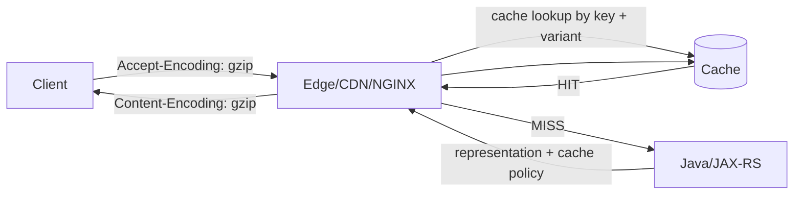
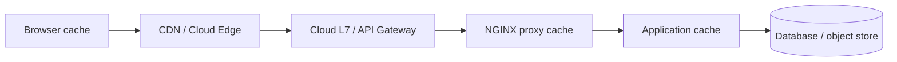
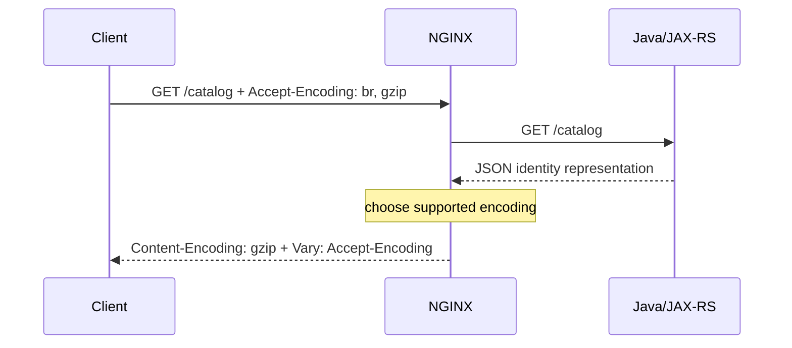
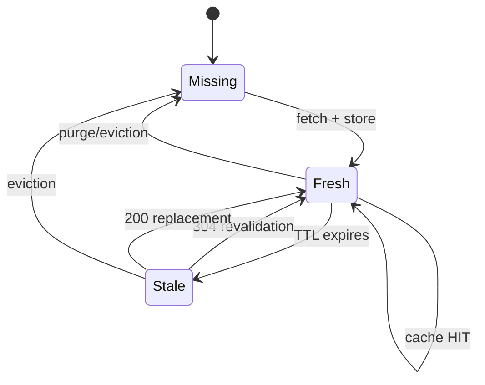
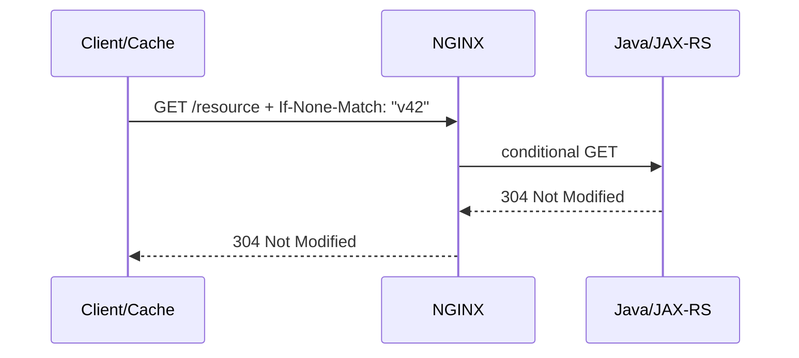
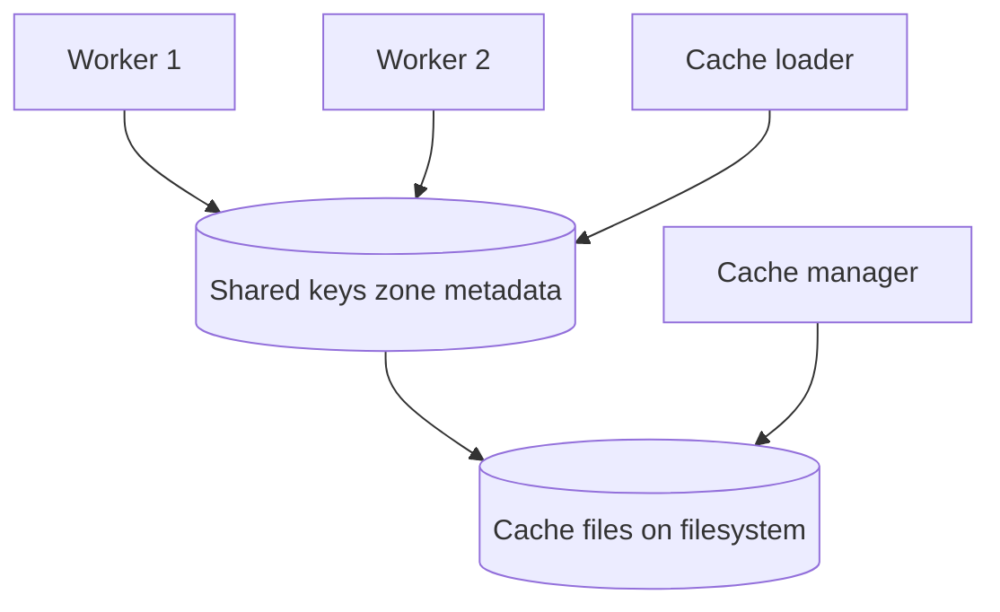
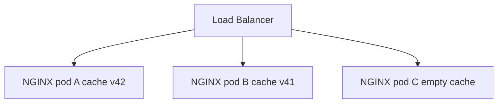
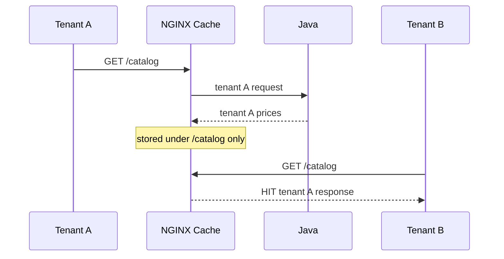

# Part 011 — Compression, Proxy Caching, and Static Content

> **Depth level:** Advanced  
> **Prerequisite:** Part 006 dan 010; dasar HTTP caching, content negotiation, content encoding, validators, dan filesystem/container storage.  
> **Scope:** response compression, browser/shared/proxy caching, static asset delivery, SPA fallback, cache safety, invalidation, observability, dan Java/JAX-RS integration.  
> **Bukan scope utama:** request/response buffering—Part 010; rate limiting—Part 013; general security hardening—Part 012; performance capacity model—Part 016.

---

## Daftar isi

1. [Tujuan pembelajaran](#tujuan-pembelajaran)
2. [Executive mental model](#executive-mental-model)
3. [Tiga lifecycle yang tidak boleh dicampur](#tiga-lifecycle-yang-tidak-boleh-dicampur)
4. [Layered cache topology](#layered-cache-topology)
5. [Compression negotiation lifecycle](#compression-negotiation-lifecycle)
6. [Content-Encoding dan transfer framing](#content-encoding-dan-transfer-framing)
7. [`gzip` baseline](#gzip-baseline)
8. [`gzip_types`, `gzip_min_length`, dan MIME correctness](#gzip_types-gzip_min_length-dan-mime-correctness)
9. [`gzip_comp_level` dan CPU trade-off](#gzip_comp_level-dan-cpu-trade-off)
10. [`gzip_proxied`](#gzip_proxied)
11. [`gzip_vary` dan representation variants](#gzip_vary-dan-representation-variants)
12. [Brotli availability dan governance](#brotli-availability-dan-governance)
13. [Double compression dan pre-compressed assets](#double-compression-dan-pre-compressed-assets)
14. [Compression untuk API dan streaming](#compression-untuk-api-dan-streaming)
15. [Compression security concerns](#compression-security-concerns)
16. [HTTP caching vocabulary](#http-caching-vocabulary)
17. [Freshness, validation, dan invalidation](#freshness-validation-dan-invalidation)
18. [`Cache-Control` policy](#cache-control-policy)
19. [ETag dan Last-Modified](#etag-dan-last-modified)
20. [Conditional request lifecycle](#conditional-request-lifecycle)
21. [Weak versus strong validator](#weak-versus-strong-validator)
22. [NGINX proxy cache architecture](#nginx-proxy-cache-architecture)
23. [`proxy_cache_path`](#proxy_cache_path)
24. [Cache key sebagai security boundary](#cache-key-sebagai-security-boundary)
25. [Default cache eligibility](#default-cache-eligibility)
26. [`proxy_cache_bypass` versus `proxy_no_cache`](#proxy_cache_bypass-versus-proxy_no_cache)
27. [Authorization, cookies, tenant, dan personalization](#authorization-cookies-tenant-dan-personalization)
28. [`Vary` dan content negotiation](#vary-dan-content-negotiation)
29. [Cache validity dan origin headers](#cache-validity-dan-origin-headers)
30. [Cache lock dan thundering herd](#cache-lock-dan-thundering-herd)
31. [Stale serving dan background update](#stale-serving-dan-background-update)
32. [Negative caching](#negative-caching)
33. [Invalidation dan purge](#invalidation-dan-purge)
34. [Distributed replica cache semantics](#distributed-replica-cache-semantics)
35. [Static file serving](#static-file-serving)
36. [Immutable asset strategy](#immutable-asset-strategy)
37. [SPA routing dan fallback](#spa-routing-dan-fallback)
38. [HTML shell versus versioned assets](#html-shell-versus-versioned-assets)
39. [Java/JAX-RS cache ownership](#javajax-rs-cache-ownership)
40. [API endpoint decision matrix](#api-endpoint-decision-matrix)
41. [Kubernetes dan container implications](#kubernetes-dan-container-implications)
42. [AWS, Azure, on-prem, dan hybrid](#aws-azure-on-prem-dan-hybrid)
43. [Cache poisoning dan cache deception](#cache-poisoning-dan-cache-deception)
44. [Wrong-tenant dan personalized-response leakage](#wrong-tenant-dan-personalized-response-leakage)
45. [Observability contract](#observability-contract)
46. [Capacity model](#capacity-model)
47. [Failure-mode catalogue](#failure-mode-catalogue)
48. [Debugging playbooks](#debugging-playbooks)
49. [Reference configurations](#reference-configurations)
50. [Anti-patterns](#anti-patterns)
51. [Security considerations](#security-considerations)
52. [Performance considerations](#performance-considerations)
53. [PR review checklist](#pr-review-checklist)
54. [Internal verification checklist](#internal-verification-checklist)
55. [Hands-on exercises](#hands-on-exercises)
56. [Ringkasan invariants](#ringkasan-invariants)
57. [Referensi resmi](#referensi-resmi)

---

## Tujuan pembelajaran

Setelah menyelesaikan part ini, Anda harus mampu:

1. membedakan compression, buffering, browser cache, shared cache, dan proxy cache;
2. menjelaskan negotiation `Accept-Encoding` → `Content-Encoding` → `Vary`;
3. memilih MIME type, minimum size, dan compression level secara terukur;
4. mengenali double compression, delayed streaming, dan compression-related information leakage;
5. merancang `Cache-Control`, ETag, Last-Modified, dan conditional requests;
6. memahami arsitektur metadata-versus-body pada NGINX proxy cache;
7. merancang cache key yang aman untuk host, query, language, representation, tenant, dan identity;
8. membedakan bypass cache read dengan larangan menyimpan response;
9. mencegah authenticated atau personalized response bocor ke pengguna lain;
10. mengendalikan thundering herd, stale serving, negative caching, dan invalidation;
11. merancang static asset dan SPA caching tanpa membuat HTML shell menjadi stale;
12. menghitung disk, metadata-zone, hit ratio, dan origin-offload impact;
13. men-debug `MISS`, `BYPASS`, unexpected `HIT`, stale content, dan validator mismatch;
14. mereview perubahan caching sebagai perubahan data-isolation dan consistency semantics.

---

## Executive mental model

Compression dan caching mengoptimalkan hal berbeda:

```text
compression = mengurangi bytes per transfer
caching     = mengurangi jumlah transfer/origin computation
```

Keduanya dapat digabungkan, tetapi setiap kombinasi menciptakan **representation variant**.



### Core invariants

> **Cache correctness lebih penting daripada cache hit ratio.**

> **Cache key adalah bagian dari authorization boundary ketika response berbeda berdasarkan user, tenant, role, locale, atau header.**

> **Compression hanya aman bila semua layer sepakat siapa yang melakukan encoding dan bagaimana variant dibedakan.**

---

## Tiga lifecycle yang tidak boleh dicampur

### 1. Encoding lifecycle

Menentukan bentuk bytes yang dikirim:

```text
JSON identity → gzip bytes
CSS identity  → brotli bytes
```

### 2. Freshness lifecycle

Menentukan kapan cached representation dapat digunakan tanpa bertanya ke origin:

```text
fresh → stale → revalidated/refetched
```

### 3. Invalidation lifecycle

Menentukan bagaimana cached object dihapus atau dibuat obsolete sebelum expiry alami:

```text
publish v42 → purge v41 / change URL / wait TTL
```

Kesalahan umum adalah memakai TTL panjang tanpa strategi invalidation, atau melakukan purge tanpa memahami bahwa browser/CDN/NGINX memiliki cache independen.

---

## Layered cache topology

Satu response dapat melewati beberapa cache:



| Layer | Scope | Primary control | Typical risk |
|---|---|---|---|
| browser | satu client/profile | response headers | stale client state |
| CDN | global/region | CDN rule + headers | cross-user leakage |
| NGINX proxy cache | instance/replica | NGINX config | inconsistent replica cache |
| application cache | service/domain | application code | stale business data |
| database cache | datastore | engine | hidden latency variability |

### Required architecture question

Sebelum menambah NGINX cache, jawab:

1. cache apa yang sudah ada;
2. siapa owner freshness;
3. siapa owner invalidation;
4. apakah response public atau identity-specific;
5. consistency guarantee apa yang boleh berubah;
6. bagaimana rollback dilakukan bila cache key salah.

---

## Compression negotiation lifecycle



NGINX hanya boleh mengirim encoded response yang client nyatakan dapat diterima. Bila tidak ada encoding yang kompatibel, gunakan identity representation.

### Header roles

| Header | Direction | Meaning |
|---|---|---|
| `Accept-Encoding` | request | encoding yang diterima client |
| `Content-Encoding` | response | encoding yang benar-benar dipakai |
| `Vary: Accept-Encoding` | response | cache harus membedakan variant berdasarkan request header |
| `Content-Length` | response | length setelah encoding bila diketahui |

---

## Content-Encoding dan transfer framing

`Content-Encoding: gzip` tidak sama dengan `Transfer-Encoding: chunked`.

- content encoding mengubah representation bytes;
- transfer framing mengatur bagaimana message dikirim pada satu hop;
- HTTP/2 dan HTTP/3 tidak menggunakan HTTP/1.1 chunked framing;
- buffering dapat memengaruhi kapan length diketahui, tetapi tidak mengubah makna representation.

### Representation invariant

> Decompressing body harus menghasilkan representation yang sama dengan semantics response sebelum compression.

---

## `gzip` baseline

Contoh baseline konservatif:

```nginx
http {
    gzip on;
    gzip_vary on;
    gzip_min_length 1024;
    gzip_comp_level 4;

    gzip_types
        text/plain
        text/css
        application/json
        application/javascript
        application/xml
        image/svg+xml;
}
```

Ini bukan angka universal. Ukur berdasarkan:

- response-size distribution;
- CPU headroom;
- client mix;
- latency dan bandwidth;
- compression lain di CDN/cloud edge;
- streaming behavior.

---

## `gzip_types`, `gzip_min_length`, dan MIME correctness

Compression selection bergantung pada `Content-Type`, bukan file extension semata.

### Compressible examples

- JSON;
- XML;
- text;
- JavaScript;
- CSS;
- SVG.

### Usually already compressed

- JPEG/PNG/WebP/AVIF;
- ZIP/GZIP;
- many video/audio formats;
- compressed PDF variants.

Men-compress format yang sudah compressed biasanya menambah CPU dengan pengurangan bytes minimal atau bahkan memperbesar body.

### MIME correctness requirement

Jika Java mengirim `application/octet-stream` untuk JSON, `gzip_types application/json` tidak akan cocok. Perbaiki `Content-Type`; jangan mengandalkan wildcard yang terlalu luas untuk menutupi contract yang salah.

### Minimum length

Response kecil mungkin lebih mahal dikompres daripada bytes yang dihemat. `gzip_min_length` harus ditentukan dari distribusi ukuran aktual, bukan copy-paste.

---

## `gzip_comp_level` dan CPU trade-off

Compression level lebih tinggi biasanya:

- menggunakan lebih banyak CPU;
- menambah latency encode;
- memberi diminishing return pada size reduction.

Model sederhana:

```text
net benefit = transfer_time_saved - compression_cpu_time - queueing_penalty
```

Pada jaringan cepat dan CPU hampir saturated, compression agresif dapat memperburuk p99. Pada koneksi lambat atau payload besar, compression dapat sangat membantu.

### Benchmark matrix

| Dimension | Measure |
|---|---|
| payload | 1 KB, 10 KB, 100 KB, 1 MB |
| content | JSON, XML, HTML, JS, SVG |
| level | 1, 4, 6, 9 |
| result | encoded bytes, CPU, TTFB, total latency |
| concurrency | normal dan peak |

---

## `gzip_proxied`

`gzip_proxied` mengontrol compression response ketika request dianggap proxied oleh presence `Via` header.

Contoh:

```nginx
gzip_proxied expired no-cache no-store private auth;
```

Jangan menganggap directive ini berarti “response dari upstream Java”. Semantics resminya terkait proxied request yang dikenali melalui `Via`. Validasi topology dan header chain aktual.

---

## `gzip_vary` dan representation variants

Dengan compression negotiation, shared cache harus membedakan:

```text
/catalog + identity
/catalog + gzip
/catalog + br
```

`gzip_vary on;` menambahkan `Vary: Accept-Encoding` ketika relevan.

### Failure bila `Vary` hilang

- client yang tidak mendukung gzip menerima compressed bytes;
- cache menyimpan identity variant tetapi mengirimnya dengan metadata yang salah;
- CDN dan NGINX berbeda dalam normalisasi encoding;
- hit ratio tampak tinggi tetapi response corrupt pada subset client.

---

## Brotli availability dan governance

Brotli tidak boleh diasumsikan tersedia di setiap build NGINX Open Source. Implementasi sering berasal dari dynamic/third-party module, vendor distribution, NGINX Plus packaging tertentu, atau dilakukan di CDN.

### Internal verification

```bash
nginx -V 2>&1
```

Periksa:

- compile modules;
- dynamic modules yang dimuat;
- image/package source;
- patch dan CVE ownership;
- compatibility saat upgrade;
- apakah CDN sudah melakukan Brotli.

### Decision rule

Brotli paling masuk akal untuk static text assets yang dapat di-precompress. Dynamic Brotli harus dibenchmark terhadap CPU budget dan operational complexity.

---

## Double compression dan pre-compressed assets

### Double compression failure

```text
Java gzip → NGINX gzip lagi → client sees nested/invalid encoding
```

NGINX umumnya tidak seharusnya mengompres response yang sudah memiliki `Content-Encoding`, tetapi seluruh chain tetap harus diverifikasi—terutama bila CDN, service mesh, atau custom modules ikut mengubah headers.

### Pre-compressed assets

Build pipeline dapat menghasilkan:

```text
app.8f31.js
app.8f31.js.gz
app.8f31.js.br
```

Advantages:

- no runtime compression CPU;
- deterministic artifacts;
- high compression level offline.

Risks:

- variant file tidak sinkron dengan source;
- wrong `Content-Type` atau `Content-Encoding`;
- missing `Vary`;
- deployment hanya meng-update salah satu variant.

---

## Compression untuk API dan streaming

Compression cocok untuk large, finite, text responses. Compression dapat buruk untuk:

- SSE yang membutuhkan flush cepat;
- very small responses;
- already-compressed binary;
- streams dengan latency-sensitive chunks;
- response yang menggabungkan secret dan attacker-controlled input.

### Streaming concern

Compressor dapat menahan bytes sampai buffer/block cukup besar. Hasilnya:

- TTFB atau event latency meningkat;
- SSE tampak “batching”;
- heartbeat tidak segera keluar.

Uji end-to-end, jangan hanya memastikan header `Content-Encoding` muncul.

---

## Compression security concerns

Compression over encrypted transport dapat membocorkan informasi melalui perubahan ciphertext length bila response mengandung:

- secret;
- attacker-controlled reflection;
- banyak repeated guesses;
- observable response lengths.

Ini adalah keluarga risiko compression side-channel seperti BREACH.

### Mitigation direction

- jangan refleksikan attacker input berdekatan dengan secret;
- pertimbangkan menonaktifkan compression pada response yang sensitif;
- rotate/mask secrets;
- add randomness hanya bila dipahami trade-off-nya;
- jangan menganggap TLS menghilangkan size side channel.

---

## HTTP caching vocabulary

| Term | Meaning |
|---|---|
| cacheable | response diizinkan disimpan |
| fresh | dapat dipakai tanpa revalidation |
| stale | freshness lifetime telah habis |
| validation | bertanya apakah representation berubah |
| invalidation | membuat cached object tidak lagi valid |
| private cache | browser/user-specific cache |
| shared cache | CDN/proxy cache lintas user |
| cache key | identity object di cache |
| validator | ETag atau Last-Modified |
| hit | response dilayani dari cache |
| miss | cache lookup gagal dan origin dipanggil |
| bypass | lookup sengaja dilewati |
| revalidated | stale object dikonfirmasi masih valid |

---

## Freshness, validation, dan invalidation



### Important distinction

Expired object tidak selalu langsung dihapus dari disk. Ia dapat tetap ada tetapi tidak fresh. Parameter `inactive` pada cache path berkaitan dengan ketidakaktifan akses, bukan sama dengan response TTL.

---

## `Cache-Control` policy

Common directives:

| Directive | Meaning |
|---|---|
| `no-store` | jangan simpan response |
| `private` | hanya private cache |
| `public` | shared caching diperbolehkan bila aturan lain terpenuhi |
| `max-age=N` | freshness untuk cache umum/client |
| `s-maxage=N` | freshness khusus shared cache |
| `no-cache` | boleh simpan, tetapi revalidate sebelum reuse |
| `must-revalidate` | setelah stale, jangan reuse tanpa validation |
| `immutable` | URL tidak akan berubah selama freshness lifetime |
| `stale-while-revalidate=N` | boleh serve stale saat refresh |
| `stale-if-error=N` | boleh serve stale saat error tertentu |

### Policy examples

Sensitive authenticated API:

```http
Cache-Control: no-store
```

Versioned static asset:

```http
Cache-Control: public, max-age=31536000, immutable
```

HTML shell:

```http
Cache-Control: no-cache
```

Public catalog snapshot:

```http
Cache-Control: public, max-age=60, s-maxage=300, stale-while-revalidate=30
```

Exact policy harus selaras dengan business consistency.

---

## ETag dan Last-Modified

Validators mengurangi transfer ketika resource belum berubah.

### ETag

```http
ETag: "catalog-v42"
```

Client:

```http
If-None-Match: "catalog-v42"
```

Origin dapat menjawab:

```http
304 Not Modified
```

### Last-Modified

```http
Last-Modified: Sat, 11 Jul 2026 03:00:00 GMT
```

Client:

```http
If-Modified-Since: Sat, 11 Jul 2026 03:00:00 GMT
```

### Preference

ETag dapat merepresentasikan version identity lebih presisi. Timestamp dapat terlalu kasar atau berubah karena rebuild/copy walau content sama.

---

## Conditional request lifecycle



Untuk NGINX proxy cache, revalidation dapat menggunakan cached validators ketika `proxy_cache_revalidate on;` dan policy mendukungnya.

### Failure mode

Java menghasilkan ETag dari uncompressed representation, sementara intermediary mengubah body atau variant tanpa menjaga validator semantics. Tentukan apakah ETag berlaku untuk identity representation atau encoded representation, dan uji tiap hop.

---

## Weak versus strong validator

Strong ETag menyatakan byte-for-byte identity. Weak ETag:

```http
ETag: W/"catalog-v42"
```

menyatakan semantic equivalence tetapi tidak byte-identical.

Strong validators relevan untuk byte ranges dan strict representation identity. Weak validators dapat lebih cocok bila harmless serialization differences tidak dianggap perubahan semantics.

---

## NGINX proxy cache architecture



- `keys_zone` menyimpan metadata/cache keys dalam shared memory;
- response bodies disimpan sebagai files;
- cache manager mengontrol size/inactive cleanup;
- cache loader memuat metadata setelah startup;
- filesystem latency dan capacity menjadi bagian request path.

### Important invariant

> `keys_zone=100m` bukan berarti cache body dibatasi 100 MB.

Gunakan `max_size` untuk body store limit dan observasi disk actual.

---

## `proxy_cache_path`

Contoh:

```nginx
proxy_cache_path /var/cache/nginx/api
    levels=1:2
    keys_zone=api_cache:100m
    max_size=20g
    inactive=30m
    use_temp_path=off;
```

| Parameter | Role |
|---|---|
| path | root filesystem cache |
| `levels` | directory hierarchy |
| `keys_zone` | shared metadata zone |
| `max_size` | approximate body-store cap |
| `inactive` | remove object yang tidak diakses selama window |
| `use_temp_path` | temp write location behavior |

### Filesystem requirement

Cache path harus:

- writable oleh NGINX user;
- memiliki disk/ephemeral quota;
- dipantau inode dan bytes;
- tidak berada pada slow/shared filesystem tanpa benchmark;
- memiliki cleanup semantics yang dipahami saat restart/reschedule.

---

## Cache key sebagai security boundary

Default cache key NGINX berbasis scheme, proxy host, dan request URI. Itu belum tentu cukup untuk aplikasi enterprise.

### Potential key dimensions

- external host;
- normalized path;
- query parameters;
- request method;
- language;
- media type/version;
- encoding variant;
- tenant;
- region;
- authorization scope;
- feature variant.

### Core test

Dua request boleh berbagi cache entry **hanya jika response-nya aman dan semantically interchangeable**.

### Dangerous example

```nginx
proxy_cache_key "$uri";
```

Jika host, query, tenant, atau representation memengaruhi response, key di atas terlalu sempit.

### Safer public API example

```nginx
proxy_cache_key "$scheme|$host|$request_method|$uri|$is_args$args|$http_accept|$http_accept_language";
```

Ini tetap harus dinormalisasi dan dievaluasi terhadap cardinality/poisoning risk.

---

## Default cache eligibility

NGINX proxy cache secara default memasukkan `GET` dan `HEAD` sebagai cache methods. Jangan menambah `POST` tanpa explicit application semantics dan body-aware key—bahkan body-aware caching tetap membawa complexity besar.

Origin headers seperti `Cache-Control`, `Expires`, `Set-Cookie`, dan `Vary` memengaruhi caching. Secara default, response dengan `Set-Cookie` tidak disimpan dan `Vary: *` tidak disimpan.

### Never infer safety from defaults alone

Config seperti `proxy_ignore_headers Cache-Control Set-Cookie Vary;` dapat mematikan safeguards tersebut. Audit directive ini sebagai high-risk change.

---

## `proxy_cache_bypass` versus `proxy_no_cache`

| Directive | Effect |
|---|---|
| `proxy_cache_bypass` | jangan membaca existing cache untuk request ini |
| `proxy_no_cache` | jangan menyimpan response request ini |

Authenticated request sering membutuhkan keduanya:

```nginx
map $http_authorization $has_authorization {
    default 1;
    ""      0;
}

location /api/public-candidate/ {
    proxy_cache api_cache;
    proxy_cache_bypass $has_authorization;
    proxy_no_cache     $has_authorization;
}
```

Tetapi authorization header bukan satu-satunya personalization signal. Cookies, mTLS identity, trusted identity headers, tenant header, atau session affinity dapat memengaruhi response.

---

## Authorization, cookies, tenant, dan personalization

### Unsafe assumption

> “Endpoint GET berarti aman dicache.”

GET hanya menunjukkan method semantics, bukan public visibility.

### Personalized dimensions

- user ID;
- tenant ID;
- roles/entitlements;
- locale;
- account state;
- feature flags;
- contract/catalog version;
- regional regulation;
- pricing agreement.

CPQ/quote/order systems sangat rentan pada wrong-tenant cache karena response dapat berisi pricing, discount, customer, atau order data.

### Default enterprise rule

Cache only when one of these is true:

1. response benar-benar public dan identical;
2. cache key secara eksplisit mencakup seluruh security/representation dimensions;
3. isolation dilakukan per tenant/user dengan bounded cardinality dan clear invalidation;
4. formal threat model dan tests membuktikannya.

Untuk quote/order/customer endpoints, default yang aman adalah **tidak menggunakan shared edge cache**.

---

## `Vary` dan content negotiation

`Vary` menyatakan request headers yang membentuk representation.

Examples:

```http
Vary: Accept-Encoding
Vary: Accept-Language
Vary: Accept
```

NGINX dapat mempertimbangkan request header fields yang disebut oleh `Vary` ketika caching response. `Vary: *` mencegah caching.

### Cardinality risk

`Vary: User-Agent` dapat menciptakan sangat banyak variants. Jangan menambah high-cardinality header tanpa kebutuhan dan normalization.

### Cache-key versus Vary ownership

Tentukan apakah dimension ditangani oleh:

- NGINX cache machinery melalui `Vary`;
- explicit `proxy_cache_key`;
- upstream/CDN;
- tidak dicache sama sekali.

Jangan menggandakan atau membuat inconsistent variant logic antar layer.

---

## Cache validity dan origin headers

Origin idealnya menentukan business freshness melalui `Cache-Control`/validators. NGINX dapat menetapkan fallback:

```nginx
proxy_cache_valid 200 302 5m;
proxy_cache_valid 404 30s;
```

Tetapi override TTL di edge dapat melanggar application consistency.

### `X-Accel-Expires`

Upstream dapat memberi NGINX-specific cache lifetime. Gunakan hanya bila contract terdokumentasi dan tidak bocor ke intermediary yang salah.

### `proxy_ignore_headers`

Directive ini dapat mengabaikan origin caching signals. Ia powerful dan berbahaya:

```nginx
# High risk: requires explicit review
proxy_ignore_headers Cache-Control Set-Cookie Vary;
```

Perubahan ini harus diperlakukan sebagai security dan data-consistency decision.

---

## Cache lock dan thundering herd

Ketika key populer expire, banyak request dapat mengenai origin bersamaan:

```text
1 expired key × 5,000 concurrent requests = origin collapse
```

`proxy_cache_lock on;` memungkinkan satu request mengisi missing key sementara request lain menunggu hingga lock timeout.

```nginx
proxy_cache_lock on;
proxy_cache_lock_timeout 5s;
proxy_cache_lock_age 10s;
```

### Trade-offs

- mengurangi stampede;
- menambah waiting latency;
- lock timeout yang salah tetap membanjiri origin;
- slow/hung fill dapat memblokir banyak request;
- key cardinality dan hot-key distribution tetap penting.

---

## Stale serving dan background update

Stale serving dapat menjaga availability ketika origin error:

```nginx
proxy_cache_use_stale
    error
    timeout
    updating
    http_500
    http_502
    http_503
    http_504;

proxy_cache_background_update on;
```

### Architecture decision

Stale data acceptable untuk:

- public documentation;
- static catalog metadata tertentu;
- non-critical reference data.

Stale data mungkin unacceptable untuk:

- price/discount commitment;
- order state;
- payment status;
- inventory reservation;
- authorization/entitlements;
- regulatory state.

Availability tidak otomatis lebih penting daripada correctness.

---

## Negative caching

Caching 404/5xx dapat mengurangi origin load, tetapi berisiko:

- resource baru tetap terlihat 404;
- transient authorization error tersebar;
- outage response bertahan setelah recovery;
- deployment race menjadi lebih lama.

Gunakan TTL pendek dan hanya untuk status yang semantics-nya stabil.

```nginx
proxy_cache_valid 404 10s;
```

Jangan cache 401/403 lintas identity kecuali isolation terbukti.

---

## Invalidation dan purge

Empat strategi utama:

### 1. Versioned URL

```text
/app.8f31.js
/catalog/snapshot/v42
```

Paling reliable karena invalidation berubah menjadi new key.

### 2. Short TTL

Simple tetapi origin load meningkat dan staleness tetap ada selama TTL.

### 3. Explicit purge

Memerlukan authentication, authorization, routing ke semua replicas, audit, dan retry.

NGINX cache purge directive tertentu merupakan commercial capability; open-source deployments sering memakai module/tooling lain atau filesystem/versioned-key strategy. Verifikasi distribution.

### 4. Cache-key epoch

```nginx
proxy_cache_key "$cache_epoch|$scheme|$host|$request_uri";
```

Menaikkan epoch membuat old objects unreachable dan kemudian dibersihkan. Ini logical invalidation, bukan immediate disk deletion.

---

## Distributed replica cache semantics

Pada Kubernetes, setiap controller/NGINX replica biasanya memiliki local cache filesystem kecuali shared storage digunakan.



Consequences:

- hit ratio per replica;
- purge harus mencapai semua replicas;
- reschedule menghilangkan local cache;
- rollout menghasilkan cold cache;
- client dapat melihat alternating stale/fresh results;
- HPA mengubah effective cache capacity.

Shared filesystem dapat menambah contention, locking, latency, dan failure domain. Jangan menggunakannya tanpa dukungan resmi dan benchmark.

---

## Static file serving

NGINX sangat efektif untuk static files ketika deployment pattern memang membutuhkan local delivery.

```nginx
location /assets/ {
    root /usr/share/nginx/html;
    try_files $uri =404;
}
```

### `root` path composition

Request `/assets/app.js` dengan:

```nginx
root /usr/share/nginx/html;
```

mencari:

```text
/usr/share/nginx/html/assets/app.js
```

Pahami perbedaan `root` versus `alias` dari Part 003–004; salah konfigurasi dapat menyebabkan path traversal-like exposure atau wrong-file mapping.

### Operational checks

- immutable image artifact;
- no writable document root;
- correct ownership;
- MIME types loaded;
- directory listing disabled kecuali explicit;
- hidden/sensitive files tidak ikut image;
- supply-chain provenance untuk frontend bundle.

---

## Immutable asset strategy

Recommended pattern:

```text
main.8f316c2.js
styles.a9d4421.css
logo.1e21ab4.svg
```

```nginx
location /assets/ {
    try_files $uri =404;
    expires 1y;
    add_header Cache-Control "public, max-age=31536000, immutable";
}
```

### Immutable-filename invariant

> Filename/content hash harus berubah setiap kali bytes berubah.

Jangan overwrite file bernama sama dengan bytes baru ketika TTL satu tahun.

---

## SPA routing dan fallback

Typical SPA fallback:

```nginx
location / {
    try_files $uri $uri/ /index.html;
}
```

Risks:

- missing API path kembali sebagai `200 index.html`;
- scanner path mendapat HTML bukan 404;
- asset typo di-fallback ke HTML dan memicu MIME error;
- backend route tertelan oleh generic SPA location.

Safer separation:

```nginx
location /api/ {
    proxy_pass http://java_backend;
}

location /assets/ {
    try_files $uri =404;
}

location / {
    try_files $uri $uri/ /index.html;
}
```

Order dan exact location rules harus diuji sesuai Part 004.

---

## HTML shell versus versioned assets

HTML entry point menunjuk ke asset hashes. Bila HTML terlalu lama cached, browser dapat meminta asset yang sudah dihapus.

Recommended split:

| Resource | Typical policy |
|---|---|
| `index.html` | `no-cache` atau short TTL + revalidation |
| versioned JS/CSS/images | long TTL + `immutable` |
| runtime config JSON | short TTL/no-store sesuai sensitivity |
| source maps | biasanya jangan public di production |

### Deployment invariant

Keep previous versioned assets selama maximum HTML/cache transition window, atau gunakan atomic publication.

---

## Java/JAX-RS cache ownership

Application harus mengeluarkan policy yang sesuai business semantics.

Example JAX-RS response:

```java
return Response.ok(entity)
    .cacheControl(cacheControl)
    .tag(new EntityTag(version))
    .build();
```

### Responsibilities

Java/application owns:

- apakah data public/private;
- domain freshness;
- version/ETag semantics;
- authorization/personalization;
- invalidation trigger.

NGINX owns:

- shared cache implementation;
- key mapping;
- storage/capacity;
- stampede/stale mechanics;
- transport-level compression.

Ownership dapat berubah, tetapi harus explicit.

---

## API endpoint decision matrix

| Endpoint | Shared edge cache? | Reason |
|---|---|---|
| public product metadata | maybe | stable/public, key by version/locale |
| tenant-specific catalog | high risk | tenant/pricing isolation |
| quote detail | no by default | confidential and mutable |
| order status | no by default | freshness-critical |
| country/reference list | yes/maybe | stable, public if identical |
| health/readiness | usually no | must reflect live instance state |
| OpenAPI document | yes/maybe | versioned public/internal artifact |
| login/token endpoint | no | secrets and identity |
| report export | usually no shared cache | authorization and large payload |

---

## Kubernetes dan container implications

### Cache storage choices

| Storage | Behavior |
|---|---|
| container writable layer | ephemeral, image-runtime dependent |
| `emptyDir` | pod-local, deleted on pod removal |
| memory `emptyDir` | fast but consumes memory/cgroup budget |
| persistent volume | survives pod; may be slow/shared/complex |
| external CDN | separate control plane and invalidation |

### Required checks

- `emptyDir.sizeLimit`;
- pod ephemeral-storage requests/limits;
- filesystem permissions;
- read-only root filesystem exceptions;
- cache warm-up after rollout;
- HPA and replica-local hit ratio;
- PodDisruptionBudget versus cold-cache storm;
- eviction behavior when node disk pressure occurs.

### Ingress controller warning

Enabling proxy cache globally on a shared ingress controller can affect unrelated namespaces and security boundaries. Prefer explicit, governed, route-specific policy.

---

## AWS, Azure, on-prem, dan hybrid

### AWS

Potential layers:

```text
CloudFront → ALB/NLB → NGINX → Java
```

Verify:

- CloudFront compression and cache key policy;
- forwarded headers/query/cookies;
- origin cache-control handling;
- invalidation ownership;
- whether NGINX cache adds real value after CDN.

### Azure

Potential layers:

```text
Front Door/CDN → Application Gateway/LB → NGINX → Java
```

Verify rule-set/header modifications, private origin behavior, and duplicate compression.

### On-prem

Potential layers:

```text
Enterprise proxy/appliance → L7 LB → NGINX → Java
```

Legacy appliances may normalize headers, remove `Vary`, decompress/recompress, atau cache unexpectedly.

### Hybrid

Different ingress paths may have different cache layers. A bug that occurs only via public path but not private path often indicates intermediary-policy divergence.

---

## Cache poisoning dan cache deception

### Cache poisoning

Attacker causes cache to store a malicious/wrong response for a key later used by victims.

Common causes:

- unkeyed `Host`/forwarded header;
- unkeyed query/header that affects response;
- origin reflects attacker input;
- inconsistent normalization;
- cached error/redirect;
- method/body not represented in key.

### Cache deception

Attacker crafts URL that appears static/cacheable to intermediary but maps to personalized dynamic content in backend.

Example pattern:

```text
/account/profile.css
```

Backend routing may ignore suffix and return account page while cache classifies `.css` as public static content.

### Defenses

- cache by explicit route, not extension alone;
- strict route and content-type agreement;
- reject ambiguous paths;
- never cache authenticated responses by generic static rule;
- test alternate encodings, suffixes, delimiters, duplicate headers;
- log cache status and selected route.

---

## Wrong-tenant dan personalized-response leakage

Worst-case lifecycle:



### Detection signals

- `HIT` on authenticated endpoints;
- same ETag/body hash across tenants unexpectedly;
- cache key logs omit tenant dimension;
- support reports of intermittent foreign data;
- behavior changes depending on first requester after expiry.

### Immediate response

1. disable/bypass cache;
2. purge all affected entries/replicas/CDNs;
3. assess data exposure scope from logs;
4. rotate sensitive credentials if included;
5. preserve forensic evidence;
6. fix key/policy and add isolation tests.

---

## Observability contract

Recommended log fields:

```nginx
log_format cache_json escape=json
'{'
  '"request_id":"$request_id",'
  '"host":"$host",'
  '"uri":"$uri",'
  '"args":"$args",'
  '"status":$status,'
  '"cache_status":"$upstream_cache_status",'
  '"upstream":"$upstream_addr",'
  '"request_time":$request_time,'
  '"upstream_time":"$upstream_response_time",'
  '"bytes_sent":$bytes_sent,'
  '"gzip_ratio":"$gzip_ratio",'
  '"content_type":"$sent_http_content_type",'
  '"content_encoding":"$sent_http_content_encoding"'
'}';
```

Do not log raw authorization, cookies, sensitive tenant/user identifiers, or full query strings without privacy review.

### Cache status values commonly observed

- `MISS`;
- `BYPASS`;
- `EXPIRED`;
- `STALE`;
- `UPDATING`;
- `REVALIDATED`;
- `HIT`.

Exact availability depends on path/config.

### Dashboards

- hit ratio by route/status;
- origin request reduction;
- cache fill latency;
- cache response latency;
- disk bytes/inodes;
- evictions and pod restarts;
- encoded versus identity bytes;
- CPU versus compression ratio;
- stale served count;
- wrong/unsafe route cache status audit.

---

## Capacity model

### Origin offload

```text
origin_rps = total_rps × (1 - cache_hit_ratio) + bypass_rps + revalidation_rps
```

Hit ratio 90% tidak berarti 90% CPU reduction bila misses adalah expensive requests atau cache fill causes stampede.

### Disk throughput

Approximation:

```text
cache_write_Bps ≈ miss_rps × average_cacheable_response_bytes
cache_read_Bps  ≈ hit_rps × average_cached_response_bytes not served from page cache
```

Kernel page cache dapat menyerap banyak reads, tetapi memory pressure mengubah behavior.

### Metadata zone

Number of keys, key length, metadata overhead, dan edition-specific behavior menentukan shared memory need. Load test expected cardinality; jangan menebak dari body size.

### Compression CPU

```text
compression_cpu ≈ encoded_responses_per_second × cpu_cost_per_response
```

Measure under concurrency karena queueing nonlinear saat CPU mendekati saturation.

---

## Failure-mode catalogue

| Symptom | Likely causes | First evidence |
|---|---|---|
| no gzip | type missing, body too small, client no support, already encoded | headers + MIME |
| high CPU | compression level/types too broad | CPU profile + `$gzip_ratio` |
| client corrupt body | double encoding/header mismatch | raw headers/body |
| SSE delayed | compression/buffering | chunk timing |
| cache always MISS | no cache directive, key churn, headers prevent cache | `$upstream_cache_status` |
| cache always BYPASS | bypass variable always truthy | expanded variable/log |
| unexpected HIT on auth endpoint | unsafe policy/key | request headers + config |
| stale after deploy | long TTL, no purge, multiple cache layers | `Age`, cache status, layer tests |
| one pod differs | replica-local cache | pin request to pod |
| disk full | max size/cleanup/storage mismatch | disk/inode metrics |
| huge key count | unbounded query/header cardinality | cache metadata/cardinality |
| HTML returned for JS | SPA fallback catches missing asset | content type + route trace |
| old HTML references missing assets | HTML cached too long/assets removed | HTML headers + artifact inventory |
| wrong tenant data | missing identity dimension | cache key reconstruction |
| origin spike at expiry | no lock/stale strategy | MISS burst + origin RPS |
| purge partial | not all layers/replicas invalidated | per-layer/pod probe |

---

## Debugging playbooks

### Playbook A — Is compression active?

```bash
curl -sS -D- --compressed https://api.example.com/catalog -o /dev/null
curl -sS -D- -H 'Accept-Encoding: identity' https://api.example.com/catalog -o /dev/null
curl -sS -D- -H 'Accept-Encoding: gzip' https://api.example.com/catalog -o /dev/null
```

Compare:

- `Content-Encoding`;
- `Vary`;
- `Content-Length`/transfer behavior;
- body bytes;
- latency;
- which layer added encoding.

### Playbook B — Why cache never hits?

1. inspect `$upstream_cache_status`;
2. repeat exact same request;
3. verify method `GET`/`HEAD`;
4. inspect `Cache-Control`, `Expires`, `Set-Cookie`, `Vary`;
5. inspect bypass/no-cache variables;
6. reconstruct actual key;
7. verify cache path permissions/disk;
8. verify request is hitting same replica;
9. check whether another layer adds `no-store`;
10. inspect error log at appropriate level.

### Playbook C — Stale content

```bash
curl -I https://example.com/resource
```

Capture:

- `Age` if present;
- ETag/Last-Modified;
- cache status/debug header;
- CDN-specific headers;
- request routed to which region/pod;
- origin direct result versus each edge layer.

Then map all TTLs and invalidation paths.

### Playbook D — Wrong variant

Send matrix:

```bash
curl -sS -H 'Accept-Encoding: identity' ...
curl -sS -H 'Accept-Encoding: gzip' ...
curl -sS -H 'Accept-Language: en' ...
curl -sS -H 'Accept-Language: id' ...
```

Compare body hash, response headers, and cache status.

### Playbook E — Suspected tenant leakage

- stop shared caching immediately;
- preserve relevant logs/config/version;
- reproduce only in isolated test environment;
- compare cache key dimensions;
- enumerate affected routes and time window;
- coordinate security/privacy incident process.

---

## Reference configurations

### Static SPA plus uncached API

```nginx
server {
    listen 443 ssl;
    server_name app.example.com;

    root /usr/share/nginx/html;

    location /api/ {
        proxy_pass http://java_backend;
        proxy_set_header Host $host;
        proxy_set_header X-Forwarded-Proto $scheme;
        proxy_set_header X-Forwarded-For $proxy_add_x_forwarded_for;

        # Application response policy is preserved.
        add_header Cache-Control "no-store" always;
    }

    location /assets/ {
        try_files $uri =404;
        expires 1y;
        add_header Cache-Control "public, max-age=31536000, immutable";
    }

    location = /index.html {
        try_files $uri =404;
        add_header Cache-Control "no-cache" always;
    }

    location / {
        try_files $uri $uri/ /index.html;
    }
}
```

Note: adding an edge `Cache-Control` may override/conflict with application policy. Decide one owner; sample above is illustrative.

### Public reference-data cache

```nginx
proxy_cache_path /var/cache/nginx/reference
    keys_zone=reference_cache:50m
    max_size=5g
    inactive=1h
    use_temp_path=off;

map $http_authorization $auth_bypass {
    default 1;
    ""      0;
}

server {
    location /api/reference/countries {
        proxy_pass http://java_backend;

        proxy_cache reference_cache;
        proxy_cache_key "$scheme|$host|$uri|$is_args$args|$http_accept_language";
        proxy_cache_bypass $auth_bypass;
        proxy_no_cache $auth_bypass;
        proxy_cache_valid 200 10m;
        proxy_cache_lock on;
        proxy_cache_revalidate on;
        proxy_cache_use_stale error timeout updating http_502 http_503 http_504;

        add_header X-Cache-Status $upstream_cache_status always;
    }
}
```

Before production, validate that the endpoint is actually identical across tenants/users and that debug cache headers are acceptable.

---

## Anti-patterns

1. cache every `GET` request;
2. use `$uri` only as cache key for multi-host/multi-tenant APIs;
3. ignore `Set-Cookie`, `Vary`, dan `Cache-Control` to “improve hit ratio”;
4. cache authenticated responses because authorization header was absent but session cookie existed;
5. cache 401/403/redirects without identity isolation;
6. enable one-year cache on non-versioned filenames;
7. let SPA fallback return HTML for missing static/API routes;
8. enable gzip for every MIME type including already-compressed formats;
9. select compression level from internet examples without load testing;
10. enable NGINX cache behind CDN without defining ownership;
11. assume purge reaches every pod/region/browser;
12. use local pod cache but expect globally consistent freshness;
13. expose purge endpoint publicly;
14. log full cache key when it contains sensitive identity/query values;
15. use cache to hide slow or incorrect application behavior.

---

## Security considerations

- shared cache changes data-isolation boundary;
- key normalization must match backend routing normalization;
- host and forwarded headers must be trusted/validated;
- cache only explicit routes;
- do not use filename extension alone as cacheability signal;
- purge interface requires authentication, authorization, audit, and network controls;
- compression can expose size side channels;
- cached security headers/cookies/redirects can amplify misconfiguration;
- query strings may include tokens/PII and become filenames/keys/log fields indirectly;
- local cache files require filesystem permissions and secure disposal expectations;
- source maps and runtime configuration files require exposure review.

---

## Performance considerations

- compression trades CPU for bandwidth;
- proxy cache trades disk/memory/consistency complexity for origin offload;
- high hit ratio can hide cold-cache p99;
- cache lock reduces stampede but introduces waiter latency;
- cache key cardinality affects metadata memory and hit ratio;
- large responses amplify disk write/read and eviction pressure;
- replica-local caches reduce effective hit ratio under load balancing;
- stale serving improves availability but may violate correctness;
- precompression reduces runtime CPU;
- CDN is often better for global static assets than pod-local NGINX cache.

---

## PR review checklist

### Compression

- [ ] Which MIME types are affected?
- [ ] Is another layer already compressing?
- [ ] Is `Vary: Accept-Encoding` preserved?
- [ ] What is measured CPU/bandwidth impact?
- [ ] Are streaming/SSE routes excluded?
- [ ] Are secret-bearing reflected responses considered?
- [ ] Is Brotli module provenance and upgrade ownership known?

### Caching

- [ ] Is route public, tenant-specific, or user-specific?
- [ ] What exact dimensions affect response?
- [ ] Can two different identities share one entry safely?
- [ ] What is the full cache key?
- [ ] Are query parameters normalized and bounded?
- [ ] Are authorization, cookies, mTLS identity, and trusted headers handled?
- [ ] Are `Set-Cookie`, `Vary`, and origin cache headers preserved?
- [ ] Are `proxy_cache_bypass` and `proxy_no_cache` both correct?
- [ ] What is freshness and stale policy?
- [ ] What is invalidation/purge plan?
- [ ] How are all replicas/regions/layers invalidated?
- [ ] What happens during origin outage?
- [ ] Is negative caching intentional?
- [ ] What is disk and metadata capacity?
- [ ] What metrics and rollback exist?

### Static assets

- [ ] Are filenames content-hashed?
- [ ] Is HTML shell short-lived/revalidated?
- [ ] Are old assets retained during rollout?
- [ ] Can SPA fallback swallow API/static errors?
- [ ] Are source maps/runtime configs exposed?
- [ ] Are MIME types correct?

---

## Internal verification checklist

### Codebase dan application contract

- [ ] Inventaris endpoint yang mengirim `Cache-Control`, `ETag`, `Last-Modified`, `Vary`, dan `Set-Cookie`.
- [ ] Identifikasi endpoint yang berbeda berdasarkan tenant, user, role, locale, contract, catalog version, dan feature flag.
- [ ] Periksa JAX-RS filters/interceptors yang mengubah cache headers atau compression.
- [ ] Verifikasi apakah application server sudah melakukan compression.
- [ ] Temukan static frontend/runtime config/source maps dalam deployment artifact.

### NGINX dan ingress

- [ ] Temukan `gzip*`, Brotli module/config, `proxy_cache_path`, `proxy_cache`, cache key, validity, lock, stale, bypass, dan no-cache rules.
- [ ] Audit `proxy_ignore_headers`, terutama `Cache-Control`, `Set-Cookie`, dan `Vary`.
- [ ] Periksa inheritance `add_header` dan penggunaan `always`.
- [ ] Rekonstruksi selected cache key untuk route penting.
- [ ] Periksa debug headers seperti `X-Cache-Status` agar tidak membocorkan informasi sensitif.
- [ ] Verifikasi cache path permission, storage class, quota, inode, dan cleanup.

### Kubernetes/GitOps

- [ ] Periksa ConfigMap, annotations/snippets, Helm values, Kustomize overlays, dan environment drift.
- [ ] Tentukan apakah cache local per pod atau persistent/shared.
- [ ] Periksa ephemeral-storage requests/limits dan `emptyDir.sizeLimit`.
- [ ] Verifikasi behavior saat rollout, HPA scale-out, node drain, dan pod restart.
- [ ] Temukan purge job/webhook dan bagaimana ia mencapai semua replicas.

### Cloud/on-prem edge

- [ ] Periksa compression/caching di CDN, ALB/Application Gateway/APIM/API Gateway, WAF, atau enterprise proxy.
- [ ] Petakan header/key policy per layer.
- [ ] Verifikasi browser/CDN/NGINX/application invalidation ownership.
- [ ] Uji public versus private network path untuk policy divergence.

### Observability dan incident history

- [ ] Tersedia `$upstream_cache_status`, gzip ratio, disk/inode, hit ratio, origin offload, dan stale metrics.
- [ ] Review incident stale content, wrong tenant, missing asset, disk full, atau CPU spike akibat compression.
- [ ] Periksa log privacy untuk query, key, cookie, authorization, dan tenant identity.
- [ ] Validasi runbook disable cache, purge, rollback, dan forensic preservation.

> Semua detail produk, route, tenant model, cache topology, dan cloud integration CSG harus dikonfirmasi melalui **Internal verification checklist**. Jangan mengasumsikan arsitektur internal yang tidak tersedia.

---

## Hands-on exercises

### Exercise 1 — Compression matrix

Untuk satu JSON endpoint:

1. request identity dan gzip;
2. ukur bytes, TTFB, total time;
3. ulangi pada payload 1 KB, 100 KB, 1 MB;
4. bandingkan CPU pada levels berbeda;
5. dokumentasikan break-even point.

### Exercise 2 — Safe public cache

Buat endpoint reference data dengan:

- ETag;
- `Cache-Control`;
- NGINX cache status log;
- cache lock;
- revalidation;
- test HIT/MISS/304.

### Exercise 3 — Wrong-tenant test

Di test environment, buat response berbeda untuk tenant A/B. Buktikan bahwa unsafe key menyebabkan leakage, lalu perbaiki dengan no-cache atau safe isolation. Jangan menggunakan production data.

### Exercise 4 — SPA rollout

Deploy HTML v2 yang menunjuk assets v2 sambil mempertahankan assets v1. Uji client dengan cached HTML v1 selama rollout dan rollback.

### Exercise 5 — Replica-local cache

Jalankan dua NGINX pods, isi cache hanya pada satu pod, lalu bandingkan behavior melalui load balancer dan direct pod access.

---

## Ringkasan invariants

1. Compression mengurangi bytes; caching mengurangi origin work.
2. `Vary` dan cache key menentukan representation isolation.
3. GET tidak berarti public atau cache-safe.
4. Shared caching authenticated/tenant data adalah high-risk architecture decision.
5. `proxy_cache_bypass` dan `proxy_no_cache` menyelesaikan masalah berbeda.
6. `keys_zone` menyimpan metadata, bukan total body capacity.
7. `inactive` bukan sama dengan freshness TTL.
8. `Set-Cookie`, `Cache-Control`, dan `Vary` adalah safeguards—jangan diabaikan sembarangan.
9. Cache invalidation harus mencakup browser, CDN, NGINX replicas, dan application caches.
10. Static assets harus content-versioned untuk TTL panjang.
11. HTML shell biasanya tidak boleh immutable.
12. Cache correctness, isolation, dan consistency selalu lebih penting daripada hit ratio.

---

## Referensi resmi

- [NGINX `ngx_http_gzip_module`](https://nginx.org/en/docs/http/ngx_http_gzip_module.html)
- [NGINX `ngx_http_proxy_module`](https://nginx.org/en/docs/http/ngx_http_proxy_module.html)
- [NGINX `ngx_http_headers_module`](https://nginx.org/en/docs/http/ngx_http_headers_module.html)
- [NGINX Content Caching Administration Guide](https://docs.nginx.com/nginx/admin-guide/content-cache/content-caching/)
- [RFC 9110 — HTTP Semantics](https://www.rfc-editor.org/rfc/rfc9110)
- [RFC 9111 — HTTP Caching](https://www.rfc-editor.org/rfc/rfc9111)
- [OWASP Web Cache Poisoning and Host Header Testing](https://owasp.org/www-project-web-security-testing-guide/latest/4-Web_Application_Security_Testing/07-Input_Validation_Testing/17-Testing_for_Host_Header_Injection)

---

**Part berikutnya:** Part 012 — NGINX Security Hardening and Abuse Resistance.
