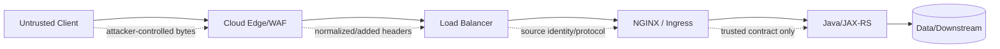

# Part 012 — NGINX Security Hardening and Abuse Resistance

> **Depth level:** Production/Architecture-level  
> **Prerequisite:** Part 004–007 dan 010–011; dasar HTTP, TLS, reverse-proxy trust boundaries, web security, dan Kubernetes/network policy.  
> **Scope:** secure default server, parser/limit alignment, method/path/header controls, trusted client identity, WAF/bot integration, response security headers, log privacy, supply-chain/runtime hardening, dan failure-oriented review.  
> **Bukan scope utama:** detailed rate limiting—Part 013; authentication/authorization architecture—Part 014; TLS cryptographic engineering—Part 007; container hardening detail—Part 017; compliance evidence—Part 033.

---

## Daftar isi

1. [Tujuan pembelajaran](#tujuan-pembelajaran)
2. [Executive mental model](#executive-mental-model)
3. [NGINX bukan security boundary tunggal](#nginx-bukan-security-boundary-tunggal)
4. [Threat model per hop](#threat-model-per-hop)
5. [Security invariants](#security-invariants)
6. [Attack surface inventory](#attack-surface-inventory)
7. [Secure default server](#secure-default-server)
8. [Host allowlist dan virtual-host isolation](#host-allowlist-dan-virtual-host-isolation)
9. [Request parsing agreement](#request-parsing-agreement)
10. [HTTP request smuggling awareness](#http-request-smuggling-awareness)
11. [Protocol downgrade dan intermediary mismatch](#protocol-downgrade-dan-intermediary-mismatch)
12. [Request-line dan header limits](#request-line-dan-header-limits)
13. [Request body limits](#request-body-limits)
14. [Timeouts sebagai abuse control](#timeouts-sebagai-abuse-control)
15. [HTTP method restriction](#http-method-restriction)
16. [`limit_except` dan policy caveats](#limit_except-dan-policy-caveats)
17. [Path normalization dan traversal](#path-normalization-dan-traversal)
18. [Encoded paths dan parser discrepancy](#encoded-paths-dan-parser-discrepancy)
19. [Dangerous paths dan management endpoints](#dangerous-paths-dan-management-endpoints)
20. [Dotfiles, backups, dan source artifacts](#dotfiles-backups-dan-source-artifacts)
21. [`root`, `alias`, dan file exposure](#root-alias-dan-file-exposure)
22. [Host header injection](#host-header-injection)
23. [Forwarded-header spoofing](#forwarded-header-spoofing)
24. [Real client IP trust](#real-client-ip-trust)
25. [Identity-header sanitization](#identity-header-sanitization)
26. [Open redirect dan absolute URL generation](#open-redirect-dan-absolute-url-generation)
27. [SSRF dan dynamic upstream risk](#ssrf-dan-dynamic-upstream-risk)
28. [IP allowlist/denylist](#ip-allowlistdenylist)
29. [Geo controls dan limitations](#geo-controls-dan-limitations)
30. [Connection and request abuse boundaries](#connection-and-request-abuse-boundaries)
31. [WAF integration](#waf-integration)
32. [ModSecurity dan NGINX App Protect considerations](#modsecurity-dan-nginx-app-protect-considerations)
33. [Bot and DDoS defense layering](#bot-and-ddos-defense-layering)
34. [Response security headers](#response-security-headers)
35. [`add_header` inheritance dan `always`](#add_header-inheritance-dan-always)
36. [HSTS](#hsts)
37. [CSP](#csp)
38. [Clickjacking, MIME sniffing, dan referrer policy](#clickjacking-mime-sniffing-dan-referrer-policy)
39. [CORS is not access control](#cors-is-not-access-control)
40. [Sensitive response-header removal](#sensitive-response-header-removal)
41. [Cookie hardening at proxy](#cookie-hardening-at-proxy)
42. [Error handling dan information disclosure](#error-handling-dan-information-disclosure)
43. [Server/version disclosure](#serverversion-disclosure)
44. [Log privacy dan redaction](#log-privacy-dan-redaction)
45. [Secret dan certificate file permissions](#secret-dan-certificate-file-permissions)
46. [Module, image, dan supply-chain security](#module-image-dan-supply-chain-security)
47. [Kubernetes and ingress-specific risks](#kubernetes-and-ingress-specific-risks)
48. [AWS, Azure, on-prem, dan hybrid](#aws-azure-on-prem-dan-hybrid)
49. [Java/JAX-RS security contract](#javajax-rs-security-contract)
50. [Observability dan security signals](#observability-dan-security-signals)
51. [Failure-mode catalogue](#failure-mode-catalogue)
52. [Debugging dan validation playbooks](#debugging-dan-validation-playbooks)
53. [Reference baseline configuration](#reference-baseline-configuration)
54. [Control placement decision matrix](#control-placement-decision-matrix)
55. [Anti-patterns](#anti-patterns)
56. [Performance and availability trade-offs](#performance-and-availability-trade-offs)
57. [PR review checklist](#pr-review-checklist)
58. [Internal verification checklist](#internal-verification-checklist)
59. [Hands-on exercises](#hands-on-exercises)
60. [Ringkasan invariants](#ringkasan-invariants)
61. [Referensi resmi](#referensi-resmi)

---

## Tujuan pembelajaran

Setelah menyelesaikan part ini, Anda harus mampu:

1. memodelkan NGINX sebagai satu enforcement point dalam chain, bukan security solution tunggal;
2. membuat default virtual host yang menolak unknown hosts;
3. menyelaraskan parser dan limits antara cloud LB, NGINX, ingress, Java server, dan application framework;
4. mengenali request-smuggling conditions akibat disagreement antarhop;
5. membatasi request line, headers, body, methods, paths, dan connection behavior tanpa memblokir traffic legitimate;
6. mencegah Host, forwarded-header, client-IP, dan identity-header spoofing;
7. mengenali SSRF risk dari variable-driven `proxy_pass` atau dynamic resolution;
8. menjaga management, metrics, debug, dan internal endpoints tidak terekspos;
9. menempatkan WAF, bot, DDoS, IP, dan rate controls di layer yang tepat;
10. menerapkan response security headers dengan memahami ownership dan inheritance;
11. mencegah sensitive data bocor melalui logs, errors, headers, files, dan source artifacts;
12. mereview NGINX/Ingress change dari sisi attack path, bypass path, failure mode, dan rollback.

---

## Executive mental model

NGINX security hardening bukan daftar directive. Ia adalah usaha menjaga lima hal:

```text
1. parser agreement
2. route agreement
3. identity agreement
4. policy agreement
5. evidence agreement
```



### Core principle

> Setiap header, path, method, IP, dan protocol attribute adalah untrusted sampai sebuah trusted hop memvalidasi atau menulis ulangnya.

---

## NGINX bukan security boundary tunggal

NGINX dapat:

- reject malformed/oversized requests;
- enforce host/path/method/IP policy;
- normalize trusted forwarding headers;
- terminate TLS/mTLS;
- invoke WAF/auth subrequests;
- hide headers;
- produce audit signals.

NGINX tidak dapat menggantikan:

- object-level authorization;
- business-rule validation;
- tenant isolation di application/data layer;
- secure coding;
- dependency/container patching;
- cloud/network DDoS capacity;
- database controls;
- secrets management.

### Defense layering

```text
cloud edge capacity defense
→ network segmentation
→ NGINX parsing/routing controls
→ application authentication/authorization
→ domain invariants
→ data-layer controls
→ detection/response
```

---

## Threat model per hop

Untuk setiap hop, dokumentasikan:

| Question | Example |
|---|---|
| who connects? | internet client, ALB, internal LB, service mesh |
| what is authenticated? | TLS endpoint, mTLS client, network source |
| what headers are trusted? | none, or only from known proxy CIDR |
| what protocol is used? | HTTP/1.1, HTTP/2, PROXY protocol |
| who normalizes path? | cloud LB, NGINX, Java container |
| who enforces size? | edge, NGINX, application |
| who logs original data? | WAF, NGINX, app |
| what bypass path exists? | direct NodePort, internal service, debug port |

### Hidden bypass problem

A hardened public NGINX route tidak membantu bila Java service juga dapat diakses melalui:

- public `LoadBalancer` service;
- NodePort;
- alternate DNS;
- internal ingress tanpa policy sama;
- port-forward/debug tunnel;
- management port exposed.

Security review harus memetakan **all reachable paths**, bukan hanya intended path.

---

## Security invariants

1. Unknown hosts tidak pernah jatuh ke production application default route.
2. NGINX tidak mempercayai client-supplied forwarding/identity headers.
3. Semua proxies sepakat pada message boundaries.
4. Limits di outer layer tidak lebih longgar secara berbahaya daripada inner layer.
5. Path yang dilihat policy layer sama dengan path yang diproses backend.
6. Management/debug endpoints denied by default.
7. Shared ingress configuration tidak dapat diubah arbitrarily oleh untrusted namespace.
8. Security headers muncul pada success dan relevant error responses.
9. Logs tidak menjadi secondary secrets database.
10. Security control punya owner, test, observability, dan rollback.

---

## Attack surface inventory

### Network/listener surface

- public HTTP/HTTPS listeners;
- internal listeners;
- stream/TCP listeners;
- status/metrics ports;
- admission webhook;
- management API;
- health probes.

### HTTP surface

- virtual hosts;
- methods;
- paths;
- headers;
- query parameters;
- body formats;
- uploads;
- WebSocket/SSE/gRPC upgrades;
- redirects;
- static files;
- error pages.

### Configuration surface

- `include` files;
- ConfigMaps;
- Ingress annotations/snippets;
- templates;
- dynamic modules;
- environment substitution;
- secrets/keys;
- CI/CD permissions.

### Operational surface

- logs;
- debug modes;
- dashboards;
- backup configs;
- container shell/packages;
- package repository;
- image registry;
- runbook actions.

---

## Secure default server

A default server should reject traffic for unknown hosts before it reaches Java.

```nginx
server {
    listen 80 default_server;
    server_name _;
    return 444;
}

server {
    listen 443 ssl default_server;
    server_name _;

    ssl_certificate     /etc/nginx/tls/default.crt;
    ssl_certificate_key /etc/nginx/tls/default.key;

    return 404;
}
```

`444` is an NGINX-specific connection close behavior, not an HTTP standard status. Some environments prefer explicit `400` or `404` for observability/interoperability.

### TLS caveat

TLS handshake and certificate selection happen before HTTP `Host` processing. A default TLS certificate is still needed for the listener unless another architecture terminates TLS earlier.

### Review questions

- what certificate is exposed for unknown SNI;
- whether default server leaks internal names;
- whether cloud health checks depend on default route;
- whether unknown-host attempts are logged/rate-limited upstream.

---

## Host allowlist dan virtual-host isolation

Explicit server names are safer than relying on first-declared server.

```nginx
server {
    listen 443 ssl;
    server_name api.example.com;
    # production routes
}
```

### Host variants to test

- unknown hostname;
- uppercase/mixed case;
- trailing dot;
- explicit port;
- duplicate Host;
- absolute-form request target;
- HTTP/2 `:authority`;
- `X-Forwarded-Host`;
- SNI/Host mismatch.

### Application contract

Java should not construct security-sensitive URLs from arbitrary `Host` or forwarded host. Use an allowlisted canonical external base URL or trusted proxy-aware configuration.

---

## Request parsing agreement

Request passes through several parsers:

```text
cloud edge parser
→ load balancer parser
→ NGINX parser
→ Java server parser
→ framework/router parser
```

Security breaks when parsers disagree on:

- message body length;
- duplicate headers;
- invalid header names;
- whitespace;
- encoded path separators;
- dot segments;
- semicolon/path parameters;
- query duplicates;
- absolute versus origin-form target;
- HTTP/2-to-HTTP/1 translation.

### Required approach

- keep components patched;
- reject ambiguous/malformed input early;
- minimize protocol conversions;
- align header/body limits;
- test chain, not components independently;
- do not add “normalization fixes” without understanding backend behavior.

---

## HTTP request smuggling awareness

Request smuggling occurs when frontend and backend disagree where one request ends and next begins.

Conceptual example:

```text
Content-Length says one boundary
Transfer-Encoding says another boundary
```

An attacker may cause hidden bytes to be interpreted as a second request by downstream.

### Risk factors

- mixed HTTP versions;
- multiple intermediaries;
- legacy/unpatched parsers;
- accepting conflicting framing headers;
- custom modules;
- unusual proxy buffering/streaming behavior;
- different tolerance for invalid whitespace or duplicate headers.

### Defensive requirements

1. patch all intermediaries and Java HTTP server;
2. know exact protocol per hop;
3. reject malformed requests rather than “repairing” them inconsistently;
4. test CL/TE, duplicate headers, obs-fold-like input, H2 downgrade cases;
5. restrict direct backend reachability;
6. monitor anomalous 400s, connection desync symptoms, and impossible route sequences.

### Important limitation

There is no universal one-line NGINX directive that “solves request smuggling.” It is a chain-level parser-consistency problem.

---

## Protocol downgrade dan intermediary mismatch

Example topology:

```text
client HTTP/2 → ALB HTTP/1.1 → NGINX HTTP/1.1 → Java HTTP/1.1
```

or:

```text
client HTTP/3 → CDN HTTP/2 → NGINX HTTP/1.1 → Java
```

Each translation can alter:

- connection semantics;
- pseudo-headers;
- transfer framing;
- header normalization;
- request multiplexing;
- cancellation behavior.

Maintain a protocol matrix and include it in security tests.

---

## Request-line dan header limits

Relevant controls include:

- `client_header_buffer_size`;
- `large_client_header_buffers`;
- `client_header_timeout`;
- `ignore_invalid_headers`;
- `underscores_in_headers`;
- upstream/cloud limits;
- Java server max header/request-line settings.

### Design goal

Reject unreasonable input at the outermost practical layer while preserving legitimate enterprise headers such as tracing, SSO, and large-but-bounded cookies.

### Failure risks

Too small:

- legitimate OIDC/session cookies fail;
- tracing baggage rejected;
- clients see 400/414-like failures.

Too large:

- memory amplification per connection;
- abuse with oversized headers;
- backend receives input beyond tested limits;
- proxy/backend mismatch.

### Capacity reasoning

```text
potential_header_memory ≈ concurrent_header_parses × configured_buffer_capacity
```

Exact allocation is implementation-dependent, but oversized limits increase attack surface.

---

## Request body limits

`client_max_body_size` protects NGINX/upstream from excessive bodies.

```nginx
location /api/ {
    client_max_body_size 2m;
}

location /api/imports/ {
    client_max_body_size 100m;
}
```

Prefer route-specific limits. A global 1 GB limit because one import route needs it expands attack surface for every endpoint.

### Align all layers

```text
cloud edge limit
≥ NGINX route limit
≥ Java container limit
≥ framework/multipart limit
≥ domain limit
```

The order may vary, but user-facing behavior and resource consumption must be intentional. Ideally reject before expensive buffering/application work.

### Content-type validation

Size controls do not validate:

- actual media type;
- decompressed size;
- archive bomb;
- entity count;
- JSON/XML depth;
- malware;
- business validity.

Application/scanning layers remain responsible.

---

## Timeouts sebagai abuse control

Slowloris-like behavior consumes connections by sending headers/body very slowly.

Relevant controls:

- `client_header_timeout`;
- `client_body_timeout`;
- `keepalive_timeout`;
- `send_timeout`;
- cloud LB idle timeout;
- connection limits/rate controls.

Timeout terlalu longgar meningkatkan connection occupancy; terlalu ketat memutus legitimate slow networks/uploads. Gunakan route-specific design dan telemetry.

Timeout semantics detail ada di Part 009.

---

## HTTP method restriction

Restrict methods only when route contract jelas.

```nginx
map $request_method $method_allowed {
    default 0;
    GET     1;
    HEAD    1;
    POST    1;
}

server {
    if ($method_allowed = 0) {
        return 405;
    }
}
```

`if` in server/rewrite context with simple `return` is a constrained use case; complex `if` behavior tetap harus dihindari.

### Better route-specific policy

- static assets: GET/HEAD;
- API resource: methods from OpenAPI contract;
- upload: POST/PUT only as designed;
- disable TRACE unless explicitly needed;
- CONNECT normally not accepted by reverse-proxy route;
- OPTIONS must align with CORS/application contract.

### Do not break semantics

HEAD is often implicitly supported for GET resources. Blanket method restrictions can break probes, clients, or conditional behaviors.

---

## `limit_except` dan policy caveats

Example:

```nginx
location /admin/ {
    limit_except GET POST {
        deny all;
    }
}
```

`limit_except` applies access controls within the location, but its semantics and allowed directives differ from generic method routing. Test exact build/config.

### Common mistake

Using method restrictions as authorization:

```text
GET allowed = secure
POST denied = secure
```

An attacker can still read unauthorized GET data. Method control is not object-level authorization.

---

## Path normalization dan traversal

Path security depends on how each layer interprets:

- `..` segments;
- repeated slashes;
- percent encoding;
- encoded slash/backslash;
- semicolon/path parameters;
- Unicode normalization;
- case sensitivity;
- trailing dot/space on some filesystems.

### Path traversal risk

A route/file mapping may escape intended root when untrusted path is combined incorrectly with filesystem path or upstream URI.

### Path-defense pattern

- use explicit locations;
- use `try_files` with known root;
- avoid constructing filesystem paths from arbitrary variables;
- reject ambiguous encoded separators if backend interprets them differently;
- test NGINX normalized URI and Java raw/decoded URI;
- do not rely on regex denial alone.

---

## Encoded paths dan parser discrepancy

Test matrix:

```text
/admin
/%61dmin
/admin%2fmetrics
/admin%252fmetrics
/a/../admin
/a//admin
/admin;param=x
```

Expected behavior must be consistent across:

- edge WAF;
- NGINX location matching;
- rewrite/proxy pass;
- servlet/JAX-RS container;
- application router;
- authorization filter.

### Critical invariant

> Security decision must apply to the same canonical resource that backend executes.

If WAF denies `/admin` but backend decodes `%61dmin` after NGINX, control may be bypassed.

---

## Dangerous paths dan management endpoints

Common sensitive routes:

- `/admin`;
- `/management`;
- `/metrics`;
- `/debug`;
- `/actuator`;
- `/health` details;
- `/openapi`/`swagger` in restricted environments;
- internal callbacks;
- configuration endpoints;
- heap/thread dumps.

### Defense

- separate listener/host;
- internal network only;
- mTLS or dedicated authentication;
- IP allowlist as secondary control;
- no public DNS;
- no wildcard ingress exposure;
- minimal response details;
- audit access.

A hidden URL is not an access control.

---

## Dotfiles, backups, dan source artifacts

Potential exposures:

```text
.git/
.env
.svn/
Dockerfile
nginx.conf.bak
app.jar
*.sql
*.log
*.map
backup.zip
```

Example deny rule:

```nginx
location ~ /\. {
    deny all;
}
```

But exceptions such as ACME challenge or legitimate well-known paths may exist. Prefer build artifact hygiene over relying only on deny regex.

### Build invariant

> Sensitive files should not exist in served document root/image layer at all.

---

## `root`, `alias`, dan file exposure

Misaligned `alias`, regex captures, or trailing slash can expose unexpected directories.

Review:

- normalized request URI;
- selected location;
- final filesystem path;
- symlink behavior;
- permissions;
- directory indexing;
- error fallback;
- internal redirects.

Use dedicated read-only asset directory and tests for traversal variants.

---

## Host header injection

Host can influence:

- virtual-host selection;
- redirects;
- absolute links;
- password-reset URLs;
- cache keys;
- tenant routing;
- cookie domain logic.

### Unsafe pattern

Java builds external URL from untrusted `Host` or `X-Forwarded-Host`.

### Host-defense pattern

- explicit `server_name` allowlist;
- secure default server;
- overwrite forwarded host from trusted NGINX variables;
- application uses configured canonical base URL for security-sensitive links;
- include host in cache key where relevant;
- test SNI/Host/authority mismatch.

---

## Forwarded-header spoofing

Client can send:

```http
X-Forwarded-For: 127.0.0.1
X-Forwarded-Proto: https
X-Forwarded-Host: internal.example
X-User-Id: admin
```

If NGINX appends/passes blindly, Java may trust attacker input.

### Sanitize then set

```nginx
proxy_set_header X-Forwarded-For   $proxy_add_x_forwarded_for;
proxy_set_header X-Forwarded-Proto $scheme;
proxy_set_header X-Forwarded-Host  $host;
proxy_set_header Host              $host;

# Remove client-controlled identity headers unless created by trusted auth layer.
proxy_set_header X-User-Id "";
proxy_set_header X-Roles   "";
```

For `X-Forwarded-For`, `$proxy_add_x_forwarded_for` preserves prior chain. This is safe only when immediate sender/trust model is understood. At internet-facing NGINX, you may need to discard client-provided chain and use validated real IP semantics instead.

---

## Real client IP trust

`ngx_http_realip_module` replaces client address based on a header or PROXY protocol, but only addresses configured by `set_real_ip_from` should be trusted.

```nginx
set_real_ip_from 10.0.0.0/8;
real_ip_header X-Forwarded-For;
real_ip_recursive on;
```

### Dangerous config

```nginx
set_real_ip_from 0.0.0.0/0;
```

This allows arbitrary senders to spoof client IP if the listener is reachable.

### Required checks

- exact LB/proxy CIDRs;
- IPv4 and IPv6;
- address changes/managed prefix lists;
- PROXY protocol enabled on both ends;
- health check sources;
- what `$remote_addr` and `$realip_remote_addr` represent;
- application trusted-proxy config.

---

## Identity-header sanitization

If an auth proxy sets identity headers:

```text
X-Authenticated-User
X-Tenant-Id
X-Roles
```

NGINX must ensure clients cannot forge them.

### Pattern

1. delete incoming identity headers;
2. invoke trusted auth mechanism;
3. set headers from authenticated result;
4. restrict direct backend access;
5. Java trusts headers only from known proxy path;
6. log correlation without exposing sensitive claims.

Detailed auth boundary ada di Part 014.

---

## Open redirect dan absolute URL generation

Redirect can become attacker-controlled when based on:

- `Host`;
- `X-Forwarded-Host`;
- arbitrary `return 301 $arg_next`;
- unvalidated upstream `Location`;
- scheme confusion.

### Safe patterns

- relative redirects where possible;
- allowlist destinations;
- canonical external origin;
- validate `next`/return URL in application;
- review `proxy_redirect` behavior;
- prevent CRLF/header injection via untrusted values.

---

## SSRF dan dynamic upstream risk

NGINX reverse proxy can become SSRF primitive when attacker controls upstream host/URL.

Dangerous conceptual pattern:

```nginx
location /fetch/ {
    proxy_pass http://$arg_target;
}
```

Attacker may target:

- loopback;
- cloud metadata service;
- internal admin endpoints;
- Kubernetes API;
- private databases/services;
- link-local addresses.

### Defenses

- never proxy arbitrary user URL directly;
- use static upstreams or strict allowlist mapping;
- resolve only approved names;
- control egress with network policy/firewall;
- block link-local/private destinations where inappropriate;
- restrict DNS rebinding opportunities;
- separate forward-proxy use case from reverse proxy.

NGINX is not a general secure forward proxy by default.

---

## IP allowlist/denylist

`allow`/`deny` can restrict client addresses:

```nginx
location /internal-admin/ {
    allow 10.20.0.0/16;
    deny all;
}
```

### Limitations

- source IP must be authentic;
- NAT/proxy may collapse many users to one IP;
- corporate/VPN CIDRs change;
- IPv6 must be included;
- IP is weak identity;
- allowlist does not replace application authorization;
- cloud LB health checks may be blocked.

Treat IP policy as network-layer control, not user authentication.

---

## Geo controls dan limitations

Geo/IP database controls can support regional policy or abuse reduction, but:

- VPN/proxy/Tor can alter apparent location;
- databases age;
- mobile carriers route unexpectedly;
- legal/regulatory decisions need authoritative policy;
- false positives require support path;
- data licensing/privacy may apply.

Prefer cloud/WAF capabilities when they provide managed databases and centralized policy, but verify exact behavior.

---

## Connection and request abuse boundaries

Relevant mechanisms:

- header/body timeouts;
- body/header size limits;
- `limit_conn`;
- `limit_req`;
- upstream concurrency limits;
- cloud/WAF protections;
- queueing/backpressure.

Part 013 membahas rate and connection limiting secara detail.

### Architecture rule

Use cheap rejection before expensive work:

```text
network capacity filtering
→ parser/size checks
→ rate/connection limits
→ authentication
→ application validation
→ expensive database/downstream work
```

But early rejection must not rely on spoofable identity.

---

## WAF integration

WAF can detect/block patterns such as:

- injection payloads;
- protocol anomalies;
- known exploit signatures;
- bots/scanners;
- virtual patch rules.

WAF limitations:

- false positives;
- bypass via encoding/parser mismatch;
- limited business context;
- latency/CPU cost;
- rule update risk;
- logging sensitive payloads;
- not a substitute for code fixes.

### Operating model

1. observe/detect mode;
2. tune exclusions narrowly;
3. block mode per rule/category;
4. measure false-positive rate;
5. maintain emergency bypass with audit;
6. tie rule IDs to incidents/vulnerabilities;
7. test on actual protocol/path normalization.

---

## ModSecurity dan NGINX App Protect considerations

- ModSecurity integration typically depends on a connector/module and distribution packaging; it is not an automatic capability of every NGINX build.
- NGINX App Protect WAF is a commercial F5 capability with its own lifecycle, policy format, resource needs, and support model.
- Cloud WAF may be deployed before NGINX and can be a better place for volumetric/managed protections.

### Internal verification

- exact product and version;
- module/image source;
- rule-set owner;
- update cadence;
- fail-open versus fail-close behavior;
- resource limits;
- log destination and privacy;
- bypass/exclusion governance;
- license/support status.

Do not write generic “enable ModSecurity” guidance without verifying runtime support.

---

## Bot and DDoS defense layering

NGINX instance/pod has finite:

- network bandwidth;
- connections;
- file descriptors;
- CPU;
- memory;
- worker capacity.

If attack saturates link or cloud load balancer before NGINX, local directives cannot help.

### Layering

| Attack | Preferred first layer |
|---|---|
| volumetric L3/L4 | cloud/provider DDoS service |
| HTTP flood | CDN/WAF/bot management + NGINX limits |
| credential stuffing | identity provider/app risk controls |
| expensive API abuse | authenticated quota + app/domain controls |
| slow headers/body | NGINX timeouts/connection controls |
| scraping | bot signals, rate policy, legal/product controls |

---

## Response security headers

Common headers:

- `Strict-Transport-Security`;
- `Content-Security-Policy`;
- `X-Content-Type-Options`;
- `X-Frame-Options` or CSP `frame-ancestors`;
- `Referrer-Policy`;
- `Permissions-Policy`;
- cross-origin isolation/resource policies where relevant;
- cache controls for sensitive data.

### Ownership rule

Headers should be owned by the layer with enough context:

- NGINX can enforce organization baseline;
- application often knows route/content-specific CSP and cache semantics;
- CDN may add global headers;
- duplicate/conflicting headers can be worse than missing headers.

---

## `add_header` inheritance dan `always`

Historically, `add_header` values are inherited only when current level defines none. A nested location that adds one header can accidentally lose parent security headers.

```nginx
server {
    add_header X-Content-Type-Options nosniff always;

    location /special/ {
        add_header Cache-Control no-store;
        # On many versions/configurations, parent add_header may no longer apply here.
    }
}
```

Recent NGINX versions add `add_header_inherit` controls, but portability across deployed versions must be verified.

### `always`

Without `always`, headers are only added for selected response statuses. Security headers often should appear on error responses too.

### Test matrix

- 200;
- 204;
- 301/302;
- 304;
- 400;
- 401/403;
- 404;
- 429;
- 500/502/503/504.

---

## HSTS

Example:

```nginx
add_header Strict-Transport-Security "max-age=31536000; includeSubDomains" always;
```

### Critical cautions

- only send over HTTPS;
- `includeSubDomains` affects all subdomains;
- `preload` has external browser-list consequences and difficult rollback;
- ensure all affected hosts support HTTPS before rollout;
- start with shorter max-age in controlled rollout;
- HSTS does not fix invalid certificates or mixed content.

HSTS is a client-enforced persistence policy, not a cosmetic header.

---

## CSP

CSP is primarily relevant to browser-rendered HTML, not JSON APIs.

Example baseline—not universal:

```nginx
add_header Content-Security-Policy "default-src 'self'; object-src 'none'; base-uri 'self'; frame-ancestors 'none'" always;
```

Real SPA applications may require scripts, styles, fonts, API endpoints, workers, and nonce/hash strategy. Broad values like `'unsafe-inline'` can undermine protection.

### Deployment approach

1. inventory resources;
2. start `Content-Security-Policy-Report-Only`;
3. collect and sanitize reports;
4. tighten policy;
5. enforce;
6. test every frontend route.

Application/build pipeline usually owns nonce/hash semantics better than generic NGINX config.

---

## Clickjacking, MIME sniffing, dan referrer policy

### MIME sniffing

```nginx
add_header X-Content-Type-Options nosniff always;
```

Requires correct `Content-Type`; otherwise legitimate assets may fail.

### Clickjacking

Legacy:

```nginx
add_header X-Frame-Options DENY always;
```

Modern CSP:

```http
Content-Security-Policy: frame-ancestors 'none'
```

Choose policy based on legitimate embedding requirements.

### Referrer

```nginx
add_header Referrer-Policy strict-origin-when-cross-origin always;
```

Avoid sensitive tokens/PII in URLs regardless of referrer policy.

---

## CORS is not access control

CORS controls whether browser JavaScript can read cross-origin responses. It does not prevent:

- direct HTTP clients;
- server-to-server calls;
- CSRF automatically;
- unauthorized backend access;
- data exposure if response is otherwise public.

CORS should be route/origin-specific and consistent with credentials. Avoid reflecting arbitrary `Origin` with credentials.

CORS semantics detail berada di Part 006; authentication boundary di Part 014.

---

## Sensitive response-header removal

NGINX can hide upstream headers:

```nginx
proxy_hide_header X-Powered-By;
proxy_hide_header X-Internal-Node;
proxy_hide_header X-Debug-Trace;
```

But hiding headers is not a substitute for stopping application from generating sensitive data.

Review:

- stack/framework versions;
- internal hostnames/IPs;
- debug IDs that enable enumeration;
- upstream timing details;
- internal redirects;
- storage paths;
- authentication tokens.

Preserve headers required for tracing/security and avoid breaking standards.

---

## Cookie hardening at proxy

NGINX can adjust cookie flags:

```nginx
proxy_cookie_flags ~ secure httponly samesite=lax;
```

### Risks

- blanket `SameSite=Strict` may break SSO;
- `SameSite=None` requires `Secure` in modern browsers;
- changing Domain/Path can widen or narrow scope unexpectedly;
- proxy rewriting can hide application misconfiguration;
- different cookies require different policies.

Application should ideally set correct cookie semantics. Proxy enforcement can be defense-in-depth with test coverage.

---

## Error handling dan information disclosure

Avoid returning:

- stack traces;
- filesystem paths;
- upstream hostnames;
- SQL/database errors;
- internal IDs without purpose;
- raw WAF details;
- exception classes.

Example generic edge error:

```nginx
proxy_intercept_errors on;
error_page 502 503 504 /gateway-error.json;

location = /gateway-error.json {
    internal;
    default_type application/json;
    return 503 '{"error":"service_unavailable","requestId":"$request_id"}';
}
```

### Caution

Do not collapse all statuses blindly. Preserve semantics needed by clients and incident diagnosis. Ensure static error body does not claim wrong status.

---

## Server/version disclosure

```nginx
server_tokens off;
```

This reduces version disclosure in generated error pages and `Server` behavior, but exact removal/customization differs by edition/build. Even complete hiding is only minor hardening; attackers can fingerprint behavior.

Priority remains:

- patching;
- minimizing modules;
- removing debug endpoints;
- secure errors;
- configuration correctness.

---

## Log privacy dan redaction

Potential secrets in logs:

- `Authorization`;
- cookies/session IDs;
- query tokens;
- password-reset links;
- PII;
- request/response bodies;
- client certificates;
- JWT claims;
- tenant/customer identifiers;
- internal topology.

### Safe logging pattern

Log:

- request ID;
- normalized route template if available;
- status;
- timings;
- upstream;
- bytes;
- security decision/rule ID;
- pseudonymized identifiers when justified.

Avoid full `$request` if query strings may contain secrets. Consider `$uri` instead of `$request_uri`, but understand normalization and diagnostic trade-off.

### Access control

Logs need:

- encryption;
- retention policy;
- least-privilege access;
- audit trail;
- masking at ingestion;
- incident hold process.

---

## Secret dan certificate file permissions

Protect:

- TLS private keys;
- mTLS CA/client keys;
- basic-auth files;
- WAF license/policy secrets;
- API credentials used by modules;
- session/ticket keys if configured.

Requirements:

- mounted read-only where possible;
- least-privilege ownership/mode;
- no inclusion in image/git;
- rotation process;
- no secret echo in startup logs;
- memory/core-dump considerations;
- backup and disposal policy.

NGINX master may require privilege to read keys then workers run less privileged; understand actual runtime user and reload behavior.

---

## Module, image, dan supply-chain security

Every dynamic module expands attack surface and upgrade coupling.

Review:

- official/vendor image provenance;
- digest pinning;
- SBOM;
- vulnerability scans;
- signature/attestation;
- base image packages;
- dynamic module ABI compatibility;
- build flags from `nginx -V`;
- unsupported third-party patches;
- package repository trust;
- end-of-life versions;
- emergency patch procedure.

Do not install compilers/debug tools in runtime image unless needed.

---

## Kubernetes and ingress-specific risks

### Shared controller risk

One controller may serve many namespaces/teams. Dangerous controls include:

- arbitrary server/configuration snippets;
- custom Lua/njs;
- cross-namespace secret references;
- wildcard hosts;
- host/path conflicts;
- annotation-driven auth bypass;
- broad IngressClass usage;
- admission webhook exposure;
- controller service exposed unintentionally.

### Governance controls

- dedicated IngressClass per trust zone;
- RBAC on Ingress/ConfigMap/Secret;
- admission policy;
- disable risky snippets unless justified;
- namespace isolation;
- NetworkPolicy restricting backend access;
- controller securityContext/read-only filesystem;
- image pinning and patching;
- default backend hardening;
- audit GitOps changes.

Detailed annotations/governance ada di Part 018–020.

---

## AWS, Azure, on-prem, dan hybrid

### AWS

Verify:

- WAF/Shield/CloudFront/ALB responsibilities;
- security groups and NACLs;
- source-IP preservation;
- ALB/NLB protocol conversion;
- public versus private subnets;
- direct Service/NodePort bypass;
- metadata endpoint egress protection;
- ACM versus NGINX key ownership.

### Azure

Verify:

- Front Door/Application Gateway WAF/APIM roles;
- NSG and VNet routing;
- source-IP and forwarded headers;
- AGIC versus NGINX controller boundaries;
- private endpoint exposure;
- managed certificate ownership.

### On-prem

Verify:

- DMZ firewall rules;
- appliance header normalization;
- SSL inspection;
- legacy proxy parser behavior;
- management network separation;
- internal CA and revocation;
- direct backend routes.

### Hybrid

Public and private paths often have different WAF, headers, DNS, and TLS. Run the same security matrix through every path.

---

## Java/JAX-RS security contract

NGINX should pass an explicit, minimal contract to Java.

### Java must still enforce

- authentication/authorization;
- tenant ownership;
- object-level access;
- input/schema validation;
- business-state transitions;
- anti-CSRF where applicable;
- output encoding for HTML;
- safe redirects;
- secure cookie/session semantics;
- rate/quota logic requiring user/domain context;
- audit events.

### Proxy-aware configuration

Java container/framework must trust forwarded headers only when requests come from approved proxies. Otherwise client can spoof scheme/host/IP.

### Error contract

Map edge rejections and application errors consistently:

- 400 malformed;
- 401 unauthenticated;
- 403 unauthorized;
- 404 hidden/nonexistent;
- 405 method not allowed;
- 413 body too large;
- 414 URI too long;
- 429 throttled;
- 5xx gateway/application failures.

Do not let NGINX return HTML error pages to JSON-only API clients unless intentionally standardized.

---

## Observability dan security signals

Recommended signals:

- unknown Host/SNI attempts;
- malformed request rate;
- oversized headers/body;
- denied methods/paths;
- WAF rule IDs/actions;
- allowlist denials;
- auth subrequest failures;
- 400/403/405/413/414/429 distributions;
- unusual HTTP versions;
- source IP after trusted resolution;
- high connection duration with low bytes;
- scanner path patterns;
- direct backend access attempts;
- config reload/security-policy version.

### Avoid alert traps

High 404 volume may be internet scanning, not outage. Correlate:

- host;
- source/network;
- route;
- user agent;
- WAF action;
- baseline;
- customer impact.

---

## Failure-mode catalogue

| Symptom | Security cause | First checks |
|---|---|---|
| unknown domain reaches app | missing default server/host conflict | selected server block |
| client appears as 127.0.0.1/internal | real-IP chain wrong | LB headers, trusted CIDR |
| attacker spoofs admin IP | broad `set_real_ip_from` | realip config/reachability |
| auth identity forged | incoming identity header not cleared | proxy headers/direct backend path |
| WAF denies valid request | rule false positive/normalization | rule ID + raw/normalized request |
| WAF allows encoded bypass | parser mismatch | per-hop decoded path |
| intermittent 400 | header limits/parser disagreement | header size/protocol/path |
| 413 only on one path | different layer limits | cloud/LB/NGINX/app matrix |
| admin endpoint public | wildcard ingress/default route | route inventory/DNS |
| redirect to attacker host | Host/forwarded host trusted | request/Location generation |
| internal URL fetch | variable `proxy_pass`/SSRF | upstream variable/egress logs |
| security headers missing on 4xx/5xx | inheritance/no `always` | effective config + status matrix |
| SSO broken after cookie hardening | SameSite/Domain/Path rewrite | Set-Cookie diff |
| secrets in logs | raw request/query/header logging | log format/pipeline |
| path deny bypass | encoded/normalized mismatch | raw URI vs selected Java route |
| CPU spike under attack | WAF/regex/compression expensive | rule/regex profile + traffic |
| direct backend bypass | Service/LB/NodePort exposed | network inventory |

---

## Debugging dan validation playbooks

### Playbook A — Unknown host isolation

```bash
curl -skI https://EDGE_IP/ -H 'Host: attacker.invalid'
curl -skI --resolve attacker.invalid:443:EDGE_IP https://attacker.invalid/
```

Also test SNI/Host mismatch with `openssl s_client` and explicit requests.

### Playbook B — Forwarded header spoofing

```bash
curl -sk https://api.example.com/whoami \
  -H 'X-Forwarded-For: 127.0.0.1' \
  -H 'X-Forwarded-Proto: http' \
  -H 'X-Forwarded-Host: internal.example' \
  -H 'X-User-Id: admin'
```

Verify application sees only trusted values. Use a safe diagnostic endpoint in non-production.

### Playbook C — Method matrix

```bash
for m in GET HEAD POST PUT PATCH DELETE OPTIONS TRACE CONNECT; do
  curl -sk -o /dev/null -w "$m %{http_code}\n" -X "$m" https://api.example.com/resource
done
```

Interpret against route contract; `curl -X HEAD` is not identical to `curl -I`, so test carefully.

### Playbook D — Path normalization matrix

Use encoded and double-encoded variants in a controlled environment. Capture:

- WAF path;
- NGINX `$request_uri` and `$uri`;
- selected location/upstream;
- Java raw/decoded path;
- authorization decision.

### Playbook E — Header/body limits

Generate incremental cookie/header/body sizes and identify which layer returns error. Record response signature and logs per layer.

### Playbook F — Security header matrix

```bash
for path in / /missing /api/unauthorized /api/error; do
  curl -skI "https://example.com$path"
done
```

Check redirects and 4xx/5xx, not only 200.

### Playbook G — Direct backend bypass

From authorized test network, inventory:

```bash
kubectl get svc,ingress,gateway -A
kubectl get networkpolicy -A
```

Compare public DNS/LB addresses and attempt only approved security validation paths.

---

## Reference baseline configuration

This is a teaching baseline, not production copy-paste:

```nginx
http {
    server_tokens off;

    # Bounded request parsing. Tune from actual client contracts.
    client_header_timeout 10s;
    client_body_timeout   30s;
    client_max_body_size  2m;

    # Trust only the immediate known load-balancer network.
    set_real_ip_from 10.10.0.0/16;
    real_ip_header X-Forwarded-For;
    real_ip_recursive on;

    # Default HTTP reject.
    server {
        listen 80 default_server;
        server_name _;
        return 404;
    }

    server {
        listen 443 ssl;
        server_name api.example.com;

        ssl_certificate     /etc/nginx/tls/tls.crt;
        ssl_certificate_key /etc/nginx/tls/tls.key;

        add_header Strict-Transport-Security "max-age=86400" always;
        add_header X-Content-Type-Options nosniff always;
        add_header Referrer-Policy strict-origin-when-cross-origin always;

        location /api/ {
            # Explicit proxy contract.
            proxy_set_header Host              $host;
            proxy_set_header X-Forwarded-Proto $scheme;
            proxy_set_header X-Forwarded-Host  $host;
            proxy_set_header X-Forwarded-For   $proxy_add_x_forwarded_for;

            # Strip client-forgeable identity headers.
            proxy_set_header X-User-Id "";
            proxy_set_header X-Roles   "";
            proxy_set_header X-Tenant-Id "";

            proxy_hide_header X-Powered-By;
            proxy_pass http://java_backend;
        }

        location ~* ^/(?:\.git|\.env|debug|internal-admin)(?:/|$) {
            deny all;
        }
    }
}
```

### Why this is incomplete

It does not define:

- full TLS policy;
- auth;
- per-route methods/limits;
- WAF;
- rate limits;
- CORS/CSP specific to application;
- Kubernetes/cloud integration;
- production logging;
- certificate rotation;
- all IPv6/trusted CIDRs.

A good baseline is intentionally minimal and extended through reviewed policies.

---

## Control placement decision matrix

| Control | Cloud edge/WAF | NGINX | Java/JAX-RS |
|---|---:|---:|---:|
| volumetric DDoS | primary | limited | no |
| TLS termination | maybe | maybe | rarely |
| unknown Host reject | yes/maybe | primary | defense-in-depth |
| header/body size | yes | primary | domain-specific |
| malformed HTTP | yes | primary | server parser |
| method allowlist | maybe | coarse | authoritative contract |
| path exposure | maybe | routing boundary | authoritative auth |
| WAF signatures | primary/maybe | module/product | validation still required |
| client IP derivation | chain | primary trust config | consume trusted result |
| identity header | auth edge | sanitize/set | verify/authorize |
| tenant authorization | no | no | primary |
| security headers | maybe/global | baseline | content-specific |
| cookie semantics | maybe | defense-in-depth | primary |
| input schema | no | limited | primary |
| log redaction | each layer | required | required |

---

## Anti-patterns

1. trust every `X-Forwarded-*` header;
2. configure `set_real_ip_from 0.0.0.0/0`;
3. use IP allowlist as user authorization;
4. let unknown Host reach first production server;
5. hide version banner but ignore patching;
6. expose `/metrics`, `/debug`, or actuator publicly because path is “unguessable”;
7. rely on WAF as replacement for code fix;
8. enable arbitrary ingress snippets for every namespace;
9. block paths using one regex without testing encoding/canonicalization;
10. use variable `proxy_pass` with user-controlled host;
11. set global 1 GB body limit for one upload endpoint;
12. add security headers only on 200 responses;
13. apply one CSP/cookie rule blindly to every application;
14. log authorization/cookies/body for debugging permanently;
15. assume public ingress is only path to backend;
16. return detailed upstream errors to clients;
17. enable fail-open WAF without monitoring or fail-close without availability analysis;
18. copy “security nginx.conf” from internet without version/topology validation.

---

## Performance and availability trade-offs

Security controls consume resources and can fail:

- WAF regex/signatures consume CPU;
- large deny/allow maps consume memory/config load time;
- small limits create false positives;
- fail-close auth/WAF can cause outage;
- fail-open can create exposure;
- detailed logging creates I/O and privacy risk;
- TLS/mTLS adds handshake cost;
- request buffering/scanning adds disk and latency;
- connection limits can penalize NATed users;
- strict timeout hurts slow networks.

### Required decision form

For every control, document:

```text
threat addressed
→ detection/enforcement point
→ false-positive mode
→ failure-open/close behavior
→ resource cost
→ observability
→ bypass path
→ rollback
```

---

## PR review checklist

### Routing and reachability

- [ ] Does unknown Host/SNI reach application?
- [ ] Are wildcard hosts/paths broader than intended?
- [ ] Is any management/debug/metrics endpoint newly exposed?
- [ ] Is there a direct Service/NodePort/LB bypass?
- [ ] Does path normalization match Java routing?

### Request parsing and limits

- [ ] Are header, URI, body, and timeout limits changed?
- [ ] Are limits aligned across every hop?
- [ ] Is new protocol conversion introduced?
- [ ] Were malformed/duplicate/encoded inputs tested?
- [ ] Can decompression/archive expansion exceed domain limits?

### Trust and identity

- [ ] Which source CIDRs are trusted?
- [ ] Can client spoof real IP, scheme, host, user, tenant, or roles?
- [ ] Are incoming identity headers cleared?
- [ ] Is direct backend reachability restricted?
- [ ] Does Java trust only approved proxies?

### Security controls

- [ ] What WAF/rate/IP rule is added and who owns it?
- [ ] What is false-positive and failure mode?
- [ ] Is bypass/exclusion scoped and audited?
- [ ] Are methods restricted without breaking valid clients?
- [ ] Are security headers applied consistently across statuses?
- [ ] Are cookie rewrites compatible with SSO?

### Data exposure

- [ ] Are sensitive headers hidden at the correct layer?
- [ ] Can error pages leak topology/stack details?
- [ ] Do logs capture secrets, PII, tokens, or full bodies?
- [ ] Are static/source/backup files exposed?
- [ ] Does cache behavior amplify poisoned or personalized responses?

### Operations

- [ ] Is NGINX/module/image version supported and patched?
- [ ] Are config tests and security tests automated?
- [ ] Are alerts and dashboards updated?
- [ ] Is rollback immediate and safe?
- [ ] Is incident ownership clear?

---

## Internal verification checklist

### Codebase dan Java runtime

- [ ] Identify Java server/framework forwarded-header configuration dan trusted proxy behavior.
- [ ] Inventory management, metrics, health, debug, OpenAPI, callback, dan admin endpoints.
- [ ] Review method-level and object-level authorization—not only route exposure.
- [ ] Compare max header/request/body/multipart limits between Java container and NGINX.
- [ ] Inspect absolute URL, redirect, password reset, cookie, dan CORS generation.
- [ ] Check application logs for tokens, cookies, PII, stack traces, dan request bodies.

### NGINX configuration

- [ ] Inspect default servers for every address/port and unknown Host behavior.
- [ ] Audit `server_name`, wildcard/regex hosts, and SNI/Host mismatch handling.
- [ ] Review `client_*` limits/timeouts and inherited values.
- [ ] Audit `ignore_invalid_headers`, `underscores_in_headers`, `merge_slashes`, rewrites, and regex locations.
- [ ] Review `root`, `alias`, `try_files`, autoindex, dotfile/backup exposure.
- [ ] Audit `set_real_ip_from`, `real_ip_header`, `real_ip_recursive`, dan PROXY protocol.
- [ ] Audit `proxy_set_header`, `proxy_hide_header`, `add_header`, and cookie rewrites.
- [ ] Search variable-driven `proxy_pass`, resolver use, and user-controlled upstream inputs.
- [ ] Verify `server_tokens`, error pages, debug logs, and status endpoints.

### Kubernetes/GitOps

- [ ] Inventory IngressClass/controllers and trust-zone separation.
- [ ] Check whether snippets are enabled and who can create Ingress resources.
- [ ] Review RBAC for ConfigMaps, Secrets, admission webhooks, and controller service accounts.
- [ ] Inspect wildcard hosts, path conflicts, default backend, and cross-namespace references.
- [ ] Verify NetworkPolicy and whether pods/services can bypass ingress.
- [ ] Check controller image digest, security context, filesystem, capabilities, and patch cadence.
- [ ] Review Helm/Kustomize overlays for environment drift.

### Cloud/on-prem controls

- [ ] Determine exact WAF/DDoS/bot products and policy owners.
- [ ] Map security groups/NSGs/firewalls/NACLs and direct backend reachability.
- [ ] Verify source-IP preservation and trusted CIDR update process.
- [ ] Document HTTP protocol per hop and TLS inspection/termination.
- [ ] Compare public, private, on-prem, and disaster-recovery paths.
- [ ] Check cloud metadata/internal service egress protection.

### WAF dan abuse defense

- [ ] Identify WAF engine/version/ruleset, detect/block mode, and exclusions.
- [ ] Determine fail-open/fail-close behavior and resource limits.
- [ ] Review false-positive incidents and emergency bypass process.
- [ ] Validate rate/connection limits against NAT, tenant, user, and retry behavior.
- [ ] Confirm volumetric attacks are handled before NGINX capacity is exhausted.

### Logs, evidence, dan operations

- [ ] Review access/error/WAF logs for secrets, PII, credentials, query tokens, and bodies.
- [ ] Verify retention, access control, encryption, masking, and audit.
- [ ] Ensure alerts exist for unknown hosts, parser errors, deny spikes, and management-path access.
- [ ] Locate penetration-test findings, vulnerability scans, incident notes, and compensating controls.
- [ ] Confirm config/module/image update and emergency patch runbooks.
- [ ] Test rollback of security policy without exposing broader traffic.

> Semua product choices, network paths, security controls, CIDRs, endpoint names, dan policy ownership di lingkungan CSG harus diperlakukan sebagai **Internal verification checklist** sampai dikonfirmasi dari repository, dashboard, runbook, dan platform/SRE/team.

---

## Hands-on exercises

### Exercise 1 — Unknown host and header trust

Build a local NGINX + Java diagnostic endpoint. Test unknown Host, spoofed forwarded headers, and direct backend access. Confirm only intended values reach Java.

### Exercise 2 — Limits matrix

Generate increasing header, URI, and body sizes. Record which layer rejects, status, log signature, and resource usage. Align configuration.

### Exercise 3 — Path canonicalization

Test encoded, double-encoded, slash, dot-segment, semicolon, and case variants against a protected endpoint. Compare NGINX and JAX-RS route decisions.

### Exercise 4 — Security headers

Create success, redirect, auth failure, not-found, and gateway-error responses. Verify headers on every status and test inheritance after nested location changes.

### Exercise 5 — WAF rollout simulation

Run one rule in detection mode, collect false positives, add narrowly scoped exclusion, then move to block mode with rollback criteria.

### Exercise 6 — Log privacy review

Feed synthetic tokens, cookies, PII, and query secrets. Trace every log sink and prove masking/omission.

---

## Ringkasan invariants

1. NGINX adalah satu layer dalam defense-in-depth, bukan pengganti application security.
2. Unknown hosts harus ditolak oleh secure default server.
3. Parser disagreement adalah chain-level vulnerability.
4. Limits dan normalization harus selaras pada semua hop.
5. Client-supplied forwarding dan identity headers tidak pernah trusted secara default.
6. Real IP hanya valid bila immediate proxy source dipercaya secara sempit.
7. Path policy harus berlaku pada canonical resource yang sama dengan backend.
8. Dynamic user-controlled upstream adalah SSRF risk.
9. IP allowlist bukan user authorization.
10. WAF memerlukan tuning, ownership, observability, dan failure-mode design.
11. Security headers membutuhkan status/inheritance testing.
12. Logs, error pages, static files, dan configs adalah data-exposure surfaces.
13. Direct backend bypass dapat meniadakan seluruh edge hardening.
14. Setiap control harus memiliki test, evidence, and rollback.

---

## Referensi resmi

- [NGINX Core HTTP Module](https://nginx.org/en/docs/http/ngx_http_core_module.html)
- [NGINX Access Module](https://nginx.org/en/docs/http/ngx_http_access_module.html)
- [NGINX Real IP Module](https://nginx.org/en/docs/http/ngx_http_realip_module.html)
- [NGINX Headers Module](https://nginx.org/en/docs/http/ngx_http_headers_module.html)
- [NGINX Proxy Module](https://nginx.org/en/docs/http/ngx_http_proxy_module.html)
- [NGINX Server Names](https://nginx.org/en/docs/http/server_names.html)
- [OWASP Testing for HTTP Request Smuggling](https://owasp.org/www-project-web-security-testing-guide/latest/4-Web_Application_Security_Testing/07-Input_Validation_Testing/16-Testing_for_HTTP_Request_Smuggling)
- [OWASP Testing for Host Header Injection](https://owasp.org/www-project-web-security-testing-guide/latest/4-Web_Application_Security_Testing/07-Input_Validation_Testing/17-Testing_for_Host_Header_Injection)
- [OWASP Testing HTTP Methods](https://owasp.org/www-project-web-security-testing-guide/latest/4-Web_Application_Security_Testing/02-Configuration_and_Deployment_Management_Testing/06-Test_HTTP_Methods)
- [OWASP HTTP Security Response Headers Guidance](https://owasp.org/www-project-web-security-testing-guide/latest/4-Web_Application_Security_Testing/02-Configuration_and_Deployment_Management_Testing/14-Test_Other_HTTP_Security_Header_Misconfigurations)
- [RFC 9110 — HTTP Semantics](https://www.rfc-editor.org/rfc/rfc9110)
- [RFC 9112 — HTTP/1.1](https://www.rfc-editor.org/rfc/rfc9112)

---

**Part berikutnya:** Part 013 — Rate Limits, Connection Limits, and Traffic Shaping.
