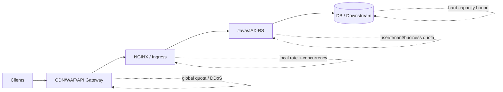
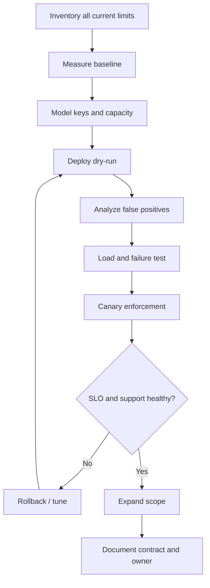

# Part 013 — Rate Limits, Connection Limits, and Traffic Shaping

> **Depth level:** Advanced  
> **Prerequisite:** Part 008–009 dan 012; dasar capacity, identity, overload control, HTTP retry semantics, serta trusted proxy chain.  
> **Scope:** request-rate limiting, connection/concurrency limiting, key design, burst/delay behavior, distributed limitations, overload protection, Kubernetes ingress implementation, client contract, observability, rollout, dan debugging.  
> **Bukan scope utama:** authentication architecture—Part 014; general security hardening—Part 012; upstream load balancing—Part 008; performance capacity tuning—Part 016.

---

## Daftar isi

1. [Tujuan pembelajaran](#tujuan-pembelajaran)
2. [Executive mental model](#executive-mental-model)
3. [Empat problem yang berbeda](#empat-problem-yang-berbeda)
4. [Control-plane versus data-plane policy](#control-plane-versus-data-plane-policy)
5. [Core invariants](#core-invariants)
6. [Request-rate model](#request-rate-model)
7. [Leaky-bucket mental model NGINX](#leaky-bucket-mental-model-nginx)
8. [`limit_req_zone`](#limit_req_zone)
9. [`limit_req`](#limit_req)
10. [`burst`](#burst)
11. [`nodelay`](#nodelay)
12. [`delay`](#delay)
13. [Throughput, burst, dan concurrency](#throughput-burst-dan-concurrency)
14. [Worked examples](#worked-examples)
15. [Status code dan client contract](#status-code-dan-client-contract)
16. [Dry-run rollout](#dry-run-rollout)
17. [Limit inheritance](#limit-inheritance)
18. [Multiple rate limits](#multiple-rate-limits)
19. [Key design](#key-design)
20. [Per-IP keys](#per-ip-keys)
21. [NAT, carrier-grade NAT, dan proxies](#nat-carrier-grade-nat-dan-proxies)
22. [IPv6 considerations](#ipv6-considerations)
23. [Per-user keys](#per-user-keys)
24. [Per-tenant keys](#per-tenant-keys)
25. [Per-API-key keys](#per-api-key-keys)
26. [Composite keys](#composite-keys)
27. [Empty-key bypass](#empty-key-bypass)
28. [Key cardinality dan zone sizing](#key-cardinality-dan-zone-sizing)
29. [Connection limiting](#connection-limiting)
30. [`limit_conn_zone`](#limit_conn_zone)
31. [`limit_conn`](#limit_conn)
32. [HTTP/2 dan HTTP/3 semantics](#http2-dan-http3-semantics)
33. [Connection versus application concurrency](#connection-versus-application-concurrency)
34. [Bandwidth shaping](#bandwidth-shaping)
35. [Endpoint classification](#endpoint-classification)
36. [Read/write asymmetry](#readwrite-asymmetry)
37. [Protecting expensive endpoints](#protecting-expensive-endpoints)
38. [Long-lived and streaming traffic](#long-lived-and-streaming-traffic)
39. [Layered limits](#layered-limits)
40. [Distributed-state limitation](#distributed-state-limitation)
41. [Multi-worker, multi-pod, dan multi-region](#multi-worker-multi-pod-dan-multi-region)
42. [Autoscaling interaction](#autoscaling-interaction)
43. [NGINX versus Redis-backed limiter](#nginx-versus-redis-backed-limiter)
44. [NGINX versus API gateway quota](#nginx-versus-api-gateway-quota)
45. [Kubernetes ingress implementations](#kubernetes-ingress-implementations)
46. [Cloud and on-prem traffic considerations](#cloud-and-on-prem-traffic-considerations)
47. [Java/JAX-RS contract](#javajax-rs-contract)
48. [Retry-After dan client behavior](#retry-after-dan-client-behavior)
49. [Fairness and tenant isolation](#fairness-and-tenant-isolation)
50. [Failure-mode catalogue](#failure-mode-catalogue)
51. [Observability contract](#observability-contract)
52. [Capacity-driven policy design](#capacity-driven-policy-design)
53. [Safe rollout procedure](#safe-rollout-procedure)
54. [Debugging playbooks](#debugging-playbooks)
55. [Reference configuration](#reference-configuration)
56. [Decision matrix](#decision-matrix)
57. [Anti-patterns](#anti-patterns)
58. [PR review checklist](#pr-review-checklist)
59. [Internal verification checklist](#internal-verification-checklist)
60. [Hands-on exercises](#hands-on-exercises)
61. [Ringkasan invariants](#ringkasan-invariants)
62. [Referensi resmi](#referensi-resmi)

---

## Tujuan pembelajaran

Setelah menyelesaikan part ini, Anda harus mampu:

1. membedakan request rate, concurrent work, bandwidth, dan business quota;
2. menjelaskan behavior `limit_req` tanpa menyederhanakannya menjadi fixed-window counter;
3. menghitung implikasi `rate`, `burst`, `delay`, dan `nodelay` terhadap upstream concurrency;
4. memilih key berdasarkan actor yang benar—IP, user, tenant, API key, route, atau kombinasi;
5. mengenali bypass akibat empty key, spoofed identity header, NAT, IPv6 rotation, dan direct-backend path;
6. membedakan shared memory antarworker dari state terdistribusi antar-NGINX replica;
7. merancang 429 contract yang aman untuk clients, retries, dan SLO;
8. menempatkan local overload protection di NGINX serta global quota pada platform yang tepat;
9. menyelaraskan rate limits dengan Java executor, connection pool, downstream capacity, autoscaling lag, dan workload cost;
10. melakukan dry-run, load test, observability, progressive rollout, dan rollback;
11. mendiagnosis false positive, unexpected bypass, cross-replica inconsistency, dan rejection spike;
12. mereview perubahan Ingress/NGINX rate policy sebagai perubahan production capacity dan customer contract.

---

## Executive mental model

Rate limiting bukan hanya fitur anti-abuse. Ia adalah **admission control**:

```text
incoming demand
→ identify accounting subject
→ measure recent pressure
→ admit, delay, or reject
→ preserve bounded work downstream
→ expose an explicit client contract
```



### Principal distinction

```text
rate limit        = how quickly new work may enter
concurrency limit = how much work may be active at once
bandwidth limit   = how fast bytes may flow
quota             = how much usage is allowed over a business period
```

Satu angka “100 requests/second” tidak cukup untuk menggambarkan keselamatan sistem. Seratus health checks murah berbeda drastis dari seratus quote recalculations yang memanggil database, pricing engine, catalog, dan downstream services.

---

## Empat problem yang berbeda

| Problem | Unit | Typical control | Example |
|---|---:|---|---|
| arrival rate | requests/time | `limit_req` | max 20 order submissions/s |
| active work | concurrent requests | `limit_conn`, app bulkhead | max 4 exports/user |
| transfer rate | bytes/time | `limit_rate` | cap large download speed |
| entitlement quota | operations/day/month | API gateway/app/distributed store | 10k API calls/tenant/day |

### Why this matters

- A rate limit tidak otomatis membatasi concurrency bila latency meningkat.
- A connection limit bukan accurate user limit pada HTTP/2.
- Bandwidth throttling tidak melindungi expensive CPU-only endpoint.
- Local NGINX state tidak dapat menegakkan exact global monthly quota.

---

## Control-plane versus data-plane policy

### Control plane

Menentukan:

- siapa owner policy;
- key dan threshold;
- route applicability;
- exception/allowlist;
- environment overrides;
- rollout dan rollback;
- evidence serta review.

### Data plane

Menjalankan:

- key extraction;
- state lookup/update;
- delay/reject decision;
- status/header response;
- metrics dan logs.

Policy yang tersebar pada annotations, snippets, cloud WAF rules, API gateway, dan Java filters tanpa inventory adalah **unreviewable distributed policy**.

---

## Core invariants

1. Key harus merepresentasikan actor atau resource yang memang ingin dibatasi.
2. Key tidak boleh dapat dipalsukan oleh untrusted client.
3. Missing identity tidak boleh diam-diam menghasilkan empty-key bypass.
4. Rate/burst harus berasal dari measured capacity dan traffic shape, bukan angka estetis.
5. Rejection harus terjadi sebelum expensive work dibuat.
6. Limit yang sama tidak boleh dikalikan tanpa sadar oleh jumlah replica.
7. 429 harus distinguishable dari overload 503 dan authorization 403.
8. Client retries tidak boleh menciptakan feedback loop.
9. Exemptions harus sempit, terdokumentasi, dan observable.
10. Setiap policy punya dry-run, dashboard, test, owner, dan rollback.

---

## Request-rate model

Misalkan:

```text
λ = arrival rate
μ = admitted processing rate
L = average active work
W = average service time
```

Secara kasar, Little's Law:

```text
L ≈ λ × W
```

Jika endpoint menerima 100 request/s dan rata-rata mengambil 500 ms:

```text
expected active requests ≈ 100 × 0.5 = 50
```

Jika latency melonjak menjadi 5 s tetapi admission tetap 100 request/s:

```text
expected active requests ≈ 100 × 5 = 500
```

Jadi rate yang aman saat normal dapat menjadi tidak aman ketika downstream melambat. Karena itu production protection biasanya memerlukan:

```text
rate bound + concurrency bound + timeout + circuit breaker + queue bound
```

---

## Leaky-bucket mental model NGINX

NGINX `limit_req` mempertahankan state per key di shared-memory zone. Secara mental:

- request yang datang menambah “excess pressure”;
- pressure berkurang menurut configured rate;
- request dalam tolerance dapat diterima atau ditunda;
- ketika excess melewati burst capacity, request ditolak.

Jangan memodelkannya sebagai:

```text
counter reset setiap detik
```

Model yang lebih tepat:

```text
continuously decaying excess state per key
```

### Consequence

Dua traffic patterns dengan average RPS sama dapat menghasilkan behavior berbeda:

- evenly spaced traffic;
- microbursts akibat connection reuse, batch clients, retries, atau synchronized jobs.

---

## `limit_req_zone`

Zone didefinisikan pada `http` context:

```nginx
http {
    limit_req_zone $binary_remote_addr zone=per_ip_api:20m rate=20r/s;
}
```

Komponen:

| Component | Meaning |
|---|---|
| key | accounting identity |
| `zone=name:size` | shared-memory state store |
| `rate` | state drain/admission rate |
| `sync` | product/capability-dependent synchronization feature; verify build/product |

### Shared memory meaning

State zone dibagi antarworker dalam **satu NGINX instance**. Ini tidak berarti state otomatis dibagi dengan:

- NGINX pod lain;
- VM lain;
- region lain;
- cloud edge tier lain.

### Binary address

Untuk IP-based key, `$binary_remote_addr` lebih compact dan konsisten untuk IPv4/IPv6 daripada textual `$remote_addr`.

---

## `limit_req`

Policy diterapkan pada `http`, `server`, atau `location`:

```nginx
location /api/ {
    limit_req zone=per_ip_api burst=40 nodelay;
    limit_req_status 429;

    proxy_pass http://jaxrs_backend;
}
```

Tanpa `burst`, excess request ditolak segera setelah configured rate dilampaui.

### Decision outcomes

```text
PASSED
DELAYED
REJECTED
DELAYED_DRY_RUN
REJECTED_DRY_RUN
```

Expose `$limit_req_status` dalam access log untuk membedakan outcome.

---

## `burst`

`burst=N` adalah tolerance terhadap temporary excess, bukan tambahan sustained rate.

```nginx
limit_req zone=per_user burst=20;
```

Artinya:

- configured rate tetap long-term admission rate;
- hingga 20 excess requests dapat menunggu/menempati burst state;
- request setelah capacity tersebut ditolak.

### Misleading interpretation

Salah:

```text
rate 10r/s + burst 20 = 30r/s forever
```

Benar:

```text
10r/s sustainable, dengan temporary excess tolerance 20
```

### Queue cost

Dengan default delayed behavior, burst dapat menjadi queue di NGINX. Queue menambah:

- tail latency;
- client timeout risk;
- request lifetime;
- memory/state pressure;
- uncertainty pada user experience.

---

## `nodelay`

```nginx
limit_req zone=per_user burst=20 nodelay;
```

`nodelay` menerima excess request segera selama burst capacity masih tersedia, tetapi slot pressure tetap dipertahankan menurut rate.

### Implication

`nodelay` melindungi sustained rate tetapi **mengizinkan instantaneous concurrency spike** ke upstream.

Jika 20 requests tiba bersamaan dan semua diteruskan segera:

```text
upstream may receive a burst of 20 now
```

Ini cocok bila:

- backend mampu menyerap microburst;
- low latency lebih penting daripada smoothing;
- burst size sudah terkait dengan concurrency capacity.

Tidak cocok bila:

- backend mempunyai narrow DB pool;
- operation sangat mahal;
- downstream mudah collapse karena fan-out.

---

## `delay`

```nginx
limit_req zone=per_user burst=20 delay=5;
```

Mental model:

- initial excess range dapat diproses tanpa delay;
- excess berikutnya hingga burst threshold ditunda;
- di atas burst threshold ditolak.

Gunakan hanya setelah menguji behavior pada versi/build yang benar.

### Design purpose

`delay` memungkinkan kombinasi:

- small immediate burst untuk interactive UX;
- smoothing untuk excess berikutnya;
- hard rejection untuk overload.

---

## Throughput, burst, dan concurrency

Approximate worst-case concurrency contribution:

```text
instant admitted burst × endpoint service time overlap
```

Contoh:

```text
rate = 10r/s
burst = 40
nodelay
service time = 2s
```

Satu client/key dapat mengirim 40 requests hampir bersamaan. Jika semuanya expensive dan upstream menerimanya:

```text
~40 active operations immediately
```

Setelah itu admission melambat, tetapi damage dapat sudah terjadi.

### Capacity-first formula

Tentukan:

```text
C_safe = safe concurrent work for endpoint
B_other = concurrency reserved for other traffic
N_keys = number of simultaneously bursting keys
```

Then ensure:

```text
burst_per_key × simultaneous_bursting_keys <= C_safe - B_other
```

Ini conservative, tetapi jauh lebih aman daripada memilih burst tanpa model.

---

## Worked examples

### Example A — Interactive read endpoint

Traffic:

- cheap cached reads;
- user may click rapidly;
- backend capacity large.

```nginx
limit_req_zone $binary_remote_addr zone=search_ip:10m rate=10r/s;

location /api/search {
    limit_req zone=search_ip burst=20 nodelay;
    limit_req_status 429;
}
```

### Example B — Expensive quote recalculation

Traffic:

- authenticated user;
- pricing/catalog fan-out;
- high cost;
- duplicate execution undesirable.

Prefer:

```text
small user-scoped burst
+ idempotency key
+ application bulkhead
+ operation-level deduplication
```

```nginx
limit_req_zone $trusted_subject zone=quote_user:20m rate=2r/s;

location = /api/quotes/recalculate {
    limit_req zone=quote_user burst=2;
    limit_req_status 429;
}
```

### Example C — Batch integration

A partner sends legitimate bursts. Per-IP limiting is unsafe because many consumers may share an egress NAT. Better:

```text
validated partner/API identity
→ per-partner rate
→ explicit batch SLA
→ distributed quota if multiple gateways
```

---

## Status code dan client contract

NGINX defaults for rejected `limit_req`/`limit_conn` are commonly 503 unless explicitly changed. For client-visible throttling, configure 429 deliberately:

```nginx
limit_req_status 429;
limit_conn_status 429;
```

### Semantics

| Status | Meaning |
|---|---|
| 429 | this actor/request exceeded policy |
| 503 | service unavailable or capacity failure |
| 403 | policy denies access independent of temporary rate |

### Response contract

A useful throttling response may include:

```http
HTTP/1.1 429 Too Many Requests
Content-Type: application/problem+json
Retry-After: 1
X-Request-ID: ...
```

But NGINX does not infer accurate `Retry-After` automatically from every custom policy. If you add it statically, ensure it is not misleading.

### Avoid leaking policy internals

Do not expose:

- exact anti-abuse thresholds when unnecessary;
- internal tenant IDs;
- infrastructure topology;
- secret key names.

---

## Dry-run rollout

NGINX supports dry-run accounting:

```nginx
limit_req_dry_run on;
limit_conn_dry_run on;
```

In dry run:

- requests are not delayed/rejected by the control;
- state and excess outcomes are still accounted;
- `$limit_req_status`/`$limit_conn_status` can reveal what would happen.

### Rollout phases

```text
1. inventory existing controls
2. establish baseline traffic and capacity
3. deploy dry-run
4. measure false positives by route/key/tenant
5. load-test burst and latency degradation
6. enforce on small scope
7. observe client retries and support impact
8. expand gradually
9. document final contract
```

---

## Limit inheritance

`limit_req` dan `limit_conn` directives inherit from parent only when current level has no same-type directives.

This creates a common trap:

```nginx
server {
    limit_req zone=global_api burst=100;

    location /expensive/ {
        limit_req zone=expensive_user burst=2;
        # parent global_api is no longer implicitly inherited here
    }
}
```

To apply both, declare both explicitly in the child location.

### Review rule

Whenever a nested location adds one limiter, verify all parent protections that may have disappeared.

---

## Multiple rate limits

NGINX can apply multiple `limit_req` directives:

```nginx
limit_req_zone $binary_remote_addr zone=per_ip:20m rate=20r/s;
limit_req_zone $server_name        zone=per_host:10m rate=2000r/s;

server {
    limit_req zone=per_ip burst=40 nodelay;
    limit_req zone=per_host burst=500;
}
```

This can enforce:

```text
per-actor fairness + total service protection
```

But stacking controls across CDN, WAF, LB, ingress, and app can create unexpected effective limits. Build a chain inventory.

---

## Key design

The key answers:

> Whose pressure are we accounting for?

Candidate dimensions:

- source IP;
- authenticated subject;
- tenant/account;
- API client ID;
- route/operation;
- server/host;
- region;
- plan/tier;
- trusted certificate identity.

### Key requirements

A good key is:

- authoritative;
- stable enough for policy;
- hard to spoof;
- bounded in cardinality;
- privacy-aware;
- available before expensive processing;
- consistent across relevant enforcement points.

---

## Per-IP keys

```nginx
limit_req_zone $binary_remote_addr zone=per_ip:20m rate=10r/s;
```

Advantages:

- available before authentication;
- simple;
- useful for anonymous abuse;
- cheap.

Limitations:

- NAT shares one identity;
- attackers rotate IPs;
- IPv6 address rotation;
- proxies hide original client unless trust chain is correct;
- one user may use multiple networks;
- service-to-service calls may share egress IP.

Use IP limits as coarse protection, not exact user entitlement.

---

## NAT, carrier-grade NAT, dan proxies

Thousands of legitimate users may appear under one address due to:

- enterprise proxy;
- mobile carrier NAT;
- partner egress gateway;
- cloud NAT;
- service mesh egress;
- forward proxy.

A strict per-IP limit can produce correlated customer outage.

### Diagnostic signs

- one IP with many distinct authenticated subjects;
- false positives concentrated by customer/office/carrier;
- all partner integrations throttled simultaneously;
- source IP is actually the load balancer because real-IP processing is wrong.

### Mitigation

```text
pre-auth IP guardrail
+ post-auth subject/tenant fairness
+ trusted proxy-chain validation
```

---

## IPv6 considerations

IPv6 clients may use privacy addresses and rotate interface identifiers. Exact full-address keys can be easier to evade.

Potential strategies:

- full IPv6 address for conservative privacy/isolation;
- normalized prefix key via trusted/precomputed mapping;
- authenticated subject key;
- layered IP + identity limits.

Do not invent prefix grouping with unsafe string slicing. Validate canonical address handling and privacy impact.

---

## Per-user keys

A user key must come from a trusted authentication result, not directly from a client header.

Unsafe:

```nginx
limit_req_zone $http_x_user_id zone=per_user:20m rate=5r/s;
```

Client can rotate or impersonate `X-User-ID`.

Safer chain:

```text
client token/session
→ trusted auth component validates
→ edge removes client-supplied identity headers
→ trusted subject variable/header produced
→ limiter and backend use that identity
```

### Pre-auth chicken-and-egg

`limit_req_zone` key evaluation and auth phase ordering require careful design. Do not assume a header produced by a later subrequest is available for an earlier access handler in every architecture. Test actual phase behavior and controller implementation.

Often the practical design is:

- IP limit before auth;
- identity-based distributed/app/API-gateway limit after validation;
- or use a controller/product feature designed for authenticated claims.

---

## Per-tenant keys

Per-tenant policy supports fairness when one customer can create many users.

```text
tenant burst budget
+ per-user fairness
+ global service ceiling
```

Risks:

- one noisy user can consume tenant budget;
- a missing tenant claim can bypass or merge traffic;
- tenant rename/migration can split state;
- tenant ID in logs may be sensitive.

Use immutable internal tenant identifier, not display name.

---

## Per-API-key keys

API keys are useful for machine clients when:

- validated before accounting;
- rotation overlap is planned;
- each partner/client gets separate credential;
- credentials are never logged.

Do not use raw API key as shared-memory key or log field. Derive a stable non-secret client identifier after validation.

---

## Composite keys

```nginx
map "$trusted_tenant:$request_method:$route_class" $rate_key {
    default "$trusted_tenant:$request_method:$route_class";
}
```

Composite keys can express:

- tenant + operation class;
- subject + route;
- client + plan;
- IP + host.

### Risks

- cardinality explosion;
- untrusted variable injection;
- ambiguous separators;
- key collisions;
- hard-to-debug policy fragmentation.

Prefer fixed, normalized dimensions and explicit fallback behavior.

---

## Empty-key bypass

NGINX does not account requests whose zone key evaluates to an empty string.

This is useful for conditional limiting but dangerous when accidental.

Example:

```nginx
map $trusted_subject $subject_key {
    default $trusted_subject;
    ""      "";
}
```

Anonymous/missing-subject traffic bypasses the limiter.

Safer explicit fallback:

```nginx
map $trusted_subject $subject_key {
    default $trusted_subject;
    ""      "anonymous:$binary_remote_addr";
}
```

### Invariant

Every expected request class must map to one of:

```text
explicit key
explicit exemption
explicit rejection
```

Never accidental empty state.

---

## Key cardinality dan zone sizing

Zone memory must hold state for active keys. Cardinality drivers:

- unique IPs;
- users;
- tenants;
- API keys;
- composite route keys;
- attack-generated values.

If zone storage is exhausted, further requests can fail.

### Capacity approach

1. measure unique active keys over decay/relevance horizon;
2. account for IPv6 and attack cardinality;
3. size with headroom;
4. alert on zone exhaustion/rejections;
5. avoid raw unbounded header/query-string keys.

### High-cardinality attack

An attacker can send unique spoofable key values to consume zone memory. Only use bounded or validated identity dimensions.

---

## Connection limiting

`limit_conn` caps simultaneous requests accounted under a key.

```nginx
limit_conn_zone $binary_remote_addr zone=ip_conn:20m;

location /api/export {
    limit_conn ip_conn 2;
    limit_conn_status 429;
}
```

NGINX counts a connection when a request is being processed and the complete request header has been read.

### Suitable uses

- expensive downloads;
- long polling;
- upload slots;
- per-user export jobs;
- protection against many parallel requests.

---

## `limit_conn_zone`

```nginx
limit_conn_zone $binary_remote_addr zone=per_ip_conn:20m;
limit_conn_zone $server_name        zone=per_service_conn:10m;
```

The same key rules apply:

- empty key not counted;
- state is local to one NGINX instance;
- zone size must match cardinality;
- trusted identity is mandatory.

---

## `limit_conn`

Multiple dimensions can be combined:

```nginx
location /api/downloads/ {
    limit_conn per_ip_conn 4;
    limit_conn per_service_conn 500;
    limit_conn_status 429;
}
```

This protects:

- fairness per client;
- total active load for route/service.

### Inheritance caveat

Like request limits, child directives can suppress inherited same-type directives. Review nested locations.

---

## HTTP/2 dan HTTP/3 semantics

For NGINX `limit_conn`, each concurrent HTTP/2 or HTTP/3 request is considered a separate connection for limiting purposes.

This is important because transport connections and logical streams differ:

```text
one TCP/QUIC connection
→ many concurrent HTTP requests
```

Do not infer policy behavior solely from socket count or browser DevTools connection count.

---

## Connection versus application concurrency

`limit_conn` is an edge approximation. It does not directly count:

- detached asynchronous jobs;
- work continuing after client disconnect;
- internal retries;
- fan-out calls;
- message-queue consumers;
- database statements;
- requests entering through another bypass path.

Application bulkheads remain necessary for expensive business operations.

### Example

A request returns `202 Accepted` after creating a background export. Edge concurrency may drop to zero while 100 exports continue.

The real control belongs at job admission/application layer.

---

## Bandwidth shaping

NGINX can limit response transfer rate:

```nginx
location /downloads/ {
    limit_rate 2m;
    limit_rate_after 10m;
}
```

Use cases:

- prevent a few downloads monopolizing egress;
- smooth internal links;
- protect on-prem bandwidth.

Trade-offs:

- longer connection lifetime;
- more worker connections occupied;
- client timeout interaction;
- potential poor user experience;
- not a substitute for object-storage/CDN delivery.

Request-upload shaping has different support/placement considerations and often belongs at network/proxy products designed for it.

---

## Endpoint classification

Classify endpoints by resource cost:

| Class | Examples | Typical protection |
|---|---|---|
| cheap read | health, small lookup | broad/global guardrails |
| cached read | catalog lookup | IP/user rate, cache protection |
| expensive read | report, complex search | user/tenant rate + concurrency |
| write | submit order, update quote | idempotency + small burst |
| bulk | import/export | job admission + concurrency |
| streaming | SSE/WebSocket/download | connection limits + idle timeout |
| auth | login/token/introspection | anti-bruteforce + IdP-aware limits |

Do not apply one uniform rate to all `/api/` paths.

---

## Read/write asymmetry

Writes often require lower burst because they:

- mutate state;
- hold locks;
- publish events;
- trigger workflows;
- create downstream side effects;
- are retried dangerously.

Reads may also be expensive, especially:

- unbounded filters;
- report generation;
- cache misses;
- fan-out aggregation.

Classify by **cost and side effect**, not method alone.

---

## Protecting expensive endpoints

A robust pattern:

```text
coarse edge rate
→ authenticated subject/tenant admission
→ application concurrency bulkhead
→ bounded queue
→ downstream timeout/circuit breaker
→ idempotency/deduplication
```

### Avoid queue multiplication

If NGINX delays, Java executor queues, connection pool waits, and downstream queues simultaneously, latency becomes invisible accumulated waiting.

Prefer one deliberate queue with bounded capacity and clear metrics.

---

## Long-lived and streaming traffic

SSE, WebSocket, large download, long polling, and streaming uploads consume time rather than high request counts.

A request-rate limit may admit thousands of long-lived connections because each client only makes one request.

Use:

- connection/concurrency limits;
- worker connection capacity;
- upstream connection limits;
- idle timeouts;
- per-user stream limits;
- platform-specific WebSocket/SSE scaling.

Detailed protocol handling appears in Part 026.

---

## Layered limits

Example layered policy:

```text
CDN/WAF: volumetric and IP reputation
cloud/API gateway: regional/client quota
NGINX ingress: local burst + concurrency protection
Java application: authenticated tenant/business rules
DB/downstream: pool/bulkhead hard bounds
```

### Layering rule

Each layer should have a distinct purpose. Avoid duplicating identical undocumented thresholds.

Document:

| Layer | Key | Window/model | Threshold | Response | Owner |
|---|---|---|---:|---|---|
| WAF | source IP | vendor model | ... | 403/429 | security |
| ingress | IP | leaky bucket | ... | 429 | platform |
| app | tenant | distributed token bucket | ... | 429 | product team |

---

## Distributed-state limitation

An NGINX shared-memory zone is not automatically global across replicas.

Suppose:

```text
configured limit per pod = 100 r/s
replicas = 6
traffic evenly distributed
```

Effective aggregate may approach:

```text
~600 r/s
```

Actual behavior depends on:

- load-balancer affinity;
- uneven traffic;
- rolling updates;
- pod count;
- controller/product features;
- regional topology.

### Exact quota requirement

If the business requirement is:

```text
tenant must never exceed 10,000 operations/day globally
```

Use a distributed authoritative quota mechanism, not replica-local ingress state alone.

---

## Multi-worker, multi-pod, dan multi-region

| Scope | Shared by default? |
|---|---|
| workers in same NGINX instance with zone | yes |
| containers in same pod | no, unless same process/shared mechanism |
| ingress controller pods | generally no local-zone sharing |
| clusters | no |
| regions | no |

Some commercial/controller products may offer synchronization or policy features. Treat them as product- and version-specific; verify actual deployment.

---

## Autoscaling interaction

Replica-local rate limiting creates a moving policy:

```text
scale out → aggregate allowance rises
scale in  → aggregate allowance falls
```

This can be beneficial for local capacity protection, because allowance tracks fleet size. It is wrong for fixed commercial quota.

### HPA lag

Rate limit should account for:

- metrics sampling interval;
- scale-up stabilization;
- pod startup;
- readiness;
- JVM warm-up;
- connection-pool warm-up;
- downstream capacity that may not scale.

Do not set admission equal to theoretical post-scale capacity before scale actually exists.

---

## NGINX versus Redis-backed limiter

| Dimension | NGINX local zone | Redis/distributed limiter |
|---|---|---|
| latency | very low/local | network round trip |
| availability dependency | NGINX only | Redis/service dependency |
| global consistency | local | cross-replica possible |
| complex plans/quotas | limited | flexible |
| anonymous IP abuse | excellent | possible but costlier |
| fail behavior | local deterministic | must design fail-open/closed |
| operational complexity | low | higher |

### Recommended division

```text
NGINX local guardrail for immediate protection
+ distributed limiter for tenant/plan/business quota
```

Do not call Redis synchronously for every request without capacity, timeout, failure, and hot-key analysis.

---

## NGINX versus API gateway quota

API gateways often provide:

- API key/client identification;
- subscription plans;
- distributed quota;
- developer portal;
- analytics;
- monetization;
- policy governance.

NGINX excels at:

- local high-performance admission;
- IP/host/route protection;
- burst smoothing;
- connection limits;
- close coupling to reverse-proxy path.

Choose based on requirement, not product overlap.

---

## Kubernetes ingress implementations

There is no universal NGINX annotation contract. Distinguish:

- F5 NGINX Ingress Controller;
- historical/community `ingress-nginx` conventions;
- NGINX Gateway Fabric;
- cloud-managed ingress products;
- custom platform abstractions.

Annotations with similar names may differ in:

- unit;
- per-replica behavior;
- key;
- burst multiplier;
- status code;
- inheritance;
- scope across paths;
- snippet generation.

### Review procedure

1. identify controller name, image, version, and IngressClass;
2. locate official docs for that exact controller/version;
3. inspect rendered NGINX config;
4. test with multiple replicas;
5. verify metrics/log variables;
6. roll out in dry-run or shadow-equivalent mode where supported.

### F5 NGINX Ingress Controller

F5 controller supports its own annotations and policy resources for request-rate limiting. Capability differs between NGINX Open Source and NGINX Plus. Do not copy community annotation examples into this controller.

### Community ingress annotations

Legacy/community annotation behavior may calculate limits per controller replica and use controller-specific burst conventions. Because ecosystem lifecycle and support status change, verify whether the controller remains approved and supported internally before relying on it.

---

## Cloud and on-prem traffic considerations

### AWS/EKS

Verify:

- WAF rate-based rules before ALB/NLB;
- ALB source IP propagation;
- NLB/PROXY protocol setup;
- AWS Load Balancer Controller versus NGINX controller ownership;
- cross-zone distribution;
- autoscaling effect on per-pod limits;
- CloudWatch/WAF/Ingress metrics alignment.

### Azure/AKS

Verify:

- Front Door/WAF rate controls;
- Application Gateway/APIM policies;
- source IP and X-Forwarded-For chain;
- AGIC versus NGINX routing ownership;
- per-instance gateway behavior;
- Azure Monitor evidence.

### On-prem/hybrid

Verify:

- corporate forward proxies and NAT aggregation;
- hardware LB persistence;
- duplicated throttling rules;
- WAN bandwidth;
- internal batch jobs;
- private ingress bypass;
- failover data-center policy consistency.

---

## Java/JAX-RS contract

NGINX protects entry rate, but Java must still implement:

- idempotency for retried writes;
- operation-specific bulkheads;
- bounded executors/queues;
- database pool bounds;
- downstream timeouts;
- tenant/object authorization;
- business quota where required;
- consistent 429 problem response;
- tracing and actor attribution.

### JAX-RS response example

```java
return Response.status(429)
        .type("application/problem+json")
        .header("Retry-After", "2")
        .entity(problem)
        .build();
```

Edge-generated and app-generated 429 should be distinguishable via logs/metrics, while presenting a compatible external contract.

### Provenance header

Do not expose internal implementation casually, but internally log a field such as:

```text
throttle_source=edge|gateway|application|downstream
```

---

## Retry-After dan client behavior

Clients should:

- respect `Retry-After` where present;
- use exponential backoff with jitter;
- cap retries;
- avoid retrying non-idempotent writes without idempotency protection;
- stop when request deadline is exhausted;
- not synchronize retry waves.

### Retry amplification

```text
100 rejected requests
× 3 immediate retries
= 300 additional attempts
```

A limiter without client retry design can worsen overload.

### Server guidance

- return stable machine-readable error;
- document retryability;
- do not return 429 for permanent authorization denial;
- align gateway/app policies;
- monitor repeat attempts per request/client.

---

## Fairness and tenant isolation

Fairness goals may conflict:

- equal requests per user;
- equal compute per tenant;
- paid-tier priority;
- latency-sensitive interactive traffic;
- batch throughput.

Request count is a poor proxy for compute when operations vary in cost.

### Weighted cost model

Business/application layer may assign costs:

```text
catalog read = 1 token
quote calculation = 20 tokens
bulk import = 100 tokens
```

NGINX basic rate limiting does not natively understand domain cost. Use route classes or application/distributed admission where necessary.

### Noisy-neighbor protection

A useful hierarchy:

```text
global service ceiling
→ tenant ceiling
→ user/client ceiling
→ expensive-operation ceiling
```

---

## Failure-mode catalogue

| Failure | Symptom | Likely cause | Evidence |
|---|---|---|---|
| false-positive 429 | legitimate users throttled | NAT/shared key, low threshold | key distribution, auth subjects/IP |
| no throttling | traffic exceeds policy | wrong location, empty key, bypass path | rendered config, `$limit_req_status` |
| aggregate limit too high | rate rises with pods | local per-replica state | replica count vs accepted RPS |
| aggregate limit unstable | behavior changes during HPA | pod count/affinity | deployment/HPA timeline |
| latency spike without 429 | requests delayed | burst queue, no `nodelay` | request time, `DELAYED` status |
| upstream spike | burst admitted instantly | large burst + `nodelay` | upstream active requests |
| all new keys fail | zone exhausted | high cardinality/undersized zone | error log, key cardinality |
| one tenant starves others | only global limit | no fairness layer | per-tenant metrics |
| auth endpoints unavailable | over-aggressive limiter | shared key/threshold | login/token route status |
| 503 mistaken as outage | default reject status | `limit_req_status` not set | access/error logs |
| retry storm | repeated 429 attempts | clients ignore backoff | attempt correlation |
| bypass via direct service | policy only at ingress | alternate reachability | network/service inventory |
| identity spoofing | attacker rotates header key | untrusted key source | raw/request vs trusted headers |
| streaming exhaustion | low RPS, high connections | no connection limit | active streams/connections |

---

## Observability contract

### Access-log fields

Include at least:

```nginx
log_format edge_json escape=json
  '{'
    '"ts":"$time_iso8601",'
    '"request_id":"$request_id",'
    '"status":$status,'
    '"request_time":$request_time,'
    '"limit_req_status":"$limit_req_status",'
    '"limit_conn_status":"$limit_conn_status",'
    '"remote_addr":"$remote_addr",'
    '"host":"$host",'
    '"method":"$request_method",'
    '"uri":"$uri",'
    '"upstream_addr":"$upstream_addr",'
    '"upstream_status":"$upstream_status"'
  '}';
```

Do not log raw credentials, tokens, API keys, or sensitive query strings.

### Metrics

Track:

- admitted requests;
- delayed requests;
- rejected requests;
- dry-run would-delay/would-reject;
- 429 by route, client class, tenant tier;
- active connections/streams;
- upstream concurrency;
- request latency separated by passed/delayed;
- retries after 429;
- zone exhaustion/error logs;
- HPA replicas and throttling rate;
- customer support incidents.

### Cardinality control

Do not put raw user ID, tenant ID, API key, or IP into high-cardinality Prometheus labels without governance. Prefer sampled logs, bounded cohorts, tier, route class, and controlled tenant diagnostics.

---

## Capacity-driven policy design

### Step 1 — Measure endpoint cost

For each route class:

- CPU/request;
- memory/request;
- service time distribution;
- DB connections;
- downstream calls;
- payload bytes;
- lock/contention behavior;
- failure amplification.

### Step 2 — Define safe operating envelope

```text
safe RPS
safe concurrent requests
safe burst
safe queue depth
safe downstream rate
```

Use load tests plus production telemetry.

### Step 3 — Reserve headroom

Reserve capacity for:

- health/admin traffic;
- retries;
- autoscaling lag;
- node/pod failure;
- rolling update;
- downstream slowdown;
- observability overhead.

### Step 4 — Choose actor fairness

Decide whether pressure is controlled by:

- anonymous IP;
- authenticated user;
- tenant;
- partner/client;
- route;
- entire service.

### Step 5 — Validate degraded state

Test when:

- DB latency ×10;
- one downstream unavailable;
- half pods gone;
- zone/controller restarted;
- auth service slow;
- one tenant bursts;
- clients retry aggressively.

---

## Safe rollout procedure



### Rollback readiness

Prepare:

- exact previous config;
- GitOps rollback commit;
- emergency threshold override;
- disable/dry-run switch;
- owner and approval path;
- dashboard and rollback criteria.

Avoid emergency “set threshold extremely high” changes without config validation and audit.

---

## Debugging playbooks

### Playbook A — Unexpected 429

1. Capture request ID, timestamp, host, method, normalized path.
2. Determine response source: CDN/WAF, LB, NGINX, app, or downstream.
3. Inspect `limit_req_status` and `limit_conn_status`.
4. Identify exact rendered location and inherited directives.
5. Reconstruct effective key using trusted variables.
6. Check NAT/shared-IP concentration.
7. Check replica count, affinity, and recent rollout.
8. Check delayed requests and client retry behavior.
9. Compare current load with policy threshold.
10. Apply narrow mitigation; do not globally disable without capacity assessment.

### Playbook B — Limit appears ineffective

1. Confirm request reaches intended NGINX instance.
2. Check direct service/alternate ingress bypass.
3. Dump effective config using `nginx -T` or controller diagnostic path.
4. Verify location match.
5. Check key is non-empty.
6. Confirm client is not distributed across many keys/IPs.
7. Multiply local limit by replicas.
8. Inspect `$limit_req_status`.
9. Generate controlled single-key traffic.
10. Verify product/controller annotation semantics.

### Playbook C — Latency rises after enabling limit

1. Check whether requests are `DELAYED` rather than rejected.
2. Examine `burst` without `nodelay` or `delay` threshold.
3. Compare client timeout with maximum queue delay.
4. Measure queue-induced tail latency.
5. Decide whether to reduce burst, use `nodelay`, or reject sooner.
6. Ensure upstream can handle immediate burst before switching.

### Playbook D — Zone exhaustion

1. Find shared-memory allocation and key expression.
2. Estimate active unique keys.
3. Check attack-generated/spoofable dimensions.
4. Confirm error log signature.
5. Increase size only after fixing unbounded key design.
6. Roll out safely because zone definition changes may require config lifecycle considerations.

### Test commands

```bash
# Sequential baseline
for i in $(seq 1 30); do
  curl -sS -o /dev/null -w '%{http_code} %{time_total}\n' \
    https://api.example.test/api/search
 done

# Concurrent burst
seq 1 100 | xargs -P 50 -I{} \
  curl -sS -o /dev/null -w '%{http_code}\n' \
  https://api.example.test/api/search

# Preserve request IDs for correlation
curl -i \
  -H 'X-Request-ID: rate-test-001' \
  https://api.example.test/api/search
```

Use purpose-built load tools for reliable arrival-rate tests. Shell concurrency is useful for smoke tests, not capacity proof.

---

## Reference configuration

```nginx
http {
    # Coarse anonymous protection.
    limit_req_zone $binary_remote_addr
        zone=api_per_ip:20m
        rate=20r/s;

    # Global virtual-host ceiling per NGINX instance.
    limit_req_zone $server_name
        zone=api_per_host:10m
        rate=2000r/s;

    # Active request protection.
    limit_conn_zone $binary_remote_addr
        zone=api_conn_per_ip:20m;

    log_format rate_json escape=json
      '{'
        '"ts":"$time_iso8601",'
        '"request_id":"$request_id",'
        '"status":$status,'
        '"request_time":$request_time,'
        '"limit_req_status":"$limit_req_status",'
        '"limit_conn_status":"$limit_conn_status",'
        '"remote_addr":"$remote_addr",'
        '"host":"$host",'
        '"method":"$request_method",'
        '"uri":"$uri"'
      '}';

    server {
        listen 443 ssl;
        server_name api.example.test;

        access_log /var/log/nginx/access.log rate_json;

        limit_req_status 429;
        limit_conn_status 429;
        limit_req_log_level notice;
        limit_conn_log_level notice;

        location /api/ {
            limit_req zone=api_per_ip burst=40 nodelay;
            limit_req zone=api_per_host burst=400;
            limit_conn api_conn_per_ip 20;

            proxy_set_header X-Request-ID $request_id;
            proxy_pass http://jaxrs_backend;
        }

        location = /api/reports/export {
            # Child scope explicitly repeats desired global controls.
            limit_req zone=api_per_ip burst=5;
            limit_req zone=api_per_host burst=50;
            limit_conn api_conn_per_ip 2;

            proxy_set_header X-Request-ID $request_id;
            proxy_pass http://jaxrs_backend;
        }
    }
}
```

### Important

This is a reasoning template, not a production recommendation. Thresholds, identity key, topology, status body, and controller syntax must be derived from internal measurements.

---

## Decision matrix

| Requirement | Preferred control |
|---|---|
| stop anonymous flood before auth | NGINX/WAF IP rate limit |
| smooth microbursts locally | NGINX `limit_req` with tested burst/delay |
| cap simultaneous downloads | `limit_conn` + bandwidth/timeout controls |
| fixed tenant quota across pods | distributed/API gateway/application limiter |
| subscription plan monthly quota | API management/business service |
| protect one expensive JAX-RS route | route rate + app bulkhead |
| prevent login brute force | IdP-aware/IP+account layered controls |
| protect from volumetric DDoS | cloud edge/WAF/scrubbing, not NGINX alone |
| prioritize interactive over batch | separate routes/queues/policies |
| limit asynchronous jobs | application/job admission control |

---

## Anti-patterns

### One global limit for all APIs

Ignores workload cost and criticality.

### Rate by untrusted header

Allows identity rotation/spoofing and zone exhaustion.

### Treating IP as user

Breaks behind NAT and proxies.

### Large `burst nodelay` on expensive operation

Converts rate policy into upstream concurrency spike.

### Fixed quota implemented per ingress pod

Aggregate changes with replicas and routing.

### Default 503 for throttling

Confuses capacity outage with explicit client policy.

### No dry-run

Discovers legitimate traffic shape in production through customer failure.

### 429 with immediate client retry

Creates positive-feedback overload.

### Limit only public ingress

Direct/internal paths bypass protection.

### Multiple hidden policies

WAF, gateway, ingress, and application reject independently with no provenance.

### Unbounded composite key

Consumes shared memory under attack.

### Queue everywhere

NGINX delay + Java queue + DB wait produces extreme tail latency.

---

## PR review checklist

### Requirement and ownership

- [ ] Is the problem abuse, overload, fairness, bandwidth, or commercial quota?
- [ ] Is the policy owner identified?
- [ ] Is the required scope local instance, cluster, region, or global?
- [ ] Are thresholds derived from production/load-test evidence?

### Key and trust

- [ ] What exact key is used?
- [ ] Is it written by a trusted component?
- [ ] What happens when the key is empty/missing?
- [ ] Could attackers create unbounded unique keys?
- [ ] Are NAT, proxies, IPv6, partner egress, and service accounts considered?

### Behavior

- [ ] Are `rate`, `burst`, `delay`, and `nodelay` behavior understood?
- [ ] Is instantaneous burst safe for upstream concurrency?
- [ ] Are parent controls lost due to directive inheritance?
- [ ] Does HTTP/2/HTTP/3 behavior match expectations?
- [ ] Are streaming/bulk endpoints treated separately?

### Distributed topology

- [ ] Is state local or distributed?
- [ ] How does replica count affect aggregate limit?
- [ ] How do HPA, rolling updates, multi-cluster, and multi-region affect policy?
- [ ] Are direct-backend and alternate-ingress paths covered?

### Client contract

- [ ] Is 429 used intentionally?
- [ ] Is `Retry-After` accurate or omitted?
- [ ] Is the error body compatible with application responses?
- [ ] Are retry/backoff/idempotency requirements documented?

### Operations

- [ ] Was dry-run used?
- [ ] Are delayed/rejected metrics and log variables captured?
- [ ] Are alert thresholds and SLO treatment defined?
- [ ] Is rollback immediate and tested?
- [ ] Are exceptions narrow and auditable?

---

## Internal verification checklist

### Repository and rendered configuration

- [ ] Locate all `limit_req_zone`, `limit_req`, `limit_conn_zone`, `limit_conn`, `limit_rate`, and related directives.
- [ ] Search Helm values, ConfigMaps, annotations, snippets, templates, Kustomize overlays, and GitOps repositories.
- [ ] Identify the exact controller product, image, version, IngressClass, and generated configuration.
- [ ] Confirm module availability/build flags and whether NGINX Open Source or NGINX Plus is used.
- [ ] Inspect directive inheritance across server/location blocks.
- [ ] Find empty-key maps and conditional exemptions.

### Full traffic chain

- [ ] Inventory limits in CDN, WAF, AWS/Azure LB, API gateway/APIM, NGINX, service mesh, Java app, and downstream APIs.
- [ ] Identify direct Service/NodePort/LoadBalancer/private-ingress bypass paths.
- [ ] Confirm trusted client-IP extraction and PROXY/X-Forwarded-For chain.
- [ ] Document whether limits are per edge instance, pod, cluster, region, or global.

### Identity and fairness

- [ ] Identify authoritative user, tenant, client, partner, and service identities.
- [ ] Confirm client-supplied identity headers are removed before trusted values are set.
- [ ] Check NAT/shared-egress distribution and partner network patterns.
- [ ] Verify anonymous, unauthenticated, service-account, admin, batch, and health-check treatment.
- [ ] Confirm tenant fairness and plan/tier policy ownership.

### Capacity

- [ ] Obtain measured safe RPS/concurrency for route classes.
- [ ] Compare limits with Java thread/executor capacity, DB pool, Kafka/downstream limits, and autoscaling lag.
- [ ] Quantify burst impact under degraded latency.
- [ ] Check long-lived streams, exports, uploads, and scheduled batch spikes.
- [ ] Verify zone sizing against active key cardinality and attack scenarios.

### Client contract and observability

- [ ] Verify actual reject status, body, headers, and response provenance.
- [ ] Find client retry/backoff behavior and idempotency protections.
- [ ] Confirm dashboards for passed, delayed, rejected, dry-run, 429, concurrency, and replica count.
- [ ] Confirm logs expose `$limit_req_status` and `$limit_conn_status` without sensitive identifiers.
- [ ] Locate alerts, runbooks, support notes, incident history, and rollback procedure.

### Governance

- [ ] Determine who can change annotations/snippets/global ConfigMap.
- [ ] Confirm CI validates generated NGINX config and policy tests.
- [ ] Verify environment-specific overrides and drift detection.
- [ ] Confirm exceptions have expiry, owner, justification, and audit trail.

> Semua threshold, controller capabilities, identity sources, topology, quotas, and exemptions pada konteks CSG harus diperlakukan sebagai **Internal verification checklist** sampai dibuktikan melalui repository, rendered config, dashboards, runbooks, dan diskusi dengan platform/SRE/security/team.

---

## Hands-on exercises

### Exercise 1 — Leaky-bucket behavior

Configure `5r/s` with different burst/delay modes. Generate evenly spaced traffic and 20-request microbursts. Plot accepted, delayed, rejected, and latency.

### Exercise 2 — Inheritance trap

Apply a global server limit, then add a location-specific limiter. Use rendered config and traffic tests to prove whether both controls apply.

### Exercise 3 — NAT fairness

Simulate many authenticated users behind one source IP. Compare per-IP, per-user, and layered policies.

### Exercise 4 — Multi-replica aggregate

Run two or more NGINX replicas behind a load balancer. Measure effective aggregate rate under random balancing and sticky sessions.

### Exercise 5 — Degraded backend

Increase JAX-RS response time from 100 ms to 5 s. Observe concurrency despite unchanged RPS. Add a connection/application bulkhead and compare.

### Exercise 6 — Empty-key failure

Create a conditional identity map with an empty fallback. Demonstrate bypass, then replace it with explicit anonymous key/rejection.

### Exercise 7 — Client retry storm

Build a client that retries 429 immediately, then one using bounded exponential backoff with jitter. Compare total attempts and recovery.

### Exercise 8 — Controller annotation proof

Deploy the exact approved ingress controller locally/test cluster. Inspect generated NGINX config and verify annotation behavior instead of relying on name similarity.

---

## Ringkasan invariants

1. Rate, concurrency, bandwidth, dan quota adalah controls berbeda.
2. `burst` adalah temporary excess capacity, bukan sustained throughput tambahan.
3. `nodelay` dapat menghasilkan immediate upstream concurrency spike.
4. Rate safety berubah ketika service time berubah.
5. IP adalah coarse network identity, bukan user identity.
6. Identity keys harus berasal dari trusted validation path.
7. Empty key berarti request tidak dihitung.
8. Shared zone menyatukan workers pada satu instance, bukan seluruh replica fleet.
9. Per-replica limit berubah secara agregat saat HPA/rollout.
10. Fixed global quota membutuhkan distributed authoritative state.
11. 429 harus memiliki client retry contract yang aman.
12. Application tetap membutuhkan bulkhead, idempotency, dan business authorization.
13. Dry-run, observability, and progressive rollout are mandatory for production policy.
14. Every limit must have purpose, owner, test, evidence, and rollback.

---

## Referensi resmi

- [NGINX `ngx_http_limit_req_module`](https://nginx.org/en/docs/http/ngx_http_limit_req_module.html)
- [NGINX `ngx_http_limit_conn_module`](https://nginx.org/en/docs/http/ngx_http_limit_conn_module.html)
- [NGINX Core HTTP Module — `limit_rate`](https://nginx.org/en/docs/http/ngx_http_core_module.html)
- [NGINX Rate Limiting Explained](https://blog.nginx.org/blog/rate-limiting-nginx)
- [F5 NGINX Ingress Controller — Advanced Configuration with Annotations](https://docs.nginx.com/nginx-ingress-controller/configuration/ingress-resources/advanced-configuration-with-annotations/)
- [F5 NGINX Ingress Controller — Policy Resources](https://docs.nginx.com/nginx-ingress-controller/configuration/policy-resource/)
- [RFC 6585 — Additional HTTP Status Codes](https://www.rfc-editor.org/rfc/rfc6585)
- [RFC 9110 — HTTP Semantics](https://www.rfc-editor.org/rfc/rfc9110)

---

**Part berikutnya:** Part 014 — Authentication at the Edge and Authorization Boundaries.
