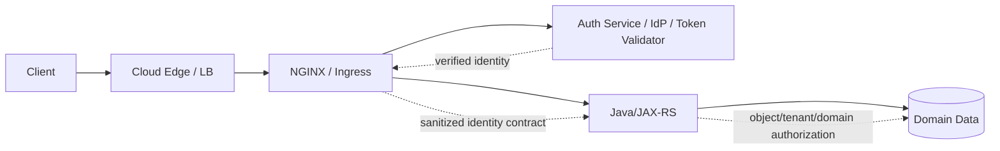

# Part 014 — Authentication at the Edge and Authorization Boundaries

> **Depth level:** Production/Architecture-level  
> **Prerequisite:** Part 005–007 dan 012–013; dasar OAuth 2.0, OpenID Connect, JWT, mTLS, cookies, reverse-proxy headers, JAX-RS security, dan zero-trust principles.  
> **Scope:** edge authentication patterns, `auth_basic`, `auth_request`, external auth proxy, JWT/OIDC product boundaries, mTLS identity, identity-header propagation, session/token lifecycle, 401/403 semantics, failure/caching behavior, Kubernetes integration, application authorization ownership, observability, rollout, dan debugging.  
> **Bukan scope utama:** cryptographic TLS detail—Part 007; general hardening—Part 012; rate limiting—Part 013; complete OAuth/OIDC protocol tutorial; product-specific enterprise identity architecture yang belum diverifikasi internal.

---

## Daftar isi

1. [Tujuan pembelajaran](#tujuan-pembelajaran)
2. [Executive mental model](#executive-mental-model)
3. [Authentication, authorization, dan policy enforcement](#authentication-authorization-dan-policy-enforcement)
4. [Trust-boundary map](#trust-boundary-map)
5. [Identity lifecycle](#identity-lifecycle)
6. [Core invariants](#core-invariants)
7. [Where authentication can live](#where-authentication-can-live)
8. [Where authorization must live](#where-authorization-must-live)
9. [Edge-authentication use cases](#edge-authentication-use-cases)
10. [When edge auth is the wrong boundary](#when-edge-auth-is-the-wrong-boundary)
11. [HTTP Basic Authentication](#http-basic-authentication)
12. [`auth_basic` operational model](#auth_basic-operational-model)
13. [Basic-auth failure and credential handling](#basic-auth-failure-and-credential-handling)
14. [`satisfy all` and `satisfy any`](#satisfy-all-and-satisfy-any)
15. [`auth_request` mental model](#auth_request-mental-model)
16. [`auth_request` response semantics](#auth_request-response-semantics)
17. [Auth subrequest construction](#auth-subrequest-construction)
18. [Identity extraction with `auth_request_set`](#identity-extraction-with-auth_request_set)
19. [Identity-header sanitization](#identity-header-sanitization)
20. [Original URI, method, dan request context](#original-uri-method-dan-request-context)
21. [Request-body considerations](#request-body-considerations)
22. [External-auth service contract](#external-auth-service-contract)
23. [Auth timeout, retry, dan availability](#auth-timeout-retry-dan-availability)
24. [Fail-open versus fail-closed](#fail-open-versus-fail-closed)
25. [Auth decision caching](#auth-decision-caching)
26. [OAuth2/OIDC proxy pattern](#oauth2oidc-proxy-pattern)
27. [Browser session pattern](#browser-session-pattern)
28. [API bearer-token pattern](#api-bearer-token-pattern)
29. [OIDC Authorization Code Flow boundary](#oidc-authorization-code-flow-boundary)
30. [PKCE, state, nonce, dan redirect URI](#pkce-state-nonce-dan-redirect-uri)
31. [Session cookies](#session-cookies)
32. [Logout and session invalidation](#logout-and-session-invalidation)
33. [JWT validation at the edge](#jwt-validation-at-the-edge)
34. [JWT validation checklist](#jwt-validation-checklist)
35. [JWKS retrieval and key rotation](#jwks-retrieval-and-key-rotation)
36. [JWT claims are not automatically authorization](#jwt-claims-are-not-automatically-authorization)
37. [NGINX Open Source, NGINX Plus, dan product-dependent auth](#nginx-open-source-nginx-plus-dan-product-dependent-auth)
38. [mTLS identity](#mtls-identity)
39. [Certificate-to-principal mapping](#certificate-to-principal-mapping)
40. [Revocation, expiry, dan certificate rotation](#revocation-expiry-dan-certificate-rotation)
41. [Workload identity and service-to-service traffic](#workload-identity-and-service-to-service-traffic)
42. [Identity propagation to Java/JAX-RS](#identity-propagation-to-javajax-rs)
43. [Forward token versus derived identity](#forward-token-versus-derived-identity)
44. [Java/JAX-RS authorization ownership](#javajax-rs-authorization-ownership)
45. [Coarse versus fine-grained authorization](#coarse-versus-fine-grained-authorization)
46. [Tenant and object-level authorization](#tenant-and-object-level-authorization)
47. [Policy drift between edge and application](#policy-drift-between-edge-and-application)
48. [401 versus 403](#401-versus-403)
49. [Error and redirect semantics](#error-and-redirect-semantics)
50. [CORS and browser authentication](#cors-and-browser-authentication)
51. [WebSocket, SSE, and streaming auth](#websocket-sse-and-streaming-auth)
52. [Kubernetes ingress and Gateway API patterns](#kubernetes-ingress-and-gateway-api-patterns)
53. [Cloud and on-prem identity placement](#cloud-and-on-prem-identity-placement)
54. [Zero-trust interpretation](#zero-trust-interpretation)
55. [Threat and failure-mode catalogue](#threat-and-failure-mode-catalogue)
56. [Observability and audit contract](#observability-and-audit-contract)
57. [Safe rollout and migration](#safe-rollout-and-migration)
58. [Debugging playbooks](#debugging-playbooks)
59. [Reference configurations](#reference-configurations)
60. [Architecture decision matrix](#architecture-decision-matrix)
61. [Anti-patterns](#anti-patterns)
62. [PR review checklist](#pr-review-checklist)
63. [Internal verification checklist](#internal-verification-checklist)
64. [Hands-on exercises](#hands-on-exercises)
65. [Ringkasan invariants](#ringkasan-invariants)
66. [Referensi resmi](#referensi-resmi)

---

## Tujuan pembelajaran

Setelah menyelesaikan part ini, Anda harus mampu:

1. menggambar authentication chain lengkap dari client hingga Java/JAX-RS security context;
2. membedakan identity proof, token/session validation, coarse route policy, domain authorization, dan audit;
3. memilih kapan Basic Auth, `auth_request`, external auth proxy, JWT validation, OIDC relying party, atau mTLS tepat digunakan;
4. menjelaskan 2xx/401/403/other response behavior dari `auth_request`;
5. membangun identity-header contract yang mencegah client spoofing dan direct-backend bypass;
6. menilai timeout, retry, caching, fail-open/fail-closed, dan availability coupling terhadap auth service;
7. memvalidasi issuer, audience, expiry, algorithm, key, scopes, dan token type secara benar;
8. membedakan authentication claim dari authorization decision;
9. menjaga tenant/object-level authorization tetap berada pada application/domain layer;
10. menyelaraskan edge identity dengan Jakarta Security, JAX-RS filters, servlet container, dan application principal;
11. mendiagnosis login loop, lost identity, stale decision, invalid redirect, JWKS failure, inconsistent 401/403, dan policy drift;
12. mereview NGINX/Ingress identity change sebagai perubahan trust boundary dan security architecture.

---

## Executive mental model

Authentication architecture harus menjawab empat pertanyaan berbeda:

```text
1. Who presented a credential?
2. Who validated it, under which trust policy?
3. What identity and attributes are asserted downstream?
4. Who decides whether this identity may perform this domain action?
```



### Principal rule

> Edge authentication can prove or normalize identity. It must not become the only place that enforces domain authorization requiring application state.

Examples of authorization that normally remain in Java:

- may user edit **this** quote?
- does order belong to user's tenant?
- is state transition legal from current lifecycle state?
- may an approver approve their own request?
- does role plus product, region, ownership, and segregation-of-duties policy allow the action?

---

## Authentication, authorization, dan policy enforcement

| Concept | Question | Typical evidence | Owner |
|---|---|---|---|
| authentication | who are you? | credential/token/certificate/session | IdP/auth layer |
| identity normalization | what canonical principal/tenant/client are you? | trusted claims/mapping | auth/platform |
| coarse authorization | may this class access this route? | group/scope/network/client | edge/API gateway |
| domain authorization | may this actor perform this action on this resource now? | DB/domain state/rules | Java application |
| audit | who did what under which decision? | immutable event/log | cross-layer |

### Common framing error

“JWT valid” means only that token validation policy passed. It does **not** automatically prove:

- correct tenant-resource relationship;
- current account state;
- current role membership after revocation;
- legal domain transition;
- ownership;
- separation of duties;
- authorization for every object.

---

## Trust-boundary map

For each hop, document:

| Hop | Authenticity guarantee | Headers trusted | Credentials visible | Bypass path |
|---|---|---|---|---|
| client → cloud edge | TLS server auth; maybe mTLS | none from client | bearer/cookie/cert | alternate DNS |
| edge → NGINX | network/TLS/PROXY trust | selected forwarding headers | often full credential | direct LB/service |
| NGINX → auth service | TLS/mTLS/network | original context | token/cookie | direct auth endpoint |
| NGINX → Java | TLS/network/service identity | normalized identity only | forwarded or stripped | ClusterIP/NodePort |
| Java → downstream | workload identity | app-generated | downstream credential | alternate integration |

### Hidden assumption to challenge

“Header datang dari ingress” is only true if Java cannot be reached through another route where clients can set the same header.

---

## Identity lifecycle

```mermaid
sequenceDiagram
    participant C as Client
    participant N as NGINX
    participant A as Auth/IdP
    participant J as Java/JAX-RS

    C->>N: Request + credential/session
    N->>N: Remove untrusted identity headers
    N->>A: Validate or authorize context
    A-->>N: Decision + trusted identity attributes
    alt allowed
        N->>J: Request + normalized identity contract
        J->>J: Build principal/security context
        J->>J: Domain authorization
        J-->>N: Response
        N-->>C: Response
    else unauthenticated
        N-->>C: 401 or login redirect
    else authenticated but denied
        N-->>C: 403
    else auth infrastructure failed
        N-->>C: explicit failure, normally fail-closed
    end
```



Lifecycle stages:

```text
credential acquisition
→ presentation
→ transport protection
→ syntax parsing
→ cryptographic/session validation
→ issuer/audience/policy validation
→ canonical identity mapping
→ context propagation
→ application authorization
→ audit
→ expiry/revocation/logout
```

---

## Core invariants

1. Client-supplied identity headers are removed before trusted values are set.
2. Only one documented component is authoritative for each identity attribute.
3. Authenticated identity and authorization decision are not conflated.
4. Edge bypass paths cannot impersonate trusted headers.
5. Token/cookie/certificate validation checks more than signature alone.
6. 401, 403, redirect, and 5xx semantics are deliberate and testable.
7. Auth infrastructure failure has an explicit fail-open/fail-closed policy.
8. Cached decisions cannot outlive acceptable revocation/staleness bounds.
9. Java rechecks tenant/object/domain authorization.
10. Credentials, tokens, cookies, assertions, and sensitive claims are not logged.
11. Logout/rotation/revocation behavior is documented end to end.
12. Every authentication path has owner, observability, tests, and rollback.

---

## Where authentication can live

Possible validation points:

- cloud identity-aware proxy;
- API gateway/APIM;
- NGINX Plus/native module;
- NGINX + external auth service;
- OAuth2/OIDC proxy;
- service mesh gateway;
- Java application;
- each microservice.

### Selection dimensions

- browser versus machine API;
- token versus session;
- central policy requirement;
- latency budget;
- revocation needs;
- cryptographic capability;
- product licensing;
- failure isolation;
- tenant/domain context;
- direct service reachability;
- audit requirements.

### No universal best location

Central edge validation reduces duplication but increases blast radius and trust in propagated identity. Application validation preserves end-to-end token semantics but duplicates libraries/config and can produce drift.

A common enterprise pattern is:

```text
edge validates obvious credential authenticity and coarse route access
+ application validates/consumes identity and enforces domain authorization
```

---

## Where authorization must live

### Suitable at edge

- route requires authenticated user;
- route limited to machine clients;
- coarse scope/group is mandatory;
- network/certificate allowlist;
- admin surface denied to public clients;
- method/path coarse policy.

### Must remain in application/domain layer

- resource ownership;
- tenant isolation;
- record-level permissions;
- current lifecycle state;
- monetary thresholds;
- approval matrix;
- separation of duties;
- delegated authority;
- data classification;
- context-dependent exceptions.

### Why

NGINX generally lacks authoritative domain data and transaction context. Encoding domain policy into path regex and token claims creates stale, duplicated, and non-transactional authorization.

---

## Edge-authentication use cases

Edge auth is effective for:

- protecting legacy backend without native identity support;
- central SSO for internal tools;
- consistent API token validation;
- mTLS client authentication;
- rejecting invalid credentials before Java resource consumption;
- normalizing claims into a controlled internal contract;
- invoking specialized policy/auth service;
- shielding static content/private files.

### Benefit model

```text
early rejection
+ centralized policy
+ reduced application duplication
+ consistent telemetry
```

### Cost model

```text
central blast radius
+ identity-header trust
+ auth-service dependency
+ policy drift risk
+ controller/product coupling
```

---

## When edge auth is the wrong boundary

Avoid relying solely on edge auth when:

- service has alternate internal entry paths;
- policy requires current domain data;
- each operation has object-level rules;
- authorization must be transactional with mutation;
- token must be validated end-to-end by resource server;
- non-HTTP consumers invoke the same domain logic;
- internal service calls require workload-level identity;
- edge-generated identity cannot be cryptographically bound downstream.

### Strong conclusion

An authenticated request can still be unauthorized, malicious, or semantically invalid.

---

## HTTP Basic Authentication

Basic Auth transmits credentials on every request in an `Authorization: Basic ...` header. Base64 is encoding, not encryption.

Use only over TLS.

Potential use cases:

- temporary internal diagnostic surface;
- low-complexity non-user automation;
- emergency protected static site;
- secondary control with network restriction.

Poor fit for:

- public end-user SSO;
- granular authorization;
- modern lifecycle/conditional access;
- large credential population;
- passwordless/MFA requirements.

---

## `auth_basic` operational model

```nginx
location /internal-tool/ {
    auth_basic "Internal Tool";
    auth_basic_user_file /etc/nginx/secrets/internal-tool.htpasswd;

    proxy_pass http://internal_tool;
}
```

`auth_basic` can be configured at `http`, `server`, `location`, and `limit_except` contexts. `auth_basic off` can cancel inherited policy.

### Operational requirements

- TLS mandatory;
- strong password hashing supported by approved tooling;
- file permissions restricted;
- secret rotation process;
- no credentials in image layers or Git;
- audit failed attempts without logging header;
- protect against brute force using Part 013 controls;
- define decommission date for temporary usage.

---

## Basic-auth failure and credential handling

On missing/invalid credentials, NGINX returns 401 with `WWW-Authenticate` challenge.

Security concerns:

- browser credential caching;
- shared workstation exposure;
- password reuse;
- no native centralized logout;
- static secret distribution;
- weak/deprecated hash formats;
- accidental plaintext backup;
- credentials visible to any hop terminating TLS.

### Do not

- embed credentials in URL;
- log `Authorization`;
- store htpasswd in a public ConfigMap;
- use Basic Auth as domain user authorization;
- assume IP allowlist makes plaintext HTTP safe.

---

## `satisfy all` and `satisfy any`

NGINX can combine access modules:

```nginx
location /admin/ {
    satisfy all;

    allow 10.20.0.0/16;
    deny all;

    auth_basic "Admin";
    auth_basic_user_file /etc/nginx/secrets/admin.htpasswd;
}
```

`all` requires all configured access controls to allow. `any` allows when at least one allows.

### Dangerous pattern

```nginx
satisfy any;
allow 10.0.0.0/8;
auth_request /auth;
```

If corporate network is broad or spoofable through a trusted-proxy mistake, authentication may be bypassed.

### Review questions

- Is OR semantics really intended?
- Can one control return an error rather than clean deny?
- Which module runs and redirects?
- Does controller-generated config alter ordering?
- Are internal networks themselves trusted identities?

---

## `auth_request` mental model

`auth_request` performs an internal subrequest to an authorization endpoint before allowing the original request.

```nginx
location /api/ {
    auth_request /_auth;
    proxy_pass http://jaxrs_backend;
}

location = /_auth {
    internal;
    proxy_pass http://auth_service/validate;
    proxy_pass_request_body off;
    proxy_set_header Content-Length "";
    proxy_set_header X-Original-URI $request_uri;
}
```

It is a **decision delegation pattern**:

```text
NGINX owns enforcement
external service owns validation/policy decision
Java owns domain authorization
```

### Build availability

The NGINX Open Source `auth_request` module is not built by default in every custom build; verify `nginx -V` includes `--with-http_auth_request_module`. Product images/controllers may include it.

---

## `auth_request` response semantics

Official behavior:

| Auth subrequest status | Original request result |
|---|---|
| 2xx | allowed |
| 401 | denied as 401; `WWW-Authenticate` propagated |
| 403 | denied as 403 |
| any other status | treated as auth error |

### Critical distinction

Auth service must not return 404 for “user not found” unless you intend NGINX to treat it as infrastructure/error behavior. Normalize decisions to the expected contract.

### Recommended contract

```text
200 = authenticated/allowed; trusted attributes may be returned
401 = no valid authentication
403 = valid identity but coarse policy denied
5xx = auth system unable to decide
```

---

## Auth subrequest construction

A robust internal auth location:

```nginx
location = /_auth {
    internal;

    proxy_pass http://auth_service/verify;
    proxy_pass_request_body off;
    proxy_set_header Content-Length "";

    proxy_set_header X-Original-Method $request_method;
    proxy_set_header X-Original-URI    $request_uri;
    proxy_set_header X-Original-Host   $host;
    proxy_set_header X-Request-ID      $request_id;

    proxy_set_header Authorization $http_authorization;
    proxy_set_header Cookie        $http_cookie;

    proxy_connect_timeout 1s;
    proxy_read_timeout    2s;
}
```

### `internal`

Mark auth endpoint `internal` so external clients cannot invoke it directly through normal URI access.

### Minimize context

Pass only what the auth service requires. Every forwarded header increases ambiguity and data exposure.

---

## Identity extraction with `auth_request_set`

Capture trusted response headers after subrequest:

```nginx
location /api/ {
    auth_request /_auth;

    auth_request_set $auth_subject $upstream_http_x_auth_subject;
    auth_request_set $auth_tenant  $upstream_http_x_auth_tenant;
    auth_request_set $auth_scopes  $upstream_http_x_auth_scopes;

    proxy_set_header X-Authenticated-Subject $auth_subject;
    proxy_set_header X-Authenticated-Tenant  $auth_tenant;
    proxy_set_header X-Authenticated-Scopes  $auth_scopes;

    proxy_pass http://jaxrs_backend;
}
```

### Validation responsibility

NGINX is copying values. The auth service must ensure:

- canonical format;
- bounded length;
- no control characters;
- no ambiguous delimiter encoding;
- immutable identifiers;
- no secrets;
- claims reflect validated credential.

### Avoid role explosion

Do not serialize huge role/permission sets into headers. Header limits, staleness, and parsing ambiguity create operational and security risk.

---

## Identity-header sanitization

Before forwarding trusted identity, overwrite or clear client values:

```nginx
proxy_set_header X-Authenticated-Subject "";
proxy_set_header X-Authenticated-Tenant  "";
proxy_set_header X-Authenticated-Roles   "";
```

Then set only trusted values in the protected location.

In practice, one `proxy_set_header` per name determines what upstream receives. The key principle is:

```text
never pass through client-provided identity header unchanged
```

### Direct-backend defense

Java should accept identity headers only when request comes from a trusted authenticated proxy path, enforced through:

- network policy/security groups;
- mTLS between proxy and service;
- workload identity;
- service binding/private listener;
- signed internal assertion where appropriate.

Source IP alone is often insufficient in dynamic Kubernetes networks.

---

## Original URI, method, dan request context

Auth policy may require:

- normalized route;
- original raw URI/query;
- method;
- host;
- scheme;
- client IP;
- request ID;
- selected headers.

### Parser-agreement problem

Auth service and backend must authorize the same logical resource. Risks:

- auth sees `$request_uri`, backend sees rewritten `$uri`;
- percent-decoding differs;
- path normalization differs;
- method override headers;
- host rewritten between phases;
- query stripped by rewrite.

Document exactly which representation is authoritative.

---

## Request-body considerations

The common `auth_request` pattern disables passing request body:

```nginx
proxy_pass_request_body off;
proxy_set_header Content-Length "";
```

This avoids sending potentially large/sensitive body to auth service.

### Consequence

Auth service cannot make body-content authorization decisions. Those belong in Java/application after parsing and validation.

### Large upload interaction

Depending on request-processing and buffering behavior, an unauthenticated large body may still create ingress resource pressure before final auth outcome. Test actual client-body read/buffering sequence for the exact configuration/controller.

Use:

- header/token validation as early as possible;
- body-size limits;
- client-body timeouts;
- direct-upload designs;
- route-specific controls.

---

## External-auth service contract

Define a versioned contract:

### Inputs

- credential/session;
- original method and canonical route;
- host/audience;
- client/workload context;
- request ID;
- optional policy metadata.

### Outputs

- 200/401/403/5xx semantics;
- canonical subject;
- tenant/client ID;
- bounded scopes/groups;
- credential expiry/session expiry;
- optional challenge;
- decision/audit ID.

### Nonfunctional contract

- p50/p95/p99 latency;
- timeout;
- availability/SLO;
- capacity per protected request;
- caching rules;
- key/IdP dependency;
- retry policy;
- fail mode;
- audit retention;
- backward compatibility.

### Prevent recursive loops

Auth-service route itself must not be protected by the same `auth_request` chain unless intentionally designed. Otherwise:

```text
request → auth_request → auth route → auth_request → ...
```

---

## Auth timeout, retry, dan availability

Every protected request may add an auth dependency:

```text
external request latency
= auth decision latency
+ upstream application latency
+ proxy overhead
```

### Timeout design

Auth timeout must be:

- shorter than external request deadline;
- bounded tightly enough to prevent fleet-wide queueing;
- long enough for normal IdP/key/cache behavior;
- aligned with circuit breaker and retry policy.

### Retry caution

Retrying auth requests can:

- double auth load;
- duplicate session refresh/side effects;
- increase latency;
- hide partial outage;
- create inconsistent decisions.

Auth validation should be idempotent. Token refresh and login callbacks are different operations and need separate design.

---

## Fail-open versus fail-closed

### Fail-closed

If auth system cannot decide, deny access.

Appropriate for:

- customer/account data;
- admin operations;
- writes;
- regulated systems;
- tenant-isolated resources.

Cost: auth outage becomes application outage.

### Fail-open

Allow request when auth system fails.

Usually unacceptable for protected resources. Potential narrow uses:

- non-sensitive public content;
- telemetry where loss is worse and no identity-dependent action occurs;
- specifically approved degraded mode.

### Decision table

| Resource | Auth failure | Recommended default |
|---|---|---|
| public health page | bypass auth entirely | public route |
| authenticated read | cannot validate | fail-closed |
| financial/order write | cannot validate | fail-closed |
| admin endpoint | cannot validate | fail-closed |
| static public asset | no auth required | separate route |

Do not implement accidental fail-open through `error_page` or broad `satisfy any`.

---

## Auth decision caching

Caching can reduce latency and auth load, but creates revocation/staleness window.

### Cache-key dimensions

May include:

- token/session identifier hash;
- route class;
- method;
- audience;
- policy version;
- tenant context.

Missing dimensions can reuse a permissive decision for a more sensitive action.

### TTL bound

Cache TTL should not exceed acceptable minimum of:

```text
token/session remaining lifetime
revocation tolerance
role-change tolerance
policy-update tolerance
credential-risk tolerance
```

### Never cache blindly

- 5xx decisions;
- redirects with per-request state;
- challenges containing dynamic data;
- responses with unbounded sensitive headers;
- allow decisions across different methods/resources without proof.

### Negative caching

Short negative caching may reduce brute-force load but can prolong lockout after credential correction. Design deliberately.

---

## OAuth2/OIDC proxy pattern

An external proxy can act as:

- OIDC client/relying party for browser login;
- session manager;
- token validator;
- auth subrequest backend;
- identity-header producer.

Typical flow:

```text
browser → NGINX → auth proxy
                    ↓ redirect
                    IdP
browser ← callback/session cookie
browser → NGINX → auth subrequest → allow → Java
```

### Benefits

- central SSO;
- legacy-app enablement;
- standardized login/session logic;
- IdP integration isolated from Java.

### Risks

- callback/redirect complexity;
- cookie-domain/path errors;
- session-store dependency;
- proxy becomes high-value security component;
- logout inconsistency;
- header trust and bypass.

---

## Browser session pattern

Browser applications often use an HTTP-only secure session cookie rather than exposing access tokens to frontend JavaScript.

Properties to define:

- cookie name;
- domain and path;
- `Secure`;
- `HttpOnly`;
- `SameSite`;
- encryption/signing;
- idle timeout;
- absolute timeout;
- renewal;
- session store;
- multi-replica consistency;
- CSRF controls;
- logout/revocation.

### Cookie boundary

A broad domain cookie such as `.example.com` may be sent to unrelated subdomains. Minimize scope.

### TLS termination

Proxy must know external scheme correctly when generating redirects/cookies. Misconfigured `X-Forwarded-Proto` leads to insecure cookies or redirect loops.

---

## API bearer-token pattern

Machine/API clients typically send:

```http
Authorization: Bearer <access-token>
```

Validation may occur at gateway, NGINX Plus, auth service, Java resource server, or multiple layers.

### Resource-server checks

- token format/type;
- signature/decryption;
- issuer;
- audience/resource;
- expiry/not-before;
- algorithm/key policy;
- scopes/roles as coarse grants;
- client/application identity;
- tenant context;
- token revocation/introspection where required.

### Do not confuse ID token and access token

An OIDC ID token identifies a user to the client application. APIs should normally require access tokens intended for that resource/audience, not arbitrary ID tokens.

---

## OIDC Authorization Code Flow boundary

For browser SSO, relying party responsibilities include:

- redirecting to authorization endpoint;
- binding callback to initiating browser;
- exchanging code securely;
- validating ID token;
- creating session;
- handling token/session renewal;
- logout.

Native commercial NGINX OIDC capabilities and njs/external-proxy implementations differ. Verify product/version and do not treat configuration snippets as portable.

### Callback reachability

The configured redirect URI must match exactly what IdP allows, including:

- scheme;
- host;
- port when relevant;
- path;
- public versus private domain.

Load-balancer/NGINX rewrite mistakes commonly create callback mismatch and loops.

---

## PKCE, state, nonce, dan redirect URI

### `state`

Binds authorization response to initiating request and helps prevent CSRF/login mix-up.

### `nonce`

Binds ID token to authentication request/replay context.

### PKCE

Binds authorization code to a verifier, reducing code interception risk. Use where supported/required by client type and security profile.

### Redirect URI

Must be allowlisted precisely. Avoid wildcard redirect patterns and user-controlled post-login redirect targets.

### Open redirect defense

Store/validate original destination against trusted local paths. Do not reflect arbitrary external URLs after login/logout.

---

## Session cookies

A secure session design must answer:

```text
where is session state?
how is cookie protected?
how is it rotated?
what invalidates it?
what happens across replicas/regions?
```

### Stateful session

- server-side store;
- easy immediate revocation;
- store availability dependency;
- multi-region replication challenge.

### Stateless encrypted/signed session

- less server state;
- harder immediate revocation;
- cookie-size limits;
- key rotation complexity;
- stale claims until expiry.

### Cookie/header size

Large claims can exceed client/header limits and cause 400/431-like behavior across proxies. Keep session compact.

---

## Logout and session invalidation

Logout is not simply deleting one browser cookie.

Potential layers:

- application session;
- auth-proxy session;
- NGINX OIDC session;
- IdP session;
- access token;
- refresh token;
- downstream caches.

### Logout models

- local logout only;
- RP-initiated logout;
- front-channel logout;
- back-channel logout;
- global IdP logout.

### Failure modes

- user immediately logged back in because IdP session remains;
- cookie deleted on wrong path/domain;
- one replica retains session;
- access token remains valid after UI logout;
- logout callback blocked by ingress auth;
- open redirect through post-logout URI.

Document the exact security guarantee of “logout.”

---

## JWT validation at the edge

JWT validation can be local and fast when keys are available. But “decode JWT” is not validation.

A robust validator checks:

```text
structure
signature/encryption
allowed algorithm
key identity and source
issuer
intended audience
expiry and not-before
required claims
token type/purpose
policy-specific scopes/conditions
```

### Local validation trade-off

Benefits:

- no per-request introspection round trip;
- high throughput;
- auth service outage isolation after keys cached.

Costs:

- revocation delay;
- key-refresh dependency;
- policy duplication;
- clock skew;
- claim staleness;
- product capability/version constraints.

---

## JWT validation checklist

- [ ] Accept only explicitly allowed algorithms.
- [ ] Validate signature with trusted key set.
- [ ] Validate exact issuer.
- [ ] Validate audience/resource.
- [ ] Validate `exp` and `nbf`; define clock skew.
- [ ] Validate token type/use where profile defines it.
- [ ] Reject missing required claims.
- [ ] Do not trust arbitrary `kid` to fetch attacker-controlled URL.
- [ ] Bound token/header size.
- [ ] Treat claims as untrusted until validation completes.
- [ ] Do not log raw token or sensitive claims.
- [ ] Test key rotation and unknown-key behavior.
- [ ] Distinguish access token from ID token.
- [ ] Recheck application authorization against current domain state.

---

## JWKS retrieval and key rotation

Remote key retrieval introduces:

- DNS;
- TLS trust;
- IdP/JWKS availability;
- cache TTL;
- rotation overlap;
- unknown `kid` bursts;
- stale-key tolerance.

### Safe pattern

```text
trusted fixed issuer/JWKS endpoint
→ TLS verification
→ bounded timeout
→ cache
→ key-rotation overlap
→ metrics for refresh/failure/unknown kid
```

### Rotation scenario

1. IdP publishes new key while old key remains.
2. validators refresh/cache both.
3. IdP starts signing with new key.
4. old tokens remain valid until expiry.
5. old key removed after overlap.

Removing old key too early causes fleet-wide 401.

### Cache stampede

If every NGINX replica refreshes keys simultaneously, JWKS service can be overwhelmed. Use appropriate key/proxy caching and jitter where product supports it.

---

## JWT claims are not automatically authorization

Claims may be:

- stale until token expiry;
- broad groups unrelated to resource;
- issued for another audience;
- client-controlled in unsigned/invalid token;
- too large;
- ambiguous in format;
- missing current account/tenant state.

### Good edge use

```text
require valid token
require intended API audience
require coarse scope `orders.read`
```

### Application use

```text
verify order belongs to tenant
verify user has access to this account
verify order state allows operation
verify current policy/role where required
```

---

## NGINX Open Source, NGINX Plus, dan product-dependent auth

### NGINX Open Source

Common building blocks:

- Basic Auth;
- IP access controls;
- `auth_request` when module included;
- external OAuth2/OIDC proxy;
- njs/custom modules with careful governance;
- application-side JWT/OIDC validation.

### NGINX Plus

Commercial capabilities include native JWT validation, and current commercial versions include native OIDC relying-party functionality. Exact directives and release requirements are version-sensitive.

### Controllers/Gateway products

F5 NGINX Ingress Controller and NGINX Gateway Fabric expose policy resources/filters whose JWT/OIDC availability may depend on NGINX Plus and product version.

### Rule

Never write “NGINX supports JWT/OIDC” without specifying:

```text
product
edition
version
module/build
controller mode
configuration API
```

---

## mTLS identity

mTLS authenticates the client certificate during TLS handshake.

Potential identities:

- partner organization;
- machine client;
- workload/service;
- device;
- internal operator tool.

### Strengths

- cryptographic possession proof;
- no bearer secret replay without private key;
- strong service/client identity;
- early handshake rejection.

### Limitations

- certificate issuance/rotation complexity;
- revocation distribution;
- mapping certificate to application principal;
- intermediary TLS termination can hide client cert;
- not sufficient for fine-grained domain authorization.

---

## Certificate-to-principal mapping

Possible fields:

- SAN URI;
- SAN DNS;
- SAN email;
- subject DN;
- serial number;
- certificate fingerprint;
- SPIFFE ID.

Prefer stable SAN/profile-defined identity over free-form subject parsing.

### Mapping risks

- duplicate/non-unique subject;
- case/canonicalization differences;
- regex extraction bugs;
- certificate reissuance changing serial/fingerprint;
- CA hierarchy not constrained;
- one certificate shared by many actors.

### Internal header

If NGINX forwards certificate identity:

```nginx
proxy_set_header X-Client-Cert-Subject $ssl_client_s_dn;
proxy_set_header X-Client-Cert-Verify  $ssl_client_verify;
```

Java must trust these only over protected proxy-to-service channel. Forwarding full client certificate increases header size and sensitive-data exposure; do so only when required.

---

## Revocation, expiry, dan certificate rotation

Validation policy must define:

- trusted CA bundle;
- certificate validity;
- CRL/OCSP approach;
- emergency revocation;
- rotation overlap;
- clock synchronization;
- CA rollover;
- certificate pinning implications.

### Rotation failure modes

- new CA not deployed before client rotation;
- old CA removed too early;
- CRL unreachable/stale;
- private key missing/incorrect permissions;
- partner certificate mapped by serial and breaks on renewal;
- load balancer terminates mTLS but fails to propagate verified identity safely.

---

## Workload identity and service-to-service traffic

Internal network location is not identity.

Service-to-service identity may use:

- mTLS certificates;
- service mesh workload identity;
- cloud IAM-signed requests/tokens;
- OAuth2 client credentials;
- Kubernetes service-account tokens with audience controls;
- SPIFFE/SPIRE.

NGINX can enforce or propagate coarse workload identity, but downstream Java should verify authorization for the operation and tenant context.

### Confused-deputy risk

Service A authenticates to service B with a powerful workload credential while acting for user U. B must distinguish:

```text
calling workload identity
on-behalf-of user identity
requested tenant/resource
```

Do not collapse all into one `X-User` header.

---

## Identity propagation to Java/JAX-RS

Define an explicit internal contract, for example:

| Header/context | Meaning | Authoritative writer |
|---|---|---|
| `X-Authenticated-Subject` | immutable principal ID | trusted auth edge |
| `X-Authenticated-Tenant` | normalized tenant context | auth/policy service |
| `X-Authenticated-Client` | OAuth client/workload | token validator |
| `X-Auth-Decision-ID` | audit correlation | auth service |
| `traceparent` | trace context | tracing chain |
| `X-Request-ID` | request correlation | trusted edge |

### Contract requirements

- canonical encoding;
- max length;
- multiple-value handling;
- missing-value behavior;
- versioning;
- provenance;
- logging/privacy;
- direct-access prevention.

### Java adaptation

A JAX-RS filter or container security integration can construct a principal/security context from trusted identity. It must not accept the same headers from arbitrary callers.

---

## Forward token versus derived identity

### Forward bearer token

Advantages:

- Java can independently validate;
- downstream token exchange/delegation possible;
- preserves scopes/audience evidence.

Risks:

- token exposed to more components;
- accidental logging;
- audience mismatch for downstream;
- replay if stolen;
- duplicated validation.

### Forward derived identity headers

Advantages:

- simpler application integration;
- token hidden from backend;
- normalized identity.

Risks:

- strong trust in edge;
- header spoofing/bypass;
- loss of cryptographic evidence;
- claim/policy truncation.

### Forward signed internal assertion

Can cryptographically bind derived identity to an internal audience, but introduces:

- signer/key lifecycle;
- replay/expiry;
- verification libraries;
- new token format and governance.

Choose deliberately based on trust topology.

---

## Java/JAX-RS authorization ownership

Java should own domain authorization close to the state transition.

Example request:

```http
POST /tenants/T1/orders/O9/approve
```

Edge can validate:

- token is valid;
- audience is order API;
- scope includes `orders.approve`;
- coarse tenant context exists.

Java must validate atomically:

- principal may act for T1;
- O9 belongs to T1;
- current order state is approvable;
- approver is not disallowed by segregation-of-duties rule;
- amount/region/product policy permits approval;
- state did not change before commit.

### Defense in depth

Even if edge performed coarse checks, application should not assume route reachability equals authorization.

---

## Coarse versus fine-grained authorization

| Policy | Edge suitable? | Application required? |
|---|---:|---:|
| authenticated only | yes | often verify context |
| API audience | yes | optional repeat/consume |
| coarse scope | yes | yes for resource action |
| admin route group | yes | yes for exact operation |
| tenant membership | sometimes | yes |
| object ownership | no reliable domain data | yes |
| lifecycle transition | no | yes |
| monetary threshold | no | yes |
| segregation of duties | no | yes |

### Rule of thumb

If the policy depends on data fetched or mutated by the request, enforce it in the application transaction boundary.

---

## Tenant and object-level authorization

### Tenant context sources

- path;
- token claim;
- header;
- hostname;
- database relationship;
- user-selected session context.

Never assume they agree. Java must resolve and compare them.

### Cross-tenant attack

A valid user changes path from:

```text
/tenants/A/orders/123
```

to:

```text
/tenants/B/orders/123
```

A valid JWT and broad `orders.read` scope do not prevent this. Object query must include authorized tenant constraint.

### Safe data access

Prefer queries and repositories scoped by tenant/authorization context, rather than fetch-then-check patterns that risk data leakage or timing differences.

---

## Policy drift between edge and application

Drift examples:

- edge recognizes new scope, app does not;
- app requires role removed from edge config;
- different issuer/audience lists;
- group names mapped differently;
- one environment has stale policy;
- logout invalidates app session but not edge session;
- route rewrite causes edge policy mismatch.

### Mitigations

- one authoritative policy source where feasible;
- contract tests;
- policy version in logs/decision;
- shared test vectors;
- generated configuration;
- staged rollout;
- explicit backward compatibility.

Do not solve drift by placing all domain authorization in NGINX.

---

## 401 versus 403

### 401 Unauthorized

Semantically means authentication is required or presented credentials are invalid/insufficient for authentication. Often includes `WWW-Authenticate`.

Examples:

- missing bearer token;
- expired/invalid token;
- invalid Basic credentials;
- no valid session.

### 403 Forbidden

Identity may be known, but access is denied.

Examples:

- valid user lacks coarse scope;
- client certificate valid but partner not allowed for route;
- application denies resource action.

### Security nuance

Applications may intentionally avoid revealing resource existence. Still preserve consistent internal provenance/audit.

### Do not use

- 404 for every auth infrastructure failure;
- 500 for expected invalid credentials;
- 302 login redirect for machine JSON APIs;
- 401 for all domain authorization denials without reasoned contract.

---

## Error and redirect semantics

### Browser route

May redirect to IdP/login when no session.

### API route

Should usually return 401/403 JSON rather than HTML/302.

### Split routing

Separate browser and API locations/policies:

```text
/ui/*  → OIDC session + redirects
/api/* → bearer token + 401/403
```

### Error-page danger

A broad `error_page 401 = /login` can convert API errors into redirects, break clients, and create loops.

### Preserve challenge

`auth_request` propagates `WWW-Authenticate` from a 401 auth subrequest. Verify multiple challenge/header behavior through all proxies.

---

## CORS and browser authentication

CORS is browser response-sharing policy, not authentication.

### Preflight

Browser may send unauthenticated `OPTIONS` preflight. If auth blocks it, real request never occurs.

Design:

- explicit trusted origin policy;
- handle preflight consistently;
- do not allow credentials with wildcard origin;
- align cookie `SameSite` and cross-site requirements;
- protect actual request with authentication and CSRF controls.

### Cookie-based auth and CSRF

Because browser automatically sends cookies, state-changing requests need CSRF defense appropriate to architecture:

- SameSite;
- anti-CSRF token;
- origin/referer validation;
- method/content-type policy.

Bearer tokens manually attached by frontend have different risks, including XSS token theft.

---

## WebSocket, SSE, and streaming auth

Authentication generally occurs during initial HTTP handshake/request.

### Long-lived connection risk

After connection established:

- token may expire;
- user may be revoked;
- role may change;
- session may be terminated;
- edge does not automatically reauthorize every message.

Application protocol must define:

- connection lifetime;
- periodic reauthentication;
- server-side revocation/disconnect;
- per-message authorization;
- tenant/channel authorization.

### SSE

Reconnects repeat auth; ensure 401/redirect semantics work with client library.

### WebSocket

Do not treat allowed upgrade as authorization for every channel/action.

---

## Kubernetes ingress and Gateway API patterns

Controller-specific mechanisms may include:

- external-auth annotations;
- auth URL/signin URL;
- policy CRDs;
- JWT policy;
- OIDC filters;
- mTLS client validation;
- snippets.

There is no universal annotation vocabulary.

### Review workflow

1. identify exact controller/GatewayClass, edition, and version;
2. read official docs for that version;
3. inspect generated NGINX config/resources;
4. identify where session/token state lives;
5. test header sanitization and bypass paths;
6. test multi-replica behavior;
7. verify Secrets/RBAC/namespace boundaries;
8. validate redirects behind cloud LB.

### Shared ingress risk

If application namespaces can inject arbitrary snippets or identity headers, they may undermine platform trust. Restrict configuration capabilities through admission policy and RBAC.

### Auth service reachability

Use internal service DNS/network policy. Prevent external clients from reaching decision endpoints unless intentionally exposed.

---

## Cloud and on-prem identity placement

### AWS/EKS

Potential components:

- CloudFront/WAF;
- ALB OIDC/Cognito authentication;
- API Gateway authorizer;
- NLB + NGINX;
- NGINX external auth;
- Cognito/enterprise IdP;
- service mesh/workload IAM.

Verify which component is authoritative. ALB-generated identity headers require strict direct-access prevention and AWS-specific validation semantics.

### Azure/AKS

Potential components:

- Front Door/WAF;
- Application Gateway;
- Azure API Management;
- Entra ID;
- NGINX ingress/external auth;
- managed/workload identity.

Avoid validating same token differently at APIM, NGINX, and Java without shared issuer/audience policy.

### On-prem/hybrid

Potential components:

- corporate SSO/reverse proxy;
- hardware ADC;
- internal PKI;
- Kerberos/header-based identity bridge;
- NGINX;
- Keycloak/ADFS/other IdP;
- network trust zones.

Header-based legacy SSO is particularly sensitive to direct-backend bypass and proxy-chain trust.

---

## Zero-trust interpretation

Zero trust does not mean “put JWT validation everywhere.” It means:

```text
explicit identity
least privilege
continuous/contextual verification where needed
assume network compromise
bounded trust propagation
observable decisions
```

### For NGINX

- authenticate proxy-to-service channel;
- do not trust network location alone;
- strip untrusted identity headers;
- minimize propagated claims;
- enforce coarse route policy;
- log decision provenance;
- prevent alternate paths.

### For Java

- validate trusted principal context;
- enforce tenant/object/action policy;
- avoid ambient global user state;
- propagate workload and on-behalf-of identity explicitly;
- audit security-relevant decisions.

---

## Threat and failure-mode catalogue

| Failure/threat | Symptom | Root cause | Detection |
|---|---|---|---|
| identity-header spoofing | attacker appears as another user | pass-through header/direct backend | compare raw/trusted headers, route inventory |
| auth loop | repeated redirects/subrequests | auth route protects itself or callback | request trace, redirect chain |
| login redirect loop | browser cycles IdP/NGINX | scheme/host/cookie/state mismatch | browser HAR, ingress logs |
| all users 401 after rotation | valid tokens rejected | JWKS/CA/key overlap failure | `kid`, key-cache, IdP timeline |
| stale access after revoke | user remains authorized | long token/session/cache TTL | decision age, revocation tests |
| auth outage becomes 5xx | protected routes fail | auth service unavailable/timeout | auth upstream metrics |
| accidental fail-open | access allowed during auth failure | `satisfy any`, error-page/bypass | chaos test, config review |
| API receives HTML login | client parsing failure | browser redirect policy on API | status/content-type/Location |
| 401 vs 403 inconsistent | clients retry incorrectly | layered policy mismatch | provenance logs |
| tenant crossover | valid user reads another tenant | edge-only scope check | application audit/security test |
| oversized headers | 400 before app | huge token/cookie/claims | header-size logs |
| token leakage | credential appears in logs | logging Authorization/query/cookie | log scanning |
| cookie not sent | repeated login | domain/path/SameSite/Secure | browser cookie inspection |
| callback rejected | IdP error | redirect URI mismatch | IdP audit/error |
| direct-service bypass | unauthenticated access | exposed Service/NodePort | network scan/inventory |
| auth cache confusion | wrong policy reused | incomplete cache key | decision/cache analysis |
| mTLS client rejected | handshake failure | CA/expiry/SNI/cert mapping | TLS logs/openssl |
| auth service overload | high latency/5xx | per-request validation, no cache, retry | auth RPS/latency |
| policy drift | route works in one env only | config/version mismatch | GitOps/rendered diff |

---

## Observability and audit contract

### Correlation fields

Capture safely:

- request ID;
- trace ID;
- auth decision ID;
- authentication mechanism;
- decision outcome;
- decision source;
- canonical subject hash/controlled identifier;
- tenant/client identifier under privacy rules;
- token issuer/audience category;
- credential age/expiry bucket;
- auth latency;
- auth upstream status;
- policy version;
- application authorization result.

### Never log

- raw `Authorization`;
- session cookie;
- refresh token;
- client secret;
- private certificate/key;
- full JWT payload by default;
- password;
- sensitive PII claims.

### Metrics

- auth allow/401/403/error;
- auth latency and timeout;
- IdP/JWKS requests and failures;
- cache hit/miss/stale;
- login success/failure;
- redirect loop indicators;
- session creation/expiry/logout;
- token validation failure reason categories;
- mTLS handshake failures;
- app-level authorization denies;
- direct-backend attempts;
- identity-header anomalies.

### Audit distinction

Operational access logs are not automatically sufficient compliance audit. Domain audit should record business action and authoritative principal near transaction commit.

---

## Safe rollout and migration

### Migration example: app validation → edge + app

```text
1. inventory current application validation/authorization
2. define canonical identity contract
3. deploy edge validation in observe/shadow mode where possible
4. compare decisions with application
5. enforce invalid-token rejection at edge
6. keep app validation temporarily for defense/comparison
7. prove no bypass path
8. decide whether app retains cryptographic revalidation
9. remove duplication only with explicit ADR and tests
```

### Header migration

During rename/versioning:

- edge may emit old and new headers temporarily;
- Java compares values and alerts on mismatch;
- clients never allowed to control either;
- deadline for old header removal;
- contract tests across services.

### IdP/key migration

Support overlap:

- old and new issuer/key/CA where safe;
- clear audience mapping;
- telemetry by issuer/key ID;
- rollback before old system decommission;
- no ambiguous acceptance of tokens from unintended issuer.

### Rollback

Rollback must not broaden access accidentally. Prefer reverting to previously verified auth path rather than disabling auth globally.

---

## Debugging playbooks

### Playbook A — Unexpected 401

1. Determine response source: cloud edge, NGINX, auth service, Java, downstream.
2. Capture request ID and `WWW-Authenticate`.
3. Check credential presence without logging its value.
4. Validate token/session expiry and clock.
5. Verify issuer, audience, algorithm, `kid`, and JWKS cache.
6. Check auth subrequest status and latency.
7. Check cookie domain/path/SameSite/Secure.
8. Check route/location and auth inheritance.
9. Test direct auth endpoint internally with synthetic credential.
10. Correlate with key/IdP/config rollout.

### Playbook B — Unexpected 403

1. Confirm authentication succeeded.
2. Identify whether deny came from IP, mTLS, auth service, edge scope, or Java domain policy.
3. Inspect policy version and trusted claims.
4. Verify tenant/resource relationship.
5. Check role/group mapping and staleness.
6. Compare environments and direct paths.
7. Avoid changing 403 to 401 without understanding client semantics.

### Playbook C — Redirect/login loop

1. Use browser HAR or `curl -IL` carefully.
2. Inspect `Location`, scheme, host, callback URI.
3. Verify forwarded proto/host trust.
4. Inspect state/nonce/session cookie creation and return.
5. Check cookie scope and SameSite.
6. Ensure callback/logout routes are not recursively protected.
7. Check IdP redirect URI registration.
8. Check multi-replica session store/key consistency.

### Playbook D — Identity missing in Java

1. Confirm auth response contains trusted identity header.
2. Confirm `auth_request_set` variable is populated after subrequest.
3. Inspect effective `proxy_set_header` in matched location.
4. Check nested-location inheritance/overrides.
5. Confirm load balancer/controller did not remove header.
6. Check Java container/filter header handling.
7. Verify header-name normalization and underscores policy.
8. Test direct backend rejects spoofed identity.

### Playbook E — JWKS/key rotation incident

1. Identify failing `kid`/issuer without exposing token.
2. Fetch trusted discovery/JWKS endpoint from NGINX network path.
3. Verify DNS, TLS CA, timeout, and cache.
4. Confirm new key published before signing switch.
5. Confirm old key remains for old-token lifetime.
6. Check clock skew.
7. Roll back signing key or refresh validator safely.
8. Monitor recovery by key ID and issuer.

### Playbook F — mTLS failure

```bash
openssl s_client \
  -connect api.example.test:443 \
  -servername api.example.test \
  -cert client.crt \
  -key client.key \
  -CAfile trusted-server-ca.pem \
  -showcerts
```

Check:

- client cert sent;
- chain trusted;
- expiry;
- SAN/profile;
- SNI;
- CRL/OCSP policy;
- which hop terminates TLS;
- propagation of verified identity.

### Safe token inspection

Decode only synthetic/non-production tokens in secure tools. Never paste production tokens into public websites, chat, tickets, or logs.

---

## Reference configurations

### Pattern A — Basic Auth for narrow internal route

```nginx
location /ops/read-only/ {
    allow 10.20.0.0/16;
    deny all;

    auth_basic "Operations";
    auth_basic_user_file /etc/nginx/secrets/ops.htpasswd;

    limit_req zone=ops_ip burst=5;
    proxy_pass http://ops_backend;
}
```

This is not a recommendation for user-facing enterprise SSO.

### Pattern B — External auth subrequest

```nginx
upstream auth_service {
    server auth-service.identity.svc.cluster.local:8080;
    keepalive 32;
}

upstream order_api {
    server order-api.default.svc.cluster.local:8080;
    keepalive 64;
}

server {
    listen 443 ssl;
    server_name orders.example.test;

    location = /_auth {
        internal;

        proxy_pass http://auth_service/verify;
        proxy_pass_request_body off;
        proxy_set_header Content-Length "";

        proxy_set_header Authorization      $http_authorization;
        proxy_set_header Cookie             $http_cookie;
        proxy_set_header X-Original-Method  $request_method;
        proxy_set_header X-Original-URI     $request_uri;
        proxy_set_header X-Original-Host    $host;
        proxy_set_header X-Request-ID       $request_id;

        proxy_connect_timeout 500ms;
        proxy_read_timeout    2s;
    }

    location /api/ {
        auth_request /_auth;

        auth_request_set $auth_subject  $upstream_http_x_auth_subject;
        auth_request_set $auth_tenant   $upstream_http_x_auth_tenant;
        auth_request_set $auth_client   $upstream_http_x_auth_client;
        auth_request_set $auth_decision $upstream_http_x_auth_decision_id;

        # Overwrite, never pass client values through.
        proxy_set_header X-Authenticated-Subject $auth_subject;
        proxy_set_header X-Authenticated-Tenant  $auth_tenant;
        proxy_set_header X-Authenticated-Client  $auth_client;
        proxy_set_header X-Auth-Decision-ID       $auth_decision;
        proxy_set_header X-Request-ID             $request_id;

        proxy_pass http://order_api;
    }
}
```

### Pattern C — mTLS coarse client identity

```nginx
server {
    listen 443 ssl;
    server_name partner-api.example.test;

    ssl_certificate     /etc/nginx/tls/server.crt;
    ssl_certificate_key /etc/nginx/tls/server.key;

    ssl_client_certificate /etc/nginx/tls/partner-ca.pem;
    ssl_verify_client on;
    ssl_verify_depth 3;

    location /api/ {
        proxy_set_header X-Verified-Client-Cert $ssl_client_verify;
        proxy_set_header X-Client-Cert-Subject  $ssl_client_s_dn;
        proxy_set_header X-Request-ID           $request_id;

        proxy_pass http://partner_jaxrs_backend;
    }
}
```

The application must map certificate identity safely and enforce operation/tenant authorization.

### Pattern D — Native JWT/OIDC

Native `auth_jwt` and `auth_oidc` examples are product/version-dependent commercial NGINX capabilities. Use official documentation for the deployed NGINX Plus release and verify exact issuer, audience, key-cache, session, resolver, TLS, and logout behavior. Do not paste a generic example into NGINX Open Source.

---

## Architecture decision matrix

| Requirement | Preferred pattern |
|---|---|
| temporary internal page protection | Basic Auth + TLS + network restriction |
| legacy web app needs SSO | OIDC proxy/NGINX Plus RP + trusted header contract |
| stateless API bearer validation | API gateway/NGINX Plus/auth service/Java resource server |
| dynamic centralized policy | `auth_request` to dedicated policy/auth service |
| partner machine identity | mTLS + client mapping + app authorization |
| exact object authorization | Java/domain layer |
| service-to-service identity | workload identity/mTLS/OAuth client credentials |
| global user session/revocation | IdP + session architecture, not header alone |
| coarse path/scope deny | edge/gateway plus app enforcement |
| highly regulated write | fail-closed, strong identity, app transactional authz/audit |

### Decision questions

- Is client browser or machine?
- Is credential bearer, cookie, or certificate?
- Is decision static/coarse or domain/state-dependent?
- Is revocation immediate?
- What is the acceptable auth outage behavior?
- Is direct backend access impossible?
- Must downstream receive token or only identity?
- Which product/module is actually deployed?

---

## Anti-patterns

### Trusting `X-User-ID` from client

Identity spoofing by design.

### Edge authentication as complete authorization

Fails tenant/object/domain policy.

### Signature-only JWT validation

Misses issuer, audience, expiry, purpose, and policy.

### Using ID token as arbitrary API access token

Audience and token-purpose violation.

### Logging bearer tokens/cookies

Turns logs into credential store.

### Long auth cache TTL

Defeats revocation and policy updates.

### Fail-open by accident

Broad `satisfy any`, error rewrites, or bypass path allow protected access.

### Protecting auth callback with same login redirect

Creates infinite loop.

### Header contract without network trust

Any direct caller can impersonate edge.

### Huge role headers

Header limits, stale policy, and parsing ambiguity.

### One auth behavior for browser and API

HTML redirects break API clients; raw 401 may break intended browser flow.

### mTLS subject string as full authorization

Certificate identity is not domain permission.

### Multiple independent validators with different policy

Creates environment- and path-dependent authentication.

### Removing application authorization after adding ingress auth

Deletes the only layer with domain data.

---

## PR review checklist

### Architecture and product

- [ ] Is the exact NGINX/controller/Gateway product, edition, version, and module identified?
- [ ] Is the authoritative IdP/auth service identified?
- [ ] Is the flow browser-session, bearer API, mTLS, or mixed?
- [ ] Is an ADR present for trust-boundary changes?

### Credential validation

- [ ] Are TLS and credential transport protected?
- [ ] Are issuer, audience, expiry, algorithm, key, token type, and required claims validated?
- [ ] Are JWKS/CA retrieval, cache, rotation, and failure behavior defined?
- [ ] Are clock skew and token/session lifetime explicit?

### Identity propagation

- [ ] Are client identity headers overwritten/removed?
- [ ] Are header names, format, max length, missing behavior, and version documented?
- [ ] Can Java be reached through any path that bypasses the trusted writer?
- [ ] Is proxy-to-service channel authenticated/restricted?
- [ ] Are raw tokens forwarded only when required?

### Authorization

- [ ] Which coarse policies are at edge?
- [ ] Which tenant/object/domain policies remain in Java?
- [ ] Is authorization transactional with state mutation where required?
- [ ] Are policy drift and compatibility tested?

### Failure and lifecycle

- [ ] Are 2xx/401/403/5xx semantics explicit?
- [ ] Is fail-open/fail-closed deliberate?
- [ ] Are auth timeout, retry, circuit breaker, and caching safe?
- [ ] Are login, callback, refresh, logout, revocation, and rotation tested?
- [ ] Are browser and API behaviors separated?

### Security and privacy

- [ ] Are CSRF, CORS, cookie flags, state, nonce, PKCE, and redirect validation addressed where relevant?
- [ ] Are tokens, cookies, secrets, certificates, and sensitive claims excluded from logs?
- [ ] Are Secrets/RBAC/file permissions appropriate?
- [ ] Are rate limits present for login/token/auth endpoints?

### Operations

- [ ] Are auth decision metrics and provenance logged?
- [ ] Are dashboards/alerts/runbooks available?
- [ ] Is rollout comparative/canary and rollback tested?
- [ ] Are key/CA/IdP outages included in drills?

---

## Internal verification checklist

### Current architecture

- [ ] Identify every external and internal entry path to each Java/JAX-RS service.
- [ ] Identify whether AWS ALB/API Gateway, Azure APIM/Application Gateway, NGINX, service mesh, or application validates identity.
- [ ] Locate IdP configuration, issuer, audience, client IDs, scopes, groups, tenant claims, and logout model.
- [ ] Confirm whether deployed runtime is NGINX Open Source, NGINX Plus, F5 NGINX Ingress Controller, another NGINX-based controller, or Gateway Fabric.
- [ ] Record exact image/module versions and support lifecycle.

### Repositories and configuration

- [ ] Search `auth_request`, `auth_request_set`, `auth_basic`, `auth_jwt`, `auth_oidc`, `satisfy`, mTLS directives, and identity headers.
- [ ] Search Ingress annotations, policies, Gateway filters, snippets, ConfigMaps, Helm values, and GitOps overlays.
- [ ] Inspect rendered NGINX config rather than only source templates.
- [ ] Locate auth proxy/service deployment, session store, Secrets, CA/JWKS cache, and network policies.
- [ ] Verify auth module build flags where relevant.

### Header and network trust

- [ ] List all identity headers accepted by Java and their authoritative writer.
- [ ] Confirm client-supplied copies are removed.
- [ ] Test direct ClusterIP/NodePort/LoadBalancer/private-ingress access.
- [ ] Verify SecurityGroup/NSG/firewall/Kubernetes NetworkPolicy/service mesh restrictions.
- [ ] Determine whether proxy-to-Java uses TLS/mTLS and how workload identity is established.
- [ ] Check forwarded Host/Proto/URI and callback correctness.

### Token/session/certificate lifecycle

- [ ] Verify access-token versus ID-token usage.
- [ ] Check issuer/audience/algorithm/expiry/not-before/token-type validation.
- [ ] Locate JWKS retrieval, TLS trust, cache TTL, unknown-`kid` behavior, and key-rotation runbook.
- [ ] Verify cookie domain/path/Secure/HttpOnly/SameSite, idle/absolute expiry, encryption/signing keys, and multi-replica session behavior.
- [ ] Map local, RP-initiated, front-channel, back-channel, and IdP logout support.
- [ ] Verify mTLS CA profile, SAN mapping, revocation, expiry alerts, and rotation overlap.

### Authorization ownership

- [ ] Map coarse edge policies versus application/domain policies.
- [ ] Review JAX-RS filters, Jakarta Security, Spring Security/container integration if present, and principal construction.
- [ ] Confirm tenant, object, state-transition, approval, and segregation-of-duties checks remain in application.
- [ ] Locate policy/version tests and audit events.
- [ ] Verify service-to-service on-behalf-of semantics.

### Reliability and observability

- [ ] Measure auth service/IdP/JWKS latency, capacity, timeout, retry, and SLO.
- [ ] Confirm fail-open/fail-closed behavior through chaos testing.
- [ ] Find caches and validate key/TTL/revocation semantics.
- [ ] Confirm metrics for allow/401/403/error, auth latency, key refresh, sessions, logout, and application denies.
- [ ] Confirm logs omit credentials and sensitive claims.
- [ ] Locate incident notes for login loops, expired certs, key rotation, cookie issues, and authorization defects.

### Governance and compliance

- [ ] Identify owners for IdP, NGINX, auth service, Java security, PKI, and audit.
- [ ] Verify RBAC for modifying auth annotations/snippets/Secrets.
- [ ] Confirm secret rotation, break-glass, access review, and emergency rollback procedures.
- [ ] Confirm evidence required for regulatory/security review.
- [ ] Validate data retention and privacy for identity/audit fields.

> Semua identity providers, claims, roles, groups, tenant mappings, headers, controller capabilities, cloud controls, and authorization ownership pada konteks CSG harus diperlakukan sebagai **Internal verification checklist** sampai dikonfirmasi dari codebase, repositories, rendered configuration, dashboards, runbooks, security documentation, dan diskusi dengan platform/SRE/security/product team.

---

## Hands-on exercises

### Exercise 1 — Header spoofing

Create a Java diagnostic endpoint that prints identity headers. Send spoofed headers through NGINX and directly to Java. Prove edge overwrites them and direct path is blocked.

### Exercise 2 — `auth_request` contract

Build a small auth service returning 200, 401, 403, 404, and 500. Record how NGINX transforms each response and which headers reach client/backend.

### Exercise 3 — Auth latency and outage

Inject auth latency and failures. Measure total request latency, active connections, 5xx, and Java traffic. Validate fail-closed and timeout budget.

### Exercise 4 — Cache staleness

Cache an allow decision, revoke user/role, and measure how long access remains. Tune TTL based on required revocation tolerance.

### Exercise 5 — OIDC redirect debugging

Run NGINX/auth proxy behind another local reverse proxy. Intentionally misconfigure forwarded proto/host and observe login loops/cookie behavior, then fix the trust chain.

### Exercise 6 — JWT rotation

Use synthetic keys/tokens. Publish new JWKS key, switch signer, preserve old key, then remove it after old-token expiry. Observe cache and unknown-`kid` behavior.

### Exercise 7 — Tenant authorization

Use valid token for tenant A and request tenant B resource. Ensure edge coarse authentication passes but Java returns a controlled deny without data leakage.

### Exercise 8 — mTLS rotation

Issue old/new client and CA certificates. Test overlap, expiry, untrusted CA, wrong SAN, and proxy-to-app identity propagation.

### Exercise 9 — Browser versus API behavior

Configure UI route to redirect and API route to return JSON 401. Test CORS preflight, cookies, and logout.

### Exercise 10 — Policy-drift test

Create a table of tokens/claims/routes and run the same vectors against edge and Java. Alert on mismatched allow/deny outcomes.

---

## Ringkasan invariants

1. Authentication proves identity under a policy; it does not grant every domain action.
2. Edge is suitable for early credential validation and coarse route policy.
3. Tenant/object/state-dependent authorization remains in Java/domain layer.
4. Client identity headers must be stripped and rewritten from trusted results.
5. Direct-backend access can invalidate the entire header-trust model.
6. `auth_request` allows on 2xx, denies on 401/403, and treats other statuses as errors.
7. Auth timeout, cache, retry, and fail mode are production availability decisions.
8. JWT validation requires issuer, audience, time, algorithm, key, and purpose checks—not decoding/signature alone.
9. Claims can be stale and are not complete authorization.
10. OIDC session, cookies, redirects, callback, refresh, and logout form one lifecycle.
11. mTLS authenticates certificate identity, not domain permission.
12. Browser and machine API auth responses need different semantics.
13. Credentials and sensitive claims must never become normal log data.
14. Product, edition, version, module, controller, and configuration API must be named explicitly.
15. Every identity decision needs provenance, audit, tests, owner, and rollback.

---

## Referensi resmi

- [NGINX `ngx_http_auth_request_module`](https://nginx.org/en/docs/http/ngx_http_auth_request_module.html)
- [NGINX Authentication Based on Subrequest Result](https://docs.nginx.com/nginx/admin-guide/security-controls/configuring-subrequest-authentication/)
- [NGINX `ngx_http_auth_basic_module`](https://nginx.org/en/docs/http/ngx_http_auth_basic_module.html)
- [NGINX Core HTTP Module — `satisfy`](https://nginx.org/en/docs/http/ngx_http_core_module.html)
- [NGINX `ngx_http_auth_jwt_module` — commercial](https://nginx.org/en/docs/http/ngx_http_auth_jwt_module.html)
- [F5 NGINX Plus JWT Authentication](https://docs.nginx.com/nginx/admin-guide/security-controls/configuring-jwt-authentication/)
- [NGINX `ngx_http_oidc_module` — commercial](https://nginx.org/en/docs/http/ngx_http_oidc_module.html)
- [F5 NGINX Plus OpenID Connect](https://docs.nginx.com/nginx/admin-guide/security-controls/configuring-oidc/)
- [F5 NGINX Ingress Controller Policy Resources](https://docs.nginx.com/nginx-ingress-controller/configuration/policy-resource/)
- [NGINX Gateway Fabric JWT Authentication](https://docs.nginx.com/nginx-gateway-fabric/traffic-security/jwt-authentication/)
- [NGINX Gateway Fabric OIDC Authentication](https://docs.nginx.com/nginx-gateway-fabric/traffic-security/oidc-authentication/)
- [OpenID Connect Core 1.0](https://openid.net/specs/openid-connect-core-1_0.html)
- [RFC 6749 — OAuth 2.0 Authorization Framework](https://www.rfc-editor.org/rfc/rfc6749)
- [RFC 7636 — PKCE](https://www.rfc-editor.org/rfc/rfc7636)
- [RFC 7519 — JSON Web Token](https://www.rfc-editor.org/rfc/rfc7519)
- [RFC 8725 — JWT Best Current Practices](https://www.rfc-editor.org/rfc/rfc8725)
- [RFC 6750 — Bearer Token Usage](https://www.rfc-editor.org/rfc/rfc6750)
- [RFC 9110 — HTTP Semantics](https://www.rfc-editor.org/rfc/rfc9110)

---

**Part berikutnya:** Part 015 — Access Logs, Error Logs, Metrics, and Trace Correlation.
