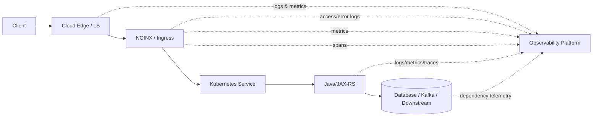
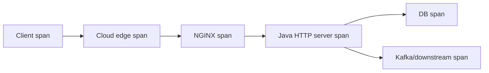

# Part 015 — Access Logs, Error Logs, Metrics, and Trace Correlation

> **Depth level:** Production/Architecture-level  
> **Prerequisite:** Part 002, 005, 008–009, dan 012–014; dasar logs, metrics, traces, SLO, Prometheus, OpenTelemetry, Kubernetes, dan Java observability.  
> **Scope:** NGINX access/error logs, structured schema, request/correlation ID, W3C Trace Context, upstream timing, status attribution, `stub_status`, NGINX Plus metrics, Prometheus exporter/controller metrics, OpenTelemetry tracing, Java/JAX-RS correlation, dashboard, alerts, privacy, cost, incident reconstruction, dan debugging.  
> **Bukan scope utama:** tuning kapasitas worker/connection—Part 016; controller routing internals—Part 018–020; full incident-command process—Part 032; vendor-specific SIEM/APM implementation yang belum diverifikasi internal.

---

## Daftar isi

1. [Tujuan pembelajaran](#tujuan-pembelajaran)
2. [Executive mental model](#executive-mental-model)
3. [Observability is an evidence system](#observability-is-an-evidence-system)
4. [Telemetry planes](#telemetry-planes)
5. [Core observability invariants](#core-observability-invariants)
6. [Request identity and correlation](#request-identity-and-correlation)
7. [Request ID versus trace ID](#request-id-versus-trace-id)
8. [Trusting incoming correlation context](#trusting-incoming-correlation-context)
9. [Access-log lifecycle](#access-log-lifecycle)
10. [Minimum production access-log schema](#minimum-production-access-log-schema)
11. [JSON structured logging](#json-structured-logging)
12. [Safe JSON typing](#safe-json-typing)
13. [Client and forwarding fields](#client-and-forwarding-fields)
14. [Request and route fields](#request-and-route-fields)
15. [Status and provenance fields](#status-and-provenance-fields)
16. [Latency fields](#latency-fields)
17. [Upstream timing decomposition](#upstream-timing-decomposition)
18. [Multiple upstream attempts](#multiple-upstream-attempts)
19. [Connection and protocol fields](#connection-and-protocol-fields)
20. [TLS fields](#tls-fields)
21. [Body and byte fields](#body-and-byte-fields)
22. [Rate-limit and cache fields](#rate-limit-and-cache-fields)
23. [Identity and tenant fields](#identity-and-tenant-fields)
24. [Sensitive data and redaction](#sensitive-data-and-redaction)
25. [Conditional logging](#conditional-logging)
26. [Sampling strategy](#sampling-strategy)
27. [Log destination and transport](#log-destination-and-transport)
28. [Containers and stdout/stderr](#containers-and-stdoutstderr)
29. [Log buffering and loss trade-offs](#log-buffering-and-loss-trade-offs)
30. [Error-log mental model](#error-log-mental-model)
31. [Error-log severity levels](#error-log-severity-levels)
32. [Debug logging](#debug-logging)
33. [Controller logs versus NGINX data-plane logs](#controller-logs-versus-nginx-data-plane-logs)
34. [Configuration and reload observability](#configuration-and-reload-observability)
35. [Metrics mental model](#metrics-mental-model)
36. [RED and USE methods](#red-and-use-methods)
37. [`stub_status` capabilities and limits](#stub_status-capabilities-and-limits)
38. [Prometheus exporter](#prometheus-exporter)
39. [NGINX Plus API metrics](#nginx-plus-api-metrics)
40. [Ingress-controller metrics](#ingress-controller-metrics)
41. [Prometheus label design](#prometheus-label-design)
42. [Histogram and percentile design](#histogram-and-percentile-design)
43. [Core traffic metrics](#core-traffic-metrics)
44. [Upstream metrics](#upstream-metrics)
45. [Resource and saturation metrics](#resource-and-saturation-metrics)
46. [Kubernetes and cloud correlation](#kubernetes-and-cloud-correlation)
47. [SLO and error-budget instrumentation](#slo-and-error-budget-instrumentation)
48. [Alert design](#alert-design)
49. [Tracing mental model](#tracing-mental-model)
50. [W3C Trace Context](#w3c-trace-context)
51. [Official NGINX OpenTelemetry module](#official-nginx-opentelemetry-module)
52. [Trace-context modes](#trace-context-modes)
53. [Span naming and attributes](#span-naming-and-attributes)
54. [Sampling and collector failure](#sampling-and-collector-failure)
55. [Java/JAX-RS trace propagation](#javajax-rs-trace-propagation)
56. [MDC and application log correlation](#mdc-and-application-log-correlation)
57. [Dashboard architecture](#dashboard-architecture)
58. [Operational dashboard set](#operational-dashboard-set)
59. [Failure-mode catalogue](#failure-mode-catalogue)
60. [Debugging playbooks](#debugging-playbooks)
61. [Reference configuration](#reference-configuration)
62. [Telemetry data contract](#telemetry-data-contract)
63. [Validation and test strategy](#validation-and-test-strategy)
64. [Anti-patterns](#anti-patterns)
65. [PR review checklist](#pr-review-checklist)
66. [Internal verification checklist](#internal-verification-checklist)
67. [Hands-on exercises](#hands-on-exercises)
68. [Ringkasan invariants](#ringkasan-invariants)
69. [Referensi resmi](#referensi-resmi)

---

## Tujuan pembelajaran

Setelah menyelesaikan part ini, Anda harus mampu:

1. mendesain access-log schema yang dapat merekonstruksi satu request lintas client, load balancer, NGINX, Kubernetes, dan Java/JAX-RS;
2. membedakan request ID, correlation ID, trace ID, span ID, connection ID, dan upstream attempt;
3. membaca `$request_time`, `$upstream_connect_time`, `$upstream_header_time`, dan `$upstream_response_time` tanpa membuat kesimpulan latency yang salah;
4. menentukan apakah status dibuat NGINX, diteruskan dari upstream, atau berasal dari attempt sebelumnya;
5. menghubungkan 499, 502, 503, 504, retry, cache, rate limit, dan upstream address dengan bukti yang benar;
6. menggunakan `stub_status`, exporter, NGINX Plus API, atau ingress-controller metrics sesuai capability aktual;
7. mendesain Prometheus labels dan histogram tanpa high-cardinality explosion;
8. menerapkan W3C trace propagation dan official NGINX OpenTelemetry module secara sadar terhadap trust, sampling, dan overhead;
9. mengkorelasikan NGINX telemetry dengan Kubernetes events, pod metrics, JVM, executor, DB pool, dan application traces;
10. mendesain dashboard, SLO, burn-rate alert, dan runbook yang actionable;
11. mencegah credential, token, PII, tenant-sensitive values, serta unbounded query/path values masuk logs/metrics/traces;
12. mendiagnosis telemetry gap, duplicated IDs, missing spans, misleading averages, dropped logs, dan monitoring blind spot;
13. mereview perubahan observability sebagai perubahan production contract, bukan sekadar tambahan field;
14. menyusun **Internal verification checklist** untuk platform CSG tanpa mengarang arsitektur internal.

---

## Executive mental model

Observability bukan sekadar “memiliki log”.

Observability adalah sistem bukti yang harus menjawab:

```text
What happened?
Where did it happen?
When did it happen?
To which request, connection, tenant, route, and upstream?
How often?
How severe?
What changed?
What evidence disproves competing hypotheses?
```



### Principal rule

> A telemetry signal is not automatically the truth. It is an observation produced at a specific layer, with a specific clock, scope, sampling policy, aggregation, and failure mode.

Examples:

- `504` in NGINX log proves NGINX returned 504, not automatically that Java was down.
- high `$request_time` does not automatically mean high Java processing time.
- low CPU does not prove capacity is healthy; the bottleneck may be connection limits, file descriptors, network, DB pool, or throttling.
- absence of an application log does not prove request never reached the pod; logging itself may fail.
- a trace sampled at 1% cannot measure exact request count.
- a Prometheus counter reset may be pod restart, not traffic drop.

---

## Observability is an evidence system

A production evidence system has five properties:

| Property | Meaning |
|---|---|
| identity | observations can be linked to a request/trace/attempt |
| attribution | layer and owner of the observation are explicit |
| timing | timestamps and durations have known semantics |
| completeness | known sampling, loss, retention, and blind spots |
| integrity | clients cannot forge trusted identity or audit context |

### Evidence hierarchy

During incident analysis, prefer:

1. direct per-request evidence;
2. consistent metrics from the responsible layer;
3. correlated infrastructure state;
4. configuration/version evidence;
5. reproduction;
6. only then assumptions.

### Evidence conflict

When signals conflict:

```text
access log says 200
application log says exception
client reports timeout
```

Possible explanation:

- application caught exception and returned 200;
- NGINX completed response after client-side timeout threshold;
- client abandoned connection while NGINX later completed;
- request IDs are not actually the same;
- clocks or log parsing are wrong;
- multiple retries were collapsed by the client.

Never choose one signal because it is familiar. Reconstruct the lifecycle.

---

## Telemetry planes

NGINX-related observability spans several planes:

| Plane | Examples | Typical owner |
|---|---|---|
| client experience | browser/mobile timings, SDK retries | client team |
| DNS/edge | DNS query, CDN/WAF/LB status and latency | cloud/network |
| NGINX data plane | access log, error log, request metrics, spans | platform/SRE |
| controller control plane | Kubernetes watch, config render, reload, admission | platform |
| Kubernetes dataplane | Service, EndpointSlice, kube-proxy/CNI | platform |
| application | JAX-RS logs, JVM metrics, traces | backend team |
| dependency | DB, Kafka, Redis, external API | owning team |
| change plane | GitOps sync, deployment, config hash | delivery/platform |

A dashboard that only shows NGINX request counts cannot explain:

- controller unable to apply a new Ingress;
- Service with zero ready endpoints;
- pod CPU throttling;
- Java executor exhaustion;
- database pool wait;
- load-balancer idle timeout;
- certificate expiry;
- DNS split-horizon issue.

---

## Core observability invariants

1. Every externally relevant request has a stable correlation identity.
2. Client-supplied correlation values are validated, bounded, and never treated as authorization.
3. Access logs include final status, upstream status/address, and timing decomposition.
4. Route labels are bounded templates, not raw unbounded URIs.
5. Metrics use low-cardinality labels.
6. Logs and traces never contain credentials, session cookies, authorization headers, or unrestricted request bodies.
7. NGINX data-plane logs are distinguishable from controller logs.
8. Telemetry endpoints are not publicly exposed.
9. Sampling policy is explicit and preserves errors/rare events where required.
10. Logs, metrics, and traces have retention and ownership.
11. Alert thresholds are tied to SLO/user impact, not arbitrary single-resource values.
12. Every alert links to evidence and a runbook.
13. Clock synchronization and timezone handling are consistent.
14. Config version/deployment identity can be correlated with behavior.
15. Telemetry failure cannot silently become application failure unless explicitly accepted.

---

## Request identity and correlation

A robust request identity chain often includes:

| Identifier | Scope | Typical use |
|---|---|---|
| request ID | one logical edge request | log search/support |
| trace ID | distributed trace | cross-service timing |
| span ID | one operation/hop | parent-child causality |
| connection ID | one downstream connection | keepalive/multiplexing analysis |
| connection request count | request number on connection | reuse analysis |
| upstream attempt | each selected backend attempt | retry/failover analysis |
| client operation/idempotency key | one business operation | duplicate-side-effect analysis |

### Do not collapse these concepts

A client may retry one operation three times:

```text
business operation: OP-42
request IDs: R1, R2, R3
trace IDs: T1, T2, T3 — or one trace with linked attempts
upstream attempts under R2: pod-A then pod-B
```

Without this distinction, “duplicate order” investigations become guesswork.

---

## Request ID versus trace ID

### Request ID

Useful when:

- systems do not have full tracing;
- customer support needs a short search key;
- request ID is returned to client;
- each edge attempt needs a unique identifier.

### Trace ID

Useful when:

- one request crosses multiple services;
- causal parent-child relationships matter;
- latency attribution requires spans;
- async links are modeled.

### Recommended relationship

- preserve a valid incoming trace context according to policy;
- generate a request ID at the trusted edge if absent/untrusted;
- keep request ID as a log-friendly identifier;
- log both request ID and trace ID;
- do not derive authorization from either.

---

## Trusting incoming correlation context

Incoming values can be:

- malformed;
- extremely long;
- high-cardinality attack input;
- crafted to collide with another customer's support case;
- used for log injection if not escaped;
- intentionally linked to another trace.

Policy options:

| Policy | Use case | Risk |
|---|---|---|
| always replace | public untrusted edge | breaks legitimate end-to-end correlation |
| validate then preserve | controlled clients/partners | validation complexity |
| preserve plus generate internal ID | mixed trust | two identifiers to manage |
| trust only from known upstream proxy | chained internal edge | topology misconfiguration risk |

### Validation requirements

- maximum length;
- allowed character set;
- correct trace format;
- no control characters;
- source trust;
- fallback generation;
- no use as metric label unless bounded;
- no use as filesystem path or dynamic upstream key.

---

## Access-log lifecycle

The access log is written at the end of request processing.

Consequences:

- fields such as final status and total request time are available;
- a process crash can prevent a completed-looking request from being logged;
- long-lived streams do not appear until they end unless additional metrics/traces exist;
- access-log location can correspond to the location where processing ends after internal redirects;
- subrequests are not necessarily logged unless configured;
- a client disconnect may still produce a log with 499 or another final status depending on timing.

### Important distinction

```text
request accepted
≠ request logged immediately
```

For an SSE connection lasting two hours, access-log visibility may be delayed two hours.

---

## Minimum production access-log schema

A practical minimum schema:

### Time and identity

- timestamp in ISO 8601;
- request ID;
- trace ID/span ID if available;
- NGINX instance/pod;
- environment/cluster;
- config or release identifier.

### Client and request

- trusted client IP;
- immediate peer IP;
- method;
- normalized route or location identifier;
- URI path only where privacy permits;
- protocol;
- host;
- request length;
- user agent classification where needed.

### Result

- final status;
- bytes sent/body bytes sent;
- request time;
- upstream address;
- upstream status;
- upstream connect/header/response times;
- cache status;
- limiter status;
- TLS protocol/cipher where relevant.

### Deliberately excluded by default

- `Authorization`;
- cookies;
- full query string;
- request/response body;
- raw JWT;
- password/reset token;
- signed URL;
- API key;
- unrestricted user/tenant names;
- database identifiers that create cardinality/privacy risk.

---

## JSON structured logging

Structured logs reduce parser ambiguity and support stable field contracts.

Example:

```nginx
http {
    map $http_x_request_id $trusted_request_id {
        default   $request_id;
        ~^[A-Za-z0-9._:-]{1,64}$ $http_x_request_id;
    }

    log_format edge_json escape=json
      '{'
        '"ts":"$time_iso8601",'
        '"request_id":"$trusted_request_id",'
        '"connection":"$connection",'
        '"connection_requests":"$connection_requests",'
        '"remote_addr":"$remote_addr",'
        '"realip_remote_addr":"$realip_remote_addr",'
        '"host":"$host",'
        '"method":"$request_method",'
        '"uri":"$uri",'
        '"protocol":"$server_protocol",'
        '"status":"$status",'
        '"request_length":"$request_length",'
        '"bytes_sent":"$bytes_sent",'
        '"body_bytes_sent":"$body_bytes_sent",'
        '"request_time":"$request_time",'
        '"upstream_addr":"$upstream_addr",'
        '"upstream_status":"$upstream_status",'
        '"upstream_connect_time":"$upstream_connect_time",'
        '"upstream_header_time":"$upstream_header_time",'
        '"upstream_response_time":"$upstream_response_time",'
        '"cache_status":"$upstream_cache_status",'
        '"limit_req_status":"$limit_req_status",'
        '"tls_protocol":"$ssl_protocol",'
        '"tls_cipher":"$ssl_cipher",'
        '"user_agent":"$http_user_agent"'
      '}';

    access_log /var/log/nginx/access.json edge_json;
}
```

This is a schema example, not a drop-in internal standard.

---

## Safe JSON typing

`escape=json` escapes variable content for JSON strings. It does not guarantee arbitrary variables are valid JSON numbers.

Risky:

```nginx
'"upstream_response_time": $upstream_response_time'
```

When no upstream exists, the value may be `-`, yielding invalid JSON.

Safer default:

```nginx
'"upstream_response_time":"$upstream_response_time"'
```

Convert strings to numeric/null in the ingestion pipeline using explicit rules.

### Schema rule

> Prefer valid, stable JSON over premature numeric typing inside `log_format`.

Also verify:

- parser behavior for empty string versus `-`;
- arrays/multiple upstream attempts;
- escaping of user agent and URI;
- schema versioning;
- backward compatibility for dashboards.

---

## Client and forwarding fields

Useful fields:

| Field | Meaning |
|---|---|
| `$remote_addr` | current client address after real-IP processing |
| `$realip_remote_addr` | original peer address before replacement |
| `$proxy_protocol_addr` | source from PROXY protocol when enabled |
| `$http_x_forwarded_for` | raw incoming header; untrusted unless chain is controlled |
| `$server_addr` | local address accepting request |
| `$server_port` | local port |
| `$host` | normalized host selection variable |
| `$http_host` | raw Host header when present |

### Logging rule

Log enough to reconstruct the chain, but distinguish:

- immediate TCP peer;
- trusted effective client IP;
- raw forwarded chain;
- cloud LB metadata.

Do not label raw `X-Forwarded-For` as “client IP” without a trust policy.

---

## Request and route fields

Potential fields:

- `$request_method`;
- `$uri`;
- `$request_uri`;
- `$args`;
- `$server_name`;
- route/location identifier;
- ingress namespace/name;
- service/backend;
- API version;
- protocol.

### `$uri` versus `$request_uri`

| Variable | Characteristic |
|---|---|
| `$request_uri` | original request target including arguments |
| `$uri` | current normalized URI, can change during processing |

Privacy concern:

```text
GET /reset-password?token=secret
```

Logging `$request_uri` leaks the token.

Preferred strategies:

- log `$uri` without query;
- allowlist selected non-sensitive query keys;
- emit a bounded route template from a trusted map/controller;
- hash identifiers only when operationally justified and privacy-approved.

### Route cardinality

Bad metric label:

```text
route="/orders/8f3a.../items/92"
```

Good bounded label:

```text
route="/orders/{orderId}/items/{itemId}"
```

Access logs may retain normalized paths under policy; Prometheus labels must not.

---

## Status and provenance fields

Final client status:

```nginx
$status
```

Upstream status:

```nginx
$upstream_status
```

Interpretation examples:

| `$status` | `$upstream_status` | Likely interpretation |
|---:|---|---|
| 200 | 200 | upstream response returned |
| 404 | empty | NGINX generated route/not-found response |
| 429 | empty | edge limiter/policy likely rejected |
| 502 | empty or failed attempt | connect/protocol/upstream failure |
| 504 | 504 or timeout attempt | upstream timeout path |
| 200 | `502, 200` | first attempt failed, retry succeeded |
| 499 | maybe empty/200-in-progress | client closed before completion |

Do not infer provenance from status alone. Include:

- upstream address;
- upstream status;
- retry attempt sequence;
- cache status;
- limiter status;
- auth decision fields where safe;
- error-log correlation.

---

## Latency fields

Core fields:

| Variable | Approximate question answered |
|---|---|
| `$request_time` | how long NGINX handled the request end-to-end |
| `$upstream_connect_time` | how long connection establishment to upstream took |
| `$upstream_header_time` | time until upstream response headers arrived |
| `$upstream_response_time` | total time interacting with upstream attempt |
| `$msec` | current epoch time with milliseconds |
| `$pipe` | whether request was pipelined |

### Do not equate

```text
$request_time = application execution time
```

`$request_time` may include:

- slow client upload;
- request buffering;
- auth subrequest;
- rate-limit delay;
- upstream queue/connect;
- upstream processing;
- response buffering;
- slow client download;
- retries;
- internal redirects.

---

## Upstream timing decomposition

A useful approximation:

```text
request_time
≈ client request intake
+ edge processing
+ auth/subrequest work
+ upstream connect
+ upstream processing until headers
+ upstream body transfer
+ client response transfer
+ retry/delay overhead
```

For one upstream attempt:

```text
connect time <= header time <= response time
```

But exact interpretation depends on module and lifecycle.

### Diagnostic patterns

| Observation | Candidate hypothesis |
|---|---|
| high connect time | network, DNS, SYN queue, pod not accepting, TLS upstream handshake |
| low connect, high header time | application queue/processing, DB/downstream wait |
| header time low, response time high | large/streamed response, slow upstream body |
| upstream response low, request time high | slow client, buffering, edge delay, multiple stages |
| request time high, no upstream | body upload, auth/rate limit/rewrite/static handling |

Treat these as hypothesis generators, not final proof.

---

## Multiple upstream attempts

Retry/failover variables may contain multiple values.

Conceptual example:

```text
upstream_addr         = 10.0.1.10:8080, 10.0.2.12:8080
upstream_status       = 502, 200
upstream_connect_time = 0.002, 0.001
upstream_response_time= 0.010, 0.120
```

### Parsing requirement

The ingestion pipeline must preserve attempt order.

Do not:

- split one field but not others;
- sum values without exposing attempt count;
- store only the final upstream;
- treat comma-separated values as one numeric value.

### Recommended derived fields

- `upstream_attempt_count`;
- `upstream_retry_occurred`;
- `final_upstream`;
- `first_failure_status`;
- `total_upstream_attempt_time`.

The derivation should be versioned and tested.

---

## Connection and protocol fields

Useful variables:

- `$connection`;
- `$connection_requests`;
- `$server_protocol`;
- `$http2` where available;
- `$http3` where available;
- `$request_length`;
- `$bytes_sent`;
- `$body_bytes_sent`;
- `$tcpinfo_rtt`, `$tcpinfo_rttvar`, `$tcpinfo_snd_cwnd`, `$tcpinfo_rcv_space` where supported and justified.

### Connection ID scope

`$connection` is useful inside one NGINX instance/runtime. It is not a global immutable identifier.

Always pair it with:

- pod/instance;
- boot/restart boundary where possible;
- timestamp.

### HTTP/2 and HTTP/3 caveat

One downstream connection may carry many concurrent requests. Connection count alone no longer approximates request concurrency.

---

## TLS fields

Potential fields:

- `$ssl_protocol`;
- `$ssl_cipher`;
- `$ssl_session_reused`;
- `$ssl_server_name`;
- client-certificate verification result where mTLS is used;
- certificate serial/fingerprint only when justified.

Use cases:

- identify legacy protocol clients;
- detect session-reuse regression;
- analyze handshake failures with edge/LB logs;
- monitor SNI mismatch;
- prove mTLS verification outcome.

Privacy/security:

- avoid logging full client certificate DN without policy;
- do not log certificate PEM;
- avoid high-cardinality certificate identifiers as metric labels;
- protect audit fields from broad access.

---

## Body and byte fields

Distinguish:

| Field | Meaning |
|---|---|
| `$request_length` | request line + headers + body received by NGINX |
| `$bytes_sent` | total bytes sent to client including response headers |
| `$body_bytes_sent` | response body bytes sent |

Use cases:

- 413 investigation;
- upload/download distribution;
- egress cost;
- compression effectiveness;
- slow-client diagnosis;
- unexpectedly large error responses.

Limitations:

- client abort may yield partial bytes;
- upstream body size differs from downstream compressed size;
- buffering/temp-file behavior requires disk metrics;
- chunked framing overhead is not business payload size.

---

## Rate-limit and cache fields

Useful variables:

- `$limit_req_status`;
- `$limit_conn_status`;
- `$upstream_cache_status`.

Possible cache values depend on behavior, commonly including:

- `MISS`;
- `BYPASS`;
- `EXPIRED`;
- `STALE`;
- `UPDATING`;
- `REVALIDATED`;
- `HIT`.

### Why log them

A 200 response with 5 ms latency may be:

- application success;
- cache hit;
- stale response during outage;
- auth decision cache hit.

These are different operational truths.

### Cardinality rule

Limiter zone names and cache zones are bounded config values and are generally safer than raw user keys. Never log raw rate-limit keys if they expose user/tenant data unless explicitly approved.

---

## Identity and tenant fields

Identity fields are valuable but risky.

Potential safe forms:

- canonical internal subject ID;
- tenant ID;
- client/application ID;
- auth method;
- token issuer alias;
- coarse role/scope class.

Requirements:

1. values come from a trusted auth path;
2. client versions are removed before replacement;
3. values are bounded;
4. access is controlled;
5. retention is justified;
6. metrics do not use unbounded subject IDs as labels;
7. no token or full claim set is logged.

### Separation

Use identity in logs for forensic search.

Use bounded aggregates in metrics:

```text
tenant_tier="enterprise"
auth_method="mtls"
route="/quotes/{id}"
```

Do not use:

```text
user_id="every-user"
order_id="every-order"
```

as Prometheus labels.

---

## Sensitive data and redaction

Common leakage sources:

- query strings;
- `Authorization`;
- cookies;
- signed URLs;
- password-reset links;
- OAuth authorization code;
- SAML response;
- JWT claims;
- client-certificate subject;
- request/response body;
- upstream error body;
- referrer containing tokens;
- user agent with embedded identifiers;
- raw exception stack trace.

### Layered controls

```text
prevent collection
→ sanitize at source
→ parse/redact in pipeline
→ restrict access
→ encrypt
→ retain minimally
→ audit queries/exports
```

Redaction after ingestion is weaker than not collecting.

### Redaction test set

Include:

- quotes/backslashes/control characters;
- very long values;
- Unicode;
- CR/LF injection;
- JWT-like strings;
- API keys;
- emails/phone numbers;
- signed query parameters;
- nested URL-encoded secrets.

---

## Conditional logging

NGINX supports conditional access logging with `if=`.

Example:

```nginx
map $status $loggable {
    ~^[23]  0;
    default 1;
}

access_log /var/log/nginx/error-access.log edge_json if=$loggable;
```

This logs only non-2xx/3xx according to the example.

### Production warning

Do not make error-only logging the sole dataset.

You lose:

- denominator;
- success latency;
- traffic shape;
- cache-hit baseline;
- route popularity;
- comparative evidence before incident.

Better pattern:

- full or sampled general access log;
- unsampled error/security stream;
- metrics as authoritative aggregate counters;
- traces with controlled sampling.

---

## Sampling strategy

Sampling types:

| Type | Decision point | Strength | Risk |
|---|---|---|---|
| head sampling | request start | cheap/predictable | misses rare late failures |
| tail sampling | collector after result | preserves errors/slow traces | collector complexity/cost |
| deterministic hash | stable by trace/user key | repeatable | biased if key choice poor |
| rate sampling | random percentage | simple | low-volume route blind spots |
| adaptive | based on traffic/health | cost efficient | policy complexity |

### Recommended principles

- never sample metrics counters;
- preserve security/audit events according to policy;
- retain all or most 5xx/429/499 during incident windows;
- retain rare routes/protocols;
- use higher sampling for changes/canaries;
- record sampling decision;
- do not use request IDs as high-cardinality metric labels.

---

## Log destination and transport

Options:

- files;
- syslog;
- stdout/stderr;
- sidecar/agent;
- direct network endpoint.

Trade-offs:

| Destination | Benefit | Failure risk |
|---|---|---|
| local file | simple, buffered | disk full, rotation, node loss |
| stdout/stderr | container-native | runtime pipeline backpressure/loss |
| syslog UDP | low overhead | silent loss/reordering |
| syslog TCP | stronger delivery | blocking/backpressure coupling |
| sidecar/agent tail | decoupled shipping | duplicate/lost offsets, resource cost |
| direct remote | simple topology | observability outage affects process |

### Principle

> Telemetry transport must not unexpectedly become a synchronous dependency on request availability.

---

## Containers and stdout/stderr

In containers, common practice:

```nginx
access_log /dev/stdout edge_json;
error_log  /dev/stderr warn;
```

But verify image/runtime behavior:

- symlink or special device exists;
- process user can write;
- container runtime captures lines correctly;
- multiline error logs are parsed;
- log rotation is handled outside container;
- collector handles pod restart;
- per-line size limits do not truncate JSON;
- backpressure/drop policy is known.

### Kubernetes fields

Enrich in collector rather than NGINX when possible:

- cluster;
- namespace;
- pod;
- node;
- container;
- deployment;
- image digest;
- controller version.

This avoids hardcoding Downward API values into every log line, but the enrichment pipeline must be reliable.

---

## Log buffering and loss trade-offs

`access_log` supports buffering options for file-based logs.

Potential benefits:

- fewer write syscalls;
- better throughput.

Potential risks:

- recent logs lost on crash;
- delayed incident visibility;
- rotation coordination issues;
- unsupported/unsafe filesystem behavior;
- confusion when tailing.

### Decision inputs

- request volume;
- storage latency;
- durability requirement;
- acceptable loss window;
- container logging model;
- flush interval;
- operational tooling.

Never enable large buffers because a benchmark says so without testing crash behavior.

---

## Error-log mental model

The error log records operational events, not one uniform “error count”.

Examples:

- configuration failures;
- socket/connect errors;
- TLS handshake errors;
- upstream reset;
- timeout;
- file permission errors;
- resolver failures;
- request parsing problems;
- worker/process lifecycle;
- debug events.

### Correlation challenge

Error messages may contain:

- connection identifier;
- client;
- server;
- request;
- upstream;
- host.

Ensure your parser retains these fields and can correlate them to access logs.

---

## Error-log severity levels

Common severity order:

```text
debug
info
notice
warn
error
crit
alert
emerg
```

Configuring a level records that level and more severe events.

### Operational interpretation

| Level | Typical use |
|---|---|
| `emerg`/`alert`/`crit` | process/system-level severe condition |
| `error` | request or subsystem failure |
| `warn` | degraded/unusual but handled |
| `notice`/`info` | lifecycle and informational events |
| `debug` | detailed diagnostic flow |

Do not page on every line containing `[error]` without aggregation and user-impact correlation.

---

## Debug logging

Debug logging can:

- produce very high volume;
- expose headers and protocol details;
- increase CPU/I/O;
- trigger log-pipeline cost;
- obscure important signals;
- affect timing.

Safe workflow:

1. define exact hypothesis;
2. scope by instance/client using supported mechanisms where possible;
3. enable on a small replica or short window;
4. confirm build supports debug;
5. protect output;
6. reproduce;
7. disable and verify;
8. delete/retain under security policy.

For F5 NGINX Ingress Controller, controller debug and NGINX debug are separate concerns. The debug binary/flag requirements are product-specific.

---

## Controller logs versus NGINX data-plane logs

A Kubernetes controller typically has at least two log classes:

### Controller process logs

Explain:

- Kubernetes API watches;
- resource validation;
- config generation;
- rejected Ingress/VirtualServer;
- reload attempts;
- leader election;
- reconciliation errors.

### NGINX data-plane logs

Explain:

- client request;
- upstream routing;
- status;
- timing;
- TLS/proxy errors.

A 404 may happen because:

- route was never accepted by controller;
- route was accepted but generated differently;
- request host/path did not match;
- default backend handled it.

You need both planes.

---

## Configuration and reload observability

Track:

- config generation success/failure;
- validation result;
- reload count;
- last successful reload time;
- config hash/version;
- controller reconciliation duration;
- rejected resource count;
- last applied Git commit/image digest;
- worker restart;
- reload-induced resource spikes.

### Change correlation

Every dashboard should support overlaying:

- deployment;
- GitOps sync;
- ConfigMap/Ingress change;
- certificate rotation;
- autoscaling;
- node drain;
- cloud LB change.

Without change markers, incident timelines waste time.

---

## Metrics mental model

Metrics answer aggregate questions efficiently:

```text
How many?
How fast?
How slow?
How saturated?
How frequently failing?
```

Metrics are not ideal for:

- exact per-request reconstruction;
- arbitrary high-cardinality search;
- full exception context;
- payload-level forensic details.

### Signal ownership

Use:

- logs for detail;
- metrics for aggregate state/SLO;
- traces for distributed causality;
- profiles for code-level resource use;
- events/config history for change context.

---

## RED and USE methods

### RED for request-driven services

- **Rate** — requests per second;
- **Errors** — failures/rejections by provenance;
- **Duration** — latency distribution.

### USE for resources

- **Utilization** — percentage/time resource is busy;
- **Saturation** — queued/waiting/throttled work;
- **Errors** — resource failures.

Apply USE to:

- CPU;
- memory;
- file descriptors;
- sockets/connections;
- network;
- disk/temp storage;
- worker accept capacity;
- collector/exporter queues.

---

## `stub_status` capabilities and limits

NGINX Open Source `stub_status` exposes basic counters:

```text
Active connections
accepts
handled
requests
Reading
Writing
Waiting
```

Interpretation:

- `Active` includes waiting keepalive connections;
- `accepts` counts accepted client connections;
- `handled` may lag `accepts` when resource limits prevent handling;
- `requests` counts client requests;
- `Reading`, `Writing`, `Waiting` describe current connection states.

### What it does not directly provide

- per-route request rate;
- status-code distribution;
- upstream latency;
- upstream peer health;
- retries;
- cache metrics;
- TLS details;
- per-tenant behavior;
- request histograms.

Do not build a full NGINX SLO dashboard from `stub_status` alone.

### Protect status endpoint

```nginx
server {
    listen 127.0.0.1:8080;

    location = /stub_status {
        stub_status;
        allow 127.0.0.1;
        deny all;
    }
}
```

Exact network policy depends on topology.

---

## Prometheus exporter

The official NGINX Prometheus Exporter can scrape:

- NGINX Open Source `stub_status`;
- NGINX Plus API.

Then it exposes Prometheus-format metrics.

### Architectural caution

The exporter:

- does not create per-route data absent from the source;
- adds another process/container to monitor;
- needs secure access to status/API;
- can become stale/unhealthy;
- may reset series when NGINX/exporter restarts;
- requires version compatibility and image provenance review.

Monitor the exporter itself:

- scrape success;
- scrape duration;
- exporter process restarts;
- target availability;
- series count.

---

## NGINX Plus API metrics

NGINX Plus exposes richer runtime data depending on version/configuration, such as:

- upstream peer state;
- connections;
- request counts;
- zones;
- cache;
- resolvers;
- limits;
- worker information.

Never assume a Plus metric exists in Open Source.

### Verification questions

- exact NGINX Plus release;
- API endpoint/version;
- shared zones configured;
- access control;
- exporter mapping;
- metric retention after reload/restart;
- labels and cardinality;
- licensing/support boundaries.

---

## Ingress-controller metrics

Controller products differ.

Possible categories:

- controller reconciliation;
- rejected resources;
- reloads;
- NGINX request metrics;
- upstream metrics;
- work queue;
- leader election;
- admission webhook;
- config generation errors.

For F5 NGINX Ingress Controller, metrics exposure is enabled through its supported Helm/CLI configuration and commonly served on a configurable metrics port.

### Do not mix documentation

Verify whether the cluster uses:

- F5 NGINX Ingress Controller;
- NGINX Ingress Controller LTS;
- retired community `ingress-nginx`;
- another controller.

Metric names, labels, annotations, and dashboards are not interchangeable.

---

## Prometheus label design

Prometheus performance depends on bounded label cardinality.

Safe-ish labels:

- cluster;
- namespace;
- ingress/controller class;
- service;
- normalized route;
- method class;
- status class;
- protocol;
- environment;
- availability zone.

Dangerous labels:

- raw URI;
- query string;
- request ID;
- trace ID;
- user ID;
- order/quote ID;
- client IP;
- arbitrary Host;
- exception message;
- full upstream address when pods churn rapidly, unless carefully bounded.

### Cardinality estimate

```text
series
≈ metric_names
× label combinations
× replicas/targets
```

A single label with one million users can make the monitoring system the outage.

---

## Histogram and percentile design

Latency percentiles require distributions, not averages.

### Histogram questions

- What SLO thresholds matter?
- Are buckets suitable for 20 ms APIs and 5-minute exports?
- Are routes mixed with radically different latency classes?
- Is aggregation across replicas mathematically valid?
- Are retries included?
- Is duration measured at client, edge, or application?

### Bucket example by route class

```text
interactive API: 5ms, 10ms, 25ms, 50ms, 100ms, 250ms, 500ms, 1s, 2s
batch/export:     100ms, 500ms, 1s, 2s, 5s, 10s, 30s, 60s
```

Do not copy these values blindly.

### Percentile caveat

```text
average of p99 per pod ≠ global p99
```

Aggregate histogram buckets, then calculate quantile.

---

## Core traffic metrics

Minimum aggregate metrics:

- request rate;
- response status class/rate;
- 4xx by type/provenance;
- 5xx by type/provenance;
- request-duration histogram;
- response size;
- active downstream connections;
- accepted/handled connections;
- current reading/writing/waiting;
- protocol/TLS distribution where needed.

### Status semantics

Separate:

- application 4xx;
- edge policy 4xx;
- client abort 499;
- upstream connect/protocol 502;
- no capacity/endpoint 503;
- upstream timeout 504.

A single `5xx` line hides remediation ownership.

---

## Upstream metrics

Useful dimensions:

- selected upstream/service;
- peer availability;
- active connections;
- request count;
- failure count;
- connect latency;
- header latency;
- response latency;
- retries;
- queueing where supported;
- keepalive reuse;
- bytes;
- health-check status where available.

### Java correlation

Compare upstream latency with:

- HTTP server active requests;
- executor queue;
- JVM CPU and GC;
- thread states;
- DB pool active/wait;
- downstream client pool;
- Kafka producer/consumer lag;
- pod CPU throttling.

NGINX sees symptoms at the boundary. Java telemetry explains internal causes.

---

## Resource and saturation metrics

Monitor:

### Process/container

- CPU usage;
- CPU throttling;
- RSS/working set;
- OOM/restarts;
- open file descriptors;
- network bytes/errors/drops;
- ephemeral-storage usage;
- temp-file I/O;
- process count;
- worker exits.

### Node/kernel

- conntrack utilization;
- socket states;
- listen drops;
- SYN backlog;
- packet drops;
- disk latency;
- filesystem fullness/inodes;
- node pressure;
- time synchronization.

### NGINX

- active connections versus estimated capacity;
- accepted versus handled divergence;
- request rate per worker/replica;
- reload frequency;
- error-log rate;
- upstream failure rate.

---

## Kubernetes and cloud correlation

### Kubernetes evidence

- pod readiness;
- EndpointSlice membership;
- deployment rollout;
- restart reason;
- node drain;
- CPU throttling;
- HPA desired/current replicas;
- PodDisruptionBudget;
- ConfigMap/Secret version;
- Events;
- CNI/service routing metrics.

### Cloud evidence

AWS examples:

- ALB/NLB target health;
- target response time;
- LB-generated status;
- TLS handshake errors;
- rejected connections;
- security-group/NACL changes.

Azure examples:

- Application Gateway/backend health;
- Load Balancer health probes;
- Front Door/APIM status;
- NSG flow/log evidence;
- private endpoint health.

These examples are generic. Exact components are **Internal verification checklist** items.

---

## SLO and error-budget instrumentation

Define service-level indicators at the correct boundary.

### Availability SLI example

```text
good requests
/
eligible requests
```

But define:

- which routes;
- which statuses count;
- whether 4xx count;
- whether 499 counts;
- planned maintenance;
- cache/stale responses;
- health checks/bots;
- retries.

### Latency SLI example

```text
percentage of eligible requests completed under threshold
```

Prefer threshold compliance over average.

### Multi-window burn rate

Alert when error budget burns too fast over:

- short window for rapid incidents;
- long window for sustained degradation.

Exact windows and multipliers must match organizational SLO policy.

---

## Alert design

An actionable alert contains:

- user impact;
- affected scope;
- evidence;
- duration;
- likely ownership;
- dashboard link;
- runbook;
- change context;
- suppression/dedup policy.

### Good alert examples

```text
External API availability SLO burn rate high:
cluster=prod-a, route_class=interactive,
5xx primarily NGINX 504,
upstream_header_time p99 elevated,
started 12 minutes after backend rollout.
```

### Weak alert examples

```text
NGINX CPU > 70%
```

CPU may be expected and healthy. Alert on saturation/user impact, then include CPU as evidence.

---

## Tracing mental model

A distributed trace models causal operations.



A trace should reveal:

- parent-child relationships;
- duration per hop;
- retries;
- status/error;
- route;
- peer/service identity;
- sampling decision.

Tracing does not replace metrics:

- sampled traces cannot provide exact availability;
- trace backend may drop spans;
- instrumentation may be absent on one hop;
- asynchronous messaging needs links/context handling.

---

## W3C Trace Context

The W3C standard defines headers such as:

```text
traceparent
tracestate
```

A conceptual `traceparent`:

```text
version-traceid-parentid-flags
```

### Security posture

Trace context is correlation metadata, not identity proof.

Do not use:

- trace ID as authentication;
- `tracestate` as trusted authorization data;
- arbitrary baggage as unvalidated user/tenant truth.

Validate format, control size, and define trust behavior.

---

## Official NGINX OpenTelemetry module

The official `ngx_otel_module` supports:

- OpenTelemetry distributed tracing;
- W3C context propagation;
- OTLP/gRPC export.

Availability depends on:

- NGINX version;
- package/image;
- dynamic-module loading;
- controller product/version;
- build flags and supported configuration.

Conceptual configuration:

```nginx
load_module modules/ngx_otel_module.so;

http {
    otel_exporter {
        endpoint otel-collector.observability.svc.cluster.local:4317;
    }

    otel_service_name nginx-edge;

    server {
        location /api/ {
            otel_trace on;
            otel_trace_context propagate;
            otel_span_name "$request_method $uri";

            proxy_pass http://java_backend;
        }
    }
}
```

Directive details must be verified against the exact deployed version.

---

## Trace-context modes

A tracing integration must answer:

1. Is incoming context extracted?
2. Is it trusted/preserved?
3. Is a new root created when absent/invalid?
4. Is context propagated upstream?
5. Are response headers returned?
6. What happens when tracing is disabled for a route?
7. How are subrequests and retries represented?
8. Is the collector failure non-blocking?

### Boundary policy

Public edge:

- validate incoming context;
- consider creating a new root or preserving according to policy;
- do not accept unbounded baggage.

Internal trusted chain:

- preserve valid W3C context;
- prevent intermediary overwrite bugs;
- propagate consistently to Java.

---

## Span naming and attributes

Good span names are bounded:

```text
GET /quotes/{quoteId}
POST /orders
```

Bad span names:

```text
GET /quotes/8a7b34e1-...
```

Useful bounded attributes:

- HTTP method;
- route template;
- status code;
- server/peer service;
- ingress/controller;
- protocol;
- retry count;
- cache outcome;
- deployment/environment;
- error type.

Avoid:

- request body;
- token;
- raw query;
- user ID at metric-like scale;
- full error message with PII;
- high-cardinality URL.

---

## Sampling and collector failure

### Collector failure policy

Tracing export should normally be out-of-band.

Verify:

- queue size;
- batching;
- retry;
- memory cap;
- drop behavior;
- timeout;
- CPU impact;
- exporter error metrics;
- whether request threads/event loop can block.

### Sampling policy

Use:

- low baseline rate for high-volume success;
- higher/error-aware tail sampling;
- route-specific policy for critical flows;
- temporary elevated sampling during rollout;
- privacy review before collecting richer attributes.

### Failure mode

An overloaded collector can:

- drop spans;
- consume memory;
- increase network traffic;
- create misleading partial traces;
- restart repeatedly.

Monitor it as production infrastructure.

---

## Java/JAX-RS trace propagation

The Java service should:

1. receive valid `traceparent`;
2. start or continue server span;
3. expose trace/request IDs to logs;
4. propagate context to downstream HTTP, DB, Kafka, and async executors;
5. record bounded route/status/error attributes;
6. close scope correctly;
7. avoid context leakage between reused threads.

### JAX-RS request filter concept

```java
@Provider
@Priority(Priorities.AUTHENTICATION)
public final class CorrelationFilter implements ContainerRequestFilter {
    @Override
    public void filter(ContainerRequestContext context) {
        String requestId = context.getHeaderString("X-Request-ID");

        // Validate format and length before using it.
        // Put trusted request ID into the logging context.
        // Trace context should normally be handled by OpenTelemetry
        // instrumentation rather than hand-parsing traceparent here.
    }
}
```

Exact integration depends on Jersey/RESTEasy/container/OpenTelemetry agent/library.

---

## MDC and application log correlation

For every Java request log:

- request ID;
- trace ID;
- span ID;
- normalized route;
- principal/tenant safe identifier when approved;
- pod/service/version;
- outcome;
- duration.

### Async hazard

MDC may not automatically propagate across:

- `CompletableFuture`;
- custom executors;
- reactive pipelines;
- virtual threads depending on logging/context approach;
- Kafka callbacks;
- scheduled tasks.

Use supported context propagation. Always clear context to prevent cross-request leakage.

### Correlation query

A runbook should support:

```text
request_id
→ NGINX access log
→ NGINX error log
→ trace
→ Java request log
→ dependency spans/logs
→ deployment/config version
```

---

## Dashboard architecture

Avoid one giant dashboard.

Use layers:

1. service overview;
2. edge/NGINX;
3. upstream/backend;
4. resources;
5. config/controller;
6. security/TLS;
7. route-specific drill-down.

### Dashboard design principles

- start with user impact;
- show rate, errors, duration together;
- expose provenance;
- include deployment overlays;
- preserve percentiles/distributions;
- separate current state from cumulative counters;
- show replica count;
- link to logs/traces;
- document timezone and aggregation.

---

## Operational dashboard set

### 1. Edge overview

- request rate;
- availability SLI;
- p50/p95/p99;
- status classes;
- 499/502/503/504;
- active connections;
- traffic by protocol;
- top bounded route classes.

### 2. Upstream health

- upstream latency;
- connect failures;
- retries;
- selected peers/services;
- ready endpoints;
- Java active requests;
- DB pool wait;
- pod restarts.

### 3. Resource saturation

- CPU and throttling;
- memory/OOM;
- FD utilization;
- network;
- temp disk;
- node pressure;
- HPA.

### 4. Control plane

- rejected resources;
- config generation;
- reload success/failure;
- reconciliation duration;
- leader election;
- admission webhook;
- last config/deployment.

### 5. TLS/security

- handshake failures;
- protocol/cipher distribution;
- certificate expiry;
- auth 401/403;
- limiter 429;
- WAF outcomes where present.

---

## Failure-mode catalogue

| Failure mode | Symptom | Missing evidence if poorly instrumented |
|---|---|---|
| client abort | 499 spike | client timeout/retry context |
| upstream connect failure | 502 | connect time/address/error log |
| zero endpoints | 503/502 | EndpointSlice/readiness/controller state |
| upstream timeout | 504 | header/response time and backend queue |
| retry masking failure | final 200 | multiple attempt fields |
| slow client | high request time | upstream low, bytes/connection state |
| stale cache serves success | 200 during outage | cache status |
| rate-limit rejection | 429/503 | limiter status/zone |
| invalid route deploy | 404 | controller rejection/config hash |
| log pipeline loss | apparent traffic drop | scrape/counter/client evidence |
| cardinality explosion | monitoring outage | series count/label analysis |
| trace-context break | disconnected spans | header/propagation tests |
| clock skew | impossible timeline | NTP/time-offset telemetry |
| collector overload | partial traces | collector queue/drop metrics |
| debug-log overload | CPU/disk spike | log volume/config change |

---

## Debugging playbooks

## Playbook 1 — 499 spike

1. Check which routes/clients changed.
2. Compare `$request_time` and upstream timings.
3. Check client/LB timeout values.
4. Check Java latency/executor/DB.
5. Check deployment and retry behavior.
6. Determine whether client abandoned before or during upstream response.
7. Verify whether 499 is included/excluded from SLO intentionally.

Candidate interpretations:

- client timeout shorter than server path;
- mobile/network interruption;
- user cancellation;
- LB closed idle connection;
- retry storm;
- response too large/slow.

---

## Playbook 2 — 502 spike

Correlate:

- `$upstream_addr`;
- `$upstream_status`;
- `$upstream_connect_time`;
- error-log message;
- ready endpoints;
- pod restarts;
- TLS upstream errors;
- protocol mismatch;
- connection reset.

Decision hints:

```text
connect() refused
→ process not listening/readiness race

no live upstreams
→ peer state/service discovery/health

upstream prematurely closed
→ Java crash/reset/protocol/body issue

SSL handshake failed
→ SNI/CA/certificate/protocol
```

---

## Playbook 3 — 504 spike

1. Separate connect timeout from read/header timeout.
2. Compare request time and upstream header/response time.
3. Check which backend and attempt.
4. Check Java active requests, queue, GC, DB, downstream.
5. Inspect timeout chain.
6. Check retries amplifying load.
7. Check pod CPU throttling and endpoint rollout.

A 504 is an edge deadline outcome, not a root cause.

---

## Playbook 4 — latency increased but Java looks normal

Check:

- client upload/download;
- auth subrequest;
- rate-limit delay;
- cache lock/miss;
- DNS/connect/TLS;
- retry attempts;
- NGINX CPU throttling;
- temp disk;
- log/trace exporter overhead;
- cloud LB latency;
- route mismatch to a slower backend.

---

## Playbook 5 — no access log for reported request

Possible causes:

- request never reached NGINX;
- wrong ingress/host/region;
- logging disabled conditionally;
- request still open;
- process crashed before write;
- collector dropped/truncated;
- timestamp/timezone mismatch;
- user supplied wrong request ID;
- alternate path bypassed this NGINX.

Use LB/DNS/client evidence before blaming log search.

---

## Playbook 6 — metrics and logs disagree

Check:

- sampling;
- filters;
- scrape target set;
- counter resets;
- time window;
- histogram aggregation;
- status semantics;
- multiple controllers/clusters;
- log ingestion delay;
- duplicate logs;
- dropped series;
- exporter health.

---

## Playbook 7 — trace stops at NGINX

Verify:

- module loaded;
- tracing enabled for route;
- incoming context mode;
- upstream propagation;
- Java instrumentation;
- collector endpoint/TLS;
- sampling decision;
- invalid trace header;
- context overwritten by another proxy;
- async boundary.

---

## Playbook 8 — Prometheus cardinality explosion

1. Identify top series-generating metric/label.
2. Disable or relabel offending dimension.
3. replace raw URI with route template.
4. remove request/user/trace/IP labels.
5. set retention/limits according to platform policy.
6. add CI/cardinality review.
7. verify dashboards/alerts after schema change.

---

## Reference configuration

The following is a conceptual baseline.

```nginx
http {
    map $http_x_request_id $edge_request_id {
        default                 $request_id;
        ~^[A-Za-z0-9._:-]{1,64}$ $http_x_request_id;
    }

    map $status $always_log_error {
        ~^[45]    1;
        default   0;
    }

    log_format edge_json escape=json
      '{'
        '"schema":"nginx-edge-v1",'
        '"ts":"$time_iso8601",'
        '"request_id":"$edge_request_id",'
        '"instance":"$hostname",'
        '"connection":"$connection",'
        '"connection_requests":"$connection_requests",'
        '"peer_ip":"$realip_remote_addr",'
        '"client_ip":"$remote_addr",'
        '"host":"$host",'
        '"method":"$request_method",'
        '"uri":"$uri",'
        '"protocol":"$server_protocol",'
        '"status":"$status",'
        '"request_time":"$request_time",'
        '"request_length":"$request_length",'
        '"bytes_sent":"$bytes_sent",'
        '"upstream_addr":"$upstream_addr",'
        '"upstream_status":"$upstream_status",'
        '"upstream_connect_time":"$upstream_connect_time",'
        '"upstream_header_time":"$upstream_header_time",'
        '"upstream_response_time":"$upstream_response_time",'
        '"cache_status":"$upstream_cache_status",'
        '"limit_req_status":"$limit_req_status",'
        '"tls_protocol":"$ssl_protocol",'
        '"tls_cipher":"$ssl_cipher"'
      '}';

    access_log /var/log/nginx/access.json edge_json;
    error_log  /var/log/nginx/error.log warn;

    server {
        listen 127.0.0.1:8080;

        location = /stub_status {
            stub_status;
            allow 127.0.0.1;
            deny all;
        }
    }

    server {
        listen 443 ssl;
        server_name api.example.internal;

        add_header X-Request-ID $edge_request_id always;

        location / {
            proxy_set_header X-Request-ID $edge_request_id;
            proxy_set_header traceparent $http_traceparent;
            proxy_pass http://java_backend;
        }
    }
}
```

### Important limitations

- trace headers need a real validation/generation policy;
- `$hostname` may not equal desired pod identity;
- access-log fields must align with controller-generated config;
- `stub_status` endpoint access must match topology;
- internal route template may require controller/app enrichment;
- identity data is intentionally excluded;
- no threshold or address above should be copied blindly.

---

## Telemetry data contract

Define a versioned contract.

Example:

| Field | Type in pipeline | Source | Trust | Retention |
|---|---|---|---|---|
| `request_id` | string | edge generated/validated | operational only | 30 days |
| `trace_id` | string | W3C context | correlation only | trace policy |
| `client_ip` | IP | trusted proxy chain | restricted | short |
| `route` | bounded string | controller/app map | trusted config | metrics |
| `status` | integer | NGINX | authoritative final edge status | SLO |
| `upstream_status` | list[int/null] | NGINX | attempt evidence | incident |
| `request_time` | duration | NGINX | edge duration | histogram/log |
| `tenant_id` | string | trusted auth | sensitive | approved only |
| `config_version` | string | deployment | change evidence | long |

### Contract governance

- schema owner;
- versioning;
- consumers;
- deprecation;
- parser tests;
- privacy classification;
- retention;
- access policy;
- incident export policy;
- cost budget.

---

## Validation and test strategy

### Syntax and schema

- run `nginx -t`;
- render actual config;
- send values with quotes, backslashes, CR/LF, Unicode;
- verify every line is valid JSON;
- verify missing upstream values;
- verify multi-attempt values;
- verify parser schema.

### Correlation

- send valid/invalid/missing request ID;
- send valid/invalid trace context;
- verify response request ID;
- verify Java log and trace;
- verify retries preserve/represent attempts;
- verify async executor propagation.

### Failure tests

- connect refusal;
- read timeout;
- client abort;
- 413;
- 429;
- cache hit/stale;
- auth deny;
- zero ready endpoints;
- controller rejected resource.

### Observability-system failure

- stop collector;
- stop exporter;
- fill local disk in test;
- throttle log pipeline;
- restart pods;
- rotate logs;
- increase cardinality in controlled test.

Expected behavior must be documented.

---

## Anti-patterns

### Logging only `$request`

Leaks query strings and hides structured fields.

### Treating `X-Forwarded-For` as trusted client IP

Allows spoofing or wrong attribution.

### Request ID as Prometheus label

Creates unbounded cardinality.

### Average latency dashboard

Hides tail latency and mixed route classes.

### One `5xx` alert

Hides 502/503/504 ownership and application versus edge provenance.

### Access-log sampling without error preservation

Loses rare failures.

### Debug logging permanently enabled

Creates cost, privacy, and performance risk.

### Logging tokens “temporarily”

Temporary data often persists in backups and archives.

### One dashboard for all layers

Produces visual noise without decision flow.

### Tracing without metrics

Cannot calculate exact availability or traffic volume.

### Metrics without change markers

Slows incident attribution.

### Raw URI as trace span name

Creates cardinality explosion.

### Public `/metrics` or `/stub_status`

Leaks operational state and attack surface.

### Assuming no log means no request

Ignores telemetry loss and alternate paths.

### Controller and NGINX logs merged without source label

Confuses control-plane and data-plane failures.

---

## PR review checklist

### Purpose and ownership

- [ ] What operational question does each new field/metric/span answer?
- [ ] Who owns schema, dashboard, alert, and runbook?
- [ ] Is the signal from the correct layer?
- [ ] Is a simpler existing signal sufficient?

### Correlation

- [ ] Who generates request ID?
- [ ] Is incoming ID validated and bounded?
- [ ] Are request ID and trace ID distinguished?
- [ ] Is context propagated through NGINX, Java, async work, and downstream clients?
- [ ] Are retries represented?

### Logs

- [ ] Is JSON always syntactically valid?
- [ ] Are missing/multi-value upstream fields handled?
- [ ] Are client IP fields correctly named by trust semantics?
- [ ] Are query, headers, body, cookies, and tokens excluded/redacted?
- [ ] Is log sampling explicit?
- [ ] Is log transport failure behavior understood?

### Metrics

- [ ] Are labels bounded?
- [ ] Is raw URI/user/request/trace/IP excluded?
- [ ] Are histogram buckets appropriate?
- [ ] Are counter resets and replica aggregation handled?
- [ ] Is exporter/controller capability correct for the deployed product/version?

### Tracing

- [ ] Is official/supported module or controller integration available?
- [ ] Is W3C context trust policy explicit?
- [ ] Are span names bounded?
- [ ] Is sampling policy documented?
- [ ] Can collector failure affect request path?
- [ ] Are sensitive attributes excluded?

### Dashboards and alerts

- [ ] Does dashboard start from user impact?
- [ ] Are deployment/config overlays present?
- [ ] Are 499/502/503/504 separated?
- [ ] Does every page alert have a runbook?
- [ ] Are thresholds tied to SLO/capacity evidence?
- [ ] Are telemetry-pipeline health signals monitored?

### Operations

- [ ] Is retention/cost estimated?
- [ ] Is access controlled and audited?
- [ ] Is rollback safe?
- [ ] Are schema migrations backward compatible?
- [ ] Are test cases included?
- [ ] Is internal architecture explicitly verified?

---

## Internal verification checklist

### Product and topology

- [ ] Identify exact NGINX distribution/version/build flags.
- [ ] Identify exact Kubernetes controller product, version, image digest, and IngressClass.
- [ ] Confirm NGINX Open Source versus NGINX Plus capability.
- [ ] Map every DNS/LB/WAF/API gateway/ingress/service-mesh/Java hop.
- [ ] Identify alternate/direct-backend paths.
- [ ] Document observability owners per layer.

### Logs

- [ ] Locate rendered `log_format`, `access_log`, and `error_log`.
- [ ] Find Helm values, ConfigMap keys, snippets, and templates that alter logging.
- [ ] Verify JSON validity with real edge cases.
- [ ] Identify destinations, agents, parsing rules, indexes, retention, and cost.
- [ ] Confirm stdout/stderr behavior and line-size limits.
- [ ] Confirm log rotation and node/pod restart behavior.
- [ ] Audit conditional logging and sampling.
- [ ] Search for tokens, cookies, PII, signed URLs, and request bodies.
- [ ] Verify role-based access to logs and export/audit policy.

### Correlation and tracing

- [ ] Identify authoritative request-ID generator.
- [ ] Confirm validation, maximum length, and fallback.
- [ ] Verify response/request propagation.
- [ ] Identify trace-context trust and sampling policy.
- [ ] Confirm official OTel module/package availability in the actual image.
- [ ] Verify collector endpoint, TLS/auth, queue, batching, and failure behavior.
- [ ] Verify Java/JAX-RS and async context propagation.
- [ ] Confirm Kafka/downstream tracing policy where used.
- [ ] Test a single request end to end.

### Metrics

- [ ] Locate `stub_status`, NGINX Plus API, exporter, or controller `/metrics`.
- [ ] Confirm endpoints are network-restricted and authenticated/TLS-protected where required.
- [ ] Verify ServiceMonitor/PodMonitor/scrape configuration.
- [ ] Confirm scrape targets include every intended replica.
- [ ] Identify metric names, label cardinality, histogram buckets, and retention.
- [ ] Check exporter/collector health metrics.
- [ ] Compare dashboard counts with raw logs for the same window.
- [ ] Confirm counter reset handling.
- [ ] Verify current series count and top cardinality contributors.

### Dashboards, SLO, and alerts

- [ ] Locate canonical dashboards and owners.
- [ ] Verify 499/502/503/504 provenance.
- [ ] Confirm request-rate and latency route classes.
- [ ] Inspect SLI eligibility rules.
- [ ] Confirm burn-rate windows and paging ownership.
- [ ] Verify deployment/GitOps/config overlays.
- [ ] Check alert dedup, suppression, maintenance, and escalation.
- [ ] Locate runbooks and incident examples.
- [ ] Confirm telemetry outage alerts.

### Kubernetes and application correlation

- [ ] Correlate ingress pod, service, EndpointSlice, and Java pod identities.
- [ ] Confirm pod/node/container enrichment.
- [ ] Verify JVM CPU/GC/executor/DB-pool/downstream metrics.
- [ ] Confirm application logs contain request and trace IDs.
- [ ] Verify timestamp timezone/NTP consistency.
- [ ] Check HPA metrics and replica-change effects.
- [ ] Verify readiness/rollout events are retained.

### Governance

- [ ] Identify who can change log formats, tracing, metrics labels, and sampling.
- [ ] Confirm CI tests rendered config and telemetry schema.
- [ ] Confirm privacy/security review for new fields.
- [ ] Confirm schema versioning and downstream-consumer compatibility.
- [ ] Confirm production enablement/rollback plan.
- [ ] Confirm evidence retention meets internal regulatory/audit obligations.

> Semua nama dashboard, retention, SLO, alert threshold, trace sampling, controller capability, cloud hop, route schema, identity field, dan ownership pada lingkungan CSG harus dianggap **Internal verification checklist** sampai dibuktikan melalui repository, rendered config, running workloads, telemetry platform, runbook, incident notes, dan diskusi dengan platform/SRE/security/backend team.

---

## Hands-on exercises

### Exercise 1 — Structured-log correctness

Create the JSON format, then send:

- normal request;
- quotes and backslashes;
- Unicode;
- CR/LF attempt;
- missing upstream;
- retry across two upstreams;
- very long user agent.

Validate every output line with a JSON parser.

### Exercise 2 — Latency attribution

Simulate separately:

- slow upload;
- slow upstream connect;
- slow response headers;
- slow response body;
- slow client download.

Compare all timing fields and produce a decision table.

### Exercise 3 — Retry evidence

Make first upstream fail and second succeed. Prove that address, status, and timing attempt order remain correlated.

### Exercise 4 — Client abort

Abort requests at several lifecycle points. Observe 499, upstream behavior, Java cancellation, bytes, and request time.

### Exercise 5 — Metrics-source comparison

Compare:

- access-log count;
- `stub_status` request delta;
- exporter metrics;
- application request metrics.

Explain every discrepancy.

### Exercise 6 — Cardinality failure

Create a temporary metric label using raw URI in a test environment. Measure series growth, then replace with route template.

### Exercise 7 — Trace propagation

Send valid, invalid, and absent `traceparent`. Verify NGINX, Java, and downstream spans under the documented trust policy.

### Exercise 8 — Collector outage

Stop the OTel collector. Confirm request behavior, span loss, exporter queues, memory, and alerts.

### Exercise 9 — Controller rejection

Apply an invalid Ingress/controller resource. Correlate controller log, Kubernetes event/status, generated config, and data-plane behavior.

### Exercise 10 — Incident reconstruction

Given one customer request ID, produce a timeline containing:

- LB arrival;
- NGINX request;
- upstream attempts;
- Java span/log;
- DB/downstream span;
- final response;
- config/deployment version.

---

## Ringkasan invariants

1. Observability is an evidence system, not a pile of telemetry.
2. Every signal has scope, clock, sampling, aggregation, and failure mode.
3. Request ID, trace ID, span ID, connection ID, and business operation ID are different.
4. Correlation metadata is not authorization.
5. Access logs need final status, upstream provenance, and timing decomposition.
6. `$request_time` is not synonymous with Java execution time.
7. Multiple upstream attempts must remain ordered and correlated.
8. JSON escaping does not automatically make unquoted variables valid JSON numbers.
9. Raw URI, user, request, trace, and IP values do not belong in Prometheus labels.
10. `stub_status` is intentionally limited.
11. NGINX Plus and controller metrics are product/version dependent.
12. Tracing complements metrics; it does not replace exact counters.
13. OpenTelemetry export must not silently block the request path.
14. Controller and data-plane logs answer different questions.
15. Sensitive data should be prevented at collection, not merely redacted later.
16. Dashboards start from user impact and preserve provenance.
17. Alerts need SLO context, evidence, owner, and runbook.
18. Telemetry pipelines themselves require monitoring.
19. Configuration/deployment identity must be correlated with behavior.
20. Internal topology and policy must be verified, never invented.

---

## Referensi resmi

- [NGINX `ngx_http_log_module`](https://nginx.org/en/docs/http/ngx_http_log_module.html)
- [NGINX Core Functionality and `error_log`](https://nginx.org/en/docs/ngx_core_module.html)
- [NGINX Embedded Variables](https://nginx.org/en/docs/varindex.html)
- [NGINX `ngx_http_upstream_module` Embedded Variables](https://nginx.org/en/docs/http/ngx_http_upstream_module.html)
- [NGINX `ngx_http_stub_status_module`](https://nginx.org/en/docs/http/ngx_http_stub_status_module.html)
- [Official NGINX Prometheus Exporter](https://github.com/nginx/nginx-prometheus-exporter)
- [NGINX `ngx_otel_module`](https://nginx.org/en/docs/ngx_otel_module.html)
- [W3C Trace Context](https://www.w3.org/TR/trace-context/)
- [OpenTelemetry Specification](https://opentelemetry.io/docs/specs/otel/)
- [F5 NGINX Ingress Controller — Logging](https://docs.nginx.com/nginx-ingress-controller/logging-and-monitoring/logging/)
- [F5 NGINX Ingress Controller — Prometheus Metrics](https://docs.nginx.com/nginx-ingress-controller/logging-and-monitoring/prometheus/)
- [F5 NGINX Ingress Controller — OpenTelemetry](https://docs.nginx.com/nginx-ingress-controller/logging-and-monitoring/opentelemetry/)
- [Prometheus — Metric and Label Naming](https://prometheus.io/docs/practices/naming/)
- [Prometheus — Histograms and Summaries](https://prometheus.io/docs/practices/histograms/)

---

**Part berikutnya:** Part 016 — Performance Engineering: Workers, Connections, Buffers, and Capacity.
