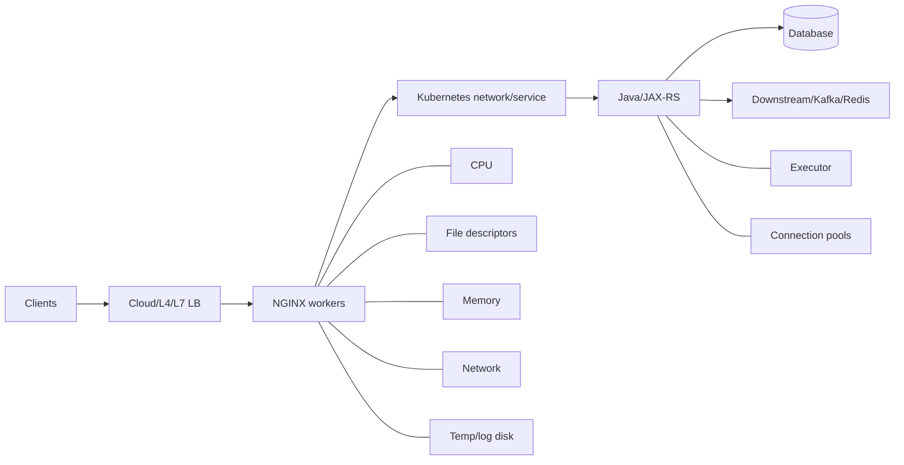
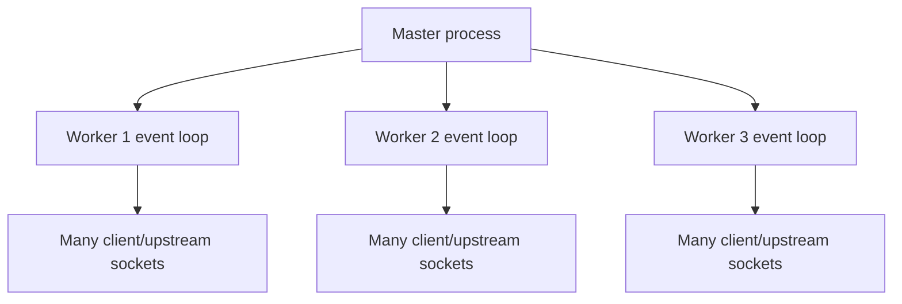

# Part 016 — Performance Engineering: Workers, Connections, Buffers, and Capacity

> **Depth level:** Production/Architecture-level  
> **Prerequisite:** Part 002–003, 008–011, dan 015; dasar concurrency, TCP, Linux process/socket resources, Kubernetes resource management, Java/JVM performance, queueing, dan load testing.  
> **Scope:** NGINX master/worker/event-loop model, worker and file-descriptor budgets, accept/listen queues, downstream/upstream connections, keepalive, HTTP/2/HTTP/3 multiplexing, buffers and temporary files, TCP/file delivery, TLS/compression cost, container/Kubernetes constraints, Java/JAX-RS coupling, saturation analysis, benchmark methodology, realistic load testing, capacity planning, headroom, safe tuning, dan debugging.  
> **Bukan scope utama:** directive buffering semantics detail—Part 010; cache architecture—Part 011; controller deployment fundamentals—Part 017–020; cloud-specific traffic topology—Part 022–024; full production debugging runbook—Part 031–032.

---

## Daftar isi

1. [Tujuan pembelajaran](#tujuan-pembelajaran)
2. [Executive mental model](#executive-mental-model)
3. [Performance is a system property](#performance-is-a-system-property)
4. [Performance dimensions](#performance-dimensions)
5. [Core performance invariants](#core-performance-invariants)
6. [NGINX execution model](#nginx-execution-model)
7. [Master and worker processes](#master-and-worker-processes)
8. [Event loop versus thread-per-request](#event-loop-versus-thread-per-request)
9. [Event methods: epoll, kqueue, and auto-selection](#event-methods-epoll-kqueue-and-auto-selection)
10. [`worker_processes`](#worker_processes)
11. [CPU quota and container caveats](#cpu-quota-and-container-caveats)
12. [CPU affinity and NUMA](#cpu-affinity-and-numa)
13. [`worker_connections`](#worker_connections)
14. [Connection slots are not client capacity](#connection-slots-are-not-client-capacity)
15. [File-descriptor budget](#file-descriptor-budget)
16. [`worker_rlimit_nofile` and OS limits](#worker_rlimit_nofile-and-os-limits)
17. [Downstream connection model](#downstream-connection-model)
18. [Upstream connection model](#upstream-connection-model)
19. [Connection multiplication](#connection-multiplication)
20. [HTTP/1.1 keepalive](#http11-keepalive)
21. [Downstream keepalive tuning](#downstream-keepalive-tuning)
22. [Upstream keepalive pools](#upstream-keepalive-pools)
23. [Keepalive failure modes](#keepalive-failure-modes)
24. [HTTP/2 multiplexing](#http2-multiplexing)
25. [HTTP/3 considerations](#http3-considerations)
26. [Listen socket and accept path](#listen-socket-and-accept-path)
27. [Backlog and kernel queues](#backlog-and-kernel-queues)
28. [`accept_mutex`, `reuseport`, and `multi_accept`](#accept_mutex-reuseport-and-multi_accept)
29. [Little's Law and concurrency](#littles-law-and-concurrency)
30. [Queueing and tail latency](#queueing-and-tail-latency)
31. [Capacity bottleneck model](#capacity-bottleneck-model)
32. [Memory model](#memory-model)
33. [Per-connection and per-request memory](#per-connection-and-per-request-memory)
34. [Buffer memory budget](#buffer-memory-budget)
35. [Temporary-file and ephemeral-storage budget](#temporary-file-and-ephemeral-storage-budget)
36. [Static-file delivery](#static-file-delivery)
37. [`sendfile`](#sendfile)
38. [`tcp_nopush` and `tcp_nodelay`](#tcp_nopush-and-tcp_nodelay)
39. [AIO and thread pools](#aio-and-thread-pools)
40. [TLS performance](#tls-performance)
41. [TLS session reuse](#tls-session-reuse)
42. [Compression cost](#compression-cost)
43. [Logging and telemetry overhead](#logging-and-telemetry-overhead)
44. [DNS and resolver overhead](#dns-and-resolver-overhead)
45. [Kernel and network constraints](#kernel-and-network-constraints)
46. [Container resource model](#container-resource-model)
47. [Kubernetes CPU limits and throttling](#kubernetes-cpu-limits-and-throttling)
48. [Memory, OOM, and ephemeral storage](#memory-oom-and-ephemeral-storage)
49. [Autoscaling](#autoscaling)
50. [Coupling with Java/JAX-RS](#coupling-with-javajax-rs)
51. [Java executor and connection-pool alignment](#java-executor-and-connection-pool-alignment)
52. [Database and downstream bottlenecks](#database-and-downstream-bottlenecks)
53. [Rate limits, retries, and capacity collapse](#rate-limits-retries-and-capacity-collapse)
54. [Saturation signatures](#saturation-signatures)
55. [Capacity model worksheet](#capacity-model-worksheet)
56. [Worked capacity example](#worked-capacity-example)
57. [Headroom and failure capacity](#headroom-and-failure-capacity)
58. [Load-test objectives](#load-test-objectives)
59. [Open versus closed workload models](#open-versus-closed-workload-models)
60. [Realistic traffic model](#realistic-traffic-model)
61. [Warm-up and steady state](#warm-up-and-steady-state)
62. [Failure and degradation tests](#failure-and-degradation-tests)
63. [Benchmark measurement](#benchmark-measurement)
64. [Common benchmark traps](#common-benchmark-traps)
65. [Evidence-driven tuning workflow](#evidence-driven-tuning-workflow)
66. [Reference baseline configuration](#reference-baseline-configuration)
67. [Failure-mode catalogue](#failure-mode-catalogue)
68. [Debugging playbooks](#debugging-playbooks)
69. [Performance anti-patterns](#performance-anti-patterns)
70. [PR review checklist](#pr-review-checklist)
71. [Internal verification checklist](#internal-verification-checklist)
72. [Hands-on exercises](#hands-on-exercises)
73. [Ringkasan invariants](#ringkasan-invariants)
74. [Referensi resmi](#referensi-resmi)

---

## Tujuan pembelajaran

Setelah menyelesaikan part ini, Anda harus mampu:

1. menjelaskan mengapa event-driven NGINX dapat menangani banyak koneksi tanpa thread per request, sekaligus memahami pekerjaan apa yang masih dapat memblokir worker;
2. menentukan effective worker, connection, file-descriptor, socket, memory, temp-disk, CPU, dan network budgets;
3. membuktikan bahwa `worker_connections × worker_processes` bukan otomatis jumlah client maksimum;
4. menghitung hubungan request rate, latency, concurrency, keepalive, retries, dan replicas;
5. membedakan downstream connection, upstream active connection, upstream idle keepalive, HTTP/2 stream, dan Java active request;
6. menilai `worker_processes`, `worker_connections`, `worker_rlimit_nofile`, backlog, keepalive, buffer, `sendfile`, `tcp_nopush`, dan `tcp_nodelay` berdasarkan evidence;
7. mengidentifikasi CPU saturation, CPU throttling, FD exhaustion, connection saturation, memory pressure, temp-disk pressure, listen drops, network bottleneck, dan upstream bottleneck;
8. menghubungkan NGINX capacity dengan Java executor, DB pool, HTTP client pool, Kafka/downstream, dan pod autoscaling;
9. merancang load test yang merepresentasikan TLS, protocol, payload, connection reuse, arrival pattern, route mix, retries, failures, dan autoscaling;
10. menggunakan percentiles, queueing, Little's Law, saturation, dan headroom untuk capacity planning;
11. menghindari tuning yang hanya menyalin “best practices” internet;
12. melakukan safe rollout, comparison, rollback, dan regression validation;
13. mereview perubahan performance sebagai perubahan end-to-end capacity contract;
14. menyusun **Internal verification checklist** untuk CSG tanpa mengarang topology, threshold, atau platform standard.

---

## Executive mental model

NGINX performance tidak dapat dinilai dari satu angka RPS.

Model yang lebih benar:

```text
Delivered capacity
= minimum capacity across all mandatory resources and hops
```



If any mandatory resource saturates:

```text
queue grows
→ latency grows
→ timeout and retry grow
→ effective offered load grows
→ failures grow
```

### Principal rule

> Tune the bottleneck you can prove, not the directive you recognize.

---

## Performance is a system property

A fast isolated NGINX benchmark does not prove production performance.

Production behavior depends on:

- client geography/network;
- TLS handshakes;
- protocol mix;
- request/response size;
- upload/download rate;
- cache hit ratio;
- auth subrequests;
- upstream latency distribution;
- Java concurrency;
- DB/downstream capacity;
- retries;
- HPA lag;
- logging/tracing;
- node/kernel limits;
- failure mode;
- rollout state.

### Boundary illusion

NGINX CPU at 20% while customers time out may indicate:

- Java queue saturation;
- DB pool exhaustion;
- one slow dependency;
- upstream connect limit;
- NGINX waiting on clients;
- load balancer idle timeout;
- file-descriptor limit;
- pod CPU throttling not visible in average CPU;
- uneven traffic distribution.

---

## Performance dimensions

| Dimension | Question |
|---|---|
| throughput | how much completed work per time? |
| latency | how long per request/operation? |
| concurrency | how much work is in flight? |
| utilization | how busy is a resource? |
| saturation | how much work is waiting or rejected? |
| errors | what work failed due to resource/timeout? |
| efficiency | work per CPU/memory/network unit |
| fairness | do tenants/routes/clients receive intended shares? |
| elasticity | how fast can capacity adapt? |
| resilience | what capacity remains during failure/maintenance? |

### Performance is not only speed

A configuration that increases average RPS but causes:

- worse p99;
- larger blast radius;
- retry storm;
- memory spikes;
- unfair tenant starvation;
- slower rollback;
- unsafe failure behavior;

is not automatically an improvement.

---

## Core performance invariants

1. Every limit has scope: worker, instance, pod, node, cluster, region, or upstream.
2. Connection slots include more than client connections.
3. File-descriptor limits cap usable connection capacity.
4. Idle keepalive consumes resources but saves handshake/connect work.
5. HTTP/2 reduces downstream connection count but may increase concurrent streams.
6. Throughput and latency cannot be tuned independently under saturation.
7. Queueing grows nonlinearly near full utilization.
8. Buffering shifts pressure between memory, disk, client, and upstream.
9. Higher retries increase load during failure.
10. NGINX capacity must not exceed safe backend admission capacity without control.
11. Container CPU limits can create throttling before average node CPU is high.
12. Autoscaling reacts after a signal; headroom must cover reaction time.
13. Benchmarks must include the real protocol, payload, route mix, and failure behavior.
14. Average values are insufficient; distributions and saturation are required.
15. Every tuning change needs a hypothesis, baseline, test, observability, and rollback.

---

## NGINX execution model

NGINX commonly uses:

- one master process;
- multiple worker processes;
- event notification mechanisms;
- nonblocking sockets;
- asynchronous state machines.

Conceptually:



A worker repeatedly:

1. receives readiness events;
2. performs bounded work;
3. updates request/connection state;
4. returns to event polling.

### Consequence

High connection concurrency does not require one thread per connection.

But event-driven does not mean “nothing can block”.

Blocking risks include:

- synchronous disk I/O;
- DNS behavior outside configured async resolver path;
- third-party modules;
- slow log/filesystem operations;
- CPU-heavy TLS/compression/regex;
- pathological config/script execution;
- kernel/resource contention.

---

## Master and worker processes

### Master responsibilities

- read/validate configuration;
- bind/listen sockets;
- start workers;
- receive signals;
- graceful reload;
- manage old/new worker generations.

### Worker responsibilities

- accept client connections;
- parse requests;
- perform routing/policy;
- connect/proxy upstream;
- read/write data;
- log;
- execute module handlers.

### Operational implication

A graceful reload creates overlapping generations temporarily:

```text
old workers draining
+ new workers serving
```

Capacity planning must account for transient:

- process count;
- memory;
- open connections;
- upstream pools;
- file descriptors;
- CPU;
- long-lived connections.

---

## Event loop versus thread-per-request

### NGINX event loop

Strengths:

- many idle/slow connections;
- low per-connection thread overhead;
- efficient socket readiness;
- natural proxying state machine.

### Java request processing

Depending on stack:

- platform threads;
- virtual threads;
- async servlet/JAX-RS;
- reactive runtime;
- executor pools.

Java capacity remains bounded by:

- CPU;
- executor concurrency;
- DB/downstream pools;
- memory;
- blocking operations.

### Important mismatch

NGINX may accept 50,000 concurrent client connections while Java safely processes only 300 expensive requests.

Without admission control:

```text
NGINX acceptance capacity
≫ Java service capacity
→ queue/timeouts/retries
```

---

## Event methods: epoll, kqueue, and auto-selection

NGINX supports platform-specific connection-processing methods such as:

- `epoll` on Linux;
- `kqueue` on BSD/macOS variants;
- other platform methods.

Normally NGINX selects the most efficient supported method automatically.

### Recommendation

Do not manually set:

```nginx
events {
    use epoll;
}
```

unless:

- exact platform is fixed;
- package/build support is verified;
- a measured or compatibility reason exists.

Manual setting reduces portability and can break on another runtime.

---

## `worker_processes`

Syntax concept:

```nginx
worker_processes auto;
```

The directive controls worker-process count.

### Starting hypothesis

For CPU-bound work, a worker count around available CPU capacity is often a reasonable starting point.

But actual optimum depends on:

- CPU quota and cpuset;
- TLS/compression;
- disk/log I/O;
- third-party modules;
- NUMA;
- workload mix;
- container visibility;
- noisy neighbors.

### Too few workers

- one worker CPU saturated;
- uneven accept/distribution;
- lower throughput;
- event-loop stalls affect more requests.

### Too many workers

- context switching;
- CPU cache pressure;
- duplicated per-worker upstream keepalive pools;
- more memory;
- more connections to backends;
- greater reload overlap;
- harder capacity accounting.

---

## CPU quota and container caveats

`worker_processes auto` must be validated inside the actual container/runtime.

Questions:

- Does NGINX see host CPUs, cpuset CPUs, or quota-adjusted CPUs?
- What CPU request and limit are configured?
- Is the pod Guaranteed/Burstable?
- Is CPU throttling frequent?
- Does the version/package detect cgroup limits as expected?
- Are workers scheduled on a much larger node than the pod quota?

### Failure example

```text
node has 32 CPUs
pod limit = 2 CPUs
worker_processes auto selects far more workers
```

Potential outcome:

- excessive worker count;
- context switching;
- duplicated pools;
- no additional CPU capacity;
- noisy measurements.

Verify empirically with:

- running process count;
- cgroup settings;
- `nginx -T`;
- CPU throttling;
- per-worker CPU;
- load tests.

---

## CPU affinity and NUMA

`worker_cpu_affinity` can bind workers to CPU sets.

Potential benefits:

- cache locality;
- predictable CPU placement;
- specialized high-throughput environments.

Risks:

- wrong topology;
- conflict with container scheduler/cpuset;
- reduced flexibility;
- uneven workload;
- operational complexity;
- stale masks after node type changes.

### Default position

Do not pin workers in ordinary Kubernetes deployments without evidence and platform ownership.

NUMA-sensitive tuning belongs to a measured, dedicated-host scenario.

---

## `worker_connections`

`worker_connections` sets maximum simultaneous connections per worker.

Example:

```nginx
events {
    worker_connections 4096;
}
```

Official semantics include all connections opened by the worker, including proxied upstream connections—not only clients.

### The common wrong formula

```text
max clients = worker_processes × worker_connections
```

This is an optimistic upper bound on connection structures, not usable client capacity.

---

## Connection slots are not client capacity

For a proxied HTTP/1.1 request, one active request may require:

```text
1 downstream client connection
+ 1 upstream connection
```

Additional slots may be used by:

- auth subrequests;
- mirrored traffic;
- DNS/resolver-related sockets;
- log/syslog connections;
- idle upstream keepalive;
- WebSocket/SSE;
- multiple retries;
- stream/TCP proxying;
- exporter/management endpoints.

Approximate active client capacity:

```text
usable client connections
<
(worker_processes × worker_connections)
/
average connection slots per client
```

### Example

```text
4 workers × 8192 = 32768 connection slots

Assume:
- 1 downstream active connection
- 1 upstream active connection
- upstream idle pools and management reserve
- 20% safety reserve

Usable simultaneous proxied HTTP/1.1 clients
may be far below 16384.
```

Measure actual topology.

---

## File-descriptor budget

Each socket/file consumes a file descriptor.

Potential FD consumers:

- listening sockets;
- client sockets;
- upstream sockets;
- log files;
- static files;
- temp files;
- cache files;
- resolver/syslog/collector sockets;
- modules.

Approximate per-worker requirement:

```text
FD_required
≈ downstream_connections
+ active_upstream_connections
+ idle_upstream_keepalive_connections
+ open_files
+ operational_reserve
```

### Fleet-level multiplication

```text
total backend connections
≈ ingress replicas
× workers per replica
× per-worker upstream pool behavior
```

This can overwhelm Java even when each NGINX pod looks safe.

---

## `worker_rlimit_nofile` and OS limits

Usable FDs are constrained by:

- process soft/hard `RLIMIT_NOFILE`;
- `worker_rlimit_nofile`;
- container runtime;
- systemd/unit limits on VM;
- node/kernel global file table;
- security policy.

`worker_connections` above the FD limit does not create capacity.

### Validation commands

Examples:

```bash
cat /proc/1/limits
cat /proc/<worker-pid>/limits
ls /proc/<worker-pid>/fd | wc -l
nginx -T
```

In containers, identify correct worker PIDs.

### Alerting

Monitor:

- open FDs;
- FD limit;
- ratio;
- `too many open files`;
- accepted versus handled divergence;
- connect failures.

---

## Downstream connection model

Downstream connections include:

- HTTP/1.1 keepalive;
- HTTP/2 multiplexed connections;
- HTTP/3/QUIC connections;
- WebSocket;
- SSE;
- slow uploads;
- slow downloads;
- idle clients.

### Capacity classes

Do not treat them equally.

| Class | Resource behavior |
|---|---|
| short API | brief active upstream |
| idle keepalive | connection/FD, little CPU |
| slow upload | long downstream, possible buffer/temp disk |
| large download | long downstream, network/buffer |
| SSE | long connection, periodic writes |
| WebSocket | long bidirectional connection |
| HTTP/2 | one connection, many streams |

Create route/protocol-specific budgets.

---

## Upstream connection model

Upstream connections may be:

- newly established per request;
- reused from keepalive pool;
- active;
- idle;
- TLS;
- per-worker;
- retried to another peer.

### Capacity dimensions

- connect rate;
- active upstream concurrency;
- idle keepalive count;
- backend max connections;
- backend accept backlog;
- TLS handshake capacity;
- ephemeral ports/NAT;
- per-pod distribution.

### Java view

A TCP connection is not necessarily one active Java request.

With upstream HTTP/1.1:

- usually one request at a time per connection;
- keepalive reuses connection sequentially.

With upstream HTTP/2/gRPC:

- one connection may carry multiple streams depending on protocol/support.

---

## Connection multiplication

Suppose:

```text
8 ingress replicas
× 4 workers
× 64 idle keepalive slots per upstream group
= up to 2048 idle upstream connections
```

Then add active connections and multiple upstream groups.

Potential consequences:

- Java/Tomcat/Jetty/Netty connection limits reached;
- load balancer/backend sees large idle population;
- database remains unrelated but app memory/socket resources rise;
- rolling updates temporarily double pools;
- uneven pod distribution.

### Required review

Whenever changing:

- ingress replicas;
- worker count;
- upstream keepalive;
- upstream groups;
- topology;

recalculate fleet-wide connections.

---

## HTTP/1.1 keepalive

Keepalive avoids repeated:

- TCP handshake;
- TLS handshake;
- slow-start effects;
- socket setup;
- backend accept overhead.

But retains:

- FD;
- socket memory;
- per-connection state;
- backend connection;
- idle timeout coordination.

Keepalive is a latency/CPU optimization with resource cost.

---

## Downstream keepalive tuning

Relevant directives include:

- `keepalive_timeout`;
- `keepalive_requests`;
- `keepalive_time`;
- `keepalive_min_timeout` in versions that support it.

### Trade-offs

Longer idle timeout:

- better reuse;
- fewer handshakes;
- more idle connections/FD/memory;
- slower draining.

Higher request limit:

- better reuse;
- per-connection allocations may live longer;
- uneven connection lifetimes;
- operational memory implications.

### Align with upstream edge

Cloud LB/CDN/client idle timeouts may differ.

If outer LB closes at 60 s and NGINX keeps idle 75 s, NGINX's extra window may not create useful reuse for that hop.

---

## Upstream keepalive pools

Upstream keepalive pools are commonly per worker.

Questions:

- exact NGINX version;
- upstream HTTP version;
- `Connection` header behavior;
- pool size;
- backend idle timeout;
- TLS session behavior;
- number of workers/replicas;
- backend max connections.

### Pool size interpretation

A keepalive setting is not necessarily a hard cap on total active connections. It often caps idle cached connections per worker/group.

Under load, active connections can exceed idle cache size.

### Safe alignment

```text
backend connection budget
>= active expected
+ idle ingress pools
+ rollout overlap
+ other callers
+ reserve
```

---

## Keepalive failure modes

| Failure | Symptom |
|---|---|
| idle mismatch | resets on reused connection |
| pool too small | high connect/TLS rate |
| pool too large | backend connection exhaustion |
| many workers/replicas | connection multiplication |
| backend deploy closes sockets | transient 502/reset |
| no graceful drain | active requests reset |
| stale DNS/peer changes | reuse to obsolete endpoints |
| long keepalive | slow rollout drain |
| too many requests per connection | long-lived memory/state |

Observe:

- connect rate;
- connection reuse if available;
- upstream reset;
- active/idle backend connections;
- handshake rate;
- rollout errors.

---

## HTTP/2 multiplexing

HTTP/2 allows multiple concurrent streams over one downstream connection.

Benefits:

- fewer TCP/TLS connections;
- header compression;
- multiplexing;
- efficient clients.

Capacity implications:

- connection count understates request concurrency;
- one client can open many streams;
- stream limits matter;
- one TCP connection still shares congestion/loss behavior;
- upstream may remain HTTP/1.1 with one connection per active request;
- rate/connection controls can behave differently.

### Model

```text
1 downstream HTTP/2 connection
→ N concurrent streams
→ potentially N upstream HTTP/1.1 connections
```

Do not size upstream or Java capacity from downstream connection count.

---

## HTTP/3 considerations

HTTP/3 uses QUIC over UDP and has different transport behavior.

Consider:

- UDP load balancer/network support;
- worker/socket implementation;
- connection migration;
- CPU cost;
- observability tooling;
- firewall/NAT;
- fallback to HTTP/2;
- version/module maturity;
- controller support.

Do not enable HTTP/3 only because it is newer. Validate client benefit, infrastructure support, CPU, and failure behavior.

---

## Listen socket and accept path

Request acceptance path:

```text
NIC
→ kernel packet processing
→ SYN/QUIC handling
→ listen/accept queue
→ worker accepts connection
→ request parsing
```

Potential bottlenecks:

- cloud LB connection limit;
- node conntrack;
- SYN backlog;
- listen backlog;
- worker accept rate;
- FD limit;
- CPU throttling;
- TLS handshake.

A healthy application cannot help if connections are dropped before acceptance.

---

## Backlog and kernel queues

`listen ... backlog=` interacts with OS limits.

Concepts:

- SYN queue for incomplete TCP handshakes;
- accept queue for completed connections awaiting `accept()`;
- kernel `somaxconn`;
- syncookies;
- listen drops/overflows;
- cloud LB retry behavior.

### Tuning rule

Increasing NGINX backlog above kernel/system caps may not have effect.

Also, a very large queue can:

- hide saturation temporarily;
- increase latency;
- deliver stale work;
- delay failure signals.

Queue capacity is not compute capacity.

---

## `accept_mutex`, `reuseport`, and `multi_accept`

### `accept_mutex`

Coordinates workers accepting connections.

Modern NGINX documentation notes it is unnecessary on systems supporting `EPOLLEXCLUSIVE` or when `reuseport` is used.

Do not enable from old blog posts without reason.

### `reuseport`

Can create per-worker listening sockets and kernel distribution.

Potential benefits:

- accept scalability;
- reduced contention.

Potential risks:

- uneven distribution;
- changed observability;
- connection stickiness behavior;
- OS/version specifics.

### `multi_accept`

Allows a worker to accept multiple new connections per event.

Risk under burst:

- one worker accepts aggressively;
- uneven load;
- more immediate work than CPU can service.

Benchmark actual behavior.

---

## Little's Law and concurrency

For a stable system:

```text
L = λ × W
```

Where:

- `L` = average work/concurrency in system;
- `λ` = arrival/completion rate;
- `W` = average time in system.

Example:

```text
1000 requests/s × 0.2 s
= 200 average concurrent requests
```

If latency becomes 2 s at the same offered rate:

```text
1000 × 2 = 2000 concurrent requests
```

This explains why latency degradation causes connection/concurrency pressure even with unchanged RPS.

### Route-level use

Calculate separately for:

- interactive API;
- large upload;
- export;
- SSE/WebSocket;
- auth subrequest;
- dependency classes.

---

## Queueing and tail latency

As utilization approaches 100%, waiting time can grow rapidly.

```text
utilization ↑
→ queue probability ↑
→ p95/p99 latency ↑
→ timeout ↑
→ retry ↑
```

### Practical target

Do not plan steady-state at theoretical maximum throughput.

Maintain headroom for:

- bursts;
- imbalance;
- failures;
- deploy;
- autoscaling lag;
- GC;
- noisy neighbors;
- dependency slowdown.

### Queue locations

- cloud LB;
- kernel listen queue;
- rate limiter delay;
- NGINX upstream queue where supported;
- Java accept queue;
- Java executor;
- DB pool;
- downstream client pool;
- Kafka;
- storage.

Queue everywhere creates “successful but too late”.

---

## Capacity bottleneck model

Overall throughput:

```text
C_system = min(
  C_edge,
  C_nginx_cpu,
  C_nginx_fd,
  C_nginx_connections,
  C_network,
  C_temp_disk,
  C_k8s_routing,
  C_java_executor,
  C_java_cpu,
  C_db_pool,
  C_dependency,
  C_business_limit
)
```

### Bottleneck migration

After tuning one resource, bottleneck moves.

Example:

```text
increase NGINX workers
→ more upstream concurrency
→ Java executor saturates
→ DB pool wait rises
→ latency/504 worsen
```

Therefore performance work is iterative and end-to-end.

---

## Memory model

NGINX memory includes:

- process/code/shared libraries;
- per-worker state;
- connection structures;
- request pools;
- header buffers;
- request-body buffers;
- response/proxy buffers;
- TLS state;
- compression state;
- cache metadata;
- shared zones;
- module allocations;
- allocator fragmentation.

### Memory categories

```text
fixed base
+ per worker
+ per active connection
+ per active request
+ per buffered request/response
+ shared zones/cache
+ transient reload overlap
```

RSS is not simply `connections × one constant`.

---

## Per-connection and per-request memory

Memory varies by:

- protocol;
- TLS;
- headers;
- buffering;
- body size;
- upstream state;
- compression;
- modules;
- HTTP/2 streams;
- keepalive state.

### Measurement method

1. start idle baseline;
2. create many idle keepalive connections;
3. measure RSS delta;
4. create active small requests;
5. add TLS;
6. add large headers/body;
7. add buffering;
8. repeat across worker/reload states.

Use realistic concurrency and stable measurement windows.

---

## Buffer memory budget

Potential response-buffer approximation:

```text
buffer_memory
≈ concurrent_buffered_responses
× effective_in-memory_buffers_per_response
```

But bodies exceeding memory may spill to temp files.

Important directives are covered in Part 010, including:

- `proxy_buffering`;
- `proxy_buffer_size`;
- `proxy_buffers`;
- `proxy_busy_buffers_size`;
- request buffering;
- temp-file controls.

### Risk of “increase all buffers”

- memory scales with concurrency;
- pod OOM;
- fewer replicas per node;
- long reload overlap;
- no improvement if bottleneck is Java/DB/network.

Tune for header/body distributions and specific errors.

---

## Temporary-file and ephemeral-storage budget

NGINX may use temporary storage for:

- buffered request bodies;
- buffered upstream responses;
- cache;
- file upload;
- large payload;
- logs depending on setup.

Capacity model:

```text
temp_storage_peak
≈ concurrent_spilled_requests
× average_spilled_bytes
× safety factor
```

Kubernetes implications:

- `emptyDir`;
- node ephemeral storage;
- pod `ephemeral-storage` request/limit;
- eviction;
- read-only root filesystem;
- storage latency;
- multi-replica distribution.

### Failure symptoms

- `no space left on device`;
- 500/502;
- pod eviction;
- latency increase;
- node disk pressure;
- incomplete uploads;
- worker errors.

---

## Static-file delivery

Static delivery performance depends on:

- page cache;
- filesystem;
- file metadata lookup;
- `sendfile`;
- AIO/thread pools;
- open-file cache;
- compression/precompressed assets;
- network.

For an API-only ingress, static tuning may be irrelevant.

Do not enable static-file directives as global folklore.

---

## `sendfile`

`sendfile on` enables kernel-assisted file transfer.

Potential benefit:

- fewer user-space copies;
- efficient static files.

Not automatically beneficial for:

- proxied dynamic responses;
- files on unsupported/problematic filesystems;
- certain network filesystems;
- encrypted/user-space transformations;
- container volume semantics.

### Fairness

`sendfile_max_chunk` limits data per call so one fast connection does not monopolize worker execution.

Test large-file throughput and small-request latency together.

---

## `tcp_nopush` and `tcp_nodelay`

### `tcp_nopush`

On supported platforms, with `sendfile`, it can help send headers plus beginning of file efficiently and use full packets.

### `tcp_nodelay`

Disables Nagle-related delay in applicable connection states. NGINX enables it by default in documented HTTP contexts and uses it for keepalive, SSL, unbuffered proxying, and WebSocket scenarios.

### Do not treat them as opposites to toggle blindly

Their effect depends on:

- connection phase;
- buffering;
- `sendfile`;
- payload size;
- OS;
- latency/throughput objective.

Benchmark small responses, streaming, and large files separately.

---

## AIO and thread pools

Disk operations can block workers.

Options include platform-dependent:

- AIO;
- thread pools;
- `directio`;
- read-ahead.

Use cases:

- large static/video files;
- slow storage;
- cache/temp workloads.

Risks:

- build/platform dependency;
- complexity;
- thread-pool saturation;
- filesystem behavior;
- no benefit for proxy-only traffic.

For Java API ingress, focus first on proxy/network/backend evidence.

---

## TLS performance

TLS consumes:

- handshake CPU;
- asymmetric crypto;
- certificate chain processing;
- session state;
- symmetric encryption per byte;
- memory;
- network round trips.

Factors:

- protocol/cipher;
- key algorithm;
- session reuse/resumption;
- client geography;
- handshake rate;
- certificate chain;
- hardware/CPU;
- HTTP keepalive;
- HTTP/2 connection reuse.

### Metrics

- handshakes/s;
- session reuse;
- TLS errors;
- CPU per request;
- connection rate;
- protocol/cipher distribution;
- full versus resumed sessions where available.

### Capacity distinction

```text
requests/s high with keepalive
≠ new TLS handshakes/s high
```

Load tests must model both.

---

## TLS session reuse

Session reuse/resumption can reduce handshake CPU and latency.

But verify:

- TLS version;
- session cache/tickets;
- key rotation;
- multi-replica consistency;
- security policy;
- load-balancer termination point;
- long-lived connection behavior.

### Multi-replica issue

If session state/keys are not usable across replicas, load-balanced reconnects may perform full handshakes.

Do not weaken ticket-key security for performance without security ownership.

---

## Compression cost

Compression trades:

```text
CPU
for
network bytes
```

Benefit depends on:

- MIME type;
- payload size;
- compressibility;
- client bandwidth;
- CPU headroom;
- cache/CDN;
- compression level;
- dynamic versus precompressed asset.

### Failure mode

Under traffic spike:

```text
high compression level
→ CPU saturation
→ latency
→ timeout/retry
```

Measure:

- bytes saved;
- CPU cost;
- p99;
- route/content type;
- edge/CDN compression duplication.

---

## Logging and telemetry overhead

Observability consumes:

- string formatting;
- syscalls;
- disk/network I/O;
- collector CPU/memory;
- serialization;
- tracing export;
- cardinality/storage.

Performance tests should compare:

- production logging on;
- tracing at production sampling;
- metrics enabled;
- collector healthy;
- collector degraded.

### Anti-benchmark

Benchmarking with access logs off and TLS disabled may measure a system that will never run in production.

---

## DNS and resolver overhead

DNS affects:

- startup/config resolution;
- dynamic upstream re-resolution;
- cache/TTL;
- resolver query rate;
- failure latency;
- endpoint churn.

Monitor:

- resolver latency/errors;
- stale endpoints;
- DNS query load;
- CoreDNS CPU;
- timeout;
- TTL behavior.

Do not use very low TTL/dynamic resolution without measuring resolver and reload impact.

---

## Kernel and network constraints

Potential limits:

- `somaxconn`;
- SYN backlog;
- ephemeral port range;
- conntrack table;
- socket memory;
- TCP TIME_WAIT;
- packet drops;
- NIC bandwidth;
- MTU;
- retransmissions;
- NAT gateway/SNAT ports;
- security appliances.

### Ephemeral ports

A proxy opening many outbound connections can exhaust source-port space, especially through NAT.

Keepalive can reduce connect rate, but oversized pools consume backend connections.

### Conntrack

Kubernetes/node networking can fail before process-level limits.

Monitor node/network layer, not only NGINX.

---

## Container resource model

Container constraints include:

- CPU request;
- CPU limit/quota;
- memory request/limit;
- ephemeral-storage request/limit;
- PID/capability/security limits;
- cpuset;
- FD limits inherited from runtime;
- node contention.

### Requests versus limits

- request affects scheduling/reservation;
- limit constrains usage;
- no CPU limit avoids throttling but requires platform governance;
- memory limit causes OOM kill rather than throttling.

Exact policy is internal.

---

## Kubernetes CPU limits and throttling

CPU throttling can occur when a container consumes its quota in a period.

Symptoms:

- high latency;
- low-looking average CPU versus node;
- increased event-loop delay;
- TLS/compression slowdown;
- p99 spikes;
- no OOM.

Monitor:

- throttled periods/time;
- per-pod CPU;
- worker CPU distribution;
- request latency;
- HPA behavior.

### Tuning trap

Increasing workers cannot create CPU beyond quota.

Possible actions:

- adjust request/limit;
- reduce compression/tracing cost;
- scale replicas;
- optimize route;
- remove blocking work;
- change node class;
- revise worker count.

---

## Memory, OOM, and ephemeral storage

### OOM failure

Potential sequence:

```text
traffic/body/buffer spike
→ RSS rises
→ cgroup OOM
→ pod restarts
→ endpoints churn
→ retries/502
```

### Ephemeral-storage failure

```text
large uploads/temp files/logs
→ node/pod storage limit
→ eviction/write failure
```

Capacity plan must include:

- steady state;
- p99 payload;
- concurrent spill;
- reload overlap;
- cache;
- debug logs;
- collector sidecar.

---

## Autoscaling

HPA inputs may include:

- CPU;
- memory;
- request rate;
- active connections;
- custom latency/queue metrics.

### Reaction lifecycle

```text
load rises
→ metric collected
→ HPA evaluates
→ pod scheduled
→ image starts
→ config loads
→ readiness passes
→ LB/controller routes
```

Headroom must cover the full delay.

### Risks

- CPU may stay low while waiting on upstream;
- latency is noisy and lagging;
- active connections include idle keepalive;
- scale-out changes per-replica local limit/pool behavior;
- scale-in drains long-lived connections slowly;
- new replicas create connection storms.

---

## Coupling with Java/JAX-RS

NGINX is an admission and transport layer in front of Java.

Capacity mapping:

```text
NGINX active upstream requests
→ Java accepted HTTP requests
→ executor/virtual-thread work
→ DB/downstream calls
```

### Questions

- How many concurrent requests can one Java pod safely process?
- Which routes are CPU-bound versus blocking?
- What is DB pool size?
- What is downstream client pool size?
- Are there bulkheads?
- What happens when executor/pool is full?
- Is overload rejected quickly or queued?
- Are retries idempotent and bounded?

NGINX should not blindly feed unlimited concurrency into a fragile backend.

---

## Java executor and connection-pool alignment

Example mismatch:

```text
NGINX can open 5000 active upstream connections
Java executor safe concurrency = 300
DB pool = 80
```

Potential result:

- thousands of waiting requests;
- heap/thread/context pressure;
- DB wait;
- timeouts;
- retry amplification.

### Alignment model

For route class `r`:

```text
safe_concurrency_r
<= min(
  Java execution capacity,
  DB/downstream capacity,
  memory capacity,
  business concurrency policy
)
```

Use:

- rate limiting;
- connection/concurrency limits;
- application bulkheads;
- short queues;
- fast overload response;
- autoscaling.

---

## Database and downstream bottlenecks

NGINX may be healthy while backend waits on:

- DB pool;
- lock contention;
- slow query;
- Kafka;
- Redis;
- external API;
- cloud SDK;
- filesystem.

Correlate NGINX upstream header time with:

- Java server span;
- executor queue;
- DB pool wait;
- dependency span;
- transaction/lock metrics.

### Critical principle

Increasing NGINX timeout or connections does not increase dependency capacity.

It may only retain more waiting work.

---

## Rate limits, retries, and capacity collapse

### Retry amplification

If each request retries twice:

```text
offered upstream attempts
= original requests × up to 3
```

Under partial failure, retries can target remaining healthy pods and collapse them.

### Burst and latency

A rate limit of 1000 RPS may be unsafe when latency changes:

```text
1000 RPS × 0.1 s = 100 concurrency
1000 RPS × 3 s   = 3000 concurrency
```

Rate, concurrency, timeout, and retry policies must be co-designed.

---

## Saturation signatures

| Bottleneck | Common evidence |
|---|---|
| worker CPU | one/all workers near CPU, latency rises |
| CPU throttling | throttled time/periods, p99 spikes |
| FD exhaustion | `too many open files`, handled < accepts |
| worker connections | accepts/handled divergence, connection errors |
| listen backlog | listen drops/overflows, connect latency/timeouts |
| upstream backend | header/response time, Java queue/pool |
| backend connections | refused/reset/max connections |
| memory | RSS/working-set growth, OOM |
| temp disk | disk pressure, write errors, eviction |
| network | bandwidth cap, retransmit, packet drop |
| TLS | handshake CPU, connect rate, low reuse |
| compression | CPU tied to compressible routes |
| logging | I/O wait, collector backpressure, disk growth |
| DNS | resolver timeout, stale endpoint, CoreDNS saturation |
| uneven balancing | one pod hot, fleet average normal |

Use multiple signals.

---

## Capacity model worksheet

Collect:

### Demand

- peak and p99 RPS;
- burst duration;
- new connections/s;
- TLS handshakes/s;
- protocol mix;
- route mix;
- request/response sizes;
- streaming connections;
- geographic/client profile;
- retry rate.

### Service time

- edge request duration;
- upstream connect;
- upstream header;
- upstream total;
- Java route latency;
- dependency latency.

### Resources

- replicas;
- workers;
- worker connections;
- FD limit;
- CPU request/limit;
- memory limit;
- ephemeral storage;
- network;
- backend connection limit;
- Java executor/pools;
- DB pool.

### Resilience

- one replica/node/AZ failure;
- deployment overlap;
- HPA delay;
- maintenance;
- dependency degradation;
- required headroom.

---

## Worked capacity example

Assume, only as an example:

```text
peak demand                 = 2400 requests/s
p95 edge duration           = 250 ms
average concurrent requests = 2400 × 0.25 = 600

ingress replicas            = 4
average active per replica  = 150
```

Add:

- uneven balancing factor: 1.3;
- retry/degradation factor: 1.5;
- rollout/headroom factor: 1.4.

```text
design active per replica
≈ 150 × 1.3 × 1.5 × 1.4
≈ 410
```

For HTTP/1.1 proxying, rough connection slots:

```text
410 downstream active
+ 410 upstream active
+ idle keepalive pools
+ idle downstream keepalive
+ long-lived connections
+ reserve
```

Suppose each pod has 4 workers and 8192 worker connections:

```text
32768 theoretical slots
```

Connection slots are not the likely bottleneck in this example. Check:

- FD limit;
- CPU/TLS/compression;
- backend concurrency;
- Java/DB;
- memory/temp disk;
- failure capacity.

### Why this is not a reusable answer

All factors must be measured. It demonstrates the method, not a recommended threshold.

---

## Headroom and failure capacity

Define headroom against a failure model.

Examples:

- one ingress pod unavailable;
- one node unavailable;
- one availability zone degraded;
- one Java pod rolling;
- one dependency slower;
- collector outage;
- certificate reload;
- traffic event.

### N+1 style question

```text
Can remaining healthy capacity serve peak demand
without entering retry-driven collapse?
```

If not:

- increase baseline replicas/capacity;
- reduce blast radius;
- add admission controls;
- improve autoscaling speed;
- degrade optional features;
- separate route classes.

---

## Load-test objectives

A load test should answer a decision.

Examples:

- safe RPS at p99 < 500 ms;
- safe concurrent SSE connections;
- impact of TLS handshake spike;
- correct worker/CPU sizing;
- buffer/temp-disk behavior for 200 MB upload;
- behavior during one backend pod failure;
- HPA scale-out delay;
- retry amplification;
- reload with long-lived connections.

Avoid “maximum RPS” with no SLO or failure criteria.

---

## Open versus closed workload models

### Closed model

A fixed number of virtual users waits for response before next request.

Risk:

- when server slows, generated request rate falls;
- hides overload;
- coordinated omission.

### Open model

Requests arrive according to an external schedule/rate independent of response completion.

Better for:

- traffic spikes;
- overload;
- queueing;
- capacity.

### Use both intentionally

- closed model for user journeys;
- open model for service capacity and burst behavior.

Document think time, arrival distribution, and retry policy.

---

## Realistic traffic model

Include:

- route weights;
- GET/POST mix;
- auth;
- request/response size distributions;
- compression;
- cache;
- TLS;
- keepalive;
- HTTP/1.1/2;
- client geography/latency;
- slow clients;
- uploads/downloads;
- WebSocket/SSE;
- backend latency;
- errors/retries;
- canary/rollout.

### Dataset realism

Do not use one tiny static response for an enterprise CPQ/order system benchmark.

Model expensive operations separately:

- pricing/configuration;
- quote calculation;
- order submit;
- search;
- export;
- document upload;
- status polling.

Internal route details require verification.

---

## Warm-up and steady state

Warm-up affects:

- OS page cache;
- DNS;
- TLS session cache;
- upstream keepalive;
- Java JIT;
- class loading;
- DB caches;
- autoscaling;
- connection pools.

Test phases:

1. cold start;
2. warm-up;
3. steady state;
4. peak;
5. degradation;
6. recovery;
7. cool down.

Record when measurements are valid.

---

## Failure and degradation tests

Inject:

- one NGINX pod termination;
- one Java pod termination;
- zero/partial endpoints;
- slow Java responses;
- DB pool exhaustion;
- upstream reset;
- DNS delay/failure;
- TLS handshake failure;
- collector/exporter outage;
- disk pressure;
- CPU throttling;
- packet loss/latency;
- cloud LB health transition.

Measure:

- user errors;
- p99;
- retries;
- recovery time;
- queue growth;
- resource saturation;
- autoscaling;
- connection drain.

---

## Benchmark measurement

Collect:

### Client

- sent/completed/failed;
- latency distribution;
- connection/TLS timing;
- bytes;
- retries;
- timeout reason.

### NGINX

- request rate/status;
- timing fields;
- active connections;
- CPU/throttling;
- memory;
- FDs;
- network;
- temp disk;
- errors;
- retries;
- reloads.

### Java/dependencies

- server latency;
- active requests;
- executor/queue;
- JVM/GC;
- DB/downstream pools;
- dependency latency/errors.

### Infrastructure

- node;
- CNI/conntrack;
- LB;
- DNS;
- HPA;
- scheduler;
- storage.

---

## Common benchmark traps

### Benchmarking localhost only

Removes realistic network/TLS/LB behavior.

### Logs and TLS disabled

Measures non-production configuration.

### Tiny static response

Does not represent proxy/backend/body workload.

### Closed-loop only

Hides saturation by reducing arrival rate when latency rises.

### Average latency

Hides tail failure.

### One route

Ignores expensive route mix.

### No warm-up distinction

Mixes JIT/cache/startup with steady state.

### No failure test

Only proves ideal capacity.

### Client generator saturated

Reports server limit when client is bottleneck.

### Ignoring retries

Counts successful final calls but hides attempt amplification.

### Comparing different configs with different traffic

Invalid A/B conclusion.

### No statistical repeatability

One run may reflect noise.

---

## Evidence-driven tuning workflow

1. Define user/business SLO.
2. Define workload and failure model.
3. Capture baseline configuration and environment.
4. Measure end-to-end signals.
5. Identify first saturated resource.
6. Form one hypothesis.
7. Change one bounded variable.
8. Test under identical workload.
9. Compare throughput, p95/p99, errors, resources, and recovery.
10. Validate backend impact.
11. Roll out progressively.
12. Monitor production.
13. Document result or revert.

### Evidence table

| Hypothesis | Evidence before | Change | Expected | Actual |
|---|---|---|---|---|
| FD limit caps connections | handled < accepts; FD near limit | raise validated limit | fewer accept failures | measure |
| TLS handshake CPU high | high conn/s, low reuse, CPU | improve reuse/session config | lower CPU/latency | measure |
| upstream pool too small | high connect rate | increase modestly | lower connect time | measure |
| compression too costly | CPU correlates with gzip routes | reduce level/disable class | CPU down, bytes up | measure |

---

## Reference baseline configuration

This is a review template, not a universal performance configuration.

```nginx
worker_processes auto;

# Must align with runtime hard limit and measured FD budget.
worker_rlimit_nofile 65535;

events {
    # Includes downstream and upstream connections.
    worker_connections 8192;

    # Let NGINX choose the platform event method.
    # use epoll;

    # Do not copy old tuning blindly.
    # multi_accept off;
    # accept_mutex off;
}

http {
    # Validate against client/LB behavior and drain requirements.
    keepalive_timeout 60s;
    keepalive_requests 1000;
    keepalive_time 1h;

    # Relevant mainly for static file delivery.
    sendfile on;
    tcp_nopush on;
    tcp_nodelay on;

    # Compression values require CPU/network evidence.
    gzip on;
    gzip_comp_level 4;
    gzip_min_length 1024;
    gzip_types
        text/plain
        text/css
        application/json
        application/javascript
        application/xml;

    upstream java_backend {
        # DNS/static/service topology omitted intentionally.
        server java-service:8080;

        # Exact semantics/defaults are version-dependent.
        keepalive 32;
    }

    server {
        listen 8080;

        location / {
            proxy_http_version 1.1;
            proxy_set_header Connection "";
            proxy_pass http://java_backend;
        }
    }
}
```

### Review before use

- exact version and upstream keepalive defaults;
- container CPU and worker count;
- FD hard limits;
- backend connection budget;
- workload route/body/protocol mix;
- static-file relevance;
- gzip ownership by CDN/LB;
- graceful shutdown;
- controller-generated config;
- memory/temp storage;
- security policy.

---

## Failure-mode catalogue

| Failure mode | Trigger | Observable symptom |
|---|---|---|
| worker CPU saturation | TLS/compression/regex/load | p99 up, worker CPU high |
| CPU throttling | pod limit | latency spikes, throttled time |
| FD exhaustion | many sockets/files | `EMFILE`, handled < accepts |
| worker connection cap | slots exhausted | accepts/handled gap, failures |
| listen queue overflow | burst/slow accept | connect timeout/drop |
| upstream connect storm | no keepalive/restarts | backend accept/TLS CPU |
| oversized idle pool | many workers/replicas | backend max connections |
| stale keepalive | timeout mismatch/deploy | reset/502 |
| memory blow-up | buffers/headers/concurrency | OOM/restart |
| temp disk exhaustion | large buffered bodies | write error/eviction |
| network saturation | large response/traffic | throughput cap, latency |
| conntrack/SNAT exhaustion | many flows | sporadic connect failures |
| HTTP/2 stream surge | few connections, many streams | upstream concurrency spike |
| retry amplification | partial outage | remaining pods collapse |
| queue accumulation | utilization near max | extreme tail latency |
| autoscaling lag | sudden burst | transient SLO failure |
| reload overlap | old/new workers | transient memory/connection rise |
| telemetry overhead | debug/full traces | CPU/I/O cost |
| uneven load | sticky/hash/topology | one pod hot |
| client generator limit | insufficient test agents | false server ceiling |

---

## Debugging playbooks

## Playbook 1 — High latency, low CPU

Check:

- upstream header/response time;
- Java executor and DB pool;
- network retransmits;
- DNS/connect;
- slow client/body;
- rate-limit delay;
- file/temp disk;
- CPU throttling despite low average;
- queueing elsewhere;
- one hot replica hidden by average.

---

## Playbook 2 — `worker_connections are not enough`

1. inspect error log;
2. compare accepts/handled;
3. count open FDs;
4. inspect per-worker FD limits;
5. separate downstream/upstream/idle pools;
6. check HTTP/2 streams and long-lived connections;
7. calculate reserve;
8. increase only with OS/backend/resource validation;
9. load test and monitor memory/backend impact.

---

## Playbook 3 — `too many open files`

Check:

- process limit;
- `worker_rlimit_nofile`;
- actual open FDs;
- worker connections;
- static/cache/temp files;
- log descriptors;
- idle upstream pools;
- replicas/workers;
- leak or long-lived traffic.

Raising limit may expose next bottleneck. Validate memory/kernel/backend.

---

## Playbook 4 — NGINX pod CPU throttling

1. inspect cgroup throttling;
2. inspect worker count;
3. identify TLS/compression/log/tracing workload;
4. compare request rate and connection rate;
5. check CPU request/limit;
6. test scale-out versus vertical change;
7. verify node contention;
8. review HPA signal and lag.

---

## Playbook 5 — 502 during rollout

Check:

- endpoint removal timing;
- Java graceful shutdown;
- NGINX stale keepalive;
- LB/controller drain;
- pod readiness/preStop;
- termination grace;
- active requests;
- retry behavior;
- connection reset logs;
- old/new worker overlap.

---

## Playbook 6 — Backend connection exhaustion

1. count connections per ingress replica/worker;
2. distinguish active versus idle;
3. inspect keepalive pool;
4. include rollout overlap;
5. inspect other callers;
6. compare backend connection limits;
7. reduce pool or worker/replica multiplication;
8. improve reuse without oversized idle state;
9. validate under failure.

---

## Playbook 7 — Memory grows with traffic

Break down:

- idle connection test;
- active small request;
- TLS;
- large headers;
- request buffering;
- response buffering;
- compression;
- cache/shared zones;
- reload generations;
- module/collector sidecar.

Use RSS plus cgroup memory and OOM events.

---

## Playbook 8 — Temp disk fills

Identify:

- upload routes;
- request/response buffering;
- body size distribution;
- slow clients;
- cache;
- logging;
- path/mount;
- cleanup;
- pod/node limits;
- orphaned files after crash.

Mitigate with route design, direct object storage, bounds, capacity, or streaming where safe.

---

## Playbook 9 — RPS does not increase after more replicas

Possible bottlenecks:

- cloud LB;
- DNS/target registration;
- node/NIC;
- shared downstream;
- DB;
- load generator;
- sticky/hash imbalance;
- HPA/readiness;
- per-tenant limiter;
- SNAT/conntrack.

Scaling NGINX only helps if NGINX is the bottleneck.

---

## Playbook 10 — p99 spikes periodically

Correlate:

- CPU quota periods;
- GC/backend;
- log flush/rotation;
- certificate/config reload;
- autoscaling;
- DNS TTL/re-resolution;
- batch traffic;
- cache expiry;
- node housekeeping;
- retry waves.

Use high-resolution metrics and traces, not 5-minute averages only.

---

## Performance anti-patterns

### Copying `worker_processes auto` without container validation

May create too many workers for CPU quota.

### Setting huge `worker_connections`

Does not raise FD, CPU, memory, network, or backend capacity.

### Treating all connection slots as clients

Ignores upstream and idle pools.

### Very large upstream keepalive per worker

Multiplies across fleet.

### Disabling keepalive to fix backend connections

May create handshake/connect storms.

### Increasing every buffer

Trades errors for OOM.

### Longer timeout as performance fix

Retains more slow work.

### Unlimited queueing

Turns overload into latency and retry collapse.

### Compression level tuned by intuition

Can consume CPU for marginal byte savings.

### HPA based only on average CPU

Misses I/O wait, connections, and latency saturation.

### Load test without TLS/logging/retries

Measures a different system.

### Maximum RPS as sole target

Ignores SLO and recovery.

### Tuning kernel sysctls from a checklist

Can change system-wide behavior without evidence.

### Benchmarking one healthy pod

Ignores rollout/failure/topology.

### Ignoring long-lived connections

Underestimates FD/drain capacity.

### Global fleet averages

Hide one hot pod/node/AZ.

---

## PR review checklist

### Goal and evidence

- [ ] What SLO/capacity problem is being solved?
- [ ] What metric proves current bottleneck?
- [ ] What alternative hypotheses were excluded?
- [ ] Is the expected effect quantified?
- [ ] Is the workload representative?

### Worker and CPU

- [ ] What worker count is effective?
- [ ] How does it relate to CPU request/limit/cpuset?
- [ ] Is CPU throttling measured?
- [ ] Are per-worker pools/state multiplied?
- [ ] Is CPU affinity justified?

### Connections and FDs

- [ ] Does `worker_connections` include all downstream/upstream use?
- [ ] What is the actual FD soft/hard limit?
- [ ] What is current FD utilization?
- [ ] Are long-lived, HTTP/2 streams, retries, auth subrequests, and idle pools included?
- [ ] Is backend connection capacity protected?

### Keepalive and protocol

- [ ] Are client/LB/NGINX/backend idle timeouts aligned?
- [ ] Is upstream keepalive per worker accounted fleet-wide?
- [ ] Is connect/TLS rate measured?
- [ ] Are HTTP/2 stream and HTTP/3 effects considered?
- [ ] Is rollout drain impact tested?

### Memory and storage

- [ ] Is per-connection/request memory measured?
- [ ] Are buffer values tied to distributions?
- [ ] Is peak concurrency included?
- [ ] Is reload overlap included?
- [ ] Is temp/ephemeral storage sized and monitored?
- [ ] Is OOM/eviction behavior tested?

### Network, TLS, compression

- [ ] Is bandwidth/retransmit/conntrack/SNAT considered?
- [ ] Are TLS handshakes and reuse measured?
- [ ] Is compression ownership clear?
- [ ] Are byte savings worth CPU?
- [ ] Are static-file directives relevant?

### Backend coupling

- [ ] What is safe Java concurrency?
- [ ] What are executor, DB, and downstream pool limits?
- [ ] Does NGINX admission exceed backend capacity?
- [ ] Are retries/timeouts/rate/concurrency aligned?
- [ ] Is overload rejected safely?

### Kubernetes and rollout

- [ ] Are resource requests/limits appropriate?
- [ ] Is HPA signal and scale delay measured?
- [ ] Is node/AZ failure capacity modeled?
- [ ] Is graceful drain tested?
- [ ] Are controller-generated settings verified?
- [ ] Is rollback immediate?

### Test quality

- [ ] Is arrival model documented?
- [ ] Are TLS, keepalive, payload, route mix, and protocol realistic?
- [ ] Is client generator not saturated?
- [ ] Are p95/p99/errors/resources captured?
- [ ] Are failure and recovery tested?
- [ ] Are results repeatable?

---

## Internal verification checklist

### Runtime and version

- [ ] Identify exact NGINX distribution, version, build flags, modules, and image digest.
- [ ] Identify exact ingress controller product/version and rendered NGINX config.
- [ ] Confirm Linux/kernel/container runtime versions.
- [ ] Capture `nginx -T`, process list, and worker count.
- [ ] Confirm whether `worker_processes auto` matches cgroup/cpuset capacity.

### CPU

- [ ] Inspect pod CPU request/limit and QoS class.
- [ ] Measure per-pod/per-worker CPU.
- [ ] Inspect CPU throttled periods/time.
- [ ] Identify TLS, compression, regex, WAF, logging, and tracing cost.
- [ ] Check node contention and CPU steal where applicable.
- [ ] Review HPA CPU target and scale-out delay.

### Connections and FDs

- [ ] Inspect `worker_connections`, `worker_rlimit_nofile`, and process limits.
- [ ] Measure open FDs per worker.
- [ ] Count active/idle downstream connections.
- [ ] Count active/idle upstream connections.
- [ ] Identify HTTP/2/HTTP/3, WebSocket, SSE, and long polling.
- [ ] Calculate per-worker/per-replica/fleet upstream pools.
- [ ] Compare backend connection limits.
- [ ] Inspect accepts/handled and listen-drop evidence.
- [ ] Inspect conntrack, ephemeral ports, and SNAT limits where relevant.

### Keepalive and timeout chain

- [ ] Document client/CDN/LB/NGINX/backend idle timeouts.
- [ ] Verify downstream keepalive settings.
- [ ] Verify upstream keepalive settings and HTTP version.
- [ ] Check backend idle timeout/reset behavior.
- [ ] Measure connect rate and TLS handshake rate.
- [ ] Test rollout and endpoint termination with reused connections.
- [ ] Confirm long-lived connection drain behavior.

### Memory and buffering

- [ ] Inspect pod memory request/limit and RSS/working set.
- [ ] Measure idle baseline, connection-only, and active-request memory.
- [ ] Inventory request/response/header buffers.
- [ ] Inspect shared zones, cache, and modules.
- [ ] Include reload overlap.
- [ ] Review OOM/restart history.
- [ ] Verify large payload route distributions.

### Storage

- [ ] Identify request/proxy/cache/temp/log paths.
- [ ] Determine volume type and performance.
- [ ] Inspect `emptyDir`, ephemeral-storage requests/limits, and node disk.
- [ ] Measure temp-file peak and cleanup.
- [ ] Review eviction/disk-pressure history.
- [ ] Confirm read-only filesystem writable paths.

### Network and kernel

- [ ] Inspect LB connection and target limits.
- [ ] Inspect listen backlog and kernel caps.
- [ ] Review packet drops/retransmits/MTU.
- [ ] Check NIC/node bandwidth.
- [ ] Check conntrack utilization.
- [ ] Review NACL/NSG/firewall/proxy effects.
- [ ] Confirm DNS/CoreDNS capacity and resolver behavior.
- [ ] Verify proxy protocol/source-IP features do not add hidden constraints.

### TLS and compression

- [ ] Confirm TLS termination points.
- [ ] Measure protocol/cipher/session reuse and handshakes.
- [ ] Confirm session cache/ticket strategy and rotation.
- [ ] Inspect certificate-chain size.
- [ ] Identify CDN/LB/NGINX/application compression ownership.
- [ ] Compare CPU versus bytes saved by content type.
- [ ] Test handshake burst and cold sessions.

### Java/JAX-RS and dependencies

- [ ] Identify server runtime and connector limits.
- [ ] Measure active requests, executor/queue, threads/virtual threads.
- [ ] Inspect DB pool size/wait/timeout.
- [ ] Inspect downstream HTTP pool and limits.
- [ ] Inspect Kafka/Redis/external API capacity.
- [ ] Classify expensive routes.
- [ ] Confirm bulkheads and overload response.
- [ ] Compare NGINX upstream latency with Java spans.
- [ ] Verify idempotency/retry behavior.

### Autoscaling and resilience

- [ ] Identify NGINX and Java replica baselines.
- [ ] Measure HPA signal delay, startup, config load, readiness, and target registration.
- [ ] Model one pod/node/AZ failure.
- [ ] Include rolling update overlap.
- [ ] Check PDB and topology spread.
- [ ] Check scale-in drain for long-lived traffic.
- [ ] Confirm headroom target and owner.

### Load testing

- [ ] Locate historical load-test scripts/results.
- [ ] Verify route/payload/protocol mix.
- [ ] Verify open/closed workload choice.
- [ ] Include TLS, logs, traces, auth, retries, and failures.
- [ ] Confirm load generator capacity and network placement.
- [ ] Capture client, NGINX, Java, DB, node, LB, and Kubernetes telemetry.
- [ ] Define pass/fail SLO and recovery criteria.
- [ ] Preserve config/image/test commit for reproducibility.

### Governance

- [ ] Identify who owns performance thresholds and config changes.
- [ ] Confirm CI validation and benchmark gates where appropriate.
- [ ] Confirm progressive rollout and rollback.
- [ ] Document measured rationale in PR/ADR.
- [ ] Verify no internet tuning value is adopted without local evidence.
- [ ] Link dashboards, alerts, runbooks, and incident history.

> Semua worker count, connection limit, FD limit, CPU/memory request/limit, keepalive pool, buffer size, backlog, sysctl, HPA threshold, headroom target, backend pool, and load-test expectation untuk CSG harus dianggap **Internal verification checklist** sampai dibuktikan dari repository, rendered config, running process/cgroup state, dashboards, load tests, runbooks, incident notes, dan diskusi dengan platform/SRE/backend/database/network team.

---

## Hands-on exercises

### Exercise 1 — Worker and CPU quota

Run NGINX with different CPU quotas and worker counts. Compare:

- throughput;
- p99;
- throttling;
- context switches;
- per-worker CPU;
- upstream connections.

### Exercise 2 — Connection-slot accounting

Create:

- idle downstream keepalive;
- active proxied requests;
- idle upstream pools;
- SSE connections.

Measure per-worker FDs and prove that connection slots are not client count.

### Exercise 3 — FD exhaustion

In an isolated environment, lower FD limits. Drive connections until failure. Observe:

- error log;
- accepts/handled;
- open FDs;
- client errors;
- recovery.

Then align limits safely.

### Exercise 4 — Keepalive matrix

Test combinations of:

- no upstream keepalive;
- small pool;
- large pool;
- different backend idle timeout.

Measure connect rate, TLS CPU, resets, backend connection count, and latency.

### Exercise 5 — HTTP/2 multiplexing

Send many concurrent streams over few downstream connections. Compare upstream active connections and Java concurrency.

### Exercise 6 — Buffer memory

Generate concurrent responses that fit in memory and spill to disk. Measure RSS, temp storage, latency, and eviction risk.

### Exercise 7 — Compression curve

Test compression levels against representative JSON and static assets. Plot CPU, bytes, throughput, and p99.

### Exercise 8 — CPU throttling

Apply a low CPU limit under TLS/compression traffic. Compare average CPU, throttled time, and latency.

### Exercise 9 — Open versus closed load

Run the same target using both models. Demonstrate coordinated omission and queue growth.

### Exercise 10 — Retry collapse

Fail half of Java pods while retries are enabled. Measure attempts, remaining pod load, latency, and recovery. Repeat with bounded retries/admission control.

### Exercise 11 — HPA reaction

Generate a burst shorter and longer than HPA reaction time. Measure:

- detection;
- scheduling;
- readiness;
- target registration;
- SLO impact;
- scale-in.

### Exercise 12 — N+1 capacity

Remove one ingress replica and one Java replica at peak load. Prove whether required headroom exists.

---

## Ringkasan invariants

1. Performance is an end-to-end system property.
2. Delivered capacity equals the minimum capacity across mandatory resources/hops.
3. Event-driven NGINX avoids thread-per-connection but can still face CPU, I/O, module, and kernel bottlenecks.
4. `worker_processes auto` must be validated against container CPU reality.
5. `worker_connections` includes upstream and other connections, not only clients.
6. File-descriptor limits cap usable connection capacity.
7. Keepalive saves connect/TLS cost while consuming idle resources.
8. Per-worker pools multiply across workers and replicas.
9. HTTP/2 connection count can hide high stream/upstream concurrency.
10. Little's Law links rate, latency, and concurrency.
11. Near saturation, queueing and tail latency grow rapidly.
12. Larger queues and timeouts do not create compute capacity.
13. Buffers shift pressure between memory, disk, clients, and upstreams.
14. Kubernetes CPU throttling can cause latency before average node CPU appears high.
15. Autoscaling needs headroom for detection/start/readiness/routing delay.
16. NGINX admission must align with Java, DB, and downstream capacity.
17. Retries amplify load during failure.
18. Load tests must reproduce production protocol, TLS, payload, route mix, logging, and failures.
19. Maximum RPS without SLO/recovery criteria is not a useful capacity target.
20. Tune one proven bottleneck at a time with rollback.

---

## Referensi resmi

- [NGINX Core Functionality](https://nginx.org/en/docs/ngx_core_module.html)
- [NGINX `ngx_http_core_module`](https://nginx.org/en/docs/http/ngx_http_core_module.html)
- [NGINX `ngx_http_upstream_module`](https://nginx.org/en/docs/http/ngx_http_upstream_module.html)
- [NGINX `ngx_http_proxy_module`](https://nginx.org/en/docs/http/ngx_http_proxy_module.html)
- [NGINX `ngx_http_ssl_module`](https://nginx.org/en/docs/http/ngx_http_ssl_module.html)
- [NGINX `ngx_http_gzip_module`](https://nginx.org/en/docs/http/ngx_http_gzip_module.html)
- [NGINX `ngx_http_stub_status_module`](https://nginx.org/en/docs/http/ngx_http_stub_status_module.html)
- [NGINX Development Guide — Connections](https://nginx.org/en/docs/dev/development_guide.html)
- [Linux `listen(2)`](https://man7.org/linux/man-pages/man2/listen.2.html)
- [Linux `getrlimit(2)`](https://man7.org/linux/man-pages/man2/getrlimit.2.html)
- [Kubernetes Resource Management for Pods and Containers](https://kubernetes.io/docs/concepts/configuration/manage-resources-containers/)
- [Kubernetes Horizontal Pod Autoscaling](https://kubernetes.io/docs/tasks/run-application/horizontal-pod-autoscale/)
- [OpenTelemetry Performance Benchmarking Guidance](https://opentelemetry.io/docs/specs/otel/performance/)
- [RFC 9113 — HTTP/2](https://www.rfc-editor.org/rfc/rfc9113)
- [RFC 9114 — HTTP/3](https://www.rfc-editor.org/rfc/rfc9114)

---

**Part berikutnya:** Part 017 — Containerized NGINX: Image, Config, Signals, and Hardening.
