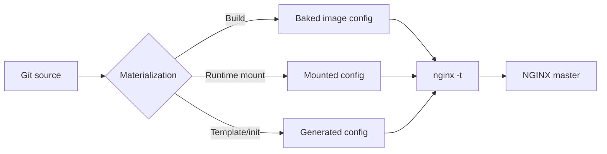
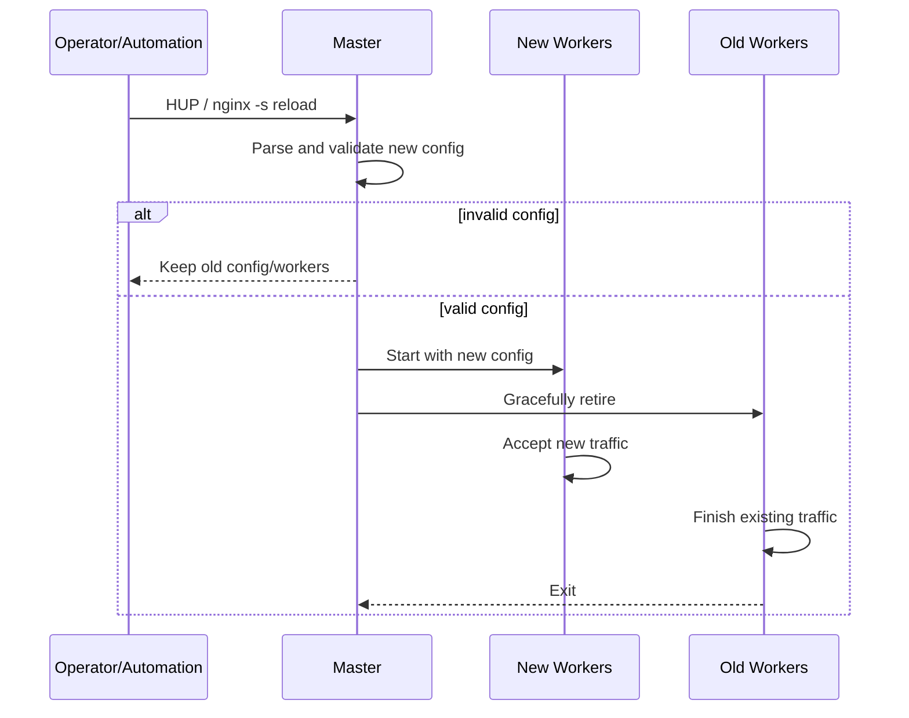
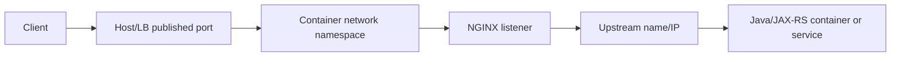
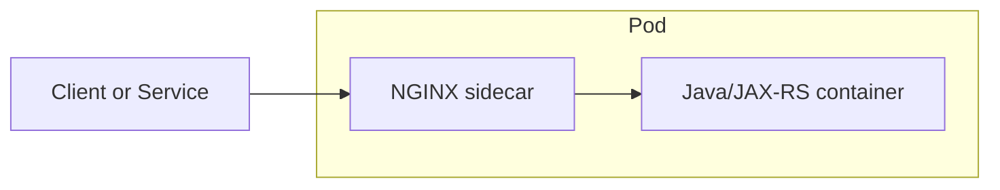
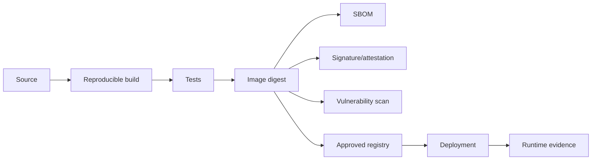

# Part 017 — Containerized NGINX: Image, Config, Signals, and Hardening

> **Depth level:** Intermediate  
> **Prerequisite:** Part 003, 015, dan 016; dasar Docker/container runtime, Linux process, filesystem permission, dan networking.  
> **Scope:** image selection, supply-chain contract, Dockerfile, entrypoint, config materialization, environment substitution, PID 1, signals, graceful shutdown/reload, health checks, non-root runtime, read-only filesystem, writable paths, logs, resource limits, networking, sidecar/init-container patterns, Docker Compose testing, security hardening, observability, dan debugging.  
> **Bukan scope utama:** Ingress-controller reconciliation dan Kubernetes Ingress API—Part 018–020; complete Kubernetes rollout strategy—Part 030; generic Docker tutorial; exact CSG image registry, base image, UID, policy, atau runtime standard yang belum diverifikasi.

---

## Daftar isi

1. [Tujuan pembelajaran](#tujuan-pembelajaran)
2. [Executive mental model](#executive-mental-model)
3. [Container bukan virtual machine kecil](#container-bukan-virtual-machine-kecil)
4. [Empat kontrak runtime](#empat-kontrak-runtime)
5. [Container lifecycle end-to-end](#container-lifecycle-end-to-end)
6. [Image families dan product boundaries](#image-families-dan-product-boundaries)
7. [Tag bukan immutable identity](#tag-bukan-immutable-identity)
8. [Digest pinning dan provenance](#digest-pinning-dan-provenance)
9. [Stable versus mainline](#stable-versus-mainline)
10. [Debian versus Alpine](#debian-versus-alpine)
11. [Privileged versus unprivileged image](#privileged-versus-unprivileged-image)
12. [Custom modules dan ABI risk](#custom-modules-dan-abi-risk)
13. [Minimal custom image](#minimal-custom-image)
14. [Build-time versus run-time responsibility](#build-time-versus-run-time-responsibility)
15. [Entrypoint lifecycle](#entrypoint-lifecycle)
16. [`/docker-entrypoint.d`](#docker-entrypointd)
17. [Environment substitution](#environment-substitution)
18. [`envsubst` limitations](#envsubst-limitations)
19. [Configuration materialization patterns](#configuration-materialization-patterns)
20. [Baked config](#baked-config)
21. [Mounted config](#mounted-config)
22. [Generated config](#generated-config)
23. [Config precedence and drift](#config-precedence-and-drift)
24. [Secret materialization](#secret-materialization)
25. [Startup validation](#startup-validation)
26. [Rendered-config inspection](#rendered-config-inspection)
27. [Configuration checksum](#configuration-checksum)
28. [PID 1 and process ownership](#pid-1-and-process-ownership)
29. [NGINX master and worker processes](#nginx-master-and-worker-processes)
30. [Signals](#signals)
31. [Graceful versus fast shutdown](#graceful-versus-fast-shutdown)
32. [Docker stop semantics](#docker-stop-semantics)
33. [Graceful reload in a container](#graceful-reload-in-a-container)
34. [Reload safety invariants](#reload-safety-invariants)
35. [Long-lived connections during shutdown](#long-lived-connections-during-shutdown)
36. [Health-check mental model](#health-check-mental-model)
37. [Startup, readiness, dan liveness](#startup-readiness-dan-liveness)
38. [Bad health-check patterns](#bad-health-check-patterns)
39. [Non-root runtime](#non-root-runtime)
40. [Low ports and capabilities](#low-ports-and-capabilities)
41. [Filesystem ownership](#filesystem-ownership)
42. [Read-only root filesystem](#read-only-root-filesystem)
43. [Writable paths](#writable-paths)
44. [Temporary files and cache](#temporary-files-and-cache)
45. [Linux capabilities](#linux-capabilities)
46. [Seccomp, AppArmor, dan SELinux](#seccomp-apparmor-dan-selinux)
47. [Container resource controls](#container-resource-controls)
48. [CPU limits and throttling](#cpu-limits-and-throttling)
49. [Memory and OOM](#memory-and-oom)
50. [Ephemeral storage](#ephemeral-storage)
51. [File descriptor limits](#file-descriptor-limits)
52. [Logs to stdout/stderr](#logs-to-stdoutstderr)
53. [Log rotation and backpressure](#log-rotation-and-backpressure)
54. [Networking mental model](#networking-mental-model)
55. [Docker bridge networking](#docker-bridge-networking)
56. [`localhost` inside a container](#localhost-inside-a-container)
57. [DNS and service discovery](#dns-and-service-discovery)
58. [Published ports](#published-ports)
59. [Host networking](#host-networking)
60. [IPv4 and IPv6 behavior](#ipv4-and-ipv6-behavior)
61. [Standalone reverse-proxy pattern](#standalone-reverse-proxy-pattern)
62. [Sidecar pattern](#sidecar-pattern)
63. [When a sidecar is justified](#when-a-sidecar-is-justified)
64. [Sidecar anti-patterns](#sidecar-anti-patterns)
65. [Init-container pattern](#init-container-pattern)
66. [Config-reloader sidecar](#config-reloader-sidecar)
67. [Java/JAX-RS sidecar contract](#javajax-rs-sidecar-contract)
68. [Docker Compose reference lab](#docker-compose-reference-lab)
69. [Security hardening baseline](#security-hardening-baseline)
70. [Supply-chain controls](#supply-chain-controls)
71. [Observability contract](#observability-contract)
72. [Failure-mode catalogue](#failure-mode-catalogue)
73. [Debugging playbook](#debugging-playbook)
74. [Validation and test matrix](#validation-and-test-matrix)
75. [PR review checklist](#pr-review-checklist)
76. [Internal verification checklist](#internal-verification-checklist)
77. [Hands-on exercises](#hands-on-exercises)
78. [Ringkasan invariants](#ringkasan-invariants)
79. [Referensi resmi](#referensi-resmi)

---

## Tujuan pembelajaran

Setelah menyelesaikan part ini, Anda harus mampu:

1. menjelaskan perbedaan antara **image**, **container**, **NGINX process**, dan **runtime configuration**;
2. memilih image family berdasarkan support, modules, libc, patching, dan non-root requirement;
3. membangun image/runtime contract yang reproducible, observable, dan dapat divalidasi;
4. menjelaskan bagaimana official image entrypoint dapat memodifikasi config sebelum NGINX dimulai;
5. menentukan apakah config sebaiknya di-bake, di-mount, atau di-generate;
6. mengoperasikan NGINX sebagai PID 1 dengan signal lifecycle yang benar;
7. membedakan graceful reload, graceful shutdown, fast shutdown, dan forced kill;
8. membuat health check yang tidak menghasilkan restart loop atau false readiness;
9. menjalankan NGINX sebagai non-root dengan read-only root filesystem;
10. menghitung writable paths, temp-file capacity, memory, CPU, FD, dan connection implications;
11. menilai kapan sidecar NGINX memberi nilai dan kapan hanya menambah hop;
12. men-debug permission error, missing config, bad template, signal loss, crash loop, OOM, dan networking issue;
13. mereview Dockerfile, runtime manifest, dan container security posture secara production-oriented;
14. menyusun **Internal verification checklist** tanpa mengarang standard internal CSG.

---

## Executive mental model

Containerized NGINX bukan sekadar:

```text
docker run nginx
```

Ia adalah gabungan empat kontrak:

```text
Image contract
  + configuration contract
  + process/signal contract
  + runtime resource/security contract
  = production behavior
```

Sebuah config yang benar pada VM dapat gagal di container karena:

- NGINX bukan PID 1;
- signal berhenti pada shell wrapper;
- container berjalan non-root;
- port `80` tidak dapat di-bind;
- root filesystem read-only;
- `/var/cache/nginx` tidak writable;
- config di-mount menutupi file bawaan image;
- `envsubst` menghasilkan empty value;
- secret belum tersedia saat startup;
- CPU quota lebih kecil dari CPU yang terlihat;
- temp file memenuhi ephemeral storage;
- liveness probe me-restart process yang sebenarnya sehat;
- stop timeout lebih pendek daripada connection-drain time.

### Core proposition

> Image yang aman tetapi runtime contract yang salah tetap menghasilkan sistem yang rapuh.

---

## Container bukan virtual machine kecil

Container berbagi kernel host dan mengisolasi process menggunakan namespaces, cgroups, filesystem layers, dan security controls.

Implikasinya untuk NGINX:

| Area | VM/bare metal expectation | Container reality |
|---|---|---|
| PID | init system dapat mengelola process | entrypoint/process utama biasanya PID 1 |
| filesystem | writable dan persistent | ephemeral layer, sering read-only |
| logs | file + logrotate | stdout/stderr + runtime collector |
| CPU | host CPU terlihat dan tersedia | cgroup quota dapat lebih kecil |
| memory | swap/host behavior | hard limit dapat menyebabkan OOM kill |
| network | host interface langsung | namespace, bridge/CNI, NAT, port publish |
| config | file lokal | baked image, bind mount, ConfigMap, template |
| secret | filesystem/keystore | mounted secret, injected file, external agent |
| lifecycle | service manager | runtime/orchestrator signal + grace period |

NGINX tetap menggunakan Linux semantics. Container tidak menghapus kebutuhan memahami:

- process tree;
- signals;
- file descriptors;
- socket backlog;
- filesystem permission;
- DNS;
- temporary files;
- kernel limits.

---

## Empat kontrak runtime

### 1. Image contract

Menentukan:

- NGINX version;
- OS base;
- modules;
- package provenance;
- entrypoint scripts;
- default user;
- exposed ports;
- stop signal;
- filesystem layout.

### 2. Configuration contract

Menentukan:

- source config;
- rendering mechanism;
- environment inputs;
- secrets;
- validation;
- reload trigger;
- drift detection.

### 3. Process contract

Menentukan:

- PID 1;
- foreground mode;
- signal forwarding;
- worker lifecycle;
- shutdown semantics;
- termination deadline.

### 4. Runtime contract

Menentukan:

- UID/GID;
- capabilities;
- ports;
- writable paths;
- CPU/memory/ephemeral storage;
- FD limit;
- probes;
- logging;
- network policy.

PR review harus mengevaluasi keempatnya. Mereview Dockerfile saja tidak cukup.

---

## Container lifecycle end-to-end

```mermaid
sequenceDiagram
    participant R as Container Runtime
    participant E as Entrypoint
    participant V as Config Validator
    participant M as NGINX Master
    participant W as NGINX Workers
    participant O as Orchestrator

    R->>E: Start container
    E->>E: Read env / mounted files
    E->>E: Execute entrypoint.d scripts
    E->>E: Render templates
    E->>V: nginx -t
    alt invalid config
        V-->>R: Non-zero exit
        R-->>O: Container failed
    else valid config
        E->>M: exec nginx -g 'daemon off;'
        M->>W: Start workers
        O->>M: Health/readiness probes
        O->>M: Stop signal
        M->>W: Drain or terminate
        W-->>M: Exit
        M-->>R: Exit status
    end
```

### Lifecycle invariants

1. Config harus valid **sebelum** process menerima production traffic.
2. Process utama harus menerima signal runtime secara langsung atau melalui forwarding yang terbukti.
3. Readiness tidak boleh true sebelum listener dan critical config siap.
4. Shutdown grace period harus mengakomodasi active connection yang benar-benar ingin dipertahankan.
5. Forced kill harus menjadi fallback, bukan normal path.

---

## Image families dan product boundaries

Jangan menyamakan seluruh image yang memuat nama “NGINX”.

| Image family | Isi/tujuan | Hal yang harus diverifikasi |
|---|---|---|
| Docker Official Image `nginx` | NGINX Open Source packaged for containers | tag, digest, base distro, modules, entrypoint scripts |
| NGINX unprivileged image | runtime non-root, port/layout disesuaikan | repository ownership, UID, port, writable dirs, support policy |
| F5 NGINX Plus image | commercial runtime | entitlement, registry, version, modules, support matrix |
| F5 NGINX Ingress Controller image | controller + NGINX data plane | controller version, Kubernetes compatibility, product edition |
| NGINX Gateway Fabric image | Gateway API implementation | Gateway API compatibility and lifecycle |
| community/third-party image | vendor-specific packaging | provenance, patches, modules, support, CVE lifecycle |
| internal hardened image | organization-maintained derivative | patch SLA, rebuild automation, SBOM, ownership |

### Rule

> Image name alone tidak membuktikan product capability.

Contoh kesalahan:

- mengira Open Source image memiliki NGINX Plus API;
- mengira standalone image dapat menjadi Ingress Controller tanpa controller binary;
- mengira module tersedia hanya karena directive ditemukan di internet;
- mengira third-party “unprivileged” image memiliki lifecycle yang sama dengan official image.

---

## Tag bukan immutable identity

Tag seperti:

```text
nginx:stable
nginx:mainline
nginx:alpine
nginx:latest
```

adalah pointer yang dapat berubah.

### Risks

- rebuild pada hari berbeda menghasilkan bytes berbeda;
- environment A dan B memakai digest berbeda meskipun tag sama;
- rollback tidak deterministik;
- vulnerability evidence tidak dapat dikaitkan ke artifact pasti;
- module/base package dapat berubah tanpa perubahan repository Anda.

### Production rule

Gunakan:

1. human-readable version tag;
2. immutable digest;
3. automated update process;
4. recorded SBOM/provenance.

Contoh konsep:

```dockerfile
# Digest hanya contoh bentuk. Nilai aktual wajib berasal dari registry terpercaya.
FROM nginx:1.x.y-alpine@sha256:<verified-digest>
```

Jangan menyalin placeholder ke production.

---

## Digest pinning dan provenance

Digest pinning menyelesaikan **identity**, bukan seluruh supply-chain risk.

Masih perlu memverifikasi:

- siapa publisher-nya;
- bagaimana image dibangun;
- apakah signature diverifikasi;
- apakah base packages masih supported;
- apakah CVE scan terkini;
- apakah artifact direbuild setelah security fix;
- apakah custom module kompatibel;
- apakah registry mirror mengganti metadata/policy;
- apakah internal promotion mempertahankan digest.

### Recommended evidence

```text
source repository
  -> build pipeline
  -> image digest
  -> SBOM
  -> signature/attestation
  -> vulnerability scan
  -> environment deployment record
```

### Internal verification checklist marker

Nilai digest, approved registry, signature tool, CVE severity threshold, dan patch SLA adalah **Internal verification checklist**.

---

## Stable versus mainline

Nama channel tidak boleh dipakai sebagai substitusi untuk support policy.

Pertanyaan yang benar:

- version mana yang ditetapkan organization;
- security fix tersedia di branch mana;
- module/vendor support matrix apa;
- kapan rebuild dilakukan;
- bagaimana upgrade diuji;
- apakah breaking behavior antara versions tercakup regression suite.

### Decision lens

| Concern | Stable channel | Mainline channel |
|---|---|---|
| feature availability | lebih konservatif | lebih cepat |
| operational change rate | cenderung lebih rendah | cenderung lebih tinggi |
| security posture | tetap membutuhkan patch tracking | tetap membutuhkan patch tracking |
| module compatibility | harus diuji | harus diuji lebih ketat |

Tidak ada channel yang otomatis “aman” tanpa patch governance.

---

## Debian versus Alpine

Pemilihan base distro memengaruhi:

- libc (`glibc` versus `musl`);
- package/debug tooling;
- image size;
- DNS/runtime edge cases;
- module binary compatibility;
- scanner findings;
- organization support familiarity;
- incident-debugging ergonomics.

### Anti-pattern

Memilih Alpine hanya karena image lebih kecil, tanpa mengukur:

- operational support;
- custom module compatibility;
- package availability;
- TLS/crypto package lifecycle;
- debug capability;
- actual transfer/storage benefit.

### Better principle

> Pilih base yang paling kecil **yang masih memenuhi supportability dan diagnostics requirement**, bukan image paling kecil secara absolut.

---

## Privileged versus unprivileged image

Istilah “unprivileged” biasanya berarti:

- process berjalan sebagai non-root;
- listener menggunakan unprivileged port, sering `8080`;
- PID/cache/temp/config paths disesuaikan;
- ownership telah dipreparasi.

Tetapi jangan berasumsi. Periksa:

```bash
docker image inspect <image>
docker run --rm <image> id
docker run --rm <image> nginx -V
docker run --rm <image> nginx -T
```

### Important distinction

- image dapat memiliki `USER nginx`;
- runtime dapat override user;
- Kubernetes `runAsUser` dapat berbeda;
- mounted volume permission dapat membuat image yang semula valid gagal;
- arbitrary UID policy dapat memerlukan group-writable paths.

---

## Custom modules dan ABI risk

Dynamic module bukan sekadar file `.so` yang dapat dipindah antarimage.

Compatibility bergantung pada:

- NGINX version;
- compile options;
- module source version;
- OS/libc;
- linked libraries;
- architecture;
- build flags;
- module signature/ABI compatibility.

### Failure signature

```text
module is not binary compatible
unknown directive
cannot open shared object file
symbol lookup error
```

### Safe pattern

1. build module dalam controlled build stage;
2. gunakan compatible source/version;
3. copy exact artifact and dependencies;
4. run `nginx -t` during build;
5. run runtime smoke test;
6. publish SBOM;
7. pin image digest.

### Avoid

- downloading module binary at container startup;
- `apk add`/`apt install` saat startup;
- copying `.so` from unrelated image;
- silently ignoring failed `load_module`.

---

## Minimal custom image

```dockerfile
# syntax=docker/dockerfile:1

# Replace with an internally approved, digest-pinned reference.
FROM nginx:<verified-version>@sha256:<verified-digest>

COPY --chown=nginx:nginx nginx.conf /etc/nginx/nginx.conf
COPY --chown=nginx:nginx conf.d/ /etc/nginx/conf.d/

# Validate static configuration during image build.
RUN nginx -t

# Keep the image's exec-form entrypoint/CMD unless there is a proven reason
# to replace it. Verify the actual image metadata in CI.
```

### Why minimal

Setiap package tambahan menambah:

- CVE surface;
- patch responsibility;
- image size;
- ambiguity;
- possible shell/runtime abuse.

### But do not remove operational essentials blindly

Distroless-like reduction dapat menghilangkan:

- shell used by entrypoint scripts;
- CA certificates;
- timezone data;
- DNS/debug tools;
- required shared libraries.

Production image dan debug image dapat dipisahkan.

---

## Build-time versus run-time responsibility

| Task | Prefer build time | Prefer runtime |
|---|---:|---:|
| install NGINX/module/package | yes | no |
| copy static config schema | yes | optional |
| template environment values | optional | yes when required |
| fetch dynamic secret | no | yes via approved mechanism |
| compile module | yes | no |
| `nginx -t` | yes and runtime | yes |
| mutate package repository | yes | no |
| vulnerability scan | yes | continuous |
| download arbitrary binary | no | no |

### Invariant

> Runtime startup harus sesederhana dan sedeterministik mungkin.

---

## Entrypoint lifecycle

Docker Official Image NGINX saat ini menggunakan an entrypoint dan script directory. Image version tertentu dapat menjalankan scripts untuk:

- IPv6 default-listen behavior;
- local resolver discovery;
- template processing with `envsubst`;
- worker-process tuning.

Exact scripts dapat berubah antarversion.

Periksa:

```bash
docker run --rm --entrypoint sh <image> -c \
  'ls -la /docker-entrypoint.d && sed -n "1,240p" /docker-entrypoint.sh'
```

### Why this matters

Rendered runtime config mungkin berbeda dari repository file karena:

```text
repository template
  + image entrypoint scripts
  + environment variables
  + mounted config
  = actual NGINX config
```

Mereview template saja tidak cukup.

---

## `/docker-entrypoint.d`

Script directory adalah extension point yang kuat sekaligus berisiko.

### Good uses

- deterministic template rendering;
- permission/precondition checks;
- CA bundle preparation from approved files;
- generated include file;
- runtime validation;
- explicit logging of config fingerprint.

### Bad uses

- downloading binaries from internet;
- contacting uncontrolled endpoints;
- applying package updates;
- infinite retry waiting for dependencies;
- logging secrets;
- modifying config nondeterministically;
- starting background daemons then losing signal ownership.

### Ordering

Script filename ordering matters. For example:

```text
10-prepare-directories.sh
20-render-templates.sh
30-validate-secrets.sh
40-print-config-fingerprint.sh
```

But actual entrypoint execution rules must be verified from the selected image.

---

## Environment substitution

Template pattern:

```nginx
upstream backend {
    server ${BACKEND_HOST}:${BACKEND_PORT};
}

server {
    listen ${LISTEN_PORT};
    location /api/ {
        proxy_pass http://backend;
    }
}
```

Potential runtime command:

```bash
envsubst '${BACKEND_HOST} ${BACKEND_PORT} ${LISTEN_PORT}' \
  < /etc/nginx/templates/default.conf.template \
  > /etc/nginx/conf.d/default.conf
```

### Prefer explicit variable allowlist

Without an allowlist, `envsubst` may replace strings that are intended as NGINX variables.

Example risk:

```nginx
proxy_set_header X-Request-ID $request_id;
```

A generic `envsubst` invocation can interpret `$request_id` as an environment variable and replace it with empty text.

Use explicit shell-variable list and test rendered output.

---

## `envsubst` limitations

`envsubst` is text substitution, not a configuration language.

It does not provide robust:

- required-variable validation;
- types;
- escaping;
- nested default expressions;
- schema validation;
- secret masking;
- conditional blocks;
- safe quoting for every NGINX context.

### Failure examples

| Input issue | Rendered result | Production impact |
|---|---|---|
| missing port | `listen ;` | startup failure |
| empty host | `server :8080;` | invalid config |
| value contains `;` | directive injection possibility | config/security risk |
| NGINX variable replaced | header/log behavior broken | observability/security issue |
| boolean string mismatch | wrong branch/config | behavior drift |

### Better startup validation

```sh
: "${BACKEND_HOST:?BACKEND_HOST is required}"
: "${BACKEND_PORT:?BACKEND_PORT is required}"

case "$BACKEND_PORT" in
  *[!0-9]*|'') echo "invalid BACKEND_PORT" >&2; exit 1 ;;
esac
```

Treat environment values as untrusted configuration inputs.

---

## Configuration materialization patterns

There are three primary patterns.



Each pattern optimizes a different concern.

---

## Baked config

Config is copied into the image.

### Advantages

- immutable artifact;
- digest identifies binary + config;
- simple rollback;
- easy local reproduction;
- no mount ordering dependency;
- startup faster and deterministic.

### Costs

- environment-specific image rebuilds if values differ;
- secret must not be baked;
- config-only changes require image promotion;
- shared platform config may duplicate across services.

### Suitable when

- topology/config is stable;
- same artifact promoted with minimal environment differences;
- config change should follow application release governance.

---

## Mounted config

Config comes from bind mount, Docker volume, ConfigMap, or secret volume.

### Advantages

- config can change independently;
- platform ownership can be centralized;
- environment-specific values remain outside image.

### Costs

- mounted directory may hide image defaults;
- permissions/ownership may differ;
- runtime artifact is image + external files;
- rollback requires coordinated versioning;
- mount update and NGINX reload are separate events;
- config can drift from image-tested version.

### Directory masking trap

Mounting a directory on `/etc/nginx` hides the image's entire directory contents.

Prefer mounting specific files or a complete intentionally managed tree.

---

## Generated config

Template or structured input is rendered during startup/init.

### Advantages

- same image across environments;
- values injected late;
- can integrate secret/endpoint discovery.

### Costs

- startup becomes a compiler pipeline;
- debugging requires rendered artifact;
- missing/unsafe inputs can break production;
- generation tool becomes critical dependency;
- config identity is harder unless fingerprinted.

### Required controls

- schema/input validation;
- deterministic rendering;
- atomic file write;
- `nginx -t`;
- rendered-config fingerprint;
- secret redaction;
- failure must stop startup.

---

## Config precedence and drift

Actual config can be affected by:

1. image `/etc/nginx/nginx.conf`;
2. `include` graph;
3. mounted files;
4. generated files;
5. environment substitutions;
6. runtime command-line `-g` directives;
7. controller-generated config;
8. dynamic module loading.

### Evidence commands

```bash
nginx -V
nginx -T
ps -ef
cat /proc/1/cmdline | tr '\0' ' '
mount
find /etc/nginx -maxdepth 3 -type f -print
sha256sum /etc/nginx/nginx.conf /etc/nginx/conf.d/*
```

### Invariant

> `nginx -T` from the running artifact is stronger evidence than a repository snippet.

Redact secrets before storing or sharing output.

---

## Secret materialization

Secrets may include:

- TLS private keys;
- upstream client certificates;
- basic-auth files;
- API credentials used by auth modules;
- private CA bundles;
- encrypted key passwords.

### Never

- bake production secrets into image layers;
- pass secrets in command line;
- print rendered secrets to logs;
- expose secrets through `nginx -T` artifact without controls;
- copy broad secret directories unnecessarily;
- use world-readable file permissions.

### Prefer

- file mount from approved secret mechanism;
- least-privilege file mode;
- dedicated path;
- controlled owner/group;
- rotation workflow;
- atomic replacement;
- reload after successful validation;
- auditability.

### Environment-variable caveat

Environment variables can be visible through:

- process inspection;
- crash dumps;
- orchestrator/API metadata;
- debug tooling;
- accidental logging.

Use them only according to organization secret policy.

---

## Startup validation

Minimum startup gate:

```sh
set -eu

# Validate required files.
test -r /etc/nginx/nginx.conf
test -r /etc/nginx/tls/tls.crt
test -r /etc/nginx/tls/tls.key

# Validate configuration syntax and file references.
nginx -t

# Replace shell so nginx becomes PID 1.
exec nginx -g 'daemon off;'
```

### Validate more than syntax

`nginx -t` validates syntax and referenced-file access. It does not prove:

- upstream is reachable;
- certificate matches expected hostname;
- route behavior is correct;
- resolver works;
- writable temp dirs have capacity;
- auth service is healthy;
- external LB routing is correct.

Use staged smoke tests for those.

---

## Rendered-config inspection

Provide an approved diagnostic path to inspect:

- NGINX version/build flags;
- rendered configuration;
- loaded modules;
- file ownership;
- environment-safe configuration fingerprint;
- current master/worker PIDs.

Examples:

```bash
docker exec <container> nginx -V
docker exec <container> nginx -T
docker exec <container> nginx -t
docker exec <container> ps -ef
```

For hardened production images without shell/tools, use:

- ephemeral debug container;
- controlled diagnostic image;
- runtime namespace attachment;
- exported config artifact from CI;
- dedicated safe admin endpoint where approved.

Do not weaken production image permanently just to make ad hoc debugging easy.

---

## Configuration checksum

A checksum helps answer:

> Are two replicas running the same effective config?

Possible approach:

```bash
nginx -T 2>&1 \
  | sed '/sensitive-pattern/d' \
  | sha256sum
```

But naive hashing can include:

- absolute paths;
- timestamps;
- secret values;
- nondeterministic ordering.

Design a stable, secret-safe fingerprint in CI or generator.

### Useful labels/metrics

- image digest;
- config revision;
- config checksum;
- deployment revision;
- NGINX version;
- module set.

---

## PID 1 and process ownership

In a container, the main process is PID 1.

PID 1 has special responsibilities:

- receives runtime stop signal;
- must reap orphaned children;
- determines container exit status;
- may have different default signal handling.

### Good

```dockerfile
CMD ["nginx", "-g", "daemon off;"]
```

or entrypoint ending with:

```sh
exec "$@"
```

### Bad

```dockerfile
CMD nginx -g 'daemon off;'
```

when shell semantics or wrapper behavior prevents correct forwarding.

Also bad:

```sh
nginx -g 'daemon off;' &
wait
```

unless the wrapper deliberately and correctly forwards all signals and reaps children.

---

## NGINX master and worker processes

Container typically runs:

```text
PID 1  nginx: master process
  ├─ worker process
  ├─ worker process
  └─ optional helper/cache processes
```

The master process:

- owns configuration lifecycle;
- opens listeners;
- starts workers;
- handles signals;
- validates/reloads config;
- coordinates graceful shutdown.

Workers:

- process client/upstream traffic;
- maintain active connections;
- exit after drain during graceful shutdown/reload.

### Why `daemon off;`

If NGINX daemonizes and parent exits, the container runtime may consider the container finished. Run in foreground.

---

## Signals

Core NGINX signal semantics:

| Signal | Meaning | Operational use |
|---|---|---|
| `HUP` | reload configuration, reopen logs, start new workers, gracefully retire old workers | config/certificate reload |
| `QUIT` | graceful shutdown | planned container stop |
| `TERM` / `INT` | fast shutdown | emergency/less graceful stop |
| `USR1` | reopen log files | external log rotation |
| `USR2` | executable upgrade sequence | uncommon in immutable containers |
| `WINCH` | gracefully shut down worker processes | specialized maintenance |
| `KILL` | kernel-forced immediate termination | final fallback only |

### Command examples

```bash
nginx -s reload
nginx -s quit
kill -HUP 1
kill -QUIT 1
```

Use the actual master PID when PID 1 is not NGINX—but that topology should be intentional.

---

## Graceful versus fast shutdown

### Graceful shutdown

- stop accepting new connections;
- allow active requests/connections to complete;
- workers exit after drain;
- bounded by external runtime grace period.

### Fast shutdown

- workers are asked to exit quickly;
- active connections may terminate;
- clients can observe reset/5xx/partial responses.

### Forced kill

- no application cleanup;
- sockets disappear immediately;
- logs/buffers may be lost;
- container exits with forced termination.

### Production objective

Normal rollout path should be:

```text
remove from new traffic
  -> send graceful signal
  -> drain bounded work
  -> exit cleanly
  -> forced kill only if deadline exceeded
```

---

## Docker stop semantics

Docker stop signal comes from:

1. runtime override `--stop-signal`;
2. image `STOPSIGNAL`;
3. default `SIGTERM` if none defined.

Current official NGINX Dockerfile templates define `STOPSIGNAL SIGQUIT`, but the selected image metadata must still be inspected.

```bash
docker image inspect <image> \
  --format '{{json .Config.StopSignal}}'
```

Docker waits for the configured stop timeout, then sends `SIGKILL`.

### Test

```bash
docker run --name nginx-test -d -p 8080:80 <image>
docker stop --time 30 nginx-test
docker inspect nginx-test --format '{{.State.ExitCode}}'
```

Generate active/slow traffic while testing, not only idle shutdown.

---

## Graceful reload in a container

Reload sequence:



### Reload is not automatically safe

A syntactically valid config can still:

- route to wrong upstream;
- remove required header;
- introduce redirect loop;
- load invalid certificate semantics;
- exhaust memory;
- disable authentication;
- break streaming;
- change route precedence.

Use canary/smoke/observability gates.

---

## Reload safety invariants

1. Write generated config atomically.
2. Run `nginx -t` before `HUP`.
3. Keep last-known-good config.
4. Ensure concurrent generators cannot interleave writes.
5. Record revision/checksum.
6. Observe reload success/failure.
7. Verify new workers exist.
8. Verify old workers eventually exit.
9. Bound `worker_shutdown_timeout` where appropriate.
10. Test live route semantics after reload.

### Atomic write pattern

```sh
render > /etc/nginx/conf.d/app.conf.new
nginx -t -c /etc/nginx/nginx.conf
mv /etc/nginx/conf.d/app.conf.new /etc/nginx/conf.d/app.conf
nginx -t
nginx -s reload
```

The first `nginx -t` may not reference `.new`; a robust generator should validate a complete staged config tree, not only a detached file.

---

## Long-lived connections during shutdown

WebSocket, SSE, long polling, large upload/download, and streaming responses can keep old workers alive.

Trade-off:

- unlimited graceful drain can block rollout indefinitely;
- short grace period causes connection resets;
- forced termination may be acceptable only with client reconnect semantics.

### Questions

- What is maximum expected connection lifetime?
- Can client reconnect safely?
- Is state resumable?
- Is connection sticky?
- Does upstream Java pod terminate earlier than NGINX?
- Does load balancer stop sending new connections first?
- Is shutdown timeout observable?

Set values from product behavior, not arbitrary defaults.

---

## Health-check mental model

A health check answers a specific question.

| Probe | Question |
|---|---|
| process check | is NGINX process alive? |
| listener check | is socket accepting? |
| config check | is effective config valid? |
| readiness check | should this instance receive new traffic? |
| dependency check | can required backend be reached? |
| end-to-end check | does a representative route work? |

One probe should not pretend to answer all questions.

### Health endpoint example

```nginx
server {
    listen 8081;

    location = /healthz {
        access_log off;
        default_type text/plain;
        return 200 "ok\n";
    }
}
```

Protect admin/health listeners from public exposure.

---

## Startup, readiness, dan liveness

### Startup

Use when initialization/rendering can take time. It protects against premature liveness failure.

### Readiness

False means:

> Do not send new traffic to this instance.

It should fail when:

- listener/config not ready;
- instance is draining;
- critical local state invalid;
- controller has not produced usable config.

### Liveness

False means:

> Restarting this process is likely to improve recovery.

Liveness should not fail merely because:

- one backend is unavailable;
- DNS temporarily fails;
- an optional dependency is down;
- a customer route returns 5xx;
- the instance is overloaded but still progressing.

Otherwise, load spikes can produce restart storms.

---

## Bad health-check patterns

### Pattern 1 — health check proxies to application

```nginx
location /health {
    proxy_pass http://java_backend/health;
}
```

If used as NGINX liveness:

```text
Java outage -> NGINX liveness fails -> NGINX restarts -> no improvement
```

### Pattern 2 — public health endpoint

Leaks topology/version/status and expands attack surface.

### Pattern 3 — probe creates access-log flood

Use `access_log off` or dedicated sampling where appropriate.

### Pattern 4 — probe requires DNS/upstream on every second

May amplify dependency incidents.

### Pattern 5 — probe only checks PID

Process may exist while config/listener is unusable.

Use separate local liveness and traffic readiness semantics.

---

## Non-root runtime

Running non-root limits impact of process compromise, but requires a complete filesystem/port design.

Check:

- master user;
- worker user directive behavior;
- listener ports;
- PID file path;
- temp directories;
- cache directories;
- log destinations;
- config and key readability;
- dynamic module readability;
- DNS resolver files;
- mounted-volume ownership.

### Runtime test

```bash
docker run --rm --user 101:101 <image> nginx -t
```

This test may still differ from Kubernetes arbitrary UID or group settings.

---

## Low ports and capabilities

Ports below 1024 traditionally require privilege/capability.

Options:

1. listen on `8080/8443` in container and map externally;
2. grant only `CAP_NET_BIND_SERVICE`;
3. use platform support for unprivileged low ports where approved;
4. keep root master then drop worker privileges—less preferred in hardened container environments.

### Prefer

```text
external 80/443
  -> runtime/LB mapping
  -> container 8080/8443 as non-root
```

### Avoid

- broad `privileged: true`;
- adding all capabilities;
- root solely for port 80;
- assuming `EXPOSE 80` grants permission.

`EXPOSE` is metadata, not a listener or firewall rule.

---

## Filesystem ownership

Permissions must account for:

- image-layer ownership;
- runtime UID/GID;
- mounted-volume ownership;
- root-squash/network filesystem semantics;
- arbitrary UID policy;
- supplemental groups;
- secret volume file mode.

### Diagnose

```bash
id
namei -l /etc/nginx/nginx.conf
namei -l /etc/nginx/tls/tls.key
namei -l /var/cache/nginx
stat -c '%U %G %a %n' <path>
```

### Common failure

```text
nginx: [emerg] open() "/var/run/nginx.pid" failed (13: Permission denied)
```

Fix path/ownership. Do not reflexively switch to root.

---

## Read-only root filesystem

A read-only root filesystem prevents runtime mutation of image layers.

NGINX may still need writable locations for:

- PID file;
- client body temp;
- proxy temp;
- FastCGI/uWSGI/SCGI temp if used;
- cache;
- generated config;
- logs if not stdout/stderr.

### Strategy

1. make image root read-only;
2. mount only required writable dirs as tmpfs/volume;
3. size them;
4. set ownership;
5. monitor usage;
6. avoid writing generated config into read-only `/etc/nginx` unless mounted writable staging is intentional.

---

## Writable paths

Example conceptual layout:

```text
/etc/nginx                  read-only config
/etc/nginx/tls              read-only secret mount
/var/cache/nginx            writable temp/cache volume
/var/run                    writable tmpfs for PID
/tmp                        writable tmpfs if required
/dev/stdout /dev/stderr     logs
```

Config example:

```nginx
pid /tmp/nginx.pid;

http {
    client_body_temp_path /var/cache/nginx/client_temp;
    proxy_temp_path       /var/cache/nginx/proxy_temp;
}
```

Exact paths vary by image and must be inspected.

---

## Temporary files and cache

Buffering can spill request/response bodies to disk.

Container consequences:

- writable layer growth;
- ephemeral-storage eviction;
- node disk pressure;
- slow I/O;
- noisy-neighbor impact;
- data remanence concerns;
- unexpected OOM if converted to memory-backed tmpfs.

### Capacity model

```text
required temp capacity
≈ concurrent spilled payloads
× average spill size
× safety factor
```

But tail payload distribution matters more than average.

### Decide intentionally

- disk-backed `emptyDir`/volume;
- memory-backed tmpfs;
- request buffering off;
- response buffering off;
- direct object-storage upload/download;
- explicit max body size.

Refer to Part 010 for detailed buffering model.

---

## Linux capabilities

Baseline:

- drop all capabilities;
- add only proven requirement;
- disallow privilege escalation;
- non-root user;
- read-only root filesystem.

Conceptual Kubernetes snippet:

```yaml
securityContext:
  runAsNonRoot: true
  allowPrivilegeEscalation: false
  readOnlyRootFilesystem: true
  capabilities:
    drop: ["ALL"]
```

If binding low ports:

```yaml
capabilities:
  drop: ["ALL"]
  add: ["NET_BIND_SERVICE"]
```

Verify organization policy and actual kernel/runtime behavior.

---

## Seccomp, AppArmor, dan SELinux

These controls reduce syscall/filesystem attack surface.

### Seccomp

- use runtime-default or approved profile;
- test modules and TLS behavior;
- detect denied syscalls from audit logs.

### AppArmor/SELinux

- may block file reads, binds, module loads, or writes even when Unix mode bits look correct;
- mount labels matter;
- “permission denied” is not always `chmod` problem.

### Debugging order

1. path exists;
2. UID/GID/mode;
3. mount read-only status;
4. capabilities;
5. seccomp/AppArmor/SELinux denial;
6. rootless/user namespace mapping.

Never solve an LSM denial by disabling security globally without evidence.

---

## Container resource controls

Resource controls are part of NGINX behavior, not deployment decoration.

| Resource | Failure effect |
|---|---|
| CPU | throttling, handshake/compression latency, queue growth |
| memory | OOM kill, cache/buffer pressure |
| ephemeral storage | eviction, temp-file failure, node pressure |
| PID | inability to spawn workers/helpers |
| FD | accept/open failures |
| network bandwidth | throughput/latency constraints |

Requests/limits must derive from measured workload and N+1 scenario.

---

## CPU limits and throttling

NGINX may see host CPUs while cgroup quota allows less compute.

Effects:

- `worker_processes auto` may start more workers than useful;
- context switching increases;
- CPU throttling raises p99 latency;
- TLS/compression/logging amplify cost;
- average CPU metrics can hide throttled time.

Observe:

- CPU usage;
- throttled seconds/periods;
- run queue;
- request rate;
- p95/p99;
- handshake/compression mix.

Do not tune worker count solely from `/proc/cpuinfo`.

---

## Memory and OOM

Memory consumers include:

- worker processes;
- TLS state;
- connection buffers;
- proxy buffers;
- request buffers;
- caches;
- module state;
- resolver state;
- page cache;
- allocator fragmentation.

### OOM behavior

Container can be killed without NGINX emitting a graceful error.

Evidence:

```bash
docker inspect <container> --format '{{json .State}}'
# Kubernetes later:
kubectl describe pod <pod>
```

### Avoid

- using memory limit as primary flow-control mechanism;
- tmpfs without size budgeting;
- huge buffers copied from tuning blog;
- assuming RSS equals total memory pressure.

---

## Ephemeral storage

Disk-backed temp files and logs can trigger:

- container writable-layer exhaustion;
- pod eviction;
- node `DiskPressure`;
- failed writes;
- latency spikes.

Monitor:

- temp directory bytes/inodes;
- container filesystem usage;
- node disk pressure;
- spill rate;
- payload distribution;
- cache growth/eviction.

Set resource requests/limits where platform supports and test full-disk behavior.

---

## File descriptor limits

NGINX connection capacity is bounded by FD limits.

Container inherits/receives limits from runtime/host.

Inspect:

```bash
cat /proc/1/limits
ulimit -n
ls /proc/1/fd | wc -l
```

Remember:

- client socket uses FD;
- upstream socket uses FD;
- open log/cache/temp files use FD;
- idle keepalive connections use FD;
- workers have per-process limits.

`worker_connections` alone does not raise OS FD limit.

---

## Logs to stdout/stderr

Container logging convention:

```nginx
access_log /dev/stdout main_json;
error_log  /dev/stderr warn;
```

Benefits:

- runtime captures stream;
- central collector handles transport;
- no in-container log rotation;
- container remains ephemeral.

### Caveats

- logging can block or consume CPU;
- runtime log driver may rotate/drop;
- multiline error logs may parse poorly;
- stdout volume can fill node disk;
- sensitive data can be centralized accidentally.

Logging design remains part of capacity/security model.

---

## Log rotation and backpressure

If logging to files:

- rotate externally;
- send `USR1` to reopen logs;
- ensure ownership after rotation;
- monitor disk;
- avoid copytruncate when semantics are unacceptable.

If logging to stdout/stderr:

- configure runtime/agent rotation;
- know buffer and drop behavior;
- test collector outage;
- ensure log outage does not halt traffic unexpectedly;
- sample noisy successful traffic where appropriate.

### Failure question

> What happens to request processing when the log destination is slow or unavailable?

Test it.

---

## Networking mental model



Each arrow can involve:

- NAT;
- firewall;
- DNS;
- connection tracking;
- source-IP translation;
- different MTU;
- different address family.

---

## Docker bridge networking

On a user-defined bridge network, containers can usually resolve each other by service/container name.

Example:

```nginx
upstream java_backend {
    server app:8080;
}
```

Do not use dynamic container IPs manually.

### DNS caveat

NGINX resolution lifecycle depends on how hostname appears in config and selected NGINX version/directives. A container restart changing IP can leave stale resolution if topology/config is wrong. Part 025 covers DNS deeply.

---

## `localhost` inside a container

Inside NGINX container:

```text
localhost == NGINX container network namespace
```

It does not mean:

- host machine;
- Java container;
- another pod;
- cloud load balancer.

Exceptions:

- sidecar containers in the same Kubernetes Pod share network namespace;
- host networking changes namespace model.

### Common failure

```nginx
proxy_pass http://127.0.0.1:8080;
```

In Docker Compose with separate containers, this points back to NGINX itself, not Java.

---

## DNS and service discovery

Questions:

- Which resolver does container use?
- Is search domain involved?
- What is TTL?
- Does NGINX resolve once or dynamically?
- Does service name map to stable VIP or changing endpoints?
- What happens during DNS outage?
- Is IPv6 returned first?
- Is split-horizon DNS used?

Inspect:

```bash
cat /etc/resolv.conf
getent hosts app
nslookup app  # if tool exists
```

Use an ephemeral debug container when production image lacks tools.

---

## Published ports

Docker `EXPOSE` is documentation metadata.

Traffic requires runtime publish:

```bash
docker run -p 8080:80 nginx
```

Meaning:

```text
host port 8080 -> container port 80
```

Security concerns:

- default bind may expose on all host interfaces;
- host firewall rules matter;
- source IP can be NAT-transformed;
- port conflicts occur on host;
- publishing bypasses intended upstream proxy if misconfigured.

Bind explicitly where needed:

```bash
docker run -p 127.0.0.1:8080:8080 <image>
```

---

## Host networking

Host networking removes a layer of network isolation/NAT.

Potential benefits:

- lower complexity/latency;
- direct host ports;
- source-IP behavior may be simpler.

Costs:

- port conflicts;
- weaker isolation;
- larger blast radius;
- host-specific behavior;
- scaling constraints;
- security policy complexity.

Use only with a clear requirement and platform review.

---

## IPv4 and IPv6 behavior

Official entrypoint behavior may adjust default IPv6 listening depending on image scripts and filesystem permissions.

Verify effective listeners:

```bash
nginx -T | grep -n 'listen'
ss -lntp
```

Potential issues:

- IPv6-only listener;
- duplicate bind;
- resolver returns IPv6 unreachable upstream;
- cloud/LB health check uses different family;
- `localhost` maps unexpectedly;
- IPv6 source-key rate limiting differs.

Do not infer listener behavior from template alone.

---

## Standalone reverse-proxy pattern

```text
client/LB
   -> NGINX container
      -> one or more Java service containers
```

Suitable for:

- Docker Compose/local environment;
- simple VM container host;
- edge proxy with centralized policy;
- static upstream topology.

Ownership:

- NGINX has independent lifecycle;
- NGINX config can route multiple services;
- failure affects shared traffic;
- resource scaling independent from app.

---

## Sidecar pattern



Containers in same Kubernetes Pod share network namespace, so sidecar can proxy to:

```text
127.0.0.1:<java-port>
```

They do not automatically share filesystem or process namespace.

### Possible responsibilities

- local TLS termination/re-encryption;
- protocol adaptation;
- static assets;
- buffering/streaming policy;
- local auth integration;
- legacy path rewrite;
- per-workload observability.

---

## When a sidecar is justified

Use when the responsibility is truly workload-local and cannot be adequately handled by:

- shared ingress;
- API gateway;
- application code/library;
- service mesh;
- cloud load balancer;
- platform sidecar already present.

Evidence should show:

- clear owner;
- security boundary;
- independent config lifecycle;
- measurable operational benefit;
- acceptable resource/latency cost;
- defined failure behavior.

### Examples

- legacy Java server cannot handle required TLS/protocol behavior;
- local static/download offload significantly reduces Java work;
- strict per-pod loopback-only app exposure is required;
- a vendor app requires fixed local proxy contract.

---

## Sidecar anti-patterns

### Anti-pattern 1 — duplicate shared ingress

Both ingress and sidecar perform the same:

- TLS;
- auth;
- rate limit;
- rewrite;
- logging.

Result: conflicting policies and harder attribution.

### Anti-pattern 2 — hidden timeout hop

```text
client -> LB -> ingress -> sidecar -> Java
```

Every proxy adds timeout, retry, buffering, header, and connection semantics.

### Anti-pattern 3 — resource-free assumption

One sidecar per pod multiplies:

- CPU;
- memory;
- connections;
- TLS handshakes;
- logging volume;
- config rollout count.

### Anti-pattern 4 — Java readiness mismatch

Sidecar ready while Java is not, causing immediate 502/503.

### Anti-pattern 5 — lifecycle mismatch

Java exits first while sidecar still accepts traffic, or sidecar exits first and breaks active request.

---

## Init-container pattern

Init container runs before app containers.

Useful for:

- render/validate config;
- retrieve approved configuration artifact;
- build CA bundle;
- set volume ownership when policy allows;
- perform one-time schema checks.

### Invariant

Init container output must be written to a shared volume and treated as an artifact.

Example concept:

```yaml
volumes:
  - name: nginx-runtime-config
    emptyDir: {}

initContainers:
  - name: render-nginx
    image: internal/config-renderer:<digest>
    volumeMounts:
      - name: nginx-runtime-config
        mountPath: /out

containers:
  - name: nginx
    volumeMounts:
      - name: nginx-runtime-config
        mountPath: /etc/nginx/conf.d
        readOnly: true
```

Detailed Kubernetes mechanics continue in Part 018.

---

## Config-reloader sidecar

A reloader watches mounted config/secret and signals NGINX.

### Risks

- partial file update;
- duplicate reloads;
- reload storm;
- invalid config;
- race with secret rotation;
- signal wrong PID/namespace;
- silent failure;
- no rollback;
- old workers never drain.

### Required state machine

```text
change detected
  -> debounce
  -> stage complete config
  -> validate
  -> atomically publish
  -> signal reload
  -> confirm new generation
  -> smoke test
  -> observe
  -> rollback/alert on failure
```

A file watcher that immediately executes `nginx -s reload` is not a complete production design.

---

## Java/JAX-RS sidecar contract

Define explicitly:

| Concern | Contract |
|---|---|
| listener | Java binds loopback or Pod IP? |
| port | fixed and collision-free |
| protocol | HTTP/1.1, h2c, HTTPS? |
| health | sidecar and Java probes separated |
| headers | trusted `Forwarded`/`X-Forwarded-*` source |
| client IP | sidecar sees ingress/pod source, not necessarily original client |
| timeout | sidecar budget < outer deadline and > Java expected gap |
| retries | off or constrained by idempotency |
| shutdown | traffic removal and both-container drain order |
| observability | request ID/trace context preserved |
| body | buffering/size/streaming behavior |

### Security invariant

Java must not trust identity headers from arbitrary network peers simply because the sidecar normally sets them.

Enforce network/loopback boundary and sanitize headers.

---

## Docker Compose reference lab

### `compose.yaml`

```yaml
services:
  app:
    image: eclipse-temurin:21-jre
    command: ["java", "-jar", "/app/app.jar"]
    volumes:
      - ./app.jar:/app/app.jar:ro
    expose:
      - "8080"
    networks: [backend]

  nginx:
    image: nginx:<verified-version>
    depends_on:
      - app
    ports:
      - "127.0.0.1:8088:8080"
    volumes:
      - ./nginx.conf:/etc/nginx/nginx.conf:ro
    read_only: true
    tmpfs:
      - /var/cache/nginx
      - /var/run
      - /tmp
    security_opt:
      - no-new-privileges:true
    cap_drop:
      - ALL
    networks: [backend]

networks:
  backend: {}
```

### `nginx.conf`

```nginx
pid /tmp/nginx.pid;

worker_processes auto;

events {
    worker_connections 1024;
}

http {
    access_log /dev/stdout;
    error_log  /dev/stderr warn;

    client_body_temp_path /var/cache/nginx/client_temp;
    proxy_temp_path       /var/cache/nginx/proxy_temp;

    upstream java_backend {
        server app:8080;
        keepalive 16;
    }

    server {
        listen 8080;

        location = /nginx-health {
            access_log off;
            return 200 "ok\n";
        }

        location / {
            proxy_http_version 1.1;
            proxy_set_header Host $host;
            proxy_set_header X-Request-ID $request_id;
            proxy_pass http://java_backend;
        }
    }
}
```

Adapt UID/writable paths to the selected image. Do not assume this exact snippet works with every image family.

---

## Security hardening baseline

```text
[ ] approved, digest-pinned image
[ ] non-root process
[ ] no privilege escalation
[ ] drop all capabilities
[ ] add only proven capability
[ ] read-only root filesystem
[ ] explicit writable mounts
[ ] secret files read-only and least privilege
[ ] no package manager use at startup
[ ] no remote download at startup
[ ] no shell wrapper that loses signals
[ ] controlled entrypoint scripts
[ ] no public admin/status listener
[ ] runtime-default/approved seccomp
[ ] AppArmor/SELinux policy where applicable
[ ] CPU/memory/storage requests and limits
[ ] log redaction
[ ] SBOM, scan, signature/provenance
[ ] patch and rebuild ownership
```

Hardening must be tested under reload, TLS rotation, large payload, and shutdown scenarios—not only idle startup.

---

## Supply-chain controls

### Artifact chain



### Questions

- Who rebuilds when base image is patched?
- Is scan performed before and after registry promotion?
- Are runtime packages identical to SBOM?
- Are exceptions time-bounded?
- Are unused modules removed?
- Is image signature enforced at admission?
- Can rollback retrieve the exact old digest?
- Is end-of-life base distro detected?

A clean scan today is not a permanent property.

---

## Observability contract

Minimum dimensions:

- image repository/tag/digest;
- NGINX version/build flags;
- config revision/checksum;
- container restart count;
- exit reason/code;
- OOM kill;
- CPU throttling;
- memory working set;
- ephemeral storage usage;
- open FD;
- worker count;
- reload success/failure;
- old-worker drain duration;
- readiness/liveness failures;
- signal/termination reason;
- access/error logs;
- request/upstream latency.

### Diagnostic event examples

```text
container_started
config_rendered
config_validation_failed
nginx_started
reload_requested
reload_succeeded
reload_failed
shutdown_requested
shutdown_completed
shutdown_forced
```

Never log secret contents.

---

## Failure-mode catalogue

| Failure mode | Trigger | Symptom | Evidence | Corrective direction |
|---|---|---|---|---|
| crash loop | invalid generated config | repeated restart | container logs, `nginx -t` | validate inputs/rendering |
| permission denied | non-root cannot read/write path | startup 13/permission error | `namei`, `id`, mount info | fix ownership/path/mount |
| bind failure | low port/no capability or conflict | `bind() failed` | error log, `ss` | use high port/capability |
| config hidden | directory mount masks image files | missing include/MIME | mount list, `nginx -T` | mount complete tree/specific file |
| signal lost | shell wrapper PID 1 | slow/forced stop | process tree, runtime events | exec NGINX/forward correctly |
| forced kill | grace period too short | 499/reset/partial stream | exit 137, rollout timeline | align drain deadlines |
| stale config | mount changed, no reload | behavior differs from files | config checksum, worker start time | controlled reload |
| reload storm | watcher triggers every write | worker churn, memory spike | logs/process list | debounce/atomic publish |
| OOM kill | buffers/cache/connections exceed limit | abrupt restart | OOM status, metrics | capacity/tune/admission |
| disk pressure | temp files/logs fill storage | write errors/eviction | disk metrics/events | size/limit/offload |
| DNS stale | upstream IP changes | 502 after app restart | resolver evidence | correct discovery pattern |
| sidecar ready early | NGINX ready before Java | initial 502/503 | readiness timeline | combined/ordered readiness |
| liveness cascade | dependency included in liveness | restart storm during outage | probe events | local liveness semantics |
| secret rotation race | key/cert files partial | reload failure/TLS error | file timestamps, error log | atomic secret lifecycle |
| wrong UID | runtime override conflicts image | startup failure | `id`, security context | align image/runtime contract |
| module mismatch | copied incompatible `.so` | startup emerg error | `nginx -V`, module metadata | rebuild compatible module |
| log blockage | slow log path/collector | latency/CPU/disk growth | logging metrics | async/runtime strategy |
| loopback mistake | separate app container at `127.0.0.1` | connection refused | network namespace test | use service DNS |
| wrong stop signal | runtime sends fast stop | active connections reset | image inspect/events | set/test graceful signal |

---

## Debugging playbook

### 1. Establish artifact identity

```bash
docker inspect <container> --format '{{.Image}}'
docker image inspect <image> --format '{{json .RepoDigests}}'
docker image inspect <image> --format '{{json .Config}}'
```

### 2. Read exit evidence

```bash
docker inspect <container> --format '{{json .State}}'
docker logs <container>
```

### 3. Inspect process tree

```bash
docker top <container> -eo pid,ppid,user,stat,args
```

Expected: NGINX master receives runtime signal and workers are children.

### 4. Validate effective config

```bash
docker exec <container> nginx -t
docker exec <container> nginx -T
```

### 5. Inspect identity and permissions

```bash
docker exec <container> id
docker exec <container> sh -c 'ls -ld /etc/nginx /var/cache/nginx /var/run /tmp'
```

### 6. Inspect network

```bash
docker exec <container> sh -c 'cat /etc/resolv.conf'
docker exec <container> sh -c 'getent hosts app || true'
docker exec <container> sh -c 'ss -lntp || netstat -lntp'
```

### 7. Inspect resources

```bash
docker stats <container>
docker exec <container> sh -c 'cat /proc/1/limits'
docker exec <container> sh -c 'df -h; df -i'
```

### 8. Reproduce signal behavior

```bash
docker kill --signal=HUP <container>
docker stop --time 30 <container>
```

Correlate with active request and logs.

### 9. Compare repository versus runtime

Diff:

- source config;
- rendered config;
- image-baked config;
- mounted config;
- running `nginx -T`.

### 10. Avoid destructive “fixes”

Do not immediately:

- run as root;
- disable read-only FS;
- add all capabilities;
- disable SELinux/AppArmor;
- increase memory blindly;
- remove health checks;
- restart repeatedly without preserving evidence.

---

## Validation and test matrix

| Test | Expected result |
|---|---|
| image digest verification | deployed artifact matches approved digest |
| `nginx -V` | expected version/modules/build flags |
| `nginx -t` at build | image fails build on invalid config |
| `nginx -t` at startup | container fails closed on invalid runtime config |
| missing env | clear startup failure, no empty directive |
| malicious env characters | rejected or safely handled |
| missing secret | startup/readiness behavior matches policy |
| non-root | startup and traffic succeed without root |
| read-only FS | only declared paths writable |
| low-port test | no broad privilege required |
| large upload | temp storage remains within budget |
| slow client | connection/resource behavior observable |
| CPU throttling | latency and throttle alerts work |
| OOM scenario | restart/alert/evidence captured |
| log collector outage | traffic/log behavior matches design |
| HUP reload valid config | new workers start, old drain |
| HUP reload invalid config | old config remains active |
| graceful stop idle | clean exit |
| graceful stop active request | bounded completion |
| graceful stop long-lived stream | documented reconnect/termination behavior |
| forced kill | alert and client impact understood |
| DNS target change | recovery matches resolver design |
| Java unavailable | NGINX liveness does not restart unnecessarily |
| sidecar startup ordering | no premature traffic |
| secret/cert rotation | atomic reload, no exposure |

---

## PR review checklist

### Image and build

- [ ] Is image source approved?
- [ ] Is version explicit and digest pinned?
- [ ] Is base distro/channel intentional?
- [ ] Are modules required and supported?
- [ ] Is `nginx -V` captured/tested?
- [ ] Is `nginx -t` run during build?
- [ ] Are packages/downloads limited to build time?
- [ ] Is SBOM/signature/scan produced?
- [ ] Is patch/rebuild ownership defined?

### Entrypoint and config

- [ ] Does entrypoint end with `exec`?
- [ ] Are image-provided scripts understood?
- [ ] Is template substitution allowlisted?
- [ ] Are required inputs validated?
- [ ] Is rendering deterministic and atomic?
- [ ] Is effective config inspectable?
- [ ] Is config fingerprint recorded?
- [ ] Are secrets excluded from image/logs?
- [ ] Is last-known-good rollback available?

### Process lifecycle

- [ ] Is NGINX master PID 1 or signal forwarding proven?
- [ ] Is stop signal graceful?
- [ ] Is stop timeout sufficient but bounded?
- [ ] Is reload validated before signaling?
- [ ] Are old workers monitored/drained?
- [ ] Are long-lived connections considered?

### Security context

- [ ] Does container run non-root?
- [ ] Is privilege escalation disabled?
- [ ] Are capabilities dropped?
- [ ] Is root filesystem read-only?
- [ ] Are writable paths minimal and sized?
- [ ] Are secret modes/owners correct?
- [ ] Are seccomp/AppArmor/SELinux controls preserved?

### Resources and operations

- [ ] Are CPU/memory/storage/FD assumptions measured?
- [ ] Are requests/limits and headroom documented?
- [ ] Are temp-file paths monitored?
- [ ] Are logs routed and rotated safely?
- [ ] Are liveness/readiness semantics separated?
- [ ] Is dependency outage excluded from local liveness?
- [ ] Are exit reason, OOM, restart, reload metrics available?

### Networking and sidecar

- [ ] Are `localhost` assumptions correct?
- [ ] Are upstream names stable and resolver semantics understood?
- [ ] Are ports published only where required?
- [ ] Is source-IP behavior known?
- [ ] Does sidecar add unique value?
- [ ] Are duplicate proxy policies avoided?
- [ ] Are timeout/header/auth/shutdown contracts explicit?

---

## Internal verification checklist

> Semua image names, versions, registries, digests, UIDs, ports, paths, policies, limits, scanners, and rollout procedures below harus dianggap **Internal verification checklist** sampai dibuktikan dari repository, registry metadata, Dockerfile, Helm values, Kubernetes manifest, CI/CD, GitOps repository, runtime evidence, dashboards, runbooks, incident notes, dan diskusi dengan platform/SRE/security/team.

### Repository and image

- [ ] Temukan seluruh Dockerfile/Containerfile yang membangun NGINX image.
- [ ] Identifikasi apakah memakai Docker Official Image, unprivileged image, F5 image, atau internal derivative.
- [ ] Catat exact tag dan digest setiap environment.
- [ ] Periksa base distro, channel, EOL, dan patch cadence.
- [ ] Periksa `nginx -V` dan loaded modules.
- [ ] Periksa image `ENTRYPOINT`, `CMD`, `USER`, `EXPOSE`, dan `STOPSIGNAL`.
- [ ] Temukan custom modules dan build source/version-nya.
- [ ] Periksa SBOM, signature, provenance, registry promotion, and vulnerability scan evidence.
- [ ] Konfirmasi owner untuk rebuild ketika base image/CVE berubah.

### Entrypoint and config generation

- [ ] Baca `/docker-entrypoint.sh` dan seluruh `/docker-entrypoint.d` scripts.
- [ ] Temukan template directory dan variable allowlist.
- [ ] Periksa behavior saat variable hilang/kosong/malformed.
- [ ] Pastikan NGINX variables tidak terhapus oleh `envsubst`.
- [ ] Identifikasi baked, mounted, dan generated config layers.
- [ ] Periksa include graph dari `nginx -T`.
- [ ] Verifikasi `nginx -t` di build, startup, dan reload path.
- [ ] Temukan config checksum/revision yang dapat dikorelasikan dengan deployment.
- [ ] Periksa rollback ke last-known-good config.

### Runtime security

- [ ] Catat runtime UID/GID dan image default user.
- [ ] Periksa `runAsNonRoot`, `runAsUser`, `runAsGroup`, `fsGroup`, atau Docker user override.
- [ ] Periksa `allowPrivilegeEscalation`, capabilities, seccomp, AppArmor/SELinux.
- [ ] Verifikasi listener port dan apakah `NET_BIND_SERVICE` dibutuhkan.
- [ ] Periksa read-only root filesystem.
- [ ] Daftar seluruh writable paths dan volume/tmpfs backing-nya.
- [ ] Periksa ownership/mode TLS key, auth file, CA bundle, dan config.
- [ ] Konfirmasi admin/status/health port tidak terekspos publik.

### Lifecycle

- [ ] Buktikan process tree dan PID 1.
- [ ] Periksa stop signal aktual dari image/runtime.
- [ ] Periksa stop timeout/termination grace period.
- [ ] Uji active request saat stop.
- [ ] Uji WebSocket/SSE/large transfer saat stop bila relevan.
- [ ] Periksa reload trigger, debouncing, validation, and observability.
- [ ] Periksa old-worker drain dan `worker_shutdown_timeout` jika dikonfigurasi.
- [ ] Periksa certificate/config rotation lifecycle.

### Health and readiness

- [ ] Identifikasi startup, readiness, liveness checks.
- [ ] Tentukan pertanyaan yang dijawab masing-masing probe.
- [ ] Pastikan Java/upstream outage tidak memicu NGINX restart tanpa alasan.
- [ ] Periksa probe timeout/interval/failure threshold.
- [ ] Periksa readiness saat config invalid atau instance draining.
- [ ] Periksa health endpoint network exposure dan logging.

### Resource and storage

- [ ] Periksa CPU/memory requests and limits.
- [ ] Periksa CPU throttling metrics.
- [ ] Periksa memory/OOM history.
- [ ] Periksa ephemeral-storage request/limit dan node DiskPressure incidents.
- [ ] Identifikasi client/proxy/cache temp paths.
- [ ] Ukur temp-file growth untuk upload/download representatif.
- [ ] Periksa FD limits versus worker connection model.
- [ ] Periksa log-driver/collector rotation and outage behavior.

### Networking and sidecars

- [ ] Peta container networks, published ports, hostNetwork/bridge usage.
- [ ] Periksa upstream hostname and DNS behavior.
- [ ] Temukan `localhost` assumptions.
- [ ] Identifikasi semua NGINX sidecar deployments.
- [ ] Untuk setiap sidecar, dokumentasikan unique responsibility and owner.
- [ ] Periksa duplicate policy antara LB/ingress/sidecar/Java.
- [ ] Periksa Java binding address dan direct-bypass path.
- [ ] Periksa request-ID, trace, forwarded-header, auth-header trust contract.
- [ ] Periksa shutdown ordering sidecar versus Java.

### Local development and tests

- [ ] Temukan Docker Compose/devcontainer setup.
- [ ] Verifikasi local config sama secara semantik dengan production.
- [ ] Tambahkan tests untuk missing env, invalid config, non-root, read-only FS, reload, and stop.
- [ ] Simpan expected route/header/TLS behavior as automated smoke tests.

---

## Hands-on exercises

### Exercise 1 — Inspect an image

For an approved test image, collect:

```bash
docker image inspect <image>
docker run --rm <image> nginx -V
docker run --rm <image> nginx -T
```

Document:

- user;
- entrypoint/CMD;
- stop signal;
- modules;
- default config;
- writable paths.

### Exercise 2 — Break `envsubst`

Create a template containing both `${BACKEND_HOST}` and `$request_id`. Run unrestricted `envsubst`, observe damage, then fix with allowlist.

### Exercise 3 — Non-root conversion

Take a root-based config and make it work with:

- port 8080;
- non-root UID;
- read-only root FS;
- explicit temp mounts;
- no capabilities.

### Exercise 4 — Mount masking

Mount a single directory over `/etc/nginx`, observe missing defaults, then redesign mounts.

### Exercise 5 — Invalid reload

Start NGINX with valid config, stage invalid config, send HUP, prove old workers/config continue, and capture error evidence.

### Exercise 6 — Graceful versus fast stop

Run a 20-second response. Compare:

- `SIGQUIT`;
- `SIGTERM`;
- `SIGKILL`.

Observe client and logs.

### Exercise 7 — Long-lived stream

Run SSE/WebSocket connection, stop container with different grace periods, document reconnect behavior.

### Exercise 8 — Temp storage pressure

Upload payloads that spill to temp storage. Measure bytes/inodes and failure behavior when capacity is constrained.

### Exercise 9 — CPU throttling

Set a low CPU quota with TLS/compression load. Observe p99 and throttled time.

### Exercise 10 — OOM evidence

Under controlled conditions, force memory limit breach. Verify exit reason, restart, alert, and evidence preservation.

### Exercise 11 — Dependency outage and probes

Stop Java backend. Prove NGINX liveness remains healthy while route-level errors are observable.

### Exercise 12 — Sidecar review

Design sidecar versus shared proxy alternatives for one use case. Compare:

- latency;
- CPU/memory;
- config count;
- failure modes;
- security boundary;
- rollout complexity.

---

## Ringkasan invariants

1. A containerized NGINX deployment is four contracts: image, config, process, and runtime.
2. A tag is not an immutable artifact identity.
3. Digest pinning does not replace patch and provenance governance.
4. Effective runtime config can differ from repository templates because of entrypoint scripts, mounts, and environment substitution.
5. `envsubst` is text substitution, not schema-aware configuration management.
6. Required inputs must be validated before NGINX starts.
7. `nginx -T` from the running artifact is strong configuration evidence.
8. NGINX should run in foreground and receive runtime signals correctly.
9. `QUIT` is graceful shutdown; `TERM`/`INT` are fast shutdown.
10. Current official image templates define `STOPSIGNAL SIGQUIT`, but actual image metadata must be verified.
11. Graceful reload preserves old workers when new config validation fails.
12. Syntactically valid config can still be operationally unsafe.
13. Long-lived connections require an explicit bounded-drain policy.
14. Liveness asks whether restart helps; readiness asks whether new traffic should be sent.
15. Backend outage should not automatically restart a healthy NGINX container.
16. Non-root operation requires port, PID, temp, cache, log, and secret paths to be designed together.
17. Read-only root filesystem still requires explicit writable paths.
18. Buffering can convert network pressure into ephemeral-storage pressure.
19. Container CPU quota can invalidate host-CPU-based worker assumptions.
20. `worker_connections` remains bounded by file descriptors and upstream sockets.
21. Stdout/stderr logging still needs rotation, cost, privacy, and collector-outage design.
22. `localhost` refers to the current network namespace.
23. A sidecar is justified only by a clear workload-local responsibility.
24. Every added proxy hop adds timeout, retry, buffering, header, security, and observability semantics.
25. Config reload automation must be a validated state machine, not a raw file watcher.
26. Production hardening must be tested during reload, rotation, load, and shutdown—not only idle startup.

---

## Referensi resmi

- [Docker Official Image — NGINX](https://hub.docker.com/_/nginx)
- [NGINX Docker image source repository](https://github.com/nginxinc/docker-nginx)
- [NGINX unprivileged image source repository](https://github.com/nginxinc/docker-nginx-unprivileged)
- [Controlling NGINX](https://nginx.org/en/docs/control.html)
- [NGINX Core Functionality](https://nginx.org/en/docs/ngx_core_module.html)
- [NGINX Beginner’s Guide — Starting, Stopping, Reloading](https://nginx.org/en/docs/beginners_guide.html)
- [Dockerfile Reference](https://docs.docker.com/reference/dockerfile/)
- [Docker Run Reference](https://docs.docker.com/reference/cli/docker/container/run/)
- [Docker Resource Constraints](https://docs.docker.com/engine/containers/resource_constraints/)
- [Docker Compose Services Reference](https://docs.docker.com/reference/compose-file/services/)
- [Kubernetes Container Lifecycle Hooks](https://kubernetes.io/docs/concepts/containers/container-lifecycle-hooks/)
- [Kubernetes Probes](https://kubernetes.io/docs/concepts/workloads/pods/pod-lifecycle/#container-probes)
- [Kubernetes Security Context](https://kubernetes.io/docs/tasks/configure-pod-container/security-context/)
- [Kubernetes Resource Management](https://kubernetes.io/docs/concepts/configuration/manage-resources-containers/)

---

**Part berikutnya:** Part 018 — Kubernetes Ingress and NGINX Controller Fundamentals.
